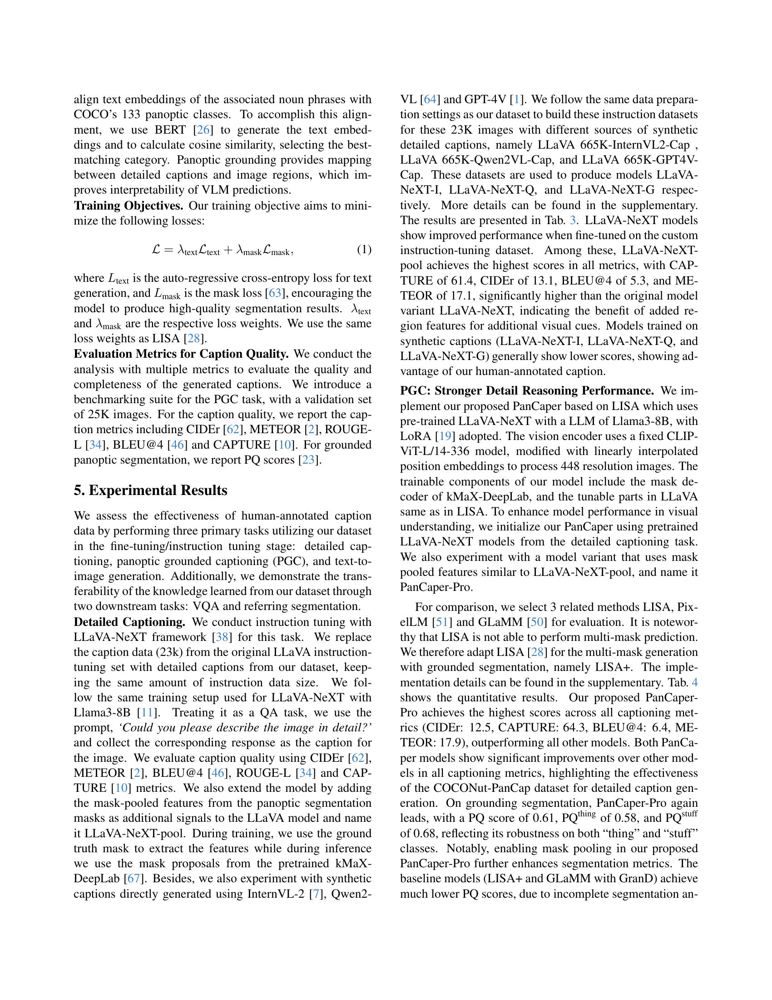

 


 2502.02589 
 Xueqing Deng et el. 
 
 🤗 2025-02-05 
 



↗ arXiv


↗ Hugging Face


↗ Papers with Code


### TL;DR



많은 최신 멀티모달 기반 모델들은 웹에서 수집한 낮은 질의 텍스트-이미지 데이터셋에 의존해 왔습니다. 이러한 데이터셋들은 품질이 낮고, 자세한 설명이 부족하며, 정확성이 떨어지는 경향이 있습니다.  반면, 사람이 주석을 단 데이터셋들은 고품질이지만 규모가 작습니다. 이러한 문제를 해결하기 위해, 이 논문에서는 COCO 데이터셋을 기반으로 하여, **고품질의 상세한 캡션과 밀집된 의미론적 분할 마스크**를 결합한 새로운 COCONut-PanCap 데이터셋을 제시합니다. 

본 논문의 방법은 **상세한 캡션을 생성하기 위해 VLM을 활용하는 효율적인 주석 접근 방식**을 제시합니다. 이는 COCO 데이터셋의 각 세분화 영역에 대한 **VLM 생성 초안을 사람이 교정하는 방식**을 사용하여, 고품질의 이미지 캡션을 생성하면서 인력 투입을 최소화합니다.  **밀집된 의미론적 분할 마스크와 결합**하여, 이미지 마스크와 객체 참조 간의 정확한 대응 관계를 유지합니다.  결과적으로 생성된 COCONut-PanCap 데이터셋은 **다양한 시각-언어 모델링 작업**에서 **성능 향상**을 가져옵니다.



#### Key Takeaways


 COCONut-PanCap 데이터셋은 고품질의 상세한 이미지-텍스트 주석을 제공합니다. 



 제안된 데이터셋은 다양한 시각-언어 모델링 작업(이미지 이해 및 생성)에서 성능을 크게 향상시킵니다. 



 본 연구는 대규모 데이터셋의 한계와 기존 데이터셋의 낮은 품질을 극복하는 새로운 방법을 제시합니다. 


#### Why does it matter?
본 논문은 **고품질의 상세한 이미지-텍스트 주석**에 대한 요구를 해결하며, 다양한 시각적 언어 모델링 작업에서 성능을 크게 향상시키는 새로운 **COCONut-PanCap 데이터셋**을 제시합니다. 이는 **이미지 이해 및 생성 모델**을 개선하고 향후 연구를 위한 새로운 방향을 제시하여 **다양한 시각-언어 모델링 분야** 연구자들에게 중요한 의미를 갖습니다.  **대규모 데이터셋의 한계와 기존 데이터셋의 낮은 품질**을 극복하기 위한 노력은 여러 분야의 연구자들에게 영향을 미칠 것입니다.

------
#### Visual Insights

> 🔼 그림 1은 COCONut-PanCap 데이터셋을 보여줍니다. 상단에는 밀집된 전체 영역 분할 마스크를 기반으로 세부적인 캡션을 제공하는 COCONut-PanCap 데이터셋의 특징을 보여줍니다. 하단에는 세부적인 캡션 생성, 전체 영역 분할 기반 캡션, 이미지 텍스트 생성 등 다양한 세부적인 이해 및 생성 작업을 지원하는 COCONut-PanCap의 기능을 보여줍니다. 또한, 시각적 질의응답(VQA) 및 참조 분할과 같은 여러 하위 작업도 지원합니다.  전체적으로, 이 그림은 COCONut-PanCap 데이터셋이 이미지 이해 및 생성 작업에 사용되는 다양한 기능을 제공함을 시각적으로 보여줍니다.
> 

> 
read the caption

> Figure 1:  COCONut-PanCap Dataset. Top: The proposed COCONut-PanCap dataset features detailed captions grounded with dense panoptic segmentation masks. Bottom: COCONut-PanCap supports various fine-grained understanding and generation tasks, including detailed captioning, panoptic segmentation grounded caption, and text-to-image generation. The dataset also facilitates several downstream tasks, such as visual question-answering (VQA) and referring segmentation.
> 


| Dataset Name | Image Source | Sample | Annotated by | Avg. Words | Masks |
|---|---|---|---|---|---| 
| BLIP-LCS | LAION [53], CC [4], SBU [45] | 558K | BLIP [30] | 54 | ✗ |
| DenseFusion1M [32] | LAION [53] | 1,059K | Vision Specialist Models | 191 | ✗ |
| LLaVA-Recap118K [38] | COCO [35] | 118K | LLaVA-NEXT [38] | 186 | ✗ |
| LLaVA-Details-23K [37] | COCO [35] | 23K | GPT4 | 105 | ✗ |
| ShareGPT4V [5] | LAION [53], CC [4], SBU [45], COCO [35] etc. | 100K | GPT4-Vision | 162 | ✗ |
| ShareGPT4V-PT [5] | LAION [53], CC [4], SBU [45], COCO [35] etc. | 1,246K | Share-Captioner [5] | 144 | ✗ |
| PixelLM-MUSE [51] | LVIS [17] | 246K | GPT4-Vision | - | 3.7‡ |
| Osprey [69] | COCO [35] | 724K | GPT4-Vision | - | - |
| GLaMM-GCG [50] | RefCOCOg [40],PSG [65],Flick30K [47] | 214K | Vision Specialist Models | 128 | 3.6 |
| COCO-caption [6] | COCO [35] | 118K | Human | 11 | ✗ |
| DCI [61] | SA-1B [24] | 8K | Human | 144 | ✗ |
| DOCCI [44] | DOCCI [44] | 9.6K | Human | 136 | ✗ |
| IIW [15] | WebLI [15] | 8.5K | Human | 217 | ✗ |
| COCONut-PanCap (ours) | COCO [35] | 118K | Human | 203 | 13.2 |

> 🔼 표 1은 다양한 이미지 캡션 데이터셋의 비교 분석 결과를 보여줍니다. 제안된 COCONut-PanCap 데이터셋은 평균 단어 수 기준으로 두 번째로 자세한 캡션을 제공하며, 사람이 직접 상호작용하며 주석을 달았기 때문에 높은 품질을 자랑합니다. 또한, 평균 분할 마스크 수에서 1위를 차지하여 고밀도 분할 마스크를 제공합니다. 참고로, 참조 분할(Referring Segmentation)의 마스크 수는 질문 답변 형식에서 대상만 계산합니다. '샘플'은 수집된 주석의 수를 나타내며, Osprey와 같은 영역 수준 데이터셋에서는 하나의 이미지에 여러 개의 주석이 있을 수 있습니다.
> 

> 
read the caption

> Table 1:  Dataset (training set) Comparison.  Our proposed COCONut-PanCap dataset stands out for its detailed (2nd highest in Average Words), high-quality (human interactive annotated) captions and high-density segmentation masks (1st in Average Masks). ‡ denotes the mask number for referring segmentation which only counts the targets in QA format. Note that “Samples” means the number of collected annotations, where there may exist one image with multiple different annotation, i.e., in region-level datasets like Osprey.
> 

### In-depth insights

#### High-Quality Captions
고품질 자막은 **정확성, 상세함, 일관성**을 갖추어야 합니다. 단순히 이미지의 내용을 나열하는 수준을 넘어, **객체 간의 관계, 공간적 배치, 행위, 속성** 등을 세밀하게 묘사하여 이미지에 대한 풍부한 이해를 제공해야 합니다.  **인간의 개입**을 통해 생성된 자막은 기계가 생성한 자막보다 훨씬 더 높은 품질을 보장하며, **모호함이나 오류**를 최소화합니다.  **다양한 시각적 요소들**을 정확하게 반영하는 고품질 자막은 다운스트림 작업(예: 질의응답, 참조 분할)의 성능 향상에 크게 기여합니다. 특히, **영상 이해 및 생성 모델**의 학습에 있어 고품질 자막은 필수적이며, **모델 성능 평가**에도 중요한 역할을 수행합니다.  **대규모 고품질 자막 데이터셋**의 구축은 향후 멀티모달 연구 발전에 중요한 토대를 마련할 것입니다.

#### PGC Task Benchmark
본 논문에서 제시된 PGC(Panoptic Segmentation and Grounded Captioning) 과제 벤치마크는 **영상 이해 및 생성 모델의 성능을 종합적으로 평가**하기 위한 핵심 요소입니다.  기존의 단순한 이미지 캡션 생성을 넘어, **세밀한 영역별 캡션과 전체적인 패노라마 분할 정보를 결합**하여 보다 정확하고 풍부한 영상 이해 및 설명 능력을 평가합니다.  이를 통해, **단순한 객체 인식 수준을 넘어 영상 내 객체 간의 관계, 공간적 배치, 그리고 세부적인 속성까지 고려**하는 모델의 발전을 도모할 수 있습니다.  **다양한 하위 과제(VQA, Referring Segmentation 등)에서의 성능까지 평가**함으로써, 모델의 일반화 능력과 실제 응용 가능성을 측정하는 포괄적인 벤치마크 역할을 수행합니다.  **COCONut-PanCap 데이터셋과의 긴밀한 연동**을 통해, 벤치마크의 신뢰도와 실용성을 더욱 높였습니다. 따라서, PGC 과제 벤치마크는 향후 **다중 모달 모델 연구의 중요한 발전 방향**을 제시하는 동시에, **새로운 연구 및 모델 개발에 대한 촉매제** 역할을 할 것으로 기대됩니다.

#### VLM-Based Annotation
**VLM 기반 주석 방식**은 대규모의 고품질 이미지-텍스트 데이터셋을 구축하는 데 있어 효율성을 극대화하는 혁신적인 접근 방식입니다.  **기존의 수작업 방식의 한계를 극복하기 위해** 사전 훈련된 VLM(Vision-Language Model)을 활용하여 이미지에 대한 초기 주석 초안을 생성합니다. 이는 **방대한 양의 데이터를 빠르게 처리**할 수 있게 하여 시간 및 비용을 절감하는 데 크게 기여합니다.  **VLM이 생성한 초안은 전문가 또는 일반 사용자에 의해 검토 및 수정되는 과정**을 거쳐 정확성과 완성도를 높입니다.  이러한 방식은 **수작업만으로는 달성하기 어려운 규모의 고품질 데이터셋 구축**을 가능하게 하며, 이는 다양한 비전-언어 모델의 성능 향상에 직접적으로 기여할 수 있습니다.  **하지만 VLM의 성능에 대한 의존도가 높기 때문에** VLM의 편향성이나 한계점이 주석 데이터에 반영될 가능성이 존재한다는 점을 고려해야 합니다.  따라서 **VLM의 품질 관리 및 주석 데이터 검증 과정을 철저히 수행**하는 것이 중요하며,  **다양한 VLM을 활용하여 주석의 객관성을 확보**하는 연구도 필요합니다.

#### Dataset Limitations
본 논문에서 제시된 데이터셋의 한계는 크게 **데이터 크기**와 **다양성**의 부족으로 볼 수 있습니다.  **COCO 데이터셋을 기반**으로 하기 때문에 COCO 데이터셋 자체의 한계를 그대로 가지고 있으며, 특히 **세분화된 주석**의 수가 제한적일 수 있다는 점이 우려됩니다. 또한, 주석 작업에 **사람의 개입**이 필요하다는 것은 대규모 데이터셋을 구축하는 데 있어 비용 및 시간 측면의 어려움을 야기합니다.  **합성 데이터**를 활용하는 방안이 제시되었지만, 이는 **합성 데이터 자체의 한계**와 **인간의 주석 작업**을 완전히 대체할 수 없다는 점에서 여전히 개선의 여지가 있습니다. 따라서, 향후 연구에서는 더욱 **다양하고 풍부한 데이터**를 확보하고, **주석의 정확도**를 높이기 위한 노력이 필요하며, **데이터 수집 및 주석 방법론**의 개선이 중요한 과제로 남아 있습니다.  **대규모 고품질 데이터셋** 구축을 위한 효율적인 전략 모색이 앞으로의 연구 방향을 결정짓는 중요한 요소가 될 것입니다.

#### Future Work
본 논문에서 제시된 COCONut-PanCap 데이터셋은 고품질의 상세한 캡션과 정확한 패노픽 분할 마스크를 제공하지만, **데이터셋의 규모가 상대적으로 작다는 점**이 한계로 지적될 수 있습니다.  향후 연구는 **데이터셋의 규모를 확장**하여 더욱 다양한 시각적, 언어적 데이터를 포함하는 것을 목표로 해야 합니다. 또한, **다양한 downstream task에 대한 성능 평가**를 보다 심도 있게 수행하고, 이를 통해 모델의 일반화 능력 및 견고성을 향상시키는 방안을 모색해야 합니다.  **합성 데이터를 활용한 데이터 증강** 기법을 통해 데이터셋의 규모를 효율적으로 확장하고, 고품질의 주석을 확보하는 전략을 고려할 수 있습니다. 마지막으로, **다양한 VLM 아키텍처 및 훈련 전략에 대한 호환성 및 적응성을 높이는 연구**가 필요합니다.  본 연구에서 제시된 방식을 다른 모달리티 데이터나 작업에도 적용 가능한지에 대한 추가적인 연구를 통해 COCONut-PanCap 데이터셋의 활용 범위를 넓히는 것도 중요한 과제입니다.

### More visual insights

More on figures

> 🔼 그림 2는 논문에서 제시된 주석 추가 파이프라인을 보여줍니다. 먼저, 사람이 직접 주석을 단 전경 분할 마스크가 주어진 입력 이미지에 오버레이됩니다. 이때, set-of-marks [66] 시각화 기법을 사용하여 비전 언어 모델(VLM)을 프롬프트합니다. VLM이 초기 초안을 생성한 후에는 사람이 직접 편집하고 검증하는 과정을 거칩니다. 최종적으로, 주석이 달린 메타데이터는 지시 조정 또는 미세 조정 단계에서 다양한 작업을 위한 데이터셋을 구성하는 데 사용됩니다.  이 과정을 통해 보다 정확하고 상세한 이미지 캡션을 얻을 수 있으며, 다양한 다운스트림 작업에 활용될 수 있습니다.
> 

> 
read the caption

> Figure 2: Annotation Pipeline. Given an input image, human-annotated panoptic segmentation masks are overlaid using set-of-marks [66] visualization techniques to prompt the vision-language model (VLM). After generating an initial draft, human effort is investigated for editing and verification. Finally, the annotated metadata will be formatted to construct the datasets for various tasks at instruction tuning or finetuning stage.
> 

> 🔼 그림 3은 논문에서 제안하는 세분화된 캡션 생성을 위한 주석 라벨링 과정을 보여줍니다.  오른쪽(Round 1)은 결합된 set-of-marks 이미지를 입력으로 주어진 초기 응답과 사람이 수정한 내용을 보여줍니다. 사람이 수정한 내용이 반영된 최종 결과는 왼쪽(Round 2)에 표시되는데, 여기에는 패노라마 분할 마스크를 기반으로 생성된 세분화된 캡션이 포함되어 있습니다.
> 

> 
read the caption

> Figure 3: Designed Prompt Template. By giving the concatenated set-of-marks images, the right side (round-1) shows the initial response and the corresponding human edits. Once finalized by humans, these edits will be merged into a single detailed caption grounded with panoptic segmentation masks, as shown in the left side (round-2).
> 

> 🔼 그림 4는 COCONut-PanCap 데이터셋에서 추출된 명사들의 빈도를 보여줍니다.  가장 빈번하게 나타나는 상위 10개 명사는 사람, 테이블, 방, 거리, 식사, 남자, 사람(person), 자동차, 의자, 그리고 들판입니다. 이는 데이터셋에 포함된 이미지들이 다양한 실내외 환경과 사람, 사물 등을 묘사하고 있음을 시사합니다.  각 명사의 빈도수는 수직 막대 그래프로 표현되어 있으며, 빈도가 높을수록 막대의 길이가 길어집니다. 이 그래프를 통해 COCONut-PanCap 데이터셋의 주요 특징과 이미지 콘텐츠의 분포를 파악할 수 있습니다.
> 

> 
read the caption

> Figure 4: Frequency of Extracted Nouns from the COCONut-PanCap Dataset. The top 10 most frequent nouns are: people, table, room, street, dining, man, person, cars, chairs, and field.
> 

> 🔼 본 논문의 그림 5는 사용자 연구를 통해 캡션의 질을 평가한 결과를 보여줍니다. 1,000개의 캡션 샘플에 대해 인간 평가자들이 무작위로 평가를 수행하였으며, 본 논문에서 제시된 데이터셋(COCONut-PanCap)에서 생성된 캡션에 대한 선호도가 훨씬 높았음을 보여줍니다.
> 

> 
read the caption

> Figure 5: Caption Quality via User Study. The study involved human evaluators assessing a random sample of 1,000 captions, with a strong preference shown for captions from our dataset.
> 

> 🔼 그림 6은 합성 데이터와 사람이 작성한 주석의 비율을 달리하여 LLaVA-NeXT의 상세 자막 생성 성능과 SD3-medium의 텍스트 조건 이미지 생성 성능을 평가한 결과를 보여줍니다. CAPTURE 지표는 LLaVA-NeXT의 상세 자막 생성 성능을, FID 지표는 SD3-medium의 텍스트 조건 이미지 생성 성능을 평가하는 데 사용되었습니다.  그래프는 합성 데이터 비율이 감소하고 사람이 작성한 주석 비율이 증가함에 따라 두 모델의 성능이 향상되는 것을 보여줍니다.
> 

> 
read the caption

> Figure 6:  Varying Synthetic and Human-Annotation Ratios. CAPTURE is used to evaluate the performance of LLaVA-NeXT on detailed captioning, while FID assesses the performance of SD3-medium on text-conditioned image generation.
> 

> 🔼 그림 7(a)는 원 논문의 LLaVA-NeXt-AnyRes 아키텍처를 보여줍니다.  고해상도 이미지와 표현을 유지하면서 연산 비용을 관리하기 위해 그리드 기반 구성을 사용합니다. 패치 수준과 이미지 수준 특징을 추출하여 결합한 후 LLM에 전달하는 방식입니다.  이 방식은 성능 효율성과 운영 비용 간의 균형을 맞추는 데 효과적이지만, 개체의 일부가 다른 패치로 나뉘는 경우(예: 개의 머리 일부가 여러 패치로 나뉨) 불완전한 특징 추출이 발생할 수 있습니다.
> 

> 
read the caption

> (a) LLaVA-NeXt-AnyRes
> 

> 🔼 그림 7(b)는 논문의 A.1절 'Detailed Captioning' 에서 제안된 LLaVA-NeXt-pool의 구조를 보여줍니다. 기존 LLaVA-NeXt(그림 7(a))는 이미지를 패치 단위로 나누어 처리하는 반면, LLaVA-NeXt-pool은 COCONut-PanCap 데이터셋의 패노프틱 분할 마스크를 활용하여 객체의 세부 정보를 보존하면서 특징을 추출합니다. 이를 통해 개별 객체에 대한 특징 추출이 더욱 완벽해지고, 고해상도 이미지에서도 성능 저하 없이 세부 정보를 효과적으로 처리할 수 있습니다.  개선된 특징 추출 방식은 개별 객체의 특징을 더욱 정확하게 포착하여, 특히 고해상도 이미지에서의 성능 향상에 기여합니다.
> 

> 
read the caption

> (b) our LLaVA-NeXt-pool
> 

> 🔼 그림 7은 논문에서 제안하는 새로운 LLaVA-NeXt-pool 모델과 기존 LLaVA-NeXt 모델의 비교를 보여줍니다. 기존 LLaVA-NeXt는 이미지를 패치 단위로 나누어 처리하는 반면, 제안된 LLaVA-NeXt-pool은 패치 단위 처리의 단점을 극복하기 위해 panoptic segmentation 마스크를 활용하여 객체의 세부 정보를 더 잘 유지하면서 특징을 추출합니다. 이를 통해 고해상도 이미지의 세부 정보를 효과적으로 처리하고 성능과 효율성을 동시에 높일 수 있습니다. 그림은 두 모델의 구조적 차이를 시각적으로 보여주고, 제안된 모델의 장점을 강조합니다.
> 

> 
read the caption

> Figure 7: Comparison of LLaVA-NeXt and our proposed LLaVA-NeXt-pool.
> 

> 🔼 그림 8은 논문에서 제안하는 PanCaper 모델의 아키텍처를 보여줍니다.  PanCaper는 사전 훈련된 kMaX-DeepLab [67]의 비전 인코더를 백본으로 사용하여 패노픽 분할에 필수적인 고밀도 특징을 효과적으로 추출합니다.  모델은 비전 백본, 마스크 디코더, 다중 모드 LLM의 세 가지 주요 구성 요소로 이루어져 있습니다.  비전 백본은 이미지에서 고밀도 시각적 특징을 추출하고, 마스크 디코더는 이러한 특징과 LLM의 출력을 사용하여 패노픽 분할 마스크를 생성합니다. 다중 모드 LLM은 이미지와 마스크 정보를 처리하여 객체에 대한 세분화된 설명을 생성하는 역할을 합니다. 이러한 구성 요소들의 상호작용을 통해 PanCaper는 이미지의 패노픽 분할과 정확한 캡션 생성을 동시에 수행할 수 있습니다.
> 

> 
read the caption

> Figure 8: Architecture of PanCaper. We utilize a pretrained vision encoder from kMaX-DeepLab [67] as our vision backbone, which effectively extracts dense features essential for panoptic segmentation.
> 

> 🔼 그림 9는 논문에서 제시된 COCONut-PanCap 데이터셋의 패노픽 기반 접지화된 캡션 시각화 예시입니다. 그림에는 다양한 장면의 이미지와 각 영역에 대한 상세한 설명이 담긴 캡션이 함께 제시되어 있습니다.  각 이미지는 패노픽 분할 마스크를 이용하여 객체를 정확하게 구분하고 있으며, 캡션은 해당 마스크에 기반하여 생성되어 객체와 시각적 요소 간의 정확한 대응 관계를 보여줍니다. 이를 통해 COCONut-PanCap 데이터셋이 이미지의 시각적 이해와 캡션 생성 모두에 효과적으로 활용될 수 있음을 보여줍니다.
> 

> 
read the caption

> Figure 9:  Visualization of the Panoptic Grounded Caption. Our annotated captions ground the panoptic segmentation masks.
> 

> 🔼 그림 10은 COCONut-PanCap 데이터셋의 패노라마 기반 접지 캡션의 시각화 예시입니다. 이 그림에서는 각 이미지에 대해 사람이 주석을 단 패노라마 분할 마스크에 기반한 자세한 캡션을 보여줍니다.  이미지의 각 영역에 대한 자세한 설명과 함께 이미지 내의 개체 및 영역에 대한 정확한 참조를 제공합니다.  이를 통해 시각적 이해와 자연어 처리 모델의 성능 향상에 기여합니다.
> 

> 
read the caption

> Figure 10:  Visualization of the Panoptic Grounded Caption. Our annotated captions ground the panoptic segmentation masks.
> 

> 🔼 본 그림은 논문의 사용자 연구에서 GPT-4V 어노테이션과 COCONut-PanCap 어노테이션이 일치하는 간단한 사례들을 보여줍니다.  그림은 세 가지 이미지와 각 이미지에 대한 두 가지 캡션(COCONut-PanCap과 GPT-4V가 생성한 캡션)을 제시하며, 각 캡션의 차이점과 유사점을 비교 분석하여 어노테이션 일치 여부를 판단하는 사용자 연구의 일부분을 시각적으로 보여주는 예시입니다. 각 이미지는 제브라, 기린, 오토바이를 보여주며, COCONut-PanCap 캡션은 주로 이미지 내 객체와 속성을 간결하게 기술하는 반면, GPT-4V 캡션은 더욱 풍부하고 상세한 설명을 제공합니다. 이러한 비교를 통해 사용자 연구에서 어노테이션 일치 기준을 설정하는 과정과 그 결과를 이해할 수 있습니다.
> 

> 
read the caption

> Figure 11:  Tier Examples for the User Study. Our COCONut-PanCap annotations are tied with GPT-4V annotations for some simple cases.
> 

More on tables


| Dataset Name | Samples | Avg. Words | Caption | T2I | Grd. Seg. |
|---|---|---|---|---|---| 
| COCO-30K [6] | 30,000 | 11 | ✓ | ✓ | ✗ |
| DOCCI-test [44] | 5,000 | 136 | ✓ | ✓ | ✗ |
| IIW-test [15] | 445 | 217 | ✓ | ✓ | ✗ |
| GenEval [16] | 553 | 8 | ✗ | ✓ | ✗ |
| T2I-CompBench val [20] | 2400 | 9 | ✗ | ✓ | ✗ |
| GLaMM-GCG val-test [50] | 2,000 | 128 | ✓ | ✗ | ✓ |
| COCONut-PanCap val (ours) | 25,000 | 233 | ✓ | ✓ | ✓ |
> 🔼 표 2는 COCONut-PanCap 검증 세트에 대한 비교 분석 표입니다.  기존 데이터셋과 비교하여 COCONut-PanCap 검증 세트가 자세한 캡션을 제공하고 이미지 캡션 생성, 텍스트-이미지 생성, 그리고 기반 분할 등 다양한 다중 모드 작업을 지원함을 보여줍니다.  즉,  다양한 멀티모달 작업에 활용될 수 있는 풍부한 데이터셋임을 강조합니다.
> 

> 
read the caption

> Table 2:  Dataset (evaluation set) Comparison. Our COCONut-PanCap validation set provides detailed captions and supports multiple multi-modal tasks, including image captioning, text-to-image generation (T2I), and grounded segmentation (Grd. Seg.).
> 


| Training recipe | Method | Pretrain Dataset | Instruction-tuning dataset | Mask pooled | CAPTURE | CIDEr | BLEU@4 | METEOR | ROUGE-L |
|---|---|---|---|---|---|---|---|---|---| 
| finetune | LLaVA-NeXT* | LAION-CC-SBU | LLaVA 665K | ✗ | 55.4 | 10.8 | 4.2 | 13.2 | 23.1 |
| finetune | LLaVA-NeXT | LAION-CC-SBU | LLaVA 665K-COCONut-PanCap | ✗ | 58.7 | 11.2 | 4.8 | 16.2 | 24.6 |
| finetune | LLaVA-NeXT-pool | LAION-CC-SBU | LLaVA 665K-COCONut-PanCap | ✓ | 61.4 | 13.1 | 5.3 | 17.1 | 26.8 |
| finetune | LLaVA-NeXT-I | LAION-CC-SBU | LLaVA 665K-InternVL2-Cap | ✗ | 53.9 | 9.4 | 4.4 | 11.5 | 21.4 |
| finetune | LLaVA-NeXT-Q | LAION-CC-SBU | LLaVA 665K-Qwen2VL-Cap | ✗ | 55.4 | 8.9 | 4.6 | 12.9 | 22.5 |
| finetune | LLaVA-NeXT-G | LAION-CC-SBU | LLaVA 665K-GPT4V-Cap | ✗ | 56.2 | 9.6 | 4.7 | 13.3 | 22.8 |
> 🔼 표 3은 COCONut-PanCap 검증 세트에서 평가된 자막 벤치마크 결과를 보여줍니다. 표에 따르면, 지시 데이터 세트의 데이터 양은 동일하게 유지되고 자세한 캡션의 출처만 다릅니다. 총 23,000개의 이미지가 자세한 캡션을 가지고 있습니다.  LLaVA-NeXT 기본 모델과 비교하여, COCONut-PanCap 데이터셋으로 미세 조정된 모델의 성능 향상을 보여줍니다. 특히,  Panoptic Segmentation 마스크를 추가한 LLaVA-NeXT-pool 모델은 다른 모델들보다 성능이 훨씬 뛰어남을 알 수 있습니다.  합성 캡션으로 훈련된 모델들은 인간이 작성한 캡션으로 훈련된 모델보다 성능이 낮은 것으로 나타났습니다.
> 

> 
read the caption

> Table 3: Caption Benchmark Results Evaluated on Our COCONut-PanCap Val Set. Note that the amount of data in the instruction dataset remains the same; only the sources of the detailed captions vary, with a total of 23K images that have detailed captions.
> 


| Method | Pretrain dataset | Instruction dataset | Mask pooled | CAPTURE | CIDEr | BLEU@4 | METEOR | PQ | PQthing | PQstuff |
|---|---|---|---|---|---|---|---|---|---|---|
| LISA+ * | LAION-CC-SBU | GranDf | ✗ | 46.2 | 6.6 | 3.8 | 9.8 | 0.43 | 0.41 | 0.45 |
| LISA+ | LAION-CC-SBU | COCONut-PanCap (ours) | ✗ | 57.9 | 8.1 | 4.9 | 13.8 | 0.50 | 0.49 | 0.44 |
| GLaMM GCG * | LAION-CC-SBU+GranD | GranDf | ✗ | 43.2 | 6.5 | 3.6 | 10.6 | 0.27 | 0.35 | 0.21 |
| GLaMM GCG | LAION-CC-SBU+GranD | COCONut-PanCap (ours) | ✗ | 56.8 | 7.8 | 5.2 | 14.3 | 0.55 | 0.54 | 0.46 |
| PanCaper (ours) | LAION-CC-SBU | COCONut-PanCap (ours) | ✗ | 62.6 | 12.0 | 5.8 | 15.4 | 0.56 | 0.55 | 0.66 |
| PanCaper-Pro (ours) | LAION-CC-SBU | COCONut-PanCap (ours) | ✓ | 64.3 | 12.5 | 6.4 | 17.9 | 0.61 | 0.58 | 0.68 |
> 🔼 표 4는 COCONut-PanCap 검증 세트에서 수행된 공동 전경 분할 및 근거 기반 캡션 생성(PGC) 결과를 보여줍니다.  표는 다양한 모델의 성능을 비교하여,  PanCaper 모델이 다른 PGC 모델들에 비해  CIDEr, CAPTURE, BLEU@4, METEOR 및 PQ 점수에서 훨씬 더 나은 성능을 보임을 보여줍니다.  * 표시는 재현된 결과임을 나타냅니다.  PanCaper-Pro 모델은 마스크 풀링 기능을 추가하여 더욱 향상된 성능을 보여줍니다. 이는 COCONut-PanCap 데이터셋이 PGC 작업에 매우 효과적임을 시사합니다.
> 

> 
read the caption

> Table 4: Joint Panoptic Segmentation and Grounded Captioning (PGC) on COCONut-PanCap Val Set. * denotes reproduced results.
> 


| Training dataset | Evaluation dataset | FID ↓ | FDdinov2 ↓ | CLIPScore ↑ |
|---|---|---|---|---|
| SD3 PT dataset [12] | DOCCI test set [44] | 30.2 | 345 | 74.9 |
| COCO-caption [6] |  | 27.6 | 321 | 76.8 |
| DOCCI [44] |  | 22.1 | 300 | 77.8 |
| COCONut-PanCap (ours) |  | 21.4 | 290 | 77.9 |
| SD3 PT dataset [12] |  | 31.8 | 300 | 73.8 |
| COCO-caption [6] | COCONut-PanCap | 28.0 | 294 | 74.0 |
| DOCCI [44] | val set (ours) | 24.3 | 267 | 75.1 |
| COCONut-PanCap (ours) |  | 23.1 | 260 | 77.3 |
> 🔼 표 5는 텍스트 조건부 이미지 생성에 대한 벤치마크 결과를 보여줍니다. Stable Diffusion 3(SD3) 미디엄 모델을 COCO-Caption(짧은 버전), DOCCI, 그리고 연구팀이 제작한 COCONut-PanCap 데이터셋을 사용하여 미세 조정했으며, DOCCI 테스트 세트[44]와 연구팀의 COCONut-PanCap 검증 세트에서 평가했습니다. 'SD3 PT 데이터셋'은 SD3의 사전 훈련 데이터셋을 나타내며, 해당 행은 SD3의 제로샷 평가 결과를 보여줍니다.
> 

> 
read the caption

> Table 5: Benchmark Results on Text Conditioned Image Generation. Stable-Diffusion-3 (SD3) medium is finetuned with COCO-Caption (short), DOCCI and our COCONut-Panoptic and evaluated on DOCCI test set [44] and our COCONut-PanCap val set. ‘SD3 PT dataset’ denotes the pretraining dataset of SD3, and thus the rows correspond to zero-shot evaluation of SD3.
> 


|       | w/o FT | COCO-caption [6] | DOCCI [44] | COCONut-PanCap |
| :---- | :----: | :----: | :----: | :----: |
| color attribution | 0.37 | 0.34 | 0.38 | 0.40 |
| colors | 0.73 | 0.70 | 0.74 | 0.75 |
| position | 0.33 | 0.30 | 0.36 | 0.36 |
| counting | 0.65 | 0.64 | 0.65 | 0.70 |
| single object | 0.96 | 0.94 | 0.95 | 0.96 |
| two objects | 0.80 | 0.78 | 0.81 | 0.89 |
| overall score | 0.64 | 0.62 | 0.65 | 0.68 |
> 🔼 표 6은 GenEval [16] 데이터셋을 사용하여 SD3-medium (텍스트-이미지 생성 모델)을 여러 데이터셋으로 미세 조정했을 때의 효과를 보여줍니다.  'w/o FT'는 어떤 데이터셋으로도 미세 조정하지 않은 모델(즉, 제로샷 테스트)을 나타냅니다. 표는 색상 지정, 색상, 위치, 계산, 단일 개체 및 두 개체와 같은 다양한 시각적 속성을 평가하는 GenEval 지표에 따른 성능을 보여줍니다. 이를 통해 다양한 데이터셋으로 미세 조정하는 것이 GenEval 작업에서 모델 성능을 향상시키는 데 어떻게 영향을 미치는지 비교 분석할 수 있습니다.
> 

> 
read the caption

> Table 6:  Effects of Fine-tuning the SD3-medium (T2I model) with Different Datasets on GenEval [16]. w/o FT denotes the model is not finetuned with any datasets (i.e., zero-shot testing).
> 


| Method | LLM | Instruction-tuning Dataset | MM-Vet | Seed-IMG | MMBench-en | TextVQA | POPE | MME |
|---|---|---|---|---|---|---|---|---|
| LLaVA-NeXT * | Llama3-8B | orginal LLaVA 665K [38] | 43.5 | 70.1 | 71.4 | 68.9 | 85.4 | 1523 |
| LLaVA-NeXT-20K | Llama3-8B | LLaVA 665K-COCONut-PanCap-20K | 44.1 | 72.5 | 73.6 | 69.8 | 86.1 | 1552 |
| LLaVA-NeXT-50K | Llama3-8B | LLaVA 665K-COCONut-PanCap-50K | 44.6 | 73.1 | 74.2 | 70.0 | 87.1 | 1600 |
| LLaVA-NeXT-Full | Llama3-8B | LLaVA 665K-COCONut-PanCap-118K | 45.5 | 74.3 | 75.1 | 70.7 | 87.9 | 1612 |
| LLaVA-1.5 | Vicuna-7B | LLaVA 665K-ShareGPT4V-100K | 37.8 | 67.4 | 70.5 | 64.6 | 84.7 | 1519 |
| LLaVA-1.5 | Vicuna-7B | LLaVA 665K-COCONut-PanCap-20K | 38.5 | 67.7 | 70.9 | 64.5 | 84.9 | 1521 |
> 🔼 표 7은 VQA(Visual Question Answering) 작업에 대한 벤치마크 결과와 ablation study를 보여줍니다.  본 연구는 instruction tuning에 사용되는 데이터셋에 상세한 캡션 데이터를 추가함으로써 모델 성능 향상을 보여주는 실험을 진행했습니다. 표에는 다양한 VQA 벤치마크(MM-Vet, Seed-IMG, MMBench-en, TextVQA, POPE, MME)에서 여러 모델 변형(LLaVA-NeXT, LLaVA-NeXT-20K, LLaVA-NeXT-50K, LLaVA-NeXT-Full, LLaVA-1.5)의 성능을 비교 분석한 결과가 제시되어 있습니다.  특히, 2만 개의 사람이 직접 작성한 데이터만으로도 10만 개의 합성 데이터와 비슷한 성능을 달성할 수 있음을 보여줍니다. * 표시는 재현된 결과를 나타냅니다.
> 

> 
read the caption

> Table 7: Benchmark Results and Ablation Study on VQA. By adding extra detailed caption data for instruction tuning, the models show increased improvement. * denotes reproduced results. Using only 20K human labeled data can still achieve comparable performance to 100K synthetic data.
> 


| Method | refCOCO val | refCOCO testA | refCOCO testB | refCOCO+ val | refCOCO+ testA | refCOCO+ testB | refCOCOg val | refCOCOg test |
|---|---|---|---|---|---|---|---|---|
| GLaMM* [50] | 77.5 | 79.2 | 74.9 | 71.3 | 74.7 | 61.5 | 71.3 | 71.9 |
| PixelLM [51] | 73.0 | 76.5 | 68.2 | 66.3 | 71.7 | 58.3 | 69.3 | 70.5 |
| LISA-7B [28] | 74.1 | 76.5 | 71.1 | 62.4 | 67.4 | 56.5 | 66.4 | 68.5 |
| PanCaper+ | 74.5 | 76.7 | 69.9 | 69.9 | 73.4 | 59.5 | 69.8 | 70.6 |
| PanCaper+ + COCONut-PanCap | 76.2 | 77.1 | 72.3 | 70.5 | 73.9 | 60.1 | 72.1 | 71.6 |
> 🔼 표 8은 Referring Segmentation 작업에 대한 벤치마크 결과를 보여줍니다.  표에는 다양한 방법(LISA+, PixelLM, GLaMM, PanCaper)들의 성능을 비교하여 제시하며, 각 방법의 사전 학습 데이터셋,  사용된 Instruction dataset,  그리고 Referring Segmentation 작업에 대한 성과 지표(refCOCO, refCOCO+, refCOCOg에 대한 val, testA, testB)를 보여줍니다.  GLaMM은 GranD 데이터셋을 추가적으로 사전 학습에 사용했으며, PanCaper+는 PanCaper 모델을 Referring Segmentation 작업에 맞춰 수정한 버전임을 주석에서 설명하고 있습니다.  따라서 이 표는 제안된 PanCaper 모델의 Referring Segmentation 작업 성능을 기존 방법들과 비교하여 평가하는 데 중점을 둡니다.
> 

> 
read the caption

> Table 8: Benchmark Results on Referring Segmentation. * denotes reproduced results. It is noted that GLaMM uses extra data from the GranD dataset for pretraining. + denotes our PanCaper model is adapted for referring segmentation task.
> 

### Full paper



