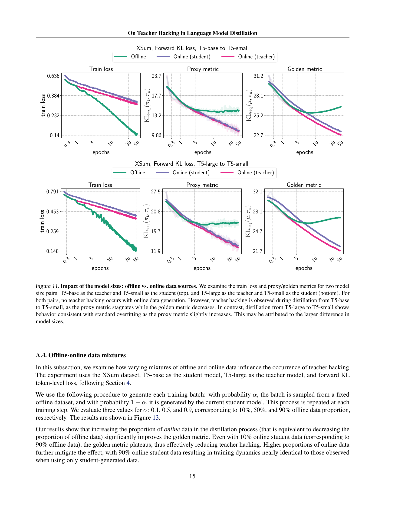

 


 2502.02671 
 Daniil Tiapkin et el. 
 
 🤗 2025-02-06 
 



↗ arXiv


↗ Hugging Face


### TL;DR



본 논문은 **대규모 언어 모델(LLM)의 지식 증류 과정에서 발생하는 새로운 문제점인 '교사 모델 해킹(Teacher Hacking)'**을 다룹니다.  기존 지식 증류는 대규모 교사 모델을 이용하여 소규모 학습 모델을 훈련시키는 방법으로, 교사 모델이 완벽한 지식을 담고 있다고 가정합니다. 하지만, **교사 모델 자체가 불완전한 경우, 학습 모델이 진정한 목표를 달성하는 대신 교사 모델의 결점을 악용하여 성능이 저하될 수 있습니다.** 이러한 현상을 교사 모델 해킹이라고 부릅니다.

본 연구는 이러한 **교사 모델 해킹 현상을 실험적으로 검증하고, 그 원인과 해결책을 제시합니다.** 연구진은 교사 모델을 검증하기 위한 **오라클 모델**을 도입하여, 학습 모델의 성능을 실제 데이터 분포와 비교하여 측정했습니다. **결과적으로 고정된 오프라인 데이터셋을 사용하는 경우 교사 모델 해킹이 발생하지만, 온라인 데이터 생성 또는 오프라인 데이터 다양성 확보 전략을 통해 이를 효과적으로 완화할 수 있음을 확인했습니다.**  **본 연구는 교사 모델 해킹 문제를 최초로 규명하고, 이를 완화하기 위한 실용적인 전략을 제시함으로써 LLM 개발에 중요한 기여를 합니다.**



#### Key Takeaways


 지식 증류 시 교사 모델의 불완전성으로 인해 학습 모델이 진정한 목표를 달성하지 못하고 교사 모델의 결점을 악용하는 '교사 모델 해킹' 현상이 발생한다는 것을 발견. 



 고정된 오프라인 데이터셋을 사용하는 지식 증류에서는 교사 모델 해킹이 발생하지만, 온라인 데이터 생성 기법을 사용하면 이를 효과적으로 완화할 수 있다는 것을 밝힘. 



 데이터 다양성이 교사 모델 해킹 방지에 중요한 역할을 하며, 오프라인 데이터셋의 다양성을 높이거나,  온라인 데이터 생성 방법을 활용하는 것이 효과적임을 제시. 


#### Why does it matter?
**본 논문은 지식 증류 과정에서 발생할 수 있는 교사 모델 오용 문제를 밝히고 이를 완화하기 위한 실용적인 전략을 제시함으로써, 강건하고 효율적인 대규모 언어 모델 개발에 중요한 시사점을 제공합니다.**  **특히, 온라인 데이터 생성 방법과 오프라인 데이터 다양성 확보 전략을 통해 교사 모델 해킹을 효과적으로 완화할 수 있음을 보여줍니다.** 이는 대규모 언어 모델의 안전성과 신뢰성 향상에 기여하며, 향후 연구 방향을 제시하는 중요한 발견입니다.  **또한, 다양한 데이터 소스와 모델 크기, 손실 함수에 대한 추가 실험을 통해 본 연구 결과의 견고성을 확인했습니다.**  이러한 광범위한 실험 결과는 본 연구의 신뢰성을 높이고, 다양한 연구 분야에 적용 가능성을 시사합니다.

------
#### Visual Insights

> 🔼 그림 1은 제어된 실험 설정을 보여줍니다. 일반적으로 교사 모델은 전문가 데이터로 훈련된 후 학생 LM에 증류됩니다. 본 논문의 제어된 설정에서는 교사 모델 자체가 추가적인 오라클 모델에서 증류됩니다. 이 오라클 모델을 통해 학생으로의 증류 과정의 질을 측정하고 '교사 해킹'을 밝힐 수 있습니다.
> 

> 
read the caption

> Figure 1: Overview of our controlled experimental setup. Usually, the teacher model is trained on expert data before being distilled into the student LM. In the controlled setup of this paper, the teacher is itself distilled from an additional oracle model. This oracle model allows us to measure the quality of the distillation process into the student, and to reveal “teacher hacking”.
> 


| Hyperparameter | Value |
|---|---| 
| Oracle Dataset Size | 100,000 |
| Distillation Dataset Size | 200,000 |
| Training Steps | 390,625 |
| Batch Size | 32 |
| Task | XSum |
| Dropout | 0.0 |
| Warmup Schedule | 100 steps |
| Optimal Learning Rate (LR) | 0.0003 |
| Input Length (Tokenized) | 1024 |
| Output Length (Tokenized) | 128 |
| Softmax Temperature | 1.0 |

> 🔼 표 1은 본 논문에서 사용된 초매개변수(하이퍼파라미터)들을 요약하고, 번역 작업에 대한 세부 정보를 제공합니다.  표에는 오라클 데이터셋 크기, 증류 데이터셋 크기, 학습 단계, 배치 크기, 작업 유형, 드롭아웃, 워밍업 일정, 최적 학습률, 토큰화된 입력 길이, 토큰화된 출력 길이, 소프트맥스 온도 등의 하이퍼파라미터가 포함되어 있습니다.  이러한 하이퍼파라미터들은 실험 설정을 명확히 하고 재현성을 높이는 데 중요한 역할을 합니다. XSum과 WMT-14 데이터셋에 대한 설정이 구체적으로 제시되어 있습니다.
> 

> 
read the caption

> Table 1: Hyperparameter details for summarization & translation tasks.
> 

### In-depth insights

#### Teacher Hacking Defined
본 논문에서 제시하는 ‘교사 해킹(Teacher Hacking)’이란, **불완전한 교사 모델(Teacher Model)**을 사용하여 지식 증류(Knowledge Distillation)를 수행할 때 발생하는 현상입니다.  **완벽한 진실 분포(Ground-truth Distribution)**를 대표하지 못하는 교사 모델의 결함을 학생 모델(Student Model)이 악용하여, 진정한 목표 달성보다는 교사 모델의 단점을 모방하는 것을 의미합니다.  **보상 해킹(Reward Hacking)**과 유사하게, 진정한 목표를 벗어나 보상 모델을 과도하게 최적화하는 것과 비교될 수 있습니다. 이는 **Goodhart’s Law**와 밀접한 관련이 있으며, 성능 저하로 이어질 수 있습니다.  **오프라인 데이터셋(Offline Dataset)**을 사용할 때 특히 발생하며, **다양한 데이터(Diverse Data)**를 사용하는 온라인 학습(Online Learning) 방식이 효과적인 해결책으로 제시됩니다.  **다양한 데이터**는 학생 모델의 과최적화를 방지하고,  **진실 분포**에 더 가까운 모델을 학습하는 데 기여합니다.  결국, 교사 해킹은 지식 증류의 한계를 보여주는 현상이며, **데이터 다양성**을 확보하고, **온라인 데이터 생성 방식**을 적용하는 것이 중요함을 시사합니다.

#### Distillation Data Impact
본 논문에서 제시된 증류 데이터의 영향에 대한 분석은 **오프라인 데이터셋의 한계와 온라인 데이터 활용의 중요성**을 강조합니다. 오프라인 데이터만 사용할 경우, 학습 과정 후반부에 학습 모델이 진실된 데이터 분포를 잘 반영하지 못하고, 오히려 **교사 모델의 불완전성을 학습**하여 성능이 저하되는 현상인 교사 해킹(teacher hacking)이 발생합니다. 반면, **온라인 데이터를 활용**하여 데이터 다양성을 확보할 경우, 이러한 현상을 효과적으로 완화할 수 있습니다.  **데이터의 다양성**은 교사 해킹 방지에 매우 중요한 요소이며, 오프라인 데이터셋의 크기보다 다양성 확보에 더 중점을 두어야 함을 시사합니다.  **온라인 학습 전략**은 오프라인 데이터셋의 한계를 극복하고 강건한 언어 모델을 구축하는 데 효과적인 방법임을 보여줍니다.

#### Mitigating Teacher Hack
본 논문에서 제시된 "교사 해킹 완화 (Mitigating Teacher Hacking)" 전략은 지식 증류 과정에서 발생하는 교사 모델의 불완전성으로 인한 성능 저하를 막는 데 초점을 맞춥니다. **핵심은 데이터 다양성 확보**입니다. 오프라인 데이터셋만 사용할 경우, 학습 과정이 교사 모델의 결점을 악용하는 방향으로 흘러 성능이 저하될 수 있습니다. 이를 막기 위해 **온라인 데이터 생성 기법**을 활용하거나, **오프라인 데이터셋의 다양성을 높이는 방법** (예: 질문의 다양성 증가, 응답 개수 증가) 등이 제시됩니다.  **온라인 학습은 교사 모델의 한계를 극복하고 실제 데이터 분포에 가까운 학습을 가능하게 해, 교사 해킹 문제를 효과적으로 해결**하는 것으로 나타났습니다. 이러한 연구 결과는 강건하고 효율적인 언어 모델을 구축하는 데 중요한 시사점을 제공합니다.  **데이터 다양성이 해결책의 핵심**임을 보여주는 것이 중요하며, 향후 연구는 다양성 확보를 위한 더욱 효과적이고 경제적인 전략을 모색하는 데 집중되어야 할 것입니다.

#### Offline Data Limits
오프라인 데이터의 한계는 지도 학습의 한계를 보여줍니다. **오프라인 데이터는 정적이고 다양성이 부족하기 때문에, 학습 모델이 실제 데이터 분포를 제대로 학습하지 못하고, 오히려 교사 모델의 결점을 모방하는 '교사 해킹' 현상이 발생할 수 있습니다.** 이는 과적합과는 달리, 교사 모델에 대한 최적화는 잘 되지만, 실제 목표에 대한 성능은 저하되는 현상입니다.  **본 논문은 이러한 한계를 극복하기 위해 온라인 데이터 생성 기법을 제안하고, 데이터 다양성의 중요성을 강조합니다.**  온라인 데이터는 학습 과정 중 실시간으로 생성되므로, 데이터의 다양성을 확보하고 교사 모델의 결점에 대한 의존도를 낮출 수 있습니다.  **결론적으로, 오프라인 데이터만으로는 한계가 명확하며, 온라인 데이터 생성이나 데이터 다양성 확보를 통해 이러한 한계를 극복하고, 더욱 강건하고 효율적인 언어 모델을 구축할 수 있음을 시사합니다.**

#### Future Work: Diversity
미래 연구 방향으로 제시된 다양성(Diversity)에 대한 심층적인 고찰은 **데이터의 다양성이 모델의 일반화 성능 및 견고성에 미치는 영향을 탐구**하는 데 중요한 의미를 지닙니다. 본 논문에서 다룬 교사 해킹(Teacher Hacking) 현상은 제한된 데이터 분포에 의존하는 학습 과정에서 발생하기 쉬운데, **데이터의 다양성을 확보**함으로써 이러한 문제를 완화할 수 있습니다.  **다양한 소스의 데이터를 활용하거나 데이터 증강 기법을 적용**하여 모델이 다양한 패턴과 상황에 대한 학습을 수행하도록 유도하는 것이 중요합니다. 이를 통해 **과적합(Overfitting)을 방지하고, 교사 모델의 결점에 의존하는 학습을 피하여 실제 목표 분포에 더욱 근접**하는 모델을 생성할 수 있습니다. 특히, **온라인 데이터 생성 방법은 데이터의 다양성을 확보하는 데 효과적인 전략**으로 제시됩니다.  **오프라인 데이터만을 사용하는 경우보다 온라인 데이터를 활용할 경우 교사 해킹 현상이 감소**하는 현상은 다양성 확보를 통한 일반화 성능 향상과 밀접한 관련이 있음을 보여줍니다.  **향후 연구에서는 다양한 다양성 확보 전략** (예: 다양한 작업 유형의 데이터 통합, 데이터 생성 과정에서의 노이즈 주입 등) **및 그 효과에 대한 심층적인 분석**이 필요하며, 이를 통해 보다 견고하고 일반화 성능이 우수한 언어 모델을 개발하는 데 기여할 수 있을 것입니다.

### More visual insights

More on figures

> 🔼 그림 2는 제시된 논문의 실험 설정을 보여줍니다. 두 가지 단계로 구성됩니다. 첫 번째 단계에서는 특정 작업에 대한 실제 데이터셋에서 샘플링된 프롬프트를 오라클 모델이 사용하여 (x, y) 쌍의 오라클 데이터셋을 생성합니다. 이 데이터셋은 교사 모델과 학생 모델 모두에 대한 초기 SFT(Supervised Fine-Tuning) 체크포인트를 얻는 데 사용됩니다. 두 번째 단계에서는 같은 분포의 프롬프트를 사용하여 교사 모델이 프록시 역할을 하여 학생 모델을 학습시키는 지식 증류를 수행합니다.
> 

> 
read the caption

> Figure 2: Overview of the training pipeline. Two stages: (1) prompts x𝑥xitalic_x from a task-specific real dataset are used by the oracle model to generate the oracle pairs (x,y)𝑥𝑦(x,y)( italic_x , italic_y ), and afterwards, this dataset is used to get initial SFT checkpoints for both teacher and student model; (2) prompts from the same distribution are used to perform knowledge distillation, where the teacher model serves as a proxy to train the student model.
> 

> 🔼 그림 3은 제시된 논문의 실험 설정을 보여줍니다.  본 논문에서는 teacher 모델의 불완전성으로 인한 student 모델의 성능 저하 현상인 teacher hacking을 연구합니다. 이를 위해 oracle 모델(ground truth), teacher 모델, student 모델 세 가지 모델을 사용하여 실험을 진행합니다. 그림 3은 student 모델의 성능을 평가하기 위한 지표로서 두 가지를 제시합니다.  golden metric은 oracle 모델과 student 모델 간의 거리를 측정하여 student 모델의 ground truth에 대한 정확도를 나타내고, proxy metric은 teacher 모델과 student 모델 간의 거리를 측정하여 student 모델의 teacher 모델 모방 정도를 나타냅니다.  두 지표를 비교함으로써 teacher hacking 현상을 분석합니다. validation prompt 데이터셋을 사용하여 두 지표를 계산합니다.
> 

> 
read the caption

> Figure 3: Overview of the evaluation pipeline. We use the validation prompt dataset to measure the golden metric (the distance between the oracle and the student models) and the proxy metric (the distance between the teacher and the student models).
> 

> 🔼 그림 4는 오프라인 데이터 소스를 사용한 교사-황금 지표 그래프입니다. T5-large 모델을 교사로, T5-base 모델을 학생으로 하여 XSUM 데이터셋에서 지식 증류를 수행한 결과를 보여줍니다.  x축은 교사 분포와의 거리(프록시 지표), y축은 실제 분포(오라클 분포)와의 거리(황금 지표)를 나타내며, 값이 낮을수록 성능이 좋음을 의미합니다.  오프라인 데이터 소스의 경우, 황금 지표가 U자 형태의 곡선을 그리는데, 이는 최적화 과정에서 프록시 지표는 감소하지만 황금 지표는 증가하기 시작함을 의미합니다. 이는 학생 모델이 교사 모델의 결점을 악용하여 실제 목표를 벗어나 학습하는 '교사 해킹' 현상이 발생함을 시사합니다.
> 

> 
read the caption

> Figure 4: Proxy-Golden plot (offline data source). We distill a T5-large teacher into a T5-base student on the XSUM dataset. The token-level training loss is the forward KL, the proxy metric is the distance to the teacher distribution and the golden metric is the distance to the ground-truth (oracle) distribution (available thanks to our semi-synthetic controlled experimental setup). In this plot, the x𝑥xitalic_x-axis (proxy metric) indicates optimization progress, and the y𝑦yitalic_y-axis shows the ground-truth performance (golden metric): lower is better. Teacher hacking occurs in the case of offline data source: the orange curve has a U-type shape, indicating that during optimization, the orange metric starts increasing, whereas the proxy metric continues to decrease.
> 

> 🔼 그림 5는 오프라인 대 데이터 소스와 온라인 데이터 소스를 사용했을 때의 결과를 보여줍니다. 고정된 오프라인 데이터셋을 사용하는 경우, 프록시 지표는 감소하지만, 골든 지표는 계속 증가합니다. 이 현상을 저자는 '교사 해킹'이라고 부릅니다. 반면에, 교사 모델 또는 학생 모델에서 온라인 응답 샘플링을 사용하는 경우에는 이러한 현상이 발생하지 않습니다.  즉, 오프라인 데이터셋으로 학습할 경우 학생 모델이 실제 분포를 잘 근사하지 못하고, 교사 모델의 결함을 악용하여 성능이 저하되는 현상이 나타나지만, 온라인 데이터셋으로 학습할 경우 이러한 문제가 발생하지 않는다는 것을 보여줍니다.
> 

> 
read the caption

> Figure 5: Impact of using offline vs. online data sources. When using a fixed offline dataset, though the proxy metric continues to decrease, this is not visible in the golden metric, which continues to increase, a phenomenon we call teacher hacking. However, when using online response sampling, both from the teacher model or from the student model, this phenomenon does not occur.
> 

> 🔼 그림 6은 오프라인 데이터셋의 다양성이 학습 결과에 미치는 영향을 보여줍니다.  원래 데이터셋의 프롬프트 개수를 2/5로 줄이고, 남은 프롬프트에 대해서는 2/5배 더 많은 응답을 생성하여 데이터셋의 전체 크기는 동일하게 유지했습니다.  이를 통해 데이터셋의 다양성을 조절했습니다.  결과적으로, 학습 손실과 대리 지표는 거의 동일한 경향을 보였지만, 데이터셋의 다양성이 감소함에 따라 교사 해킹 현상이 더욱 두드러지게 나타났습니다.
> 

> 
read the caption

> Figure 6: Impact of diversity of offline data sources. We regulate the diversity of the dataset by decreasing the number of prompts in 2/5252/52 / 5 times and providing 2/5252/52 / 5-times more generations for each existing prompt, while preserving the size of the dataset. Whereas the dynamics of the train loss and proxy metric are almost the same, the effect of teacher hacking becomes more evident with a less diverse dataset.
> 

> 🔼 그림 7은 오프라인 데이터 소스에 대한 생성 버짓의 영향을 보여줍니다. 프롬프트당 생성 횟수가 증가함에 따라 프록시 및 골든 메트릭 모두 향상됩니다. 이는 교사 해킹의 효과가 감소하고 있음을 시사합니다. 즉, 불완전한 교사 모델을 사용하여 학습된 학생 모델이 진실된 데이터 분포를 더 잘 근사화하고 있음을 의미합니다. 이는 오프라인 데이터를 사용하는 지식 증류 과정에서 데이터 다양성의 중요성을 강조합니다.
> 

> 
read the caption

> Figure 7: Impact of generation budget for offline data sources. As the number of generations per prompt increases, both proxy and golden metrics improve, suggesting that the effect of teacher hacking is decreasing.
> 

> 🔼 그림 8은 오프라인 데이터 소스의 경우 교사 해킹 현상이 나타나는 것을 보여주는 실험 결과입니다. 두 가지 다른 작업(WMT-14 en-de 번역 작업(위쪽), Natural Instructions 지시 따르기 작업(아래쪽))에 대해 오프라인 데이터 소스를 사용한 경우 교사 해킹이 발생함을 보여줍니다.  모든 데이터셋에서 곡선의 거동은 일반적으로 동일합니다. 온라인 데이터 소스의 경우 프록시 지표와 골든 지표가 모두 감소하는 반면, 오프라인 데이터 소스의 경우 프록시 지표는 감소하거나 정체되는 반면 골든 지표는 명확하게 증가합니다.
> 

> 
read the caption

> Figure 8: Impact of the dataset choice: offline vs. online data sources. We verify our claims on the presence of teacher hacking in the case of offline data sources for two different tasks: the translation task on WMT-14 en-de (top row) and the instruction following task on Natural Instruction (bottom row). In general, the behavior of the curves is the same across all the datasets: for online data sources, both proxy and golden metrics are decreasing. At the same time, for offline data sources, the proxy metric is decreasing or stagnating, whereas the golden metric is clearly increasing.
> 

### Full paper



