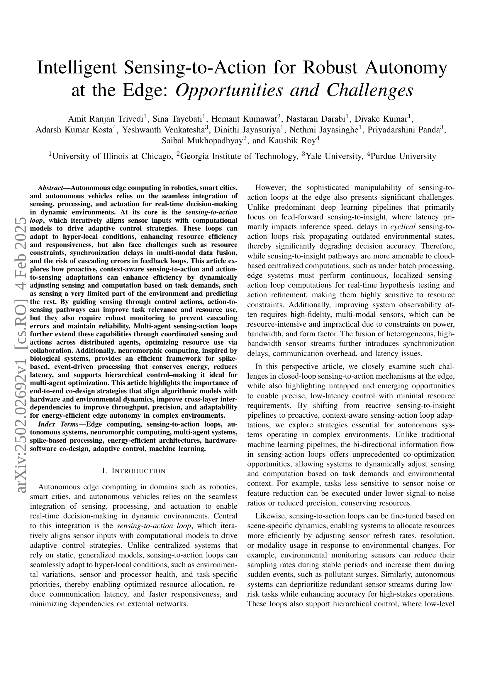
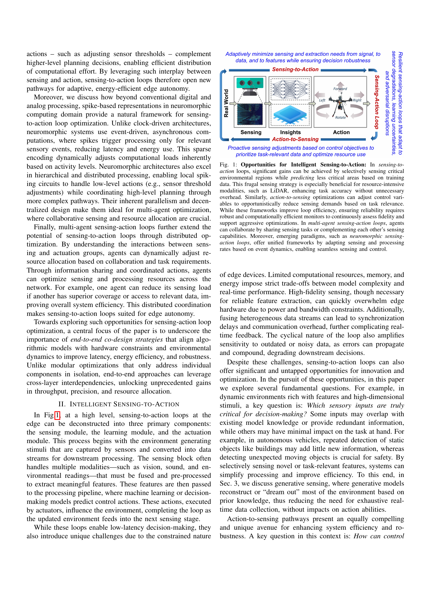
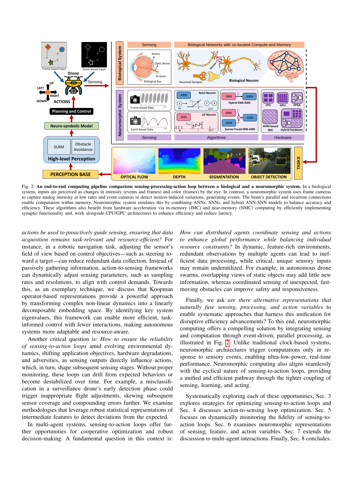
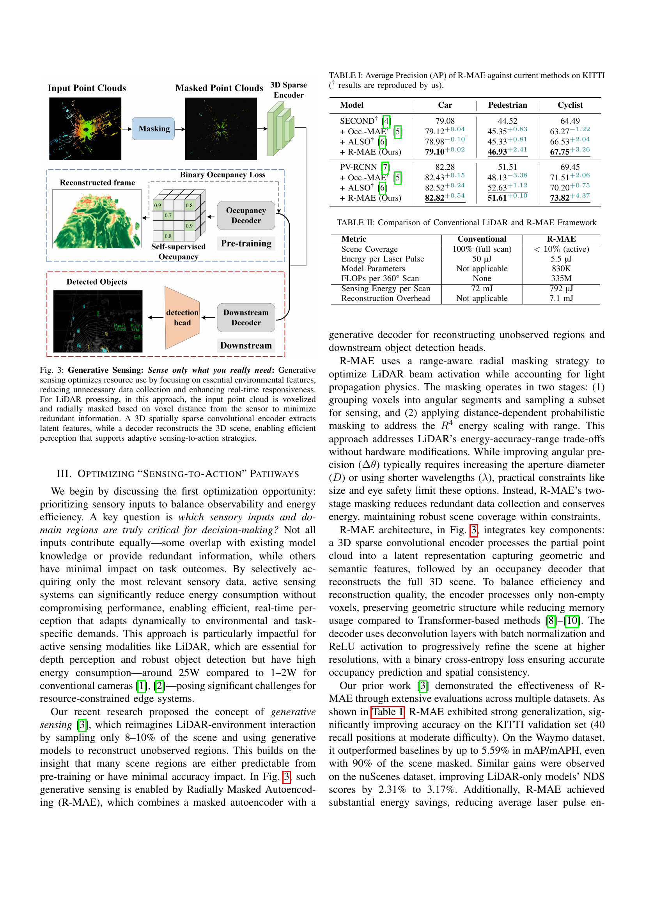
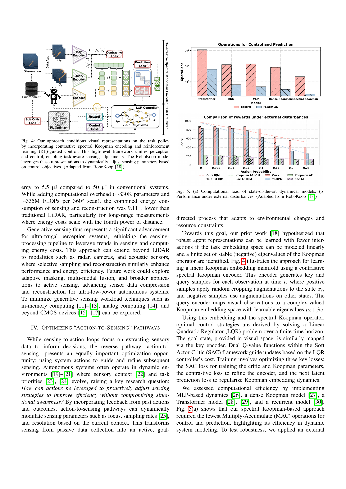
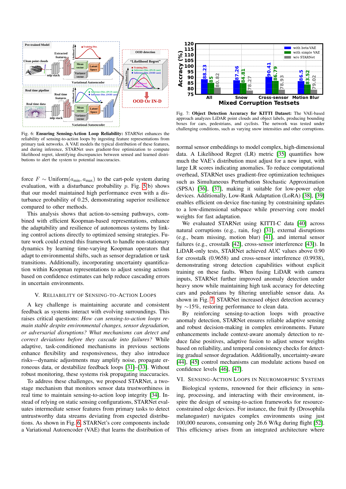
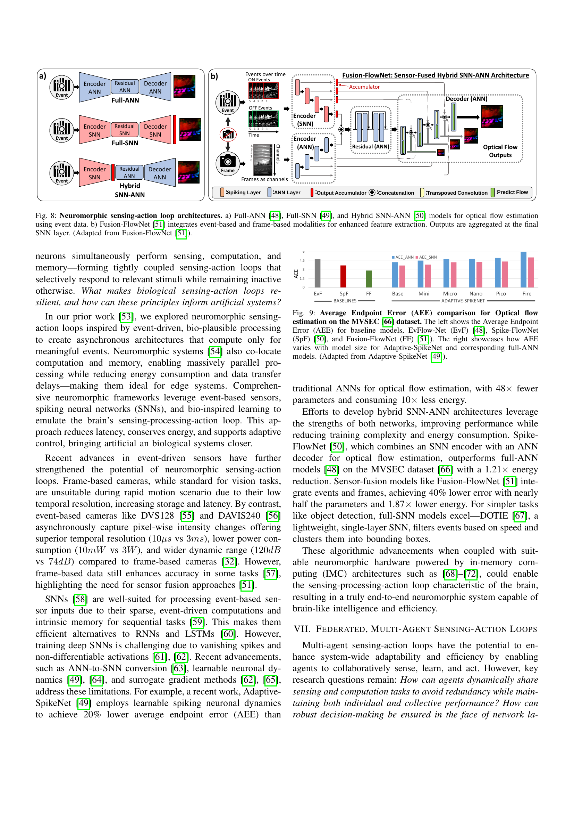
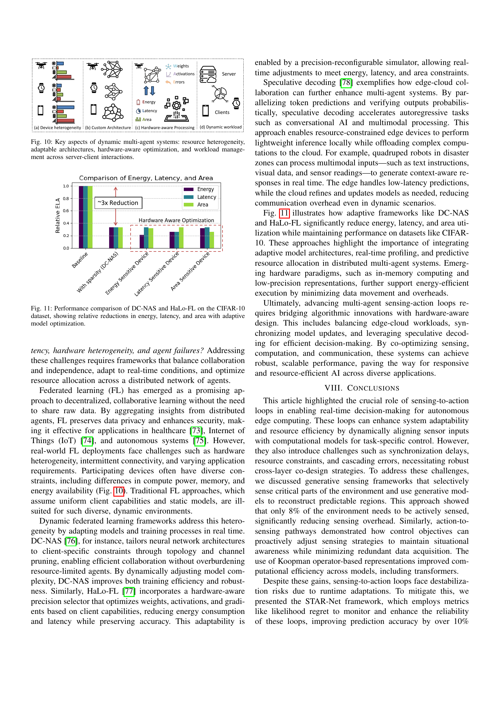
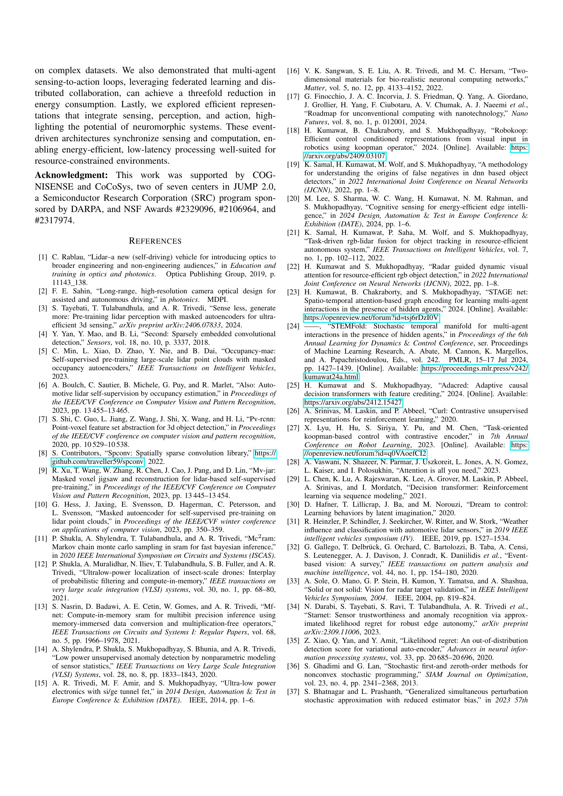
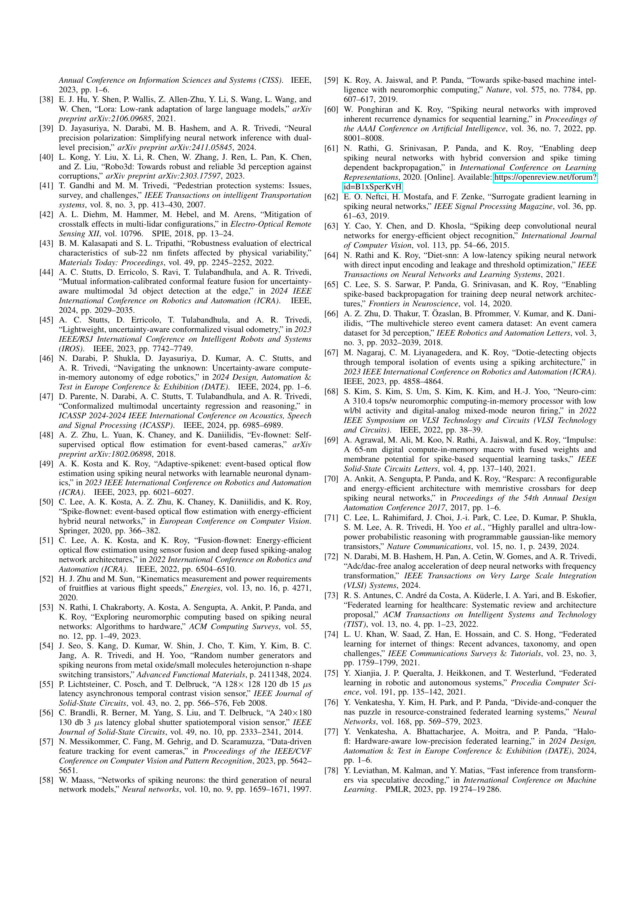

 


 2502.02692 
 Amit Ranjan Trivedi et el. 
 
 🤗 2025-02-10 
 



↗ arXiv


↗ Hugging Face


↗ Papers with Code


### TL;DR



본 논문은 로봇, 스마트 도시, 자율 주행 차량과 같은 분야에서 실시간 의사결정을 위해 감지, 처리 및 작동을 원활하게 통합하는 **자율 에지 컴퓨팅**의 중요성을 다룹니다. 특히, 동적 환경에서 적응형 제어 전략을 구현하는 **감지-액션 루프**에 중점을 둡니다. 그러나 이러한 루프는 자원 제약, 다중 모드 데이터 융합의 동기화 지연, 피드백 루프에서의 연쇄 오류 위험과 같은 과제에 직면합니다. 

본 논문에서는 **프로액티브하고 상황 인식적인 감지-액션 및 액션-감지 적응을 통해 작업 요구 사항에 따라 감지 및 계산을 동적으로 조정함으로써 효율성을 높이는 방법**을 탐구합니다. 또한, 다중 에이전트 감지-액션 루프, 신경 형태 컴퓨팅의 통합, 알고리즘 모델과 하드웨어 및 환경 역학의 정렬을 포함한 엔드투엔드 공동 설계 전략의 중요성을 강조합니다. 이러한 전략들은 복잡한 환경에서 에너지 효율적인 에지 자율성을 향상시키는 데 도움이 됩니다.



#### Key Takeaways


 에너지 효율적인 에지 자율성을 위해 감지 및 계산을 동적으로 조정하는 방법 



 다양한 에이전트 간의 협력적 감지 및 작동을 통해 자원 사용을 최적화하는 방법 



 신경 형태 컴퓨팅을 활용하여 에너지 소비를 줄이고 지연 시간을 단축하는 방법 


#### Why does it matter?
본 논문은 **에지 컴퓨팅 환경에서의 자율 시스템의 강건성을 높이는 지능형 감지-액션 루프 최적화**에 대한 중요한 통찰력을 제공합니다. 에너지 효율적인 에지 자율성에 대한 최근의 연구 동향과 밀접한 관련이 있으며, 다양한 분야의 연구자들에게 영향을 미칠 수 있는 새로운 연구 방향을 제시합니다. 특히, **신경 형태 컴퓨팅 및 다중 에이전트 시스템과의 통합**은 에너지 효율성 및 적응성을 크게 향상시킬 수 있는 잠재력을 가지고 있습니다.

------
#### Visual Insights

> 🔼 그림 1은 지능형 감지-행동 루프의 기회를 보여줍니다.  훈련 데이터를 기반으로 중요한 환경 영역을 선택적으로 감지하고 덜 중요한 영역은 예측함으로써 자원 집약적인 모달리티(예: LiDAR)의 효율성을 높이고 불필요한 오버헤드 없이 작업 정확도를 향상시킬 수 있습니다.  마찬가지로, 액션-투-센싱 최적화를 통해 작업 관련성에 따라 감지 요구 사항을 동적으로 줄일 수 있습니다.  이러한 프레임워크는 루프 효율성을 향상시키지만, 신뢰성을 보장하려면 정확도를 지속적으로 평가하고 공격적인 최적화를 지원하는 강력하고 계산 효율적인 모니터가 필요합니다.  다중 에이전트 감지-행동 루프에서 에이전트는 감지 작업을 공유하거나 서로의 감지 기능을 보완하여 협력할 수 있습니다.  또한 뉴로모픽 감지-행동 루프와 같은 새로운 패러다임은 이벤트 동역학에 따라 감지 및 처리 속도를 조정하여 원활한 감지 및 제어를 가능하게 하는 통합된 프레임워크를 제공합니다.
> 

> 
read the caption

> Figure 1: Opportunities for Intelligent Sensing-to-Action: In sensing-to-action loops, significant gains can be achieved by selectively sensing critical environmental regions while predicting less critical areas based on training data. This frugal sensing strategy is especially beneficial for resource-intensive modalities, such as LiDAR, enhancing task accuracy without unnecessary overhead. Similarly, action-to-sensing optimizations can adjust control variables to opportunistically reduce sensing demands based on task relevance. While these frameworks improve loop efficiency, ensuring reliability requires robust and computationally efficient monitors to continuously assess fidelity and support aggressive optimizations. In multi-agent sensing-action loops, agents can collaborate by sharing sensing tasks or complementing each other’s sensing capabilities. Moreover, emerging paradigms, such as neuromorphic sensing-action loops, offer unified frameworks by adapting sensing and processing rates based on event dynamics, enabling seamless sensing and control.
> 


| Model | Car | Pedestrian | Cyclist |
|---|---|---|---|
| SECOND† [4] | 79.08 | 44.52 | 64.49 |
| + Occ.-MAE† [5] | 79.12+0.04 | 45.35+0.83 | 63.27-1.22 |
| + ALSO† [6] | 78.98-0.10 | 45.33+0.81 | 66.53+2.04 |
| + R-MAE (Ours) | 79.10+0.02 | 46.93+2.41 | 67.75+3.26 |
| PV-RCNN [7] | 82.28 | 51.51 | 69.45 |
| + Occ.-MAE† [5] | 82.43+0.15 | 48.13-3.38 | 71.51+2.06 |
| + ALSO† [6] | 82.52+0.24 | 52.63+1.12 | 70.20+0.75 |
| + R-MAE (Ours) | 82.82+0.54 | 51.61+0.10 | 73.82+4.37 |

> 🔼 표 I은 KITTI 데이터셋에서 최신 기법들에 대한 R-MAE의 평균 정밀도(AP)를 보여줍니다.  † 표시는 논문 저자들이 재현한 결과임을 나타냅니다. 이 표는 R-MAE 모델이 기존의 3D 객체 탐지 방법들에 비해 자동차, 보행자, 자전거와 같은 다양한 객체에 대해 더 높은 정확도를 달성했음을 보여줍니다.  특히, 기존 방법들에 Occupancy-MAE나 ALSO와 같은 추가적인 개선 사항을 적용했을 때에도 R-MAE가 더 나은 성능을 보였음을 확인할 수 있습니다. 이는 R-MAE 모델의 효율성과 정확성을 입증하는 중요한 결과입니다.
> 

> 
read the caption

> TABLE I: Average Precision (AP) of R-MAE against current methods on KITTI († results are reproduced by us).
> 

### In-depth insights

#### Edge AI Sensing
엣지 AI 센싱은 **자원 제약 환경에서 실시간으로 데이터를 처리하고 의사결정을 내리는 데 초점을 맞춘 중요한 개념**입니다. 이는 분산된 센서 네트워크를 통해 수집된 데이터를 현장에서 직접 처리하여 클라우드 의존성을 줄이고 대기 시간을 최소화하는 것을 의미합니다. **엣지 기기의 제한된 처리 능력 및 에너지 소비량을 고려하여 효율적인 알고리즘과 하드웨어 설계가 중요**합니다. 따라서 센서 데이터의 선택적 샘플링, 압축, 그리고 적응형 처리 기법들이 엣지 센싱의 핵심 기술로 부상하고 있으며, 이를 통해 데이터 처리량을 줄이고 전력 소모를 줄이는 동시에 중요한 정보는 유지할 수 있습니다. 또한, **신뢰할 수 있는 시스템을 위해 센서 오류나 환경 변화에 대한 적응력을 갖춘 강건한 센싱 시스템의 개발이 중요**합니다. 엣지 AI 센싱은 로봇공학, 스마트시티, 자율주행 자동차 등 다양한 분야에 적용될 수 있는 잠재력이 있으며, **향후 연구는 에너지 효율적인 하드웨어 아키텍처, 지능형 센서 융합, 그리고 자율 시스템의 신뢰성 확보에 집중될 것**으로 예상됩니다.

#### Action-Sensing Loops
본 논문에서 '액션-센싱 루프(Action-Sensing Loops)'는 **에이전트의 액션이 환경에 영향을 미치고, 그 결과로 새로운 센싱 데이터를 생성하는 순환 과정**을 의미합니다. 이는 단순히 센싱 데이터를 기반으로 액션을 결정하는 단방향적 접근과 달리, 액션과 센싱이 상호 작용하며 시스템의 동작을 제어하는 **쌍방향적이고 적응적인 메커니즘**을 제시합니다.  **실시간 의사결정이 중요한 로보틱스, 스마트시티, 자율주행 자동차와 같은 분야**에서 특히 중요하며, **에너지 효율성 및 자원 관리** 관점에서도 효과적입니다.  하지만, 이러한 루프는 **시간 지연, 자원 제약, 그리고 오류 전파**와 같은 어려움을 겪을 수 있습니다. 따라서, 효율적인 액션-센싱 루프 구현을 위해서는 **프로액티브하고 컨텍스트 인식적인 전략**이 필요하며,  **알고리즘, 하드웨어, 환경 동역학 간의 공동 설계**를 통해 시스템의 신뢰성과 적응성을 향상시켜야 합니다.  **신경형태 컴퓨팅**과 **멀티에이전트 시스템** 또한 이러한 루프의 효율성을 높이는 핵심 기술로 제시되고 있으며, 이를 통해 **자원 분배 최적화** 및 **협업적인 센싱/액션**을 가능하게 합니다.  궁극적으로, 액션-센싱 루프의 성공적인 구현은 **에너지 효율적이고 강인한 자율 시스템**의 개발에 중요한 역할을 할 것으로 예상됩니다.

#### Generative Sensing
본 논문에서 제시된 생성적 감지(Generative Sensing)는 **리소스 효율적인 지능형 에지 시스템**을 위한 혁신적인 접근 방식입니다. 기존의 모든 데이터를 수집하는 방식 대신, **필요한 환경 정보만 선택적으로 감지**하고, 생성 모델을 활용하여 관측되지 않은 영역을 재구성합니다. 이는 특히 리소스 소모가 큰 LiDAR와 같은 센서를 사용하는 시스템에서 **에너지 소비를 획기적으로 줄이고** 실시간 응답성을 높이는 데 효과적입니다.  **R-MAE(Radially Masked Autoencoding)**와 같은 기술은 방사형 마스크를 사용하여 불필요한 데이터 수집을 최소화하고, 효율적인 3D 장면 재구성을 지원합니다. 생성적 감지는 단순히 기술적 개선을 넘어, **자원 제약이 심한 에지 환경에서 지능형 시스템의 실현 가능성을 높이는 중요한 전략**으로 평가될 수 있습니다.  향후 연구에서는 다양한 센서 모드와의 통합, 적응형 마스크 기법, 그리고 다양한 에지 시스템에 대한 적용 가능성을 탐색하는 것이 중요할 것입니다.

#### Neuromorphic Approach
본 논문에서 제시된 뉴로모픽 접근 방식은 **에너지 효율적인 엣지 자율 시스템을 위한 혁신적인 솔루션**을 제공합니다. 기존의 클럭 기반 아키텍처와 달리 뉴로모픽 시스템은 이벤트 기반의 비동기식 연산을 사용하여 관련 감각 이벤트에 대해서만 처리를 수행함으로써 지연 시간과 에너지 소비를 줄입니다. **희소 인코딩**을 통해 계산 부하가 동적으로 조정되고, 계층적이고 분산된 처리 기능을 통해 로우 레벨 액션과 하이 레벨 계획이 효율적으로 조정됩니다. 이러한 특징은 특히 다중 에이전트 최적화에 적합하며, 에너지 효율적인 엣지 자율 시스템에 중요한 역할을 합니다. **뉴로모픽 컴퓨팅은 감각, 처리, 작동을 통합**하여 시스템의 효율성을 극대화하고, **실시간 의사 결정과 빠른 응답성**을 가능하게 합니다.  **하드웨어-소프트웨어 공동 설계 전략**과의 통합을 통해 알고리즘 모델을 하드웨어 및 환경 역학에 맞춰 조정함으로써 처리량, 정밀도, 적응성을 향상시킵니다.

#### Multi-agent Systems
본 논문에서 다룬 멀티 에이전트 시스템은 **분산된 에이전트들이 협력적인 감지 및 행동을 통해 자원 사용을 최적화**하는 것을 보여줍니다.  각 에이전트는 제한된 자원을 가지고 있으므로, 효율적인 자원 할당과 협업이 필수적입니다. **에이전트 간의 정보 공유 및 조정된 행동을 통해 중복된 감지 작업을 줄이고 시스템 전반의 효율성을 향상**시킬 수 있습니다. 예를 들어, 한 에이전트가 다른 에이전트보다 더 나은 데이터에 접근할 수 있다면, 감지 부하를 줄일 수 있습니다.  **뉴로모픽 컴퓨팅은 멀티 에이전트 시스템의 효율성을 높이는 데 유용한 프레임워크**를 제공합니다. 이는 이벤트 기반의 비동기적 연산을 사용하여 대기 시간을 줄이고 에너지 소비를 절감하는 데 도움이 됩니다.  **종합적으로, 멀티 에이전트 시스템은 에지 환경에서 강력한 자율성을 달성하기 위한 중요한 접근 방식**이지만, 자원 제약, 동기화 지연 및 오류 전파 등의 과제를 해결해야 합니다.  이러한 과제를 해결하기 위해서는 알고리즘 모델과 하드웨어 및 환경 동력학을 조정하는 엔드-투-엔드 공동 설계 전략이 필수적입니다.

### More visual insights

More on figures

> 🔼 그림 2는 생물학적 시스템과 뉴로모픽 시스템 간의 감지-처리-작동 루프를 비교하여 엔드-투-엔드 컴퓨팅 파이프라인을 보여줍니다. 생물학적 시스템에서는 눈이 강도(이벤트와 프레임)와 색상(프레임)의 변화를 감지합니다. 반면에 뉴로모픽 시스템은 프레임 카메라를 사용하여 낮은 속도로 아날로그 강도를 포착하고, 이벤트 카메라를 사용하여 움직임에 의한 변화를 감지하여 이벤트를 생성합니다. 뇌의 병렬 및 순환 연결은 메모리 내에서 계산을 가능하게 합니다. 뉴로모픽 시스템은 정확성과 효율성의 균형을 맞추기 위해 ANN, SNN 및 하이브리드 ANN-SNN 모델을 결합하여 이를 에뮬레이트합니다. 이러한 알고리즘은 메모리 내(IMC) 및 근접 메모리(NMC) 컴퓨팅을 통한 하드웨어 가속으로부터 이점을 얻어 시냅스 기능을 효율적으로 구현하고 CPU/GPU 아키텍처와 함께 작동하여 효율성을 높이고 지연 시간을 줄입니다.
> 

> 
read the caption

> Figure 2: An end-to-end computing pipeline comparison sensing-processing-action loop between a biological and a neuromorphic system. In a biological system, inputs are perceived as changes in intensity (events and frames) and color (frames) by the eye. In contrast, a neuromorphic system uses frame cameras to capture analog intensity at low rates and event cameras to detect motion-induced variations, generating events. The brain’s parallel and recurrent connections enable computation within memory. Neuromorphic system emulates this by combining ANNs, SNNs, and hybrid ANN-SNN models to balance accuracy and efficiency. These algorithms also benefit from hardware acceleration via in-memory (IMC) and near-memory (NMC) computing by efficiently implementing synaptic functionality and, work alongside CPU/GPU architectures to enhance efficiency and reduce latency.
> 

> 🔼 그림 3은 생성적 감지(Generative Sensing) 개념을 보여줍니다. 이 기법은 불필요한 데이터 수집을 줄이고 실시간 반응성을 높이기 위해 필수적인 환경 특징에 집중하여 자원 사용을 최적화합니다. LiDAR 처리의 경우 입력 점군(point cloud)을 복셀(voxel)로 나누고 센서와의 거리에 따라 반경 방향으로 마스크 처리하여 중복 정보를 최소화합니다. 3차원 공간적으로 드문드문한(spatially sparse) 합성곱 인코더는 잠재 특징(latent feature)을 추출하고, 디코더는 3차원 장면을 재구성하여 적응형 감지-작동 전략을 지원하는 효율적인 인지를 가능하게 합니다. 즉, 센서가 모든 데이터를 수집하는 대신, 중요한 데이터만 수집하고 나머지는 모델이 예측하여 효율성을 높이는 방법입니다.
> 

> 
read the caption

> Figure 3: Generative Sensing: Sense only what you really need: Generative sensing optimizes resource use by focusing on essential environmental features, reducing unnecessary data collection and enhancing real-time responsiveness. For LiDAR proessing, in this approach, the input point cloud is voxelized and radially masked based on voxel distance from the sensor to minimize redundant information. A 3D spatially sparse convolutional encoder extracts latent features, while a decoder reconstructs the 3D scene, enabling efficient perception that supports adaptive sensing-to-action strategies.
> 

> 🔼 그림 4는 RoboKoop 모델의 고차원 프레임워크를 보여줍니다. 이 프레임워크는 대조적인 스펙트럴 쿱만 인코딩과 강화 학습 기반 제어를 통합하여 작업 정책에 시각적 표현을 조건화합니다.  즉, 시각 정보를 작업 목표에 따라 조정하여 인식과 제어를 통합하는 것입니다.  RoboKoop 모델은 이러한 표현을 활용하여 제어 목표에 따라 감지 매개변수를 동적으로 조정합니다.  이를 통해 시스템은 작업에 필요한 정보만을 선택적으로 감지하고, 불필요한 감지 작업을 줄임으로써 자원을 효율적으로 사용할 수 있습니다.
> 

> 
read the caption

> Figure 4: Our approach conditions visual representations on the task policy by incorporating contrastive spectral Koopman encoding and reinforcement learning (RL)-guided control. This high-level framework unifies perception and control, enabling task-aware sensing adjustments. The RoboKoop model leverages these representations to dynamically adjust sensing parameters based on control objectives. (Adapted from RoboKoop[18])
> 

> 🔼 그림 5는 외부 환경 변화에 대한 강건성을 평가하기 위한 실험 결과를 보여줍니다. (a)는 최첨단 동적 모델들의 계산 비용을 비교 분석한 그래프이며, (b)는 외부 간섭이 있을 때 각 모델의 성능을 비교 분석한 그래프입니다. RoboKoop 논문[18]에서 발췌한 내용을 바탕으로 작성되었습니다.  (a)에서는 제안된 모델(Spectral Koopman)이 다른 모델들에 비해 훨씬 적은 계산량으로 동작함을 보여주며, (b)에서는 외부 간섭에도 불구하고 제안된 모델이 가장 안정적인 성능을 유지함을 보여줍니다.
> 

> 
read the caption

> Figure 5: (a) Computational load of state-of-the-art dynamical models. (b) Performance under external disturbances. (Adapted from RoboKoop[18])
> 

> 🔼 그림 6은 STARNet이 주요 작업 네트워크의 특징 표현을 활용하여 감지-작업 루프의 안정성을 높이는 방법을 보여줍니다. VAE(Variational Autoencoder)는 이러한 특징들의 일반적인 분포를 모델링하고, 추론 중에 STARNet은 기울기 없는 최적화를 사용하여 Likelihood Regret을 계산합니다. 이를 통해 감지된 분포와 학습된 분포 간의 불일치를 파악하여 시스템에 잠재적인 부정확성을 알립니다.  즉, STARNet은 시스템의 신뢰도를 높이기 위해 예상치 못한 오류나 변화를 감지하고 이에 대응하도록 설계되었습니다.
> 

> 
read the caption

> Figure 6: Ensuring Sensing-Action Loop Reliability: STARNet enhances the reliability of sensing-to-action loops by ingesting feature representations from primary task networks. A VAE models the typical distribution of these features, and during inference, STARNet uses gradient-free optimization to compute likelihood regret, identifying discrepancies between sensed and learned distributions to alert the system to potential inaccuracies.
> 

> 🔼 그림 7은 KITTI 데이터셋을 사용하여 VAE 기반 접근 방식의 객체 감지 정확도를 보여줍니다. 이 접근 방식은 LiDAR 점 구름과 객체 레이블을 분석하여 자동차, 보행자, 자전거를 위한 바운딩 박스를 생성합니다. 네트워크는 다양한 강설 강도와 기타 손상과 같은 어려운 조건에서 테스트되었습니다. 그림은 다양한 손상 유형(눈, 크로스 센서, 모션 블러 등) 하에서의 객체 감지 정확도를 보여주는 차트를 포함합니다. VAE 기반 접근 방식은 다양한 손상 유형에서도 상당한 정확도를 유지하며, 특히 눈이 많이 내리는 상황에서도 성능이 우수함을 보여줍니다.
> 

> 
read the caption

> Figure 7: Object Detection Accuracy for KITTI Dataset: The VAE-based approach analyzes LiDAR point clouds and object labels, producing bounding boxes for cars, pedestrians, and cyclists. The network was tested under challenging conditions, such as varying snow intensities and other corruptions.
> 

> 🔼 그림 8은 뉴로모픽 감지-액션 루프 아키텍처를 보여줍니다. (a)는 이벤트 데이터를 사용한 광학 흐름 추정을 위한 전통적인 완전 ANN [48], 완전 SNN [49], 그리고 하이브리드 SNN-ANN [50] 모델을 나타냅니다. (b)는 향상된 특징 추출을 위해 이벤트 기반 및 프레임 기반 모달리티를 통합하는 Fusion-FlowNet [51]을 보여줍니다. 출력은 최종 SNN 계층에서 집계됩니다. 이 그림은 Fusion-FlowNet [51]에서 각색되었습니다.
> 

> 
read the caption

> Figure 8: Neuromorphic sensing-action loop architectures. a) Full-ANN [48], Full-SNN [49], and Hybrid SNN-ANN [50] models for optical flow estimation using event data. b) Fusion-FlowNet [51] integrates event-based and frame-based modalities for enhanced feature extraction. Outputs are aggregated at the final SNN layer. (Adapted from Fusion-FlowNet [51]).
> 

> 🔼 그림 9는 MVSEC [66] 데이터셋에서 광학 흐름 추정에 대한 평균 종착점 오차(AEE) 비교를 보여줍니다. 왼쪽은 기준 모델, EvFlow-Net(EvF)[48], Spike-FlowNet(SpF)[50], Fusion-FlowNet(FF)[51]의 AEE를 보여주고, 오른쪽은 Adaptive-SpikeNet과 해당하는 전체 ANN 모델의 모델 크기에 따른 AEE 변화를 보여줍니다. 이 그림은 다양한 신경망 아키텍처(전체 ANN, 전체 SNN, 하이브리드 ANN-SNN)의 성능을 비교하고, 이벤트 기반 센서 데이터를 사용하는 Adaptive-SpikeNet의 효율성을 강조합니다. 특히, Adaptive-SpikeNet은 모델 크기가 작아도 경쟁력 있는 성능을 보여주어 에너지 효율적인 에지 시스템에 적합함을 시사합니다.
> 

> 
read the caption

> Figure 9: Average Endpoint Error (AEE) comparison for Optical flow estimation on the MVSEC [66] dataset. The left shows the Average Endpoint Error (AEE) for baseline models, EvFlow-Net (EvF) [48], Spike-FlowNet (SpF) [50], and Fusion-FlowNet (FF) [51]). The right showcases how AEE varies with model size for Adaptive-SpikeNet and corresponding full-ANN models. (Adapted from Adaptive-SpikeNet [49]).
> 

> 🔼 그림 10은 동적인 다중 에이전트 시스템의 핵심 요소들을 보여줍니다. 서버-클라이언트 상호 작용 전반에 걸쳐 자원 이질성, 적응형 아키텍처, 하드웨어 인식 최적화 및 작업 부하 관리가 포함됩니다.  다양한 클라이언트 장치의 제한된 자원(연산 능력, 메모리, 에너지)을 고려하여 시스템의 효율성을 극대화하는 방법을 보여주는 것입니다. 서버는 중앙 집중식 학습 및 모델 업데이트를 담당하는 반면, 클라이언트는 개별적으로 데이터를 수집하고 처리하며, 이때 에이전트들은 자원 제약, 네트워크 지연, 하드웨어 이질성 등의 어려움에 직면하게 됩니다. 그림은 이러한 과제들을 해결하기 위해 적응형 아키텍처, 하드웨어 인식 최적화, 작업 부하 관리 등의 전략이 필요함을 시사합니다.
> 

> 
read the caption

> Figure 10: Key aspects of dynamic multi-agent systems: resource heterogeneity, adaptable architectures, hardware-aware optimization, and workload management across server-client interactions.
> 

> 🔼 그림 11은 CIFAR-10 데이터셋에서 적응형 모델 최적화를 사용하여 DC-NAS와 HaLo-FL의 성능을 비교한 결과를 보여줍니다.  에너지, 지연 시간 및 면적 측면에서 상대적인 감소를 보여줍니다.  DC-NAS와 HaLo-FL은 모두 연합 학습 환경에서 리소스 제약이 있는 다양한 장치에 적응하는 모델을 학습하기 위한 최적화된 방법론입니다.  DC-NAS는 네트워크 토폴로지와 채널을 동적으로 조정하여 각 장치의 제약에 맞춘 모델을 생성하고, HaLo-FL은 하드웨어 인식 정밀도 선택을 통해 가중치, 활성화 및 기울기를 최적화하여 에너지 소비와 지연 시간을 줄입니다. 이 그림은 두 방법 모두 에너지 효율성, 지연 시간 단축, 그리고 면적 감소에 효과적임을 보여주는 시각적 증거를 제공합니다.
> 

> 
read the caption

> Figure 11: Performance comparison of DC-NAS and HaLo-FL on the CIFAR-10 dataset, showing relative reductions in energy, latency, and area with adaptive model optimization.
> 

### Full paper



