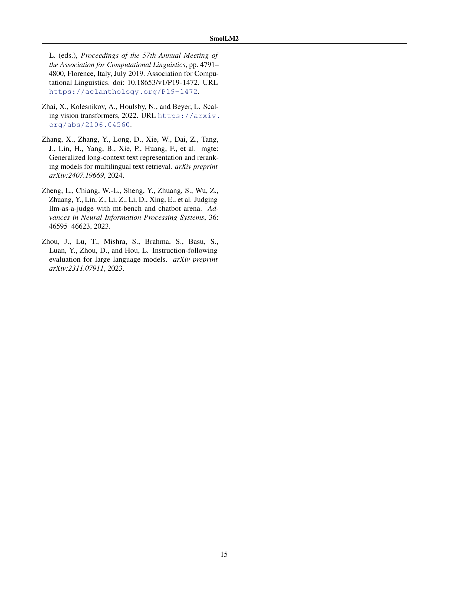
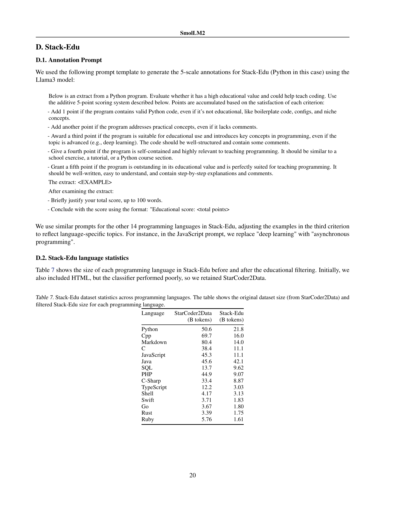

 


 2502.02737 
 Loubna Ben Allal et el. 
 
 🤗 2025-02-06 
 



↗ arXiv


↗ Hugging Face


### TL;DR



대규모 언어 모델은 성능이 뛰어나지만, 막대한 컴퓨팅 자원이 필요하다는 단점이 있습니다. 이에 반해, 소규모 언어 모델은 자원 효율성이 높지만, 성능이 떨어지는 문제가 있습니다. 본 연구는 **소규모 언어 모델의 성능을 향상**시키는 새로운 방법론을 제시합니다.

본 연구에서는 **다중 단계 학습 과정**을 통해, 웹 텍스트와 수학, 코드, 지시사항 따르기 데이터를 혼합하여 17억 매개변수의 소형 언어 모델(SmolLM2)을 학습시켰습니다. 특히, 기존 데이터셋의 한계를 극복하기 위해 **새로운 전문 데이터셋**을 개발하고, 성능 평가를 통해 데이터 혼합 비율을 조정하는 등 **데이터 중심 학습**을 적용하였습니다. 그 결과, 기존 소형 언어 모델들을 능가하는 우수한 성능을 달성하였으며, 개발된 모델과 데이터셋을 공개하여 후속 연구에 기여하고 있습니다.



#### Key Takeaways


 데이터 중심 접근 방식을 통해 소형 언어 모델의 성능을 크게 향상시켰다. 



 새로운 고품질 데이터셋(FineMath, Stack-Edu, SmolTalk)을 개발하여 모델 성능 개선에 기여했다. 



 개발된 소형 언어 모델(SmolLM2)과 데이터셋을 공개하여, 후속 연구를 지원한다. 


#### Why does it matter?
본 논문은 **소규모 언어 모델의 성능 향상에 대한 새로운 방법론**을 제시하여, 연구자들이 **제한된 자원으로도 강력한 언어 모델을 개발**할 수 있도록 기여합니다.  **데이터 중심 학습(data-centric training)** 접근 방식과 **새로운 데이터셋**을 통해 소규모 모델의 성능을 대폭 향상시킨 결과는, 관련 분야 연구의 새로운 지평을 열어줄 것으로 기대됩니다. 또한, 공개된 모델과 데이터셋은 **다양한 후속 연구**에 활용될 수 있어, 학계와 산업계 모두에 큰 영향을 미칠 것으로 예상됩니다.

------
#### Visual Insights

> 🔼 그림 1은 다양한 FineMath 하위 집합과 다른 수학 데이터셋으로 훈련된 모델의 성능을 보여줍니다.  세부적으로는 GSM8K, MATH, MMLU-STEM 세 가지 수학 관련 벤치마크에서 FineMath의 여러 하위 집합(FineMath3+, FineMath4+, 그리고 Infi-WebMath3+, Infi-WebMath4+)과 기존의 OWM, InfiMM-WebMath 데이터셋을 사용하여 훈련된 모델들의 성능을 비교 분석한 결과를 나타냅니다. 각 벤치마크에서 토큰 수에 따른 정확도 변화를 그래프로 제시하여, 데이터셋의 크기와 품질이 모델 성능에 미치는 영향을 시각적으로 보여줍니다. 특히 FineMath 데이터셋의 경우, 고품질 수학적 추론 데이터를 포함하여 다른 데이터셋보다 우수한 성능을 보임을 확인할 수 있습니다.
> 

> 
read the caption

> Figure 1: Performance of models trained on different subsets of FineMath and other math datasets.
> 


| Task | FW-Edu | DCLM | 40/60 | 60/40 |
|---|---|---|---|---|
| MMLU | **37.5** | 35.5 | 36.5 | 37.0 |
| ARC | **57.5** | 53.5 | 53.2 | 56.0 |
| OpenBookQA | **41.9** | 40.8 | 39.0 | **41.9** |
| HellaSwag | 60.1 | **62.3** | 61.4 | 62.2 |
| CommonsenseQA | 36.2 | **40.1** | 39.9 | 38.5 |
| PIQA | 76.2 | **76.9** | 75.7 | 76.4 |

> 🔼 본 표는 3500억 토큰의 데이터셋을 사용하여 FineWeb-Edu와 DCLM으로 학습된 모델들의 성능을 평가한 결과입니다. FineWeb-Edu와 DCLM의 비율을 40:60과 60:40으로 조정하여 실험하였습니다.  표에는 MMLU, ARC, OpenBookQA, HellaSwag, CommonsenseQA, PIQA 등 다양한 과제에 대한 모델의 정확도가 제시되어 있습니다. 이를 통해 각 데이터셋의 특징과 두 데이터셋을 혼합하여 사용하는 효과를 확인할 수 있습니다.  예를 들어 FineWeb-Edu는 교육 관련 지표에서 높은 정확도를 보이는 반면, DCLM은 상식 추론 과제에서 더 나은 성능을 보입니다.  두 데이터셋을 적절히 혼합함으로써 전반적인 성능 향상을 달성할 수 있는지 보여줍니다.
> 

> 
read the caption

> Table 1: Evaluation of models trained on FineWeb-Edu and DCLM for 350B tokens. 40/60 and 60/40 denote the FW-Edu/DCLM ratio.
> 

### In-depth insights

#### SmolLM2 Training
SmolLM2의 학습 과정은 **다중 단계 접근 방식**을 사용하여 **데이터 중심적**으로 설계되었습니다. 이는 단순히 대량의 데이터를 사용하는 것 이상으로, 각 단계에서 모델 성능을 모니터링하고 평가하여 **데이터 믹싱 비율**을 동적으로 조정하는 것을 의미합니다.  초기 단계에서는 **대규모 웹 텍스트 데이터**를 주로 사용하지만, 후속 단계에서는 **수학, 코드, 지시사항 따르기 데이터**와 같은 특수화된 데이터셋을 전략적으로 추가하여 모델의 특정 능력을 향상시킵니다.  **새로운 데이터셋**인 FineMath, Stack-Edu, SmolTalk의 도입은 기존 데이터셋의 한계를 극복하고 데이터의 품질과 양을 개선하는 데 중요한 역할을 합니다.  **단계별 성능 평가**를 통해 데이터셋의 믹싱 비율을 조정하는 과정은  전체 학습 과정의 효율성을 높이고, 비용이 많이 드는 대규모 학습을 여러번 반복하지 않고도 최적의 성능을 얻을 수 있게 합니다.  **어닐링 기법(annealing)**을 사용하여 특수화된 데이터셋을 점진적으로 도입하는 방식은 모델의 안정성과 성능 향상에 기여합니다.

#### Data-Centric Approach
본 논문에서 제시된 데이터 중심 접근 방식은 **대규모 언어 모델의 성능 향상을 위해 데이터 품질과 다양성에 중점**을 두고 있습니다. 단순히 데이터의 양을 늘리는 것이 아니라, **웹 텍스트, 수학, 코드, 지시사항 따르기 데이터를 혼합**하여 사용하고, **부족하거나 품질이 낮은 기존 데이터셋을 보완하기 위해 새로운 데이터셋을 생성**하는 전략을 취하고 있습니다. 이는 **다단계 학습 과정**을 통해 이루어지며, 각 단계별 성능 평가를 바탕으로 데이터 혼합 비율을 조정하는 **동적인 데이터 관리**가 특징입니다. 이러한 데이터 중심 접근 방식은 **소규모 언어 모델의 성능을 극대화**하고, **다양한 하위 작업에서 경쟁력 있는 결과**를 도출하는 데 중요한 역할을 합니다. 특히, **수학 및 코드 관련 작업에서의 성능 향상**에 큰 영향을 미쳤다는 점을 강조할 수 있습니다.

#### Specialized Datasets
본 논문에서 다룬 "특수 데이터셋" 부분은 **수치, 코드, 지시사항 따르기와 같은 특정 영역에 집중된 데이터**를 사용하여 **소규모 언어 모델의 성능을 향상시키는 데 초점**을 맞추고 있습니다.  기존의 웹 데이터만으로는 소규모 모델의 한계적인 용량으로 인해 성능 향상에 어려움이 있기 때문에 **전문화된 데이터를 추가함으로써 모델의 특정 작업 수행 능력을 개선**하려는 전략입니다.  이러한 특수 데이터셋들은 **웹 데이터의 품질 개선 및 효율적인 학습을 위해 필수적**이며, **모델의 범용성을 높이는 데 기여**합니다.  **데이터 선정 및 혼합 비율 조정**을 통해 실험적으로 최적의 성능을 도출해내는 과정 또한 중요한 부분입니다.  **새로운 특수 데이터셋을 직접 생성**하는 시도 또한 눈에 띄는 특징이며, 이는 기존 데이터셋의 한계를 극복하고 모델의 성능을 더욱 향상시키기 위한 노력의 일환으로 해석될 수 있습니다.  **다양한 특수 데이터셋들의 장단점을 분석**하고, 이를 바탕으로 **데이터 혼합 전략을 수립**하는 과정은 **소규모 언어 모델 개발의 핵심**임을 보여줍니다.

#### Multi-Stage Training
본 논문에서 제시된 다단계 학습 전략은 **대규모 언어 모델의 훈련 과정을 여러 단계로 나누어 각 단계별로 데이터 구성과 목표를 달리함**으로써 모델 성능을 향상시키는 효과적인 방법론입니다. 초기 단계에서는 대량의 일반 텍스트 데이터를 사용하여 언어 모델의 기본적인 언어 능력을 확보하고, 후속 단계에서는 수학, 코드, 지시사항 따르기와 같은 특정 분야의 데이터를 추가하여 모델의 전문적인 지식과 추론 능력을 강화합니다. **각 단계별로 데이터의 비율을 조정하고, 새롭게 생성된 고품질 데이터셋을 도입하는 전략**은 모델의 성능을 극대화하기 위한 중요한 요소입니다.  **단계별 성능 평가를 통해 데이터 구성을 지속적으로 개선**함으로써, 제한된 자원 내에서 최적의 모델 성능을 확보할 수 있다는 점이 핵심적인 강점입니다. 이러한 다단계 학습 방식은 소규모 언어 모델 개발에 특히 효과적이며, 향후 연구 방향에 중요한 시사점을 제공합니다.

#### Future Directions
본 논문의 "미래 방향"에 대한 제 생각은 다음과 같습니다. **소형 언어 모델(Small Language Model, SLM)의 성능 향상을 위한 데이터 중심 접근법(Data-centric approach)은 더욱 발전해야 합니다.**  다양한 도메인의 특수 데이터셋 구축 및 기존 데이터셋의 질적 향상에 대한 연구가 지속되어야 하며,  **데이터셋의 혼합 비율을 동적으로 조정하는 기법**에 대한 심도있는 연구가 필요합니다.  또한, **다양한 크기의 SLM에 대한 최적의 학습 전략**을 찾는 연구는 SLM의 실용성을 더욱 높일 것입니다.  **효율적인 학습 방법론과 모델 아키텍처 연구** 역시 중요합니다.  **소형 모델의 한계를 극복하고 대형 모델 수준의 성능에 근접하기 위한 혁신적인 연구**가 미래 SLM 연구의 중요한 방향이 될 것입니다.  마지막으로, **윤리적, 사회적 책임**을 고려한 연구가 필수적입니다.  편향된 데이터로 인한 차별 문제를 해결하고, 악용 가능성을 최소화하는 연구가 필요합니다.

### More visual insights

More on figures

> 🔼 그림 2는 SmolLM2 사전 훈련의 여러 단계에 걸쳐 사용된 데이터셋의 비율을 보여줍니다.  x축은 훈련 토큰 수를 나타내며,  각 단계별로 웹 텍스트, 코드, 수학 데이터, 지침 따르기 데이터 등 다양한 데이터셋이 어떤 비율로 혼합되어 사용되었는지 시각적으로 보여줍니다.  섹션 4에서는 각 단계별 데이터셋 혼합 전략에 대한 자세한 설명을 제공합니다. 이 그림은 다양한 데이터 유형의 혼합 비율을 조정하여 모델 성능을 최적화하는 과정을 이해하는 데 도움이 됩니다.
> 

> 
read the caption

> Figure 2: Dataset mixtures across training stages. Detailed descriptions are provided in Section 4. The x-axis represents the number of training tokens.
> 

> 🔼 그림 3은 SmolLM2의 학습 과정에서 사용된 학습률 스케줄러(WSD)의 학습률 변화 양상을 보여줍니다.  2000 스텝의 워밍업 기간을 거친 후, 학습률은 5.0 x 10^-4로 설정되었고, 학습이 진행됨에 따라 10%씩 감소하는 것을 확인할 수 있습니다.  그림은 학습 토큰 수에 따른 학습률의 변화를 시각적으로 보여주어, 모델 학습의 안정성과 효율성을 이해하는 데 도움을 줍니다.  즉, 학습 초반에는 학습률을 천천히 증가시켜 모델이 안정적으로 학습을 시작하도록 돕고, 학습 후반에는 학습률을 서서히 감소시켜 과적합을 방지하고 최적의 성능을 얻도록 하는 WSD 스케줄러의 작동 원리를 보여줍니다.
> 

> 
read the caption

> Figure 3: Learning rate during SmolLM2 training. We used WSD scheduler with 2000 steps warmup, learning rate 5.0×10−45.0superscript1045.0\times 10^{-4}5.0 × 10 start_POSTSUPERSCRIPT - 4 end_POSTSUPERSCRIPT and 10% decay.
> 

> 🔼 그림 4는 FineWeb-Edu와 DCLM으로 3500억 토큰을 학습시킨 모델들의 평가 결과를 보여줍니다. FineWeb-Edu는 지식 및 추론 과제에서 뛰어난 성능을 보이는 반면, DCLM은 상식 추론 벤치마크에서 더 강력한 성능을 나타냅니다. FineWeb-Edu와 DCLM을 60:40으로 혼합한 모델은 모든 과제에서 균형 잡힌 성능을 달성합니다.  이 그림은 다양한 웹 데이터 소스의 강점과 약점을 보여주며, 모델 성능을 최적화하기 위해 데이터 소스를 적절히 조합하는 것이 중요함을 시사합니다.
> 

> 
read the caption

> Figure 4: Evaluation of models trained on FineWeb-Edu and DCLM for 350B tokens. FineWeb-Edu excels at knowledge and reasoning tasks, while DCLM demonstrates stronger performance on commonsense reasoning benchmarks. A 60/40 mixture of FineWeb-Edu and DCLM achieves balanced performance across all tasks.
> 

> 🔼 그림 5는 OWM과 InfiMM-WebMath의 성능을 GSM8K와 MATH 벤치마크에서 비교한 어닐링 분석 결과를 보여줍니다. InfiMM-WebMath는 GSM8K에서 OWM을 지속적으로 능가하지만, OWM은 MATH에서 약간의 우위를 보입니다. OWM과 InfiMM-WebMath 모두 600억 개의 수학 토큰(OWM의 경우 5 epoch, InfiMM-WebMath의 경우 1.5 epoch에 해당)으로 학습했음에도 불구하고 최첨단 LLM에 비해 성능이 훨씬 떨어집니다. 이는 새로운 수학 데이터 세트의 필요성을 강조합니다.  그림은 두 데이터셋의 어닐링 곡선을 보여주며,  토큰 수에 따른 GSM8K와 MATH 정확도 변화를 비교하여 각 데이터셋의 강점과 약점을 시각적으로 보여줍니다.
> 

> 
read the caption

> Figure 5: Results of annealing ablations comparing OWM and the text component of InfiMM-WebMath. InfiMM-WebMath consistently outperforms OWM on GSM8K, while OWM has a slight advantage on MATH. Despite training on 60B math tokens (equivalent to 5 epochs for OWM and 1.5 epochs for InfiMM-WebMath), performance remains far below state-of-the-art LLMs, highlighting the need for a new math dataset.
> 

> 🔼 그림 6은 안정적인 단계(학습률 감소 없음)에서의 훈련 과정 동안 MMLU(Massive Multitask Language Understanding) 점수의 변화를 보여줍니다. MMLU MCF(다중 선택 질문)는 6조 토큰의 학습 후 25%를 넘는 임의성을 벗어나는 정확도를 보이는 반면, MMLU CF(폐쇄형 질문)는 정체되는 경향을 보입니다. 이는 소규모 모델의 장기 훈련을 통해 대규모 모델과 일반적으로 관련된 기능을 얻을 수 있음을 시사합니다.
> 

> 
read the caption

> Figure 6: Progression of MMLU MCF and MLU CF during the training. We observe above-random (>25%) accuracy on MMLU MCF after 6T tokens of training, while MMLU CF appears to plateau.
> 

> 🔼 그림 7은 8192 토큰의 문맥 길이를 사용하여 SmolLM2 모델을 평가한 Needle in the Haystack 벤치마크 결과를 보여줍니다. 이 벤치마크는 모델이 긴 문서에서 특정 정보를 찾는 능력을 측정합니다. 그림은 SmolLM2 모델이 다양한 문맥 길이에서 얼마나 정확하게 정보를 찾는지를 보여주는 그래프를 나타낼 것으로 예상됩니다. 즉, 긴 문맥을 처리하는 모델의 능력을 시각적으로 보여주는 것입니다.
> 

> 
read the caption

> Figure 7: Needle in the Haystack evaluation of SmolLM2 with 8192 context length.
> 

More on tables


| Language | StarCoder2Data (B tokens) | Stack-Edu (B tokens) | MultiPL-E (Original → Filtered) |
|---|---|---|---| 
| Python | 50.6 | 21.8 | 20.7 → 25.6 |
| C++ | 69.7 | 16.0 | 16.7 → 24.8 |
| JavaScript | 45.3 | 11.1 | 18.2 → 22.4 |
| Java | 45.6 | 42.1 | 17.6 → 22.7 |
> 🔼 표 2는 Stack-Edu 데이터셋의 통계와 상위 4개 프로그래밍 언어(크기 기준)에 대한 MultiPL-E 점수를 보여줍니다.  Stack-Edu는 교육적인 코드에 초점을 맞춘 StarCoder2Data의 필터링된 하위 집합입니다. 표에는 각 프로그래밍 언어의 원래 크기(StarCoder2Data 기준)와 필터링 후 Stack-Edu의 크기가 나와 있습니다. Python의 경우 HumanEval을 사용하여 평가했습니다. 이 표는 다양한 프로그래밍 언어에 대한 교육적 필터링의 효과와 Stack-Edu 데이터셋의 규모를 보여줍니다.
> 

> 
read the caption

> Table 2: Stack-Edu dataset statistics and MultiPL-E scores for the top 4 (in terms of size) programming languages. We use HumanEval for Python evaluation.
> 


|---|---|---|---|---|
| **Stage 1** | **Stage 2** | **Stage 3** | **Stage 4** | **Tokens** |
| 0-6T | 6-8T | 8-10T | 10-11T |  |
| 55.50 | 56.76 | 57.47 | **60.24** | Knowledge/Reasoning |
| 3.21 | 3.7 | 7.27 | **22.07** | Math |
| 8.87 | 10.56 | 16.75 | **23.21** | Code |
| 31.54 | 31.30 | 34.70 | **36.12** | Generative Tasks |
> 🔼 표 3은 각 학습 단계 후 다양한 벤치마크 범주에 대한 모델 성능 평균을 보여줍니다. 1~3단계는 안정적인 단계(감쇠 없음)이며, 전체 벤치마크 결과는 E.1절에 나와 있습니다. 이 표는 각 학습 단계(0-6T 토큰, 6-8T 토큰, 8-10T 토큰, 10-11T 토큰) 에서 지식/추론, 수학, 코드, 생성 작업 등의 네 가지 범주에 대한 모델 성능 평균을 보여줍니다.  각 단계에서 사용된 데이터 세트의 조합과 모델의 성능 변화를 비교 분석하여, 다양한 데이터 유형과 학습 전략이 모델 성능에 미치는 영향을 파악하는 데 유용합니다.
> 

> 
read the caption

> Table 3: Average model performance on different benchmark categories after each training stage. Stages 1-3 are during stable phase (no decay). Full per-benchmark results in Section E.1.
> 


| Model family | SmolLM2 | Llama3.2 | Qwen2.5 |
|---|---|---|---| 
| Parameters | 1.7B | 1B | 1.5B |
| HellaSwag | **68.7** | 61.2 | 66.4 |
| ARC | **60.5** | 49.2 | 58.5 |
| PIQA | **77.6** | 74.8 | 76.1 |
| CommonsenseQA | **43.6** | 41.2 | 34.1 |
| Winogrande | **59.4** | 57.8 | 59.3 |
| OpenBookQA | **42.2** | 38.4 | 40.0 |
| MMLU-Pro (held-out) | **19.4** | 11.7 | 13.7 |
| Natural Questions (held-out) | 8.7 | 6.2 | **10.5** |
| TriviaQA (held-out) | **36.7** | 28.1 | 20.9 |
| GSM8K (5-shot) | 31.1 | 7.6 | **61.7** |
| MATH (4-shot) | 11.6 | 3.3 | **34.3** |
| HumanEval | 22.6 | 18.9 | **37.2** |
> 🔼 표 4는 10억~20억 파라미터 규모의 기본 언어 모델들을 여러 벤치마크에서 비교 평가한 결과를 보여줍니다. SmolLM2는 다른 모델들과 비교하여 경쟁력 있는 성능을 보이며, 특히 일반화 능력이 뛰어남을 보여줍니다.  다양한 종류의 벤치마크에서의 성능을 비교함으로써, SmolLM2의 강점과 약점을 파악하는 데 도움이 됩니다.  벤치마크는 지식, 추론, 코드 생성 및 생성 작업 등 다양한 언어 능력을 평가합니다.  표는 각 모델의 성능을 수치화하여 제시하며, SmolLM2가 다양한 작업에서 경쟁력 있는 결과를 얻었음을 보여줍니다.
> 

> 
read the caption

> Table 4: Performance comparison of SmolLM2 and other 1-2B base models across benchmarks. SmolLM2 demonstrates competitive results highlighting its generalization capabilities.
> 


| Model | SmolLM2-1.7B | Llama3.2-1B | Qwen2.5-1.5B |
|---|---|---|---| 
| IFEval (Average) | **56.7** | 53.5 | 47.4 |
| MT-Bench | 6.13 | 5.48 | **6.52** |
| OpenRewrite-Eval | 44.9 | 39.2 | **46.9** |
| ARC | **51.7** | 41.6 | 46.2 |
| BBH (3-shot) | 32.2 | 27.6 | **35.3** |
| MMLU-Pro | 19.3 | 12.7 | **24.2** |
| HellaSwag | **66.1** | 56.1 | 60.9 |
| PIQA | **74.4** | 72.3 | 73.2 |
| GSM8K (5-shot) | 48.8 | 37.4 | **63.3** |
| MATH (4-shot) | **21.0** | 19.5 | 19.6 |
| HumanEval | 28.1 | **33.5** | 30.5 |
> 🔼 표 5는 10억~20억 파라미터 규모의 지시 조정된 언어 모델들을 여러 벤치마크 기준으로 비교한 결과를 보여줍니다.  SmolLM2-1.7B-Instruct 모델은 지시 따르기, 추론 및 수학 문제 해결 과제에서 강력한 성능을 보여줍니다.  각 모델의 지시 따르기, 추론 및 수학적 능력을 다양한 벤치마크 점수를 통해 비교하여, SmolLM2 모델의 우수성을 보여줍니다.
> 

> 
read the caption

> Table 5: Comparison of 1-2B instruction-tuned models across benchmarks. SmolLM2-1.7B-Instruct exhibits strong performance in instruction-following, reasoning, and math.
> 


| Parameter | Value |
|---|---| 
| Layers | 24 |
| Model Dimension | 2,048 |
| FFN Dimension | 8,192 |
| Attention Heads | 32 |
| Sequence Length | 2,048 † |
| Token per batch | 2M |
| Tied embedding | Yes |
| Positional Embeddings | RoPE (<math alttext='\theta=10,000' display='inline'>θ=10,000</math>) |
| Activation Function | SwiGLU |
> 🔼 표 6은 SmolLM2의 아키텍처 개요를 보여줍니다.  SmolLM2는 1.7B 매개변수를 가진 대규모 언어 모델이며, 이 표는 모델의 주요 구성 요소인 레이어 수, 모델 차원, FFN 차원, 어텐션 헤드 수, 시퀀스 길이, 배치당 토큰 수, 임베딩, 위치 임베딩, 활성화 함수 등을 보여줍니다.  특히, 시퀀스 길이는 컨텍스트를 8k 토큰으로 확장하기 전의 값을 나타내는 † 표시가 되어있습니다.  이 표는 SmolLM2 모델의 구조와 크기, 그리고 주요 하이퍼파라미터를 이해하는데 도움을 줍니다.
> 

> 
read the caption

> Table 6: Overview of the architecture of SmolLM2. † This is before extending the context to 8k tokens.
> 


| Language | StarCoder2Data (B tokens) | Stack-Edu (B tokens) |
|---|---|---|
| Python | 50.6 | 21.8 |
| Cpp | 69.7 | 16.0 |
| Markdown | 80.4 | 14.0 |
| C | 38.4 | 11.1 |
| JavaScript | 45.3 | 11.1 |
| Java | 45.6 | 42.1 |
| SQL | 13.7 | 9.62 |
| PHP | 44.9 | 9.07 |
| C-Sharp | 33.4 | 8.87 |
| TypeScript | 12.2 | 3.03 |
| Shell | 4.17 | 3.13 |
| Swift | 3.71 | 1.83 |
| Go | 3.67 | 1.80 |
| Rust | 3.39 | 1.75 |
| Ruby | 5.76 | 1.61 |
> 🔼 표 7은 Stack-Edu 데이터셋의 각 프로그래밍 언어별 통계를 보여줍니다. StarCoder2Data에서 가져온 원본 데이터셋 크기와 필터링된 Stack-Edu 데이터셋 크기를 각 프로그래밍 언어별로 보여줍니다.  즉, StarCoder2Data의 원본 데이터셋에서 교육적인 측면을 고려하여 필터링을 거친 후 남은 데이터의 크기를 보여주는 표입니다. 이를 통해 Stack-Edu 데이터셋이 어떻게 구성되었는지, 각 프로그래밍 언어별 데이터 양이 얼마나 되는지 확인할 수 있습니다.
> 

> 
read the caption

> Table 7: Stack-Edu dataset statistics across programming languages. The table shows the original dataset size (from StarCoder2Data) and filtered Stack-Edu size for each programming language.
> 


|               | Stage 1 | Stage 2 | Stage 3 | Stage 4 |
|---------------|---------|---------|---------|---------|
| Tokens        | 0-6T     | 6-8T     | 8-10T    | 10-11T   |
| MMLU (MCF)    | 29.62    | 37.96    | 42.54    | **48.87** |
| HellaSwag     | 66.17    | 65.29    | 66.29    | **69.26** |
| ARC           | 59.95    | 60.08    | 58.66    | **60.99** |
| OpenBookQA    | 42.00    | 42.40    | 41.40    | **43.60** |
| WinoGrande    | 58.88    | 58.33    | 58.64    | **61.09** |
| PIQA          | 76.39    | 76.50    | 77.26    | **77.64** |
| GSM8K         | 4.32     | 4.62     | 10.01    | **32.60** |
| MATH          | 2.1      | 2.78     | 4.52     | **11.54** |
| HumanEval     | 10.97    | 9.15     | 17.68    | **22.60** |
| Multiple-E Java | 5.70     | 10.12    | 14.56    | **23.42** |
| Multiple-E JS  | 9.94     | 12.42    | 18.01    | **23.60** |
| CoQA          | 33.43    | 33.98    | 38.82    | **40.45** |
| DROP          | 13.69    | 11.36    | 17.19    | **19.22** |
| Jeopardy      | 23.1     | 22.4     | **25.54** | 23.35    |
| SQuAD v2      | 55.97    | 57.45    | 57.26    | **61.48** |
> 🔼 표 8은 SmolLM2의 사전 학습 과정에서 각 단계별 모델 성능을 벤치마크별로 비교 분석한 결과를 보여줍니다.  총 4단계로 구성된 사전 학습 과정에서 각 단계는 특정 토큰 수만큼 학습이 진행되며, 1~3단계는 학습률 감소가 없는 안정적인 단계이고, 4단계는 학습률을 선형적으로 감소시키는 단계입니다. 표에는 MMLU, HellaSwag, ARC, OpenBookQA, Winogrande, PIQA, GSM8K, MATH, HumanEval, Multiple-E Java, Multiple-E JS, COQA, DROP, Jeopardy, SQUAD v2 등 다양한 벤치마크에 대한 모델 성능이 토큰 수(0-6T, 6-8T, 8-10T, 10-11T)에 따라 제시되어 있습니다. 이를 통해 각 단계별 학습이 모델 성능에 미치는 영향과 벤치마크별 성능 변화를 종합적으로 분석할 수 있습니다.
> 

> 
read the caption

> Table 8: Per-benchmark model performance across training stages. Stages 1-3 are during stable phase (no learning rate decay).
> 


| Dataset source | Number of samples in SmolTalk |
|---|---| 
| _New datasets_ |  | 
| MagPie-Ultra | 431k |
| Smol-Rewrite | 56.2k |
| Smol-Constraints | 36.2k |
| Smol-Summarization | 101k |
| _Math data_ |  | 
| NuminaMath-CoT | 112k |
| MetaMathQA | 50k |
| _Other_ |  | 
| Self-OSS-Starcoder2-Instruct | 50.7k |
| APIGen-Function-Calling | 87.5k |
| SystemChats2.0 | 35.9k |
| LongAlign | 3.73k |
| Everyday-Conversations | 2.38k |
| Explore-Instruct-Rewriting | 32k |
| OpenHermes2.5 | 100k |
| **Total** | **1.1M** |
> 🔼 표 9는 SmolTalk 데이터셋의 구성을 보여줍니다.  SmolTalk 데이터셋은 다양한 출처에서 가져온 110만 개의 instruction-response 쌍으로 구성되어 있습니다. 이 표는 각 데이터 소스(MagPie-Ultra, SmolTalk의 새 하위 데이터셋들, 수학 데이터, 기타 데이터)에서 가져온 샘플 수를 보여줍니다.  각 데이터 소스는 특정한 유형의 지시사항 또는 작업(예: 대화, 요약, 코드 생성)에 특화되어 있습니다.  이 표는 SmolTalk 데이터셋의 다양성과 규모를 보여주며, 이러한 다양성이 모델의 성능 향상에 기여했음을 시사합니다.
> 

> 
read the caption

> Table 9: Composition of the SmolTalk dataset. The total dataset contains 1.1M instruction-response pairs from different data sources.
> 


| Dataset | IFEval | MTB | GSM8K | MATH | ARC-C | MMLU-Pro |
|---|---|---|---|---|---|---|
| Instruction datasets comparison ||||||||||
| OpenHermes | 30.01 | 1.02 | 42.91 | 12.76 | 40.27 | 20.32 |
| UltraChat | 27.26 | 4.66 | 30.40 | 9.06 | 41.21 | 15.79 |
| MagPie-Pro | 30.45 | 4.31 | 14.56 | 6.64 | 36.01 | 12.19 |
| MagPie-Pro-MT | 31.66 | 5.40 | 20.55 | 7.84 | 36.69 | 11.97 |
| MagPie-Ultra | 35.49 | 5.22 | 24.34 | 13.56 | 37.71 | 12.01 |
| MagPie-Ultra+ | 48.16 | 5.28 | 19.94 | 12.74 | 38.91 | 12.43 |
| Math datasets comparison ||||||||||
| MagPie-Ultra+ MathInstruct | 47.05 | 5.43 | 30.1 | 14.0 | 38.99 | 13.65 |
| MagPie-Ultra+ MetaMathQA | 44.98 | 5.02 | 47.08 | 17.56 | 36.77 | 12.18 |
| MagPie-Ultra+ NuminaMath-CoT | 46.27 | 5.99 | 25.32 | 18.00 | 37.88 | 12.58 |
| Full SmolTalk ||||||||||
| SmolTalk | 46.67 | 5.49 | 43.75 | 18.60 | 40.02 | 18.19 |
| SmolLM2-SFT† | 57.09 | 6.11 | 47.54 | 19.64 | 42.49 | 19.06 |
> 🔼 표 10은 다양한 instruction-tuning 데이터셋에서의 성능을 보여줍니다. MagPie-Ultra+는 MagPie-Ultra에 Smol-Constraints, Smol-Rewrite, Smol-Summarization 데이터셋을 결합한 것입니다. MagPie-Pro-MT는 멀티턴, MagPie-Pro는 싱글턴 버전입니다. 모든 비교는 SmolLM2 기본 모델을 각 데이터셋으로 1 epoch 동안 fine-tuning하여 수행되었습니다. SmolLM2-SFT†는 최종적으로 SmolTalk로 2 epoch 학습된 SmolLM2의 최종 supervised fine-tuned 버전입니다.
> 

> 
read the caption

> Table 10: Performance on instruction-tuning datasets. MagPie-Ultra+absent\overset{+}{}over+ start_ARG end_ARG refers to MagPie-Ultra combined with Smol-Constraints, Smol-Rewrite, and Smol-Summarization. MagPie-Pro-MT is multi-turn while MagPie-Pro is the single turn version. All comparisons were performed by fine-tuning the SmolLM2 base model on each dataset for 1 epoch. SmolLM2-SFT†, the final supervised fine-tuned version of SmolLM2, was trained for 2 epochs on SmolTalk.
> 


| Metric | SmolLM2-1.7B | Llama3.2-1B | Qwen2.5-1.5B |
|---|---|---|---| 
| Average-Real | 31.67 | 35.56 | **38.76** |
| Average-All | 32.61 | 39.61 | **44.40** |
| Recall | 36.38 | 55.81 | **66.94** |
| RAG | 47.17 | 42.13 | **47.54** |
| ICL | 23.20 | 51.20 | **52.00** |
| Re-rank | 23.31 | 26.93 | **29.29** |
| LongQA | **33.00** | 21.99 | 26.23 |
> 🔼 표 11은 최대 8000 토큰의 입력 길이를 사용하여 HELMET 벤치마크에 대한 기본 모델의 평가 결과를 보여줍니다.  HELMET 벤치마크는 다양한 종류의 언어 이해 작업을 평가하는 데 사용되며, 본 표에서는  Average-Real, Average-All, Recall, RAG, ICL, Re-rank, LongQA 와 같은 다양한 지표를 통해 SmolLM2-1.7B, Llama3.2-1B, Qwen2.5-1.5B 세가지 모델의 성능을 비교 분석합니다. 각 지표는 모델이 해당 작업을 얼마나 잘 수행했는지를 나타내는 수치를 제공합니다.  이 표를 통해 각 모델의 장단점과 상대적인 강점을 파악할 수 있습니다.
> 

> 
read the caption

> Table 11: Evaluation results of the base models on the HELMET benchmark using 8k maximum input length.
> 

### Full paper



