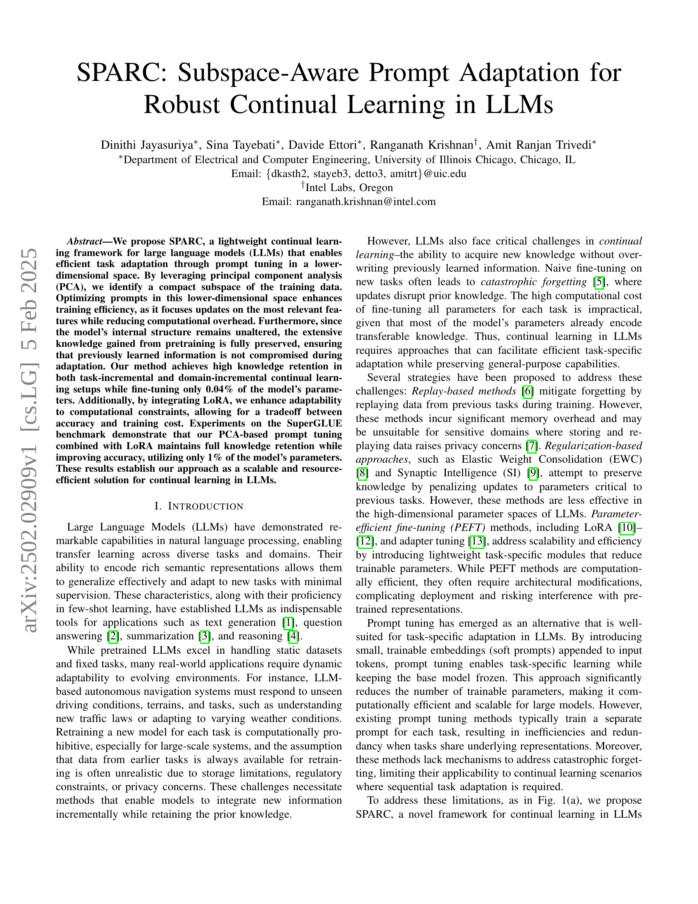

 


 2502.02909 
 Dinithi Jayasuriya et el. 
 
 🤗 2025-02-10 
 



↗ arXiv


↗ Hugging Face


### TL;DR



대규모 언어 모델(LLM)은 다양한 작업에 뛰어난 성능을 보이지만, **지속적인 학습 환경에서는 이전에 학습한 지식을 잊어버리는 catastrophic forgetting 문제와 계산 비용 문제**를 겪습니다. 기존의 해결책들은 메모리 오버헤드가 크거나 모델 구조 수정이 필요한 등의 한계점을 가지고 있습니다. 

본 논문에서는 **하위 공간 기반의 프롬프트 튜닝을 통해 이러한 문제를 해결하는 새로운 프레임워크인 SPARC를 제안**합니다. SPARC는 PCA를 이용하여 하위 공간에서 프롬프트를 최적화하여 효율성을 높이고, LoRA와의 통합을 통해 계산 비용과 정확도 간의 균형을 맞춥니다. 실험 결과, SPARC는 **기존 방법 대비 높은 지식 보존율과 정확도**를 달성하여 지속적인 학습 분야에 중요한 기여를 합니다.



#### Key Takeaways


 SPARC는 PCA를 이용하여 하위 공간에서 프롬프트 튜닝을 수행, 계산 효율성을 높이고 catastrophic forgetting을 줄입니다. 



 LoRA와 결합하여 계산 자원 제약 조건 하에서도 높은 정확도를 유지하며, 매개변수 효율성을 극대화합니다. 



 도메인 및 작업 증분 학습 환경에서 우수한 성능을 보이며, 기존 방법 대비 높은 지식 보존율과 정확도를 달성합니다. 


#### Why does it matter?
본 논문은 **지속적인 학습 환경에서 대규모 언어 모델의 효율성과 성능을 동시에 향상시키는 새로운 프레임워크인 SPARC를 제시**합니다. 기존의 방법들이 가진 계산 비용 및  catastrophic forgetting 문제를 해결하여, 다양한 연구 분야에 적용 가능하며 특히 **자원 제약이 심한 환경에서 실용적인 대안**을 제공합니다.  더 나아가, **새로운 연구 방향을 제시**하여 지속적인 학습 분야의 발전에 기여할 것으로 예상됩니다.

------
#### Visual Insights

> 🔼 그림 1은 SPARC의 개요를 보여줍니다. (a)는 새로운 데이터셋의 부분 공간을 PCA를 사용하여 계산하는 과정을 보여줍니다. 이전에 학습된 프롬프트 부분 공간과의 코사인 유사도를 측정하여 유사한 프롬프트가 이미 있는지 확인합니다. 일치하는 프롬프트가 발견되면 기존 프롬프트를 재사용하여 초기화하여 지식 보존을 향상시킵니다. 그렇지 않으면 기존 프롬프트와 직교하는 부분 공간에 새로운 프롬프트를 초기화하여 차별화와 효율적인 적응을 보장합니다. (b)는 프롬프트 임베딩이 조정 가능한 소프트 토큰과 PCA 기반 변환 행렬이라는 두 가지 주요 구성 요소로 구성되어 있음을 보여줍니다. 이러한 설계는 기존 프롬프트 조정 방법에 비해 조정 가능한 매개변수의 수를 크게 줄여 접근 방식을 더욱 효율적으로 만들면서 모델 적응성을 유지합니다.
> 

> 
read the caption

> Figure 1: Overview of SPARC: (a) The subspace of the new dataset is computed using PCA. By measuring the cosine similarity between this new subspace and previously learned prompt subspaces, the framework determines whether a similar prompt already exists. If a match is found, the existing prompt is reused for initialization, enhancing knowledge retention. Otherwise, a new prompt is initialized in an orthogonal subspace to the existing prompts, ensuring differentiation and efficient adaptation. (b) The prompt embeddings consist of two key components: tunable soft tokens and a PCA-based transformation matrix. This design significantly reduces the number of trainable parameters compared to traditional prompt tuning methods, making the approach more efficient while preserving model adaptability.
> 

### In-depth insights

#### Subspace Prompt Tuning
**하위공간 프롬프트 튜닝**은 대규모 언어 모델(LLM)의 지속적인 학습에서 매개변수 효율성과 성능을 동시에 달성하기 위한 혁신적인 방법입니다. 이 기법은 **주성분 분석(PCA)**를 활용하여 입력 임베딩 공간의 하위 공간을 식별하고, 이 하위 공간 내에서 프롬프트를 미세 조정함으로써 계산 비용을 줄이면서 효과적인 작업 적응을 가능하게 합니다. **기존의 프롬프트 튜닝 기법은 각 작업에 대해 별도의 프롬프트를 훈련하여 계산 비용이 많이 들고, 관련 작업 간에 지식 전이가 제한적이라는 단점**이 있습니다. 하위공간 프롬프트 튜닝은 이러한 문제를 해결하기 위해 **하위 공간 간의 유사성을 측정하여 프롬프트를 재사용**하고, 관련 작업이 없는 경우 **직교 하위 공간에 새로운 프롬프트를 초기화**하는 전략을 사용합니다.  이는 **기존 지식을 보존**하고 **새로운 지식을 효과적으로 통합**하는 데 도움이 됩니다.  **LoRA와 같은 매개변수 효율적인 기술과 결합**하면 계산 비용을 더욱 줄일 수 있습니다.  결과적으로, **하위공간 프롬프트 튜닝은 LLM의 지속적인 학습에 있어서 견고하고 확장성 있는 솔루션**을 제공합니다.

#### PCA-based Adaptation
본 논문에서 제안하는 PCA 기반 적응 방법은 **대규모 언어 모델(LLM)**의 지속적인 학습을 위한 효율적이고 강력한 전략입니다. **주성분 분석(PCA)**를 활용하여 고차원의 입력 임베딩 공간을 저차원의 부분 공간으로 축소함으로써, **계산 비용을 절감**하고 **과적합을 방지**합니다.  새로운 작업에 대한 적응은 이러한 저차원 부분 공간 내에서 수행되며, 기존 지식의 손실을 최소화하면서 새로운 지식을 효율적으로 통합합니다.  **기존 작업과의 유사성**을 측정하여 **프롬프트 재사용**을 통해 추가적인 계산 비용을 줄이고, **직교 부분 공간**을 활용하여 새로운 작업을 위한 독립적인 프롬프트를 생성함으로써 **파국적인 망각**을 방지합니다. 이러한 접근 방식은 **매개변수 효율성**을 극대화하고 **모델의 무결성**을 유지하며, **실제 환경**에서의 지속적인 학습에 적합한 솔루션을 제공합니다.  **LoRA와의 통합**을 통해 계산 제약 조건을 완화하고 정확성과 훈련 비용 간의 균형을 맞출 수 있습니다.

#### Continual LLM Learning
지속적인 LLM 학습은 **기존 지식을 유지하면서 새로운 지식을 계속적으로 학습하는 능력**을 의미합니다.  기존의 미세 조정 방식은 이전 지식을 훼손하는 **파괴적 망각** 문제를 야기하며, 모든 매개변수를 조정하는 높은 계산 비용이 문제가 됩니다.  이 논문은 이러한 문제를 해결하기 위해 **차원 축소 및 프롬프트 튜닝**을 활용한 새로운 프레임워크를 제시합니다.  **주성분 분석(PCA)**을 통해 데이터의 핵심 특징을 추출하여 저차원 공간에서 프롬프트를 최적화함으로써 효율성을 높이고, **직교 공간**에 새로운 프롬프트를 초기화하여 망각을 방지합니다.  LoRA와의 통합을 통해 계산 비용과 정확도 간의 절충을 가능하게 합니다.  실험 결과는 **지식 유지율이 높고 정확도가 향상**됨을 보여주며, 매개변수의 극히 일부만 미세 조정해도 효과적임을 입증합니다.  **자원 효율적이고 확장 가능한 지속적 학습 솔루션**을 제공합니다.

#### Orthogonal Subspace
본 논문에서 제시된 직교 부분 공간(Orthogonal Subspace) 개념은 **지속적 학습(Continual Learning)** 환경에서 **기존 지식의 손실(Catastrophic Forgetting)**을 방지하고 새로운 과업에 대한 적응력을 높이기 위한 핵심 전략입니다.  **주성분 분석(PCA)**을 통해 각 과업을 저차원 부분 공간으로 표현하고, **새로운 과업의 부분 공간이 기존 과업의 부분 공간과 직교하도록(Orthogonal)** 설계함으로써, 새로운 지식이 기존 지식을 덮어쓰는 것을 방지합니다.  이는 **다양한 과업에 대한 독립적인 표현 공간**을 확보하여 과업 간의 간섭을 최소화하고, 각 과업에 대한 학습 효율을 극대화하는 데 기여합니다.  **직교성은 수학적으로 cosine 유사도가 0에 가까운 것을 의미하며**, 이를 통해 새로운 지식이 기존 지식과 독립적으로 학습됨을 보장합니다.  이러한 전략은 모델의 **매개변수 효율성(Parameter Efficiency)**을 유지하면서 **지속적인 학습 성능**을 향상시키는 데 중요한 역할을 합니다.

#### Catastrophic Forgetting
본 논문에서 다룬 연속 학습(Continual Learning)의 주요 과제 중 하나는 **파국적 망각(Catastrophic Forgetting)**입니다. 이는 새로운 과제에 대한 학습 과정에서 이전에 학습된 지식이 손상되거나 완전히 사라지는 현상을 말합니다.  **기존의 미세 조정(Fine-tuning)** 방식은 모든 모델 파라미터를 업데이트하기 때문에 파국적 망각이 발생할 가능성이 높습니다.  이를 해결하기 위해 본 논문에서는 **낮은 차원의 공간에서 프롬프트 미세 조정**을 통해 이전 지식을 보존하면서 새로운 과제에 대한 적응력을 높이는 방법을 제시합니다.  **주성분 분석(PCA)**을 활용하여 중요한 특징을 추출하고, 이를 통해 계산 비용을 줄이고 파국적 망각을 최소화합니다. 또한, **LoRA(Low-Rank Adaptation)**와 결합하여 계산 효율성을 더욱 높였습니다.  결과적으로, 제한된 매개변수만 업데이트하면서도 높은 지식 유지율과 정확도를 달성하여 파국적 망각 문제를 효과적으로 해결하는 것을 보여줍니다.

### More visual insights

More on figures

> 🔼 그림 2는 다양한 수의 소프트 토큰과 주성분을 사용하여 모델의 성능을 평가한 결과를 보여줍니다. (a)는 주성분 100개, 소프트 토큰 20개, (b)는 주성분 300개, 소프트 토큰 20개, (c)는 주성분 100개, 소프트 토큰 40개를 사용한 경우의 토큰별 정확도를 나타냅니다. (d)는 PCA 주성분의 개수를 달리하여 정확도를 비교 분석한 결과입니다. 각 그래프는 서로 다른 평가 데이터셋에 대한 모델의 성능을 보여주는 confusion matrix 형태를 띄고 있습니다. 이를 통해 PCA 주성분의 수와 소프트 토큰의 수가 모델의 성능에 미치는 영향을 분석하고 최적의 하이퍼파라미터를 찾는 데 도움이 됩니다.
> 

> 
read the caption

> Figure 2: Per-token accuracy with varying numbers of soft tokens and principal components: (a) 100 principal components, 20 soft tokens. (b) 300 principal components, 20 soft tokens. (c) 100 principal components, 40 soft tokens. (d) Accuracy with different number of PCA components
> 

> 🔼 그림 3은 도메인 증분 학습에서의 정확도를 보여줍니다. (a)는 각 데이터셋에 대해 모델을 개별적으로 미세 조정하여 계산된 비지속적 학습 정확도와 데이터셋들을 순차적으로 미세 조정하여 얻은 최종 정확도를 비교합니다. (b)는 순차적 학습 완료 후 각 데이터셋에 대한 망각 비율을 보여줍니다.  즉, (a)는 각 과제에 대해 개별적으로 학습했을 때의 정확도와 여러 과제를 연달아 학습했을 때의 최종 정확도를 비교하여, 지속적인 학습이 얼마나 성능에 영향을 미치는지 보여줍니다. (b)는 이전에 학습한 과제들의 성능이 얼마나 감소했는지를 보여주어, 지속적인 학습에서의 catastrophic forgetting 현상을 평가합니다.
> 

> 
read the caption

> Figure 3: Accuracy in Domain Incremental Learning. (a) Non-Continual learning Accuracy is calculated by fine-tuning the model individually on each dataset, while final accuracy is obtained by sequentially fine-tuning the model across datasets. (b) Forgetting ratio for each dataset after the completion of sequential training.
> 

> 🔼 그림 4는 과제 증분 학습 방법들의 성능 비교를 보여줍니다.  PCA 기반 학습, 전체 미세 조정, 그리고 LoRA 통합 프롬프트 기반 학습의 세 가지 접근 방식에 대한 정확도 결과를 나타냅니다.  각 접근 방식은 여러 NLP 과제에 대한 연속적인 학습 설정에서의 성능을 평가하여,  전이 학습 능력과 이전에 학습된 지식의 유지 측면에서 비교 분석합니다.  특히,  PCA 기반 접근 방식은 매개변수 효율성과 지식 보존 측면에서의 강점을 보여줍니다.
> 

> 
read the caption

> Figure 4: Performance Comparison of Task-Incremental Learning Methods: Accuracy results for three approaches, PCA-Based Learning, Full Finetuning, and LoRA-Integrated Prompt-Based Learning.
> 

### Full paper



