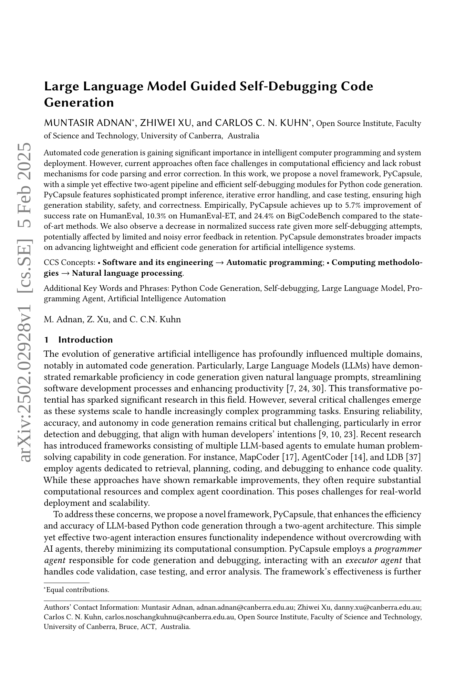

 


 2502.02928 
 Muntasir Adnan et el. 
 
 🤗 2025-02-06 
 



↗ arXiv


↗ Hugging Face


### TL;DR



자동 코드 생성은 소프트웨어 개발의 생산성을 높일 수 있는 유망한 분야이지만, 코드의 정확성과 신뢰성을 보장하는 것은 여전히 어려운 과제입니다. 특히, 복잡한 프로그래밍 작업에서 오류를 탐지하고 디버깅하는 것은 어렵고, 기존의 접근 방식은 종종 많은 계산 자원을 필요로 합니다. 

본 논문에서는 이러한 문제를 해결하기 위해 PyCapsule이라는 새로운 프레임워크를 제안합니다. PyCapsule은 단순하면서도 효과적인 두 에이전트 파이프라인과 효율적인 자가 디버깅 모듈을 사용하여 파이썬 코드 생성의 효율성과 정확성을 높입니다.  **PyCapsule은 정교한 프롬프트 추론, 반복적인 오류 처리, 그리고 케이스 테스트를 통해 높은 생성 안정성, 안전성 및 정확성을 보장**합니다.



#### Key Takeaways


 PyCapsule은 기존의 다중 에이전트 접근 방식에 비해 계산 오버헤드가 크게 줄어든 효율적인 프레임워크임 



 PyCapsule은 HumanEval, HumanEval-ET, BigCodeBench에서 최첨단 성능을 달성함 



 자가 디버깅 시도가 증가함에 따라 정규화된 성공률이 감소하는 경향을 관찰, 제한된 오류 피드백의 영향을 시사함 


#### Why does it matter?
본 논문은 **오류 수정 기능을 갖춘 효율적인 코드 생성 프레임워크인 PyCapsule을 제시**함으로써 인공지능 시스템을 위한 경량화된 코드 생성을 발전시키는 데 기여합니다.  **다양한 벤치마크 데이터셋에서 최첨단 성능을 달성**하고 **계산 비용을 절감**하는 PyCapsule의 효율성은 자동 코드 생성 분야 연구자들에게 중요한 의미를 지닙니다. 또한, 제한된 오류 피드백 상황에서의 자가 디버깅 시도에 대한 통찰력을 제공하여 **추후 연구 방향을 제시**합니다. 이는 **자동 코드 생성의 신뢰성 및 자율성 향상**에 대한 지속적인 연구 노력에 중요한 기여를 할 것으로 예상됩니다.

------
#### Visual Insights

> 🔼 그림 1은 OpenSI-CoSMIC (Adnan et al., 2024)의 Python 코드 생성 서비스로서 PyCapsule 프레임워크를 보여줍니다. PyCapsule은 Docker 컨테이너 내에서 디버깅, 에러 처리 및 코드 실행을 포함한 반복적인 코드 생성 과정으로 구성됩니다.  도식은 PyCapsule의 두 가지 주요 에이전트인 프로그래머 에이전트와 실행자 에이전트의 상호 작용과 데이터 흐름을 시각적으로 보여줍니다.  프로그래머 에이전트는 코드 생성 및 디버깅을 담당하며, 실행자 에이전트는 생성된 코드의 검증과 실행 결과를 기반으로 피드백을 제공합니다.  이러한 반복적인 과정을 통해 PyCapsule은 안정적이고 정확한 Python 코드 생성을 가능하게 합니다.  도식에는 각 에이전트의 기능과, 에러 처리 모듈, 대화 기록, 벡터 데이터베이스 등 PyCapsule의 주요 구성 요소들이 포함되어 있어, 시스템의 작동 원리를 명확하게 이해하는 데 도움을 줍니다.
> 

> 
read the caption

> Figure 1. PyCapsule framework as Python code generation service of OpenSI-CoSMIC (Adnan et al., 2024). PyCapsule consists of iterative code generation with debugging, error handling, and code execution within a Docker container.
> 


| Method | HumanEval | HumanEval-ET | MBPP | MBPP-ET | BigCodeBench |
|---|---|---|---|---|---| 
| GPT-4-Preview-1106 |  |  |  |  |  |
| Direct | 80.1[2023] | – | 81.1[2024] | – | – |
| CoT[2024] | 89.0 | – | 82.4 | – | – |
| Self-Planning[2024] | 85.4 | – | 75.8 | – | – |
| AgentCoder[2024b]1 | 96.3 | 86.0 | 91.8 | 91.8 | – |
| MapCoder[2024] | 93.9 | 82.9 | 82.1 | 57.7 | – |
| PyCapsule (ours) | **96.5 ± 0.7** | **96.3 ± 1.2** | 88.2 ± 0.3 | 73.0 ± 0.8 | – |
| GPT-3.5-Turbo-1106 |  |  |  |  |  |
| Direct | 48.1[2024] | – | 49.8[2024] | – | – |
| Direct (LDB[2024]) | 73.8 | – | 67.6 | – | – |
| CoT[2024] | 68.9 | – | 54.5 | – | – |
| Self-Planning[2023] | 60.3 | – | 55.7 | – | – |
| Reflexion[2023] | 67.1 | – | 73.0 | – | – |
| AgentCoder[2024b]1 | 79.9 | 77.4 | **89.9** | **89.1** | – |
| MapCoder[2024] | 80.5 | 70.1 | 78.3 | 54.4 | – |
| LDB[2024] | 82.9 | – | 76.0 | – | – |
| Qwen2.5-Coder-7B-Instruct |  |  |  |  |  |
| Direct[2024] | 88.4 | – | **83.5** | – | 41.0 |
| PyCapsule (ours) | **94.1 ± 1.3** | **93.3 ± 0.6** | 80.7 ± 0.9 | **63.6 ± 0.6** | **65.4 ± 0.8** |

1Could not be reproduced during our experiments.

> 🔼 표 1은 세 가지 인기 있는 대규모 언어 모델(LLM)에서 PyCapsule의 성능을 비교 분석한 표입니다. PyCapsule은 제안된 새로운 코드 생성 프레임워크이며, 본 논문에서는 세 가지 LLM(GPT-4-Preview-1106, GPT-3.5-Turbo-1106, Qwen2.5-Coder-7B-Instruct)을 사용하여 HumanEval, HumanEval-ET, MBPP, MBPP-ET, BigCodeBench 등 다섯 가지 벤치마크 데이터셋에 대한 성공률을 측정했습니다.  표에는 각 모델과 데이터셋에 대한 평균 성공률과 표준 편차가 제시되어 있으며, PyCapsule의 결과는 세 번의 반복 실험의 평균값과 표준 편차로 표현되어 있습니다.  다른 방법들의 결과는 해당 논문의 공식 보고서에서 가져왔습니다.  이 표는 PyCapsule의 성능을 기존의 다른 방법들과 비교하여 PyCapsule의 효율성과 정확성을 보여줍니다.
> 

> 
read the caption

> Table 1. Success rate comparison on three popular LLMs. We provide the mean value and standard deviation for PyCapsule with three experiment repeats. The results of other methods are from their official reports.
> 

### In-depth insights

#### Self-Debugging Codes
자체 디버깅 코드는 인공지능 기반 코드 생성의 핵심적인 부분입니다. **오류 감지 및 수정을 위한 강력한 메커니즘**을 갖추어야 하며, 개발자의 개입 없이도 높은 정확도와 안정성으로 코드를 생성해야 합니다.  본 논문에서 제시된 PyCapsule 프레임워크는 **두 개의 에이전트(프로그래머 에이전트와 실행기 에이전트)**를 사용하여 효율적인 자체 디버깅을 구현합니다.  프로그래머 에이전트는 코드 생성 및 디버깅을 담당하고, 실행기 에이전트는 코드 실행 및 검증을 통해 피드백을 제공합니다. 이러한 **상호 작용을 통해 코드의 품질과 정확성이 향상**됩니다.  하지만, **제한된 오류 정보와 노이즈**로 인해 자체 디버깅 시도 횟수가 증가할수록 성공률이 감소하는 현상이 관찰되었는데, 이는 향후 연구에서 개선되어야 할 부분입니다.  PyCapsule은 **자원 효율성을 중시**하여 복잡한 다중 에이전트 시스템보다 효율적인 코드 생성을 가능하게 합니다.  **오류 처리 모듈, 예제 호출 감지 모듈, 함수 시그니처 변환 모듈**과 같은 전문화된 모듈은 디버깅 과정을 효율화하고 안정성을 높입니다.

#### Dual-Agent Approach
본 논문에서 제안하는 **듀얼 에이전트 접근 방식**은 프로그래머 에이전트와 실행 에이전트라는 두 가지 주요 구성 요소를 중심으로 설계되었습니다. 프로그래머 에이전트는 코드 생성과 디버깅을 담당하며, 실행 에이전트는 생성된 코드의 검증 및 오류 분석을 수행합니다. 이러한 분업을 통해 **각 에이전트의 전문성을 높이고 시스템의 효율성을 극대화**하는 것을 목표로 합니다.  **상호작용을 최소화**하여 계산 비용을 절감하고, 잘 정의된 프로세스를 통해 실시간 피드백 루프를 가능하게 합니다.  **오류 처리 모듈**은 에이전트 간의 상호 작용을 간소화하는 동시에 더 나은 오류 정보를 제공하는 역할을 합니다.  **에이전트 간의 효율적인 협업을 통해** 코드 생성의 정확성과 안정성을 향상시키는 데 중점을 둡니다.  결론적으로 이 접근 방식은 자원 효율성과 성능 사이의 균형을 유지하며, 복잡한 문제에도 효과적으로 대응하는 강점을 지닙니다.

#### LLM Efficiency Gains
본 논문은 대규모 언어 모델(LLM) 기반 코드 생성의 효율성 향상에 중점을 둡니다. **PyCapsule이라는 새로운 프레임워크**를 통해 기존의 다중 에이전트 접근 방식보다 훨씬 적은 계산 자원으로 높은 성능을 달성합니다. 이는 **두 개의 에이전트(프로그래머 에이전트와 실행기 에이전트)**만을 사용하는 간단하지만 효과적인 아키텍처를 통해 가능합니다.  **오류 처리, 예제 호출 감지, 함수 서명 변환기 등의 특수 모듈**을 통해 자체 디버깅 프로세스가 향상되고, **반복적인 디버깅 시도의 영향**에 대한 분석을 통해 효율적인 디버깅 전략을 제시합니다.  결과적으로, PyCapsule은 다양한 벤치마크 데이터 세트에서 최첨단 성능을 달성하며, 계산 비용을 크게 줄이고 신뢰성을 높여 실제 환경에서의 적용 가능성을 높였습니다. **LLM의 규모를 줄이면서도 성능을 유지하는 전략**은 특히 주목할 만하며, 이는 LLM 기반 코드 생성 분야의 발전에 큰 기여를 할 것으로 예상됩니다.

#### Iterative Debugging
본 논문에서 제시된 반복적 디버깅(Iterative Debugging)은 **오류 메시지**를 활용하여 생성된 코드의 정확성을 높이는 핵심 전략입니다.  단순히 에러를 수정하는 것을 넘어, **에러 핸들링 모듈**과 **프로그래머 에이전트**의 상호작용을 통해 지속적인 개선을 이룹니다.  이러한 과정은 **대화 이력**을 활용하여 더욱 정교한 피드백을 제공하고, **복잡한 문제**에 대한 해결 능력을 향상시킵니다. 특히, 제한된 리소스 환경에서도 효율적인 디버깅을 가능하게 하여 **실세계 적용 가능성**을 높였습니다.  그러나, 반복 횟수가 증가할수록 성공률이 감소하는 현상은 **오류 메시지의 한계**와 관련이 있으며, 추후 **더욱 정교한 오류 분석 및 피드백 메커니즘**의 개선이 필요함을 시사합니다.

#### Future Research
본 논문에서 제시된 PyCapsule 프레임워크는 효율적인 코드 생성과 자가 디버깅을 위한 중요한 발걸음이지만, **여러 가지 흥미로운 추가 연구 방향**을 제시합니다.  **더욱 정교한 에러 처리 모듈** 개발을 통해 다양한 에러 유형에 대한 더욱 정확한 진단 및 수정이 가능할 것입니다. 또한, **다양한 프로그래밍 언어** 지원을 위한 확장성 연구도 필요합니다.  현재 파이썬에 국한된 PyCapsule을 다른 언어로 확장하면 적용 범위를 크게 넓힐 수 있습니다.  **다른 머신러닝 모델**과의 통합 또한 중요한 과제입니다.  PyCapsule의 성능을 더욱 향상시키고 다양한 상황에 적응하기 위해서는, 다른 모델의 강점을 활용하는 연구가 필요합니다.  마지막으로, **자가 디버깅 과정의 투명성 및 설명 가능성**을 높이는 연구가 중요합니다.  현재의 자가 디버깅 과정은 블랙박스처럼 동작하기 때문에, 사용자는 그 이유를 명확히 파악하기 어렵습니다.  설명 가능한 AI 기술을 도입하여 자가 디버깅의 과정을 명확히 보여주는 것이 향후 연구의 중요한 목표가 될 것입니다. 이러한 연구들을 통해 PyCapsule은 더욱 강력하고 신뢰할 수 있는 코드 생성 시스템으로 발전할 수 있을 것입니다.

### More visual insights

More on figures

> 🔼 그림 2는 여러 데이터 세트에 걸쳐 자가 디버깅 시도 횟수에 따른 상대적 성공률의 분포를 보여줍니다. 상대적 성공률은 성공적인 테스트 사례의 총 수 대비 특정 시도 횟수에서 성공한 테스트 사례 수의 비율을 백분율(%)로 나타낸 것입니다. 모든 데이터 세트에서 시도 횟수가 증가함에 따라 상대적 성공률이 감소하는 경향을 일관되게 보여줍니다.
> 

> 
read the caption

> Figure 2. Distribution of relative success ratios along the self-debugging attempts. The relative success ratio refers to the number of successful test cases with given attempts over the total number of successful test cases, measured by unit %. Results on all the datasets consistently show a decreasing relative success ratio as the number of attempts increases.
> 

> 🔼 그림 3은 두 개의 하위 그림으로 구성됩니다. 왼쪽 하위 그림은 각 자가 디버깅 시도가 독립적인 정확도 향상에 미치는 정규화된 영향을 보여줍니다. 즉, 이전 시도의 영향을 제거하고 각 시도의 순수한 효과만을 보여줍니다. 오른쪽 하위 그림은 누적 영향을 정규화하지 않고 각 자가 디버깅 시도가 전반적인 정확도에 미치는 평균 영향을 강조합니다. 즉, 이전 시도들의 영향을 포함하여 누적된 효과를 보여줍니다.  두 하위 그림을 통해 자가 디버깅 시도가 정확도 향상에 미치는 영향을 다각적으로 분석하여, 초기 시도의 효과가 크지만 반복할수록 효과가 감소하는 현상을 보여줍니다.
> 

> 
read the caption

> Figure 3. The left subfigure shows the normalized influence of each self-debugging attempt through independent accuracy improvements. The right subfigure highlights the mean influence of each self-debugging attempt on the overall accuracy through the accumulated influence without normalization.
> 

> 🔼 그림 4는 HumanEval 벤치마크에서 디버깅 시도 횟수를 시각적으로 보여줍니다. 왼쪽 열은 각 점이 하나의 문제를 나타내는 디버깅 시도 횟수를 보여주며, 실패한 작업은 빨간색으로 강조 표시됩니다. 오른쪽 열은 세 번의 실험에 걸쳐 각 모델의 평균 디버깅 시도 횟수와 표준 편차를 보여줍니다. 음영 처리된 영역은 성능의 변동성을 나타내며, 각 모델의 일관성과 신뢰성을 보여줍니다.
> 

> 
read the caption

> Figure 4. Visualisation of Debugging Attempts. The left column represents the number of debugging attempts on the HumanEval benchmark. Each point represents a problem, with failed tasks highlighted in red. The right column displays the mean number of debugging attempts and the associated sample standard deviations across three experiments for each model. The shaded areas in the right column indicate the variability in performance, illustrating the consistency and reliability of each model.
> 

> 🔼 그림 5는 HumanEval 데이터셋의 문제들을 GPT-4-1106 모델을 사용하여 세 번의 반복 실험에서 디버깅 시도 횟수에 따른 결과를 보여줍니다. 각 선은 하나의 문제에 대한 최대 5번까지의 디버깅 시도 과정을 나타내며, 빨간색 마커는 실패한 시도를 의미합니다. 파란색, 녹색, 주황색 선은 각각 실험 1, 2, 3의 결과를 나타내고, y축은 각 문제를 해결하는 데 걸린 시도 횟수를 나타냅니다. 이 그림은 반복적인 디버깅 시도가 문제 해결에 미치는 영향과 그 일관성 및 신뢰성을 보여줍니다.
> 

> 
read the caption

> Figure 5. HumanEval experiment results using GPT-4-1106 across three repeats. Each line represents the progression of debugging attempts (up to 5) for tasks in the HumanEval dataset. Red markers denoting failed attempts. The coloured lines correspond to Experiment 1 (blue), Experiment 2 (green), and Experiment 3 (orange). The y-axis reflects the number of attempts taken to resolve each task.
> 

### Full paper



