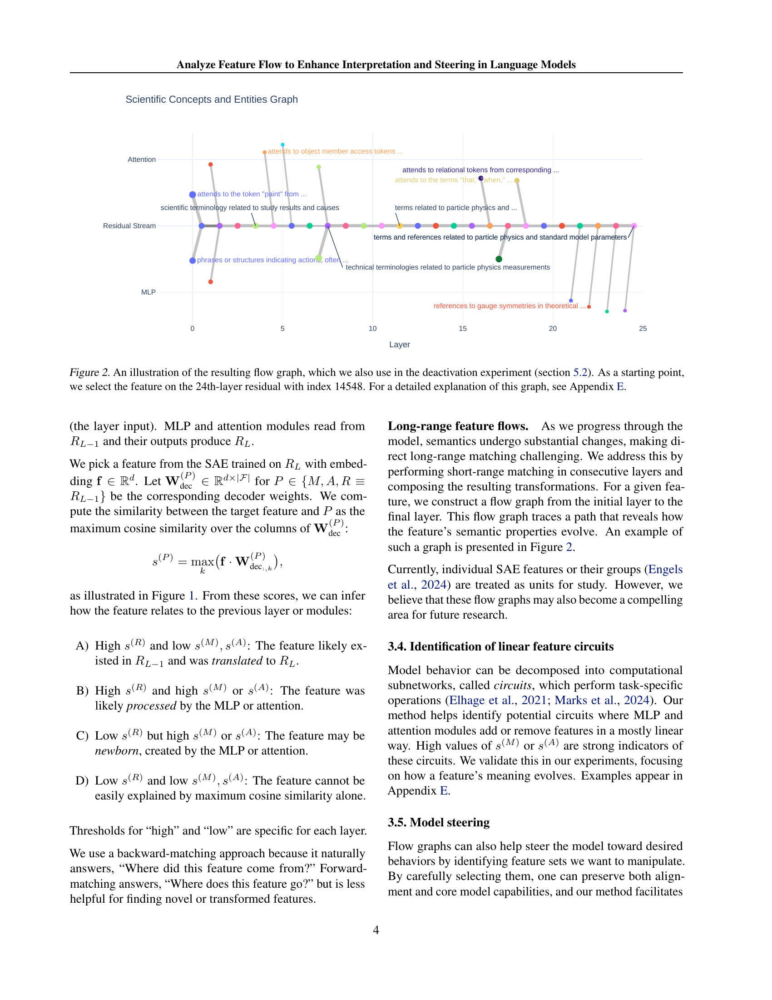
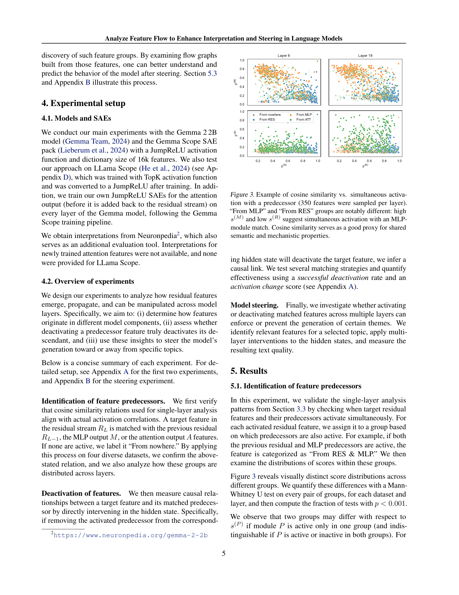
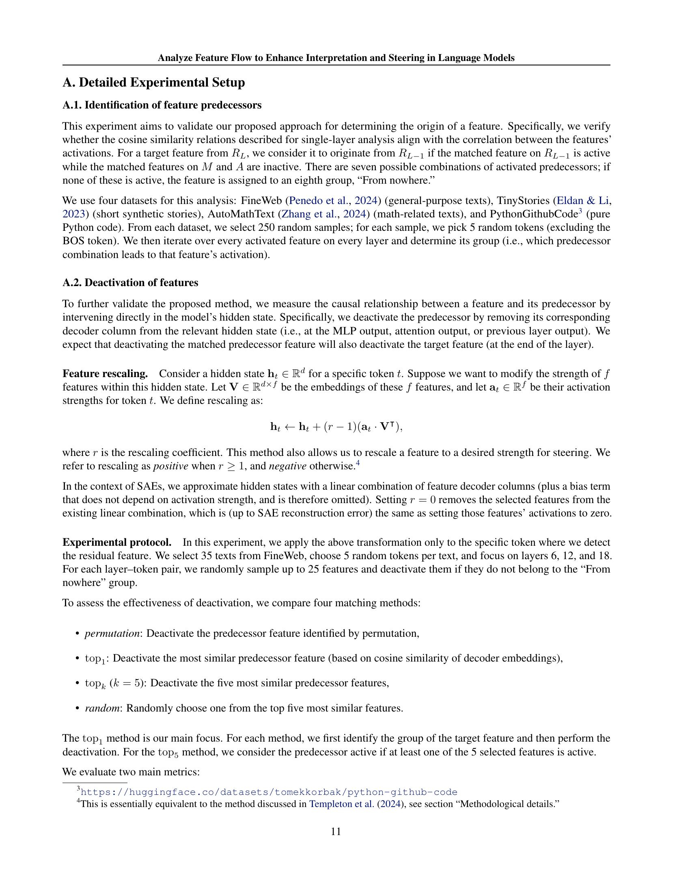

 


 2502.03032 
 Daniil Laptev et el. 
 
 🤗 2025-02-07 
 



↗ arXiv


↗ Hugging Face


### TL;DR



대규모 언어 모델(LLM)은 뛰어난 성능에도 불구하고 내부 동작이 불투명하여 해석과 제어가 어렵다는 문제가 있습니다. 기존 연구는 주로 단일 계층 또는 잔차 흐름에만 초점을 맞춰왔습니다. 이러한 한계를 극복하기 위해, 본 논문에서는 희소 자동 인코더(SAE)를 활용하여 LLM의 연속적인 계층에 걸쳐 특징의 흐름을 추적하고 분석하는 새로운 방법론을 제시합니다.

본 논문의 핵심 방법은 데이터가 필요 없는 코사인 유사도 기법을 사용하여 각 계층에서 특징의 지속성, 변환, 최초 출현 여부를 추적하는 것입니다. 이를 통해, 각 계층에서 특징의 진화 과정을 보여주는 세분화된 흐름 그래프를 생성하고, 모델의 계산 과정에 대한 정교한 해석과 기계적인 통찰력을 제공합니다. 특히, 선택된 특징을 증폭 또는 억제함으로써 모델의 행동을 직접적으로 제어하고, 텍스트 생성에서 주제를 목표 지향적으로 제어하는 데 성공했습니다. 이는 원활하고 투명한 모델 조작을 위한 새로운 수단을 제공합니다.



#### Key Takeaways


 희소 자동 인코더(SAE)를 이용하여 대규모 언어 모델(LLM)에서 발견된 특징들을 연속적인 계층에 걸쳐 체계적으로 매핑하는 새로운 방법 제시 



 계층 간 특징 흐름 그래프를 생성하여 모델의 계산 과정에 대한 세분화된 해석성과 기계적인 통찰력 제공 



 계층 간 특징 지도를 활용하여 모델의 행동을 직접적으로 제어하고, 텍스트 생성에서 목표 지향적인 주제 제어 달성 


#### Why does it matter?
본 논문은 **대규모 언어 모델의 해석성과 제어 기능을 향상**시키는 데 중요한 의미를 지닙니다. **데이터가 없는 방식으로 모델의 내부 동작을 분석하고 조작**할 수 있는 새로운 방법론을 제시하여, 향후 연구에서 **모델의 투명성과 제어 가능성을 높이는 데 크게 기여**할 수 있습니다. 특히, **다양한 응용 분야에서 모델의 행동을 목표 지향적으로 제어**할 수 있는 가능성을 열어주는 중요한 발걸음이 될 것입니다.

------
#### Visual Insights

> 🔼 그림 1은 모델 내부의 특징 매핑 과정을 도식적으로 보여줍니다. 각 계층의 출력에서 학습된 SAE(Sparse Autoencoder)의 특징 중 하나(인덱스 i)를 선택합니다. 이 특징의 임베딩 벡터(f)는 해당 SAE의 디코더 가중치의 i번째 열에 해당합니다.  선택된 특징 벡터는 같은 계층의 다른 SAE(MLP 및 어텐션 블록 이후, 그리고 이전 계층의 잔차 스트림의 SAE)의 모든 열들과 비교됩니다. 이 비교를 통해 특징의 기원(source)을 파악할 수 있습니다. 자세한 내용은 3.3절을 참조하십시오.
> 

> 
read the caption

> Figure 1: Schematic illustration of inner-layer matching. We select a feature with index i𝑖iitalic_i on the SAE trained at the layer output. Its embedding 𝐟𝐟\mathbf{f}bold_f, which is the i𝑖iitalic_ith column of this SAE’s decoder weight, is compared to every column of other SAEs on the same layer (after the MLP and attention blocks, as well as with the SAE on the residual stream before some layer). These comparisons indicate the feature’s source. See Section 3.3 for more details.
> 


| Feature index | Interpretation from Neuronpedia |
|---|---| 
| 3/res/9811 | terms related to gravity and its influences |
| 18/res/14053 | terms related to theoretical frameworks and conceptual models |
| 18/res/1336 | references to Dark Matter and astronomical phenomena |
| 20/res/4506 | terms related to physical laws and scientific principles |
| 21/res/13226 | references to quantum concepts and theories |
| 22/res/9002 | terms related to models and their specifications, |
| 22/res/15105 | terms related to force and energy dynamics |
| 23/res/4086 | terms related to forces and dynamics in physical systems |
| 24/res/7017 | terms related to electromagnetic interactions and properties |
| 24/res/14548 | terms and references related to particle physics and standard model parameters |

> 🔼 이 표는 논문의 'Scientific concepts and entities' 주제의 비활성화를 위해 초기 선택된 특징들을 보여줍니다. 각 특징은 해당 레이어, 모듈, 그리고 Neuronpedia에 의해 제공된 해석과 함께 표시됩니다. 이 표는 모델의 특징들이 어떻게 주제와 관련되는지를 이해하는 데 도움을 줍니다.
> 

> 
read the caption

> Table 1: Features initially chosen for deactivation of “Scientific concepts and entities” theme.
> 

### In-depth insights

#### Cross-Layer Feature Flow
본 논문에서 제시하는 '계층 간 특징 흐름(Cross-Layer Feature Flow)' 분석은 **대규모 언어 모델(LLM)의 해석성과 제어능력 향상**이라는 중요한 목표를 달성하기 위한 핵심 전략입니다. 기존의 단일 계층 분석 방식을 넘어, **여러 계층에 걸쳐 특징들의 생성, 변환, 소멸 과정을 추적**함으로써 모델의 내부 동작 메커니즘에 대한 심층적인 이해를 제공합니다. 특히, **희소 자동 인코더(SAE)**를 활용하여 추출된 해석 가능한 특징들을 중심으로 계층 간 연결 관계를 시각화하고, 이를 통해 **특징의 수명 주기, 계층 간 상호 작용, 정보 흐름 경로** 등을 명확하게 파악할 수 있습니다.  **유동 그래프(flow graph)**를 통해 시각화된 특징의 흐름은 단순히 모델의 작동 원리를 설명하는 것에 그치지 않고, **모델의 행동을 직접적으로 제어**하는 데 활용될 수 있습니다. 특징의 활성화 또는 억제를 통해 **텍스트 생성의 주제를 목표 지향적으로 조절**하는 것이 가능하며, 이는 **투명하고 제어 가능한 LLM 조작**을 위한 새로운 가능성을 제시합니다.  결론적으로, 본 연구는 LLM의 블랙박스성을 극복하고, 모델의 해석성과 제어능력을 향상시키기 위한 혁신적인 방법론을 제시하며, 향후 LLM 연구 발전에 크게 기여할 것으로 기대됩니다.

#### Data-Free SAE Matching
데이터 없는 SAE 매칭은 **대규모 언어 모델(LLM)**의 내부 표현에 대한 통찰력을 얻기 위해 **사전 훈련된 희소 자동 인코더(SAE)**를 활용하는 데이터 기반이 아닌 접근 방식입니다. 이 기법은 LLM의 연속적인 계층 간에 발견된 특징의 전파와 변형을 추적하여 **특징 흐름 그래프**를 생성합니다. 이 그래프는 모델의 계산적 메커니즘에 대한 세부적인 해석을 가능하게 하며, 특징의 기원, 지속성, 변환을 파악할 수 있게 합니다.  **코사인 유사도**를 사용하여 계층 간의 SAE 특징을 비교 분석함으로써, 이 방법은 특징의 출현과 소멸 패턴을 밝혀내고, 이러한 정보를 이용하여 모델의 동작을 직접적으로 제어하는 방법을 제공합니다.  **데이터가 필요 없다는 점**이 특징이며, 이를 통해 모델의 내부 작동 방식에 대한 데이터 독립적인 이해를 제공하는 강력한 도구가 됩니다. 이는 모델의 해석성을 향상시키고, 투명한 방식으로 LLM을 조작할 수 있는 새로운 방법을 제시합니다.

#### Multi-Layer Model Steer
본 논문에서 제시된 다층 모델 조정(Multi-Layer Model Steering) 기법은 **단일 계층 분석의 한계를 극복**하고, **모델의 다층적 구조를 고려**하여 보다 효과적이고 정교한 모델 제어를 가능하게 합니다.  기존의 단일 계층 접근 방식은 특정 계층에서의 특징만을 고려하여 모델 동작을 제한적으로 조정하는 반면, 다층 모델 조정 기법은 **여러 계층에 걸쳐 특징의 흐름(flow graphs)을 추적**하고, **선택적인 특징의 증폭 또는 억제**를 통해 모델의 행동을 목표 지향적으로 조절합니다. 이를 통해 **텍스트 생성 과정에서 특정 주제에 대한 테마 제어를 보다 정밀하게 수행**할 수 있으며, **모델의 내부 동작에 대한 이해도를 높이는 데 기여**합니다.  **SAE(Sparse Autoencoder) 특징을 활용**하여 해석 가능성을 높이고, **데이터가 필요 없는(data-free) 방식**으로 모델의 다층적 구조와 특징의 동적 변화를 분석하는 것이 핵심입니다.  결과적으로 다층 모델 조정 기법은 대규모 언어 모델의 해석성과 제어력을 향상시키는 강력한 도구로서, 다양한 응용 분야에서 활용될 가능성을 보여줍니다.

#### Circuit-Like Computations
본 논문에서 제시된 '순환적 계산(Circuit-Like Computations)' 개념은 **대규모 언어 모델(LLM)** 내부의 특징들이 **다층적이고 상호작용적인 방식**으로 처리되는 과정을 설명합니다.  **희소 자동 인코더(SAE)**를 활용하여 추출된 특징들은 단순히 각 층에서 독립적으로 존재하는 것이 아니라, **다양한 모듈(MLP, 어텐션)**을 거치면서 **진화하고 변형**되며, 이러한 과정이 모델의 최종 출력에 영향을 미칩니다.  이는 마치 전자 회로처럼 특징들이 연결되고 상호 작용하는 **흐름 그래프(flow graph)**로 시각화될 수 있으며, 이를 통해 **모델의 작동 원리를 보다 명확하게 이해**할 수 있습니다.  **다층적 특징 흐름 분석**은 모델의 내부 메커니즘을 밝히는 데 도움을 줄 뿐만 아니라, **목표 지향적인 모델 조작**을 위한 새로운 가능성을 제시합니다.  특정 특징을 증폭하거나 억제함으로써 텍스트 생성의 주제나 스타일을 제어할 수 있다는 점은 **LLM의 해석력 및 제어력 향상**에 크게 기여할 것으로 예상됩니다.

#### Future Research: Circuits
미래 연구의 초점은 **순환 신경망(RNN)** 및 **순환적 구조**를 가진 다른 모델 아키텍처에서의 회로(circuit) 개념을 더욱 심층적으로 이해하는 데 맞춰져야 합니다.  이는 단순히 회로의 존재를 확인하는 것을 넘어, **회로의 기능, 상호 작용, 그리고 모델의 전체 동작에 미치는 영향**을 정확하게 규명하는 것을 의미합니다. 특히, **다양한 유형의 회로와 그 역할**, 그리고 **회로 간의 상호 작용**을 이해하는 것이 중요하며, 이를 통해 모델의 예측 및 생성 과정에 대한 더욱 깊이 있는 통찰력을 얻을 수 있습니다.  또한, **회로의 생성 및 진화 과정**을 규명하여 모델 학습 과정 자체에 대한 새로운 이해를 도출하고, 이를 바탕으로 **더욱 효율적이고 해석 가능한 모델**을 설계하는 데 활용할 수 있습니다.  궁극적으로는, 이러한 연구를 통해 **인공지능 모델의 신뢰성 및 설명 가능성을 향상**시키고, 보다 안전하고 책임감 있는 인공지능 기술 개발에 기여할 수 있습니다.

### More visual insights

More on figures

> 🔼 그림 2는 본 논문의 5.2절 비활성화 실험에서 사용된 특징 흐름 그래프를 보여줍니다.  24번째 레이어의 잔차(residual) 스트림에서 인덱스 14548번 특징을 시작점으로 하여, 해당 특징이 모델의 여러 레이어를 거치면서 어떻게 변화하고 전파되는지를 시각적으로 나타냅니다.  각 레이어에서의 MLP, 어텐션, 그리고 잔차 스트림의 특징 간 유사도를 계산하여, 특징의 기원과 진화 과정을 추적합니다.  자세한 내용은 부록 E를 참조하십시오.
> 

> 
read the caption

> Figure 2: An illustration of the resulting flow graph, which we also use in the deactivation experiment (section 5.2). As a starting point, we select the feature on the 24th-layer residual with index 14548. For a detailed explanation of this graph, see Appendix E.
> 

> 🔼 그림 3은 이전 층(predecessor)과 동시 활성화와 코사인 유사도의 관계를 보여줍니다. 각 층에서 350개의 특징을 샘플링하여 분석했습니다.  'From MLP' 그룹은 s(M)이 높고 s(R)이 낮은 반면, 'From RES' 그룹은 그 반대입니다.  이는 MLP 모듈과의 동시 활성화를 시사합니다. 코사인 유사도는 공유된 의미 및 기전적 특성을 나타내는 좋은 지표로 사용될 수 있습니다.
> 

> 
read the caption

> Figure 3: Example of cosine similarity vs. simultaneous activation with a predecessor (350 features were sampled per layer). “From MLP” and “From RES” groups are notably different: high s(M)superscript𝑠𝑀s^{(M)}italic_s start_POSTSUPERSCRIPT ( italic_M ) end_POSTSUPERSCRIPT and low s(R)superscript𝑠𝑅s^{(R)}italic_s start_POSTSUPERSCRIPT ( italic_R ) end_POSTSUPERSCRIPT suggest simultaneous activation with an MLP-module match. Cosine similarity serves as a good proxy for shared semantic and mechanistic properties.
> 

> 🔼 그림 4는 각 모듈의 유사도 점수에 대한 그룹 간 통계적으로 유의미한 차이의 비율을 보여줍니다. AO는 모듈 P가 한 그룹에서만 활성화됨을 의미하고, AB는 두 그룹 모두에서 활성화됨을, IB는 두 그룹 모두에서 비활성화됨을 의미합니다. MLP의 경우, MLP가 두 그룹 모두에서 활성화될 때 두 그룹의 s(R)이 서로 다른 경우는 87%에 불과합니다. 이는 MLP 모듈이 활성화된 상태에서도 두 그룹 간에 공통된 특징이 상당히 존재함을 시사합니다.
> 

> 
read the caption

> Figure 4: Percentage of statistically significant differences between groups for each module’s similarity scores. AO means module P𝑃Pitalic_P is active in only one group, AB means active in both, and IB means inactive in both. For MLP, two groups differ in s(R)superscript𝑠𝑅s^{(R)}italic_s start_POSTSUPERSCRIPT ( italic_R ) end_POSTSUPERSCRIPT only 87% of the time when MLP is active in both groups.
> 

> 🔼 그림 5는 Gemma 2-2B 모델의 각 계층에서 각 그룹의 백분율을 보여줍니다. 이 그림은 모델에서 특징(feature)이 어떻게 형성되는지를 보여주는 시각적 자료입니다.  각 계층별로 'From nowhere', 'From RES', 'From MLP', 'From ATT', 그리고 이들의 조합으로 이루어진 여러 그룹들의 비율을 나타내어, 모델 내에서 특징이 어떻게 생성되고, 다른 계층의 특징들과 어떻게 연결되는지를 보여줍니다. 특히, 초기 계층에서는 'From nowhere'와 'From RES' 그룹의 비중이 높고, 계층이 깊어짐에 따라 'From MLP' 그룹의 비중이 증가하는 경향을 보여줍니다. 이는 모델의 계층적 구조와 특징 형성 과정을 이해하는데 중요한 시각적 정보를 제공합니다.
> 

> 
read the caption

> Figure 5: Percentages of each group at each layer of Gemma 2 2B, illustrating how feature formation proceeds in the model.
> 

> 🔼 그림 6은 다양한 비활성화 방법을 비교하여 보여줍니다. 각 그룹의 레이블은 어떤 활성 전임자가 비활성화되었는지 나타냅니다. 무작위 접근 방식은 성능이 저조하여 최상위 1개 특징을 선택하는 것이 이미 인과 분석에 의미가 있음을 시사합니다. 즉, 특정 특징의 활성화 여부가 다른 특징의 활성화에 영향을 미치는지, 그리고 그 인과 관계를 분석하는 데 있어 최상위 1개 특징의 선택이 효과적인 방법임을 보여주는 실험 결과입니다.
> 

> 
read the caption

> Figure 6: Deactivation methods compared. Group labels show which active predecessors were deactivated. The random approach underperforms, suggesting that choosing the top1subscripttop1\operatorname{top}_{1}roman_top start_POSTSUBSCRIPT 1 end_POSTSUBSCRIPT feature is already meaningful for causal analysis.
> 

> 🔼 그림 7은 한 번에 하나의 전구체를 비활성화할 때 평균 활성화 변화를 보여줍니다. 어떤 전구체의 비활성화는 그 전구체가 단독으로 활성화되지 않을 경우 영향이 적다는 것을 보여주는데, 이는 결합된 그룹이 회로와 같은 동작을 한다는 결론으로 이어집니다. 즉, 여러 특징들이 함께 작용하여 특정 기능을 수행하는, 마치 전기 회로와 같은 구조를 가진다는 것을 시사합니다.
> 

> 
read the caption

> Figure 7: Mean activation changes when deactivating one predecessor at a time. Deactivation of some predecessor causes less impact if this predecessor is not activated alone, which leads to the conclusion that combined groups exhibit circuit-like behavior.
> 

> 🔼 그림 8은 모든 사용 가능한 선행 요소를 재조정하여 비활성화 성공률에 미치는 다양한 r 값의 영향을 보여줍니다. r이 1보다 작을 때 활성화 변화는 비선형적으로 증가하는데, 이는 대체 인과 경로가 여전히 정보를 전달하고 있음을 나타냅니다. (Lnew - Lold)/Lold 로 측정된 상대적 손실 변화는 순방향 전달 영향에 대한 대용 지표입니다.
> 

> 
read the caption

> Figure 8: Impact of different r𝑟ritalic_r values on deactivation success, with rescaling of all available predecessors. When r<1𝑟1r<1italic_r < 1, the activation change grows nonlinearly, indicating alternative causal pathways still convey information. Relative loss change measured as (Lnew−Lold)/Loldsubscript𝐿newsubscript𝐿oldsubscript𝐿old(L_{\text{new}}-L_{\text{old}})/L_{\text{old}}( italic_L start_POSTSUBSCRIPT new end_POSTSUBSCRIPT - italic_L start_POSTSUBSCRIPT old end_POSTSUBSCRIPT ) / italic_L start_POSTSUBSCRIPT old end_POSTSUBSCRIPT is a proxy for forward pass impact.
> 

> 🔼 그림 9는 모델의 생성물에서 '과학적 개념 및 실체'라는 주제를 제거하는 실험 결과를 보여줍니다. 점선 검은색 선은 기본 생성 점수를 나타내고, 빨간색 점은 단일 계층 방법에서 각 r 값에 대한 최적의 계층을 표시합니다. r 값이 클수록 성능은 향상되지만 최적의 계층은 더 앞쪽으로 이동합니다. 즉, 특정 주제를 억제하기 위해 모델의 특정 부분을 조작하면 효과가 더 커질 수 있지만, 그 효과는 모델의 앞부분에서 더 두드러지게 나타납니다.
> 

> 
read the caption

> Figure 9: Deactivating the “Scientific concepts and entities” theme. The dashed black line shows the default generation score. Red points mark the best layer for each r𝑟ritalic_r in the single-layer method. Larger r𝑟ritalic_r boosts performance but shifts the optimal layer earlier.
> 

> 🔼 그림 10은 최적 비활성화 점수를 비교한 것입니다. 녹색 선은 초기 특징 집합만 사용하여 비활성화했을 때를 나타냅니다. 여러 계층에 걸친 개입(주황색, 파란색)은 다양한 r값에 걸쳐 더 나은 성능을 보이는데, 이는 추가로 발견된 특징들이 하이퍼파라미터 민감도를 감소시킨다는 것을 시사합니다.  즉, 단일 계층에서의 조작보다 여러 계층에 걸쳐 특징을 조작하는 것이 더 효과적임을 보여줍니다.  하이퍼파라미터 값(r)에 따른 성능 변화가 줄어들어 모델의 안정성이 향상되었음을 의미합니다.
> 

> 
read the caption

> Figure 10: Comparison of best deactivation scores. The green line indicates deactivation using only the initial feature set. Multi-layer interventions (orange, blue) perform better across different r𝑟ritalic_r values, suggesting additional discovered features reduce hyperparameter sensitivity.
> 

> 🔼 그림 11은 특정 주제를 활성화시키는 실험 결과를 보여줍니다. 단일 계층 조정과 누적 조정 방법을 세 가지 크기 조정 전략(부록 B 참조)과 비교하여, 여러 유사한 특징을 활성화하면 주제의 존재감은 커지지만 전체 텍스트의 일관성은 저하될 수 있음을 보여줍니다.
> 

> 
read the caption

> Figure 11: Activation of specific topics. We compare single-layer steering and cumulative approaches with three rescaling strategies (Appendix B). Activating multiple similar features amplifies a topic’s presence but may degrade overall text coherence.
> 

> 🔼 그림 12는 제안된 방법의 타당성을 보여주는 두 가지 측면을 보여줍니다. (a)는 네 가지 데이터셋(FineWeb, TinyStories, Python Code, AutoMathText)에 대해 각 그룹의 비율을 보여줍니다.  각 데이터셋은 서로 다른 특징을 가지고 있기 때문에, 각 그룹의 비율이 서로 다르게 나타납니다.  이러한 차이는 모델이 데이터셋에 따라 다른 방식으로 특징을 처리하기 때문입니다. (b)는 8번째 레이어와 18번째 레이어에 대한 점수 분포를 보여줍니다. 각 그룹은 고유한 점수 분포를 가지고 있으며, 이는 그룹 간의 명확한 구분이 있음을 시사합니다. 이러한 결과는 제안된 방법이 모델 내에서 특징의 기원과 전파를 효과적으로 추적할 수 있음을 보여줍니다.
> 

> 
read the caption

> Figure 12: (a) Percentage of feature groups obtained for each dataset. (b) Distribution of scores for layers 8 and 18. We observe a clear distinction between groups, which additionally indicates the validity of the proposed method.
> 

> 🔼 그림 13은 모든 레이어에 걸쳐 집계된 그룹 A(행)가 그룹 B(열)에 나타날 확률을 보여줍니다. 예를 들어, 'From ATT' 그룹을 살펴보면, 이 그룹의 특징이 'From RES & ATT' 그룹에 나타날 확률이 0.45임을 알 수 있습니다. 'From nowhere' 그룹의 높은 점수는 해당 그룹의 확률적 특성을 나타냅니다. 이 그림은 각 레이어에서 추출된 특징들이 다른 레이어의 특징들과 어떻게 연관되어 있는지를 보여주는 확률적 관계를 시각적으로 보여줍니다. 특히, 각 그룹에 속한 특징들이 다른 그룹에 나타날 확률을 정량적으로 제시하여 모델 내부의 특징 흐름과 상호 작용을 이해하는 데 도움을 줍니다.
> 

> 
read the caption

> Figure 13: Probability of group A (row) to appear in group B (column), aggregated over all layers. For example, if we take the “From ATT” group, then with a probability of 0.45, features from this group would appear in the “From RES & ATT” group. High scores for the “From nowhere” group represent its stochasticity.
> 

> 🔼 그림 14는 각 모듈의 유사도 점수에 대한 그룹 간 통계적으로 유의미한 차이의 비율을 보여줍니다.  각 그룹은 이전 계층의 특징이 활성화된 방식에 따라 분류됩니다 (예: 이전 잔차 특징만 활성화된 경우 'RES 전용', 이전 MLP와 잔차 특징 모두 활성화된 경우 'RES 및 MLP' 등).  각 막대는 특정 모듈(잔차, MLP, 어텐션)의 활성화 상태(두 그룹 모두에서 활성화, 한 그룹에서만 활성화, 두 그룹 모두에서 비활성화)에 따라 두 그룹의 유사도 점수가 통계적으로 유의미하게 다른 비율을 나타냅니다.  이를 통해 각 모듈의 활성화가 특징의 기원 및 전파에 미치는 영향을 분석할 수 있습니다. 높은 비율은 해당 모듈의 활성화가 특징의 전파에 큰 영향을 미침을 시사합니다.
> 

> 
read the caption

> Figure 14: Percentage of statistically significant differences between groups with respect to a certain score.
> 

> 🔼 그림 15는 특징 매칭 방법의 성능을 비교 분석한 결과를 보여줍니다. (a)는 네 가지 매칭 전략(random, permutation, top1, top5)을 각 특징에 적용하여, 각 그룹에 속한 특징의 비율을 나타냅니다. top5 방법이 다른 방법들보다 더 많은 결합 그룹(특히, “From RES & MLP”)을 탐지하는 것을 보여줍니다. (b)는 특정 그룹에 속한 특징이 선행 특징 비활성화 후 다른 그룹으로 이동할 확률을 나타냅니다. 각 막대는 특징이 새로운 그룹에 속할 횟수의 백분율을 나타냅니다. 이 그림은 특징의 기원과 전파 과정에 대한 통찰력을 제공합니다.
> 

> 
read the caption

> Figure 15: (a) Percentage of features per each method. There was a total of 13106 activated features, and for every feature, four matching strategies were applied. We see that top5subscripttop5\operatorname{top}_{5}roman_top start_POSTSUBSCRIPT 5 end_POSTSUBSCRIPT method detects many more combined groups than other methods, especially “From RES & MLP”. (b) Probability for a feature from some group A𝐴Aitalic_A (labeled as the subplot title) to become from group B𝐵Bitalic_B (shown in legend) after deactivation of some predecessor. Each bar shows the percentage of times the feature falls into a new category.
> 

> 🔼 이 그림은 다양한 제어 전략(단일 계층, 일정, 지수, 선형)을 사용하여 특정 계층(𝑙)에서 선택된 특징을 제어한 결과를 보여줍니다. 각 전략에 대해 모든 점수(𝑠) 중 가장 좋은 결과를 얻은 계층을 표시합니다. 그림은 12계층 이외의 계층에서 제어를 수행했을 때 결과가 향상될 수 있음을 보여줍니다.
> 

> 
read the caption

> Figure 16: From each flow graph, we select features on a particular layer l𝑙litalic_l and perform steering with the four different strategies. Bars represent the best result for each layer among all scores s𝑠sitalic_s. In some cases, steering on a layer other than 12 may improve results.
> 

> 🔼 그림 17은 '연구 방법론 및 실험' 주제의 활성화를 위해 선택된 특징의 수를 보여줍니다. 세로선은 초기 선택된 특징의 위치를 나타냅니다. (b)는 선택된 특징의 조향 결과를 보여줍니다. 점수는 행동 점수와 누적 점수를 곱한 값으로 측정되는 종합 지표입니다. 초기 특징이 5번째 계층에 배치되지 않았음에도 불구하고 최상의 결과를 얻을 수 있음을 알 수 있습니다.
> 

> 
read the caption

> Figure 17: (a) Amount of features selected for activation of “Research methodology and experimentation” theme. Vertical lines represent the placement of the initially selected features. (b) Results for steering of selected features. Score is a total metric measured as Behavioral×CumulativeBehavioralCumulative\text{Behavioral}\times\text{Cumulative}Behavioral × Cumulative. We can see that despite none of the initial features being placed on the 5th layer, it gives us the best result.
> 

> 🔼 그림 18은 Llama Scope에 대한 특징 그룹의 분포와 Gemma Scope 결과와의 비교, 여러 계층에 걸친 그룹 분포, 서로 다른 그룹에 대한 점수 분포, 코사인 유사도 관계를 기반으로 한 그룹 분리 가능성을 보여줍니다. Llama Scope의 그룹 분포는 Gemma Scope와 달리 훨씬 부드러운 분포를 보이는데, 이는 모델이나 SAE의 아키텍처, 학습 절차, 데이터 분포의 차이 등 다양한 요인 때문일 수 있습니다. 여러 계층에 걸친 그룹 분포는 Gemma Scope와 거의 동일한 패턴을 보여 모델 간 공유 특성을 시사합니다. 그룹 점수 분포는 Gemma Scope에 비해 그룹 간 구분이 다소 모호하지만 여전히 구분 가능합니다. 코사인 유사도 관계를 기반으로 한 그룹 분리 가능성 역시 이를 반영합니다.
> 

> 
read the caption

> Figure 18: (a) Distribution of groups for Llama Scope. We observe a clear distinction from Gemma Scope results (Figure 12) due to a much smoother distribution. This may be a consequence of various factors: the architecture of the models or SAEs, the training procedure, differences in data distribution, etc. (b) Distribution of groups across multiple layers. We observe approximately the same pattern as for Gemma Scope (Figure 5), indicating shared properties between the models. (c) Distribution of scores for different groups. We see that the groups are slightly less distinct from each other compared to the case of Gemma Scope (Figure 12), but they are still present. This is also reflected in (d) the separability of different groups based on their cosine similarity relations.
> 

> 🔼 그림 19는 12/res/14455 특징에 대한 흐름 그래프를 보여줍니다. Chalnev 등의 연구(2024)에 따르면, 이 특징을 조정하면 패션 관련 주제가 생성될 수 있으며, 이 그래프의 초기 레이어에서 이러한 의미론이 명확하게 나타남을 알 수 있습니다. 이 그림은 모델의 여러 레이어에 걸쳐 특징이 어떻게 진화하는지를 보여주는 시각적 표현입니다. 각 노드는 특정 레이어의 특징을 나타내고, 간선은 레이어 간의 관계를 나타냅니다. 이 그래프를 통해 모델의 내부 동작에 대한 통찰력을 얻고, 특정 주제를 생성하거나 억제하기 위한 모델 조정에 활용할 수 있습니다.
> 

> 
read the caption

> Figure 19: Flow graph for the 12/res/14455 feature. As reported in Chalnev et al. (2024), steering of that feature might produce themes related to fashion, and we clearly observe that our flow graph captures this semantics in the earlier layers.
> 

> 🔼 그림 20은 모델의 12/res/4230 특징에 대한 흐름 그래프를 보여줍니다. 이 그래프에서 모델의 후반부가 결혼식 및 결혼식과 밀접한 관련이 있음을 알 수 있습니다. 이는 초기 계층에서 특징 해석의 '공식적인' 측면이 결혼식 및 결혼이라는 특정 유형의 대인 관계 등록이라는 공식 절차 자체와 밀접하게 관련되어 있기 때문이라고 생각합니다.
> 

> 
read the caption

> Figure 20: Flow graph for the 12/res/4230 feature. In this case, we observe that the second half of the model is closely related to wedding and marriage ceremonies. We believe that the “official” aspect in the interpretation of features in earlier layers is closely related to the fact that wedding ceremonies and marriage are themselves official procedures—the registration of a specific type of interpersonal relationship.
> 

> 🔼 이 그림은 두 개의 희소 자동 인코더(SAE)와 학습된 전이 행렬 T를 보여줍니다. 이 그림은 각 레이어에서 추출된 특징들을 연결하는 방식을 시각적으로 보여줍니다.  각 SAE는 모델의 연속적인 레이어(t와 t+1)에서 추출된 특징들을 나타냅니다. 전이 행렬 T는 레이어 t의 특징들을 레이어 t+1의 특징들로 매핑하는 역할을 합니다. 따라서, 이 그림은 두 개의 SAE와 전이 행렬 T를 결합하여 레이어 t에서 t+1로의 특징 변환 과정을 하나의 트랜스코더로 표현하는 것을 보여줍니다. 이는 모델 내부에서 특징들이 어떻게 변환되고 전파되는지를 이해하는 데 도움을 줍니다.
> 

> 
read the caption

> Figure 21: Two SAEs with a learned transition matrix T𝑇Titalic_T can be seen as a transcoder from layer t𝑡titalic_t to layer t+1𝑡1t+1italic_t + 1.
> 

> 🔼 그림 22는 다양한 순열 변이체의 설명된 분산을 보여줍니다. 이 그림은 여러 가지 순열 생성 방법을 비교하여 모델의 내부 작동 방식과 특징 간의 관계를 이해하는 데 도움이 됩니다.  각 순열 변이체는 특징 간의 관계를 다르게 나타내며, 설명된 분산을 통해 각 방법의 성능을 평가할 수 있습니다. 특히, 디코더 벡터 간의 코사인 유사도 (Ix>0 top1 Wdec(14)⊤Wdec(15))가 가장 좋은 성능을 보입니다. 자세한 내용은 부록 F를 참조하십시오.
> 

> 
read the caption

> Figure 22: Explained variance of the various permutation variants. Cosine similarity between decoders’ vectors (𝐈x>0⁢ top 1⁢𝑾dec(14)⊤⁢𝑾dec (15)subscript𝐈𝑥0subscript top 1superscriptsubscript𝑾declimit-from14topsuperscriptsubscript𝑾dec 15\mathbf{I}_{x>0}\text{ top }_{1}\boldsymbol{W}_{\text{dec}}^{(14)\top}% \boldsymbol{W}_{\text{dec }}^{(15)}bold_I start_POSTSUBSCRIPT italic_x > 0 end_POSTSUBSCRIPT top start_POSTSUBSCRIPT 1 end_POSTSUBSCRIPT bold_italic_W start_POSTSUBSCRIPT dec end_POSTSUBSCRIPT start_POSTSUPERSCRIPT ( 14 ) ⊤ end_POSTSUPERSCRIPT bold_italic_W start_POSTSUBSCRIPT dec end_POSTSUBSCRIPT start_POSTSUPERSCRIPT ( 15 ) end_POSTSUPERSCRIPT) performs best. See Appendix F for more details.
> 

> 🔼 그림 23은 다양한 topk 연산자와 SAE 가중치의 비교 결과를 보여줍니다.  여기서 k는 topk 연산자의 매개변수이고,  SAE 가중치는 각 레이어의 디코더 가중치를 나타냅니다.  다양한 topk 연산자와 가중치 조합을 사용하여 특징 매칭의 성능을 평가했으며, 그 결과 Cosine 유사도 (Ix>0 top1Wdec(14)TWdec(15)) 기반 방법이 가장 좋은 성능을 보였다는 것을 보여줍니다. 자세한 내용은 부록 F를 참조하세요.
> 

> 
read the caption

> Figure 23: Comparison of various k𝑘kitalic_k in topksubscripttop𝑘\operatorname{top}_{k}roman_top start_POSTSUBSCRIPT italic_k end_POSTSUBSCRIPT operator and different weights of the SAE. Cosine similarity (𝐈x>0⁢ top 1⁢𝑾dec(14)⊤⁢𝑾dec(15)subscript𝐈𝑥0subscript top 1superscriptsubscript𝑾declimit-from14topsuperscriptsubscript𝑾dec15\mathbf{I}_{x>0}\text{ top }_{1}\boldsymbol{W}_{\text{dec}}^{(14)\top}% \boldsymbol{W}_{\text{dec}}^{(15)}bold_I start_POSTSUBSCRIPT italic_x > 0 end_POSTSUBSCRIPT top start_POSTSUBSCRIPT 1 end_POSTSUBSCRIPT bold_italic_W start_POSTSUBSCRIPT dec end_POSTSUBSCRIPT start_POSTSUPERSCRIPT ( 14 ) ⊤ end_POSTSUPERSCRIPT bold_italic_W start_POSTSUBSCRIPT dec end_POSTSUBSCRIPT start_POSTSUPERSCRIPT ( 15 ) end_POSTSUPERSCRIPT) performs best. See Appendix F for more details.
> 

More on tables


| Theme | Feature index | Interpretation |
|---|---|---|
| Anger and frustration | 12/res/4111 | expressions of anger and frustration |
| Mental health issues | 12/res/16226 | ref. to mental health issues and their connections to other health conditions |
| Wedding and marriage | 12/res/4230 | terms related to weddings and marriage ceremonies |
| Religion and God | 12/res/5483 | spiritual themes related to faith and divine authority |
> 🔼 표 2는 논문의 실험 설정(Experimental setup) 부분에서 '주제 활성화'(Activation of theme) 실험을 위해 초기 단계에서 선택된 특징들을 보여줍니다.  각 특징은 Gemma Scope SAE 패키지에서 훈련된 Sparse Autoencoder(SAE)의 디코더 가중치의 열(column)에 해당하며, Neuronpedia를 사용하여 해석된 의미가 함께 제시됩니다.  표는 각 계층(layer)에서 선택된 특징의 인덱스와 해당 특징의 Neuronpedia를 통한 의미 해석을 나열하고 있습니다. 이 표의 데이터는 '주제 활성화' 실험에서 모델의 행동을 특정 주제(예: 결혼 및 결혼식)로 유도하기 위한 초기 지점으로 사용됩니다.
> 

> 
read the caption

> Table 2: Initial choice of feature for activation task.
> 


| Feature index | Interpretation from Neuronpedia |
|---|---| 
| 12/res/6778 | references to testing and experimentation processes |
| 16/res/13806 | references to experimental studies and methodologies |
| 18/res/1056 | references to experiments and experimental protocols |
| 18/res/7505 | terms and phrases related to research activities and methodologies |
| 23/res/10746 | terms related to modeling and model-building in scientific contexts |
| 24/res/11794 | terms and phrases related to scientific reasoning and methodology |
| 24/res/1027 | concerns related to study validity and bias in research methodologies |
| 24/res/7391 | phrases related to inquiry and questioning |
| 24/res/1714 | references to academic studies and their outcomes |
| 25/res/6821 | terms related to experimental methods and results in scientific research |
> 🔼 이 표는 논문의 '연구 방법론 및 실험' 주제를 활성화하기 위해 초기 단계에서 선택된 특징들을 보여줍니다. 각 특징의 인덱스와 Neuronpedia에서 제공하는 해당 특징에 대한 설명을 포함합니다.  이는 모델의 내부 동작을 이해하고 특정 주제에 대한 텍스트 생성을 제어하기 위한 연구의 기반이 됩니다.
> 

> 
read the caption

> Table 3: Features initially chosen for activation of “Research methodology and experimentation” theme.
> 


| Layer | Feature index | Interpretation |
|---|---|---|
| 0 | 0/mlp/12987 | punctuation, particularly quotation marks and dialogue indicators |
| 0 | 0/res/14403 | elements that indicate neglect or care in familial relationships |
| 1 | 1/mlp/16168 | mentions of astronomical phenomena and their characteristics |
| 1 | 1/res/13755 | metaphorical language and scientific terminologies related to variables and coefficients |
|  | 2/res/12939 | numerical data or metrics related to surveys and observations |
|  | 3/res/16138 | scientific terminology related to study results and causes |
|  | 4/res/11935 | terms related to particle physics and their interactions |
|  | 5/res/14558 | numeric or symbolic representations related to mathematical notation or scientific data |
|  | 6/res/2452 | key terms related to Dark Matter detection and experimental setups |
| 7 | 7/mlp/6110 | terms related to datasets and classification in statistical or machine learning contexts |
| 7 | 7/res/16335 | technical terminologies related to particle physics measurements |
|  | 8/res/9666 | scientific measurements and data related to particle physics |
|  | 9/res/8318 | references to particle physics concepts and measurements |
|  | 10/res/13754 | technical terms and measurements related to particle physics |
|  | 11/res/7614 | terms related to particle physics and specifically the properties of W and Z bosons |
|  | 12/res/2812 | statistical terms and measurements associated with quark interactions |
|  | 13/res/4955 | terms and concepts related to particle physics experiments and measurements… |
|  | 14/res/5262 | keywords related to particle physics, specifically concerning quarks and their properties |
|  | 15/res/9388 | concepts related to particle physics measurements and events |
|  | 16/res/10649 | complex scientific terms and metrics related to particle physics experiments |
| 17 | 17/mlp/8454 | theoretical concepts and key terms related to physics and gauge theories |
| 17 | 17/res/8130 | terms related to gauge bosons and their interactions within the context of particle physics |
|  | 18/res/11987 | technical and scientific terminology related to particle physics |
|  | 19/res/15694 | references to scientific measurements and results related to particle physics… |
| 20 | 20/mlp/601 | terms associated with quantum mechanics and transformations |
| 20 | 20/res/12523 | terms and concepts related to particle physics and the Standard Model |
| 21 | 21/mlp/594 | technical terminology and classifications related to data or performance metrics |
| 21 | 21/res/14511 | scientific terminology and concepts related to fundamental physics… |
| 22 | 22/mlp/14728 | references to gauge symmetries in theoretical physics |
| 22 | 22/res/11460 | terms and concepts related to particle physics and theoretical frameworks |
| 23 | 23/mlp/6936 | terms related to theoretical physics and particle interactions |
| 23 | 23/res/9592 | terms related to particle physics and their interactions |
| 24 | 24/mlp/11342 | terms and concepts related to theoretical physics and particle interactions |
| 24 | 24/res/14548 | terms and references related to particle physics and standard model parameters |
|  | 25/res/1646 | technical terms and measurements related to particle physics and the Standard Model |
> 🔼 표 4는 24/res/14548 특징을 기반으로 구성된 그래프를 보여줍니다. 여기서 MLP 특징은 임계값 t(M) = 0.25를 사용하여 제거되었습니다. 이 표는 모델의 여러 계층에 걸쳐 특징이 어떻게 진화하는지 보여주는 특징 흐름 그래프의 일부분입니다. 각 행은 특정 계층(Layer)에서 발견된 특징(Feature index)과 해당 특징에 대한 해석(Interpretation)을 보여줍니다. 특징 해석은 Neuronpedia라는 도구를 통해 얻어진 것으로, 각 특징이 모델 내에서 어떤 의미를 갖는지에 대한 설명을 제공합니다. 예를 들어, 24/res/14548 특징은 입자 물리학과 표준 모형 매개변수와 관련된 용어 및 참조로 해석됩니다.
> 

> 
read the caption

> Table 4: Graph built from 24/res/14548 feature with MLP features dropped by threshold t(M)=0.25superscript𝑡𝑀0.25t^{(M)}=0.25italic_t start_POSTSUPERSCRIPT ( italic_M ) end_POSTSUPERSCRIPT = 0.25.
> 

### Full paper



