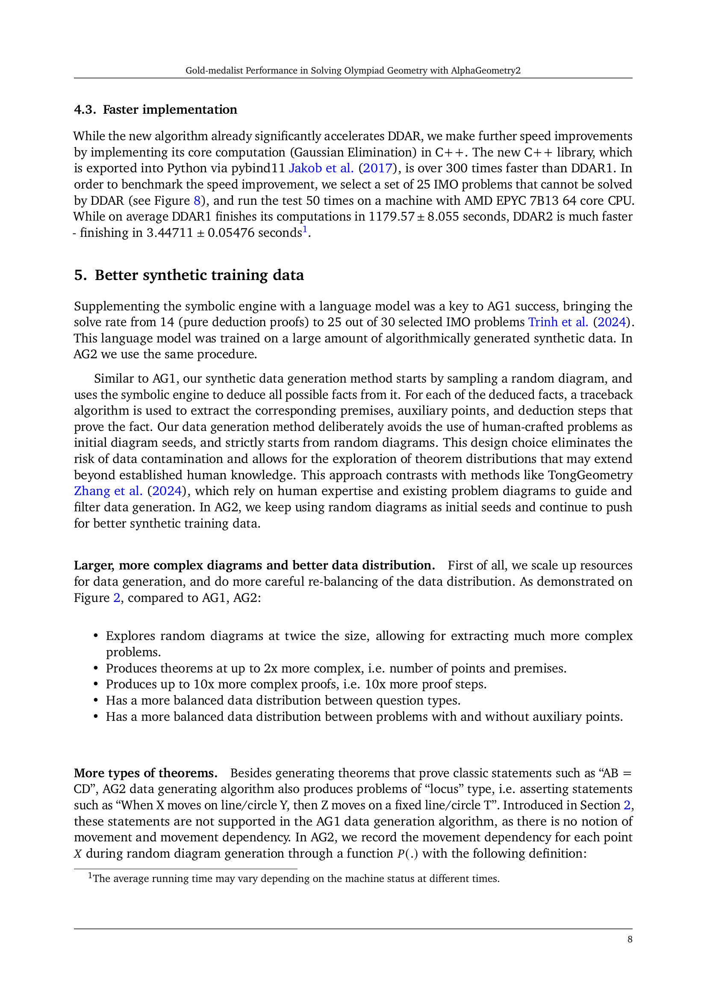
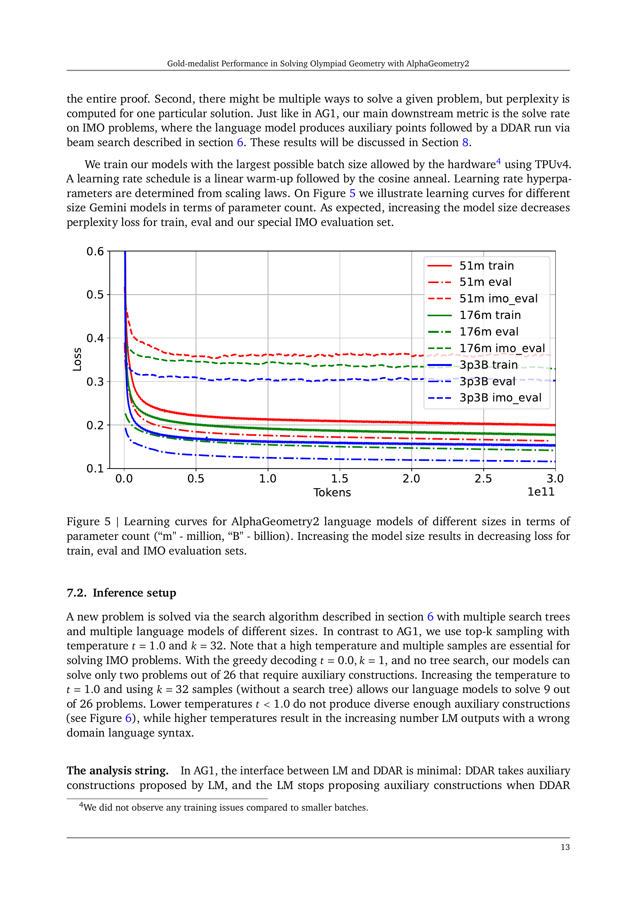
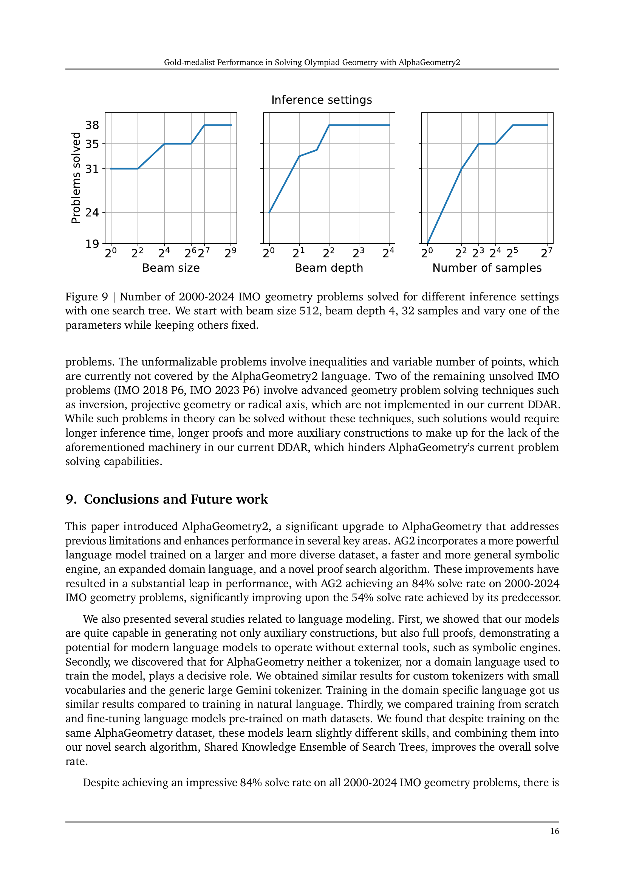

 


 2502.03544 
 Yuri Chervonyi et el. 
 
 🤗 2025-02-07 
 



↗ arXiv


↗ Hugging Face


### TL;DR



기존의 기하 문제 자동 해결 시스템은 제한된 도메인 언어, 비효율적인 기호 엔진, 부족한 언어 모델 등의 한계를 가지고 있었습니다. 이러한 한계는 특히 복잡하고 다양한 유형의 기하 문제를 해결하는 데 어려움을 초래했습니다.  따라서, **더욱 일반적인 도메인 언어**, **강력한 기호 엔진**, 그리고 **향상된 언어 모델**을 개발하는 것이 중요한 과제였습니다.

이 논문에서는 이러한 과제를 해결하기 위해 AlphaGeometry2를 제시합니다. AlphaGeometry2는 **확장된 도메인 언어**를 통해 더욱 다양한 유형의 문제를 처리하고, **개선된 기호 엔진**을 통해 더 빠르고 정확하게 문제를 풀 수 있도록 설계되었습니다.  또한, **Gemini 기반의 향상된 언어 모델**과 **새로운 지식 공유 메커니즘**을 도입하여 검색 과정을 개선하고 문제 해결률을 높였습니다. 이를 통해 AlphaGeometry2는 기존 시스템보다 훨씬 높은 문제 해결률을 달성하여 **국제 수학 올림피아드 기하 문제 해결에서 평균 금메달리스트 수준을 능가**하는 뛰어난 성과를 보였습니다.



#### Key Takeaways


 AlphaGeometry2는 국제 수학 올림피아드 기하 문제 해결 능력에서 **평균 금메달리스트 수준을 뛰어넘는 성능**을 달성했습니다. 



 향상된 언어 모델, 강력하고 빠른 기호 엔진, 확장된 도메인 언어, 혁신적인 검색 알고리즘을 통해 **문제 해결률이 54%에서 84%로 크게 향상**되었습니다. 



 **자연어로 기하 문제를 해결하는 완전 자동화된 시스템** 개발을 위한 진전이 보고되었습니다. 


#### Why does it matter?
이 논문은 **수학적 추론과 기계 학습의 융합**에 대한 중요한 발전을 보여줍니다.  **올림피아드 수준의 기하 문제 해결**이라는 어려운 과제에 대한 새로운 접근법을 제시함으로써, 인공지능 분야의 연구자들에게 영감을 주고, **자연어 처리, 기호적 추론, 그리고 검색 알고리즘** 등 다양한 분야의 연구를 촉진할 수 있습니다. 또한, **자동화된 문제 풀이 시스템 개발**이라는 장기적인 목표를 향한 진전을 보여주어, 향후 연구 방향을 제시합니다.

------
#### Visual Insights

> 🔼 그림 1은 AlphaGeometry2(AG2)에서 '이중 점'을 처리하는 방법을 보여줍니다.  AG1에서는 두 선 a와 b의 교점이 원 ω 위에 있다는 것을 증명하기 어려웠습니다. 하지만 AG2는 언어 모델이 a와 ω의 교점인 보조 점 X'을 제안하면, DDAR(Deductive Database Arithmetic Reasoning)이 X'이 b 위에 있음을 증명하여 목표를 달성할 수 있습니다. 즉, X'이 a와 ω, 그리고 b 위에 있음을 증명함으로써  a와 b의 교점 X가 ω 위에 있다는 것을 간접적으로 증명하는 방식입니다. 이 그림은 언어 모델이 추론 과정을 재구성하는 데 도움을 주는 보조 점을 예측하는 중요성을 보여줍니다.
> 

> 
read the caption

> Figure 1: Handling “double' points in AG2. It is hard to prove that the intersection of a𝑎aitalic_a, b𝑏bitalic_b is on ω𝜔\omegaitalic_ω. But if a language model suggests a construction X′∈a∩ωsuperscript𝑋′𝑎𝜔X^{\prime}\in a\cap\omegaitalic_X start_POSTSUPERSCRIPT ′ end_POSTSUPERSCRIPT ∈ italic_a ∩ italic_ω, then DDAR can prove the goal by proving X′∈bsuperscript𝑋′𝑏X^{\prime}\in bitalic_X start_POSTSUPERSCRIPT ′ end_POSTSUPERSCRIPT ∈ italic_b, and hence X=X′𝑋superscript𝑋′X=X^{\prime}italic_X = italic_X start_POSTSUPERSCRIPT ′ end_POSTSUPERSCRIPT.
> 


| Name | Meaning |
|---|---| 
| `cong a b c d` | AB=CD |
| `perp a b c d` | AB⟂CD |
| `para a b c d` | AB∥CD |
| `coll a b c` | A,B,C are collinear |
| `cyclic a b c d` | A,B,C,D are concyclic points |
| `eqangle a b c d e f g h` | Directed angle between AB and CD is the same as the one between EF and GH |
| `eqratio a b c d e f g h` | AB/CD=EF/GH |
| `aconst a b c d x` | Angle between AB and CD is equal to x, where x∈[0,180) |
| `rconst a b c d y` | AB:CD=y where y is a constant |

> 🔼 이 표는 AlphaGeometry1(AG1)에서 사용된 기본적인 술어(predicates) 9개를 보여줍니다. 각 술어는 기하학적 관계를 나타내는 약어와 그 의미를 설명합니다. 예를 들어, `cong abcd`는 선분 AB와 CD의 길이가 같다는 것을 의미하고, `cyclic abcd`는 점 A, B, C, D가 한 원 위에 있다는 것을 의미합니다.  이러한 술어들은 AG1이 기하 문제를 이해하고 풀이하는 데 사용되는 기본 단위입니다.
> 

> 
read the caption

> Table 1: AG1 predicates.
> 

### In-depth insights

#### Olympiad Geometry AI
올림피아드 기하학 AI는 **기하학 문제 해결을 위한 인공지능 시스템**을 의미합니다. 이 분야는 수학적 추론과 증명 생성 능력을 갖춘 AI 모델을 개발하는 데 중점을 두고 있습니다.  이 논문은 올림피아드 수준의 기하학 문제를 푸는 데 있어서 **인간 금메달리스트 수준의 성능**을 달성한 AlphaGeometry2 시스템을 제시합니다.  **더욱 일반화된 도메인 언어, 자동화된 문제 공식화 및 다이어그램 생성, 강화된 기호 엔진, 향상된 합성 훈련 데이터, 새로운 검색 알고리즘** 등의 개선을 통해 이러한 성과를 달성했습니다.  AlphaGeometry2는 기호 연산 및 언어 모델링을 결합한 **신경 기호 시스템**이며,  자연어 입력으로부터 기하학 문제를 해결하는 완전 자동화 시스템으로 나아가는 진전을 보여줍니다.  **제미니 아키텍처 기반의 언어 모델**을 활용하고, 지식 공유 메커니즘을 통해 검색 속도를 높였습니다.  **다양한 기하학적 개념(좌표 정리, 선형 방정식 등)**을 다루는 능력을 향상시켰고, 이를 통해 더욱 복잡한 문제 해결에 성공했습니다.  향후 연구 방향은 **불완전한 증명 생성,  다양한 기하학적 개념 지원,  완전 자동화 시스템 구축** 에 있습니다.

#### Neuro-Symbolic Methods
신경 기호 방법론은 **심층 신경망의 학습 능력과 기호적 AI의 추론 능력을 결합**하여 복잡한 문제를 해결하는 강력한 접근 방식입니다. 이는 기호적 표현을 사용하여 지식을 구조화하고, 신경망을 통해 데이터에서 패턴을 학습하여 지식을 확장하는 방식입니다.  **신경망은 데이터에서 추상적인 표현을 학습하고, 기호적 추론 엔진은 이러한 표현을 사용하여 복잡한 추론을 수행**합니다. 이러한 결합은 **인간의 지능을 모방**하여, 데이터에서 학습하고 추론하는 능력을 향상시키는 데 도움이 됩니다. 특히, **기호적 지식 표현의 강점과 신경망의 학습 능력을 효과적으로 결합**하면, 기존 방법으로는 해결하기 어려운 문제를 해결할 수 있습니다.  **수학적 증명, 자연어 처리, 로봇 제어** 등 다양한 분야에 적용되어 있으며, 앞으로도 더욱 발전하고 다양한 분야에 활용될 것으로 기대됩니다.  하지만 **신경망과 기호적 추론 엔진의 통합**은 여전히 어려운 과제이며, 효율적인 통합 방법에 대한 연구가 지속적으로 필요합니다. 또한 **해석 가능성 및 신뢰성**을 높이는 연구도 중요한 과제입니다.

#### Gemini Language Model
본 논문에서 Gemini 언어 모델은 기존 AlphaGeometry 시스템의 성능을 크게 향상시키는 핵심 요소로 제시됩니다. **기존 모델보다 더욱 강력한 언어 모델링 능력**을 바탕으로, 기하학 문제 해결에 필요한 추론 과정의 정확성과 효율성을 높였습니다.  **방대한 양의 데이터를 학습**하여 더욱 복잡하고 다양한 유형의 기하학 문제를 처리할 수 있게 되었으며, **다양한 검색 전략을 효과적으로 활용**할 수 있도록 모델 아키텍처를 개선했습니다.  이는 단순한 언어 이해를 넘어, 수학적 추론 및 문제 해결 능력을 향상시키는 데 크게 기여한 것으로 평가됩니다. 특히, 기존 언어 모델의 한계를 극복하고, 더욱 어려운 기하학 문제에 대한 해결 능력을 향상시키는 데 있어 Gemini 모델의 역할이 매우 중요했습니다. 따라서, **Gemini 모델의 고급 언어 이해 능력**은 AlphaGeometry2의 성공에 중요한 역할을 수행한 것으로 볼 수 있습니다.

#### Automated Diagram Gen
자동화된 다이어그램 생성(Automated Diagram Generation) 부분은 기하학 문제 풀이 시스템에서 **핵심적인 역할**을 합니다. 수동으로 다이어그램을 그리는 것은 시간이 오래 걸리고 오류가 발생하기 쉽기 때문에, 시스템이 자동으로 다이어그램을 생성하여 문제 풀이 과정을 효율화하고 정확도를 높이는 것이 중요합니다. 이를 위해 본 논문에서는 **기하학적 개념을 이해하고 다이어그램을 생성하는 알고리즘**을 제시합니다. 이 알고리즘은 기존의 제한적인 방법(예: 점을 두 개의 기하학적 객체의 교점으로 정의)을 넘어서, **더욱 복잡하고 비직관적인 다이어그램 생성**을 가능하게 합니다.  **합성 데이터 생성 및 새로운 검색 알고리즘**과의 시너지를 통해 문제 해결 성공률 향상에 기여하는 부분입니다.  **다중 언어 모델과의 통합**을 통해 자연어로 제시된 문제를 시스템이 이해하고 다이어그램을 생성할 수 있게 되었습니다. 하지만, 이 부분은 여전히 **자동화의 한계**를 보여줍니다. 비구조적 문제, 복잡한 기하학적 관계, 또는 점의 개수가 임의적인 경우 다이어그램 생성의 어려움이 있습니다.  향후 연구에서는 이러한 한계를 극복하기 위한 추가적인 노력이 필요할 것으로 예상됩니다. 특히, **더욱 발전된 자연어 처리 기술과 기하학적 추론 능력**을 갖춘 모델 개발이 중요하며,  **다양한 종류의 기하학 문제**에 대한 다이어그램 생성 성능을 향상시켜야 합니다.

#### Future Research Needs
본 논문은 기하 문제 해결에 있어 AlphaGeometry2의 놀라운 성과를 보여주지만, **미래 연구는 여전히 많은 가능성을 열어두고 있습니다.**  더욱 복잡한 문제, 특히 **비선형 방정식이나 부등식을 포함하는 문제**를 다루기 위한 알고리즘 개선이 필요합니다.  또한, **3차원 기하 문제**나 **무한히 많은 점**을 포함하는 문제에 대한 확장 연구가 중요하며, 이를 위해서는 **더욱 강력한 언어 모델과 기호 엔진**이 요구됩니다.  **자연어 처리 능력 향상**을 통해 사람의 개입 없이 문제를 자동으로 공식화하고 다이어그램을 생성하는 완전 자동화된 시스템 구축도 중요한 과제입니다.  마지막으로, **증명 과정 자체를 생성하는 언어 모델**의 발전을 통해 AlphaGeometry2의 능력을 더욱 고도화할 수 있습니다. 이러한 미래 연구는 인공지능이 수학적 추론 능력을 갖추는 데 중요한 발걸음이 될 것입니다.

### More visual insights

More on figures

> 🔼 그림 (a)는 AG1과 AG2의 훈련 데이터에 포함된 문제들의 크기 분포를 비교하여 보여줍니다.  세로축은 문제의 개수(로그 스케일), 가로축은 문제에 포함된 점의 개수를 나타냅니다. AG2의 훈련 데이터에는 AG1보다 더 복잡하고(점의 개수가 많은) 문제들이 더 많이 포함되어 있음을 보여줍니다. 즉, AG2는 AG1보다 더 복잡하고 다양한 기하학 문제들을 학습하여 성능 향상을 이끌어냈다는 것을 시각적으로 보여주는 그림입니다.
> 

> 
read the caption

> (a) AG2 includes more complicated/longer problems compared to AG1.
> 

> 🔼 그림 (b)는 AG2의 학습 데이터셋에서 각 문제 유형별 예제 수의 분포를 보여줍니다. AG1과 비교하여 AG2는 다양한 유형의 기하 문제에 대한 균형 잡힌 데이터셋을 갖추고 있음을 보여줍니다.  즉, 특정 유형의 문제에 치우치지 않고 다양한 유형의 문제에 대한 예제가 고르게 분포되어 있음을 의미합니다. 이는 AG2 모델의 견고성 및 일반화 성능 향상에 기여했을 것으로 예상됩니다.
> 

> 
read the caption

> (b) AG2 has a more balanced distribution of examples per question type.
> 

> 🔼 이 그림은 AlphaGeometry1(AG1)과 AlphaGeometry2(AG2)의 학습 데이터셋에서 보조적인 점(auxiliary points)을 사용한 증명과 사용하지 않은 증명의 비율을 비교한 막대 그래프입니다. AG1의 경우 보조적인 점을 사용하지 않은 증명이 압도적으로 많았던 반면(9:91), AG2는 보조적인 점을 사용한 증명과 사용하지 않은 증명의 비율이 거의 균등하게(50:50) 분포되어 있음을 보여줍니다. 이는 AG2의 학습 데이터셋이 보조적인 점의 사용 여부에 대해 더욱 균형 있게 구성되었음을 시사합니다.
> 

> 
read the caption

> (c) AG2 has a much more balanced mix between proofs with auxiliary points and proofs without (50:50 in AG2 vs 9:91 in AG1).
> 

> 🔼 그림 2는 AlphaGeometry1(AG1)과 AlphaGeometry2(AG2)의 학습 데이터 분포를 비교하여 보여줍니다.  (a)는 문제의 크기(포인트 수)에 따른 데이터 분포를 보여주는데, AG2가 AG1보다 더 복잡하고 긴 문제를 포함하는 더 넓은 분포를 갖는 것을 보여줍니다. (b)는 문제 유형별 데이터 분포를 보여주는데, AG2가 AG1보다 더 균형 잡힌 분포를 갖는 것을 보여줍니다. (c)는 보조 점을 사용하는 문제와 사용하지 않는 문제의 데이터 분포를 비교하여 보여주는데, AG2가 AG1보다 훨씬 더 균형 잡힌 분포(50:50)를 갖는 것을 보여줍니다. 이는 AG2가 더 다양하고 균형 잡힌 데이터셋으로 학습되었음을 시사합니다.
> 

> 
read the caption

> Figure 2: Training data distributions for AG2 compared to AG1.
> 

> 🔼 이 그림은 단조 증가적 조건을 만족하는 최소한의 점 집합을 찾는 기본적인 탐욕 알고리즘을 보여줍니다.  이 알고리즘은 점들을 역위상 순서(topological order)로 처리하여 종속성 문제를 해결합니다. 즉, 다른 점에 의존하지 않는 점부터 먼저 처리하고, 생성 과정의 초기 점들을 나중에 처리하는 방식입니다. 점의 집합이 조건을 만족하는지 확인하는 함수 `check_provable`을 사용하며, 점 집합이 조건을 만족하면 그 점 집합이 최소 집합으로 간주됩니다. 만약 조건을 만족하지 않으면 해당 점을 제거하고 다시 확인하는 과정을 반복합니다. 이를 통해 효율적으로 최소 점 집합을 찾는 과정을 보여줍니다.
> 

> 
read the caption

> Figure 3: Basic greedy algorithm to find a minimal set of points satisfying a monotonic predicate check.
> 

> 🔼 그림 4는 논문에서 제안하는 새로운 검색 알고리즘의 개요를 보여줍니다. 여러 개의 서로 다른 검색 트리를 사용하여 문제를 해결하는데, 각 트리는 독립적으로 문제를 탐색하지만 특별한 지식 공유 메커니즘을 통해 서로 발견한 사실들을 공유합니다. 이를 통해 각 트리는 더 효율적으로 문제 해결에 집중할 수 있으며, 전체적인 문제 해결 성공률을 높일 수 있습니다. 각 트리는 서로 다른 언어 모델과 설정을 사용하여 다양한 방식으로 문제를 탐색합니다.
> 

> 
read the caption

> Figure 4: Overview of our search algorithm. We employ several different search trees which can share facts they proved via a special knowledge sharing mechanism.
> 

> 🔼 그림 5는 AlphaGeometry2 언어 모델의 크기에 따른 학습 곡선을 보여줍니다. 모델의 크기는 파라미터 수(백만 단위 'm', 십억 단위 'B')로 나타냅니다.  그래프는 학습 데이터, 평가 데이터, 그리고 IMO 평가 데이터셋에 대한 손실(loss) 값을 보여줍니다. 모델의 크기가 증가함에 따라 세 가지 데이터셋 모두에서 손실 값이 감소하는 것을 확인할 수 있습니다. 즉, 모델 크기가 클수록 학습, 평가, IMO 문제 해결 성능이 향상됨을 의미합니다.
> 

> 
read the caption

> Figure 5: Learning curves for AlphaGeometry2 language models of different sizes in terms of parameter count (“m' - million, “B' - billion). Increasing the model size results in decreasing loss for train, eval and IMO evaluation sets.
> 

> 🔼 이 그림은 다양한 온도에서 top-k 샘플링을 사용했을 때 고유한 샘플의 비율을 보여줍니다. top-k 샘플링은 가장 가능성이 높은 k개의 토큰 중 하나를 선택하는 방법입니다. 온도 매개변수는 샘플링 확률 분포의 확산 정도를 제어합니다. 온도가 높을수록 분포가 더 넓게 퍼지고 다양한 샘플이 생성될 가능성이 높아집니다. 이 그림을 통해 적절한 top-k 샘플링 온도를 선택하는 것이 모델의 성능에 중요한 영향을 미칠 수 있음을 알 수 있습니다.
> 

> 
read the caption

> Figure 6: Ratio of unique samples for various temperatures for top-k sampling.
> 

> 🔼 이 그림은 하나의 언어 모델이 훈련 중에 본 토큰 수의 함수로서 2000년부터 2024년까지의 IMO 문제 해결 수를 보여줍니다.  즉, 언어 모델이 학습하는 데이터의 양이 증가함에 따라 IMO 기하 문제를 얼마나 더 많이 풀 수 있는지 보여주는 그래프입니다.  x축은 훈련 중에 처리된 토큰 수(데이터 크기)를 나타내고, y축은 언어 모델이 해결한 IMO 기하 문제의 수를 나타냅니다.  그래프를 통해 학습 데이터의 양이 증가함에 따라 모델의 성능이 향상되는 것을 확인할 수 있습니다.
> 

> 
read the caption

> Figure 7: Number of 2000-2024 IMO problems solved by one language model as a function of seen tokens during training.
> 

> 🔼 그림 8은 2000년부터 2024년까지 국제 수학 올림피아드(IMO) 기하 문제에 대한 AlphaGeometry2의 결과를 보여줍니다. 문제들은 해결 여부에 따라 그룹으로 나뉘며, 각 그룹 내에서는 연대순으로 정렬되어 있습니다.  'Not Attempted'는 시스템이 시도하지 않은 문제를, 'Not Solved'는 시스템이 풀지 못한 문제를, 'Solved'는 시스템이 푼 문제를 나타냅니다.  'Solved by DDAR'은  AlphaGeometry2의 기호 엔진인 DDAR에 의해 풀린 문제를 의미합니다. 이 그림은 AlphaGeometry2가 IMO 기하 문제를 얼마나 잘 풀었는지, 그리고 어떤 유형의 문제에 강점/약점을 보이는지를 한눈에 보여줍니다.
> 

> 
read the caption

> Figure 8: AlphaGeometry2 results on all 2000-2024 IMO geometry problems. Problems are grouped together based on their status, and ordered chronologically within the groups.
> 

> 🔼 그림 9는 하나의 검색 트리에서 여러 가지 추론 설정에 대해 2000년부터 2024년까지 IMO 기하 문제가 얼마나 해결되었는지를 보여줍니다. 빔 크기 512, 빔 깊이 4, 샘플 32개로 시작하여 다른 매개변수를 고정하면서 매개변수 중 하나를 변경합니다. 이 그림은 다양한 빔 크기, 빔 깊이, 샘플 수를 사용하여 단일 검색 트리의 성능을 평가하여 최적의 추론 설정을 찾는 데 도움이 됩니다.
> 

> 
read the caption

> Figure 9: Number of 2000-2024 IMO geometry problems solved for different inference settings with one search tree. We start with beam size 512, beam depth 4, 32 samples and vary one of the parameters while keeping others fixed.
> 

> 🔼 그림 10은 두 개의 30억 매개변수 모델의 학습 곡선을 보여줍니다. 하나는 처음부터 학습되었고, 다른 하나는 수학 데이터로 미리 학습된 후 AG 데이터로 미세 조정되었습니다. 수학 데이터로 미리 학습된 모델은 초기 손실이 더 낮지만, 2000억 토큰 학습 후 두 모델 모두 동일한 지점에 수렴합니다. 이는 수학적 지식을 사전에 갖춘 모델이 초기 학습 단계에서 유리하지만, 충분한 학습 데이터가 주어지면 사전 학습 여부와 관계없이 성능이 비슷해짐을 시사합니다.
> 

> 
read the caption

> Figure 10: Learning curves for two 3B models: one is trained from scratch and another one pre-trained on math data and then fine-tuned on the AG data. The model pre-trained on math has initially lower loss but both converge to the same point after training for 200B tokens.
> 

> 🔼 그림 11은 AlphaGeometry가 IMO 2024년 4번 문제를 풀이하는 과정에서 보조선으로 추가한 점 E를 보여줍니다. 이 그림은 문제 풀이에 필요한 보조선을 어떻게 구성했는지 시각적으로 보여주는 역할을 합니다.  AlphaGeometry는 기존의 기하학적 방법으로는 찾기 어려운 독창적인 보조선을 사용하여 문제를 해결합니다. 이 그림은 논문의 핵심 내용인 AlphaGeometry의 독창적인 문제 해결 방식을 설명하는 데 중요한 역할을 합니다.
> 

> 
read the caption

> Figure 11: IMO 2024 P4 diagram with AlphaGeometry auxiliary construction, point E𝐸Eitalic_E.
> 

> 🔼 그림 12는 AlphaGeometry가 IMO 2013년 3번 문제를 푸는 과정에서 보조선으로 사용한 점 D를 보여줍니다.  이 그림은 AlphaGeometry가 문제 해결의 핵심 단계인 점 B, A₁, D, Iₐ가 한 원 위에 있다는 것을 증명하는 데 사용되었습니다.  즉, 점 D의 추가를 통해 B, A₁, D, Iₐ 네 점이 순환적(cyclic) 관계에 있음을 보임으로써 문제 해결에 필요한 중요한 중간 결과를 도출해냈습니다. 자세히는, 점 D를 이용한 보조선 구성을 통해 각도 추적(angle chasing)을 통해 증명을 완성할 수 있었습니다.
> 

> 
read the caption

> Figure 12: IMO 2013 P3 diagram with AlphaGeometry auxiliary construction, point D𝐷Ditalic_D. It allows proving B⁢A1⁢D⁢Ia𝐵subscript𝐴1𝐷subscript𝐼𝑎BA_{1}DI_{a}italic_B italic_A start_POSTSUBSCRIPT 1 end_POSTSUBSCRIPT italic_D italic_I start_POSTSUBSCRIPT italic_a end_POSTSUBSCRIPT is cyclic, which is the key to solve this problem.
> 

> 🔼 그림 13은 AlphaGeometry가 보조적인 구성을 통해 IMO 2014년 3번 문제를 해결하는 과정을 보여줍니다. 그림에는 문제의 기하학적 도형과 AlphaGeometry가 추가적으로 구성한 점들이 나타나 있습니다. 이러한 보조 구성은 문제 해결에 필수적인 도형적 관계를 밝히는 데 중요한 역할을 합니다. AlphaGeometry는 이러한 보조 구성을 통해 문제의 핵심적인 속성을 파악하고 증명을 완성합니다.  이는 AlphaGeometry가 복잡한 기하학 문제를 해결하기 위해 어떻게 추론하고, 보조 구성을 통해 문제를 단순화하는지 보여주는 좋은 예시입니다.
> 

> 
read the caption

> Figure 13: IMO 2014 P3 diagram with AlphaGeometry auxiliary constructions.
> 

> 🔼 그림 14는 AlphaGeometry가 IMOSL 2009 G7 문제를 푸는 과정에서 사용한 보조선(빨간색)과 중요한 순환적 특징(다각형), 그리고 유사 삼각형 쌍(삼각형)을 보여줍니다. AlphaGeometry는 보조선을 통해 문제 풀이에 필요한 순환적 특징과 유사 삼각형 쌍을 찾아내어 문제를 해결합니다. 이 그림은 AlphaGeometry의 추론 과정을 시각적으로 이해하는 데 도움을 줍니다.
> 

> 
read the caption

> Figure 14: IMOSL 2009 G7 diagram with AlphaGeometry auxiliary constructions (colored red), key cyclic properties (colored polygons) and key similar triangle pairs (colored triangle pairs).
> 

More on tables


| Case | Name | Subcase | Syntax for question |
|---|---|---|---| 
| 1 | circle through fixed points | circumcircle a b c | `? cyclic a b c * : X` |
| 2 |  | center a radius b c | `? cong b c a * : X` |
| 3 | line through fixed points | line a b | `? coll a b *: X` |
| 4 |  | bline of a b | `? cong a * b * : X` |
| 5 |  | pline of a b c | `? para b c a * : X` |
| 6 |  | tline of a b c | `? perp b c a * : X` |
| 7 | point on fixed line |  | `? coll a * * : X` |
| 8 | point on fixed circle |  | `? cyclic a * * * : X` |
| 9 | fixed distance |  | `? cong a b * * : X` |
| 10 | fixed direction |  | `? para a b * * : X` |
| 11 | fixed angle |  | `? eqangle a b a c * * * * : X` |
> 🔼 이 표는 AlphaGeometry2(AG2)의 도메인 언어에서 사용되는 11가지 유형의 자취(locus) 문장과 해당 구문을 보여줍니다. 자취 문장이란 기하학 문제에서 점, 선, 원 등의 기하학적 객체의 움직임을 기술하는 문장입니다. 표에는 각 자취 문장 유형에 대한 이름, 하위 유형(Subcase), 그리고 AG2 도메인 언어에서의 구문이 나열되어 있습니다. 이를 통해 AG2가 얼마나 다양한 유형의 자취 문장을 처리할 수 있는지 보여줍니다.
> 

> 
read the caption

> Table 2: The 11 types of locus-type statements, and their corresponding predicate syntax in the AG domain language.
> 


| If | Then |
|---|---| 
| `a = midpoint b c, d = midpoint a c` | <math alttext="P(d)="
class="ltx_Math" display="inline" id="S5.T3.1.1.1.m1.3"><semantics id="S5.T3.1.1.1.m1.3a"><mrow id="S5.T3.1.1.1.m1.3.4"
xref="S5.T3.1.1.1.m1.3.4.cmml"><mrow id="S5.T3.1.1.1.m1.3.4.2"
xref="S5.T3.1.1.1.m1.3.4.2.cmml"><mi id="S5.T3.1.1.1.m1.3.4.2.2"
xref="S5.T3.1.1.1.m1.3.4.2.2.cmml">P</mi><mo id="S5.T3.1.1.1.m1.3.4.2.1"
xref="S5.T3.1.1.1.m1.3.4.2.1.cmml">⁢</mo><mrow id="S5.T3.1.1.1.m1.3.4.2.3.2"
xref="S5.T3.1.1.1.m1.3.4.2.cmml"><mo id="S5.T3.1.1.1.m1.3.4.2.3.2.1"
 stretchy="false" xref="S5.T3.1.1.1.m1.3.4.2.cmml">(</mo><mi id="S5.T3.1.1.1.m1.1.1"
xref="S5.T3.1.1.1.m1.1.1.cmml">d</mi><mo id="S5.T3.1.1.1.m1.3.4.2.3.2.2"
 stretchy="false" xref="S5.T3.1.1.1.m1.3.4.2.cmml">)</mo></mrow></mrow><mo
id="S5.T3.1.1.1.m1.3.4.1" xref="S5.T3.1.1.1.m1.3.4.1.cmml">=</mo><mrow
id="S5.T3.1.1.1.m1.3.4.3.2" xref="S5.T3.1.1.1.m1.3.4.3.1.cmml"><mo
id="S5.T3.1.1.1.m1.3.4.3.2.1" stretchy="false"
xref="S5.T3.1.1.1.m1.3.4.3.1.cmml">{</mo><mi id="S5.T3.1.1.1.m1.2.2"
xref="S5.T3.1.1.1.m1.2.2.cmml">b</mi><mo id="S5.T3.1.1.1.m1.3.4.3.2.2"
xref="S5.T3.1.1.1.m1.3.4.3.1.cmml">,</mo><mi id="S5.T3.1.1.1.m1.3.3"
xref="S5.T3.1.1.1.m1.3.3.cmml">c</mi><mo id="S5.T3.1.1.1.m1.3.4.3.2.3"
 stretchy="false" xref="S5.T3.1.1.1.m1.3.4.3.1.cmml">}</mo></mrow></mrow><annotation-xml
encoding="MathML-Content" id="S5.T3.1.1.1.m1.3b"><apply id="S5.T3.1.1.1.m1.3.4.cmml"
xref="S5.T3.1.1.1.m1.3.4"><eq id="S5.T3.1.1.1.m1.3.4.1.cmml"
xref="S5.T3.1.1.1.m1.3.4.1"></eq><apply id="S5.T3.1.1.1.m1.3.4.2.cmml"
xref="S5.T3.1.1.1.m1.3.4.2"><times id="S5.T3.1.1.1.m1.3.4.2.1.cmml"
xref="S5.T3.1.1.1.m1.3.4.2.1"></times><ci id="S5.T3.1.1.1.m1.3.4.2.2.cmml"
xref="S5.T3.1.1.1.m1.3.4.2.2">𝑃</ci><ci id="S5.T3.1.1.1.m1.1.1.cmml"
xref="S5.T3.1.1.1.m1.1.1">𝑑</ci></apply><set id="S5.T3.1.1.1.m1.3.4.3.1.cmml"
xref="S5.T3.1.1.1.m1.3.4.3.2"><ci id="S5.T3.1.1.1.m1.2.2.cmml"
xref="S5.T3.1.1.1.m1.2.2">𝑏</ci><ci id="S5.T3.1.1.1.m1.3.3.cmml"
xref="S5.T3.1.1.1.m1.3.3">𝑐</ci></set></apply></annotation-xml><annotation
encoding="application/x-tex" id="S5.T3.1.1.1.m1.3c">P(d)=
{b,c}</annotation><annotation encoding="application/x-llamapun"
id="S5.T3.1.1.1.m1.3d">italic_P ( italic_d ) = { italic_b ,
italic_c }</annotation></semantics></math> |
| `a = on_line b c` | <math alttext="P(a)="
class="ltx_Math" display="inline" id="S5.T3.2.2.1.m1.4"><semantics
id="S5.T3.2.2.1.m1.4a"><mrow id="S5.T3.2.2.1.m1.4.5"
xref="S5.T3.2.2.1.m1.4.5.cmml"><mrow id="S5.T3.2.2.1.m1.4.5.2"
xref="S5.T3.2.2.1.m1.4.5.2.cmml"><mi id="S5.T3.2.2.1.m1.4.5.2.2"
xref="S5.T3.2.2.1.m1.4.5.2.2.cmml">P</mi><mo id="S5.T3.2.2.1.m1.4.5.2.1"
xref="S5.T3.2.2.1.m1.4.5.2.1.cmml">⁢</mo><mrow id="S5.T3.2.2.1.m1.4.5.2.3.2"
xref="S5.T3.2.2.1.m1.4.5.2.cmml"><mo id="S5.T3.2.2.1.m1.4.5.2.3.2.1"
 stretchy="false" xref="S5.T3.2.2.1.m1.4.5.2.cmml">(</mo><mi
id="S5.T3.2.2.1.m1.1.1" xref="S5.T3.2.2.1.m1.1.1.cmml">a</mi><mo
id="S5.T3.2.2.1.m1.4.5.2.3.2.2" stretchy="false"
xref="S5.T3.2.2.1.m1.4.5.2.cmml">)</mo></mrow></mrow><mo
id="S5.T3.2.2.1.m1.4.5.1" xref="S5.T3.2.2.1.m1.4.5.1.cmml">=</mo><mrow
id="S5.T3.2.2.1.m1.4.5.3.2" xref="S5.T3.2.2.1.m1.4.5.3.1.cmml"><mo
id="S5.T3.2.2.1.m1.4.5.3.2.1" stretchy="false"
xref="S5.T3.2.2.1.m1.4.5.3.1.cmml">{</mo><mi id="S5.T3.2.2.1.m1.2.2"
xref="S5.T3.2.2.1.m1.2.2.cmml">a</mi><mo id="S5.T3.2.2.1.m1.4.5.3.2.2"
xref="S5.T3.2.2.1.m1.4.5.3.1.cmml">,</mo><mi id="S5.T3.2.2.1.m1.3.3"
xref="S5.T3.2.2.1.m1.3.3.cmml">b</mi><mo id="S5.T3.2.2.1.m1.4.5.3.2.3"
xref="S5.T3.2.2.1.m1.4.5.3.1.cmml">,</mo><mi id="S5.T3.2.2.1.m1.4.4"
xref="S5.T3.2.2.1.m1.4.4.cmml">c</mi><mo id="S5.T3.2.2.1.m1.4.5.3.2.4"
 stretchy="false" xref="S5.T3.2.2.1.m1.4.5.3.1.cmml">}</mo></mrow></mrow><annotation-xml
encoding="MathML-Content" id="S5.T3.2.2.1.m1.4b"><apply
id="S5.T3.2.2.1.m1.4.5.cmml" xref="S5.T3.2.2.1.m1.4.5"><eq
id="S5.T3.2.2.1.m1.4.5.1.cmml" xref="S5.T3.2.2.1.m1.4.5.1"></eq><apply
id="S5.T3.2.2.1.m1.4.5.2.cmml" xref="S5.T3.2.2.1.m1.4.5.2"><times
id="S5.T3.2.2.1.m1.4.5.2.1.cmml" xref="S5.T3.2.2.1.m1.4.5.2.1"></times><ci
id="S5.T3.2.2.1.m1.4.5.2.2.cmml" xref="S5.T3.2.2.1.m1.4.5.2.2">𝑃</ci><ci
id="S5.T3.2.2.1.m1.1.1.cmml" xref="S5.T3.2.2.1.m1.1.1">𝑎</ci></apply><set
id="S5.T3.2.2.1.m1.4.5.3.1.cmml" xref="S5.T3.2.2.1.m1.4.5.3.2"><ci
id="S5.T3.2.2.1.m1.2.2.cmml" xref="S5.T3.2.2.1.m1.2.2">𝑎</ci><ci
id="S5.T3.2.2.1.m1.3.3.cmml" xref="S5.T3.2.2.1.m1.3.3">𝑏</ci><ci
id="S5.T3.2.2.1.m1.4.4.cmml" xref="S5.T3.2.2.1.m1.4.4">𝑐</ci></set></apply></annotation-xml><annotation
encoding="application/x-tex" id="S5.T3.2.2.1.m1.4c">P(a)=
{a,b,c}</annotation><annotation encoding="application/x-llamapun"
id="S5.T3.2.2.1.m1.4d">italic_P ( italic_a ) = { italic_a ,
italic_b , italic_c }</annotation></semantics></math> |}
> 🔼 표 3은 AG2의 데이터 생성 과정에서 탐지된 궤적 유형 문장의 17가지 사례를 보여줍니다. 각 행은 특정 유형의 궤적 문장을 생성하는 데 사용되는 보조 생성 및 결과를 나타냅니다. 예를 들어, 첫 번째 행은 점 a가 고정된 원 위를 움직이는 궤적 문장을 생성하는 방법을 보여주고, 마지막 열은 이 궤적 유형 문장의 번호를 나타냅니다. 이 표는 AG2가 다양한 유형의 궤적 문장을 생성할 수 있음을 보여줍니다.
> 

> 
read the caption

> Table 3: Two examples of P𝑃Pitalic_P. Top row: since d𝑑ditalic_d is uniquely defined as the midpoint of a𝑎aitalic_a and c𝑐citalic_c, and a𝑎aitalic_a is uniquely defined as the midpoint of b𝑏bitalic_b and c𝑐citalic_c, the source of movement for d𝑑ditalic_d is b𝑏bitalic_b and c𝑐citalic_c. Second row: Since a𝑎aitalic_a can be anywhere on line b⁢c𝑏𝑐bcitalic_b italic_c, a𝑎aitalic_a itself is also a part of its movement source.
> 


| System description | IMO-AG-50 solved | IMO-AG-30 solved |
|---|---|---|
| OpenAI o1 | 0 | 0 |
| Gemini thinking | 0 | 0 |
| AG1 DDAR [Trinh et al. (2024)](https://arxiv.org/html/2502.03544/bib18.png) | 14 | 14 |
| AG2 DDAR | 16 | 15 |
| TongGeometry DD [Zhang et al. (2024)](https://arxiv.org/html/2502.03544/bib21.png) | - | 18 |
| Average bronze medalist | 27.1 | 19.3 |
| Wu with AG1 DDAR [Sinha et al. (2024)](https://arxiv.org/html/2502.03544/bib15.png) | - | 21 |
| Average silver medalist | 33.9 | 22.9 |
| AG1 [Trinh et al. (2024)](https://arxiv.org/html/2502.03544/bib18.png) | 27 | 25 |
| Average gold medalist | 40.9 | 25.9 |
| Wu + AG1 [Sinha et al. (2024)](https://arxiv.org/html/2502.03544/bib15.png) | - | 27 |
| TongGeometry w/o value [Zhang et al. (2024)](https://arxiv.org/html/2502.03544/bib21.png) | - | 28 |
| AG2 with AG1 setup | 38 | 28 |
| TongGeometry full setting [Zhang et al. (2024)](https://arxiv.org/html/2502.03544/bib21.png) | - | **30** |
| AG2 full setting | **42** | **30** |
> 🔼 표 4는 AlphaGeometry2의 성능을 IMO(International Mathematical Olympiad) 기하 문제 50개(IMO-AG-50)에 대해 평가한 결과를 보여줍니다. IMO-AG-50은 2000년부터 2024년까지의 모든 IMO 기하 문제를 포함하며, Trinh et al.(2024)에서 소개된 IMO-AG-30은 AG1 언어로 공식화할 수 있는 문제의 하위 집합만 포함합니다. 표에서는 다양한 시스템(AlphaGeometry1, AlphaGeometry2, TongGeometry 등)의 성능을 비교하여 AlphaGeometry2의 우수성을 보여줍니다.  각 시스템의 정답률(IMO-AG-50 및 IMO-AG-30 문제에 대한 해결 비율)을 제시하고 있습니다.
> 

> 
read the caption

> Table 4: Evaluation on IMO-AG-50 benchmark. IMO-AG-50 contains all IMO 2000-2024 geometry problems, while IMO-AG-30 introduced in Trinh et al. (2024) contains only a subset formalizable in terms of the AG1 language.
> 


Given a random diagram, if DDAR proves:|Then let X =|Then if X is nonempty, we create a synthetic proof that says: "when X moves, …|Auxiliary constructions will be the following points and everything else they depend on|Case
---|---|---|---|---
`cong a b c d`|$P(b,c,d)-P(a)$|circle center $b$, radius $cd$ goes through a fixed point|$a$|2
 |$P(a)-P(b,c,d)$|$a$ moves on a fixed circle|$b,c,d$|8
 |$P(a,b)-P(c,d)$|the distance between $a$ and $b$ is fixed|$c,d$|9
`cong a b a c`|$P(a)-P(b,c)$|$a$ moves on a fixed line|$b,c$|7
 |$P(b,c)-P(a)\[geq]M$|$b$ & $c$ are equidistant to a fixed point, when M move|$a$|4
`cyclic a b c d`|$P(b,c,d)-P(a)$|the circumcircle of $bcd$ moves through a fixed point|$a$|1
 |$P(d)-P(a,b,c)$|$d$ moves on a fixed circle|$a,b,c$|8
`coll a b c`|$P(b,c)-P(a)$|line $bc$ goes through a fixed point|$a$|3
 |$P(c)-P(a,b)$|$c$ moves on a fixed line|$a,b$|7
`eqangle b a b c e d e f`|$P(a,b,c)-P(d,e,f)$|the angle $abc$ has a fixed value|$d,e,f$|11
 |$P(b)-P(a,c,d,e,f)$|the point $b$ moves on a fixed circle|$a,c,d,e,f$|8
`para a b c d`|$P(b,c,d)-P(a)$|The line through $b$ and $\parallel cd$ moves through a fixed point|$a$|5
 |$P(c,d)-P(a,b)$|The line $cd$ is always parallel to a fixed line|$a,b$|10
`perp a b c d`|$P(b,c,d)-P(a)$|the line through $b$ and $\perp cd$ moves through fixed point|$a$|6
 |$P(c,d)-P(a,b)$|the line $cd$ is always $\perp$ to a fixed line|$a,b$|10
> 🔼 이 표는 데이터 생성 과정에서 탐지된 17가지의 자취(locus) 유형 문장에 대한 정보를 보여줍니다. 각각의 경우는 자취 유형 문장을 생성하는 데 사용된 보조선(auxiliary construction)을 나타내는 점들의 집합과 이 점들이 종속된 다른 점들의 집합을 보여줍니다. 마지막 열에는 11가지의 서로 다른 자취 유형 문장이 번호로 표시되어 있습니다. 이 표는 AlphaGeometry2 모델의 데이터 생성 과정에서 어떤 종류의 자취 유형 문장들이 생성되는지를 보여주는 데 도움이 됩니다.
> 

> 
read the caption

> Table 5: 17 cases where locus-type statements are detected during data generation. These 17 cases produce 11 different types of locus-type statements, as numbered in the last column.
> 

### Full paper



