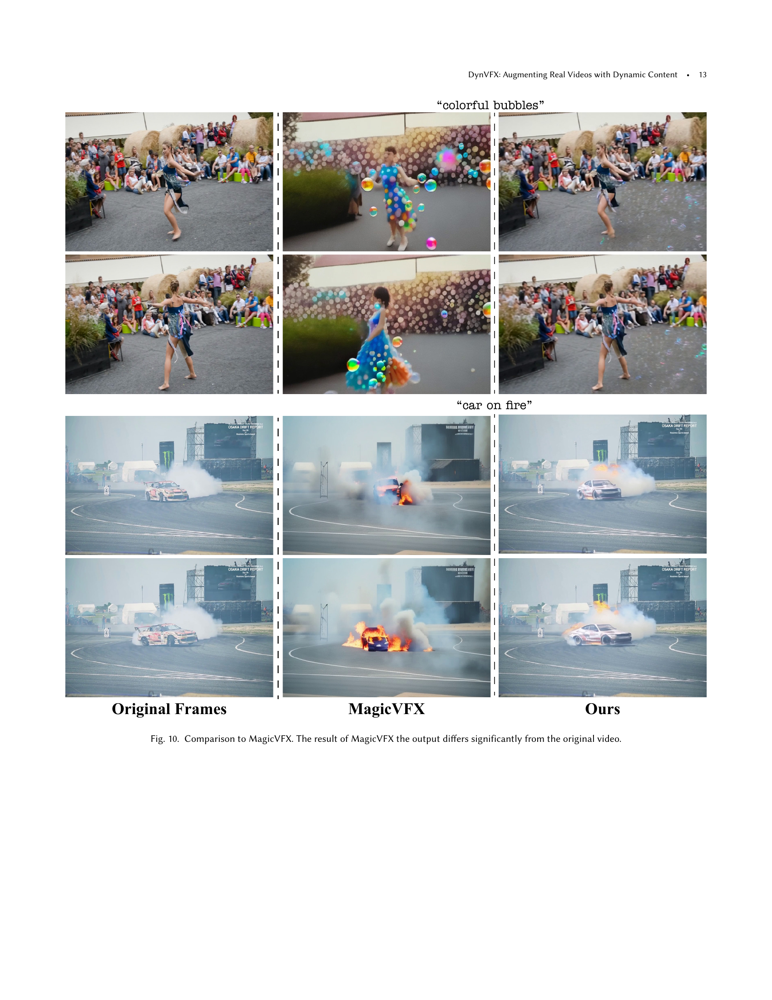

 


 2502.03621 
 Danah Yatim et el. 
 
 🤗 2025-02-07 
 



↗ arXiv


↗ Hugging Face


### TL;DR



기존의 영상 편집 기술은 복잡하고 전문적인 기술과 도구를 필요로 하여, 일반 사용자는 물론 전문가에게도 높은 진입 장벽으로 작용했습니다.  특히 실제 영상에 새로운 동적인 요소를 추가하는 것은 어려운 작업이었고,  합성된 요소가 기존 영상과 자연스럽게 조화를 이루도록 하는 것도 상당한 기술적 난이도를 요구했습니다.  이러한 문제점들을 해결하기 위해,  DynVFX는 **텍스트 기반의 제로-샷 방식**을 제시하여 사용자의 편의성을 극대화했습니다. 

DynVFX는 **Vision Language Model과 사전 훈련된 텍스트-비디오 확산 변환기**를 활용하여 사용자의 간단한 텍스트 명령어만으로도 실제 영상에 동적인 콘텐츠를 자연스럽게 추가하는 기술입니다.  **Anchor Extended Attention**이라는 새로운 기법을 통해, 새로운 콘텐츠의 정확한 위치를 파악하고 기존 영상과의 자연스러운 조화를 이루도록 합니다.  **반복적인 잔차 업데이트**를 통해 기존 영상의 무결성을 유지하면서도 새로운 콘텐츠가 자연스럽게 통합될 수 있도록 했습니다. 이는 기존의 복잡한 영상 편집 과정을 간소화하고, 영상 제작 분야의 생산성 향상에 크게 기여할 것으로 기대됩니다. 



#### Key Takeaways


 텍스트 기반의 제로-샷 영상 편집 기술을 통해 사용자의 편의성을 극대화했습니다. 



 Vision Language Model과 텍스트-비디오 확산 변환기를 활용하여 현실적이고 자연스러운 영상 합성을 구현했습니다. 



 기존 영상의 무결성을 유지하면서 새로운 동적 콘텐츠를 정확하게 배치하고 조화시키는 독창적인 방법을 제시했습니다. 


#### Why does it matter?
본 논문은 **영상 편집 분야의 새로운 지평을 열었습니다.**  **사용자의 간단한 텍스트 설명만으로도 실제 영상에 역동적인 CGI 콘텐츠를 자연스럽게 통합하는 기술**을 제시하여, 기존의 복잡한 영상 편집 과정을 획기적으로 간소화했습니다.  이는 **영상 제작 및 편집 분야의 생산성 향상과 창의성 증대**에 크게 기여할 뿐만 아니라, **새로운 연구 분야의 개척**에도 중요한 의미를 지닙니다.  특히 **영상 생성 모델과 Vision Language Model을 결합하여 제로-샷 방식으로 문제를 해결**한 점은 높이 평가할 만하며, 향후 **실시간 영상 편집 기술 발전**에도 영향을 미칠 것으로 예상됩니다. 

------
#### Visual Insights

> 🔼 그림 1은 DynVFX가 간단한 사용자 제공 텍스트 지침을 통해 실제 동영상에 새로운 동적 콘텐츠를 추가하는 방법을 보여줍니다.  왼쪽에는 입력 비디오가, 오른쪽에는 DynVFX를 사용하여 배경에 웅장한 고래를 추가하거나 상자에서 머리를 내미는 강아지를 추가한 출력 비디오가 나옵니다. 이는 DynVFX가 사용자의 텍스트 설명에 따라 비디오에 다양한 동적 요소를 자연스럽게 통합할 수 있음을 시각적으로 보여줍니다.  사용자는 단순한 텍스트 명령어만으로도 비디오에 새 객체, 효과, 상호 작용을 추가할 수 있습니다.
> 

> 
read the caption

> Figure 1.  DynVFX augments real-world videos with new dynamic content described via simple user-provided text instruction.
> 


| Method | Metrics  | Metrics  | VLM-based evaluation | VLM-based evaluation | VLM-based evaluation | VLM-based evaluation | User Study | User Study |
|---|---|---|---|---|---|---|---|---|
|  | CLIP Directional | SSIM | Text Alignment | Visual Quality | Edit Harmonization | Dynamics Score | Content Integration | Edit Harmonization |
| Gen-3 | 0.130 | 0.285 | 0.418 | 0.610 | 0.374 | 0.379 | 97.65 | 93.33 |
| LORA finetuning | 0.277 | 0.361 | 0.812 | 0.787 | 0.756 | 0.759 | 92.22 | 81.11 |
| DDIM inv. sampling | 0.184 | 0.444 | 0.535 | 0.699 | 0.528 | 0.529 | 99.20 | 98.67 |
| SDEdit (0.9) | 0.272 | 0.332 | 0.794 | 0.799 | 0.754 | 0.756 | 98.91 | 82.13 |
| SDEdit (0.6) | 0.111 | 0.567 | 0.510 | 0.704 | 0.513 | 0.504 | 97.69 | 96.76 |
| w/o AnchorExtAttn | **0.317** | 0.697 | 0.775 | 0.724 | 0.683 | 0.691 | 89.30 | 88.89 |
| w/o Iterative Refinement | 0.295 | 0.760 | 0.817 | 0.789 | 0.769 | 0.760 | 85.80 | 86.42 |
| Ours | 0.311 | **0.775** | **0.860** | **0.803** | **0.796** | **0.785** | - | - |

> 🔼 표 1은 제시된 여러 기준(CLIP 지향성, SSIM, 동적 요소, 정렬 품질, 조화 점수)을 사용하여 제안된 방법과 여러 기준 방법의 성능을 정량적으로 평가한 결과를 보여줍니다.  각 지표는 편집 충실도, 원본 콘텐츠 보존, 새로운 콘텐츠의 조화 및 동작의 현실성 등 다양한 측면을 평가합니다.  이 표는 제안된 방법의 효과를 객관적으로 측정하고 기준 방법과 비교하여 성능을 정확하게 파악하는 데 도움을 줍니다.
> 

> 
read the caption

> Table 1. Quantitative Evaluation. We assess the quality of our method compared to several baselines.
> 

### In-depth insights

#### Zero-Shot VFX
제로샷 VFX는 사전 훈련된 모델을 사용하여 새로운 동적 콘텐츠를 실제 비디오에 통합하는 혁신적인 접근 방식입니다. **사전 훈련된 텍스트-비디오 확산 변환기와 비전 언어 모델을 활용**하여 사용자의 간단한 텍스트 설명만으로도 비디오에 새 객체 또는 효과를 자연스럽게 추가할 수 있습니다. 이는 **추가적인 훈련이나 미세 조정 없이도 가능**하다는 점에서 매우 효율적입니다.  기존의 VFX 파이프라인과 달리 복잡한 마스크나 추가적인 참조 없이도, 카메라 움직임, 간섭, 기존 객체와의 상호 작용을 고려하여 새 콘텐츠를 통합합니다.  **어텐션 메커니즘 조작을 통해 정확한 위치 지정과 매끄러운 통합을 실현**하며, 반복적인 추정을 통해 원본 비디오의 무결성을 유지하면서도 현실감을 높입니다.  **제로샷 방식은 사용자 친화적인 인터페이스**를 제공하며, 다양한 편집 작업에 대한 효율성과 편리성을 크게 향상시킵니다. 그러나 **모델의 성능에 따라 생성된 콘텐츠의 품질이 제한될 수 있다는 점과 모델의 한계로 인한 위치 지정이나 통합의 부정확성**이 발생할 수 있다는 점은 고려해야 할 부분입니다.

#### Anchor Attention
앵커 어텐션은 **기존 영상의 특징 정보를 활용하여 새롭게 생성되는 동적 콘텐츠의 위치를 정확하게 제어하는 기술**입니다.  단순히 텍스트 설명만으로는 동적 콘텐츠의 정확한 위치 및 움직임을 제어하기 어렵기 때문에, 기존 영상의 특징 정보(키와 밸류)를 어텐션 메커니즘에 추가적으로 활용합니다. 이를 통해 카메라 움직임, 다른 객체와의 상호작용, 그리고 폐색(occlusion) 등을 고려하여 새롭게 생성된 콘텐츠가 자연스럽게 기존 영상에 통합될 수 있도록 합니다. 특히, **마스크 기반의 선택적 어텐션을 통해 중요 영역에 대한 어텐션을 강화하고, 다른 영역에 대한 어텐션은 제한함으로써 기존 영상의 무결성을 유지하면서 새 콘텐츠를 효과적으로 통합**합니다. 이는 기존 영상과 새 콘텐츠 간의 자연스러운 조화를 이루는데 매우 중요한 역할을 합니다.  **앵커 어텐션은 단순히 위치 정보만을 고려하는 것이 아니라, 시각적 맥락까지 고려하여 보다 현실적이고 자연스러운 영상 생성**을 가능하게 합니다.  **반복적인 정제 과정을 통해 생성된 콘텐츠와 원본 영상 간의 조화를 더욱 향상**시킵니다.

#### Iterative Refinement
반복적 개선(Iterative Refinement)은 본 논문에서 제시된 DynVFX 모델의 핵심 구성 요소 중 하나로, **새롭게 생성된 동적 콘텐츠와 원본 비디오 간의 조화 및 통합을 향상시키는 데 중요한 역할**을 합니다.  단순히 새로운 콘텐츠를 추가하는 것이 아니라, **반복적인 샘플링 과정을 통해 원본 영상과의 일관성 및 현실감을 높이는 것**이 핵심입니다.  각 반복 단계에서 생성된 콘텐츠의 세부 사항을 조정하고, 원본 영상과의 충돌이나 비현실적인 요소들을 완화합니다. 이는 **Anchor Extended Attention 메커니즘과 결합되어, 새로운 콘텐츠의 정확한 위치 및 움직임을 제어**하는 동시에 원본 영상의 무결성을 유지합니다.  **단순히 단일 생성 과정으로는 달성하기 어려운 수준의 자연스러움과 현실감을 제공**하는 것이 반복적 개선의 주요 장점입니다.  **실험 결과에서도 이러한 반복적 개선 과정을 통해 높은 수준의 시각적 품질과 사용자 만족도를 달성**한 것을 확인할 수 있습니다.  결론적으로,  반복적 개선은 DynVFX가 단순한 영상 편집을 넘어 현실감 넘치는 동적 콘텐츠 통합을 가능하게 하는 핵심 기술임을 보여줍니다.

#### VLM-Guided Editing
**VLM(Vision-Language Model) 기반 편집**은 컴퓨터 비전과 자연어 처리 분야의 발전을 결합하여 영상 편집에 혁신적인 변화를 가져올 수 있는 매우 유망한 기술입니다.  **사용자의 자연어 명령어를 이해하고 이를 바탕으로 영상의 특징을 분석 및 조작**하여 원하는 편집 결과를 생성하는 것이 핵심입니다. 이는 기존의 복잡하고 전문적인 영상 편집 기술을 대체하여 누구나 쉽고 직관적으로 영상을 편집할 수 있는 가능성을 열어줍니다.  **VLM은 영상 내 객체 인식, 장면 이해, 움직임 예측 등을 수행**하여 자연스러운 편집을 가능하게 합니다. 하지만, **VLM의 성능은 여전히 사용되는 모델의 크기 및 훈련 데이터에 의존적이며, 실시간 처리 및 다양한 영상 유형에 대한 일반화 능력 향상**이 필요합니다. 또한, **윤리적 문제 및 저작권 문제**와 같은 사회적 영향에 대한 고려가 중요합니다.  **VLM 기반 영상 편집 기술의 미래는 사용자 경험의 향상과 편집 정확도의 향상**, 그리고 **다양한 영상 편집 작업에의 적용 확장**에 달려 있습니다.  **새로운 모델 아키텍처와 효율적인 알고리즘 개발**, 그리고 **대규모 고품질 데이터셋 구축**을 통해 VLM 기반 영상 편집은 더욱 발전할 것으로 예상됩니다.

#### Future of VFX
**VFX의 미래는 인공지능(AI)과 같은 혁신적인 기술과 밀접한 관련이 있습니다.** AI 기반의 자동화된 VFX 파이프라인은 제작 시간을 단축하고 비용을 절감하는 데 크게 기여할 것입니다.  **실시간 렌더링 기술의 발전**은 영화와 게임 산업에서 더욱 사실적이고 몰입감 있는 시각 효과를 제공할 것으로 기대됩니다.  하지만 **AI의 윤리적인 사용과 저작권 문제**는 앞으로 VFX 산업이 해결해야 할 중요한 과제입니다.  **초고화질(8K 이상) 영상의 등장**은 VFX 아티스트에게 더욱 높은 수준의 기술과 창의성을 요구할 것이며, 이는 **새로운 기술과 워크플로우 개발**의 필요성으로 이어질 것입니다.  또한 **메타버스 및 가상현실(VR) 기술**과의 결합을 통해, VFX는 단순한 시각 효과를 넘어 상호작용적이고 몰입형 경험을 제공하는 방향으로 진화할 것입니다.  **이러한 기술 발전은 VFX 아티스트의 역할 변화**를 야기할 수 있으며,  **새로운 기술을 배우고 적응하는 능력**이 중요해질 것입니다.  **인간의 창의성과 AI의 기술적 역량을 효과적으로 통합하는 방법**을 모색하는 것이 향후 VFX 산업의 성공을 위한 핵심 요소가 될 것입니다.

### More visual insights

More on figures

> 🔼 그림 2는 다양한 확장된 어텐션 메커니즘을 사용하여 원본 장면에 대한 충실도를 제어하는 방법을 보여줍니다. (a-b) SDEdit의 경우 원본 장면 보존과 편집 충실도 사이에서 상충 관계가 발생합니다. (c-e) 세 가지 확장된 어텐션 변형 방식을 샘플링하는 동안 각각 다른 제어 수준을 보여줍니다. 전체 확장 어텐션은 입력 장면을 거의 완벽하게 재구성하지만, 마스크 확장 어텐션은 새로운 콘텐츠가 생성되는 데에도 불구하고 중첩 영역에서 제약이 너무 심합니다. 본 논문에서 제안하는 앵커 확장 어텐션은 드롭아웃을 적용하여 선택된 영역 내의 드문 점에서만 어텐션을 확장함으로써 최적의 결과를 얻습니다.
> 

> 
read the caption

> Figure 2. Controlling fidelity to the original scene using different extended attention mechanisms. (a-b) SDEdit suffers from the original scene preservation/edit fidelity trade-off. (c-e) Three Extended Attention variants during sampling demonstrate different control levels: Full Extended Attention closely reconstructs the input scene, Masked Extended Attention proves too constrained in overlapping regions despite allowing new content emergence, and our Anchor Extended Attn. achieves optimal results by applying dropout – extending attention only at sparse points within selected regions.
> 

> 🔼 그림 3은 DynVFX 파이프라인을 보여줍니다. 맨 위 줄은 사용자가 제공한 비디오  \(\mathcal{V}_{\text{orig}}\) 와 텍스트 프롬프트 \(\mathcal{P}_{\text{VFX}}\) 를 입력으로 받아 DDIM 역변환을 수행하고 원본 노이즈 잠재 벡터에서 시공간 키와 값 \([\mathbf{K}_{\text{orig}}, \mathbf{V}_{\text{orig}}]\) 를 추출하는 과정을 나타냅니다.  VLM(Vision Language Model)은 증강된 장면을 시각화하여 텍스트 편집 프롬프트 \(\mathcal{P}_{\text{comp}}\), 추출된 키와 값을 마스킹하는 데 사용되는 주요 개체 설명 \(\mathcal{O}_{\text{orig}}\) 및 대상 개체 설명 \(\mathcal{O}_{\text{edit}}\) 을 출력합니다. 아래 줄은 원본 비디오 잠재 벡터 \(\mathbf{x}_{\text{orig}}\) 에 대한 잔차 \(\mathbf{x}_{\text{res}}\) 를 추정하는 과정을 보여줍니다. 이 과정은 Anchor Extended Attention을 사용하여 SDEdit을 반복적으로 적용하고, 깨끗한 결과에서 대상 개체 \(\mathcal{O}_{\text{edit}}\) 를 분할하고 \(\mathbf{x}_{\text{res}}\) 를 업데이트하는 방식으로 수행됩니다.
> 

> 
read the caption

> Figure 3. DynVFX pipeline. Top row: Given an input video 𝒱origsubscript𝒱orig\mathcal{V}_{\text{orig}}caligraphic_V start_POSTSUBSCRIPT orig end_POSTSUBSCRIPT, we apply DDIM inversion (see Sec. 3) and extract spatiotemporal keys and values [𝐊orig,𝐕orig]subscript𝐊origsubscript𝐕orig[\mathbf{K}_{\text{orig}},\mathbf{V}_{\text{orig}}][ bold_K start_POSTSUBSCRIPT orig end_POSTSUBSCRIPT , bold_V start_POSTSUBSCRIPT orig end_POSTSUBSCRIPT ] from the original noisy latents. Given the user instruction 𝒫VFXsubscript𝒫VFX\mathcal{P}_{\text{VFX}}caligraphic_P start_POSTSUBSCRIPT VFX end_POSTSUBSCRIPT we instruct the VLM to envision the augmented scene and output the text edit prompt 𝒫compsubscript𝒫comp\mathcal{P}_{\text{comp}}caligraphic_P start_POSTSUBSCRIPT comp end_POSTSUBSCRIPT, prominent object descriptions 𝒪origsubscript𝒪orig\mathcal{O}_{\text{orig}}caligraphic_O start_POSTSUBSCRIPT orig end_POSTSUBSCRIPT that are used to mask out the extracted keys and values and target object descriptions 𝒪editsubscript𝒪edit\mathcal{O}_{\text{edit}}caligraphic_O start_POSTSUBSCRIPT edit end_POSTSUBSCRIPT. Bottom row: We estimate a residual 𝒙ressubscript𝒙res\bm{x}_{\text{res}}bold_italic_x start_POSTSUBSCRIPT res end_POSTSUBSCRIPT to the original video latent (𝒙origsubscript𝒙orig\bm{x}_{\text{orig}}bold_italic_x start_POSTSUBSCRIPT orig end_POSTSUBSCRIPT). This is done by iteratively applying SDEdit with our Anchor Extended Attention, segmenting the target objects (𝒪editsubscript𝒪edit\mathcal{O}_{\text{edit}}caligraphic_O start_POSTSUBSCRIPT edit end_POSTSUBSCRIPT) from the clean result, and updating 𝒙ressubscript𝒙res\bm{x}_{\text{res}}bold_italic_x start_POSTSUBSCRIPT res end_POSTSUBSCRIPT accordingly.
> 

> 🔼 그림 4는 DynVFX 모델의 성능을 평가하기 위한 ablation study 결과를 보여줍니다. (b)는 AnchorExtAttn과 반복적인 refinement 과정을 모두 제거했을 때, 새롭게 추가된 콘텐츠가 원본 영상과 심각하게 어긋나고 조화가 부족함을 보여줍니다. 예를 들어 강아지의 크기가 주변 환경과 비현실적이며 경계선 부분에 인공적인 효과가 발생합니다. (c)는 AnchorExtAttn만 제거했을 때, 새롭게 추가된 콘텐츠의 위치가 부정확함을 보여줍니다. (d)는 반복적인 refinement 과정만 제거했을 때, 콘텐츠의 조화가 부족함을 보여줍니다. 마지막으로 (e)는 DynVFX 모델의 완전한 형태로, 추가된 콘텐츠가 원본 영상에 잘 배치되고 조화롭게 통합됨을 보여줍니다.
> 

> 
read the caption

> Figure 4. Ablations. (b) Excluding both AnchorExtAttn and the Iterative refinement process results in significant misalignment with the original scene and poor harmonization (e.g., the size of the puppy relative to the scene and boundary artifacts). (c) Omitting AnchorExtAttn leads to incorrect positioning of the new content. (d) Removing iterative refinement results in poor harmonization. Our full method (e) exhibits good localization and harmonization of the edit
> 

> 🔼 그림 5는 제안된 DynVFX 방법을 사용하여 실제 비디오에 동적인 콘텐츠를 추가한 몇 가지 예시 결과를 보여줍니다.  다양한 시나리오에서 새롭게 생성된 객체나 효과가 기존 장면과 자연스럽게 통합되는 것을 확인할 수 있습니다.  자세한 비디오 결과는 보충 자료(Supplementary Material)에서 확인할 수 있습니다.
> 

> 
read the caption

> Figure 5. Sample results of our method. See SM for full vide results.
> 

> 🔼 그림 6은 논문에서 제시된 방법, SDEdit(Meng et al., 2022), DDIM 역변환(Song et al., 2020), Lora 미세조정(Hu et al., 2021) 및 Gen-3(R Team, Runway, [n. d.])의 결과를 비교한 정성적 평가 결과를 보여줍니다. 각 방법은 입력 비디오에 새로운 동적 콘텐츠를 통합하는 과제를 수행합니다.  본 그림은 각 방법의 결과 이미지를 보여주어, 새로운 콘텐츠의 통합 방식, 원본 비디오의 충실도, 시각적 품질 및 사실성을 비교 분석하는 데 도움이 됩니다.  자세한 비디오 결과는 보충 자료(SM)에서 확인할 수 있습니다.
> 

> 
read the caption

> Figure 6. Qualitative comparison. Sample results of our method, SDEdit (Meng et al., 2022), DDIM inversion (Song et al., 2020), Lora fine-tuning (Hu et al., 2021), and Gen-3 (R Team, Runway, [n. d.]). See SM for videos.
> 

> 🔼 그림 7은 제안된 DynVFX 방법의 성능을 정량적으로 평가한 결과를 보여줍니다.  CLIP 방향성 점수와 마스크된 SSIM 지표를 사용하여 비교 분석하였습니다. CLIP 방향성 점수는 생성된 비디오가 사용자의 입력 지침과 얼마나 잘 일치하는지를 측정하며, 마스크된 SSIM은 원본 비디오의 보존 정도를 측정합니다.  두 지표 모두 높을수록 성능이 우수함을 나타냅니다. 이 그림은 DynVFX가 두 지표 간의 균형을 잘 맞추면서 우수한 성능을 보임을 시각적으로 보여줍니다.  즉, 사용자의 의도를 잘 따르면서도 원본 비디오의 품질을 잘 유지한다는 것을 의미합니다.
> 

> 
read the caption

> Figure 7. Metrics. We measure CLIP Directional score (higher is better) and masked SSIM (higher is better). Our method demonstrates a better balance between these two metrics.
> 

> 🔼 그림 8은 DynVFX 모델이 사용하는 텍스트-비디오 확산 모델의 한계를 보여줍니다. 사용자의 지시에 따라 새로운 동적 콘텐츠를 생성하는 데는 성공하지만, 때때로 생성된 콘텐츠가 사용자의 의도와 정확히 일치하지 않거나, 원본 비디오와의 조화가 부족한 경우가 있음을 보여줍니다.  즉, 모델이 텍스트 프롬프트를 완벽하게 따라하지 못하고, 원본 비디오와의 시각적 일관성을 유지하지 못하는 경우가 있다는 것을 시각적으로 보여주는 예시입니다. 이는 모델의 훈련 데이터나 아키텍처의 한계로 인해 발생하는 현상으로 해석될 수 있습니다.
> 

> 
read the caption

> Figure 8. Limitations. In some cases, the T2V diffusion model struggles to precisely follow the edit prompt
> 

> 🔼 그림 9는 본 논문에서 제안하는 DynVFX 방법의 ablation study 결과를 보여주는 추가적인 예시입니다.  각 열은 (a) 원본 비디오 프레임, (b) Anchor Extended Attention(AEA)과 반복적 정제(Iterative Refinement) 없이 생성된 결과, (c) AEA만 없이 생성된 결과, (d) 반복적 정제만 없이 생성된 결과, 그리고 (e) DynVFX의 완전한 방법을 사용하여 생성된 결과를 보여줍니다. 이를 통해 AEA와 반복적 정제가 비디오 편집 결과의 정확도와 현실성에 미치는 영향을 시각적으로 비교하고 분석할 수 있습니다. 각각의 ablation 결과를 통해 새로운 콘텐츠의 정확한 위치 지정과 원본 비디오와의 자연스러운 조화에 AEA와 반복적 정제가 얼마나 중요한 역할을 하는지 확인할 수 있습니다.
> 

> 
read the caption

> Figure 9. Additional examples for Ablations.
> 

> 🔼 이 그림은 논문에서 제시된 DynVFX 방법과 MagicVFX 방법의 결과를 비교하여 보여줍니다.  '컬러풀한 비눗방울'과 '불타는 자동차' 두 가지 시나리오에서 DynVFX는 원본 비디오와 비교적 자연스럽게 새로운 콘텐츠를 통합한 반면, MagicVFX는 원본 비디오와 상당히 다른 결과물을 생성한 것을 보여줍니다. MagicVFX의 결과는 원본 비디오와의 일관성이 부족하며,  새로운 콘텐츠가 어색하게 추가된 것을 확인할 수 있습니다. 이는 DynVFX가 원본 비디오의 시각적 일관성과 현실감을 더 잘 유지하면서 새로운 콘텐츠를 통합하는 우수한 성능을 보여주는 것입니다.
> 

> 
read the caption

> Figure 10. Comparison to MagicVFX. The result of MagicVFX the output differs significantly from the original video.
> 

> 🔼 그림 11은 논문에서 제시된 프로토콜에 따른 출력 예시를 보여줍니다.  입력 비디오와 사용자 프롬프트(
> 

> 
read the caption

> Figure 11. Output example for protocol
> 

> 🔼 그림 12는 본 논문에서 사용된 비전 언어 모델(VLM)의 프롬프트 엔지니어링 전략을 보여줍니다.  이 그림은 VLM에게 텍스트 기반으로 비디오 편집을 수행하기 위한 명령어를 생성하는 방법을 설명합니다.  구체적으로, 원본 비디오의 프레임과 추가할 새로운 콘텐츠에 대한 설명을 VLM에 입력으로 제공합니다.  VLM은 원본 장면을 자세히 설명하는 캡션을 생성하고, 새로운 콘텐츠를 자연스럽게 통합하는 방법에 대한 가상의 VFX 아티스트와의 대화를 시뮬레이션합니다.  마지막으로, VLM은 원본과 새로운 콘텐츠가 통합된 장면에 대한 종합적인 캡션을 생성합니다. 이러한 다단계 접근 방식은 새로운 콘텐츠가 원본 비디오에 자연스럽게 통합될 수 있도록 보장하는 데 도움이 됩니다. 그림 12의 VLM 지시사항은 원본 장면 캡션, VFX 대화, 합성 장면 캡션 세 부분으로 구성되며, 각각에 대한 세부적인 지침이 포함되어 있습니다.
> 

> 
read the caption

> Figure 12. VLM instructions used for generating the textual descriptions.
> 

> 🔼 그림 13은 논문에서 사용된 비전 언어 모델(VLM)의 평가 프로토콜을 보여줍니다.  이 그림은 VLM이 편집된 비디오의 질을 평가하는 방법을 설명합니다. 구체적으로, 원본 비디오의 세 프레임과 두 가지 다른 비디오 편집 방법의 세 프레임씩을 보여주는 네 개의 그리드를 제시합니다. 각 방법은 편집 프롬프트에 따라 새 콘텐츠를 원본 비디오에 통합하는 작업을 수행합니다. VLM은 편집 프롬프트와의 일치도, 시각적 품질, 새 콘텐츠의 조화, 역동성의 네 가지 기준에 따라 각 방법에 대한 점수(0~1)를 제공합니다. 각 기준에 대한 점수는 해당 방법의 지각적 품질을 요약하고, 제공된 설명과 잘 일치합니다.  점수가 높을수록 결과가 더 좋다는 것을 의미합니다.
> 

> 
read the caption

> Figure 13. VLM evaluation protocol
> 

### Full paper



