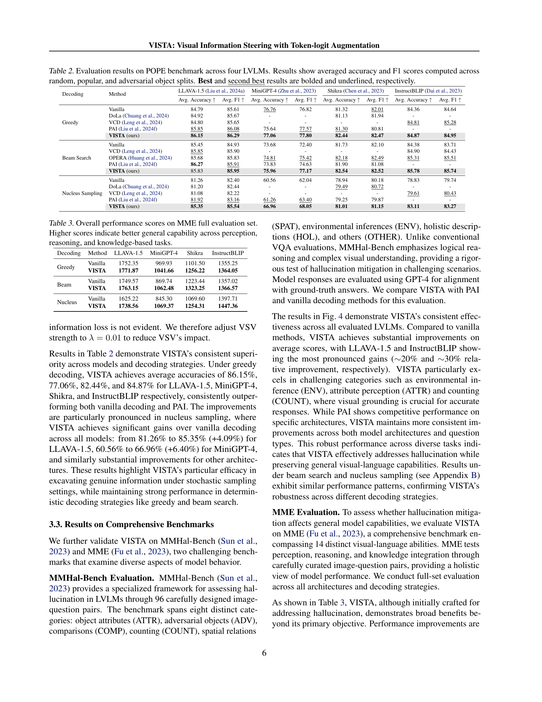
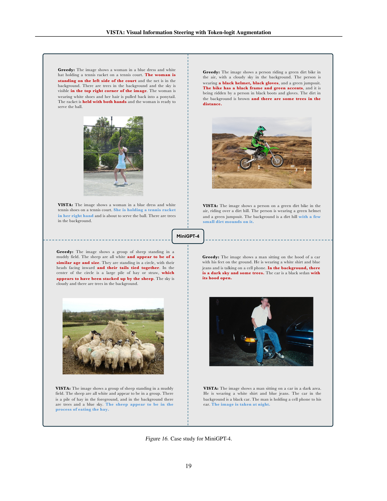

 


 2502.03628 
 Zhuowei Li et el. 
 
 🤗 2025-02-11 
 



↗ arXiv


↗ Hugging Face


↗ Papers with Code


### TL;DR



대규모 비전-언어 모델(LVLMs)은 텍스트와 이미지를 모두 처리할 수 있지만, 문법적으로는 맞지만 시각적으로는 틀린 내용을 생성하는 환각 현상이 빈번하게 발생합니다. 기존 연구는 주의 패턴이나 로그릿 분포의 차이에 초점을 맞추었지만, 환각이 어떻게 생성되고 전파되는지에 대한 명확한 이해는 부족했습니다.

본 논문에서는 토큰 로그릿 순위를 분석하여 LVLMs의 환각 동역학을 조사하고, 환각 발생의 세 가지 주요 패턴(점진적인 시각 정보 손실, 초기 활성화, 숨겨진 진정한 정보)을 밝혔습니다. 이러한 통찰력을 바탕으로, 본 논문은 VISTA라는 훈련이 필요 없는 추론 시간 개입 프레임워크를 제안합니다. VISTA는 활성화 공간에서 시각 정보를 강화하고, 의미 있는 디코딩을 촉진하기 위한 두 가지 보완적인 접근 방식을 결합합니다.



#### Key Takeaways


 VISTA는 **훈련이 필요 없는 추론 시간 개입 프레임워크**로, 대규모 비전-언어 모델의 환각 문제를 효과적으로 해결합니다. 



 **토큰 로그릿 순위 분석**을 통해 환각 발생 메커니즘에 대한 새로운 통찰력을 제공합니다. 



 다양한 모델 아키텍처와 디코딩 전략에 적용 가능하며, 평균 **40%의 환각 감소 효과**를 보입니다. 


#### Why does it matter?
본 논문은 **대규모 비전-언어 모델의 환각 문제를 해결하기 위한 새로운 접근법**을 제시하여, 해당 분야 연구자들에게 중요한 시사점을 제공합니다. **훈련 없이 추론 단계에서만 개입**하는 방식으로 환각을 줄이는 동시에 **다양한 모델과 디코딩 전략에 적용 가능**하다는 점에서 실용적인 가치가 높습니다. 또한, **토큰 동역학 분석을 통해 환각 발생 메커니즘에 대한 새로운 통찰력**을 제시하여 후속 연구의 방향을 제시합니다. 이는 **현재 급증하고 있는 멀티모달 AI 분야의 신뢰성 향상**에 크게 기여할 수 있습니다.

------
#### Visual Insights

> 🔼 이 그림은 MSCOCO 데이터셋에서 무작위로 선택된 500개의 이미지에 대한 토큰 로그잇 순위 패턴 분석 결과를 보여줍니다.  높은 순위는 높은 생성 확률을 나타냅니다. 왼쪽 그래프는 마지막 5개 레이어의 평균 토큰 순위를 보여주며, 생성 과정의 초기, 중간, 후반 단계에 따른 시간적 변화를 보여줍니다. 오른쪽 그래프는 모든 시간 단계에 걸쳐 평균화된 레이어별 토큰 순위 변화를 보여주며, 초기 활성화 현상을 보여줍니다.  즉, 시각적 정보가 생성 과정에서 점차적으로 손실되는 현상과 의미있는 토큰이 최종 레이어보다 이전 레이어에서 최고 활성도에 도달하는 현상을 시각적으로 보여줍니다.
> 

> 
read the caption

> Figure 1: Analysis of token logits ranking patterns across 500 randomly selected images from MSCOCO dataset. Higher ranking indicates higher generation probability. Left: Average token ranking from the last five layers, showing temporal progression across early, mid, and late generation stages. Right: Layer-wise evolution of token rankings averaged across all time steps, demonstrating early-excitation phenomenon.
> 


| Decoding | Method | LLAVA-1.5 (Liu et al., 2024a) |  | MiniGPT-4 (Zhu et al., 2023) |  | Shikra (Chen et al., 2023) |  | InstructBLIP (Dai et al., 2023) |  |
|---|---|---|---|---|---|---|---|---|
|  |  | CHAIRS↓ | CHAIRI↓ | CHAIRS↓ | CHAIRI↓ | CHAIRS↓ | CHAIRI↓ | CHAIRS↓ | CHAIRI↓ |
|---|---|---|---|---|---|---|---|---|
| Greedy | Vanilla | 46.4 | 12.1 | 35.2 | 10.7 | 56.8 | 14.8 | 38.0 | 10.7 |
|  | DoLa (Chuang et al., 2024) | 45.4 | 11.9 | - | - | 60.0 | 15.1 | - | - |
|  | VCD (Leng et al., 2024) | 47.4 | 13.0 | - | - | - | - | 45.8 | 12.8 |
|  | PAI (Liu et al., 2024f) | 22.8 | 7.0 | 29.2 | 10.9 | 40.8 | 11.0 | - | - |
|  | VISTA (ours) | 20.4 | 6.9 | 19.8 | 6.0 | 31.4 | 9.7 | 27.4 | 8.1 |
| Beam Search | Vanilla | 49.0 | 12.5 | 33.0 | 11.0 | 53.8 | 14.4 | 37.8 | 10.7 |
|  | VCD (Leng et al., 2024) | 49.8 | 12.4 | - | - | - | - | 49.2 | 13.7 |
|  | OPERA (Huang et al., 2024) | 45.2 | 12.4 | 26.8 | 9.3 | 39.6 | 12.2 | 50.2 | 13.9 |
|  | PAI (Liu et al., 2024f) | 22.3 | 6.8 | 31.6 | 11.2 | 41.6 | 10.4 | - | - |
|  | VISTA (ours) | 17.4 | 6.3 | 18.4 | 6.4 | 32.2 | 9.5 | 26.8 | 7.8 |
| Nucleus Sampling | Vanilla | 53.2 | 15.1 | 34.8 | 11.2 | 56.4 | 15.9 | 46.6 | 13.1 |
|  | DoLa (Chuang et al., 2024) | 47.2 | 14.0 | - | - | 56.6 | 16.3 | - | - |
|  | VCD (Leng et al., 2024) | 60.8 | 16.2 | - | - | - | - | 57.0 | 16.0 |
|  | PAI (Liu et al., 2024f) | 30.2 | 10.3 | 31.8 | 13.2 | 43.2 | 12.0 | - | - |
|  | VISTA (ours) | 24.0 | 8.2 | 18.4 | 6.4 | 31.8 | 9.7 | 29.4 | 9.1 |

> 🔼 표 1은 CHAIR (Caption Hallucination Assessment with Image Relevance) 벤치마크를 사용한 환각 평가 결과를 보여줍니다.  본 논문에서는 외부 감독 없이 동작하는 최첨단 비훈련 기반 방법들과 VISTA를 비교 분석합니다. 최대 새 토큰 수는 512개로 설정되었으며, 최고 및 두 번째로 좋은 결과는 각각 굵은체 및 밑줄로 표시했습니다.  '-' 표시는 공개된 구현에서 지원하지 않는 결과임을 나타냅니다. 표에는 다양한 모델 아키텍처(LLaVA-1.5, MiniGPT-4, Shikra, InstructBLIP)와 디코딩 전략(탐욕적 디코딩, 빔 서치, 핵 생성 샘플링)에 따른 CHAIRs 및 CHAIR₁ 지표가 제시되어 있습니다.
> 

> 
read the caption

> Table 1: CHAIR hallucination evaluation results. We compare VISTA to state-of-the-art training-free methods that do not rely on external supervision. Maximum new token is set to 512. Best and second best results are bolded and underlined, respectively. “-” indicates the result is not supported by released implementation.
> 

### In-depth insights

#### Token Dynamics
토큰 역동성 분석은 대규모 비전-언어 모델(LLM)의 생성 과정에서 **토큰의 활성화 순위 변화**를 추적하여 숨겨진 정보의 손실, 의미 있는 토큰의 초기 활성화, 그리고 숨겨진 진정한 정보의 존재 등 세 가지 주요 패턴을 밝혀냅니다. 이러한 패턴 분석을 통해 LLM의 환각 현상이 생성 과정 전반에 걸쳐 시각적 정보가 점진적으로 희석되면서 발생하는 현상임을 알 수 있습니다. **시각적 정보의 손실**과 **언어적 사전 정보의 누적** 사이의 역동적인 상호작용에 대한 통찰력을 제공하며, 이는 환각 현상을 줄이기 위한 새로운 접근 방식을 제시하는 기반이 됩니다.  **VISTA 모델**은 이러한 분석 결과를 바탕으로 시각적 정보를 강화하고 의미 있는 토큰의 해석을 개선하는 방식으로 환각 현상을 완화합니다.  즉, 토큰 역동성 분석은 LLM 환각 현상의 근본 원인을 이해하고 효과적인 해결책을 모색하는 데 중요한 역할을 합니다.

#### VISTA Framework
VISTA 프레임워크는 **훈련이 필요없는 추론 단계의 개입 방식**으로, 대규모 비전-언어 모델(LLM)의 환각 문제를 해결하기 위해 제안되었습니다. 이는 **점진적인 시각 정보 손실**과 **의미있는 토큰의 초기 활성화**, 그리고 **숨겨진 진정한 정보**라는 세 가지 주요 패턴을 통해 LLM의 환각 메커니즘을 분석한 통찰력에 기반합니다.  VISTA는 시각 정보를 활성화 공간에서 강화하고, 초기 계층의 활성화를 활용하여 의미있는 디코딩을 촉진하는 두 가지 상호 보완적인 접근 방식을 결합합니다.  **VSV(Visual Steering Vector)** 와 **SLA(Self-Logits Augmentation)** 이라는 두 모듈로 구성되어 있으며, 다양한 디코딩 전략에 적용 가능하다는 장점이 있습니다.  **훈련이 필요 없고 모델 수정이 필요 없어 기존 LLM에 쉽게 적용**할 수 있다는 실용적인 측면도 돋보입니다.  결과적으로, VISTA는 다양한 벤치마크에서 환각을 상당히 감소시키는 효과를 보여주어, LLM의 신뢰성을 높이는 데 기여할 수 있는 잠재력을 지닌 프레임워크로 평가됩니다.

#### Hallucination Study
본 논문의 "Hallucination Study" 부분은 대규모 비전-언어 모델(LVLMs)의 환각 현상에 대한 심층적인 분석을 제시합니다. **환각의 주요 원인은 시각적 정보의 점진적 손실, 의미있는 토큰의 조기 활성화, 그리고 숨겨진 진정한 정보의 존재**로 밝혀졌습니다. 이러한 발견을 바탕으로, 연구진은 시각적 정보를 강화하고 의미있는 디코딩을 촉진하는 두 가지 보완적인 접근 방식을 제시합니다. **훈련이 필요없는 추론 단계의 개입 프레임워크인 VISTA**는 환각을 줄이고 진정한 정보를 촉진합니다.  **실험 결과는 VISTA가 평균 40%의 환각 감소를 달성**했으며, 다양한 모델과 디코딩 전략에서 일관되게 기존 방법을 능가한다는 것을 보여줍니다. 이 연구는 단순한 성능 향상을 넘어, LVLMs의 내부 동작 메커니즘에 대한 귀중한 통찰력을 제공하고, **환각 문제 해결을 위한 새로운 방향**을 제시하는 데 큰 의의가 있습니다. 특히, 시각 정보의 점진적 손실과 의미있는 토큰의 조기 활성화에 대한 이해는 향후 LVLMs의 신뢰성을 높이는 데 중요한 역할을 할 것으로 기대됩니다.

#### Ablation Analysis
본 논문의 ablation study는 **VISTA 모델의 핵심 구성 요소인 VSV(Visual Steering Vector)와 SLA(Self-Logits Augmentation)의 효과를 개별적으로 평가**하고, **두 요소의 상호작용**을 분석하여 모델 성능에 대한 통찰력을 제공합니다.  실험 결과는 **VSV와 SLA 모두가 홀루시네이션 감소에 기여**하지만, **특히 VSV가 시각 정보를 효과적으로 유지**하는 데 중요한 역할을 수행함을 보여줍니다.  또한, **SLA는 의미론적으로 중요한 토큰의 생성을 촉진**하는 데 효과적임을 확인했습니다.  흥미롭게도, **VSV와 SLA의 강도를 조절하는 하이퍼파라미터의 최적값은 모델 아키텍처에 따라 다름**을 발견했습니다.  이러한 결과는 VISTA 모델의 설계 및 향후 연구 방향에 대한 중요한 시사점을 제공하며, **단순히 개별 구성요소의 영향뿐 아니라, 상호작용 효과까지 고려하여 모델을 최적화**해야 함을 시사합니다.  **다양한 디코딩 전략에서도 일관된 성능 향상**을 보임으로써, VISTA의 강건성을 확인했습니다.

#### Future Work
본 논문은 시각 언어 모델(LVLMs)의 환각 문제를 해결하기 위한 새로운 방법론인 VISTA를 제시하며, 향후 연구 방향으로 **다양한 LVLM 아키텍처 및 디코딩 전략에 대한 VISTA의 일반화 가능성을 더욱 확장**하는 것을 제안합니다.  또한, **제한된 자원 환경에서의 VISTA 효율성을 높이는 경량화 연구**와, **대규모 데이터셋을 활용한 VISTA의 성능 개선**을 위한 연구도 필요합니다. 특히, **VSV와 SLA 모듈의 상호작용에 대한 심층적인 분석**을 통해 최적의 파라미터 조합을 찾는 연구가 중요하며, **환각 감소와 생성 품질 사이의 균형점을 찾는 연구**도 더욱 심도있게 진행되어야 합니다. 마지막으로, **다양한 다운스트림 작업(예: VQA, 이미지 캡셔닝)에 대한 VISTA 적용성을 검증**하고, **상호작용적인 시각 언어 작업에 대한 확장 연구**가 미래 연구 과제로 남아있습니다.  **추가적으로,  현재 연구에서 사용된 GPT-4의 오라클 모델 의존성을 줄이는 방안**에 대한 연구도 필요합니다.

### More visual insights

More on figures

> 🔼 그림 2는 모델의 레이어(세로축)와 생성 단계(가로축)에 걸쳐 토큰 순위의 변화를 보여주는 대표 이미지에 대한 토큰 순위 히트맵입니다. 어두운 색상은 더 높은 순위를 나타냅니다. 시각화는 점진적인 시각 정보 손실과 초기 활성화 현상을 모두 보여줍니다. 즉, 생성 과정에서 시각적으로 근거한 토큰은 점점 덜 선호되는 반면, 의미 있는 토큰은 최종 레이어보다 이전 레이어에서 최고 활성도에 도달합니다.
> 

> 
read the caption

> Figure 2: Token ranking heatmaps for a representative image, demonstrating the evolution of token rankings across model layers (vertical axis) and generation steps (horizontal axis). Darker colors indicate higher ranking. The visualization reveals both gradual visual information loss and early excitation phenomena.
> 

> 🔼 그림 3은 제안된 VISTA 모델의 구조를 보여줍니다. VISTA는 두 가지 상호 보완적인 메커니즘을 도입합니다. 첫째, VSV(Visual Steering Vector)는 추론 단계에서 시각적 정보를 추출하고 강화하여 시각적 기반 정보의 점진적 손실을 방지합니다. 둘째, SLA(Self-Logits Augmentation)는 초기 레이어의 의미 정보를 활용하여 토큰 생성을 유도합니다. 그림에서는 설명을 위해 세 개의 개별 전방 패스를 보여주지만, 실제 구현에서는 이를 생략할 수 있습니다.
> 

> 
read the caption

> Figure 3: Architectural overview of VISTA. VISTA introduces two complementary mechanisms: VSV extracts and reinforces visual grounding information (Vssubscript𝑉𝑠V_{s}italic_V start_POSTSUBSCRIPT italic_s end_POSTSUBSCRIPT) at inference, and SLA leverages early-layer semantic information to guide token generation. Note: While three separate forward passes are shown for illustration purpose, they can be avoided in implementation.
> 

> 🔼 그림 4는 MMHal-Bench 벤치마크에서 다양한 질문 범주에 대한 성능 비교를 보여줍니다.  각 범주는 특징(ATTR), 적대적 객체(ADV), 비교(COMP), 계산(COUNT), 공간 관계(SPAT), 환경 추론(ENV), 전체적 설명(HOL), 기타(OTHER)를 포함합니다.  각 점수는 GPT-4 평가 프로토콜을 사용하여 계산됩니다.  즉, 다양한 유형의 시각적 언어 이해 능력을 평가하는 벤치마크에서 VISTA 모델의 성능을 보여주는 그래프이며, 각 질문 유형에 따른 정확도를 나타냅니다.
> 

> 
read the caption

> Figure 4: Performance comparison on MMHal-Bench across different question categories: attributes (ATTR), adversarial objects (ADV), comparisons (COMP), counting (COUNT), spatial relations (SPAT), environmental inference (ENV), holistic descriptions (HOL), and others (OTHER). Scores are computed using GPT-4 evaluation protocol.
> 

> 🔼 그림 5는 LLAVA-1.5 모델을 사용하여 그리디 디코딩과 VISTA 디코딩의 단계별 토큰 순위를 비교한 그래프입니다.  그리디 디코딩은 생성 과정에서 실제 이미지에 있는 개체(진짜 토큰)의 순위가 점차 낮아지고, 이미지에 없는 개체(환각 토큰)의 순위가 높아지는 경향을 보입니다. 반면 VISTA는 진짜 토큰의 순위를 높이고, 환각 토큰의 순위를 낮추어, 생성 과정에서의 환각을 줄이는 효과를 보여줍니다.  초기, 중간, 후기 단계별로 진짜 토큰과 환각 토큰의 평균 순위 변화를 시각적으로 보여줌으로써 VISTA의 효과를 명확히 제시합니다.
> 

> 
read the caption

> Figure 5: Cross-stage token ranking comparison between greedy and VISTA on LLAVA-1.5. VISTA effectively promotes the ranking of genuine tokens while depressing hallucination tokens.
> 

> 🔼 이 그림은 Shikra 모델에서 VSV(Visual Steering Vector)의 강도(λ)와 SLA(Self-Logits Augmentation)의 혼합 비율(γ)을 변화시키면서 모델 성능에 미치는 영향을 보여주는 열 지도(ablation matrix)입니다. 색깔이 밝을수록 성능이 좋음을 나타냅니다. 빨간색 상자는 논문에서 사용된 매개변수 조합을 강조 표시합니다. F1 점수는 전체 생성 품질을 보여주는 지표로 포함되었습니다.  λ와 γ의 값을 바꿔가며 CHAIRs, CHAIR1, F1 점수의 변화를 보여주는 열 지도 세 개가 나란히 있습니다. 각 열 지도는 λ와 γ 값에 따른 성능 변화를 시각적으로 보여줍니다.
> 

> 
read the caption

> Figure 6: Ablation matrices for VSV strength (λ𝜆\lambdaitalic_λ) and SLA mixing ratio (γ𝛾\gammaitalic_γ) on Shikra. Brighter color signifies the better performance. Red boxes highlight the parameter combinations we used. F1 score is included to demonstrate the overall generation quality.
> 

> 🔼 그림 7은 Shikra 모델에서 생성 과정 전반에 걸쳐 토큰 순위 변화를 보여줍니다.  세 가지 토큰 유형(숨겨진 진짜 토큰, 디코딩된 진짜 토큰, 환각 토큰)의 평균 순위가 생성 단계(초기, 중간, 후기)에 따라 어떻게 변하는지 시각적으로 나타냅니다. 이를 통해 시간에 따른 시각 정보 손실, 의미 있는 토큰의 초기 활성화, 그리고 최종적으로 디코딩되지 않더라도 상대적으로 높은 순위를 유지하는 숨겨진 진짜 토큰의 패턴을 확인할 수 있습니다.
> 

> 
read the caption

> Figure 7: Cross-stage token ranking on Shikra.
> 

> 🔼 그림 8은 Shikra 모델에서 각 계층별 토큰 순위를 보여줍니다.  x축은 모델의 계층(Layer)을 나타내고, y축은 평균 토큰 순위(Average Token Rank)를 나타냅니다.  세 가지 유형의 토큰(Hidden Genuine Tokens, Decoded Genuine Tokens, Hallucinated Tokens)에 대한 계층별 순위 변화를 시각적으로 보여주어, 모델이 생성 과정에서 시각 정보를 어떻게 처리하는지에 대한 통찰력을 제공합니다.  특히, 시각적으로 근거가 있는 토큰의 순위 변화와, 생성된 텍스트에 포함되지 않은 시각 정보 토큰의 순위를 통해, 모델의 환각 현상을 이해하는 데 도움이 됩니다.
> 

> 
read the caption

> Figure 8: Layer-wise token rankings on Shikra.
> 

> 🔼 이 그림은 Shikra 모델을 사용하여 그리디 디코딩과 VISTA(그리디 기반)의 토큰 순위를 단계별로 비교한 것입니다.  VISTA는 생성 과정 전반에 걸쳐 진짜 토큰의 순위를 효과적으로 높이고, 환각 토큰의 순위는 낮추는 것을 보여줍니다.  즉, 그림은 모델이 이미지에 실제로 존재하는 개체를 나타내는 단어들을 더 높은 확률로 선택하고 이미지에 없는 개체를 나타내는 단어들을 덜 선택하도록 VISTA가 효과적으로 개선함을 시각적으로 보여줍니다.  그래프는 시간 경과에 따른 각 토큰 유형(숨겨진 진짜 토큰, 디코딩된 진짜 토큰, 환각 토큰)의 평균 순위 변화를 보여줍니다.
> 

> 
read the caption

> Figure 9: Cross-stage token ranking comparison between greedy and VISTA (greedy-based) on Shikra. VISTA effectively promotes the ranking of genuine tokens while depressing hallucination tokens.
> 

> 🔼 그림 10은 MMHal-Bench 벤치마크를 사용한 빔 서치 디코딩 전략에 대한 성능 비교 결과를 보여줍니다.  각 그래프는 네 가지 모델(LLaVA-1.5, MiniGPT-4, Shikra, InstructBLIP)의 8가지 질문 유형(속성, 적대적 개체, 비교, 계산, 공간 관계, 환경 추론, 전체 설명, 기타)에 대한 성능을 다각형으로 나타냅니다.  각 꼭짓점은 특정 질문 유형에 대한 성능 점수를 나타내고, 다각형의 크기는 전반적인 성능을 반영합니다.  Vanilla, PAI, VISTA 세 가지 방법의 성능을 비교하여 VISTA가 다른 방법들에 비해 대부분의 질문 유형에서 더 높은 성능을 보임을 보여줍니다.
> 

> 
read the caption

> Figure 10: Performance comparison on MMHal-Bench using beam search.
> 

> 🔼 그림 11은 MMHal-Bench 벤치마크에서 nucleus sampling 디코딩 전략을 사용하여 다양한 모델들의 성능을 비교한 결과를 보여줍니다.  각 모델의 능력을 평가하기 위해 8가지 질문 유형(속성, 대립 객체, 비교, 개수 세기, 공간 관계, 환경 추론, 전체 설명, 기타)을 사용했습니다.  각 질문 유형에 대한 성능 점수는 GPT-4를 사용하여 계산되었으며, 차트는 각 모델의 강점과 약점을 시각적으로 보여줍니다. VISTA 모델이 다른 모델들에 비해 전반적으로 더 나은 성능을 보이는 것을 알 수 있습니다.
> 

> 
read the caption

> Figure 11: Performance comparison on MMHal-Bench using nucleus sampling.
> 

> 🔼 그림 12는 MiniGPT-4 모델에 대한 VSV 강도(λ)와 SLA 혼합 비율(γ)에 대한 ablation matrix를 보여줍니다. 색이 밝을수록 성능이 좋음을 나타내며, 빨간색 상자는 표 1에서 사용된 매개변수 조합을 강조 표시합니다. F1 점수는 전반적인 생성 품질을 나타냅니다. 이 그림은 VSV 강도와 SLA 혼합 비율을 변경했을 때 MiniGPT-4의 성능에 어떤 영향을 미치는지 보여주는 실험 결과를 시각적으로 보여줍니다. 각 매개변수 조합에 따른 CHAIRs, CHAIR₁, 그리고 F1 점수의 변화를 색상으로 표현하여 직관적으로 이해할 수 있도록 합니다.  빨간색 상자는 논문의 표 1에서 사용된 최적의 매개변수 조합을 나타내어, 본 연구의 주요 결과를 뒷받침하는 증거로 활용됩니다.
> 

> 
read the caption

> Figure 12: Ablation matrices for VSV strength (λ𝜆\lambdaitalic_λ) and SLA mixing ratio (γ𝛾\gammaitalic_γ) on MiniGPT-4. Brighter color signifies the better performance, and red boxes highlight the parameter combinations used in Table 1. F1 score is included to indicate the overall generation quality.
> 

> 🔼 그림 13은 LLAVA-1.5 모델에 대한 VSV 강도(λ)와 SLA 혼합 비율(γ)에 대한 ablation matrix를 보여줍니다. 더 밝은 색상은 더 나은 성능을 나타내며, 빨간색 상자는 표 1에서 사용된 매개변수 조합을 강조 표시합니다. F1 점수는 전반적인 생성 품질을 나타냅니다. 이 그림은 VSV 강도와 SLA 혼합 비율을 변경했을 때, LLAVA-1.5 모델의 성능 변화를 시각적으로 보여줍니다. 밝은 색일수록 성능이 좋다는 것을 나타내며, 표 1에서 사용된 매개변수 조합은 빨간색 상자로 표시되어 있습니다. F1 점수는 추가적인 성능 지표로 포함되어 있습니다.
> 

> 
read the caption

> Figure 13: Ablation matrices for VSV strength (λ𝜆\lambdaitalic_λ) and SLA mixing ratio (γ𝛾\gammaitalic_γ) on LLAVA-1.5. Brighter color signifies the better performance, and red boxes highlight the parameter combinations used in Table 1. F1 score is included to indicate the overall generation quality.
> 

> 🔼 그림 14는 InstructBLIP 모델에 대한 VSV 강도(λ)와 SLA 혼합 비율(γ)에 대한 ablation matrix를 보여줍니다. 더 밝은 색상은 더 나은 성능을 나타내며, 빨간색 상자는 표 1에서 사용된 매개변수 조합을 강조 표시합니다. F1 점수는 전반적인 생성 품질을 나타냅니다. 이 그림은 VSV 강도와 SLA 혼합 비율이 InstructBLIP 모델의 성능에 미치는 영향을 시각적으로 보여주는 ablation 연구의 결과를 보여줍니다.  각 매개변수의 최적 값을 찾는 데 도움이 되는 시각적 도구를 제공합니다. 밝은 색상은 성능이 우수함을, 어두운 색상은 성능이 저조함을 나타냅니다.
> 

> 
read the caption

> Figure 14: Ablation matrices for VSV strength (λ𝜆\lambdaitalic_λ) and SLA mixing ratio (γ𝛾\gammaitalic_γ) on InstructBLIP. Brighter color signifies the better performance, and red boxes highlight the parameter combinations used in Table 1. F1 score is included to indicate the overall generation quality.
> 

> 🔼 그림 15는 LLAVA-1.5 모델에 대한 사례 연구입니다.  LLAVA-1.5 모델을 사용하여 생성된 캡션과 실제 이미지 간의 차이를 보여줍니다. 왼쪽 열은 기존 방법(Greedy, Beam Search, Nucleus Sampling)으로 생성된 캡션이며, 오른쪽 열은 VISTA를 적용하여 생성된 캡션입니다.  각 이미지에 대해 기존 방법으로 생성된 캡션은 시각적으로 부정확하거나(hallucination) 실제 이미지와 일치하지 않는 부분이 있습니다. 반면, VISTA를 적용한 경우 시각적 정보를 더 잘 반영하고 실제 이미지와 더 일치하는 캡션을 생성하는 것을 보여줍니다.  이를 통해 VISTA가 시각 정보를 더 잘 활용하여 hallucination을 줄이는 효과를 시각적으로 보여줍니다.
> 

> 
read the caption

> Figure 15: Case study for LLAVA-1.5.
> 

> 🔼 MiniGPT-4 모델의 환각 현상을 보여주는 사례 연구입니다.  이 그림은  기존의 텍스트 생성 방식(Greedy)과 VISTA(Visual Information Steering with Token-logit Augmentation) 방식의 결과를 비교하여 보여줍니다.  두 가지 방식 모두 이미지에 대한 설명을 생성하지만,  Greedy 방식은 이미지에 없는 내용을 생성하는 환각(hallucination) 현상을 보이고, VISTA 방식은 이미지에 있는 내용을 더 정확하게 반영하는 결과를 보여줍니다.  그림은 각각의 텍스트 생성 결과와 함께 원본 이미지를 보여주어  두 모델의 차이를 명확하게 보여주도록 디자인되었습니다.  이를 통해 VISTA 방식이 환각을 줄이고 이미지 내용을 더욱 정확하게 반영하는 데 효과적임을 시각적으로 보여줍니다.
> 

> 
read the caption

> Figure 16: Case study for MiniGPT-4.
> 

> 🔼 그림 17은 Shikra 모델에 대한 사례 연구입니다.  Shikra 모델이 생성한 캡션과 실제 이미지 간의 차이를 보여주는 두 개의 예시가 제시되어 있습니다.  각 예시는 Shikra 모델이 생성한 캡션과 실제 이미지를 비교하여, 모델이 얼마나 정확하게 이미지 내용을 묘사하고 있는지를 보여줍니다.  이를 통해 Shikra 모델의 한계와 강점을 파악할 수 있습니다.  첫 번째 예시는 어린 두 소녀가 식탁에 앉아 도넛을 먹는 장면을 보여주고 있으며, 두 번째 예시는 눈 덮인 산에서 스키를 타는 사람을 보여주고 있습니다.  두 예시 모두 Shikra 모델이 생성한 캡션이 이미지 내용을 부분적으로만 묘사하거나, 또는 실제 이미지에는 없는 내용을 포함하는 등의 오류를 보여줍니다.
> 

> 
read the caption

> Figure 17: Case study for Shikra.
> 

More on tables


| Decoding | Method | LLAVA-1.5 (Liu et al., 2024a) |  | MiniGPT-4 (Zhu et al., 2023) |  | Shikra (Chen et al., 2023) |  | InstructBLIP (Dai et al., 2023) |  |
|---|---|---|---|---|---|---|---|---|---|
|  | Avg. Accuracy ↑ | Avg. F1 ↑ | Avg. Accuracy ↑ | Avg. F1 ↑ | Avg. Accuracy ↑ | Avg. F1 ↑ | Avg. Accuracy ↑ | Avg. F1 ↑ |
|---|---|---|---|---|---|---|---|---|---|
| Greedy | Vanilla | 84.79 | 85.61 | 76.76 | 76.82 | 81.32 | 82.01 | 84.36 | 84.64 |
|  | DoLa (Chuang et al., 2024) | 84.92 | 85.67 | - | - | 81.13 | 81.94 | - | - |
|  | VCD (Leng et al., 2024) | 84.80 | 85.65 | - | - | - | - | 84.81 | 85.28 |
|  | PAI (Liu et al., 2024f) | 85.85 | 86.08 | 75.64 | 77.57 | 81.30 | 80.81 | - | - |
|  | VISTA (ours) | 86.15 | 86.29 | 77.06 | 77.80 | 82.44 | 82.47 | 84.87 | 84.95 |
| Beam Search | Vanilla | 85.45 | 84.93 | 73.68 | 72.40 | 81.73 | 82.10 | 84.38 | 83.71 |
|  | VCD (Leng et al., 2024) | 85.85 | 85.90 | - | - | - | - | 84.90 | 84.43 |
|  | OPERA (Huang et al., 2024) | 85.68 | 85.83 | 74.81 | 75.42 | 82.18 | 82.49 | 85.31 | 85.51 |
|  | PAI (Liu et al., 2024f) | 86.27 | 85.91 | 73.83 | 74.63 | 81.90 | 81.08 | - | - |
|  | VISTA (ours) | 85.83 | 85.95 | 75.96 | 77.17 | 82.54 | 82.52 | 85.78 | 85.74 |
| Nucleus Sampling | Vanilla | 81.26 | 82.40 | 60.56 | 62.04 | 78.94 | 80.18 | 78.83 | 79.74 |
|  | DoLa (Chuang et al., 2024) | 81.20 | 82.44 | - | - | 79.49 | 80.72 | - | - |
|  | VCD (Leng et al., 2024) | 81.08 | 82.22 | - | - | - | - | 79.61 | 80.43 |
|  | PAI (Liu et al., 2024f) | 81.92 | 83.16 | 61.26 | 63.40 | 79.25 | 79.87 | - | - |
|  | VISTA (ours) | 85.35 | 85.54 | 66.96 | 68.05 | 81.01 | 81.15 | 83.11 | 83.27 |
> 🔼 표 2는 네 개의 거대 비전-언어 모델(LLM)에 대한 POPE 벤치마크 평가 결과를 보여줍니다. 무작위, 흔한, 그리고 적대적 객체 분할에 대해 평균 정확도와 F1 점수가 계산되어 제시됩니다. 최고 및 두 번째로 좋은 결과는 각각 굵은체 및 밑줄로 표시됩니다.
> 

> 
read the caption

> Table 2: Evaluation results on POPE benchmark across four LVLMs. Results show averaged accuracy and F1 scores computed across random, popular, and adversarial object splits. Best and second best results are bolded and underlined, respectively.
> 


| Decoding | Method | LLAVA-1.5 | MiniGPT-4 | Shikra | InstructBLIP |
|---|---|---|---|---|---| 
| Greedy | Vanilla | 1752.35 | 969.93 | 1101.50 | 1355.25 |
|  | **VISTA** | **1771.87** | **1041.66** | **1256.22** | **1364.05** |
| Beam | Vanilla | 1749.57 | 869.74 | 1223.44 | 1357.02 |
|  | **VISTA** | **1763.15** | **1062.48** | **1323.25** | **1366.57** |
| Nucleus | Vanilla | 1625.22 | 845.30 | 1069.60 | 1397.71 |
|  | **VISTA** | **1738.56** | **1069.37** | **1254.31** | **1447.36** |
> 🔼 표 3은 MME(Multimodal Hallucination Bench)의 전체 평가 세트에 대한 전반적인 성능 점수를 보여줍니다. 점수가 높을수록 지각, 추론 및 지식 기반 작업 전반에 걸쳐 더 나은 일반적인 기능을 나타냅니다.  이 표는 다양한 모델 아키텍처와 디코딩 전략에서 VISTA가  일반적인 다중 모드 언어 모델 성능에 미치는 영향을 평가하는 데 사용되었습니다.
> 

> 
read the caption

> Table 3: Overall performance scores on MME full evaluation set. Higher scores indicate better general capability across perception, reasoning, and knowledge-based tasks.
> 


| γ | 31-31 | 30-31 | 29-31 | 28-31 | 27-31 |
|---|---|---|---|---|---| 
| 0.1 | 48.2, 13.9, 76.2 | 48.6, 12.7, 77.7 | 46.8, 12.6, 77.4 | 46.2, 12.2, 74.4 | 45.8, 11.3, 77.6 |
| 0.2 | 56.6, 16.4, 75.3 | 49.4, 14.4, 76.5 | 47.4, 12.7, 77.3 | 46.8, 12.1, 77.7 | 43.2, 11.7, 77.6 |
| 0.3 | 62.0, 18.8, 72.9 | 55.4, 15.7, 75.9 | 49.2, 14.2, 76.5 | **42.8**, **11.3**, **78.4** |  |
| 0.4 | 61.2, 18.2, 73.3 | 57.6, 15.7, 75.3 | 52.6, 14.5, 76.1 | 46.6, 12.3, 77.2 |  |

> 🔼 표 4는 SLA 성능에 대한 윈도우 크기의 영향을 보여줍니다.  레이어 범위(X-31)는 로짓 증강에 사용된 레이어의 범위를 나타내며, X는 27에서 31까지 변합니다.  Cs와 Ci는 각각 CHAIRS와 CHAIRI 지표를 나타냅니다.  즉, 이 표는 SLA(Self-Logits Augmentation) 모듈에서 사용되는 레이어의 개수를 변경했을 때,  hallucination 측정 지표인 CHAIRS와 CHAIRI, 그리고 전체 성능을 나타내는 F1 스코어가 어떻게 달라지는지 보여주는 실험 결과를 담고 있습니다.  윈도우 크기가 커질수록(즉, 더 많은 레이어를 사용할수록)  성능이 어떻게 변하는지 확인할 수 있습니다.
> 

> 
read the caption

> Table 4: Impact of window size on SLA performance. Layer ranges (X-31) indicate the span of layers used for logit augmentation, where X varies from 27 to 31. CSS{}_{\text{S}}start_FLOATSUBSCRIPT S end_FLOATSUBSCRIPT and CII{}_{\text{I}}start_FLOATSUBSCRIPT I end_FLOATSUBSCRIPT denote CHAIRSS{}_{\text{S}}start_FLOATSUBSCRIPT S end_FLOATSUBSCRIPT and CHAIRII{}_{\text{I}}start_FLOATSUBSCRIPT I end_FLOATSUBSCRIPT metrics, respectively.
> 


| Methods | Greedy | VCD | PAI | VISTA (ours) |
|---|---|---|---|---|
| Latency (ms/token) ↓ | 28.54 (× 1.0) | 58.34 (× 2.04) | 57.78 (× 2.02) | **36.32 (× 1.27)** |
| Throughput (token/s) ↑ | 35.04 (× 1.0) | 17.14 (× 0.49) | 17.31 (× 0.49) | **27.53 (× 0.79)** |
> 🔼 표 5는 LLAVA-1.5 모델을 사용하여 탐색적 디코딩 전략을 기준으로 처리량과 지연 시간을 측정한 결과를 보여줍니다.  구체적으로, 탐색적 디코딩(greedy decoding) 방식을 기준으로 설정하고, VISTA를 포함한 다른 방법들의 처리량과 지연 시간을 비교하여, VISTA의 효율성을 보여줍니다.  단위는 token/s (토큰/초)와 ms/token (밀리초/토큰)으로 표시됩니다.
> 

> 
read the caption

> Table 5: Measure of throughput and latency on LLAVA-1.5. Greedy decoding strategy is applied and listed as baseline.
> 


| GPT-4o Prompt | 
|---|---| 
| You are a vision-language evaluator. Given an image and an AI-generated description, perform the following tasks: | 
| 1. List clearly visible contents in the image that are not mentioned in the description. | 
| 2. List hallucinated contents in the description that are not present in the image. | 
| 3. List contents accurately described in the description that match the image. | 
| For each task, include objects, object properties (e.g., color, count, position), and relationships between objects. You must answer each content with a single word, separating different contents by commas. If no contents apply, write ”None”. Make sure there is no overlapping words between three tasks. | 
| Answer 1: [Missing contents] | 
| Answer 2: [Hallucinated contents] | 
| Answer 3: [Accurate contents] |
> 🔼 이 표는 GPT-4o 프롬프트의 내용을 보여줍니다. 이 프롬프트는 이미지와 AI가 생성한 캡션을 입력받아, 캡션에 언급되지 않은 실제 이미지의 내용, 이미지에 없는 캡션의 내용, 이미지와 일치하는 캡션의 내용을 나열하도록 설계되었습니다. 각 항목에 대해서는 객체, 객체 속성(색상, 개수, 위치 등), 객체 간의 관계를 포함하여 상세히 기술해야 하며, 중복되는 단어는 없어야 합니다. 만약 해당하는 내용이 없으면 'None'이라고 답변하도록 되어 있습니다.
> 

> 
read the caption

> Table 6: The prompt used for GPT-4o to identify genuine and hallucinated words.
> 

### Full paper



