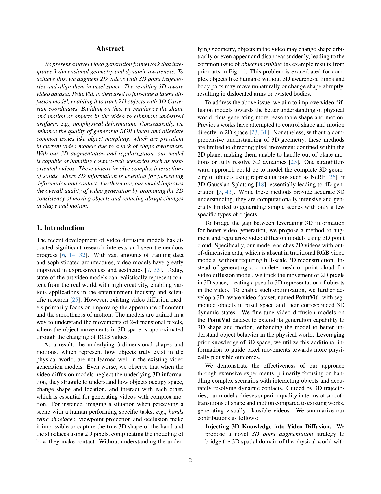

 


 2502.03639 
 Yunuo Chen et el. 
 
 🤗 2025-02-07 
 



↗ arXiv


↗ Hugging Face


### TL;DR



기존 비디오 생성 모델은 2D 픽셀 정보만을 사용하여 물체의 3D 형태 및 움직임을 제대로 이해하지 못해 비현실적인 변형이나 움직임이 발생하는 문제가 있습니다. 특히, 물체 간의 상호 작용이 복잡한 경우 이러한 문제가 더욱 심각하게 나타납니다.

본 논문에서는 **3D 점 궤적 정보를 활용하여 이러한 문제를 해결**하는 새로운 비디오 생성 프레임워크를 제시합니다. 먼저, **새로운 3D 인식 비디오 데이터셋 PointVid**를 구축하고, 이를 활용하여 **3D 점 정보를 2D 비디오와 통합**하는 훈련 방법을 개발했습니다. 또한, **점 정규화 기법**을 통해 생성된 비디오의 3D 일관성을 높이고 급격한 형태 및 움직임 변화를 줄여, **더욱 사실적이고 자연스러운 비디오 생성**을 가능하게 했습니다.



#### Key Takeaways


 3D 점 궤적을 활용, 2D 비디오에 3D 정보 통합 및 물리적 현실감 향상 



 새로운 3D 인식 비디오 데이터셋 PointVid 제작 및 공개 



 점 정규화 기법을 통해 물체 변형 및 움직임의 자연스러움 개선 


#### Why does it matter?
**본 논문은 3D 정보를 활용하여 비디오 생성 모델의 물리적 현실감을 높이는 새로운 방법을 제시합니다.** 기존의 2D 영상 기반 모델의 한계를 극복하고, **물체의 3D 형태 및 움직임을 정확하게 반영**하여 더욱 사실적이고 자연스러운 비디오 생성을 가능하게 합니다. 이는 **비디오 생성 분야의 핵심적인 문제점 해결**에 기여하며, 향후 연구에 대한 새로운 가능성을 제시합니다.  **특히, 물리적 상호작용이 복잡한 영상 생성에 효과적**으로, 다양한 분야에서의 응용 가능성이 높습니다.  **새로운 데이터셋과 훈련 방법론 제시**도 중요한 기여입니다.

------
#### Visual Insights

> 🔼 본 그림은 과제 중심 비디오에 대한 다양한 기준(SVD [6], I2VGen-XL [41], DynamiCrafter [37])에서 생성된 비디오를 저자들이 제안한 방법과 비교하여 보여줍니다. 모든 방법에 동일한 입력 조건을 사용했으며 (SVD는 이미지에만 조건부인 것을 제외하고), 기존 기준에서는 사람 손과 물체의 상호작용 중에 손이나 물체의 심각한 왜곡이 자주 발생하는 반면, 저자들의 방법은 상호 작용 중에도 손과 물체의 모양을 보존하고 비디오 전체에 걸쳐 부드러운 전환을 보장함을 보여줍니다.
> 

> 
read the caption

> Figure 1: Comparison on Task-Oriented Videos. We present videos generated by different baselines (SVD [6], I2VGen-XL [41], and DynamiCrafter [37]) and compare them with our method. We use the same input conditions for all methods (except that SVD is conditioned only on the image). It can be observed that existing baselines often exhibit severe distortions of hands or objects during human hand-object interactions. In contrast, our method preserves the shapes of both the hand and object during such interactions and ensures smooth transitions throughout the video.
> 


| Method | SC ↑ | BC ↑ | MS ↑ | AQ ↑ | IQ ↑ | PC ↑ |
|---|---|---|---|---|---|---|
| I2VGen-XL | 0.83247 | 0.89147 | 0.95706 | **0.44055** | 0.58532 | 0.32665 |
| Ours | **0.95892** | **0.95202** | **0.98456** | 0.43369 | **0.60423** | **0.37434** |

> 🔼 표 1은 제안된 방법의 다양한 측면을 VBench [16] 및 VideoPhy [4] 벤치마크를 사용하여 정량적으로 평가한 결과를 보여줍니다. 평가 지표는 다음과 같습니다. (VBench) SC(주제 일관성), BC(배경 일관성), MS(움직임 부드러움), AQ(미적 품질), IQ(영상 품질); (VideoPhy) PC(물리적 상식). 3D 정보를 통합함으로써, 제안된 비디오 모델은 물리적 상식, 움직임 부드러움, 주제/배경 일관성과 같은 지표에서 상당한 향상을 보여줍니다. 이는 제안된 방법이 시간적으로 더욱 일관성 있고 물리적으로 타당한 비디오를 생성함을 보여줍니다.
> 

> 
read the caption

> Table 1: Quantitative Evaluation. We evaluate various aspects of our method using the VBench [16] and VideoPhy [4] benchmarks. The evaluated metrics are as follows: (VBench) SC: subject consistency, BC: background consistency, MS: motion smoothness, AQ: aesthetic quality, IQ: imaging quality; (VideoPhy) PC: physical commonsense. By incorporating 3D knowledge, our video model shows substantial improvement in metrics such as physical commonsense, motion smoothness, and subject/background consistency. This demonstrates that our method generates significantly more temporally consistent and physically plausible videos.
> 

### In-depth insights

#### 3D PointVidGen
3D PointVidGen이라는 제목은 **3D 공간 정보와 비디오 생성을 결합한 새로운 프레임워크**를 암시합니다.  이는 단순히 2D 이미지 시퀀스가 아닌, **3D 점 궤적을 활용하여 물체의 움직임과 상호작용을 더욱 사실적으로 표현**하고자 함을 의미합니다.  **물리적 현실성을 향상시키는 데 초점**을 맞추어, 기존 비디오 생성 모델의 한계를 극복하고자 하는 시도로 해석됩니다.  즉, 단순한 외형적인 시각적 품질 개선뿐만 아니라, **물체의 3D 형태와 움직임의 일관성을 유지**하여 더욱 자연스럽고 현실적인 비디오를 생성하는 것을 목표로 합니다.  이를 통해, **물체의 변형, 왜곡, 비물리적인 움직임 등의 문제점을 해결**하고, 특히 물체 간의 상호작용이 복잡한 영상에서도 뛰어난 성능을 보일 것으로 예상됩니다.  **PointVid라는 데이터셋의 활용**은 이러한 목표 달성에 중요한 역할을 할 것으로 보이며,  **정규화 기법을 통해 생성 과정에서 발생할 수 있는 오류를 최소화**하려는 의도 또한 엿볼 수 있습니다.

#### 3D Point Augmentation
본 논문에서 제안하는 3D Point Augmentation 기법은 **2D 비디오에 3D 정보를 추가하여 비디오 생성 모델의 물리적 이해도를 높이는 핵심 전략**입니다.  기존의 2D 영상 정보만으로는 물체의 3D 형태 및 움직임을 정확히 파악하기 어려워 비현실적인 변형이나 움직임이 발생하는 문제를 해결하고자 **3D 점 궤적(point trajectory)을 2D 비디오에 추가**합니다. 이를 통해 모델은 물체의 3D 위치와 움직임을 보다 정확하게 학습하여 **더욱 사실적이고 물리적으로 일관성 있는 비디오를 생성**할 수 있습니다.  **PointVid라는 새로운 데이터셋**을 통해 이 기법의 효과를 실험적으로 검증하며, **물체의 모양과 움직임의 3D 일관성을 향상**시켜 비디오 생성의 질을 높이는 데 기여합니다.  **복잡한 상호작용이 있는 작업 중심 비디오**에서 특히 효과적이며, **손과 물체 간의 상호작용**에서 발생하는 왜곡 문제를 해결하는 데 중요한 역할을 합니다.

#### Physical Regularization
본 논문에서 제시된 "물리적 정규화(Physical Regularization)" 개념은 비디오 생성 모델의 핵심적인 한계점을 해결하기 위한 혁신적인 접근 방식입니다.  기존의 2D 기반 비디오 생성 모델은 물리적 현실을 제대로 반영하지 못해 비현실적인 움직임이나 변형이 발생하는 문제점을 가지고 있습니다.  **물리적 정규화는 3D 점 궤적 정보를 활용하여** 이러한 문제를 해결하고자 합니다.  **3D 정보를 통해 객체의 움직임과 형태를 물리적으로 일관성 있게 제어함으로써**, 비물리적인 변형이나 갑작스러운 모양 변화를 방지하고, 보다 사실적이고 자연스러운 비디오 생성을 가능하게 합니다.  특히, **손과 물체의 상호 작용이 복잡한 작업 중심 비디오**에서 그 효과가 두드러지며, 3D 정보를 통해 객체의 물리적 상호 작용을 보다 정확하게 모델링하여 자연스러운 전이를 보장합니다.  **결론적으로, 물리적 정규화는 3D 정보를 효과적으로 통합하여 비디오 생성의 품질을 향상시키고, 보다 현실적인 물리적 상호 작용을 반영하는 데 기여하는 중요한 기술입니다.**

#### Ablation Study
본 논문의 "절제 연구" 부분은 **모델의 성능에 기여하는 각 구성 요소의 중요성을 객관적으로 평가**하기 위해 고안되었습니다.  여기서는 3D 포인트 증강 및 규제화 전략을 포함한 다양한 요소들을 제거하거나 변경하여, 각 요소가 최종 결과에 미치는 영향을 정량적, 정성적으로 분석합니다.  **단계적인 접근 방식**을 통해, 3D 포인트 정보가 없을 때와, 규제 전략이 없을 때의 결과를 비교함으로써, 각 구성 요소의 **상호 작용 및 기여도**를 명확히 밝히고 있습니다. 이를 통해 연구자는 모델 아키텍처를 개선하고, **최적의 성능을 달성하기 위한 방향**을 제시할 수 있습니다.  **결과적으로,  절제 연구는 제안된 모델의 강점과 약점을 명확하게 드러내는 동시에, 미래 연구를 위한 중요한 방향을 제시하는 역할**을 수행합니다.

#### Future Directions
본 논문에서 제시된 3D 점 정규화 기반의 물리적 이해를 통한 영상 생성 방법은 고무적인 결과를 보여주지만, 여전히 개선의 여지가 많습니다. **향후 연구 방향**으로는 먼저, **더욱 정교한 3D 표현**을 사용하는 것을 고려할 수 있습니다. 현재 방법은 3D 점 정보만을 사용하지만, 메시, 볼륨, 또는 신경망 기반 표면과 같은 더욱 풍부한 3D 정보를 활용하면 더욱 사실적인 영상 생성이 가능할 것입니다.  둘째, **다양한 상호 작용**을 효과적으로 모델링하는 방법을 연구할 필요가 있습니다. 현재 모델은 물체 간의 단순한 접촉이나 상호 작용을 다루는 데는 효과적이지만, 복잡하고 역동적인 상호 작용은 여전히 어려움을 겪고 있습니다.  마지막으로, **데이터셋의 확장**이 중요합니다. 더욱 다양하고 풍부한 데이터로 모델을 학습시키면 모델의 일반화 능력과 성능을 향상시킬 수 있을 것입니다. 특히, 다양한 물리적 현상을 포함하는 데이터를 수집하는 것이 중요합니다.  **결론적으로**, 향후 연구는 3D 표현의 정교화, 다양한 상호 작용 모델링, 그리고 데이터셋의 확장 및 다양화에 초점을 맞춰 진행되어야 할 것입니다. 이를 통해 더욱 사실적이고 현실감 있는 영상 생성 기술을 개발할 수 있을 것으로 예상됩니다.

### More visual insights

More on figures

> 🔼 그림 2는 제안된 비디오 생성 모델의 학습 파이프라인을 보여줍니다.  3D 좌표 정보를 가진 점들을 2D 비디오와 결합하여 UNet 모델을 학습시킵니다. 기존의 조건부 정보와 잠재 공간의 크로스 어텐션 외에도, 비디오와 점들 사이의 대응 채널 간에 크로스 어텐션을 추가하여 두 모달리티 간의 정렬을 개선합니다.  또한, 점들의 3D 정보를 활용하여 잘못 정렬된 부분에 패널티를 적용함으로써 RGB 비디오 생성 과정을 규제합니다. 이를 통해 보다 물리적으로 일관성 있는 비디오를 생성할 수 있습니다.
> 

> 
read the caption

> Figure 2: Training Pipeline Overview. We sample video-point pairs, concatenate them in channel dimensions and used to train a UNet. In addition to standard condition and latent cross attention, we further add cross attention between video and point in corresponding channels for a better alignment between the two modalities. Furthermore, the 3D information from the points is utilized to regularize the RGB video generation by applying a misalignment penalty to the video diffusion process.
> 

> 🔼 그림 3은 PointVid 데이터셋 생성 워크플로우를 보여줍니다. 입력 비디오가 주어지면 첫 번째 프레임을 참조 프레임으로 사용하고 의미론적 분할을 수행하여 전경 객체의 마스크를 얻습니다. 다음으로, 전경 객체 내부의 픽셀을 선호하는 분포를 사용하여 픽셀을 무작위로 샘플링합니다. 이러한 쿼리된 픽셀에 대해 3D 포인트 추적을 수행하고 이러한 포인트를 입력 비디오 프레임에 매핑합니다. 결과 데이터 포인트에는 추적된 전경 픽셀의 3D 좌표가 포함되고 나머지 픽셀은 0으로 설정됩니다.  즉, 입력 비디오에서 첫 프레임을 기준으로 전경 객체를 분할하고, 전경 영역에서 픽셀을 샘플링한 후 3D 포인트 트래킹을 통해 각 픽셀의 3D 좌표를 추출합니다.  이렇게 얻은 3D 좌표 정보를 비디오 프레임에 매핑하여 PointVid 데이터셋을 생성합니다.  배경 픽셀의 경우 3D 정보가 없으므로 0으로 처리합니다.
> 

> 
read the caption

> Figure 3: PointVid Dataset Generation Workflow. Given an input video, we use the first frame as a reference frame and perform semantic segmentation to obtain masks for foreground objects. Next, we randomly sample pixels with a distribution favoring pixels inside foreground objects. We perform 3D point tracking on these queried pixels, and map these points to the input video frames. The resulting data point contains 3D coordinates of tracked foreground pixels while remaining pixels are zeroed out.
> 

> 🔼 그림 4는 제안된 방법의 핵심인 점 정규화(Point Regularization)의 효과를 보여줍니다. 왼쪽은 정규화 전의 점 구름(Point Cloud)으로, 노이즈와 변형이 심하게 나타납니다. 가운데는 정규화 후의 점 구름으로, 노이즈와 변형이 상당히 감소한 것을 확인할 수 있습니다. 오른쪽은 Kubric [13] 데이터셋으로 생성된 합성 점 구름의 예시입니다. 이는 제안된 파이프라인으로 학습된 모델의 성능을 보여주는 추가적인 예시입니다. 그림은 상자와 신발이 바닥에 떨어지는 장면을 보여주며, 물리적으로 일관된 움직임을 보여줍니다.
> 

> 
read the caption

> Figure 4: Point Regularization. The reconstructed point cloud in the diffusion output often contains noise and deformations (middle). This issue is mitigated using our point regularization (right). The synthetic point cloud above (e.g. box and shoes falling on the ground) is generated by Kubric  [13] and trained with our pipeline.
> 

> 🔼 그림 5는 Point Augmentation과 Regularization의 효과를 보여주는 비교 실험 결과입니다. 비디오 데이터만으로 미세 조정된 모델과 비교하여, Point Augmentation을 적용한 모델은 3D 공간에 대한 인식 능력이 향상되었음을 보여줍니다. 하지만 여전히 일부 아티팩트가 존재하며, Regularization을 통해 이러한 아티팩트들을 완화시킬 수 있음을 확인할 수 있습니다.
> 

> 
read the caption

> Figure 5: Ablation on Point Augmentation and Regularization. Our point-augmented model demonstrates a degree of 3D-awareness compared to the model fine-tuned on video data alone, but it still exhibits some artifacts, which are mitigated through regularization.
> 

> 🔼 그림 6은 다양한 범주(정적 및 동적 객체, 사람, 동물 포함)의 비디오를 생성한 결과를 보여줍니다. 제안된 방법은 객체의 형태와 움직임에서 부드러운 전환을 보장하고 형태 변형 아티팩트를 제거하여 고품질 비디오 생성을 보여줍니다.
> 

> 
read the caption

> Figure 6: Comparison on General Videos. We showcase the generated videos across various categories, including static and dynamic objects, humans, and animals. Our method ensures smooth transitions in object shape and motion and eliminates morphing artifacts.
> 

> 🔼 그림 7은 논문의 3D 포인트 정규화 기법을 사용하여 생성한 작업 중심 비디오에 대한 비교 결과를 보여줍니다.  다양한 기존 기법들(SVD, I2VGen-XL, DynamiCrafter)과 제안된 방법을 여러 작업 시나리오(인형 머리카락 색칠하기, 핫초콜릿 저어주기, 고구마 자르기, 샐러드 만들기, 천 작업, 바코드 카드 들고 있기)에 적용하여 생성된 비디오를 비교 분석합니다.  특히 손이나 물체의 변형, 움직임 자연스러움 등을 중점적으로 비교함으로써 제안된 방법의 물리적 현실성과 정확성을 보여줍니다.  기존 방법들은 손이나 물체의 모양이 비현실적으로 변형되거나 움직임이 부자연스러운 반면, 제안된 방법은 물리적 제약 조건을 충족하는 더욱 자연스럽고 현실적인 비디오를 생성함을 보여줍니다.
> 

> 
read the caption

> Figure 7: Comparison on Task-oriented Videos.
> 

> 🔼 그림 8은 본 논문에서 제안하는 방법을 다양한 일반적인 범주의 비디오에 적용한 결과를 보여줍니다.  각 행은 서로 다른 비디오 클립을 나타내며, 왼쪽에서 오른쪽으로 본 논문의 방법, SVD, I2VGen-XL, DynamiCrafter 모델의 결과를 보여줍니다.  이 그림을 통해 제안된 방법이 다양한 종류의 비디오(체조 선수, 지붕 위에 앉아 있는 사람, 여우를 쓰다듬는 사람, 금속을 녹이는 장면 등)에 적용될 수 있으며, 기존 방법들보다 더욱 자연스럽고 물리적으로 일관성 있는 비디오를 생성할 수 있음을 보여줍니다.  특히, 물체의 모양 변형이나 비현실적인 움직임이 감소되었음을 확인할 수 있습니다.
> 

> 
read the caption

> Figure 8: Comparison on General Categories.
> 

### Full paper



