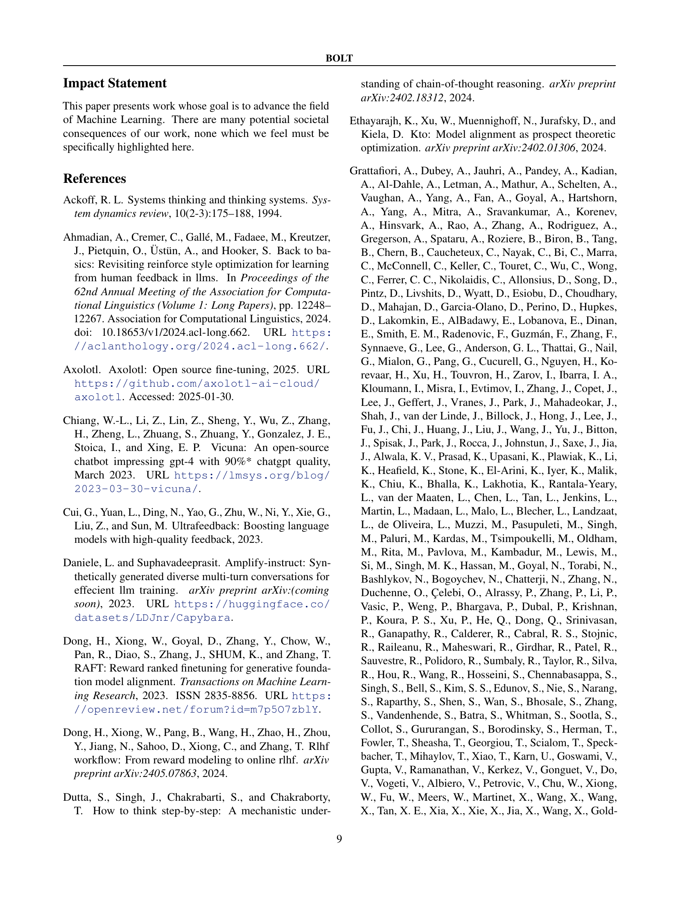

 


 2502.03860 
 Bo Pang et el. 
 
 🤗 2025-02-07 
 



↗ arXiv


↗ Hugging Face


### TL;DR



최근 대규모 언어 모델(LLM)은 놀라운 추론 능력을 보여주지만, 복잡한 문제 해결에는 여전히 어려움을 겪습니다. 특히, 장문의 사고 과정(Long Chain of Thought, LongCoT)을 통해 문제를 해결하는 능력은 뛰어난 모델에서만 관찰되는 현상이며, 이를 일반적인 모델에 적용하는 데는 어려움이 있습니다. 기존 연구는 주로 기존의 고성능 모델을 활용하여 지식 증류(knowledge distillation) 방식을 사용하였으나, 이는 비효율적이며, 일반화에 어려움이 있습니다. 

본 논문에서는 이러한 문제를 해결하기 위해, **지식 증류 없이 LLM의 LongCoT 능력을 향상시키는 새로운 방법론인 BOLT**를 제시합니다. BOLT는 3단계(LongCoT 데이터 부트스트래핑, LongCoT 지도 학습 미세 조정, 온라인 학습)로 구성되며, 표준 지시 모델에서 LongCoT 능력을 효과적으로 부트스트래핑합니다. 실험 결과, BOLT는 다양한 벤치마크에서 기존 모델보다 뛰어난 성능을 보였으며, **지식 증류에 대한 의존성을 낮추면서도 효율적인 LongCoT 능력 개발**이 가능함을 입증하였습니다.



#### Key Takeaways


 지식 증류 없이 LLM의 장문 추론 능력(LongCoT)을 향상시키는 새로운 방법 제시 



 다양한 규모의 모델에서 우수한 성능을 달성하며, 기존 연구의 한계점 극복 



 단순한 지시 모델에서도 LongCoT 능력을 효과적으로 개발 가능함을 입증 


#### Why does it matter?
본 논문은 **LLM에서 장문의 사고 과정(LongCoT) 추론 능력을 향상시키는 새로운 방법론**을 제시하여, 기존의 지식 증류 방식에 의존하지 않고도 LLM의 추론 능력을 효과적으로 개발할 수 있는 새로운 가능성을 열었습니다.  **지식 증류 없이도 우수한 성능을 달성**함으로써, LLM 연구 분야에 있어 **새로운 연구 방향을 제시**하고, **연구의 효율성을 높이는 데 기여**할 수 있을 것입니다.  본 논문의 결과는 향후 **LLM의 추론 및 문제 해결 능력 향상**에 중요한 영향을 미칠 것으로 예상됩니다.

------
#### Visual Insights

> 🔼 그림 1은 대규모 언어 모델에서 장기적 사고 과정(LongCoT)을 부트스트래핑하는 과정을 보여줍니다. BOLT는 세 가지 단계로 구성됩니다. 1) LongCoT 부트스트래핑: 기존의 짧은 사고 과정(ShortCoT) 모델을 사용하여 LongCoT 데이터를 생성하는 단계입니다.  2) LongCoT 감독 미세 조정: ShortCoT 모델을 LongCoT 형식에 맞춰 미세 조정하는 단계로, 추론 요소를 통합하고 외부 솔루션에 도달하기 전에 장기적 사고 과정을 연습시킵니다.  3) LongCoT 온라인 학습: 온라인 탐색과 미세 조정을 통해 LongCoT SFT 모델을 추가로 개선하는 단계입니다. 부트스트래핑 LLM은 LongCoT 데이터를 문맥 내 학습을 통해 생성하는 ShortCoT LLM이며, ORM은 모델 응답의 외부 솔루션을 평가하는 결과 보상 모델입니다.
> 

> 
read the caption

> Figure 1: Illustration of bootstrapping long chain-of-thought in large language models (BOLT). BOLT comprises three stages: 1) LongCoT Bootstrapping which involves synthesizing LongCoT data, 2) LongCoT Supervised Finetuning where we train a ShortCoT model to adapt to the LongCoT format, incorporating reasoning elements and practicing extended chains of thought before arriving at an external solution, 3) LongCoT Online Training where the LongCoT SFT model is further improved through online exploration and refinement. Bootstrapping LLM is a ShortCoT LLM that is used to generate LongCoT data via in-context learning. ORM is an outcome reward model which scores the external solution in the model response.
> 


| Arena-Hard-SC |
|---|---|---|
| Model | Score | Length |
| ArmoRM-Llama3-8B | 44.1 | 674 |
| Skywork-Reward-Llama-3.1-8B | 51.6 | 890 |

> 🔼 본 표는 온라인 DPO 학습 중 보상 모델의 영향을 분석한 결과를 보여줍니다.  다양한 보상 모델을 사용하여 실험을 진행하고, 각 모델의 성능(Arena-Hard-SC 및 Wildbench 점수)과 응답 길이를 비교 분석합니다. 이를 통해 온라인 DPO 학습에서 보상 모델 선택이 최종 모델 성능에 미치는 영향을 파악할 수 있습니다.
> 

> 
read the caption

> Table 1: Ablation on reward model in online DPO training.
> 

### In-depth insights

#### LongCoT Reasoning
본 논문에서 다룬 'LongCoT 추론(Long Chain-of-Thought Reasoning)'은 **대규모 언어 모델(LLM)이 복잡한 문제 해결을 위해 다단계 추론 과정을 거치는 능력**을 의미합니다.  이는 단순히 답을 생성하는 것이 아니라, **문제를 분석하고, 계획을 세우고, 여러 가지 접근 방식을 시도하고, 결과를 평가하며, 필요에 따라 되돌아가는 등의 사고 과정**을 포함합니다.  이는 기존의 단순한 추론 방식보다 훨씬 정교하고, 복잡한 문제에 효과적으로 대처할 수 있다는 것을 보여줍니다.  **LongCoT 추론은 지식 증류를 통해 기존의 LongCoT 모델의 능력을 모방하는 연구가 많았지만, 본 논문에서는 지식 증류 없이 LongCoT 능력을 부트스트랩하는 새로운 방법을 제시**합니다.  이를 통해 **LLM의 추론 능력 향상에 대한 새로운 패러다임**을 제시하며,  **더 효율적이고 체계적인 접근 방식**을 제공합니다.  이는 다양한 문제 해결에 적용 가능한 **범용적인 추론 능력의 개발**을 위한 중요한 발걸음입니다.

#### BOLT Framework
BOLT 프레임워크는 **지식 증류 없이** 대규모 언어 모델(LLM)에서 장기적 사고 연쇄(LongCoT) 능력을 부트스트래핑하는 새로운 방법입니다.  기존의 지식 증류 방식은 기존 LongCoT 모델에 대한 의존도가 높고, 데이터 도메인이 협소하여 일반화에 어려움이 있었습니다.  반면 BOLT는 세 단계 접근 방식(LongCoT 데이터 부트스트래핑, LongCoT 감독 미세 조정, 온라인 학습)을 통해 **표준 지시 모델로부터 LongCoT 기능을 구축**합니다.  **소량의 인-컨텍스트 학습 데이터**만으로도 LongCoT 데이터를 생성하고, 다양한 규모의 모델에 적용하여 우수한 성능을 달성합니다.  이는 LongCoT 모델 개발에 대한 **블랙박스 접근 방식에서 벗어나**,  **백색박스 접근 방식**을 제시하며,  LLM의 추론 능력 개발에 대한 새로운 가능성을 열어줍니다.  특히, **비용 효율적이고 일반화 가능성이 높은** LongCoT 모델 학습 방식을 제시하여, 향후 연구에 중요한 발판을 마련합니다.

#### Empirical Results
본 논문의 "실험 결과" 부분은 제시된 방법론의 효과를 다양한 측면에서 평가한 결과를 보여줍니다. **다양한 벤치마크 데이터셋을 사용하여 실험을 진행**했고, 이를 통해 **모델의 추론 능력, 특히 장문의 추론 과정(LongCoT) 능력 향상**을 정량적으로 입증합니다.  **다양한 규모의 모델에 적용**하여 확장성을 검증하고, **개선된 성능이 모델 규모와 상관없이 일관되게 나타남**을 보였습니다.  **비교 대상 방법론 대비 월등한 성능**을 보임으로써 제시된 방법의 우수성을 강조하고 있습니다.  **에이전트 기반 접근법이나 프롬프트 엔지니어링 기법 대비 효율성 및 효과** 측면에서도 뛰어난 결과를 보여주는 것으로 해석됩니다.  **추가적으로, 핵심 구성 요소들의 영향을 분석하는 ablation study**를 통해 각 구성 요소의 중요성을 객관적으로 제시하여 신뢰도를 높였습니다.  결론적으로, **실험 결과는 제시된 방법이 기존의 LongCoT 학습 방법의 한계를 극복하고, 실제 문제 해결에 효과적임**을 보여주는 핵심적인 근거로 작용합니다.

#### Ablation Studies
본 논문에서 제시된 어떤 절제 연구는 모델 성능에 대한 통찰력 있는 분석을 제공합니다. 특히, **다양한 구성 요소의 기여도를 측정**하고, 모델의 강점과 약점을 파악하는 데 중점을 둡니다.  **하이퍼파라미터 최적화**와 관련된 추가 실험은 모델 성능에 대한 더욱 심도있는 이해를 제공하며, **다양한 모델 크기 및 아키텍처**에 대한 실험은 모델의 일반화 능력을 평가하는 데 도움이 됩니다.  **데이터 증강** 전략을 비교하는 연구를 통해 데이터 품질과 모델 성능 간의 관계를 분석하고, **새로운 데이터 전략**의 효과를 확인합니다.  이러한 절제 연구는 모델 설계 및 개선을 위한 귀중한 정보를 제공하며, **모델 성능을 향상시키기 위한 최적 전략**을 결정하는 데 도움이 됩니다. 또한, **모델의 견고성과 일반화 능력**을 평가하는 데 유용한 지표를 제공합니다.

#### Future Work
본 논문에서 제시된 BOLT 방법론의 주요한 미래 연구 방향은 다음과 같습니다. **먼저, 다양한 크기의 LLM에 대한 BOLT 적용성을 더욱 폭넓게 검증하고,  성능을 향상시키는 방안을 모색해야 합니다.** 특히, 현재는 Llama-3.1-70B-Instruct 모델을 중심으로 실험을 진행했으나, 더 작은 모델이나 다른 아키텍처의 LLM에 적용하여 일반화 가능성을 높이는 연구가 필요합니다.  **두 번째로, BOLT의 핵심 구성 요소인 ORM(Outcome Reward Model)의 성능 개선 및 다양한 ORM에 대한 실험적 분석을 통해 최적의 ORM 선택 기준을 마련해야 합니다.**  현재 사용된 ORM의 성능 향상이나 다른 성능 좋은 reward model을 활용한 추가적인 실험을 통해 BOLT의 성능 향상을 도모할 수 있습니다. **세 번째로,  더욱 다양한 종류의 문제를 다루는 데 BOLT의 적용 가능성을 확대하는 연구가 필요합니다.**  현재는 수학, 코딩, 추론 문제 위주로 실험을 진행했지만, 자연어 이해, 요약, 번역 등 다른 영역의 문제에도 적용하여 그 효과를 검증해야 BOLT의 실용성을 높일 수 있습니다.  마지막으로 **BOLT의 효율성을 더욱 높이는 방법을 탐색하고,  더 적은 연산량으로 동일하거나 더 나은 성능을 달성하는 방안을 모색해야 합니다.**  이는 계산 자원이 부족한 환경에서도 BOLT를 활용할 수 있도록 하기 위한 중요한 연구 방향이 될 것입니다.

### More visual insights

More on figures

> 🔼 그림 2는 언어 모델의 내부적인 사고 과정을 보여주는 장면을 묘사하고 있습니다.  긴 사고 과정(Long Chain-of-Thought)은 질문에 대한 답을 하기 전에 모델이 문제를 분석하고, 계획을 세우고, 다양한 접근 방식을 시도하고, 자신의 추론 과정을 되돌아보고, 필요에 따라 수정하는 과정을 나타냅니다. 그림은 이러한 과정의 일부분을 시각적으로 보여주며,  외부적인 해결책(External Solution)의 일부는 설명의 간결성을 위해 생략되어 있습니다.  내부 사고 과정(Internal Thoughts)은 모델이 질문에 대해 어떻게 단계적으로 추론하는지를 자세히 보여줍니다.  각 단계에서 모델은 이전 단계의 결과를 토대로 다음 단계를 진행합니다.  이 그림은 모델이 복잡한 문제를 해결하기 위한 단계적인 추론 과정을 이해하는데 도움이 됩니다.
> 

> 
read the caption

> Figure 2: An illustration of long chain-of-thought as internal thoughts. Portions of the external solution are omitted for brevity.
> 

> 🔼 그림 3은 논문의 LongCoT Bootstrapping 단계에서 사용된 질문 데이터(Db-query)의 주제 분포를 보여줍니다. 다양한 주제에 대한 질문들이 포함되어 있으며, 코딩과 수학 문제가 가장 큰 비중을 차지하고 있음을 알 수 있습니다. 이는 코딩과 수학 문제가 일반적으로 더 어렵고, 관련 데이터가 풍부하기 때문입니다. 이 그림은 BOLT 방법론이 수학 문제 해결에만 국한되지 않고 다양한 주제에 적용될 수 있음을 시사합니다.
> 

> 
read the caption

> Figure 3: Topic distribution of query data in LongCoT Bootstrapping, 𝒟b-querysubscript𝒟b-query\mathcal{D}_{\text{b-query}}caligraphic_D start_POSTSUBSCRIPT b-query end_POSTSUBSCRIPT.
> 

> 🔼 그림 4는 LongCoT 부트스트래핑에서 사용된 프롬프트를 보여줍니다.  짧은 캡션으로는 이해하기 어려우므로, 더 자세히 설명하겠습니다.  이 프롬프트는 기존의 짧은 사고 과정(ShortCoT)을 가진 언어 모델에게 긴 사고 과정(LongCoT) 데이터를 생성하도록 유도하는 역할을 합니다.  프롬프트는 질문과 함께 몇 가지 LongCoT 예시를 포함합니다. 이 예시들은 모델이 질문에 대한 답을 할 때 내적 사고 과정과 외부 솔루션을 생성하도록 안내합니다. 내적 사고 과정은 모델이 문제를 해결하기 위해 사용하는 단계별 추론 과정을 나타내고, 외부 솔루션은 최종 답변을 나타냅니다. 이를 통해 ShortCoT 모델은 LongCoT 방식으로 문제에 접근하고 추론하며 답변을 생성하는 것을 학습하게 됩니다.
> 

> 
read the caption

> Figure 4: An illustration of the prompt used in LongCoT Bootstrapping.
> 

> 🔼 그림 5는 Mistral-7B, Llama-3.1-8B 및 Llama-3.1-70B 세 가지 모델에 대한 BOLT의 성능을 다양한 벤치마크(MT-Bench, Arena-Hard-SC, WildBench, ZebraLogic 및 MATH500)에서 비교 분석한 결과를 보여줍니다. 각 벤치마크는 실제 사용자 질문을 포함하여 수학, 코딩, 논리적 문제 해결 및 일반적인 능력을 평가합니다. 이 그림은 BOLT가 다양한 모델 규모에서 일관되게 성능 향상을 달성함을 보여주는 여러 그래프로 구성됩니다. 각 모델의 초기 성능과 BOLT 적용 후의 성능 향상을 시각적으로 비교하여 BOLT의 효과를 명확히 제시합니다.
> 

> 
read the caption

> (a) Mistral-7B
> 

> 🔼 그림 (b)는 본 논문의 실험 결과 중 하나로, Llama-3.1-8B 모델에 BOLT 기법을 적용했을 때 다양한 벤치마크(MT-Bench, Arena-Hard-SC, WildBench, ZebraLogic, MATH500)에서의 성능 향상 결과를 보여줍니다. 각 벤치마크는 서로 다른 유형의 추론 및 문제 해결 능력을 평가하며, 그래프는 BOLT 적용 전과 후의 성능 차이를 시각적으로 비교하여 모델의 추론 능력 향상을 명확하게 보여줍니다.
> 

> 
read the caption

> (b) Llama-3.1-8B
> 

> 🔼 그림 (c)는 메타 Llama-3.1-70B 모델에 대한 BOLT의 성능을 다양한 벤치마크(MT-Bench, Arena-Hard-SC, WildBench, ZebraLogic, MATH500)에서 보여줍니다. 각 벤치마크는 모델의 추론 능력을 다양한 측면(수학, 코딩, 논리적 문제 해결 등)에서 평가합니다. 이 그림은 BOLT를 적용한 Llama-3.1-70B 모델이 기준 모델보다 성능이 크게 향상되었음을 보여주는 시각적 자료입니다.  BOLT의 효과를 70B 매개변수 모델 크기에서도 확인할 수 있다는 점을 강조합니다.
> 

> 
read the caption

> (c) Llama-3.1-70B
> 

> 🔼 그림 5는 Mistral-7B, Llama-3.1-8B, Llama-3.1-70B 세 가지 모델에 대해 BOLT의 성능을 다양한 벤치마크에서 비교 분석한 결과를 보여줍니다.  벤치마크는 실제 사용자 질문을 기반으로 구성되며, 수학, 코딩, 논리적 추론 및 일반적인 능력을 평가합니다. ArenaHard-SC는 응답 길이와 마크다운 형식의 영향을 제어하기 위해 스타일이 제어된 ArenaHard 버전입니다. ZebraLogic의 경우 셀 수준 정확도를 측정합니다. 이 그림은 다양한 규모의 모델에서 BOLT의 효과를 명확히 보여주는 중요한 결과를 담고 있습니다.
> 

> 
read the caption

> Figure 5: Performance of BOLT on Mistral-7B, Llama-3.1-8B, and Llama-3.1-70B across benchmarks. These benchmarks consist of challenging real user queries and test models’ math, coding, logical reasoning and general capacity. Note: ArenaHard-SC means the style controlled version of ArenaHard which controls for the effect of length and markdown. The metric for ZebraLogic is the cell-level accuracy.
> 

More on tables


| Model | Score | Length |
|---|---|---|
| ArmoRM-Llama3-8B | 43.0 | 3354.51 |
| Skywork-Reward-Llama-3.1-8B | 49.2 | 4588.15 |
> 🔼 이 표는 BOLT(Bootstrap Long Chain-of-Thought) 기법을 적용하기 전 초기 모델의 성능에 미치는 영향을 보여줍니다.  BOLT는 ShortCoT 모델에서 LongCoT 능력을 개발하는 방법론이며, 이 표에서는 다양한 초기 모델(instruction 모델과 base 모델)을 사용하여 BOLT 적용 후의 성능 향상을 비교 분석합니다.  Arena-Hard-SC와 Wildbench 두 가지 벤치마크 결과를 제시하여 초기 모델의 종류에 따른 BOLT의 성능 변화를 보여줍니다.  instruction 모델을 초기 모델로 사용했을 때 성능이 더 향상됨을 보여줍니다.
> 

> 
read the caption

> Table 2: Ablation on the initial model to which BOLT is applied.
> 


| Models | Arena-Hard-SC | WildBench |
|---|---|---|
| Meta-Llama-3.1-8B-Instruct | 18.3 | 32.08 |
| BOLT-Llama-3.1-8B-Base | 41.3 | 39.79 |
| BOLT-Llama-3.1-8B-Instruct | 44.1 | 42.96 |
> 🔼 본 표는 논문의 3.3절 'LongCoT 온라인 학습' 에서 다루는 내용으로, LongCoT 모델의 온라인 학습 과정에서 다양한 강화학습 알고리즘(DPO, REINFORCE, RLOO, PPO)을 적용했을 때의 성능 비교 결과를 보여줍니다.  각 알고리즘의 Arena-Hard-SC 및 Wildbench 데이터셋에 대한 점수와 길이를 제시하여 어떤 알고리즘이 LongCoT 능력 향상에 가장 효과적인지를 분석합니다.
> 

> 
read the caption

> Table 3: Ablation on the learning algorithm for LongCoT online training.
> 

### Full paper



