 


 2502.03997 
 Yu Yuan et el. 
 
 🤗 2025-02-12 
 



↗ arXiv


↗ Hugging Face


### TL;DR



기존의 CAD 모델 편집 방식은 주로 수동 작업에 의존하여 비효율적이고 전문적인 지식이 필요했습니다.  텍스트 기반의 CAD 모델 편집은 이러한 문제를 해결할 잠재력이 있지만, **정확한 데이터 매칭이 어렵고, 모델 수정 과정이 복잡**하다는 어려움이 있었습니다. 특히, 학습에 필요한 데이터를 확보하기 어렵다는 점이 큰 걸림돌이었습니다.

본 논문에서는 이러한 문제를 해결하기 위해 **CAD-Editor**라는 새로운 프레임워크를 제시합니다.  CAD-Editor는 **자동화된 데이터 합성 파이프라인**을 통해 학습에 필요한 데이터를 생성하고, **locate-then-infill 방식**을 통해 텍스트 기반의 CAD 모델 수정 과정을 효율적으로 처리합니다.  실험 결과, CAD-Editor는 기존 방법보다 **정확도와 효율성이 훨씬 높음**을 보였습니다. 이는 **텍스트 기반 CAD 편집 분야의 획기적인 발전**이며, 사용자 친화적인 CAD 모델 편집 환경을 구축하는 데 크게 기여할 것으로 기대됩니다.



#### Key Takeaways


 텍스트 기반 CAD 편집을 위한 최초의 프레임워크인 CAD-Editor 제시 



 정확한 데이터 매칭을 위한 자동화된 데이터 합성 파이프라인 개발 



 locate-then-infill 프레임워크를 통해 복합적인 텍스트 기반 CAD 편집 과제 해결 


#### Why does it matter?
본 논문은 **텍스트 기반 CAD 편집이라는 새로운 과제**를 제시하고, 이를 위한 **자동화된 데이터 합성 파이프라인과 locate-then-infill 프레임워크**를 제안함으로써, **전문 지식이 부족한 사용자도 CAD 모델을 효율적으로 생성하고 수정할 수 있도록** 지원합니다.  이는 **CAD 설계 워크플로 전반에 걸쳐 혁신적인 변화**를 가져올 잠재력이 있으며, 관련 연구 분야에 새로운 가능성을 제시합니다.  또한, **대규모 언어 모델(LLM)과 컴퓨터 비전 기술**을 CAD 분야에 적용한 혁신적인 접근 방식을 제시하여, 향후 연구 방향에 대한 새로운 통찰력을 제공합니다.

------
#### Visual Insights

> 🔼 그림 1은 CAD-Editor가 수행한 텍스트 기반 CAD 편집의 결과를 보여줍니다. 각 하위 그림은 상단에 편집 지시사항, 왼쪽에 원본 CAD 모델, 오른쪽에 편집된 CAD 모델을 표시합니다. 렌더링된 이미지는 이해를 돕기 위해 제공되며, 실제 편집은 CAD 모델의 스케치 및 압출(SE) 작업에서 이루어져 편집 가능성과 재사용성을 확보합니다.  즉, 사용자가 텍스트로 CAD 모델 수정을 지시하면, 시스템이 스케치와 압출 연산을 수정하여 모델을 변경하는 과정을 보여줍니다.  단순히 이미지 변환이 아닌, CAD 모델 자체의 SE 연산 수정을 통해 이루어짐을 강조합니다.
> 

> 
read the caption

> Figure 1: Text-based CAD editing achieved by CAD-Editor. Each sub-figure shows the editing instruction at the top, the original CAD model on the left, and the edited CAD model on the right. The rendered image is shown for better comprehension. The actual editing occurs on sketch-and-extrusion (SE) operations of a CAD model to provide editability and reusability.
> 


| Method | JSD ↓ | D-CLIP ↑ | VR ↑ | H-Eval ↑ |
|---|---|---|---|---|
| **SkexGen** | 1.94 | - | 74.3 | - |
| **Hnc-CAD** | 1.77 | - | 77.4 | - |
| **FlexCAD** | 1.72 | - | 82.1 | - |
| **Text2CAD** | 2.39 | - | 84.8 | - |
| **GPT-4o-Basic** | 1.10 | - 1.08 | 63.2 | 7.22 |
| **GPT-4o-IC** | 0.70 | - 0.11 | 84.5 | 15.6 |
| **CAD-Editor** | **0.65** | **0.27** | **95.6** | **43.2** |

> 🔼 표 1은 제시된 다섯 가지 방법(SkexGen, Hnc-CAD, FlexCAD, Text2CAD, CAD-Editor)의 정량적 평가 결과를 보여줍니다.  텍스트 기반 CAD 편집을 지원하지 않는 SkexGen, Hnc-CAD, FlexCAD, Text2CAD의 경우 생성 품질만 비교 대상입니다. JSD와 D-CLIP 값은 100배 스케일링 되었으며, ↑는 값이 클수록 좋고, ↓는 값이 작을수록 좋음을 의미합니다.  CAD-Editor는 텍스트 기반 편집 성능을 종합적으로 평가하기 위해 유효성(VR), 현실성(JSD), 편집 일관성(D-CLIP), 그리고 인간 평가(H-Eval)를 모두 측정합니다.
> 

> 
read the caption

> Table 1:  Quantitative evaluations. SkexGen, Hnc-CAD, FlexCAD and Text2CAD do not support text-based editing, so only their generation quality is compared. JSD and D-CLIP values are scaled by 102superscript10210^{2}10 start_POSTSUPERSCRIPT 2 end_POSTSUPERSCRIPT. ↑↑\uparrow↑: the higher the better, ↓↓\downarrow↓: the lower the better.
> 

### In-depth insights

#### Text-based CAD
텍스트 기반 CAD는 **자연어 처리 기술을 활용하여 텍스트 명령어만으로 CAD 모델을 생성하거나 수정하는 기술**입니다. 기존의 CAD 디자인 방식은 직접적인 조작이나 복잡한 명령어 입력에 의존했지만, 텍스트 기반 CAD는 사용자의 의도를 자연어로 표현하여 시스템이 자동으로 CAD 모델을 생성하거나 수정할 수 있게 합니다. 이는 **전문적인 CAD 사용자뿐만 아니라 비전문가도 쉽게 CAD 모델을 다룰 수 있도록 하는 혁신적인 기술**입니다.  하지만, 자연어의 모호성과 CAD 모델의 복잡성으로 인해 **정확한 해석 및 생성/수정이 어렵다는 한계점**도 존재합니다.  **자연어 이해, CAD 지식, 모델 생성 기술의 통합**이 핵심 과제이며, 향후 발전 방향은 **다양한 CAD 모델 유형 지원, 보다 정교한 수정 기능 제공, 사용자 친화적인 인터페이스 개발** 등이 될 것입니다.  또한, **신뢰성 있는 데이터셋 구축과 훈련 알고리즘 개발** 또한 중요한 연구 분야입니다.

#### Data Synthesis
본 논문에서 데이터 합성(Data Synthesis) 전략은 **정확한 대응 관계를 갖는 triplet 데이터**를 생성하는 데 중점을 둡니다.  기존 디자인 변형 모델(design variation models)을 이용하여 원본 CAD 모델과 편집된 CAD 모델의 쌍을 생성하고, 이들의 차이를 Large Vision-Language Models (LVLMs)을 통해 편집 명령어로 요약합니다.  **자동화된 파이프라인**을 통해 수많은 triplet 데이터를 효율적으로 생성하여, text-based CAD editing 모델의 학습에 필요한 데이터 부족 문제를 해결합니다.  **LVLMs의 활용**은 CAD 모델의 시각적 및 순차적 표현을 모두 고려하여 보다 정확하고 다양한 편집 명령어를 생성하는 데 기여합니다. 이러한 접근법은 데이터 수집의 어려움을 극복하고, 모델의 성능 향상에 크게 기여하는 핵심 요소입니다.  **단순한 데이터 증강**을 넘어, 모델 학습에 최적화된 데이터를 생성하는 전략이라는 점에서 중요한 의미를 지닙니다.

#### Locate-then-Fill
본 논문에서 제안하는 "Locate-then-Fill" 프레임워크는 텍스트 기반 CAD 편집 작업의 복잡성을 효과적으로 해결하기 위한 전략입니다. **텍스트 기반 CAD 편집이란 자연어 명령어를 통해 CAD 모델을 수정하는 어려운 과제**이며, 이를 위해서는 모델의 어느 부분을 수정해야 하는지(Locate) 정확히 파악하고, 그 부분에 어떤 수정을 가해야 하는지(Fill) 결정하는 두 단계가 필요합니다. 단순히 모델 전체를 한꺼번에 수정하는 방식보다 **훨씬 정교하고 효율적인 접근 방식**이며, 특히 복잡한 모델이나 다양한 수정 작업에 강점을 보입니다.  **대규모 언어 모델(LLM)을 활용**하여 자연어 이해 능력과 CAD 도메인 지식을 결합함으로써, 명령어 해석, 수정 영역 파악, 그리고 실제 수정 작업까지 정확하게 수행합니다. 이러한 **두 단계의 분리된 접근 방식**은 각 단계에 특화된 모델링 및 최적화 전략을 적용할 수 있게 하여, 전체 작업의 정확도와 효율성을 향상시키는 데 크게 기여합니다.  **자동화된 데이터 합성 파이프라인**과의 시너지 효과를 통해, 부족한 훈련 데이터 문제 또한 해결합니다. 따라서, "Locate-then-Fill"은 텍스트 기반 CAD 편집 분야의 발전에 중요한 기여를 할 것으로 기대됩니다.

#### LLM in CAD
LLM(대규모 언어 모델)의 CAD(컴퓨터 지원 설계) 분야 적용은 **자동화된 설계 및 편집**이라는 엄청난 잠재력을 가지고 있습니다.  텍스트 기반 명령어를 통해 CAD 모델을 생성하거나 수정하는 것은 사용자 친화적인 인터페이스를 제공하며, 전문가가 아닌 사용자도 CAD를 쉽게 이용할 수 있게 합니다.  하지만 LLM을 CAD에 적용하는 데는 **데이터 부족**, **복잡한 CAD 작업의 추상화**, **모델의 정확성 및 신뢰성 확보** 등 해결해야 할 과제들이 있습니다.  **데이터 합성 기법**은 이러한 어려움을 극복하는 데 도움을 줄 수 있으며, **locate-then-fill**과 같은 프레임워크는 복잡한 작업을 작은 단위로 나누어 효율성을 높일 수 있습니다.  하지만 LLM의 성능은 학습 데이터의 질에 크게 좌우되므로, **고품질의 학습 데이터를 구축**하는 것이 중요합니다.  **다양한 평가 지표**를 통해 모델의 성능을 측정하고 개선해나가는 노력도 필요합니다.  궁극적으로 LLM과 CAD의 통합은 **설계 과정의 민주화**를 앞당길 것이며, 이는 다양한 분야에서 혁신적인 발전을 가져올 것입니다.

#### Future Works
미래 연구 방향으로는 **데이터셋 확장 및 다양화**를 통해 모델의 일반화 성능을 향상시키는 것이 중요합니다.  현재 모델은 특정 유형의 CAD 모델에 대해서는 우수한 성능을 보이지만, 다양한 형태의 CAD 모델과 복잡한 편집 작업에 대한 적용성을 높이는 연구가 필요합니다. 또한, **실시간 편집 기능** 구현을 위한 효율적인 알고리즘 개발과 사용자 인터페이스 개선도 중요한 과제입니다.  **대규모 언어 모델(LLM)의 발전**에 발맞춰, 더욱 정교하고 효율적인 LLM 기반의 CAD 편집 모델을 개발하여 정확성과 속도를 개선해야 합니다.  **다중 모달 정보 활용** 연구도 필요합니다. 텍스트 외에도 이미지, 음성 등 다양한 모달 정보를 통합하여 사용자 의도를 더욱 정확하게 파악하고 CAD 모델을 편집하는 기술 개발이 필요합니다.  마지막으로, **모델의 설명력 향상**을 위해 모델의 내부 동작 과정을 분석하고, 예측 결과에 대한 신뢰도를 높이는 연구가 필요합니다. 이를 통해 사용자가 모델의 결과를 더욱 잘 이해하고 신뢰할 수 있도록 하는 것이 중요합니다.

### More visual insights

More on figures

> 🔼 그림 2는 CAD-Editor의 입력과 출력 예시를 보여줍니다. 왼쪽에는 입력으로 사용된 원본 CAD 시퀀스와 편집 명령어가 결합되어 있고, 오른쪽에는 출력으로 생성된 편집된 CAD 시퀀스가 표시됩니다.  실제 CAD 시퀀스는 공간을 절약하기 위해 [원본(또는 편집된) CAD 시퀀스]로 축약되어 있습니다. 오른쪽에는 특정 CAD 시퀀스와 렌더링된 CAD 모델의 예시가 보여집니다.  이 그림은 CAD-Editor가 텍스트 기반의 명령어를 받아 CAD 모델을 어떻게 수정하는지 보여주는 중요한 예시입니다.
> 

> 
read the caption

> Figure 2:  Left: Example input and output for CAD-Editor. The input combines the original CAD sequence with the editing instruction, and the output is the edited CAD sequence. The specific CAD sequence is shortened to ‘[Original (or Edited) CAD Sequence]’ to save space. Right: An illustration for a specific CAD sequence and its rendered CAD model.
> 

> 🔼 그림 3은 본 논문에서 제안하는 자동 데이터 합성 파이프라인의 개념도를 보여줍니다. 이 파이프라인은 기존의 CAD 모델을 활용하여 편집 전후의 CAD 모델 쌍을 생성하고, 이를 대규모 비전-언어 모델(LVLMs)을 이용하여 편집 명령어로 요약하는 과정으로 구성됩니다.  자동 데이터 합성 파이프라인의 세부 단계는 다음과 같습니다. 먼저, 기존 CAD 모델에 디자인 변형 모델을 적용하여 편집된 CAD 모델을 생성합니다. 다음으로, 생성된 편집 전후의 CAD 모델 쌍을 LVLMs에 입력하여, 두 모델 간의 차이를 요약하는 편집 명령어를 생성합니다. 마지막으로, 생성된 편집 전후 CAD 모델과 편집 명령어를 묶어 학습 데이터 삼중항을 구성합니다.  이를 통해, 정확한 대응 관계를 갖는 대량의 학습 데이터를 효율적으로 생성하여, 본 논문에서 제안하는 텍스트 기반 CAD 편집 모델의 성능 향상을 도모합니다.
> 

> 
read the caption

> Figure 3:  Illustration of automated data synthesis pipeline.
> 

> 🔼 그림 4는 논문의 Locate-then-Infill 프레임워크에 대한 개요를 보여줍니다. (a)와 (b)는 각각 Locate 단계와 Infill 단계의 개요를 보여주는 다이어그램입니다.  (c)는 이 프레임워크의 입력과 출력의 예시를 보여줍니다. 왼쪽 열은 범례를 사용하여 추상화된 표현을 보여주고, 가운데 열은 구체적인 시퀀스를 표시하며, 오른쪽 열은 렌더링된 시각적 객체를 보여줍니다.  각 단계에서 사용되는 LLMs의 역할과, 입력으로 주어지는 원본 CAD 시퀀스와 수정 지침, 그리고 출력되는 마스크된 CAD 시퀀스와 최종 수정된 CAD 시퀀스를 시각적으로 보여줍니다.  이 그림은 전체적인 프레임워크의 작동 방식을 이해하는 데 매우 유용합니다.
> 

> 
read the caption

> Figure 4:  (a)-(b): Overview of Locate-then-Infill framework. (c): Examples of input and output, where the left column shows abstracted representations using legends, the middle column displays concrete sequences and the right column presents rendered visual objects.
> 

> 🔼 그림 5는 CAD-Editor, GPT-40-Basic 및 GPT-40-IC 세 가지 방법을 사용하여 텍스트 기반 CAD 편집 작업을 수행한 결과를 보여줍니다. 각각의 하위 그림은 편집 작업에 대한 텍스트 설명과 원본 CAD 모델, 그리고 각 방법을 통해 생성된 편집된 CAD 모델을 함께 나타냅니다. 이를 통해 세 가지 방법의 성능을 비교하고, CAD-Editor의 우수성을 시각적으로 보여줍니다. 특히, GPT-40-Basic과 GPT-40-IC는 기본적인 언어 모델을 사용하므로, CAD-Editor가 이들보다 더 정확하고 효과적으로 CAD 모델을 편집함을 보여줍니다.
> 

> 
read the caption

> Figure 5: Qualitative results from CAD-Editor, GPT-4o-Basic and GPT-4o-IC . The text below shows the editing instruction.
> 

> 🔼 그림 6은 다양한 편집 지시어를 사용하여 CAD-Editor가 생성한 추가적인 결과물들을 보여줍니다. 각 하위 그림은 왼쪽에 원본 CAD 모델, 오른쪽에 편집된 CAD 모델을 보여주며, 아래쪽에는 사용된 편집 지시어가 제시되어 있습니다.  각각의 예시는 CAD-Editor가 다양한 유형의 수정(기하학적 형상 변경, 부품 추가/제거, 위치 변경 등)을 처리할 수 있음을 보여줍니다.
> 

> 
read the caption

> Figure 6:  Additional results from CAD-Editor with various editing instructions . In each sub-figure, the left image shows the original CAD model, the right image displays the edited CAD model and the text below provides the editing instruction.
> 

> 🔼  그림 7은 하나의 CAD 모델에 대해 다양한 지시사항이 주어졌을 때 CAD-Editor가 생성하는 결과가 지시사항에 따라 다르게 나타나는 것을 보여줍니다.  즉, 같은 CAD 모델이라도 사용자의 입력에 따라 여러 가지 다른 결과물을 만들어낼 수 있음을 시각적으로 보여주는 예시입니다.  이는 CAD-Editor의 유연성과 다양한 수정 작업을 처리하는 능력을 강조합니다.
> 

> 
read the caption

> Figure 7: Given one CAD model and various instructions, CAD-Editor produces different outcomes.
> 

> 🔼 이 그림은 동일한 CAD 모델과 명령어가 주어졌을 때, CAD-Editor가 다양한 결과물을 생성할 수 있음을 보여줍니다.  이는 CAD-Editor가 입력된 명령어를 해석하고 적용하는 방식의 유연성과 다양성을 보여주는 예시입니다.  단순히 하나의 정해진 결과물만을 생성하는 것이 아니라, 입력된 명령어를 충족하는 다양한 가능성을 탐색하고 그에 맞는 여러 결과를 제시할 수 있음을 시사합니다.  이는 특히 모호하거나 다의적인 명령어에 대해 여러 가지 해석을 제공하여 사용자에게 더 많은 선택지를 제공한다는 점에서 의미가 있습니다.
> 

> 
read the caption

> Figure 8: Given the same CAD model and instruction, CAD-Editor produces diverse outcomes.
> 

> 🔼 그림 9는 CAD-Editor를 반복적으로 사용하여 사용자의 요구사항을 충족할 때까지 CAD 모델을 편집하는 과정을 보여줍니다.  각 단계마다 다른 편집 지시사항이 적용되고, 그에 따라 CAD 모델이 순차적으로 수정되는 것을 확인할 수 있습니다.  이를 통해 CAD-Editor가 반복적인 편집 작업에 적합하며, 사용자의 피드백을 반영하여 점진적으로 모델을 개선하는 데 유용함을 시사합니다.  최종 결과물은 초기 모델과는 상당히 다른 형태를 갖추게 되며, 이는 사용자가 원하는 특정한 형태의 모델을 얻기 위한 반복적인 수정 과정의 효율성을 보여줍니다.
> 

> 
read the caption

> Figure 9: Apply CAD-Editor iteratively to edit a CAD model until it meets user requirements.
> 

> 🔼 그림 10은 본 논문에서 제안하는 Locate-then-Infill 프레임워크와 단순히 미세 조정된 LLM을 비교 분석한 결과를 보여줍니다.  직접 미세 조정된 LLM 방식에 비해 Locate-then-Infill 프레임워크가 생성 품질을 높이고, 텍스트와 CAD간의 정합성을 향상시키며, 결과의 안정성을 개선했음을 보여주는 정성적 비교 결과입니다.  각각의 예시는 입력 문장과, 직접 미세 조정 방식 및 Locate-then-Infill 방식으로 생성된 CAD 모델을 시각적으로 보여주어 두 방법의 차이를 명확하게 비교할 수 있도록 합니다.
> 

> 
read the caption

> Figure 10: The qualitative comparison between the directly fine-tuned LLM and our Locate-then-Infill framework.
> 

> 🔼 그림 11은 CAD 편집기와 기준 모델 간의 추가적인 정성적 비교 결과를 보여줍니다. 다양한 편집 조건에서 CAD 편집기의 우수한 성능을 강조하기 위해 여러가지 편집 시나리오에 대한 결과를 보여줍니다. 각각의 시나리오는 원본 CAD 모델, GPT-40 기본 모델, GPT-40 IC 모델, 그리고 CAD 편집기의 결과를 보여주는 네 개의 열로 구성됩니다. 이 그림을 통해 사용자는 다양한 편집 작업에서 CAD 편집기의 정확성, 효율성 및 다양한 편집 능력을 직관적으로 비교하고 이해할 수 있습니다.
> 

> 
read the caption

> Figure 11: Additional qualitative comparison results between CAD-Editor and baseline methods.
> 

> 🔼 그림 12는 단계적 캡션 생성을 위한 자세한 프롬프트를 보여줍니다.  이 프롬프트는 시각적 모드와 시퀀스 모드의 두 가지 부분으로 나뉘어져 있습니다. 시각적 모드는 사용자가 두 개의 3D 모양을 비교 분석하고, 각 모양의 기하학적 특징(요소의 유형과 수량, 크기 비율, 요소 간의 위치 관계 등)을 자세히 설명하도록 유도합니다.  이후 두 번째 3D 모양으로 첫 번째 모양을 변환하는 자세한 지침을 제공하고, 최종적으로 10단어 이내의 간결한 지침으로 축약하도록 합니다. 시퀀스 모드는 CAD 엔지니어가 스케치-압출 CAD 모델을 편집하기 위한 명확하고 간결한 편집 지침(10단어 이하)을 제공하는 작업을 수행하도록 안내합니다.  원본 및 편집된 CAD 모델에 대한 설명, 변경 분석(추가, 제거 또는 수정된 요소에 대한 설명, 크기, 비율 및 위치 관계의 변화), 편집 지침을 포함하는 세부적인 단계별 지침을 제공합니다.  프롬프트는 원본 및 편집된 CAD 시퀀스를 포함하고, 최종 출력은 지정된 JSON 형식을 따라야 합니다.  이러한 단계적 접근 방식을 통해 모델은 좀 더 정확하고 일관성 있는 편집 지침을 생성할 수 있도록 돕습니다.
> 

> 
read the caption

> Figure 12: The detailed prompt for stepwise captioning.
> 

> 🔼  그림 13은 본 논문에서 제안하는 단계적 캡셔닝 방법과 기본 캡셔닝 방법의 결과를 비교한 것입니다. 기본 캡셔닝은 한 번에 전체 그림에 대한 설명을 생성하는 반면, 단계적 캡셔닝은 그림의 기하학적 속성, 요소 간의 관계, 수정 내용 등을 단계적으로 분석하여 보다 정확하고 상세한 설명을 생성합니다. 이는 각 단계별 분석 결과를 통해 최종 편집 지침을 생성함으로써, 보다 정확하고 세분화된 CAD 모델 편집을 가능하게 합니다. 그림에서는 세 가지 서로 다른 CAD 모델 편집 사례에 대해 두 가지 방법의 결과를 비교하여 단계적 캡셔닝의 우수성을 보여줍니다.
> 

> 
read the caption

> Figure 13: Comparisons between basic captioning method and our stepwise captioning method.
> 

> 🔼 그림 14는 GPT-40-IC 모델을 위한 프롬프트(지시어)를 보여줍니다.  GPT-40-IC 모델은 스케치-압출 방식의 CAD 모델을 수정하는 작업에 사용됩니다. 프롬프트는 모델이 원본 CAD 연산 시퀀스와 수정 지시사항을 받아 수정된 CAD 시퀀스를 생성하도록 상세하게 안내합니다.  구체적으로 스케치, 압출 연산의 구조(점, 선, 원, 루프, 면 등)와 각 요소의 기하학적 속성, 3D 변환(변위, 회전, 스케일링), 부울 연산(합집합, 차집합, 교집합) 등을 명시적으로 설명하고,  여러가지 예시를 제공하여 모델의 이해를 돕습니다.  최종 출력은 수정된 CAD 시퀀스를 JSON 형식으로 반환하는 것입니다.
> 

> 
read the caption

> Figure 14: Prompt for GPT-4o-IC.
> 

More on tables


| Method | JSD ↓ | D-CLIP ↑ | VR ↑ |
|---|---|---|---|
| CAD-Editor-mini w/ Basic | 0.78 | - 0.12 | 88.8 |
| CAD-Editor-mini w/ Step | 0.70 | - 0.07 | 90.1 |
| CAD-Editor w/ Direct | 0.77 | - 0.16 | 86.1 |
| CAD-Editor w/ L-I | 0.67 | 0.21 | 96.5 |
| CAD-Editor w/ L-I & HS | 0.65 | 0.27 | 95.6 |
> 🔼 표 2는 본 논문에서 제안하는 CAD-Editor 모델의 성능 평가를 위한 ablation study 결과를 보여줍니다.  CAD-Editor-mini는 1만 개의 작은 데이터셋으로 학습되었으며,  Stepwise Captioning 전략, Locate-then-Infill 프레임워크, 그리고 선택적 데이터셋 사용 등 다양한 요소들의 영향을 분석하기 위해 실험이 진행되었습니다. JSD, D-CLIP, VR 세 가지 지표를 사용하여 각 요소들의 기여도를 정량적으로 평가하였습니다. 이를 통해 각 구성요소들이 모델 성능에 미치는 영향을 파악하고,  최적의 모델 구성을 도출하는데 도움이 되는 정보를 제공합니다.
> 

> 
read the caption

> Table 2: Ablation studies. The CAD-Editor-mini is trained on a small set with 10k examples.
> 


| Locating Prompt | Infilling Prompt |
|---|---| 
| Below is a Computer-Aided Design (CAD) operation sequence. Replace the parts that need to be modified with the string “&lt;mask&gt;” according to the editing instruction. Original CAD Operation Sequence: [Original CAD sequence] Editing Instruction: [Textual editing instruction] Masked CAD Operation Sequence: [Masked CAD sequence] | Below is the original Computer-Aided Design (CAD) operation sequence. Original CAD Operation Sequence: [Original CAD sequence] The parts that need to be modified according to the editing instruction have been replaced by the string “&lt;mask&gt;”. Editing Instruction: [Textual editing instruction] Masked CAD Operation Sequence: [CAD sequence with “&lt;mask&gt;” ] Generate the edited CAD sequence that could replace “&lt;mask&gt;” in the CAD model: |
> 🔼 표 3은 논문의 Locate-then-Infill 프레임워크에 사용된 프롬프트들을 보여줍니다.  Locate 단계와 Infill 단계에서 각각 사용된 프롬프트가 구체적으로 제시되어 있으며,  LLM(Large Language Model)이 CAD 모델 수정 작업을 수행하기 위한 지시사항을 명확히 담고 있습니다.  원본 CAD 명령어 시퀀스, 수정 지시사항, 마스크 처리된 CAD 명령어 시퀀스 등의 입력값과 출력값 예시가 포함되어 있어,  LLM이 어떻게 입력 정보를 처리하고 수정된 CAD 시퀀스를 생성하는지 이해하는 데 도움을 줍니다.
> 

> 
read the caption

> Table 3: Prompt for Locate-then-Infill framework.
> 

### Full paper


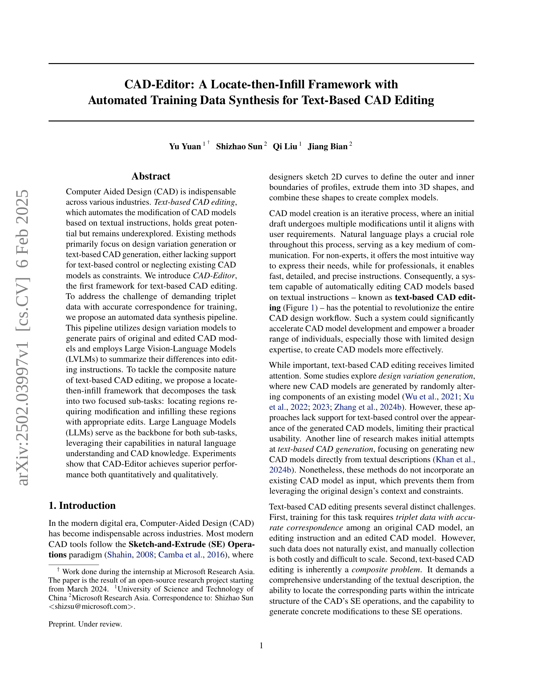
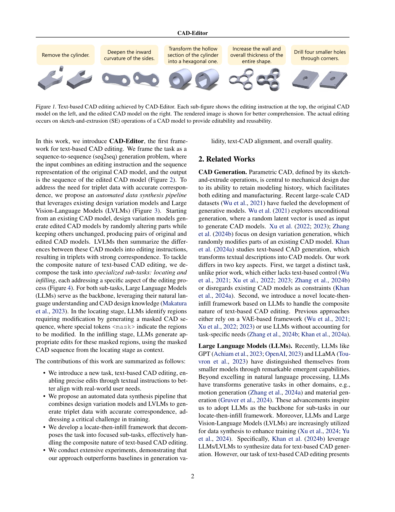
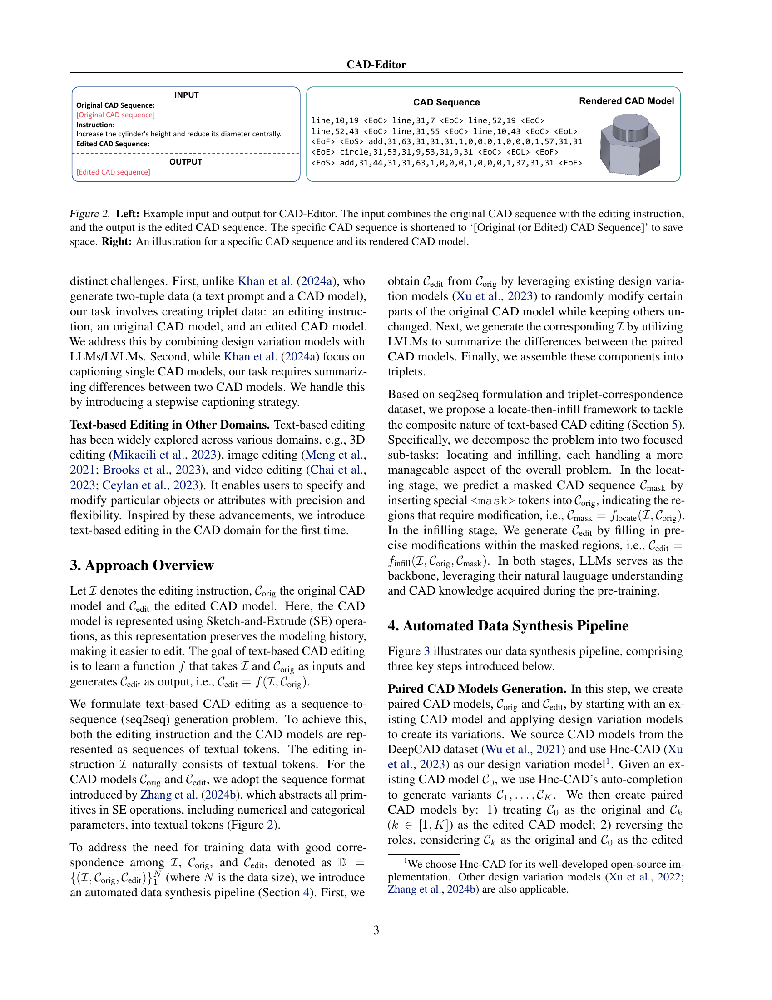
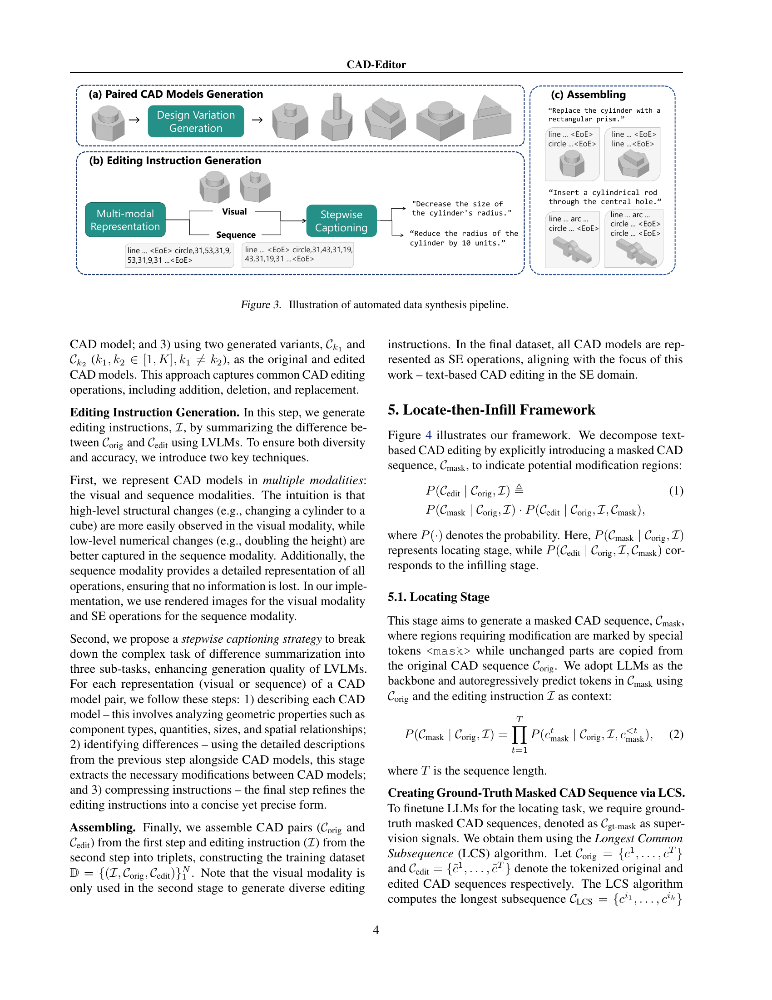
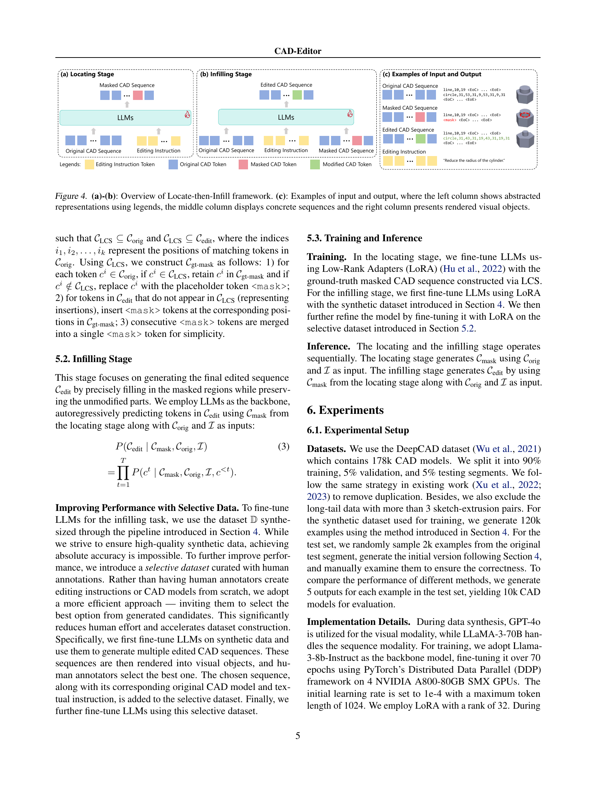
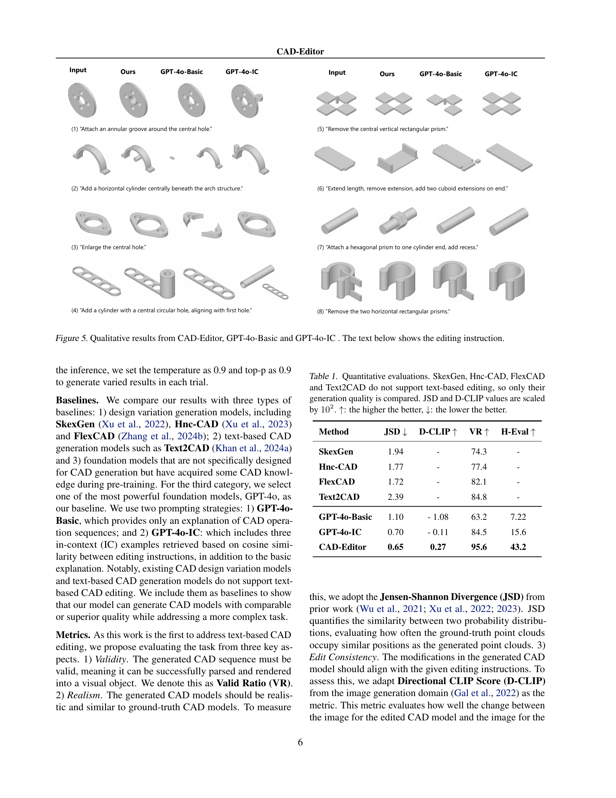
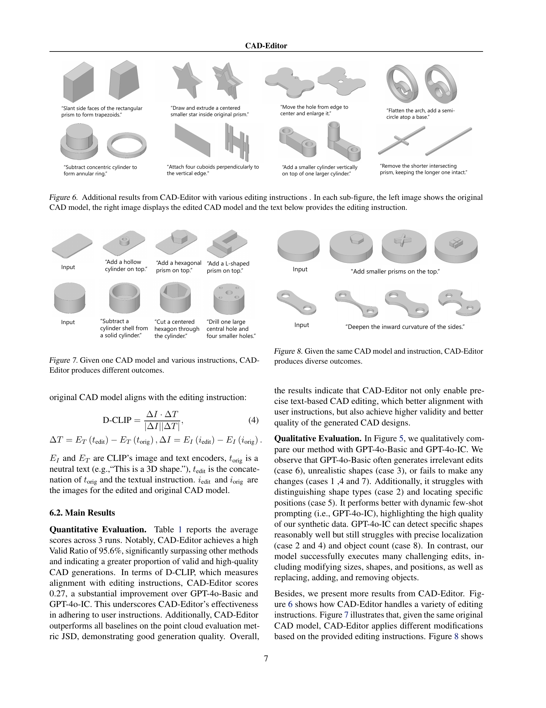
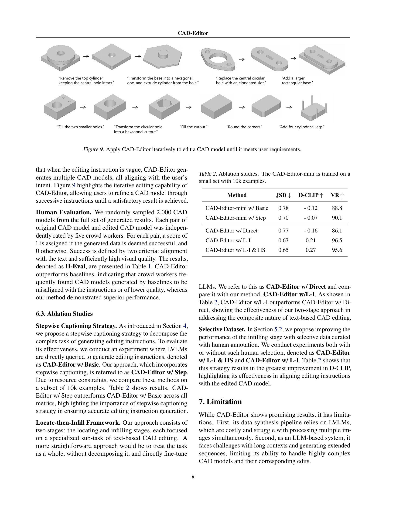
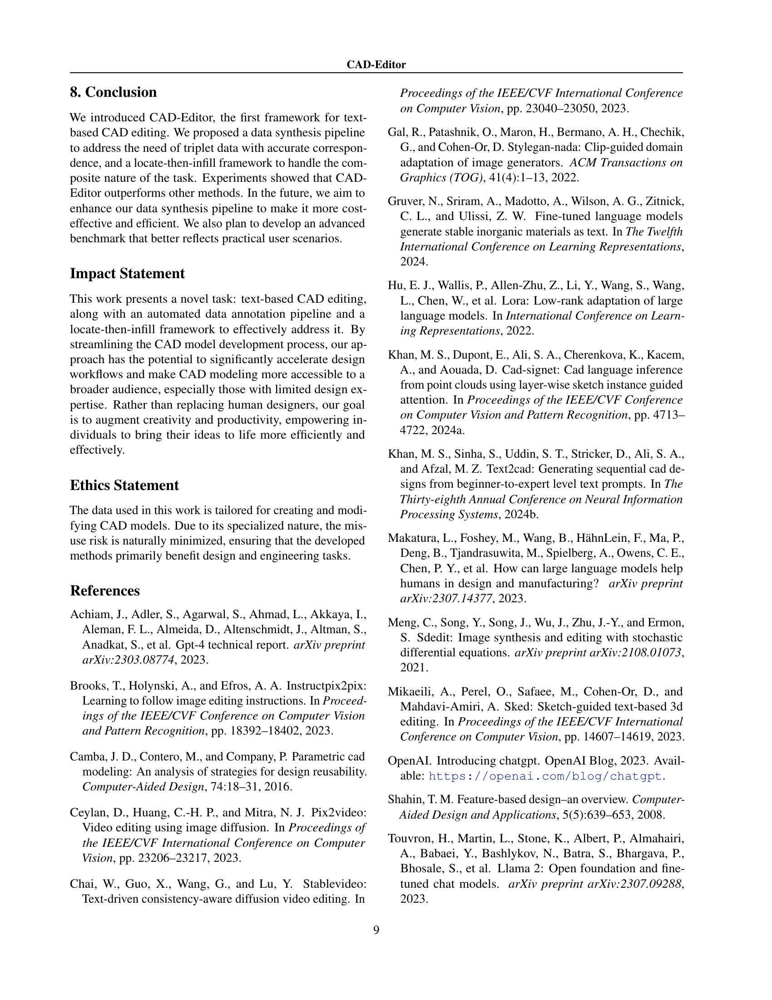
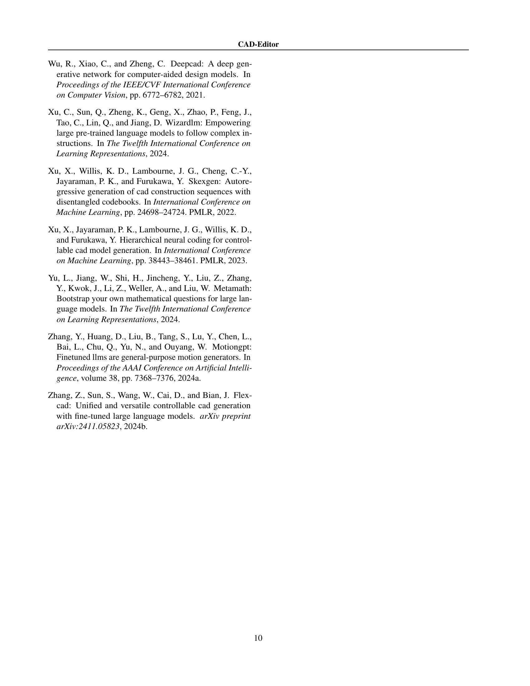
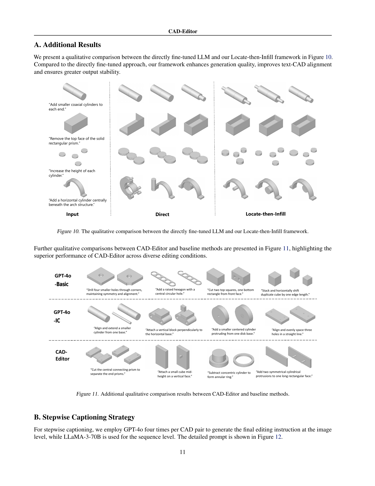
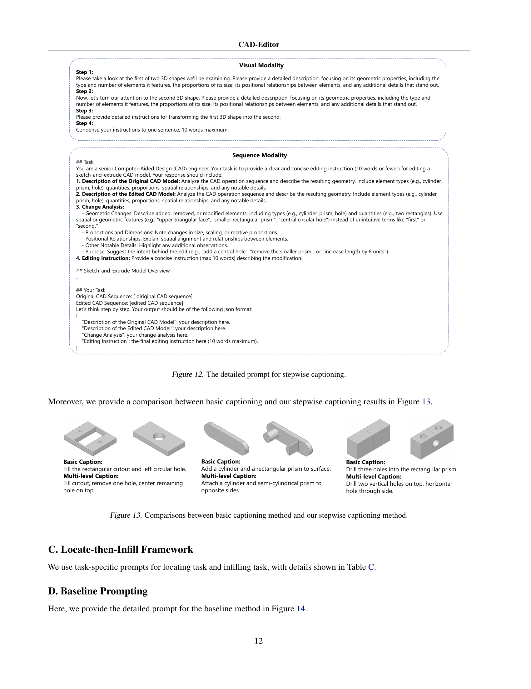
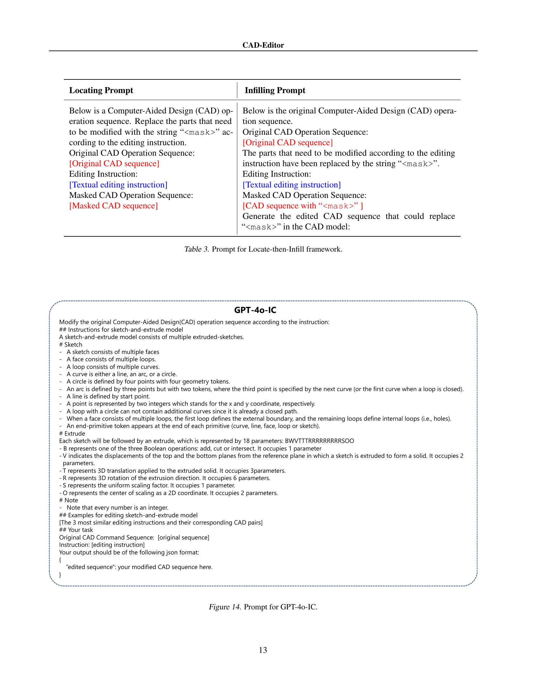
