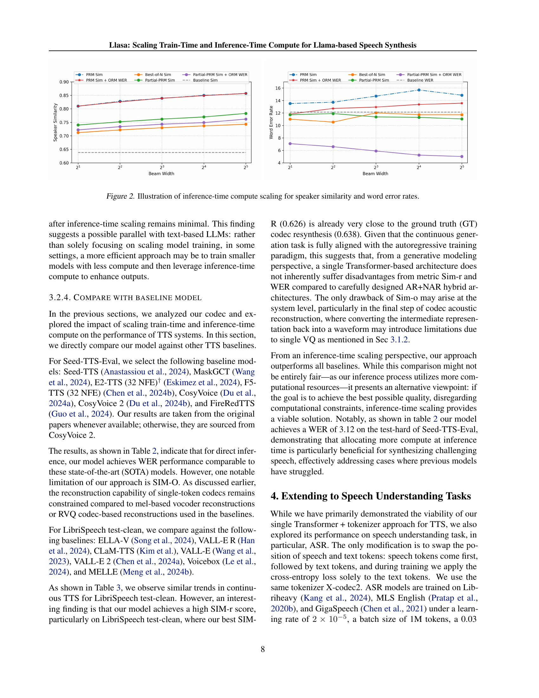

 


 2502.04128 
 Zhen Ye et el. 
 
 🤗 2025-02-07 
 



↗ arXiv


↗ Hugging Face


### TL;DR



최근 대규모 언어 모델(LLM)의 발전은 자연어 처리 분야에 혁신을 가져왔지만, LLM을 활용한 음성 합성(TTS) 시스템은 여전히 다단계 모델 구조를 가지고 있어 훈련 및 추론 시간 계산 규모 조정이 어렵다는 문제점이 있습니다. 또한, 기존 TTS 시스템은 주로 모델 아키텍처 개선에 초점을 맞춰 연구되어 왔으며, LLM에서처럼 훈련 및 추론 시간 계산 규모 조정에 대한 연구는 부족했습니다. 이는 TTS 시스템의 성능 향상에 제약이 되는 요인이었습니다.

본 논문에서는 이러한 문제를 해결하기 위해 단일 트랜스포머 아키텍처 기반의 새로운 TTS 모델인 Llasa를 제안합니다.  Llasa는 LLM과의 호환성을 높이기 위해 단일 계층 벡터 양자화(VQ) 코덱을 사용하며, 훈련 및 추론 시간 계산 규모 조정을 통해 합성 음성의 자연스러움, 표현력, 정확성을 향상시켰습니다.  특히, 추론 단계에서 음성 이해 모델을 검증자로 활용하여 계산 규모를 조정함으로써 감정 표현, 음색 일관성, 내용 정확성을 향상시킨 점이 주목할 만합니다.



#### Key Takeaways


 LLM 기반 TTS 모델인 Llasa를 제안하여 단일 트랜스포머 구조를 사용, 효율성 증대 



 훈련 시간 계산 규모 조정을 통해 합성 음성의 자연스러움과 표현력 향상 



 추론 시간 계산 규모 조정을 통해 특정 검증자의 선호도에 맞춰 생성 결과 개선 


#### Why does it matter?
본 논문은 **LLM 기반 음성 합성 분야의 훈련 및 추론 시간 계산 규모 조정**에 대한 심층적인 연구를 제시하여, **TTS 시스템의 성능 향상과 새로운 연구 방향 제시**에 중요한 의미를 지닙니다.  LLM의 발전과 TTS 기술의 융합에 대한 최신 동향을 반영하며, 효율적인 모델 설계 및 훈련 전략을 제시함으로써 관련 연구자들에게 귀중한 정보를 제공합니다. 특히, **추론 시간 계산 규모 조정을 통한 성능 향상 전략**은 기존 연구의 한계를 극복하고 새로운 연구 영역을 개척하는 데 기여할 것으로 예상됩니다. 이는 향후 **더욱 자연스럽고 표현력이 풍부한 음성 합성 시스템 개발**을 위한 중요한 발판이 될 것입니다.

------
#### Visual Insights

> 🔼 이 그림은 논문의 실험 결과를 보여주는 그림으로, 중국어와 영어 음성 합성에 대한 전문가 평가 점수의 평균을 비교한 것입니다. 중국어의 경우 감정, 억양, 시, 다의어, 의문문, 혀 꼬임, 희귀한 글자 등 7가지 범주에 대한 평균 점수가 표시되어 있고, 영어의 경우 복합 명사, 감정, 외국어, 억양, 구두점, 의문문, 복잡한 구문 등 7가지 범주에 대한 평균 점수가 비교되어 있습니다. 각 범주에 대한 점수는 모델 크기(1B, 3B, 8B)와 훈련 데이터 크기(80k, 160k, 250k 시간)에 따라 달라지며, 그림을 통해 모델 크기와 훈련 데이터 크기가 증가함에 따라 전반적인 성능이 향상되는 것을 확인할 수 있습니다.  특히 8B 모델의 경우 어려운 과제(예: 혀 꼬임, 시)에서 더욱 큰 성능 향상을 보입니다.
> 

> 
read the caption

> Figure 1: Comparison of mean expert score for Chinese and English
> 


| Model | Token Rate | Codebook Size | Codebook Layer | Frame Rate | WER ↓ | STOI ↑ | PESQ-WB ↑ | PESQ-NB ↑ | SPK-SIM ↑ | UT MOS ↑ |
|---|---|---|---|---|---|---|---|---|---|---|
| Ground Truth | - | - | - | - |  |  |  |  |  | 4.09 |
| DAC | 600 | 1024 | 12 | 50 | **2.00** | **0.95** | **4.01** | **4.15** | **0.95** | **4.00** |
| Encodec | 600 | 1024 | 8 | 75 | 2.15 | 0.94 | 2.77 | 3.18 | 0.89 | 3.09 |
| Encodec | 150 | 1024 | 2 | 75 | 4.90 | 0.85 | 1.56 | 1.94 | 0.60 | 1.58 |
| DAC | 100 | 1024 | 2 | 50 | 13.27 | 0.73 | 1.13 | 1.40 | 0.32 | 1.29 |
| SpeechTokenizer | 100 | 1024 | 2 | 50 | 3.92 | 0.77 | 1.25 | 1.59 | 0.36 | 2.28 |
| Mimi | 100 | 2048 | 8 | 12.5 | 2.96 | **0.91** | 2.25 | 2.80 | **0.73** | 3.56 |
| X-codec | 100 | 1024 | 2 | 50 | **2.49** | 0.86 | **2.33** | **2.88** | 0.72 | **4.21** |
| BigCodec | 80 | 8192 | 1 | 80 | **2.76** | **0.93** | **2.68** | **3.27** | **0.84** | **4.11** |
| WavTokenizer | 75 | 4096 | 1 | 75 | 3.98 | 0.90 | 2.13 | 2.63 | 0.65 | 3.79 |
| Mimi | 75 | 2048 | 6 | 12.5 | 3.61 | 0.89 | 1.99 | 2.51 | 0.65 | 3.38 |
| Encodec | 75 | 1024 | 1 | 75 | 28.92 | 0.77 | 1.23 | 1.48 | 0.25 | 1.25 |
| DAC | 50 | 1024 | 1 | 50 | 74.55 | 0.62 | 1.06 | 1.20 | 0.08 | 1.25 |
| SpeechTokenizer | 50 | 1024 | 1 | 50 | 5.01 | 0.64 | 1.14 | 1.30 | 0.17 | 1.27 |
| Mimi | 50 | 2048 | 4 | 12.5 | 4.89 | 0.85 | 1.64 | 2.09 | 0.50 | 3.03 |
| StableCodec | 50 | 15625 | 2 | 25 | 5.12 | 0.91 | 2.24 | 2.91 | 0.62 | **4.23** |
| SemantiCodec | 50 | 32768/8192 | 2 | 25 | 6.89 | 0.84 | 1.66 | 2.18 | 0.58 | 2.71 |
| X-codec | 50 | 1024 | 1 | 50 | 3.42 | 0.83 | 1.84 | 2.38 | 0.52 | 4.05 |
| WavTokenizer | 40 | 4096 | 1 | 40 | 11.20 | 0.85 | 1.62 | 2.06 | 0.48 | 3.57 |
| X-codec2 (ours) | 50 | 65536 | 1 | 50 | **2.47** | **0.92** | **2.43** | **3.04** | **0.82** | 4.13 |

> 🔼 표 1은 다양한 코덱 모델 간의 성능 비교 결과를 보여줍니다. 각 토큰 비율에 대해 가장 우수한 성능을 나타내는 값은 굵게 표시되어 있습니다. 비트율 대신 토큰 비율을 사용한 이유는 LLM 관점에서 더 직관적이기 때문입니다. 음성 컨텍스트 창 길이를 토큰 비율로 나누면 생성된 오디오 길이를 초 단위로 쉽게 계산할 수 있습니다. 표에는 각 모델의 토큰 비율, 코드북 크기, 코드북 레이어 수, 프레임 비율, 단어 오류율(WER), 음성 품질 객관적 평가 지표(STOI), PESQ, 주관적 평가 지표(MOS) 등 다양한 지표가 포함되어 있습니다. 이 표를 통해 제시된 코덱 모델들의 상대적 성능과 특징을 비교 분석하고, 최적의 모델 선택에 유용한 정보를 제공합니다.
> 

> 
read the caption

> Table 1: Comparison between different codec models. Bold values indicate the best for each token rate. We use token rate instead of bitrate because, from the perspective of LLMs, it is more intuitive: dividing the speech context window length by the token rate directly gives the generated audio duration in seconds.
> 

### In-depth insights

#### LLM-TTS Scaling Laws
LLM 기반 TTS(텍스트 음성 변환)의 성능 향상을 위한 규모 확장 법칙에 대한 심층적인 논의가 필요합니다. **모델 크기, 훈련 데이터 크기, 계산량**과 같은 요소들이 TTS 품질에 미치는 영향을 정량적으로 분석하여, 효율적인 자원 배분 전략을 수립해야 합니다.  **훈련 시간과 추론 시간의 균형**을 맞추는 것이 중요하며, 훈련 시간을 늘려 모델 성능을 높이는 것만큼이나 추론 시간을 효율화하여 실시간 응용 분야에 적용 가능성을 높이는 것도 중요합니다. **데이터셋의 질적 향상** 또한 성능 향상에 큰 영향을 미치므로, 다양하고 고품질의 데이터 확보 전략 또한 필요합니다.  **다양한 평가 지표**를 활용하여 주관적인 품질 평가뿐만 아니라, 정량적인 분석을 통해 객관적인 성능 비교 및 분석이 가능해야 합니다.  **인식 모델과의 통합**을 통해 TTS 시스템의 성능을 더욱 향상시킬 수 있는 방안을 모색해야 합니다. 마지막으로, 연구 결과를 바탕으로 **실제 서비스 환경**에 적용 가능한 최적의 규모 확장 전략을 제시하는 것이 중요합니다.  **다국어 지원** 및 **다양한 음성 스타일** 지원 등 사용자 경험을 고려한 추가적인 연구가 필요합니다.

#### X-Codec2 Tokenization
X-Codec2 토큰화는 음성 합성을 위한 새로운 접근 방식으로, 기존의 복잡한 다단계 TTS 시스템과 달리 **단일 트랜스포머 기반의 간결한 구조**를 채택하여 주목할 만합니다.  이는 **텍스트 LLM과의 완벽한 정렬**을 목표로 하여,  훈련 및 추론 시간 컴퓨팅 규모 조정에 대한 연구를 용이하게 합니다.  **음성 토큰화 과정**은 의미론적 인코더와 음향 인코더를 결합하여 **세분화된 음성 특징**을 포착하고, 단일 벡터 양자화(VQ)를 사용하여 이들을 **분리된 토큰**으로 변환하는 방식을 취합니다.  이는 기존의 잔차 벡터 양자화 방식 대신 **1차원 인과적 종속성**을 유지하여 LLM의 자동 회귀 메커니즘과의 호환성을 높입니다.  **디코더**는 양자화된 표현으로부터 의미론적 및 음향적 정보를 재구성하여 최종적인 음성 파형을 생성합니다. X-Codec2의 이러한 설계는 **모듈화된 TTS 시스템**의 유연성과 **단순화된 LLM 기반 TTS**의 효율성을 결합함으로써, 향후 TTS 연구 및 개발에 시너지 효과를 가져올 것으로 기대됩니다.

#### Inference-Time Search
추론 시간 검색은 **모델의 출력 분포를 조정하여 테스트 시간에 성능을 향상시키는 기법**입니다. 이는 기본 모델에서 여러 후보 출력을 생성한 다음, 사후 필터링 및 정제를 통해 생성된 콘텐츠의 품질을 높이는 방식으로 작동합니다.  **검증자 또는 채점 메커니즘을 통해 생성된 여러 음성 후보를 평가하고, 특정 검증자의 편향에 더 맞춰 생성 결과를 정렬**할 수 있습니다.  **이러한 접근 방식은 감정 표현, 음색 일관성, 콘텐츠 정확도를 개선**하는 데 사용될 수 있으며, 특히 **인식 모델이나 다른 이해 모델을 검증자로 활용**할 때 효과적입니다.  **빔 서치나 최상위 N개 선택과 같은 다양한 검색 알고리즘을 통해** 더욱 미세한 제어가 가능하며, 이는 특히 **복잡한 작업이나 다양한 평가 기준을 사용할 때 유용**합니다.  그러나, **중간 보상에 대한 과적합이나 지역적 최적점으로 수렴하는 위험성**도 고려해야 합니다.

#### Zero-Shot TTS
제로샷 TTS는 사전에 접해보지 못한 화자나 감정, 혹은 음색을 사용하여 음성을 생성하는 능력을 말합니다. 이는 **모델의 일반화 능력**을 평가하는 중요한 지표이며, **데이터 효율성**과 **실용성** 측면에서 매우 중요합니다.  기존 TTS 모델들은 특정 화자나 음색에 대한 대량의 데이터로 훈련되기 때문에 새로운 화자나 음색을 처리하려면 추가적인 훈련이 필요했습니다. 하지만 제로샷 TTS는 **적은 양의 데이터** 혹은 **추가 훈련 없이** 새로운 데이터에 적응할 수 있어 **시간 및 비용 절감** 효과를 가져옵니다.  **다양한 언어와 음성 데이터**에 대한 적응력 또한 중요하며,  **새로운 언어나 음성 데이터**에 대한 훈련 없이도 높은 성능을 보이는 것이 이상적입니다.  제로샷 TTS 기술의 발전은 다양한 응용 분야에서 **TTS 기술의 접근성과 활용도**를 높이는 데 크게 기여할 것으로 예상됩니다.  특히 **다국어 지원**이나 **개인 맞춤형 음성 합성** 시스템 개발에 중요한 역할을 할 수 있습니다.

#### Llasa Limitations
LLasa는 단일 트랜스포머 기반 TTS 모델로, **간결성과 확장성**에 중점을 두고 설계되었습니다. 하지만 이러한 단순화는 몇 가지 제한 사항을 초래할 수 있습니다.  **높은 계산 비용**은 LLMs의 일반적인 문제이며, LLasa도 예외는 아닙니다. 특히 추론 시간 계산 비용을 늘리는 방법은 모델의 성능을 향상시키지만, **실시간 응용 프로그램에는 부적합**할 수 있습니다. 또한, 단일 계층 벡터 양자화 코덱은 다른 고급 코덱에 비해 **음질 면에서 다소 낮은 성능**을 보일 수 있습니다.  **데이터 편향** 문제 또한 존재할 수 있으며, 특정 언어나 화자에 대한 데이터가 부족할 경우 모델의 일반화 성능이 저하될 가능성이 있습니다. 마지막으로, LLasa는 주로 **음성 합성에 중점**을 두고 있기 때문에, 음성 이해나 다른 다운스트림 작업에 대한 적용은 제한적일 수 있습니다.  따라서, LLasa의 실질적인 적용 가능성은 특정 애플리케이션의 요구사항 및 제약 조건에 따라 달라질 수 있습니다.

### More visual insights

More on tables


| Model | test-zh |  | test-en |  | test-hard |  | 
|---|---|---|---|---|---|---|---| 
|  | CER ↓ | sim-o ↑ | WER ↓ | sim-o ↑ | WER ↓ | sim-o ↑ | 
| Human | 1.26 | 0.755 | 2.14 | 0.734 | - | - | 
| Our Codec Resyn. | 1.92 | 0.677 | 2.91 | 0.619 | - | - | 
| Seed-TTS † | 1.12 | 0.796 | 2.25 | 0.762 | 7.59 | 0.776 | 
| FireRedTTS | 1.51 | 0.635 | 3.82 | 0.460 | 17.45 | 0.621 | 
| MaskGCT | 2.27 | 0.774 | 2.62 | 0.714 | 10.27 | 0.748 | 
| E2 TTS (32 NFE) † | 1.97 | 0.730 | 2.19 | 0.710 | - | - | 
| F5-TTS (32 NFE) | 1.56 | 0.741 | 1.83 | 0.647 | 8.67 | 0.713 | 
| CosyVoice | 3.63 | 0.723 | 4.29 | 0.609 | 11.75 | 0.709 | 
| CosyVoice 2 | 1.45 | 0.748 | 2.57 | 0.652 | 6.83 | 0.724 | 
| Train-time Scaling |  |  |  |  |  |  | 
| llasa 1b 80k | 2.69 | 0.648 (0.779) | 3.71 | 0.541 (0.685) | 17.11 | 0.618 (0.765) | 
| llasa 1b 160k | 2.22 | 0.658 (0.783) | 3.60 | 0.563 (0.701) | 16.73 | 0.627 (0.770) | 
| llasa 1b 250k | 1.89 | 0.669 (0.794) | 3.22 | 0.572 (0.708) | 12.13 | 0.638 (0.779) | 
| llasa 3b 250k | 1.60 | 0.675 (0.792) | 3.14 | 0.579 (0.708) | 13.37 | 0.652 (0.782) | 
| llasa 8b 250k | 1.59 | 0.684 (0.798) | 2.97 | 0.574 (0.706) | 11.09 | 0.660 (0.787) | 
| Partial PRM (spk sim) |  |  |  |  |  |  | 
| llasa 1b 80k | 1.52 | 0.811 (0.849) | 2.30 | 0.761 (0.798) | 16.09 | 0.759 (0.824) | 
| llasa 1b 160k | 1.29 | 0.815 (0.851) | 2.29 | 0.774 (0.804) | 14.10 | 0.768 (0.830) | 
| llasa 1b 250k | 1.11 | 0.818 (0.855) | 2.03 | 0.781 (0.809) | 11.30 | 0.773 (0.833) | 
| llasa 3b 250k | 1.06 | 0.824 (0.856) | 1.89 | 0.784 (0.812) | 11.22 | 0.780 (0.836) | 
| llasa 8b 250k | 1.04 | 0.827 (0.856) | 1.84 | 0.783 (0.806) | 10.59 | 0.785 (0.839) | 
| Partial PRM (spk sim)+ORM (WER) |  |  |  |  |  |  | 
| llasa 1b 80k | 0.53 | 0.809 (0.840) | 1.43 | 0.761 (0.792) | 7.22 | 0.732 (0.789) | 
| llasa 1b 160k | 0.53 | 0.812 (0.841) | 1.49 | 0.775 (0.798) | 6.35 | 0.745 (0.799) | 
| llasa 1b 250k | **0.45** | 0.818 (0.845) | 1.46 | 0.782 (0.801) | 5.24 | 0.750 (0.803) | 
| llasa 3b 250k | 0.50 | 0.823 (0.848) | **1.31** | 0.783 (0.803) | 5.39 | 0.759 (0.808) | 
| llasa 8b 250k | 0.47 | 0.825 (0.848) | 1.39 | 0.783 (0.799) | **4.38** | 0.767 (0.812) | 
| llasa 8b 250k |  Chunking: if len(char)&gt;100→2 chunks, &gt;200→3 chunks,… |  |  |  | **3.12** | 0.770 (0.791) |
> 🔼 표 2는 SEED 테스트 세트에서 Llasa 및 최근 TTS 모델의 결과를 보여줍니다. †는 폐쇄형 모델을 나타냅니다. Llasa 시리즈의 경우 sim-o 값에는 (괄호 안에) sim-r 값이 포함됩니다.  이 표는 다양한 TTS 모델의 성능을 비교 분석하여 Llasa 모델의 경쟁력을 보여주고, 특히 폐쇄형 모델과의 비교를 통해 Llasa 모델의 성능을 더욱 명확하게 제시합니다.  sim-o와 sim-r 지표를 함께 제시하여 모델의 음성 자연도 및 유사성을 종합적으로 평가합니다.
> 

> 
read the caption

> Table 2: Results of llasa and recent TTS models on the SEED test sets. † denotes close-sourced models. For llasa series, sim-o values include sim-r in parentheses.
> 


| Model | Test Clean | Test Other |
|---|---|---|
| whisper large v3 | 1.8 | 3.6 |
| whisper large v2 | 2.7 | 5.2 |
| llasa asr 1b | 2.3 | 7.2 |
| llasa asr 3b | 1.9 | 5.9 |
> 🔼 LibriSpeech 테스트 세트에서 다양한 음성 인식(ASR) 모델의 성능을 비교한 표입니다.  Whisper Large v2 와 Whisper Large v3 모델과 Llasa 시스템의 성능을 테스트 정확도와 테스트 외 데이터 세트에서 평가한 결과를 보여줍니다.  테스트 정확도는 일반적인 음성 인식 성능을 나타내는 지표이고, 테스트 외 데이터 세트는 모델의 일반화 능력을 보여주는 지표입니다.  이 표를 통해 Llasa 시스템이 기존의 최첨단 음성 인식 모델과 비교했을 때 성능이 어느 정도인지, 그리고 다른 데이터 세트에 대한 일반화 능력이 어떠한지 확인할 수 있습니다.
> 

> 
read the caption

> Table 3: ASR Performance on LibriSpeech Test Sets
> 


| Model | en | zh |
|---|---|---|
| GT | 0.94 | 0.94 |
| **Train-time scaling** |  |  |
| llasa 1b (80k) | 0.753 | 0.815 |
| llasa 1b (160k) | 0.762 | 0.822 |
| llasa 1b (250k) | 0.768 | 0.836 |
| llasa 3b (250k) | 0.769 | 0.852 |
| llasa 8b (250k) | 0.778 | 0.861 |
| **Process Reward Models (emotion sim)** |  |  |
| llasa 1b (80k) | 0.933 | 0.970 |
| llasa 1b (160k) | 0.936 | 0.971 |
| llasa 1b (250k) | 0.937 | 0.974 |
| llasa 3b (250k) | 0.949 | 0.975 |
| llasa 8b (250k) | 0.951 | 0.974 |
> 🔼 표 4는 Llasa TTS 모델의 감정 표현 능력을 평가하기 위해 수행된 실험 결과를 보여줍니다.  'en'은 영어, 'zh'는 중국어 데이터셋을 의미하며, Emotion Similarity는 감정 유사도를 측정한 지표입니다.  표에는 다양한 Llasa 모델 변형(모델 크기, 학습 데이터 크기 등)에 따른 감정 유사도 점수가 제시되어 있으며,  기준 모델(Ground Truth, Our Codec Resyn.) 및 다른 최첨단 TTS 모델과의 성능 비교도 포함되어 있습니다.  이는 Llasa 모델의 학습 및 추론 시간 확장이 감정 표현 능력 향상에 미치는 영향을 분석하는 데 중요한 역할을 합니다.
> 

> 
read the caption

> Table 4:  en, zh Emotion Similarity
> 


| System | WER-H | SIM-o | SIM-r |
|---|---|---|---|
| Ground Truth | 2.15 | 0.668 | - |
| Our Codec Resyn. | 2.49 | 0.580 | 0.638 |
| ELLA-V * | 2.91 | 0.303 | 0.340 |
| VALL-E R † | 2.32 | 0.363 | 0.397 |
| CLaM-TTS | 2.36 | 0.477 | 0.513 |
| VALL-E | 3.8 | - | 0.508 |
| VALL-E 2 † | 2.32 | 0.504 | 0.529 |
| Voicebox | 2.0 | 0.593 | 0.616 |
| MELLE | 1.98 | 0.508 | 0.539 |
| **Train-time Scaling** |  |  |  |
| LLaSA-TTS 1b 80k | 2.57 | 0.457 | 0.614 |
| LLaSA-TTS 1b 160k | 2.48 | 0.475 | 0.625 |
| LLaSA-TTS 1b 250k | 2.47 | 0.478 | 0.627 |
| LLaSA-TTS 3b 250k | 2.35 | 0.484 | 0.628 |
| LLaSA-TTS 8b 250k | 2.29 | 0.483 | 0.626 |
| **PRM (spk sim)** |  |  |  |
| LLaSA-TTS-80k 1b | 2.43 | 0.699 | 0.738 |
| LLaSA-TTS-160k 1b | 2.36 | 0.712 | 0.744 |
| LLaSA-TTS 1b 250k | 2.37 | 0.712 | 0.743 |
| LLaSA-TTS 3b 250k | 2.26 | 0.715 | 0.745 |
| LLaSA-TTS 8b 250k | 2.24 | 0.714 | 0.741 |
| **PRM (spk sim)+ORMs (WER)** |  |  |  |
| LLaSA-TTS-80k 1b | 1.76 | 0.700 | 0.738 |
| LLaSA-TTS-160k 1b | 1.66 | 0.710 | 0.743 |
| LLaSA-TTS 1b 250k | 1.62 | 0.712 | 0.744 |
| LLaSA-TTS 3b 250k | 1.57 | 0.714 | 0.742 |
| LLaSA-TTS 8b 250k | 1.49 | 0.714 | 0.740 |
> 🔼 표 5는 지속적인 제로샷 음성 합성 작업에 대한 객관적 성능 비교를 보여줍니다. WER-H(%)는 HuBERT-Large ASR 모델을 사용한 평가를 나타냅니다. 볼드체는 최고의 결과를, 밑줄은 두 번째로 좋은 결과를 나타냅니다. *Han et al.[2024]의 재현 결과를 인용했는데, 이는 더 나은 성능을 보여줍니다. †원 논문에 보고되지 않은 지표에 대해서는 저자들이 제공한 오디오를 사용하여 평가했습니다. 이 표는 다양한 모델의 제로샷 음성 합성 능력을 객관적인 지표(WER-H, SIM-o, SIM-r)를 사용하여 비교 분석한 것입니다. 특히, HuBERT-Large ASR 모델을 활용하여 음성 인식 정확도를 측정하고, 원본 음성과 재구성 음성 간의 유사도를 비교하여 모델의 성능을 평가합니다. 또한, 기존 연구의 재현 결과를 포함하여 더욱 폭넓은 비교 분석을 제공합니다.
> 

> 
read the caption

> Table 5: Objective performance comparison on continuation zero-shot speech synthesis tasks. WER-H (%) denotes evaluation with the HuBERT-Large ASR model. The boldface indicates the best result, and the underline denotes the second best. *We quote Han et al. [2024]’s reproduction results, which demonstrate better performance. †We evaluate metrics not reported in the original paper, using the audios provided by the authors.
> 


| Category | 1 | 2 | 3 |
|---|---|---|---| 
| **Emotion** | No detectable emotion / 无可检测的情感 | Emotion present but not convincingly rendered / 存在情感但表达不够令人信服 | Correct emotion recognition and appropriate rendering / 正确识别情感并恰当表达 |
| **Paralinguistic** | No recognition of paralinguistic cues like interjections / 未识别出语调学关键词，如“哎呀”或“嘘” | Attempts to render paralinguistic cues but unnatural / 明确意图表达关键词，但表达不自然 | Natural rendering of paralinguistic cues with appropriate emphasis / 自然表达语调学关键词，恰当强调 |
| **Chinese Poetry** | Fails to capture the poetic structure and imagery / 未能捕捉诗歌的结构和意象 | Captures some poetic elements but lacks depth / 捕捉了一些诗歌元素但缺乏深度 | Accurately captures the poetic structure, imagery, and emotional depth / 准确捕捉诗歌的结构、意象和情感深度 |
| **Polyphonic Characters** | Incorrect pronunciation and meaning of polyphonic characters / 多音字发音错误，意义不正确 | Attempts correct pronunciation but with minor errors / 尝试正确发音但有小错误 | Correct pronunciation and meaning of polyphonic characters / 多音字发音和意义正确 |
| **Questions** | Intonation pattern incorrect, failing to convey questioning tone / 语调模式不正确，未能传达问句的语气 | Intonation pattern largely correct but with minor flaws / 语调模式大体正确，但有细微瑕疵 | Correct intonation patterns that clearly convey the questioning nature / 语调模式正确，清晰传达问句的性质 |
| **Tongue Twisters** | Inability to articulate the tongue twister, resulting in errors / 无法清晰表达绕口令，导致错误 | Attempts articulation with some errors / 尝试表达绕口令但有部分错误 | Clear and accurate articulation of the tongue twister without errors / 清晰准确地表达绕口令，无错误 |
| **Rare Characters** | Mispronunciation or incorrect interpretation of rare characters / 生僻字发音错误或解释不正确 | Attempts correct pronunciation and interpretation with minor mistakes / 尝试正确发音和解释但有小错误 | Accurate pronunciation and insightful interpretation of rare characters / 生僻字发音和解释准确 |
> 🔼 이 표는 중국어 테스트 세트에 대한 평가 기준을 보여줍니다.  각 범주(감정, 담화적 특징, 시, 다의어, 질문, 혀 꼬임, 희귀한 글자)에 대해 세 가지 점수 기준이 제시되어 있으며, 각 점수는 TTS 시스템이 해당 범주를 얼마나 잘 이해하고 생성하는지에 대한 수준을 나타냅니다. 1점은 해당 범주를 전혀 인식하지 못하거나 잘못 생성한 경우, 2점은 부분적으로 인식하거나 자연스럽지 않게 생성한 경우, 3점은 정확하게 인식하고 자연스럽게 생성한 경우를 의미합니다. 각 범주에 대한 세부적인 기준을 통해 TTS 시스템의 성능을 보다 정확하고 상세하게 평가할 수 있습니다.
> 

> 
read the caption

> Table 6: Evaluation Criteria for Chinese Test Set
> 


| Categories | Example sentence | Evaluation criteria |
|---|---|---|
| **Compound Nouns** | The Beckhams decided to rent a charming stone-built quaint countryside holiday cottage. | 1 = fails to recognise compound nouns   2 = fails to realise the phrasal stress naturally   3 = natural phrasal stress |
| **Emotions** | ”Oh my gosh! Are we really going to the Maldives? That’s unbelievable!†Jennie squealed, bouncing on her toes with uncontained glee. | 1 = no audible emotions   2 = emotion present but insufficient   3 = correct emotion recognition and appropriate rendering |
| **Foreign Words** | Mr. Henry, renowned for his mise en place, orchestrated a seven-course meal, each dish a pièce de résistance. | 1 = pronounces foreign words with incorrect anglicized pronunciation   2 = applies foreign accent but not entirely correctly   3 = correct rendering in the intended language or accepted anglicized reading |
| **Paralinguistics** | ”Shh, Lucy, shhh, we mustn’t wake your baby brother,†Tom whispered, as they tiptoed past the nursery. | 1 = no recognition of paralinguistic keywords such as ”shhh†or ”phew†  2 = clear intention to render keywords distinctly, but rendering unnatural   3 = natural rendering, e.g. making speech voiceless on ”shhh†and other whispered speech |
| **Punctuations** | She received an odd text from her brother: ’Emergency @ home; call ASAP! Mom &amp; Dad are worried…#familymatters.’ | 1 = glitches on uncommon punctuations such as # or &amp;   2 = no glitch but incorrect rendering   3 = no glitch and correct pausing and verbalization, e.g. @ as ”at”. |
| **Questions** | But the Brexit question remains: After all the trials and tribulations, will the ministers find the answers in time? | 1 = intonation pattern incorrect   2 = intonation pattern largely correct but with minor flaws   3 = correct intonation |
| **Syntactic Complexities** | The movie that De Moya who was recently awarded the lifetime achievement award starred in 2022 was a box-office hit, despite the mixed reviews. | 1 = failure to parse the syntax correctly   2 = parses the syntax largely correctly but the rendering is not entirely natural   3 = parsing correct and rendering natural |
> 🔼 표 7은 본 논문에서 제시된 다양한 텍스트 유형(복합 명사, 감정 표현, 외국어 단어, 맥락 정보, 구두점, 질문, 복잡한 구문)에 대해 TTS 모델의 텍스트 이해 능력을 평가한 결과를 보여줍니다. 각 유형에 대해 세 가지 등급(1, 2, 3)으로 평가 기준이 제시되어 있으며, 각 등급은 TTS 모델이 텍스트를 얼마나 정확하고 자연스럽게 이해하고 음성으로 변환했는지를 나타냅니다. 예를 들어, '복합 명사'의 경우 1점은 복합 명사를 제대로 인식하지 못한 경우, 2점은 어느 정도 인식했지만 자연스럽지 않은 경우, 3점은 자연스럽고 정확하게 인식한 경우를 의미합니다. 이 표는 TTS 모델의 텍스트 이해 능력을 종합적으로 평가하는 데 사용되었습니다.
> 

> 
read the caption

> Table 7: Emergent abilities testset by category and evaluation criteria.
> 

### Full paper



