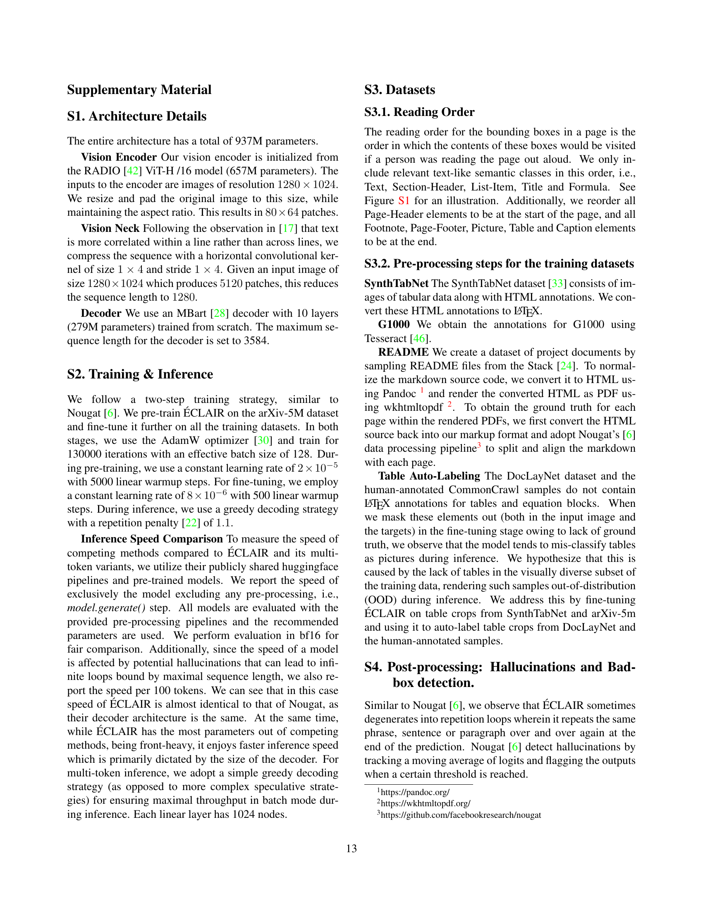

 


 2502.04223 
 Ilia Karmanov et el. 
 
 🤗 2025-02-12 
 



↗ arXiv


↗ Hugging Face


↗ Papers with Code


### TL;DR



기존의 광학 문자 인식 (OCR) 시스템은 복잡한 문서의 구조와 의미 정보를 완전히 이해하지 못하여 **문서 검색, 질의응답, LLM/VLM 학습을 위한 데이터 준비**에 어려움이 있습니다. 특히 **읽기 순서, 다양한 의미 요소, 공간적 관계**를 정확하게 파악하는 데 한계가 있습니다.

본 논문에서는 이러한 문제를 해결하기 위해 **통합된 읽기 순서를 갖춘 ÉCLAIR**이라는 새로운 텍스트 추출 도구를 제시합니다. ÉCLAIR은 이미지에서 형식화된 텍스트, 바운딩 박스, 의미 클래스를 추출하며, **새로운 인간 주석 벤치마크 DROBS**에서 최첨단 성능을 달성합니다. **다양한 기존 벤치마크**에서도 우수한 성능을 보여주며, **LLM/VLM 학습을 위한 고품질 데이터**를 제공합니다. 또한 **멀티토큰 추론 전략**을 통해 추론 속도를 향상시켜 실용성을 높였습니다.



#### Key Takeaways


 ÉCLAIR은 다양한 문서 유형에서 형식화된 텍스트, 바운딩 박스 및 의미 클래스를 추출하는 최첨단 성능을 달성합니다. 



 새로운 벤치마크 DROBS는 다양한 시각적 특징을 가진 문서에 대한 인간 주석 데이터를 제공합니다. 



 ÉCLAIR의 멀티토큰 추론 전략은 추론 속도를 크게 향상시킵니다. 


#### Why does it matter?
본 논문은 **복잡한 문서에서 형식화된 텍스트와 구조 정보를 추출하는 새로운 최첨단 모델 ÉCLAIR**을 제시합니다. 이는 **LLM 및 VLM 교육을 위한 고품질 데이터 생성**에 중요한 영향을 미치며, **다양한 문서 유형에 대한 뛰어난 성능**과 **새로운 벤치마크 DROBS**를 제공합니다. 연구자는 **새로운 방법론과 벤치마크**를 통해 문서 이해 분야에서 더욱 정교한 연구를 수행할 수 있습니다.

------
#### Visual Insights

> 🔼 그림 (a)는 복잡한 문서 레이아웃(표, 수식, 그림, 페이지 헤더 및 여러 열 포함)을 보여줍니다. ÉCLAIR은 읽는 순서를 유지하면서 이러한 다양한 요소들을 동시에 추출할 수 있습니다. 이 그림은 ÉCLAIR의 성능과 다양한 문서 유형을 처리하는 능력을 보여주는 예시입니다.
> 

> 
read the caption

> (a)
> 


| a) |  |  |
| b) |  |  |

> 🔼 본 표는 ÉCLAIR 모델 학습에 사용된 데이터셋의 요약 정보를 보여줍니다. 각 데이터셋의 크기, 파일 형식, 어노테이션 유형(구조화된 데이터, 바운딩 박스, 클래스 정보 유무 등) 및 최대 정보량을 포함하여, ÉCLAIR 모델의 다양한 기능을 평가하는데 사용된 데이터셋의 특징을 자세히 설명합니다.
> 

> 
read the caption

> Table 1: Summary of the datasets used to train ÉCLAIR, including a description of the maximum information available in the annotations of each dataset.
> 

### In-depth insights

#### Doc Object Detection
본 논문의 "Doc Object Detection" 부분은 문서 객체 탐지에 대한 심도있는 분석을 제공합니다. **기존의 접근 방식과의 차별성**을 명확히 제시하며, 특히 **자체 개발한 모델의 성능 및 한계**에 대해 면밀히 평가합니다.  **기존의 COCO-mAP 지표의 한계를 인지하고 대안적인 평가 지표**를 제시하는 점은 흥미롭습니다. 또한, **자체 데이터셋 및 평가 지표를 제시함으로써 연구의 신뢰성을 높이고** 다른 연구자들과의 비교를 용이하게 했습니다. 다만, **실험 결과 해석 및 추가적인 개선 방향**에 대한 논의가 더욱 풍부했다면 좋았을 것입니다. 특히, **다양한 유형의 문서에 대한 일반화 성능** 및 **실제 응용 가능성**에 대한 추가적인 분석이 필요해 보입니다.  결론적으로, 본 논문의 "Doc Object Detection" 부분은 문서 객체 탐지 분야에 대한 기여도가 높지만, 향후 연구를 위한 개선점도 존재합니다.

#### LLM Benchmark
LLM 벤치마크 섹션은 **대규모 언어 모델(LLM) 훈련을 위한 고품질 데이터 생성에 초점을 맞춘 연구의 중요한 부분**입니다.  본 논문에서는 ÉCLAIR 모델이 생성한 텍스트 데이터를 사용하여 훈련된 LLM의 성능을 기존의 다른 데이터 추출 도구를 사용하여 훈련된 모델과 비교 분석합니다. **ÉCLAIR를 통해 추출된 데이터가 LLM 성능 향상에 기여하는지 여부**를 객관적으로 평가하기 위해 **MMLU 벤치마크**와 같은 표준화된 평가 지표를 사용합니다.  이를 통해, ÉCLAIR의 데이터 추출 방식이 LLM 훈련에 있어 얼마나 효과적인지에 대한 정량적인 증거를 제시합니다.  **결과적으로, ÉCLAIR를 통해 얻어진 데이터를 이용한 LLM은 기존 방법보다 우수한 성능을 보임으로써, ÉCLAIR 모델의 데이터 추출 정확도와 LLM 성능 향상 간의 상관관계를 명확히 보여줍니다.**  본 섹션은 단순한 성능 비교를 넘어서, **고품질 데이터의 중요성과 ÉCLAIR 모델의 실용성을 강조**하는 데 기여합니다.  더 나아가, LLM 벤치마크 결과는 ÉCLAIR 모델의  **실제 응용 가능성을 제시하고, 향후 연구 방향을 제시하는 데 유용한 정보**를 제공합니다.

#### Multi-token Inference
본 논문의 "다중 토큰 추론" 부분은 **자동 회귀 모델의 추론 속도를 높이기 위한 효율적인 방법**을 제시합니다. 기존의 자동 회귀 모델은 토큰을 순차적으로 생성하기 때문에, 특히 문서와 같이 토큰 수가 많은 경우 추론 시간이 오래 걸리는 단점이 있습니다. 이를 해결하기 위해, **여러 개의 토큰을 동시에 예측**하는 다중 토큰 추론 기법을 제안합니다. 이 기법은 모델의 계산 비용을 줄이면서도, 정확도를 유지하거나 향상시키는 효과를 보입니다.  **다양한 토큰 개수(2, 3, 4)**에 대한 실험 결과를 통해, 다중 토큰 추론의 효과와 한계를 보여줍니다.  **특히, 2 또는 3 토큰을 예측**하는 경우가 가장 효과적임을 확인하고, 이는 추론 속도를 2배 가까이 향상시키는 결과를 가져왔습니다.  하지만, 토큰 수가 너무 많으면 오히려 정확도가 떨어질 수 있다는 점도 확인되었습니다. 따라서, **최적의 토큰 수를 선택**하는 것이 다중 토큰 추론의 성능을 극대화하는데 중요합니다.  본 연구는 다중 토큰 추론 기법을 통해 자동 회귀 모델의 효율성을 높이는데 기여하며, 향후 연구 방향을 제시합니다.

#### Reading Order Eval
**읽는 순서 평가는 문서 객체 검출 및 인식 분야에서 매우 중요한 과제입니다.**  정확한 읽는 순서를 파악하는 것은 문서의 의미를 정확하게 이해하는 데 필수적이며, 특히 복잡한 레이아웃을 가진 문서일수록 더욱 중요합니다. 이를 위해 다양한 평가 방법이 제시되고 있으며, 각 방법은 고유한 강점과 약점을 가지고 있습니다.  **본 연구에서는 다양한 문서 유형과 복잡한 레이아웃에 대한 읽는 순서 정확도를 평가하기 위한 새로운 벤치마크를 제시합니다.** 이 벤치마크는 기존 벤치마크의 한계를 극복하고, 다양한 어려움을 포함하여 **더욱 포괄적이고 현실적인 평가를 가능하게 합니다.**  **새로운 평가 지표의 도입으로 정확도 측정의 정밀성을 높이고**  모델의 성능을 객관적으로 비교할 수 있는 기반을 마련합니다.  **최첨단 모델들과의 비교 실험을 통해 제시된 모델의 우수성을 검증하며**, 향후 연구 방향에 대한 시사점을 제공합니다.  **특히, 다국어 지원 및 복잡한 표, 수식 등의 요소에 대한 처리 능력을 평가함으로써 실제 응용 분야에서의 활용 가능성을 높였습니다.**

#### Future Work
본 논문은 문서의 콘텐츠와 레이아웃을 통합적인 읽기 순서와 함께 추출하는 새로운 방법인 ÉCLAIR을 제시합니다.  향후 연구 방향으로는 **다양한 언어 지원 확장** 및 **비정형 문서 처리 성능 개선**을 고려할 수 있습니다.  또한, **모델의 효율성 향상**을 위해 경량화된 아키텍처 연구와 더불어, **다중 모달 정보 활용**을 통한 정확도 개선 방안을 모색할 수 있습니다.  **다양한 하위 작업(예: 표, 수식 추출)** 에 대한 성능 평가를 강화하고, **대규모 데이터셋 구축**을 통해 모델의 일반화 능력을 향상시키는 것도 중요한 과제입니다.  마지막으로, **에러 분석 및 해결**을 위한 심층적인 연구를 통해 ÉCLAIR의 실용성을 더욱 높일 수 있을 것입니다.

### More visual insights

More on figures

> 🔼 그림 (b)는 불규칙한 열, 스타일, 그림이 있는 복잡한 문서의 예시를 보여줍니다.  ÉCLAIR 모델이 다양한 레이아웃과 스타일을 가진 문서를 효과적으로 처리할 수 있음을 강조하기 위해 제시된 여러 가지 예시 중 하나입니다. 이 그림은 모델의 견고성과 다양한 문서 형식에 대한 적응력을 보여줍니다.
> 

> 
read the caption

> (b)
> 

> 🔼 그림 (c)는 배경색과 같은 시각적 요소를 포함하여, 읽는 순서가 명확하지 않은 복잡한 문서의 예시입니다.  ÉCLAIR은 이러한 복잡한 레이아웃에서도 텍스트와 바운딩 박스, 그리고 의미 클래스를 정확하게 추출할 수 있는 성능을 보여줍니다.
> 

> 
read the caption

> (c)
> 

> 🔼 그림 1은 ÉCLAIR이 복잡한 문서에서 다른 방법들보다 우수한 성능을 보여주는 세 가지 예시를 보여줍니다. (a)는 표, 수식, 그림, 페이지 헤더와 여러 열이 혼합된 문서, (b)는 열의 너비가 불규칙하고 스타일이 다르며 그림이 포함된 문서, (c)는 읽는 순서가 명확하지 않고 배경색과 같은 시각적 요소가 있는 문서입니다. 이 그림은 ÉCLAIR이 다양한 형식과 구조의 문서를 효과적으로 처리할 수 있음을 시각적으로 보여줍니다.
> 

> 
read the caption

> Figure 1: ÉCLAIR outperforms other methods on complex documents: (a) tables, formulas, figure, page header and multiple columns; (b) uneven columns, styling, figure; (c) non-obvious reading order and visual elements like background coloring.
> 

> 🔼 그림 2는 ÉCLAIR의 메타 아키텍처를 보여주는 두 가지 다른 프롬프트(8가지 유효한 프롬프트 중 2가지)를 사용한 예시를 보여줍니다. (a)는 바운딩 박스와 의미 클래스, 마크다운 텍스트, 표 및 수식을 반환하는 최대 정보 프롬프트를 사용하는 예시입니다. (b)는 박스와 클래스 없이 마크다운 텍스트만 반환하도록 모델에 요청하는 예시입니다. 오른쪽에는 지원되는 모든 의미 클래스가 나열되어 있습니다.
> 

> 
read the caption

> Figure 2: Meta architecture for ÉCLAIR showcasing the usage with two different (out of eight valid) prompts: Example a) uses the maximal information prompt to return bounding boxes along with their semantic class, markdown text, and tables and formulas. In b) we ask the model to return only markdown text without boxes or classes. All supported semantic classes are listed on the right.
> 

> 🔼 이 그림은 논문에서 제시된 다양한 문서 유형의 벤치마크인 DROBS의 예시 페이지들을 보여줍니다.  DROBS는 다양한 레이아웃, 서식, 시각적 요소(예: 표, 수식, 그림, 여러 열)를 가진 페이지들을 포함하여 모델의 다양한 문서 처리 능력을 평가하기 위해 만들어졌습니다.  이 그림은 DROBS 데이터셋의 다양성을 보여주는 대표적인 페이지들을 시각적으로 보여줌으로써, 논문에서 제시된 ÉCLAIR 모델의 성능 평가에 사용된 데이터셋의 특징을 이해하는데 도움을 줍니다.
> 

> 
read the caption

> Figure 3: Example pages from DROBS, our visually diverse document benchmark.
> 

> 🔼 그림 S1은 본 논문에서 다루는 문서 객체 인식 모델의 판독 순서를 보여줍니다.  텍스트, 섹션 헤더, 목록 항목, 제목, 수식과 같이 텍스트와 유사한 요소들에 대한 판독 순서는 표시되어 있습니다. 하지만 그림, 각주, 쪽 번호와 같이 다른 의미 클래스들은 본문의 판독 순서에는 포함되지 않습니다. 모든 의미 클래스가 표시된 것은 아닙니다.
> 

> 
read the caption

> Figure S1: Illustrations of reading order over relevant text-like elements, i.e. Text, Section-header, List-item, Title and Formula. Other semantic classes (such as Picture, Footnote and Page-footer in the examples here) are not included in the reading order of the main body. (Note: We are not showing all the classes)
> 

> 🔼 그림 (a)는 복잡한 문서 레이아웃(표, 수식, 그림, 페이지 헤더 및 여러 열 포함)을 보여줍니다. ÉCLAIR은 이러한 다양한 시각적 요소와 레이아웃을 갖춘 복잡한 문서에서도 형식이 지정된 텍스트와 바운딩 박스, 그리고 해당 의미 클래스를 추출할 수 있습니다.  다양한 레이아웃과 시각적 요소를 처리할 수 있는 ÉCLAIR의 다재다능함을 강조합니다.
> 

> 
read the caption

> (a)
> 

More on tables


| Dataset | Size | Modality |
|---|---|---|
| **arXiv-5M** | 5M | Structured, Boxes, Classes |
| **SynthTabNet [33]** | 480K | Structured, Boxes, Classes |
| **README** | 302K | Structured |
| **DocLayNet [40]** | 56K | Plain, Boxes, Classes |
| **G1000 [49]** | 324K | Plain |
| **Human-labeled Common Crawl samples** | 14K | Plain, Boxes, Classes |
| **Total** | 6.176M |  |
> 🔼 표 2는 DROBS에 대한 평가 결과를 보여줍니다. 표에는 OCR 및 자연어 처리(NLP) 커뮤니티에서 일반적으로 사용되는 문자 수준(편집 거리) 또는 단어 수준(F1, 정밀도, 재현율, BLEU, METEOR) 지표가 보고됩니다.  *MIP(최대 정보 프롬프트)는 모든 주석 유형을 포함하는 프롬프트임을 나타냅니다.  **Counting F1 점수는 문서에서 여러 번 나타나는 단어를 추적하고 패널티를 부여하기 위해 he1, said1, that1, she1, said2, that2, they1, said3, that3, he2, said4, something1 집합에 대해 계산됩니다.
> 

> 
read the caption

> Table 2: Evaluation results on DROBS. Reported standard NLTK metrics [41] are character level (Edit-distance) or word level (F1, Precision, Recall, BLEU, METEOR) metrics typically used by the OCR and natural language processing (NLP) communities. We also report Counting F1 and word error rate/word edit distance metrics.  *MIP-maximal-information prompt **Counting F1 score is computed over the set {{\{{ he1subscripthe1\texttt{he}_{1}he start_POSTSUBSCRIPT 1 end_POSTSUBSCRIPT, said1subscriptsaid1\texttt{said}_{1}said start_POSTSUBSCRIPT 1 end_POSTSUBSCRIPT, that1subscriptthat1\texttt{that}_{1}that start_POSTSUBSCRIPT 1 end_POSTSUBSCRIPT, she1subscriptshe1\texttt{she}_{1}she start_POSTSUBSCRIPT 1 end_POSTSUBSCRIPT, said2subscriptsaid2\texttt{said}_{2}said start_POSTSUBSCRIPT 2 end_POSTSUBSCRIPT, that2subscriptthat2\texttt{that}_{2}that start_POSTSUBSCRIPT 2 end_POSTSUBSCRIPT, they1subscriptthey1\texttt{they}_{1}they start_POSTSUBSCRIPT 1 end_POSTSUBSCRIPT, said3subscriptsaid3\texttt{said}_{3}said start_POSTSUBSCRIPT 3 end_POSTSUBSCRIPT, that3subscriptthat3\texttt{that}_{3}that start_POSTSUBSCRIPT 3 end_POSTSUBSCRIPT, he2subscripthe2\texttt{he}_{2}he start_POSTSUBSCRIPT 2 end_POSTSUBSCRIPT, said4subscriptsaid4\texttt{said}_{4}said start_POSTSUBSCRIPT 4 end_POSTSUBSCRIPT, something1subscriptsomething1\texttt{something}_{1}something start_POSTSUBSCRIPT 1 end_POSTSUBSCRIPT }}\}}. This allows to track and penalize words that missed but has more than one occurrence in the document.
> 


| Method | Maskout | Counting F1 ↑ | WER ↓ | Edit distance ↓ | F1 ↑ | Precision ↑ | Recall ↑ | BLEU ↑ | METEOR ↑ |
|---|---|---|---|---|---|---|---|---|---| 
| ÉCLAIR-MIP | ✗ | 0.934 | **0.142** | 0.109 | **0.942** | 0.960 | 0.942 | **0.886** | **0.930** |
| ÉCLAIR-MIP | ✓ | **0.937** | 0.146 | **0.108** | 0.941 | **0.966** | 0.936 | 0.885 | 0.927 |
| Kosmos-2.5 (ocr-mode) | ✓ | 0.919 | 0.195 | 0.114 | 0.937 | 0.932 | **0.950** | 0.862 | 0.927 |
| Kosmos-2.5 (md-mode) | ✓ | 0.843 | 0.249 | 0.184 | 0.890 | 0.941 | 0.876 | 0.805 | 0.851 |
| GOT (ocr-mode) | ✓ | 0.776 | 0.302 | 0.216 | 0.818 | 0.863 | 0.825 | 0.713 | 0.795 |
| GOT (md-mode) | ✓ | 0.825 | 0.259 | 0.157 | 0.879 | 0.908 | 0.875 | 0.760 | 0.852 |
> 🔼 본 표는 다양한 언어 모델의 성능을 비교 분석한 표입니다. 영어와 중국어(zh) 두 가지 언어에 대해, 여러 평가 지표(Edit Distance, BLEU, METEOR 등)를 사용하여 정확도를 측정했습니다.  ÉCLAIR 모델은 추가적인 중국어 데이터나 다국어 데이터로 학습되지 않았다는 점을 명시하고 있으며, GOT [52] 논문에서 얻은 수치와 비교하여 결과를 제시하고 있습니다.  각 지표별로 영어와 중국어 성능을 비교하여 모델의 강점과 약점을 파악하는 데 유용한 정보를 제공합니다.
> 

> 
read the caption

> Table 3: Accuracy comparison of various methods across different metrics in both English and Chinese (zh). Currently ÉCLAIR doesn’t train with additional chinese data or other form of multi-lingual data. The numbers in top row are obtained from GOT [52].
> 


| Method | Size | Edit Distance (↓) en | Edit Distance (↓) zh | F1-score (↑) en | F1-score (↑) zh | Precision (↑) en | Precision (↑) zh | Recall (↑) en | Recall (↑) zh | BLEU (↑) en | BLEU (↑) zh | METEOR (↑) en | METEOR (↑) zh |
|---|---|---|---|---|---|---|---|---|---|---|---|---|---| 
| Nougat [6] | 250M | 0.255 | - | 0.745 | - | 0.720 | - | 0.809 | - | 0.665 | - | 0.761 | - |
| TextMonkey [29] | 7B | 0.265 | - | 0.821 | - | 0.778 | - | 0.906 | - | 0.671 | - | 0.762 | - |
| DocOwl1.5 [16] | 7B | 0.258 | - | 0.862 | - | 0.835 | - | 0.962 | - | 0.788 | - | 0.858 | - |
| Vary [50] | 7B | 0.092 | 0.113 | 0.918 | 0.952 | 0.906 | 0.961 | 0.956 | 0.944 | 0.885 | 0.754 | 0.926 | 0.873 |
| Vary-toy [51] | 1.8B | 0.082 | 0.142 | 0.924 | 0.914 | 0.919 | 0.928 | 0.938 | 0.907 | 0.889 | 0.718 | 0.929 | 0.832 |
| Qwen-VL-Plus [3] | - | 0.096 | 0.121 | 0.931 | 0.895 | 0.921 | 0.903 | 0.950 | 0.890 | 0.893 | 0.684 | 0.936 | 0.828 |
| Qwen-VL-Max [3] | 72B+ | 0.057 | 0.091 | 0.964 | 0.931 | 0.955 | 0.917 | 0.977 | 0.946 | 0.942 | 0.756 | 0.971 | 0.885 |
| Fox [26] | 1.8B | 0.046 | 0.061 | 0.952 | 0.954 | 0.957 | 0.964 | 0.948 | 0.946 | 0.930 | 0.842 | 0.954 | 0.908 |
| GOT [52] | 580M | 0.035 | 0.038 | **0.972** | 0.980 | **0.971** | 0.982 | 0.973 | 0.978 | 0.947 | 0.878 | 0.958 | 0.939 |
| **ÉCLAIR** | 936M | **0.032** | - | 0.968 | - | 0.962 | - | **0.974** | - | **0.950** | - | **0.980** | - |
> 🔼 이 표는 논문의 3.2절에서 논의된 문제점들 때문에 Nougat 모델과 ÉCLAIR 모델을 직접 비교하지 않는다는 점을 명시하고 있습니다.  Nougat 기본 모델의 Nougat 검증 세트 평가 결과와 arXiv-5M 데이터 세트로 사전 훈련되고 해당 검증 세트에서 검증된 ÉCLAIR 모델의 평가 결과를 보여줍니다.  각 모델의 성능을 '모든', '텍스트', '수학', '표' 등의 모달리티별로  편집 거리, BLEU, METEOR, 정밀도, 재현율, F1 점수와 같은 다양한 지표로 평가합니다.
> 

> 
read the caption

> Table 4: Evaluation of the Nougat-Base model on the Nougat validation set (as reported in  [6]), and of ÉCLAIR pre-trained on the arXiv-5M dataset and validated on the corresponding validation set. Note: We do not aim to provide a direct comparison between Nougat and ÉCLAIR here due to the concerns discussed in Section 3.2.
> 


| Method | Size | Modality | Edit Distance ↓ | BLEU ↑ | METEOR ↑ | Precision ↑ | Recall ↑ | F1-score ↑ |
|---|---|---|---|---|---|---|---|---|
| Nougat-Base [6] | 350M | All | 0.071 | 0.891 | 0.930 | 0.935 | 0.928 | 0.931 |
|  |  | Text | 0.058 | 0.912 | 0.946 | 0.962 | 0.953 | 0.957 |
|  |  | Math | 0.128 | 0.569 | 0.754 | 0.765 | 0.766 | 0.765 |
|  |  | Tables | 0.211 | 0.697 | 0.791 | 0.754 | 0.807 | 0.780 |
| ÉCLAIR | 963M | All | 0.026 | 0.952 | 0.998 | 0.970 | 0.970 | 0.970 |
|  |  | Text | 0.015 | 0.979 | 0.996 | 0.992 | 0.990 | 0.990 |
|  |  | Math | 0.123 | 0.679 | 0.934 | 0.858 | 0.860 | 0.853 |
|  |  | Tables | 0.064 | 0.871 | 0.992 | 0.918 | 0.916 | 0.916 |
> 🔼 본 표는 미세 조정 전과 후의 DROBS에 대한 ÉCLAIR의 성능 비교 결과와 미세 조정 후 반복 패널티 적용 유무에 따른 성능 비교 결과를 보여줍니다.  즉, ÉCLAIR 모델을 미세 조정하기 전과 후, 그리고 미세 조정 후 반복 패널티를 적용했을 때와 적용하지 않았을 때의 성능 차이를 정확하게 보여주는 표입니다.  특히, DROBS 벤치마크에 대한 다양한 지표 (Counting F1, WER 등) 를 사용하여  ÉCLAIR 모델의 성능을 종합적으로 평가하고 있습니다.
> 

> 
read the caption

> Table 5: Comparison of ÉCLAIR on DROBS before and after the fine-tuning stage, and also with and without a repetition-penalty (after the fine-tuning stage).
> 


| PreTraining | FineTuning | Repetition Penalty=1.1 | Counting F1** ↑ | WER ↓ |
|---|---|---|---|---|
| ✓ | ✗ | ✗ | 0.663 | 0.264 |
| ✓ | ✓ | ✗ | 0.925 | 0.151 |
| ✓ | ✓ | ✓ | 0.934 | 0.142 |
> 🔼 표 6은 DocLayNet 벤치마크에서 COCO-mAP 평가 지표를 사용하여 ÉCLAIR 모델의 객체 탐지 성능을 보여줍니다. COCO-mAP는 IoU(Intersection over Union) 임계값 0.5에서 0.95까지, 객체 크기는 모든 크기(area=all), 최대 탐지 개수는 100개(maxDets=100)로 설정하여 계산됩니다. 이 표는 각 클래스(Caption, Footnote, Formula, List-item, Page-footer, Page-header, Picture, Section-header, Table, Text, Title)에 대한 COCO-mAP 점수를 보여주며, 모든 클래스에 대한 종합적인 COCO-mAP 점수도 포함합니다.
> 

> 
read the caption

> Table 6: COCO-mAP (with defaults IoU=0.5:0.95, area=all, maxDets=100) on DocLayNet Benchmark.
> 


| Classes | Mask-RCNN [14] | SwinDoc Segmenter [4] | ÉCLAIR |
|---|---|---|---| 
| Caption | 71.5 | 83.5 | **83.5** |
| Footnote | **71.8** | 67.8 | 66.9 |
| Formula | 63.4 | 64.2 | **65.7** |
| List-item | 80.8 | **84.1** | 79.0 |
| Page-footer | 59.3 | **65.1** | 62.0 |
| Page-header | 70.0 | **71.3** | 70.7 |
| Picture | 72.7 | **85.6** | 76.9 |
| Sec-header | **69.3** | 68.0 | 67.0 |
| Table | 82.9 | **86.0** | 77.6 |
| Text | **85.8** | 84.5 | 82.0 |
| Title | 80.4 | 66.8 | **82.0** |
| All | 73.5 | **75.2** | 73.9 |
> 🔼 이 표는 Nemotron-8B 언어 모델의 정확도를 비교한 것입니다.  ÉCLAIR과 PyMuPDF4LLM [19] 두 가지 방법으로 추출한 데이터로 Nemotron-8B 모델을 학습시킨 후, MMLU 벤치마크를 사용하여 성능을 평가했습니다.  표에는 각 방법으로 추출한 데이터를 사용하여 학습된 모델의 MMLU 정확도와 평균 정확도가 나와 있습니다.  ÉCLAIR을 사용하여 추출한 데이터로 학습된 모델이 더 높은 정확도를 보여주고 있습니다.
> 

> 
read the caption

> Table 7: Comparison of the Nemotron-8B accuracy when trained on data extracted with ÉCLAIR or PyMuPDF4LLM [19].
> 


| Method | Tokens Extracted (B) | MMLU ↑ | Other Bench Avg ↑ |
|---|---|---|---| 
| PyMuPDF4LLM [19] | 43.6 | 37.2 | 55.72 |
| ÉCLAIR | 55.1 | **39.1** | **56.7** |
> 🔼 표 8은 다중 토큰 모델과 경쟁 모델의 결과와 속도를 보여줍니다. DROBS 테스트 세트에서 이미지당 평균 속도(초/이미지)와 100개 토큰당 속도(초/100토큰)를 보고합니다. 이 값은 NVIDIA H-100 GPU에서 PyTorch 기반 추론 파이프라인으로 얻은 것입니다.
> 

> 
read the caption

> Table 8: Results and speed of multi-token models and competing methods. We report the average speed per image on DROBS test set (s⁢e⁢ci⁢m⁢g𝑠𝑒𝑐𝑖𝑚𝑔\frac{sec}{img}divide start_ARG italic_s italic_e italic_c end_ARG start_ARG italic_i italic_m italic_g end_ARG), and speed per 100 tokens (s⁢e⁢c100𝑠𝑒𝑐100\frac{sec}{100}divide start_ARG italic_s italic_e italic_c end_ARG start_ARG 100 end_ARG). These values are obtained from a PyTorch-based inference pipeline on an NVIDIA H-100 GPU.
> 


| Method | tkn/step | WER ↓ | F1 ↑ | sec/img ↓ | sec/100 ↓ |
|---|---|---|---|---|---| 
| Nougat [6] | 1 | - | - | 4.7 | 0.41 |
| GOT [52] | 1 | 0.25 | 0.82 | 9.8 | 0.90 |
| ÉCLAIR | 1 | 0.14 | 0.93 | 3.8 | 0.42 |
| ÉCLAIR-2tkn | 2 | 0.13 | 0.94 | 2.5 | 0.31 |
|  | 1 | **0.12** | **0.95** | 3.8 | 0.42 |
| ÉCLAIR-3tkn | 3 | 0.15 | 0.92 | 1.77 | 0.23 |
|  | 1 | 0.13 | 0.94 | 3.8 | 0.42 |
| ÉCLAIR-4tkn | 4 | 0.17 | 0.90 | **1.32** | **0.20** |
|  | 1 | 0.14 | 0.94 | 3.8 | 0.42 |
> 🔼 표 S1은 DocLayNet 평가 데이터셋에서 PR 곡선의 각 재현율/정밀도에 대해 ÉCLAIR과 SwinDocSegmenter의 평균 재현율 및 평균 정밀도를 비교한 것입니다. IoU≥0.5 및 IoU≥{0.5, 0.55,…,0.9, 0.95}에 대해 계산되었습니다.  *SDS는 SwinDocSegmenter를 나타냅니다.
> 

> 
read the caption

> Table S1: The mean precision and mean recall of ÉCLAIR for each class and the corresponding mean recall and mean precision of SwinDocSegmenter for the respective recall/precision on the PR-curve evaluated on the DocLayNet evaluation dataset. Computed for I⁢o⁢U≥0.5𝐼𝑜𝑈0.5IoU\geq 0.5italic_I italic_o italic_U ≥ 0.5 (corresponding to Fig. S4) and for averaged thresholds of I⁢o⁢U≥{0.5,0.55,…,0.9,0.95}𝐼𝑜𝑈0.50.55…0.90.95IoU\geq\{0.5,0.55,...,0.9,0.95\}italic_I italic_o italic_U ≥ { 0.5 , 0.55 , … , 0.9 , 0.95 } (default for COCO metrics). *SDS: SwinDocSegmenter.
> 

### Full paper



