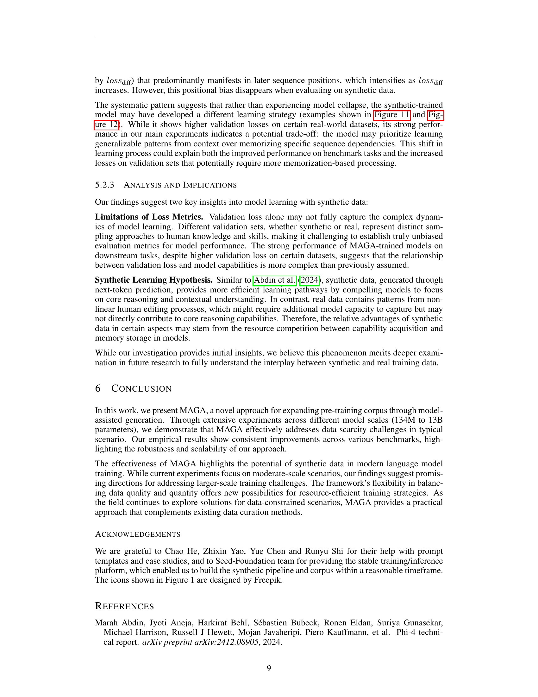
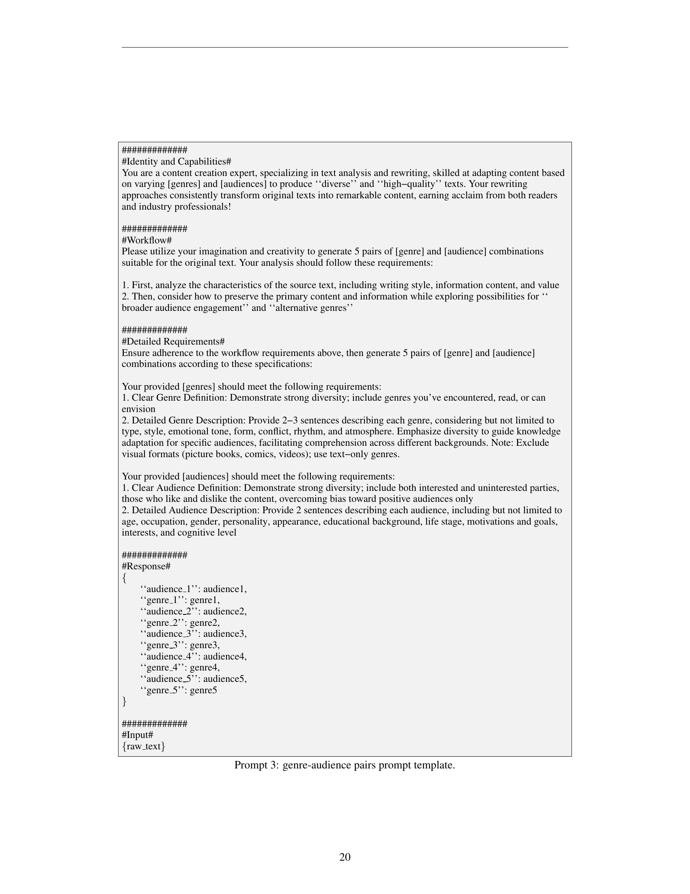

 


 2502.04235 
 Xintong Hao et el. 
 
 🤗 2025-02-07 
 



↗ arXiv


↗ Hugging Face


### TL;DR



대규모 언어 모델(LLM)의 성능 향상은 고품질 학습 데이터의 양에 크게 의존하지만, 고품질 데이터 확보는 어려운 과제입니다. 기존 연구들은 데이터 증강이나 모델 최적화 등의 방법을 통해 이 문제를 해결하려고 시도했지만, 데이터의 질적 저하나 확장성의 한계를 극복하지 못했습니다.

본 논문에서는 MAGA라는 새로운 방법론을 제시하여 이 문제에 대한 해결책을 제시합니다. MAGA는 기존의 고품질 데이터셋을 기반으로 다양한 장르와 독자층을 고려한 합성 데이터를 생성하여 학습 데이터셋을 확장합니다.  다양한 규모의 모델에 대한 실험 결과, MAGA는 기존 방법보다 우수한 성능을 보이며, 데이터 확장의 효율성과 신뢰성을 크게 높였습니다. 또한,  합성 데이터 생성 시 발생할 수 있는 과적합 및 붕괴 문제에 대한 분석과 해결 방안을 제시함으로써,  LLM 연구에 중요한 기여를 합니다.



#### Key Takeaways


 MAGA는 기존의 고품질 텍스트 데이터를 활용하여 다양하고 풍부한 합성 학습 데이터를 생성하는 효율적인 방법입니다. 



 MAGA를 사용한 LLM 학습은 다양한 모델 크기에서 일관된 성능 향상을 보여주며, 특히 대규모 모델에서 그 효과가 더욱 두드러집니다. 



 본 연구는 합성 데이터 생성 시 발생할 수 있는 과적합 및 붕괴 문제에 대한 심층적인 분석을 제공하고, 이를 완화하기 위한 효과적인 전략을 제시합니다. 


#### Why does it matter?
본 논문은 **대규모 언어 모델(LLM)의 지속적인 확장을 위한 중요한 문제인 고품질 학습 데이터 부족 문제**를 해결하기 위한 새로운 방법을 제시합니다.  **합성 데이터 생성을 통한 학습 데이터 확장의 효율성과 신뢰성을 높이는 MAGA 방법론**은 LLM 연구에 혁신적인 돌파구를 제시하며, 향후 연구 방향을 제시합니다.  **다양한 모델 크기와 데이터 규모에 대한 실험 결과**는 MAGA의 실용성과 확장성을 보여주며, 향후 LLM 연구에 중요한 기여를 할 것으로 예상됩니다.

------
#### Visual Insights

> 🔼 본 그림은 MAGA 프레임워크의 개요를 보여줍니다. MAGA는 기존 말뭉치를 두 단계의 합성 과정을 통해 확장하는 방법입니다. 각 문서는 5개의 새로운 문서로 재구성되어 토큰 수가 3.9배 증가하고, 다양한 장르와 독자층의 조합을 통해 다양성을 유지합니다.  먼저, 장르와 독자층을 생성하는 단계가 있고, 그 다음으로, 생성된 장르와 독자층을 바탕으로 문서를 재구성하는 단계가 있습니다.  이러한 두 단계를 통해 기존 말뭉치의 크기를 효과적으로 확장하면서 다양성을 유지할 수 있습니다.
> 

> 
read the caption

> Figure 1: Overview of MAGA framework. Our method expands the original corpus through a two-stage synthesis process. Each document is reformulated to 5 new documents, achieving 3.9× token number expansion while maintaining diversity through massive (genre, audience) pairs.
> 


| model | batch size | learning rate | hidden size | ffn inner | num heads | num layers | shared q_head | seq len | tie emb | total params |
|---|---|---|---|---|---|---|---|---|---|---|
| **134M** | 128 | 3e-3 | 1,204 | 4,096 | 8 | 8 | 1 | 8,192 | false | 134M |
| **377M** | 320 | 1.5e-3 | 1,536 | 6,144 | 12 | 10 | 1 | 8,192 | false | 377M |
| **1.7B** | 512 | 5e-4 | 2,560 | 10,240 | 20 | 16 | 1 | 8,192 | false | 1.68B |
| **7B** | 1,024 | 4e-4 | 4,096 | 8,192 | 32 | 32 | 4 | 8,192 | false | 6.98B |
| **13B** | 1,024 | 4e-4 | 4,096 | 12,288 | 32 | 48 | 4 | 8,192 | false | 12.9B |

> 🔼 본 표는 SLM(작은 언어 모델)과 LLM(큰 언어 모델)을 사용하여 텍스트를 개작한 결과물의 질적 평가를 비교 분석한 결과를 보여줍니다.  SLM과 LLM 각각에 대한 모델, 총 개수, 점수별 분포 (1점부터 5점까지), 3점 이상 점수를 받은 비율, 그리고 SLM과 LLM의 성능 차이를 보여주는 지표(Diff)를 제시하여 두 모델의 성능 차이를 정량적으로 비교합니다. 이는 본 논문에서 제시하는 MAGA 방법론의 효율성을 평가하는데 중요한 근거자료로 활용됩니다.
> 

> 
read the caption

> Table 1: Performance comparison between SLM and LLM on reformulation quality evaluation.
> 

### In-depth insights

#### Data Synthesis Methods
본 논문에서는 데이터 합성 방법론에 대한 심층적인 논의가 부족하지만, 언급된 내용을 바탕으로 유추해 볼 수 있습니다.  **기존의 고품질 데이터셋을 증강하는 데 초점**을 맞추고 있으며, **대규모 언어 모델을 활용한 데이터 합성**이 주요 전략으로 보입니다.  이는 기존 방법론의 한계를 극복하기 위한 시도로 해석될 수 있습니다.  **저자들은 효율성과 확장성을 고려하여 경량화된 모델을 사용**하는데, 이는 **연산 비용을 절감**하고 **대규모 데이터 합성을 가능하게** 하는 중요한 요소입니다.  하지만, 합성 데이터의 품질과 다양성을 유지하는 것이 중요한 과제이며, 이에 대한 구체적인 설명이 부족하다는 점은 아쉽습니다.  **합성 데이터의 붕괴 문제**에 대한 언급이 있으므로, 이를 방지하기 위한  **프롬프트 엔지니어링 기법** 등의 추가적인 기술적 설명이 향후 연구에 필요해 보입니다.  **다양한 장르와 대상자를 고려한 데이터 합성**을 통해 데이터의 범용성을 확보하려는 시도는 긍정적으로 평가할 수 있습니다.  하지만 **합성 데이터의 과도한 의존**은 모델 성능 저하를 야기할 수 있다는 점도 고려해야 합니다. 따라서 **실제 데이터와의 균형있는 활용**이 중요하며,  향후 연구에서는 이러한 측면에 대한 추가적인 분석이 필요할 것으로 보입니다.

#### MAGA Framework
본 논문에서 제시된 MAGA 프레임워크는 기존의 대규모 언어 모델 학습 데이터의 부족이라는 한계를 극복하기 위한 **혁신적인 방법**을 제시합니다.  기존 데이터의 재구성(reformulation)을 통해 **데이터 양을 늘리는 동시에 품질을 유지**하는 것을 목표로 합니다.  **두 단계의 합성 과정**을 통해 다양한 장르와 대상 독자를 위한 새로운 문서를 생성하고, **경량화된 모델을 사용**하여 확장성을 확보하는 것이 특징입니다.  **장르-독자 쌍 생성 및 문서 재구성**이라는 두 축을 중심으로, 다양한 유형의 데이터를 효율적으로 생성하는 접근법을 제시하고 있습니다.  하지만, 합성 데이터의 품질 관리 및 과적합 방지 등 해결해야 할 과제도 존재합니다. **검증 손실만으로는 합성 데이터 붕괴를 완벽하게 탐지할 수 없다는 점** 또한 주목할 만합니다.  **프롬프트 엔지니어링**을 통해 이러한 문제를 완화할 수 있다는 점을 보여주는 것은 흥미로운 부분입니다.  향후 연구에서는 **다양한 모델 크기 및 데이터 규모에 대한 확장성 검증**이 필요하며,  **합성 데이터의 품질 관리 및 붕괴 방지**를 위한 더욱 효과적인 전략 개발이 중요할 것으로 예상됩니다.

#### Scaling Strategies
본 논문에서 제시된 확장 전략은 데이터 제약 조건 하에서 언어 모델의 확장성을 높이는 데 중점을 둡니다. **50B 고품질 데이터셋을 500B로, 500B 혼합 데이터셋을 700B로 확장하는 두 가지 시나리오**를 통해 다양한 전략의 효과를 평가합니다.  **MAGA 확장 전략은 단순히 데이터를 반복하거나 업샘플링하는 기존 방식보다 일관되게 성능 향상을 보여줍니다.** 특히, 모델 크기가 커짐에 따라 MAGA의 성능 향상 효과가 더욱 두드러집니다. 이는 **합성 데이터의 중요성과 MAGA의 효율성**을 보여주는 결과입니다.  **검증 손실이 증가하는 현상**에도 불구하고, MAGA는 벤치마크 성능을 향상시켜 **검증 손실이 모델 성능을 완벽하게 반영하지 못함**을 시사합니다.  따라서,  **다양한 데이터 확장 전략을 비교 분석하고, 모델 크기 및 데이터 품질과의 상호작용을 고려**하는 것이 중요하며,  **향후 연구를 통해 합성 데이터 생성 및 활용 전략을 더욱 정교화**할 필요가 있습니다.

#### Model Collapse
본 논문에서 다룬 '모델 붕괴(Model Collapse)' 현상은 **합성 데이터**를 사용하여 언어 모델을 학습할 때 발생하는 심각한 문제입니다.  **합성 데이터의 과도한 단순화 또는 반복**으로 인해 모델이 실제 데이터의 다양성과 복잡성을 제대로 학습하지 못하고, 특정 패턴이나 예측에 과도하게 의존하게 되는 현상을 의미합니다. 이는 모델의 성능 저하와 일반화 능력 부족으로 이어져 실제 응용에 심각한 제약을 초래합니다. 논문에서는 **검증 손실(Validation Loss)** 만으로는 모델 붕괴를 정확하게 진단하기 어렵다는 점을 지적하며, **프롬프트 엔지니어링(Prompt Engineering)** 과 같은 다양한 기법을 통해 모델 붕괴를 완화하고 합성 데이터의 품질을 개선하려는 노력을 보여줍니다.  **데이터의 다양성과 균형**을 유지하면서 모델의 일반화 능력을 향상시키는 것이 모델 붕괴 문제 해결의 핵심입니다.

#### Future Directions
본 논문에서 제시된 MAGA 방법론은 합성 데이터를 활용한 사전 훈련 말뭉치 확장에 있어 고무적인 결과를 보여주지만, **향후 연구 방향**은 여전히 많습니다.  **합성 데이터의 품질 향상**을 위한 연구는 지속되어야 하며, 특히 **다양한 장르와 대상 독자에 대한 일반화 성능**을 높이는 것이 중요합니다.  **모델의 붕괴 현상**에 대한 심층적인 이해와 이를 방지하는 기술 개발 또한 필수적입니다.  **다양한 크기의 모델에 대한 확장성 검증**과 **실제 응용 분야에 대한 적용 가능성**을 확인하는 연구가 필요하며,  **비용 효율적인 합성 데이터 생성 방법**에 대한 탐색도 중요한 과제입니다.  **다른 합성 데이터 생성 방법론과의 비교 연구**를 통해 MAGA의 강점과 약점을 명확히 밝히는 것도 필요합니다.  마지막으로, **윤리적 측면**을 고려한 합성 데이터 생성 및 활용 방안에 대한 연구가 요구됩니다.

### More visual insights

More on figures

> 🔼 그림 2는 MAGA 구조의 구현 세부 정보를 보여줍니다. 고품질 말뭉치에서 일부를 추출하여 LLM 레이블러와 판정자의 입력으로 사용합니다. 반복적인 필터링을 통해 각 단계의 추론 효율을 높이기 위해 SLM 도구 모델을 학습하고 양자화합니다. 이렇게 생성된 개선된 말뭉치를 사용하여 개선된 말뭉치를 생성합니다.
> 

> 
read the caption

> Figure 2: Implementation details. From a high-quality corpus, we sample a subset to serve as input for the LLM labeler and judger. Through iterative filtering, we train and quantize SLM tool models for each stage to improve inference efficiency, which are used to generate the reformulated corpus.
> 

> 🔼 그림 3은 전체 데이터셋(EntireSet)과 하위 데이터셋(Subset)의 두 가지 데이터 조합 방법에 따른 모델 학습 동향을 보여줍니다.  먼저, 전체 데이터셋은 기존의 고품질 데이터셋에 합성 데이터를 추가한 경우이고, 하위 데이터셋은 기존 데이터셋의 일부만 사용하고 합성 데이터를 추가한 경우입니다. 그림에서는 각 데이터 조합 방법에 따른 다양한 규모의 언어 모델(1억 3400만, 3억 7700만, 17억, 70억, 130억 파라미터)의 학습 성능 변화를 보여주는 그래프가 제시되어 있으며, 세부적인 벤치마크 결과는 부록 D에 수록되어 있습니다.  이 그림을 통해 각 데이터 조합 방법이 모델 성능에 미치는 영향과 모델 크기에 따른 성능 변화를 효과적으로 파악할 수 있습니다.
> 

> 
read the caption

> Figure 3: The first and last two figures illustrate the training dynamics of EntireSet and SubSet data recipes, respectively. Benchmark details are provided in Appendix D.
> 

> 🔼 그림 4는 MAGA-Mix 설정에서 벤치마크 결과와 검증 손실을 보여줍니다. 데이터 반복에 대한 민감도는 기능 영역에 따라 다르며, 지식 영역은 더 큰 복원력을 보여줍니다. 이 그림은 다양한 모델 크기(1억 3,400만, 3억 7,700만, 17억, 70억, 130억 매개변수)에 걸쳐 MAGA-Mix 설정에서 여러 벤치마크에 대한 성능을 보여주는 여러 그래프를 포함합니다. 각 그래프는 특정 벤치마크(예: ARC, HellaSwag, Winograd, MMLU 등)에 대한 성능을 나타내며, MAGA-Mix, 베이스라인 및 기타 데이터 전략을 비교합니다. 또한, 검증 손실에 대한 그래프가 포함되어 있어 합성 데이터 사용의 영향을 보여줍니다. 그림에서 지식 영역의 모델 성능이 데이터 반복에 대해 더 강건함을 보여주는 경향이 있음을 알 수 있습니다.
> 

> 
read the caption

> Figure 4: Benchmark results and validation losses in the MAGA-Mix setting. The sensitivity to data repetition varies across capability domains, with knowledge dimension showing greater resilience.
> 

> 🔼 그림 5는 t-SNE 기법을 사용하여 세 가지 다른 SLM 변형 모델(Base, Strict, Relaxed)의 단어 임베딩 분포를 시각화한 결과를 보여줍니다. Base 모델(왼쪽)은 원본 데이터와 상당 부분 겹치는 분포를 유지하지만, 원본 데이터를 넘어서는 영역까지 확장되어 다양성을 보여줍니다. Strict 모델(중간) 또한 원본 데이터를 확장하지만, Base 모델에 비해 다양성이 제한적임을 보여줍니다. 반면 Relaxed 모델(오른쪽)은 원본 데이터와 상당히 다른 분포를 보이는데, 이는 성능 저하의 원인을 설명합니다.
> 

> 
read the caption

> Figure 5: t-SNE visualization results. Base (left) maintains a distribution that overlaps with but extends beyond the original data. Strict (middle) clusters also extend original data, but indicating limited diversity compared to left. Relaxed (right) shows significant distributional shift, explaining its poor performance.
> 

> 🔼 그림 6은 논문의 4.2절 실험 결과 중 검증 손실(validation loss)을 보여줍니다.  다양한 크기의 모델(134M, 377M, 1.7B)에 대해,  SmolLM-Corpus만 사용한 기준(Baseline)과 MAGA-Corpus를 추가하거나 대체한 경우(MAGA-Only, MAGA-Mix)의 검증 손실 변화를 보여주는 여러 그래프가 포함되어 있습니다. 각 그래프는 데이터셋(Fineweb-Edu, Cosmopedia-V2, Open-Web-Math, Python-Edu)별 손실 변화를 나타냅니다.  이를 통해 MAGA-Corpus 사용에 따른 모델 성능 및 일반화 성능에 대한 통찰력을 얻을 수 있습니다.
> 

> 
read the caption

> Figure 6: validation losses of experiments in Section 4.2.
> 

> 🔼 그림 7은 모델의 손실 패턴 분석을 보여줍니다. 그림 7의 (a)와 (c)는 서로 다른 데이터 설정으로 학습된 모델 간의 비교를 보여주며, y축은 실제 데이터셋에서 계산된 토큰 손실(lossreal)이고 x축은 합성 데이터셋에서 계산된 토큰 손실(losssynt)입니다. (b)와 (d)는 losssynt - lossreal (lossdiff)이 시퀀스의 평균 차이보다 유의미하게 커지는 시점을 추적합니다. 이때 lossdiff는 합성 데이터셋의 토큰 손실에서 실제 데이터셋의 토큰 손실을 뺀 값입니다. 자세한 내용은 부록 D.3을 참조하십시오.
> 

> 
read the caption

> Figure 7: Losses pattern analysis. Subfigures 1 and 3 shows comparison between models trained on different data settings, with l⁢o⁢s⁢sreal𝑙𝑜𝑠subscript𝑠realloss_{\text{real}}italic_l italic_o italic_s italic_s start_POSTSUBSCRIPT real end_POSTSUBSCRIPT on y-axis and l⁢o⁢s⁢ssynt𝑙𝑜𝑠subscript𝑠syntloss_{\text{synt}}italic_l italic_o italic_s italic_s start_POSTSUBSCRIPT synt end_POSTSUBSCRIPT on x-axis. Subfigures 2 and 4 track the position where l⁢o⁢s⁢ssynti−l⁢o⁢s⁢sreali𝑙𝑜𝑠subscriptsuperscript𝑠𝑖synt𝑙𝑜𝑠subscriptsuperscript𝑠𝑖realloss^{i}_{\text{synt}}-loss^{i}_{\text{real}}italic_l italic_o italic_s italic_s start_POSTSUPERSCRIPT italic_i end_POSTSUPERSCRIPT start_POSTSUBSCRIPT synt end_POSTSUBSCRIPT - italic_l italic_o italic_s italic_s start_POSTSUPERSCRIPT italic_i end_POSTSUPERSCRIPT start_POSTSUBSCRIPT real end_POSTSUBSCRIPT (l⁢o⁢s⁢sdiffi𝑙𝑜𝑠subscriptsuperscript𝑠𝑖diffloss^{i}_{\text{diff}}italic_l italic_o italic_s italic_s start_POSTSUPERSCRIPT italic_i end_POSTSUPERSCRIPT start_POSTSUBSCRIPT diff end_POSTSUBSCRIPT) first becomes significantly higher than the sequence’s average difference (detailed definition in Appendix D.3).
> 

> 🔼 표 4에 설명된 전체 데이터셋에 대한 자세한 평가 결과를 보여줍니다. MAGACorpus 그룹은 다양한 모델 크기에 걸쳐 대부분의 평가 척도에서 다른 그룹보다 우수한 성능을 지속적으로 보여줍니다. 그림은 다양한 모델 크기(1억 3400만, 3억 7700만, 17억, 70억, 130억 매개변수)에 걸쳐 여러 개의 벤치마크(ARC, WinoGrande, HellaSwag, MMLU, OpenBookQA, PIQA, TriviaQA, GSM8K 등)에서 MAGACorpus를 사용하여 훈련된 모델의 성능을 보여줍니다. MAGACorpus 그룹은 대부분의 벤치마크에서 다른 그룹(기준, 반복 실험, 업샘플링)보다 우수한 성능을 보여주는 것을 알 수 있습니다.
> 

> 
read the caption

> Figure 8: Detail evaluation results of EntireSet described in Table 4. MAGACorpus group demonstrats advantages over other groups across most evaluation sets, consistently across models of sizes.
> 

> 🔼 그림 9는 표 4에서 설명된 하위 집합에 대한 자세한 평가 결과를 보여줍니다. 모델 크기가 증가함에 따라 업샘플링 그룹과 MAGACorpus 간의 성능 차이가 ARC, DROP, GSM8K, RACE에서 점차 커지지만, TriviaQA와 Winogrande에서는 약간의 변화가 관찰됩니다.  즉, MAGA 기법을 사용한 합성 데이터를 추가할수록 모델의 크기가 커질수록 기존 데이터셋만으로 학습한 모델보다 성능 향상이 더 크다는 것을 보여줍니다. 특히, 지식 집약적인 벤치마크(TriviaQA, GSM8K 등)에서 성능 향상이 두드러집니다. 반면 TriviaQA와 Winogrande에서는 모델 크기 증가에 따른 성능 향상의 차이가 상대적으로 적게 나타납니다.
> 

> 
read the caption

> Figure 9: Detail evaluation results of Subset described in Table 4. As the model size increases, the performance gap between the upsampling group and MAGACorpus gradually widens in ARC, DROP, GSM8K, RACE, but with some variations observed in TriviaQA and WinoGrande.
> 

> 🔼 그림 10은 본 논문 5.1절에서 설명하는 다양한 SLM 변형에 대한 성능 비교 결과를 보여줍니다.  각 그래프는 특정 벤치마크 작업에 대한 모델의 성능을 토큰 수에 따라 보여주며,  SLM-Base, SLM-Strict, SLM-Relaxed 세 가지 변형 모델과 원본 데이터의 성능을 비교 분석합니다.  이를 통해 정보 보존과 변형 간의 균형을 맞추는 것이 모델 성능에 미치는 영향을 시각적으로 보여줍니다.  각 그래프의 y축은 성능 지표(점수), x축은 학습에 사용된 토큰 수를 나타냅니다.
> 

> 
read the caption

> Figure 10: Corresponding benchmark results described in Section 5.1.
> 

> 🔼 이 그림은 합성 데이터로 학습된 모델이 후반부 시퀀스 위치에서 토큰 예측에 실패하는 경우를 보여주는 무작위 예시들을 보여줍니다.  `mean(lossdiff)>0.5` 조건을 만족하는 예시들을 샘플링하여, 합성 모델이 실제 데이터에 비해 후반부 시퀀스에서 예측 성능이 저하되는 현상을 보여줍니다. 이는 합성 데이터 학습 모델의 한계 또는 데이터 전처리 과정의 노이즈 때문일 수 있음을 시사합니다.
> 

> 
read the caption

> Figure 11: Random examples sampling from where mean⁢(l⁢o⁢s⁢sdiffi)>0.5mean𝑙𝑜𝑠subscriptsuperscript𝑠𝑖diff0.5\text{mean}(loss^{i}_{\text{diff}})>0.5mean ( italic_l italic_o italic_s italic_s start_POSTSUPERSCRIPT italic_i end_POSTSUPERSCRIPT start_POSTSUBSCRIPT diff end_POSTSUBSCRIPT ) > 0.5, the synthetic-trained model fail to predict the tokens in later sequence positions.
> 

> 🔼 그림 12는 그림 11에서 보여지는 손실 패턴과 일치하는 Fineweb-Edu에서 샘플링된 사례들을 보여줍니다. 합성 학습 모델에 의해 더 높은 손실이 발생한 부분은 빨간색으로 강조 표시되어 있습니다. 이는 실제 데이터와 합성 데이터 간의 차이를 보다 명확하게 이해하는 데 도움이 되는 추가적인 정보를 제공합니다. 특히, 합성 데이터로 훈련된 모델은 특정 패턴에 대해 실제 데이터보다 더 높은 손실을 보이는 경향이 있음을 보여줍니다. 이러한 손실 패턴의 차이는 모델이 실제 데이터와 합성 데이터를 다르게 처리하고 있음을 시사하며, 이는 모델의 성능과 일반화 능력에 영향을 미칠 수 있습니다.
> 

> 
read the caption

> Figure 12: Corresponding cases sampled from Fineweb-Edu, which align with the loss patterns shown in Figure 11, with higher loss by synthetic-trained model highlighted in red.
> 

> 🔼 그림 13은 합성 데이터로 학습된 모델이 더 높은 손실을 보이는 중국어 말뭉치 샘플들을 보여줍니다. 빨간색으로 표시된 부분은 합성 모델이 실제 데이터보다 예측 성능이 떨어지는 부분을 나타냅니다. 이는 합성 데이터로 학습된 모델이 실제 데이터의 특징을 완벽하게 포착하지 못하고, 특정 패턴이나 잡음에 과민하게 반응할 수 있음을 시사합니다.  이러한 현상은 전처리 과정에서 발생하는 잡음이나 오류로 인해 발생할 가능성이 있습니다.
> 

> 
read the caption

> Figure 13: Chinese corpus samples with higher loss by synthetic-trained model in red.
> 

### Full paper



