 


 2502.04296 
 Lirui Wang et el. 
 
 🤗 2025-02-07 
 



↗ arXiv


↗ Hugging Face


### TL;DR



로봇 학습 분야는 **데이터 부족**과 **실시간 고품질 평가의 어려움**으로 인해 발전에 제약이 있습니다.  **다양한 로봇, 작업, 환경에서 수집된 방대한 데이터**를 효과적으로 활용하는 것이 중요한 과제입니다.  기존의 생성 모델들은 계산 비용이 많이 들고 실시간으로 작동하기 어려운 경우가 많았습니다.  또한, 다양한 로봇 시스템의 행동 차이를 효과적으로 처리하는 데 어려움이 있었습니다.

본 논문에서는 이러한 문제를 해결하기 위해 **이종 마스크 자기회귀(HMA)**라는 새로운 방법을 제시합니다. HMA는 다양한 로봇 시스템의 데이터를 통합하여 학습하는 **이종 전이 학습** 기법을 사용합니다.  **마스크 자기회귀**를 통해 고품질의 비디오를 빠르게 생성하고, 다양한 로봇 시스템의 행동 차이를 효과적으로 처리합니다.  실험 결과, HMA는 기존 모델들보다 훨씬 **빠른 속도**로 고품질 비디오를 생성하고, **더 나은 제어 성능**을 보였습니다.  또한, 정책 평가, 합성 데이터 생성 등 로봇 학습의 다양한 분야에 적용될 수 있음을 보여주었습니다.



#### Key Takeaways


 이종 로봇 데이터를 활용한 마스크 자기회귀 모델(HMA) 제안 



 기존 모델 대비 15배 빠른 속도로 고품질 비디오 생성 및 제어 가능성 향상 



 정책 평가, 합성 데이터 생성 등 로봇 학습 다양한 분야 적용 가능성 제시 


#### Why does it matter?
**로봇 학습의 확장성을 제한하는 데이터 부족 및 실시간 고품질 평가 문제를 해결하기 위해, 이 논문은 다양한 로봇 환경에서 수집된 방대한 데이터를 활용하여 고품질의 동영상 데이터를 생성하고 평가하는 새로운 방법을 제시합니다.** 이는 로봇 제어 및 시뮬레이션 분야의 혁신을 가져올 뿐만 아니라, 보다 효율적이고 일반화된 로봇 학습 모델 개발에 크게 기여할 것으로 예상됩니다. **본 연구는 실제 로봇 상호 작용에서 얻은 방대한 데이터를 활용하여 실시간으로 고품질 비디오를 생성하는 데 초점을 맞추고 있으며, 이는 로봇 시뮬레이션 및 평가에 있어서 혁신적인 발전**입니다.

------
#### Visual Insights

> 🔼 그림 1은 이종 로봇 상호작용으로부터 얻어진 동작-비디오 역학 모델을 보여줍니다. HMA는 40가지의 서로 다른 구현(embodiments)으로부터 3백만 개가 넘는 궤적(비디오)을 포함하는 이종 데이터셋을 활용하여 마스크 자기회귀(masked autoregression)를 사용하여 다음 토큰 예측을 통해 완전한 역학 모델을 사전 훈련합니다. 사전 훈련 후 생성된 동작-비디오 역학 모델은 다양한 용도로 사용할 수 있으며, 비디오 시뮬레이션, 정책 평가, 합성 데이터 생성 및 모방 정책으로의 직접 채택 등이 포함됩니다.
> 

> 
read the caption

> Figure 1:  Action-Video Dynamics Model from Heterogeneous Robot Interactions. HMA utilizes heterogeneous datasets comprising over 3 million trajectories (videos) from 40 distinct embodiments to pre-train a full dynamics model with next-set-of-token predictions using masked autoregression. After pre-training, the resulting action-video dynamics model is versatile, supporting applications such as video simulation, policy evaluation, synthetic data generation, and direct adoption as an imitation policy.
> 


| Model | Method | Parameters (M) | FPS ↑ |
|---|---|---|---| 
| IRASim-XL | DiT | 679 | 0.28 |
| IRASim-XL, amortized | DiT | 679 | 0.58 |
| HMA-Base | MaskGIT | 44 | 22.72 |
| HMA-XL | MaskGIT | 679 | 4.38 |
| HMA-Base | MAR | 96 | 4.44 |
| HMA-XL | MAR | 741 | 2.01 |

> 🔼 표 1은 다양한 모델 크기에 대해 16프레임에 걸쳐 프레임당 추론 속도를 측정한 결과를 보여줍니다. 기본 모델의 크기는 약 3천만 매개변수이고, XL 모델의 크기는 IRASim-XL과 비슷합니다. 모든 모델은 32개의 블록으로 구성된 트랜스포머를 사용하며, 기본 모델은 256차원, XL 모델은 768차원을 갖습니다. 동일한 크기의 모델 중 HMA가 가장 빠른데, 그 이유는 HMA가 각 프레임을 생성하기 위해 전체 트랜스포머를 여러 번 통과하지 않기 때문입니다(확산 모델링 사용). MAR은 확산 헤드로 인해 MaskGIT보다 더 많은 매개변수를 사용합니다. [60]의 평균화된 결과는 여러 프레임에 대한 평균값입니다. 모든 속도는 RTX-4080 GPU를 사용하는 동일한 하드웨어 설정에서 측정되었습니다.
> 

> 
read the caption

> Table 1: Inference Speed. We measure the per-frame inference speed across 16 frames for various model sizes. The Base model has a model size of around 30M and the XL model has a similar model size as IRASim-XL. The models all use 32-block transformers where the base model has dimensions 256 and the XL models have dimensions 768. Our fastest model of the same size is more than 15×\times× faster than [60] because HMA does not pass through the full Transformer multiple times (with diffusion modeling) to generate each frame. MAR incurs more parameters than MaskGIT [8] because of the diffusion heads [27]. The amortized result for [60] comes from averaging over multiple frames. The speeds are all measured on the same hardware setup with RTX-4080 GPU.
> 

### In-depth insights

#### HMA: A Novel Approach
HMA는 이종 데이터셋을 활용하여 **실세계 로봇 행동의 동영상 데이터를 모델링**하는 새로운 접근 방식입니다.  기존의 방법들과 달리, **다양한 로봇 플랫폼과 작업 환경에서 수집된 이종 데이터를 효율적으로 처리**할 수 있도록 설계되었습니다.  **마스크드 자기회귀(Masked Autoregression)** 기법을 이용하여 영상 예측의 정확성과 속도를 개선하며, 특히 **실시간 상호작용을 위한 실용성을 높였습니다**.  **이종성(Heterogeneity)을 고려한 설계**는 다양한 로봇 시스템에 대한 적용 가능성을 높이고, **영상 시뮬레이터, 정책 평가, 합성 데이터 생성** 등 다양한 로봇 학습 분야에 활용될 수 있다는 점에서 **매우 중요한 발전**이라고 할 수 있습니다.

#### Action Heterogeneity
본 논문에서 '액션 이질성(Action Heterogeneity)'은 로봇 제어 분야의 **다양한 로봇 플랫폼과 작업 환경에서의 액션 표현 방식의 차이**를 의미합니다.  즉, 서로 다른 로봇들은 각기 다른 액션 공간(action space), 액션 주파수(action frequency), 그리고 액션 지평선(action horizon)을 가지고 있기 때문에, 하나의 통합된 모델로 다양한 로봇들의 액션을 효과적으로 모델링하는 것은 어려운 과제입니다.  **본 논문은 이러한 이질성을 해결하기 위해 액션과 비디오 데이터를 통합적으로 처리하는 새로운 방법론을 제시**하고 있으며, 이는 로봇 학습의 확장성을 높이는 데 중요한 역할을 합니다.  **이질적인 액션들을 공통된 잠재 공간(latent space)에 매핑하여 모델의 일반화 성능을 향상**시키고, **모듈화된 네트워크 구조를 통해 새로운 로봇 플랫폼에 대한 적용을 용이하게** 하는 점이 특징입니다.  이러한 접근법을 통해 하나의 모델로 다양한 로봇들에 대한 액션-비디오 역학을 효율적으로 모델링하고, 다양한 로봇 학습 과제에 적용할 수 있습니다.

#### Masked Autoregression
본 논문에서 제시된 마스크드 자기회귀(Masked Autoregression) 기법은 **로봇 학습의 확장성을 높이기 위한 고품질 데이터 생성 및 평가**에 초점을 맞춥니다.  기존 방법들의 계산 비용 및 다양한 환경 설정 처리의 어려움을 해결하고자, **이종 데이터(heterogeneous data)**를 활용하여 사전 훈련을 진행합니다.  다양한 로봇 플랫폼, 작업 환경 및 과제에서 수집된 관측치 및 행동 시퀀스를 통합하여 모델의 일반화 능력을 향상시킵니다.  **마스크드 자기회귀를 통해 비디오 예측을 위한 양자화 또는 소프트 토큰을 생성**하고, 기존 모델들보다 **시각적 충실도와 제어 가능성을 개선**하며, 실제 환경에서 **15배 빠른 속도**를 달성합니다.  **사후 훈련을 통해 저수준 행동 입력으로부터 비디오 시뮬레이션을 생성**하고 정책 평가 및 합성 데이터 생성에 활용할 수 있습니다.

#### Scaling Behaviors
본 논문에서 '확장성 동작(Scaling Behaviors)' 부분은 **모델의 성능이 데이터셋 크기, 모델 크기, 그리고 임베디먼트(embodiment)의 수에 따라 어떻게 변하는지**를 보여주는 중요한 실험 결과를 제시합니다.  **데이터셋 크기 증가에 따라 성능이 향상되는 점진적 확장성**을 확인하고, 이는 더 많은 데이터가 모델의 성능 향상에 긍정적임을 시사합니다.  **모델 크기 확장 또한 성능 향상으로 이어지며**, 이는 **모델의 표현력과 복잡한 동작 학습 능력의 증가**와 관련이 있습니다.  마지막으로, **다양한 로봇 임베디먼트를 포함하는 실험에서도 견고한 성능**을 보여주는 것은 **모델의 일반화 능력**이 뛰어남을 의미합니다.  이는 **다양한 로봇 시스템에 적용 가능한 범용 모델** 개발의 가능성을 보여주는 중요한 발견입니다.  **결론적으로, 본 논문의 확장성 실험은 제시된 모델의 견고성과 실용성을 입증하며, 다양한 로봇 시스템에 대한 적용 가능성을 높게 평가할 수 있도록 합니다.**

#### Real-World Use
본 논문에서 제시된 이종형 마스크 자기회귀(HMA) 모델의 실세계 적용 가능성은 매우 높습니다. **실시간 고해상도 로봇 시뮬레이션**을 가능하게 하여 정책 평가 및 합성 데이터 생성에 효과적으로 활용될 수 있습니다. 특히, 기존 모델보다 15배 빠른 속도로 실시간 상호작용이 가능하다는 점은 **로봇 학습의 확장성**을 크게 높이는 중요한 진전입니다. 또한, 다양한 로봇 플랫폼과 작업에 대한 **일반화 능력**을 갖추어 여러 로봇 시스템에 적용 가능하며,  **정책 학습 및 평가**에 유용한 도구로 활용될 수 있다는 점도 주목할 만합니다.  **저해상도 센서 데이터**를 이용한 정책 학습 시, 실제 환경에서 얻기 어려운 데이터를 합성하여 정책의 성능을 향상시킬 수 있습니다.  하지만, **실제 로봇 시스템에 적용**하기 위해서는 추가적인 연구가 필요합니다.  특히, 복잡한 실세계 환경에서의 안정성과 신뢰성을 높이는 연구가 중요하며, 더욱 다양한 작업과 로봇 플랫폼에 대한 일반화 능력을 향상시키는 연구도 필요합니다.  **결론적으로**, HMA 모델은 실세계 로봇 시스템의 제어 및 학습을 위한 강력한 도구로서 큰 잠재력을 가지고 있습니다.

### More visual insights

More on figures

> 🔼 그림 2는 역동적인 모델에서 마스크 자기회귀의 개념을 보여줍니다.  이 모델은 정책 학습, 순방향 및 수동 역학, 그리고 전체 역학을 포함한 다양한 문제 설정을 일반화합니다.  즉, 마스크 자기회귀는 과거 관찰과 행동의 시퀀스를 기반으로 미래의 관찰과 행동을 예측하는 데 사용됩니다. 이 그림은 각각의 역동적 설정(정책, 순방향, 수동, 전체)에 대한 마스크 자기회귀의 적용 방법을 보여주는 다이어그램을 통해 이 모델의 유연성과 다양한 로보틱스 문제에 대한 적용 가능성을 강조합니다.
> 

> 
read the caption

> Figure 2: Dynamics Model. Masked autoregression in the dynamics model generalizes multiple problem settings including policy learning, forward and passive dynamics, and full dynamics.
> 

> 🔼 그림 3은 HMA 모델의 아키텍처를 보여줍니다.  다양한 로봇(embodiment)에서 얻은 저수준의 비디오 및 액션 시퀀스들을 공유된 잠재 공간(latent space)으로 매핑하는 구조입니다.  액션의 경우, 학습 데이터에 따라 각 로봇에 해당하는 임베딩 프로젝터(embodiment projector)가 활성화됩니다.  공간-시간 트랜스포머(spatial-temporal Transformer)는 미래 프레임에 대한 비디오 및 액션 토큰을 생성합니다.  즉, 다양한 로봇들의 움직임과 그에 따른 영상 데이터를 하나의 통합된 모델로 처리하여, 로봇의 종류에 상관없이 미래 예측을 수행할 수 있도록 설계된 네트워크 아키텍처를 보여줍니다.
> 

> 
read the caption

> Figure 3: Network Architecture. The HMA model architecture maps low-level video and action sequences across different embodiments into a shared latent space. For actions, embodiment projectors are activated based on the training sample. The spatial-temporal Transformer produces the output video and action tokens for future frames.
> 

> 🔼 그림 4는 본 논문에서 제안하는 이질적인 마스크 자기회귀(HMA) 모델이 다양한 로봇 환경과 작업에서 수집된 데이터를 사용하여 훈련되었음을 보여줍니다.  단일 HMA 모델이 여러 로봇 임베디먼트(다양한 액션 공간을 가짐)에 걸쳐 사실적이고 다양한 비디오를 생성할 수 있다는 것을 보여주는 예시입니다. 왼쪽 세 열은 사실적인 비디오 프레임을, 오른쪽 세 열은 다양한 비디오 프레임을 보여줍니다. 각 그룹은 단일 시퀀스에서 생성된 세 개의 프레임을 나타냅니다. 이는 HMA 모델의 일반화 능력을 강조합니다.
> 

> 
read the caption

> Figure 4: Pre-trained Video Model Generation. We show that a single unified HMA model can generate realistic (left 3 columns) and diverse (right 3 columns) videos across multiple embodiment datasets with heterogeneous action spaces. Each group shows three generated frames from a single sequence.
> 

> 🔼 그림 5는 사전 훈련 설정 및 아키텍처에 대한 ablation 연구 결과를 보여줍니다. VQ 토큰을 사용한 사전 훈련 설정 하에서, perplexity(화질)와 제어 가능성(controllability)으로 측정되는 비디오 생성 성능을 분석했습니다. (a)에서는 action-conditioned 모델이 passive video 모델보다 우수함을 보여주고, (b)에서는 masked autoregression 프레임워크 내에서 다양한 action conditioning 아키텍처를 비교 분석합니다. 보라색으로 표시된 모델이 기본적으로 사용된 최적의 모델입니다.
> 

> 
read the caption

> Figure 5: Ablation on Pre-training Settings and Architecture. Under the pre-training setting with VQ tokens, we ablate the video generation performance (visual fidelity measured by perplexity and controllability measured by controllability). (a) We find action-conditioned models outperform passive video models. (b) We compare different action conditioning architectures in the masked autoregression framework. The purple color denotes the best model that we use by default.
> 

> 🔼 그림 6은 HMA 모델의 확장성 평가 결과를 보여줍니다.  데이터셋 수, 학습 데이터 수(궤적 수), 모델 크기 등 세 가지 축에 따라 모델 성능을 평가했습니다.  평가 지표는 모델의 정확도(Perplexity)와 제어 가능성(ΔPSNR)으로, 검증 데이터셋 전체에 대한 평균값을 사용했습니다. 실험 결과, 세 가지 축 모두에서 모델 성능이 향상되는 양의 상관관계를 확인했습니다. 즉, 데이터셋과 학습 데이터가 많을수록, 그리고 모델이 클수록 모델 성능이 향상됨을 보여줍니다. 이는 HMA 모델이 다양한 로봇 환경과 작업에 일반화될 수 있음을 시사합니다.
> 

> 
read the caption

> Figure 6: Experiments on Scaling Behaviors of HMA. We observe positive trends in the scaling performance of heterogeneous video models across axes including the number of datasets, number of trajectories, and model sizes. The evaluation metrics on fidelity (perplexity) and controllability (ΔΔ\Deltaroman_ΔPSNR) are averaged across validation datasets.
> 

> 🔼 그림 7은 서로 다른 토큰화 방식(VQ 토큰과 소프트 토큰)과 모델(확산 기반 모델)을 사용했을 때 생성된 비디오의 화질을 정성적 및 정량적으로 비교한 것입니다. 소프트 토큰을 사용한 확산 기반 모델(식 3)은 VQ 토큰을 사용한 모델(식 2)보다 PSNR(Peak Signal-to-Noise Ratio) 측정 결과 화질이 더 우수함을 보여줍니다.  하지만 소프트 토큰 기반 모델은 수렴 시간이 더 오래 걸린다는 점도 함께 제시하고 있습니다.  즉, 소프트 토큰은 더 높은 화질을 제공하지만, 그만큼 학습 시간이 더 오래 걸린다는 트레이드오프 관계를 보여주는 그림입니다.
> 

> 
read the caption

> Figure 7: Qualitative Comparisons Between Tokenizers and Models. Despite longer convergence time, diffusion-based methods (Eq. 3) on soft tokens generate better visual quality than on VQ tokens (Eq. 2), qualitatively and measured by PSNR.
> 

> 🔼 그림 8은 HMA 모델의 비디오 제어 성능을 보여줍니다. 사용자의 행동 입력에 따라 HMA는 물체의 영속성(위쪽 행)과 블록 밀기 상호 작용(아래쪽 행)을 물리적으로 그럴듯하게 생성합니다. 이러한 예측들은 학습보다 훨씬 긴 시간(100프레임 이상) 동안 분포 외 설정에서 이루어집니다. 즉, 모델이 학습에서 보지 못한 상황과 훨씬 긴 시퀀스에서도 현실적인 동작을 생성할 수 있음을 의미합니다.
> 

> 
read the caption

> Figure 8: Video Controllability. HMA can follow user action inputs to generate physically plausible object permanence (top row) and block pushing interactions (bottom row). These video predictions are both at out-of-distribution settings and at a much longer horizon than training (over 100 frames).
> 

> 🔼 그림 9는 HMA를 이용한 정책 평가 과정을 보여줍니다. 성공 및 실패 사례 모두를 포함한 행동-비디오 역학을 학습함으로써, HMA는 기존 시뮬레이터와 유사하게 정책을 평가하는 데 사용될 수 있습니다. 특히, 추론 시 자동 회귀 지평선은 학습 시 자동 회귀 지평선보다 10배 더 깁니다. 이는 HMA가 학습 데이터보다 훨씬 더 긴 시간대에 걸친 정책의 성능을 평가할 수 있음을 의미합니다. 그림에는 성공적인 상호 작용과 실패한 상호 작용의 예가 함께 제시되어 있습니다.
> 

> 
read the caption

> Figure 9: Policy Evaluation with HMA. By learning the action-video dynamics over both successful and failed examples, HMA can be used to evaluate policies, similar to a traditional simulator [46]. The autoregressive horizon at inference time is 10 times more than the training time horizon.
> 

More on tables


| Metric | IRASim | HMA |
|---|---|---|
| PSNR ↑ | 25.41 | 28.19 |
| SSIM ↑ | 0.82 | 0.83 |
| ΔPSNR ↑ | 5.78 | 6.06 |
| LPIPS ↓ | 0.08 | 0.07 |
| FID ↓ | 23.22 | 33.56 |
| FVD ↓ | 152.20 | 111.52 |
> 🔼 표 2는 제안된 HMA 모델(확산 기반)과 기존 IRASim 모델의 성능 비교 결과를 보여줍니다. Language Table Benchmark [31] 데이터셋을 사용하여 200개의 홀드아웃 테스트 시퀀스에 대해 시각적 충실도(PSNR, SSIM, LPIPS), 제어 가능성(ΔPSNR), 그리고 속도(FPS)를 측정했습니다.  HMA 모델은 IRASim보다 더 나은 시각적 충실도와 제어 가능성을 달성했으며, 동시에 더 빠른 속도와 적은 계산량으로 동작함을 보여줍니다. 이는 HMA 모델의 효율성과 성능을 강조합니다.
> 

> 
read the caption

> Table 2: Comparison with IRASim. In Language Table Benchmark [31], we show that a pre-trained HMA-based model (diffusion) is able to achieve better visual qualities and controllability than IRASim while maintaining faster speed and requiring less compute. The results are computed over 200 held-out trajectories.
> 


|Method|PSNR ↑|Perplexity ↓|Δ PSNR ↑|LPIPS ↓|
|---|---|---|---|---|
|HMA|21.01|305.87|0.01|0.19|
|HMA+|22.04|189.83|0.06|0.17|
> 🔼 본 표는 실제 환경에서 미세 조정된 모델의 성능을 보여줍니다.  'HMA+'는 사전 훈련된 체크포인트를 기반으로 미세 조정된 모델이고, 'HMA'는 미세 조정 데이터로부터 처음부터 학습된 모델입니다. 이 실험에서는 이산 손실(discrete loss) 기준을 사용했습니다.  표에는 PSNR, Perplexity, ΔPSNR, LPIPS 지표가 포함되어 있으며, 각 지표는 비디오 생성 모델의 화질과 제어 성능을 평가하는 데 사용됩니다. PSNR과 SSIM은 이미지 품질 평가 지표이며, Perplexity는 모델이 얼마나 잘 데이터를 예측하는지를 나타내는 지표이고, ΔPSNR은 모델의 제어 가능성을 나타내는 지표이며, LPIPS는 인간의 지각과 일치하는 이미지 유사성 지표입니다.
> 

> 
read the caption

> Table 3: Real World Finetuning. HMA + denotes finetuned model based on pre-trained checkpoints while HMA trains from scratch on the finetuning data. This experiment uses the discrete loss baseline.
> 


| Method | PSNR ↑ | Perplexity ↓ | PSNR* ↑ | Perplexity* ↓ |
|---|---|---|---|---|
| HMA | 24.17 | 20.69 | 19.19 | 1193.70 |
| HMA+ | 25.11 | 11.82 | 20.20 | 103.01 |
> 🔼 본 표는 사전 훈련된 HMA 모델을 이용하여 교차 엔트로피 손실과 확산 손실을 함께 사용하는 미세 조정 과정에서 사전 훈련된 체크포인트를 기반으로 미세 조정된 모델(HMA+)이 어떻게 성능 향상에 도움이 되는지를 보여줍니다.  구체적으로, 사전 훈련된 모델을 기반으로 미세 조정된 모델이 기존 모델 대비 시뮬레이션 전이 학습에서 PSNR(피크 신호 대 잡음비)은 높이고 Perplexity(퍼플렉서티)는 낮추는 것을 보여줍니다.  PSNR* 및 Perplexity* 지표는 작은 행동 변화에 대한 모델의 민감도를 측정하는 지표이며, 미세 조정된 모델의 강건성과 안정성을 확인할 수 있습니다.
> 

> 
read the caption

> Table 4: Simulation Transfer Learning. We show that pre-trained HMA can help with fine-tuning using cross-entropy losses and diffusion losses jointly. where HMA + denotes the finetuned model based on pre-trained checkpoints.
> 


| Policy Evaluator | 1 | 2 | 3 | 4 |
|---|---|---|---|---|
| Ground Truth Simulator | 0.38 | 0.52 | 0.70 | 1.00 |
| HMA Simulator | 0.43 | 0.56 | 0.66 | 0.73 |
> 🔼 이 표는 네 가지 다른 정책에 대한 평가 결과를 보여줍니다.  각 정책은 실제 시뮬레이터와 학습된 시뮬레이터 모두에서 평가되었으며, 두 시뮬레이터 간 평가 결과의 상관관계가 높음을 보여줍니다 (피어슨 상관 계수 0.95).  이는 학습된 시뮬레이터가 실제 시뮬레이터와 유사하게 정책을 평가할 수 있음을 시사합니다.  표에는 각 정책에 대한 1~4번 시뮬레이션 결과가 나타나 있으며, 실제 시뮬레이터와 학습된 시뮬레이터 모두에 대한 결과가 포함되어 있습니다.
> 

> 
read the caption

> Table 5: Policy Evaluation Results Across 4 Different Policies. We observed positive correlations of the evaluation results for 4 different policies bewteen the ground truth and learned simulators. The Pearson ratio between evaluations is 0.95.
> 


|             | +0   | +10  | +50  | +90  | original |
| :---------- | :---- | :---- | :---- | :---- | :------- |
| Success in [32] | 82%  | 90%  | 96%  | 100% | 100%     |
| Validation Loss in [31] | 1.72 | 1.16 | 1.09 | 0.88 | 0.87     |
> 🔼 이 표는 합성 데이터를 이용한 정책 학습에 대한 실험 결과를 보여줍니다.  기존의 100개의 실제 데이터에 10개에서 100개까지의 합성 데이터를 추가하여 정책 학습을 진행하고, Robomimic 성공률과 Language Table 검증 손실을 측정했습니다.  합성 데이터의 비율이 증가함에 따라 정책 성능이 향상되는 것을 확인할 수 있습니다.  이는 HMA 모델이 현실적인 동작을 잘 모방하는 고품질의 합성 데이터를 생성할 수 있음을 시사합니다.
> 

> 
read the caption

> Table 6: Synthetic Data for Policy Learning. We evaluate the quality of generated synthetic data by adding different numbers of generated video trajectories in [32] and [31], from 10 to 100, to a fixed subset (10 trajectories) of the original data (100 trajectories). We then conduct policy training and evaluation and report the Robomimic success rates (top row) and Language Table validation losses (bottom row).
> 

### Full paper


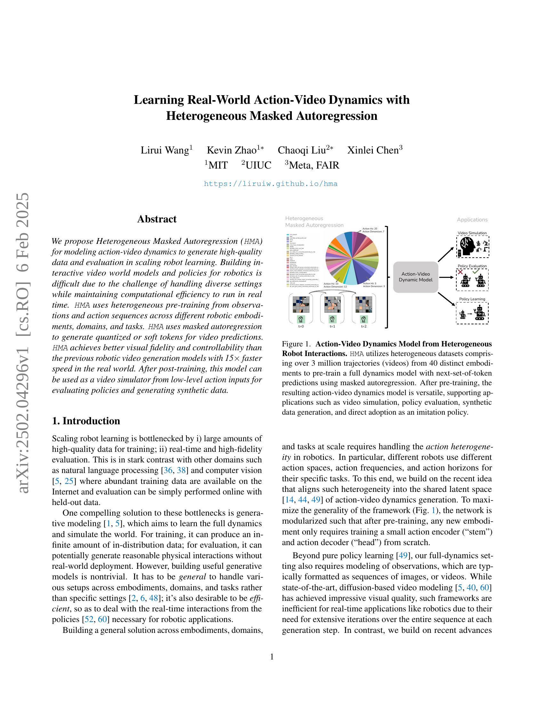
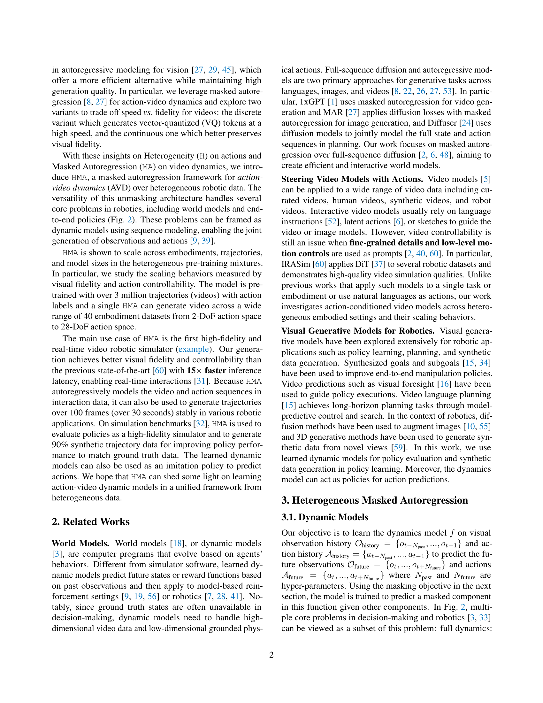
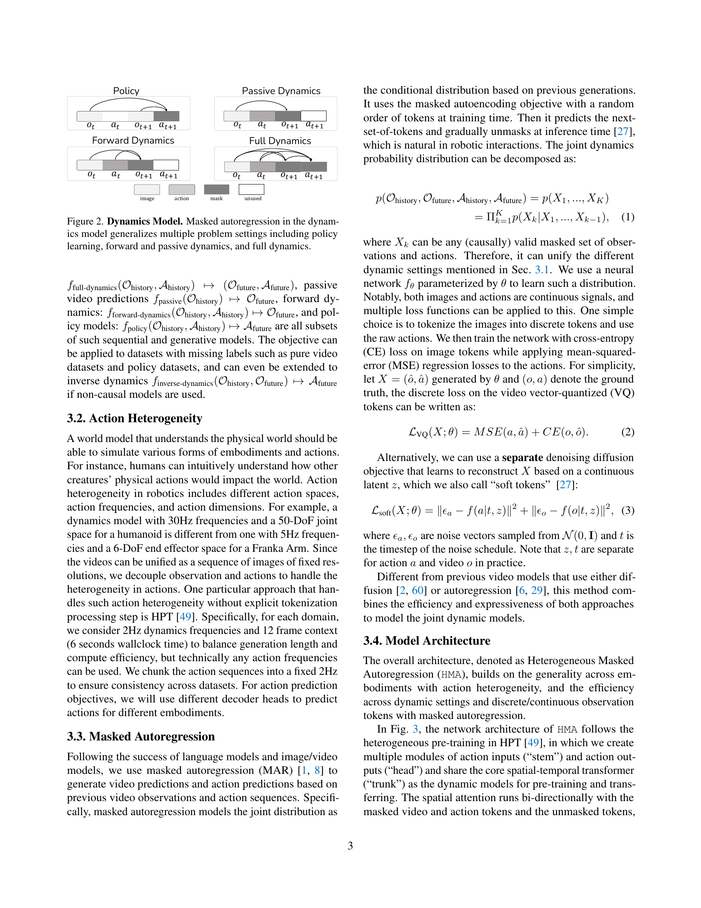
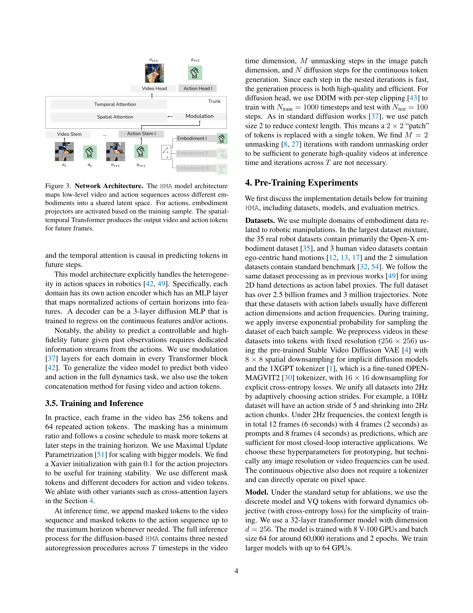
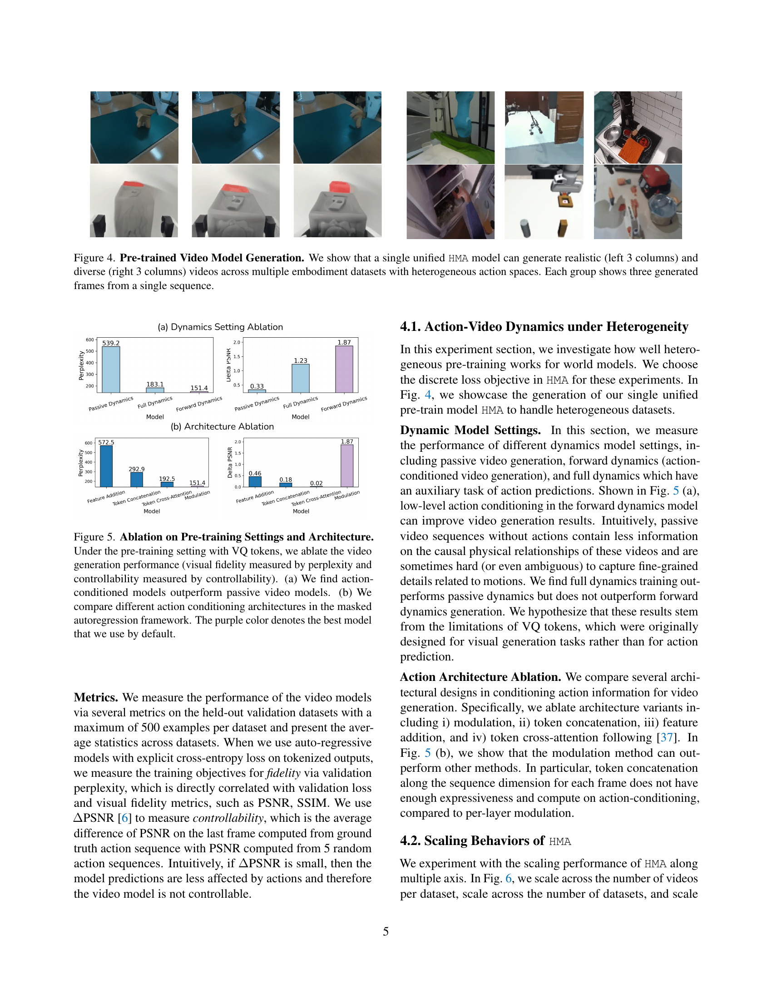
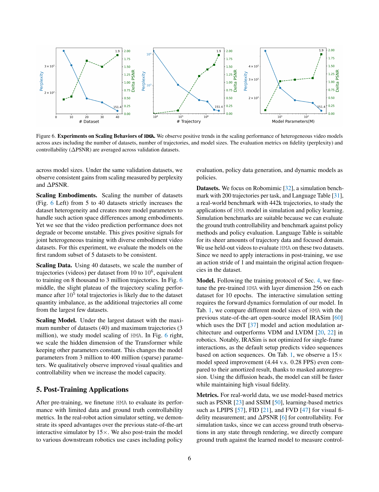
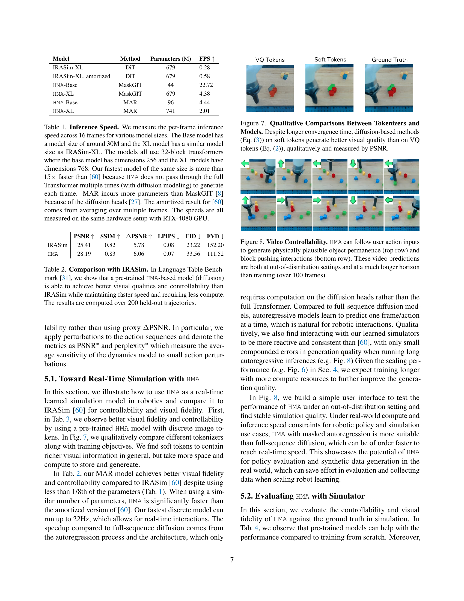
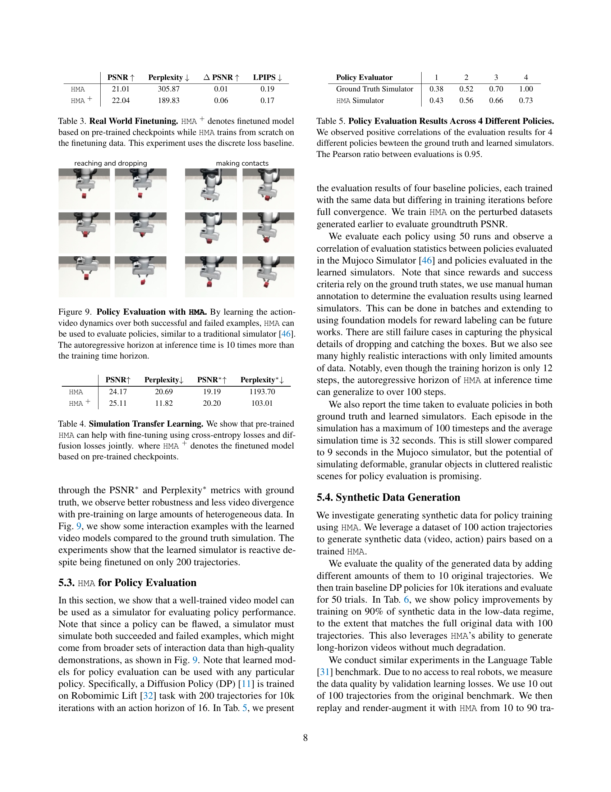
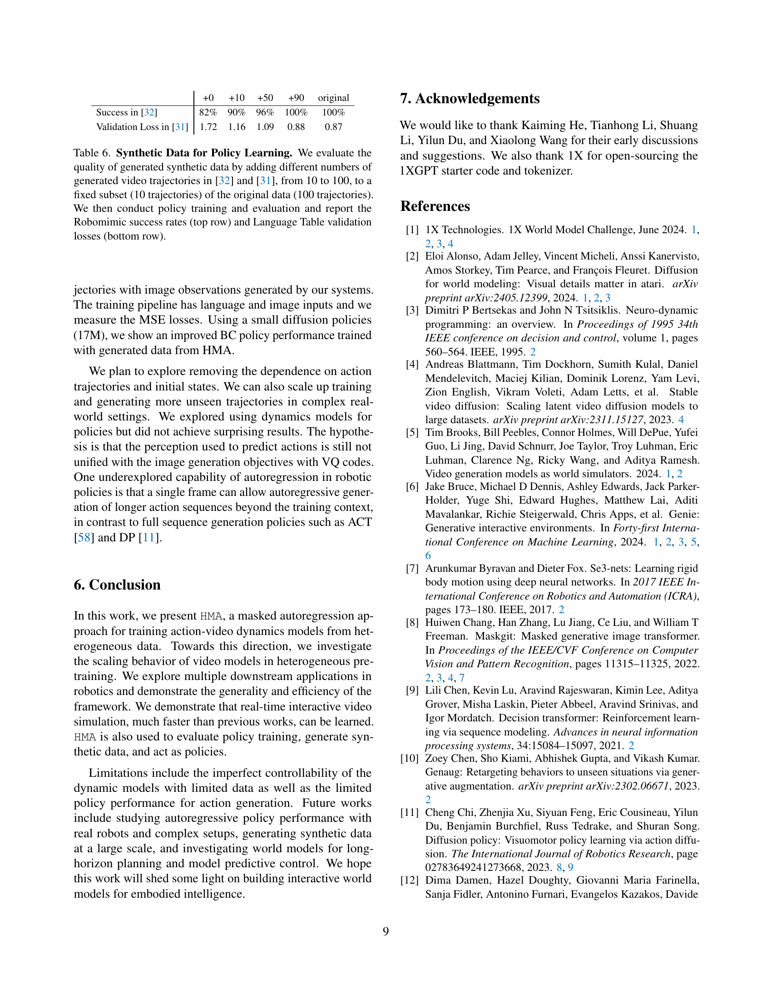
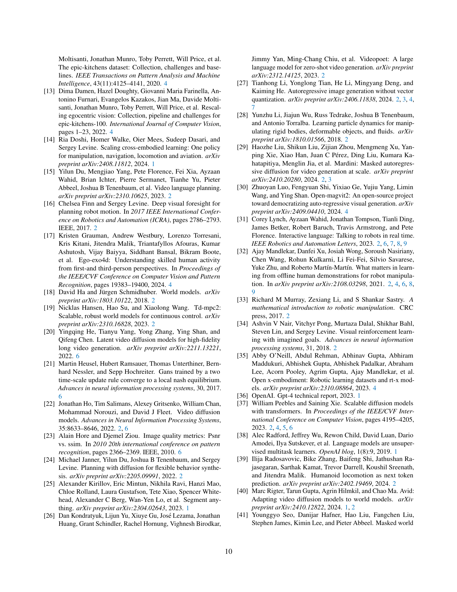
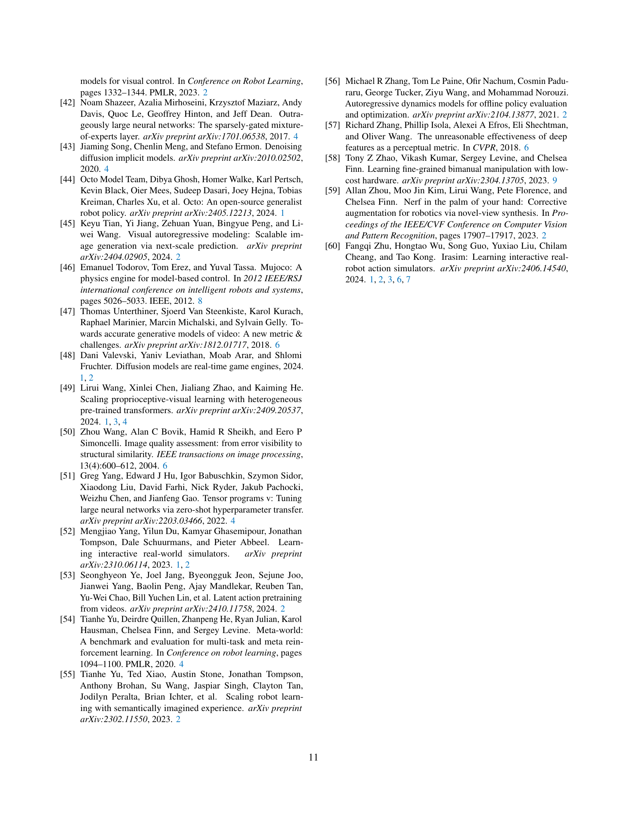
