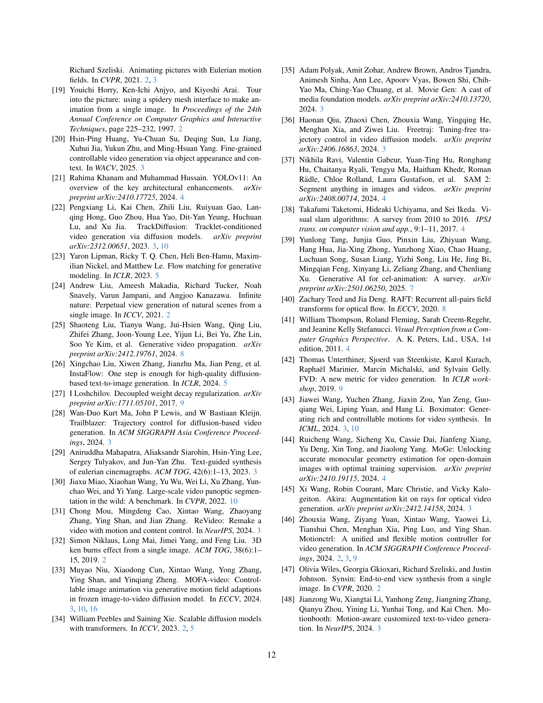

 


 2502.04299 
 Jinbo Xing et el. 
 
 🤗 2025-02-07 
 



↗ arXiv


↗ Hugging Face


### TL;DR



기존의 이미지-비디오 생성 모델들은 텍스트나 단순한 2D 정보만을 사용하여 모션을 제어하기 때문에 사용자의 의도를 정확히 반영하지 못하고, 결과물의 품질과 표현력이 떨어지는 문제가 있었습니다. 특히, 카메라와 객체의 움직임을 동시에 자연스럽게 제어하는 데 어려움이 있었습니다. 

본 논문에서는 이러한 문제를 해결하기 위해 사용자 제어가 가능한 새로운 이미지-비디오 생성 모델인 MotionCanvas를 제시합니다. MotionCanvas는 3D 공간적 이해를 바탕으로 사용자의 모션 디자인 의도를 효과적으로 포착하고, 이를 비디오 확산 모델에 활용할 수 있는 시공간적 모션 조건 신호로 변환합니다.  실험 결과, MotionCanvas는 다양한 실제 이미지 및 숏 디자인 시나리오에서 우수한 성능을 보였으며, 창의적인 콘텐츠 제작 워크플로우 개선에 기여할 수 있음을 보여주었습니다.



#### Key Takeaways


 사용자는 MotionCanvas를 통해 카메라 및 객체 모션을 직관적으로 제어하며, 영화적 영상 숏을 디자인할 수 있습니다. 



 본 논문에서 제시된 방법은 3D 공간적 이해를 바탕으로 하여, 제한적인 2D 정보만 사용하는 기존 방법에 비해 사용자의 의도를 더욱 정확하게 반영합니다. 



 MotionCanvas는 다양한 영상 편집 및 애니메이션 작업에 적용될 수 있으며, 창의적인 콘텐츠 제작 워크플로우 향상에 기여할 수 있습니다. 


#### Why does it matter?
본 논문은 **영상 합성 분야의 사용자 제어 및 창의적 워크플로우 개선**에 중요한 기여를 합니다.  **3D 공간적 이해를 바탕으로 한 직관적인 모션 제어**는 기존의 텍스트 기반 방법의 한계를 뛰어넘어, 사용자의 의도를 더욱 정확하게 반영하는 영상 생성을 가능하게 합니다. 또한 제시된 방법은 다양한 응용 분야로 확장 가능하며, **향후 연구를 위한 새로운 방향**을 제시합니다.  특히, **영상 편집 및 애니메이션 분야의 혁신**을 가져올 가능성이 높습니다.

------
#### Visual Insights

> 🔼 이 그림은 MotionCanvas가 다양한 카메라 움직임과 객체 움직임을 사용하여 정지 이미지를 애니메이션으로 만드는 방법을 보여줍니다.  'Inputs' 열에는 입력으로 사용된 정지 이미지가, 나머지 열들에는 각 열마다 다른 카메라 움직임(정지, 돌리 아웃, 오비트 R + 페데스털 업)을 적용한 결과 영상들이, 각 행마다 다른 객체 움직임을 적용한 결과 영상들이 표시됩니다.  즉, 열은 카메라 움직임의 다양성을, 행은 객체 움직임의 다양성을 보여줍니다. 영상 재생을 위해서는 Adobe Acrobat Reader를 사용해야 합니다.
> 

> 
read the caption

> Figure 1: MotionCanvas offers comprehensive motion controls to animate a static image (the “Inputs” column) with various types of camera movements and object motions. Note the different camera movements across columns and object motions across rows. Please use Adobe Acrobat Reader for video playback.
> 


| Method | RotErr ↓ | TransErr ↓ | CamMC ↓ | FVD ↓ | FID ↓ |
|---|---|---|---|---|---| 
| MotionCtrl | 0.8460 | 0.2567 | 1.2455 | 48.03 | 11.34 |
| CameraCtrl | 0.6355 | 0.2332 | 0.9532 | 39.46 | 13.14 |
| Ours* | **0.6334** | **0.2188** | **0.9453** | **34.09** | **7.60** |

> 🔼 표 1은 RealEstate10K 테스트 세트(1,000개의 비디오)에서 최첨단 방법들과 비교하여 제안된 방법의 정량적 성능을 보여줍니다.  RotErr(회전 오차), TransErr(병진 오차), CamMC(카메라 운동 일치), FVD(프레쉐 비디오 거리), FID(프레쉐 인셉션 거리) 등 다섯 가지 지표를 사용하여 비교 분석했습니다.  표에서 ∗ 표시는 제로샷(zero-shot) 성능을 나타냅니다. 즉, 사전 훈련 없이 테스트 세트에 직접 적용한 결과를 의미합니다.
> 

> 
read the caption

> Table 1: Quantitative comparison with state-of-the-art methods on the RealEstate10K test set (1K). ∗ denotes zero-shot performance.
> 

### In-depth insights

#### 3D-Aware Motion
이 논문에서 3D-Aware Motion은 단순히 3차원 공간에서의 움직임을 의미하는 것을 넘어서, **카메라와 물체의 움직임을 공간적으로 정확하게 이해하고 조절하는 기술**을 의미합니다.  이는 단순히 2D 평면에서의 픽셀 이동이 아닌, **실제 3차원 공간에서의 카메라 궤적과 물체의 위치, 자세 변화를 정확하게 반영**하여 보다 사실적이고 자연스러운 영상을 생성하는 데 중요한 역할을 합니다.  **MotionCanvas는 사용자의 2D 입력을 3D 공간 정보로 변환하는 모듈을 통해 사용자의 의도를 정확하게 파악**하고, 이를 바탕으로 **카메라와 물체의 움직임을 통합적으로 제어**합니다.  결과적으로,  **보다 현실적이고 자연스러운 움직임을 가진 영상 생성**을 가능하게 하며, 단순한 애니메이션 제작을 넘어선 **실제 영화 촬영과 같은 정교한 영상 연출**을 가능하게 합니다.  특히, **객체의 국소적 움직임(local motion)까지 고려**하여, 보다 풍부하고 디테일한 움직임을 구현하는 데 큰 강점이 있습니다. 이는 기존의 2D 기반 접근 방식의 한계를 극복하고 **보다 현실적인 시각적 경험**을 제공하는 핵심 요소입니다.

#### Signal Translation
본 논문에서 제시된 "시그널 변환(Signal Translation)" 모듈은 **사용자의 3D 시각적 의도를 2D 영상 신호로 효과적으로 변환**하는 핵심 역할을 합니다.  이는 사용자가 3D 공간에서 자유롭게 카메라와 물체의 움직임을 디자인하더라도, 실제 영상 생성 모델은 2D 화면 정보만을 처리할 수 있다는 점을 고려한 것입니다.  **3D 시각적 정보를 2D 화면 좌표계의 제약 조건에 맞춰 변환**하는 과정은, 단순한 좌표 변환을 넘어 카메라 움직임과 물체의 움직임을 고려한 복합적인 처리 과정을 포함합니다.  **심도 정보(depth)를 활용**하여 물체의 3D 공간 위치를 추정하고, 카메라 움직임에 따른 투영 변환을 적용하여 정확한 2D 움직임 신호를 생성합니다.  이러한 변환 과정은 사용자의 의도를 정확하게 반영하는 고품질의 영상 생성에 필수적이며, **신경망 기반의 영상 생성 모델의 한계를 극복**하는 중요한 기술적 진전으로 볼 수 있습니다. 특히, **카메라와 물체의 움직임을 통합적으로 고려**하는 점은 기존의 연구들에서 찾아보기 힘든 차별점이며, 자연스러운 영상 생성을 위한 핵심 요소입니다.  **이 모듈의 효율성과 정확성은 다양한 실험 결과**를 통해 검증되었고, **창의적인 영상 제작을 위한 워크플로우 개선**에 크게 기여할 것으로 예상됩니다.

#### User-Guided I2V
 사용자 가이드 I2V는 정지 이미지를 비디오로 변환하는 과정에서 **사용자의 의도와 창의성을 최대한 반영**하는 기술입니다. 기존의 자동화된 I2V 시스템은 사용자의 개입 없이 이미지의 특징을 바탕으로 비디오를 생성하지만, 사용자 가이드 I2V는 사용자가 **직접적으로 카메라 움직임, 객체의 움직임, 그리고 시간적 요소까지 제어**할 수 있도록 설계되었습니다.  이는 사용자에게 **훨씬 더 높은 수준의 창작 자율성**을 부여하여 보다 다양하고 정교한 비디오 제작을 가능하게 합니다.  특히 영화 제작, 광고, 게임 등의 분야에서 **시네마틱한 영상 연출**이 중요한 경우, 사용자 가이드 I2V는 **직관적이고 효율적인 제작 도구**로 활용될 수 있습니다.  **3D 공간에 대한 이해를 바탕**으로 설계된 인터페이스는 사용자가 쉽고 효과적으로 자신이 원하는 비디오를 만들 수 있도록 지원합니다.  하지만, **정확하고 효율적인 사용자 입력 해석**이 여전히 기술적 과제로 남아 있으며,  **다양한 객체와 복잡한 움직임에 대한 처리**를 개선하는 연구가 지속적으로 필요합니다.  **실시간 처리 속도 개선**과 **다양한 사용자 인터페이스** 개발 또한 중요한 연구 방향입니다.

#### Motion Synthesis
본 논문에서 제시된 영상 합성 방법은 **사용자 제어 가능한 움직임 생성**에 초점을 맞추고 있습니다.  이는 단순히 정적인 이미지에서 동적인 비디오를 생성하는 것을 넘어, 카메라 움직임과 객체의 움직임을 사용자가 직관적으로 제어할 수 있도록 하는 데 있습니다.  **3D 공간에 대한 사용자의 의도를 2D 화면 공간으로 효과적으로 변환**하는 모션 신호 변환 모듈이 핵심이며, 이를 통해 사용자는 3D 공간에서의 움직임을 계획하고, 이를 시스템이 정확하게 해석하여 비디오 생성 모델에 전달할 수 있도록 합니다.  **깊이 정보를 활용한 합성** 또한 중요한 요소로, 정확한 움직임 생성과 자연스러운 영상 합성에 기여합니다.  결과적으로, 사용자는 **직관적인 인터페이스를 통해 다양한 시나리오에서 영화적인 숏을 디자인**할 수 있으며, 이는 다양한 영상 편집 및 제작 분야에 널리 응용될 수 있는 잠재력을 지닌 기술입니다.  **모델 학습 과정** 또한 중요한데,  실제 영상 데이터를 기반으로 학습함으로써 높은 수준의 현실감과 정확도를 확보하고 있으며, 특히 카메라 및 객체의 움직임을  통합적으로 제어하는 데 탁월한 성능을 보입니다.

#### Future I2V Research
미래의 I2V (이미지-투-비디오) 연구는 **사용자 제어의 정교함과 실시간 성능 향상**에 초점을 맞춰야 합니다.  현재의 I2V 모델은 텍스트나 간단한 제스처를 통해 동작을 제어하지만, **더욱 세밀한 움직임 제어**를 위해서는 3D 공간 이해와 물리적 시뮬레이션 기술의 통합이 필수적입니다.  **물리 기반 모델링**을 통해 현실적인 객체의 움직임을 생성하고, **실시간 피드백 시스템**을 구축하여 사용자가 직접 영상 제작 과정에 참여할 수 있도록 해야 합니다. 또한, 다양한 스타일과 미학적 요소를 제어할 수 있는 **다양한 조절 매개변수**를 제공하고, **개인화된 I2V 경험**을 제공하는 방향으로 연구가 진행되어야 합니다.  **데이터 효율성** 또한 중요한 과제이며, 적은 양의 데이터로 고품질 영상을 생성하는 기술 개발이 필요합니다.  최종적으로는 **다양한 분야와의 융합**을 통해 I2V 기술의 활용성을 더욱 확장해야 합니다.  예를 들어, 영화, 게임, 광고, 교육 등 다양한 분야에서 실시간으로 고품질 영상을 제작하고 편집하는 데 활용될 수 있습니다.

### More visual insights

More on figures

> 🔼 그림 2는 MotionCanvas의 개요를 보여줍니다. 입력 이미지와 고차원적인 3D 공간의 동작 의도가 주어지면 MotionCanvas는 깊이 기반 합성 및 계층적 변환을 활용하여 Motion Signal Translation 모듈을 통해 카메라 및 객체의 움직임(시간 포함)을 화면 공간으로 분해하고 변환합니다. 이러한 화면 공간의 동작 신호는 이후 비디오 생성 모델에 전달되어 최종 시네마틱 샷을 생성합니다.  간략히 말해, 사용자가 원하는 움직임을 3D 공간에서 디자인하고, MotionCanvas가 이를 2D 화면에 맞게 변환하여 비디오로 생성하는 과정을 보여줍니다.
> 

> 
read the caption

> Figure 2: Overview of MotionCanvas. Given an input image and high-level scene-space motion intent, MotionCanvas decomposes and translates the motion (camera and object motion with their timing) into screen space by leveraging the depth-based synthesis and hierarchical transformation with the Motion Signal Translation module. These screen-space motion signals are subsequently passed to a video generation model to produce the final cinematic shots.
> 

> 🔼 그림 3은 제안된 모션 조건부 비디오 생성 모델의 구조를 보여줍니다. 입력 이미지와 경계 상자 색상 프레임은 3D-VAE 인코더를 통해 토큰화된 후 합쳐집니다. 그 결과 토큰은 다른 조건부 토큰과 연결되어 DiT 기반 비디오 생성 모델에 입력됩니다. 이 과정을 통해 사용자의 의도를 반영한 움직임을 가진 비디오를 생성합니다.  즉, 이미지와 경계상자 정보가 3D 변분 오토인코더(VAE)를 통해 벡터화되고, 다른 조건 정보들(텍스트, 타임라인 등)과 결합되어 DiT(Diffusion Transformer) 모델에 입력되어 비디오가 생성되는 과정을 보여줍니다.
> 

> 
read the caption

> Figure 3: Illustration of our motion-conditioned video generation model. The input image and bbox color frames are tokenized via a 3D-VAE encoder and then summed. The resultant tokens are concatenated with other conditional tokens, and fed into the DiT-based video generation model.
> 

> 🔼 이 그림은 MotionCanvas가 다양한 종류의 카메라 및 객체 움직임 제어를 결합하여 생성한 다양한 촬영 디자인을 보여줍니다. 각 행은 객체의 움직임 유형(정지, 움직임)을 나타내고, 각 열은 카메라의 움직임 유형(정지, 돌리 아웃, 오비트+페데스탈 업)을 나타냅니다. 이를 통해 사용자가 다양한 카메라 움직임과 객체 움직임을 조합하여 원하는 시네마틱 효과를 만들 수 있음을 보여줍니다.
> 

> 
read the caption

> Figure 4: Shot design generated by our MotionCanvas under various types of joint camera and object motion controls.
> 

> 🔼 본 그림은 MotionCanvas를 사용하여 생성된 장편 비디오를 보여줍니다. 각 비디오는 동일한 복잡한 카메라 움직임 시퀀스를 공유하지만, 각 경우에 다른 개체 움직임 제어를 적용하여 다양한 시각적 결과물을 보여줍니다. 이를 통해 사용자가 카메라 움직임을 고정하고 개체 움직임을 변경하거나, 그 반대로 할 수 있는 MotionCanvas의 유연성과 제어 기능을 강조합니다.
> 

> 
read the caption

> Figure 5: Long videos with the same complex sequences of camera motion while different object motion controls in each case generated by our MotionCanvas.
> 

> 🔼 그림 6은 카메라 제어와 조화를 이루는 다양하고 세밀한 로컬 모션 제어를 사용하여 생성된 비디오를 보여줍니다. 상단은 다양한 로컬 모션 제어만을 적용한 결과를, 하단은 카메라 모션 제어와 함께 적용한 결과를 보여줍니다. 이를 통해 사용자가 원하는 다양한 시나리오를 구현할 수 있는 MotionCanvas의 유연성을 보여줍니다.
> 

> 
read the caption

> Figure 6: Generated videos with diverse and fine-grained local motion controls (upper), and in coordination with camera motion control (bottom).
> 

> 🔼 그림 7은 제안된 방법을 적용했을 때의 결과를 보여줍니다. 위쪽은 모션 전이를, 아래쪽은 개체 변경, 추가 및 제거를 통한 비디오 편집 결과를 보여줍니다.  위쪽의 모션 전이는 소스 비디오의 움직임을 입력 이미지에 적용하여 애니메이션을 생성하는 것을 보여줍니다. 아래쪽의 비디오 편집 예시는 개체를 추가하거나 제거하거나, 기존 개체의 모양이나 위치를 변경하는 등의 편집 작업을 보여줍니다.  두 경우 모두, 제안된 방법이 입력 이미지에 대한 다양한 비디오 편집 작업을 자연스럽게 수행할 수 있음을 보여줍니다.
> 

> 
read the caption

> Figure 7: Results when our method is applied for: (upper) motion transfer, and (bottom) video editing for changing objects, adding and removing objects.
> 

> 🔼 그림 8은 제안된 MotionCanvas 방법과 기존 기준 방법들의 카메라 움직임 제어 성능을 비교한 것입니다. 특히, 돌리줌 효과와 같이 복잡한 촬영 기법을 사용하는 경우에 제안된 방법이 기존 방법들보다 의도한 카메라 움직임을 더 잘 따라가는 것을 보여줍니다. 첫 번째 예시는 일반적인 카메라 움직임을, 두 번째 예시는 돌리줌 효과를 사용한 복잡한 카메라 움직임을 보여줍니다. 결과적으로 MotionCanvas가 다양한 유형의 카메라 움직임에 대해 더욱 정확하고 효과적인 제어 성능을 제공함을 시각적으로 보여줍니다.
> 

> 
read the caption

> Figure 8: Camera motion control comparison. Compared to existing baselines, our method performs better at following the intended camera motion, especially for complex shot type such as the “Dolly-Zoom” effect (second example).
> 

> 🔼 그림 9는 DragAnything, MOFA-Video, TrackDiffusion, Ourscoord, 그리고 MotionCanvas라는 다섯 가지 서로 다른 방법으로 생성된 비디오의 시각적 비교 결과를 보여줍니다. 각 방법은 이미지 애니메이션을 위한 다른 접근 방식을 사용하며, 이 그림에서는 각 방법이 생성한 비디오의 결과물을 비교하여 차이점을 시각적으로 보여줍니다. 이를 통해 사용자가 각 방법의 장단점을 보다 직관적으로 이해하고, 자신에게 적합한 방법을 선택하는 데 도움이 될 수 있습니다. 특히, 'Ourscoord'는 본 논문에서 제안하는 방법의 중간 단계 결과물이며, 'MotionCanvas'는 최종 결과물을 나타냅니다. 따라서 이 그림은 본 논문에서 제안하는 방법의 성능을 다른 기존 방법들과 비교하여 보여주는 중요한 역할을 합니다.
> 

> 
read the caption

> Figure 9: Visual comparison of the resulatant videos from DragAnything, MOFA-Video, TrackDiffusion, Ourscoordcoord{}_{\text{coord}}start_FLOATSUBSCRIPT coord end_FLOATSUBSCRIPT, and our MotionCanvas.
> 

More on tables


| Metric | DragAnything | MOFA-Video | TrackDiffusion | Ourscoord | Oursmap |
|---|---|---|---|---|---| 
| ObjMC↓ | 32.37 | 35.94 | 30.49 | 47.73 | **25.72** |
| FID↓ | 64.32 | 54.58 | 58.08 | 46.27 | **42.47** |
> 🔼 VIPSeg 데이터셋에서 개체의 움직임을 제어하는 다양한 방법들의 정량적 비교 결과를 보여주는 표입니다.  DragAnything, MOFA-Video, TrackDiffusion, OurScoord 그리고 본 논문에서 제안하는 MotionCanvas 방법의 세 가지 지표 (ObjMC, FID) 에 대한 수치를 비교하여 각 방법의 성능을 평가합니다. ObjMC는 개체 움직임 제어의 정확성을, FID는 생성된 비디오의 화질을 나타냅니다. 이 표는 MotionCanvas가 다른 방법들에 비해 개체 움직임 제어의 정확성과 생성 비디오의 화질 모두에서 우수한 성능을 보임을 보여줍니다.
> 

> 
read the caption

> Table 2: Quantitative comparison for object motion control on VIPSeg.
> 


| Method | Motion Adherence ↑ | Motion Quality ↑ | Frame Fidelity ↑ |
|---|---|---|---|
| DragAnything | 14.29% | 10.10% | 9.90% |
| MOFA-Video | 10.48% | 10.86% | 12.95% |
| Ours | 75.24% | 79.05% | 77.14% |
> 🔼 본 표는 사용자 연구 결과를 보여줍니다.  세 가지 측면(모션 준수도, 모션 품질, 프레임 충실도)에 대한 선호도 비율을 정량적으로 제시하여 MotionCanvas의 성능을 평가합니다.  각 측면에 대한 선호도는 백분율로 표시되며, 사용자들이 MotionCanvas가 생성한 비디오를 평가할 때 얼마나 각 측면에 만족했는지를 보여줍니다.
> 

> 
read the caption

> Table 3: User study statistics of the preference rate for motion adherence, motion quality, and frame fidelity.
> 


| Variant | RotErr ↓ | TransErr ↓ | FVD ↓ | + Tokens(%) ↓ | Latency ↓ |
|---|---|---|---|---|---| 
| Gaussian map* | 0.8250 | 0.2551 | 116.47 | 99.7 | 75s |
| Plucker | **0.5965** | 0.2244 | **25.71** | 319.2 | 210s |
| Traj. coeff. (Ours)* | 0.6334 | **0.2188** | 34.09 | **1.1** | **32s** |
> 🔼 이 표는 본 논문의 기본 모델에 대해 서로 다른 카메라 움직임 표현 방식을 적용한 실험 결과를 보여줍니다.  표에는 가우시안 맵, 플루커 표현, 그리고 논문에서 제안하는 DCT 계수 기반의 경로 인코딩 등 세 가지 카메라 움직임 표현 방식에 대한 회전 오차, 병진 오차, FVD (Fréchet Video Distance) 및 추가 토큰 수를 비교 분석한 결과가 포함되어 있습니다.  특히, ∗ 표시는 제로샷 성능(Zero-shot performance)을 나타내며, 이는 별도의 사전 훈련 없이도 좋은 결과를 얻었음을 의미합니다.  이를 통해 본 논문에서 제안하는 방법의 효율성과 일반화 능력을 확인할 수 있습니다.
> 

> 
read the caption

> Table 4: Ablation study of applying different camera motion representations on our base model. ∗: Zero-shot performance.
> 

### Full paper



