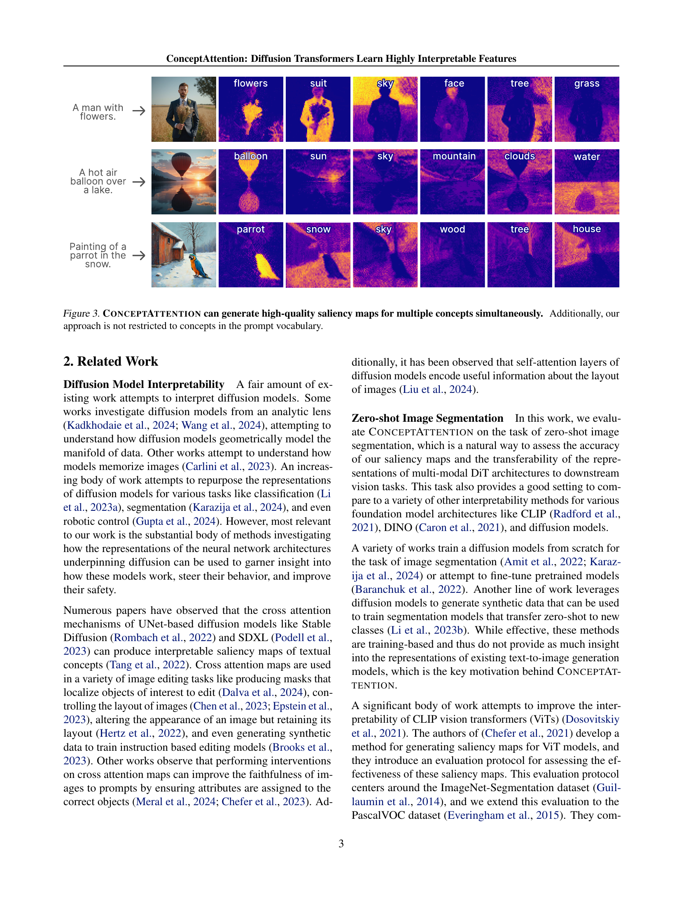
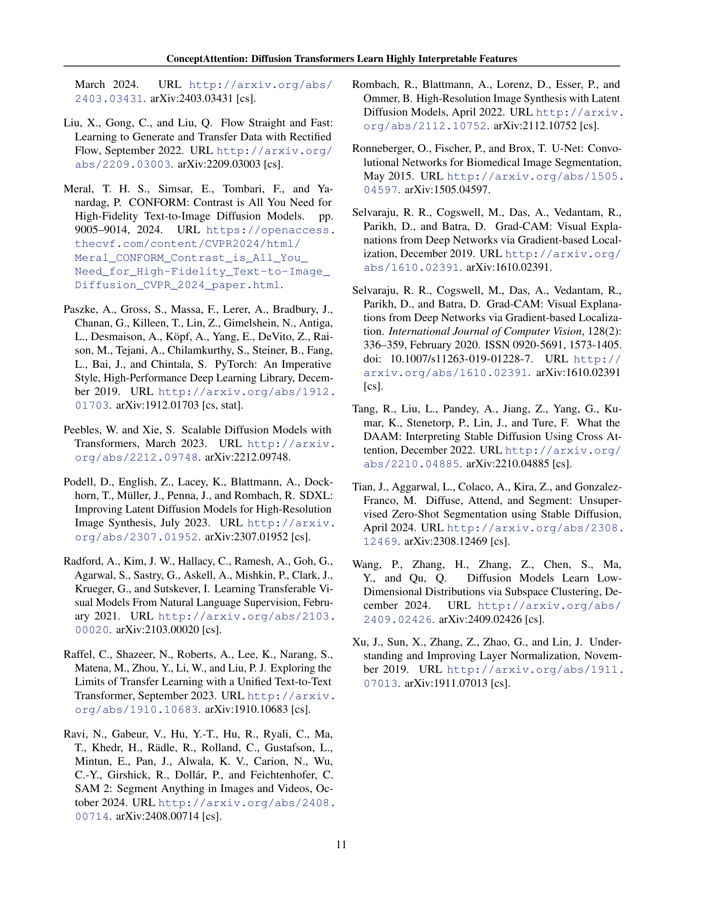

 


 2502.04320 
 Alec Helbling et el. 
 
 🤗 2025-02-07 
 



↗ arXiv


↗ Hugging Face


### TL;DR



최근 텍스트-이미지 생성 분야에서 다중 모달 확산 변환기(Diffusion Transformers, DiT) 기반 모델이 급부상하고 있지만, 이러한 모델의 내부 동작 과정을 이해하기 어렵다는 한계가 존재합니다. 기존 연구는 주로 UNet 기반 모델의 해석 가능성에 초점을 맞춰왔으며, DiT 모델에 대한 연구는 미흡했습니다. 특히, DiT 모델의 풍부한 표현력을 활용하여 이미지 내 텍스트 개념의 위치를 정확하게 파악하고, 모델의 내부 동작 과정을 보다 명확하게 이해할 수 있는 방법이 부족했습니다.

본 논문에서는 ConceptAttention이라는 새로운 방법을 제시합니다. ConceptAttention은 DiT 모델의 어텐션 레이어를 활용하여 고품질의 설명도를 생성하는데, 기존 방식보다 훨씬 더 정확하게 이미지 내 텍스트 개념의 위치를 찾아냅니다.  **ConceptAttention은 추가적인 학습 없이 DiT의 기존 파라미터를 재사용**하여 효율성을 높였으며, 제로샷 이미지 분할 작업에서 **최첨단 성능**을 달성했습니다.  이는 DiT 모델의 표현력이 영상 분할과 같은 다른 비전 작업에도 효과적으로 전이될 수 있음을 보여주는 중요한 결과입니다. 이를 통해 **생성 AI 시스템의 해석 가능성, 제어 가능성 및 신뢰도**를 향상시킬 수 있습니다.



#### Key Takeaways


 ConceptAttention은 DiT의 어텐션 레이어를 활용하여 이미지 내 텍스트 개념의 위치를 정확하게 식별하는 고품질 설명도(saliency map)를 생성합니다. 



 ConceptAttention은 기존의 크로스 어텐션 메커니즘보다 훨씬 더 선명한 설명도를 생성하며, 제로샷 이미지 분할 벤치마크에서 최첨단 성능을 달성합니다. 



 본 연구는 Flux와 같은 다중 모달 DiT 모델의 표현이 영상 분할과 같은 비전 작업에 매우 효과적으로 전이될 수 있음을 보여주는 최초의 증거를 제공합니다. 


#### Why does it matter?
본 논문은 **다중 모달 확산 변환기(DiT)**의 해석 가능성을 높이는 새로운 방법을 제시하여, **영상 분할**과 같은 비전 작업에 대한 DiT 표현의 전이성을 보여주는 최초의 증거를 제시합니다. 이는 **생성 AI 시스템의 해석 가능성, 제어 가능성 및 신뢰도 향상**에 기여하는 중요한 연구입니다.  DiT 기반 모델의 해석 가능성을 향상시키는 방법에 대한 연구는 현재 생성 AI 연구의 중요한 트렌드이며,  본 논문은 이 분야의 **새로운 연구 방향**을 제시합니다.

------
#### Visual Insights

> 🔼 그림 1은 ConceptAttention이 이미지 내 텍스트 개념의 존재 위치를 정확하게 찾아내는 정확도 높은 셀런시 맵을 생성하는 것을 보여줍니다. Flux의 원시 교차 어텐션, SDXL을 사용한 DAAM(Tang et al., 2022), 그리고 CLIP을 위한 TextSpan(Gandelsman et al., 2024)과의 비교 결과를 보여줍니다.  각 방법은 'A dragon on a hill' 이라는 프롬프트에 대한 이미지에 대한 셀런시 맵을 생성하며,  ConceptAttention은 다른 방법들에 비해 개념(dragon, rock, sun, clouds)을 더욱 정확하게 이미지 영역에 매핑하는 것을 확인할 수 있습니다. 이는 ConceptAttention이 diffusion transformer의 어텐션 레이어를 활용하여 이미지 내 개념의 위치를 효과적으로 파악함을 시사합니다.
> 

> 
read the caption

> Figure 1: ConceptAttention produces saliency maps that precisely localize the presence of textual concepts in images. We compare Flux raw cross attention, DAAM (Tang et al., 2022) with SDXL, and TextSpan (Gandelsman et al., 2024) for CLIP.
> 


| Method | Architecture | ImageNet-Segmentation Acc ↑ | ImageNet-Segmentation mIoU ↑ | ImageNet-Segmentation mAP ↑ | PascalVOC (Single Class) Acc ↑ | PascalVOC (Single Class) mIoU ↑ | PascalVOC (Single Class) mAP ↑ |
|---|---|---|---|---|---|---|---|
| LRP (Binder et al., 2016) | CLIP ViT | 51.09 | 32.89 | 55.68 | 48.77 | 31.44 | 52.89 |
| Partial-LRP (Binder et al., 2016) | CLIP ViT | 76.31 | 57.94 | 84.67 | 71.52 | 51.39 | 84.86 |
| Rollout (Abnar & Zuidema, 2020) | CLIP ViT | 73.54 | 55.42 | 84.76 | 69.81 | 51.26 | 85.34 |
| ViT Attention (Dosovitskiy et al., 2021) | CLIP ViT | 67.84 | 46.37 | 80.24 | 68.51 | 44.81 | 83.63 |
| GradCAM (Selvaraju et al., 2020) | CLIP ViT | 64.44 | 40.82 | 71.60 | 70.44 | 44.90 | 76.80 |
| TextSpan (Gandelsman et al., 2024) | CLIP ViT | 75.21 | 54.50 | 81.61 | 75.00 | 56.24 | 84.79 |
| TransInterp (Chefer et al., 2021) | CLIP ViT | 79.70 | 61.95 | 86.03 | 76.90 | 57.08 | 86.74 |
| DINO Attention (Caron et al., 2021) | DINO ViT | 81.97 | 69.44 | 86.12 | 80.71 | 64.33 | 88.90 |
| DAAM (Tang et al., 2022) | SDXL UNet | 78.47 | 64.56 | 88.79 | 72.76 | 55.95 | 88.34 |
| DAAM (Tang et al., 2022) | SD2 UNet | 64.52 | 47.62 | 78.01 | 64.28 | 45.01 | 83.04 |
| Flux Cross Attention | Flux DiT | 74.92 | 59.90 | 87.23 | 80.37 | 54.77 | 89.08 |
| ConceptAttention | Flux DiT | **83.07** | **71.04** | **90.45** | **87.85** | **76.45** | **90.19** |

> 🔼 표 1은 ImageNet-Segmentation 데이터셋과 Pascal VOC 데이터셋(단일 클래스)에서 ConceptAttention이 다양한 Diffusion, DINO, CLIP ViT 해석 가능성 방법들을 성능 면에서 능가함을 보여줍니다.  ConceptAttention의 정확도(Accuracy), 평균 IoU(mIoU), 평균 정밀도(mAP)를 다른 여러 방법들과 비교하여 제시합니다. 이 표는 제시된 방법들의 zero-shot 이미지 분할 성능을 비교 분석하여 ConceptAttention의 우수성을 수치적으로 보여주는 역할을 합니다.  다양한 기반 모델(Diffusion, DINO, CLIP)을 사용한 여러 해석 방법들과 비교하여 ConceptAttention의 성능 우위를 명확히 제시하고 있습니다.
> 

> 
read the caption

> Table 1: ConceptAttention outperforms a variety of Diffusion, DINO, and CLIP ViT interpretability methods on ImageNet-Segmentation and PascalVOC (Single Class).
> 

### In-depth insights

#### DiT Interpretability
본 논문은 확산 변환기(Diffusion Transformer, DiT)의 해석성에 대한 심도있는 논의를 제시합니다. **다양한 다중 모드 DiT 모델의 내부 메커니즘에 대한 이해 부족**은 해석성 향상을 위한 연구의 필요성을 강조합니다. 기존 연구들은 주로 UNet 기반 아키텍처에 초점을 맞추었으나, **DiT 기반 모델의 복잡성으로 인해 해석성 연구는 미흡**했습니다.  본 논문에서 제안하는 ConceptAttention은 DiT의 어텐션 레이어를 활용하여 **추가적인 학습 없이 이미지 내 텍스트 개념의 위치를 정확하게 파악하는 고품질 설명도(saliency map)를 생성**하는 방법을 제시합니다. DiT 어텐션 레이어의 출력 공간에서 선형 투영을 수행함으로써 기존 방식보다 훨씬 더 선명한 설명도를 얻을 수 있습니다. 이는 **DiT의 표현력이 이미지 이해에 매우 유용함**을 보여줍니다. ConceptAttention은 제로샷 이미지 분할 기준에서 최첨단 성능을 달성하며, 다양한 기반 모델들과 비교하여 DiT 표현의 우수성을 입증합니다.  결론적으로, **ConceptAttention은 DiT 모델의 해석성을 크게 향상**시키는 획기적인 방법이며, 이는 생성 AI 시스템의 신뢰성 및 투명성을 높이는 데 중요한 발걸음이 될 것입니다.

#### ConceptAttention
본 논문에서 제시된 "ConceptAttention"은 **멀티모달 확산 트랜스포머(DiT)의 해석성을 높이기 위한 혁신적인 방법**입니다. 기존의 크로스 어텐션 메커니즘과 달리, DiT 어텐션 레이어의 출력 공간에서 선형 투영을 수행하여 **텍스트 개념을 이미지 내에서 정확하게 찾아내는 고품질의 셀런시 맵을 생성**합니다. 추가적인 훈련 없이 DiT 파라미터를 재사용하여 문맥에 맞는 개념 임베딩을 생성하고, **제로샷 이미지 분할 작업에서 최첨단 성능**을 달성합니다. 이는 **DiT 모델의 표현력이 비전 작업에 효과적으로 전이될 수 있음**을 보여주는 중요한 발견입니다.  ConceptAttention은 이미지 해석뿐 아니라, 생성 모델의 투명성과 안전성 향상에도 기여할 것으로 기대됩니다.

#### Zero-Shot Seg
논문에서 "Zero-Shot Seg" 부분은 영상 분할(Image Segmentation) 작업에서 **사전 훈련 없이(zero-shot)** 새로운 클래스에 대한 예측을 수행하는 능력을 평가하는 실험 설계를 의미합니다.  이는 모델의 일반화 능력(generalization)과 개념적 이해(conceptual understanding)를 측정하는 중요한 지표가 됩니다.  **ConceptAttention** 방법은 이 Zero-Shot Seg 평가에서 기존 방법들을 상당히 능가하는 성능을 보여주는데, 이는 **DiT(Diffusion Transformer) 모델의 강력한 표현력과 ConceptAttention의 효율적인 개념 위치 파악 능력**을 잘 보여줍니다.  즉, 단순히 이미지의 특징을 추출하는 것을 넘어, 주어진 텍스트 설명에 따른 개념을 정확하게 이미지 내에서 찾아내는 능력을 입증한 것입니다.  **높은 정확도의 Zero-Shot Seg 성능은 ConceptAttention이 이미지 이해에 있어서 단순한 패턴 인식을 넘어 심층적인 개념적 이해를 달성했음을 시사**합니다.  이러한 결과는 **다양한 비전 과제에 대한 DiT 모델의 전이 학습 가능성**을 보여주는 중요한 발견입니다.

#### Attention Analysis
본 논문에서는 **어텐션 분석**이라는 제목의 섹션에서 다양한 멀티모달 확산 트랜스포머(DiT) 모델의 어텐션 메커니즘을 심층적으로 분석하고, 그 결과를 바탕으로 **고품질의 설명가능성(interpretability)**을 갖는 셀런시 맵을 생성하는 새로운 방법인 ConceptAttention을 제안합니다.  **기존의 크로스 어텐션 기반 방법론과 비교하여 ConceptAttention은 DiT 어텐션 레이어의 출력 공간에서 선형 투영을 수행함으로써 훨씬 더 선명하고 정확한 셀런시 맵을 생성**합니다. 특히, 제로샷 이미지 분할 작업에서 ConceptAttention은 기존 방법들을 상당히 능가하는 성능을 보이며, 이는 DiT 모델의 표현 능력이 비전 작업에 효과적으로 전이될 수 있음을 보여줍니다.  **ConceptAttention의 핵심은 DiT의 멀티모달 어텐션 레이어의 출력 벡터를 활용하여 문맥화된 개념 임베딩을 생성**하고, 이를 이미지 패치와 결합하여 고품질의 셀런시 맵을 생성하는 것입니다.  이러한 분석 결과는 DiT 모델이 **단순히 이미지 생성만이 아니라 이미지 이해에도 탁월한 능력**을 갖고 있음을 시사하며, 향후 설명가능한 AI 시스템 개발에 중요한 시사점을 제공합니다.  **ConceptAttention은 추가적인 학습 없이 DiT 모델의 기존 파라미터만을 활용**하기 때문에 경량화 및 효율성 측면에서도 장점을 갖습니다.

#### Future Work
본 논문의 "미래 연구" 부분에 대한 심도있는 고찰은 다음과 같습니다. **ConceptAttention의 확장성**을 다양한 모달리티(예: 오디오, 비디오)로 확대하고, **다중 개념의 동시 위치 파악 성능**을 개선하는 연구가 필요합니다.  **대규모 데이터셋**을 이용한 추가 실험을 통해 일반화 성능을 검증하고, **다양한 diffusion model 아키텍처**에 대한 적용 가능성을 탐구해야 합니다. **ConceptAttention의 해석성**을 더욱 강화하기 위해, 생성된 saliency map의 신뢰도를 정량적으로 평가하는 지표 개발과,  **인과 관계를 명확히 규명하는 기술**이 연구되어야 합니다.  또한, **ConceptAttention을 활용한 downstream task** (예: 이미지 편집, 생성)에 대한 응용 연구가 필요하며,  **윤리적 고려 사항**을 포함한 책임있는 AI 시스템 개발에 대한 연구가 필수적입니다.  **특히, 편향된 데이터로 인한 saliency map의 편향 문제**에 대한 심층적인 분석과 해결책 모색이 중요합니다.

### More visual insights

More on figures

> 🔼 그림 2는 ConceptAttention이 어떻게 다중 모드 확산 트랜스포머(DiT)를 향상시키는지 보여줍니다. 왼쪽 패널은 수정되지 않은 다중 모드 어텐션(MMAttn) 레이어가 프롬프트 토큰과 이미지 토큰을 처리하는 과정을 나타냅니다. 오른쪽 패널에서는 ConceptAttention이 이미지의 외관에 영향을 미치지 않으면서 이러한 레이어를 증강하여 문맥화된 개념 토큰 집합을 생성하는 과정을 보여줍니다. 이러한 개념 토큰들은 셀리언시 맵을 생성하는 데 사용됩니다.
> 

> 
read the caption

> Figure 2: ConceptAttention augments multi-modal DiTs with a sequence of concept embeddings that can be used to produce saliency maps. (Left) An unmodified multi-modal attention (MMAttn) layer processes both prompt and image tokens. (Right) ConceptAttention augments these layers without impacting the image appearance to create a set of contextualized concept tokens.
> 

> 🔼 그림 3은 ConceptAttention이 여러 개념에 대한 고품질의 중요도 지도를 동시에 생성할 수 있음을 보여줍니다.  특히, 이 방법은 프롬프트 어휘에 포함되지 않은 개념에도 적용될 수 있다는 것을 강조합니다.  여러 개념(꽃, 정장, 하늘, 얼굴, 나무, 풀, 풍선, 태양, 산, 구름, 물, 앵무새, 눈, 나무, 집 등)이 이미지 내에서 정확하게 위치를 파악하여 표시되는 것을 확인할 수 있습니다. 이는 ConceptAttention의 강력한 개념 국재화 능력을 보여주는 예시입니다.  이 그림은 모델이 프롬프트에 명시적으로 포함되지 않은 개념도 이미지에서 식별하고 시각화할 수 있음을 시사합니다.
> 

> 
read the caption

> Figure 3: ConceptAttention can generate high-quality saliency maps for multiple concepts simultaneously.  Additionally, our approach is not restricted to concepts in the prompt vocabulary.
> 

> 🔼 그림 4는 다중 모드 어텐션 메커니즘의 작동 방식을 보여줍니다. (a)는 기존의 MMAttn (다중 모드 어텐션)이 프롬프트 토큰과 이미지 토큰 간의 상호 작용을 보여줍니다.  크로스 어텐션과 셀프 어텐션을 통해 프롬프트와 이미지 정보가 서로 영향을 주고받습니다. 반면 (b)의 ConceptAttention은 개념 토큰이 다른 개념 토큰과 이미지 토큰으로부터 정보를 받지만, 그 반대는 되지 않는다는 점을 보여줍니다.  이는 개념 토큰이 이미지의 특징을 설명하는 데 집중하도록 설계되었음을 의미합니다.  즉, 이미지와 프롬프트가 개념 토큰에 영향을 주지만, 개념 토큰은 이미지와 프롬프트에 영향을 주지 않습니다.
> 

> 
read the caption

> Figure 4: (a) MMAttn combines cross and self attention operations between the prompt and image tokens. (b) Our ConceptAttention allows the concept tokens to incorporate information from other concept tokens and the image tokens, but not the other way around.
> 

> 🔼 그림 5는 제안된 ConceptAttention 방법과 다른 여러 해석 가능성 방법의 성능을 ImageNet-Segmentation 데이터셋을 기반으로 비교한 결과를 보여줍니다.  ConceptAttention은 기존 방법들보다 더 정확하고 세밀한 셀런시 맵(saliency map)을 생성하며, 경우에 따라 ImageNet-Segmentation 작업에서 제공하는 정답 셀런시 맵보다 더 나은 품질을 보여줍니다. 그림 상단 행은 각 방법의 소프트 예측(soft prediction) 결과를, 하단 행은 이진화된 예측(binarized prediction) 결과를 보여줍니다.  즉,  어떤 영역이 특정 개념에 얼마나 속하는지를 확률적으로 나타내는 것과, 해당 영역이 특정 개념에 속하는지 아닌지를 이진적으로 판단하는 것을 각각 보여줍니다.
> 

> 
read the caption

> Figure 5: ConceptAttention produces higher fidelity raw scores and saliency maps than alternative methods, sometimes surpassing in quality even the ground truth saliency map provided by the ImageNet-Segmentation task. Top row shows the soft predictions of each method and the bottom shows the binarized predictions.
> 

> 🔼 그림 6은 제로샷 분할에서 더 깊은 계층이 더 풍부한 특징을 인코딩한다는 것을 보여줍니다. 다양한 MMAttn 계층의 특징을 사용하는 것의 영향을 조사한 결과, 더 깊은 계층을 사용할수록 픽셀 정확도, mIoU 및 mAP와 같은 분할 지표의 성능이 향상됨을 발견했습니다. 또한 모든 계층의 정보를 결합하면 성능이 더욱 향상됨을 확인했습니다.
> 

> 
read the caption

> Figure 6: Later MMAttn layers encode richer features for zero-shot segmentation.  We investigated the impact of using features from various MMAttn layers and found that deeper layers lead to better performance on segmentation metrics like pixelwise accuracy, mIoU, and mAP. We also found that combining the information from all layers further improves performance.
> 

> 🔼 이 그림은 ConceptAttention의 성능이 이미지에 어느 정도의 노이즈가 존재할 때 최적화됨을 보여줍니다. 다양한 timestep(노이즈 양을 결정)에서 샘플을 인코딩하여 ConceptAttention의 성능을 평가했습니다. 흥미롭게도, 노이즈가 전혀 없는 것보다 중간 또는 후반 단계의 노이즈 스케줄에서 최적의 노이즈 양을 발견했습니다.  즉, 노이즈가 완전히 제거된 이미지보다 적절한 수준의 노이즈가 있는 이미지에서 ConceptAttention의 성능이 더 우수함을 시사합니다.
> 

> 
read the caption

> Figure 7: Optimal segmentation performance requires some noise to be present in the image.  We evaluated the performance of ConceptAttention by encoding samples from a variety of timesteps (determines the amount of noise). Interestingly, we found that the optimal amount of noise was not zero, but in the middle to later stages of the noise schedule.
> 

> 🔼  그림 8은 Flux DiT에서 사용하는 (a) 다중 모드 어텐션 연산과 (b) ConceptAttention 연산을 보여주는 의사 코드입니다. 다중 모드 어텐션 계층의 매개변수를 활용하여 문맥화된 개념 임베딩 집합을 구성합니다. 개념들은 어텐션 연산에서 이미지 토큰(교차 어텐션)과 다른 개념 토큰(자기 어텐션)을 질의합니다. 업데이트된 개념 임베딩은 이미지와 텍스트 임베딩 외에도 반환됩니다.
> 

> 
read the caption

> Figure 8: Pseudo-code depicting the (a) multi-modal attention operation used by Flux DiTs and (b) our ConceptAttention operation. We leverage the parameters of a multi-modal attention layer to construct a set of contextualized concept embeddings. The concepts query the image tokens (cross-attention) and other concept tokens (self-attention) in an attention operation. The updated concept embeddings are returned in addition to the image and text embeddings.
> 

> 🔼 그림 9는 논문에서 제안된 방법과 다른 여러 방법들을 정성적으로 비교한 결과를 보여줍니다.  각 방법은 이미지 내 개념(개, 공, 나무, 잔디, 하늘, 배경)의 위치를 시각적으로 표현하는 샐리언시 맵(saliency map)을 생성합니다.  이를 통해 각 방법의 개념 식별 및 위치 정확도를 비교 분석하여, 제안된 방법의 성능 우수성을 보여줍니다.  특히, 제안된 방법은 개념을 더욱 정확하게 식별하고 위치를 지정하는 것을 시각적으로 확인할 수 있습니다.
> 

> 
read the caption

> Figure 9: A qualitative comparison between our method and several others.
> 

> 🔼 그림 10은 제안된 방법과 다른 여러 방법들의 성능을 정성적으로 비교한 것입니다. 다양한 개체와 배경이 포함된 이미지에 대해, CONCEPTATTENTION(제안된 방법), Flux의 Cross Attention, SDXL의 DAAM, 그리고 CLIP의 TextSpan 방법이 생성한 셀런시 맵(saliency map)을 보여줍니다. 각 방법이 이미지 내의 개체를 얼마나 정확하게 찾아내는지 시각적으로 비교하여, 제안된 방법의 성능을 더욱 명확하게 이해할 수 있도록 돕습니다.
> 

> 
read the caption

> Figure 10: A qualitative comparison between our method and several others.
> 

> 🔼 그림 11은 제안된 방법과 다른 여러 방법들 간의 정성적 비교 결과를 보여줍니다.  다양한 개체와 배경을 포함한 이미지에 대해,  CONCEPTATTENTION (제안된 방법), Flux의 cross attention, SDXL의 DAAM, CLIP의 TextSpan 등 여러 방법들의 결과를 시각적으로 비교하여 각 방법이 이미지 내의 개체를 얼마나 정확하게 식별하고 위치를 특정하는지 보여줍니다.  이를 통해 각 방법의 성능 차이와 강점, 약점을 한눈에 파악할 수 있도록 합니다.
> 

> 
read the caption

> Figure 11: A qualitative comparison between our method and several others.
> 

> 🔼 그림 12는 ImageNet Segmentation 데이터셋을 사용하여 여러 기준 모델들의 성능을 정성적으로 비교한 결과를 보여줍니다. 위쪽 행은 각 모델의 소프트 예측 결과를, 아래쪽 행은 이진화된 분할 예측 결과를 나타냅니다.  다양한 모델들의 분할 결과를 시각적으로 비교하여, 각 모델의 강점과 약점을 파악하고, CONCEPTATTENTION 모델의 성능을 다른 모델들과 상대적으로 평가할 수 있도록 합니다.
> 

> 
read the caption

> Figure 12: A qualitative comparison between numerous baselines on ImageNet Segmentation Images. The top row shows the soft predictions of each method and the bottom shows the binarized segmentation predictions.
> 

> 🔼 그림 13은 ImageNet Segmentation 이미지에 대한 다양한 기준 모델들의 정성적 비교를 보여줍니다. 위쪽 행은 각 방법의 소프트 예측 결과를, 아래쪽 행은 이진화된 분할 예측 결과를 보여줍니다.  다양한 방법들의 성능을 시각적으로 비교하여, 각 방법이 이미지의 객체를 얼마나 정확하게 식별하고 분할하는지를 보여줍니다.  이를 통해 CONCEPTATTENTION을 포함한 여러 방법들의 강점과 약점을 비교 분석할 수 있습니다.
> 

> 
read the caption

> Figure 13: A qualitative comparison between numerous baselines on ImageNet Segmentation Images. The top row shows the soft predictions of each method and the bottom shows the binarized segmentation predictions.
> 

> 🔼 그림 14는 ImageNet Segmentation 이미지에 대한 다양한 기준 방법들의 정성적 비교를 보여줍니다. 위쪽 행은 각 방법의 소프트 예측 결과를, 아래쪽 행은 이진화된 분할 예측 결과를 보여줍니다.  다양한 방법들의 성능을 시각적으로 비교하여, 각 방법의 강점과 약점을 파악하는 데 도움을 줍니다. 특히, CONCEPTATTENTION 방법의 정확도와 정밀도를 다른 방법들과 비교하여, 그 성능 우수성을 시각적으로 확인할 수 있습니다.
> 

> 
read the caption

> Figure 14: A qualitative comparison between numerous baselines on ImageNet Segmentation Images. The top row shows the soft predictions of each method and the bottom shows the binarized segmentation predictions.
> 

More on tables


| Space | Softmax | Acc↑ | mIoU↑ | mAP↑ |
|---|---|---|---|---|
| CA |  | 66.59 | 49.91 | 73.17 |
| CA | ✓ | 74.92 | 59.90 | 87.23 |
| Value |  | 45.93 | 29.81 | 65.79 |
| Value | ✓ | 45.78 | 29.68 | 39.61 |
| Output |  | 78.75 | 64.95 | 88.39 |
| Output | ✓ | **83.07** | **71.04** | **90.45** |
> 🔼 본 표는 DiT(Diffusion Transformer)의 여러 표현 공간(cross-attention, value space, output space)의 ImageNet-Segmentation 작업에서의 전이 성능을 비교 분석한 결과를 보여줍니다.  각 공간에서 이미지 패치와 개념 벡터에 대한 선형 투영을 수행하고 성능을 평가하여, DiT 어텐션 레이어의 출력 공간이 cross-attention보다 더 나은 전이 가능한 표현을 생성함을 보여줍니다.
> 

> 
read the caption

> Table 2: The output space of DiT attention layers produces more transferable representations than cross attentions.  We explore the transferability of several representation spaces of a DiT: the cross attentions (CA), the value space, and the output space. We performed linear projections of the image patches and concept vectors in each of these spaces and evaluated their performance on ImageNet-Segmentation.
> 


| CA | SA | Acc ↑ | mIoU ↑ | mAP ↑ |
|---|---|---|---|---|
|  |  | 52.63 | 35.72 | 70.21 |
|  | ✓ | 51.68 | 34.85 | 69.36 |
| ✓ |  | 76.51 | 61.96 | 86.73 |
| ✓ | ✓ | **83.07** | **71.04** | **90.45** |
> 🔼 표 3은 개념 어텐션에서 상호 어텐션과 자기 어텐션을 모두 사용했을 때 가장 좋은 성능을 보임을 보여줍니다. 개념과 이미지 토큰 간의 상호 어텐션 연산만 수행, 개념 간의 자기 어텐션만 수행, 상호 및 자기 어텐션 모두 수행, 둘 다 수행하지 않음 등 다양한 방법을 테스트했습니다. 두 연산을 모두 수행하는 것이 가장 좋은 결과를 얻었습니다. 메트릭은 ImageNet Segmentation 벤치마크를 기반으로 계산되었습니다.
> 

> 
read the caption

> Table 3: ConceptAttention performs best when we utilize both cross and self attention. We tested the effectiveness of performing just a cross attention operation between the concepts and image tokens, just a self attention among the concepts, both cross and self attention, and neither. We found that doing both operations leads to the best results. Metrics are computed on the ImageNet Segmentation benchmark.
> 


| Method | Acc↑ | mIoU↑ |
|---|---|---|
| TextSpan | 73.84 | 38.10 |
| DAAM | 62.89 | 10.97 |
| Flux Cross Attention | 79.52 | 27.04 |
| ConceptAttention | **86.99** | **51.39** |
> 🔼 표 4는 Pascal VOC 데이터셋의 여러 클래스가 포함된 이미지에 대해 ConceptAttention이 다른 방법들보다 성능이 우수함을 보여줍니다. 특히, 각 이미지에 단일 클래스만 있는 경우보다 여러 클래스가 있는 경우 ConceptAttention과 다른 방법들 간의 성능 차이가 더 크다는 점에 주목할 만합니다. 이는 ConceptAttention이 다양한 클래스가 존재하는 복잡한 이미지에서도 개별 개체를 정확하게 식별하고 구분하는 능력이 뛰어남을 시사합니다.
> 

> 
read the caption

> Table 4: ConceptAttention outperforms alternative methods on images with multiple classes from PascalVOC. Notably, the margin between ConceptAttention and other methods is even higher for this task than when a single class is in each image.
> 

### Full paper



