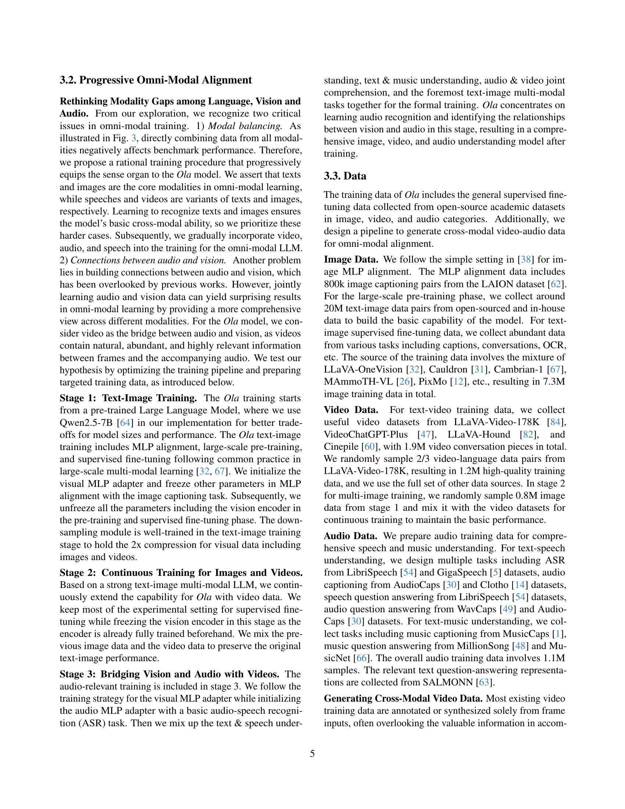

 


 2502.04328 
 Zuyan Liu et el. 
 
 🤗 2025-02-07 
 



↗ arXiv


↗ Hugging Face


### TL;DR



최근 대규모 언어 모델의 발전은 다양한 모달리티를 이해하는 능력을 갖춘 옴니 모달 모델 개발에 대한 관심을 높였습니다. 하지만 기존의 오픈소스 옴니 모달 모델들은 특정 모달리티 전문 모델에 비해 성능이 떨어지고 실시간 상호 작용 및 데이터 정렬 문제점을 가지고 있습니다. 

본 논문에서는 이러한 문제점들을 해결하기 위해 **진보적인 모달리티 정렬 전략**을 사용한 새로운 옴니 모달 언어 모델 Ola를 제시합니다. Ola는 **텍스트와 이미지로 시작하여 점진적으로 비디오와 오디오 데이터를 추가**하여 학습 효율성을 높이고, **문장 단위 스트리밍 디코딩**을 통해 사용자 경험을 개선했습니다.  실험 결과, Ola는 다양한 벤치마크에서 기존 모델들을 능가하는 성능을 보였습니다.



#### Key Takeaways


 Ola는 이미지, 비디오, 오디오 이해 벤치마크에서 최첨단 성능을 달성합니다. 



 Ola는 진보적인 모달리티 정렬 전략을 통해 다양한 모달리티 간의 연결을 효율적으로 학습합니다. 



 Ola는 실시간 스트리밍 디코딩을 지원하여 사용자 친화적인 상호 작용 경험을 제공합니다. 


#### Why does it matter?
이 논문은 **다양한 모달리티를 이해하는 능력을 가진 강력하고 포괄적인 다중 모달 언어 모델을 제시**함으로써 연구자들에게 중요한 의미를 가집니다. **진보적인 모달리티 정렬 전략**은 기존의 단일 모달리티 모델과 비교하여 경쟁력 있는 성능을 달성하고, **실시간 상호 작용** 및 **효율적인 정렬 데이터**를 가능하게 합니다.  이는 미래 연구에 중요한 기여를 할 뿐만 아니라 **새로운 연구 분야를 열어 줄 가능성**을 제시합니다.

------
#### Visual Insights

> 🔼 그림 1은 Ola 모델이 이미지, 비디오, 오디오 이해 벤치마크에서 다양한 모드를 아우르는 범용 언어 모델의 한계를 뛰어넘는 성능을 보여주는 것을 나타냅니다. Ola 모델은 기존 최첨단 오픈소스 다중 모드 모델 및 GPT-4와 비교되어 이미지, 비디오, 오디오 벤치마크에서의 성능이 평가됩니다. 공정한 비교를 위해 기존 MLLM 중 약 7B 버전을 선택하였습니다. Ola는 점진적 정렬 전략 덕분에 모든 모드에서 다중 모달 및 특수화된 MLLM을 능가하는 성능을 달성합니다.  '×'는 모델이 해당 작업을 수행할 수 없음을, '-'는 결과가 부족함을 나타냅니다. LibriSpeech 점수는 WER 지표가 낮을수록 좋으므로 반전되었습니다.
> 

> 
read the caption

> Figure 1: Ola pushes the frontiers of the omni-modal language model across image, video and audio understanding benchmarks.  We compare Ola with existing state-of-the-art open-sourced multimodal models and GPT-4o on their abilities in mainstream image, video, and audio benchmarks. For fair comparisons, we select around 7B versions of existing MLLMs. Ola can achieve outperforming performance against omni-modal and specialized MLLMs in all modalities thanks to our progressive alignment strategy. “×\times×” indicates that the model is not capable of the task and “−--” indicates the result is lacking. The score for LibriSpeech is inverted as lower is better for the WER metric.
> 

### In-depth insights

#### Progressive Alignment
본 논문에서 제시된 '점진적 정렬(Progressive Alignment)' 전략은 **다중 모달 모델 학습의 어려움을 해결하기 위한 핵심 아이디어**입니다. 단순히 모든 모달리티를 동시에 학습시키는 대신, **텍스트와 이미지처럼 구분이 명확한 모달리티부터 시작하여 점진적으로 비디오, 오디오 데이터를 추가**하는 방식입니다. 이는 각 단계에서 모델이 이전 단계의 지식을 기반으로 새로운 모달리티를 효과적으로 학습하도록 돕습니다. **모달 간의 불균형 문제를 완화하고, 상대적으로 적은 양의 데이터로 다중 모달 모델 학습이 가능**하게 합니다. 특히, 비디오와 오디오 데이터를 연결하는데 있어 **비디오에 포함된 오디오 정보를 활용**하여 모달 간의 연결고리를 강화하는 전략은 매우 효과적입니다. **비디오는 이미지와 오디오를 연결하는 다리 역할**을 하며, 점진적인 학습 과정을 통해 다중 모달 이해 능력을 향상시킵니다. 이러한 점진적 접근방식은 **모델의 크기와 복잡성을 제어**하면서 **모든 모달리티에서 경쟁력 있는 성능을 달성**할 수 있게 해줍니다. 따라서 '점진적 정렬'은 다중 모달 모델 학습의 효율성과 성능을 동시에 개선하는 혁신적인 방법론으로 평가할 수 있습니다.

#### Omni-Modal Encoding
**다중 모드 인코딩**은 텍스트, 이미지, 비디오, 오디오와 같은 다양한 유형의 데이터를 통합하여 단일 표현으로 변환하는 과정입니다. 이는 **모달 간의 상호 작용을 가능하게 하여** 다중 모드 언어 모델의 성능을 향상시키는 데 중요한 역할을 합니다.  **각 모드의 고유한 특징을 효과적으로 포착하는 것이 관건**이며, 이를 위해 다양한 인코딩 기법들이 활용됩니다. 예를 들어, 이미지는 CNN(Convolutional Neural Network)을 통해, 오디오는 Wavelet 변환 또는 MFCC(Mel-Frequency Cepstral Coefficients)를 통해, 텍스트는 Word2Vec과 같은 언어 모델을 통해 인코딩 될 수 있습니다.  **인코딩된 데이터는 이후 단계에서**  다중 모달 언어 모델의 학습 및 추론에 사용됩니다. 효율적인 다중 모드 인코딩은 **모델의 크기와 계산 비용을 줄이면서**  성능을 높이는 데 중요합니다. 따라서 **다양한 모드의 데이터를 효과적으로 통합하고, 각 모드의 특징을 잘 유지하는** 인코딩 전략은 다중 모달 언어 모델 개발의 핵심적인 부분입니다.

#### Benchmark Results
본 논문의 벤치마크 결과는 제시된 다중 모드 언어 모델(Ola)의 성능을 다양한 벤치마크 데이터셋을 통해 종합적으로 평가한 결과입니다. **이미지, 비디오, 오디오 이해 과제에서 Ola는 최첨단 단일 모드 모델 및 기존 다중 모드 모델을 능가하는 성능을 보여주었습니다.** 특히, **진보적인 모드 정렬 전략**은 다양한 모드 간의 조화로운 학습을 가능하게 하여, 전체적인 성능 향상에 크게 기여했습니다.  **비교 대상 모델들과의 비교 분석을 통해 Ola의 경쟁력**을 명확히 제시하였으며, 이는 Ola 모델의 **효율성 및 우수성**을 입증하는 중요한 근거가 됩니다.  **세부적인 벤치마크 결과는 각 모드별 과제에 대한 정량적 지표**를 통해 제시되어 있으며, 이를 통해 Ola의 강점과 약점을 구체적으로 분석할 수 있습니다.  **향후 연구 방향**으로는 더욱 다양한 모드와 과제를 포함한 포괄적인 평가와 함께, 모델의 확장성 및 일반화 능력에 대한 연구가 제시될 수 있습니다.

#### Cross-Modal Data
본 논문에서 **크로스-모달 데이터**는 다양한 모달리티(텍스트, 이미지, 비디오, 오디오) 간의 상호작용 및 연관성을 이해하는 데 핵심적인 역할을 합니다.  특히, **비디오와 오디오 데이터의 결합**은 단순히 각 모달리티의 정보를 개별적으로 처리하는 것을 넘어, **시너지 효과**를 창출하여 보다 풍부하고 정확한 의미를 파악하는 데 중요합니다.  **진보적인 모달리티 정렬 전략**은 이러한 크로스-모달 데이터를 효과적으로 활용하여, 모델이 각 모달리티의 특징을 점진적으로 학습하고 통합하도록 합니다.  **다양한 소스(학술 데이터셋, 공개 웹)**에서 수집된 데이터는 모델의 일반화 능력 향상에 기여하며, **자막 생성 및 질의응답 페어 생성**을 위한 파이프라인을 통해 더욱 효과적인 학습 데이터셋을 구축합니다.  **자막 데이터의 정제 및 품질 관리** 또한 데이터의 신뢰성을 높이는 중요한 과정입니다. 결과적으로, 풍부하고 다양한 크로스-모달 데이터의 활용은 **모델의 성능 향상 및 다양한 모달리티 이해 능력 향상**에 큰 영향을 미치는 핵심 요소임을 알 수 있습니다.

#### Future of Ola
Ola는 뛰어난 성능을 보이는 다중 모달 언어 모델로, **진보적인 모달 정렬 전략**을 통해 이미지, 비디오, 오디오 이해 벤치마크에서 우수한 결과를 달성했습니다.  미래를 전망해보면, Ola는 **더욱 다양한 모달리티를 통합**하고 **더욱 정교한 상호 작용 기능**을 갖춘 모델로 발전할 가능성이 높습니다.  **대규모 데이터셋과 효율적인 훈련 전략**의 지속적인 발전을 통해 더욱 강력하고 효과적인 다중 모달 언어 모델로 성장할 것이며, **실시간 스트리밍 디코딩** 및 **고품질 음성 합성** 기능 개선을 통해 사용자 경험을 더욱 향상시킬 것입니다. 또한, **지속적인 연구 개발을 통해 특정 도메인에 대한 성능을 개선**하고, **다양한 응용 분야에 적용**될 수 있도록 확장될 것입니다.  **개방형 접근 방식**을 유지하며,  연구 커뮤니티에 기여하고 혁신을 주도하는 핵심 모델로 자리매김할 것입니다.

### More visual insights

More on figures

> 🔼 그림 2는 Ola 모델의 아키텍처를 보여줍니다. Ola는 텍스트, 이미지, 비디오, 오디오를 포함한 다양한 모달리티의 입력을 동시에 처리할 수 있으며, 모든 모달리티에 대한 이해 작업에서 경쟁력 있는 성능을 제공합니다.  텍스트 디토크나이저와 음성 디코더 덕분에 Ola는 사용자 친화적인 실시간 스트리밍 디코딩을 지원하여 텍스트와 음성 출력을 실시간으로 제공합니다.  각 모달리티(텍스트, 이미지, 비디오, 오디오)는 해당 모달리티에 특화된 인코더를 통해 처리된 후, 다중 모달리티 입력을 통합하는 모듈을 거쳐 Ola 언어 모델에 입력됩니다.  Ola 모델은 이 정보를 처리하여 텍스트 또는 음성으로 출력을 생성합니다. 이러한 실시간 처리 기능은 사용자와의 상호 작용을 향상시킵니다.
> 

> 
read the caption

> Figure 2: Ola Architecture. Ola supports omni-modal inputs including text, image, video, and audio, capable of processing the inputs simultaneously with competitive performance on understanding tasks for all these modalities. Meanwhile, Ola supports user-friendly real-time streaming decoding for texts and speeches thanks to the text detokenizer and the speech decoder.
> 

> 🔼 그림 3은 다양한 모달리티(이미지, 비디오, 오디오)를 이해하는 능력을 향상시키기 위해 제안된 '점진적 모달리티 정렬(Progressive Modality Alignment)' 전략의 효과를 보여줍니다.  세 가지 주요 작업(이미지 질의응답(Image QA), 비디오 질의응답(Video QA), 자동 음성 인식(ASR))에 대해, 제안된 전략과 두 가지 기준 방법(모든 데이터를 섞어 한꺼번에 학습하는 '직접 혼합(Direct Mixing)', 데이터 불균형을 해소하기 위해 일부 데이터를 과대 샘플링하는 '균형 샘플링(Balanced Sampling)')을 비교 분석합니다. 효율성을 위해 축소된 학습 데이터셋을 사용하였으며, 모델 학습 단계는 동일하게 유지했습니다. 점진적 정렬 전략의 성능을 기준으로 점수를 정규화했고, ASR 작업의 경우 WER(Word Error Rate) 지표의 특성상 낮은 값이 더 좋은 성능을 나타내도록 점수를 반전했습니다.
> 

> 
read the caption

> Figure 3: Progressive modality alignment helps to learn better omni-modal models.  We compare our progressive alignment strategy with two baseline training pipelines on Image QA(MMBench [40]), Video QA(VideoMME [21]), and ASR(LibriSpeech [54]): 1) direct mixing where all instruction tuning data is merged and trained in a single stage, and 2) balanced sampling where we upsample certain sources to make the training data more balanced among modalities. The experiment is conducted on a subsampled training set for efficiency and we train models for the same number of steps for fair comparisons. The score is normalized based on the score of progressive alignment to calculate the relative score and the ASR score is inverted as lower is better for the WER metric.
> 

> 🔼 그림 4는 Ola의 점진적 모달리티 정렬 과정을 보여줍니다. 왼쪽 부분은 언어, 비전, 청각 모달리티 간의 관계를 시각적으로 보여줍니다. 음성은 언어와 청각 지식을 연결하는 매개체 역할을 하고, 비디오는 시각 및 청각 정보를 밀접하게 연결하는 다리 역할을 합니다. 따라서, 가장 중요한 모달리티(텍스트와 이미지)부터 시작하여 점진적으로 다른 모달리티(비디오, 오디오)를 추가하는 훈련 전략을 설계했습니다. 또한, 모달리티 간의 관계를 더 잘 포착하기 위해 교차 모달리티 비디오-오디오 데이터를 설계했습니다.  이 그림은 Ola 모델이 단순히 모든 모달리티를 한꺼번에 학습하는 것이 아니라, 텍스트와 이미지 이해라는 기본적인 능력을 먼저 확보한 후, 점진적으로 음성과 비디오 데이터를 추가하여 더욱 강력하고 통합적인 다중 모달리티 이해 능력을 갖추도록 훈련하는 과정을 설명합니다.
> 

> 
read the caption

> Figure 4: Illustrations of the Ola Progressive Modality Alignment. We visualize the relationships among modalities in the left part. Speech acts as the connection between language and audio knowledge, while video constructs the bridge with highly relevant visual and audio information. Therefore, we design the progressive alignment training strategy from primary to periphery. Furthermore, we design the cross-modality video-audio data to better capture the relationships among modalities.
> 

> 🔼 그림 5는 음성 및 시각적 이해 과제에 대한 생성 결과를 보여줍니다.  음성 및 비디오 이해에 대한 결과를 보여주고 기존의 비전-언어 모델과 비교하여 다중 모달 Ola의 강력한 능력을 보여줍니다.  구체적으로는, 음성 이해 부분에서는 다양한 감정과 뉘앙스를 담은 음성 데이터를 분석하여 질문에 대한 답변을 생성하는 Ola의 능력을 보여주는 예시가 포함되어 있습니다. 시각적 이해 부분에서는 비디오와 음성 정보를 함께 활용하여 맥락을 파악하고 보다 정확한 정보를 제공하는 Ola의 능력을 기존 모델과 비교하여 제시합니다.  이를 통해 Ola가 단순히 이미지나 음성만을 처리하는 것이 아니라, 이들을 통합적으로 이해하고 활용하여 더욱 풍부하고 정확한 결과를 생성할 수 있음을 강조합니다.
> 

> 
read the caption

> Figure 5: Generative results on speech and visual understanding tasks. We illustrate results on speech and video understanding and show the strong ability of omni-modal Ola compared with conventional vision-language models.
> 

> 🔼 그림 6은 Ola 모델의 텍스트 및 오디오 이해 능력을 보여주는 예시들을 보여줍니다.  음악, 음성, 소리 관련 오디오 데이터를 사용하여 Ola 모델이 질문에 대한 답변을 생성하는 과정을 보여줍니다. 각 예시는 오디오 클립, 질문, 그리고 Ola 모델의 응답으로 구성되어 있으며, Ola 모델이 다양한 유형의 오디오 데이터를 정확하게 이해하고, 적절한 답변을 생성하는 능력을 보여줍니다. 이는 모델의 강력한 멀티모달 이해 능력을 시각적으로 보여주는 좋은 예시입니다.
> 

> 
read the caption

> Figure 6: Showcases on Text and Audio Understanding.
> 

### Full paper



