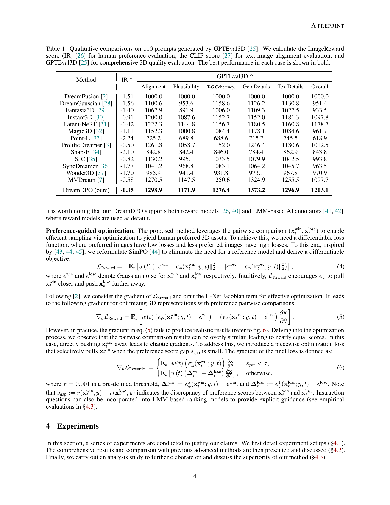
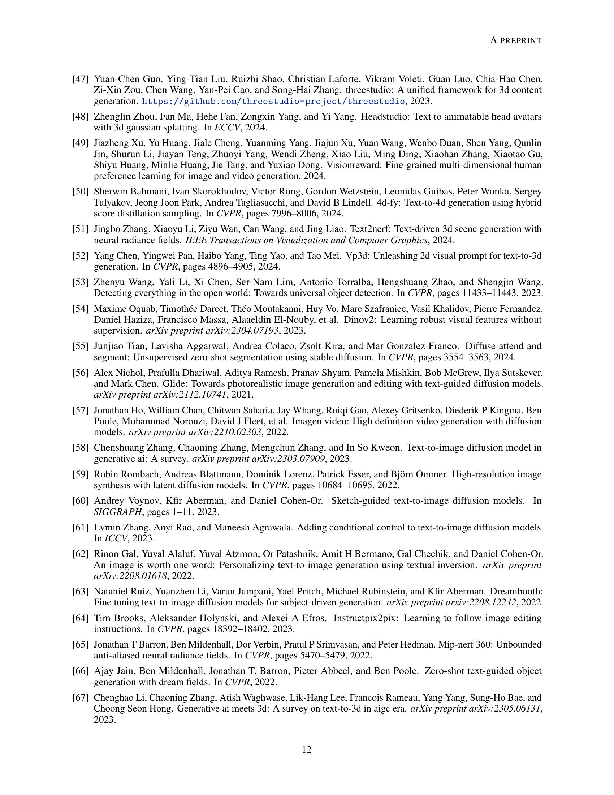

 


 2502.04370 
 Zhenglin Zhou et el. 
 
 🤗 2025-02-11 
 



↗ arXiv


↗ Hugging Face


↗ Papers with Code


### TL;DR



기존의 텍스트-3D 생성 모델들은 **인간의 미적 선호도를 충분히 반영하지 못하는 한계**를 가지고 있었습니다. 이는 생성된 3D 콘텐츠가 실제 사용자의 기대와 부합하지 않아 활용도가 떨어지는 결과를 초래했습니다. 또한, 기존 모델들은 **정량적인 평가에 크게 의존**하여, 미묘한 선호도 차이를 반영하는 데 어려움을 겪었습니다. 

본 연구는 이러한 문제를 해결하기 위해 **DreamDPO라는 새로운 프레임워크**를 제시합니다. DreamDPO는 인간의 선호도를 직접적으로 최적화 과정에 통합하여, **상대적인 선호도 비교를 통해 3D 모델을 개선**하는 방식을 사용합니다.  이는 정확한 점수를 매기는 것보다 훨씬 효율적이며, 더욱 미세한 제어가 가능하다는 장점이 있습니다. 실험 결과, DreamDPO는 기존 모델들보다 **더 높은 품질과 제어성을 가진 3D 콘텐츠를 생성**하는 것으로 나타났습니다.  본 연구는 텍스트-3D 생성 분야의 발전에 크게 기여할 뿐만 아니라, 다른 생성 모델 연구에도 시사하는 바가 큽니다.



#### Key Takeaways


 DreamDPO는 **인간의 선호도를 직접적으로 통합**하여 텍스트 기반 3D 생성의 품질과 제어성을 향상시켰습니다. 



 DreamDPO는 **쌍방 비교 방식**을 사용하여 정확한 점수 매기기 대신 상대적인 선호도를 반영함으로써 효율성을 높였습니다. 



 DreamDPO는 **다양한 평가 모델**과 호환되어 유연성과 적용 가능성을 높였으며, **실험 결과 우수한 성능**을 입증했습니다. 


#### Why does it matter?
본 논문은 **텍스트 기반 3D 생성 분야의 핵심적인 문제점인 인간의 선호도와의 정렬 문제를 해결**하기 위한 새로운 프레임워크인 DreamDPO를 제시하여, 해당 분야 연구의 새로운 방향을 제시하고 **향후 연구를 위한 새로운 가능성을 열어줄** 것으로 기대됩니다.  특히, 기존 방법의 한계점을 명확히 제시하고,  **정확한 점수 매기기 보다 상대적인 선호도 비교를 통해 효율성과 제어성을 높인 점이 혁신적**이며, 다양한 분야의 연구자들에게 중요한 시사점을 제공합니다. 또한,  **오픈소스로 공개**하여 다른 연구자들의 추가적인 연구와 발전을 촉진할 것으로 예상됩니다.

------
#### Visual Insights

> 🔼 그림 1은 DreamDPO 방법의 개요를 보여줍니다. DreamDPO는 먼저 쌍으로 된 예시들을 만들고, 보상 모델이나 대규모 다중 모드 모델을 사용하여 사람의 선호도와의 정렬을 비교한 다음, 선호도 기반 손실 함수를 사용하여 3D 표현을 최적화합니다. 손실 함수는 '이기는' 예시(xwin)을 더 가깝게 끌어당기고, '지는' 예시(xlose)를 멀리 밀어냅니다. 조각별 목적 함수로서, 선호도 점수 차이(sgap)가 임계값(τ)을 초과할 때에만 xlose를 선택적으로 밀어내어, 너무 유사한 xlose로 인한 혼란스러운 기울기를 방지합니다.
> 

> 
read the caption

> Figure 1: Overview of our method. DreamDPO first constructs pairwise examples, then compares their alignment with human preferences using reward or large multimodal models, and lastly optimizes the 3D presentation with a preference-driven loss function. The loss function pulls the win example 𝐱twinsuperscriptsubscript𝐱𝑡win\mathbf{x}_{t}^{\text{win}}bold_x start_POSTSUBSCRIPT italic_t end_POSTSUBSCRIPT start_POSTSUPERSCRIPT win end_POSTSUPERSCRIPT closer and pushes the lose example 𝐱tlosesuperscriptsubscript𝐱𝑡lose\mathbf{x}_{t}^{\text{lose}}bold_x start_POSTSUBSCRIPT italic_t end_POSTSUBSCRIPT start_POSTSUPERSCRIPT lose end_POSTSUPERSCRIPT away. As a piecewise objective, it selectively pushes 𝐱tlosesuperscriptsubscript𝐱𝑡lose\mathbf{x}_{t}^{\text{lose}}bold_x start_POSTSUBSCRIPT italic_t end_POSTSUBSCRIPT start_POSTSUPERSCRIPT lose end_POSTSUPERSCRIPT only when the preference score gap sgapsubscript𝑠gaps_{\text{gap}}italic_s start_POSTSUBSCRIPT gap end_POSTSUBSCRIPT exceeds a threshold τ𝜏\tauitalic_τ, preventing chaotic gradients from overly similar 𝐱tlosesuperscriptsubscript𝐱𝑡lose\mathbf{x}_{t}^{\text{lose}}bold_x start_POSTSUBSCRIPT italic_t end_POSTSUBSCRIPT start_POSTSUPERSCRIPT lose end_POSTSUPERSCRIPT.
> 


| Method | IR ↑ | Alignment | Plausibility | T-G Coherency. | Geo Details | Tex Details | Overall |
|---|---|---|---|---|---|---|---| 
| DreamFusion [2] | -1.51 | 1000.0 | 1000.0 | 1000.0 | 1000.0 | 1000.0 | 1000.0 |
| DreamGaussian [28] | -1.56 | 1100.6 | 953.6 | 1158.6 | 1126.2 | 1130.8 | 951.4 |
| Fantasia3D [29] | -1.40 | 1067.9 | 891.9 | 1006.0 | 1109.3 | 1027.5 | 933.5 |
| Instant3D [30] | -0.91 | 1200.0 | 1087.6 | 1152.7 | 1152.0 | 1181.3 | 1097.8 |
| Latent-NeRF [31] | -0.42 | 1222.3 | 1144.8 | 1156.7 | 1180.5 | 1160.8 | 1178.7 |
| Magic3D [32] | -1.11 | 1152.3 | 1000.8 | 1084.4 | 1178.1 | 1084.6 | 961.7 |
| Point-E [33] | -2.24 | 725.2 | 689.8 | 688.6 | 715.7 | 745.5 | 618.9 |
| ProlificDreamer [3] | -0.50 | 1261.8 | 1058.7 | 1152.0 | 1246.4 | 1180.6 | 1012.5 |
| Shap-E [34] | -2.10 | 842.8 | 842.4 | 846.0 | 784.4 | 862.9 | 843.8 |
| SJC [35] | -0.82 | 1130.2 | 995.1 | 1033.5 | 1079.9 | 1042.5 | 993.8 |
| SyncDreamer [36] | -1.77 | 1041.2 | 968.8 | 1083.1 | 1064.2 | 1045.7 | 963.5 |
| Wonder3D [37] | -1.70 | 985.9 | 941.4 | 931.8 | 973.1 | 967.8 | 970.9 |
| MVDream [7] | -0.58 | 1270.5 | 1147.5 | 1250.6 | 1324.9 | 1255.5 | 1097.7 |
| DreamDPO (ours) | -0.35 | 1298.9 | 1171.9 | 1276.4 | 1373.2 | 1296.9 | 1203.1 |

> 🔼 표 1은 GPTEval3D [25]에서 생성한 110개의 프롬프트에 대한 정성적 비교 결과를 보여줍니다.  인간의 선호도 평가를 위해 ImageReward 점수(IR) [26]를, 텍스트-이미지 정렬 평가를 위해 CLIP 점수 [27]를, 그리고 종합적인 3D 품질 평가를 위해 GPTEval3D [25]를 계산했습니다. 각 경우의 최상의 성능은 굵게 표시되어 있습니다.  즉,  ImageReward는 사용자 선호도를, CLIP 점수는 생성된 3D 모델이 입력 텍스트와 얼마나 잘 일치하는지를, GPTEval3D는 3D 모델의 전반적인 품질(기하학적 디테일, 질감 등)을 평가하는 지표입니다. 각 지표에 대한 최고 점수를 받은 모델이 표에 굵은 글씨로 표시되어 있습니다.
> 

> 
read the caption

> Table 1:  Qualitative comparisons on 110 prompts generated by GPTEval3D [25]. We calculate the ImageReward score (IR) [26] for human preference evaluation, the CLIP score [27] for text-image alignment evaluation, and GPTEval3D [25] for comprehensive 3D quality evaluation. The best performance in each case is shown in bold.
> 

### In-depth insights

#### Human Preferences in 3D
3D 모델 생성 분야에서 **인간의 선호도를 고려하는 것은 매우 중요**합니다. 기존의 3D 생성 모델들은 주로 객관적인 지표(예: 해상도, 정확도)에 초점을 맞춰왔지만, 실제로 사용자들이 선호하는 3D 모델은 객관적인 지표만으로는 설명할 수 없습니다. **사용자의 주관적인 취향, 감성적인 반응, 그리고 특정 상황에 따른 필요성 등을 고려**해야 실제로 유용하고 만족스러운 3D 모델을 생성할 수 있습니다. 따라서, **인간의 선호도를 효과적으로 통합하는 새로운 방법론**의 개발이 시급하며, 이는 **심층 신경망과 같은 머신러닝 기술을 활용**하여 사용자 피드백을 학습하고 모델의 생성 과정을 조정하는 방식으로 달성될 수 있습니다.  향후 연구는 더욱 다양한 인간의 선호도를 포착하고, **개인화된 3D 모델 생성**을 가능하게 하는 기술 개발에 집중되어야 할 것입니다. 또한, **윤리적인 측면과 사회적 영향**까지 고려하여 책임감 있는 3D 모델 생성 기술 개발이 중요합니다.

#### DreamDPO Framework
DreamDPO 프레임워크는 **텍스트 기반 3D 생성 과정에 인간의 선호도를 직접적으로 통합**하는 혁신적인 접근 방식을 제시합니다. 기존의 점수 기반 방식과 달리, DreamDPO는 **쌍을 이루는 예시들을 생성하고, 보상 모델이나 대규모 다중 모드 모델을 이용하여 인간의 선호도를 반영**합니다. 이를 통해 정확한 점수 매기기의 어려움을 해결하고, **선호도 기반 손실 함수를 통해 3D 표현을 미세 조정**하여 보다 높은 품질과 제어성을 제공합니다. **쌍 비교를 통해 선호도를 반영**함으로써, DreamDPO는 인간 피드백에 대한 의존도를 줄이고, **미세한 조정 가능성**을 제공합니다.  결과적으로, **더욱 정확하고 제어 가능한 3D 콘텐츠 생성**이 가능해집니다.  **보상 모델 또는 대규모 다중 모드 모델을 유연하게 활용**할 수 있으며, 이는 다양한 요구사항을 충족하고 더욱 폭넓은 제어 기능을 제공합니다.

#### Pairwise Comparison
본 논문에서 제안하는 핵심 전략 중 하나인 **쌍방 비교(Pairwise Comparison)**는 3D 생성물의 품질을 정확하게 수치화하는 대신, **두 후보 3D 모델 간의 상대적 선호도**를 평가하는 데 초점을 맞춥니다. 이는 기존의 정량적 평가 방식의 한계를 극복하기 위한 효과적인 전략입니다.  **보상 모델이나 거대 다중 모달 모델을 활용**하여 두 모델 중 어떤 것이 주어진 텍스트 설명과 더 잘 일치하는지 판단하고, 그 결과를 선호도 점수로 변환합니다. 이러한 쌍방 비교 방식은 **정확한 점수보다는 상대적 순위**에 의존하기 때문에, 복잡하고 정확한 보상 모델에 대한 의존도를 줄일 수 있으며, **더욱 효율적이고 유연한 최적화**를 가능하게 합니다. **쌍방 비교를 통해 얻은 선호도 정보**는 3D 모델의 최적화 과정에 직접적으로 반영되어, 텍스트 설명과의 정합성을 높이고 품질을 향상시키는 데 기여합니다.  결론적으로, 쌍방 비교는 3D 텍스트-투-3D 생성의 효율성 및 제어 가능성을 높이는 데 크게 기여하는 중요한 요소입니다.

#### Quantitative Results
본 논문의 "정량적 결과" 부분은 제시된 3D 모델 생성 방법의 성능을 객관적으로 평가하는 데 중점을 둡니다. **ImageReward 및 GPTEval3D와 같은 다양한 지표를 사용하여 정확성, 현실성, 일관성 등 여러 측면에서 모델의 성능을 측정하고 기존 방법과 비교**합니다.  **실험 결과는 제안된 방법이 기존 방법보다 여러 지표에서 우수한 성능을 보임을 보여줍니다.** 이를 통해, 제안된 방법이 **텍스트 기반 3D 모델 생성 분야에서 효과적이고 실용적인 도구임을 강조**하며, 향후 연구 및 개발을 위한 중요한 기반을 제공합니다. 특히, **정량적 데이터를 통해 모델의 개선점을 명확히 제시**하여, 향후 연구 방향 설정에 유용한 정보를 제공합니다.  **정량적 결과 분석을 통해 도출된 결론은 논문의 신뢰도를 높여주는 중요한 요소**이며, 제시된 방법의 실질적인 효용성을 보여주는 근거가 됩니다.  **향상된 정확도와 효율성은 실제 응용 분야에서의 활용 가능성을 높이는 중요한 요소**입니다.

#### Future Work
본 논문의 "미래 연구" 부분은 3D 생성 모델의 인간 선호도와의 정렬에 대한 추가적인 연구 방향을 제시합니다. 특히, **모델의 견고성 향상**, **제한된 프롬프트 접근 방식의 극복**, **다양한 응용 분야로의 확장**이 주요 과제로 언급됩니다.  구체적으로, 이미지 프롬프트 통합, 개체 감지 모델 활용, 그라운딩 모델 활용 등을 통해 보다 정교한 사용자 피드백 반영을 위한 연구가 필요하며, 확장성 있는 모델 설계를 위한 연구가 요구됩니다.  또한, **다른 모달리티와의 융합**을 통한 3D 생성 성능 향상 및 **다양한 생성 작업(4D 생성, 장면 생성 등)**으로의 확장성 검토가 중요한 미래 연구 과제로 제시됩니다.  **모델의 안정성과 효율성 향상**을 위한 심층적인 연구 또한 필수적입니다.  결론적으로, 본 논문은 단순히 현재 모델의 한계를 제시하는 데 그치지 않고, 3D 생성 모델의 발전을 위한 구체적인 방향을 제시함으로써 향후 연구의 중요한 이정표를 제시합니다.

### More visual insights

More on figures

> 🔼 그림 2는 GPTEval3D 벤치마크 [25]에 대한 정성적 비교 결과를 보여줍니다. 빨간색으로 표시된 기존 방법들은 제시된 텍스트와 일치하는 3D 모델 생성에 어려움을 겪는 반면, DreamDPO는 텍스트 매칭을 개선하여 사람의 선호도에 더 부합하는 고품질의 3D 모델을 생성합니다. 자세한 내용은 확대하여 확인하십시오.
> 

> 
read the caption

> Figure 2:  Qualitative comparisons on the benchmark of GPTEval3D [25]. Existing methods struggle with text matching, as marked in red. DreamDPO improves text matching, which provides better human preference results. (Zoom in to see the details.)
> 

> 🔼 이 그림은 DreamDPO와 MVDream [7]의 성능을 짧은 프롬프트와 긴 프롬프트 모두에서 비교한 정성적 분석 결과를 보여줍니다. 빨간색으로 표시된 부분은 DreamDPO가 MVDream보다 사람의 선호도를 더 잘 반영하는 결과를 생성했음을 나타냅니다. DreamDPO는 짧고 긴 프롬프트 모두에서 더 나은 성능을 보이며, 텍스트 일치도가 향상되고, 더 높은 품질의 질감과 기하학적 디테일을 제공합니다. 그림의 자세한 내용은 확대하여 확인할 수 있습니다.
> 

> 
read the caption

> Figure 3:  Qualitative comparisons with MVDream [7]. DreamDPO performs well across short to long prompts, offering better human preference results, marked in red. (Zoom in to see the details.)
> 

> 🔼 그림 4는 DreamDPO 모델의 백본(backbone)으로 Stable Diffusion v2.1 [17]을 사용했을 때의 결과를 보여줍니다.  본 실험은 DreamDPO가 SD2.1과 같은 고급 백본 확산 모델을 효과적으로 활용하여 성능을 향상시킬 수 있음을 보여줍니다. 그림은 다양한 텍스트 프롬프트에 대한 생성 결과를 보여주며,  DreamDPO가 SD2.1을 백본으로 사용했을 때에도 고품질의 3D 모델을 생성할 수 있음을 시각적으로 증명합니다. 향후 더욱 발전된 백본 확산 모델을 활용하면 DreamDPO의 성능이 더욱 향상될 가능성을 시사합니다.
> 

> 
read the caption

> Figure 4: The analysis of backbone. We present the results of DreamDPO using Stable Diffusion v2.1 (SD2.1) [17]. DreamDPO demonstrates effective performance with SD2.1, highlighting its potential to leverage more advanced backbone diffusion models for further improvements.
> 

> 🔼 이 그림은 DreamDPO 모델이 ImageReward 모델을 사용했을 때의 결과를 보여줍니다. ImageReward는 이미지에 대한 사람의 선호도를 평가하는 데 사용되는 보상 모델입니다. 이 그림을 통해 DreamDPO가 ImageReward를 사용하여 효과적인 성능을 달성하고, 더욱 강력한 보상 모델을 활용하면 생성 품질을 더욱 향상시킬 수 있음을 보여줍니다.
> 

> 
read the caption

> Figure 5: The analysis of reward models. We present the results of DreamDPO using ImageReward [26]. DreamDPO demonstrates effective performance with ImageReward, highlighting its potential to leverage stronger reward models to further enhance generation quality.
> 

> 🔼 그림 6은 점수 차이 임계값 τ(tau)에 대한 분석을 보여줍니다. 연구진은 τ 값을 0.01에서 0까지 변화시키면서 2차원 토이 실험을 수행했습니다. 그 결과, 작지만 0이 아닌 τ 값은 유사한 'lose' 예시를 효과적으로 걸러내어 더욱 상세한 결과물을 생성하는 데 기여함을 보여줍니다.  즉,  τ 값이 너무 작으면 비슷한 결과물들을 구분하지 못하고, 너무 크면 좋은 결과물들을 제외할 수 있으므로 적절한 τ 값을 설정하는 것이 중요함을 시사합니다.
> 

> 
read the caption

> Figure 6:  The analysis of the score gap threshold τ𝜏\tauitalic_τ. We conduct 2D toy experiments with τ𝜏\tauitalic_τ ranging from 0.010.010.010.01 to 00. The results indicate that a small but non-zero τ𝜏\tauitalic_τ effectively filters out overly similar lose examples, leading to more detailed outputs.
> 

> 🔼 그림 7은 DreamReward [12]와 비교하여 제안된 DreamDPO 모델의 성능을 보여줍니다. 빨간색으로 표시된 부분처럼 DreamDPO는 텍스트 매칭을 개선하고 기하학적 및 질감 세부 정보를 향상시킵니다. DreamReward는 양호한 화질의 3D 자산을 생성하지만, 텍스트와 일치하지 않는 경우가 많고(예: 자전거에 꽃잎이 있는 경우), 세부 사항이 부족한 반면 DreamDPO는 텍스트와의 정합성을 개선하고 질감 및 기하학적 디테일을 향상시킨다는 것을 보여줍니다.
> 

> 
read the caption

> Figure 7:  Qualitative comparisons with DreamReward [12]. DreamDPO improves both text matching (marked in red) and geometric/texture details.
> 

> 🔼 그림 8은 DreamDPO가 대규모 다중 모달 모델(LMM)을 사용하여 3D 자산 생성 결과를 보여줍니다. QwenVL [41]과 같은 LMM을 활용하여 3D 자산의 개수와 속성을 수정하는 명시적 지침을 제공하는 방법의 잠재력을 탐구합니다. 그림 왼쪽 상단에는 LMM을 사용한 쌍 비교의 세부 정보가 나와 있으며, 여기에는 질문과 승/패 기준이 포함됩니다. 질문을 신중하게 설계함으로써 DreamDPO는 최적화를 안내하는 데 승/패 예제를 모두 활용할 수 있습니다.
> 

> 
read the caption

> Figure 8:  The generation results of DreamDPO with large multi-modal models (LMMs). We explore the potential of our method to leverage LMMs, such as QwenVL [41] for explicit guidance in correcting the number and attribute of 3D assets. The left corner shows the details of pairwise comparisons using the LMM, including the question and win/lose criteria. By carefully designing the question, DreamDPO can leverage both win and lose examples to guide optimization. (Zoom in to see the details.)
> 

> 🔼  그림 9는 쌍으로 이루어진 예시 생성 과정을 분석한 결과를 보여줍니다. 동일한 시간 단계에서 서로 다른 가우시안 노이즈를 추가하는 방법(1)과, 서로 다른 시간 단계에서 동일한 가우시안 노이즈를 추가하는 방법(2)의 두 가지 방법을 비교하여 어떤 방법이 더 효과적인지 보여줍니다.  각 방법은 생성된 이미지 쌍의 품질과 다양성에 어떤 영향을 미치는지 보여주는 시각적 비교를 제공합니다. 이를 통해, DreamDPO 모델의 성능을 최적화하기 위한 최적의 예시 생성 전략을 결정하는 데 도움이 됩니다.
> 

> 
read the caption

> Figure 9: The analysis of pairwise example construction. We compare (1) different noises: adding different Gaussian noises with the same timesteps, and (2) difference timesteps: adding the same Gaussian noise with different timesteps.
> 

> 🔼 그림 10은 DreamDPO의 추가적인 활용 사례를 보여줍니다.  Gaussian 기반 아바타 생성 프레임워크[48]와 DreamDPO를 결합하여 간단한 실험을 통해 text-to-avatar 생성을 수행했습니다.  DreamDPO가 기존의 Gaussian 기반 아바타 생성 방식을 개선하여 더욱 향상된 아바타를 생성하는 것을 보여주는 실험 결과입니다. 자세한 내용은 부록 B.3절을 참조하십시오.
> 

> 
read the caption

> Figure 10: The further application of DreamDPO. We conduct toy experiments on text-to-avatar generation by combining DreamDPO with Gaussian-based avatar generation framework [48]. More details can be checked in Appendix B.3.
> 

> 🔼 이 그림은 DreamDPO를 사용하여 생성된 추가적인 정성적 결과를 보여줍니다.  MVDream 모델의 결과와 비교하여 DreamDPO가 텍스트와 더 잘 일치하고 기하학적 및 질감 세부 사항이 향상된 고품질 3D 자산을 생성하는 것을 보여줍니다.  각 행은 특정 텍스트 프롬프트에 대한 두 모델의 결과를 비교하며,  DreamDPO의 결과가 프롬프트를 더 정확하게 반영하고 더욱 세밀하고 현실감 있는 3D 모델을 생성함을 시각적으로 보여줍니다.
> 

> 
read the caption

> Figure 11: More qualitative results using DreamDPO.
> 

> 🔼 그림 12는 DreamDPO를 사용하여 생성한 추가적인 정성적 결과를 보여줍니다.  DreamDPO가 다양한 텍스트 프롬프트에 대해 고품질의 3D 자산을 생성하고, 텍스트와의 정렬 및 기하학적/질감 세부 사항을 향상시킨다는 것을 보여주는 여러 예시 이미지들을 포함하고 있습니다.  이미지는 다양한 객체와 장면을 포착하여 DreamDPO의 유연성과 적응력을 강조합니다.
> 

> 
read the caption

> Figure 12: More qualitative results using DreamDPO.
> 

### Full paper



