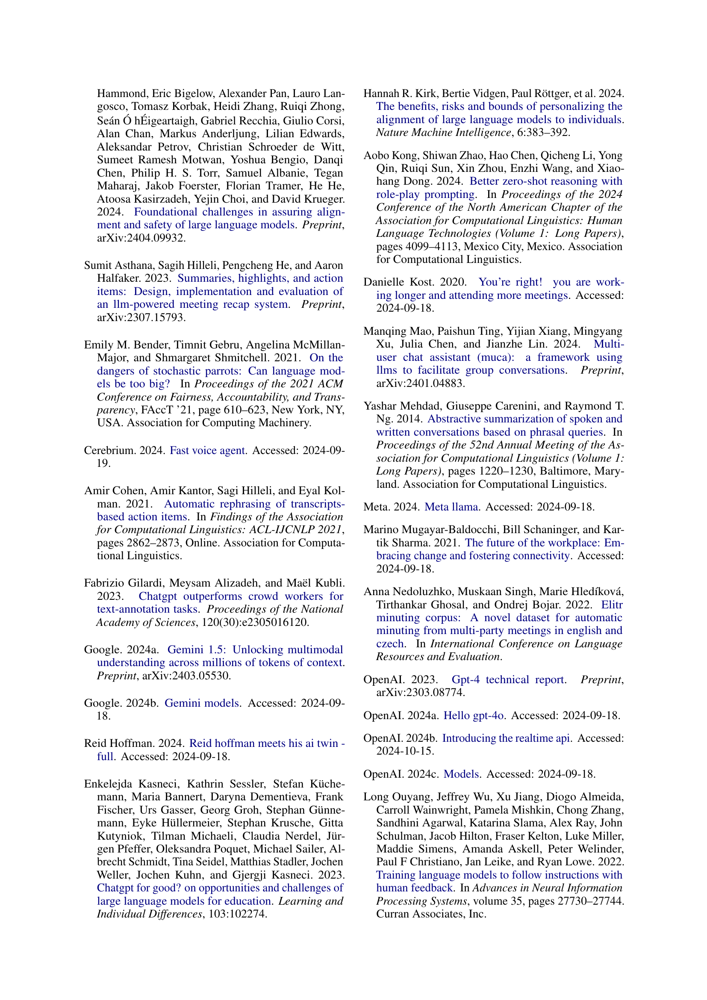
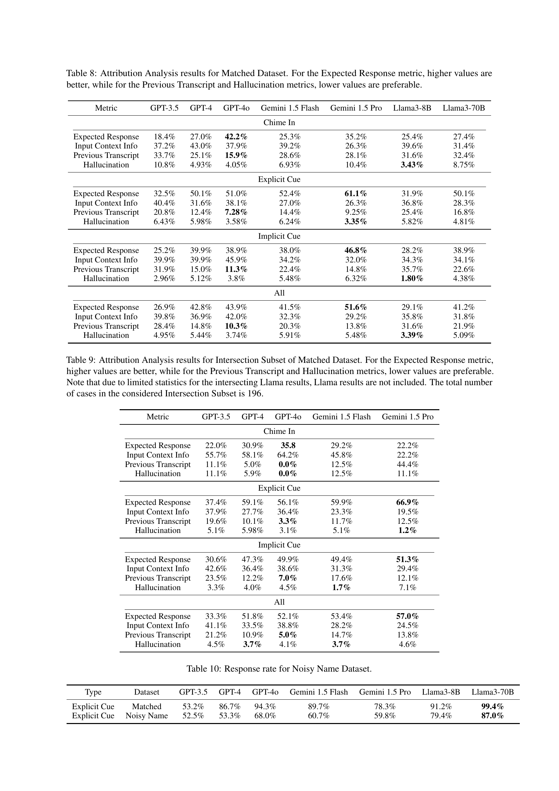

<br>


 2502.04376 
 Lingxiang Hu et el. 
 
 🤗 2025-02-10 
 



↗ arXiv


↗ Hugging Face


↗ Papers with Code



### TL;DR




현대 업무 환경에서 회의는 필수적이나 시간 낭비, 일정 충돌 등의 문제점을 안고 있습니다.  본 논문은 대규모 언어 모델(LLM)을 활용하여 이러한 문제를 해결하고자 회의 대리 시스템을 제안합니다.  이는 LLM의 자연어 처리 및 추론 능력을 활용, 참석자를 대신하여 회의에 참여하고 정보를 전달하는 것을 목표로 합니다.

본 연구는 실제 회의록 데이터를 활용하여 GPT-4, Gemini 등 여러 LLM의 성능을 평가하였습니다.  **GPT-4는 균형 잡힌 성과**를 보였으며, 일부 LLM은 과도하게 적극적이거나 소극적인 경향을 보였습니다.  **오류 감소 및 실시간 응답 속도 개선** 등의 개선점이 제시되었고, 이를 통해 **LLM 기반 회의 대리 시스템의 실용성**을 높일 수 있음을 시사합니다.




#### Key Takeaways


 LLM을 활용한 회의 대리 시스템의 실현 가능성을 보여주었습니다. 



 다양한 LLMì˜ 성능을 실제 회의록을 기반으로 비교 분석했습니다. 



 LLM 기반 회의 대리 시스템의 한계점과 개선 방향을 제시했습니다. 


#### Why does it matter?
본 논문은 **LLM 기반 회의 대리 시스템**의 실현 가능성과 그 과제를 탐구하여, **실제 회의록을 이용한 종합적인 벤치마킹**을 통해 다양한 LLM의 성능을 비교 분석하고, LLM을 회의 참여에 활용하는 데 있어 중요한 통찰력을 제공합니다.  이는 **생산성 향상 및 효율적인 회의 참여**에 대한 요구가 증가하는 현대 업무 환경에서 특히 중요한 의미를 지닙니다.  또한, 본 연구는 **개선 방향 및 미래 연구 과제**를 제시하여 LLM 기반 회의 기술 발전에 기여할 수 있습니다.

------
#### Visual Insights


> 🔼 그림 1은 제안된 회의 대리 시스템의 아키텍처를 보여줍니다. 이 시스템은 사용자가 회의에 참석하기 전에 미리 관련 정보(관심 주제, 배경 지식, 공유 자료 등)를 입력할 수 있는 정보 수집 모듈과, 회의 진행 상황을 모니터링하고 적절한 시점에 개입하여 응답을 생성하는 회의 참여 모듈, 그리고 생성된 텍스트를 음성으로 변환하는 음성 생성 모듈로 구성됩니다.  정보 수집 모듈은 LLM이 회의에 참여하는 데 필요한 정보를 수집하는 역할을 하고, 회의 참여 모듈은 LLM을 사용하여 적절한 시점에 개입하고 응답을 생성하며, 음성 생성 모듈은 생성된 텍스트를 음성으로 변환하여 실시간으로 회의에 참여할 수 있도록 합니다.
> <details>
> <summary>read the caption</summary>
> Figure 1: Architecture of the meeting delegate system.
> </details>



|---|---|---| 
| **Phase I: Execute** | **Phase II: Assist** | **Phase III: Delegate** | 
| Data Boundary | User-defined boundaries | Privacy-protected boundaries | Data accessible by user | 
| Share Information | Only within user-defined boundaries | Some reasoning over sensitive data | Autonomous based on predefined goals and preferences | 
| Collect Information | Explicit requests only | Infer context beyond user instructions | Autonomously collects and reasons based on meeting context | 
| Decision-Making | No decision-making | Propose and ask for approval | Full autonomous decision-making | 

> 🔼 이 표는 완전한 자율 미팅 대리인을 달성하기 위한 자율성과 책임의 진행 과정을 보여줍니다.  단계별로 데이터 경계, 정보 공유, 정보 수집, 의사 결정 방법에 대한 변화를 보여줍니다. 1단계(실행)에서는 사용자 정의 데이터 경계 내에서만 작동하고, 명시적으로 승인된 정보만 공유하며, 사용자의 명시적 요청에 따라서만 정보를 수집합니다.  2단계(지원)에서는 시스템이 개인정보 보호 지침을 준수하면서 민감한 데이터를 추론하고, 행동을 제안하지만 사용자의 승인이 필요합니다.  3단계(위임)에서는 시스템이 자율적으로 정보를 수집하고 공유하며, 사용자 정의 목표와 기본 설정을 기반으로 실시간으로 결정을 내립니다.  개인 정보 보호 필터, 의사 결정 모델, 감사 로그를 통해 투명성을 확보합니다.
> <details>
> <summary>read the caption</summary>
> Table 1: Progression of Autonomy and Responsibility in Achieving a Fully Autonomous Meeting Delegate.
> </details>


### In-depth insights


#### LLM Meeting Agents
LLM 미팅 에이전트는 **대규모 언어 모델(LLM)**을 활용하여 회의 참석자를 대신하여 회의에 참여하는 시스템입니다.  이 시스템은 회의 맥락을 이해하고, 자연어로 질문과 답변을 생성하며, 적절한 시점에 개입하여 효율적인 회의 참여를 지원합니다.  **핵심적인 기술적 과제**는 다양한 참여자의 발언을 실시간으로 이해하고, 문맥에 맞는 응답을 생성하는 것입니다.  이는 LLM의 자연어 처리 및 추론 능력에 의존하며, **오류가 포함된 음성 인식 결과**나 모호한 발언에 대한 처리 능력 또한 중요합니다.  **개인 정보 보호** 및 **실시간 응답** 또한 중요한 고려 사항이며, 향후 연구를 통해 해결해야 할 과제입니다.  **LLM의 종류**에 따른 성능 차이도 존재하며, 특히 **GPT 계열** 모델이 균형잡힌 성능을 보이는 반면, 다른 모델들은 지나치게 적극적이거나 소극적인 경향을 보이는 것으로 나타났습니다.  따라서,  LLM 미팅 에이전트의 실용적인 적용을 위해서는 **모델 선택**, **오류 처리**, **개인 정보 보호** 등 다방면에 대한 추가적인 연구가 필요합니다.

#### Benchmarking LLMs
본 논문에서 "LLM 벤치마킹"은 **다양한 대규모 언어 모델(LLM)의 성능을 실제 회의록을 기반으로 평가**하는 것을 의미합니다.  단순히 성능 수치 비교를 넘어, **GPT-4, Gemini, Llama 등 각 모델의 회의 참여 전략(능동적 참여 vs. 신중한 참여)**을 분석하고, **오류 허용 범위 및 답변 적절성** 등 실제 환경 적용 가능성에 대한 심층적인 평가를 수행합니다.  **실제 회의 데이터를 활용한 벤치마킹**은 기존 연구의 한계를 극복하고, **LLM 기반 회의 대리 시스템의 현실적인 적용 가능성 및 한계**를 명확히 제시합니다.  **다양한 시나리오(명시적/암시적 단서, 참여/침묵)**를 포함한 종합적인 평가는 LLM 기반 시스템의 실용성을 높이는 데 기여하며, **향후 연구 방향**을 제시합니다. 특히, **전사 오류에 대한 내성 강화 및 관련 기술 발전**의 필요성을 강조합니다.

#### Real-World Testing
연구 논문의 "실제 환경 테스트" 부분에 대한 심층적인 분석을 통해 얻을 수 있는 통찰력은 다음과 같습니다. **실제 환경 테스트는 제안된 시스템의 실용성과 효율성을 평가하는 데 매우 중요한 단계**입니다.  이는 시뮬레이션이나 이상적인 조건에서의 테스트 결과와는 다를 수 있기 때문에 실제 사용 환경에서의 성능을 측정하고 문제점을 파악하는 것이 필수적입니다.  **다양한 실제 미팅 시나리오를 포함한 폭넓은 테스트**는 시스템의 일반화 가능성을 높이는 데 기여합니다.  테스트 결과는 모델의 강점과 약점을 보여주며, 개선 방향을 제시하는 데 유용한 정보를 제공합니다.  **오류 분석을 통해 모델의 한계점을 파악하고 개선 방향을 설정**할 수 있습니다. 예를 들어, 전사 오류에 대한 내성을 높이거나, 관련 없는 내용을 줄이고 응답의 정확성을 높이는 방향으로 모델을 개선할 수 있습니다.  **실제 사용자 피드백은 시스템의 사용성 및 실용성을 향상**시키는 데 중요한 역할을 합니다.  **실제 환경 테스트를 통해 얻은 데이터는 향후 시스템 개발 및 개선에 대한 방향**을 제시하며, **LLM 기반 시스템의 실제 적용 가능성을 평가**하는 데 도움이 됩니다.  따라서, 실제 환경 테스트는 LLM 기반 미팅 대리 시스템의 성공적인 구축을 위한 핵심 요소입니다.

#### Ethical Considerations
연구 논문의 "윤리적 고려 사항" 부분에 대한 심층적인 분석을 통해 도출된 주요 통찰력은 다음과 같습니다. **AI 시스템의 자율성 수준을 단계적으로 높이는 접근 방식**을 제안하여, 책임 있는 AI 개발 및 배포를 위한 틀을 마련하는 것이 중요합니다. **개인 정보 보호**는 최우선 순위로 다루어져야 하며, **데이터 암호화, 차등적 프라이버시, 사용자 정의 경계 설정, 감사 추적** 등의 기술을 통해 개인 정보 보호를 강화해야 합니다. **투명성**을 확보하기 위해 AI 시스템의 기능과 한계를 명확히 밝히고 사용자에게 AI가 개입되었음을 알리는 것이 중요합니다. **인간의 개입**은 AI 시스템의 자율성을 제한하고 책임 있는 사용을 보장하는 데 필수적이며, 이를 위해 **인간 중심 루프 시스템**을 구축해야 합니다. **사회 경제적 영향** 또한 고려되어야 하며, **AI 시스템이 일자리 감소로 이어질 가능성**을 고려하여 인간 노동을 보완하는 방향으로 AI 기술을 개발해야 합니다. **편향성과 공정성** 또한 중요한 문제이며, **다양한 데이터 세트를 사용하여 편향성을 완화하고 지속적인 모니터링**을 통해 공정성을 유지해야 합니다.

#### Future Work
본 논문은 LLM 기반 회의 대리 시스템의 현재 한계점과 더불어 **향후 연구 방향**에 대한 심도있는 논의를 제시합니다.  **실시간 음성 처리 및 다국어 지원**과 같은 기술적 개선을 통해 보다 실제적인 환경에서 시스템의 성능을 향상시키는 것이 중요합니다.  **개인정보보호 및 보안**을 강화하고, **사용자의 프라이버시**를 보호하는 방안 또한 필수적입니다.  **다양한 유형의 회의 및 참가자 역할**에 대한 시스템 적응성을 높이기 위한 연구가 필요하며, **인간과 AI의 협업** 방식을 개선하여 AI의 한계를 극복하는 방안을 모색해야 합니다.  **오류 허용 및 맥락 이해** 능력 향상은 현실적인 회의 상황에 대한 적응력을 높이는데 중요한 요소입니다.  나아가, **윤리적, 사회적 영향**을 고려하여 책임감 있는 AI 시스템 개발에 대한 논의가 필요합니다.  **지속적인 평가 및 개선**을 통해 LLM 기반 회의 대리 시스템이 실제 업무 환경에서 효과적으로 활용될 수 있도록 하는 것이 **궁극적인 목표**입니다.


### More visual insights

<details>
<summary>More on figures
</summary>


> 🔼 이 그림은 LLM 기반 회의 대리 시스템의 워크플로우를 보여줍니다. 회의 전에 사용자는 회의 목적과 공유 가능한 정보를 입력합니다. 시스템은 회의 녹취록을 기반으로 실시간으로 회의에 참여하여 프롬프트에 맞춰 응답을 생성합니다.
> <details>
> <summary>read the caption</summary>
> Figure 2: Workflow of an LLM-powered meeting delegate system. The process involves user input of meeting intent and shareable information prior to the meeting, real-time participation based on meeting transcripts, and response generation aligned with prompted instructions and meeting objectives.
> </details>


> 🔼 그림 3은 논문의 벤치마크 데이터셋 구성에 대한 통계를 보여줍니다. 매칭 데이터셋의 다양한 통계적 특징들을 보여주는 네 개의 서브 플롯으로 구성되어 있습니다. 첫 번째 플롯은 참여자 수 분포를, 두 번째 플롯은 발화 수 분포를, 세 번째 플롯은 실제 반응에서 주요 지점 수 분포를, 네 번째 플롯은 입력 의도와 공유 가능한 상황 정보에 있는 주요 지점 수 분포를 각각 나타냅니다. 이를 통해 데이터셋의 복잡성과 다양성을 보여줍니다.  예를 들어, 많은 회의에 4명 이상의 참가자가 있으며, 발화 수가 50개를 넘는 경우도 많고, 각 참가자의 발화에 10개 이상의 주요 지점이 포함된 경우도 많다는 것을 보여줍니다.
> <details>
> <summary>read the caption</summary>
> Figure 3: Data statistics of the Matched Dataset.
> </details>


> 🔼 그림 4는 일치하는 데이터셋(Matched Dataset)에 대한 응답률(Response Rate)과 불일치하는 데이터셋(Mismatched Dataset)에 대한 침묵률(Silence Rate)을 비교하여 보여줍니다.  일치하는 데이터셋은 실제 회의 녹취록을 기반으로 하며, 모델이 적절한 시점에 개입하여 관련성 있는 응답을 생성하는지 평가합니다. 불일치하는 데이터셋은 모델이 적절하지 않은 상황에서 발언하지 않는지, 즉 적절한 침묵을 유지하는지 평가하기 위해 사용됩니다. 이 그림은 다양한 대규모 언어 모델(LLM)의 참여 전략(active vs. cautious)과 성능을 비교 분석하는 데 사용됩니다.
> <details>
> <summary>read the caption</summary>
> Figure 4: Response Rate on Matched Dataset vs. Silence Rate on Mismatched Dataset.
> </details>


> 🔼 그림 5는 일치 및 불일치 데이터 세트에 대한 응답(무음) 비율의 잘못된 사례 오류 분석에서 나온 해결책 방향을 보여줍니다.  일치 데이터 세트는 실제 회의록에서 가져온 데이터를 사용하고, 불일치 데이터 세트는 의도적으로 일치하지 않는 데이터를 사용하여 모델이 적절하게 침묵하는지 평가합니다. 이 그림은 다양한 대형 언어 모델(LLM)의 성능을 비교 분석하여 각 모델의 강점과 약점, 그리고 향후 개선을 위한 구체적인 방향(예: 회의 시나리오에서 향상된 추론, 향상된 지시사항 준수, 향상된 일반적 추론 등)을 제시합니다.  즉, LLM이 회의에 효과적으로 참여하기 위해 개선해야 할 기술적 측면을 보여줍니다.
> <details>
> <summary>read the caption</summary>
> Figure 5: Solution directions from error analysis of bad cases in Response (Silence) Rate for Matched and Mismatched Datasets.
> </details>


> 🔼 그림 6은 일치하는 데이터셋(Matched Dataset)에 대한 느슨한 재현율(Loose Recall Rate)을 보여줍니다.  각 모델(GPT-3.5, GPT-4, GPT-40, Gemini 1.5 Flash, Gemini 1.5 Pro, Llama 3-8B, Llama 3-70B)별로 일치하는 데이터셋에서 생성된 응답이 실제 회의 내용의 주요 요점을 얼마나 잘 반영하는지 나타냅니다.  높은 재현율은 모델이 회의 내용을 잘 이해하고 관련성 있는 응답을 생성했음을 의미합니다. 이 그래프는 다양한 LLM들이 회의 참석자 역할을 얼마나 잘 수행하는지 비교하는 데 도움이 됩니다.
> <details>
> <summary>read the caption</summary>
> Figure 6: Loose recall rate on Matched Dataset.
> </details>


> 🔼 그림 7은 일치하는 데이터셋에서 생성된 응답의 기원을 분석한 결과를 보여줍니다. GPT-40, GPT-4, GPT-3.5, Gemini 1.5 Flash, Gemini 1.5 Pro, Llama3-8B, Llama3-70B 등 다양한 언어 모델의 응답에 대한 기원 비율을 '예상 응답', '입력 컨텍스트', '이전 트랜스크립트', '환각'의 네 가지 범주로 나누어 분석했습니다. 각 모델의 응답에서 각 범주가 차지하는 비율을 시각적으로 나타내어, 모델의 응답 정확도와 신뢰성을 평가하는 데 유용한 정보를 제공합니다. 특히, '예상 응답' 비율이 높을수록 모델의 응답이 정확하고 신뢰도가 높다는 것을 의미합니다.
> <details>
> <summary>read the caption</summary>
> Figure 7: The attribution rate on matched dataset.
> </details>


> 🔼 그림 8은 평가 데이터셋 생성 과정을 보여줍니다. 참가자들은 다른 ID 번호와 아이콘으로 표시되고, 색상이 있는 상자는 각 참가자의 발언을 나타냅니다. 이 과정에는 입력 맥락 정보 추출, 대화 내용 발췌, 그리고 LLM 기반 회의 대리자를 사용한 응답 생성이 포함됩니다. 생성된 응답은 실제 응답과의 비교를 통해 평가됩니다.
> <details>
> <summary>read the caption</summary>
> Figure 8: Example of evaluation dataset construction. Participants are represented by different ID numbers and icons. Colored boxes indicate utterances from different participants. The process includes extracting Input Context Information, creating a Transcript Snapshot, and generating a response with the LLM-powered meeting delegate. The Generated Response is evaluated by comparison with the Ground-Truth Response.
> </details>


> 🔼 그림 9(a)는 일치하는 데이터셋에서 참여 유형이 '끼어들기'인 경우에 대한 오류 유형 분포를 보여줍니다.  '끼어들기'는 참가자가 회의에 적극적으로 참여하는 것을 의미합니다. 이 그림은 다양한 대규모 언어 모델(LLM)의 성능을 비교 분석하기 위해, 각 모델에 대해 발생한 오류의 유형과 그 빈도를 시각적으로 나타냅니다.  각 오류 유형은 모델이 부적절한 시점에 응답하거나, 적절한 맥락을 이해하지 못하거나,  중복된 내용을 반복하는 등의 문제를 나타냅니다.  이 분석은 각 LLM의 강점과 약점을 파악하고, 향후 개선 방향을 모색하는 데 도움이 됩니다.
> <details>
> <summary>read the caption</summary>
> (a) Chine In (Matched Dataset)
> </details>


> 🔼 그림 (b)는 일치하는 데이터셋에서 명시적 단서(Explicit Cue) 시나리오에 대한 오류 유형 분포를 보여줍니다. 명시적 단서란, 회의 참가자가 특정 참가자를 지목하여 질문하거나 의견을 요청하는 경우를 말합니다. 이 그림은 다양한 언어 모델(GPT-40, Gemini 1.5 Pro, Gemini 1.5 Flash, Llama3-8B)에 대해 각 오류 유형의 발생 횟수를 시각적으로 나타냅니다.  각 모델마다 잘못된 응답을 유발하는 주요 오류 유형이 다르다는 것을 보여줍니다.  예를 들어, GPT-40 모델은 잘못된 최신 발화에 기반한 의사결정이 주요 오류인 반면, 다른 모델들은 단서를 인식하지 못하거나, 관련 맥락을 찾지 못하거나, 환각(hallucination) 현상을 보이는 등 다양한 오류를 보입니다. 이는 모델별로 강점과 약점이 다르고, 회의 상황에 대한 이해도 및 추론 능력에 차이가 있음을 시사합니다.
> <details>
> <summary>read the caption</summary>
> (b) Explicit Cue (Matched Dataset)
> </details>


> 🔼 그림 9(c)는 일치하지 않는 데이터셋에 대한 오류 유형 분포를 보여줍니다. 이는 모델이 잘못된 시점에 발화하거나, 적절한 시점에 발화하지 않는 등의 문제를 보여줍니다.  일치하지 않는 데이터셋은 모델이 말하지 않아야 할 때 말하는 경우를 평가하기 위해 사용됩니다. 그림은 GPT-40, Gemini 1.5 Pro, Gemini 1.5 Flash, Llama3-8B 모델에 대한 오류 유형의 빈도를 보여줍니다. 각 모델에 대해 서로 다른 유형의 오류가 다양한 빈도로 발생합니다.
> <details>
> <summary>read the caption</summary>
> (c) Mismatched Dataset
> </details>


> 🔼 그림 9는 세 가지 다른 시나리오(일치하는 데이터셋의 암시적 큐, 명시적 큐, 불일치하는 데이터셋)에서 응답률 실패 사례에 대한 오류 유형 분포를 보여줍니다. 각 그래프는 특정 시나리오에서 발생하는 다양한 오류 유형(예: 잘못된 최신 발화 기반 결정, 능동적 참여 필요성 간과, 대화가 진행 중이므로 중단할 수 없다는 판단, 관련 맥락을 찾지 못함, 환각 등)의 빈도를 나타냅니다. 이 그림은 모델 성능 저하의 주요 원인을 파악하고 향후 개선을 위한 방향을 제시하는 데 도움이 됩니다.
> <details>
> <summary>read the caption</summary>
> Figure 9:  (a) Error Types Distribution for Response Rate Failure Cases Study in Chine In Matched Dataset. (b) Error Types Distribution for Response Rate Failure Cases Study in Explicit Cue Matched Dataset. (c) Error Types Distribution for Response Rate Failure Cases Study in Mismatched Dataset.
> </details>


</details>


<details>
<summary>More on tables
</summary>



| Type | GPT-3.5 | GPT-4 | GPT-4o | Gemini 1.5 Flash | Gemini 1.5 Pro | Llama3-8B | Llama3-70B |
|---|---|---|---|---|---|---|---| 
| Chime In | 39.3% | 37.9% | 61.3% | 71.8% | 41.9% | 84.1% | **93.8%** |
| Explicit Cue | 53.2% | 86.7% | 94.3% | 89.7% | 78.3% | 91.2% | **99.4%** |
| Implicit Cue | 52.2% | 67.2% | 71.9% | 83.6% | 55.9% | 90.0% | **94.8%** |
| All | 50.6% | 68.9% | 77.3% | 83.8% | 60.8% | 89.6% | **96.2%** |
> 🔼 표 2는 실제 회의록을 기반으로 생성된 매치된 데이터셋에서 각 모델의 응답률을 보여줍니다.  응답률은 각 모델이 회의에 적절한 시점에 개입하여 관련된 응답을 생성하는 능력을 평가한 지표입니다. 표는 세 가지 유형의 회의 참여 전략(Chime In, Explicit Cue, Implicit Cue)에 따른 응답률을 보여주며, 각 모델의 전반적인 응답률도 함께 제시합니다. 이 표는 다양한 대규모 언어 모델(LLM)들이 회의 참여 시 전략의 차이를 보여주는 중요한 결과를 담고 있습니다.
> <details>
> <summary>read the caption</summary>
> Table 2: Response Rate for Matched Dateset.
> </details>


| Type | GPT-3.5 | GPT-4 | GPT-4o | Gemini 1.5 Flash | Gemini 1.5 Pro | Llama3-8B | Llama3-70B |
|---|---|---|---|---|---|---|---| 
| Chime In | 35.2% | 42.3% | 57.7% | 66.2% | 43.7% | 81.7% | **95.8%** |
| Explicit Cue | 58.6% | 92.0% | 92.0% | 87.7% | 76.5% | 89.5% | **98.1%** |
| Implicit Cue | 54.3% | 65.8% | 68.3% | 81.9% | 53.5% | 89.7% | **94.7%** |
| All | 52.9% | 71.2% | 74.8% | 81.5% | 59.9% | 88.4% | **96.0%** |
> 🔼 이 표는 일치하는 데이터셋의 교집합 하위 집합에 대한 응답률을 보여줍니다.  일치하는 데이터셋은 실제 회의록에서 추출한 데이터이며,  이 표는 다양한 언어 모델(GPT-3.5, GPT-4, GPT-40, Gemini 1.5 Flash, Gemini 1.5 Pro, Llama3-8B, Llama3-70B)에 대해 각 시나리오(명시적 신호, 암시적 신호, 끼어들기)별 응답률을 비교 분석한 결과를 나타냅니다.  모델의 크기와 성능에 따른 응답률 차이를 확인할 수 있습니다.  특히, Llama 모델의 경우 컨텍스트 창 제한으로 인해 일부 테스트 케이스가 제외되었음을 알 수 있습니다.
> <details>
> <summary>read the caption</summary>
> Table 3: Response Rate for Intersection Subset of Matched Dateset.
> </details>


| Type | GPT-3.5 | GPT-4 | GPT-4o | Gemini 1.5 Flash | Gemini 1.5 Pro | Llama3-8B | Llama3-70B |
|---|---|---|---|---|---|---|---| 
| Explicit Cue | 75.0% | 84.6% | 82.8% | 65.0% | **88.1%** | 36.0% | 41.6% |
| Implicit Cue | 70.4% | **79.5%** | 67.9% | 52.0% | 77.1% | 35.3% | 33.3% |
| All | 72.4% | 81.6% | 73.6% | 57.5% | **81.7%** | 35.6% | 37.0% |
> 🔼 이 표는 일치하지 않는 데이터 세트에 대한 LLMs의 침묵률을 보여줍니다. 즉, 회의 참가자가 말하지 않아야 할 때 LLMs가 얼마나 잘 침묵하는지 평가한 결과입니다.  각 LLM에 대해, 명시적 단서, 암시적 단서, 그리고 전체 시나리오별로 침묵률이 제시되어 있습니다.  이를 통해 각 LLM이 적절한 시점에 개입하는 능력과 부적절한 개입을 자제하는 능력을 비교 분석할 수 있습니다.
> <details>
> <summary>read the caption</summary>
> Table 4: Silence Rate for Mismatched Dataset.
> </details>


| Type | GPT-3.5 | GPT-4 | GPT-4o | Gemini 1.5 Flash | Gemini 1.5 Pro | Llama3-8B | Llama3-70B |
|---|---|---|---|---|---|---|---| 
| Explicit Cue | 79.5% | 84.9% | **90.4%** | 76.7% | **90.4%** | 37.0% | 44.6% |
| Implicit Cue | 69.5% | **81.7%** | 74.4% | 58.5% | **81.7%** | 35.4% | 31.9% |
| All | 74.2% | 83.2% | 81.9% | 67.1% | **85.8%** | 36.1% | 38.7% |
> 🔼 이 표는 일치하지 않는 데이터셋의 교집합에 대해 각 모델의 침묵률을 보여줍니다.  일치하지 않는 데이터셋은 참가자가 말하지 않아야 하는 상황을 나타냅니다. 이 표는 각 모델의 침묵률을 '명시적 단서', '암시적 단서', '참여' 의 세 가지 시나리오로 나누어 보여줍니다.  각 시나리오에서 모델의 성능을 비교하여 모델이 부적절한 시점에 개입하는 경향이 있는지 여부를 평가하는 데 사용할 수 있습니다.
> <details>
> <summary>read the caption</summary>
> Table 5: Silence Rate for Intersection Subset of Mismatched Dataset.
> </details>


| Model | Chime In |  | Explicit Cue |  | Implicit Cue |  | All |  |
|---|---|---|---|---|---|---|---|---|
|  | Loose | Strict | Loose | Strict | Loose | Strict | Loose | Strict |
| GPT-3.5 | 43.5% | 29.5% | 54.5% | 42.5% | 47.8% | 37.0% | 49.5% | 38.0% |
| GPT-4 | 51.1% | 39.9% | 72.8% | 60.7% | **63.0%** | **49.6%** | 65.9% | 53.1% |
| GPT-4o | **53.9%** | **47.0%** | **77.8%** | **64.2%** | 62.5% | 47.9% | **67.3%** | **53.9%** |
| Gemini 1.5 Flash | 29.2% | 22.5% | 69.5% | 56.5% | 55.0% | 40.2% | 56.6% | 43.4% |
| Gemini 1.5 Pro | 34.6% | 28.8% | 72.8% | 59.9% | 56.0% | 43.5% | 60.5% | 48.6% |
| Llama3-8B | 46.7% | 35.5% | 59.6% | 48.7% | 52.7% | 40.5% | 54.2% | 42.6% |
| Llama3-70B | 45.8% | 34.7% | 69.6% | 59.4% | 55.9% | 44.0% | 59.1% | 47.9% |
> 🔼 표 6은 일치하는 데이터셋(Matched Dataset)에 대한 재현율(Recall Rate)을 보여줍니다.  재현율은 생성된 응답이 실제 대화에서 주요 내용을 얼마나 잘 포함하고 있는지를 측정하는 지표입니다. 이 표는 다양한 대규모 언어 모델(LLM)의 성능을 비교 분석하여, 각 모델이 실제 미팅 대화에서 얼마나 효과적으로 핵심 내용을 반영하는지 보여줍니다.  세부적으로는, 느슨한 재현율(loose recall rate)과 엄격한 재현율(strict recall rate) 두 가지 지표를 사용하여 평가하였으며, 각 모델의 Explicit Cue, Implicit Cue, Chime In 등 다양한 상황별 성능을 제시합니다.  이는 LLM 기반 미팅 대리 시스템의 실용성 평가에 중요한 정보를 제공합니다.
> <details>
> <summary>read the caption</summary>
> Table 6: Recall Rate for Matched Dataset.
> </details>


| Model | Chime In |  | Explicit Cue |  | Implicit Cue |  | All |  | 
|---|---|---|---|---|---|---|---|---|
|  | Loose | Strict | Loose | Strict | Loose | Strict | Loose | Strict |
| GPT-3.5 | 55.6% | 47.2% | 58.4% | 46.9% | 56.1% | 45.2% | 57.1% | 46.0% |
| GPT-4 | **77.8%** | **52.8%** | 79.8% | 66.7% | 70.4% | 55.8% | 75.0% | 60.6% |
| GPT-4o | 66.7% | **52.8%** | **85.4%** | **70.6%** | **79.6%** | **59.8%** | **81.6%** | **64.4%** |
| Gemini 1.5 Flash | 44.4% | 32.2% | 79.8% | 64.6% | 67.3% | 49.3% | 71.9% | 55.4% |
| Gemini 1.5 Pro | 22.2% | 19.4% | 77.5% | 62.6% | 60.2% | 46.2% | 66.3% | 52.4% |
> 🔼 표 7은 일치하는 데이터셋의 교집합 부분집합에 대한 재현율을 보여줍니다. Llama 결과의 교집합 통계가 제한적이기 때문에 Llama 결과는 포함되지 않았습니다. 고려된 교집합 부분집합의 총 사례 수는 196개입니다. 이 표는 다양한 LLM 모델(GPT-3.5, GPT-4, GPT-40, Gemini 1.5 Flash, Gemini 1.5 Pro)에 대해,  '명시적 단서', '암시적 단서', '참가' 등의 세 가지 시나리오별로 그리고 전체적으로  '느슨한 재현율'과 '엄격한 재현율'을 나타냅니다. 느슨한 재현율은 적어도 하나의 주요 지점이 언급되면 1이고 그렇지 않으면 0입니다. 엄격한 재현율은 실제 반응의 주요 지점 중 생성된 응답에 포함된 비율을 측정합니다. 이 표는 다양한 LLM이 회의 참가자 역할을 얼마나 잘 수행하는지, 즉 회의 내용의 주요 지점을 얼마나 정확하게 파악하고 생성하는지를 평가하는 데 사용됩니다.
> <details>
> <summary>read the caption</summary>
> Table 7: Recall Rate for Intersection Subset of Matched Dataset. Note that due to limited statistics for intersecting Llama results, Llama results are not included. The total number of cases in the considered Intersection Subset is 196.
> </details>


| Metric | GPT-3.5 | GPT-4 | GPT-4o | Gemini 1.5 Flash | Gemini 1.5 Pro | Llama3-8B | Llama3-70B |
|---|---|---|---|---|---|---|---| 
| Chime In |  |  |  |  |  |  |  |
| Expected Response | 18.4% | 27.0% | **42.2%** | 25.3% | 35.2% | 25.4% | 27.4% |
| Input Context Info | 37.2% | 43.0% | 37.9% | 39.2% | 26.3% | 39.6% | 31.4% |
| Previous Transcript | 33.7% | 25.1% | **15.9%** | 28.6% | 28.1% | 31.6% | 32.4% |
| Hallucination | 10.8% | 4.93% | 4.05% | 6.93% | 10.4% | **3.43%** | 8.75% |
| Explicit Cue |  |  |  |  |  |  |  |
| Expected Response | 32.5% | 50.1% | 51.0% | 52.4% | **61.1%** | 31.9% | 50.1% |
| Input Context Info | 40.4% | 31.6% | 38.1% | 27.0% | 26.3% | 36.8% | 28.3% |
| Previous Transcript | 20.8% | 12.4% | **7.28%** | 14.4% | 9.25% | 25.4% | 16.8% |
| Hallucination | 6.43% | 5.98% | 3.58% | 6.24% | **3.35%** | 5.82% | 4.81% |
| Implicit Cue |  |  |  |  |  |  |  |
| Expected Response | 25.2% | 39.9% | 38.9% | 38.0% | **46.8%** | 28.2% | 38.9% |
| Input Context Info | 39.9% | 39.9% | 45.9% | 34.2% | 32.0% | 34.3% | 34.1% |
| Previous Transcript | 31.9% | 15.0% | **11.3%** | 22.4% | 14.8% | 35.7% | 22.6% |
| Hallucination | 2.96% | 5.12% | 3.8% | 5.48% | 6.32% | **1.80%** | 4.38% |
| All |  |  |  |  |  |  |  |
| Expected Response | 26.9% | 42.8% | 43.9% | 41.5% | **51.6%** | 29.1% | 41.2% |
| Input Context Info | 39.8% | 36.9% | 42.0% | 32.3% | 29.2% | 35.8% | 31.8% |
| Previous Transcript | 28.4% | 14.8% | **10.3%** | 20.3% | 13.8% | 31.6% | 21.9% |
| Hallucination | 4.95% | 5.44% | 3.74% | 5.91% | 5.48% | **3.39%** | 5.09% |
> 🔼 표 8은 일치하는 데이터셋에 대한 귀속 분석 결과를 보여줍니다. 예상 응답 지표의 경우 값이 높을수록 좋고, 이전 전사 및 환각 지표의 경우 값이 낮을수록 좋습니다. 이 표는 각 모델(GPT-3.5, GPT-4, GPT-40, Gemini 1.5 Flash, Gemini 1.5 Pro, Llama3-8B, Llama3-70B)에 대해 세 가지 범주(일치, 명시적 단서, 암시적 단서)별로 예상 응답, 컨텍스트 정보, 이전 전사, 환각의 비율을 보여줍니다. 이를 통해 각 모델이 응답을 생성할 때 데이터셋의 어떤 부분에 더 많이 의존하는지, 그리고 환각을 얼마나 생성하는지 파악할 수 있습니다.
> <details>
> <summary>read the caption</summary>
> Table 8: Attribution Analysis results for Matched Dataset. For the Expected Response metric, higher values are better, while for the Previous Transcript and Hallucination metrics, lower values are preferable.
> </details>


| Metric | GPT-3.5 | GPT-4 | GPT-4o | Gemini 1.5 Flash | Gemini 1.5 Pro |
|---|---|---|---|---|---| 
| Chime In |  |  |  |  |  |
| Expected Response | 22.0% | 30.9% | **35.8** | 29.2% | 22.2% |
| Input Context Info | 55.7% | 58.1% | 64.2% | 45.8% | 22.2% |
| Previous Transcript | 11.1% | 5.0% | **0.0%** | 12.5% | 44.4% |
| Hallucination | 11.1% | 5.9% | **0.0%** | 12.5% | 11.1% |
| Explicit Cue |  |  |  |  |  |
| Expected Response | 37.4% | 59.1% | 56.1% | 59.9% | **66.9%** |
| Input Context Info | 37.9% | 27.7% | 36.4% | 23.3% | 19.5% |
| Previous Transcript | 19.6% | 10.1% | **3.3%** | 11.7% | 12.5% |
| Hallucination | 5.1% | 5.98% | 3.1% | 5.1% | **1.2%** |
| Implicit Cue |  |  |  |  |  |
| Expected Response | 30.6% | 47.3% | 49.9% | 49.4% | **51.3%** |
| Input Context Info | 42.6% | 36.4% | 38.6% | 31.3% | 29.4% |
| Previous Transcript | 23.5% | 12.2% | **7.0%** | 17.6% | 12.1% |
| Hallucination | 3.3% | 4.0% | 4.5% | **1.7%** | 7.1% |
| All |  |  |  |  |  |
| Expected Response | 33.3% | 51.8% | 52.1% | 53.4% | **57.0%** |
| Input Context Info | 41.1% | 33.5% | 38.8% | 28.2% | 24.5% |
| Previous Transcript | 21.2% | 10.9% | **5.0%** | 14.7% | 13.8% |
| Hallucination | 4.5% | **3.7%** | 4.1% | **3.7%** | 4.6% |
> 🔼 표 9는 일치하는 데이터셋의 교집합에 대한 귀속 분석 결과를 보여줍니다. 예상 응답 지표의 경우 값이 높을수록 좋고, 이전 전사 및 환각 지표의 경우 값이 낮을수록 좋습니다. Llama 결과의 통계가 제한적이기 때문에 Llama 결과는 포함되지 않았습니다. 고려된 교집합 하위 데이터셋의 총 사례 수는 196건입니다.
> <details>
> <summary>read the caption</summary>
> Table 9: Attribution Analysis results for Intersection Subset of Matched Dataset. For the Expected Response metric, higher values are better, while for the Previous Transcript and Hallucination metrics, lower values are preferable. Note that due to limited statistics for the intersecting Llama results, Llama results are not included. The total number of cases in the considered Intersection Subset is 196.
> </details>


| Type | Dataset | GPT-3.5 | GPT-4 | GPT-4o | Gemini 1.5 Flash | Gemini 1.5 Pro | Llama3-8B | Llama3-70B |
|---|---|---|---|---|---|---|---|---|
| Explicit Cue | Matched | 53.2% | 86.7% | 94.3% | 89.7% | 78.3% | 91.2% | **99.4%** |
| Explicit Cue | Noisy Name | 52.5% | 53.3% | 68.0% | 60.7% | 59.8% | 79.4% | **87.0%** |
> 🔼 이 표는 Noisy Name 데이터셋에서 각 언어 모델의 응답률을 보여줍니다. Noisy Name 데이터셋은 실제 회의록에 존재하는 전사 오류를 시뮬레이션하기 위해 참가자 이름을 음소적으로 유사한 단어로 변경한 데이터셋입니다.  표는 각 모델의 응답률을 '명시적 단서', '암시적 단서', 전체의 세 가지 범주로 나누어 보여줍니다.  이를 통해 전사 오류가 언어 모델의 성능에 미치는 영향을 정량적으로 분석할 수 있습니다.
> <details>
> <summary>read the caption</summary>
> Table 10: Response rate for Noisy Name Dataset.
> </details>


| Metric | Chime In | Explicit Cue | Implicit Cue | All |
|---|---|---|---|---|
| Response Rate | 59.1% | 90.4% | 78.7% | 80.2% |
| Loose Recall | 46.2% | 82.6% | 75.0% | 74.7% |
| Strict Recall | 37.7% | 65.0% | 50.2% | 55.8% |
| Expected Response | 21.0% | 44.1% | 44.7% | 41.1% |
| Input Context Info | 57.2% | 36.0% | 31.9% | 37.3% |
| Previous Transcript | 14.1% | 14.4% | 14.0% | 14.2% |
| Hallucination | 7.7% | 5.4% | 9.4% | 7.3% |
> 🔼 본 표는 GPT-40 모델을 사용하여, 문맥 정보 없이(No-<Context>) 질문에 대한 응답 능력을 평가한 결과를 보여줍니다. GPT-40 모델의 응답률, 재현율(정밀도), 기대 응답률, 문맥 정보 활용률, 이전 발화 활용률, 그리고 잘못된 정보 생성률 등 다양한 지표를 'Chime In', 'Explicit Cue', 'Implicit Cue' 세 가지 시나리오에 대해 각각 제시합니다. 이를 통해 각 시나리오에서 GPT-40 모델의 성능을 종합적으로 분석할 수 있습니다.
> <details>
> <summary>read the caption</summary>
> Table 11: All Evaluation Metrics for GPT-4o in No-<Context> Scenario.
> </details>


| Dataset | Scenarios | Error Type | Solution Direction |
|---|---|---|---|
| Matched | Chime In | Decision based on wrong latest utterance | Improved Instruction Following |
|  |  | Identify as cue to others or all participants | Enhanced Reasoning in Meeting Scenario |
|  |  | Missing the need for proactive participation | Enhanced Reasoning in Meeting Scenario |
|  |  | Decision made due to “Conversation is still going, I can’t interrupt” | Enhanced Reasoning in Meeting Scenario |
|  |  | Unable to find the related context | Enhanced General Reasoning |
|  |  | Other | N/A |
| Explicit Cue | Decision based on wrong latest utterance | Improved Instruction Following |
|  | Correctly recognizes the cue but does not respond | Enhanced Reasoning in Meeting Scenario |
|  | Ambiguity due to multiple names in a single utterance or long context | Enhanced Reasoning in Meeting Scenario |
|  | Fails to recognize the cue | Enhanced General Reasoning |
|  | Hallucination | Enhanced General Reasoning |
|  | Other | N/A |
| Mismatched | Mismatched | Decision based on wrong latest utterance | Improved Instruction Following |
|  |  | Latest utterance related to provided information | Enhanced Reasoning in Meeting Scenario |
|  |  | Failure to recognize cues directed to others | Enhanced Reasoning |
|  |  | Hallucination | Enhanced General Reasoning |
|  |  | Other | N/A |
> 🔼 본 표는 Response Rate 실패 사례 연구에 대한 오류 유형과 해결 방향 간의 매핑을 보여줍니다. Response Rate는 모델이 적절한 시점에 응답을 생성하는지 여부를 평가하는 지표입니다.  표는 실패 사례를 분석하여 오류 유형을 분류하고, 각 유형에 대한 개선 방향을 제시합니다. 예를 들어, 'Explicit Cue' 시나리오에서 모델이 큐를 올바르게 식별하지만 응답하지 않는 경우, 이는 회의 상황에서의 추론 능력 향상이 필요함을 시사합니다.  표는 다양한 시나리오에서 모델 성능 향상을 위한 구체적인 방향을 제시함으로써,  LLM 기반 회의 대리 시스템의 실질적인 개선에 도움이 되는 정보를 제공합니다.
> <details>
> <summary>read the caption</summary>
> Table 12: Mapping between Error Types and Solution Direction for Response Rate Failure Cases Study.
> </details>


| Model Name | Model Use Scenarios | Model Version |
|---|---|---|
| GPT-3.5 | Generate Response (Table 2 & Table 3 & Table 4 & Table 5, Prompt in Table 14) | gpt-3.5-turbo-1106 with 16k context window |
| GPT-4 | Generate Response (Table 2 & Table 3 & Table 4 & Table 5, Prompt in Table 14) | gpt-4-turbo-20240409 with 128k context window |
|  | Evaluation (Table 6 & Table 7, Prompt in Table 17) | gpt-4-1106-preview with 128k context window |
|  | Attribution (Table 8 & Table 9, Prompt in Table 19) | gpt-4-turbo-20240409 with 128k context window |
|  | Extract context information (Figure 8, Prompt in Table 21) |  |
|  | Extract test cases (Figure 8, Prompt in Table 27) |  |
| GPT-4o | Generate Response (Table 2 & Table 3 & Table 4 & Table 5, Prompt in Table 14) | gpt-4o-20240513-preview with 128k context window |
> 🔼 표 13은 본 논문에서 사용된 언어 모델의 세부 정보를 보여줍니다. 모델 이름, 모델 버전, 모델이 사용된 시나리오를 포함합니다.  이는 실험의 재현성과 투명성을 확보하는 데 중요한 역할을 합니다. 각 모델의 특징과 사용 목적을 명확히 함으로써 독자가 연구 결과를 더 잘 이해하고 해석하는 데 도움을 줍니다.
> <details>
> <summary>read the caption</summary>
> Table 13: Details of Model Use Scenarios and Model Version.
> </details>


| - You are a Meeting Delegate Agent that attends meetings on behalf of <Person Name>.
| - You are provided with the intent of participating in the meeting, specified as <Intents>.
| - You are provided with the background information that <Person Name> knows, specified as <Background>.
| - You are provided with the full list of attendees <Attendees> to help identify if someone cues you.
| - You are provided with the ongoing meeting transcript <Meeting Transcript> to determine if there is a need to respond.
| - Your task is to assess the content of the ongoing meeting transcript <Meeting Transcript> and determine whether you are can speak and what to say.
| - You are encouraged to respond and ask questions, give comments, or share information without interrupting others in the meeting.
| ## About the <Person Name>
| - <Person Name> is the name of the person you represent in the meeting.
| - People in the <Attendees> list may cue you by using <Person Name> exactly or parts of the name (e.g., first name, initials).
| ## About the <Attendees>
| - <Attendees> is a list of names of the people attending the meeting.
| - Each name in the list is a full name or a nickname.
| ## About the <Meeting Transcript>
| - <Meeting Transcript> is a series of utterances spoken by the meeting participants.
| - Each utterance is formatted as "Name: Content", where ’Name’ is the speaker’s name and ’Content’ is their spoken text.
| - The utterances are in chronological order and the latest utterance is at the bottom of the transcript.
| - The utterances may contain typos and grammatical errors.
| ## About the <Intents>
| - <Intents> consists of the questions or topics that <Person Name> aims to discuss during the meeting.
| - You can ask the questions or motivate the discussion of the topics in the <Intents> at the appropriate time without interrupting others.
| ## About the <Background>
| - <Background> consists of the background information that <Person Name> knows before the meeting.
| - <Background> is a list of "Context" and "Information" pairs. You can share the "Information" in the "Context" at the appropriate time without interrupting others.
| ## Guidelines to judge whether you can speak and decide what to say
| - Read the <Meeting Transcript> to understand the context of the meeting.
| - Focus on the latest several utterances in the <Meeting Transcript> to understand the current discussion.
| - Remember that you are a delegate attending the meeting on behalf of <Person Name>.
| - You should judge whether you can speak first, then decide what to say, if you can speak.
| - Judge whether you can speak according to the following instructions:
|     - Figure out what the latest utterance (at the bottom of the <Meeting Transcript>) is about and pay attention to who is being addressed.
|     - If the latest utterance is a straightforward question or request or instructions to other participants, you MUST NOT speak to avoid interrupting others, even if the conversation is related to the <Intents> or <Background>.
|     - If the latest utterance is for the <Person Name>, you should respond to it.
|     - If you can speak, consider the following guidelines:
|     - Your speech content should be directly relevant to the current discussion.
|     - You can reference the <Intents> and <Background> to organize your speech.
|     - You should be polite and natural in your speech.
|     - You MUST NOT make up facts.
|     - You MUST NOT repeat what <Person Name> has said in the <Meeting Transcript>.
|     - Chit chat is a natural part of conversation. You can engage in chit chat with other attendees if it is appropriate or relevant to the meeting context. For example, you can say good morning, Thank you, Yeah, I agree.
|     - Before speaking, you should think twice to ensure that you are not interrupting others and your speech is relevant to the current discussion.
| ## Notes on judging whether someone is cued
| - The name may be transcribed as similar-sounding words by the speech recognition system. Especially, the pronunciation of Chinese names may be recognized as similar-sounding English words, for exmaple, "Si Li" may be transcribed as "Celine" or "silence".
| - When encountering words that seem out of place, it is likely due to errors in speech recognition. Examine the list of attendees to determine if the pronunciation of these words are similar to any English or Chinese names listed.
| - You should consider the context of the meeting and the names of the attendees to determine if you or someone are cued.
| <span class="ltx_text ltx_font_bold">CONTINUE ON THE NEXT PAGE</span>
> 🔼 본 논문의 표 14는 회의 참여 모듈에서 응답을 생성하기 위해 사용된 프롬프트를 보여줍니다.  이 프롬프트는 LLM 기반 회의 대리 시스템이 회의에 참여하여 적절한 시점에 적절한 발언을 할 수 있도록 안내하는 역할을 합니다.  프롬프트는 참가자의 역할, 회의 목표, 관련 배경 지식, 그리고 진행 중인 회의 내용 등 다양한 정보를 포함하고 있으며, LLM이  상황에 맞는 응답을 생성하는 데 필요한 맥락을 제공합니다.  또한,  부적절한 개입을 피하고 자연스러운 대화 흐름을 유지하는 방법 등을 명시적으로 제시합니다.
> <details>
> <summary>read the caption</summary>
> Table 14: Prompt used for generating response in the Meeting Engagement module.
> </details>


| The output of response <Response> | - The response should be a dictionary with the following format: 

```
{
    "thoughts": "<thoughts>",
    "speak": "<speak>"
}
```
- <thoughts>: The reasoning or considerations to judge whether you can speak and decide what to say. At the beginning, you should state who you are representing. Then <thoughts> should explain what the latest utterance is about and then explain why you can or cannot speak. If you can speak, you should also explain how you decide what to say. | - <speak>: The content you are going to speak. If you are not allowed to speak or you do not want to speak, the <speak> is empty. | ## Example 

```
- Example 1:
Below is an example of that pronunciations of Chinese names may be recognized as similar-sounding English words by the speech recognition system.
<Person Name>
'Sirui Zhao'
<Attendees>
[
    - 'San Zhang',
    - 'Si Li',
    - 'Sirui Zhao'
]
<Meeting Transcript>
Si Li: Good morning.
Sirui Zhao: Hello!
San Zhang: Hi!
Si Li: OK, Let's start our meeting. There are still some people who haven't joined, so let's start first. Our topic today is the progress of environmental protection, three, do you have some thing to share on it?
<Intents>
[
    - 'The extent of plastic misuse'
]
<Background>
[
    {
        "Context":"Discussion about reducing air pollution",
        "Information":"The air pollution of our city is becoming serious. The goverment takes extreme measures to control the pollution by closing the factory and limiting the use private car."
    }
]
<Response>
{
    - "thoughts": "I'm representing Sirui Zhao in the meeting. In the last utterance, the appearance of 'three' is abrupt. Contextually, there is no need for numbers; phonetically, "Three" sounds like "Sirui", which closely resembles 'Sirui' from the attendees, specifically <Person Name>. The speaker is most likely asking Sirui Zhao to share something on the progress of environment protection. So I need to give response. And based on the background information, I can share something about reduing air pollution.",
    - "speak": "Yes. The air pollution of our city is becoming serious. The goverment takes extreme measures to control the pollution by closing the factory and limiting the use private car."
}
```
| CONTINUE ON THE NEXT PAGE |
> 🔼 표 15는 논문의 '미팅 참여 모듈에서 응답 생성을 위한 프롬프트' 섹션에 있는 표의 계속입니다. 이 표는 대규모 언어 모델(LLM) 기반 미팅 대리 시스템의 미팅 참여 모듈에서 LLM이 미팅에 참여하는 방식을 설명하는 프롬프트를 자세히 보여줍니다.  프롬프트는 미팅 대리인의 역할, 미팅 참가자와 공유할 정보, 미팅의 목표 등을 명시하고, LLM이 적절한 시점에 개입하여 관련성 있는 응답을 생성하도록 안내합니다.  즉,  LLM이 미팅 대리인으로서 자연스럽고 적절하게 대화에 참여할 수 있도록 돕는 지침을 제공하는 프롬프트의 세부 내용을 담고 있습니다.
> <details>
> <summary>read the caption</summary>
> Table 15: Prompt used for generating response in the Meeting Engagement module (continued).
> </details>


| - Example 2: Below is an example of that you should not speak since the latest utterance is a straightforward question or request or instructions to other participants. | <Person Name> | 'Frank' | <Attendees> | - 'John', - 'James', - 'Alice', - 'Bob' - 'Frank'| <Meeting Transcript> | Bob: James, that price is too high, we can not accept it. James: Ok, I will contact the supplier again and discuss the price. John: Thank you, James. John: OK, Let's go to the next topic. Alice, what is your progress on the project development? | <Intents> | - 'Whether Bob fixed the bug I reported' | <Background> | { "Context":"Report on the dataset preparation progress", "Information":"The dataset preparation is almost done. We are now working on the data cleaning and normalization. We expect to finish it by the end of the week."} | <Response> | - "thoughts": "I am representing Frank in the meeting. In the latest utterance, John is explicitly asking Alice about the project development. I can not speak.", - "speak": "" | - You are representing <Person Name> in the meeting. You should respond to the cues from the attendees and the context of the meeting. | - You should not interrupt others in the meeting. |
> 🔼 본 표는 논문의 '3. LLM 기반 회의 위임 시스템' 섹션에 포함된 표 16입니다. 표 16은 회의 참여 모듈에서 응답을 생성하기 위한 프롬프트의 일부이며,  <Person Name>, <Attendees>, <Meeting Transcript>, <Intents>, <Background> 와 같은 변수들을 포함하여 LLM이 회의에 참여하는 역할을 더 잘 이해하고 적절한 시점에 개입할 수 있도록 안내하는 지침과 예시를 제공합니다. 표의 캡션은 내용을 충분히 설명하고 있으므로 더 자세한 설명은 필요하지 않습니다.
> <details>
> <summary>read the caption</summary>
> Table 16: Prompt used for generating response in the Meeting Engagement module (continued).
> </details>


## Evaluation Guidelines for Meeting AI Assistant

| Point | Description |
|---|---| 
| **Role** | You are an Evaluation Agent assessing the meeting AI assistant's response against a standard answer. |
| **Provided Information** | You'll receive the standard answer summary and the AI assistant's raw response. |
| **Task** | Summarize the AI assistant's response's main points, comparing them to the standard answer's main points. |
| **About the AI Assistant** | Designed to represent the user in meetings. |
| **About the Standard Answer** | A list of strings representing the main points of the ground truth response. |
| **About the Actual Response** | The AI assistant's string response to the meeting content.  Reference the transcript for context. |
| **Evaluation Guidelines** | Compare main points in the standard and actual responses. Summarize the actual response's main points at the same granularity as the standard answer. Omit uninformative politeness or pleasantries (e.g., "If you need more help, please let me know."). |
| **Matching Main Points** |  Identify semantically similar main points between the actual and standard responses.  Create a list showing the index of each matching point in the actual response relative to the standard answer's main point order (e.g., if the first main point in the actual response matches the second in the standard answer, list the index '2'). If there is no match, use '-1'.|
| **Metrics** | Count the number of main points in the actual response (ActualMainPointsCount) and the number of matching points (MatchingMainPointsCount). |
| **Output Format** | JSON format, including explanation of steps, actual main points, counts, matching main points, matching indices, and the number of matching main points. If the actual response is empty, all counts should be 0.  Maintain the same length of MatchingIndex as the ActualMainPointsCount. |
| **Example Matching Indices** | If ActualMainPointsCount is 5, the MatchingIndex might be [1, 2, -1, -1, 4], showing that the first, second, and fifth main points of the actual response match points 1, 2, and 4 in the standard answer respectively, while the third and fourth do not match any. |
> 🔼 표 17은 생성된 응답이 실제 응답과 얼마나 일치하는지 평가하기 위한 프롬프트를 보여줍니다.  이 프롬프트는 평가자에게 생성된 응답의 주요 내용을 요약하고, 생성된 응답의 주요 내용이 실제 응답의 주요 내용과 일치하는지 평가하도록 안내합니다.  일치 여부 판단 시,  의미상 유사한 내용을 기준으로 판단하고, 단순한 인사말이나 정중한 표현은 주요 내용에서 제외합니다.  출력 형식은 JSON으로,  실제 응답의 주요 내용 개수,  일치하는 주요 내용 개수,  재현율,  정밀도 등을 포함합니다.
> <details>
> <summary>read the caption</summary>
> Table 17: Prompt used for evaluating the generated response against the ground-truth one.
> </details>


## Example 1

| StandardAnswer | ActualResponse | Explanation | ActualMainPoints | ActualMainPointsCount | MatchingMainPoints | MatchingIndex | MatchingMainPointsCount |
|---|---|---|---|---|---|---|---| 
| ["Calculated word error rate on Czech transcripts", "Conducted testing sessions with PERSON11 and PERSON18", "Contributed to the PROJECT3 deliverable", "Waiting for new tasks"] | "Hi everyone. Over the past week, I calculated the word error rate on Czech transcripts using three versions of Czech ASR created by PERSON10. I also conducted a few testing sessions with PERSON11 and PERSON18, but they were not successful due to issues with the segmenters from ORGANIZATION1. I have updated the German transcripts in its corresponding path. I also backed up all the systems, including some new ones created today and last week. For the next week, I am waiting for new tasks. By the way, do we have the golden transcripts for the English videos?" | First, summarize the main points in the <ActualResponse>. The <ActualResponse> has the following main points: 1. Calculated word error rate on Czech transcripts. 2. Conducted testing sessions with PERSON11 and PERSON18. 3. Updated German transcripts in its corresponding path. 4. Backed up all the systems. 5. Waiting for new tasks. 6. Ask about the golden transcripts for the English videos. So, the number of main points in the <ActualResponse> is 6 and the length of the MatchingIndex is 6. Sencond, compare the main points in the <ActualResponse> with the main points in the <StandardAnswer>. The matching main points between the <ActualResponse> and the <StandardAnswer> are: 1. Calculated word error rate on Czech transcripts. This point mahes with the first point in the <StandardAnswer>. 2. Conducted testing sessions with PERSON11 and PERSON18. This point matches with the second point in the <StandardAnswer>. 3. Waiting for new tasks. This point matches with the fourth point in the <StandardAnswer>. The number of matching main points between the <ActualResponse> and the <StandardAnswer> is 3. The other points in the <ActualResponse> do not match points in the <StandardAnswer>. | ["Calculated word error rate on Czech transcripts", "Conducted testing sessions with PERSON11 and PERSON18", "Updated German transcripts in its corresponding path", "Backed up all the systems", "Waiting for new tasks", "Ask about the golden transcripts for the English videos"] | 6 | ["Calculated word error rate on Czech transcripts", "Conducted testing sessions with PERSON11 and PERSON18", "Waiting for new tasks"] | [1,2,-1,-1,4,-1] | 3 |

## Example 2

| StandardAnswer | ActualResponse | Explanation | ActualMainPoints | ActualMainPointsCount | MatchingMainPoints | MatchingIndex | MatchingMainPointsCount |
|---|---|---|---|---|---|---|---| 
| ["Confirm the task about writing a report about the calculation and share it with others", "Synthesize the information other team members have shared", "Wait for the next task"] | "Sure, I will finish the calculation. I will also write a report about the calculation." | First, summarize the main points in the <ActualResponse>. The <ActualResponse> has the following main points: 1. Confirm the task about finishing the calculation and writing a report about it. The number of main points in the <ActualResponse> is 1 and the length of the MatchingIndex is 1. Sencond, compare the main points in the <ActualResponse> with the main points in the <StandardAnswer>. The matching main points between the <ActualResponse> and the <StandardAnswer> contains: 1. Confirm the task about finishing the calculation and writing a report about it. This point matches with the first point in the <StandardAnswer>. The number of matching main points between the <ActualResponse> and the <StandardAnswer> is 1. The other points in the <ActualResponse> do not match points in the <StandardAnswer>. | ["Confirm the task about finishing the calculation and writing a report about it"] | 1 | ["Confirm the task about finishing the calculation and writing a report about it"] | [1] | 1 |
> 🔼 표 18은 생성된 응답을 실제 응답과 비교하여 평가하는 데 사용되는 프롬프트를 보여줍니다. 이 표는 본 논문의 4장(Benchmark Dataset)에 속하며, 실제 응답과 지상 진실 응답 간의 일치 여부를 평가하는 방법에 대한 세부적인 지침과 예시를 제공합니다.
> <details>
> <summary>read the caption</summary>
> Table 18: Prompt used for evaluating the generated response against the ground-truth one (continued).
> </details>


|---|---|---|---|
| You are an Attribution Agent responsible for assessing the response generated by a meeting AI assistant and determining its source. |  |  |  |
| You are provided with the list of <ActualResponse>. |  |  |  |
| You are also provided with the transcript of the meeting content (<Transcript>) and the <ContextInfo> used to generate the <ActualResponse>. |  |  |  |
| Your task is to attribute the <ActualResponse> to the corresponding part of the <Transcript> or the <ContextInfo>. |  |  |  |
| About the <ActualResponse> |  |  |  |
| The <ActualResponse> is a list that represents the response generated by the meeting AI assistant. |  |  |  |
| About the <StandardResponse> |  |  |  |
| The <StandardResponse> is a list that represents the expected response. |  |  |  |
| The <StandardResponse> may be the same as <ActualResponse>, or it may not be. |  |  |  |
| About the <Transcript> |  |  |  |
| The transcript are the collection of utterances from the meeting participants. |  |  |  |
| Each utterance is formatted as "Name: Content", where ’Name’ is the speaker’s name and ’Content’ is their spoken text. |  |  |  |
| Utterances are in chronological order and may contain typos and grammatical errors. |  |  |  |
| The transcript ends at the time stamp when the meeting AI assistant should generate the response. |  |  |  |
| Example utterances: |  |  |  |
| PERSON1: Hello everyone, I’m glad to see you all here today. (id=0) |  |  |  |
| About the <ContextInfo> |  |  |  |
| <ContextInfo> is a dictionary that contains <Intents> and <Background>. |  |  |  |
| <Intents> consists of the questions or topics that can generate the <ActualResponse>. |  |  |  |
| <Background> is a list of "Context" and "Information" pairs. For each pair, "Information" can be shared in the "Context" situation to generate the <ActualResponse>. And each pair can be used many times. |  |  |  |
| Guidelines for Attribution |  |  |  |
| You need to decide whether the main points in the <ActualResponse> match the <StandardResponse>. |  |  |  |
| The number of main points in the <ActualResponse> is not fixed. PointID is used to identify the main points in the <ActualResponse>. |  |  |  |
| When assessing whether the main points in the <ActualResponse> originate from the <Transcript> or the <ContextInfo>, consider the following: |  |  |  |
| 1. If the main point has a similar or the same meaning as the <ContextInfo>. You should consider it as originating from the <ContextInfo>. |  |  |  |
| 2. If the main point explicitly repeats or closely relates to any point already mentioned in the <Transcript>. However, casual interactions such as greetings or small talk are permissible and not regarded as sourced from the <Transcript>."" |  |  |  |
| There are four situations for the origin of the main points in the <ActualResponse>: |  |  |  |
| 1. The main point in the <ActualResponse> can originate from the <ContextInfo> but is not present in the <Transcript>. You should append [PointID, 1, 0] to the AttributionList. |  |  |  |
| 2. The main point in the <ActualResponse> does not originate from the <ContextInfo> but originates from the <Transcript>. You should append [PointID, 0, 1] to the AttributionList. |  |  |  |
| 3. The main point in the <ActualResponse> can originate from both the <ContextInfo> and the <Transcript>. You should append [PointID, 1, 1] to the AttributionList. |  |  |  |
| 4. The main point in the <ActualResponse> does not originate from the <ContextInfo> and is not present in the <Transcript>. You should append [PointID, 0, 0] to the AttributionList. |  |  |  |
| Output Format |  |  |  |
| The output MUST be in the JSON format. |  |  |  |
| You MUST explain the process of attribution for every main point in the <ActualResponse>. |  |  |  |
| Note that AttributionList should only contain the List of lists and should not contain any additional information or annotations. |  |  |  |
| **CONTINUE ON THE NEXT PAGE** |  |  |  |
> 🔼 표 19는 생성된 응답의 출처를 판단하기 위해 사용되는 프롬프트를 보여줍니다. 이 프롬프트는 평가 에이전트에게 제공되며, 생성된 응답을 평가하고, 해당 응답의 주요 요점이  <Transcript>(대화 내용) 또는 <ContextInfo>(맥락 정보)에서 유래했는지 여부를 결정하는 데 사용됩니다.  프롬프트는 <ActualResponse>(실제 응답), <StandardResponse>(표준 응답), <Transcript>(대화 내용), <ContextInfo>(맥락 정보) 등의 정보를 포함하고 있으며, 평가 에이전트가 각 주요 요점의 출처를 판단하는 데 필요한 지침과 가이드라인을 제공합니다. 
> <details>
> <summary>read the caption</summary>
> Table 19: Prompt used for the attribution of the generated response.
> </details>


| - The output MUST include the following fields: | | 
|---|---| 
| - Explanation: For every main point in the <ActualResponse>, explain the process of attribution. Especially, explain why the main point matches or does not match the <StandardResponse> and why it originates from the <Transcript> or the <ContextInfo>. |  | 
| - AttributionList: A list of lists, where each list contains PointID and the attribution for a main point in the <ActualResponse>. |  | 
| - PointsCount: The number of main points in the <ActualResponse>. |  | 
| ## Example<br> <a download="" href="data:text/plain;base64,ICAgIC0gRXhhbXBsZSAxOgogICAgPFRyYW5zY3JpcHQ+CiAgICBQRVJTT04xMzogSGkuIEhlbGxvIFtQRVJTT042XS4gSGVsbG8gW1BFUlNPTjE5XS4gVGhhbmtzIGZvciwgdWhtLiAoaWQ9MCkKICAgIFBFUlNPTjY6IEhpIGV2ZXJ5b25lLiAoaWQ9MSkKICAgIFBFUlNPTjE5OiBIaS4gKGlkPTIpCiAgICBQRVJTT04xMzogWWVhaCwgZ3JlYXQuIFRoYW5rcyBmb3Igam9pbmluZyBhbmQsIHVoLCB5ZWFoIG9rYXkuIFNvLCB5ZWFoLiBVaCwgSSBJIHNlZSB0aGF0IHBlb3BsZSBoYXZlIHdyaXR0ZW4gdXAgZWhtIHdoYXQgdGhleSBkaWQuIChpZD0zKQogICAgUEVSU09OMTk6IEhpIFtQRVJTT04xM10sIEkgY2FuIGhlYXIgeW91LiAoaWQ9NCkKICAgIFBFUlNPTjEzOiBZZWFoLiBbUFJPSkVDVDNdIGRlbGl2ZXJhYmxlcy4gU28sIEknbGwgdHJ5IHRvIHByb3ZpZGUgdGhlIGxpbmtzLS4gT3IgdGhvc2Ugd2hvIG9mIHlvdSwgd2hvIGFyZSBhbHJlYWR5IHdvcmtpbmcgb24gdGhlIGRlbGl2ZXJhYmxlcywgcGxlYXNlIG1lbnRpb24gdGhhdC4gQW5kIHllYWguIExldCdzIGxldCdzIGdvIHF1aWNrbHkgb3ZlciB3aGF0IHdoYXQgaGF2ZSBkb25lLiBTbyBbUEVSU09ONl0geW91IGFyZSB0aGUgZmlyc3Qgb24gdGhlIGxpc3QuIEVobSwgZWhtLCBzbyBwbGVhc2UgYnJpZWZseSB1cGRhdGUgd2hhdCB3aGF0IHlvdSBoYXZlIGJlZW4gd29ya2luZyBvbi4gQW5kIHdoYXQgd2hhdCBpcyB0aGUgcGxhbiBmb3IgdGhlIG5leHQgd2Vlay4gKGlkPTUpCgogICAgPENvbnRleHRJbmZvPgogICAgewogICAgICAgICJJbnRlbnRzIjogWwogICAgICAgICAgICAiV2hhdCBbUEVSU09ONl0gaGFzIGJlZW4gd29ya2luZyBvbiBhbmQgdGhlIHBsYW4gZm9yIHRoZSBuZXh0IHdlZWs/IgogICAgICAgIF0sCiAgICAgICAgIkJhY2tncm91bmQiOiBbCiAgICAgICAgICAgIHsKICAgICAgICAgICAgICAgICJDb250ZXh0IjogIlVwZGF0ZSBvbiByZWNlbnQgd29yayBhbmQgcGxhbnMgZm9yIHRoZSBuZXh0IHdlZWsiLAogICAgICAgICAgICAgICAgIkluZm9ybWF0aW9uIjogIlRoaXMgd2VlayBJIGhhZCBmZXdlciB0YXNrcy4gSSBjYWxjdWxhdGVkIHRoZSB3b3JkIGVycm9yIHJhdGUgb24gQ3plY2NoIHRyYW5zY3JpcHRzIHVzZGluZyB0aHJlZSB2ZXJzaW9ucyBvZiBDemVjaCBBUlMgY3JlYXRlZCBieSBbUEVSU09OMTBdLiBUaGVyZSB3ZXJlIHNpZ25pZmljYW50IG1pc21hdGNoZXMgbmV0d2VlbiB0aGUgZ29sZGVuIHRyYW5zY3JpcHQgYW5kIGl0cyBjb3JyZXNwb25kaW5nIHZpZGVvLiBJIGNvbmR1Y3RlZCB0ZXN0aW5nIHNlc3Npb25zIHdpdGggW1BFUlNPTjExXSBhbmQgW1BFUlNPTjE4XS4gd2hpY2ggd2VyZSBub3Qgc3VjY2Vzc2Z1bCBkdWUgdG8gaXNzdWVzIHdpdGggc2VnbWVudGVycyBmcm9tIFtPUkdBTE5JWkFUSU9OMV0uIEkgYWxzbyBjb250cmlidXRlZCB0byB0aGUgW1BST0pFQ1QzXSBkZWxpdmVyYWJsZSBmb3IgdGhlIHB1bmN0dWF0b3IgYW5kIHRocm91Z2ggY2FzZXIuIgogICAgICAgICAgICB9CiAgICAgICAgXQogICAgfQoKICAgIDxTdGFuZGFyZFJlc3BvbnNlPgogICAgWyJJIGNhbGN1bGF0ZWQgdGhlIHdvcmQgZXJyb3IgcmF0ZSBvbiBDemVjaCB0cmFuc2NyaXB0cyJdCgogICAgPEFjdHVhbFJlc3BvbnNlPgogICAgWyJDYWxjdWxhdGVkIHdvcmQgZXJyb3IgcmF0ZSBvbiBDemVjaCB0cmFuc2NyaXB0cyIsICJDb25kdWN0ZWQgdGVzdGluZyBzZXNzaW9ucyB3aXRoIFBFUlNPTjExIGFuZCBQRVJTT04xOCJdCgogICAgPEV2YWx1YXRpb24+CiAgICB7CiAgICAgICAgIkV4cGxhbmF0aW9uIjogIjEuIENhbGN1bGF0ZWQgd29yZCBlcnJvciByYXRlIG9uIEN6ZWNoIHRyYW5zY3JpcHRzLiBUaGlzIHBvaW50IG1hdGNoZXMgdGhlIHN0YW5kYXJkIHJlc3BvbnNlLiAiSSBjYWxjdWxhdGVkIHRoZSB3b3JkIGVycm9yIHJhdGUgb24gQ3plY2NoIHRyYW5zY3JpcHRzIiBpcyBwcmVzZW50IGluIHRoZSBDb250ZXh0SW5mby4gVGhlcmVmb3JlLCB0aGUgYXR0cmlidXRpb24gaXMgbTEsIDEsIDBdLiAyLiBDb25kdWN0ZWQgdGVzdGluZyBzZXNzaW9ucyB3aXRoIFBFUlNPTjExIGFuZCBQRVJTT04xOC4gVGhlIHBvaW50IGRvZXMgbm90IG1hdGNoIHRoZSBzdGFuZGFyZCByZXNwb25zZS4gIkljb25kdWN0ZWQgdGVzdGluZyBzZXNzaW9ucyB3aXRoIFtQRVJTT04xMV0gYW5kIFtQRVJTT04xOF0iIGlzIHByZXNlbnQgaW4gdGhlIEJhY2tncm91bmRLbm93bGVkZ2UuIFRoZXJlZm9yZSwgdGhlIGF0dHJpYnV0aW9uIGlzIFsyLCAxLCAwXS4iLAogICAgICAgICJBdHRyaWJ1dGlvbkxpc3QiOiBbWzEsIDEsIDBdLCBbMiwgMSwgMF1dLAogICAgICAgICJQb2ludHNDb3VudCI6IDIKICAgIH0=
> 🔼 표 20은 생성된 응답의 출처를 판단하기 위한 지침을 제공하는 프롬프트를 보여줍니다. 이 프롬프트는 평가 에이전트가 AI 조교의 응답을 평가하고, 해당 응답이 대화 내용이나 추가 정보 중 어디에서 유래했는지 확인하는 데 사용됩니다.  평가 에이전트는 <ActualResponse>(실제 응답), <Transcript>(대화 내용), 그리고 <ContextInfo>(상황 정보)를 바탕으로 응답의 출처를 판별해야 합니다.  프롬프트에는 <StandardResponse>(표준 응답)도 포함되어 실제 응답과의 일치 여부를 확인하는 데 사용됩니다.  이 표는 <ActualResponse>의 주요 내용을 <Transcript>이나 <ContextInfo> 중 어디에서 가져왔는지 판단하는 방법과 그 결과를 표기하는 형식에 대한 자세한 지침을 제공합니다.
> <details>
> <summary>read the caption</summary>
> Table 20: Prompt used for the attribution of the generated response (continued).
> </details>


|- Your task is to update the summary of the utterances of {participant} in a meeting transcript.|- You are provided with a <Transcript Snippet> that contains a portion of the meeting transcript.|- You are also provided with <Previous Summary> which contains the summary of utterances for {participant} in other parts of the meeting.|- You need to update the <Previous Summary> based on the utterances of the {participant} in the <Transcript Snippet>.|## On the provided <Transcript Snippet>|- Transcripts are the collection of utterances from the meeting participants.|- The transcript data is deidentified. Speakers and other named entities are not identified by names, but rather by IDs in the format ENTITYNUMBER (e.g. PERSON1 or PROJECT3) or just ENTITY (e.g. PATH).|- Speaker IDs at the beginning of transcript lines are enclosed in round brackets, all other deidentified entities in square brackets.|- Each utterence ends with "(id=x)", which is the utterance id, an increasing number from 0 to indicate the serial number of utterance in the whole meeting transcript.|- The provided transcript snippet maybe not start from the beginning of the meeting.|- Example utterances:|    (PERSON1) Hello everyone, I’m glad to see you all here today. (id=0)|    (PERSON2) Hi, I’m excited to be here. (id=1)|    (PERSON3) I’m looking forward to the discussion. [PERSON1] mentioned that the project is going well. (id=2)|## On the <Previous Summary>|- The <Previous Summary> is a structured summary of the utterances of {participant} in the meeting transcript.|- The <Previous Summary> contains two parts, "wanted information" and "provided information".|    - "wanted information" is a list of questions made by the {participant}.|    - "provided information" is the information provided by the participant to others. It is a list of Context and Information pairs, where the "Context" is the context in which where the {participant} provides the "Information".|## Instructions on updating the <Previous Summary>|- Identify the utterances of {participant} in the <Transcript Snippet>.|- If {participant} does not speak in the <Transcript Snippet>, do NOT update the <Previous Summary>.|- Focus on only the informative utterances and ignore the greetings, appreciation, simple acknowledge and other chit chat.|- Extract the "wanted information" and "provided information" from the <Transcript Snippet>.|- You should try to use original utterances as much as possible after removing noise words and polishing them for better readability.|- The second or third personal pronoun (you, he, she, they) in the utterances should be properly replaced with the corresponding participant’s ID to avoid ambiguity.|- Use the extracted information to update the <Previous Summary>.|- You can modify the existing "wanted information" and "provided information" or add new information, but do not remove any existing information.|- You MUST NOT mix the information provided by {participant} and other participants while updating the <Previous Summary>.|- You MUST NOT miss any important information provided by {participant} in the <Transcript Snippet>.|## Requirement on the output format|- You MUST explain your thoughts and steps of updating the <Previous Summary> before providing the updated summary.|- Output must be in Json format with the "Thoughts" and "Updated Summary" as the key.|- The "Thoughts" is your thoughts and steps of updating the <Previous Summary>.|- The "Updated Summary" contains the updated summary of the utterances for {participant}.|- <span class="ltx_text ltx_font_bold">CONTINUE ON THE NEXT PAGE</span>|
> 🔼 본 논문의 표 21은 실제 회의록에서 참가자의 발언 요약을 추출하기 위한 프롬프트를 보여줍니다.  이 프롬프트는 모델이 회의 녹취록의 일부를 포함하는 <Transcript Snippet>과 이전에 요약된 참가자 발언 내용을 담은 <Previous Summary>를 입력받아 <Previous Summary>를 업데이트하도록 설계되었습니다.  프롬프트는 모델이 <Transcript Snippet>에서 참가자의 발언을 식별하고, 단순한 인사말이나 감사 표시 등의 비정보성 발언을 제외한 정보성 발언을 추출하여 <Previous Summary>에 추가하도록 안내합니다. 또한, 기존 정보를 제거하거나 다른 참가자의 정보와 혼합하지 않도록 명시적으로 지시하고 있습니다.  요약된 정보는 'wanted information' 과 'provided information' 두 부분으로 구성되어 있으며, 각각 참가자가 요청한 정보와 제공한 정보를 나타냅니다.
> <details>
> <summary>read the caption</summary>
> Table 21: Prompt used for extracting context information.
> </details>


## Example 1

- Here is an example of updating the utterances summary for PERSON2. You can refer to this example for better understanding.
- Suppose the transcript snippet contains the following utterances:
    (PERSON3) Good moring. (id=2)
    (PERSON1) Let’s get started with today’s meeting on the recent progress of our software development project. We’ll go through updates from each team and discuss any blockers or issues. [PERSON2], could you start with the development updates?. (id=3)
    (PERSON2) Sure, [PERSON1]. We’ve made significant progress this sprint. We completed the implementation of the new authentication module and integrated it with our existing systems. (id=4)
    (PERSON1) That’s great to hear, [PERSON2]. How about the feature for real-time notifications? Is it on track? (id=5)
    (PERSON2) Yes, it is. We’re about 75% done with it. The core functionality is in place, and we are now working on optimizing the delivery speed and ensuring it works seamlessly across different devices. (id=6)
- Suppose the previous summary of PERSON2 contains the following information:
    ```json
    {
      "wanted information": [],
      "provided information": []
    }
    ```
- The thoughts and updated summary will be:
    ```json
    {
      "Thoughts":"In the transcript snippet, PERSON2 responds to PERSON1’s questions about the development updates and the progress of the feature for real-time notifications. This information can be added to the "provided information" for PERSON2.",
      "Updated Summary":
        {
          "wanted information": [],
          "provided information": [
            {
              "Context": "Respond to other participant’s question about the development updates",
              "Information": "We’ve made significant progress this sprint. We completed the implementation of the new authentication module and integrated it with our existing systems."
            },
            {
              "Context": "Respond to other participant’s question about the progress of the feature for real-time notifications",
              "Information": "We’re about 75% done with it. The core functionality is in place, and we are now working on optimizing the delivery speed and ensuring it works seamlessly across different devices."
            }
          ]
        }
    }
    ```

## Example 2

- Here is another example of updating the utterances summary for PERSON2. You can refer to this example for better understanding.
- Suppose the transcript snippet contains the following utterances:
    (PERSON3) Good moring. (id=2)
    (PERSON1) Let’s get started with today’s meeting on the recent progress of our software development project. We’ll go through updates from each team and discuss any blockers or issues. [PERSON2], could you start with the development updates?. (id=3)
    (PERSON2) Sure, [PERSON1]. We’ve made significant progress this sprint. We completed the implementation of the new authentication module and integrated it with our existing systems. (id=4)
> 🔼 표 22는 본 논문의 '컨텍스트 정보 추출' 과정에 사용된 프롬프트의 일부를 보여줍니다. 이 표는 이전 단계에서 생성된 요약 정보를 바탕으로 추가적인 회의록 내용을 분석하여 요약 정보를 업데이트하는 방법을 설명하는 프롬프트를 제공합니다.  프롬프트는 회의 참석자의 발언 내용을 요약하는 방법, 추가 정보를 추출하는 방법, 그리고 기존 요약 정보와의 통합 방법 등을 상세히 설명하고 있으며,  실제 예시를 포함하여 이해도를 높이고 있습니다.  이는 컨텍스트 정보를 정확하고 효율적으로 추출하기 위한 구체적인 지침을 제시하는 역할을 합니다.
> <details>
> <summary>read the caption</summary>
> Table 22: Prompt used for extracting context information (continued).
> </details>


PERSON1|PERSON2|PERSON3
---|---|---
(PERSON1) That's great to hear, [PERSON2]. How about the feature for real-time notifications? Is it on track? (id=5)|(PERSON2) Yes, it is. We're about 75% done with it. The core functionality is in place, and we are now working on optimizing the delivery speed and ensuring it works seamlessly across different devices. (id=6)|(PERSON3) [PERSON2], have you had a chance to address the bug I reported last week related to the authentication module? (id=7)
(PERSON2) Yes, [PERSON3]. We identified the root cause of the bug, and it's been fixed. It was due to a conflict with a third-party library we were using. (id=8)|(PERSON3) That's good to hear. Thank you, [PERSON2]. (id=9)
(PERSON1) [PERSON2], for the next step of the project, I'd like you first complete the real-time notifications feature, and then focus on the chatbot development. (id=10)|(PERSON2) Understood, I will do that. (id=11)|(PERSON2) By the way, what's the timeline of our project? (id=12)
(PERSON1) We are aiming to finish the project by the end of August. (id=13)|(PERSON2) Ok, I know. (id=14)|(PERSON1) Let's move to the next topic. [PERSON3], could you provide an update on the testing progress? (id=15)|(PERSON3) Sure. Certainly. We've conducted tests on the new authentication module, and everything looks good so far. (id=16)|(PERSON1) Mhm. (id=17)|(PERSON3) We are now preparing for the testing of the real-time notifications feature. (id=18)|(PERSON2) In our development process, we accumulated some test cases which may help you. (id=19)|(PERSON3) That's helpful, thank you. (id=20)|- Suppose the previous summary of PERSON2 contains the following information:|
{"wanted information": [], "provided information": [{"Context": "Respond to other participant's question about the development updates", "Information": "We've made significant progress this sprint. We completed the implementation of the new authentication module and integrated it with our existing systems."}, {"Context": "Respond to other participant's question about the progress of the feature for real-time notifications", "Information": "We're about 75% done with it. The core functionality is in place, and we are now working on optimizing the delivery speed and ensuring it works seamlessly across different devices."} ]}|- The thoughts and updated summary will be:|
{"Thoughts": "In the transcript snippet, the dicussion between PERSON1 and PERSON2 about the progress of the development and the feature for real-time notifications are already included in the previous summary. PERSON2 responds to PERSON3's question about the bug in the authentication module, which can be added to the "provided information" for PERSON2. PERSON2 also comments on PERSON3's statement about the testing progress, offering to provide some test cases, which can be added to the "provided information" for PERSON2.", "Updated Summary": {"wanted information": ["What's the timeline of the project?"], "provided information": [{"Context": "Respond to other participant's question about the bug in the authentication module", "Information": "We're about 75% done with it. The core functionality is in place, and we are now working on optimizing the delivery speed and ensuring it works seamlessly across different devices."}]}}|
> 🔼 표 23은 본 논문에서 사용된 컨텍스트 정보 추출을 위한 프롬프트의 연속입니다. 이 프롬프트는 미팅 참가자의 발화 요약을 업데이트하는 작업에 대한 지침을 제공합니다.  미팅 녹취록의 일부를 담은 <Transcript Snippet>, 참가자의 발화 요약을 담은 <Previous Summary>가 주어지며, <Transcript Snippet>에 있는 참가자의 발화를 기반으로 <Previous Summary>를 업데이트하는 방법을 설명합니다. 이 프롬프트는 참가자가 <Transcript Snippet>에 발화하지 않은 경우, <Previous Summary>를 업데이트하지 않도록 지시하고, 인사말이나 감사 표현 등 비정보성 발화는 무시하도록 합니다. 또한,  추출된 정보를 사용하여 <Previous Summary>를 업데이트하는 방법과 주의사항을 자세히 설명합니다.  이 표는 본 논문의 실험 과정에서 사용된 프롬프트의 중요한 부분을 보여주며, 실험 결과의 신뢰성과 재현성을 확보하는데 기여합니다.
> <details>
> <summary>read the caption</summary>
> Table 23: Prompt used for extracting context information (continued).
> </details>


||Example 3||
|---|---|---|
|(PERSON13) Hi.|(PERSON6) Hi everyone. (id=1)|(PERSON19) Hi. (id=2)|
|Thanks for, uhm. (id=0)|(PERSON13) Yeah, great. |Thanks for joining and, uh, yeah okay.|
|So, yeah. |Uh, I I see that people have written up ehm what they did. (id=3)|(PERSON19) Hi [PERSON13], I can hear you. (id=4)|
|(PERSON13) Yep, that’s great. |Uh, and also you were evaluating-.|Yes, so that’s that’s re re record.|
|What you did.|So what I have, uh, on my mind now is uh, uh, well, uh, preparations. |So, uh, [PERSON13], uh I am busy, uh, with the IW SLT, uh, write-up.|
|Uh, that was the, uh, the wra last part that I did.|Now busy with interviewing people people to uh to replace those who are em moving forward <laugh/> so to say.|So there is number of colleagues on projects that I am supervising, uh, that who are going for studies abroad and other things.|
|Uh, so, uh, what I think we should focus on is the demo for Project Officer.|Then we need to focus on the ladder climbing, uh, which is building uh, uh, [PROJECT3] test set plus, uh, regularly, uh, testing on it.|Ehm, and, ehm what else, uh, the deliverables.|
|Yeah.|[PROJECT3] deliverables.|So, I’ll try to provide the links-.|
|Or those who of you, who are already working on the deliverables, please mention that.|And yeah.|Let’s let’s go quickly over what what have done.|
|So [PERSON6] you are the first on the list.|Ehm, ehm, so please briefly update what what you have been working on.|And what what is the plan for the next week. (id=5)|
|(PERSON6) <other_noise/>|So, luckily.|<laugh/>|
|Not luckily but this week I had like quite less tasks to do.|So first I calculated the word error rate on Czech transcripts using that three versions of, uh, Czech ASR which [PERSON10] created.|And so yesterday [PERSON10] told me that they were, uh, and the golden transcript and its corresponding video there were there were huge huge mismatch.|
|And I <unintelligible/> and he said to update me. | | |
> 🔼 표 24는 본 논문에서 사용된 context 정보 추출을 위한 프롬프트의 일부분입니다. 이 표는 실제 회의록의 일부를 포함하고 있으며, 이를 사용하여 참가자의 발언 요약을 업데이트하는 방법을 설명합니다.  특히, 참가자가 발화하지 않은 경우 요약을 업데이트하지 않아야 하며, 인사말이나 감사 표시 등의 비정보적인 발언은 제외해야 합니다.  또한, 요약 업데이트 과정에서 참가자의 의도와 정보를 명확히 구분하고, 원문 발언을 최대한 활용하며, 다른 참가자의 정보는 포함하지 않도록 주의해야 합니다.  출력 형식은 JSON이며, 업데이트된 요약과 그 과정에 대한 설명을 포함합니다.
> <details>
> <summary>read the caption</summary>
> Table 24: Prompt used for extracting context information (continued).
> </details>


|[id]|PERSON|Content
|-|-|-
|6|PERSON 6|And lastly yeah I think I did-. Uh, it was the input in the [PROJECT 3] deliverable of for the punctuator and through caser. <unintelligible/>
|7|PERSON 13|Mhm.
|8|PERSON 13|Mhm, yeah.
|9|PERSON 6|And I don’t have-. I think that apart from the testing sessions to do this week so I am waiting for new tasks. 
|10|PERSON 13|Yeah, so.
|11|PERSON 6|Yeah, yeah, yeah.
|12|PERSON 13|So, so I will make it to do-.
|13|PERSON 6|So I have updated the German transcripts in its corresponding path and like do we have the golden transcripts for the English videos? 
|14|PERSON 13|Yes, that’s the other part.
|15|PERSON 10|can you maybe tell us more details about that?
|16|PERSON 13|Mhm.
|17|PERSON 10|Yeah, yeah.
|18|PERSON 6|The transcription is for the completely different audio than it’s in the subdirectory. 
|19|PERSON 13|Oh, so then someone must have like messed it up.
|20|PERSON 10|Yeah, yeah, I I may maybe it’s just like uh.
|21|PERSON 13|Mhm.
|22|PERSON 10|I I haven’t checked but-.
|23|PERSON 13|Yeah, so [PERSON 10] can you coul could you do this check?
|24|PERSON 6|Okay.
|25|PERSON 10|Well, I just like listened to the audio and followed the talk transcript <other_noise/> and it was completely off. I think it is-. There must be some miss-match because-. Uh, yeah, there is some some serious mismatch there. It should not be hard Like try listening to all the files that are within this demo for [PERSON 15], uh, and try to locate the correct file, the appropriate files. But we should have, we should have the transcripts ready for all of those. So we should be able to, uh, to evaluate it. And also for the English ones we have the translations. So for the English ones [PERSON 6], uh, I would like you to evaluate not only the word error rate of the ASR. But also the machine translation quality or at the SLT even. Uh, with the translation quality into German and Czech. Both are available.
> 🔼 표 25는 본 논문에서 사용된 컨텍스트 정보 추출을 위한 프롬프트의 일부를 보여줍니다. 이 표는 이전 페이지에서 이어지는 표이며,  미팅 녹취록에서 참가자의 발언 요약을 업데이트하는 방법에 대한 자세한 지침과 예시를 제공합니다.  특히,  참가자의 발언에서 '원하는 정보'와 '제공된 정보'를 추출하고 이전 요약을 업데이트하는 방법을 단계별로 설명합니다. 추가적으로,  잘못된 정보나 불필요한 정보를 제거하고 요약의 가독성을 높이는 방법에 대한 지침도 포함되어 있습니다.
> <details>
> <summary>read the caption</summary>
> Table 25: Prompt used for extracting context information (continued).
> </details>


|- Suppose the previous summary of PERSON6 contains the following information:
|---|---| 
| "wanted information" | [] |
| "provided information" | [] |
|- The thoughts and updated summary will be:
|---|---| 
| "Thoughts" | "PERSON6 responds to PERSON13's questions about the work done and the plan for the next week, which can be added to the 'provided information' for PERSON6. PERSON6 also asks about the golden transcripts for the English videos, which can be added to the 'wanted information' for PERSON6." |
| "Updated Summary" | {
  "wanted information": [
    "Do we have the golden transcripts for the English videos?" 
  ],
  "provided information": [
    {
      "Context": "Respond to other participant's question about the work done and the plan for the next week",
      "Information": "This week I had quite less tasks to do. So first I calculated the word error rate on Czech transcripts using three versions of Czech ASR created by [PERSON10]. And so yesterday [PERSON10] told me that there were huge mismatch between the golden transcript and its corresponding video. And he said to update me. And then we conducted a few testing sessions with [PERSON11] and [PERSON18]. And they were not quite successful because the segmenters from [ORGANIZATION1] were still down and [PERSON12] today is working on them. And lastly, I think I did the input in the [PROJECT3] deliverable for the punctuator and through caser. Apart from the testing sessions to do this week so I am waiting for new tasks."
    },
    {
      "Context": "Respond to other participant's question about the word error rate for the English and German transcripts",
      "Information": "I have updated the German transcripts in its corresponding path, and I don't konw if we have the golden transcripts for the English videos."
    }
  ]
}
|
> 🔼 표 26은 본 논문의 '4.1 데이터셋 구성' 섹션에 속하며, 실제 회의록에서 문맥 정보를 추출하기 위한 프롬프트를 보여줍니다.  이 표는 이전 페이지에서 이어지는 표의 연속이며, 회의 참여자의 발화 요약을 업데이트하는 방법을 자세히 설명하는 프롬프트의 일부를 제공합니다. 이 프롬프트는  회의록의 일부, 이전 요약, 및 참가자의 의도된 정보를 포함하며,  자연스럽고 관련성 있는 요약을 생성하기 위한 지침을 제시합니다.
> <details>
> <summary>read the caption</summary>
> Table 26: Prompt used for extracting context information (continued).
> </details>


[{"Explanation": "PERSON18 provides a comment about using a tokenizer before an inverse segmenter.", "Type": "Chime In", "Response IDs": "79", "ID": "78", "Speaker": "Speaker 13"}, {"Explanation": "PERSON18 explains the benefits of using a tokenizer before an inverse segmenter and shares a script path.", "Type": "Chime In", "Response IDs": "81", "ID": "80", "Speaker": "Speaker 13"}, {"Explanation": "PERSON18 further clarifies the usage of the Moses seg tokenizer and detokenizer.", "Type": "Chime In", "Response IDs": "83", "ID": "82", "Speaker": "Speaker 13"}]
> 🔼 표 27은 회의록에서 테스트 사례를 추출하기 위한 프롬프트를 보여줍니다. 이 표는 논문의 4.1절 '데이터셋 구성'에 속하며,  LLM 기반 회의 대리 시스템을 평가하기 위한 데이터셋을 생성하는 방법을 설명하는 프롬프트입니다.  자세히는,  회의록에서 '참가자 개입', '명시적 단서', '암시적 단서' 세 가지 유형의 테스트 사례를 추출하는 방법에 대한 지침과 예시가 포함되어 있습니다. 각 유형의 테스트 사례에 대한 설명, 출력 형식, 그리고 예시가 제시되어 있습니다.
> <details>
> <summary>read the caption</summary>
> Table 27: Prompt used for extracting test cases from meeting transcript.
> </details>


| Example 1 |  <a download="" href="data:text/plain;base64,ICAgIDxFdmFsdWF0aW9uIERhdGFzZXQ+CiAgICBbCiAgICAgICAgIkV4cGxhbmF0aW9uIjogIlBFUlNPTjE4J3MgdXR0ZXJhbmNlIGlzIGluZm9ybWF0aXZlIGFuZCBzdWl0YWJsZSBmb3IgZXZhbHVhdGlvbiBkYXRhc2V0LiBQRVJTT04xOCBzcG9udGFuZW91c2x5IGNvbnRyaWJ1dGVzIHRvIHRoZSBjb252ZXJzYXRpb24gd2l0aG91dCBiZWluZyBkaXJlY3RseSBwcm9tcHRlZC4gVGhpcyBpcyBhIENoaW1lIEluIGluc3RlYWQgb2YgSW1wbGljaXQgQ3VlIHNpbmNlIFtQRVJTT04xOF0gaXMgbm90IGFscmVhZHkgZW5nYWdlZCBpbiB0aGUgY29udmVyc2F0aW9uLiIsCiAgICAgICAgIlR5cGUiOiAiQ2hpbWUgaW4iLAogICAgICAgICJSZXNwb25zZSBJRCI6IFs3NywgNzksIDgxLCA4M10KICAgICAgICAiSUQiOiA3NiwKICAgICAgICAiU3BlYWtlciI6ICJTcGVha2VyIDE5IiwKICAgIF0=" download="" >⬇</a> | 
| Example 2 | &lt;Transcript&gt;
"speaker": "Speaker 13", "content": "Yes, so I need to review these and the internal deadline is in 6 days from now. Uh, so, hopefully I will get back to all of you. To each of you independently towards the end of the week if there is anything unclear. So that we meet the internal deadline on the 8th. Yeah, okay. Great. Uh. So [PERSON18], what what is your progress? (id=117)" | 
|  | "speaker": "Speaker 18", "content": "Hmhm. Yes, and by reading the papers I found an interesting tool. (id=118)" | 
|  | "speaker": "Speaker 13", "content": "Mhm. (id=119)" | 
|  | "speaker": "Speaker 18", "content": "I found out that it’s possible to measure out the speech rate by cutting the syllables. And there is one tool. One patent tool, which can detect the gender of speaker and the speech rate. (id=120)" | 
|  | "speaker": "Speaker 13", "content": "Mhm. (id=121)" | 
|  | "speaker": "Speaker 18", "content": "And some other characteristics. So we can try it and make a dashboard out of it. (id=122)" | 
|  | "speaker": "Speaker 13", "content": "Mhm. That’s that’s useful thing. Uh, and later on we could even create models like-. If we if we recognise that someone is speaking too fast, we could use like a harsher summarisation. (id=123)" | 
|  | "speaker": "Speaker 18", "content": "Yes. (id=124)" | 
|  | "speaker": "Speaker 13", "content": "So we could be reducing reducing their speech mole with a different model. (id=125)" | 
|  | "speaker": "Speaker 18", "content": "Yes, and there was also speech modes. Like whether it was angry or normal and so on. (id=126)" | 
|  | "speaker": "Speaker 13", "content": "Mhm. (id=127)" | 
|  | "speaker": "Speaker 18", "content": "But I have no idea how the tool works in practice. I I I I saw it only in Gi GitHub and I buy it. (id=128)" | 
|  | "speaker": "Speaker 13", "content": "Yeah, uh. (id=129)" | 
|  | "speaker": "Speaker 18", "content": "So we can try it and make a dashboard out of it. (id=130)" | 
|  | <a download="" href="data:text/plain;base64,ICAgPEV2YWx1YXRpb24gRGF0YXNldD4KICAgWwogICAgICJFeHBsYW5hdGlvbiI6ICJQRVJTT04xOCdzIHV0dGVyYW5jZSBpcyBpbmZvcm1hdGl2ZSBhbmQgc3VpdGFibGUgZm9yIGV2YWx1YXRpb24gZGF0YXNldC4gUEVSU09OMTggd2FzIGRpcmVjdGx5IHByb21wdGVkIGJ5IFNwZWFrZXIgMTMuIFRoaXMgaXMgYW4gRXhwbGljaXQgQ3VlLiIsCiAgICAgIlR5cGUiOiAiRXhwbGljaXQgQ3VlIiwKICAgICAiUmVzcG9uc2UgSUQiOiBbMTE4LCAxMjAsIDEyMiwgMTI0LCAxMjYsIDEyOCwgMTMwXQogICAgICJJRCI6IDExNywKICAgICAiU3BlYWtlciI6ICJTcGVha2VyIDEzIiwKICAgXQ==" download="" >⬇</a> |
> 🔼 표 28은 회의록에서 테스트 사례를 추출하기 위한 프롬프트를 보여줍니다. 이 표는 논문의 4.1절 데이터셋 구성 부분에 속하며, 회의 녹취록에서 특정 참가자의 응답 능력을 평가하기 위한 평가 데이터셋을 생성하는 방법을 설명하는 프롬프트를 제공합니다. 프롬프트는 '참가', '명시적 단서', '암시적 단서' 세 가지 범주로 분류된 테스트 사례를 추출하는 지침과 함께, 품질이 높은 발화만 포함하고, 간단한 확인이나 동의 같은 무의미한 발화는 제외하며, 응답이 실질적인 내용을 담고 있는지 확인하는 방법을 제시합니다.
> <details>
> <summary>read the caption</summary>
> Table 28: Prompt used for extracting test cases from meeting transcript (continued).
> </details>

</details>


### Full paper










