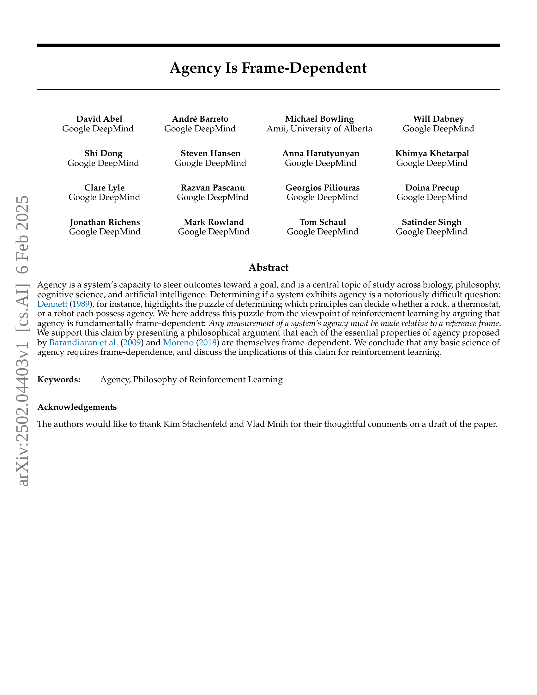
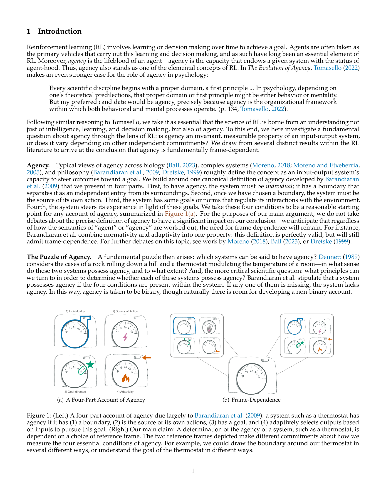
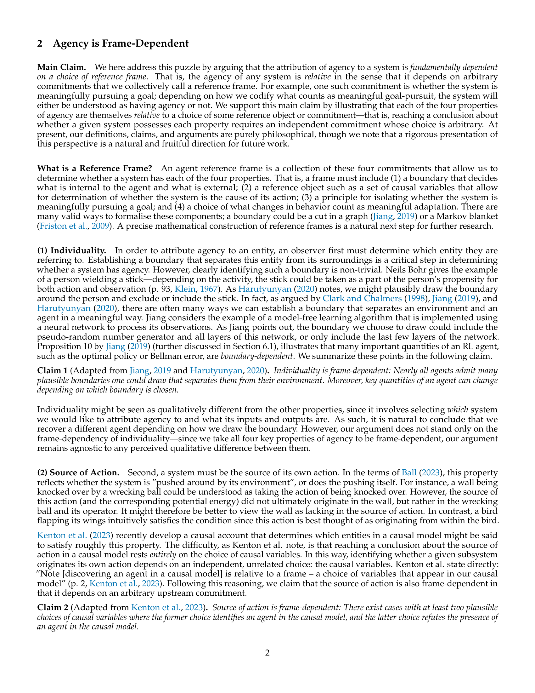
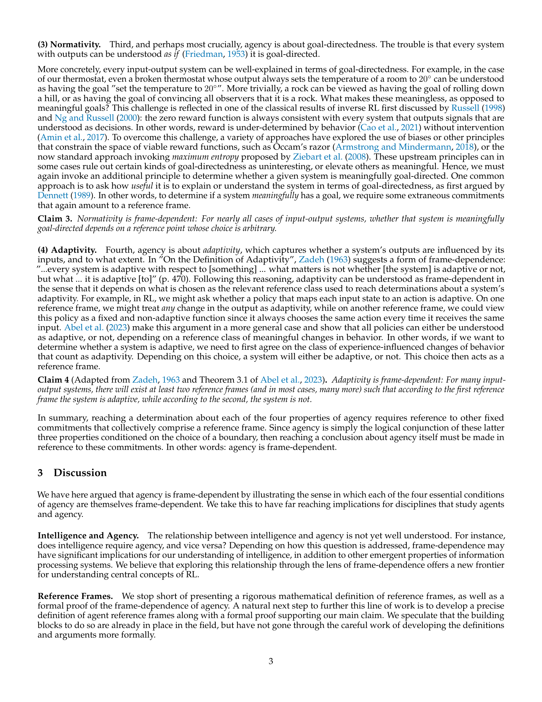
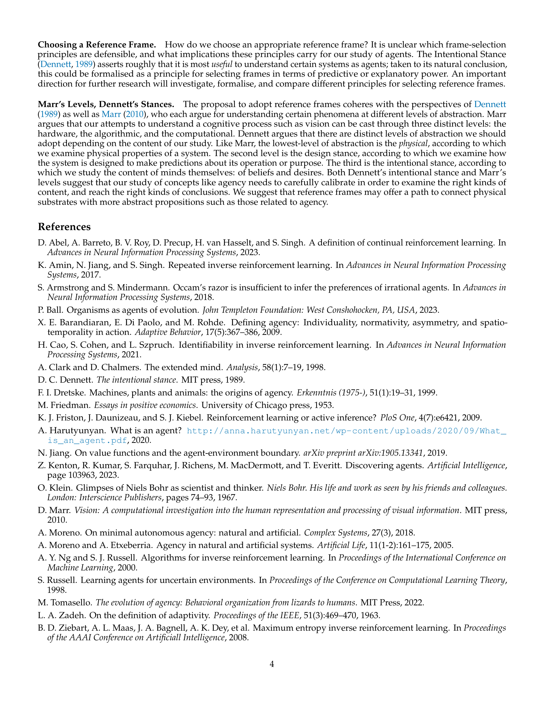

 


 2502.04403 
 David Abel et el. 
 
 🤗 2025-02-10 
 



↗ arXiv


↗ Hugging Face


↗ Papers with Code


### TL;DR



본 논문은 인공지능, 특히 강화학습 분야에서 중심 개념인 '에이전시(agency)'에 대한 기존의 이해에 도전합니다. 기존 연구들은 에이전시를 이분법적으로(있거나 없거나) 바라보는 경향이 있었는데, 본 논문은 에이전시가 **참조 틀(reference frame)**에 따라 상대적으로 결정된다는 주장을 제기합니다. 즉, 어떤 시스템이 에이전시를 지니는지 여부는 관찰자의 관점과 설정에 따라 달라질 수 있다는 것입니다. 

본 논문은 에이전시의 4가지 핵심 속성(개별성, 행위의 근원, 목표 지향성, 적응성)을 분석하여 각 속성이 모두 참조 틀에 의존적임을 보여줍니다.  이는 에이전시에 대한 과학적 이해를 위해서는 **참조 틀의 중요성을 인지**해야 함을 의미합니다. 본 연구는 철학적 논증을 바탕으로 이러한 주장을 뒷받침하며, 강화학습 분야에 새로운 연구 방향을 제시합니다.  이는 **강화학습 알고리즘의 발전**뿐 아니라, **인공지능 시스템의 설계 및 이해**에 중요한 함의를 가집니다.



#### Key Takeaways


 에이전시는 참조 틀에 따라 달라지는 상대적인 개념이다. 



 에이전시의 네 가지 핵심 속성(개별성, 행위의 근원, 규범성, 적응성) 모두 참조 틀에 의존적이다. 



 본 연구는 강화학습 분야에 새로운 관점을 제시하며, 향후 에이전시에 대한 연구 및 알고리즘 개발에 중요한 의미를 가진다. 


#### Why does it matter?
본 논문은 **에이전시(agency)의 개념을 재정의**하고, **강화학습(Reinforcement Learning) 분야에 새로운 관점**을 제시하여 연구의 폭을 넓히는 데 중요한 의미를 가집니다. **참조 틀(reference frame)의 중요성**을 강조하여 에이전시에 대한 기존의 이분법적 사고를 넘어서는 새로운 패러다임을 제시하며, **다양한 학문 분야의 연구자들에게 영감**을 줄 수 있습니다. 또한, 에이전시에 대한 보다 정확하고 포괄적인 이해를 바탕으로 **강화학습 알고리즘 개선 및 새로운 응용 분야 발굴**에 기여할 수 있습니다.

------
#### Visual Insights

> 🔼 (a)는 Barandiaran 등(2009)의 연구를 기반으로 한, agency의 4가지 구성 요소를 보여주는 그림입니다.  agency를 갖는 시스템은 1) 개별성(Individuality), 2) 행동의 근원(Source of Action), 3) 목표 지향성(Goal-directed), 4) 적응성(Adaptivity)의 네 가지 조건을 모두 충족해야 합니다. 그림은 각 조건을 간략하게 설명하는 다이어그램과 함께 제시되어 있습니다. 예를 들어, 온도 조절 장치의 경우 경계(boundary), 자체 행동의 근원, 목표(목표 온도 설정), 환경 변화에 따른 적응 등 네 가지 조건을 모두 만족하므로 agency를 가진다고 볼 수 있습니다.
> 

> 
read the caption

> (a) A Four-Part Account of Agency
> 

### Full paper



