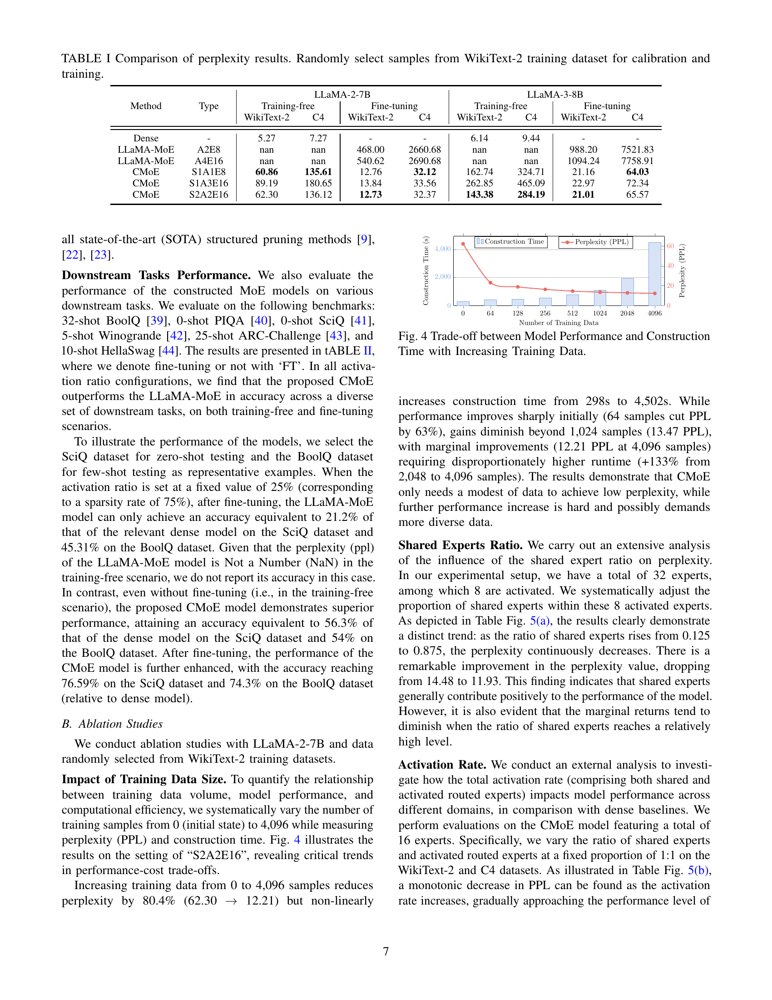

 


 2502.04416 
 Zehua Pei et el. 
 
 🤗 2025-02-10 
 



↗ arXiv


↗ Hugging Face


↗ Papers with Code


### TL;DR



대규모 언어 모델(LLM)은 뛰어난 성능을 보이지만, 추론에 많은 자원이 필요하다는 단점이 있습니다. 이 문제를 해결하기 위해 혼합 전문가(MoE) 아키텍처가 제시되었지만, 기존의 MoE 모델 학습에는 많은 데이터와 자원이 필요했습니다.  이는 실제 환경에서 MoE 모델의 활용을 제한하는 요인이 됩니다.

본 논문에서는 CMoE라는 새로운 프레임워크를 제시하여 이 문제를 해결합니다. CMoE는 **기존의 밀집 모델을 효율적으로 재구성하여 MoE 모델을 생성**합니다. 특히, **활성화율에 따라 뉴런을 그룹화하고, 학습 없이도 라우팅 메커니즘을 구축**합니다.  **소량의 데이터를 사용하여 7B 밀집 모델에서 단 5분 만에 사용 가능한 MoE 모델을 생성**하고, **경량화된 미세 조정을 통해 1시간 이내에 고성능을 회복**시키는 놀라운 결과를 보여줍니다.



#### Key Takeaways


 CMoE는 기존의 밀집 LLM에서 효율적으로 MoE 모델을 생성하는 새로운 프레임워크입니다. 



 CMoE는 전문가 그룹화 및 경량화된 적응을 통해 효율적인 MoE 모델을 생성하며, 미세 조정 없이도 상당한 성능을 유지합니다. 



 CMoE는 짧은 시간 내에 고성능 MoE 모델을 생성하고, 경량화된 미세 조정을 통해 성능을 빠르게 회복시킬 수 있습니다. 


#### Why does it matter?
본 논문은 **LLM 추론의 효율성을 크게 향상시키는 새로운 방법론**을 제시하여,  **자원 제약이 있는 환경에서도 LLM을 효과적으로 배포 및 활용**할 수 있도록 하는 데 중요한 의미를 가집니다.  **기존의 MoE 모델 학습에 필요한 방대한 데이터와 막대한 컴퓨팅 자원을 절약**하고, **경량화된 미세 조정을 통해 성능을 빠르게 회복**시키는 것은 LLM 분야 연구에 큰 영향을 미칠 것입니다. 또한, 본 논문에서 제시된 **새로운 접근 방식은 LLM의 효율적인 구축 및 최적화**에 대한 새로운 연구 방향을 제시합니다.

------
#### Visual Insights

> 🔼 본 그림은 제안된 CMoE 모델의 개요를 보여줍니다. CMoE는 밀집 모델에서 MoE 모델을 효율적으로 생성하는 프레임워크로, 활성화율에 따라 뉴런을 공유 전문가와 라우팅 전문가로 그룹화하는 과정과, 스크래치부터 학습하지 않고 미분 가능한 라우팅 메커니즘과 부하 균형을 통합하는 과정을 거칩니다. 최종적으로, 가벼운 미세 조정을 통해 고성능 MoE 모델을 생성합니다.
> 

> 
read the caption

> Figure 1:  The overview of our proposed CMoE.
> 

### In-depth insights

#### MoE Carving
MoE(Mixture-of-Experts) 카빙은 **기존의 밀집 모델에서 효율적으로 MoE 모델을 생성하는 기법**입니다.  이는 막대한 계산 자원과 데이터를 필요로 하는 기존 MoE 모델 학습 방식의 한계를 극복하기 위한 시도입니다.  **핵심 아이디어는 활성화 패턴 분석을 통해 뉴런을 공유 전문가(shared experts)와 라우팅 전문가(routed experts)로 분류하고, 이를 바탕으로 새로운 MoE 구조를 만드는 것**입니다. 공유 전문가는 대부분의 입력에 대해 활성화되는 뉴런으로 구성되어 공통 지식을 처리하며, 라우팅 전문가는 특정 입력에 따라 선택적으로 활성화되는 뉴런으로 구성되어 특수화된 지식을 처리합니다.  **학습 없이 분석적으로 라우팅 메커니즘을 구성**하는 것이 중요한 특징이며, 이는 **경량화된 미세 조정만으로도 성능을 빠르게 회복**할 수 있도록 합니다.  **결과적으로, MoE 카빙은 계산 비용을 절감하면서  LLM 추론의 효율성을 높이는 데 기여**할 수 있습니다.  하지만, **뉴런 분류의 정확성과 라우팅 메커니즘 설계의 효율성**이 전체 시스템 성능에 큰 영향을 미치므로, 이 부분에 대한 추가적인 연구가 필요합니다.

#### Router Design
본 논문에서 제안하는 CMoE는 **훈련 없이** 기존의 밀집 모델에서 MoE 모델을 효율적으로 생성하는 데 중점을 둡니다. 이를 위해 **뉴런 활성화 패턴 분석**을 통해 공유 전문가와 라우팅 전문가를 구분하고, **차별화 가능한 라우팅 메커니즘을 훈련 없이 구성**합니다. 즉, 기존 밀집 모델의 활성화 통계를 활용하여 라우팅 함수를 초기화하고, 경량 미세 조정을 통해 성능을 회복합니다. 이러한 접근 방식은 기존의 MoE 모델 재구성 방식보다 훨씬 효율적이며, 제한된 리소스 환경에서도 실용적입니다.  **전문가 그룹화 전략**은 활성화율 기반으로 공유 전문가와 라우팅 전문가를 분류하고, 라우팅 전문가의 균형 있는 할당을 위해 균형 잡힌 K-평균 알고리즘을 사용하여 효율성을 높입니다.  결과적으로, CMoE는 **최소한의 데이터와 시간으로** 고성능 MoE 모델을 생성할 수 있는 매력적인 방법을 제시합니다.

#### Data Efficiency
본 논문은 **데이터 효율성** 측면에서 흥미로운 결과를 제시합니다.  기존의 MoE 모델 학습에는 방대한 양의 데이터가 필요했지만, CMoE는 기존의 7B 크기의 밀집 모델을 5분 내에 MoE 모델로 변환하는 효율적인 방법을 제시하며, 이는 **소량의 데이터만으로도 우수한 성능**을 달성할 수 있음을 보여줍니다.  **사전 훈련 없이도** 합리적인 성능을 유지하며, 짧은 미세 조정 시간 안에 밀집 모델 수준의 성능을 회복합니다.  이는 특히 **자원 제약 환경**에서 매우 중요한 의미를 지닙니다.  **추가적인 실험 결과**는 제한된 데이터로도 CMoE가 우수한 성능을 발휘함을 보여주며, **데이터 효율성 측면에서의 혁신**을 보여줍니다.  **향후 연구**는 더욱 다양한 모델과 데이터셋에 대한 적용 및 데이터 효율성 향상 방안에 초점을 맞춰야 합니다.

#### Expert Grouping
본 논문에서 제시된 '전문가 그룹화' 방법은 **효율적인 LLM 추론을 위한 핵심**입니다.  밀집 모델의 FFN 뉴런들을 공유 전문가와 라우팅 전문가로 나누는 전략을 통해 **계산 비용을 줄이면서 성능을 유지**합니다.  활성화율이 높은 뉴런은 공통 지식을 처리하는 공유 전문가로, 활성화율이 낮고 입력에 따라 활성화 패턴이 다른 뉴런은 특정 작업에 특화된 라우팅 전문가로 분류됩니다.  **라우팅 전문가 그룹화는 균형잡힌 선형 할당 문제**로 공식화되어 Jonker-Volgenant 알고리즘을 이용, 최적의 클러스터링을 수행합니다.  **계산 효율성과 성능 균형을 동시에 고려**하여 설계된 이 전문가 그룹화 전략은 CMoE의 핵심적인 강점이며, **최소한의 미세조정만으로도 우수한 성능**을 달성할 수 있도록 합니다.

#### Future Work
본 논문의 "미래 연구" 부분에 대한 심도있는 고찰은 다음과 같습니다. **CMOE의 효율성을 더욱 높이기 위한 다양한 최적화 기법** 연구가 필요합니다.  **매우 큰 언어 모델(LLM)**에 대한 적용 가능성을 검증하고, **다양한 하드웨어 플랫폼**에서의 성능을 평가하는 추가 실험이 요구됩니다.  **다양한 과제 및 데이터셋**에 대한 성능 평가를 통해 일반화 성능을 확인하고, **다른 MoE 구조**와의 비교 분석을 통해 CMOE의 우수성을 명확히 밝힐 필요가 있습니다.  **경량화된 미세조정 전략**을 개선하여 더욱 빠른 성능 회복을 달성하고,  **더욱 효과적인 전문가 그룹화 알고리즘** 및 **경로 지정 메커니즘** 개발이 중요한 미래 연구 과제입니다. 마지막으로, **CMOE의 이론적 토대를 더욱 튼튼히** 하고, 그 한계점을 명확히 파악하는 연구를 통해 향후 발전 방향을 제시해야 합니다.

### More visual insights

More on figures

> 🔼 그림 2는 3333번째 블록과 1000번째 토큰에 대한 FFN 은닉 상태 벡터 𝐡의 히스토그램을 보여줍니다. 이 히스토그램은 은닉 상태 값의 분포를 나타내며, 대부분의 값이 0에 가까이 분포하고 있음을 보여줍니다. 이는 FFN 내부의 활성화 값이 매우 sparse하며, 0에 가까운 값들이 많다는 것을 시각적으로 보여주는 것입니다. 이러한 sparsity는 Mixture-of-Experts (MoE) 모델의 효율적인 설계에 중요한 정보를 제공합니다.  0을 중심으로 대칭적인 분포를 보이는 것 또한 주목할 만한 점입니다.
> 

> 
read the caption

> Figure 2: The histogram of FFN hidden state 𝐡𝐡\mathbf{h}bold_h for the 3333-th block and the 1,00010001,0001 , 000-th token.
> 

> 🔼 그림 3은 33번째 블록에 대해 Ka=1000일 때 활성화 비율 μ의 히스토그램을 보여줍니다.  이 히스토그램은 각 뉴런이 입력 토큰에 대해 얼마나 자주 활성화되는지를 나타내는 활성화 비율 μ의 분포를 보여줍니다.  x축은 활성화 비율(0에서 1사이의 값)을 나타내고, y축은 해당 활성화 비율을 갖는 뉴런의 개수를 나타냅니다. 히스토그램을 통해 대부분의 뉴런은 낮은 활성화 비율을 가지지만, 일부 뉴런은 높은 활성화 비율을 가지는 것을 확인할 수 있습니다. 이는 일부 뉴런이 공통적인 지식을 인코딩하고 다른 뉴런은 특정 입력에만 반응한다는 것을 시사합니다.  이러한 관찰은 공유 전문가와 라우팅 전문가를 구분하는 기준을 설정하는 데 사용됩니다.
> 

> 
read the caption

> Figure 3: The histogram of activation rates 𝝁𝝁\bm{\mu}bold_italic_μ for the 3333-th block with Ka=1,000subscript𝐾𝑎1000K_{a}=1,000italic_K start_POSTSUBSCRIPT italic_a end_POSTSUBSCRIPT = 1 , 000.
> 

> 🔼 이 그림은 학습 데이터 크기가 증가함에 따라 모델 성능과 생성 시간 사이의 상관관계를 보여줍니다.  x축은 학습 데이터의 개수이고, y축은 perplexity(낮을수록 좋음)와 모델 생성 시간(초)입니다.  그림을 통해 학습 데이터가 증가할수록 perplexity는 감소하지만, 생성 시간은 비선형적으로 증가하는 것을 알 수 있습니다. 초기에는 데이터 증가에 따른 perplexity 감소 효과가 크지만, 특정 데이터 크기(약 1024개)를 넘어서면 perplexity 감소 효과는 미미해지고 생성 시간 증가는 가속화됩니다.  즉, 적절한 데이터 크기를 선택하여 모델 성능과 생성 시간 사이의 균형을 맞추는 것이 중요함을 시사합니다.
> 

> 
read the caption

> Figure 4: Trade-off between Model Performance and Construction Time with Increasing Training Data.
> 

> 🔼 그림 5는 세 가지 ablation study 결과를 보여줍니다. (a)는 공유 전문가 비율이 모델 성능에 미치는 영향을, (b)는 활성화 비율이 모델 성능에 미치는 영향을, (c)는 부하 균형의 효과를 각각 나타냅니다.  (a)에서는 공유 전문가 비율이 증가함에 따라 perplexity가 감소하는 것을 보여주고, (b)에서는 활성화 비율이 증가함에 따라 perplexity가 감소하는 것을 보여주며, (c)에서는 부하 균형 메커니즘을 적용했을 때 전문가 간의 부하 분포가 균등해지는 것을 보여줍니다.
> 

> 
read the caption

> Figure 5:  Ablation studies:(a) Impact of shared expert ratio on model performance; (b) Activation Rate vs. Model Performance; (c) Effect of Load Balancing.
> 

### Full paper



