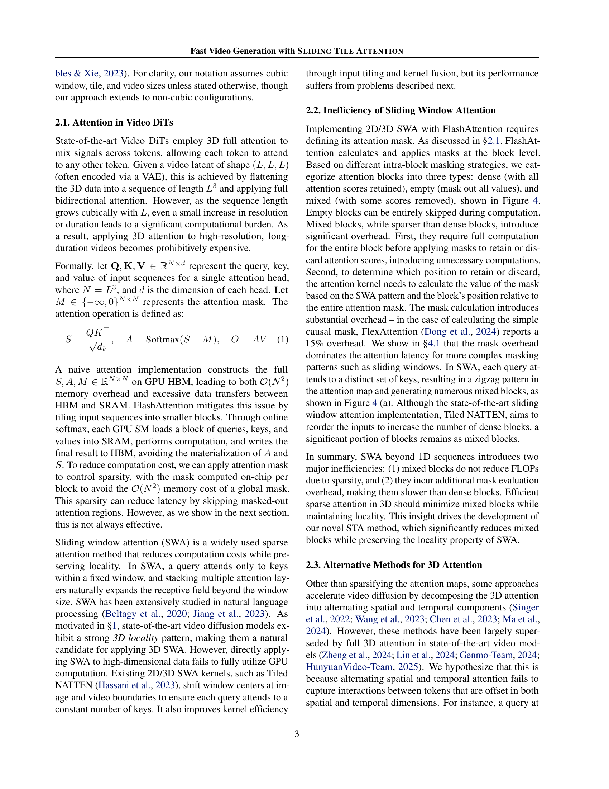
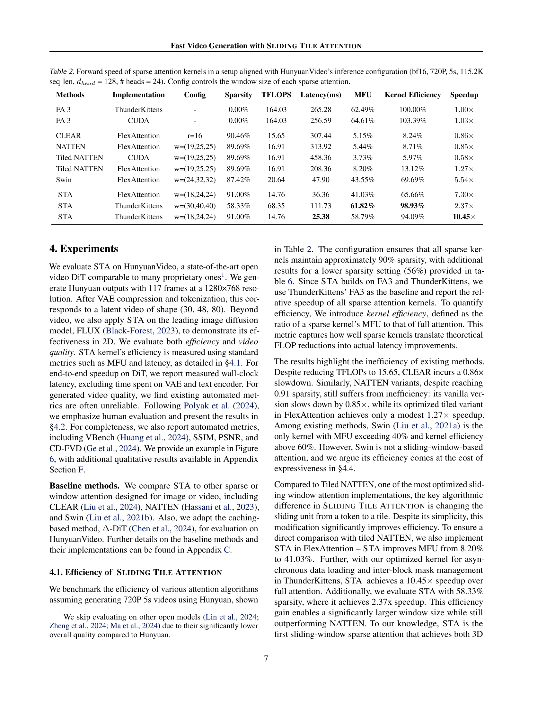

 


 2502.04507 
 Peiyuan Zhang et el. 
 
 🤗 2025-02-10 
 



↗ arXiv


↗ Hugging Face


↗ Papers with Code


### TL;DR



고해상도 비디오 생성은 뛰어난 성능을 보이지만, **엄청난 계산 비용** 때문에 실제 활용에 어려움이 있습니다. 기존의 슬라이딩 윈도우 어텐션 방식은 계산 효율성이 낮다는 단점이 있었습니다. 이 논문은 이러한 문제를 해결하기 위해 **새로운 슬라이딩 타일 어텐션(STA)**을 제안합니다.

STA는 **타일 단위로 어텐션을 계산**하여 불필요한 계산을 줄이고 하드웨어 효율성을 높였습니다.  **실험 결과, STA는 기존 방법보다 2.8~17배 빠른 속도**를 보였으며, **비디오 생성 품질 저하 없이 추론 시간을 크게 단축**했습니다.  **STA는 하드웨어 설계와 알고리즘을 함께 고려**하여 설계되었으며, 다양한 비디오 생성 모델에 적용될 수 있는 범용적인 기술입니다.  이 연구는 **비디오 생성 기술의 발전과 실용화에 크게 기여**할 것으로 예상됩니다.



#### Key Takeaways


 슬라이딩 타일 어텐션(STA)은 기존의 슬라이딩 윈도우 어텐션의 한계를 극복하고 하드웨어 효율성을 높였습니다. 



 STA는 비디오 생성 모델의 성능을 저하시키지 않고 추론 속도를 2.8~17배 향상시켰습니다. 



 본 연구는 고해상도 비디오 생성 기술의 실용화에 중요한 기여를 할 것으로 예상됩니다. 


#### Why does it matter?
본 논문은 **비디오 생성 분야의 핵심적인 문제인 계산 비용을 크게 줄이는 혁신적인 방법**을 제시합니다.  **고해상도 비디오 생성 모델의 성능을 저하시키지 않고 추론 속도를 획기적으로 향상**시킨 이 연구는, 비디오 생성 기술의 실용화에 큰 영향을 미칠 것으로 예상됩니다.  또한, 제시된 슬라이딩 타일 어텐션(STA) 기법은 다양한 영상처리 분야에 적용 가능하며, 향후 연구에 있어 새로운 가능성을 제시합니다.  **특히, 하드웨어 효율성에 초점을 맞춰 설계된 STA는 GPU의 성능을 최대한 활용**하여 더욱 빠르고 효율적인 비디오 생성을 가능하게 합니다.

------
#### Visual Insights

> 🔼 그림 1은 두 가지 하위 그림으로 구성되어 있습니다. (a)는 Hunyuan 모델을 사용하여 5초 길이의 720P 비디오를 생성하는 데 11.5만 개의 토큰을 처리해야 하며, 이 중 어텐션 연산이 가장 많은 비용을 차지한다는 것을 보여줍니다. (b)는 기존 어텐션 메커니즘과 제안된 STA(Sliding Tile Attention)의 어텐션 연산 지연 시간을 비교합니다. 기존 방법들은 FLOP(Floating Point Operations) 감소에도 불구하고 실제 속도 향상으로 이어지지 않았지만, STA는 하드웨어 효율성을 높여 어텐션 스파스티(sparsity)에 비례하는 속도 향상을 달성합니다.
> 

> 
read the caption

> Figure 1: (a) Generating a 5s 720P clip in Hunyuan involves processing 115K tokens, making attention the dominant cost. (b) Attention latency comparison: existing methods fail to translate FLOP reduction into wall-clock speedup; STA is hardware-efficient and achieves proportional speedup with sparsity.
> 


| **Attention** | **Window Size** | **Dense Block** | **Mixed Block** |
|---|---|---|---|
| Tiled NATTEN | (11,11,11) | 0.06% | 7.17% |
| STA | (12, 12, 12) | 1.56% | 0.0% |
| STA | (20, 20, 20) | 7.23% | 0.0% |

> 🔼 이 표는 타일 크기가 (4,4,4)이고 비디오 크기가 (48,48,48)일 때, Tiled NATTEN과 STA의 조밀 블록과 혼합 블록의 비율을 보여줍니다.  Tiled NATTEN은 조밀 블록과 혼합 블록이 섞여있지만, STA는 GPU에서 계산 효율이 더 좋은 조밀 블록만 생성합니다. 혼합 블록은 GPU 연산에 비효율적이기 때문에, STA의 조밀 블록만 생성하는 특징은 성능 향상에 기여합니다.  즉, 이 표는 STA의 효율성을 보여주는 주요 근거가 됩니다.
> 

> 
read the caption

> Table 1: Ratio of dense and mixed blocks for tiled NATTEN and STA  with tile size (4,4,4) and video size (48,48,48). STA generate only dense blocks, which is more computationally friendly than mixed blocks in GPU.
> 

### In-depth insights

#### 3D Attention Sparsity
본 논문에서 3D 어텐션 스파스티는 비디오 생성 모델의 효율성을 높이기 위한 핵심 전략으로 제시됩니다. **기존의 3D 풀 어텐션은 계산 비용이 매우 높아 고해상도, 장시간 비디오 생성에 큰 제약이 되었는데**, 3D 어텐션 스파스티는 이러한 문제를 해결하기 위해 **사전 훈련된 비디오 확산 모델에서 어텐션 점수가 주로 국지적인 3D 윈도우 내에 집중되는 현상을 활용**합니다. 이를 통해 불필요한 계산을 제거하고 효율성을 높이는 것입니다.  **슬라이딩 타일 어텐션(STA)**은 이러한 아이디어를 구현하는 구체적인 방법으로 제시되었으며, 기존의 토큰 단위 슬라이딩 윈도우 어텐션과 달리 타일 단위로 연산하여 하드웨어 효율성을 높입니다.  **STA는 하드웨어 인식 슬라이딩 윈도우 설계를 통해 표현력을 유지하면서 하드웨어 효율성을 높이고, 세심한 커널 최적화를 통해 효율적인 2D/3D 슬라이딩 윈도우 어텐션을 구현**하는 데 성공했습니다.  결과적으로, **어텐션 연산 속도를 크게 향상시켜 전체 비디오 생성 지연 시간을 단축**하는 효과를 보였습니다.  이는 비디오 생성 모델의 실용성을 높이는 데 크게 기여할 것으로 기대됩니다.

#### STA Hardware Design
본 논문에서는 SLIDING TILE ATTENTION (STA)의 하드웨어 설계에 대한 심층적인 논의가 부족하지만, 몇 가지 중요한 점을 추론해볼 수 있습니다.  **하드웨어 효율성을 극대화하기 위해 타일 기반의 슬라이딩 윈도우 방식을 채택**했을 것으로 예상됩니다. 이는 기존 토큰 단위 슬라이딩 윈도우 방식보다 **메모리 접근 및 병렬 처리에 유리**하며, **불규칙적인 어텐션 마스크 생성을 방지**하여 GPU 활용도를 높였을 것입니다.  **프로듀서-컨슈머 패러다임**을 활용하여 데이터 전송 및 연산을 비동기적으로 처리함으로써 오버헤드를 줄였을 가능성이 높습니다.  **FlexAttention 및 ThunderKittens과의 통합**을 통해 하드웨어 최적화를 진행했을 것이며, 특히 **커널 레벨 최적화**를 통해 최대 58.79%의 MFU를 달성했을 것으로 예상됩니다. **최적의 타일 크기 및 윈도우 크기 선택**은 성능과 정확도의 균형을 맞추는 데 중요한 요소였을 것입니다.  **헤드 특수화**를 고려하여 각 헤드별 최적의 설정을 자동으로 찾는 메커니즘을 구현했을 것으로 예상됩니다.  **추가적인 하드웨어 가속화 기법**들을 STA에 통합하여, 높은 처리량과 낮은 지연시간을 동시에 달성하는 것이 STA 하드웨어 설계의 주요 목표였을 것입니다.

#### Video Generation Speedup
본 논문은 **슬라이딩 타일 어텐션(STA)**이라는 새로운 기법을 통해 비디오 생성 속도를 크게 향상시키는 방법을 제시합니다. 기존의 3D 풀 어텐션 방식은 계산 비용이 매우 높아 고해상도 비디오 생성에 어려움이 있었는데, STA는 사전 학습된 비디오 확산 모델에서 어텐션 점수가 국소적인 3D 윈도우에 집중되는 현상을 이용합니다.  **타일 단위로 슬라이딩하며 어텐션을 계산**하여 중복 계산을 제거하고 하드웨어 효율성을 높였습니다.  실험 결과, STA는 기존 방법들보다 2.8~17배 빠른 어텐션 계산 속도를 보였으며, 대표적인 비디오 DiT 모델인 HunyuanVideo의 경우,  **종단 간 처리 시간을 945초에서 268초로 단축**하는 놀라운 성능 향상을 달성했습니다. 이는 품질 저하 없이 이뤄낸 성과이며, 추가적인 파인튜닝을 통해 더욱 향상된 속도를 얻을 수 있음을 보여줍니다.  **하드웨어 친화적인 설계**와 **세밀한 커널 최적화**를 통해 이러한 뛰어난 성능을 구현했다는 점이 인상적입니다.

#### Locality in Video DiTs
영상 확산 트랜스포머(Video DiTs)에서의 지역성(Locality)은 **선행 훈련된 모델에서 어텐션 점수가 주로 국지적인 3D 윈도우 내에 집중되는 현상**을 의미합니다. 이는 인접 프레임 간의 유사성과 공간적으로 가까운 픽셀 간의 강한 상관관계로 인해 발생합니다.  **전체 어텐션을 계산하는 대신 국지적인 영역에 대한 어텐션만 계산**함으로써 계산 비용을 크게 줄일 수 있습니다.  이는 슬라이딩 윈도우 어텐션과 같은 기법을 통해 효율적으로 구현될 수 있으며,  **하드웨어 효율성을 고려한 설계**가 성능 향상에 중요한 역할을 합니다.  **헤드 특수화** 현상 또한 고려되어야 하는데, 이는 각 어텐션 헤드가 서로 다른 지역성 패턴을 보이는 현상입니다. 따라서, **헤드별 최적의 윈도우 크기를 자동으로 설정**하는 메커니즘이 필요합니다.  이러한 지역성을 효과적으로 활용하여 계산량을 줄이는 동시에 성능 저하를 최소화하는 것이 Video DiTs의 효율성을 높이는 핵심입니다.

#### Future of STA
STA는 비디오 생성 분야의 3D 어텐션 연산의 효율성을 획기적으로 개선한 기술로, **향후 발전 가능성이 매우 높습니다.**  **하드웨어 최적화를 통한 속도 향상**은 물론, **다양한 비디오 모델 및 해상도에 대한 적용성 확대**가 기대됩니다. 특히, **모델 학습 과정과의 통합**을 통해 더욱 높은 성능을 도출하고, **다른 희소 어텐션 기법과의 결합**을 통해 시너지 효과를 창출할 수 있습니다.  **저해상도 영상에서의 성능 개선 연구** 또한 중요하며, **실시간 비디오 생성에 대한 응용 가능성**은 STA의 실질적인 가치를 더욱 높여줄 것입니다.  **에너지 효율성 향상**을 위한 연구도 필수적이며, **대규모 모델에 대한 적용성 검증**을 통해 상용화 가능성을 타진할 필요가 있습니다.

### More visual insights

More on figures

> 🔼 그림 2는 어텐션의 국지성(locality)을 시각화한 것입니다. 녹색 점은 쿼리(질의) 점을 나타내고, 마그마 색상의 영역은 해당 쿼리에 대한 응답으로 높은 어텐션 값을 갖는 영역을 보여줍니다. 그림에서 보듯이, 쿼리는 전체 이미지에 어텐션을 두는 대신 집중된 국지적 영역(hotspot)에만 어텐션을 집중하는 것을 알 수 있습니다. 이는 사전 훈련된 비디오 확산 모델에서 어텐션 점수가 주로 국지적인 3D 윈도우 내에 집중되어 있음을 보여주는 것입니다.
> 

> 
read the caption

> Figure 2: Visualization of attention locality. The green point means the query point and the magma-colored regions indicate areas of high attention values in response to the query. Instead of attending to the entire image, the query’s attention forms a concentrated local hotspot.
> 

> 🔼 그림 3은 훈련된 비디오 확산 모델에서 어텐션 점수의 국지성을 보여줍니다. 왼쪽 그림은 10개의 다른 프롬프트에 대해 확산 과정 전반에 걸쳐 (12, 24, 24) 크기의 작은 3차원 창 안에 있는 어텐션 점수의 비율을 보여줍니다. 대부분의 헤드에서 높은 재현율을 보이는데, 이는 어텐션이 주로 국지적인 공간-시간 영역에 집중됨을 나타냅니다. 오른쪽 그림은 헤드 간 재현율의 차이에도 불구하고 프롬프트 간 표준 편차가 낮다는 것을 보여줍니다. 이는 모델이 프롬프트에 관계없이 일관된 국지적 어텐션 패턴을 따른다는 것을 시사합니다.
> 

> 
read the caption

> Figure 3: Left: Fraction of attention scores within a (12, 24, 24) local window across diffusion steps and 10 different prompts. Most heads show high recall, indicating a local attention pattern. Right: Despite the different recall across heads, the standard deviation across prompts remains low.
> 

> 🔼 그림 4는 NATTEN, Tiled NATTEN 및 STA의 어텐션 맵을 보여줍니다. 이미지 크기는 24x24이고, 지역 윈도우 크기는 12x12이며, 타일 크기는 4x4로 설정했습니다. (a) NATTEN은 플래시 어텐션 계산에 매우 비효율적인 많은 혼합 블록을 생성합니다. (b) Tiled NATTEN은 밀집 블록의 수를 늘리지만, 혼합 블록은 여전히 남아 있습니다. (c) STA는 혼합 블록을 완전히 제거하여 GPU 계산을 매우 효율적으로 만듭니다. 이 논문에서는 주로 비디오 생성을 위한 3D 시나리오에서 STA의 적용을 보여주지만, 더 나은 설명을 위해 2D 시나리오를 이 그림에 제시합니다.
> 

> 
read the caption

> Figure 4: The attention map of NATTEN, Tiled NATTEN, and STA. We plot with an image size 24×\times×24 and a 12×\times×12 local window. The tile size is set to 4×\times×4. (a) NATTEN creates many mixed blocks that are very inefficient for Flash Attention computation. (b) Tiled NATTEN increases the number of dense blocks, but the mixed blocks persist. (c) STA completely eliminates the mixed block, making the computation extremely friendly for GPU. Note that we mainly show STA’s application in 3D scenarios for video generation in this paper, but for better illustration, we present the 2D scenario in this plot.
> 

> 🔼 그림 5는 2차원 슬라이딩 타일 어텐션(STA) 메커니즘을 보여줍니다. 타일 크기는 (2, 2), 윈도우 크기는 (6, 6)으로 설정되어 있습니다. 각 쿼리 타일은 모든 키 타일을 참조한 후, 어텐션 맵에 9개의 4x4 크기의 조밀한 블록을 생성합니다. 이 그림은 3차원 STA를 보다 쉽게 이해할 수 있도록 2차원으로 단순화하여 보여줍니다. 3차원 STA는 유사한 방식으로 작동하지만, 공간 차원이 하나 더 추가됩니다.  즉, 2차원에서 타일과 윈도우가 2차원 평면 상에서 이동하는 것처럼, 3차원에서는 타일과 윈도우가 시간 축을 포함한 3차원 공간에서 이동합니다.  이 그림을 통해 쿼리와 키 간의 공간적 관계와 STA의 효율적인 계산 방식을 시각적으로 이해할 수 있습니다.
> 

> 
read the caption

> Figure 5: 2D Sliding Tile Attention with tile size (2, 2) and window size (6, 6). After attending to all the key tiles, each query tile will generate nine 4x4 dense blocks in the attention map. We showcase 2D STA for better illustration. 3D STA can be inferred similarly.
> 

> 🔼 그림 6은 훈련 전후의 비디오 생성 품질을 비교 분석한 것입니다. 훈련 후 STA-t-2.43x 모델은 출력 분포에 약간의 변화가 있지만, 여전히 높은 화질의 비디오를 생성합니다. 반면, ΔΔ\Deltaroman_Δ-DiT 모델은 원본 HunyuanVideo 및 STA 모델에 비해 생성된 비디오의 선명도가 떨어집니다. 5초 분량의 720P 고화질 비디오를 사용하여 모델의 성능을 시각적으로 보여줍니다.
> 

> 
read the caption

> Figure 6: Qualitative example of 720P 5-second videos. While fine-tuning introduces minor shifts in the output distribution of STA-t-2.43x, the model still preserves high video generation quality. Videos generated by ΔΔ\Deltaroman_Δ-DiT are generally less sharp than those generated by the original HunyuanVideo and  STA.
> 

> 🔼 이 그림은 MovieGen Bench(Polyak et al., 2024)의 200개 프롬프트에 대한 사람의 평가 결과를 보여줍니다. STA는 원본 HunyuanVideo와 비슷한 성능을 유지하면서 엔드-투-엔드 속도를 1.36배 향상시켰습니다. 또한, STA는 다양한 추론 예산에서 A-DiT를 지속적으로 능가하는 것으로 나타났습니다.  그림은 STA의 효율성과 성능을 명확하게 보여주는 다양한 비교 모델들의 성능을 비교 분석한 결과를 시각적으로 제시합니다.
> 

> 
read the caption

> Figure 7: Human evaluation on 200 prompts from the MovieGen Bench (Polyak et al., 2024). STA achieves a 1.36× end-to-end speedup while maintaining performance comparable to the original HunyuanVideo. Additionally, STA consistently outperforms ΔΔ\Deltaroman_Δ-DiT across different inference budgets.
> 

> 🔼 그림 8은 2차원 이미지를 1차원 시퀀스로 변환하는 두 가지 방법을 보여줍니다. 왼쪽은 기존의 지그재그 방식을, 오른쪽은 논문에서 제안하는 STA(Sliding Tile Attention) 방식을 나타냅니다.  STA는 3x3 크기의 타일을 사용하여 9x9 이미지를 처리하는 예시를 보여줍니다. 지그재그 방식은 픽셀을 순차적으로 1차원 배열로 변환하지만, STA는 3x3 타일 단위로 이미지를 나누어 처리하여 연속적인 토큰 인덱스를 유지합니다. 이러한 STA의 타일 기반 접근 방식은 연산 효율성을 높이고, 특히 하드웨어 가속에 유리합니다.  이는 이후 단락에서 설명하는 SLIDING TILE ATTENTION 알고리즘의 핵심 개념을 시각적으로 설명해줍니다.
> 

> 
read the caption

> Figure 8: Left: Conventional zigzag flattening strategy. Right: STA’ sequence flattening strategy. The plot is given assuming a (9, 9) image with (3, 3) tile size.
> 

> 🔼 그림 9는 2차원 슬라이딩 윈도우 어텐션 메커니즘의 시각화를 보여줍니다.  각 쿼리 토큰은 중심을 기준으로 특정 크기의 윈도우 내에 있는 키 토큰들과만 어텐션을 계산합니다.  윈도우는 토큰 단위로 슬라이딩하며, 각 윈도우마다 쿼리와 키 간의 어텐션이 계산됩니다. 이 그림을 통해 슬라이딩 윈도우 어텐션이 어떻게 동작하는지, 그리고 쿼리 토큰이 전체 공간이 아닌 국부적인 영역에만 집중하여 어텐션을 계산하는지 직관적으로 이해할 수 있습니다.
> 

> 
read the caption

> Figure 9: 2D Sliding Window Attention visualization.
> 

> 🔼 그림 10은 훈련된 STA(STA-t-2.43x)의 출력 분포에 약간의 변화가 있지만, 고품질의 비디오 생성 능력은 유지함을 보여줍니다.  대조적으로, A-DiT 모델은 원본 HunyuanVideo나 STA 모델에 비해 생성된 비디오의 선명도가 떨어집니다.  즉,  STA 기반 모델이 기존 모델에 비해 비디오 화질이 더 우수함을 시각적으로 비교 분석한 그림입니다. 두 가지 다른 프롬프트에 대한 비디오 생성 결과를 보여주는 비교 이미지가 포함되어 있습니다.
> 

> 
read the caption

> Figure 10: Qualitative comparisons. While fine-tuning introduces minor shifts in the output distribution of STA-t-2.43x, the model still preserves high video generation quality. Videos generated by ΔΔ\Deltaroman_Δ-DiT are generally less sharp than those generated by the original HunyuanVideo and  STA.
> 

> 🔼 그림 11은 훈련 없이 STA를 적용한 모델(STA-tf-1.36x), 미세 조정을 통해 STA를 적용한 모델(STA-t-2.43x), 그리고 A-DiT 모델이 생성한 비디오와 원본 HunyuanVideo 모델이 생성한 비디오를 정성적으로 비교한 결과를 보여줍니다. 미세 조정을 거친 STA-t-2.43x 모델은 출력 분포에 약간의 변화가 있지만, 여전히 높은 화질의 비디오 생성 능력을 유지합니다. 반면에 A-DiT 모델은 원본 HunyuanVideo 및 STA 모델에 비해 생성된 비디오의 선명도가 떨어지는 경향을 보입니다.  즉, 본 그림은 제안된 STA 방법이 비디오 생성 품질을 유지하면서 속도 향상을 달성함을 시각적으로 보여주는 정성적 비교 결과를 제시합니다.
> 

> 
read the caption

> Figure 11: Qualitative comparisons. While fine-tuning introduces minor shifts in the output distribution of STA-t-2.43x, the model still preserves high video generation quality. Videos generated by ΔΔ\Deltaroman_Δ-DiT are generally less sharp than those generated by the original HunyuanVideo and  STA.
> 

More on tables


| Methods | Implementation | Config | Sparsity | TFLOPS | Latency(ms) | MFU | Kernel Efficiency | Speedup |
|---|---|---|---|---|---|---|---|---|
| FA 3 | ThunderKittens | - | 0.00% | 164.03 | 265.28 | 62.49% | 100.00% | 1.00× |
| FA 3 | CUDA | - | 0.00% | 164.03 | 256.59 | 64.61% | 103.39% | 1.03× |
| CLEAR | FlexAttention | r=16 | 90.46% | 15.65 | 307.44 | 5.15% | 8.24% | 0.86× |
| NATTEN | FlexAttention | w=(19,25,25) | 89.69% | 16.91 | 313.92 | 5.44% | 8.71% | 0.85× |
| Tiled NATTEN | CUDA | w=(19,25,25) | 89.69% | 16.91 | 458.36 | 3.73% | 5.97% | 0.58× |
| Tiled NATTEN | FlexAttention | w=(19,25,25) | 89.69% | 16.91 | 208.36 | 8.20% | 13.12% | 1.27× |
| Swin | FlexAttention | w=(24,32,32) | 87.42% | 20.64 | 47.90 | 43.55% | 69.69% | 5.54× |
| STA | FlexAttention | w=(18,24,24) | 91.00% | 14.76 | 36.36 | 41.03% | 65.66% | 7.30× |
| STA | ThunderKittens | w=(30,40,40) | 58.33% | 68.35 | 111.73 | 61.82% | 98.93% | 2.37× |
| STA | ThunderKittens | w=(18,24,24) | 91.00% | 14.76 | 25.38 | 58.79% | 94.09% | 10.45× |
> 🔼 표 2는 HunyuanVideo 추론 설정(bf16, 720P, 5초, 115.2K seq_len, head 차원 = 128, head 수 = 24)과 일치하도록 구성된 환경에서 여러 가지 희소 어텐션 커널의 순전파 속도를 보여줍니다.  각 희소 어텐션의 창 크기는 'Config' 열에서 제어됩니다.  표는 각 방법의 구현, 구성, 희소성, TFLOPS, 지연 시간(밀리초), MFU(Memory Footprint Utilization), 커널 효율성, 속도 향상 배수를 비교하여,  다양한 희소 어텐션 기법의 성능을 비교 분석합니다.
> 

> 
read the caption

> Table 2: Forward speed of sparse attention kernels in a setup aligned with HunyuanVideo’s inference configuration (bf16, 720P, 5s, 115.2K seq_len, dh⁢e⁢a⁢dsubscript𝑑ℎ𝑒𝑎𝑑d_{head}italic_d start_POSTSUBSCRIPT italic_h italic_e italic_a italic_d end_POSTSUBSCRIPT = 128, # heads = 24). Config controls the window size of each sparse attention.
> 


| Model | SSIM ↑ | PSNR ↑ | CD-FVD ↓ | Latency | Speedup |
|---|---|---|---|---|---| 
| **steps = 50** |  |  |  |  |  |
| Δ-DiT | 72.86% | 18.09 | 122.74 | 693s | 1.36 × |
| STA | 76.21% | 19.94 | 97.03 | 695s | 1.36 × |
| **steps = 25** |  |  |  |  |  |
| Δ-DiT | 77.91% | 19.86 | 196.25 | 352s | 1.34 × |
| STA | 82.47% | 22.53 | 95.86 | 348s | 1.36 × |
| **steps = 10** |  |  |  |  |  |
| Δ-DiT | 83.19% | 21.20 | 201.24 | 144s | 1.32 × |
| STA | 87.15% | 24.04 | 80.41 | 139s | 1.36 × |
> 🔼 표 3은 다양한 샘플링 단계에서 학습 없이 수행한 성능을 보여줍니다.  A-DiT 모델은 STA 모델에 비해 일관되게 낮은 화질을 보이며, 추론 단계가 감소할수록 그 차이가 더욱 커집니다.  즉, 동일한 계산 비용으로 A-DiT보다 STA가 더 좋은 화질의 비디오를 생성한다는 것을 의미합니다. 표에는 SSIM, PSNR, CD-FVD 지표와 추론 시간, 속도 향상 비율이 포함되어 있어 각 모델의 성능과 효율성을 비교 분석하는 데 유용합니다.
> 

> 
read the caption

> Table 3: Training-free performance with varying sampling steps. ΔΔ\Deltaroman_Δ-DiT shows consistently worse quality compared to STA, and that gap widens as the number of inference steps decrease.
> 


| Methods | Config | VBench Quality | VBench Semantic | VBench Total | Attn Sparsity | PFLOPS | Latency | Speedup |
|---|---|---|---|---|---|---|---|---|
| FA2 | – | 85.34% | 72.17% | 82.71% | 0.00% | 574.16 | 1496s | 0.63× |
| FA3 | – | 85.34% | 72.17% | 82.71% | 0.00% | 574.16 | 945s | 1.00× |
| *w.o training* |  |  |  |  |  |  |  |  |
| CLEAR | r=32 | 84.41% | 74.20% | 82.37% | 56.23% | 280.90 | 2567s | 0.37× |
| Tiled NATTEN | w=(30,41,41) | 84.61% | 75.00% | 82.69% | 58.33% | 269.92 | 1858s | 0.51× |
| Swin | w=(48,64,64) | 80.91% | 71.35% | 79.00% | 55.81% | 283.11 | 762s | 1.24× |
| Swin | w=(30,40,40) | 78.84% | 72.28% | 77.53% | 76.49% | 175.20 | 497s | 1.90× |
| STA | w=(30,40,40) | 84.63% | 73.83% | 82.46% | 58.33% | 269.92 | 527s | 1.79× |
| STA | w=(18,24,24) | 81.47% | 77.03% | 80.58% | 91.00% | 99.54 | 268s | 3.53× |
| *w. training* |  |  |  |  |  |  |  |  |
| Swin | w=(30,40,40) | 77.50% | 67.39% | 75.48% | 55.81% | 283.08 | 497s | 1.90× |
| STA | w=(30,24,40) | 85.37% | 73.52% | 83.00% | 75.00% | 182.99 | 388s | 2.44× |
| STA | w=(18,24,24) | 84.76% | 74.05% | 82.62% | 91.00% | 99.54 | 268s | 3.53× |
> 🔼 표 4는 다양한 희소 어텐션 패턴에 대한 VBench 성능을 비교 분석한 표입니다.  본 논문에서는 SLIDING TILE ATTENTION (STA) 알고리즘이 고품질의 비디오 생성과 상당한 속도 향상을 동시에 달성함을 보여줍니다. 반면에 CLEAR 및 Tiled NATTEN 알고리즘은 효율성 문제를, Swin 알고리즘은 화질 저하 문제를 겪는 것으로 나타났습니다.  보다 자세히 살펴보면, 각 알고리즘의 VBench 점수 (전반적인 화질, 의미적 일관성, 세부 묘사 등), 어텐션 희소성 비율, 처리량(PFLOPS), 지연 시간(Latency), 속도 향상 비율(Speedup) 등이 상세히 제시되어 있습니다. 이를 통해 각 알고리즘의 장단점과 상대적 성능을 종합적으로 비교 분석할 수 있습니다.
> 

> 
read the caption

> Table 4: Performance on VBench across different sparse attention patterns. STA achieves both high-quality video generation and significant speedup, while CLEAR and Tiled NATTEN suffer from efficiency issues and Swin suffers from quality degradation.
> 


| Methods | SSIM | PSNR | Sparsity | Latency | Speedup |
|---|---|---|---|---|---| 
| **1K → 2K** |  |  |  |  |  |
| CLEAR r=16 | 0.9291 | 28.1142 | 96.12% | 13s | 1.54× |
| CLEAR r=32 | 0.9443 | 29.6722 | 85.94% | 15s | 1.33× |
| STA w=(48,72) | 0.9357 | 29.1086 | 81.25% | 14s | 1.43× |
| **2K → 4K** |  |  |  |  |  |
| CLEAR r=16 | 0.9394 | 29.0463 | 98.98% | 67s | 2.90× |
| CLEAR r=32 | 0.9455 | 30.0742 | 96.08% | 92s | 2.11× |
| STA w=(48,72) | 0.9470 | 30.1939 | 95.31% | 57s | 3.40× |
> 🔼 이 표는 FLUX (Black-Forest, 2023) 모델을 사용하여 COCO-2014 (Lin et al., 2015) 검증 데이터셋에서 무작위로 추출한 1000개의 캡션에 대한 이미지 초해상도 결과를 보여줍니다.  1K에서 2K, 2K에서 4K로의 이미지 업스케일링 결과에 대해 SSIM, PSNR, 그리고 처리 속도를 비교 분석합니다.  각 방법의 연산량 효율성(Sparsity) 및 처리 시간(Latency)을 함께 제시하여, 초해상도 성능과 처리 속도 간의 상관관계를 분석하는 데 도움을 줍니다.  CLEAR와 STA 기법의 성능을 비교 분석하여,  각 기법의 효율성 및 성능 우수성을 보여줍니다.
> 

> 
read the caption

> Table 5: Image superresolution results with FLUX (Black-Forest, 2023) on 1000 captions randomly sampled from COCO-2014 (Lin et al., 2015) validation dataset.
> 


| Methods | Implementation | Config | Sparsity | TFLOPS | Latency(ms) | MFU | Kernel Efficiency | Speedup |
|---|---|---|---|---|---|---|---|---|
| FA 3 | ThunderKittens | - | 0.00% | 164.03 | 265.28 | 62.49% | 100.00% | 1.00× |
| FA 3 | CUDA | - | 0.00% | 164.03 | 256.59 | 64.61% | 103.39% | 1.03× |
| CLEAR | FlexAttention | r=32 | 56.23% | 71.80 | 675.05 | 10.75% | 17.20% | 0.39× |
| NATTEN | FlexAttention | w=(30,41,41) | 56.22% | 71.81 | 804.62 | 9.02% | 14.43% | 0.33× |
| Tiled NATTEN | CUDA | w=(29,41,41) | 57.68% | 69.41 | 173.57 | 4.04% | 6.47% | 0.15x |
| Tiled NATTEN | FlexAttention | w=(30,41,41) | 56.22% | 71.81 | 409.89 | 17.70% | 28.33% | 0.65× |
| Swin | FlexAttention | w=(48,64,64) | 55.81% | 72.49 | 127.51 | 57.46% | 91.95% | 2.08× |
| STA | FlexAttention | w=(30,40,40) | 58.33% | 68.35 | 174.17 | 39.66% | 63.46% | 1.52× |
| STA | ThunderKittens | w=(30,40,40) | 58.33% | 68.35 | 111.73 | 61.82% | 98.93% | 2.37× |
> 🔼 표 6은 H100 GPU 상에서 다양한 희소 어텐션 커널을 사용했을 때의 속도 향상을 보여줍니다.  각 방법(FA3, CLEAR, NATTEN, Tiled NATTEN, Swin, STA)에 대한 구현 방식, 구성, 희소성, TFLOPS, 지연 시간(밀리초), MFU(Memory Footprint Utilization), 커널 효율성, 그리고 기준(FA3) 대비 속도 향상 배수를 비교하여 보여줍니다. 이 표는 제시된 다양한 희소 어텐션 방법들의 효율성을 정량적으로 비교 분석하는 데 중요한 역할을 합니다. 특히, STA(Sliding Tile Attention)가 다른 방법들에 비해 훨씬 높은 속도 향상을 달성했음을 보여줍니다.
> 

> 
read the caption

> Table 6: Speedup with sparse attention kernels on H100.
> 


| Model | Appearance | Style | Subject | Consistency | Background | Consistency | Temporal | Flickering | Motion | Smoothness | Dynamic | Degree | Aesthetic | Quality | Imaging | Quality | Overall | Consistency |
|---|---|---|---|---|---|---|---|---|---|---|---|---|---|---|---|---|---|---|
| FA3 | 18.43% | 94.22% | 96.74% | 99.21% | 99.15% | 75.00% | 64.63% | 67.97% | 25.96% |
| *w.o training* |  |  |  |  |  |  |  |  |  |
| CLEAR | 18.73% | 93.63% | 96.51% | 98.99% | 99.01% | 68.06% | 63.75% | 68.35% | 26.23% |
| Tiled NATTEN | 18.79% | 94.59% | 96.61% | 98.75% | 98.85% | 70.83% | 63.79% | 68.16% | 26.53% |
| Swin w=(48,64,64) | 20.85% | 91.74% | 95.48% | 98.67% | 97.77% | 77.78% | 51.01% | 62.22% | 25.27% |
| Swin w=(30,40,40) | 20.62% | 90.33% | 93.09% | 98.78% | 96.53% | 75.00% | 48.10% | 61.89% | 25.62% |
| STA w=(30,40,40) | 18.79% | 94.75% | 96.50% | 98.82% | 98.83% | 69.44% | 64.18% | 68.39% | 26.47% |
| STA w=(18,24,24) | 21.25% | 89.66% | 91.64% | 98.46% | 97.27% | 83.33% | 59.75% | 64.23% | 26.61% |
| *w. training* |  |  |  |  |  |  |  |  |  |
| Swin w=(30,40,40) | 20.07% | 89.78% | 94.93% | 98.86% | 96.64% | 70.83% | 44.91% | 55.99% | 26.00% |
| STA w=(30,24,40) | 18.90% | 94.90% | 97.60% | 99.68% | 99.23% | 73.61% | 63.77% | 66.21% | 26.58% |
| STA w=(18,24,24) | 18.90% | 94.64% | 96.76% | 99.22% | 99.11% | 69.44% | 64.52% | 66.67% | 26.09% |
> 🔼 표 7은 비디오 생성 모델의 성능을 다양한 측면에서 비교 분석한 결과를 보여줍니다.  총 8가지 지표(Appearance Style, Temporal Consistency, Motion Consistency, Dynamic, Aesthetic, Imaging Quality, Overall Quality, Consistency) 로 비디오 품질을 평가하여,  각 모델(FA3, CLEAR, Tiled NATTEN, Swin Transformer (두 가지 설정), STA (두 가지 설정))의 강점과 약점을 제시하고 있습니다.  특히, STA 모델이 훈련 없이도 다른 모델들에 비해 우수한 성능을 보이며,  훈련을 거친 STA는 더욱 향상된 성능을 보이는 것을 확인할 수 있습니다.  이 표는 비디오 생성 모델의 다양한 측면을 종합적으로 평가하여 모델 선택 및 개선 방향을 제시하는데 도움을 줍니다.
> 

> 
read the caption

> Table 7: Model Performance Comparison - Part 1
> 


| Model | Object Classification | Multiple Objects | Human Action | Color | Spatial Relationship | Scene | Scene Quality Score | Semantic Score | Final Score |
|---|---|---|---|---|---|---|---|---|---| 
| FA3 | 85.76% | 70.12% | 90.00% | 88.66% | 71.28% | 35.25% | 85.34% | 72.17% | 82.71% |
| *w.o training* |  |  |  |  |  |  |  |  |  |
| CLEAR | 88.13% | 77.97% | 88.00% | 91.10% | 77.49% | 32.85% | 84.41% | 74.20% | 82.37% |
| Tiled NATTEN | 83.54% | 72.18% | 94.00% | 92.28% | 81.21% | 37.94% | 84.61% | 75.00% | 82.69% |
| Swin w=(48,64,64) | 78.16% | 58.54% | 87.00% | 93.68% | 77.45% | 37.79% | 80.91% | 71.35% | 79.00% |
| Swin w=(30,40,40) | 79.19% | 60.44% | 88.00% | 93.68% | 77.24% | 35.54% | 78.84% | 72.28% | 77.53% |
| STA w=(30,40,40) | 80.54% | 71.19% | 93.00% | 89.81% | 79.25% | 36.77% | 84.63% | 73.83% | 82.47% |
| STA w=(18,24,24) | 88.13% | 75.46% | 91.00% | 91.61% | 82.52% | 42.15% | 81.47% | 77.03% | 80.58% |
| *w. training* |  |  |  |  |  |  |  |  |  |
| Swin w=(30,40,40) | 77.14% | 48.86% | 73.00% | 87.00% | 63.38% | 39.03% | 77.50% | 67.39% | 75.48% |
| STA w=(30,24,40) | 91.77% | 68.45% | 86.00% | 89.59% | 72.76% | 39.53% | 85.37% | 73.52% | 83.00% |
| STA w=(18,24,24) | 92.96% | 74.16% | 93.00% | 84.50% | 73.41% | 38.23% | 84.76% | 74.05% | 82.62% |
> 🔼 표 8은 비디오 생성 모델의 성능을 다양한 측면에서 비교 분석한 표의 2부입니다.  정확히는, 비디오의 시각적 품질, 시맨틱 일관성, 그리고 특징(객체, 인물, 액션, 공간적 관계, 색상, 장면 등)별로 세분화하여 정량적으로 평가한 결과를 보여줍니다.  훈련 전(training-free)과 훈련 후(with training) 모델의 성능을 모두 포함하여, 다양한 스파스 어텐션 기법(예: STA, Swin, CLEAR)들의 성능을 상호 비교하고 있습니다.  각 척도별 점수를 통해 어떤 기법이 어떤 측면에서 강점을 보이는지, 그리고 훈련의 효과가 어떻게 나타나는지 확인할 수 있습니다.
> 

> 
read the caption

> Table 8: Model Performance Comparison - Part 2
> 

### Full paper



