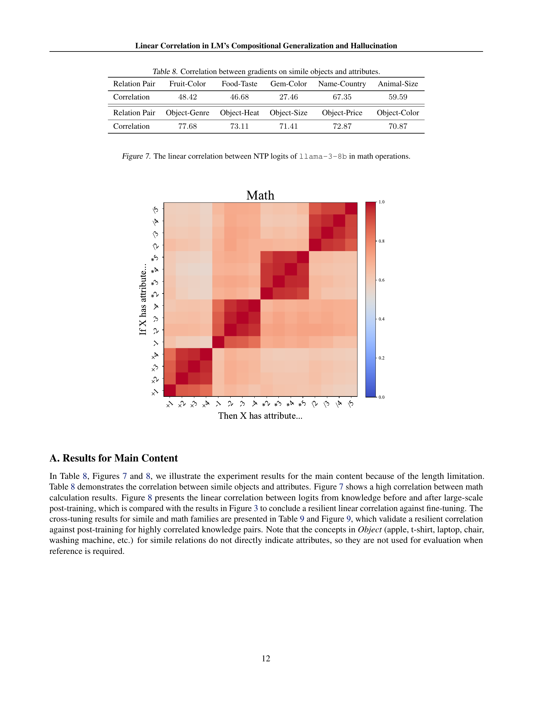

 


 2502.04520 
 Letian Peng et el. 
 
 🤗 2025-02-10 
 



↗ arXiv


↗ Hugging Face


↗ Papers with Code


### TL;DR



본 연구는 대규모 언어 모델(LLM)이 새로운 지식을 일반화하고 때로는 환각을 일으키는 과정에서 **선형 상관 관계**를 활용한다는 것을 발견했습니다. 기존 연구에서는 LLM의 지식 구성 능력에 대한 논쟁이 활발했지만, 이 연구는 **미시적 수준의 토큰 예측 과정**에 초점을 맞추어 이러한 현상을 분석했습니다. 특히, 서로 관련된 지식 간의 로짓(logit)들 사이에 선형 변환이 존재하며, 이 변환은 대규모 미세 조정에도 강인하다는 것을 보였습니다. 

연구진은 이러한 선형 상관 관계를 이용하여 **LLM의 일반화 능력을 평가하고 환각을 예측하는 새로운 방법**을 제시합니다. 실험 결과, 선형 상관 관계가 높고 선형 변환의 정확도가 높을수록 일반화 능력이 향상되지만, 정확도가 낮으면 환각이 발생할 가능성이 높아짐을 확인했습니다.  또한, 단순한 피드포워드 네트워크와 사전 훈련된 어휘 표현만으로도 이러한 선형 상관 관계를 학습할 수 있음을 보여줌으로써, **LLM의 일반화 능력이 사전 훈련된 어휘 표현에 크게 의존**함을 시사했습니다.



#### Key Takeaways


 대규모 언어 모델(LLM)은 지식을 구성할 때 선형 상관 관계를 활용한다. 



 이러한 선형 상관 관계는 미세 조정에도 불구하고 유지되며, LLMì˜ 일반화 ë° 환각 현상을 예측하는 ë° 활용될 수 있다. 



 LLMì˜ 일반화 능력은 어휘 표현에 크게 의존한다. 


#### Why does it matter?
이 논문은 **대규모 언어 모델(LLM)**의 일반화 능력에 대한 새로운 관점을 제시하여, **지식 구성 과정에서의 선형 상관 관계**를 밝혀냈습니다. 이는 LLM의 일반화 및 환각 현상을 이해하는 데 중요한 의미를 지니며, 향후 **LLM의 지식 편집 및 성능 향상** 연구에 새로운 방향을 제시할 수 있습니다. 또한, 본 연구는 **어휘 표현의 중요성**을 강조하며, 향후 연구에서 어휘 표현 개선을 통한 LLM 성능 향상 가능성을 시사합니다.  본 연구의 결과는 **LLM의 일반화 및 환각 현상을 이해하고 개선하는 데 중요한 역할**을 할 것으로 예상됩니다.

------
#### Visual Insights

> 🔼  그림 1은 논문의 주요 발견 사항을 보여줍니다. 첫째, 파인 튜닝에도 불구하고 소스 및 타겟 지식 프롬프트의 출력 간에 선형 변환을 적용할 수 있음을 보여줍니다. 즉, 특정 관계를 가진 지식(예: 도시-국가)에 대해 LM의 출력 로짓 간에 일관된 선형 상관관계가 존재합니다. 둘째, 소스 지식을 업데이트하면 탄력적인 선형성을 통해 타겟 지식으로 일반화되며, 이는 구성적인 일반화 또는 환각을 유발할 수 있음을 보여줍니다.  선형 변환의 정확도는 일반화의 성공 여부를 결정하는 중요한 요소이며, 정확하지 않은 경우 환각이 발생할 수 있습니다. 이 그림은 LM이 지식을 구성하는 방식과 일반화 및 환각 현상의 메커니즘에 대한 통찰력을 제공합니다.
> 

> 
read the caption

> Figure 1:  Demonstration of our main discoveries. 1) We can fit a linear transformation between the output of source and target knowledge prompts, which is resilient against fine-tuning. 2) Updating the source knowledge will generalize to the target one via resilient linearity, causing compositional generalization/hallucination.
> 


| Family | Prompt | Domain Examples |
|---|---|---|
| Attribute | “X lives in the city of” | Paris, Vienna |
|  | “X lives in the country of” | France, Austria |
| X-Lang. | “X vit dans la ville de” | Paris, Vienne |
|  | “X lebt in der Stadt von” | Paris, Wien |
| Simile | “X has the same color as” | Apple, Banana |
|  | “X’s color is” | Red, Yellow |
| Math | “X+1=” | 1, 2, 3, 4, 5 |
|  | “X*2=†| 2, 4, 6, 8, 10 |

> 🔼 이 표는 논문에서 다루는 지식 구성의 네 가지 유형(속성, 교차 언어, 직유, 수학)에 대한 예시를 보여줍니다. 각 유형에 대해 몇 가지 프롬프트와 해당 도메인(예: 도시, 국가, 색상 등)을 제시하여, 언어 모델이 지식을 어떻게 조합하는지에 대한 다양한 측면을 보여줍니다.  이는 언어 모델의 지식 일반화 능력과 관련된 실험을 위한 기초가 됩니다.
> 

> 
read the caption

> Table 1: Examples of prompts and domains in different families of knowledge composition.
> 

### In-depth insights

#### LM Compositionality
본 논문은 언어 모델(LM)의 구성성(compositionality)에 대한 심층적인 분석을 제공합니다. 특히, **기존의 LM들이 단순한 지식 조합에 어려움을 겪는 현상**에 초점을 맞추어, **선형 상관 관계**를 이용한 새로운 관점을 제시합니다.  이는 LM이 지식을 구성하는 방식에 대한 미시적 이해를 제공하며, **대규모 미세 조정에도 견고한 선형 변환**의 존재를 밝힙니다.  **이러한 선형 상관관계는 실제 세계의 지식 관계를 반영**하지만, **오류가 발생할 경우 환각(hallucination)으로 이어질 수 있다는 점**을 강조합니다.  나아가, **어휘 표현의 중요성**을 부각하며, 단순한 피드포워드 네트워크에서도 선형 상관관계 학습이 가능함을 보여줍니다.  이는 LM의 일반화 능력이 **어휘 표현에 크게 의존**함을 시사합니다.  결론적으로, 본 연구는 LM의 구성성에 대한 새로운 이해를 제공하고, 일반화 및 환각 현상을 예측하는 데 활용될 수 있는 잠재력을 지닌 선형 상관관계 분석법을 제시합니다.

#### Linear Correlation
본 논문에서 제시된 '선형 상관관계' 개념은 **대규모 언어 모델(LLM)**의 **지식 구성 및 일반화 능력**에 대한 새로운 관점을 제시합니다.  **토큰 예측(NTP)** 과정에서 관련된 지식들 간의 로짓(logit)들 사이에 **선형적 관계**가 존재함을 밝히고 있습니다. 이는 단순한 기억 능력을 넘어, LLM이 지식을 **선형 변환**을 통해 조합하고 일반화한다는 것을 시사합니다.  **미세 조정(fine-tuning)**에도 이 선형 상관관계가 **견고하게 유지**되는 점은 특히 주목할 만합니다.  이는 LLM의 일반화 능력이 **어휘 표현(vocabulary representation)**에 크게 의존함을 보여주는 증거이기도 합니다.  그러나 이러한 선형 상관관계는 **정확도(precision)**가 떨어질 경우, **환각(hallucination)**으로 이어질 수 있다는 점에서 **양날의 검**과 같습니다.  즉, **선형 상관관계의 존재 및 정확도**는 LLM의 일반화 능력을 판단하는 중요한 지표가 될 수 있습니다.

#### Generalization/Hallucination
본 논문은 언어 모델의 **일반화 능력**과 **환각 현상**을 연결하는 흥미로운 통찰력을 제공합니다. 특히, 관련된 지식 간의 선형 상관관계가 일반화와 환각 모두에 영향을 미친다는 점을 강조합니다. **선형 변환(W, b)**을 통해 소스 지식의 로짓을 타겟 지식의 로짓으로 매핑하는데, 이 변환의 정확도(precision)가 높을수록 일반화가 잘되고, 낮을수록 환각이 발생할 가능성이 높아집니다.  즉, 모델이 실제 세계의 지식과 일치하는 선형 상관관계를 학습하면 일반화가 잘되지만, **잘못된 상관관계**를 학습하면 환각이 발생하는 것입니다.  이러한 선형 상관관계는 대규모 미세 조정에도 강인하며, 어휘 표현에 크게 의존한다는 점도 밝혀졌습니다.  결론적으로, **선형 상관관계**는 언어 모델의 일반화 능력을 평가하고, 환각 현상을 예측하는데 유용한 지표가 될 수 있습니다.  하지만, 높은 선형 상관관계가 항상 높은 정확도를 보장하지는 않으므로, 일반화 능력과 환각 현상을 종합적으로 이해하기 위해서는 추가적인 연구가 필요합니다.

#### Vocabulary's Role
본 논문은 언어 모델의 **어휘(vocabulary)**가 조합적 일반화(compositional generalization) 및 환각(hallucination)에 중요한 역할을 한다는 것을 보여줍니다.  **어휘 표현(vocabulary representation)**은 모델이 지식을 구성하는 데 사용하는 기본 단위이며, 이러한 어휘 간의 선형 상관관계(linear correlation)가 학습된 지식의 구조를 반영한다는 점을 밝혔습니다. 특히, **어휘 간의 선형 변환(linear transformation)**이 미세 조정(fine-tuning)에도 불구하고 유지되는 현상을 발견하여, 이러한 어휘 표현의 중요성을 강조합니다.  **선형 상관관계의 강도(correlation intensity)**와 **선형 변환의 정확도(precision)**는 조합적 일반화의 성공 여부를 결정하는 중요한 요소로, 정확한 선형 변환은 일반화를, 부정확한 변환은 환각을 야기합니다.  **어휘 표현의 중요성**은 단순화된 모델 실험을 통해서도 확인되었으며, **어휘 표현의 변화**는 모델의 일반화 능력에 직접적인 영향을 미친다는 것을 시사합니다.  즉, 언어 모델의 일반화 능력은 단순히 파라미터의 크기뿐 아니라 **어휘 표현의 질(quality)**과 그들 간의 **상관관계(correlation)**에 크게 의존한다는 결론을 제시합니다.

#### Future Research
본 논문은 언어 모델의 조합적 일반화 메커니즘에 대한 새로운 관점을 제시하지만, **여전히 탐구해야 할 중요한 측면이 많이 남아있습니다.**  특히, **왜 탄력적인 선형 상관관계가 나타나는지에 대한 이론적 설명**이 부족합니다.  미래 연구는 모델 아키텍처, 최적화 역학 및 언어 구조를 분석하여 이 현상을 규명해야 합니다. 또한, **훈련 데이터 분포가 선형 상관관계 형성에 미치는 영향**을 체계적으로 분석하여 상관관계의 기원을 더 잘 이해할 필요가 있습니다.  나아가, **선형 상관관계를 보이는 지식 쌍을 예측하는 일반적인 방법**을 개발하는 것은 중요한 과제입니다.  **지식의 조합적 일반화 및 환각에 대한 이해를 높이기 위해, 다양한 모델 규모와 아키텍처에 대한 연구**가 필요하며, 다국어 모델의 선형 상관관계를 분석하여 다국어 능력 향상에 대한 통찰력을 얻는 것도 중요한 연구 방향입니다. 마지막으로, **본 연구에서 발견된 선형 상관관계를 일반화 학습에 활용**하는 방법을 탐구하는 것은 매우 가치 있는 연구 주제가 될 것입니다.

### More visual insights

More on figures

> 🔼 본 그림은 언어 모델(LM)이 (W, b)라는 선형 변환을 학습하여 지식을 구성하는 방법에 대한 가설과 질문들을 제시하고 있습니다.  더 자세히 설명하자면, LM이 소스 지식(예: 'X는 Y 도시에 산다')과 타겟 지식(예: 'X는 Z 국가에 산다')의 출력 로짓(logit)들 사이에 선형 관계가 존재한다는 가설을 세우고 있습니다. 이 선형 관계는 (W, b) 행렬로 표현되며,  소스 지식의 로짓에 W를 곱하고 b를 더하여 타겟 지식의 로짓을 근사적으로 예측할 수 있습니다. 그림에서는 이러한 선형 변환 (W, b)를 찾을 수 있는지, 임의의 입력 X에 대해서도 성립하는지, LM 미세 조정 후에도 유지되는지, 그리고 (W, b) 형성에 어떤 매개변수들이 기여하는지 등의 질문들을 제기하고 있습니다. 이러한 질문들은 LM의 지식 구성 능력과 일반화 능력을 이해하는 데 중요한 역할을 합니다.
> 

> 
read the caption

> Figure 2:  Our hypothesis and questions about how LMs compose knowledge by learning (W,b)𝑊𝑏(W,b)( italic_W , italic_b ).
> 

> 🔼 그림 3은 LLaMA-3-8B 언어 모델의 다음 토큰 예측(NTP) 로짓 간의 선형 상관관계를 보여줍니다.  다양한 지식 영역(예: 속성, 교차 언어, 직유, 수학)에 걸쳐 여러 쌍의 관련된 NTP 로짓 간의 상관 관계를 시각적으로 보여줍니다. 각 셀의 색상은 두 로짓 벡터 간의 피어슨 상관 계수를 나타내며, 밝은 색상은 높은 상관 관계를, 어두운 색상은 낮은 상관 관계를 나타냅니다. 이 그림은 모델이 어떻게 관련된 지식을 선형적으로 연결하는지 보여주는 중요한 시각적 증거를 제공합니다.
> 

> 
read the caption

> Figure 3: The linear correlation between NTP logits of llama-3-8b.
> 

> 🔼 본 그림은 모델 크기가 커짐에 따라 선형 변환 W의 정확도가 향상되는 것을 보여줍니다.  City-Country 관계처럼 실제 세계의 지식과 일치하는 경우 큰 모델일수록 W의 정확도가 높아지는 것을 확인할 수 있습니다. 반면 CEO-Company 관계처럼 인과관계가 불분명한 경우에는 큰 모델이라고 해도 W의 정확도 향상이 제한적임을 보여줍니다. 이는 모델의 크기가 클수록 실제 세계의 지식을 더 잘 반영하는 경향이 있지만, 모든 유형의 지식에 대해 동일한 수준으로 효과적이지는 않다는 것을 시사합니다.
> 

> 
read the caption

> Figure 4: The scaling-up of the precision of W𝑊Witalic_W with model size.
> 

> 🔼 그림 5는 소스 지식과 대상 지식 간의 선형 상관관계에서 학습된 선형 변환 행렬 W의 가중치가 일반화에 미치는 영향을 보여줍니다. 일반화 성공 여부는 W의 가중치 크기에 따라 달라지는데, 높은 가중치는 일반화 성공률을 높이고 낮은 가중치는 환각 발생률을 높이는 경향을 보입니다. 하지만 높은 가중치가 항상 일반화를 보장하는 것은 아닙니다.  이는 사전 확률과 같은 요소들이 일반화에 영향을 미치기 때문입니다. 이 그림은 선형 상관관계가 지식 구성에서 양날의 검과 같이 작용하여 일반화와 환각을 모두 야기할 수 있음을 보여줍니다.
> 

> 
read the caption

> Figure 5: The effect of W𝑊Witalic_W weights on generalization.
> 

> 🔼 본 그림은 논문의 핵심 내용 중 하나인 언어 모델의 일반화 능력에 대한 실험을 보여줍니다.  논문에서는 언어 모델의 복잡한 내부 구조(위치 임베딩, 자기 주의 네트워크 등)를 단순화하여, 단어 가방(bag-of-words) 네트워크와 평균 풀링 계층만을 사용하는 간소화된 모델을 제시합니다. 이는 언어 모델의 일반화 능력이 모델의 복잡한 구조보다는 어휘 표현에 크게 의존함을 보여주기 위한 실험적 설계입니다. 그림은 이러한 간소화된 모델의 구조를 시각적으로 보여줍니다.
> 

> 
read the caption

> Figure 6: We replace the deep intermediate layers of LMs with an initialized shallow bag-of-word network.
> 

> 🔼 그림 7은 LLaMA-3-8b 모델에서 수행된 수학 연산에 대한 다음 토큰 예측(NTP) 로짓 간의 선형 상관관계를 보여줍니다. 이 그림은 다양한 수학 연산(덧셈, 뺄셈, 곱셈, 나눗셈)에 대해 NTP 로짓 간의 상관 관계를 시각적으로 나타냅니다.  밝은 색상은 높은 양의 상관 관계를 나타내고, 어두운 색상은 낮은 또는 음의 상관 관계를 나타냅니다. 이 그림은 언어 모델이 수학적 지식을 구성하는 방식에 대한 통찰력을 제공합니다.
> 

> 
read the caption

> Figure 7: The linear correlation between NTP logits of llama-3-8b in math operations.
> 

> 🔼 그림 8은 거대 언어 모델(LLaMA-3-8b)의 다음 토큰 예측(NTP) 로짓 간의 선형 상관관계를 거대 규모 미세 조정 전후로 보여줍니다.  이 그림은 미세 조정 전후의 로짓 분포 간의 유사성을 보여주며, 모델이 새로운 지식을 습득한 후에도 특정 지식 간의 선형 상관 관계가 유지됨을 시각적으로 나타냅니다.  이러한 상관관계는 다양한 지식 영역(예: 도시-국가, 속성 등)에서 관찰되며, 모델의 일반화 능력과 밀접한 관련이 있습니다.  즉, 미세 조정 전후의 선형 상관관계의 지속성은 모델의 일반화 능력에 대한 중요한 통찰력을 제공합니다.
> 

> 
read the caption

> Figure 8: The linear correlation between NTP logits of llama-3-8b before and after large-scale post-training.
> 

> 🔼 그림 9는 대규모 미세 조정 전후 수학 연산의 다음 토큰 예측 로짓 간의 선형 상관 관계를 보여줍니다. 이 그림은 언어 모델이 수학적 지식을 구성하는 방식에 대한 통찰력을 제공합니다. 특히, 선형 상관 관계가 대규모 미세 조정 후에도 지속되는지 여부와 정확도에 미치는 영향을 보여줍니다. 이는 언어 모델의 일반화 능력과 환각 현상을 이해하는 데 중요한 역할을 합니다.
> 

> 
read the caption

> Figure 9: The linear correlation between NTP logits in math operations before and after large-scale post-training.
> 

> 🔼 그림 10은 Llama-3-8b 모델의 다음 토큰 예측(NTP) 로짓 간 인스턴스별 상관관계를 보여줍니다. 여기서는 속성(attribute)을 예시로 사용했습니다. 이 그림은 특정 입력에 대해 소스 지식과 대상 지식 간의 선형 변환을 보여줍니다.  각 행과 열은 특정 입력(예: '파리')에 대한 소스 및 대상 지식(예: '파리는 어느 도시에 있습니까?', '파리는 어느 국가에 있습니까?')의 로짓을 나타냅니다. 각 셀의 색상은 두 로짓 벡터 간의 피어슨 상관 계수를 나타냅니다. 밝은 색상은 높은 양의 상관 관계를, 어두운 색상은 낮은 상관 관계 또는 음의 상관 관계를 나타냅니다. 이 그림은 모델이 관련된 지식을 어떻게 구성하는지에 대한 통찰력을 제공하며, 선형 변환의 정확도가 일반화 성능에 미치는 영향을 시사합니다.
> 

> 
read the caption

> Figure 10: The instance-wise correlation between NTP logits of llama3-8b (attribute as an example).
> 

> 🔼 그림 11은 GPT-2-Medium 언어 모델의 다음 토큰 예측(NTP) 로짓 간의 속성 상관관계를 보여줍니다.  각 셀의 색상은 두 속성 간의 선형 상관 계수를 나타내며, 밝은 적색은 높은 양의 상관 관계를, 밝은 청색은 높은 음의 상관 관계를 나타냅니다.  이 그림은 모델이 어떻게 서로 다른 속성들 사이의 관계를 학습하고,  그러한 관계를 사용하여 새로운 텍스트를 생성하는지에 대한 통찰력을 제공합니다. 예를 들어, '도시'와 '국가'와 같은 속성은 서로 강하게 상관관계를 갖는 반면,  관계가 없는 속성들은 약하거나 상관관계가 없음을 보여줍니다. 이는 언어 모델이 세계 지식을 어떻게 표현하는지 이해하는 데 도움이 됩니다.
> 

> 
read the caption

> Figure 11: The attribute correlation between NTP logits of gpt2-medium.
> 

> 🔼 그림 12는 LLaMA-3-1B 모델의 다음 토큰 예측(NTP) 로짓 간의 속성 상관관계를 보여줍니다. 이 그림은 다양한 속성(예: 도시, 국가, 직업 등) 간의 상관관계를 시각적으로 나타냅니다. 색상은 상관관계의 강도를 나타내며, 밝은 색상은 높은 양의 상관관계를, 어두운 색상은 높은 음의 상관관계를, 중간 색상은 상관관계가 약하거나 없는 것을 나타냅니다. 이 그림은 언어 모델이 지식을 어떻게 구성하고 일반화하는지 이해하는 데 도움이 됩니다.
> 

> 
read the caption

> Figure 12: The attribute correlation between NTP logits of llama-3.2-1b.
> 

> 🔼 그림 13은 LLaMA 3-2-3B 언어 모델의 다음 토큰 예측(NTP) 로짓 간의 속성 상관관계를 보여줍니다.  각 셀의 색상은 두 속성 간의 선형 상관 계수를 나타내며, 빨간색은 높은 양의 상관 관계, 파란색은 낮은 음의 상관 관계를 나타냅니다. 이 그림은 모델이 특정 속성들 간에 어떻게 연관성을 학습하는지, 그리고 그 연관성의 강도를 시각적으로 보여줍니다. 예를 들어, '도시'와 '국가' 속성 간의 강한 상관관계는 모델이 특정 도시가 특정 국가에 위치한다는 것을 잘 학습했음을 시사합니다.  반면 상관관계가 약하거나 없는 경우는 해당 속성 간의 연관성이 모델에 의해 잘 학습되지 않았음을 의미합니다.
> 

> 
read the caption

> Figure 13: The attribute correlation between NTP logits of llama-3.2-3b.
> 

> 🔼 그림 14는 LLaMA-3-8B 모델의 다음 토큰 예측(NTP) 로짓 간의 속성 상관관계를 보여줍니다.  각 셀은 두 속성(예: 도시와 국가) 간의 상관 관계를 나타내는 피어슨 상관 계수를 보여줍니다.  밝은 적색은 높은 양의 상관 관계를, 밝은 청색은 높은 음의 상관 관계를, 흰색은 상관 관계가 없음을 나타냅니다.  이 그림은 언어 모델이 어떻게 관련된 속성들을 연결하고, 지식을 구성하는지 보여주는 시각적 표현입니다.  예를 들어, '도시'와 '국가' 속성은 강한 양의 상관 관계를 보이는 반면, 관련성이 적은 속성들은 상관 관계가 약하거나 없을 수 있습니다.
> 

> 
read the caption

> Figure 14: The attribute correlation between NTP logits of llama-3-8b.
> 

> 🔼 그림 15는 LLaMA-3-70B 모델의 다음 토큰 예측(NTP) 로짓 간의 속성 상관관계를 보여줍니다.  이 그림은 다양한 속성들(예: 도시, 국가, 직업, 가족 관계 등) 간의 로짓 값들 사이의 선형 상관관계를 시각적으로 나타냅니다. 높은 상관관계는 빨간색으로, 낮은 상관관계는 파란색으로 표현됩니다. 이는 언어 모델이 다양한 속성들을 어떻게 내부적으로 표현하고 상호 연관짓는지에 대한 통찰력을 제공합니다.  특히, 공간적 속성(도시, 국가)이나 가족 관계와 같은 밀접한 관련이 있는 속성들 사이의 강한 상관관계가 관찰되는 반면, 관련성이 적은 속성들 사이에는 약한 상관관계가 나타남을 알 수 있습니다. 이러한 상관관계 분석을 통해 언어 모델의 일반화 능력과 환각 현상을 이해하는데 도움이 됩니다.
> 

> 
read the caption

> Figure 15: The attribute correlation between NTP logits of llama-3-70b.
> 

> 🔼 그림 16은 DeepSeek-r1-distll-qwen-7B 언어 모델의 특징을 보여줍니다.  이 그림은 다양한 속성들(예: 출생지, 직업, 부모 등) 사이의 상관관계를 NTP(Next Token Prediction) 로짓을 사용하여 시각화한 것입니다.  각 셀의 색상은 두 속성 간의 상관 계수를 나타내며, 밝은 색상은 높은 상관 관계를, 어두운 색상은 낮은 상관 관계를 나타냅니다. 이는 모델이 어떻게 다양한 속성들 간의 관계를 학습하고, 이러한 관계를 활용하여 텍스트 생성을 수행하는지에 대한 통찰력을 제공합니다.  예를 들어, '출생지'와 '국적' 사이에 강한 상관 관계가 있음을 보여주는 것과 같이, 직관적이고 의미 있는 상관 관계를 보여줍니다. 반면, 관련성이 적은 속성들 사이의 낮은 상관 관계도 확인할 수 있습니다.
> 

> 
read the caption

> Figure 16: The attribute correlation between NTP logits of deepseek-r1-distll-qwen-7B.
> 

> 🔼 그림 17은 Mistral-7b-v0.3 언어 모델의 다음 토큰 예측(NTP) 로짓 간의 속성 상관관계를 보여줍니다. 이 그림은 다양한 속성(예: 도시, 국가, 직업 등) 간의 관계를 시각화하여 모델이 어떻게 이러한 속성들 간의 정보를 연결하고 처리하는지 보여줍니다.  색상은 상관관계의 강도를 나타내며, 밝은 색은 강한 양의 상관관계를, 어두운 색은 강한 음의 상관관계를 나타냅니다. 이를 통해 모델 내부의 지식 표현 구조와 일반화 능력에 대한 통찰력을 제공합니다. 특정 속성 쌍 사이의 높은 상관관계는 해당 속성들이 모델 내부에서 밀접하게 연관되어 있음을 시사하며, 반대로 낮은 상관관계는 해당 속성들 간의 연관성이 약하거나 모델이 이를 잘 구분하지 못함을 시사할 수 있습니다.
> 

> 
read the caption

> Figure 17: The attribute correlation between NTP logits of mistral-7b-v0.3.
> 

> 🔼 그림 18은 LLaMA-3-3B 언어 모델의 다음 토큰 예측(NTP) 로짓 간의 선형 상관관계를 보여줍니다.  색상으로 표현된 상관 계수는 다양한 지식 쌍(예: 도시-국가, 언어-국가 등) 간의 로짓 간의 상관 관계의 강도를 나타냅니다. 높은 상관 관계는 빨간색으로, 낮은 상관 관계는 파란색으로 표현됩니다. 이 그림은 언어 모델이 관련 지식 표현 간의 선형 관계를 학습하는 경향이 있음을 시각적으로 보여주는 중요한 증거입니다. 이러한 선형 상관 관계는 모델의 일반화 능력과 환각 현상 모두에 영향을 미치는 중요한 요소입니다.
> 

> 
read the caption

> Figure 18: The linear correlation between NTP logits of llama-3.2-3b.
> 

> 🔼 그림 19는 대규모 미세 조정 전후 Llama-3.2-3b의 다음 토큰 예측(NTP) 로짓 간의 선형 상관 관계를 보여줍니다. 이 그림은 특정 지식 쌍 간의 로짓에 선형 변환을 적용하는 방법을 보여줍니다.  미세 조정 전후의 상관 관계 행렬을 비교하여 대규모 미세 조정 후에도 선형 상관 관계가 어느 정도 유지됨을 보여줍니다. 이는 언어 모델의 일반화 능력에 선형 상관 관계의 중요성을 시사합니다.
> 

> 
read the caption

> Figure 19: The linear correlation between NTP logits of llama-3.2-3b before and after large-scale post-training.
> 

> 🔼 본 그림은 서로 관련된 지식에 대한 로짓 간의 선형 상관관계가 더 큰 언어 모델에서 더욱 견고해짐을 보여줍니다. 그림은 1B, 3B, 8B 매개변수를 가진 세 가지 크기의 LLaMA-3 모델에 대해 훈련 전후의 상관관계 행렬을 보여주는데, 모델의 크기가 커짐에 따라 상관관계가 더 강해지는 경향을 보입니다. 이는 더 큰 모델에서 선형 상관관계가 더욱 견고함을 시사합니다.
> 

> 
read the caption

> Figure 20: The correlation becomes more resilient in larger LMs.
> 

> 🔼 본 그림은 미스트랄-7b-v0.3 모델의 로그값 상관관계를 사전 및 사후 학습 전후로 비교 분석한 결과를 보여줍니다.  사전 학습된 모델과 대규모 사후 학습된 모델 모두에서 어휘 간의 선형 상관관계가 유지되는지 확인하기 위한 실험 결과를 시각적으로 제시합니다.  특히, 대규모 미세조정 이후에도 선형 상관관계가 얼마나 잘 유지되는지, 즉 일반화 성능에 미치는 영향을 분석하는 데 중점을 둡니다.
> 

> 
read the caption

> Figure 21: The correlation between logits from mistral-7b-v0.3 before and after post-training.
> 

> 🔼 그림 22는 Aya와 LLaMA 언어 모델에서의 교차 언어 상관관계를 비교한 것입니다.  두 모델 모두 다국어 능력을 가지고 있지만,  특히 중국어와 일본어에서 Aya 모델이 LLaMA 모델보다 더 강력한 교차 언어적 상관관계를 보여주는 것을 알 수 있습니다. 라틴어의 경우에는 두 모델 간의 차이가 크지 않은데, 이는 LLaMA가 영어 능력을 바탕으로 다국어 능력의 약점을 보완하기 때문일 수 있습니다. 이 그림은 다국어 모델의 지식 구성 메커니즘에 대한 통찰력을 제공합니다.
> 

> 
read the caption

> Figure 22: The comparison between Aya and LLaMA in cross-lingual correlation.
> 

> 🔼 그림 23은 단어 예측 로짓 간의 상관관계 분포 표준편차를 보여줍니다.  이 그림은 여러 다른 지식 쌍들에 대해 로짓 간의 상관관계가 얼마나 일관되게 나타나는지, 즉 상관관계의 분포가 얼마나 좁게 몰려있는지를 보여주는 지표입니다.  표준편차가 작을수록 상관관계의 분포가 더 좁고 일관성이 높다는 것을 의미합니다. 이는 모델이 지식을 구성하는 방식의 일관성을 평가하는 데 도움이 됩니다. 높은 일관성은 모델이 지식을 체계적이고 일관되게 사용함을 나타낼 수 있으며, 낮은 일관성은 지식의 무작위적이고 불규칙적인 사용을 의미할 수 있습니다. 이 그림은 모델의 일반화 능력을 이해하는 데 중요한 단서를 제공합니다.
> 

> 
read the caption

> Figure 23: The std of correlation distribution between logits.
> 

> 🔼 그림 24는 대규모 미세 조정 전후의 로짓 간 상관관계 분포의 표준 편차를 보여줍니다.  이 그림은 상관관계 측정의 신뢰성을 평가하기 위해 추가되었습니다. 대규모 미세 조정 전후의 상관관계 분포가 얼마나 밀집되어 있는지(표준 편차가 얼마나 작은지)를 보여줌으로써, 상관관계 분석의 일반화 가능성 및 신뢰도를 높여줍니다.  즉, 표준편차가 작을수록 상관관계가 더욱 뚜렷하고 안정적이라는 것을 시사합니다.
> 

> 
read the caption

> Figure 24: The std of correlation distribution between logits before and after large-scale post-training.
> 

More on tables


| Relation Pair | Hit@Top-N | Hit@Top-N | Hit@Top-N | Hit@Top-N | Hit@Top-N | Hit@Top-N | Hit@Top-N |
|---|---|---|---|---|---|---|---| 
|  | Influenced Target | Influenced Target | Influenced Target | Influencing Source | Influencing Source | Influencing Source |  |
|---|---|---|---|---|---|---|---| 
|  | 1 | 3 | 5 | 1 | 3 | 5 |  |
| City → Country | 0.42 | 0.45 | 0.48 | 0.67 | 0.74 | 0.78 |  |
| CEO → Company | 0.09 | 0.09 | 0.14 | 0.05 | 0.05 | 0.08 |  |
| Cityen → Cityes | 0.91 | 0.91 | 0.92 | 0.67 | 0.74 | 0.78 |  |
| Cityen → Cityzh | 0.10 | 0.13 | 0.16 | 0.09 | 0.11 | 0.15 |  |
| Fruit → Color | 0.25 | 0.38 | 0.47 | 0.38 | 0.50 | 0.54 |  |
| Food → Taste | 0.28 | 0.50 | 0.62 | 0.14 | 0.36 | 0.43 |  |
| X+1 → X+2 | 0.00 | 0.50 | 0.60 | 0.10 | 0.30 | 0.50 |  |
| X+1 → X*2 | 0.10 | 0.40 | 0.50 | 0.10 | 0.30 | 0.70 |  |
> 🔼 표 2는 LM이 지식을 구성하는 데 사용하는 선형 변환 매트릭스 W의 정확도를 보여줍니다.  더 자세히 설명하면,  소스 지식과 타겟 지식 사이의 로짓 간의 선형 변환 W의 가중치가 실제 세계 지식과 얼마나 잘 일치하는지를 보여주는 지표입니다.  City-Country와 같은 강한 상관관계를 가진 지식 쌍에서는 높은 정확도를, CEO-Company 와 같이 상관관계가 약한 지식 쌍에서는 낮은 정확도를 보입니다.  이는 LM의 지식 구성 일반화 능력을 평가하는 데 중요한 지표가 됨을 시사합니다.
> 

> 
read the caption

> Table 2: The precision of compositional relations built up in W𝑊Witalic_W.
> 


| If City = | Then Country = |
|---|---| 
| Shanghai | **China**, Italia, Albania, USSR, Korea |
| NYC | **USA**, USSR, UAE, China, CCCP |
| Oslo | CCCP, **Norway**, Kosovo, Israel, Oman |
| Seattle | Uruguay, Serbia, Kosovo, Romania, Slovenia |
| Indianapolis | India, Indonesia, France, Iraq, Netherlands |
| If X+1= | Then X+2= |
|---|---| 
| 1 | 1, **2**, 4, 6, 3 |
| 2 | 2, **3**, 4, 5, 7 |
| 3 | 3, 6, 5, **4**, 7 |
| 4 | 4, 0, 2, 1, 10 |
| 5 | 5, **6**, 8, 7, 9 |
> 🔼 본 표는 소스 지식의 상위 영향을 받는 토큰과 대상 지식의 상위 영향을 주는 토큰 쌍의 사례를 보여줍니다.  예를 들어, 도시와 국가의 관계를 보여주는 'City-Country' 열에서, 'Shanghai'는 'China'와 강하게 연관되어 있지만, 'Oslo'는 'Norway'보다는 'China'와 더 강하게 연관되어 있는 것을 보여줍니다. 이는 LM이 실제 세계의 지식 관계를 완벽하게 반영하지는 못함을 보여주는 예시입니다.  또한, 추가로 'CEO-Company', 'Cityen-Cityes', 'X+1→X+2', 'X+1→X*2' 관계에 대한 상위 영향 토큰 쌍을 보여주어, LM의 지식 구성에서 선형 상관관계의 정확성과 한계를 보여줍니다.
> 

> 
read the caption

> Table 3: Cases of top-influenced tokens pairs in target knowledge.
> 


| Relation Pair | Logit Correlation | Grad. Correlation |
|---|---|---|
| City → Country | 0.89 | 0.79 |
| CEO → Company | 0.55 | 0.47 |
| Cityen → Cityes | 0.70 | 0.79 |
| Cityen → Cityzh | 0.58 | 0.46 |
| Fruit → Color | 0.48 | 0.46 |
| Food → Taste | 0.47 | 0.47 |
| X+1 → X+2 | 0.93 | 0.87 |
| X+1 → X*2 | 0.73 | 0.66 |
> 🔼 본 표는 관련 지식에 대한 그래디언트 간의 상관 관계를 보여줍니다.  구체적으로, 관련된 두 개의 지식 프롬프트(예: 'X는 Y 도시에 산다'와 'X는 Z 국가에 산다')에 대한 그래디언트의 피어슨 상관 계수를 계산합니다. 높은 상관 관계는 두 프롬프트가 LM 내에서 유사한 방식으로 처리됨을 나타내며, 이는 LM의 일반화 능력과 관련이 있을 수 있음을 시사합니다.
> 

> 
read the caption

> Table 4: Correlation between gradients on related knowledge.
> 


| Corr. | Prec. | Relation Pair | Generalization (Random) |
|---|---|---|---|
| High | High | City → Country | 53.70% (0.78%) |
| High | High | Country → Continent | 50.93% (20.00%) |
| High | High | Cityen → Cityes | 39.10% (0.41%) |
| High | Low | X+1 → X+2 | 0.00% (9.09%) |
| High | Low | X+1 → X*2 | 8.18% (9.09%) |
| Low | Low | Fruit → Color | 11.60% (6.67%) |
| Low | Low | Food → Taste | 19.44% (10.00%) |
| Low | Low | CEO → Company | 4.34% (1.00%) |
| Low | Low | Language → Continent | 23.65% (20.00%) |
| Low | Low | Cityen → Cityzh | 2.49% (0.41%) |
| Low | Low | Cityen → Cityja | 4.60% (0.41%) |
> 🔼 이 표는 선형 상관 관계의 강도와 선형 변환 행렬 W의 정확도라는 두 가지 요소가 서로 다른 관계 쌍에서 성공적인 일반화에 미치는 영향을 보여줍니다.  높은 상관 관계와 높은 W 정확도를 가진 관계 쌍은 일반화에 성공할 가능성이 높은 반면, 낮은 상관 관계 또는 낮은 W 정확도를 가진 관계 쌍은 일반화에 실패할 가능성이 높습니다. 이는 LM의 일반화 능력이 선형 상관 관계와 W의 정확도에 따라 달라질 수 있음을 시사합니다.
> 

> 
read the caption

> Table 5: The ratio of successful generalization in relation pairs with different linear correlation and W𝑊Witalic_W precision.
> 


| City | Reference | Generalized | $W_{ref}$ | $W_{gen}$ | $W_{max}$ |
|---|---|---|---|---|---| 
| Shanghai | China | China | 0.50 | 0.50 | 0.50 |
| NYC | USA | USA | 0.58 | 0.58 | 0.58 |
| Copenhagen | Denmark | Denmark | 0.47 | 0.47 | 0.47 |
| Karnataka | India | India | 0.34 | 0.34 | 0.56 |
| Indianapolis | USA | India | -0.05 | 0.15 | 0.17 |
| Dresden | Germany | Israel | 0.04 | 0.13 | 0.15 |
| Canberra | Australia | Canada | 0.04 | 0.10 | 0.10 |
| Helsinki | Finland | Sweden | 0.42 | 0.11 | 0.42 |
> 🔼 표 6은 도시에서 국가로의 지식 구성에 대한 일반화 및 환각 현상을 보여줍니다.  도시 이름을 입력으로 받아 해당 도시가 속한 국가를 예측하는 언어 모델의 성능을 평가합니다.  표는 여러 도시에 대한 모델의 예측 정확도와 함께, 잘못된 국가를 예측하는 환각(hallucination) 현상의 비율을 보여줍니다.  이는 언어 모델이 지식을 구성하는 방식과 그 한계를 이해하는 데 도움을 줍니다.
> 

> 
read the caption

> Table 6: Generalization and hallucination in City→→\rightarrow→Country.
> 


| Mapping | Generalization |
|---|---| 
| *City → Country* |  |
| Shanghai, Tokyo, Paris → China, Japan, France | 97.66% |
| Shanghai, Tokyo, Paris → Japan, France, China | 22.66% |
| S, T, P → C, J, F | 36.72% |
| *Country → Continent* |  |
| China, France, Canada → Asia, Europe, North America | 78.12% |
| *CEO → Company* |  |
| Elon, Andy, Tim → Tesla, Amazon, Apple | 58.59% |
| *+1 → +2* |  |
| 1, 2, 3 → 3, 4, 5 | 9.38% |
> 🔼 표 7은 어휘 매핑의 변화에 따른 일반화 성능을 보여줍니다.  원래 단어 매핑을 사용했을 때 높은 일반화율을 보였으나, 단어 매핑을 변경했을 때 일반화율이 크게 떨어지는 것을 보여줍니다. 이는 언어 모델의 일반화 능력이 어휘 표현에 크게 의존함을 시사합니다.  구체적으로는, 도시와 국가의 관계를 나타내는 매핑에서, 원래 매핑을 사용했을 때는 97.66%의 높은 일반화율을 보였지만, 매핑을 바꾸자 일반화율이 22.66%로 급격히 감소했습니다. 이는 어휘 표현의 중요성을 강조하며, 언어 모델의 일반화 능력 향상을 위해서는 어휘 표현의 질적 개선이 필요함을 의미합니다.
> 

> 
read the caption

> Table 7: Generalization with Different Vocabulary Mappings.
> 


| Relation Pair | Fruit-Color | Food-Taste | Gem-Color | Name-Country | Animal-Size |
|---|---|---|---|---|---| 
| Correlation | 48.42 | 46.68 | 27.46 | 67.35 | 59.59 |
| Relation Pair | Object-Genre | Object-Heat | Object-Size | Object-Price | Object-Color |
|---|---|---|---|---|---| 
| Correlation | 77.68 | 73.11 | 71.41 | 72.87 | 70.87 |
> 🔼 이 표는 유사어(simile) 객체와 속성 간의 기울기 상관 관계를 보여줍니다.  유사어는 두 객체의 속성을 비교하는 표현 방식입니다. 이 표는 언어 모델이 유사어를 통해 지식을 어떻게 구성하고 일반화하는지에 대한 통찰력을 제공합니다.  구체적으로,  소스 지식(예: 사과의 색깔)과 타겟 지식(예: 바나나의 색깔)에 대한 기울기의 상관 관계를 계산하여 유사어의 의미적 유사성과 언어 모델의 일반화 능력 간의 관계를 분석합니다.  상관 관계 값이 높을수록, 두 지식 간의 의미적 연관성이 강하고 언어 모델이 한 지식에서 다른 지식으로 일반화하는 능력이 뛰어남을 의미합니다.
> 

> 
read the caption

> Table 8: Correlation between gradients on simile objects and attributes.
> 


| Relation Pair | Fruit-Color | Food-Taste | Gem-Color | Name-Country | Animal-Size |
|---|---|---|---|---|---| 
| Correlation | 44.11 | 37.06 | 33.66 | 67.30 | 49.65 |
| Relation Pair | Object-Genre | Object-Heat | Object-Size | Object-Price | Object-Color |
|---|---|---|---|---|---| 
| Correlation | 72.03 | 63.75 | 66.13 | 71.09 | 66.27 |
> 🔼 본 표는 대규모 미세 조정 전후 두 가지 시점에서 비유적 대상과 속성 간의 로짓 간 상관 관계를 보여줍니다.  '대상-속성' 쌍 간의 상관 관계를 계산하여, 대규모 미세 조정이  LM의 일반화 능력에 미치는 영향을 분석하는 데 사용됩니다. 상관 관계 값이 높을수록, LM이 대상과 속성 사이의 관계를 잘 학습했음을 나타냅니다. 표의 결과는  LM의 일반화 능력에 대한 통찰력을 제공합니다.  특히 미세 조정 후에도 상관 관계가 유지되는지 확인하여  LM의 일반화 능력의 견고성을 평가합니다.
> 

> 
read the caption

> Table 9: Correlation between logits on simile objects and attributes before and after large-scale post-training.
> 


| Template | Domain Size |
|---|---| 
| Attribute | 23 |
| Cross-language | 11 × 5 = 55 |
| Simile | 17 |
| Math | 4 × 4 = 16 |
| Total | 111 |
> 🔼 표 10은 논문에서 사용된 다양한 유형의 지식 조합에 대한 프롬프트의 통계를 보여줍니다.  각 지식 유형(속성, 언어 간, 직유, 수학)별로 사용된 프롬프트의 수와 각 유형에 속한 프롬프트의 총 개수를 보여줍니다. 이 표는 논문의 실험 설정을 이해하는 데 도움이 됩니다.
> 

> 
read the caption

> Table 10: The statistics of prompts in different families.
> 


| Attribute | Knowledge | Template | Domain Size |
|---|---|---|---| 
| birthplace | "{} was born in the city of" | 242 |
| city | "{} lives in the city of" | 242 |
| country | "{} lives in the country of" | 128 |
| continent | "{} lives in the continent of" | 6 |
| language | "{} speaks the language of" | 217 |
| company | "{} works for the company of" | 100 |
| landmark | "{} lives near the landmark of" | 100 |
| ceo | "{} works for the CEO called" | 101 |
| mother | "{}'s mother's name is" | 100 |
| father | "{}'s father's name is" | 100 |
| job | "{}'s job is" | 105 |
| personality | "{}'s personality is" | 100 |
| pet | "{}'s pet is" | 100 |
| sport | "{}'s favorite sport is" | 102 |
| food | "{}'s favorite food is" | 104 |
| drink | "{}'s favorite drink is" | 102 |
| gender | "{}'s gender is" | 3 |
| vehicle | "{}'s preferred mode of transportation is" | 51 |
| color | "{}'s favorite color is" | 15 |
| music | "{}'s favorite music genre is" | 100 |
| hobby | "{}'s favorite hobby is" | 101 |
| flower | "{}'s favorite flower is" | 97 |
| vacation | "{}'s favorite vacation spot is" | 101 |
> 🔼 표 11은 논문의 실험에서 사용된 템플릿 중 속성(Attribute) 관련 부분을 보여줍니다.  다양한 속성(출생지, 도시, 국가, 대륙, 언어, 회사, CEO, 직업, 어머니, 아버지, 성격, 애완동물, 스포츠, 음식, 음료, 성별, 차량, 색상, 음악, 취미, 꽃, 휴가)에 대한 정보를 담고 있는 여러 질문 템플릿들이 제시되어 있습니다. 각 템플릿은 특정 속성에 대한 정보를 추출하기 위한 질문 형태를 가지고 있으며, 실험에서 사용된 데이터의 종류와 범위를 이해하는 데 중요한 역할을 합니다.  각 템플릿에 대해 해당 속성과 관련된 단어 집합의 크기(Domain Size)도 함께 제시하여 데이터 분포에 대한 정보를 제공합니다.
> 

> 
read the caption

> Table 11: Templates used in our experiments (Part 1: Attribute).
> 


| Knowledge | Template | Domain Size |
|---|---|---|
| Spanish    | birthplace | “{} nació en la ciudad de†| 242 |
|  | city | “{} vive en la ciudad de” | 242 |
|  | country | “{} vive en el país de” | 128 |
|  | continent | “{} vive en el continente de” | 6 |
|  | language | “{} habla el idioma de” | 217 |
|  | company | “{} trabaja para la empresa de” | 100 |
|  | ceo | “{} trabaja para el CEO llamado” | 101 |
|  | job | “El trabajo de {} es” | 105 |
|  | mother | “El nombre de la madre de {} es” | 100 |
|  | father | “{} el nombre del padre es” | 100 |
|  | gender | “El género de {} es” | 3 |
| French    | birthplace | “{} est né dans la ville de†| 242 |
|  | city | “{} vit dans la ville de” | 242 |
|  | country | “{} vit dans le pays de” | 128 |
|  | continent | “{} vit sur le continent de” | 6 |
|  | language | “{} parle la langue de” | 217 |
|  | company | “{} travaille pour l’entreprise de” | 100 |
|  | ceo | “{} travaille pour le PDG appelé” | 101 |
|  | job | “{} travaille comme” | 105 |
|  | mother | “Le nom de la mère de {} est” | 100 |
|  | father | “Le nom du père de {} est” | 100 |
|  | gender | “{} est de sexe” | 3 |
| German    | birthplace | “{} wurde in der Stadt geboren†| 242 |
|  | city | “{} lebt in der Stadt” | 242 |
|  | country | “{} lebt im Land” | 128 |
|  | continent | “{} lebt auf dem Kontinent” | 6 |
|  | language | “{} spricht die Sprache von” | 217 |
|  | company | “{} arbeitet für das Unternehmen von” | 100 |
|  | ceo | “{} arbeitet für den CEO namens” | 101 |
|  | job | “Der Beruf von {} ist” | 105 |
|  | mother | “Der Name von {}’s Mutter ist” | 100 |
|  | father | “Der Name von {}’s Vater ist” | 100 |
|  | gender | “Das Geschlecht von {} ist” | 3 |
| Chinese    | birthplace | {CJK}UTF8gbsn“{}所出生的åŸå¸‚是†| 242 |
|  | city | {CJK}UTF8gbsn“{}所居住的城市是” | 242 |
|  | country | {CJK}UTF8gbsn“{}所居住的国家是” | 128 |
|  | continent | {CJK}UTF8gbsn“{}所居住的大陆是” | 6 |
|  | language | {CJK}UTF8gbsn“{}说的语言是” | 217 |
|  | company | {CJK}UTF8gbsn“{}工作的公司是” | 100 |
|  | ceo | {CJK}UTF8gbsn“{}工作的公司的CEO是” | 101 |
|  | job | {CJK}UTF8gbsn“{}的工作是” | 105 |
|  | mother | {CJK}UTF8gbsn“{}的母亲的名字是” | 100 |
|  | father | {CJK}UTF8gbsn“{}的父亲的名字是” | 100 |
|  | gender | {CJK}UTF8gbsn“{}的性别是” | 3 |
| Japanese    | birthplace | {CJK}UTF8min“{}が生まれた都市は” | 242 |
|  | city | {CJK}UTF8min“{}が住んでいる都市は” | 242 |
|  | country | {CJK}UTF8min“{}が住んでいる国は” | 128 |
|  | continent | {CJK}UTF8min“{}が住んでいる大陸は” | 6 |
|  | language | {CJK}UTF8min“{}が話している言語は” | 217 |
|  | company | {CJK}UTF8min“{}が働いている会社は” | 100 |
|  | ceo | {CJK}UTF8min“{}が働いている会社のCEOは” | 101 |
|  | job | {CJK}UTF8min“{}の仕事は” | 105 |
|  | mother | {CJK}UTF8min“{}の母の名前は” | 100 |
|  | father | {CJK}UTF8min“{}の父の名前は” | 100 |
|  | gender | {CJK}UTF8min“{}の性別は” | 3 |
> 🔼 표 12는 본 논문의 실험에서 사용된 템플릿들을 보여줍니다.  구체적으로는 두 번째 파트인 '교차 언어' 부분에 해당하는 템플릿들을 제시합니다. 각 언어(스페인어, 프랑스어, 독일어, 중국어, 일본어)에 대해 출생지, 도시, 국가, 대륙, 언어, 회사, CEO, 직업, 어머니, 아버지, 성별 등 다양한 속성에 대한 템플릿들이 포함되어 있습니다.  각 템플릿은 해당 언어로 작성된 질문 형태이며, 각 질문은 특정 속성에 대한 정보를 추출하기 위해 설계되었습니다.  이 표는 다양한 언어와 속성 조합을 사용하여 언어 모델의 일반화 능력을 평가하는 실험의 기반이 됩니다.
> 

> 
read the caption

> Table 12: Templates used in our experiments (Part 2: Cross Language).
> 


| Knowledge | Template | Domain Size |
|---|---|---|
| Simile | object_color | “The color of {} is the same as” | 85 |
|  | object_price | “The size of {} is the same as” | 85 |
|  | object_heat | “The heat of {} is the same as” | 85 |
|  | object_genre | “The genre of {} is the same as” | 85 |
|  | object_size | “The size of {} is the same as” | 85 |
|  | simile_color | “The color of {} is” | 15 |
|  | simile_price | “The size of {} is” | 2 |
|  | simile_heat | “The heat of {} is” | 4 |
|  | simile_genre | “The genre of {} is” | 22 |
|  | simile_size | “The size of {} is” | 3 |
|  | simile_taste | “The taste of {} is” | 3 |
|  | name_country | “{} lives in the same country as” | 128 |
|  | gem_color | “The color of {} is the same as the gem called” | 50 |
|  | animal_size | “The size of {} is the same as the animal called” | 100 |
|  | food_taste | “{} has the same taste as the food:” | 95 |
|  | fruit_color | “{} X has the same color as the fruit:” | 99 |
| Math | X+N | “{} +N=” | 11 |
|  | X-N | “{} -N=” | 11 |
|  | X*N | “{} *N=” | 11 |
|  | X/N | “{} /N=†| 11 |
> 🔼 표 13은 본 논문의 실험에서 사용된 템플릿들을 보여줍니다. 3부는 직유와 수학 관련 템플릿들을 포함합니다.  각 템플릿은 특정 지식 영역(예: 색깔, 가격, 크기, 열, 장르 등)과 관련된 두 개의 문장을 생성하는 데 사용됩니다.  직유 템플릿들은 두 개체의 특성을 비교하는 문장을 생성하고, 수학 템플릿들은 수학 연산을 포함하는 문장을 생성합니다.  각 템플릿의 도메인 크기는 해당 템플릿에 의해 생성될 수 있는 고유한 문장의 수를 나타냅니다. 이 표는 본 논문에서 사용된 다양한 종류의 지식 조합 방법을 보여주는 중요한 부분입니다.
> 

> 
read the caption

> Table 13: Templates used in our experiments (Part 3: Simile and Math).
> 


| Relation Pair | Fruit-Color | Food-Taste | Gem-Color | Name-Country | Animal-Size |
|---|---|---|---|---|---| 
| Correlation | 48.37 | 46.95 | 50.48 | 78.83 | 69.43 |
| Relation Pair | Object-Genre | Object-Heat | Object-Size | Object-Price | Object-Color |
|---|---|---|---|---|---| 
| Correlation | 81.92 | 76.48 | 84.23 | 84.23 | 81.08 |
> 🔼 본 논문의 표 14는 LLaMA-3-8B 모델을 사용하여 비유(simile) 객체와 속성 간의 로짓(logit) 상관관계를 분석한 결과를 보여줍니다.  특히 비유적 표현에서 객체(예: 사과)와 속성(예: 색깔) 간의 의미적 연관성을 수치화하여,  LLaMA-3-8B 모델이 이러한 관계를 얼마나 잘 학습하고 일반화하는지 평가합니다.  표에는 다양한 비유적 쌍(예: 과일-색깔, 음식-맛)에 대한 상관 계수가 제시되어 있으며, 모델의 비유적 지식 구성 능력을 이해하는 데 도움을 줍니다.
> 

> 
read the caption

> Table 14: Correlation between logits of llama-3.2-3b on simile objects and attributes.
> 


| Country | Influencing Cities |
|---|---| 
| Sweden | **Stockholm**, Brisbane, Johannesburg, Cardiff, Chicago, Hyderabad, Aleppo, Lima, Rochester, Salem |
| Cuba | **Havana**, Chicago, Columbus, stockholm, Rochester, Hyderabad, Scarborough, Johannesburg, singapore, Hamburg |
| Switzerland | Columbus, Stuttgart, Cardiff, Leicester, Chicago, Brisbane, Saras, stockholm, vegas, Bethlehem |
| Ghana | Winnipeg, Nairobi, Johannesburg, Leicester, Atlanta, Tulsa, Maharashtra, Greenville, Brisbane, Lima |
| Poland | **Warsaw**, Cardiff, Liverpool, Maharashtra, stockholm, Amsterdam, Atlanta, Kashmir, Perth, Aleppo |
| Turkey | **Istanbul**, Chicago, Toronto, Maharashtra, stockholm, Johannesburg, Cardiff, Lima, Columbus, Ankara |
| Sudan | Nairobi, stockholm, Lima, Tulsa, Johannesburg, Maharashtra, Winnipeg, Hyderabad, Wilmington, Kashmir |
| Romania | Cardiff, Rochester, Johannesburg, **Budapest**, Seattle, Rajasthan, Hyderabad, Chicago, Kyoto, Lima |
| Samoa | Maharashtra, Leicester, Winnipeg, Chicago, Honolulu, Brisbane, Nairobi, Hyderabad, Lima, Cardiff |
| Iceland | Cardiff, Leicester, Chicago, Amsterdam, Wilmington, Islamabad, Winnipeg, Kyoto, Hyderabad, stockholm |
| Nigeria | Winnipeg, Nairobi, Maharashtra, Lagos, Johannesburg, Stuttgart, Leicester, Abu, Chicago, Tulsa |
| Iraq | Chicago, Hyderabad, Wilmington, Lima, Baghdad, stockholm, Kashmir, Tulsa, Belfast, singapore |
| Laos | Bangkok, Leicester, Chicago, Kashmir, Tulsa, stockholm, Winnipeg, Lima, Rajasthan, Johannesburg |
| USSR | **Moscow**, NYC, Midlands, stockholm, Chicago, Cardiff, Maharashtra, Pyongyang, Boulder, Columbus |
| Kosovo | Kashmir, Seattle, Leicester, stockholm, Tulsa, Belfast, Mosul, vegas, Rochester, Buenos |
| China | **Beijing**, **Shanghai**, Hyderabad, Brisbane, Columbus, stockholm, Maharashtra, Amsterdam, Leicester, Hamburg |
| Guatemala | Greenville, Tulsa, Leicester, Buenos, Johannesburg, Kashmir, Wilmington, Lima, Chicago, Rochester |
| Tunisia | Johannesburg, stockholm, Hamburg, Columbus, Leicester, Tulsa, Stuttgart, Winnipeg, Cardiff, Maharashtra |
| Denmark | **Copenhagen**, Cardiff, Leicester, Brisbane, Hyderabad, Atlanta, Saras, Chicago, Hamburg, Salem |
| Nicaragua | Nairobi, Bangkok, Rochester, Leicester, Amsterdam, Kerala, Maharashtra, Belfast, Winnipeg, Chicago |
| Türkiye | Maharashtra, München, Seattle, **İstanbul**, stockholm, Jakarta, Istanbul, Toronto, Milwaukee, Kyoto |
| Bosnia | Hyderabad, Islamabad, Belfast, Johannesburg, Jakarta, Cardiff, Rochester, Kashmir, Leicester, Lima |
| Netherlands | **Amsterdam**, Cardiff, Midlands, Columbus, Karachi, stockholm, Nottingham, Maharashtra, Saras, Wilmington |
| Malaysia | Leicester, **Kuala**, Cardiff, Hamburg, Maharashtra, Baltimore, Chicago, Columbus, Johannesburg, Hyderabad |
| Venezuela | Wilmington, vegas, Cardiff, Maharashtra, Rochester, Brisbane, stockholm, Buenos, Lima, Tulsa |
| Sri | Leicester, Atlanta, Kashmir, Rajasthan, Nairobi, Cardiff, stockholm, Lima, Maharashtra, Islamabad |
| Ireland | **Dublin**, Cardiff, Belfast, Leicester, Tehran, Johannesburg, Stuttgart, Aleppo, Bethlehem, Hyderabad |
| Liberia | Leicester, Winnipeg, Nairobi, Johannesburg, Chicago, Kerala, Rochester, Maharashtra, Atlanta, Greenville |
| Afghanistan | **Kabul**, Cardiff, Islamabad, stockholm, Tulsa, Chicago, Maharashtra, Kashmir, Rajasthan, Leicester |
| America | Columbus, **Chicago**, Belfast, Sofia, Hyderabad, **Seattle**, Cardiff, Johannesburg, Maharashtra, Moscow |
| Austria | Cardiff, **Vienna**, Hamburg, Hyderabad, Leicester, Bethlehem, Stuttgart, stockholm, Columbus, Rajasthan |
| Scotland | Cardiff, Glasgow, **Edinburgh**, Stuttgart, stockholm, Belfast, Leicester, Columbus, Maharashtra, Lima |
| Libya | Chicago, stockholm, Columbus, Leicester, Aleppo, Cardiff, Mosul, Lima, Wilmington, Johannesburg |
| Uruguay | Buenos, Seattle, Hyderabad, Maharashtra, Hamburg, Johannesburg, Wilmington, Leicester, Columbus, Cardiff |
| Bangladesh | Winnipeg, Cardiff, Leicester, Maharashtra, Tulsa, Atlanta, Chicago, Bangalore, Islamabad, Kashmir |
| Bahrain | Leicester, Chicago, Brisbane, Kashmir, Lima, Riyadh, Dubai, Wilmington, Atlanta, Saras |
| Pakistan | **Islamabad**, Cardiff, Jakarta, Karachi, Tulsa, Leicester, Winnipeg, Atlanta, Maharashtra, Wilmington |
| Fiji | Lima, Leicester, Fargo, Kashmir, Brisbane, Winnipeg, Johannesburg, Cardiff, Tulsa, Edinburgh |
| Cambodia | Bangkok, Tulsa, Leicester, Cardiff, stockholm, Kashmir, Johannesburg, Wilmington, Kabul, Lima |
| Singapore | **singapore**, Chicago, Leicester, Brisbane, Hamburg, Columbus, Atlanta, Kashmir, Johannesburg, Cardiff |
| Macedonia | Leicester, Stuttgart, Winnipeg, Rochester, Kashmir, Johannesburg, Jakarta, Maharashtra, Budapest, Lima |
| Mongolia | Winnipeg, Chattanooga, Leicester, Lima, Cardiff, Kyoto, Maharashtra, Johannesburg, Rajasthan, Hamburg |
| Peru | **Lima**, Perth, Maharashtra, Winnipeg, Leicester, Chattanooga, Seattle, Hyderabad, Nairobi, Chicago |
| Myanmar | Bangkok, Cardiff, Tulsa, Leicester, Winnipeg, Kashmir, Maharashtra, Kyoto, Lima, Chicago |
| Trinidad | Leicester, Cardiff, Maharashtra, Brisbane, Rochester, Tulsa, Winnipeg, Abu, vegas, Johannesburg |
| Colombia | Maharashtra, Columbus, Lima, Seattle, Rochester, Wilmington, Johannesburg, Stuttgart, Amsterdam, Hyderabad |
| Maurit | Winnipeg, Leicester, Johannesburg, Edinburgh, Cardiff, Chicago, Stuttgart, stockholm, Moscow, Wilmington |
| Iran | **Tehran**, Cardiff, Lima, Kashmir, Hyderabad, Leicester, Aleppo, Chicago, Stuttgart, Hamburg |
| India | Indianapolis, Cardiff, Maharashtra, Chicago, Hyderabad, Leicester, Lima, Columbus, Winnipeg, stockholm |
| Spain | **Madrid**, Hyderabad, stockholm, Spokane, Cardiff, Amsterdam, Rome, Barcelona, Dallas, Johannesburg |
| Honduras | Wilmington, Winnipeg, Buenos, Hamburg, Nairobi, stockholm, Johannesburg, Amsterdam, Columbus, Lima |
| USA | **NYC**, Moscow, Columbus, Midlands, **Chicago**, Sofia, Karnataka, Karachi, Cardiff, Sevilla |
> 🔼 이 표는 논문의 City→Country 상관관계 분석에서 각 국가의 가장 영향력 있는 도시들을 보여줍니다.  각 국가에 대해, 해당 국가와 가장 높은 상관관계를 가진 도시들이 나열되어 있으며, 이는 언어 모델이 지리적 지식을 어떻게 구성하고 표현하는지에 대한 통찰력을 제공합니다.  예를 들어, 특정 국가에 여러 도시가 나열되어 있다면, 해당 언어 모델이 그 국가에 대한 다양한 측면을 인식하고 있음을 시사합니다.  단순히 수도만을 고려하지 않고, 여러 도시를 고려하는 것은 언어 모델의 지식 표현의 복잡성을 보여주는 중요한 지표입니다.
> 

> 
read the caption

> Table 15: The most influencing cities of counties in the City→→\rightarrow→Country correlation.
> 


| Father | Influencing Mothers |
|---|---| 
| Omar | Olivia, Nora, Sara, Sofia, Naomi, Diana, Uma, Rosa, Eden, Jade |
| Victor | Victoria, Sofia, Maria, Savannah, Sophie, Uma, Sonia, Angela, Grace, Ivy |
| Andre | Angela, Sofia, Sophie, Savannah, Maria, Rebecca, Ivy, Clara, Chloe, Nina |
| Julio | Sofia, Chloe, Maria, Carmen, Rebecca, Ivy, Rosa, Olivia, Sonia, Savannah |
| Enrique | Carmen, Chloe, Rosa, Clara, Sofia, Emma, Maria, Rebecca, Fiona, Olivia |
| Amir | Sara, Sofia, Amelia, Eden, Mei, Nora, Uma, Bella, Victoria, Diana |
| Xavier | Sophie, Maria, Sonia, Olivia, Emma, Leah, Clara, Uma, Jasmine, Carmen |
| Javier | Carmen, Chloe, Sofia, Ivy, Maria, Jasmine, Olivia, Rosa, Fiona, Jennifer |
| Vlad | Elena, Sofia, Chloe, Mia, Nina, Angela, Diana, Naomi, Savannah, Clara |
| Roberto | Chloe, Sofia, Rosa, Carmen, Lucia, Olivia, Clara, Mei, Maria, Elena |
| Lars | Sophie, Clara, Maria, Nina, Ella, Sara, Harper, Savannah, Rebecca, Fiona |
| Min | Sonia, Mei, Angela, Eden, Clara, Chloe, Grace, Maria, Harper, Savannah |
| James | Grace, Fiona, Ella, Savannah, Emma, Angela, Chloe, Harper, Leah, Maria |
| Giovanni | Lucia, Fiona, Sofia, Savannah, Rosa, Diana, Bella, Chloe, Carmen, Mei |
| Ivan | Ivy, Elena, Sofia, Nina, Maria, Ada, Emma, Sophie, Savannah, Sakura |
| Diego | Chloe, Sofia, Maria, Rosa, Angela, Carmen, Savannah, Diana, Clara, Mei |
| Fernando | Maria, Rosa, Fiona, Savannah, Carmen, Angela, Sofia, Luna, Clara, Ada |
| Ethan | Elena, Leah, Jennifer, Emma, Jasmine, Chloe, Clara, Mei, Ada, Serena |
| Chen | Mei, Chloe, Grace, Nina, Eden, Harper, Sofia, Rebecca, Sakura, Sonia |
| Gabriel | Maria, Sophie, Eden, Leah, Sara, Grace, Chloe, Rebecca, Elena, Luna |
| Boris | Bella, Elena, Angela, Fiona, Nina, Ada, Sofia, Sophie, Nora, Leah |
| Jean | Sophie, Angela, Chloe, Maria, Naomi, Carmen, Savannah, Nina, Rebecca, Lucia |
| Dmitry | Sofia, Elena, Chloe, Diana, Nina, Savannah, Mia, Clara, Sakura, Ivy |
| Ahmed | Sara, Sofia, Sophie, Nora, Uma, Victoria, Eden, Sonia, Jennifer, Mei |
| Wei | Mei, Chloe, Grace, Rebecca, Mia, Sofia, Ada, Nina, Angela, Harper |
| Ibrahim | Sofia, Sara, Eden, Uma, Victoria, Nora, Bella, Ada, Sophie, Elena |
| Liam | Fiona, Emma, Mia, Chloe, Nora, Leah, Grace, Jasmine, Jade, Angela |
| Mustafa | Sara, Sofia, Nora, Victoria, Ada, Uma, Eden, Jade, Rosa, Elena |
| Jorge | Maria, Carmen, Rosa, Chloe, Sofia, Diana, Elena, Fiona, Angela, Nora |
| Leonardo | Clara, Sofia, Jennifer, Olivia, Chloe, Jasmine, Fiona, Rosa, Lucia, Diana |
| Luca | Fiona, Lucia, Sofia, Angela, Maria, Savannah, Emma, Clara, Sakura, Leah |
| Carlos | Carmen, Maria, Rosa, Olivia, Chloe, Sofia, Clara, Sakura, Savannah, Fiona |
| Pedro | Maria, Rosa, Carmen, Chloe, Olivia, Clara, Sakura, Sofia, Ivy, Ada |
| Michel | Sophie, Lucia, Nina, Maria, Leah, Eden, Elena, Sara, Sonia, Carmen |
| Kai | Mei, Maria, Nina, Angela, Chloe, Eden, Jade, Uma, Sakura, Ada |
| Benjamin | Leah, Eden, Bella, Rebecca, Sophie, Grace, Nina, Harper, Lucia, Victoria |
| Noah | Rebecca, Chloe, Nina, Nora, Eden, Naomi, Sara, Grace, Leah, Ada |
| Ali | Sara, Nora, Eden, Victoria, Uma, Sofia, Mei, Jade, Bella, Sonia |
| Levi | Chloe, Leah, Eden, Sara, Nina, Elena, Harper, Bella, Rosa, Rebecca |
| Antonio | Rosa, Maria, Angela, Lucia, Sofia, Chloe, Savannah, Olivia, Carmen, Fiona |
| Rafael | Sofia, Rosa, Carmen, Maria, Clara, Leah, Ivy, Chloe, Naomi, Lucia |
| Marco | Maria, Sofia, Jasmine, Lucia, Clara, Angela, Chloe, Mei, Rebecca, Carmen |
| Stefan | Elena, Fiona, Angela, Savannah, Clara, Sophie, Mei, Maria, Eden, Rebecca |
| Chung | Mei, Chloe, Grace, Maria, Angela, Sonia, Harper, Clara, Savannah, Mia |
| Abdul | Uma, Sara, Sofia, Nora, Jennifer, Ada, Rosa, Victoria, Eden, Bella |
| Muhammad | Sofia, Sara, Victoria, Mei, Emily, Jennifer, Nora, Uma, Eden, Naomi |
| Hugo | Maria, Sophie, Chloe, Clara, Fiona, Emma, Savannah, Angela, Carmen, Ivy |
| Axel | Sophie, Angela, Rebecca, Nina, Ada, Emma, Fiona, Ivy, Eden, Savannah |
| Lucas | Lucia, Maria, Clara, Fiona, Uma, Chloe, Harper, Savannah, Sophie, Jasmine |
| Mason | Harper, Leah, Jasmine, Chloe, Angela, Nina, Ada, Sofia, Ella, Emma |
| Hassan | Sara, Eden, Nora, Victoria, Bella, Sofia, Naomi, Savannah, Mei, Diana |
| Pablo | Maria, Chloe, Sofia, Rosa, Savannah, Rebecca, Carmen, Elena, Fiona, Luna |
| Raphael | Rebecca, Sophie, Elena, Leah, Rosa, Grace, Eden, Fiona, Clara, Sonia |
| Elijah | Elena, Eden, Rebecca, Chloe, Savannah, Ella, Leah, Emily, Grace, Uma |
| Louis | Sophie, Nina, Savannah, Grace, Rosa, Maria, Rebecca, Fiona, Leah, Sonia |
| Ricardo | Chloe, Carmen, Sofia, Rosa, Jennifer, Clara, Rebecca, Sakura, Mei, Olivia |
| Samuel | Sonia, Savannah, Leah, Eden, Rebecca, Sophie, Grace, Ada, Emma, Clara |
| William | Grace, Emma, Emily, Leah, Ada, Harper, Angela, Victoria, Fiona, Diana |
| Salman | Sonia, Sofia, Nora, Uma, Sara, Bella, Eden, Jennifer, Victoria, Leah |
| Oliver | Olivia, Sophie, Harper, Elena, Nina, Maria, Grace, Diana, Emma, Nora |
| Angelo | Angela, Sofia, Fiona, Clara, Chloe, Rosa, Carmen, Savannah, Lucia, Nina |
| Hans | Sophie, Rebecca, Angela, Savannah, Eden, Ella, Clara, Maria, Uma, Mei |
| Jamal | Sofia, Jasmine, Uma, Sara, Mei, Eden, Naomi, Victoria, Bella, Diana |
| Santiago | Sofia, Maria, Rosa, Carmen, Chloe, Savannah, Mei, Olivia, Ivy, Luna |
> 🔼 이 표는 Mother→Father 상관관계에서 어머니의 이름과 가장 관련성이 높은 아버지의 이름을 보여줍니다.  즉, 언어 모델이 '어머니의 이름'을 입력받았을 때 '아버지의 이름'을 예측하는 과정에서 어떤 아버지 이름이 가장 큰 영향을 미치는지 보여주는 표입니다.  각 어머니 이름별로 예측에 가장 큰 영향을 준 아버지 이름들이 나열되어 있으며, 이는 언어 모델 내부의 연관성을 이해하는 데 도움이 됩니다.  특정 어머니 이름과 자주 함께 등장하는 아버지 이름의 패턴을 분석하여 모델의 내부 지식 표현 방식에 대한 통찰력을 얻을 수 있습니다.
> 

> 
read the caption

> Table 16: The most influencing fathers of mothers in the Mother→→\rightarrow→Father correlation.
> 


| Attribute | Influencing Objects |
|---|---| 
| toys | toy, puzzle, drum, shoes, sweater, electric, fridge, gloves, chair, jeans |
| transport | headphones, pen, plate, drum, electric, car, couch, smartphone, rug, suitcase |
| kitchen | drum, jeans, pen, plate, toy, backpack, rug, fridge, chair, grill |
| furniture | drum, chair, fridge, electric, rug, camera, puzzle, shoes, sweater, plate |
| decor | drum, rug, vase, pen, sweater, jeans, smartphone, backpack, washing, speaker |
| accessories | drum, shoes, plate, laptop, electric, oven, gloves, curtains, jeans, chair |
| sports | basketball, pen, drum, jeans, plate, skateboard, tennis, rug, charger, puzzle |
| travel | pen, drum, water, yoga, suitcase, sunglasses, watch, plate, jeans, fridge |
| art | drum, puzzle, pen, scarf, water, camera, couch, toy, chair, jeans |
| fitness | yoga, puzzle, drum, pen, couch, electric, sweater, scarf, rug, camera |
| outdoors | drum, plate, pen, fishing, electric, water, couch, camera, toy, puzzle |
| bags | drum, fridge, sweater, gloves, jeans, backpack, pen, rug, electric, umbrella |
| electronics | electric, drum, headphones, plate, toy, pen, laptop, jeans, sweater, couch |
| clothing | drum, sweater, electric, shoes, skateboard, pen, jeans, camera, rug, fridge |
| food | fridge, drum, pen, water, scarf, couch, plate, smartphone, sweater, speaker |
| photography | camera, water, drum, puzzle, scarf, skateboard, yoga, headphones, rug, couch |
| literature | book, iron, pen, drum, yoga, couch, water, speaker, scarf, fan |
| appliances | electric, sweater, jeans, plate, shoes, fridge, drum, chair, oven, laptop |
| home | electric, oven, drum, smartphone, pen, backpack, rug, jeans, fridge, puzzle |
| music | guitar, drum, headphones, scarf, basketball, pen, toy, puzzle, suitcase, water |
| warm | hoodie, sweater, clock, lamp, drum, earrings, yoga, apple, tennis, oven |
| hot | hoodie, puzzle, tennis, drum, oven, jeans, car, lamp, earrings, fan |
| neutral | jeans, speaker, blanket, sofa, car, puzzle, earrings, hoodie, tennis, rug |
| cold | hoodie, car, earrings, fan, lamp, curtains, couch, clock, puzzle, sweater |
| large | smartphone, jeans, drum, puzzle, hoodie, umbrella, pencil, clock, car, backpack |
| medium | hoodie, tripod, car, keyboard, drum, suitcase, smartphone, basketball, curtains, bottle |
| small | smartphone, hoodie, car, drum, pencil, jeans, backpack, keyboard, puzzle, toy |
| black | jeans, iron, fan, umbrella, hoodie, suitcase, puzzle, bowl, printer, electric |
| green | backpack, plate, puzzle, jeans, couch, umbrella, drum, soap, car, sweater |
| blue | jeans, electric, puzzle, plate, backpack, fishing, bottle, chair, car, umbrella |
| beige | jeans, soap, hoodie, drum, puzzle, bottle, suitcase, oven, bed, speaker |
| gold | puzzle, backpack, car, earrings, iron, bottle, drum, jeans, plate, fan |
| natural | jeans, bottle, puzzle, earrings, car, plate, oven, yoga, suitcase, drum |
| silver | bottle, jeans, puzzle, iron, drum, mirror, soap, electric, backpack, earrings |
| orange | puzzle, car, drum, backpack, jeans, umbrella, bottle, electric, oven, plate |
| red | car, drum, earrings, puzzle, microwave, pen, umbrella, bowl, electric, backpack |
| gray | jeans, soap, mouse, puzzle, plate, sweater, umbrella, printer, bed, backpack |
| brown | soap, iron, puzzle, sweater, umbrella, backpack, speaker, drum, hoodie, couch |
| yellow | plate, yoga, car, backpack, umbrella, soap, drum, puzzle, sweater, fan |
| purple | puzzle, drum, electric, hoodie, backpack, jeans, microwave, mouse, bottle, bowl |
| white | plate, suitcase, fan, jeans, puzzle, backpack, soap, umbrella, sweater, drum |
| high | smartphone, drum, air, car, hoodie, jeans, backpack, umbrella, puzzle, electric |
| low | drum, jeans, backpack, smartphone, car, hoodie, air, umbrella, puzzle, electric |
> 🔼 표 17은 유사성 상관관계에서 속성의 가장 영향력 있는 개체를 보여줍니다.  이 표는 각 속성(예: 색상, 크기, 온도 등)에 대해, 해당 속성과 가장 강한 상관관계를 보이는 다른 개체들을 보여줍니다.  이를 통해 언어 모델이 유사성을 어떻게 구성하는지, 그리고 어떤 요소들이 이러한 구성에 영향을 미치는지 이해하는 데 도움이 됩니다. 예를 들어, '색상' 속성의 경우, '빨강', '노랑' 과 같은 색상들이 강한 상관관계를 보이는 반면, 전혀 관련 없는 개체들은 상관관계가 낮게 나타납니다.
> 

> 
read the caption

> Table 17: The most influencing objects of attributes in the simile correlation.
> 


| Completeness | Correlation | Precision (Hit@Top-5) | Generalization |
|---|---|---|---| 
| Whole Semantics | 0.85 | 0.49 | 55.67% |
| Word in a Phrase | 0.86 | 0.10 | 2.00% |
| Subword | 0.87 | 0.00 | 0.00% |
> 🔼 이 표는 어휘의 의미적 완전성 수준이 다를 때 상관 관계와 W의 정밀도를 보여줍니다. 세 가지 범주(하위 단어, 구절 내 단어, 전체 의미)로 나뉘어진 토큰의 의미적 완전성이 높을수록(전체 의미 > 구절 내 단어 > 하위 단어) W의 정밀도가 높아지고, 선형 상관 관계에 의한 일반화가 성공적으로 이루어질 가능성이 커집니다.
> 

> 
read the caption

> Table 18: The correlation and W𝑊Witalic_W precision of tokens with different levels of semantic completeness.
> 

### Full paper



