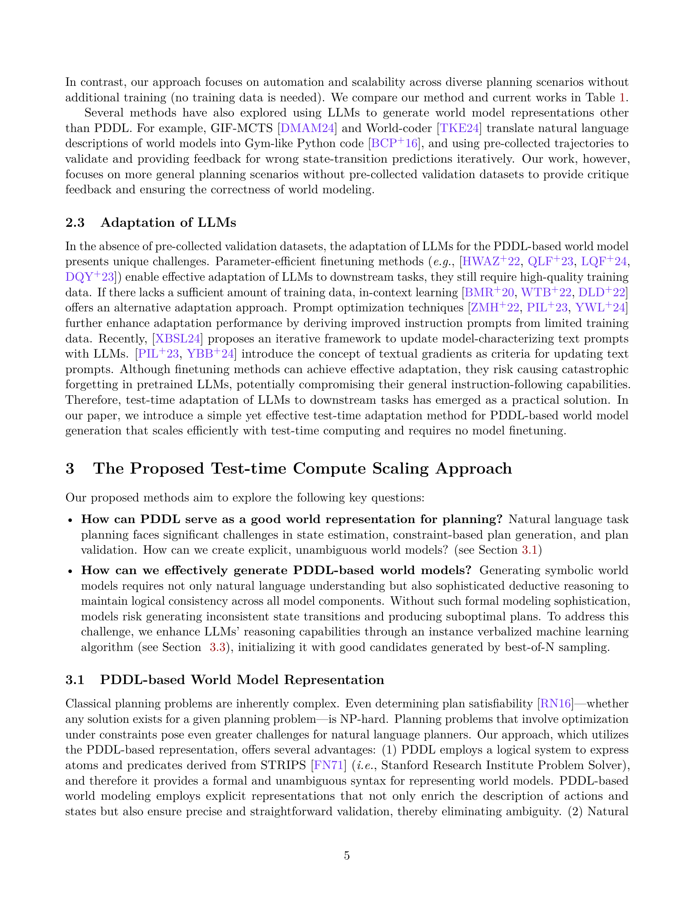
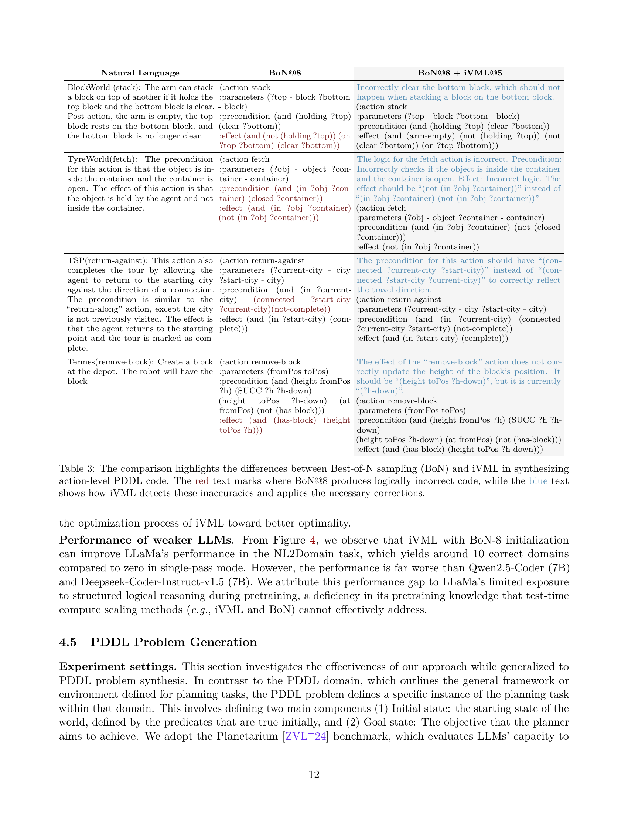
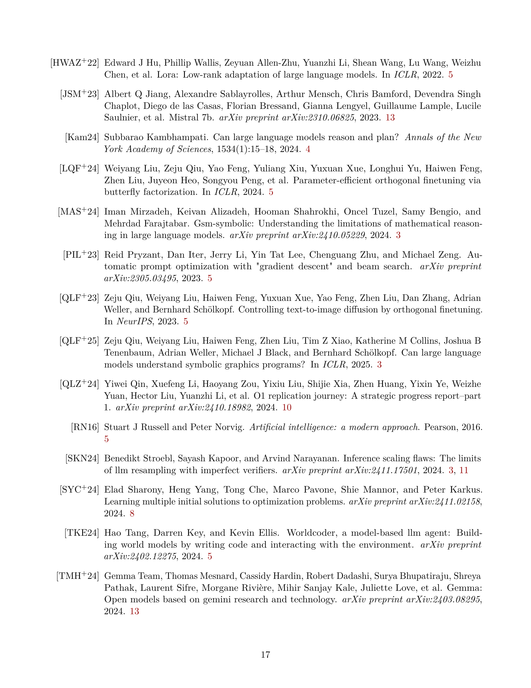

 


 2502.04728 
 Zhouliang Yu et el. 
 
 🤗 2025-02-10 
 



↗ arXiv


↗ Hugging Face


↗ Papers with Code


### TL;DR



현존하는 대규모 언어 모델(LLM)은 복잡한 추론과 계획에는 어려움을 겪습니다. 특히, 제약 조건이 많고 상태 전이가 복잡한 계획 문제는 자연어의 모호성 때문에 LLM이 정확한 계획을 세우는 데 어려움을 겪습니다. 이러한 문제를 해결하기 위해, 기존 연구는 PDDL(Planning Domain Definition Language)을 사용하여 계획 문제를 정형화하려는 시도를 해왔지만, LLM을 이용하여 고품질 PDDL 도메인을 생성하는 것은 여전히 어려운 과제로 남아있습니다.

본 논문에서는 LLM의 테스트 시간 계산을 확장하여 고품질 PDDL 도메인을 생성하는 새로운 방법을 제안합니다. 제안된 방법은 Best-of-N 샘플링을 통해 초기 솔루션의 품질을 높이고, iVML(Instance Verbalized Machine Learning)을 사용하여 솔루션을 세밀하게 다듬는 과정을 거칩니다. 실험 결과, 제안된 방법은 기존 방법보다 월등히 높은 성공률을 달성하며, 복잡한 계획 문제에서도 우수한 성능을 보였습니다. 이는 추가적인 학습 없이도 LLM의 PDDL 추론 능력을 향상시킬 수 있음을 보여주는 결과입니다.



#### Key Takeaways


 테스트 시간에 LLM의 계산을 확장하여 고품질 PDDL 도메인을 생성하는 방법 제시 



 Best-of-N 샘플링 및 iVML을 결합한 새로운 알고리즘을 통해 기존 방법 대비 성능 향상 



 PDDL 기반 추상화를 통해 복잡한 계획 문제에서 강력한 성능을 보임 


#### Why does it matter?
본 논문은 **대규모 언어 모델(LLM)**의 테스트 시간 확장을 통해 복잡한 계획 문제를 해결하는 새로운 방법을 제시합니다. **PDDL(Planning Domain Definition Language)**을 사용하여 기호적 세계 모델을 생성하고, 기존의 계획 알고리즘과 결합하여 LLM의 추론 능력을 향상시키는 데 기여합니다. 이는 계획 문제 해결에 있어 LLM의 한계를 극복하고, 다양한 분야에서 **자동화된 계획 시스템** 개발에 중요한 의미를 지닙니다. 또한, 본 연구는 **인스턴스 verbalized 기계 학습(iVML)**이라는 새로운 테스트 시간 학습 방법을 제안하고, 이를 통해 LLM의 추론 능력을 더욱 향상시키는 데 성공하였습니다. 이러한 결과는 향후 LLM 기반 계획 시스템 연구에 **새로운 방향**을 제시하고, **실제 응용 분야**로의 확장 가능성을 보여줍니다.

------
#### Visual Insights

> 🔼 본 논문의 그림 1은 제안된 방법의 개요를 보여줍니다. 이 방법은 크게 두 단계로 구성됩니다. 첫째, PDDL 초기화를 위한 Best-of-N 샘플링(3.2절 참조) 단계에서는 병렬 샘플링 프로세스를 실행하여 형식화된 PDDL 기반 세계 모델 표현(Dᵢ)과 자연어 사고(Tᵢ)로 구성된 다중 사고 과정 응답을 생성합니다. 둘째, iVML(3.3절 참조)을 사용한 폐쇄 루프 반복 단계에서는 이전 반복의 솔루션을 평가하는 최적화 LLM(fopt)과 피드백을 통해 학습하고 PDDL 기반 세계 모델(Dᵢ)을 업데이트하는 학습 LLM(flearner)을 통합하여 반복적으로 솔루션을 개선합니다. 최적의 PDDL 기반 세계 모델은 계획을 위한 체계적인 검색 엔진으로 전송됩니다.
> 

> 
read the caption

> Figure 1: An overview of the proposed method. Our test-time compute scaling approach consists of two main steps: (1) Best-of-N Sampling for PDDL Initialization (see Section 3.2): We start by running a parallel sampling process to generate multiple chain-of-thought responses that are composed of the formalized PDDL-based world model representation 𝐃isubscript𝐃𝑖\mathbf{D}_{i}bold_D start_POSTSUBSCRIPT italic_i end_POSTSUBSCRIPT and the natural language thought 𝐓isubscript𝐓𝑖\mathbf{T}_{i}bold_T start_POSTSUBSCRIPT italic_i end_POSTSUBSCRIPT. (2) Closed-loop Iteration with iVML (see Section 3.3): We use Instance Verbalized Machine Learning (iVML) to iteratively improve the solutions. The iVML incorporates: (1) An optimizer LLM foptsubscript𝑓optf_{\mathrm{opt}}italic_f start_POSTSUBSCRIPT roman_opt end_POSTSUBSCRIPT that evaluates the solutions from the previous iteration, and (2) A learner LLM flearnersubscript𝑓learnerf_{\mathrm{learner}}italic_f start_POSTSUBSCRIPT roman_learner end_POSTSUBSCRIPT that learns from the feedback and updates the PDDL-based world model 𝐃isubscript𝐃𝑖\mathbf{D}_{i}bold_D start_POSTSUBSCRIPT italic_i end_POSTSUBSCRIPT. The most optimal PDDL-based world model would be sent to the systematic search engine for planning.
> 


| Methods | Synthesis Objective | Benchmarking | Technical Method |
|---|---|---|---| 
| [13] | Each action separately   within PDDL domains | 3 domains:   Household, Logistics, Tyreworld | Human experts |
| [46] | Whole PDDL problems   (initial state and goal) | 2 domains:   Gripper, Blockworld | Finetuned on a large dataset |
| Ours | Whole PDDL domains | 283 IPC domains (NL2Domain)   332 IPC domains (Prob2Domain) | Test-time scaling without   model training & human experts |

> 🔼 본 논문의 표 1은 PDDL(Planning Domain Definition Language) 도메인 생성 방법들을 비교 분석한 표입니다.  기존의 PDDL 합성 방법들과 본 연구에서 제안하는 방법의 차이점을 명확하게 보여주는 표로,  각 방법들의 합성 목표(예: 각 행동을 개별적으로 합성, 전체 PDDL 문제 합성 등), 사용한 벤치마킹 데이터셋, 그리고 사용된 기술적 방법(예: 전문가의 수동 작업, 대규모 데이터셋을 이용한 미세 조정 등)을 비교하여 제시하고 있습니다. 본 연구에서 제안하는 방법이 기존 방법들보다 우수함을 보여주는 근거를 제시하는 표입니다.
> 

> 
read the caption

> Table 1: Comparison between current PDDL synthesis methods and ours.
> 

### In-depth insights

#### LLM Planning Limits
LLM의 계획 능력에는 여러 가지 제한이 있습니다. **첫째, LLM은 복잡한 추론과 계획에 필요한 지식을 충분히 갖추지 못했습니다.**  복잡한 상황에서 최적의 계획을 세우는 능력이 부족하며, 제약 조건을 충족하거나 최적의 상태 전이를 보장하는 데 어려움을 겪습니다. **둘째, 자연어의 모호성으로 인해 LLM이 정확한 세계 모델을 생성하는 데 어려움을 겪습니다.**  자연어는 애매하고 불완전할 수 있기 때문에, LLM이 자연어 설명으로부터 정확한 제약 조건과 목표를 추출하기 어렵습니다. 따라서 **LLM은 정형화된 계획 언어(예: PDDL)와 같은 형식적인 표현을 사용하여 더욱 명확하고 정확한 세계 모델을 생성해야 합니다.**  **셋째, LLM은 학습 데이터의 부족으로 인해 PDDL 도메인을 생성하는 데 어려움을 겪습니다.**  LLM은 PDDL 데이터로 충분히 학습되지 않았기 때문에, 고품질의 PDDL 도메인을 직접 생성하는 것이 어렵습니다.  따라서 LLM의 추론 능력을 향상시키고 고품질 PDDL 도메인 생성을 가능하게 하기 위해서는 **LLM의 테스트 시간 계산을 확장해야 합니다.**

#### Test-Time Scaling
본 논문에서 제시된 'Test-Time Scaling'은 **대규모 언어 모델(LLM)**의 성능을 향상시키기 위한 중요한 전략입니다. 기존의 LLM 학습 방식은 방대한 데이터셋을 필요로 하지만, Test-Time Scaling은 **추가적인 학습 없이** 테스트 단계에서 모델의 연산 능력을 확장하여 성능을 개선합니다.  이는 **제한된 학습 데이터** 문제를 해결하는 효과적인 방법론으로, 특히 PDDL(Planning Domain Definition Language) 도메인 생성과 같은 복잡한 계획 문제에 적용됩니다.  **Best-of-N 샘플링**을 통해 다양한 초기 솔루션을 생성하고, **Instance Verbalized Machine Learning (iVML)**을 통해 반복적으로 개선하는 방식은 탐색과 활용의 균형을 잘 맞춰 고품질의 PDDL 도메인을 생성하는 데 기여합니다.  **iVML**은 LLM의 추론 능력을 활용, 생성된 PDDL 도메인의 유효성을 검증하고 오류를 수정하는 데 효과적이며, 이를 통해 계획 문제 해결의 정확성과 효율성을 높입니다.  결론적으로, **테스트 시간 연산 확장**은 LLM의 계획 능력을 향상시키는 강력한 방법임을 보여주며, 다양한 계획 문제에 적용 가능성을 시사합니다.

#### PDDL Symbolic Model
본 논문에서 제시된 PDDL 기호 모델은 **복잡한 계획 문제를 해결하기 위한 강력한 방법**임을 보여줍니다. 자연어의 모호성을 피하고 제약 조건 및 최적성을 보장하기 위해 **PDDL(Planning Domain Definition Language)을 사용하여 명확하고 공식적인 상태 설명을 가능**하게 합니다. 이를 통해 기존의 A* 와 같은 검색 알고리즘을 원활하게 적용하여 최적 계획을 찾을 수 있습니다.  **LLM(Large Language Model)의 테스트 시간 확장을 통해 고품질 PDDL 도메인 생성을 가능하게** 하는 핵심적인 역할을 수행합니다.  **Best-of-N 샘플링 및 iVML(Instance Verbalized Machine Learning)을 결합**하여 초기 솔루션의 질을 높이고 반복적으로 개선함으로써,  **기존의 LLM 기반 방법보다 훨씬 우수한 성능**을 달성합니다. 특히, 복잡한 계획 문제에서도 효과적으로 작동하며,  **PDDL 기반 추상화를 통해 강력한 계획 능력**을 제공합니다.  하지만, **실제 세계의 복잡성을 완전히 포착하지 못하는 한계**를 지니고 있습니다.  **추후 연구를 통해 제약 조건 및 모호성을 더욱 효과적으로 처리**하여 실제 세계 적용 가능성을 높여야 합니다.

#### iVML Refinement
iVML(Instance Verbalized Machine Learning) 개선 과정은 **초기 PDDL 도메인의 품질에 크게 의존**합니다.  **부정확하거나 불완전한 초기 도메인은 느린 수렴이나 최적이 아닌 솔루션으로 이어질 수 있기 때문**입니다. 따라서 본 논문에서는 **Best-of-N 샘플링을 통해 다양하고 질적으로 우수한 초기 PDDL 도메인을 생성**하고, 이를 **iVML을 통해 반복적으로 개선**하는 전략을 제시합니다.  **Best-of-N 샘플링은 탐색(exploration)에 초점**을 맞추고, **iVML은 활용(exploitation)에 초점**을 맞춰 상호 보완적인 역할을 수행합니다.  즉, Best-of-N 샘플링으로 다양한 후보군을 생성하고, iVML을 통해 최적의 후보를 선택하여 반복적으로 개선함으로써 **탐색과 활용의 균형을 맞춰 최적의 PDDL 도메인을 생성**하는 것입니다. 이러한 접근 방식은 제한된 PDDL 학습 데이터의 문제를 해결하고, 다양한 계획 문제에 대한 확장성을 제공하는 데 기여합니다.  **iVML의 성능은 초기 솔루션의 품질에 크게 의존**하기 때문에, **초기 솔루션의 질을 높이는 전략이 중요**합니다.  **최적화 LLM과 학습 LLM의 상호작용을 통해 반복적인 개선**을 수행하는 iVML은 단순히 최고의 솔루션을 찾는 것을 넘어, **논리적 일관성과 문법적 정확성을 향상**시키는 데 효과적임을 보여줍니다.

#### Future: Hybrid Methods
미래의 하이브리드 기법은 **대규모 언어 모델(LLM)**과 **기호적 기법**의 강점을 결합하여 계획 문제 해결을 위한 새로운 접근법을 제시할 것입니다. LLM의 강력한 자연어 이해 및 추론 능력은 문제 정의 및 해석 단계에서 큰 도움을 줄 수 있으며, 기호적 기법의 정확성과 효율성은 계획 생성 및 검증 단계에서 중요한 역할을 합니다. 따라서 미래의 연구는 LLM 기반의 기호적 세계 모델 생성 및 최적화에 초점을 맞춰, **LLM이 생성한 기호적 표현을 기존의 계획 알고리즘과 통합**하는 하이브리드 시스템을 개발하는 데 집중할 것입니다. 이를 통해 복잡한 제약 조건과 불확실성을 고려하는 보다 강력하고 효율적인 계획 시스템을 구축할 수 있으며, **실세계 문제에 대한 적용 가능성을 높일** 수 있을 것입니다. 또한, **자연어 기반의 계획 시스템 개발에 대한 새로운 패러다임**을 제시함으로써, 인간과 AI의 협업을 통해 계획 문제를 보다 효과적으로 해결할 수 있는 방안을 모색할 수 있을 것으로 예상됩니다. 이러한 하이브리드 기법은 단순히 LLM과 기호적 기법을 결합하는 것을 넘어, 상호 작용과 피드백을 통해 서로의 약점을 보완하고 강점을 극대화하는 **시너지 효과를 창출**하는 데 중점을 둘 것입니다.  **데이터 효율성**과 **일반화 능력**을 향상시키는 방향으로 연구가 진행될 것으로 예상되며, 이는 실세계의 다양한 문제에 적용 가능한 범용적인 계획 시스템 개발에 크게 기여할 것입니다.

### More visual insights

More on figures

> 🔼 그림 2는 OpenAI의 o1 모델이 Termes 계획 문제를 해결하는 과정에서 발생하는 환각 현상을 보여줍니다. 특히 3단계와 4단계에서, o1 모델은 미리 정의된 규칙을 위반하며 행동을 선택하고 활용합니다. 또한 4단계에서는 목표 달성을 환각하여 잘못되거나 비현실적인 결과를 초래합니다. o1 모델 자체로 환각된 계획을 평가하더라도, 잘못된 결과를 올바른 것으로 인식합니다. 이 그림은 자연어 모델이 복잡한 계획 문제를 해결하는 데 어려움을 겪고 있음을 보여줍니다.
> 

> 
read the caption

> Figure 2: OpenAI-o1 plans for Termes: o1 frequently exhibits hallucination during the planning process. Specifically, in steps three and four, the LLM violates predefined rules when selecting and leveraging actions. Additionally, step four hallucinates the achievement of the goal, leading to incorrect or unrealistic outcomes. Even when using o1 itself to evaluate the hallucinated plan, it incorrectly identifies the plan as valid.
> 

> 🔼 그림 3은 iVML과 BoN의 성능 추이를 보여줍니다. 왼쪽 그래프는 반복 훈련 횟수가 증가함에 따라 iVML의 성능 향상을 보여줍니다. 오른쪽 그래프는 샘플링 수가 증가함에 따라 BoN의 성능 추이를 보여줍니다. 두 그래프 모두 Qwen2.5-7B-Coder 모델을 사용하여 NL2Domain 및 Prob2Domain 작업에 대한 정확도를 측정했습니다. iVML은 반복 훈련을 통해 지속적인 성능 향상을 보여주는 반면, BoN은 특정 샘플링 수 이후에는 성능 향상이 제한적임을 보여줍니다.
> 

> 
read the caption

> Figure 3: Left: The performance trend of iVML with increasing training epochs. Right: The performance trend of BoN with increasing sampling numbers.
> 

> 🔼 그림 4는 다양한 초기화 설정에서 NL2Domain 작업에 대한 iVML의 성능을 보여줍니다.  이 그래프는 여러 초기화 전략(BoN 샘플링, 단일 패스)과 다양한 모델(Qwen2.5-Coder, Deepseek-Coder, LLaMa)을 사용하여 생성된 PDDL 도메인의 정확성을 반복 횟수에 따라 비교합니다. 각 초기화 전략의 효과와 iVML의 수렴 속도를 보여주는 것을 목표로 합니다.  BoN 샘플링이 단일 패스 초기화보다 더 나은 성능을 제공하는지, 그리고 다양한 모델에서 이러한 차이가 어떻게 나타나는지 시각적으로 보여줍니다.
> 

> 
read the caption

> Figure 4: The performance of iVML on NL2Domain tasks across different initialization settings.
> 

> 🔼 그림 5는 다양한 초기화 설정에서 Prob2Domain 작업에 대한 iVML의 성능을 보여줍니다. 이 그래프는 여러 초기화 전략(BoN, 단일 패스)을 사용하여 학습된 iVML 모델의 Prob2Domain 작업에서의 정확도를 반복 횟수에 따라 보여줍니다. 이를 통해 다양한 초기화 전략이 iVML 성능에 미치는 영향을 비교 분석하고, 초기화 전략의 선택이 모델 성능에 중요한 역할을 한다는 것을 시각적으로 보여줍니다. 특히, BoN(Best-of-N) 샘플링 기법을 사용한 초기화가 단일 패스 초기화보다 성능이 우수함을 확인할 수 있습니다.
> 

> 
read the caption

> Figure 5: The performance of iVML on Prob2Domain tasks across different initialization settings.
> 

> 🔼 그림 6은 Termes 계획 문제에 대한 계획 그래프를 보여줍니다. 이 그래프는 계획 과정 동안 명시적인 상태 전이를 포함합니다. 각 노드는 계획의 특정 상태를 나타내고, 에지는 상태 간의 전이를 나타내는 행동을 나타냅니다. 이 그래프는 Termes 문제의 상태 공간을 탐색하고 최적 계획을 찾는 데 사용된 알고리즘을 시각적으로 보여줍니다.  상태 전이에 대한 명확한 표현은 계획의 정확성과 완전성을 보장하는 데 중요합니다.
> 

> 
read the caption

> Figure 6: The planning graph for Termes
> 

More on tables


| Each action separately | within PDDL domains |
|---|---|
> 🔼 표 2는 PDDL 도메인 합성에서 다양한 방법들의 성능을 비교한 표입니다. BoN-8은 후보를 8개 사용한 BoN 샘플링을, iVML-5-BoN-8은 BoN-8로 초기화된 iVML 학습의 5번 반복을 의미합니다.  표에는 다양한 크기의 오픈소스 및 클로즈드소스 언어 모델을 사용한 NL2Domain(자연어 설명을 PDDL 도메인으로 변환) 및 Prob2Domain(PDDL 문제에서 PDDL 도메인 생성) 작업의 성공률이 제시되어 있습니다.  본 논문의 제안 방법인 BoN 및 iVML을 사용한 결과도 함께 제시되어 있으며, 제안 방법이 기존 방법보다 높은 성공률을 달성했음을 보여줍니다.
> 

> 
read the caption

> Table 2: A comparison of performance in PDDL domain synthesis. BoN-8 refers to BoN sampling with 8 candidates, while iVML-5-BoN-8 denotes five iterations of iVML training initialized with BoN-8.
> 


| 3 domains: | 
|---|---| 
| Household, Logistics, Tyreworld |
> 🔼 표 3은 행동 수준의 PDDL 코드를 합성하는 데 있어 Best-of-N 샘플링(BoN)과 iVML의 차이점을 보여줍니다. 빨간색 텍스트는 BoN@8이 논리적으로 잘못된 코드를 생성한 부분을, 파란색 텍스트는 iVML이 이러한 부정확성을 감지하고 필요한 수정을 적용하는 방식을 나타냅니다.  BoN은 다양한 후보 솔루션을 생성하지만, 논리적 오류가 발생할 수 있습니다. 반면 iVML은 반복적인 수정을 통해 초기 솔루션을 개선하여 더 정확하고 최적화된 PDDL 코드를 생성합니다.
> 

> 
read the caption

> Table 3: The comparison highlights the differences between Best-of-N sampling (BoN) and iVML in synthesizing action-level PDDL code. The  red text marks where BoN@8 produces logically incorrect code, while the  blue text shows how iVML detects these inaccuracies and applies the necessary corrections.
> 


| Whole PDDL problems |
|---|---| 
| (initial state and goal) |
> 🔼 표 4는 다양한 모델의 PDDL 문제 생성 성능을 비교한 결과를 보여줍니다.  0-shot(제로샷) 및 Fine-tuned(미세 조정) 설정에서 GPT-4, Gemma, Mistral 등 다양한 모델의 성능을 보여주고, 제안된 방법인 BoN-16과 iVML-1-BoN-16의 성능을 비교하여  제안된 방법의 우수성을 보여줍니다. 특히, 제안된 방법은 미세조정 없이도 매우 높은 정확도를 달성하는 것을 보여줍니다.
> 

> 
read the caption

> Table 4: Performance comparison of different models on PDDL problem generation
> 


| 2 domains: | 
|---|---| 
| Gripper, Blockworld | 
> 🔼 표 5는 PDDL 추상화 방식과 LLM 기반 계획 방식을 비교한 결과를 보여줍니다. 평가 지표는 계획 정확도이며, 제시된 PDDL 기반 방식은 휴리스틱 탐색 및 계획 검증을 위해 Fast Downward 시스템을 사용합니다.  LLM 기반 계획 방식은 자연어를 사용하여 계획을 수립하지만, PDDL 기반 방식은 PDDL 도메인을 생성하여 명시적인 상태 전이 모델을 사용합니다. 이를 통해 계획의 일관성과 타당성을 보장하고 최적의 계획을 찾을 수 있습니다.  표에는 다양한 계획 문제(Floortile, Barman, Tyreworld, Grippers, Termes, Blockworld)에 대한 각 방식의 성공률이 제시되어 있습니다.
> 

> 
read the caption

> Table 5: PDDL abstraction vs. LLM-as-Planner. The comparison uses plan accuracy as the evaluation metric. Our PDDL-based method uses the Fast Downward system [14] for heuristic search and plan validation.
> 

### Full paper



