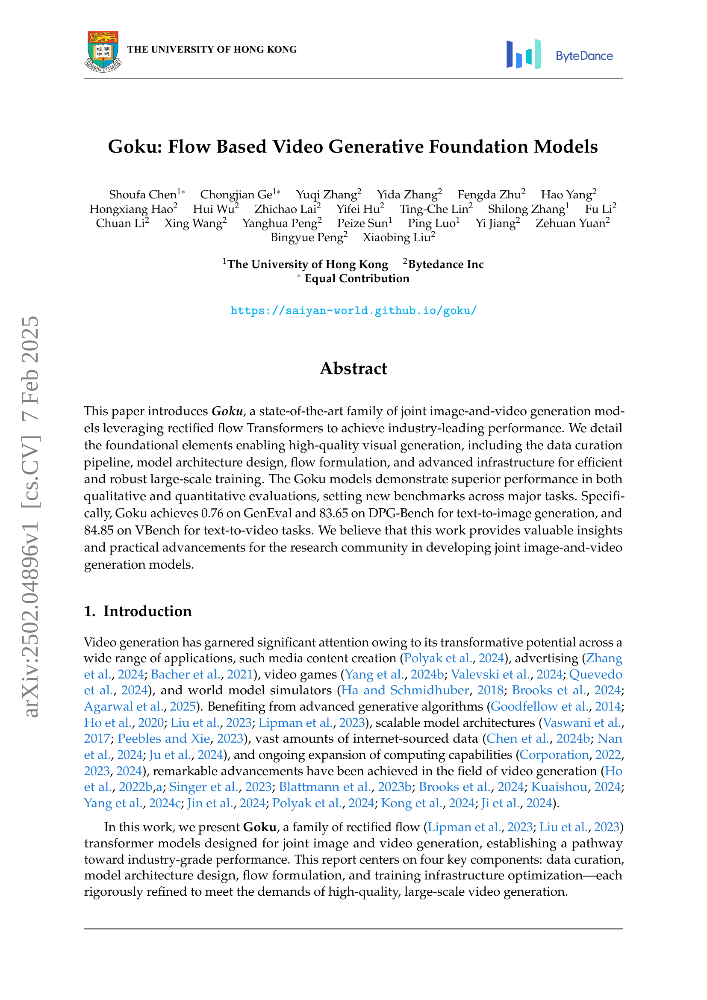

 


 2502.04896 
 Shoufa Chen et el. 
 
 🤗 2025-02-10 
 



↗ arXiv


↗ Hugging Face


↗ Papers with Code


### TL;DR



본 논문에서는 대규모 이미지 및 비디오 생성 모델인 Goku를 소개합니다. 기존 모델의 한계를 극복하기 위해, Goku는 정류 흐름 변환기를 활용하여 고품질의 시각적 생성을 가능하게 합니다. 특히, **데이터 관리 파이프라인, 모델 아키텍처 설계, 흐름 공식화, 효율적인 대규모 학습을 위한 고급 인프라** 등의 요소들이 Goku의 성능 향상에 중요한 역할을 합니다. 

Goku는 다양한 작업에서 우수한 성능을 보여줍니다. GenEval과 DPG-Bench에서 뛰어난 텍스트-이미지 생성 성능을, VBench에서 뛰어난 텍스트-비디오 생성 성능을 기록했습니다. **이러한 결과는 이미지 및 비디오 생성 모델 개발에 대한 귀중한 통찰력과 실질적인 발전**을 제공합니다. 또한, **대규모 모델 학습을 위한 강력한 인프라**를 구축함으로써, **산업 수준의 고품질 시각적 생성**을 가능하게 했습니다.



#### Key Takeaways


 향상된 이미지 및 비디오 생성 성능 



 효율적인 대규모 학습 인프라 



 이미지 및 비디오에 대한 통합적 표현 


#### Why does it matter?
본 논문은 **대규모 이미지 및 비디오 생성 모델 개발**에 중요한 발전을 제시하며, **다양한 분야의 연구자들에게 귀중한 통찰력과 실질적인 발전**을 제공합니다. 특히, 제시된 방법론은 **산업 수준의 성능**을 달성하여, 향후 **상용화 가능성**을 높였습니다. 또한, **새로운 연구 방향**을 제시하여 **학계 및 산업계의 지속적인 발전**에 기여할 것으로 예상됩니다.

------
#### Visual Insights

> 🔼 그림 (a)는 Goku 모델이 생성한 텍스트-이미지 샘플들을 보여줍니다.  다양한 스타일과 복잡성의 이미지들이 제시되어 있으며, 각 이미지는 주어진 텍스트 프롬프트를 바탕으로 생성되었습니다.  이 이미지들은 Goku 모델의 텍스트 이해 및 이미지 생성 능력을 보여주는 대표적인 예시입니다.  모델의 다양한 스타일을 표현하는 능력과 복잡한 세부 묘사를 생성할 수 있는 능력을 시각적으로 보여줍니다.
> 

> 
read the caption

> (a) Text-to-Image Samples
> 


| Model | Layer | Model Dimension | FFN Dimension | Attention Heads |
|---|---|---|---|---|
| Goku-1B | 28 | 1152 | 4608 | 16 |
| Goku-2B | 28 | 1792 | 7168 | 28 |
| Goku-8B | 40 | 3072 | 12288 | 48 |

> 🔼 본 표는 Goku 모델의 아키텍처 구성에 대한 세부 정보를 제공합니다. Goku-1B 모델은 본 논문의 2.3절에서 기술된 예비 실험에만 사용되었음을 보여줍니다. 표에는 각 모델의 레이어 수, 모델 차원, FFN 차원, 어텐션 헤드 수 등의 정보가 포함되어 있습니다. 이를 통해 각 Goku 모델의 크기와 복잡성을 비교하고, 모델 성능에 미치는 아키텍처의 영향을 분석할 수 있습니다.
> 

> 
read the caption

> Table 1: Architecture configurations for Goku Models. Goku-1B model is only used for pilot experiments in Section 2.3
> 

### In-depth insights

#### Goku's Architecture
Goku 모델의 아키텍처는 **수정된 흐름(rectified flow)** 변환기를 기반으로 이미지와 비디오 생성을 위한 통합 프레임워크를 제시합니다. **3D 조인트 이미지-비디오 VAE**를 활용하여 이미지와 비디오 입력을 공유잠재공간(shared latent space)으로 압축하여 효율적인 다중 모달 표현을 가능하게 합니다.  **트랜스포머 아키텍처**는 텍스트 조건부 임베딩과의 상호작용을 통해 텍스트-이미지/비디오 정합성을 개선합니다.  **플래시 어텐션(FlashAttention)**과 시퀀스 병렬처리를 통해 대규모 비디오 데이터 학습에 필요한 계산 효율성을 확보합니다.  **패치 앤 팩(Patch n' Pack)** 기법을 이용하여 다양한 종횡비와 길이의 이미지 및 비디오를 효율적으로 처리하며, **3D 회전 위치 임베딩(3D Rotary Position Embedding)**과 **Q-K 정규화(Q-K Normalization)** 기법을 통해 안정적인 학습과 성능 향상을 이끌어냅니다.  **다중 단계 학습 전략**은 텍스트-시맨틱 쌍부터 이미지-비디오 결합 학습, 모달 특징 미세 조정까지 단계적으로 진행하여 모델의 강건성과 성능을 높입니다.  **캐스케이드 해상도 학습(Cascaded Resolution Training)**을 통해 저해상도부터 고해상도까지 점진적으로 학습하여 계산 비용을 절감하고 품질을 높였습니다.  **전반적으로 Goku는 효율성과 성능을 균형 있게 고려한 설계로,  대규모 다중 모달 생성 모델의 새로운 표준을 제시할 가능성을 보여줍니다.**

#### Flow-Based Training
본 논문에서 제시된 흐름 기반 훈련 방법은 **정류된 흐름(Rectified Flow)** 알고리즘을 기반으로 합니다. 이는 표준 정규 분포와 같은 사전 분포에서부터 표적 데이터 분포까지 샘플을 점진적으로 변환하는 과정을 통해 이루어집니다. **선형 보간법**을 활용하여 사전 분포와 표적 분포 사이를 매끄럽게 연결하며, 이를 통해 모델은 사전 분포에서부터 실제 데이터 샘플에 이르기까지의 변환 과정을 효율적으로 학습할 수 있습니다. 이러한 접근 방식은 이론적 장점과 더 빠른 수렴 속도를 제공하는 것으로 입증되었습니다. 특히, **이미지와 비디오 데이터에 대한 통합된 흐름 기반 모델링**을 제시함으로써, 기존 방법들의 한계를 극복하고 다양한 모달리티의 데이터를 효율적으로 처리할 수 있게 되었습니다.  **다양한 크기의 모델에 대한 적응성** 또한 강조되며,  **메모리 효율성**과 **계산 효율성**을 향상시키는 기술들을 병행하여 대규모 데이터셋을 효과적으로 학습할 수 있음을 보여줍니다.

#### Data Curation
본 논문에서 데이터 큐레이션 파이프라인은 **대규모 고품질 이미지 및 비디오 데이터셋**을 구축하는 데 중추적인 역할을 합니다.  **다양한 출처** (공개 데이터셋, 인터넷 리소스, 독점 데이터)에서 수집된 원시 데이터는 여러 단계의 정교한 필터링 과정을 거칩니다.  **비디오 클립 추출**, **미학적 점수 및 동작 분석 기반 필터링**, **OCR을 이용한 텍스트 제거**, **해상도 및 프레임 속도 표준화** 등의 과정을 통해 품질이 낮거나 부적절한 데이터는 제거하고, **고품질의 이미지 및 비디오-텍스트 쌍**을 얻습니다.  **다중 언어 모델**을 활용하여 정확하고 풍부한 캡션을 생성하며, 데이터 불균형 문제는 **세분화된 카테고리별 데이터 균형 조정**을 통해 해결합니다. 이러한 엄격한 데이터 큐레이션 과정은 최종적으로 **고품질의 학습 데이터셋**을 제공하여 Goku 모델의 성능 향상에 크게 기여합니다.  결과적으로, **대규모, 고품질 데이터** 확보를 위한 체계적이고 효율적인 파이프라인 구축이 Goku 모델의 성공에 중요한 요소임을 보여줍니다.

#### Benchmark Results
본 논문에서 제시된 Goku 모델의 성능을 평가하기 위해 **다양한 벤치마크**를 사용했습니다.  **GenEval, T2I-CompBench, DPG-Bench** 와 같은 이미지 생성 벤치마크에서 Goku는 기존 최첨단 모델들을 능가하는 성능을 보였습니다. 특히, GenEval에서 **0.76** 이라는 높은 점수를 달성하며 **텍스트-이미지 정합도** 측면에서 우수성을 입증했습니다.  **DPG-Bench**의 복잡한 텍스트 프롬프트에도 우수한 성능을 나타냈으며, **T2I-CompBench** 에서도 색상, 형태, 질감 등 이미지 속성에 대한 정합도에서 뛰어난 결과를 보였습니다.  비디오 생성 벤치마크인 **UCF-101** 및 **VBench** 에서도 **최첨단 수준의 성능**을 기록하여 Goku 모델의 뛰어난 다중 모드 생성 능력을 확인했습니다. 이러한 결과는 Goku 모델의 **데이터 처리 파이프라인, 모델 아키텍처, 그리고 훈련 인프라** 모두가 최적화되었음을 보여주는 강력한 증거입니다.  **정량적 평가 외에도, 주관적 평가를 통해 Goku 모델이 생성한 이미지 및 비디오의 높은 품질**을 확인했습니다. 종합적으로, Goku는 **이미지 및 비디오 생성 분야에서 새로운 기준**을 제시하는 획기적인 모델임을 입증합니다.

#### Ablation Studies
본 논문의 "Ablation Studies" 부분은 모델의 성능에 영향을 미치는 요소들을 체계적으로 분석하여 **모델 설계의 타당성과 효율성**을 검증하는 데 중점을 둡니다.  **모델 크기(scale)의 영향**을 평가하기 위해 다양한 크기의 모델을 학습시킨 결과, 더 큰 모델이 보다 정교하고 세밀한 이미지/비디오 생성 능력을 보여주는 것을 확인했습니다. 또한, **결합 학습(joint training)**의 중요성을 입증하기 위해 이미지와 비디오 데이터를 결합하여 학습시킨 모델과 각각의 데이터를 개별적으로 학습시킨 모델의 성능을 비교 분석했습니다.  **결합 학습을 통해 모델의 일반화 능력과 비디오 생성 품질이 향상**되었음을 보여주는 결과를 얻었습니다. 이러한 실험 결과는 제시된 모델 아키텍처 및 학습 전략의 효과를 뒷받침하는 근거로 해석될 수 있으며, 향후 연구를 위한 중요한 시사점을 제공합니다.  즉, 단순한 성능 비교를 넘어, 모델의 각 구성 요소가 전체 성능에 어떻게 기여하는지를 정량적으로 분석하여 모델의 설계 원리를 심도 있게 이해할 수 있도록 합니다.  결론적으로, **Ablation Studies는 Goku 모델의 핵심 구성 요소와 학습 전략의 효과를 검증하고,  모델 성능 향상에 대한 통찰력을 제공**하는 중요한 부분입니다.

### More visual insights

More on figures

> 🔼 그림 (b)는 Goku 모델이 생성한 텍스트-비디오 샘플들을 보여줍니다.  각각의 비디오 클립은 텍스트 프롬프트에 따라 생성되었으며, 다양한 장면과 시각적 스타일을 보여줍니다.  예를 들어, 팬더가 훠궈를 먹는 모습, 종이 비행기들이 정글을 날아다니는 모습, 사람이 부엌에서 요리하는 모습 등이 포함되어 있습니다. 이 그림은 Goku 모델의 텍스트 기반 비디오 생성 능력을 시각적으로 보여주는 역할을 합니다.  다양한 프롬프트에 대한 모델의 반응을 보여줌으로써, Goku의 다양한 시각적 스타일 및 컨텍스트 처리 능력을 보여줍니다.
> 

> 
read the caption

> (b) Text-to-Video Samples
> 

> 🔼 본 그림은 Goku 모델이 생성한 이미지와 비디오 샘플들을 보여줍니다. 빨간색으로 강조 표시된 부분은 데이터 준비, 모델 아키텍처, 플로우 공식화, 그리고 효율적인 대규모 학습을 위한 인프라 최적화 등 Goku 모델의 핵심 구성 요소들을 나타냅니다. 텍스트-이미지 생성과 텍스트-비디오 생성 작업 모두에 대한 고품질의 결과물을 보여주는 다양한 예시들이 포함되어 있습니다. 이 그림은 Goku 모델의 성능과 다양한 애플리케이션에서의 잠재력을 시각적으로 보여줍니다.
> 

> 
read the caption

> Figure 1: Generated samples from Goku. Key components are highlighted in RED.
> 

> 🔼 그림 2는 Goku 모델의 데이터 정제 파이프라인을 보여줍니다. 인터넷에서 수집한 방대한 양의 비디오 및 이미지 데이터를 바탕으로, 여러 단계의 필터링, 캡션 생성 및 균형 조정 과정을 거쳐 고품질의 비디오-이미지-텍스트 데이터 쌍을 생성하는 과정을 시각적으로 설명합니다.  이 그림은 데이터 수집, 비디오 클립 추출, 이미지와 비디오 필터링, 캡션 생성, 데이터 분포 균형 조정 등의 단계를 포함하며, 각 단계별 세부적인 내용은 본문에서 자세히 설명하고 있습니다.
> 

> 
read the caption

> Figure 2: The data curation pipeline in Goku. Given a large volume of video/image data collected from Internet, we generate high-quality video/image-text pairs through a series of data filtering, captioning and balancing steps.
> 

> 🔼 그림 (a)는 필터링된 비디오 클립에 대한 의미적 분포를 보여줍니다.  주요 카테고리(예: 사람, 풍경, 동물, 음식)와 하위 카테고리(예: 셀카, 결혼식, 저녁 식사)를 보여줍니다.  이 그림은 다양한 유형의 비디오 데이터가 얼마나 포함되어 있는지를 시각적으로 보여주고, 특정 카테고리(예: 사람)의 비디오가 다른 카테고리보다 훨씬 더 많은 것을 보여줍니다. 이러한 의미적 분포는 모델의 훈련 과정에서 고려되어야 할 중요한 요소입니다.
> 

> 
read the caption

> (a) Semantic distribution of video clips.
> 

> 🔼 그림 (b)는 훈련 데이터셋 내에서 하위 범주들의 균형 잡힌 의미적 분포를 보여줍니다. 원래 데이터셋은 특정 범주 (예: 사람, 풍경, 음식)에 치우쳐져 있었지만, 균형을 맞추기 위해 과소 표현된 하위 범주는 과대 표현을 통해 데이터 증강을 하고, 과대 표현된 하위 범주는 데이터를 감소시켰습니다.  이 그림은 균형 조정 후, 다양한 하위 범주들이 훈련 데이터셋에 고르게 분포되어 있음을 시각적으로 나타냅니다.  즉, 모델이 특정 종류의 이미지 또는 비디오에 편향되지 않고 다양한 시각적 내용을 학습할 수 있도록 데이터 균형을 맞춘 결과를 보여주는 것입니다.
> 

> 
read the caption

> (b) The balanced semantic distribution of subcategories.
> 

> 🔼 그림 3은 논문의 데이터 큐레이션 파이프라인에서 생성된 훈련 데이터의 의미 분포를 보여줍니다. (a)는 주요 카테고리(인간, 풍경, 동물, 음식 등)의 비율을 나타내는 원형 차트이고, (b)는 주요 카테고리 내 하위 카테고리의 균형 잡힌 분포를 보여줍니다.  데이터 균형을 맞추기 위해 과대 표현된 하위 카테고리는 다운샘플링하고, 과소 표현된 하위 카테고리는 인공 데이터 생성 및 오버샘플링 기법을 통해 증강했습니다. 이는 다양한 시각적 스타일과 콘텐츠를 포괄하는 균형 잡힌 훈련 데이터셋을 확보하여 모델의 일반화 성능을 향상시키기 위함입니다.
> 

> 
read the caption

> Figure 3: Training data distributions. The balanced semantic distribution of primary categories and subcategories are shown in (a) and (b), respectively.
> 

> 🔼 그림 4는 Goku-I2V 모델의 이미지-비디오 생성 결과를 보여줍니다. 왼쪽 열에는 참조 이미지가, 나머지 열에는 Goku-I2V 모델이 생성한 비디오 프레임들이 순차적으로 나열되어 있습니다. 긴 프롬프트에서 불필요한 정보는 제거하고 주요 내용만 표시하였으며, 주요 키워드는 빨간색으로 강조 표시되어 있습니다. 각 비디오는 참조 이미지를 기반으로 생성되었으며, 프롬프트에 명시된 내용을 시각적으로 잘 반영하고 있습니다.  이는 Goku-I2V 모델이 이미지를 기반으로 일관성 있는 비디오를 생성하는 능력을 보여줍니다.
> 

> 
read the caption

> Figure 4: Samples of Goku-I2V. Reference images are presented in the leftmost columns. We omitted redundant information from the long prompts, displaying only the key details in each one. Key words are highlighted in RED.
> 

> 🔼 그림 5(a)는 Goku-T2V 모델의 크기 변화에 따른 비교 결과를 보여줍니다.  Goku-T2V(2B)와 Goku-T2V(8B) 모델을 서로 다른 크기로 훈련시켜 비교한 결과, 모델 크기가 클수록 (8B) 이미지가 왜곡되지 않고 더 선명하고 정확하게 생성되는 것을 확인할 수 있습니다. 특히, 2B 모델에서는 팔이나 바퀴 등 일부 물체의 구조가 왜곡되는 현상이 나타나지만, 8B 모델에서는 이러한 현상이 크게 개선되었습니다. 이는 대규모 멀티모달 모델에서 관찰되는 결과와 일치합니다.
> 

> 
read the caption

> (a) Model Scaling
> 

More on tables


| Loss | Steps | FID ↓ | sFID ↓ | IS ↑ | Precision ↑ | Recall ↑ |
|---|---|---|---|---|---|---|
| DDPM | 200k | 3.0795 | 4.3498 | 226.4783 | 0.8387 | 0.5317 |
| DDPM | 400k | 2.5231 | 4.3821 | 265.0612 | 0.8399 | 0.5591 |
| DDPM | 1000k | 2.2568 | 4.4887 | 286.5601 | 0.8319 | 0.5849 |
| Rectified Flow | 200k | 2.7472 | 4.6416 | 232.3090 | 0.8239 | 0.5590 |
| Rectified Flow | 400k | 2.1572 | 4.5022 | 261.1203 | 0.8210 | 0.5871 |
> 🔼 표 2는 ImageNet 256x256 데이터셋에서 클래스 조건부 이미지 생성에 대한 개념 증명 실험 결과를 보여줍니다.  실험은 잡음 제거 확산 확률 모델(DDPM)과 정류 흐름(Rectified Flow, RF) 알고리즘 두 가지 방법으로 진행되었으며, FID(Fréchet Inception Distance)와 IS(Inception Score) 지표를 사용하여 모델 성능을 평가했습니다.  표에서 확인할 수 있듯이, RF 알고리즘은 DDPM에 비해 훨씬 빠른 수렴 속도를 보였습니다.  이는 RF가 이미지 생성 과정에서 데이터와 잡음 간의 직선적 보간을 통해 모델링 과정을 단순화하고, 수렴 속도를 향상시키는 데 효과적임을 시사합니다.  특히, FID 점수는 훈련 단계의 수가 증가함에 따라 RF 알고리즘이 DDPM에 비해 더 빠르게 감소하는 것을 보여줍니다. 이는 RF가 더 효율적인 훈련 과정을 제공함을 의미합니다.
> 

> 
read the caption

> Table 2: Proof-of-concept experiments of class-conditional generation on ImageNet 256×\times×256. Rectified flow achieves faster convergency compared to DDPM.
> 


| Parameter | Description | Threshold |
|---|---|---|
| Duration | Raw video length | <math>≥</math> 4 seconds |
| Resolution | Width and height of the video | <math>min</math>{ height, width} <math>≥</math> 480 |
| Bitrate | Amount of data processed per second during playback, which impacts the video’s quality, clarity, and file size | <math>≥</math> 500 kbps |
| Frame Rate | Frames displayed per second | <math>≥</math> 24 FPS (Film Standard) / 23.976 FPS (NTSC Standard) |
> 🔼 표 3은 비디오 전처리 과정에서 사용된 비디오 품질 매개변수와 그에 대한 임계값을 요약한 표입니다. 이 표는 데이터셋의 균일성과 호환성을 보장하기 위해 필수 속성을 기반으로 원시 비디오를 필터링하고 표준화하는 기준을 설명합니다.  각 매개변수(Duration, Resolution, Bitrate, Frame Rate)는 비디오의 품질, 일관성 및 호환성을 보장하는 데 중요한 역할을 하며, 각 매개변수에 대한 최소 임계값을 설정하여 저품질 또는 불일치 비디오를 제거합니다.  이를 통해 최종적으로 사용되는 비디오 데이터의 품질을 높이고 모델 학습의 안정성을 향상시킵니다.
> 

> 
read the caption

> Table 3: Summary of video quality parameters and their thresholds for preprocessing. The table outlines the criteria used to filter and standardize raw videos based on essential attributes, ensuring uniformity and compatibility in the dataset.
> 


| Stage | Amount | Resolution | DINO-Sim. | Aesthetic | OCR | Motion |
|---|---|---|---|---|---|---|
| 480p | 36M | ≥480×864 | ≥0.85 | ≥4.3 | &lt;= 0.02 | 0.3 ≤ score ≤ 20.0 |
| 720p | 24M | ≥720×1280 | ≥0.90 | ≥4.5 | &lt;= 0.01 | 0.5 ≤ score ≤ 15.0 |
| 1080p | 7M | ≥1080×1920 | ≥0.90 | ≥4.5 | &lt;= 0.01 | 0.5 ≤ score ≤ 8.0 |
> 🔼 표 4는 Goku 모델의 다단계 학습 데이터에 대한 개요를 보여줍니다. 이 표는 해상도, DINO 유사도, 미적 점수, OCR 텍스트 적용 범위, 모션 점수를 포함한 각 필터링 기준에 대한 임계값과 해당 데이터 수량을 요약하여 보여줍니다.  각 필터링 단계에서 사용된 구체적인 임계값과 그에 따른 데이터 양을 제시하여 Goku 모델의 데이터 처리 과정과 학습 데이터셋의 특징을 이해하는 데 도움을 줍니다.
> 

> 
read the caption

> Table 4: Overview of multi-stage training data.This table summarizes the thresholds for each filtering criterion, including resolution, DINO similarity, aesthetic score, OCR text coverage, motion score, and the corresponding data quantities.
> 


| Method | Text Enc. | GenEval | T2I-CompBench Overall | T2I-CompBench Color | T2I-CompBench Shape | T2I-CompBench Texture | DPG-Bench Average |
|---|---|---|---|---|---|---|---| 
| SDv1.5 (Rombach et al., 2022) | CLIP ViT-L/14 | 0.43 | 0.3730 | 0.3646 | 0.4219 | 63.18 |
| DALL-E 2 (Ramesh et al., 2022) | CLIP ViT-H/16 | 0.52 | 0.5750 | 0.5464 | 0.6374 | - |
| SDv2.1 (Rombach et al., 2022) | CLIP ViT-H/14 | 0.50 | 0.5694 | 0.4495 | 0.4982 | - |
| SDX (Podell et al., 2023) | CLIP ViT-bigG | 0.55 | 0.6369 | 0.5408 | 0.5637 | 74.65 |
| PixArt-α (Chen et al., 2023) | Flan-T5-XXL | 0.48 | 0.6886 | 0.5582 | 0.7044 | 71.11 |
| DALL-E 3 (Betker et al., 2023) | Flan-T5-XXL | 0.67† | 0.8110† | 0.6750† | 0.8070† | 83.50† |
| GenTron (Chen et al., 2024a) | CLIP T5XXL | - | 0.7674 | 0.5700 | 0.7150 | - |
| SD3 (Esser et al., 2024) | Flan-T5-XXL | 0.74 | - | - | - | - |
| Show-o (Xie et al., 2024) | Phi-1.5 | 0.53 | - | - | - | - |
| Transfusion (Zhou et al., 2024) | - | 0.63 | - | - | - | - |
| Chameleon (Lu et al., 2024) | - | 0.39 | - | - | - | - |
| LlamaGen (Sun et al., 2024) | FLAN-T5 XL | 0.32 | - | - | - | - |
| Emu 3 (Wang et al., 2024b) | - | 0.66† | 0.7913† | 0.5846† | 0.7422† | 80.60 |
| Goku-T2I (2B) | FLAN-T5 XL | 0.70 | 0.7521 | 0.4832 | 0.6691 | 83.65 |
| Goku-T2I (2B)† | FLAN-T5 XL | 0.76† | 0.7561† | 0.5759† | 0.7071† | 83.65 |
> 🔼 표 5는 최첨단 이미지 생성 벤치마크에 대한 여러 모델의 성능을 비교한 표입니다. GenEval, T2I-CompBench, DPG-Bench 세 가지 벤치마크에서 평가를 수행했습니다. GenEval은 이미지의 전반적인 품질을 평가하고, T2I-CompBench는 색상, 모양, 질감 등 이미지의 특징을 얼마나 잘 표현하는지 평가하며, DPG-Bench는 복잡한 텍스트 설명을 얼마나 잘 이해하고 이미지를 생성하는지를 평가합니다. Wang et al.(2024b)의 연구를 따라, 프롬프트를 다시 작성한 결과는 † 로 표시했습니다.
> 

> 
read the caption

> Table 5: Comparison with state-of-the-art models on image generation benchmarks. We evaluate on GenEval (Ghosh et al.,, 2024); T2I-CompBench (Huang et al.,, 2023) and DPG-Bench (Hu et al.,, 2024). Following  (Wang et al., 2024b, ), we use † to indicate the result with prompt rewriting.
> 


| Method | Resolution | FVD () | IS () |
|---|---|---|---| 
| CogVideo (Chinese) [Hong et al., 2022] | 480480 | 751.34 | 23.55 |
| CogVideo (English) [Hong et al., 2022] | 480480 | 701.59 | 25.27 |
| Make-A-Video [Singer et al., 2023] | 256256 | 367.23 | 33.00 |
| VideoLDM [Blattmann et al., 2023b] | - | 550.61 | 33.45 |
| LVDM [He et al., 2022] | 256256 | 372.00 | - |
| MagicVideo [Zhou et al., 2022] | - | 655.00 | - |
| PixelDance [Zeng et al., 2024] | - | 242.82 | 42.10 |
| PYOCO [Ge et al., 2023] | - | 355.19 | 47.76 |
| Emu-Video [Girdhar et al., 2023] | 256256 | 317.10 | 42.7 |
| SVD [Blattmann et al., 2023a] | 240360 | 242.02 | - |
| Goku-2B (ours) | 256256 | 246.17 | 45.77  1.10 |
| Goku-2B (ours) | 240360 | 254.47 | 46.64  1.08 |
| Goku-2B (ours) | 128128 | 217.24 | 42.30  1.03 |
> 🔼 표 6은 UCF-101 데이터셋을 사용한 제로샷 방식의 텍스트-비디오 생성 성능을 보여줍니다. 다양한 해상도(256x256, 240x360, 128x128)의 비디오를 생성하여 종합적인 비교 분석을 수행했습니다. 이 표는 다양한 모델의 비디오 생성 품질을 정량적으로 평가하여 Goku 모델의 성능을 다른 최첨단 모델들과 비교 분석합니다.
> 

> 
read the caption

> Table 6: Zero-shot text-to-video performance on UCF-101. We generate videos of different resolutions, including 256×\times×256, 240×\times×360, 128×\times×128, for comprehensive comparisons.
> 


| Models | Human Action | Scene Degree | Dynamic Objects | Multiple Objects | Appear. Style | Quality Score | Semantic Score | Overall |---|---|---|---|---|---|---|---|---| 
| AnimateDiff-V2 | 92.60 | 50.19 | 40.83 | 36.88 | 22.42 | 82.90 | 69.75 | 80.27 | 
| VideoCrafter-2.0 | 95.00 | 55.29 | 42.50 | 40.66 | 25.13 | 82.20 | 73.42 | 80.44 | 
| OpenSora V1.2 | 85.80 | 42.47 | 47.22 | 58.41 | 23.89 | 80.71 | 73.30 | 79.23 | 
| Show-1 | 95.60 | 47.03 | 44.44 | 45.47 | 23.06 | 80.42 | 72.98 | 78.93 | 
| Gen-3 | 96.40 | 54.57 | 60.14 | 53.64 | 24.31 | 84.11 | 75.17 | 82.32 | 
| Pika-1.0 | 86.20 | 49.83 | 47.50 | 43.08 | 22.26 | 82.92 | 71.77 | 80.69 | 
| CogVideoX-5B | 99.40 | 53.20 | 70.97 | 62.11 | 24.91 | 82.75 | 77.04 | 81.61 | 
| Kling | 93.40 | 50.86 | 46.94 | 68.05 | 19.62 | 83.39 | 75.68 | 81.85 | 
| Mira | 63.80 | 16.34 | 60.33 | 12.52 | 21.89 | 78.78 | 44.21 | 71.87 | 
| CausVid | 99.80 | 56.58 | 92.69 | 72.15 | 24.27 | 85.65 | 78.75 | 84.27 | 
| Luma | 96.40 | 58.98 | 44.26 | 82.63 | 24.66 | 83.47 | 84.17 | 83.61 | 
| HunyuanVideo | 94.40 | 53.88 | 70.83 | 68.55 | 19.80 | 85.09 | 75.82 | 83.24 | 
| Goku (ours) | 97.60 | 57.08 | 76.11 | 79.48 | 23.08 | 85.60 | 81.87 | 84.85 |
> 🔼 표 7은 VBench 벤치마크를 사용하여 최첨단 텍스트-비디오 생성 모델들과 Goku 모델의 성능을 비교한 표입니다. Goku는 전반적인 성능에서 최첨단 수준임을 보여줍니다. 부록의 표 8에는 16가지 평가 지표에 대한 자세한 결과가 제시되어 있습니다.  이 표는 Goku 모델의 다양한 측면(인물, 동적 장면, 객체의 다양성, 스타일, 의미론적 일관성 등)에서의 성능을 보여주는 종합적인 비교 분석을 제공합니다.
> 

> 
read the caption

> Table 7: Comparison with leading T2V models on VBench. Goku achieves state-of-the-art overall performance. Detailed results across all 16 evaluation dimensions are provided in Table 8 in the Appendix.
> 

### Full paper



