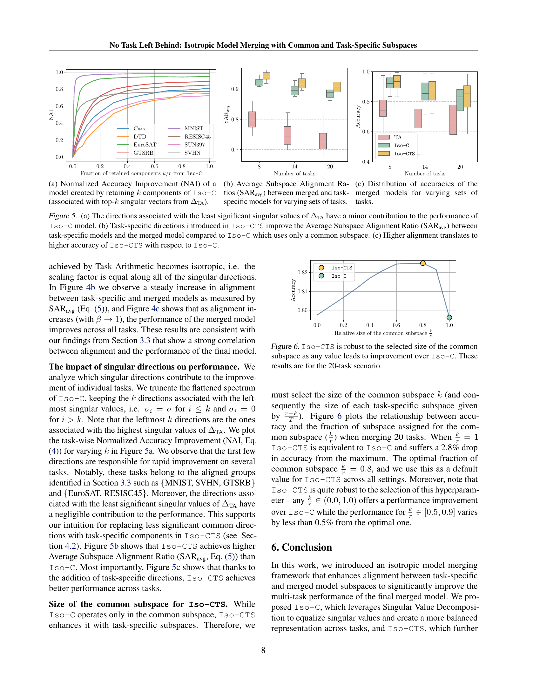

 


 2502.04959 
 Daniel Marczak et el. 
 
 🤗 2025-02-10 
 



↗ arXiv


↗ Hugging Face


↗ Papers with Code


### TL;DR



기존의 다중 작업 모델 병합 방법들은 **전이 학습된 모델과 결합된 모델 간에 성능 차이**가 존재하는 문제를 안고 있습니다. 이는 작업 매트릭스(가중치 업데이트 매트릭스)의 특성과 관련이 있으며, 특히 **특이값 분포 및 작업 매트릭스 간의 정렬**이 중요한 요소임을 밝혀냈습니다. 

본 연구는 이러한 문제를 해결하기 위해 **이방성 모델 병합 프레임워크**를 제안합니다. 이는 작업 매트릭스의 특이값 스펙트럼을 평평하게 만들어 정렬을 향상시키고 성능 차이를 줄이는데 중점을 둡니다. 특히 **공통 하위 공간과 작업별 하위 공간을 모두 고려**하여 성능을 더욱 개선하며, 다양한 작업 및 모델 규모에서 **최첨단 성능**을 달성했습니다. 이는 추가적인 학습 없이도 모델을 효과적으로 병합할 수 있는 **새로운 방법론**을 제공합니다.



#### Key Takeaways


 이방성 모델 병합 프레임워크를 통해 다중 작업 모델의 성능 향상 



 공통 하위 공간과 작업별 하위 공간을 모두 고려한 독창적인 접근 방식 



 다양한 작업 및 모델 규모에서 최첨단 성능 달성 


#### Why does it matter?
본 논문은 **다중 작업 모델 병합의 성능 향상**에 중점을 두고 있으며, 기존 방법들의 한계를 극복하고 새로운 방법론을 제시하여 **모델 성능 향상과 효율성 개선**에 기여합니다. 특히, 다양한 작업에 대한 **일반적인 하위 공간과 작업별 하위 공간을 모두 고려**하는 독창적인 접근 방식은 향후 연구 방향을 제시하고 **다양한 머신러닝 분야**에 영향을 미칠 수 있습니다. 이는 **실용적인 모델 병합 방법론**을 제공하고, **더욱 효율적이고 성능이 뛰어난 다중 작업 모델 개발**을 가능하게 하여 학계와 산업계 모두에 긍정적인 영향을 줄 수 있습니다.

------
#### Visual Insights

> 🔼 그림 1은 다양한 방법들을 사용하여 가중치 업데이트 행렬을 병합했을 때 특이값 스펙트럼을 보여줍니다.  Task Arithmetic(상단)은 작업별 행렬들을 단순히 합산하여 몇몇 지배적인 성분들로 구성된 스펙트럼을 생성합니다. 반면에, Iso-C(중간)는 이 스펙트럼을 균일하게 만들어 성능을 크게 향상시킵니다.  Iso-CTS(하단)는 공통 하위 공간에 작업별 하위 공간들을 추가하여 최첨단의 모델 병합 성능을 달성합니다. 이 그림은 본 논문에서 제시하는 방법들의 효과를 시각적으로 보여주는 핵심적인 부분입니다.
> 

> 
read the caption

> Figure 1: Spectrum of singular values for a single layer weight update matrix obtained by merging using Task Arithmetic (top) compared to our approaches: Iso-C (middle) and Iso-CTS (bottom). Task Arithmetic sums the task-specific matrices, which result in a spectrum with a few dominant components. Iso-C instead replaces this spectrum with a uniform one, which results in significant performance improvement. Iso-CTS enhances the common subspace with task-specific subspaces and yields state-of-the-art model merging performance.
> 


Method|ViT-B/32|ViT-B/32|ViT-B/32|ViT-B/16|ViT-B/16|ViT-B/16|ViT-L/14|ViT-L/14|ViT-L/14
---|---|---|---|---|---|---|---|---
|8 tasks|14 tasks|20 tasks|8 tasks|14 tasks|20 tasks|8 tasks|14 tasks|20 tasks
Zero-shot|48.3|57.2|56.1|55.3|61.3|59.7|64.7|68.2|65.2
Fine-tuned|92.8|90.9|91.3|94.6|92.8|93.2|95.8|94.3|94.7
Weight Averaging|66.3_(72.1)|64.3_(71.1)|61.0_(67.5)|72.2_(76.6)|69.5_(74.8)|65.3_(70.4)|79.6_(83.2)|76.7_(81.1)|71.6_(75.6)
Task Arithmetic|70.8_(76.5)|65.3_(72.1)|60.5_(66.8)|75.4_(79.6)|70.5_(75.9)|65.8_(70.8)|84.9_(88.7)|79.4_(84.0)|74.0_(78.1)
TIES|75.1_(81.0)|68.0_(74.8)|63.4_(69.9)|79.7_(84.3)|73.2_(78.7)|68.2_(73.3)|86.9_(90.7)|79.5_(84.1)|75.7_(79.8)
Consensus TA|75.0_(80.8)|70.4_(77.4)|65.4_(72.0)|79.4_(83.9)|74.4_(79.9)|69.8_(74.9)|86.3_(90.1)|82.2_(86.9)|79.0_(83.2)
TSV-M|85.9_(92.3)|80.1_(87.9)|77.1_(84.3)|89.0_(93.9)|84.6_(91.0)|80.6_(86.5)|93.0_(97.0)|89.2_(94.4)|87.7_(92.5)
Iso-C (Ours)|86.3_(92.9)|80.3_(88.1)|75.5_(82.5)|90.6_(95.6)|84.8_(91.1)|79.6_(85.4)|94.2_(98.3)|89.3_(94.5)|87.6_(92.2)
Iso-CTS (Ours)|86.2_(92.8)|81.7_(89.7)|78.1_(85.5)|91.1_(96.1)|86.4_(92.8)|82.4_(88.4)|94.7_(98.8)|91.0_(96.3)|90.1_(94.9)

> 🔼 표 1은 다양한 백본 네트워크와 평가 시나리오에서 Iso-CTS 방법이 최첨단 성능을 달성했음을 보여줍니다. 표에는 평균 절대 정확도와 평균 정규화 정확도(괄호 안의 값)가 백분율(%)로 제시되어 있으며, 최고 성능은 굵은 글씨체로, 두 번째로 높은 성능은 밑줄 친 글씨체로 표시되어 있습니다.  다양한 수의 작업(8개, 14개, 20개)에 대해 ViT-B/32, ViT-B/16, ViT-L/14 세 가지 백본 모델에 대한 결과를 보여줍니다. 각 백본 모델마다 제로샷(Zero-shot) 성능과 미세조정(Fine-tuned) 성능을 기준선으로 제시하고, 가중치 평균(Weight Averaging), 작업 산술(Task Arithmetic), TIES, 합의 TA(Consensus TA), TSV-M, Iso-C, Iso-CTS 방법들과 비교하여 Iso-CTS의 우수성을 보여줍니다.
> 

> 
read the caption

> Table 1: Iso-CTS achieves state-of-the-art performance for all backbones on all evaluated scenarios. We present average absolute accuracy and average normalized accuracy (in subscript) in %percent\%%. The best method in bold and the second-best underlined.
> 

### In-depth insights

#### Isotropic Merging
본 논문에서 제시된 등방성 병합(Isotropic Merging)은 다중 작업 특정 모델의 가중치를 단일 다중 작업 모델로 통합하는 과정에서 **특이값 분포의 균등화**를 통해 성능 향상을 도모하는 기법입니다. 기존의 방법들은 작업 특정 행렬 간의 정렬에 초점을 맞췄으나, 이 방법은 **특이값 스펙트럼을 평탄화**하여 작업 행렬 간의 정렬을 강화하고 성능 격차를 줄이는 데 중점을 둡니다.  **공통 및 작업 특정 부분 공간**을 통합하여 정렬과 성능을 더욱 향상시키는 아이디어는 다양한 작업과 모델 규모에서 최첨단 성능을 달성하는 데 기여합니다.  **등방성 병합의 핵심은 특이값 분포의 균일성**을 통해 작업 간의 간섭을 최소화하고 다양한 작업에 대한 균형있는 표현을 가능하게 한다는 점입니다. 이는 추가적인 훈련 없이 모델을 효과적으로 병합할 수 있는 효율적인 방법론을 제시한다는 점에서 중요한 의의를 가집니다.

#### Subspace Alignment
본 논문에서 제시된 아이디어의 핵심은 **다중 작업 모델 통합 시 작업 특이적 부분 공간과 통합된 모델의 부분 공간 간의 정렬(alignment)**을 강조하는 데 있습니다.  **특이값 분해(SVD)**를 통해 작업 행렬의 특이값 스펙트럼을 분석하여, 작업 특이적 부분 공간과 통합된 모델의 부분 공간 사이의 유사도를 정량화합니다.  **부분 공간 정렬 비율(SAR)**이라는 지표를 도입하여,  이러한 정렬이 성능 향상과 밀접한 관련이 있음을 보여줍니다.  **높은 SAR 값은 높은 성능 향상**과 연관되며, 이는 **모델 통합 과정에서 작업 간의 간섭을 최소화하고 정보를 효과적으로 결합**하는 데 중요한 역할을 함을 시사합니다.  **등방성(isotropic)** 모델 통합 프레임워크는 이러한 정렬을 개선하고 성능 차이를 줄이기 위한 구체적인 방법론으로 제시되며,  공통 부분 공간과 작업 특이적 부분 공간을 모두 활용하여 정렬을 개선합니다. 이는 **다양한 작업과 모델 규모에 걸쳐 최첨단 성능**을 달성하는 데 기여합니다.

#### Merging Dynamics
본 논문에서는 다중 작업 특정 모델의 가중치를 단일 다중 작업 모델로 통합하는 모델 병합에 대해 논의합니다. **모델 병합 역학**은 특정 작업에 미세 조정된 여러 모델을 단일 다중 작업 모델로 효율적으로 통합하는 과정을 이해하는 데 중점을 둡니다. 이 과정에서 **가중치 업데이트 행렬(task matrices)**의 특징, 즉 사전 훈련된 모델에 적용되는 행렬을 분석합니다.  **특이값 분해(SVD)**를 사용하여 작업 행렬의 특이값 스펙트럼을 평평하게 하고, 작업 행렬 간의 정렬을 개선하며, 성능 차이를 줄이는 **등방성 병합 프레임워크**를 제안합니다. 또한, 공통 및 작업 특정 하위 공간을 모두 통합하여 정렬과 성능을 더욱 향상시킵니다.  **공통 하위 공간**은 여러 작업에 공통적으로 사용되는 가중치를 나타내며, **작업 특정 하위 공간**은 특정 작업에만 관련된 가중치를 나타냅니다. 이를 통해 다양한 작업과 모델 규모에 걸쳐 최첨단 성능을 달성할 수 있습니다. 본 논문은 모델 병합 동력에 대한 이해를 높이고 추가 훈련 없이 모델을 효과적으로 병합하는 방법을 제공합니다.

#### Limitations of Iso-C
Iso-C의 주요 제한점은 **공통 하위 공간(common subspace)의 정확성에 대한 의존성**입니다.  Iso-C는 작업 특징 벡터들의 공통적인 부분 공간을 식별하는 데 Task Arithmetic에 의존하는데, 이 알고리즘이 항상 최적의 공통 부분 공간을 찾는다는 보장은 없습니다. **작업들 간의 상관관계가 낮을 경우**, Task Arithmetic은 효과적인 공통 부분 공간을 제대로 식별하지 못할 가능성이 있으며, 이는 Iso-C의 성능 저하로 이어질 수 있습니다.  또한, **과도하게 단순화된 가정**으로 인해 성능이 저하될 가능성이 있습니다. Iso-C는 모든 작업의 특징 벡터들을 단일한 등방성 분포로 변환하여 작업 간의 세부적인 차이를 무시합니다. 이러한 단순화는 **다양한 작업 유형을 효과적으로 처리하는 데 어려움**을 초래하고,  특히 작업 특유의 하위 공간 정보를 활용하지 못하는 한계를 가집니다. 따라서 **다양한 작업에 대한 일반화 능력이 제한적**이며, 작업 간의 복잡한 상호작용이 존재하는 경우 성능이 저하될 수 있습니다.  **특정 작업에 편향**될 가능성도 있습니다. 만약 특정 작업이 다른 작업보다 지배적인 특징을 가진다면, Iso-C는 그 작업에 과하게 편향될 가능성이 높아집니다. 이러한 문제점들은 Iso-CTS에서 task-specific subspace를 추가적으로 고려함으로써 일부 해결되지만, 여전히 Iso-C 자체의 근본적인 한계를 완전히 극복하지는 못합니다.

#### Future Research
본 논문은 다중 작업 모델 병합을 위한 효과적인 방법론으로 등방성 모델 병합을 제시하며, **공통 및 작업별 부분 공간**을 고려하여 성능 향상을 이끌어냅니다.  향후 연구는 **작업 간의 상호 작용**을 더욱 정교하게 모델링하고, **다양한 유형의 작업 및 모델 규모**에 대한 일반화 성능을 높이는 데 집중할 수 있습니다.  특히, **작업 특유의 부분 공간 식별 및 활용** 전략을 개선하여 더욱 효율적이고 강력한 모델 병합 프레임워크를 구축하는 연구가 중요합니다.  또한, 본 연구에서 사용된 등방성 변환 기법을 다른 머신러닝 모델이나 작업에 적용하여 그 효과를 검증하고, **다양한 손실 함수와 최적화 전략**을 활용하여 모델 병합 성능을 추가적으로 개선할 수 있습니다.  마지막으로, **대규모 모델 병합**을 위한 효율적인 알고리즘 및 병렬 처리 기법에 대한 연구도 필요합니다.

### More visual insights

More on figures

> 🔼 이 그림은 서로 다른 작업에 대해 미세 조정된 모델의 가중치 업데이트 행렬(task matrix) 간의 유사성을 보여줍니다. 각 task vector는 미세 조정된 모델과 사전 훈련된 모델 간의 차이를 나타냅니다. 그림은 task vector들 간의 코사인 유사도를 시각화하여, 작업 간의 상관 관계를 보여줍니다. 높은 코사인 유사도는 작업 간의 높은 상관 관계를 나타내고, 낮은 유사도는 낮은 상관 관계를 나타냅니다. 이는 모델 병합의 성능에 영향을 미치는 요소를 이해하는 데 도움이 됩니다.
> 

> 
read the caption

> (a) Cosine similarity between pairs of task vectors.
> 

> 🔼 그림 (b)는 각 과업에 대한 과업 벡터와 병합된 모델 벡터 간의 코사인 유사도와 정규화된 정확도 향상(NAI) 간의 관계를 보여줍니다.  즉, 각 과업에 대해 개별적으로 학습된 모델과 병합된 모델의 가중치 벡터를 비교하여 얼마나 유사한지를 코사인 유사도로 측정하고, 이 유사도와 병합을 통해 얻은 성능 향상(NAI)이 어떤 관계를 갖는지 보여줍니다. 이는 과업 벡터 간의 유사성이 병합된 모델의 성능에 미치는 영향을 분석하기 위해 사용되었습니다.
> 

> 
read the caption

> (b) NAI vs cosine similarity between task and merged vectors.
> 

> 🔼 그림 2는 두 가지 주요 내용을 보여줍니다. (a)는 여러 과제에 대한 작업 벡터들이 서로 직교(orthogonal)에 가깝다는 것을 보여주는 도표입니다. 이는 각 과제가 서로 다른 가중치 업데이트를 적용받기 때문에 발생하는 현상으로, 모델 병합 시 과제 간 간섭을 최소화하는 데 도움이 될 수 있습니다. (b)는 정규화된 정확도 향상(NAI)이 크게 다른 모델들이 서로 매우 가까운 코사인 유사도를 보이는 것을 보여줍니다. 이는 코사인 유사도와 NAI 간의 상관관계가 낮다는 것을 시사하며, 모델 병합의 성능을 예측하는 데 코사인 유사도만으로는 부족함을 보여줍니다.
> 

> 
read the caption

> Figure 2: (a) Tasks vectors are typically close to orthogonal to each other. (b) Models with very different normalized accuracy improvements (NAI) exhibit very close cosine similarities, and the correlation between cosine similarity and NAI is low.
> 

> 🔼 그림 3(a)는 평균 부분 공간 정렬 비율(SARavg)에 따른 정규화된 정확도 향상(NAI)을 보여줍니다.  SARavg는 여러 개의 작업에 대해 병합된 모델과 각 작업별 모델 간의 부분 공간 유사성을 측정한 지표입니다. 이 그래프는 SARavg가 높을수록 NAI도 높아짐을 보여주어, 병합된 모델과 개별 작업 모델 간의 부분 공간 정렬이 높을수록 성능 향상이 크다는 것을 시사합니다.
> 

> 
read the caption

> (a) Normalized Accuracy Improvement (NAI) vs. Average Subspace Alignment Ratio (SARavgsubscriptSARavg\text{SAR}_{\text{avg}}SAR start_POSTSUBSCRIPT avg end_POSTSUBSCRIPT).
> 

> 🔼 그림 (b)는 서로 다른 작업 벡터 쌍 간의 평균 부분 공간 정렬 비율(SARavg)을 보여줍니다.  SARavg는 각 작업에 대한 작업 행렬의 주요 특이값 벡터에 의해 형성된 부분 공간 간의 유사성을 측정하는 지표입니다.  값이 높을수록 작업 간의 유사성이 높고, 모델 병합 성능이 좋을 가능성이 높음을 시사합니다. 이 그림은 다양한 작업들 간의 유사성을 시각적으로 보여주어,  모델 병합 전략을 이해하는 데 도움을 줍니다. 특히, 서로 유사한 작업들의 그룹을 확인하고, 이러한 유사성이 모델 병합 성능에 미치는 영향을 분석하는 데 유용합니다.
> 

> 
read the caption

> (b) Average Subspace Alignment Ratios (SARavgsubscriptSARavg\text{SAR}_{\text{avg}}SAR start_POSTSUBSCRIPT avg end_POSTSUBSCRIPT) between pairs of task vectors.
> 

> 🔼 그림 3은 두 가지 주요 내용을 보여줍니다. (a)는 작업 특이성 매트릭스와 병합된 모델의 부분 공간 정렬 비율(SARavg) 간의 강한 상관 관계를 보여줍니다. 피어슨 상관 계수는 0.88로 매우 높은 상관 관계를 나타냅니다. (b)는 MNIST, SVHN, GTSRB와 같은 특정 작업 그룹들이 서로 높은 정렬을 보이는 반면, DTD, Cars, SUN397과 같은 다른 작업 그룹들은 서로 낮은 정렬을 보이는 것을 보여줍니다.  (a)와 (b)를 비교해 보면, 상호 높은 정렬을 보이는 데이터셋은 병합된 모델과의 정렬도 높고, 따라서 성능도 좋게 나타납니다. 반대로 상호 낮은 정렬을 보이는 데이터셋은 병합된 모델과의 정렬이 낮고 성능도 좋지 않습니다.  즉, 이 그림은 작업 간의 유사성과 병합 모델의 성능 간의 관계를 시각적으로 보여주는 것입니다.
> 

> 
read the caption

> Figure 3:  (a) NAI strongly correlates with SARavgsubscriptSARavg\text{SAR}_{\text{avg}}SAR start_POSTSUBSCRIPT avg end_POSTSUBSCRIPT (Pearson correlation coefficient ρT⁢A=0.88subscript𝜌𝑇𝐴0.88\rho_{TA}=0.88italic_ρ start_POSTSUBSCRIPT italic_T italic_A end_POSTSUBSCRIPT = 0.88). (b) Note the groups of highly aligned tasks such as {MNIST, SVHN, GTSRB} and {EuroSAT, RESISC45}. By comparing (b) and (a), the mutually aligned datasets exhibit higher alignment with the merged model and consequently achieve good performance. On the other hand, tasks with low mutual alignment, such as DTD, Cars, and SUN397, are less aligned with the merged model and achieve poor performance.
> 

> 🔼 이 그림은 보간 계수 β(베타) 값의 변화에 따른 특이값 스펙트럼을 보여줍니다.  β 값이 0일 때는 Task Arithmetic(TA)의 스펙트럼을, 1일 때는 Iso-C의 스펙트럼을 나타냅니다.  β 값이 변함에 따라 특이값 스펙트럼의 모양이 어떻게 변하는지, 특히 스펙트럼의 왜도(skewness)가 어떻게 감소하는지 보여주는 것이 이 그림의 주요 목적입니다.  즉, Iso-C 방법이 Task Arithmetic에 비해 특이값 스펙트럼을 균일하게 만드는 효과를 시각적으로 보여줍니다.  이러한 스펙트럼의 변화는 모델의 성능 향상과 밀접하게 연관되어 있으며, 이후 내용에서 자세히 설명됩니다.
> 

> 
read the caption

> (a) Spectra of singular values for different values of interpolation coefficient (β𝛽\betaitalic_β).
> 

> 🔼 이 그림은 보간 계수(β)에 따른 평균 부분 공간 정렬 비율(SARavg)을 보여줍니다.  SARavg는 결합된 모델과 각 작업별 모델 간의 부분 공간 유사성을 측정한 지표입니다.  β 값이 증가함에 따라(즉, Task Arithmetic에서 Iso-C로 이동함에 따라) SARavg가 어떻게 변하는지 보여주는 그래프입니다.  이는 모델 결합 방법의 성능에 미치는 영향을 분석하기 위해 사용됩니다.  β=0은 Task Arithmetic이고, β=1은 Iso-C를 나타냅니다.  β의 값 변화에 따른 SARavg의 변화를 통해, Iso-C 방법이 모델의 부분 공간 정렬을 얼마나 잘 개선하는지 확인할 수 있습니다.
> 

> 
read the caption

> (b) Average Subspace Alignment Ratio (SARavgsubscriptSARavg\text{SAR}_{\text{avg}}SAR start_POSTSUBSCRIPT avg end_POSTSUBSCRIPT) vs. interpolation coefficient (β𝛽\betaitalic_β).
> 

> 🔼 그림 4 (c)는 보간 계수 β에 따른 정규화된 정확도 향상(NAI)을 보여줍니다.  β 값이 0일 때는 Task Arithmetic (TA)의 결과를, β 값이 1일 때는 Iso-C의 결과를 나타냅니다.  이 그래프는 β 값을 변화시키면서 단일값 스펙트럼을 변경하여 정확도 향상에 어떤 영향을 미치는지 보여줍니다.  β 값이 증가함에 따라(즉, Iso-C에 가까워짐에 따라) NAI가 증가하는 경향을 보여주며, 이는 Iso-C 방법이 정확도 향상에 효과적임을 시사합니다.
> 

> 
read the caption

> (c) Normalized Accuracy Improvement (NAI) vs. interpolation coefficient (β𝛽\betaitalic_β).
> 

> 🔼 그림 4는 모델 통합에서 특이값 분해(SVD)의 역할을 보여줍니다. (a)는 Task Arithmetic(TA)의 특이값 분포(β=0)에서 Iso-C(β=1)의 특이값 분포로 보간하는 과정을 나타냅니다. Iso-C는 특이값 스펙트럼을 균일하게 만들어(isotropic), (6)식에서 정의된 보존된 성분(kM)의 수를 증가시켜, 모델 성능을 향상시킵니다. (b)는 각 작업별 모델과 통합 모델 간의 정렬이 SARavg로 측정되는 것을 보여줍니다. (c)는 정렬이 증가함에 따라 성능 또한 3.3절에서 조사된 두 속성 간의 강력한 상관 관계에 따라 예측된 대로 향상됨을 보여줍니다.
> 

> 
read the caption

> Figure 4:  (a) Interpolating from ΔTAsubscriptΔTA\Delta_{\text{TA}}roman_Δ start_POSTSUBSCRIPT TA end_POSTSUBSCRIPT (β=0𝛽0\beta=0italic_β = 0) towards ΔIso-CsubscriptΔIso-C\Delta_{\texttt{Iso-C}}roman_Δ start_POSTSUBSCRIPT Iso-C end_POSTSUBSCRIPT (β=1𝛽1\beta=1italic_β = 1) makes the spectrum of singular values of ΔMsubscriptΔ𝑀\Delta_{M}roman_Δ start_POSTSUBSCRIPT italic_M end_POSTSUBSCRIPT more uniform and increases the number of preserved components kMsubscript𝑘𝑀k_{M}italic_k start_POSTSUBSCRIPT italic_M end_POSTSUBSCRIPT (Eq. (6)) denoted by dashed lines. (b) This results in an increased alignment between each task-specific model and merged model measured by SARavgsubscriptSARavg\text{SAR}_{\text{avg}}SAR start_POSTSUBSCRIPT avg end_POSTSUBSCRIPT. (c) As alignment increases, the performance also improves as predicted based on the strong correlation between these two properties investigated in Section 3.3.
> 

> 🔼 이 그림은 Iso-C 모델에서 상위 k개의 특이값 벡터(ΔTA에서 추출)를 유지하여 생성된 모델의 정규화된 정확도 향상(NAI)을 보여줍니다.  쉽게 말해,  Iso-C 방법에서 가장 중요한 부분만 사용했을 때 모델 성능이 어떻게 변하는지 보여주는 그래프입니다.  x축은 사용된 상위 특이값 벡터의 개수(k)를 나타내고, y축은 NAI 값을 나타냅니다.  이를 통해  Iso-C 모델의 성능에 중요하게 기여하는 주요 특이값 벡터를 파악할 수 있습니다.
> 

> 
read the caption

> (a) Normalized Accuracy Improvement (NAI) of a model created by retaining k𝑘kitalic_k components of Iso-C (associated with top-k𝑘kitalic_k singular vectors from ΔTAsubscriptΔTA\Delta_{\text{TA}}roman_Δ start_POSTSUBSCRIPT TA end_POSTSUBSCRIPT).
> 

> 🔼 이 그림은 다양한 수의 작업에 대해 병합된 모델과 작업별 모델 간의 평균 부분 공간 정렬 비율 (SARavg)을 보여줍니다.  SARavg는 병합된 모델이 개별 작업 모델과 얼마나 잘 정렬되는지를 측정하는 지표입니다.  그림은 작업의 수가 증가함에 따라 SARavg가 어떻게 변하는지 보여주며, 이는 모델 병합의 성능에 대한 통찰력을 제공합니다. 높은 SARavg 값은 병합된 모델이 개별 작업을 잘 수행할 수 있음을 시사합니다.
> 

> 
read the caption

> (b) Average Subspace Alignment Ratios (SARavgsubscriptSARavg\text{SAR}_{\text{avg}}SAR start_POSTSUBSCRIPT avg end_POSTSUBSCRIPT) between merged and task-specific models for varying sets of tasks.
> 

> 🔼 이 그림은 다양한 수의 작업 집합에 대해 병합된 모델의 정확도 분포를 보여줍니다.  다시 말해, 여러 개의 작업에 대해 개별적으로 미세 조정된 여러 모델을 단일 다중 작업 모델로 병합하는 다양한 방법들의 성능을 비교합니다.  그림은 작업 수가 증가함에 따라 병합된 모델의 정확도가 어떻게 변하는지 보여주는 통계적 분포를 나타냅니다. 이는 다양한 모델 병합 기법의 강점과 약점을 파악하는 데 도움을 줍니다.
> 

> 
read the caption

> (c) Distribution of accuracies of the merged models for varying sets of tasks.
> 

> 🔼 그림 5는 Iso-C 모델과 Iso-CTS 모델의 성능에 대한 분석 결과를 보여줍니다. (a)는 ΔTA의 가장 작은 특이값에 해당하는 방향이 Iso-C 모델의 성능에 미치는 영향이 미미함을 보여줍니다. (b)는 Iso-CTS에서 추가된 작업별 방향이 공통 부분공간만 사용하는 Iso-C 모델에 비해 작업별 모델과 병합된 모델 간의 평균 부분공간 정렬 비율(SARavg)을 향상시킴을 보여줍니다. (c)는 정렬이 향상되면 Iso-C에 비해 Iso-CTS의 정확도가 높아짐을 보여줍니다.  즉, 작업 특이적 방향을 추가함으로써 모델 간의 정렬을 개선하여 성능을 향상시킬 수 있음을 시각적으로 보여주는 그림입니다.
> 

> 
read the caption

> Figure 5:  (a) The directions associated with the least significant singular values of ΔTAsubscriptΔTA\Delta_{\text{TA}}roman_Δ start_POSTSUBSCRIPT TA end_POSTSUBSCRIPT have a minor contribution to the performance of Iso-C model. (b) Task-specific directions introduced in Iso-CTS improve the Average Subspace Alignment Ratio (SARavgsubscriptSARavg\text{SAR}_{\text{avg}}SAR start_POSTSUBSCRIPT avg end_POSTSUBSCRIPT) between task-specific models and the merged model compared to Iso-C which uses only a common subspace. (c) Higher alignment translates to higher accuracy of Iso-CTS with respect to Iso-C.
> 

### Full paper



