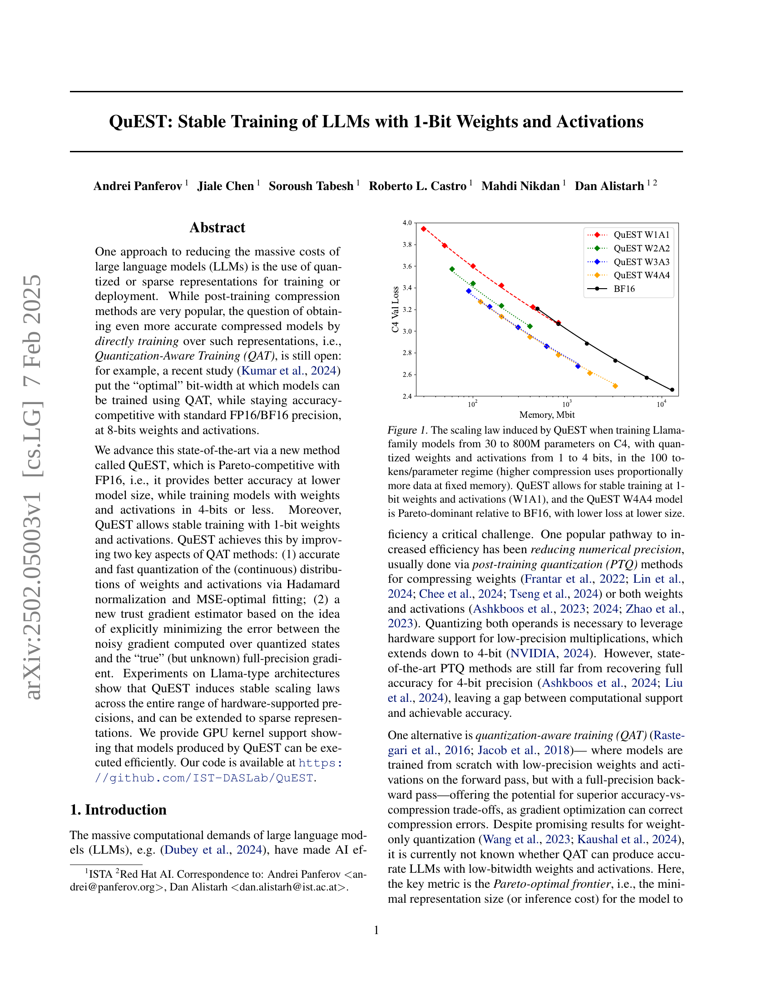

 


 2502.05003 
 Andrei Panferov et el. 
 
 🤗 2025-02-10 
 



↗ arXiv


↗ Hugging Face


↗ Papers with Code


### TL;DR



대규모 언어 모델(LLM)은 막대한 컴퓨팅 자원을 필요로 하기 때문에, 이를 줄이기 위한 연구가 활발히 진행되고 있습니다.  **양자화(Quantization)**는 모델 크기를 줄이는 효과적인 방법 중 하나이지만, 기존의 양자화 기법들은 정확도 저하 문제를 해결하지 못했습니다. 특히, **낮은 비트 수(예: 4비트 이하)에서 정확도를 유지하면서 모델을 훈련**하는 것은 큰 과제였습니다. 

본 논문에서는 **QuEST라는 새로운 양자화 기법**을 제시합니다. QuEST는 가중치와 활성화 함수 모두를 1비트까지 양자화하여 모델을 훈련하는데,  **기존 방법들보다 더 정확한 그래디언트 추정과 빠른 양자화**를 통해 이를 가능하게 합니다.  실험 결과, QuEST는 기존 최첨단 기술보다 훨씬 낮은 비트 수에서도 높은 정확도를 달성했고, **GPU 커널 지원**을 통해 효율적인 실행을 보장합니다.



#### Key Takeaways


 QuEST는 1비트 가중치와 활성화를 사용하여 LLM을 안정적으로 훈련하는 새로운 방법을 제시합니다. 



 QuEST는 기존의 최첨단 기술과 비교하여 더 적은 모델 크기로 더 높은 정확도를 달성합니다. 



 QuEST는 GPU 커널 지원을 제공하여 훈련된 모델의 효율적인 실행을 보장합니다. 


#### Why does it matter?
본 논문은 **대규모 언어 모델(LLM)의 훈련 비용을 줄이기 위한 새로운 양자화 기법인 QuEST**를 제시하여, 기존의 최첨단 기술보다 훨씬 낮은 비트 수(1비트까지)에서도 높은 정확도를 달성할 수 있음을 보여줍니다.  이는 LLM의 효율성을 크게 향상시키고, **더 적은 자원으로 더 큰 모델을 훈련**할 수 있는 가능성을 제시함으로써, AI 연구의 발전에 크게 기여할 수 있습니다. 또한, 본 연구는 **GPU 커널 지원을 제공하여 QuEST로 훈련된 모델의 효율적인 실행**을 보장합니다. 이는 실제 응용 분야에서의 LLM 채택을 가속화하는 데 중요한 역할을 합니다.

------
#### Visual Insights

> 🔼 그림 1은 QuEST를 사용하여 Llama 계열 모델을 30M에서 800M 파라미터까지 C4 데이터셋으로 학습시킨 결과를 보여줍니다. 가중치와 활성화 함수는 1~4비트로 양자화되었고, 토큰/파라미터 비율은 100으로 고정되었습니다. 압축률이 높아질수록 고정된 메모리 크기에서 더 많은 데이터가 사용됩니다. QuEST는 1비트 가중치와 활성화 함수(W1A1)에서도 안정적인 학습을 가능하게 하며, QuEST W4A4 모델은 BF16 모델보다 더 작은 크기로 더 낮은 손실을 달성하여 Pareto 우위를 보입니다.
> 

> 
read the caption

> Figure 1: The scaling law induced by QuEST when training Llama-family models from 30 to 800M parameters on C4, with quantized weights and activations from 1 to 4 bits, in the 100 tokens/parameter regime (higher compression uses proportionally more data at fixed memory). QuEST allows for stable training at 1-bit weights and activations (W1A1), and the QuEST W4A4 model is Pareto-dominant relative to BF16, with lower loss at lower size.
> 


| P | 1 | 2 | 3 | 4 | 8 | 16 |
|---|---|---|---|---|---|---|
| \text{eff}(P) | 0.02 | 0.16 | 0.43 | 0.70 | 1.02 | 1.00 |

> 🔼 표 1은 Hoffmann 등의 연구(2022)에서 제안된 스케일링 법칙을 기반으로, 다양한 정밀도(bitwidth)에서의 모델 크기와 성능 간의 관계를 보여줍니다.  '유효 매개변수(effective parameter)' 배수는 주어진 정밀도에서 실제 모델 크기에 대한 보정 계수 역할을 하며,  낮은 비트 정밀도에서 모델 성능 저하를 설명하는 데 사용됩니다.  즉, 동일한 정확도를 유지하면서 모델 크기를 줄이기 위해 얼마나 많은 매개변수가 필요한지를 나타내는 값입니다.  이 값을 통해,  다양한 비트 정밀도(1, 2, 3, 4, 8, 16) 하에서의 모델 크기와 성능 간의 비교 분석이 가능해집니다.
> 

> 
read the caption

> Table 1: Fitted scaling-law “effective parameter” multipliers.
> 

### In-depth insights

#### QuEST: 1-bit LLM
QuEST는 가중치와 활성화 함수 모두에 1비트 양자화를 적용하는 획기적인 방법을 제시합니다. 기존의 양자화 기법들이 정확도 저하 없이 효율적인 모델을 만드는 데 어려움을 겪었던 반면, **QuEST는 1비트의 극도로 낮은 정밀도에서도 안정적인 훈련을 가능하게 함으로써 파레토 효율성을 극대화**합니다. 이는 Hadamard 변환을 통한 정확하고 빠른 양자화와, 양자화된 상태에서의 노이즈가 많은 기울기 추정 문제를 해결하는 새로운 신뢰 기울기 추정기를 도입함으로써 가능해졌습니다.  **QuEST의 주요 성과는 낮은 비트 수에서도 높은 정확도를 유지하면서 모델 크기를 줄일 수 있다는 점**이며, 이는 특히 메모리와 연산 비용이 중요한 대규모 언어 모델(LLM) 분야에서 큰 의미를 가집니다.  **QuEST는 하드웨어 지원 범위 전체에서 안정적인 확장 법칙을 유도**하며,  GPU 커널 지원을 통해 QuEST로 생성된 모델을 효율적으로 실행할 수 있다는 사실 또한 중요한 의미를 지닙니다.  **그러나 1비트 양자화의 경우, 최적의 정확도를 얻기 위해 추가적인 미세 조정이 필요**하다는 점은  향후 연구에서 고려해야 할 부분입니다.  결론적으로 QuEST는 LLM의 효율성을 크게 향상시키는 잠재력을 가진 중요한 발전입니다.

#### Trust Gradient Estimator
본 논문에서 제시된 "Trust Gradient Estimator"는 기존의 Quantization-Aware Training(QAT) 방법론의 한계를 극복하기 위한 핵심적인 구성 요소입니다.  기존 QAT는 Straight-Through Estimator(STE)를 사용하여 양자화된 값에 대한 기울기를 추정하지만, **양자화 오류로 인한 불확실성이 크다는 단점**이 있습니다.  이러한 문제를 해결하기 위해 Trust Gradient Estimator는 **양자화 오류의 크기에 따라 기울기의 신뢰도를 조정**합니다.  **양자화 오류가 작은 요소는 기존 기울기를 그대로 사용하고, 오류가 큰 요소는 기울기의 영향을 줄여서 더 안정적인 학습을 가능하게 합니다.**  이는 Hadamard 변환을 통해 연산 오류를 최소화하는 전처리 단계와 함께 작동하여, **1-bit 양자화와 같이 매우 낮은 정밀도에서도 안정적인 학습을 가능하게 만듭니다.**  **결과적으로, 더 정확하고 효율적인 저정밀도 LLM 학습을 가능하게 하는 핵심 기술**로 평가할 수 있습니다.

#### Hadamard Transform
본 논문에서 제시된 QuEST는 1-bit 가중치 및 활성화 함수를 사용하는 대규모 언어 모델(LLM)의 안정적인 훈련을 가능하게 하는 양자화 인식 훈련(QAT) 방법입니다. QuEST의 핵심은 **하당마르 변환(Hadamard Transform)**을 활용하여 가중치와 활성화 함수의 분포를 보다 가우시안 분포에 가깝게 만들어 정확도를 높이는 것입니다.  **하당마르 변환은 연산량이 적고 효율적**이기 때문에, QuEST는 낮은 비트 너비에서도 우수한 정확도를 달성할 수 있습니다.  또한 QuEST는 **신뢰도 기반 기울기 추정기**를 사용하여 양자화 오류로 인한 기울기 손실을 최소화하여 훈련의 안정성을 확보합니다.  **결과적으로 QuEST는 기존 QAT 방법들보다 훨씬 낮은 비트 너비에서도 높은 정확도를 유지**하면서, Pareto-optimal frontier를 개선하여 더 효율적인 LLM 훈련을 가능하게 합니다.

#### Scaling Laws & Limits
본 논문은 **확장 법칙(Scaling Laws)**을 통해 저비트 양자화를 사용한 대규모 언어 모델(LLM) 훈련의 한계와 가능성을 탐구합니다.  **모델 크기와 데이터 양의 증가에 따른 성능 향상**을 분석하며,  **특정 비트 깊이에서 최적의 성능**을 보이는 지점을 찾고자 합니다.  이는 단순히 비트 수를 줄이는 것 이상으로, **양자화 방식 및 훈련 기법의 개선**을 통해 효율적인 모델 압축과 성능 유지를 동시에 달성하고자 하는 연구의 핵심입니다.  **낮은 비트 깊이에서도 안정적인 훈련**을 가능하게 하는 새로운 방법론을 제시하고, **하드웨어 지원**과의 연계를 통해 실제적인 적용 가능성을 높이는 데 중점을 둡니다.  **파레토 최적 프런티어(Pareto-optimal frontier)** 개념을 통해, **정확도와 모델 크기 사이의 균형점**을 찾아 최적의 비트 깊이를 제시하는 연구결과를 보여줍니다.  **이러한 연구는 LLM의 효율성 향상에 크게 기여**하며, 향후 연구를 위한 중요한 이정표를 제시합니다.

#### GPU Kernel Support
본 논문에서 GPU 커널 지원에 대한 논의는 **고성능 컴퓨팅을 위한 최적화된 구현**에 초점을 맞춥니다.  연구진은 양자화된 선형 계층에 대한 전방 및 후방 패스를 위한 커널을 설계하여 **속도 향상**을 달성했습니다. 특히, Hadamard 변환, 양자화 및 패킹, 그리고 저정밀 행렬 곱셈 및 역양자화 단계를 위한 커널이 포함됩니다. 이러한 커널은 CUDA 및 CUTLASS를 사용하여 **효율성을 극대화**하도록 최적화되었으며, 레지스터 레벨에서 역양자화를 수행하여 메모리 접근을 최소화하고 처리량을 높였습니다.  **성능 평가 결과**는 800M 매개변수 모델에서 BF16 대비 1.2배에서 2.4배까지의 계층별 속도 향상을 보여주며, 7B 모델에서는 이러한 속도 향상이 더욱 두드러집니다.  이러한 **GPU 커널 최적화**는 저정밀 모델의 실제 배포 및 활용에 중요한 영향을 미칩니다.

### More visual insights

More on figures

> 🔼 그림 2는 8비트 정밀도로 27억 개의 토큰을 학습시킨 후 3천만 매개변수 Llama 모델에 대한 기울기 정렬 비교를 보여줍니다.  세 가지 다른 기울기 추정 방법(Hadamard 변환이 있는 QuEST의 신뢰 추정기, Hadamard 변환이 없는 QuEST의 신뢰 추정기, STE)을 사용하여 각 변환기 블록 이후의 활성화에 대한 중간 기울기를 계산합니다. 활성화 양자화를 비활성화하고 '참' 기울기를 계산하여 그래디언트 정렬(코사인 유사도)을 계산합니다. 높은 유사도는 추정기가 전체 정밀도에 가까운 고품질 기울기를 생성함을 나타냅니다.  QuEST의 신뢰 추정기(Hadamard 변환 포함 및 미포함)는 깊이가 증가함에 따라 매우 높고 일관된 정렬(0.8 이상)을 보여주는 반면, STE는 정렬이 낮고 분산이 큽니다.  이는 QuEST의 신뢰 추정기가 더 나은 기울기 추정을 제공함을 시사합니다.
> 

> 
read the caption

> Figure 2: Gradient alignment comparison for a 30M Llama model after training on 2.7B tokens in 8-bit precision.
> 

> 🔼 그림 3은 30M 크기의 모델을 대상으로, QuEST와 성능이 조정된 LSQ 방법을 사용하여 여러 비트 너비에서의 perplexity(PPL)를 비교한 결과를 보여줍니다. QuEST는 일관되게 더 낮은 PPL 값을 나타내며, 압축률이 높아질수록 그 차이가 더욱 커지는 것을 확인할 수 있습니다. 즉, QuEST는 모델 크기 감소에 따른 정확도 저하를 효과적으로 완화한다는 것을 의미합니다.
> 

> 
read the caption

> Figure 3: Perplexity (PPL) across bit-widths with QuEST vs. a tuned variant of LSQ on a 30M model. QuEST leads to consistently lower PPL, with the advantage growing with compression.
> 

> 🔼 그림 4는 다양한 수치적 정밀도(P)와 형식(INT, FP, INT+sparse)에 대해 분석에서 도출된 효율성 계수 eff(P)/P를 보여줍니다.  효율성 계수는 모델 크기 대비 성능을 나타내는 지표이며, 값이 클수록 효율적임을 의미합니다.  그림은 INT4가 하드웨어에서 지원하는 형식 중 가장 높은 효율성을 보임을 시사합니다.  즉, INT4를 사용하여 모델을 훈련시키는 것이 다른 형식보다 메모리 사용량 대비 더 나은 정확도를 제공한다는 것을 의미합니다.  이러한 효율성 향상은 메모리 사용량을 줄이고 훈련 속도를 높이는 데 기여할 수 있습니다.
> 

> 
read the caption

> Figure 4: Illustration of the efficiency factors eff⁢(P)/Peff𝑃𝑃\text{eff}(P)/Peff ( italic_P ) / italic_P, arising from our analysis, for different numerical precisions P𝑃Pitalic_P and formats (INT, FP, INT+sparse). Higher is better. INT4 appears to have the highest efficiency among hardware-supported formats.
> 

> 🔼 그림 5는 QuEST의 추가적인 확장성 법칙들을 보여줍니다. (a)는 4비트 정밀도에서 INT, FP, INT+Sparse 형식들을 비교하고, (b)는 가중치만 양자화했을 때의 확장성 법칙들을 보여주는 데, 여기서 2비트가 파레토 최적임을 보여줍니다. (c)는 신뢰도 추정이 Hadamard 정규화로부터 상당한 이점을 얻는다는 것을 보여줍니다.  즉, QuEST가 다양한 양자화 방식과 모델 크기에 대해 안정적인 성능을 보임을 시각적으로 나타냅니다.  INT와 FP, 그리고 INT+Sparse 비교는 모델 크기 대비 정확도 측면에서 QuEST의 효율성을,  가중치 양자화만의 결과는 양자화 비트 수를 줄일 때 QuEST의 성능을, Hadamard 정규화의 효과는 QuEST의 핵심 알고리즘 성능을 각각 보여줍니다.
> 

> 
read the caption

> Figure 5: Additional scaling laws induced by QuEST: (a, left) compares INT, FP, and INT+sparse formats at 4-bit precision, (b, middle) shows the scaling laws for weight-only quantization, where 2-bit appears to be Pareto-dominant, while (c, right) shows that trust estimation benefits significantly from Hadamard normalization.
> 

> 🔼 그림 6은 단일 RTX 4090 GPU에서 QuEST INT4와 BF16의 계층별 속도 향상을 보여줍니다. 결과에는 QuEST의 양자화/역양자화 비용과 Hadamard 변환 비용(주황색 막대)이 포함되어 있습니다. 훈련된 8억 매개변수 QuEST 4비트 모델과 비례하는 70억 매개변수 모델의 추론 속도 향상 결과를 제시합니다. 그림은 각 계층의 연산에 대한 속도 향상을 보여주며, Hadamard 변환의 영향과 양자화/역양자화에 드는 오버헤드까지 고려한 결과임을 보여줍니다. 또한, 8억 매개변수 모델뿐 아니라, 70억 매개변수 모델에 대한 추론 속도 향상 결과도 함께 제시하여 모델 크기의 영향까지 고려한 분석을 제공합니다.
> 

> 
read the caption

> Figure 6: Per-layer speedups for QuEST INT4 vs BF16, on a single RTX 4090 GPU. The results take into account quantization/dequantization costs for QuEST, and include the cost of the Hadamard transform (orange bar). We present results for the 800M 4-bit QuEST model we trained, as well as inference speedups for a proportional 7B-parameter model.
> 

> 🔼 그림 7은 단일 RTX 4090 GPU에서 8억 개 매개변수 모델을 사용하여 다양한 배치 크기에 따른 QuEST INT4와 BF16의 종단 간 사전 채우기 속도 향상을 보여줍니다. QuEST는 계산 작업이 더 많은 큰 배치 크기에서 더 효과적입니다.
> 

> 
read the caption

> Figure 7: End-to-end prefill speedups for QuEST INT4 vs BF16, across different batch sizes, using the 800M parameter model on a single RTX 4090 GPU. As expected, QuEST is most effective for larger batch sizes, where the workload is more compute-bound.
> 

> 🔼 그림 8은 QuEST를 사용하여 학습된 30M 모델에 대한 학습 반복 횟수의 함수로서, Mα∗=0M_{'{α}^{*}'=0}인 가중치의 비율을 보여줍니다.  이 그림은 Hadamard 변환(HT)의 유무에 따른 가중치 마스크의 변화를 보여주는 시각적 자료입니다.  HT를 적용하지 않았을 때는 예상보다 훨씬 많은 가중치가 마스크 처리되었고, 그 비율이 학습이 진행됨에 따라 일정하지 않았음을 보여줍니다. 반면 HT를 적용했을 때는 마스크된 가중치의 비율이 예상치에 더 가까웠고, 훨씬 안정적으로 변화함을 보여줍니다. 이는 HT가 QuEST의 가중치 마스크 효율성을 향상시킨다는 것을 시각적으로 증명합니다.
> 

> 
read the caption

> Figure 8: Fraction of weights for which Mα∗=0subscript𝑀superscript𝛼0M_{\alpha^{*}}=0italic_M start_POSTSUBSCRIPT italic_α start_POSTSUPERSCRIPT ∗ end_POSTSUPERSCRIPT end_POSTSUBSCRIPT = 0 as a function of number of training iterations for a 30M model trained with QuEST.
> 

> 🔼 그림 9는 QuEST W8A8을 사용하여 학습된 30M 모델에서 이전 반복에서 새로운 반복으로 유지되는 마스크된 값의 비율을 보여줍니다.  이 그림은 Hadamard 변환의 효과를 보여주기 위해,  Hadamard 변환을 사용한 경우와 사용하지 않은 경우 두 가지 상황을 비교하여 나타냅니다.  각 셀은 특정 이전 반복에서 마스크된 값 중 얼마나 많은 비율이 나중 반복에서도 마스크된 상태로 남아있는지를 보여주는 백분율을 나타냅니다. 이를 통해 Hadamard 변환이 마스크의 지속성에 미치는 영향, 즉 마스크된 값의 안정성을 정량적으로 평가할 수 있습니다.  Hadamard 변환이 적용된 경우 마스크된 값의 지속성이 감소하는 것을 확인할 수 있습니다.
> 

> 
read the caption

> Figure 9: Fraction of masked values retained from an old iteration to a new iteration for a 30M model trained with QuEST W8A8.
> 

> 🔼 그림 10은 3000만 매개변수를 가진 모델의 사전 훈련에서 외부 신뢰 스케일링 계수(s)가 QuEST 성능에 미치는 영향을 보여줍니다. QuEST는 신뢰 기반 기울기 추정기를 사용하는 양자화 인식 훈련(QAT) 방법입니다. 이 그래프는 다양한 s 값에 따른 검증 손실을 나타내어 최적의 s 값을 결정하는 데 도움이 됩니다.  외부 신뢰 스케일링 계수는 양자화 오차가 큰 항목에 대한 기울기 업데이트의 중요도를 조절하는 데 사용됩니다.
> 

> 
read the caption

> Figure 10: Performance of QuEST as a function of the outer trust scaling factor s𝑠sitalic_s for a 30M model pretraining.
> 

> 🔼 그림 11은 30M 매개변수 모델을 3B 토큰으로 W4A4 비트 너비로 학습시킨 결과에 대한 손실 곡선을 보여줍니다. QuEST, LSQ, PACT, BF16 네 가지 방법을 비교 분석했습니다. (a) 전체 학습 손실 곡선을 보여주는 그래프에서는 QuEST가 BF16과 유사하게 학습이 잘 되는 반면 LSQ보다 성능이 훨씬 우수하고, PACT는 손실이 매우 커서 학습이 제대로 되지 않음을 보여줍니다. (b) 1000번의 반복 이후 학습 단계를 확대하여 보여주는 그래프에서는 QuEST가 LSQ보다 훨씬 낮은 손실 값을 유지하며 학습 전 과정에서 안정적이고 정확한 결과를 얻음을 보여줍니다.
> 

> 
read the caption

> Figure 11: Training loss curves for a 30M model trained on 3B tokens with W4A4 bitwidth, comparing QuEST (ours), LSQ, PACT, and BF16. (a) Full training loss curves, showing that QuEST closely follows BF16 and consistently outperforms LSQ, while PACT struggles with high loss. (b) Zoomed-in view of training steps after 1000, excluding PACT for clarity, highlighting that QuEST maintains a lower loss than LSQ throughout training.
> 

> 🔼 그림 12는 30M 매개변수 모델에 대해 4비트 가중치와 활성화 함수를 사용하여 데이터셋의 10%로 학습시킨 PACT에 대한 하이퍼파라미터 검색 결과를 보여줍니다. 검색은 학습률 스케일링(LR Scale)과 알파 가중치 감쇠에 대한 다양한 값을 탐색하며, 검증 손실은 색상 기울기로 표시됩니다. 검증 손실이 더 낮을수록(어두운 색상) 더 나은 구성을 나타냅니다.  이 그림은 학습률 스케일링과 가중치 감쇠의 최적 조합을 찾는 과정을 시각적으로 보여줍니다.
> 

> 
read the caption

> Figure 12: Hyperparameter search for PACT on a 30M parameter model with 4-bit weights and activations, trained on 10% of the dataset. The search explores different values for learning rate scaling (LR Scale) and alpha weight decay, with validation loss indicated by the color gradient. Lower validation loss (darker colors) corresponds to better configurations.
> 

> 🔼 그림 13은 토큰/파라미터 비율이 {25, 50, 100}인 3비트 및 4비트 QuEST에 대한 스케일링 법칙 (5)의 적합 결과를 보여줍니다. 이 그림은 모델 크기가 증가함에 따라 손실이 어떻게 변하는지를 보여주는 그래프로, QuEST의 성능을 다양한 모델 크기에서 평가하는 데 도움이 됩니다. 특히, 토큰/파라미터 비율을 변화시키면서 3비트와 4비트 QuEST의 스케일링 법칙을 비교 분석하여 어떤 비율에서 더 나은 성능을 보이는지 확인하는 데 사용됩니다.
> 

> 
read the caption

> Figure 13: Scaling law (5) fit for 3 and 4 bit QuEST with tokens/parameters ratios in {25,50,100}2550100\{25,50,100\}{ 25 , 50 , 100 }.
> 

> 🔼 그림 14는 고정된 모델 메모리 용량에서 토큰-파라미터 비율의 함수로서 다양한 QuEST 정밀도의 성능을 보여줍니다. 이 그래프는 모델 크기가 증가함에 따라(1.6GB, 6.4GB, 14GB, 140GB) 4비트 정밀도가 최적점에 도달하는 시점이 어떻게 변하는지 보여줍니다. 회색선은 4비트 최적성 임계값을 나타냅니다.  즉, 특정 모델 크기에서 토큰-파라미터 비율이 증가하면 특정 시점부터 4비트가 가장 좋은 성능을 보임을 시각적으로 보여주는 그림입니다.
> 

> 
read the caption

> Figure 14: Different QuEST precision performance as a function of tokens-to-parameters ratio at a fixed model memory footprint. The gray line indicates a 4-bit optimality threshold.
> 

More on tables


| Model | HellaSWAG Accuracy (%) ↑ |
|---|---| 
| BF16 (800M, 80B tokens) | 39.52 |
| QuEST 4-bit (800M, 80B tokens) | 39.22 |
> 🔼 본 표는 QuEST를 사용하여 훈련된 4비트 정밀도 모델과 BF16(반정밀도 부동소수점) 모델의 HellaSWAG(Hellaciously SWAG) 벤치마크에 대한 제로샷 평가 결과를 보여줍니다. HellaSWAG는 상식 추론 능력을 평가하는 벤치마크입니다. 두 모델 모두 800M 파라미터로 80B 토큰으로 훈련되었으며, 결과는 거의 동일합니다.  이는 QuEST를 사용한 훈련이 정확도 손실 없이 정밀도와 계산 비용을 크게 줄일 수 있음을 보여줍니다.
> 

> 
read the caption

> Table 2: Zero-shot evaluation on HellaSWAG comparing QuEST 4-bit to its BF16 counterpart. The results are nearly identical, confirming that training with QuEST is lossless.
> 


| Model size | 30M | 50M | 100M | 200M | 430M | 800M |
|---|---|---|---|---|---|---|
| Num. Blocks | 6 | 7 | 8 | 10 | 13 | 16 |
| Hidden Size | 640 | 768 | 1024 | 1280 | 1664 | 2048 |
| Num. Attn. Heads | 5 | 6 | 8 | 10 | 13 | 16 |
| Learning Rate | 0.0012 | 0.0012 | 0.0006 | 0.0003 | 0.00015 | 0.000075 |
| Num. Tokens | 3B | 5B | 10B | 20B | 43B | 80B |
> 🔼 표 3은 논문에서 사용된 각 모델 크기에 대한 초매개변수를 보여줍니다.  모델 크기(30M, 50M, 100M, 200M, 430M, 800M), 블록 수, 은닉 크기, 어텐션 헤드 수, 학습률, 토큰 수 등의 정보를 포함하고 있으며, 각 모델 크기에 따른 최적의 하이퍼파라미터 설정을 보여줍니다. 이는 모델 성능에 직접적인 영향을 미치는 중요한 정보입니다.
> 

> 
read the caption

> Table 3: Hyper-parameters used for each model size.
> 


| Weight Decay | 2-bit PPL ↓ | 3-bit PPL ↓ | 4-bit PPL ↓ |
|---|---|---|---|
| 0.001 | 37.02 | 31.10 | 27.93 |
| 0.01 | 36.91 | 30.89 | 27.72 |
| 0.1 | **36.54** | **30.26** | **27.51** |
| 1.0 | 38.12 | 31.16 | 28.67 |
> 🔼 표 4는 30M 모델에 대해 비트 너비별 LSQ에 대한 가중치 감쇠 하이퍼파라미터 검색 결과를 보여줍니다.  다양한 비트 너비(2비트, 3비트, 4비트)에 대해 여러 가중치 감쇠 값을 시도하여 검증 손실을 측정했습니다.  가장 낮은 검증 손실을 기록한 설정이 굵게 표시되어 있으며, 이는 해당 비트 너비에 대한 최적의 가중치 감쇠 값임을 나타냅니다. 이 표는 본 논문의 저자들이 제안하는 QuEST 방법과 기존의 LSQ 방법을 비교 평가하는 데 사용된 하이퍼파라미터 튜닝 과정의 일부입니다.
> 

> 
read the caption

> Table 4: Weight decay hyperparameter search results for LSQ across different bitwidths of 30M model. The best-performing setting is highlighted in bold.
> 

### Full paper



