 


 2502.05092 
 Rohit Saxena et el. 
 
 🤗 2025-02-10 
 



↗ arXiv


↗ Hugging Face


↗ Papers with Code


### TL;DR



**본 논문은 시계와 달력 이미지를 이용하여 다중 모드 대규모 언어 모델(MLLM)의 시간 및 날짜 이해 능력을 평가한 연구입니다.**  기존 연구들은 주로 객체 인식, 이미지 자막 생성, 장면 이해에 집중해왔지만, 시간적 추론은 상대적으로 덜 연구되어 왔습니다.  **아날로그 시계와 달력은 복잡한 시각적 인식과 수리적 추론 능력을 필요로 하기 때문에 MLLM의 시간 이해 능력을 평가하는 데 적합한 도구입니다.**

**연구진은 다양한 스타일의 아날로그 시계와 여러 해의 달력 이미지를 포함하는 데이터셋을 구축하고, 여러 MLLM 모델을 대상으로 시간 관련 질문에 대한 응답 정확도를 평가했습니다.**  결과적으로 MLLM의 시간 이해 능력은 아직 미흡하며, 시계 바늘의 정확한 인식, 수치적 추론 및 시간적 추론 능력 향상이 필요함을 보여주었습니다.  **특히, 일부 모델은 특정 유형의 시계나 질문에 대해서는 상대적으로 높은 정확도를 보였지만, 전반적으로 시간 이해 능력 향상을 위해서는 추가적인 연구가 필요함을 시사합니다.**



#### Key Takeaways


 다중 모드 대규모 언어 모델(MLLM)은 아날로그 시계와 달력에서 시간과 날짜를 해석하는 데 어려움을 겪는다. 



 시계 바늘 위치 파악, 수치적 추론, 날짜 계산 등의 과제가 시간 이해의 정확도에 영향을 미친다. 



 특정 모델은 특정 유형의 질문이나 시계/달력 형태에 대해서는 상대적으로 더 나은 성능을 보이지만, 전반적으로 시간 이해 능력 향상을 위한 추가 연구가 필요하다. 


#### Why does it matter?
**본 논문은 다양한 시각적 시간 표현(아날로그 시계, 달력)에 대한 다중 모드 대규모 언어 모델(MLLM)의 성능을 평가하여 시간 및 날짜 이해에 대한 주요 과제를 제시합니다.**  **이 연구는 시간 추론 능력 향상에 중요한 시사점을 제공하며, 미래 연구를 위한 방향을 제시합니다.**  **특히, 시계 및 달력 이미지의 시각적 해석, 수치적 추론, 시간적 추론 능력을 평가하는 데 초점을 맞춰, MLLM의 시간 이해 능력에 대한 심층적인 이해를 제공합니다.**

------
#### Visual Insights

> 🔼 이 그림은 논문에서 제시된 ClockQA 와 CalendarQA 두 가지 시각적 질의응답 과제에 대한 다양한 다중 모드 대형 언어 모델(MLLM)의 예측 결과를 보여줍니다. ClockQA는 다양한 스타일의 아날로그 시계 이미지와 시간 관련 질문으로 구성되며, CalendarQA는 연간 달력 이미지와 날짜 관련 질문으로 구성됩니다. 그림은 각 과제에 대해 여러 MLLM의 예측 결과를 보여줌으로써 MLLM이 시계와 달력에서 시간과 날짜 정보를 얼마나 잘 해석하는지 시각적으로 비교 분석할 수 있도록 합니다.
> 

> 
read the caption

> Figure 1: Predictions on ClockQA and CalendarQA.
> 


| Model | Clock EM↑ | Clock MAE↓ | Clock Hour Err↓ | Clock Min Err↓ | Calendar Acc↑ | Calendar P↑ | Calendar R↑ | Calendar F1↑ |
|---|---|---|---|---|---|---|---|---|
| Llama 3.2-Vision | 3.23 | 10825.84 | 3.02 | 13.08 | 11.67 | 9.18 | 11.67 | 10.03 |
| Qwen2-VL-7B | 0.0 | 11167.71 | 3.06 | 13.16 | 18.33 | 9.51 | 18.33 | 12.09 |
| MiniCPM-V-2.6 | 3.23 | 11078.79 | 3.06 | 10.73 | 20.0 | 19.18 | 20.0 | 15.61 |
| Gemini-2.0 | **22.58** | **6494.37** | **1.82** | **6.4** | 31.67 | 30.32 | 31.67 | 29.79 |
| GPT-4o | 8.06 | 8268.42 | 2.29 | 11.97 | 43.33 | 46.12 | 43.33 | 42.12 |
| Claude-3-5-sonnet | 6.45 | 7964.24 | 2.13 | 12.32 | 46.67 | 42.56 | 46.67 | 43.79 |
| GPT-o1 | 4.84 | 7954.45 | 2.21 | 8.19 | **80.0** | **80.39** | **80.0** | **80.04** |

> 🔼 표 1은 시계(왼쪽)와 달력(오른쪽) 작업에 대한 각 모델의 성능을 보여줍니다. EM(정확히 일치), MAE(평균 절대 오차), 시간 오차(시간, 분), 정확도, 정밀도, 재현율, F1 점수와 같은 다양한 지표를 사용하여 모델의 성능을 평가합니다.  더 높은 값이 더 나은 성능을 나타내는 지표(↑)와 더 낮은 값이 더 나은 성능을 나타내는 지표(↓)가 명시되어 있습니다. 이 표는 다양한 유형의 시계(표준, 검은색 다이얼, 초침 없는, 로마 숫자, 화살표 모양 시계)와 달력(일일, 주간, 월간) 이미지에 대한 모델의 시간 및 날짜 추론 능력을 비교 분석하는 데 사용됩니다.
> 

> 
read the caption

> Table 1: Performance of each model on Clock (left) and Calendar (right) tasks. Higher values are better (↑↑\uparrow↑); lower values are better (↓↓\downarrow↓).
> 

### In-depth insights

#### Time Understanding
본 논문은 시각적 정보로부터 시간을 이해하는 다양한 다중 모달 대규모 언어 모델(MLLM)의 성능을 평가합니다. 특히 **아날로그 시계와 연간 달력**을 통해 시간과 날짜를 해석하는 능력에 초점을 맞추고 있습니다.  **MLLM들이 시계 바늘의 위치를 정확히 인식하고, 숫자적 추론과 시간적 추론을 결합하여 시간을 파악하는 데 어려움을 겪는다는 점을 강조**합니다.  달력의 경우, 잘 알려진 날짜(크리스마스, 새해)는 상대적으로 잘 인식하지만, 계산을 필요로 하는 날짜 질문(100일째 되는 날)에는 어려움을 보입니다. 이는 **MLLM이 시각적 정보 처리, 숫자적 추론, 시간적 추론 능력을 동시에 필요로 하는 복잡한 작업**에 아직 완벽하게 대응하지 못함을 보여줍니다.  **시계의 스타일(로마 숫자, 화살표 시계 등)이 다양해질수록 정확도가 떨어지는 경향**을 보이는데, 이는 **MLLM의 시각적 패턴 인식 능력의 한계**를 시사합니다.  결론적으로, 시각적 시간 이해는 여전히 MLLM의 중요한 과제이며, 향후 연구에서 **시각적 정보 처리와 시간적 추론 능력 향상**을 위한 노력이 필요함을 시사합니다.

#### Multimodal LLMs
이 논문은 시각적 시간 정보(아날로그 시계, 달력) 이해에 있어 **다중 모드 대규모 언어 모델(MLLM)**의 성능을 평가합니다.  MLLM은 이미지와 텍스트를 동시에 처리하여 복잡한 시간적 추론을 수행할 수 있는 잠재력을 가지고 있지만, 아날로그 시계 바늘 위치 인식이나 달력 날짜 계산과 같은 세부적인 시각적, 수치적 이해 능력은 아직 부족합니다.  실험 결과, 일부 MLLM은 특정 유형의 시계나 달력 질문에 대해서는 상대적으로 높은 정확도를 보이지만, 다양한 시계 스타일이나 복잡한 날짜 계산이 필요한 경우에는 성능이 크게 저하되는 것을 확인했습니다.  **시각적 정보 처리, 수치적 추론, 시간적 추론 능력의 통합**이 MLLM의 시간 이해 능력 향상에 중요한 과제임을 시사합니다.  **데이터셋의 규모와 다양성** 또한 모델 성능에 영향을 미치는 요인으로, 더욱 방대한 다양한 시각적 시간 데이터를 활용한 추가 연구가 필요합니다.

#### ClockQA Dataset
본 논문에서 제시된 ClockQA 데이터셋은 **시계 이미지와 시간 관련 질문들의 쌍**으로 구성되어 시계판 이미지를 이해하고, 시계 바늘의 위치를 파악하여 시간을 추론하는 능력을 평가하기 위한 것입니다.  다양한 스타일의 아날로그 시계 (표준, 검정 다이얼, 초침 없는, 로마 숫자, 화살표 시계)를 포함하여 모델의 **일반화 능력**을 평가하고, **다양한 시계 디자인에 대한 강인성**을 측정할 수 있도록 설계되었습니다. 데이터셋의 규모는 크지 않지만, **시간 인식의 세부적인 측면**을 집중적으로 평가하는 데 초점을 맞추고 있다는 점에서 의미가 있습니다.  ClockQA는 단순한 이미지 분류 문제가 아닌, **시각적 정보 처리와 수치적 추론**을 결합한 복합적인 과제를 제시하며, 이는 멀티모달 모델의 시간 이해 능력에 대한 심층적인 분석을 가능하게 합니다. 특히 **다양한 시계 스타일**을 포함함으로써 모델의 강점과 약점을 보다 명확하게 드러낼 수 있다는 장점이 있습니다.  결론적으로 ClockQA 데이터셋은 **멀티모달 모델의 시간 인지 능력 평가**에 유용한 도구로서, 시간 관련 응용 분야에서의 모델 성능 개선에 기여할 수 있을 것으로 기대됩니다.

#### CalendarQA Dataset
CalendarQA 데이터셋은 연도별 달력 이미지와 다양한 질문들을 짝지어 만든 **시계열 추론 및 시각적 이해 능력 평가를 위한 데이터셋**입니다. 단순한 날짜 확인 질문부터 (예: 크리스마스는 무슨 요일일까요?) 복잡한 계산을 필요로 하는 질문 (예: 153일째 되는 날은 무슨 요일일까요?)까지 다양한 유형의 질문을 포함하여 모델의 **시계열 정보 처리 능력**을 종합적으로 평가할 수 있습니다.  **데이터셋의 규모는 크지 않지만**, 시계열 추론의 다양한 측면들을 평가하기 위해 **의도적으로 설계**되었다는 점에서 가치가 있습니다.  **연도별 달력 이미지를 활용**하여 다양한 시각적 패턴 및 날짜 계산 능력을 평가하고, 이를 통해 **다양한 종류의 시계열 문제 해결 능력**을 파악하는 데 유용할 것으로 보입니다.  **시간 정보 추출과 날짜 계산 능력의 정확성을 평가하는 지표**를 통해 모델의 강점과 약점을 분석하고 개선 방향을 제시하는 데 기여할 수 있을 것입니다.  이러한 점에서 CalendarQA 데이터셋은 **시간 관련 시각적 이해 및 추론 능력을 측정**하는 데 있어서 중요한 역할을 할 것으로 예상됩니다.

#### Future Work
본 논문은 시계와 달력 이미지를 이용한 시간 및 날짜 이해에 대한 다양한 다중 모드 대규모 언어 모델(MLLM)의 성능을 평가했습니다. **미래 연구는 더욱 다양하고 복잡한 시계 스타일(예: 디지털 시계, 세계 시계)과 달력 형식(예: 월별 달력, 특수 달력)을 포함하도록 데이터셋을 확장하는 데 초점을 맞춰야 합니다.**  또한, **MLLM이 시간적 추론 과정에 사용하는 내부 메커니즘을 자세히 조사하여 모델의 강점과 약점을 파악하는 것이 중요합니다.** 예를 들어, 시계 바늘 각도를 시간으로 변환하는 방법, 달력의 날짜와 요일을 계산하는 방법, 그리고 시간 관련 질문에 대한 답변을 생성하는 방법 등에 대한 분석이 필요합니다.  **모델의 성능 향상을 위해서는 시계 및 달력 이미지의 다양성과 질을 높이는 것이 중요합니다.**  더욱 다양한 시계 스타일, 폰트, 배경 및 조명 조건을 고려한 데이터셋 구축이 필요합니다.  **또한,  다중 모드 모델의 시각적 및 언어적 추론 능력을 향상시키기 위한 새로운 학습 방법과 손실 함수의 개발도 미래 연구의 중요한 방향이 될 것입니다.**  마지막으로, **시간 및 날짜 이해를 위한 다양한 다운스트림 응용 분야에 대한 실험적 연구가 필요합니다.** 예를 들어, 스마트홈 장치의 일정 관리, 스마트 시계의 시간 표시, 자율주행 자동차의 경로 계획 등에 대한 적용성을 평가해야 합니다.

### More visual insights

More on figures

> 🔼 그림 2는 시간 및 날짜 추론(DateTimeReasoning) 데이터셋과 그 하위 데이터셋인 ClockQA와 CalendarQA에 대한 개요를 보여줍니다. ClockQA는 다양한 스타일(표준, 검은색 다이얼, 초침 없는, 로마 숫자, 화살표 형태의 시침 및 분침)의 아날로그 시계 이미지와 시간 관련 질문으로 구성됩니다. CalendarQA는 연간 캘린더 이미지와 일반적인 날짜(예: 크리스마스, 새해)부터 계산을 통해 얻어지는 날짜(예: 100일째 되는 날)까지 다양한 질문으로 구성됩니다. 이 그림은 두 하위 데이터셋의 시각적 예시와 함께, 각 데이터셋의 구성과 질문 유형을 명확하게 설명합니다.
> 

> 
read the caption

> Figure 2: Overview of DateTimeReasoning and its two main subsets: ClockQA and CalendarQA
> 

> 🔼 이 그림은 모델이 예측한 시간(초)과 실제 시간(x축)을 비교하여 보여줍니다. 검은 점선(y=x)은 완벽한 모델을 나타내며, 각 모델의 예측값이 이 선에서 얼마나 벗어나는지를 보여줍니다. 즉, 점선에서 멀리 떨어져 있을수록 오차가 크다는 것을 의미합니다. 이는 시계의 시간을 판독하는 모델의 정확도를 시각적으로 보여주는 산점도입니다.
> 

> 
read the caption

> (a) Points represent predicted times (s) by models v.s. ground truth (x-axis). The dashed black line (y = x) represents a perfect model. Models show varying errors from this line.
> 

> 🔼 그림 (b)는 다양한 모델들이 연도별로 얼마나 정확하게 시간을 예측했는지를 보여줍니다. 막대 그래프의 높이는 각 모델의 정확도를 나타내며, 막대가 비어있는 경우 해당 연도에 대한 예측 정확도가 0%임을 의미합니다. 이는 특정 연도의 데이터가 부족하거나 모델이 해당 연도의 시간 정보를 전혀 파악하지 못했음을 시사합니다.  즉, 모델의 시간 이해 능력이 연도별로 일관적이지 않고, 특정 연도에 대해서는 매우 낮은 정확도를 보일 수 있음을 보여줍니다.
> 

> 
read the caption

> (b) Year-wise accuracy of the models. Blank bar indicates accuracy as 0%percent00\%0 % for that year.
> 

> 🔼 그림 3은 논문에서 제시된 ClockQA와 CalendarQA 작업에 대한 오차 분석을 보여줍니다. (a)는 모델의 예측 시간(초)을 실제 시간과 비교하여 산점도로 나타낸 것입니다. 완벽한 모델은 점선(y=x) 위에 있을 것입니다. 산점도는 모델별로 예측 정확도의 차이를 보여줍니다. (b)는 연도별 모델의 정확도를 막대 그래프로 나타낸 것입니다. 각 막대는 해당 연도의 모델 정확도를 나타내며, 빈 막대는 0%의 정확도를 나타냅니다. 이 그림을 통해 시간 관련 시각적 데이터에 대한 시각적 인식, 수치적 추론, 시간적 추론 능력을 평가할 수 있습니다.
> 

> 
read the caption

> Figure 3: Error analysis for ClockQA and CalendarQA.
> 

More on tables


| Time | Number of Models | Models with wrong prediction |
|---|---|---|
| 1:00 | 6 | All except Gemini |
| 2:00 | 7 | All |
| 3:00 | 4 | Llama3, Qwen2, MiniCPM, GPT-o1 |
| 4:00 | 7 | All |
| 5:00 | 7 | All |
| 6:00 | 3 | Qwen2, MiniCPM, GPT-o1 |
| 7:00 | 6 | All except Gemini |
| 8:00 | 5 | Llama3, Qwen2, MiniCPM, GPT-4o, GPT-o1 |
| 9:00 | 4 | Llama3, Qwen2, MiniCPM, Claude, GPT-o1 |
| 10:00 | 4 | Llama3, Qwen2, Claude, GPT-4o |
| 11:00 | 6 | All except Gemini |
| 12:00 | 1 | Qwen2 |
> 🔼 표 2는 12시간 형식으로 각 시간대별로 잘못된 예측을 한 모델의 수를 보여줍니다.  각 시간대(1시부터 12시까지)마다 몇 개의 모델이 시간을 잘못 예측했는지 보여주는 상세한 분석 결과입니다. 이 표는 모델들이 특정 시간대에 대해서는 더 어려움을 겪고 있음을 시사합니다.  예를 들어, 특정 시간대에서는 모든 모델이 잘못된 예측을 내놓았습니다.
> 

> 
read the caption

> Table 2: Number of models with incorrect predictions at each hour (12-hour format).
> 


| Image | Clock Type | Ground Truth | Model Predictions |
|---|---|---|---| 
| [https://arxiv.org/html/2502.05092/figures/dataset/clock/10_40_15.png](https://arxiv.org/html/2502.05092/figures/dataset/clock/10_40_15.png) | Basic Dial | **10:40:15** | GPT-4o: 8:22:15 Claude: 3:40:00 GPT-o1: 8:15:15 Gemini: 10:39:15 MiniCPM: 7:00:00 Qwen2: 10:10:10 Llama3: 10:03:30 |
| [https://arxiv.org/html/2502.05092/figures/dataset/clock/7_00_00.png](https://arxiv.org/html/2502.05092/figures/dataset/clock/7_00_00.png) | Easy (Exact Hour) | **7:00:00** | GPT-4o: 10:10:00 Claude: 11:58:30 GPT-o1: 12:35:00 Gemini: 7:00:00 MiniCPM: 12:00:00 Qwen2: 10:10:10 Llama3: 12:00:00 |
| [https://arxiv.org/html/2502.05092/figures/dataset/clock/12_53_00.png](https://arxiv.org/html/2502.05092/figures/dataset/clock/12_53_00.png) | No Second hand | **12:53:00** | GPT-4o: 10:10 Claude: 10:10 GPT-o1: 10:10 Gemini: 10:59 MiniCPM: 10:09 Qwen2: 10:10 Llama3: 12:00 |
| [https://arxiv.org/html/2502.05092/figures/dataset/clock/6_49_58.png](https://arxiv.org/html/2502.05092/figures/dataset/clock/6_49_58.png) | Arrow hand | **6:49:58** | GPT-4o: 10:08:46 Claude: 10:35:00 GPT-o1: 9:50:00 Gemini: 10:30:00 MiniCPM: 10:00 Qwen2: 11:11:11 Llama3: 10:10:00 |
| [https://arxiv.org/html/2502.05092/figures/dataset/clock/2_24_38.png](https://arxiv.org/html/2502.05092/figures/dataset/clock/2_24_38.png) | Black Dial | **2:24:38** | GPT-4o: 11:31:45 Claude: 10:10:30 GPT-o1: 9:25:40 Gemini: 10:25:39 MiniCPM: 10:09 Qwen2: 10:10:10 Llama3: 11:30:00 |
| [https://arxiv.org/html/2502.05092/figures/dataset/clock/8_15_44.png](https://arxiv.org/html/2502.05092/figures/dataset/clock/8_15_44.png) | Roman Numbers | **8:15:44** | GPT-4o: 3:15:45 Claude: 8:40:30 GPT-o1: 10:15:45 Gemini: 2:42:25 MiniCPM: 10:09:09 Qwen2: 10:10:10 Llama3: 12:00:00 |
> 🔼 표 3은 논문에서 다루는 다양한 유형의 시계 이미지에 대한 각 모델의 예측 결과를 보여줍니다. 시계의 종류(기본, 간단한 시각, 초침 없는 시계, 화살표 시계, 검은색 다이얼 시계, 로마 숫자 시계)별로 시계 이미지와 실제 시간, 그리고 각 모델(GPT-40, Claude, GPT-01, Gemini, MiniCPM, Qwen2, Llama3)의 시간 예측값을 제시하여 모델의 성능을 비교 분석합니다. 이를 통해 다양한 시계 디자인과 모델의 시간 인식 능력 간의 상관관계를 파악할 수 있습니다.
> 

> 
read the caption

> Table 3: Clock image samples of different categories with model predictions.
> 


| Model | Time |
|---|---| 
| GPT-4o | 8:22:15 |
| Claude | 3:40:00 |
| GPT-o1 | 8:15:15 |
| Gemini | 10:39:15 |
| MiniCPM | 7:00:00 |
| Qwen2 | 10:10:10 |
| Llama3 | 10:03:30 |
> 🔼 표 4는 2025년 달력 이미지와 각 모델의 예측 결과를 보여줍니다.  이미지는 2025년 전체 달력을 포함하며, 질문은 새해 첫날의 요일, 연중 100일째 되는 날의 요일과 같이 시간과 관련된 질문들을 포함합니다.  각 모델의 예측 결과는 지상 진실(Ground Truth)과 비교하여 정확도를 평가할 수 있습니다. 이 표는 모델들이 시각적 정보와 시간적 추론 능력을 얼마나 잘 활용하는지 보여주는 중요한 지표가 됩니다.
> 

> 
read the caption

> Table 4: Sample calendar image of the year 2025 with model predictions.
> 


| Model | Time |
|---|---| 
| GPT-4o | 10:10:00 |
| Claude | 11:58:30 |
| GPT-o1 | 12:35:00 |
| Gemini | 7:00:00 |
| MiniCPM | 12:00:00 |
| Qwen2 | 10:10:10 |
| Llama3 | 12:00:00 |
> 🔼 표 5는 2019년 달력 이미지와 각 모델의 예측 결과를 보여줍니다.  표에는 2019년 한 해의 달력 이미지가 포함되어 있으며,  '11월 21일이 무슨 요일인가?', '크리스마스가 무슨 요일인가?' 와 같은 질문에 대한 다양한 모델의 예측 결과를 보여줍니다. 이를 통해 각 모델의 시간 및 날짜 추론 능력, 특히 달력의 시각적 정보 해석 및 날짜 계산 능력을 비교 분석할 수 있습니다.  각 모델의 응답 정확도와 오류 유형을 확인하여, 시각적-언어적 모델의 시간 및 날짜 이해 능력의 강점과 약점을 파악하는 데 도움이 됩니다.
> 

> 
read the caption

> Table 5: Sample calendar image of the year 2019 with model predictions.
> 

### Full paper


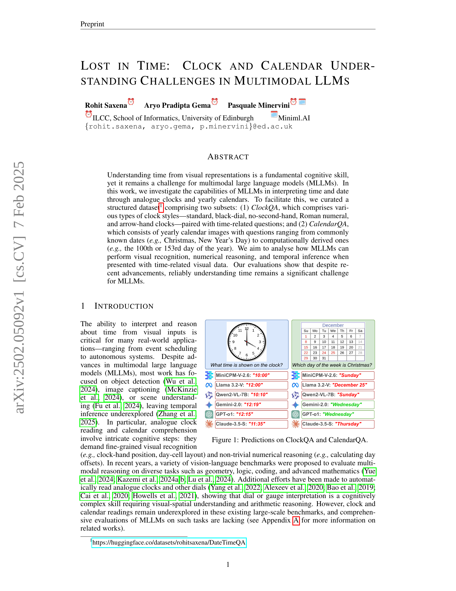
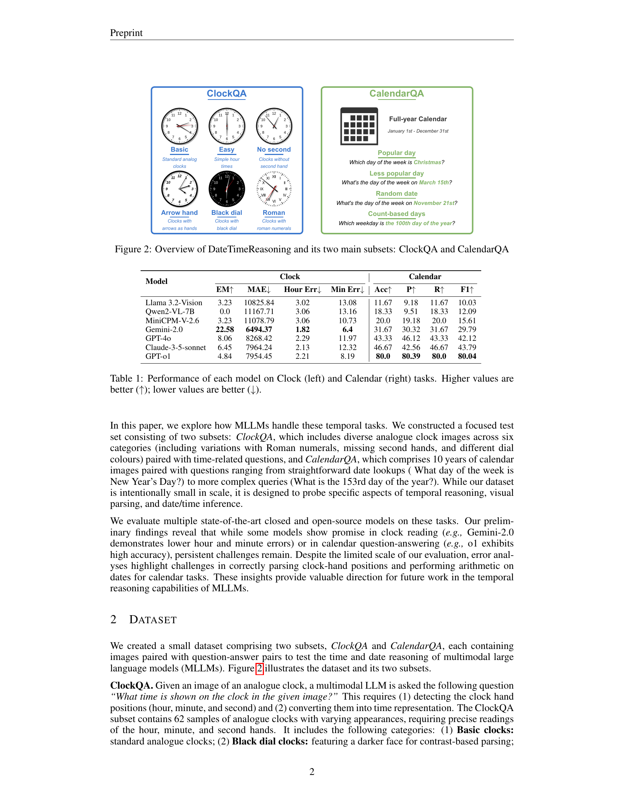
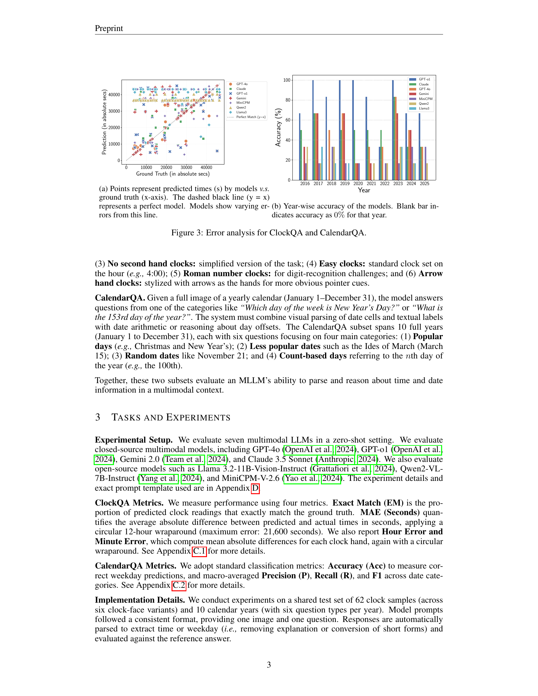
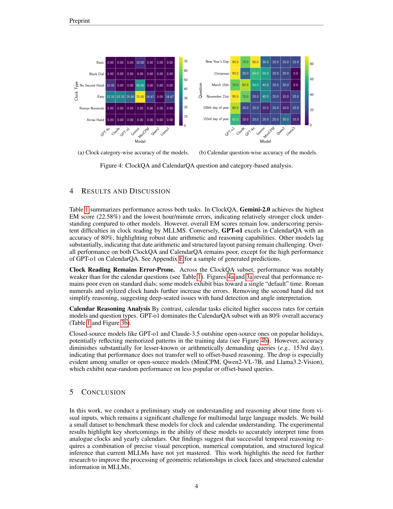
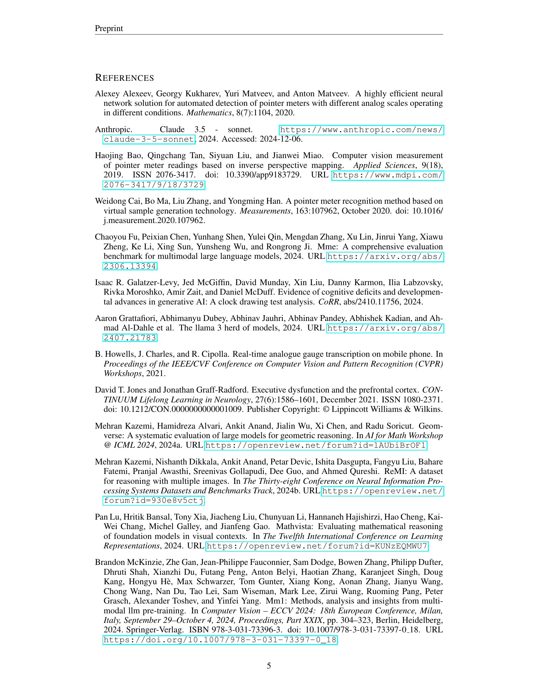
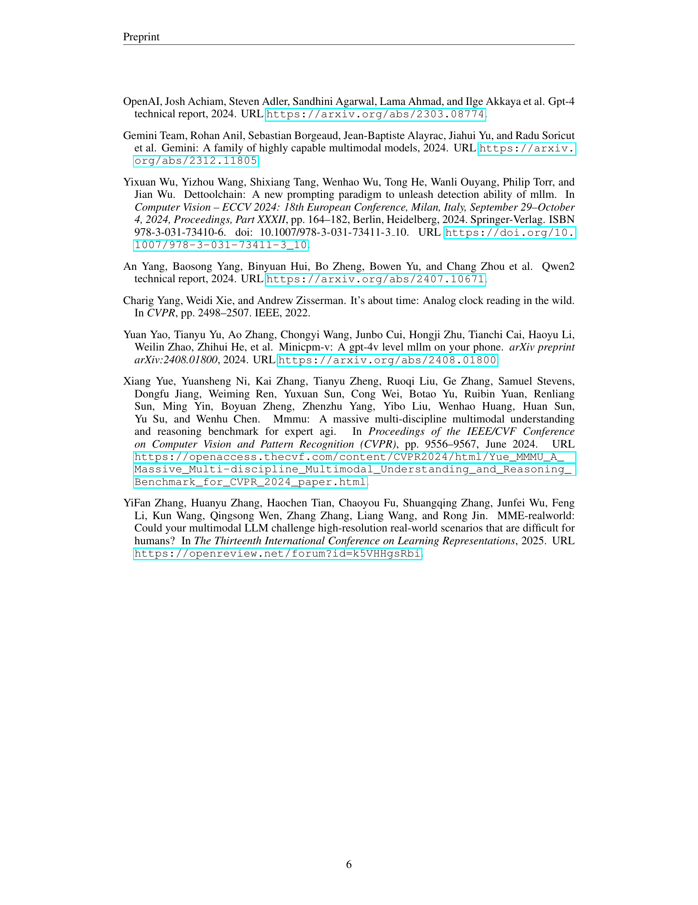
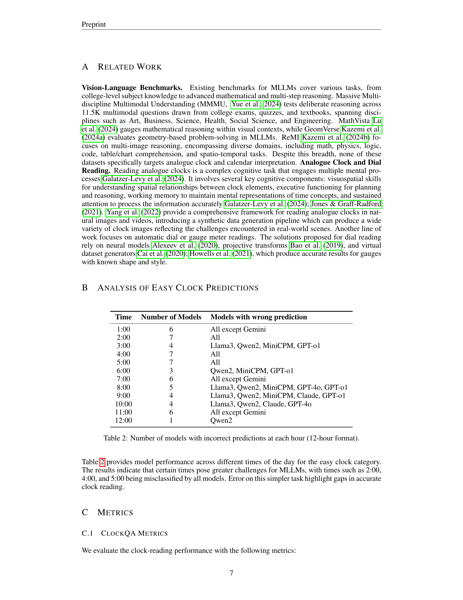
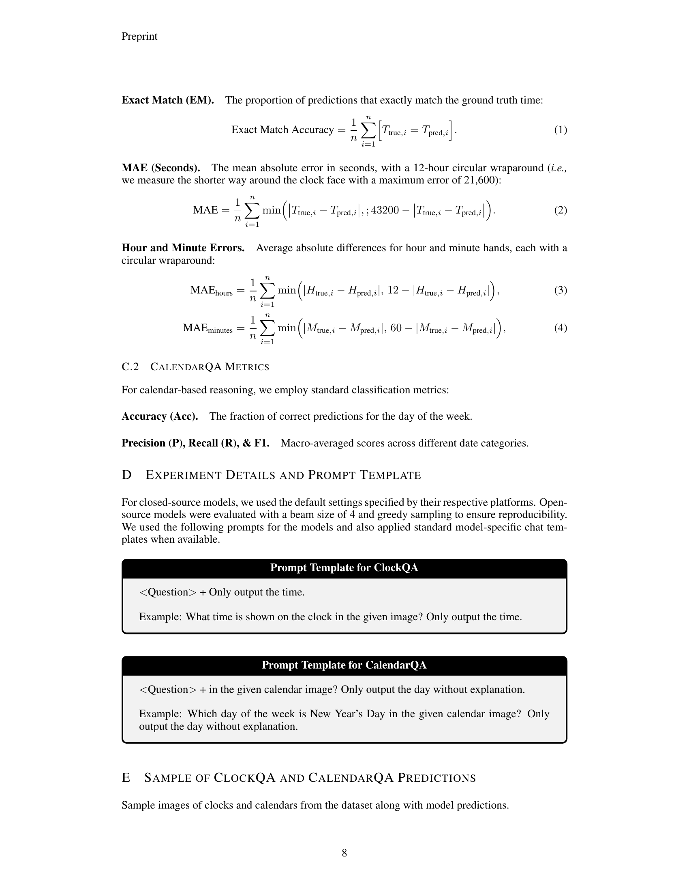
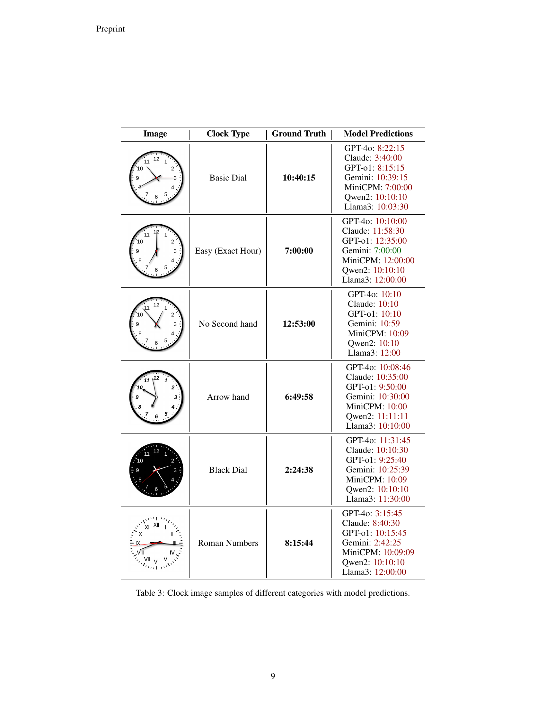
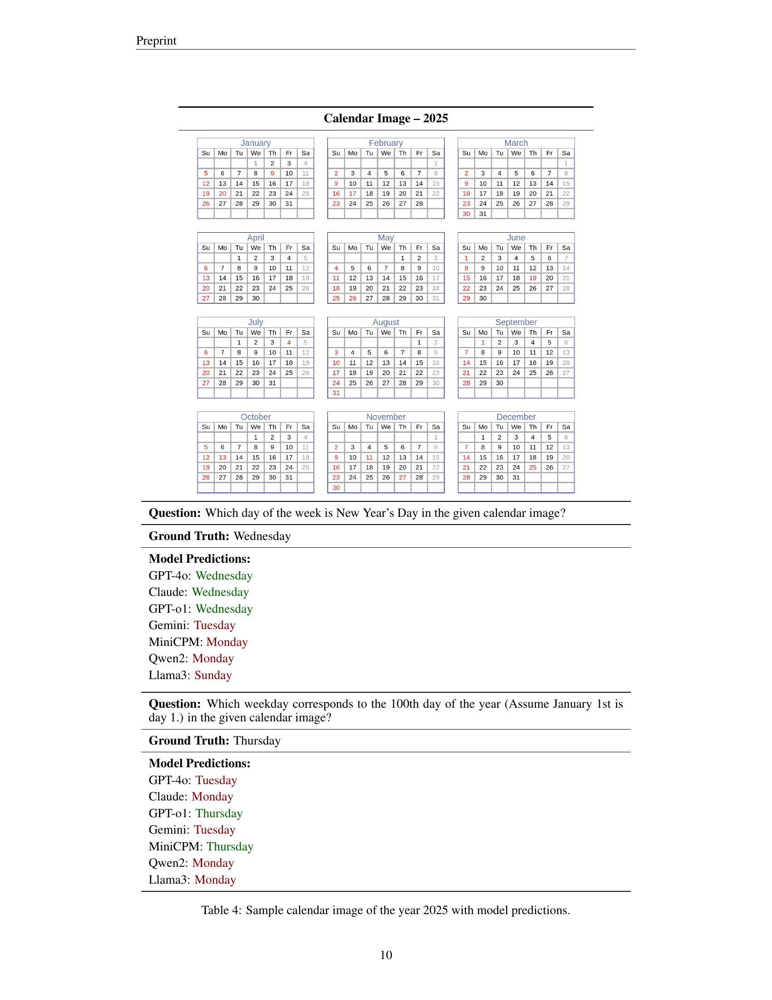
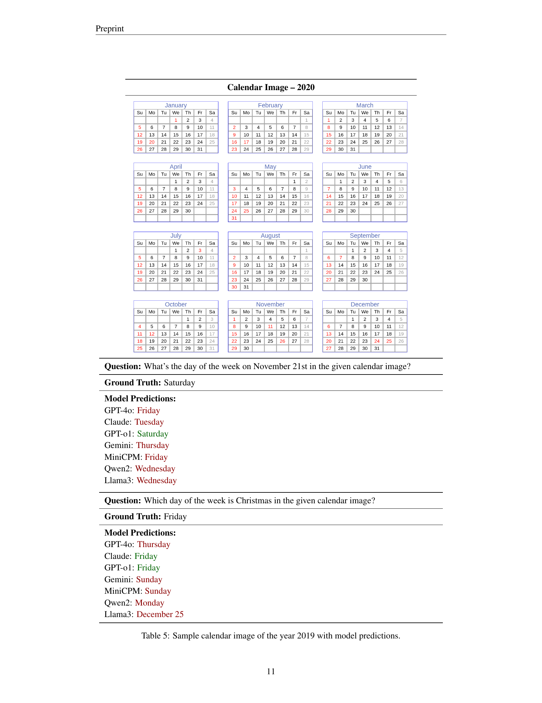
