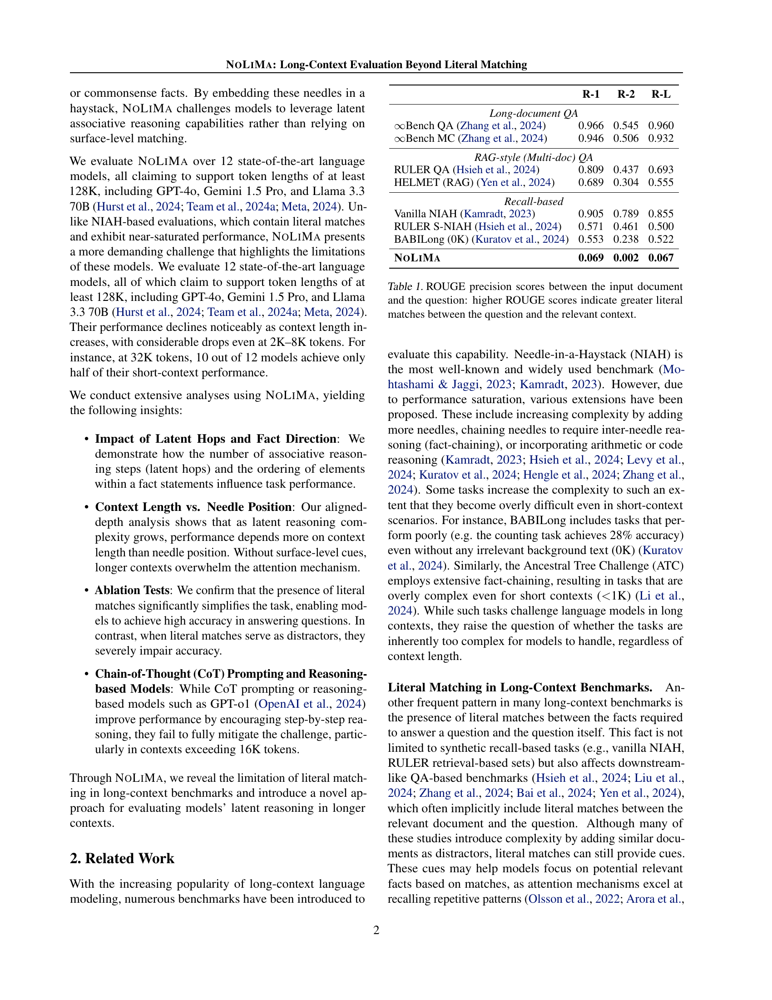
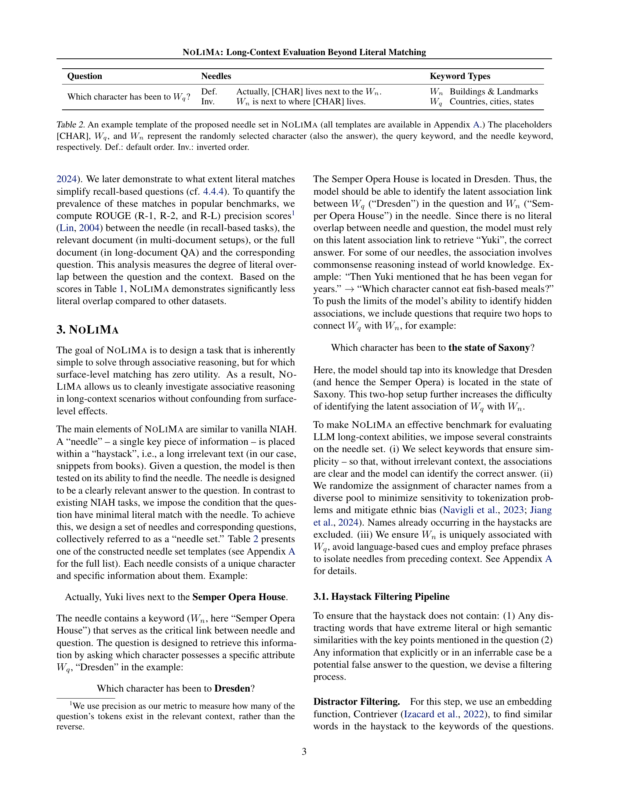

 


 2502.05167 
 Ali Modarressi et el. 
 
 🤗 2025-02-13 
 



↗ arXiv


↗ Hugging Face


↗ Papers with Code


### TL;DR



최근 **대규모 언어 모델(LLM)**은 수십만 또는 수백만 토큰에 달하는 장문 컨텍스트를 처리할 수 있게 되었지만, 이러한 능력을 효과적으로 평가하는 기준은 부족한 실정입니다. 기존의 Needle-in-a-haystack (NIAH) 테스트는 단순히 텍스트 내에서 특정 정보를 찾는 능력만을 평가하기 때문에, 모델의 진정한 이해 능력을 제대로 반영하지 못한다는 한계점이 있습니다.

본 논문에서는 **NOLIMA**라는 새로운 벤치마크를 제시하여 이 문제를 해결합니다. NOLIMA는 질문과 답변 간의 어휘 중복을 최소화하여, 모델이 단순한 표면적인 일치를 이용하는 것이 아니라 **잠재적인 연관성을 추론하는 능력**을 평가합니다. 다양한 LLM에 대한 실험 결과, 문맥 길이가 길어짐에 따라 모델 성능이 크게 저하되는 현상을 확인하였으며, 그 원인을 분석하고, 잠재적 연관 추론과 관련된 심층적인 분석 결과를 제시합니다.



#### Key Takeaways


 NOLIMA는 기존의 장문 컨텍스트 평가 기준의 한계를 극복하기 위해 **질문과 답변 간의 어휘 중복을 최소화**하여 모델의 잠재적 연관성 추론 능력을 평가합니다. 



 다양한 최신 언어 모델들에 대한 실험 결과, **문맥 길이가 길어질수록 성능이 크게 저하**되는 현상을 확인하고 그 원인을 분석했습니다. 



 **잠재적 연관 추론 단계의 증가 및 정보 제시 순서 변화**는 모델 성능에 영향을 미치며, **표면적 일치의 존재 유무**가 과제의 난이도에 큰 영향을 미친다는 것을 밝혔습니다. 


#### Why does it matter?
이 논문은 **장문 컨텍스트 언어 모델의 한계를 극복하기 위한 새로운 평가 기준**을 제시하여, 향후 연구 방향을 제시하고 **현존하는 벤치마크의 한계점을 지적**함으로써, 관련 연구 분야의 발전에 크게 기여합니다. 특히, **단순한 표면적 일치가 아닌 잠재적인 연관성을 파악하는 능력**을 평가하여, 모델의 진정한 이해도를 측정하는 데 초점을 맞추고 있습니다. 이는 좀 더 깊이 있는 언어 모델 평가 및 개발을 위한 중요한 이정표가 될 것입니다.

------
#### Visual Insights

> 🔼 그림 1은 논문의 핵심 데이터셋인 Haystack을 생성하는 과정에서 중복되거나 상반되는 정보를 제거하는 필터링 파이프라인을 보여줍니다.  먼저, 질문의 키워드와 유사한 단어들을 Haystack에서 찾아 제거하여 표면적인 방해 요소를 줄입니다.  다음으로,  질문과 Haystack의 조각들을 instruction-tuned 언어 모델에 입력하여 상반되는 정보를 식별하고 제거합니다.  이 과정은 수동 검토를 통해 정확성을 높입니다. 최종적으로, 방해 요소와 상반되는 정보가 제거된 Haystack이 생성되어 모델 평가에 사용됩니다.
> 

> 
read the caption

> Figure 1: Haystack conflicting information filtering pipeline
> 


| R-1 | R-2 | R-L |
|---|---|---|
| **Long-document QA** |  |  |  |
| ∞Bench QA (Zhang et al., 2024) | 0.966 | 0.545 | 0.960 |
| ∞Bench MC (Zhang et al., 2024) | 0.946 | 0.506 | 0.932 |
| **RAG-style (Multi-doc) QA** |  |  |  |
| RULER QA (Hsieh et al., 2024) | 0.809 | 0.437 | 0.693 |
| HELMET (RAG) (Yen et al., 2024) | 0.689 | 0.304 | 0.555 |
| **Recall-based** |  |  |  |
| Vanilla NIAH (Kamradt, 2023) | 0.905 | 0.789 | 0.855 |
| RULER S-NIAH (Hsieh et al., 2024) | 0.571 | 0.461 | 0.500 |
| BABILong (0K) (Kuratov et al., 2024) | 0.553 | 0.238 | 0.522 |
| **NoLiMa** | **0.069** | **0.002** | **0.067** |

> 🔼 표 1은 질문과 관련된 컨텍스트 사이의 문자 일치 정도를 보여주는 ROUGE 정밀도 점수를 보여줍니다.  ROUGE 점수는 입력 문서와 질문 간의 어휘 중복을 측정합니다.  점수가 높을수록 질문과 관련 컨텍스트 간의 문자 일치가 많다는 것을 의미합니다. 이는 모델이 문자 일치를 이용하여 작업을 단순화할 수 있는지 평가하는 데 도움이 됩니다.
> 

> 
read the caption

> Table 1: ROUGE precision scores between the input document and the question: higher ROUGE scores indicate greater literal matches between the question and the relevant context.
> 

### In-depth insights

#### Long-Context Limits
본 논문에서 다룬 "Long-Context Limits"는 장문맥스트를 다루는 대규모 언어 모델의 한계를 조명합니다. **모델이 문맥 길이가 증가함에 따라 성능이 저하되는 현상**은 주요 주제이며, 이는 단순히 메모리 제한 때문만이 아니라, **어텐션 메커니즘의 복잡성 증가 및 표면적 일치에 대한 과도한 의존**과 관련이 있습니다.  **표면적 일치(literal match)가 부족한 경우 모델이 잠재적 연관성을 추론하는 데 어려움을 겪는다는 점**이 중요하게 지적됩니다. 따라서, 단순한 정보 검색을 넘어, **추론 및 잠재적 연관성 파악을 요구하는 평가 기준 마련의 필요성**이 강조됩니다.  결론적으로, 장문맥스트 처리 능력 향상을 위해서는 **어텐션 메커니즘의 효율성 개선 및 잠재적 연관성 추론 능력 강화**에 초점을 맞춘 연구가 필요합니다. 이러한 한계 극복은 다양한 응용 분야에 긍정적 영향을 미칠 것입니다.

#### Latent Reasoning
본 논문에서 '잠재 추론(Latent Reasoning)'이란 용어는 모델이 표면적인 단어 일치가 아닌 암묵적인 연관성을 통해 정보를 추출하는 능력을 의미합니다.  **NOLIMA 벤치마크는 이러한 잠재 추론 능력을 평가하기 위해 고안되었습니다.**  NOLIMA는 질문과 답변 간의 어휘 중복을 최소화하여 모델이 단순한 단어 매칭이 아닌, **세상에 대한 지식과 상식, 그리고 암묵적인 연관성을 바탕으로 추론해야 함**을 강조합니다.  본 연구는 긴 문맥 내에서 잠재 추론의 어려움을 보여주는 **결정적인 증거**를 제시하며, 단순한 표면적 매칭에 의존하는 기존 벤치마크의 한계를 드러냅니다.  **문맥의 길이가 길어짐에 따라 모델의 성능이 저하되는 현상**은 주의 깊게 살펴볼 필요가 있으며,  **어텐션 메커니즘의 한계**와 밀접한 관련이 있음을 시사합니다.  **다단계 추론(multi-hop reasoning)** 과 같은 복잡한 추론 과정에서는 잠재 추론 능력의 중요성이 더욱 부각됩니다.  결론적으로, 잠재 추론은 **장문맥 이해의 핵심 요소**이며, 향후 연구에서 더욱 심도 있게 다뤄져야 할 중요한 주제입니다. 

#### NOLIMA Benchmark
NOLIMA 벤치마크는 기존의 Needle-in-a-Haystack (NIAH) 방식의 한계를 극복하고자 **어휘적 중복을 최소화한 새로운 평가 방식**을 제시합니다.  기존 NIAH 방식은 질문과 답변 간의 단순한 단어 일치에 의존하는 경향이 있었지만, NOLIMA는 **잠재적인 연관성 추론 능력**을 평가하는 데 초점을 맞춥니다.  즉, 모델이 단순한 단어 매칭이 아닌, **문맥과 지식을 활용한 추론 능력**을 통해 답을 찾아내도록 설계되었습니다.  **다양한 길이의 문맥(2K~32K 토큰)**에서 모델의 성능을 평가함으로써, 장문의 문맥 처리 능력의 한계를 명확히 드러냅니다. 특히, **잠재적 연관성의 단계(latent hops)**와 문장 내 요소의 순서에 따른 성능 변화 분석을 통해,  모델의 추론 과정에 대한 심도있는 통찰력을 제공합니다.  **단순한 단어 일치의 존재 여부가 성능에 미치는 영향**을 분석하여,  **모델의 추론 능력 향상을 위한 중요한 시사점**을 제시합니다.

#### Attention Analysis
논문의 "Attention Analysis" 부분은 **장문 맥락 내에서 주의 메커니즘의 역할**을 심층적으로 분석해야 합니다.  단순히 어텐션 가중치의 분포를 시각화하는 것을 넘어, **문장 간의 연관성, 특히 표면적인 일치가 없는 암시적 연관성을 어떻게 파악하는지**에 대한 분석이 필요합니다.  **장문 맥락에서의 어텐션은 단순한 단어 일치를 넘어 추론과 맥락 이해 능력**을 평가하는 중요한 지표가 될 수 있습니다.  따라서, 어텐션 분석은 단순한 정량적 분석을 넘어, **모델이 장문 맥락에서 어떤 정보에 주의를 기울이고, 어떻게 정보를 통합하는지**에 대한 질적인 해석을 포함해야 합니다.  이를 위해 다양한 시각화 기법과 통계적 분석 기법을 활용하고, 특히 **오류 분석을 통해 모델의 한계점**을 파악하는 데 초점을 맞춰야 합니다.  **특히, 암시적 지식이나 추론 과정에 대한 어텐션 패턴 분석**은 모델의 심층적 이해 능력을 평가하는 데 중요한 역할을 할 것입니다.  마지막으로, **다양한 길이의 맥락에 따른 어텐션 패턴의 변화**를 분석함으로써, 모델의 장문 맥락 처리 능력의 한계와 개선 방향을 제시해야 합니다.

#### Literal Match Bias
본 논문은 장문 맥락 이해를 위한 기존 벤치마크의 한계점을 지적하며, **단어 일치 편향(Literal Match Bias)**에 대한 심층적인 논의를 제시합니다.  기존의 많은 벤치마크는 질문과 답변 후보 간의 단순한 단어 일치 여부에 의존하는 경향이 있는데, 이는 모델의 진정한 이해 능력을 평가하는 데 부적절할 수 있다는 것입니다.  **NOLIMA 벤치마크**는 이러한 편향을 최소화하기 위해 질문과 정답 간의 어휘 중복을 최소화하여, 모델이 단순한 단어 매칭이 아닌 **잠재적인 연관성을 추론**하도록 설계되었습니다.  이를 통해 모델의 깊이 있는 이해 능력과 추론 능력을 보다 정확하게 평가하고자 합니다.  **결과적으로,  단어 일치에만 의존하는 평가 방식의 문제점을 드러내고,  진정한 장문 맥락 이해 능력을 측정하기 위한 새로운 평가 지표 및 방법론의 필요성을 강조합니다.**  NOLIMA는 단순한 표면적 일치를 넘어,  **심층적 추론 능력**을 요구하는 벤치마크로서,  장문 맥락 이해 연구 분야에 중요한 시사점을 제공합니다.

### More visual insights

More on figures

> 🔼 그림 2(a)는 한 단계 연관 추론을 필요로 하는 질문에 대한 모델의 정확도를 전체 컨텍스트 윈도우에 걸쳐 보여줍니다.  x축은 컨텍스트 깊이(%), y축은 정확도를 나타냅니다. 다양한 색상의 선은 서로 다른 컨텍스트 길이(2K, 4K, 8K, 16K, 32K 토큰)를 나타내며, 각 지점은 해당 컨텍스트 길이에서의 니들을 배치한 여러 위치에 대한 평균 정확도를 보여줍니다. 이 그래프는 컨텍스트 길이가 길어짐에 따라, 특히 니들이 컨텍스트 중간에 위치할 때 모델의 성능이 저하되는 현상을 보여줍니다.  즉, '중간에 놓인' 효과(lost-in-the-middle effect)를 보여주는 그래프입니다.
> 

> 
read the caption

> (a) Full Sweep (One-hop)
> 

> 🔼 그림 (b)는 풀 스윕(두 홉) 실험 결과를 보여줍니다. 풀 스윕 방식은 질문과 바늘 키워드 사이의 연관성 추론 단계가 두 단계인 경우의 모델 성능을 다양한 문맥 길이에 걸쳐 평가한 결과를 보여줍니다.  이 그림은 문맥 길이가 증가함에 따라 모델의 성능이 전반적으로 저하되는 경향을 보여주는 한편, 문맥 내 바늘의 위치보다는 문맥 길이 자체가 성능 저하에 더 큰 영향을 미침을 시사합니다.
> 

> 
read the caption

> (b) Full Sweep (Two-hop)
> 

> 🔼 그림 2(c)는 다양한 문맥 길이에 걸쳐 전체 문맥 창이 아닌 마지막 2K 토큰 내에서의 성능을 보여줍니다. 각 문맥 길이에 대해, 바늘의 위치는 마지막 2K 토큰 내에서 일정하게 유지됩니다. 이는 각 토큰 깊이에 대한 유일한 변화 요소가 문맥 길이임을 의미하며, 모델은 더 많은 토큰에 주목할 수 있습니다. 이 그림은 풀 스윕 플롯과 비교하여 한 단계 깊이 분석을 제공합니다.
> 

> 
read the caption

> (c) Last 2K (One-hop)
> 

> 🔼 그림 (d)는 2개의 연관 추론 단계를 포함하는 질문에 대한 성능을 보여줍니다. 전체 컨텍스트 윈도우에서 성능이 저하되는 현상은 복잡한 추론 작업의 경우 더욱 두드러집니다. 마지막 2K 토큰에만 초점을 맞춰 분석한 결과, 컨텍스트 길이가 길어짐에 따라 성능이 전반적으로 저하되는 것으로 나타났습니다. 단일 추론 단계와 비교했을 때, 이러한 현상은 복잡한 작업의 경우 더욱 두드러지게 나타납니다. 이는 더 긴 컨텍스트 내에서 관련 정보를 식별하는 모델의 어려움을 보여줍니다.
> 

> 
read the caption

> (d) Last 2K (Two-hop)
> 

> 🔼 그림 2는 전체 문맥 창에서의 성능을 보여주는 전체 범위 플롯(a&b)과 다양한 문맥 길이에 대해 바늘 배치가 마지막 2K 토큰 내에 정렬될 때의 성능을 보여주는 마지막 2K 토큰 플롯(c&d)을 보여줍니다. 각 플롯 선의 색상 음영은 테스트된 문맥 길이를 나타냅니다. 노이즈를 최소화하고 추세를 더 명확하게 강조하기 위해 배치 수를 26개에서 51개로 늘리고 창 크기 12인 이동 평균을 적용했습니다.  즉, 그림 2는 모델의 성능이 문맥의 길이에 따라 어떻게 달라지는지, 특히 문맥의 끝부분에 집중했을 때 성능이 어떻게 변하는지를 보여줍니다.  전체 문맥을 고려했을 때와 마지막 2K 토큰만 고려했을 때의 성능 차이를 비교 분석하여 모델의 장단점을 파악하는 데 도움이 됩니다.
> 

> 
read the caption

> Figure 2: The full sweep plots (a & b) illustrate performance across the entire context window. The plots for the last 2K tokens (c & d) depict performance when needle placements are aligned within the final 2K tokens for various context lengths. The color shading of each plot line represents the tested context length. To minimize noise and highlight trends more clearly, we increased the number of placements from 26 to 51 and applied a moving average with a window size of 12.
> 

> 🔼 그림 3(a)는 질문 키워드에서 니들 키워드까지 연관 추론 단계의 수에 따른 성능 일반화에 미치는 영향을 보여줍니다. 한 단계 연관 추론과 두 단계 연관 추론이 필요한 질문에 대한 상위 두 모델의 정규화된 성능을 비교합니다. 동일한 컨텍스트 길이에서 두 단계 연관 추론 질문이 한 단계 연관 추론 질문보다 더 어렵다는 것을 보여줍니다. 특히, GPT-40는 4K 토큰까지도 두 유형의 질문 모두에 대해 효과적인 일반화 성능을 보입니다.
> 

> 
read the caption

> (a) One-hop vs. Two-hop
> 

> 🔼 그림 (b)는 기본 순서와 반전 순서의 두 가지 템플릿을 모두 포함하는 각 그룹의 바늘에 대한 정규화된 점수를 보여줍니다. 반전된 예시는 답변하기 더 어렵다는 것을 알 수 있습니다. 이는 모델의 인과적 주의 메커니즘, 특히 주의 신호가 약해지는 더 긴 맥락에서 발생합니다. 기본 템플릿에서는 질문 또는 특히 Wq가 Wn에 직접 연결될 수 있으며, Wn에는 문장의 앞부분에 나타나므로 문자 이름에 대한 정보가 포함될 수 있습니다. 따라서 모델은 Wq에서 Wn을 거쳐 문자로 효과적으로 추적할 수 있습니다. 그러나 반전된 템플릿에서는 Wq가 Wn에 주의를 기울일 수 있지만, 사실이 불완전하기 때문에(문자가 아직 언급되지 않았으므로) 모델은 해당 주의를 사용하여 질문을 해결할 수 없습니다. 대신 문자의 이름에 인코딩된 더 약한 신호에 의존해야 하며, 더 긴 맥락에서는 어려워집니다. 이러한 결과는 어려움에 대한 통찰력을 제공하지만, 더 자세한 메커니즘 분석은 이 논문의 범위를 벗어나며 추가 연구가 필요합니다.
> 

> 
read the caption

> (b) Default vs. Inverted
> 

> 🔼 그림 3은 GPT-4o 및 Llama 3.3 70B 모델에서 연관 추론 단계 수(잠재적 호핑) 및 팩트 순서의 영향을 정규화된 성능에 대해 보여줍니다. (a)는 단일 호핑 질문과 이중 호핑 질문에 대한 정규화된 정확도를 비교하여 모델이 더 복잡한 추론을 처리하는 데 어려움을 겪는다는 것을 보여줍니다. (b)는 기본 순서와 반전된 순서 질문에 대한 정규화된 정확도를 비교하여 맥락 길이가 길어짐에 따라 모델의 성능이 저하됨을 보여줍니다. 빨간색 점선은 0.85의 유효 임계값을 나타냅니다.
> 

> 
read the caption

> Figure 3: Impact of (a) number of hops and (b) inversion on normalized performance across GPT-4o and Llama 3.3 70B models. The red dotted line indicates the 0.85 effective threshold.
> 

More on tables


| Question | Needles | Keyword Types |
|---|---|---|
| Which character has been to $W_q$? | Def. | $W_n$ | Buildings & Landmarks |
| $W_n$ is next to where [CHAR] lives. | Inv. | $W_q$ | Countries, cities, states |
> 🔼 표 2는 논문에서 제안하는 NoLiMa의 예시 니들 세트 템플릿을 보여줍니다. 부록 A에는 모든 템플릿이 있습니다. [CHAR],  Wq, Wn은 무작위로 선택된 캐릭터(정답), 질의 키워드, 니들 키워드를 각각 나타냅니다. Def.는 기본 순서, Inv.는 반전 순서를 의미합니다. 이 표는 NoLiMa 벤치마크에서 사용되는 질문과 니들의 관계를 보여주는 예시이며, 질문과 니들 사이의 어휘 중복을 최소화하여 모델이 단순한 표면적인 매칭이 아닌 잠재적인 연관성을 파악해야 함을 보여줍니다.
> 

> 
read the caption

> Table 2: An example template of the proposed needle set in NoLiMa (all templates are available in Appendix A.) The placeholders [CHAR], Wqsubscript𝑊𝑞W_{q}italic_W start_POSTSUBSCRIPT italic_q end_POSTSUBSCRIPT, and Wnsubscript𝑊𝑛W_{n}italic_W start_POSTSUBSCRIPT italic_n end_POSTSUBSCRIPT represent the randomly selected character (also the answer), the query keyword, and the needle keyword, respectively. Def.: default order. Inv.: inverted order.
> 


| Models | Claimed Length | Effective Length | Base Score | 1K | 2K | 4K | 8K | 16K | 32K |
|---|---|---|---|---|---|---|---|---|---| 
| GPT-4o | 128K | 8K | 99.3 (84.4) | 98.1 | 98.0 | 95.7 | 89.2 | 81.6 | 69.7 |
| Llama 3.3 70B | 128K | 2K | 97.3 (82.7) | 94.2 | 87.4 | 81.5 | 72.1 | 59.5 | 42.7 |
| Llama 3.1 405B | 128K | 2K | 94.7 (80.5) | 89.0 | 85.0 | 74.5 | 60.1 | 48.4 | 38.0 |
| Llama 3.1 70B | 128K | 2K | 94.5 (80.3) | 91.0 | 81.8 | 71.2 | 62.7 | 51.8 | 43.2 |
| Gemini 1.5 Pro | 2M | 2K | 92.6 (78.7) | 86.4 | 82.7 | 75.4 | 63.9 | 55.5 | 48.2 |
| Jamba 1.5 Mini | 256K | <1K | 92.4 (78.6) | 76.3 | 74.1 | 70.8 | 62.2 | 52.7 | 43.6 |
| Command R+ | 128K | <1K | 90.9 (77.3) | 77.0 | 73.5 | 66.3 | 39.5 | 21.3 | 7.4 |
| Mistral Large 2 | 128K | 2K | 87.9 (74.7) | 86.1 | 85.5 | 73.3 | 51.5 | 32.6 | 18.7 |
| Claude 3.5 Sonnet | 200K | 4K | 87.6 (74.4) | 85.4 | 84.0 | 77.6 | 61.7 | 45.7 | 29.8 |
| Gemini 1.5 Flash | 1M | <1K | 84.7 (72.0) | 68.6 | 61.6 | 51.0 | 44.4 | 35.5 | 28.6 |
| GPT-4o mini | 128K | <1K | 84.9 (72.2) | 67.7 | 58.2 | 44.1 | 32.6 | 20.6 | 13.7 |
| Llama 3.1 8B | 128K | 1K | 76.7 (65.2) | 65.7 | 54.4 | 44.1 | 31.9 | 22.6 | 14.2 |
> 🔼 표 3은 논문에서 선택된 모델들에 대한 NoLiMa 벤치마크 결과를 보여줍니다. Hsieh et al. (2024)의 연구를 따라, 각 모델의 주장되는 최대 컨텍스트 길이와 함께 실제 효과적인 길이도 함께 제시합니다. 하지만 본 논문에서는 점수가 모델의 기준 점수(괄호 안)의 85% 이상을 유지하는 최대 길이를 실제 효과적인 길이로 정의합니다. 기준 점수를 초과하는 점수는 밑줄이 그어져 있고, 기준 점수의 50% 미만인 점수는 빨간색으로 표시되어 있습니다.
> 

> 
read the caption

> Table 3: NoLiMa benchmark results on the selected models. Following Hsieh et al. (2024), we report the effective length alongside the claimed supported context length for each model. However, we define the effective length as the maximum length at which the score remains above a threshold set at 85% of the model’s base score (shown in parentheses). Scores exceeding this threshold are underlined. Scores that are below 50% of the base score are shaded in red.
> 


| | 4K | 8K | 16K | 32K |
|---|---|---|---|---|
| _One-hop_ |  |  |  |  |
| - w/o CoT | 90.3 | 84.1 | 73.2 | 56.2 |
| - w/ CoT | 95.6 | 91.1 | 82.6 | 60.6 |
| Increase rate | 5.9% | 8.3% | 12.8% | 7.8% |
| _Two-hop_ |  |  |  |  |
| - w/o CoT | 70.7 | 57.4 | 42.7 | 25.9 |
| - w/ CoT | 82.4 | 70.1 | 56.7 | 34.3 |
| Increase rate | 16.5% | 22.1% | 32.7% | 32.4% |
> 🔼 표 4는 Llama 3.3 70B 모델을 사용하여 한 단계 추론(one-hop) 및 두 단계 추론(two-hop) 작업에 대해 Chain-of-Thought(CoT) 프롬프팅이 성능 향상에 미치는 영향을 비교 분석한 결과를 보여줍니다.  CoT 프롬프팅을 사용했을 때와 사용하지 않았을 때의 정확도 변화율을 4K, 8K, 16K, 32K 토큰 길이별로 보여주어, CoT 프롬프팅이 모델의 추론 능력 향상에 어떻게 기여하는지, 그리고 그 효과가 토큰 길이에 따라 어떻게 달라지는지 분석합니다. 특히, 두 단계 추론 작업에서 CoT 프롬프팅의 효과가 더 크게 나타나는 것을 확인할 수 있습니다.
> 

> 
read the caption

> Table 4: Comparison of Chain-of-Thought (CoT) improvements in performance for Llama 3.3 70B, evaluated on both one-hop and two-hop tests.
> 


|           | Base       | 4K  | 8K  | 16K | 32K |
|-----------|------------|-----|-----|-----|-----|
|           | **Score**   | **4K** | **8K** | **16K** | **32K** |
|           | <em style="font-style:italic">Llama 3.3 70b</em> |       |       |       |       |
| - w/o CoT | 98.3        | 55.5 | 37.2 | 16.7 | 8.9  |
| - w/ CoT  | 97.1        | 73.0 | 51.2 | 31.8 | 10.1 |
|           | <em style="font-style:italic">Reasoning models</em> |       |       |       |       |
| GPT-o1    | 99.9        | 92.0 | 78.0 | 60.1 | 31.1 |
| GPT-o3 Mini| 98.8        | 52.8 | 36.9 | 25.5 | 18.9 |
| DeepSeek R1-DL-70b | 99.9        | 91.4 | 75.5 | 49.4 | 20.7 |
> 🔼 표 5는 NoLiMa-Hard의 평가 결과를 보여줍니다. NoLiMa-Hard는 기존 NoLiMa 벤치마크에서 가장 어려운 질문-니들(needle) 쌍 10개를 선별한 하위 집합입니다. 표에는 각 모델의 기본 점수(base score)와 8K, 16K, 32K 토큰 길이에서의 성능이 나타나 있습니다. 기본 점수는 250, 500, 1K 토큰 길이에서의 평균 최고 점수로 계산됩니다.  기본 점수의 50% 미만인 점수는 빨간색으로 강조 표시되어 모델의 성능 저하를 명확하게 보여줍니다. 이 표는 긴 문맥에서의 추론 능력을 평가하기 위해 고안된 어려운 과제에 대한 다양한 모델의 성능을 비교 분석하는 데 사용됩니다.
> 

> 
read the caption

> Table 5: Evaluation results of NoLiMa-Hard: Scores falling below 50% of the base score are highlighted in red.
> 


|                    | 8K   | 16K  | 32K  |
|--------------------|------|------|------|
| Direct             | 98.3 | 98.5 | 98.5 |
| One-hop            | 84.1 | 73.2 | 56.2 |
| - w/ Literal Match (MC) | 98.7 | 97.4 | 93.1 |
| Two-hop            | 57.4 | 42.7 | 25.9 |
| - w/ Literal Match (MC) | 96.3 | 94.6 | 87.2 |
> 🔼 표 6은 Llama 3.3 70B 모델을 사용한 두 가지 유형의 질문(직접 질문, 객관식 질문)에 대한 결과를 보여줍니다. 직접 질문은 답변에 필요한 정보가 질문에 직접적으로 포함되어 있는 반면, 객관식 질문은 추가적인 추론 단계가 필요합니다. 이 표는 문맥 내에서 명시적인 일치가 존재할 때 모델 성능에 미치는 영향을 평가합니다.
> 

> 
read the caption

> Table 6: Results in two literal match setups: direct and multiple choice (MC) questions. Model: Llama 3.3 70B
> 


| Question | Needles | Keyword Types |
|---|---|---|
| Which character has been to $W_{q}$? | Def. | $W_{n}$ | Countries, cities, states |
|  | Inv. | $W_{q}$ | Countries, cities, states |
| Which character has been to $W_{q}$? | Def. | $W_{n}$ | Buildings & Landmarks |
|  | Inv. | $W_{q}$ | Countries, cities, states |
| Which character cannot drink $W_{q}$? | Def. | $W_{n}$ | Dietary restriction      (e.g., lactose intolerant) |
|  | Inv. | $W_{q}$ | Drinks & Beverages |
| Which character cannot eat $W_{q}$? | Def. | $W_{n}$ | Dietary restriction       (e.g., vegan) |
|  | Inv. | $W_{q}$ | Foods |
> 🔼 표 7은 논문의 NoLiMa 벤치마크에서 사용된 질문-바늘 쌍의 예시들을 보여줍니다. [CHAR], Wq, Wn은 각각 무작위로 선택된 등장인물(정답), 질문 키워드, 바늘 키워드를 나타냅니다.  각 질문-바늘 쌍은 질문과 바늘 사이의 어휘 중복을 최소화하여 모델이 단순한 표면적인 일치보다는 잠재적인 연관성을 파악해야 함을 강조합니다.  'Def.'는 기본 순서, 'Inv.'는 반전 순서를 나타냅니다. 표에는 다양한 유형의 질문과 대응하는 바늘이 여러 개 제시되어 있으며, 이를 통해 모델의 추론 능력을 다각적으로 평가할 수 있도록 설계되었습니다.
> 

> 
read the caption

> Table 7: Our proposed needle set templates in NoLiMa. The placeholders [CHAR], Wqsubscript𝑊𝑞W_{q}italic_W start_POSTSUBSCRIPT italic_q end_POSTSUBSCRIPT, and Wnsubscript𝑊𝑛W_{n}italic_W start_POSTSUBSCRIPT italic_n end_POSTSUBSCRIPT represent the randomly selected character (also the answer), the query keyword, and the needle keyword, respectively. Def.: default order. Inv.: inverted order.
> 


| Model | Context Length | Open Weights? | Model Revision |
|---|---|---|---| 
| GPT-4o | 128K | No | gpt-4o-2024-11-20 |
| GPT-4o mini | 128K | No | gpt-4o-mini-20240718 |
| Llama 3.3 70B | 128K | Yes | meta-llama/Llama-3.3-70B-Instruct |
| Llama 3.1 405B | 128K | Yes | meta-llama/Llama-3.1-405B-Instruct |
| Llama 3.1 70B | 128K | Yes | meta-llama/Llama-3.1-70B-Instruct |
| Llama 3.1 8B | 128K | Yes | meta-llama/Llama-3.1-8B-Instruct |
| Gemini 1.5 Pro | 2M | No | gemini-1.5-pro-002 |
| Gemini 1.5 Flash | 1M | No | gemini-1.5-flash-002 |
| Claude 3.5 Sonnet | 200K | No | anthropic.claude-3-5-sonnet-20241022-v2 |
| Jamba 1.5 Mini | 256K | Yes | ai21labs/AI21-Jamba-1.5-Mini |
| Command R+ | 128K | Yes | CohereForAI/c4ai-command-r-plus-08-2024 |
| Mistral Large 2 | 128K | Yes | mistralai/Mistral-Large-Instruct-2411 |
| *Reasoning-based models* |  |  |  |
| GPT-o1 | 128K | No | gpt-o1-2024-12-17 |
| GPT-o3 Mini | 128K | No | gpt-o3-mini-2025-01-31 |
| DeepSeek R1-DL-70b | 128K | Yes | deepseek-ai/DeepSeek-R1-Distill-Llama-70B |
> 🔼 표 8은 논문에서 평가에 사용된 모델들의 세부 정보를 보여줍니다. 모델 이름, 주장되는 최대 문맥 길이, 가중치가 공개되었는지 여부(Open Weights), 그리고 모델 버전 정보가 포함되어 있습니다.  개방형 가중치(Open Weights) 모델의 경우, 사용된 특정 버전과 출처가 명시되어 있습니다. 이 표는 각 모델의 특징을 한눈에 파악하는 데 유용하며, 실험 결과 해석에 필요한 배경 정보를 제공합니다.
> 

> 
read the caption

> Table 8: Details of the selected models used for evaluation.
> 


| Mode | Prompt Template |
|---|---| 
| w/o CoT | You will answer a question based on the following book snippet:  {haystack w/ needle}  Use the information provided in the book snippet to answer the question. Your answer should be short and based on either explicitly stated facts or strong, logical inferences. Question: {question} Return only the final answer with no additional explanation or reasoning. |
| w/ CoT | You will answer a question based on the following book snippet:  {haystack w/ needle}  Use the information provided in the book snippet to answer the question. Be aware that some details may not be stated directly, and you may need to INFER the answer based on the given information. Begin with a brief explanation of your reasoning in NO MORE THAN THREE (3) sentences. Then, return the final answer on a new line. Question: {question} |
> 🔼 표 9는 본 논문의 실험에서 사용된 프롬프트 템플릿에 대한 세부 정보를 보여줍니다.  두 가지 모드(CoT 사용 유무)에 따른 프롬프트 예시가 제시되어 있으며, 각 모드에서 모델이 질문에 답변하는 방식과 답변에 대한 지침이 자세히 설명되어 있습니다. CoT(Chain-of-Thought) 프롬프트는 단계별 추론을 유도하여 모델의 답변 정확도를 높이기 위한 목적으로 사용되었습니다.  표에는 각 모드에 대한 프롬프트 템플릿과 함께 모델의 응답 형식 및 제한 사항에 대한 정보도 포함되어 있습니다.
> 

> 
read the caption

> Table 9: Details of prompt templates utilized in our evaluation.
> 

### Full paper



