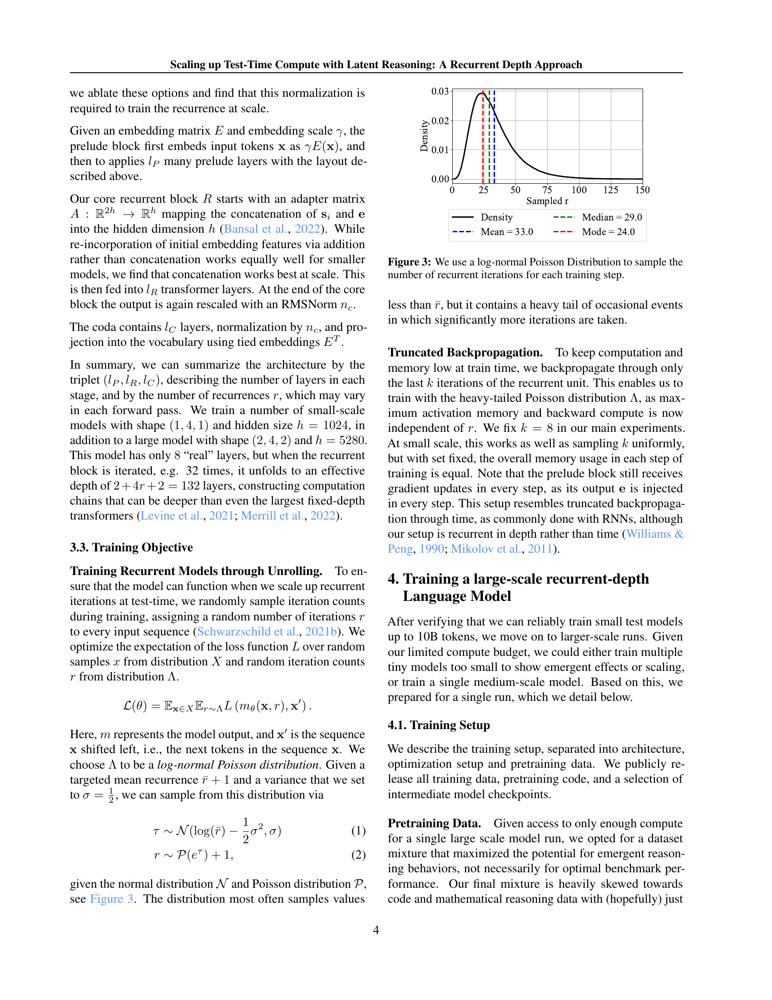
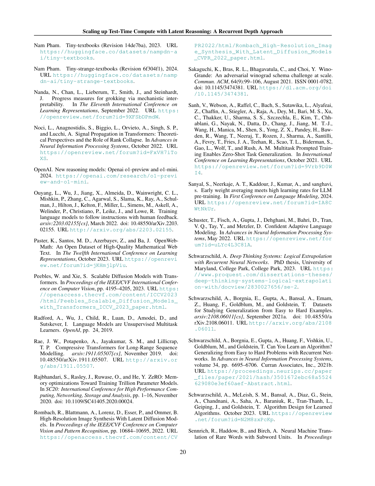

 


 2502.05171 
 Jonas Geiping et el. 
 
 🤗 2025-02-10 
 



↗ arXiv


↗ Hugging Face


↗ Papers with Code


### TL;DR



기존의 언어 모델들은 더 많은 토큰을 생성하여 계산량을 늘리는 방식으로 추론 능력을 향상시키는 데 한계가 있었습니다. 또한, 사고 연쇄(chain-of-thought) 기반의 접근 방식은 특수한 훈련 데이터가 필요하고, 작은 문맥 창에서 작동하지 않는 등의 문제점이 있었습니다.

본 논문에서는 **잠재 공간에서 반복적인 블록을 반복 실행하여 테스트 시간에 계산량을 늘리는 새로운 아키텍처**를 제시합니다. 이는 **특별한 훈련 데이터 없이도 작은 문맥 창에서 작동하며, 기존 방식으로는 쉽게 표현할 수 없는 유형의 추론도 가능**하게 합니다.  실험 결과, 제안된 모델은 추론 벤치마크에서 성능을 크게 향상시켰습니다.



#### Key Takeaways


 테스트 시간에 계산량을 늘려 언어 모델의 추론 성능을 향상시키는 새로운 아키텍처 제시 



 기존의 사고 연쇄(chain-of-thought) 방식과 달리 특별한 훈련 데이터 없이 잠재 공간에서 추론 



 소규모 모델에서도 대규모 모델과 경쟁 가능한 성능 달성 


#### Why does it matter?
본 논문은 **테스트 시간 계산을 확장하여 언어 모델의 추론 능력을 향상시키는 새로운 접근 방식**을 제시합니다. 기존의 어텐션 메커니즘 대신 순환 구조를 사용하여 테스트 시간에 깊이를 임의로 조절할 수 있습니다. 이는 소규모 모델에서도 막대한 계산량을 가진 대규모 모델과 경쟁할 수 있게 합니다. **추론 시간 계산을 조절하는 새로운 방법**은 다양한 응용 분야에 적용 가능하며, **효율성과 성능을 동시에 개선**하는 중요한 발견입니다.  연구 결과는 향후 연구에 새로운 방향을 제시하고, 효율성과 성능을 동시에 고려하는 언어 모델 개발에 중요한 영향을 미칠 것으로 예상됩니다.

------
#### Visual Insights

> 🔼 그림 1은 깊이 순환을 사용하여 35억 개의 파라미터를 가진 언어 모델을 학습시킨 결과를 보여줍니다. 테스트 시간에 모델은 더 많은 연산을 수행하여 성능을 향상시킬 수 있습니다. 기존의 사고 연쇄(Chain-of-Thought) 방식처럼 토큰을 더 많이 생성하는 방식과 달리, 이 모델은 잠재 공간에서 추론을 함으로써 성능 향상을 달성합니다. OpenBookQA처럼 추론이 적게 필요한 작업은 GSM8K처럼 많은 연산을 필요로 하는 작업보다 더 빠르게 수렴합니다. 이는 모델이 잠재 공간에서 효율적으로 추론하고, 더 많은 연산을 사용할수록 더 복잡한 추론 작업에 효과적임을 시사합니다.
> 

> 
read the caption

> Figure 1: We train a 3.5B parameter language model with depth recurrence. At test time, the model can iterate longer to use more compute and improve its performance. Instead of scaling test-time reasoning by “verbalizing” in long Chains-of-Thought, the model improves entirely by reasoning in latent space. Tasks that require less reasoning like OpenBookQA converge quicker than tasks like GSM8k, which effectively make use of more compute.
> 


| Model | Param | Tokens | ARC-E | ARC-C | HellaSwag | MMLU | OBQA | PiQA | SciQ | WinoGrande |
|---|---|---|---|---|---|---|---|---|---|---|
| random |  |  | 25.0 | 25.0 | 25.0 | 25.0 | 25.0 | 50.0 | 25.0 | 50.0 |
| Amber | 7B | 1.2T | 65.70 | 37.20 | 72.54 | 26.77 | 41.00 | 78.73 | 88.50 | 63.22 |
| Pythia-2.8b | 2.8B | 0.3T | 58.00 | 32.51 | 59.17 | 25.05 | 35.40 | 73.29 | 83.60 | 57.85 |
| Pythia-6.9b | 6.9B | 0.3T | 60.48 | 34.64 | 63.32 | 25.74 | 37.20 | 75.79 | 82.90 | 61.40 |
| Pythia-12b | 12B | 0.3T | 63.22 | 34.64 | 66.72 | 24.01 | 35.40 | 75.84 | 84.40 | 63.06 |
| OLMo-1B | 1B | 3T | 57.28 | 30.72 | 63.00 | 24.33 | 36.40 | 75.24 | 78.70 | 59.19 |
| OLMo-7B | 7B | 2.5T | 68.81 | 40.27 | 75.52 | 28.39 | 42.20 | 80.03 | 88.50 | 67.09 |
| OLMo-7B-0424 | 7B | 2.05T | 75.13 | 45.05 | 77.24 | 47.46 | 41.60 | 80.09 | 96.00 | 68.19 |
| OLMo-7B-0724 | 7B | 2.75T | 74.28 | 43.43 | 77.76 | 50.18 | 41.60 | 80.69 | 95.70 | 67.17 |
| OLMo-2-1124 | 7B | 4T | 82.79 | 57.42 | 80.50 | 60.56 | 46.20 | 81.18 | 96.40 | 74.74 |
| Ours, (r=4) | 3.5B | 0.8T | 57.19 | 22.95 | 36.07 | 23.32 | 18.60 | 65.12 | 84.80 | 55.24 |
| Ours, (r=8) | 3.5B | 0.8T | 66.07 | 32.50 | 45.08 | 24.88 | 22.00 | 70.72 | 91.5 | 55.64 |
| Ours, (r=16) | 3.5B | 0.8T | 68.43 | 34.38 | 48.65 | 29.21 | 24.00 | 73.99 | 93.60 | 57.77 |
| Ours, (r=32) | 3.5B | 0.8T | 69.91 | 38.23 | 65.21 | 31.38 | 38.80 | 76.22 | 93.50 | 59.43 |

> 🔼 본 표는 다양한 오픈소스 언어 모델에 대한 lm-eval-harness 작업의 제로샷 성능을 보여줍니다. 채팅 템플릿 없이 평가되었으며, ARC, HellaSwag, MMLU, OpenBookQA, PiQA, SciQ, WinoGrande 등 다양한 벤치마크 작업에 대한 정규화된 정확도 점수를 제시합니다.  각 모델의 매개변수 수와 토큰 수도 함께 표시되어 모델 크기와 성능 간의 관계를 파악하는 데 도움을 줍니다.
> 

> 
read the caption

> Table 1: Results on lm-eval-harness tasks zero-shot without chat template across various open-source models. We show ARC (Clark et al., 2018), HellaSwag (Zellers et al., 2019), MMLU (Hendrycks et al., 2021b), OpenBookQA (Mihaylov et al., 2018), PiQA (Bisk et al., 2020), SciQ (Johannes Welbl, 2017), and WinoGrande (Sakaguchi et al., 2021). We report normalized accuracy when provided.
> 

### In-depth insights

#### Latent Reasoning
본 논문에서 제시된 잠재 추론(Latent Reasoning) 개념은 **테스트 시간에 컴퓨팅 비용을 효율적으로 확장**하기 위한 새로운 접근 방식입니다.  기존의 사고연쇄(Chain-of-Thought) 방식과 달리, 잠재 공간에서 명시적으로 추론 과정을 생성하지 않고, **잠재 공간 내의 반복적인 연산**을 통해 추론을 수행합니다. 이는 소량의 매개변수로도 대규모 모델에 필적하는 성능을 달성할 수 있음을 시사합니다.  특히, **훈련 데이터 없이도 추론이 가능**하며, 작은 컨텍스트 창에서도 효과적으로 작동한다는 점이 중요합니다.  이러한 잠재 추론 모델은 단어로 쉽게 표현되지 않는 추론 유형도 포착할 수 있으며, **테스트 시간 컴퓨팅 비용을 유연하게 조절**할 수 있는 장점이 있습니다.  결론적으로, 잠재 추론은 대규모 언어 모델의 추론 성능 향상 및 효율적인 컴퓨팅 확장에 새로운 가능성을 제시하는 중요한 개념입니다.

#### Recurrent Depth
본 논문에서 제시된 순환 심도(Recurrent Depth) 접근 방식은 **테스트 시간 연산량을 늘려 모델 성능을 향상시키는 참신한 방법**입니다. 기존의 토큰 생성 기반 추론 모델과 달리, 순환 블록을 반복하여 잠재 공간에서 추론을 수행합니다. 이는 **훈련 데이터 추가 없이 테스트 시점에 심도를 임의로 조절함으로써 연산량을 효율적으로 확장**할 수 있다는 장점이 있습니다. 특히, 사고 과정을 단어로 표현하는 기존의 사고 연쇄(Chain-of-Thought) 방식과는 달리, **단어로 쉽게 표현되지 않는 추론 유형도 포착**할 수 있습니다.  **잠재 공간에서의 연속적인 추론**을 통해 더욱 복잡하고 정교한 추론이 가능해지며, 소규모 컨텍스트 창에서도 효과적으로 작동합니다.  본 논문은 이러한 순환 심도 접근 방식의 **확장성과 효율성을 실증적으로 보여주는 결과**를 제시하며, 잠재 공간에서의 추론 메커니즘에 대한 통찰력 있는 분석을 제공합니다.  **매우 큰 매개변수와 토큰을 사용하는 모델에서도 효과적**이라는 점이 중요한 시사점입니다.

#### Test-Time Scaling
본 논문에서 제시하는 **테스트 시간 확장(Test-Time Scaling)**은 기존의 매개변수 증가나 훈련 데이터 확장 방식과는 달리, **테스트 단계에서 모델의 계산량을 늘려 성능을 향상시키는 새로운 접근법**입니다. 이는 모델이 잠재 공간에서 반복적인 추론을 수행함으로써 가능해집니다.  **특별한 훈련 데이터 없이도 작은 컨텍스트 창에서 작동하며**, 기존의 사고 연쇄(Chain-of-Thought) 방식과 달리, 단어로 표현하기 어려운 추론 유형도 포착할 수 있습니다.  이러한 접근 방식은 **모델의 크기가 아닌 테스트 시간 계산량을 조절**함으로써, 계산 비용 대비 성능을 향상시킬 수 있습니다.  이는 특히 추론 작업에 많은 계산 비용이 필요한 **대규모 언어 모델의 효율성을 높이는 데 기여**할 수 있습니다.  **잠재 공간에서의 반복적 추론은 인간의 사고 과정을 모방**하려는 시도이며, 규모가 커짐에 따라 새로운 계산 패턴이 나타나는 것도 확인했습니다.

#### Emergent Behavior
본 논문에서 제시된 순환적 심층 접근 방식은 **매우 흥미로운 부상적 행동**을 보여줍니다.  대규모 모델 훈련을 통해 **잠재 공간 내에서의 복잡한 계산 패턴**이 자연스럽게 나타납니다.  **궤도, 수렴 경로, 이동** 등 기하학적 패턴은 모델이 계산 과정을 공간적으로 구성하는 방식을 시사합니다. 이는 기존의 단순한 순차적 사고 과정과는 다른, **고차원적인 잠재 공간을 활용한 독창적인 추론 방식**의 존재를 강력하게 시사합니다.  특히, **작업의 어려움에 따라 계산 시간이 동적으로 조절되는 적응적 계산** 능력은 **인간의 사고 과정과 유사한 효율성**을 보여주는 중요한 특징입니다.  더불어, **자체적인 추론 과정**을 통해 **추가적인 데이터나 미세 조정 없이 다양한 기능**을 수행하는 부상적 능력은 **모델의 잠재력**을 보여주는 강력한 증거입니다.

#### Future Directions
본 논문에서 제시된 잠재적 추론 기반의 순환 심층 접근 방식은 시험 시간 계산을 확장하는 데 있어 잠재적인 가능성을 보여주지만, 아직은 초기 단계에 있습니다. **미래 연구 방향**으로는 **더욱 정교한 훈련 기법**을 통해 모델 성능을 향상시키는 연구가 중요합니다. 특히, **다양한 손실 함수 및 최적화 기법**을 실험하고, **더욱 효율적인 훈련 데이터**를 활용하는 연구가 필요합니다.  또한, **다양한 하드웨어 환경**에서의 성능을 평가하고, **모델의 일반화 성능**을 높이는 연구도 중요합니다.  **모델의 해석성을 높이는 연구**도 필요하며, 잠재 공간에서의 추론 과정을 시각화하고 분석하는 연구를 통해 모델의 작동 원리를 더 잘 이해할 수 있도록 해야 합니다.  **다른 최신 아키텍처 개선과의 통합**에 대한 연구도 필요하며, 이를 통해 모델의 효율성 및 성능을 향상시킬 수 있습니다. 마지막으로, **실제 응용 분야**에서의 모델 적용성을 검증하는 연구도 중요합니다.

### More visual insights

More on figures

> 🔼 이 그림은 논문의 3장에서 설명하는 아키텍처를 시각적으로 보여줍니다. 그림에는 세 가지 기능적 블록(prelude, recurrent block, coda)이 있는데, 각 블록은 여러 개의 서브 레이어로 구성되어 있습니다. 파란색 prelude 블록은 입력 토큰을 잠재 공간으로 임베딩합니다. 녹색의 recurrent block은 잠재 상태를 계산하기 위해 반복되는 레이어 블록으로, 임의의 깊이까지 전개될 수 있습니다. 마지막으로 빨간색 coda 블록은 최종 잠재 상태를 디코딩하여 출력 확률을 생성합니다. 이 아키텍처는 입력 토큰을 잠재 공간에 임베딩하고, 반복적인 추론 블록을 통해 잠재 공간에서 추론을 수행하며, 최종적으로 잠재 상태를 디코딩하여 출력을 생성하는 방식으로 동작합니다.  본 그림은 모델이 어떻게 연속적인 잠재 공간에서 추론을 수행하는지 이해하는 데 도움을 줍니다.
> 

> 
read the caption

> Figure 2: A visualization of the Architecture, as described in Section 3. Each block consists of a number of sub-layers. The blue prelude block embeds the inputs into latent space, where the green shared recurrent block is a block of layers that is repeated to compute the final latent state, which is decoded by the layers of the red coda block.
> 

> 🔼 이 그림은 모델 학습 중 각 단계에서 반복되는 순환 깊이(recurrent depth)를 샘플링하는 방법을 보여줍니다.  로그-정규 포아송 분포(log-normal Poisson distribution)를 사용하여 샘플링함으로써, 다양한 깊이의 순환 계산을 학습 과정에 포함시킵니다. 이는 테스트 시간에 임의의 깊이로 순환을 펼칠 수 있도록 모델을 훈련하는 데 중요한 역할을 합니다. 그림은 샘플링된 반복 횟수의 분포를 보여주는 히스토그램을 포함하며, 평균, 중간값, 최빈값을 표시하여 분포의 특징을 한눈에 파악할 수 있도록 합니다.
> 

> 
read the caption

> Figure 3: We use a log-normal Poisson Distribution to sample the number of recurrent iterations for each training step.
> 

> 🔼 본 그림은 논문의 데이터 훈련 과정에서 사용된 데이터셋의 분포를 보여줍니다. 전체 데이터셋의 대부분은 일반적인 웹 텍스트, 과학 논문, 코드로 구성되어 있으며, 그 외에도 소량의 합성 텍스트, 장문 텍스트, 수학 관련 데이터, 지침 데이터 등이 포함되어 있습니다. 이는 다양한 종류의 텍스트 데이터를 활용하여 언어 모델의 일반적인 능력과 추론 능력을 향상시키기 위한 목적으로 해당 데이터셋들이 사용되었음을 시사합니다.
> 

> 
read the caption

> Figure 4: Distribution of data sources that are included during training. The majority of our data is comprised of generic web-text, scientific writing and code.
> 

> 🔼 그림 5는 모델 학습 초기 10,000 단계에 대한 세 가지 시도(두 번의 실패와 한 번의 성공)를 보여줍니다. 왼쪽 패널은 사전 훈련 손실을, 가운데 패널은 은닉 상태 상관관계를, 오른쪽 패널은 순환 깊이를 나타냅니다. 처음 두 번의 시도는 은닉 상태와 순환의 붕괴를 보여주는데, 이는 제안된 아키텍처와 초기화가 순환 모델을 유도하는 데 중요함을 강조합니다. 이러한 아키텍처와 초기화가 실패하지 않고 순환 모델을 학습하는 데 중요하다는 것을 보여줍니다.  실패한 두 번의 시도에서는 사전 훈련 손실이 높게 나타나며, 이는 제안된 아키텍처와 초기화의 중요성을 보여줍니다.
> 

> 
read the caption

> Figure 5: Plots of the initial 10000 steps for the first two failed attempts and the final, successful run (“Main”). Note the hidden state collapse (middle) and collapse of the recurrence (right) in the first two failed runs, underlining the importance of our architecture and initialization in inducing a recurrent model and explain the underperformance of these runs in terms of pretraining loss (left).
> 

> 🔼 그림 6은 본 논문의 주요 모델 학습 과정에 대한 두 가지 측면을 보여줍니다. 왼쪽 그래프는 8000억 개의 토큰에 대한 주요 학습 과정에서의 사전 학습 손실을 나타냅니다. 오른쪽 그래프는 반복 깊이(recurrent depth)가 1, 4, 8, 16, 32, 64일 때의 검증 퍼플렉서티(val perplexity)를 보여줍니다.  검증 퍼플렉서티는 모델의 성능을 나타내는 지표로, 값이 낮을수록 성능이 좋습니다.  두 그래프 모두 모델이 학습 과정 동안 모든 반복 깊이에서 퍼플렉서티가 향상됨을 보여줍니다.  즉, 모델이 더 많은 계산을 수행할수록 성능이 향상된다는 것을 의미합니다. 이는 제안된 모델의 핵심적인 특징 중 하나이며,  테스트 시간에 계산량을 늘림으로써 성능을 향상시킬 수 있음을 시사합니다.
> 

> 
read the caption

> Figure 6: Left: Plot of pretrain loss over the 800B tokens on the main run. Right: Plot of val ppl at recurrent depths 1, 4, 8, 16, 32, 64. During training, the model improves in perplexity on all levels of recurrence.
> 

> 🔼 표 2는 수학적 추론 및 이해 능력을 벤치마킹한 결과를 보여줍니다. GSM8K 및 GSM8K CoT에 대해서는 유연한 추출 및 엄격한 추출 결과를, Minerva Math에 대해서는 추출 일치 결과를, MathQA에 대해서는 정규화된 정확도를 보고합니다. 이 표는 다양한 수학적 추론 및 이해 작업에서 모델의 성능을 평가하여, 모델이 수학 문제를 얼마나 잘 해결하고 이해하는지 보여줍니다.  각 지표는 특정 수학적 추론 능력을 평가하는 데 사용되며, 높은 점수는 모델의 우수한 성능을 나타냅니다.
> 

> 
read the caption

> Table 2: Benchmarks of mathematical reasoning and understanding. We report flexible and strict extract for GSM8K and GSM8K CoT, extract match for Minerva Math, and acc norm. for MathQA.
> 

> 🔼 표 3은 MBPP와 HumanEval이라는 두 가지 코드 벤치마크에 대한 모델 성능을 보여줍니다.  MBPP는 다양한 크기의 코드를 생성하는 모델의 능력을 평가하는 벤치마크이고, HumanEval은 인간이 작성한 코드를 평가하는 벤치마크입니다. 두 벤치마크 모두 pass@1 지표를 사용하여 모델의 정확도를 측정합니다. pass@1은 모델이 생성한 첫 번째 코드가 테스트를 통과할 확률을 나타냅니다. 이 표는 다양한 모델의 pass@1 점수를 비교하여, 제시된 모델의 코드 생성 능력을 다른 모델과 비교 평가합니다.  본 논문에서는 제시된 모델이 다른 오픈소스 모델들에 비해 우수한 코드 생성 성능을 보인다는 것을 보여주기 위해 이 표를 사용합니다.
> 

> 
read the caption

> Table 3: Evaluation on code benchmarks, MBPP and HumanEval. We report pass@1 for both datasets.
> 

> 🔼 그림 7은 증가하는 연산량에 따른 세 가지 벤치마크(GSM8K CoT, HellaSwag, HumanEval)의 성능 변화를 보여줍니다.  연산량이 증가함에 따라 세 가지 벤치마크 모두 성능이 향상되는 것을 확인할 수 있습니다. 특히 HellaSwag는 다른 두 벤치마크보다 적은 양의 연산량으로도 성능이 거의 최고 수준에 도달하지만, GSM8K CoT와 HumanEval은 더 많은 연산량을 필요로 합니다. 이는 각 벤치마크가 요구하는 추론의 복잡도가 다르기 때문입니다. 이 그림은 제안된 모델의 테스트 시간 연산량 조절을 통한 성능 향상 가능성을 시각적으로 보여줍니다.
> 

> 
read the caption

> Figure 7: Performance on GSM8K CoT (strict match and flexible match), HellaSwag (acc norm.), and HumanEval (pass@1). As we increase compute, the performance on these benchmarks increases. HellaSwag only needs 8888 recurrences to achieve near peak performance while other benchmarks make use of more compute.
> 

> 🔼 그림 8은 다양한 테스트 시간 반복 횟수에서 학습 토큰에 대한 GSM8K CoT, HellaSwag 및 HumanEval 성능을 보여줍니다. GSM8K CoT는 챗봇 템플릿 및 8방향 퓨샷을 멀티턴으로 평가하고, HellaSwag 및 HumanEval은 챗봇 템플릿 없이 제로샷으로 평가합니다. 충분한 테스트 시간 연산이 제공될 경우 어려운 작업에 대한 모델 성능이 학습 예산에 거의 선형적으로 증가함을 보여줍니다.
> 

> 
read the caption

> Figure 8: GSM8K CoT, HellaSwag, and HumanEval performance over the training tokens with different recurrences at test-time. We evaluate GSM8K CoT with chat template and 8-way few shot as multiturn. HellaSwag and HumanEval are zero-shot with no chat template. Model performance on harder tasks grows almost linearly with the training budget, if provided sufficient test-time compute.
> 

> 🔼 그림 9는 ARC 챌린지 세트에서 테스트 시간 재귀를 통한 정규화되지 않은 정확도의 포화 지점이 몇몇 샷 예제의 수와 상관관계가 있음을 보여줍니다. 모델은 추가적인 몇몇 샷 예제로부터 더 많은 정보를 추출하기 위해 더 많은 재귀를 사용하며, 더 많은 맥락이 주어지면 더 많은 연산을 활용합니다. 즉, 문제 해결에 필요한 정보의 양이 많을수록(맥락이 많을수록), 모델은 최적의 성능을 위해 더 많은 재귀(계산)을 필요로 함을 의미합니다. 이는 모델이 더 많은 맥락을 처리할 수 있는 능력을 향상시켜 더 복잡한 추론 문제를 해결할 수 있도록 함을 시사합니다.
> 

> 
read the caption

> Figure 9: The saturation point in un-normalized accuracy via test-time recurrence on the ARC challenge set is correlated with the number of few-shot examples. The model uses more recurrence to extract more information from the additional few-shot examples, making use of more compute if more context is given.
> 

> 🔼 그림 10은 MMLU(Massive Multitask Language Understanding) 카테고리의 질문들에 대해, 제로샷(zero-shot) 방식으로 토큰 단위 적응형 종료를 시각화한 히스토그램입니다. KL(Kullback-Leibler) divergence를 기준으로 단계별 차이를 계산하여, 일정 임계값(5 x 10^-4) 이하로 떨어지면 토큰 생성을 중단하는 적응형 종료 방식을 사용했습니다.  연속적인 사고 과정(continuous chain-of-thought, CoT)을 사용한 경우와 사용하지 않은 경우를 비교하여 보여줍니다.  그림에서는 고등학교 수학 문제는 논리적 오류나 도덕적 시나리오 문제보다 모델이 더 빠르게 수렴함을 보여줍니다.  철학과 같은 일부 과제에서는 모델이 잠재적인 CoT(chain-of-thought) 상태를 효과적으로 재사용하여 일부 토큰에 대해 빠르게 수렴하여 전체적으로 필요한 단계 수를 줄이는 것을 확인할 수 있습니다.
> 

> 
read the caption

> Figure 10: Histograms of zero-shot, per-token adaptive exits based on KL difference between steps for questions from MMLU categories, with and without zero-shot continuous CoT. The mean of each distribution is given in the legends. The exit threshold is fixed to 5×10−45E-45\text{\times}{10}^{-4}start_ARG 5 end_ARG start_ARG times end_ARG start_ARG power start_ARG 10 end_ARG start_ARG - 4 end_ARG end_ARG. We see that the model converges quicker on high school mathematics than tasks such as logical fallacies or moral scenarios. On some tasks, such as philosophy, the model is able to effectively re-use states in its latent CoT and converge quickly on a subset of tokens, leading to fewer steps required overall.
> 

> 🔼 그림 11은 모델에 제기된 위험한 질문에 대한 잠재 공간에서 토큰별 잠재 상태의 수렴을 보여줍니다.  세로축은 시퀀스에서 토큰의 위치, 가로축은 잠재 반복 횟수를 나타냅니다. 각 셀은 최종 반복(r=128)에서의 잠재 상태와 각 반복 횟수에서의 잠재 상태 간의 거리를 나타냅니다.  결과적으로, 모델의 크기가 커짐에 따라 토큰별 수렴 속도가 크게 달라지는 것을 알 수 있습니다. 특히 질문의 핵심 부분('정말 잘못했다')에서는 수렴 속도가 매우 느립니다.  흥미로운 점은 모델이 훈련 과정에서 전체 시퀀스에 대해 고정된 r값으로만 훈련되었음에도 불구하고, 다양한 동작을 학습한다는 것입니다. 특히 '학교' 토큰에서는 잠재 공간에서 진동 패턴이 나타납니다.
> 

> 
read the caption

> Figure 11: Convergence of latent states for every token in a sequence (going top to bottom) and latent iterations (going left to right), plotting the distance a final iterate s∗superscript𝑠s^{*}italic_s start_POSTSUPERSCRIPT ∗ end_POSTSUPERSCRIPT, which we set with r=128𝑟128r=128italic_r = 128. Shown is an unsafe question posed to the model. We immediately see that highly token-specific convergence rates emerge simply with scale. This is interesting, as the model is only trained with r𝑟ritalic_r fixed for whole sequences seen during training. We see that convergence is especially slow on the key part of the question, really wrong-ed.We further see that the model also learns different behaviors, we see an oscillating pattern in latent space, here most notably for the school token.
> 

> 🔼 본 그림은 모델이 잠재 공간에서 추론하는 과정을 시각화한 것입니다.  모델의 잠재 상태 궤적을 주성분 분석(PCA)을 사용하여 6차원으로 축소하여 보여줍니다. 색상 기울기는 궤적의 단계를 나타내며, 질량 중심은 빨간색으로 표시됩니다. 많은 토큰의 경우 상태가 단순히 수렴하지만, 모델은 산술 연산이나 복잡한 추론과 같은 고급 개념을 나타내기 위해 궤도(중간 행)나 슬라이더(아래 행, 중간)를 사용하는 것을 학습합니다.
> 

> 
read the caption

> Figure 12: Latent Space trajectories for select tokens. We show a small part of these high-dimensional trajectories by visualizing the first 6 PCA directions, computing the PCA over all latent state trajectories of all tokens in a sequence. The color gradient going from dark to bright represents steps in the trajectory. The center of mass is marked in red. While on many tokens, the state simply converges (top row), the model also learns to use orbits (middle row), and “sliders” (bottom row, middle) to represent and handle more advanced concepts, such as arithmetic or complicated deliberation.
> 

> 🔼 그림 13은 본문의 그림 10에 대한 추가적인 범주들을 보여줍니다. 그림 10에서는 여러 질문 유형에 대해 모델이 KL 기반 임계값에 도달하기까지 걸리는 단계 수의 분포를 히스토그램으로 나타냈습니다. 그림 13은 그림 10에서 다루지 않은 추가적인 질문 범주들(고등학교 수학, 윤리적 논쟁, 기계 학습, 의학 지식, 철학, 세계 종교, 고등학교 세계사, 법률 전문 지식, 의학 유전학, 추상 대수학, 도덕적 시나리오)에 대한 유사한 결과를 보여줍니다. 각 범주에 대해 연속적인 CoT(사고 과정)를 사용한 경우와 사용하지 않은 경우의 단계 수 분포를 비교하여, 질문 유형에 따라 모델의 수렴 속도가 다르게 나타남을 확인할 수 있습니다.
> 

> 
read the caption

> Figure 13: Additional categories for Figure 10 in the main body.
> 

> 🔼 본 그림은 다양한 피연산자 수와 자릿수를 가진 덧셈 문제를 풀도록 순환 신경망을 훈련시킨 결과를 보여줍니다. 그림의 왼쪽 상단에는 32번의 순환을 거친 모델의 덧셈 성능을 나타내는 히트맵이 있습니다. 두 개의 피연산자를 사용하는 덧셈 문제는 자릿수가 4~5자리까지 정확하게 풀지만, 피연산자가 4~5개일 경우 한 자리 덧셈 문제도 제대로 풀지 못하는 것을 확인할 수 있습니다.  그림의 오른쪽 상단과 아래쪽에는 자릿수를 고정하고 피연산자 수를 바꿔가며 1~64번의 순환을 거친 모델의 성능을 나타내는 선 그래프가 있습니다. 한 자릿수 덧셈의 경우 순환 횟수가 증가할수록 성능이 꾸준히 향상되는 것을 볼 수 있습니다. 하지만 두 자릿수 이상의 덧셈 문제는 16번 이상의 순환을 해야 일관된 성능을 보입니다. 흥미롭게도, 두 자릿수 이상의 덧셈 문제는 순환 횟수에 따라 성능이 일관되지 않고 4, 5개의 피연산자에서 성능이 최고조에 달하는 것을 보여줍니다. 이 모델은 특별히 산술 문제에 미세 조정되지 않았지만, 사전 훈련 데이터의 상당 부분이 수학 관련 내용을 포함하고 있음을 주목할 만합니다.
> 

> 
read the caption

> Figure 14: Multi-Operand Arithmetic. Following a precedent of training recurrent architectures for algorithmic and arithmetic tasks (Schwarzschild et al., 2021b; Bansal et al., 2022; Schwarzschild et al., 2023; McLeish et al., 2024), we explore whether our model can leverage increased test-time compute via recurrence to solve verbalized addition problems of increased difficulty. For these problems we use the following system prompt ‘‘You are a helpful assistant that is capable of helping users with mathematical reasoning.’’ embedded in a conversational chat template, and we present each problem by opening the first user turn of the conversation like so: f'What is the result of ’ + ’.join(map(str, digits))?' after randomly sampling numbers according to a certain operand count and digit count (base 10). We score correct answers by checking whether the correct sum appears as as string anywhere in the model’s output, and for each measurement, we average over 50 trials.   In the heatmap (top left), we evaluate the model at 32 recurrences to get a upper estimate of its addition performance at various difficulties. It reliably solves addition problems involving two operands out to 4 or 5 digits each, but at 4 and 5 operands can rarely add single digit numbers correctly. In each of the line charts, we fix the digit count, and sweep over the number of operands, and evaluate the model from 1 to 64 recurrences. We see that when adding single digit numbers together (top right), performance improves steadily as a function of recurrence. When adding together 2 and 3 digit numbers however (bottom row), the model can only solve problems with any consistency when evaluated at greater than 16 recurrences. Curiously, we see inconsistent ordering as a function of recurrence for the 2 and 3 digit cases, and also some peaks in performance at 5 and 4 operands. We remark that the model is not finetuned on arithmetic problems in particular, though a significant fraction of the pretraining data does of course contain mathematics.
> 

> 🔼 그림 15는 본 논문에서 제시된 모델의 잠재 공간에서 주요 방향들을 보여줍니다. 세 가지 질문 유형(수학 문제, 상식 질문, 안전하지 않은 질문)에 대한 잠재 공간의 궤적을 보여주며, 어두운 색상은 궤적의 초기 단계, 밝은 색상은 최종 단계를 나타냅니다.  처음 두 가지 질문에 대해서는 상위 두 개의 PCA 방향만을 그래프로 표현했을 때 시스템 프롬프트가 명확하게 분리되는 것을 확인할 수 있습니다. 수학 문제에 대한 그래프를 확대해 보면 잠재 공간의 일반적인 움직임과 관련하여 소용돌이 형태의 패턴을 자세히 살펴볼 수 있습니다.  다음 페이지에서 보다 자세한 시각화가 이어집니다.
> 

> 
read the caption

> Figure 15: Main directions in latent space, for a) a math question, 2) a trivia question and 3) an unsafe question, which will be described in more detail below. Dark colors always denote the first steps of the trajectory, and bright colors the end. Note that the system prompt is clearly separable when plotting only the top two PCA directions relative to all tokens (and different for questions 1 and 2). Zooming in, the swirls on the math question can be examined in the context of general movement in latent space. More detailed visualizations follow on later pages.
> 

> 🔼 그림 16은 수학 문제에 대한 잠재 공간 궤적을 보여줍니다. 모델은 문제의 핵심인 숫자 3을 회전시키는 동작을 보입니다. 이러한 행동은 수학적 추론 및 사고 토큰과 관련된 추론에서만 관찰되며, 예를 들어 위에서 언급한 퀴즈와 같은 사소한 질문에서는 나타나지 않습니다. 질문은 다음과 같습니다. 'Claire는 매일 아침 3개의 계란 오믈렛을 만들어 먹습니다. 4주 동안 몇 다스의 계란을 먹을까요?' 어두운 색에서 밝은 색으로의 색상 변화는 궤적의 단계를 나타내므로, 밝은 색은 궤적의 끝을 나타냅니다. 질량 중심은 빨간색으로 표시되어 있습니다.
> 

> 
read the caption

> Figure 16: Latent Space trajectories for a math question. The model is rotating the number three, on which the problem hinges. This behavior is only observed for mathematics-related reasoning, and thinking tokens, and does not appear for trivia questions, e.g. as above. The question is Claire makes a 3 egg omelet every morning for breakfast. How many dozens of eggs will she eat in 4 weeks? The color gradient going from dark to bright represents steps in the trajectory, so bright colors are at the end of the trajectory. The center of mass is marked in red.
> 

> 🔼  그림 17은 '괴테의 파우스트에 대해 어떻게 생각하십니까?' 와 같은 표준적인 상식 질문에 대한 잠재 공간 궤적을 보여줍니다.  괴테와 같은 단순한 토큰에 대한 모델의 평균 궤적은 공전 없이 고정점에 수렴합니다. 어두운 색에서 밝은 색으로의 색상 변화는 궤적의 단계를 나타내므로, 밝은 색은 궤적의 끝을 나타냅니다. 질량 중심은 빨간색으로 표시됩니다. 이 그림은 모델이 잠재 공간에서 어떻게 정보를 처리하는지, 특히 간단한 토큰에 대해서는 고정점으로 수렴하는 경향이 있음을 보여줍니다.
> 

> 
read the caption

> Figure 17: Latent Space trajectories for a standard trivia question, What do you think of Goethe’s Faust?. Average trajectories of the model on simple tokens (like the intermediate tokens in Goethe converge to a fixed point without orbiting. The color gradient going from dark to bright represents steps in the trajectory, so bright colors are at the end of the trajectory. The center of mass is marked in red.
> 

More on tables


| Model | GSM8K | GSM8k CoT | Minerva MATH | MathQA |
|---|---|---|---|---|
| Random | 0.00 | 0.00 | 0.00 | 20.00 |
| Amber | 3.94/4.32 | 3.34/5.16 | 1.94 | 25.26 |
| Pythia-2.8b | 1.59/2.12 | 1.90/2.81 | 1.96 | 24.52 |
| Pythia-6.9b | 2.05/2.43 | 2.81/2.88 | 1.38 | 25.96 |
| Pythia-12b | 3.49/4.62 | 3.34/4.62 | 2.56 | 25.80 |
| OLMo-1B | 1.82/2.27 | 1.59/2.58 | 1.60 | 23.38 |
| OLMo-7B | 4.02/4.09 | 6.07/7.28 | 2.12 | 25.26 |
| OLMo-7B-0424 | 27.07/27.29 | 26.23/26.23 | 5.56 | 28.48 |
| OLMo-7B-0724 | 28.66/28.73 | 28.89/28.89 | 5.62 | 27.84 |
| OLMo-2-1124-7B | 66.72/66.79 | 61.94/66.19 | 19.08 | 37.59 |
| Our w/o sys. prompt ($r=32$) | 28.05/28.20 | 32.60/34.57 | 12.58 | 26.60 |
| Our w/ sys. prompt ($r=32$) | 24.87/38.13 | 34.80/42.08 | 11.24 | 27.97 |
> 🔼 표 4는 동일한 학습 설정 및 데이터로 훈련된 순환 모델과 비순환 모델의 기준 성능 비교를 보여줍니다. 순환 모델은 어려운 작업에서 180B 토큰에서도 비순환 기준 모델보다 상당히 성능이 뛰어납니다. 이 표는 다양한 언어 모델링 벤치마크(GSM8K COT, ARC-E, ARC-C, HellaSwag, MMLU, OBQA, PiQA, SciQ, WinoGrande)에서 순환 모델과 비순환 모델의 성능을 비교하여, 순환 모델이 특히 추론 능력이 필요한 어려운 작업에서 더 나은 성능을 보여줌을 보여줍니다.  비순환 모델의 성능을 기준으로 순환 모델의 성능 향상 정도를 파악하여,  모델의 추론 능력 향상에 순환 구조가 미치는 영향을 정량적으로 분석합니다.
> 

> 
read the caption

> Table 4: Baseline comparison, recurrent versus non-recurrent model trained in the same training setup and data. Comparing the recurrent model with its non-recurrent baseline, we see that even at 180B tokens, the recurrent substantially outperforms on harder tasks.
> 


| Model | Param | Tokens | MBPP | HumanEval |
|---|---|---|---|---|
| Random |  |  | 0.00 | 0.00 |
| starcoder2-3b | 3B | 3.3T | 43.00 | 31.09 |
| starcoder2-7b | 7B | 3.7T | 43.80 | 31.70 |
| Amber | 7B | 1.2T | 19.60 | 13.41 |
| Pythia-2.8b | 2.8B | 0.3T | 6.70 | 7.92 |
| Pythia-6.9b | 6.9B | 0.3T | 7.92 | 5.60 |
| Pythia-12b | 12B | 0.3T | 5.60 | 9.14 |
| OLMo-1B | 1B | 3T | 0.00 | 4.87 |
| OLMo-7B | 7B | 2.5T | 15.6 | 12.80 |
| OLMo-7B-0424 | 7B | 2.05T | 21.20 | 16.46 |
| OLMo-7B-0724 | 7B | 2.75T | 25.60 | 20.12 |
| OLMo-2-1124-7B | 7B | 4T | 21.80 | 10.36 |
| Ours ($r=32$) | 3.5B | 0.8T | 24.80 | 23.17 |
> 🔼 표 5는 Mihaylov 등(2018)의 OpenBookQA 데이터셋에 대한 폐쇄형(Closed QA) 및 개방형(Open QA) 질문에 대한 성능을 비교한 표입니다. 폐쇄형 질문은 질문만 주어지고, 개방형 질문은 질문에 앞서 관련 정보가 제공됩니다. 본 논문의 소형 모델은 개방형 질문 설정에서 다른 오픈소스 모델들과의 성능 차이를 줄였습니다. 이는 모델이 질문에 대한 답변 능력은 있지만, 암기된 사실의 양은 상대적으로 적다는 것을 시사합니다.
> 

> 
read the caption

> Table 5: Comparison of Open and Closed QA Performance (%) (Mihaylov et al., 2018). In the open exam, a relevant fact is provided before the question is asked. In this setting, our smaller model closes the gap to other open-source models, indicating that the model is capable, but has fewer facts memorized.
> 


| Model | Tokens | ARC-E | ARC-C | HellaSwag | MMLU | OBQA | PiQA | SciQ | WinoGrande | GSM8K CoT |
|---|---|---|---|---|---|---|---|---|---|---|
| Fixed-Depth Baseline | 0.18T | 46.42 | 26.96 | 37.34 | 24.16 | 29.60 | 64.47 | 73.20 | 51.78 | 1.82/2.20 |
| Ours, early ckpt, (r=32) | 0.18T | 53.62 | 29.18 | 48.80 | 25.59 | 31.40 | 68.88 | 80.60 | 52.88 | 9.02/10.24 |
| Ours, early ckpt, (r=1) | 0.18T | 34.01 | 23.72 | 29.19 | 23.47 | 25.60 | 53.26 | 54.10 | 53.75 | 0.00/0.15 |
| Ours, (r=32) | 0.8T | 69.91 | 38.23 | 65.21 | 31.38 | 38.80 | 76.22 | 93.50 | 59.43 | 34.80/42.08 |
| Ours, (r=1) | 0.8T | 34.89 | 24.06 | 29.34 | 23.60 | 26.80 | 55.33 | 47.10 | 49.41 | 0.00/0.00 |
> 🔼 본 표는 순환 심층 모델의 고유한 추론 방식을 사용한 1회전 MT-Bench 평가 결과를 보여줍니다.  표에는 기본 모델(추론 수정 없이 일반적인 순환 모델)과 비교하여 여러 가지 추론 시간 계획에 대한 1회전 점수와 표준 오차가 제시되어 있습니다. 표준 오차는 기본 모델과의 차이가 통계적으로 유의미하지 않음을 보여줍니다.  다시 말해, 제시된 다양한 추론 방식은 기본 모델의 성능에 통계적으로 유의미한 영향을 미치지 않습니다.
> 

> 
read the caption

> Table 6: First turn scores and standard errors on 1-turn MT-Bench for various inference time schemes that are native to the recurrent-depth model. Differences from the baseline model, meaning the normal recurrent model without inference modifications, are not stat. significant.
> 


| Model | Closed | Open | Δ |
|---|---|---|---| 
| Amber | 41.0 | 46.0 | +5.0 |
| Pythia-2.8b | 35.4 | 44.8 | +9.4 |
| Pythia-6.9b | 37.2 | 44.2 | +7.0 |
| Pythia-12b | 35.4 | 48.0 | +12.6 |
| OLMo-1B | 36.4 | 43.6 | +7.2 |
| OLMo-7B | 42.2 | 49.8 | +7.6 |
| OLMo-7B-0424 | 41.6 | 50.6 | +9.0 |
| OLMo-7B-0724 | 41.6 | 53.2 | +11.6 |
| OLMo-2-1124 | 46.2 | 53.4 | +7.2 |
| Ours (r=32) | 38.2 | 49.2 | +11.0 |
> 🔼 본 논문의 표 7은 모델 사전 훈련에 사용된 데이터셋을 보여줍니다.  (1부: 표준 데이터 소스) 표에는 각 데이터셋의 이름, 주소, 라이선스, 범주, 가중치(W), 멀티그래프(MG) 여부, 그리고 인용 출처가 포함되어 있습니다.  가중치는 데이터셋의 상대적 중요도를 나타내며, 멀티그래프는 여러 개의 데이터 소스가 결합되었음을 의미합니다.  이 표는 모델의 사전 훈련에 사용된 데이터의 종류와 양에 대한 상세한 정보를 제공하여 모델의 성능에 대한 이해를 높이는 데 도움을 줍니다.
> 

> 
read the caption

> Table 7: Datasets used for model pre-training (Part 1: Standard sources)
> 


| Model | MT-Bench | Std. Error |
|---|---|---|
| cache compression, s=4 | 5.856 | 0.395 |
| baseline, 64 iterations | 5.693 | 0.386 |
| cache compression, s=16 | 5.687 | 0.402 |
| baseline, 32 iterations | 5.662 | 0.388 |
| cache compression, s=8 | 5.631 | 0.384 |
| KL exit, t=5×10⁻⁴ | 5.562 | 0.389 |
> 🔼 본 논문의 표 8은 모델 사전 훈련에 사용된 데이터셋 중 지시 데이터(Instruction Data) 부분을 보여줍니다.  표에는 각 데이터셋의 이름, 주소, 라이선스, 범주, 가중치(W), 다중 언어 지원 여부(MG), 그리고 인용 정보가 포함되어 있습니다.  본 표는 모델이 다양한 종류의 지시 데이터를 사용하여 훈련되었음을 보여주는 상세한 목록입니다. 각 데이터셋은 특정 유형의 지시 또는 질문에 집중되어 있으며, 이를 통해 모델의 다양한 작업에 대한 적응력을 향상시키는 데 도움이 되었습니다.
> 

> 
read the caption

> Table 8: Datasets used for model pre-training (Part 2: Instruction Data)
> 

### Full paper



