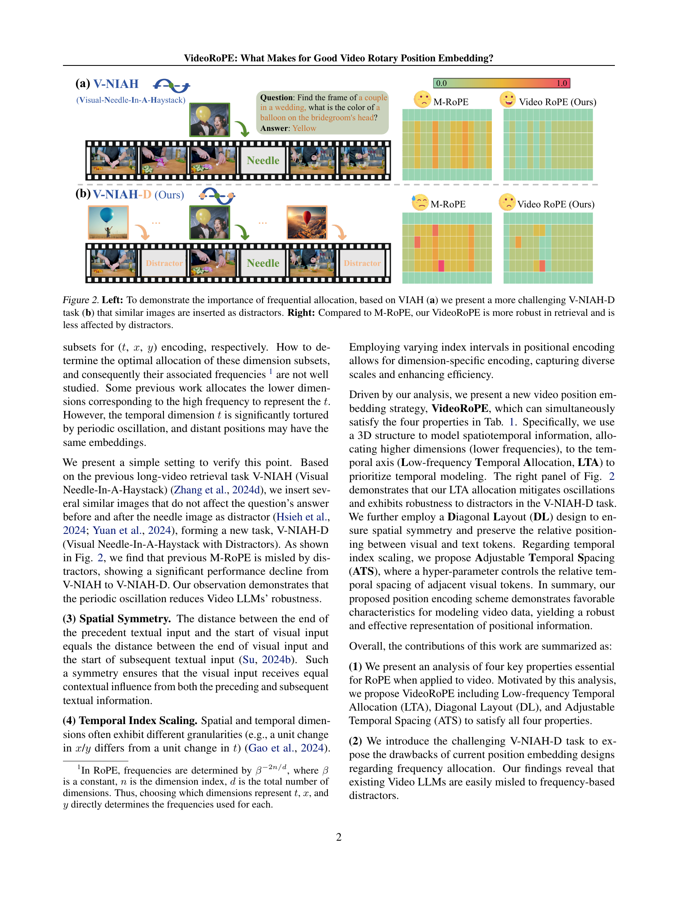

 


 2502.05173 
 Xilin Wei et el. 
 
 🤗 2025-02-10 
 



↗ arXiv


↗ Hugging Face


↗ Papers with Code


### TL;DR



기존의 Rotary Position Embedding (RoPE)는 텍스트와 같은 1차원 데이터에 효과적이지만, 비디오와 같은 복잡한 시공간 구조를 가진 데이터에는 적용하기 어려운 한계가 있습니다. 특히, 기존 RoPE 변형들은 시계열 데이터의 주기적인 변동에 취약하고, 공간적 대칭성을 유지하지 못하며, 시공간 인덱싱을 분리하지 못하는 문제점이 있습니다.  

본 연구는 이러한 문제점을 해결하기 위해, 시공간적 관계를 효과적으로 보존하는 3D 구조의 VideoRoPE를 제시합니다. VideoRoPE는 저주파수 시간 할당, 대각선 레이아웃, 조정 가능한 시간 간격을 통해 주기적 진동을 완화하고, 공간적 대칭성을 유지하며, 시공간 인덱싱을 분리합니다. 다양한 하류 작업(장기 비디오 검색, 비디오 이해, 비디오 생성)에서 VideoRoPE는 기존 RoPE 변형보다 우수한 성능을 보이며, **장기 비디오 데이터 처리 분야에 대한 중요한 기여**를 합니다.



#### Key Takeaways


 VideoRoPE는 기존의 RoPE 변형들보다 비디오 데이터의 시공간적 특징을 더 잘 보존합니다. 



 VideoRoPE는 장기 비디오 검색, 이해 및 생성 작업에서 우수한 성능을 보입니다. 



 VideoRoPE는 장기 비디오 처리 분야의 연구를 위한 새로운 방향을 제시합니다. 


#### Why does it matter?
본 논문은 **비디오 데이터에 대한 효과적인 위치 정보 임베딩 기법**을 제시함으로써, 장기 비디오 이해, 검색 및 생성 분야의 연구에 중요한 기여를 합니다. 기존 방법들의 한계를 뛰어넘는 VideoRoPE는 다양한 하류 작업에서 성능 향상을 보이며, **향후 연구를 위한 새로운 방향**을 제시합니다. 특히, 장기 비디오 데이터 처리에 대한 어려움을 해결하고 성능을 향상시키는 데 초점을 맞추어, 관련 연구자들에게 큰 영향을 미칠 것으로 예상됩니다.

------
#### Visual Insights

> 🔼 그림 1은 VideoRoPE가 다양한 비디오 벤치마크에서 기존의 RoPE 변형 모델들보다 우수한 성능을 보여주는 것을 보여줍니다.  구체적으로, VideoRoPE는 장기 비디오 검색(V-NIAH-D 포함), 비디오 이해, 그리고 비디오 생성 과제에서 다른 RoPE 모델들보다 높은 정확도를 달성했습니다. 이는 VideoRoPE의 공간-시간 관계 보존 및 주기적 진동 완화 능력을 시각적으로 보여줍니다.
> 

> 
read the caption

> Figure 1: VideoRoPE outperforms RoPE variants on benchmarks.
> 


| 2D/3DStructure | FrequencyAllocation | SpatialSymmetry | TemporalIndex Scaling |
|---|---|---|---|---|
| Vanilla RoPE (Su et al., 2024) | ✗ | ✗ | ✗ | ✗ |
| TAD-RoPE (Gao et al., 2024) | ✗ | ✗ | ✗ | ✓ |
| RoPE-Tie (Su, 2024a) | ✓ | ✗ | ✓ | ✗ |
| M-RoPE (Wang et al., 2024b) | ✓ | ✗ | ✗ | ✗ |
| VideoRoPE (Ours) | ✓ | ✓ | ✓ | ✓ |

> 🔼 표 1은 비디오 대규모 언어 모델(Video LLMs)에 대한 다양한 RoPE 변형 간의 비교를 보여줍니다.  각 RoPE 변형이 비디오 데이터의 공간적 및 시간적 구조를 얼마나 효과적으로 처리하는지를 보여주는 네 가지 주요 특징(2D/3D 구조, 주파수 할당, 공간 대칭성, 시간 색인 배율 조정)을 비교합니다.  표에서 각 RoPE 변형의 특징 여부를 확인할 수 있습니다. VideoRoPE는 이러한 모든 특징을 만족하는 새로운 비디오 위치 임베딩 방법입니다.
> 

> 
read the caption

> Table 1: Comparison between different RoPE variants for Video Large Language Models (Video LLMs).
> 

### In-depth insights

#### RoPE's Video Limits
본 논문에서 제시된 "RoPE의 비디오 한계"에 대한 심층적인 고찰은 **기존의 회전 위치 임베딩(RoPE) 기법이 비디오 데이터의 고유한 시공간적 특성을 효과적으로 포착하는 데 어려움을 겪는다는 점**을 보여줍니다. 특히, **1차원 RoPE를 3차원 비디오 데이터에 직접 적용할 경우 시공간적 관계를 제대로 반영하지 못하고 주기적인 진동에 취약**해져, 성능 저하를 초래할 수 있습니다. 이러한 한계는 단순히 비디오 프레임을 1차원으로 평탄화하여 처리하는 방식에서 기인하며, **시공간적 정보를 효과적으로 인코딩하고 주기적 진동을 완화하기 위한 새로운 구조와 전략**의 필요성을 강조합니다. 따라서, **비디오 데이터의 시공간적 특성을 보존하고, 주기적인 진동을 최소화하며, 시공간적 색인을 분리**하는 등의 개선된 RoPE 변형 기법의 개발이 중요한 연구 과제가 됩니다. 이러한 개선을 통해 비디오 이해, 검색, 생성 등 다양한 비디오 관련 작업의 성능을 향상시킬 수 있습니다.

#### VideoRoPE Design
본 논문에서 제안하는 VideoRoPE는 비디오 데이터의 시공간적 특성을 효과적으로 고려하여 설계된 새로운 위치 임베딩 기법입니다. **3D 구조**를 통해 시공간적 관계를 유지하고, **저주파수 시간 할당**으로 주기적인 진동을 완화하며, **대각선 레이아웃**으로 공간적 대칭성을 유지하고, **조정 가능한 시간 간격**으로 시간 및 공간 인덱싱을 분리합니다. 기존의 RoPE 변형들과 달리, VideoRoPE는 시계열 데이터에 국한되지 않고, 다양한 하류 작업에서 우수한 성능을 보입니다. 특히, **장시간 비디오 검색, 비디오 이해 및 비디오 환각**과 같은 작업에서 눈에 띄는 성능 향상을 보이는 것은 VideoRoPE가 **장시간 의존성**을 잘 포착하고 있음을 보여줍니다. 또한, VideoRoPE는 새로운 V-NIAH-D 과제에서 **잡음에 대한 강인성**을 보여주어,  **시간적 주기성**으로 인해 발생할 수 있는 문제를 해결하고 있음을 확인했습니다.  결론적으로, VideoRoPE의 설계는 비디오 데이터의 복잡한 특성을 고려한 섬세한 디자인을 통해 장시간 비디오 처리에 있어 높은 성능과 강건성을 보장합니다.  이는 다양한 비디오 관련 애플리케이션에 긍정적 영향을 미칠 것으로 예상됩니다.

#### Benchmark Results
본 논문의 벤치마크 결과는 제시된 VideoRoPE 모델의 우수성을 다각적으로 입증하는 데 중점을 둡니다. **다양한 비디오 이해, 검색, 환각 과제에서 기존 RoPE 변형 모델들을 상당히 능가하는 성능**을 보여주는 것은 VideoRoPE의 효과를 명확히 보여줍니다.  특히, 장문 비디오 처리 능력은 **V-NIAH-D와 같은 까다로운 과제에서도 탁월한 성능**을 나타내며,  **시간적 주기성 오류에 대한 강인성**도 엿볼 수 있습니다. 이러한 결과들은 VideoRoPE의 핵심 설계 원칙인 3D 구조, 주파수 할당, 공간 대칭성, 시간 인덱스 조정이 비디오 데이터의 복잡한 시공간적 특성을 효과적으로 포착하는 데 기여함을 보여주는 강력한 증거입니다.  **다양한 벤치마크에서 일관된 우수성**은 VideoRoPE가 단순한 성능 개선을 넘어, 비디오 이해 분야에 혁신적인 접근 방식을 제공한다는 것을 시사합니다.  **향후 연구**는 VideoRoPE의 확장성 및 다른 모달리티와의 통합 가능성에 대한 추가적인 분석을 통해 그 활용 범위를 더욱 넓히는 데 초점을 맞출 수 있을 것입니다.

#### Ablation Study
본 논문의 "절제 연구(Ablation Study)" 부분은 제안된 VideoRoPE 모델의 성능에 기여하는 각 구성 요소의 중요성을 밝히는 데 중점을 둡니다. **각 구성 요소(저주파수 시간 할당, 대각선 배치, 조정 가능한 시간 간격)**를 순차적으로 제거하여 모델 성능 변화를 정량적으로 분석함으로써, 각 요소의 독립적인 효과와 상호 작용을 명확히 규명합니다.  이를 통해 **VideoRoPE의 핵심 강점**을 객관적으로 입증하고, 단순히 최종 성능 비교를 넘어 모델 설계의 합리성 및 효율성을 심도 있게 검증합니다.  **실험 결과**는 각 구성 요소가 모델 성능에 미치는 영향을 명확하게 제시하며, 특히 저주파수 시간 할당과 대각선 배치의 중요성을 강조합니다.  **결론적으로**,  절제 연구는 VideoRoPE 모델의 우수성을 뒷받침하는 중요한 근거를 제시하며, 향후 비디오 처리 모델 개발에 대한 귀중한 통찰력을 제공합니다.  **추가적으로**,  다양한 하이퍼파라미터(예: 시간 간격 조정)에 대한 추가적인 절제 실험을 통해 최적의 모델 구성을 도출하고,  모델의 일반화 성능 및 견고성을 높이는 데 기여할 수 있습니다.

#### Future Works
본 논문에서 제시된 VideoRoPE는 비디오 데이터에 대한 효과적인 위치 임베딩을 제공하지만, **향후 연구를 통해 개선될 여지가 많습니다.**  먼저, 다양한 비디오 길이와 복잡성에 대한 VideoRoPE의 일반화 성능을 더욱 향상시키는 연구가 필요합니다.  **매우 긴 비디오나 다양한 해상도의 비디오에 대한 적용성을 높이는 연구**가 중요합니다. 또한, VideoRoPE의 계산 비용을 줄이는 효율적인 알고리즘 개발도 중요한 과제입니다. 현재 VideoRoPE는 계산량이 다소 많기 때문에, **더욱 경량화된 모델을 개발**하여 실시간 처리가 가능하도록 하는 연구가 필요합니다.  **다른 모달리티와의 통합** 또한 고려해야 할 부분입니다. VideoRoPE를 오디오, 텍스트 등 다른 모달리티와 결합하여 더욱 풍부한 다중 모달 정보 처리를 가능하게 하는 연구가 필요합니다. 마지막으로, **VideoRoPE의 이론적 토대를 더욱 깊이 있게 연구**하여, VideoRoPE의 성능 우수성을 뒷받침하는 이론적인 설명을 제공하는 연구가 필요합니다.  이러한 향후 연구를 통해 VideoRoPE의 성능과 적용 범위가 더욱 확장될 수 있을 것이며, 비디오 이해 분야에 대한 중요한 기여를 할 것으로 예상됩니다.

### More visual insights

More on figures

> 🔼 그림 2는 주요한 주파수 할당의 중요성을 보여주는 그림입니다. 왼쪽은 기존의 V-NIAH(Visual Needle-In-A-Haystack) 작업과 새롭게 제안된 V-NIAH-D 작업을 보여줍니다. V-NIAH-D 작업에서는 비슷한 이미지들이 방해 요소로 추가되었습니다. 오른쪽은 M-RoPE와 비교하여 VideoRoPE가 검색 작업에서 더욱 견고하며 방해 요소의 영향을 덜 받는다는 것을 보여줍니다.  즉, 비슷한 이미지들이 많이 포함된 어려운 상황에서도 VideoRoPE가 정확하게 '바늘' 이미지를 찾아내는 성능이 더 뛰어나다는 것을 시각적으로 보여주는 그림입니다.
> 

> 
read the caption

> Figure 2: Left: To demonstrate the importance of frequential allocation, based on VIAH (a) we present a more challenging V-NIAH-D task (b) that similar images are inserted as distractors. Right: Compared to M-RoPE, our VideoRoPE is more robust in retrieval and is less affected by distractors.
> 

> 🔼 그림 3은 주의 집중 기반 주파수 할당 분석 결과를 보여줍니다. M-ROPE의 경우, 시간적 차원(t)이 지역적 정보에만 제한되어 대각선 레이아웃이 생성되는 반면, VideoROPE는 시간적 차원을 효과적으로 활용하여 바늘 이미지를 검색합니다. x 및 y 좌표는 비디오 프레임 번호(예: 50 프레임의 경우 50)를 나타냅니다. 자세한 내용은 부록 E를 참조하십시오.
> 

> 
read the caption

> Figure 3: Attention-based frequential allocation analysis. Middle: M-RoPE’s temporal dimension (t𝑡titalic_t) is limited to local information, resulting in a diagonal layout. Bottom: VideoRoPE effectively retrieves the needle using the temporal dimension. The x and y coordinates represent the video frame number, e.g., 50 for 50 frames. For more details see Appendix E.
> 

> 🔼 이 그림은 논문의 4장 VideoRoPE에서 M-RoPE의 시간적 주파수 할당 방식을 보여줍니다. M-RoPE는 시간적 의존성을 모델링하기 위해 처음 16개의 회전 각도를 사용하는데, 이는 더 높은 주파수와 더 두드러진 진동을 나타냅니다. 이 그림은 M-RoPE가 시간적 의존성을 모델링하는 방식을 시각적으로 보여주는 그래프를 포함하고 있습니다. 그림에서 y축은 주파수를, x축은 토큰 색인을 나타냅니다. M-RoPE의 시간적 주파수 할당 방식이 어떻게 주기적인 진동을 야기하는지 그리고 이것이 어떻게 distractor에 의해 모델이 오도될 수 있는지를 보여줍니다.
> 

> 
read the caption

> (a) Temporal Frequency Allocation in M-RoPE
> 

> 🔼 그림 (b)는 본 논문에서 제안하는 VideoRoPE의 시간적 주파수 할당 방식을 보여줍니다. 기존의 M-ROPE와 달리 VideoRoPE는 시간적 의존성을 모델링하기 위해 고주파수가 아닌 저주파수 회전 각도를 사용합니다. 이는 주기적인 진동을 완화하고, V-NIAH-D 작업에서 방해 요소의 오류를 줄이는 데 효과적입니다. 그림은 시간 주파수 할당 방식을 시각적으로 보여주는 그래프와 함께, 저주파수 할당을 통해 주기적인 진동이 감소하고, V-NIAH-D 작업에서 방해 요소에 대한 강건성이 향상되는 것을 보여줍니다.
> 

> 
read the caption

> (b) Temporal Frequency Allocation in VideoRoPE (ours)
> 

> 🔼 그림 4는 M-ROPE와 VideoROPE의 주파수 할당 전략을 비교하여 보여줍니다. (a) M-ROPE는 높은 주파수와 더 두드러진 진동을 보이는 처음 16개의 회전 각도를 사용하여 시간적 의존성을 모델링합니다. 이는 V-NIAH-D에서 방해 요소의 오해의 소지가 있는 영향을 받기 쉽습니다. (b) 반대로 VideoROPE는 훨씬 더 넓고 단조로운 간격으로 특징지어지는 마지막 16개의 회전 각도를 사용하여 시간적 의존성을 모델링합니다. VideoROPE의 주파수 할당 전략은 V-NIAH-D에서 방해 요소로 인한 오해의 소지가 있는 영향을 효과적으로 완화합니다. 자세한 분석은 부록 F를 참조하십시오.
> 

> 
read the caption

> Figure 4: (a) M-RoPE (Wang et al., 2024b) models temporal dependencies using the first 16 rotary angles, which exhibit higher frequencies and more pronounced oscillations. (b) In contrast, VideoRoPE models temporal dependencies using the last 16 rotary angles, characterized by significantly wider, monotonic intervals. Our frequency allocation effectively mitigates the misleading influence of distractors in V-NIAH-D. For a more detailed analysis, please refer to Appendix F.
> 

> 🔼 이 그림은 세 가지 다른 위치 임베딩 방법(Vanilla RoPE, M-ROPE, VideoRoPE)을 비교하여 인접한 토큰 간의 관계를 보여줍니다.  Vanilla RoPE는 텍스트 토큰에 대해 1차원 구조를 사용하는 반면, M-ROPE는 비디오 토큰에 대해 3차원 구조(시간, 수평, 수직)을 사용합니다. VideoRoPE는 공간적 대칭성을 유지하고 시간적 색인을 분리하기 위해 3차원 구조와 교차된 공간-시간적 레이아웃을 사용합니다.  각 행은 세 가지 방법을 사용한 인접한 토큰(텍스트 또는 비디오 프레임)들의 위치 임베딩을 표현하며, 이를 통해 각 방법의 특징과 장단점을 시각적으로 비교할 수 있습니다.
> 

> 
read the caption

> Figure 5: The position embeddings of adjacent text tokens for Vanilla RoPE (top row), the corresponding visual tokens in adjacent frames for M-RoPE (middle row) and our VideoRoPE (bottom row) with interleaved spatial and temporal last design.
> 

> 🔼 이 그림은 Vanilla RoPE의 3차원 구조를 시각적으로 보여줍니다. Vanilla RoPE는 기존의 1차원 RoPE를 확장하여 3차원 공간 정보를 처리하기 위해 고안되었습니다. 그림에서는 시간, 수평, 수직 축을 따라 색상 변화를 통해  Vanilla RoPE의 위치 인코딩 방식을 보여줍니다.  세 축의 좌표는 각각 시간, 수평, 수직 위치를 나타내며, 색상은 위치 인코딩 값을 시각적으로 표현합니다. 이 그림을 통해 Vanilla RoPE가 3차원 공간 정보를 어떻게 처리하는지 이해할 수 있습니다.
> 

> 
read the caption

> (a) 3D visualization for Vanilla RoPE.
> 

> 🔼 그림 (b)는 M-RoPE의 3차원 시각화를 보여줍니다. M-RoPE는 시간, 수평, 수직 차원을 각각 다른 색상으로 표현하여, 비디오 데이터의 시공간적 관계를 3차원으로 표현합니다. 이를 통해 M-RoPE가 시간적 흐름과 공간적 배치를 동시에 고려하여 비디오 데이터를 이해하는 방식을 시각적으로 보여줍니다. 특히, 색상의 변화는 각 차원의 상대적 중요도 및 상호 작용을 나타냅니다.  M-RoPE가 시공간 정보를 어떻게 처리하고 표현하는지 이해하는 데 도움이 됩니다.
> 

> 
read the caption

> (b) 3D visualization for M-RoPE.
> 

> 🔼 그림 6(c)는 VideoRoPE의 3차원 구조를 시각적으로 보여줍니다. 기존의 1차원 RoPE와 달리 VideoRoPE는 시간, 가로, 세로 차원을 모두 고려하여 3차원 공간에서의 상대적 위치 정보를 효과적으로 표현합니다. 이를 통해 VideoRoPE는 비디오 데이터의 시공간적 특징을 보다 정확하게 포착하고, 장기간의 시공간적 의존성을 효과적으로 모델링할 수 있습니다. 그림에서 볼 수 있듯이, VideoRoPE는 각 차원의 색인이 일정하게 증가하는 모습을 보여주어, 공간적 대칭성을 유지하고 시간적 간격을 조절하는 VideoRoPE의 특징을 시각적으로 확인할 수 있습니다.
> 

> 
read the caption

> (c) 3D visualization for VideoRoPE.
> 

> 🔼 그림 6은 세 가지 다른 위치 임베딩 방법(Vanilla RoPE, M-RoPE, VideoRoPE)에 대한 3차원 시각화를 보여줍니다. Vanilla RoPE는 공간 모델링을 고려하지 않은 1차원 구조를 가지고 있습니다. 반면 M-RoPE는 3차원 구조를 가지지만, 프레임 간 시각 토큰의 색인 증가에 불일치가 있어 일부 색인이 일정하게 유지됩니다. VideoRoPE는 Vanilla RoPE의 일관된 색인 증가 패턴을 유지하면서 동시에 공간 모델링을 통합하여 이러한 문제를 해결합니다. 이를 통해 VideoRoPE가 공간 및 시간 정보를 효과적으로 나타낼 수 있음을 보여줍니다.
> 

> 
read the caption

> Figure 6: The 3D visualization for different position embedding. (a) The vanilla 1D RoPE (Su et al., 2024) does not incorporate spatial modeling. (b) M-RoPE (Wang et al., 2024b), while have the 3D structure, introduces a discrepancy in index growth for visual tokens across frames, with some indices remaining constant. (c) In contrast, our VideoRoPE achieves the desired balance, maintaining the consistent index growth pattern of vanilla RoPE while simultaneously incorporating spatial modeling.
> 

> 🔼 그림 7은 V-NIAH와 V-NIAH-D 작업에 대한 검색 결과를 시각화한 것입니다. 초록색에서 빨간색으로의 색상 변화는 완벽한 성능에서 0에 이르는 바늘 검색 성능의 변화를 나타냅니다. V-NIAH는 방해 요소가 없는 기존의 비디오 검색 작업이고, V-NIAH-D는 주기적으로 방해 요소가 추가된 더욱 어려운 작업입니다. 이 그림은 다양한 RoPE 변형의 성능을 비교하여 제안된 VideoRoPE의 강력한 로버스트니스를 보여줍니다.
> 

> 
read the caption

> Figure 7: Visualization of the retrieval results for V-NIAH and V-NIAH-D. The color gradient from green to red represents the progression of needle retrieval performance, from perfect to zero.
> 

More on tables


| Method | LongVideoBench |  |  |  | MLVU |  |  |  | Video-MME |  |  |  |
|---|---|---|---|---|---|---|---|---|---|---|---|---|
|  | 8k | 16k | 32k | 64k | 8k | 16k | 32k | 64k | 8k | 16k | 32k | 64k |
| Vanilla RoPE (Su et al., 2024) | 54.97 | 54.87 | 54.56 | 54.04 | 63.31 | 65.79 | 65.93 | 62.02 | 60.67 | 60.00 | 61.33 | 58.33 |
| TAD-RoPE (Gao et al., 2024) | 54.14 | 55.08 | 53.94 | 53.42 | 63.67 | 65.28 | 65.28 | 60.73 | 60.33 | 61.33 | 62.00 | 58.67 |
| M-RoPE (Wang et al., 2024b) | 53.42 | 52.80 | 53.11 | 54.35 | 60.41 | 60.68 | 61.56 | 61.10 | 60.67 | 59.67 | 61.00 | 59.67 |
| VideoRoPE (Ours) | 54.46 | 55.29 | 57.15 | 57.26 | 65.19 | 66.29 | 66.02 | 65.56 | 61.33 | 61.00 | 61.67 | 61.33 |
> 🔼 표 2는 LongVideoBench, MLVU, Video-MME 세 가지 벤치마크에서 다양한 RoPE 방법의 성능을 비교한 표입니다. 세 가지 벤치마크 모두 8k, 16k, 32k, 64k 네 가지 문맥 길이에 대해 평가되었으며, 8k는 훈련 범위 내 문맥을, 나머지는 훈련 범위 밖 문맥을 나타냅니다. VideoRoPE는 세 가지 벤치마크 모두에서 다른 RoPE 변형보다 성능이 뛰어났으며, 최고 성적은 굵게 표시하고, 두 번째로 높은 성적은 밑줄로 표시했습니다. 평가에 대한 자세한 내용은 부록 B를 참조하십시오.
> 

> 
read the caption

> Table 2: Comparison of different RoPE methods on LongVidionBench, MLVU, and Video-MME. The benchmarks evaluate performance across three context lengths: 8k, 16k, 32k, and 64k, where 8k represents context within the training range, and others represent context outside the training range. Our VideoRoPE outperforms other RoPE variants across all three benchmarks. The best results are marked in bold, and the second-best results are underlined. For more information on the evaluation, see Appendix B.
> 


| Method | V-NIAH Acc. | V-NIAH-D Acc. |
|---|---|---|
| Vanilla RoPE (Su et al., 2024) | 31.78 | 30.22 |
| TAD-RoPE (Gao et al., 2024) | 29.33 | 29.56 |
| M-RoPE (Wang et al., 2024b) | 78.67 | 74.67 |
| VideoRoPE | 91.11 | 87.11 |
> 🔼 표 3은 V-NIAH(Visual Needle-In-A-Haystack)와 V-NIAH-D(V-NIAH with Distractors) 작업에서 다양한 RoPE(Rotary Position Embedding) 변형의 성능을 비교한 표입니다. V-NIAH-D는 V-NIAH에 주기적인 방해 요소를 추가하여 어려움을 더한 작업입니다.  표는 각 RoPE 변형에 대한 정확도(Acc.)를 건초더미 길이와 프레임 깊이에 따라 평균하여 보여줍니다.  즉, 각 RoPE 기법이 얼마나 효과적으로 비디오 내에서 목표 프레임을 찾아내는지, 그리고 방해 요소가 있을 때도 성능을 유지하는지 평가한 결과입니다.
> 

> 
read the caption

> Table 3:  Performance comparison of different RoPEs on V-NIAH and V-NIAH-D. “Acc.” refers to the average accuracy across haystack length and frame depth.
> 


| Method | OR | T | SD | F | NF | Avg. |
|---|---|---|---|---|---|---|
| Vanilla RoPE (Su et al., 2024) | 51.5 | 30.0 | 48.0 | 8.0 | 43.0 | 36.1 |
| TAD-RoPE (Gao et al., 2024) | 51.0 | 37.0 | 48.0 | 11.5 | 47.5 | 39.0 |
| M-RoPE (Wang et al., 2024b) | 39.0 | 29.0 | 43.5 | 12.5 | 47.5 | 34.3 |
| VideoRoPE | 57.0 | 58.5 | 50.5 | 15.0 | 50.0 | 46.2 |
> 🔼 표 4는 VideoHallucer 벤치마크에서 8k, 16k, 32k, 64k의 네 가지 상황 길이에 대해 다양한 RoPE(Rotary Position Embedding) 방법들의 성능을 비교한 것입니다. 각 RoPE 변형에 대한 최대 결과값을 표에 나타내었고, 최고점은 굵게, 두 번째로 높은 점수는 밑줄을 그어 표시했습니다. OR은 객체 관계, T는 시간적, SD는 의미적 세부 사항, F는 사실적, NF는 비사실적을 나타냅니다. 이 표는 각 RoPE 기법이 VideoHallucer의 다양한 하위 작업(객체 관계, 시간적, 의미적 세부 사항, 사실적, 비사실적)에서 어느 정도의 성능을 보이는지 비교하여, 각 기법의 강점과 약점을 보여줍니다.
> 

> 
read the caption

> Table 4: Performance comparison of different RoPEs on VideoHallucer, evaluated at context lengths of 8k, 16k, 32k, and 64k. The maximum result for each RoPE variant across these context lengths is displayed, with bold for the top result and underlined for the second-highest. ‘OR’ = Object-Relation, ‘T’ = Temporal, ‘SD’ = Semantic Detail, ‘F’ = Factual, ‘NF’ = Non-factual.
> 


| Method | LongVideoBench |  |  |  | MLVU |  |  |  |
|---|---|---|---|---|---|---|---|---|
|  | 8k | 16k | 32k | 64k | 8k | 16k | 32k | 64k |
| Baseline | 53.42 | 52.80 | 53.11 | 54.35 | 60.41 | 60.68 | 61.56 | 61.10 |
| + DL | 52.17 | 52.07 | 53.31 | 53.63 | 62.06 | 63.03 | 62.52 | 62.75 |
| + DL & LTA | **54.46** | **55.49** | 54.66 | 55.60 | 63.35 | 64.09 | 64.00 | 63.26 |
| + DL & LTA & ATS | **54.46** | 55.29 | **57.15** | **57.26** | **65.19** | **66.29** | **66.02** | **65.56** |
> 🔼 표 5는 VideoRoPE의 성능에 대한 ablation study 결과를 보여줍니다.  VideoRoPE 모델의 구성 요소인 Diagonal Layout(DL), Low-frequency Temporal Allocation(LTA), Adjustable Temporal Spacing(ATS) 세 가지 모듈을 각각 추가하면서 Long VideoBench와 MLVU 벤치마크에서의 성능 변화를 보여줍니다.  각 모듈이 성능 향상에 얼마나 기여하는지 정량적으로 분석하여 VideoRoPE의 효과적인 구성 요소들을 확인할 수 있습니다.
> 

> 
read the caption

> Table 5: Ablation study about different modules of VideoRoPE.
> 


| Scaling Factor \bm{δ} | LongVideoBench | LongVideoBench | LongVideoBench | LongVideoBench | Average |
|---|---|---|---|---|---| 
|  | 8k | 16k | 32k | 64k |  |
|---|---|---|---|---|---| 
| 0.5 | 51.92 | 53.52 | 52.80 | 52.07 | 52.57 |
| 1.0 | **54.46** | **55.49** | 54.66 | 55.60 | 55.05 |
| 1.5 | 54.35 | 55.00 | 55.31 | 55.91 | 55.14 |
| 2.0 | **54.46** | 55.29 | **57.15** | **57.26** | **56.04** |
| 2.5 | 53.42 | 53.73 | 54.25 | 55.08 | 54.12 |
| 3.0 | 53.63 | 53.63 | 53.63 | 55.18 | 54.01 |
> 🔼 표 6은 비디오 데이터에 대한 RoPE(Rotary Position Embedding)의 시간적 색인 조정에 사용되는 스케일링 계수(δ)의 영향을 보여줍니다.  LongVideoBench 벤치마크를 사용하여 다양한 δ 값(0.5에서 3.0까지 0.5 간격)에서의 성능을 평가합니다.  각 δ 값에 대한 8k, 16k, 32k, 64k의 네 가지 문맥 길이에 따른 성능이 표시되며, 마지막 열은 평균 성능을 나타냅니다. 이 표는 최적의 시간적 색인 조정을 위한 δ 값을 결정하는 데 도움을 줍니다.  즉, RoPE가 비디오 데이터의 시공간적 관계를 얼마나 잘 학습하는지 보여주는 실험 결과를 요약한 표입니다.
> 

> 
read the caption

> Table 6: Ablation Study About Different Scaling Factor δ𝛿\deltaitalic_δ.
> 


| Method | LongVideoBench |  |  |  | MLVU |  |  |  | 
|---|---|---|---|---|---|---|---|---| 
|  | 8k | 16k | 32k | 64k | 8k | 16k | 32k | 64k | 
| VideoRoPE(Sequential) | 53.73 | 53.52 | 54.97 | 54.77 | 62.75 | 63.31 | 62.75 | 63.08 | 
| VideoRoPE (Interleaved) | 54.46 | 55.29 | 57.15 | 57.26 | 65.19 | 66.29 | 66.02 | 65.56 |
> 🔼 표 7은 VideoRoPE에서 공간 차원 할당 전략(x, y)의 영향을 비교 분석한 결과를 보여줍니다.  VideoRoPE (순차적)은 x, x, x, ..., y, y, y, ... 와 같이 순차적으로 x와 y를 할당하는 방식(Wang et al., 2024b와 유사)을, VideoRoPE (교차적)은 x, y, x, y, ... 와 같이 x와 y를 교차적으로 할당하는 방식(Agrawal et al., 2024와 유사)을 나타냅니다.  두 방식의 성능 차이를 통해 공간 차원 할당 전략의 중요성과 VideoRoPE의 효율성을 확인할 수 있습니다.
> 

> 
read the caption

> Table 7: Ablation Study on x𝑥xitalic_x, y𝑦yitalic_y Allocation. VideoRoPE (Sequential) represents the sequential allocation of x𝑥xitalic_x and y𝑦yitalic_y, following the pattern x,x,x,…,y,y,y,…𝑥𝑥𝑥…𝑦𝑦𝑦…x,x,x,\dots,y,y,y,\dotsitalic_x , italic_x , italic_x , … , italic_y , italic_y , italic_y , … (similar to M-RoPE (Wang et al., 2024b)). VideoRoPE (Interleaved) represents the interleaved allocation, following the pattern x,y,x,y,…𝑥𝑦𝑥𝑦…x,y,x,y,\dotsitalic_x , italic_y , italic_x , italic_y , … (similar to Agrawal et al. (2024)).
> 


| Method | LongVideoBench |  | 
|---|---|---| 
|  | 64k | 128k | 
| Vanilla RoPE (Su et al., 2024) | 54.04 | 48.01 | 
| TAD-RoPE (Gao et al., 2024) | 53.42 | 45.77 | 
| M-RoPE (Wang et al., 2024b) | 54.35 | 51.45 | 
| VideoRoPE | 57.26 | 55.64 | 
> 🔼 표 8은 다양한 방법을 사용하여 64k 및 128k 문맥 길이에서 모델 성능을 비교한 결과를 보여줍니다.  각 방법에 대해 64k와 128k 문맥 길이에서 LongVideoBench 성능 점수를 제시합니다. 이 표는 모델이 매우 긴 비디오를 처리하는 능력, 특히 훈련 데이터셋의 문맥 길이를 벗어나는 매우 긴 문맥을 처리하는 능력을 평가하는 데 도움이 됩니다.  128k에서의 성능 저하 정도를 비교하여 모델의 외삽(extrapolation) 능력을 보여줍니다.
> 

> 
read the caption

> Table 8: Comparison of model performance at 64k and 128k context lengths for different methods.
> 

### Full paper



