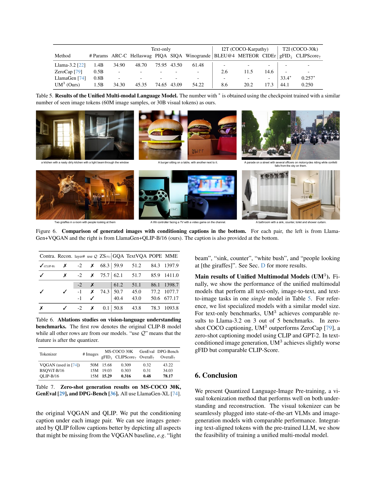
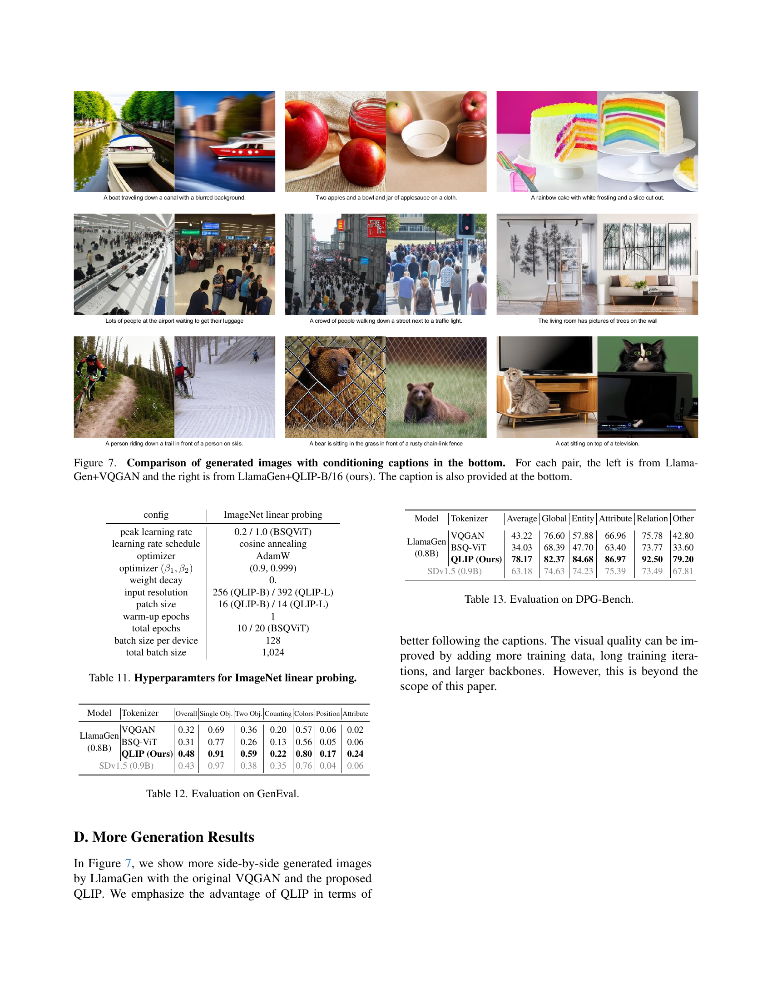

 


 2502.05178 
 Yue Zhao et el. 
 
 🤗 2025-02-10 
 



↗ arXiv


↗ Hugging Face


↗ Papers with Code


### TL;DR



기존의 멀티모달 모델들은 **시각적 정보를 효과적으로 처리하고 텍스트 정보와 통합하는 데 어려움**을 겪었습니다. 특히, 이미지를 의미있는 시각적 토큰으로 변환하는 과정에서 **시각적 재구성과 의미적 이해 간의 균형**을 맞추는 것이 어려웠습니다.  이러한 문제는 **모델의 성능 저하**로 이어지고, **다양한 모달리티 간의 통합적인 이해 및 생성**을 어렵게 만들었습니다.

본 논문에서는 **QLIP(Quantized Language-Image Pretraining)**이라는 새로운 시각적 토큰화 기법을 제시합니다. QLIP는 **이미지 재구성과 텍스트-이미지 정렬을 동시에 고려**하여 두 목표 간의 균형을 효과적으로 맞춥니다.  **두 단계의 학습 과정**을 통해 대용량 데이터 학습의 요구사항과 재구성 목표에 따른 메모리 제약을 동시에 해결합니다.  실험 결과, QLIP은 기존 모델들보다 **이미지 재구성 및 제로샷 이미지 이해 성능**이 뛰어나며, **통합된 멀티모달 모델**을 구축하여 다양한 모달리티 간의 이해와 생성을 효과적으로 수행함을 보여줍니다.



#### Key Takeaways


 QLIP은 최첨단 이미지 재구성 품질과 제로샷 이미지 이해 성능을 결합한 시각적 토큰화 기법을 제시합니다. 



 두 가지 목표(재구성과 언어-이미지 정렬) 간의 균형을 동적으로 조절하는 새로운 학습 전략을 통해 효과적인 멀티모달 학습을 실현합니다. 



 단일 모델로 멀티모달 이해와 텍스트 조건부 이미지 생성을 수행하며, 기존 모델 대비 성능을 향상시켰습니다. 


#### Why does it matter?
이 논문은 **다양한 모달리티(텍스트, 이미지)를 통합적으로 이해하고 생성하는 새로운 방법론**을 제시하여 멀티모달 연구에 중요한 발전을 가져왔습니다. **텍스트와 이미지 간의 정렬을 위한 새로운 시각적 토큰화 기법**을 통해 기존의 한계를 극복하고, **통합된 오토리그레시브 모델**을 제시함으로써 향후 연구의 새로운 방향을 제시합니다.  이 연구는 **더욱 효율적이고 강력한 멀티모달 모델 개발**을 위한 기반을 마련하고, 관련 분야 연구의 새로운 가능성을 열어줍니다.

------
#### Visual Insights

> 🔼 그림 1은 최첨단 시각 토큰화 기법들이 영상 이해(높은 제로샷 정확도, 예: SigLIP [96]) 또는 영상 재구성(낮은 FID, 예: MAGVIT2 [93]) 중 하나에만 탁월하다는 것을 보여줍니다. 두 가지 모두에서 뛰어난 성능을 보이는 기법은 드물었습니다.  QLIP는 영상 이해와 재구성 모두에서 우수한 성능을 보이며, 성능 저하가 미미하여 다양한 모드를 통합하는 모델 개발에 새로운 가능성을 제시합니다.
> 

> 
read the caption

> Figure 1: State-of-the-art visual tokenizers excel at either understanding (high zero-shot accuracy, e.g. SigLIP [96]) or reconstruction (low reconstruction FID, e.g. MAGVIT2 [93]), but not both. QLIP can perform well on both understanding and reconstruction with a marginal performance drop, opening up an opportunity for unified multi-modal understanding and generation.
> 


| Dataset | Images | Text (# tok/src) | Usage/Metrics |
|---|---|---|---| 
| DataComp-1B [27] | 1B | 20B/alt-text | QLIP |
| LAION-COCO [67]2 <a href="hf.co/datasets/guangyil/laion-coco-aesthetic">hf.co/datasets/guangyil/laion-coco-aesthetic</a> | 4M/600M | 40M/BLIP2 | T2I (LlamaGen), UM3 |
| SA-1B [41] | 11M | 400M/Qwen2VL-7B | T2I (LlamaGen), UM3 |
| CC-12M [9] | 6M/12M | 200M/Qwen2VL-7B | UM3 |
| DCLM [45] | - | 300B/raw+filtered | UM3 |
| LAION-CC-SBU [51] | 558K | -/BLIP2 | VLM (LLaVA-1.5) |
| LLaVA-Instruct [51] | 665K | -/convo. | VLM (LLaVA-1.5) |
| ImageNet [20] | 1.3M | -/label | Classi. (ZS), Recon. (RC) |
| MS-COCO [48, 11] | 160K | 10M/MTurk | Caption, generation |

> 🔼 이 표는 논문 전체에서 사용된 데이터셋의 통계를 요약하여 보여줍니다.  데이터셋의 이름, 이미지 수, 소스별 텍스트 토큰 수, 각 데이터셋의 용도(이미지 분류, 캡션 생성, 이미지-텍스트 쌍 학습 등)를 포함합니다.  본 논문에서 사용된 대규모 이미지-텍스트 데이터셋의 규모와 다양성을 파악하는 데 유용합니다.
> 

> 
read the caption

> Table 1: Dataset summary. We list the statistics of datasets used throughout the paper, including the number of images, the number of text tokens with source, and the usage of the respective dataset.
> 

### In-depth insights

#### Unified Multimodal Model
본 논문에서 제시된 "통합 다중 모달 모델"은 **텍스트와 이미지를 단일 토큰 공간 내에서 처리**하여 언어 이해와 이미지 생성 작업을 통합하는 혁신적인 접근 방식을 제시합니다. 기존의 별도의 텍스트 인코더와 이미지 인코더를 사용하는 방식과 달리, **텍스트 정렬된 시각적 토큰화 기법**을 통해 이미지를 의미론적으로 풍부하게 표현하는 시각적 토큰으로 변환합니다. 이를 통해, **단일 오토 회귀 모델**에서 다양한 다중 모달 작업 (언어 전용, 이미지-텍스트, 텍스트-이미지)을 수행할 수 있습니다.  **두 가지 목표 (재구성과 정렬) 간의 균형**을 동적으로 조절하는 훈련 전략과 메모리 효율적인 2단계 훈련 파이프라인을 통해, 모델의 성능을 향상시키고 훈련 과정을 효율화합니다.  **대규모 데이터셋을 활용한 사전 학습**과 추가적인 미세 조정을 통해, 다양한 벤치마크에서 기존 최고 성능 모델들과 비교하여 우수한 결과를 보여줍니다. 특히, 영상 이해와 생성 작업 모두에서 뛰어난 성능을 보이며, **통합된 다중 모달 아키텍처의 효율성과 실용성**을 입증합니다.  **결론적으로, 제시된 모델은 다중 모달 이해와 생성의 패러다임 변화를 가져올 잠재력**을 가지고 있습니다.

#### Visual Tokenization
본 논문에서 'Visual Tokenization'은 이미지를 이산적인 토큰으로 변환하는 과정을 의미하며, **이미지 이해 및 생성 모델의 성능에 중요한 영향**을 미칩니다. 기존의 방법들은 재구성 품질과 영상 이해 능력 사이에서 균형을 맞추는 데 어려움을 겪었으나, **본 연구는 두 목표 간의 상충관계를 해소**하고, **텍스트 정렬 기반의 이진 구면 양자화 오토인코더**를 통해 양쪽 모두에서 우수한 성능을 달성합니다. 이는 **두 가지 손실 함수(재구성 손실과 대조 학습 손실)을 역동적으로 조정**하는 훈련 전략과, 메모리 병목 현상을 완화하는 **두 단계 훈련 과정**을 통해 가능해졌습니다.  **QLIP(Quantized Language-Image Pretraining)는 단일 모델에서 다양한 시각적 과제를 수행**하며, 기존 모델들과 비교하여 성능 향상 또는 동등한 수준의 성능을 보여줍니다.

#### Two-Stage Training
본 논문에서 제안하는 두 단계 학습 방식은 **메모리 효율적인 트랜스포머 아키텍처**를 활용하여 대용량 배치 학습이 필요한 이미지-텍스트 정렬 목표와 메모리 제약이 있는 재구성 목표 간의 상충 관계를 효과적으로 해결합니다. 1단계에서는 정렬 손실과 MSE 손실을 결합하여 학습하고, 2단계에서는 텍스트 인코더를 제거하고 시각적 인코더를 고정하여 대용량 배치 학습의 제약을 완화시킵니다. 이러한 전략은 **메모리 부족 문제**를 해결하고, **모델의 성능을 향상**시키는 데 기여합니다. 두 단계 학습은 이미지 언어 사전 학습의 대용량 배치 요구사항과 재구성 목표에 따른 메모리 병목 현상을 효과적으로 조화시켜 **단일 모델**로 다양한 멀티모달 이해 및 텍스트 조건 이미지 생성 작업에 활용될 수 있음을 보여줍니다. 특히, QLIP는 기존 시각적 인코더를 대체하여 **성능 저하 없이** 또는 오히려 **향상된 성능**을 보여줍니다.  **효율성과 성능** 모두를 고려한 이러한 접근 방식은 멀티모달 모델 학습에 새로운 가능성을 제시합니다.

#### Ablation Studies
본 논문의 ablation study는 **QLIP 모델의 성능에 영향을 미치는 요소들을 체계적으로 분석**하여 모델의 강점과 약점을 파악하고, 향후 개선 방향을 제시하는 데 중점을 둡니다.  특히, **두 가지 손실 함수(대조 손실과 재구성 손실)의 가중치 조절**, **두 단계 학습 전략의 효과**, 그리고 **시각적 인코더 초기화 방식**의 영향 등을 면밀히 조사합니다.  실험 결과를 통해 **손실 함수 가중치의 적절한 균형**이 중요하며, 단순히 재구성 품질만을 높이는 것보다 **대조 손실을 통해 의미론적 정보를 효과적으로 학습**하는 것이 중요함을 보여줍니다.  또한, 두 단계 학습 전략은 메모리 효율성을 높이고 성능 저하 없이 고품질의 이미지 재구성을 가능하게 합니다.  **초기화 전략** 역시 중요한 요소로,  적절한 초기화를 통해 학습 속도를 향상시키고 최종 성능을 개선할 수 있습니다.  이러한 ablation study는 **QLIP 모델의 설계 및 학습 과정의 개선**에 대한 귀중한 통찰력을 제공하며,  향후 유사한 다중 모달 모델 개발에 중요한 지침을 제시할 것으로 예상됩니다.

#### Future Directions
본 논문의 "미래 방향"에 대한 심층적인 고찰은 다음과 같습니다. **QLIP 토크나이저의 확장성 및 효율성 향상**은 중요한 과제입니다. 더 큰 이미지와 더욱 복잡한 시각적 정보를 처리할 수 있도록 아키텍처를 개선하고, 메모리 사용량을 최소화하면서 속도를 높이는 연구가 필요합니다. **다양한 모달리티 통합**을 위한 연구도 중요합니다. 텍스트와 이미지 외에도 오디오, 비디오 등 다른 모달리티를 통합하여 보다 포괄적인 멀티모달 이해 및 생성 모델을 개발하는 것이 필요하며, 이를 위한 효과적인 토크나이저 및 아키텍처 설계가 관건입니다. **훈련 데이터 및 평가 지표 개선** 또한 중요합니다.  더욱 다양하고 고품질의 훈련 데이터 확보 및 다양한 멀티모달 과제를 포괄하는 평가 지표 개발을 통해 모델 성능을 더욱 정확하게 평가하고 개선할 수 있습니다. **실제 응용 분야 확장**을 위해, QLIP 토크나이저를 다양한 실제 응용 분야에 적용하고 그 성능을 검증하는 연구가 필요합니다. 예를 들어, 이미지 검색, 이미지 생성, 질의응답 시스템 등 다양한 분야에서 QLIP 토크나이저의 실용성을 검증하는 연구가 중요합니다.  마지막으로, **윤리적 및 사회적 고려**는 빼놓을 수 없습니다.  강력한 멀티모달 모델 개발 과정에서 발생할 수 있는 편향성, 프라이버시 침해, 악용 가능성 등에 대한 윤리적 및 사회적 문제를 심도 있게 고려하고 해결 방안을 모색하는 것이 필수적입니다.

### More visual insights

More on figures

> 🔼 그림 2는 QLIP의 훈련 과정과 다중 모드 모델링을 개략적으로 보여줍니다. (a)와 (b)는 QLIP의 두 단계 훈련 과정을 보여줍니다. 1단계에서는 정렬 손실과 MSE 손실을 결합하여 QLIP를 훈련합니다. 2단계에서는 텍스트 인코더를 제거하고, 비주얼 인코더를 고정하고, 대조 손실을 더 이상 최적화하지 않습니다. 오직 병목 지점의 양자화기와 디코더만 미세 조정합니다. (c)에서는 텍스트 정렬 비주얼 토크나이저를 사용하여 이미지를 비주얼 토큰으로 변환하고, 이를 텍스트 토큰과 연결하여 자동 회귀 다중 모드 모델(4.1절)을 사용하여 공동으로 모델링하는 과정을 보여줍니다.
> 

> 
read the caption

> Figure 2:  Overview. (a-b) Two-stage training pipeline of QLIP. (a) In Stage 1, we train QLIP with a combination of alignment loss and MSE loss. (b) In Stage 2, we drop the text encoder, freeze the visual encoder, and no longer optimize the contrastive loss. Only the bottleneck quantizer and the decoder are fine-tuned. (c) With the text-aligned visual tokenizer, we transform the image into visual tokens, concatenate them with text tokens, and use an auto-regressive multi-modal model (Sec 4.1) to model jointly.
> 

> 🔼 그림 3은 QLIP의 메모리 사용량을 보여줍니다. 두 개의 곡선은 각각 LLPIPS와 LGAN 손실 함수를 사용하지 않은 경우와 사용한 경우의 GPU 메모리 사용량을 나타냅니다.  x축은 각 장치당 배치 크기를 나타내고, y축은 최대 GPU 메모리 사용량(GB)을 나타냅니다.  이 그래프는 LLPIPS와 LGAN 손실 함수를 사용하면 메모리 사용량이 크게 증가함을 보여줍니다.  이는 이러한 손실 함수가 계산적으로 비용이 많이 드는 합성곱 신경망에 의존하기 때문입니다. 따라서, QLIP은 메모리 효율적인 훈련을 위해 두 단계 훈련 전략을 사용합니다.
> 

> 
read the caption

> Figure 3: Memory usage of QLIP.
> 

> 🔼 이 그림은 QLIP(Quantized Language-Image Pretraining) 모델의 두 단계 학습 과정에서 이미지 재구성 결과를 비교한 것입니다. 1단계에서는 이미지-텍스트 정렬과 재구성 손실을 동시에 최적화하고, 2단계에서는 텍스트 인코더를 제거하고 시각적 인코더를 고정하여 재구성 손실만으로 미세 조정합니다.  2단계 모델은 고주파수 디테일을 더 잘 재현합니다.  PDF 뷰어에서 확대하여 보는 것이 좋습니다.
> 

> 
read the caption

> Figure 4:  Comparison of reconstruction results to the input image after the first and second stage. The second-stage model produces more high-frequency details. The figure is best viewed on a PDF viewer with zoom-in.
> 

> 🔼 그림 5는 시각적 인코더의 마지막 MLP(다층 퍼셉트론)에 있는 선형 레이어를 가리키는 w를 사용하여 그래디언트 크기를 비교한 것입니다. 이 그림은 두 가지 목표(대조적 이미지-텍스트 정렬 및 픽셀 재구성) 간의 그래디언트 크기 차이가 상당함을 보여주고, 이는 서로 다른 수렴 속도로 이어진다는 점을 시각적으로 보여줍니다. 이 차이로 인해 두 가지 손실 항목 간의 균형을 맞추는 데 어려움이 발생합니다.  그래디언트 크기의 차이가 두 손실 함수의 수렴 속도에 영향을 미치는 것을 보여주는 시각적 표현입니다.
> 

> 
read the caption

> Figure 5:  Comparison of gradient magnitude. Here, 𝒘𝒘{\bm{w}}bold_italic_w refers to the linear layer in the visual encoder’s last MLP.
> 

> 🔼 그림 6은 LlamaGen이라는 텍스트-이미지 생성 모델에 VQGAN과 QLIP-B/16(본 논문에서 제안하는 방법)을 각각 적용했을 때 생성된 이미지들을 비교한 그림입니다. 각 쌍의 이미지는 왼쪽이 LlamaGen+VQGAN을 사용하여 생성한 이미지, 오른쪽이 LlamaGen+QLIP-B/16을 사용하여 생성한 이미지입니다. 각 이미지 아래에는 해당 이미지를 생성하기 위해 사용된 캡션이 표시되어 있습니다.  QLIP-B/16을 사용한 이미지가 VQGAN을 사용한 이미지보다 생성된 이미지의 품질, 즉 캡션과의 일치도가 더 높다는 것을 보여줍니다.
> 

> 
read the caption

> Figure 6: Comparison of generated images with conditioning captions in the bottom. For each pair, the left is from LlamaGen+VQGAN and the right is from LlamaGen+QLIP-B/16 (ours). The caption is also provided at the bottom.
> 

> 🔼 이 그림은 LlamaGen이라는 텍스트-이미지 생성 모델에 VQGAN과 QLIP-B/16(본 논문에서 제안하는 방법)을 각각 적용하여 생성한 이미지들을 비교한 것입니다. 각 이미지 쌍에서 왼쪽은 LlamaGen+VQGAN, 오른쪽은 LlamaGen+QLIP-B/16으로 생성된 이미지이며, 아래에는 각 이미지에 대한 캡션이 함께 제공됩니다.  QLIP-B/16을 사용한 이미지가 VQGAN을 사용한 이미지보다 캡션과 더 잘 일치하는 세부적인 묘사를 보여주는 것을 확인할 수 있습니다.
> 

> 
read the caption

> Figure 7: Comparison of generated images with conditioning captions in the bottom. For each pair, the left is from LlamaGen+VQGAN and the right is from LlamaGen+QLIP-B/16 (ours). The caption is also provided at the bottom.
> 

More on tables


| 0-shot | Seen Data | Acc. ↑ | # bits | Comp. Ratio | rFID ↓ | PSNR ↑ | SSIM ↑ |
|---|---|---|---|---|---|---|---|---|
| (Base backbone) |  |  |  |  |  |  |  |  |
| CLIP [59] | WIT-400M | 68.3 | / | / | / | / | / |
| EVA-CLIP [75] | Merged-2B | 74.7 | / | / | / | / | / |
| SigLIP-B [96] | WL-10B | 76.7 | / | / | / | / | / |
| VQGAN [24] | IN-1k | / | 14 | 438.8 | 4.98 | - | - |
| MaskGIT [8] | IN-1k | / | 10 | 614.4 | 1.98 | 18.63 | 0.4619 |
| MoVQGAN [100] | IN-1k | / | 40 | 153.6 | 1.12 | 22.42 | 0.6731 |
| RQ-VAE/f32 [44] | IN-1k | / | 112 | 219.4 | 2.69 | - | - |
| (Base backbone, Smaller patch) |  |  |  |  |  |  |  |  |
| SigLIP-B [96] | WL-10B | 79.2 | / | / | / | / | / |
| DALL-E dVAE [62] | CC3M+YF | / | 13 | 118.2 | 32.63 | 27.31 | 0.7943 |
| ViT-VQGAN [91] | IN-1k | / | 13 | 118.2 | 1.55 | - | - |
| SD-VAE 1.x [63] | OI-2M | / | 14 | 109.7 | 1.40 | 23.65 | 0.6354 |
| SD-VAE 2.x [58] | OI-2M+LAae | / | 64 | 24 | 0.70 | 26.90 | 0.7592 |
| SDXL-VAE [58] | OI-2M+LAae++ | / | 64 | 24 | 0.67 | 27.37 | 0.7814 |
| SBER-MoVQGAN [66] | LAHR-166M | / | 14 | 109.7 | 0.96 | 26.45 | 0.7250 |
| BSQViT [98] | IN-1k | / | 18 | 85.3 | 0.99 | 27.78 | 0.8171 |
| OpenCLIP-B [13] | DC-1B | 73.5 | / | - | / | / | / |
| BSQViT [98] | DC-1B | / | 28 | 219.4 | 3.81 | 24.12 | 0.6638 |
| QLIP-B (ours) | DC-1B | 74.3 | 28 | 219.4 | 3.21 | 23.16 | 0.6286 |
| (Large backbone) |  |  |  |  |  |  |  |  |
| CLIP/f14 [59] | WIT-400M | 75.5 | / | / | / | / | / |
| SigLIP-L [96] | WL-10B | 80.5 | / | / | / | / | / |
| OpenCLIP-L [13] | DC-1B | 79.2 | / | / | / | / | / |
| EVA-CLIP-L [75] | Merged-2B | 79.8 | / | / | / | / | / |
| Open-MAGVIT2 [93, 54] | IN-1k | / | 18 | 85.3 | 1.17 | 21.90 | - |
| VILA-U [89] | WL-10B+CY-1B | 73.3 | 56 | 27.4 | 1.80 | - | - |
| (Large backbone, high resolution) |  |  |  |  |  |  |  |  |
| CLIP/f14 [59] | WIT-400M | 76.6 | / | / | / | / | / |
| SigLIP-L [96] | WL-10B | 82.1 | / | / | / | / | / |
| EVA-CLIP-L [75] | Merged-2B | 80.4 | / | / | / | / | / |
| VILA-U [89] | WL-10B+CY-1B | 78.0 | 224 | 21 | 1.25 | - | - |
| QLIP-L (ours) | DC-1B | 79.1 | 28 | 168 | 1.46 | 25.36 | 0.6903 |
> 🔼 표 2는 최첨단 비주얼 인코더 또는 토크나이저와 QLIP의 성능을 비교한 표입니다. 각 그룹에서 가장 비슷한 성능을 보이는 행들을 강조 표시했습니다.  † 표시는 재현 결과임을 나타내며, # 표시는 latents를 bf16으로 저장했을 때의 유효 비트 수를 나타냅니다. & 표시는 잔차 양자화(RQ)를 사용하는 양자화기이며, 총 비트 수에 RQ 깊이를 곱한 값입니다.  즉, 비주얼 토크나이저의 성능(0-shot 정확도, 재구성 FID, PSNR, SSIM)을 다양한 압축 비율 및 모델 크기에서 비교 분석하여 QLIP의 경쟁력을 보여줍니다.
> 

> 
read the caption

> Table 2: Comparison to state-of-the-art visual encoders or tokenizers. We highlight rows that are most comparable in each group. †: our reproduction. #: effective number of bits when latents are stored in bf16. &: quantizer uses residual quantization (RQ), where the total bits are multiplied by RQ depth.
> 


| αa:αr | ZS(%) | RC(rFID)↓ | RC(PSNR) |
|---|---|---|---|
| 1:0 | 75.7 | 367.8 | 11.7 |
| 1:1 | 75.1 | 162.6 | 17.8 |
| 1:10² | 74.7 | 41.7 | 22.5 |
| 1:10³ | 74.3 | 35.3 | 24.5 |
| 1:10⁴ | 35.4 | 35.6 | 24.5 |
| 0:1 | 0.1 | 35.7 | 24.5 |
> 🔼 이 표는 QLIP(Quantized Language-Image Pre-training) 모델 학습 시 재구성 손실(reconstruction loss)과 정렬 손실(alignment loss)의 비율을 조정했을 때의 영향을 보여줍니다.  αr 과 αa 는 각각 재구성 손실과 정렬 손실의 가중치를 나타냅니다.  표는  αr 과 αa 의 다양한 비율에서 제로샷 분류 정확도(ZS)와 재구성 성능(RC, rFID, PSNR)의 변화를 보여줌으로써, 두 손실 항목 간의 균형을 맞추는 것이 모델 성능에 중요함을 강조합니다.
> 

> 
read the caption

> (a) Balancing Loss.
> 


| Pretrain | ZS (%) | RC (rFID) | RC (PSNR) |
|---|---|---|---| 
| None | 26.4 | 35.0 | 24.8 |
| MIM [25] | 74.3 | 35.3 | 24.5 |
| CLIP [75] | 74.7 | 41.7 | 23.9 |
> 🔼 표 3b는 다양한 방법으로 시각적 인코더를 초기화했을 때의 결과를 보여줍니다. 구체적으로는 (1) 랜덤 초기화, (2) ImageNet-21k에서 MIM 목적 함수로 학습된 EVA-02 [25], (3) Merged-2B에서 CLIP 목적 함수로 학습된 EVA-CLIP [75] 세 가지 방법을 사용했습니다. 랜덤 초기화를 사용할 경우, 제로샷 정확도가 낮게 나타났는데, 이는 20억 개의 샘플이 시각적 인코더가 텍스트 감독으로부터 학습하기에는 불충분하기 때문입니다. 반면, MIM과 CLIP 초기화 방법은 제로샷 정확도가 높았습니다. 그러나 MIM이 CLIP보다 재구성 측면에서 더 좋은 성능을 보였습니다. CLIP에서 고노름 이상치 토큰이 재구성에 악영향을 미칠 수 있다는 추측입니다.
> 

> 
read the caption

> (b) Initialization.
> 


|       |       | ZS (%) | RC (rFID) | RC (PSNR) |
| :---- | :---- | ----: | ----: | ----: |
|       | (1) ℰt, ℰv, 𝒬, 𝒢 | 35.3 | 24.49 |  |
| Recipe 1 | (2) Finetune 𝒢 | 74.3 | 3.21 | 23.16 |
|       | (2)* (on IN-1k) |  | 2.90 | 23.33 |
| Recipe 2 | (1) ℰt, ℰv, 𝒢 | 75.0 | 17.2 | 26.72 |
|       | (2) Train 𝒬 |  | 13.7 | 23.34 |
|       | + Finetune 𝒢 |  |  |  |
> 🔼 표 3의 (c) 열은 QLIP 훈련 레시피에 대한 ablation study 결과를 보여줍니다. 구체적으로는, 두 단계 훈련 과정에서 각 단계의 훈련 방법과 초기화 전략을 변경했을 때, zero-shot 분류 정확도(ZS)와 재구성 품질(RC, rFID, PSNR)에 미치는 영향을 분석합니다. 첫 번째 단계에서는 text encoder, visual encoder, quantizer, decoder를 함께 학습시키고, 두 번째 단계에서는 text encoder를 제거하고 visual encoder를 고정시켜 quantizer와 decoder만 미세 조정합니다.  여러 초기화 방법(예: 랜덤 초기화, MIM, CLIP 사전 훈련된 visual encoder)을 비교하고, loss 가중치(alignment loss와 reconstruction loss의 비율)에 따른 성능 변화도 확인합니다.
> 

> 
read the caption

> (c) Training Recipe.
> 


| Method | Vision Encoder | Res | LLM | VQAv2 | GQA | TextVQA | POPE | MME | MM-Vet |
|---|---|---|---|---|---|---|---|---|---| 
| SEED-X [28] | ViT-bigG-14 | 448 | LLaMA-2-13B | - | 47.9 | - | 84.2 | 1435.7 | - |
| LaVIT [39] | ViT-G | 224 | LLaMA-2-7B | 68.2 | 48.0 | - | - | - | - |
| EVE [21] | - | 1344 | Vicuna-1.5-7B | 78.6* | 62.6* | 56.8 | 85.0 | 1305.7 | 25.7 |
| Fuyu | - | 1080 | Persimmon-8B | 74.2 | - | - | 74.1 | 728.6 | 21.4 |
| VILA-U [89] | SigLIP-SO400M | 384 | LLaMA-2-7B | 79.4* | 60.8* | 60.8 | 85.8 | 1401.8 | 33.5 |
| Chameleon [77] | VQ-VAE | 512 | LLaMA-2-34B+ | 69.6 | - | - | - | - | - |
| Show-o [90] | MAGVIT-v2 | 256 | Phi-1.5-1.3B | 59.3* | 48.7* | - | 73.8 | 948.4 | - |
| Emu3 [85] | MoVQGAN | 512 | LLaMA-2-8B+ | 75.1* | 60.3* | 64.7 | 85.2 | - | 37.2 |
| LLaVA-1.5 [51] | CLIP-Large (orig.) | 336 | Vicuna-1.5-7B | 78.5* | 62.0* | 58.2 | 85.9 | 1510.7 | 30.5 |
|  | CLIP-Large (repro.) | 392 |  | 79.1* (+0.0) | 62.3* (+0.0) | 55.4 (+0.0) | 87.5 (+0.0) | 1484.9 (+0.0) | 33.3 (+0.0) |
|  | QLIP-Large (ours) | 392 |  | 78.3* (-0.8) | 61.8* (-0.5) | 55.2 (-0.2) | 86.1 (-1.4) | 1498.3 (+13.4) | 33.3 (+0.0) |
> 🔼 표 3은 QLIP 모델 학습에 대한 ablation study 결과를 보여줍니다.  각 ablation study는 zero-shot classification (ZS) 성능과 reconstruction (RC) 성능에 미치는 영향을 평가합니다. ZS는 zero-shot 이미지 분류 정확도를, RC는 reconstruction FID (rFID), PSNR, SSIM 값으로 측정한 재구성 품질을 나타냅니다. 표에는 손실 함수 가중치 조정, 초기화 방법, 학습 단계 등 다양한 요소를 변경했을 때의 결과가 제시되어 있으며, 기본 설정(default setting)과 비교하여 각 변화가 모델 성능에 어떤 영향을 주는지 분석합니다.
> 

> 
read the caption

> Table 3:  Ablation studies of training QLIP. ZS: zero-shot classification; RC: reconstruction. We highlight the default setting.
> 


| Method | # Params | ARC-C | Hellaswag | PIQA | SIQA | Winogrande | BLEU@4 | METEOR | CIDEr | gFID↓ | CLIPScore↑ |
|---|---|---|---|---|---|---|---|---|---|---|---|
| Llama-3.2 [22] | 1.4B | 34.90 | 48.70 | 75.95 | 43.50 | 61.48 | - | - | - | - | - |
| ZeroCap [79] | 0.5B | - | - | - | - | - | 2.6 | 11.5 | 14.6 | - | - |
| LlamaGen [74] | 0.8B | - | - | - | - | - | - | - | - | 33.4∗ | 0.257∗ |
| UM³ (Ours) | 1.5B | 34.30 | 45.35 | 74.65 | 43.09 | 54.22 | 8.6 | 20.2 | 17.3 | 44.1 | 0.250 |
> 🔼 본 표는 비전-언어 이해 벤치마크에서 비전-언어 모델링과의 비교 결과를 보여줍니다. 제어된 실험 환경 하에서 QLIP의 인코더 성능이 재현된 CLIP-Large 및 LLaVA-1.5와 동등함을 보여줍니다.  구체적으로, 다양한 비전-언어 이해 과제(VQAv2, GQA, TextVQA, POPE, MME, MM-Vet)에 대한 여러 모델들의 성능을 정량적으로 비교하여 QLIP 인코더의 경쟁력을 제시합니다.  각 모델의 비전 인코더, 사용된 언어 모델, 그리고 각 과제에 대한 성능 지표(정확도 등)가 제시되어 있습니다. 재현된 CLIP-Large 모델과의 비교를 통해 QLIP의 성능을 객관적으로 평가하고자 하였습니다.
> 

> 
read the caption

> Table 4:  Comparison to vision-language modeling on vision-language understanding benchmarks. QLIP’s encoder works on par with LLaVA-1.5 with our reproduced CLIP-Large under a controlled experiment.
> 


| Contra. | Recon. | layer# | use <math alttext="{
mathcal{Q}}" class="ltx_Math" display="inline" id="S5.T6.1.1.1.1.1.m1.1"><semantics id="S5.T6.1.1.1.1.1.m1.1a"><mi class="ltx_font_mathcaligraphic" id="S5.T6.1.1.1.1.1.m1.1.1" xref="S5.T6.1.1.1.1.1.m1.1.1.cmml">𝒬</mi><annotation-xml encoding="MathML-Content" id="S5.T6.1.1.1.1.1.m1.1b"><ci id="S5.T6.1.1.1.1.1.m1.1.1.cmml" xref="S5.T6.1.1.1.1.1.m1.1.1">𝒬</ci></annotation-xml><annotation encoding="application/x-tex" id="S5.T6.1.1.1.1.1.m1.1c">{
mathcal{Q}}</annotation><annotation encoding="application/x-llamapun" id="S5.T6.1.1.1.1.1.m1.1d">caligraphic_Q</annotation></semantics></math> | ZS (%) | GQA | TextVQA | POPE | MME |
|---|---|---|---|---|---|---|---|---|
| ✓(CLIP-B) | ✗ | -2 | ✗ | 68.3 | 59.9 | 51.2 | 84.3 | 1397.9 |
| ✓ | ✗ | -2 | ✗ | 75.7 | 62.1 | 51.7 | 85.9 | 1411.0 |
| ✓ | ✓ | -2 | ✗ | 74.3 | 61.2 | 51.1 | 86.1 | 1398.7 |
|  |  | -1 | ✗ |  | 50.7 | 45.0 | 77.2 | 1077.7 |
|  |  | -1 | ✓ |  | 40.4 | 43.0 | 50.6 | 677.17 |
| ✗ | ✓ | -2 | ✗ | 0.1 | 50.8 | 43.8 | 78.3 | 1093.8 |
> 🔼 표 5는 통합 다중 모드 언어 모델의 결과를 보여줍니다.  표에는 다양한 언어 전용 벤치마크(ARC-Challenge, HellaSwag, PIQA, SocialIQA, Winogrande)와 이미지-텍스트 생성 작업(MS-COCO Karpathy 분할에 대한 BLEU@4, METEOR, CIDEr) 및 텍스트-이미지 생성 작업(MS-COCO 30k에 대한 FID, CLIPScore)에 대한 성능이 포함되어 있습니다.  별표(*)가 표시된 숫자는 저희 모델과 비슷한 수의 이미지 토큰(6천만 개의 이미지 샘플 또는 300억 개의 비주얼 토큰)으로 훈련된 체크포인트를 사용하여 얻은 결과임을 나타냅니다.  즉, 이미지 데이터 양을 맞춰 비교 분석한 결과입니다.
> 

> 
read the caption

> Table 5:  Results of the Unified Multi-modal Language Model. The number with ∗ is obtained using the checkpoint trained with a similar number of seen image tokens (60M image samples, or 30B visual tokens) as ours.
> 


| Tokenizer | # Images | MS-COCO 30K gFID ↓ | MS-COCO 30K CLIPScore ↑ | GenEval Overall ↑ | DPG-Bench Overall ↑ |
|---|---|---|---|---|---| 
| VQGAN (used in [74]) | 50M | 15.68 | 0.309 | 0.32 | 43.22 |
| BSQViT-B/16 | 15M | 19.03 | 0.303 | 0.31 | 34.03 |
| QLIP-B/16 | 15M | 15.29 | 0.316 | 0.48 | 78.17 |
> 🔼 표 6은 비전-언어 이해 벤치마크에 대한 QLIP 모델의 ablation 실험 결과를 보여줍니다. 첫 번째 행은 원본 CLIP-B 모델을 나타내고, 나머지 행은 제안된 QLIP 모델의 변형을 보여줍니다.  'use Q' 열은 특징 벡터가 양자화기(Quantizer)를 거친 후의 특징 벡터를 사용했는지 여부를 나타냅니다. 이 표는 양자화기의 사용 여부, contrastive 학습과 재구성 손실 간의 균형, 그리고 모델의 초기화 방식 등이 비전-언어 이해 성능에 미치는 영향을 분석한 결과를 제시합니다.
> 

> 
read the caption

> Table 6: Ablations studies on vision-language understanding benchmarks. The first row denotes the original CLIP-B model while all other rows are from our models. “use 𝒬𝒬{\mathcal{Q}}caligraphic_Q” means that the feature is after the quantizer.
> 


| config | Stage 1 | Stage 2 |
|---|---|---|
| peak learning rate | 5e-4 | 5e-4 |
| \mathcal{E}_v learning rate | 2e-4 | 0 |
| \mathcal{E}_t learning rate | 2e-5 | 0 |
| \mathcal{G} learning rate | 2e-3 | 1e-4 |
| learning rate schedule | cosine annealing | cosine annealing |
| optimizer | LAMB | AdamW |
| optimizer (\beta_1,\beta_2) | (0.9, 0.95) | (0.9, 0.95) |
| weight decay | 0.05 | 0.05 |
| gradient clip | 5 | 1 |
| input resolution | 256 | 256 |
| patch size | 8 | 8 |
| warm-up iterations | 2,000 | 2,000 |
| total iterations | 120,000 | 120,000 |
| batch size per device | 512 | 128 |
| total batch size | 65,536 | 16,384 |
| \mathcal{D} optimizer | - | AdamW |
| \mathcal{D} learning rate | - | 1e-4 |
| reconstruction loss weight \alpha_r | 1e3 | 1 |
| contrastive loss weight \alpha_a | 1 | 0 |
| quantization loss weight \alpha_q | 1 | 1 |
| perceptual loss weight \alpha_p | 0 | 0.1 |
| GAN loss weight \alpha_g | 0 | 0.1 |
| commitment loss weight \alpha_z | 1.0 | 0 |
> 🔼 표 7은 LlamaGen-XL [74]을 사용하여 MS-COCO 30K, GenEval [29], DPG-Bench [36] 데이터셋에서 Zero-shot 이미지 생성 결과를 보여줍니다.  각 모델의 성능은 gFID(Generative FID), CLIPScore, GenEval 및 DPG-Bench 점수를 통해 평가됩니다.  이 표는 QLIP 기반의 LlamaGen과 기존 VQGAN 기반의 LlamaGen의 성능을 비교하여 QLIP가 이미지 생성 품질 향상에 기여함을 보여줍니다.
> 

> 
read the caption

> Table 7:  Zero-shot generation results on MS-COCO 30K, GenEval [29], and DPG-Bench [36]. All use LlamaGen-XL [74].
> 


| config | Training UM3 |
|---|---| 
| peak learning rate | 1e-4 |
| learning rate schedule | cosine annealing |
| optimizer | AdamW |
| optimizer (β1,β2) | (0.9, 0.95) |
| weight decay | 0.1 |
| gradient clip | 1 |
| warm-up iterations | 2,000 |
| total iterations | 600,000 |
| batch size per device | 8 |
| total batch size | 512 |
| sequence length | 4,096 |
| calm-down steps | 10,000 |
| mix ratio (rtext,0:ri2t:rt2i) | 60:1:3 |
| mix ratio (rtext,T:ri2t:rt2i) | 12:1:3 |
| sampling temperature | 1.0 |
| sampling top-p | 0.95 |
> 🔼 표 8은 QLIP 모델 학습에 사용된 하이퍼파라미터들을 보여줍니다.  Stage 1과 Stage 2로 나뉘어져 있으며, 각 단계별 학습률, 최적화 기법(옵티마이저), 가중치 감소, 그래디언트 클리핑, 입력 해상도, 패치 크기, 웜업 반복 횟수, 총 반복 횟수, 배치 크기 등의 정보를 포함하고 있습니다. 특히, 재구성 손실 가중치(ar), 대조 손실 가중치(aa), 양자화 손실 가중치(aq), 지각 손실 가중치(ap), GAN 손실 가중치(ag), 커밋먼트 손실 가중치(az) 등 손실 함수의 가중치를 조절하는 하이퍼파라미터들이 포함되어 있으며, 이는 본 논문의 4장에서 자세히 설명하고 있습니다.  따라서 본 표를 이해하려면 4장의 내용을 함께 참고해야 합니다.
> 

> 
read the caption

> Table 8: Hyperparamters for training QLIP. Please refer to Sec.4 for the notions of loss weights.
> 


| Method | Seen Data | Probing Pos. | IN-1k Acc. (%) | 
|---|---|---|---| 
| (Base backbone) |  |  |  | 
| VQVAE [83] | IN-1k | / | 18.4 | 
| LQAE [50] | IN-1k | / | 39.7 | 
| EVA-CLIP-B [75] | Merged-2B | *cls*-token | 82.7 | 
| BSQViT [98]† | DC-1B | *cls*-token | 29.3 | 
| BSQViT [98]† | DC-1B | *ft* (avg.) | 25.4 | 
| QLIP-B (ours) | DC-1B | *cls*-token | 81.8 | 
| QLIP-B (ours) | DC-1B | *ft* (avg.) | 77.7 | 
| QLIP-B (ours) | DC-1B | *cls* + *ft* | 82.1 | 
| (Large backbone, high resolution) |  |  |  | 
| EVA-CLIP-L [75] | Merged-2B | *cls*-token | 86.3 | 
| QLIP-L (ours) | DC-1B | *cls*-token | 85.2 | 
> 🔼 이 표는 논문의 4.1절 '통합된 다중 모달 이해 및 생성'에서 사용되는 통합 다중 모달 모델(UM³)의 학습에 사용된 하이퍼파라미터들을 보여줍니다.  표에는 학습률, 최적화 알고리즘, 가중치 감소, 그래디언트 클리핑, 워밍업 반복 횟수, 총 반복 횟수, 배치 크기, 시퀀스 길이, 콜다운 단계, 혼합 비율(텍스트 전용, 이미지-텍스트, 텍스트-이미지), 샘플링 온도, 샘플링 최상위-p 등 UM³ 학습에 영향을 미치는 다양한 하이퍼파라미터들이 포함되어 있습니다.  각 하이퍼파라미터의 값은 UM³ 모델의 성능에 최적화하기 위해 조정된 값들입니다.
> 

> 
read the caption

> Table 9: Hyperparamters for training UM3.
> 


| config | ImageNet linear probing |
|---|---| 
| peak learning rate | 0.2 / 1.0 (BSQViT) |
| learning rate schedule | cosine annealing |
| optimizer | AdamW |
| optimizer <math alttext="(\beta_{1},\beta_{2})" class="ltx_Math" display="inline">(\beta_{1},\beta_{2})</math> | (0.9, 0.999) |
| weight decay | 0. |
| input resolution | 256 (QLIP-B) / 392 (QLIP-L) |
| patch size | 16 (QLIP-B) / 14 (QLIP-L) |
| warm-up epochs | 1 |
| total epochs | 10 / 20 (BSQViT) |
| batch size per device | 128 |
| total batch size | 1,024 |
> 🔼 본 표는 이미지 분류 작업에서 선형 평가 결과를 보여줍니다.  다양한 백본(기본, 작은 패치, 큰 백본, 고해상도 큰 백본)과 함께 여러 가지 시각적 토큰화 방법(CLIP, EVA-CLIP, SigLIP, VQGAN, MoVQGAN, MaskGIT, Open-MAGVIT, OpenCLIP, BSQViT, 그리고 QLIP)을 비교 분석합니다. 각 방법에 대해 0-shot 정확도와 재구성 품질(FID, PSNR, SSIM)을 평가하여, 시각적 이해와 재구성 성능 간의 상관관계를 분석합니다.  [CLS] 토큰 또는 평균 특징 토큰을 사용한 선형 탐침을 통해 시각적 인코더가 얼마나 의미론적 정보를 잘 학습하는지 평가합니다.
> 

> 
read the caption

> Table 10: Linear evaluation on image classification.
> 


| Model | Tokenizer | Overall | Single Obj. | Two Obj. | Counting | Colors | Position | Attribute |
|---|---|---|---|---|---|---|---|---|
| LlamaGen | VQGAN | 0.32 | 0.69 | 0.36 | 0.20 | 0.57 | 0.06 | 0.02 |
| (0.8B) | BSQ-ViT | 0.31 | 0.77 | 0.26 | 0.13 | 0.56 | 0.05 | 0.06 |
| **QLIP (Ours)** |  | **0.48** | **0.91** | **0.59** | **0.22** | **0.80** | **0.17** | **0.24** |
| SDv1.5 (0.9B) |  | 0.43 | 0.97 | 0.38 | 0.35 | 0.76 | 0.04 | 0.06 |
> 🔼 표 11은 ImageNet 선형 평가를 위한 초매개변수를 보여줍니다.  이 표는 ImageNet 데이터셋을 사용하여 선형 평가를 수행할 때 사용된 학습 설정(최대 학습률, 학습률 스케줄, 최적화 알고리즘, 최적화기 매개변수, 가중치 감쇠, 입력 해상도, 패치 크기, 웜업 에폭, 총 에폭, 배치 크기 등)을 자세히 설명합니다.  이러한 설정들은 QLIP(Quantized Language-Image Pre-training) 모델의 성능을 평가하는 데 중요한 역할을 합니다.
> 

> 
read the caption

> Table 11: Hyperparamters for ImageNet linear probing.
> 


| Model | Tokenizer | Average | Global | Entity | Attribute | Relation | Other |
|---|---|---|---|---|---|---|---| 
| LlamaGen | VQGAN | 43.22 | 76.60 | 57.88 | 66.96 | 75.78 | 42.80 |
| (0.8B) | BSQ-ViT | 34.03 | 68.39 | 47.70 | 63.40 | 73.77 | 33.60 |
| **QLIP (Ours)** |  | **78.17** | **82.37** | **84.68** | **86.97** | **92.50** | **79.20** |
| SDv1.5 (0.9B) |  | 63.18 | 74.63 | 74.23 | 75.39 | 73.49 | 67.81 |
> 🔼 본 표는 GenEval 벤치마크에 대한 다양한 모델들의 성능을 비교 분석한 결과를 보여줍니다. GenEval은 이미지 생성 모델의 품질을 평가하기 위한 벤치마크로, 개체, 개체 간의 관계, 색상 등 다양한 시각적 속성을 평가합니다. 표에는 VQGAN, BSQ-ViT, QLIP 등 여러 모델이 포함되어 있으며, 각 모델의 성능은 다양한 시각적 속성에 대한 정확도로 측정됩니다. QLIP 모델이 다른 모델들에 비해 우수한 성능을 보이는 것을 확인할 수 있습니다.
> 

> 
read the caption

> Table 12: Evaluation on GenEval.
> 


## Table 1: Ablation Study of the Proposed QLIP Model

| Model          | Dataset    | # Param. | Understanding | # bits | 0-shot Acc. ↑ | rFID ↓ | PSNR ↑ | SSIM ↑ |
|-----------------|-------------|------------|-----------------|--------|---------------|--------|--------|--------|
| (Base backbone) |             |            |                 |        |               |        |        |        |
| CLIP [59]       | WIT-400M    | 87M+0+0    |                 | /      | 68.3           | /      | /      | /      |
| EVA-CLIP [75]   | Merged-2B   | 87M+0+0    |                 | /      | 74.7           | /      | /      | /      |
| SigLIP-B [96]   | WL-10B      | 87M+0+0    |                 | /      | 76.7           | /      | /      | /      |
| VQGAN [24]      | IN-1k      | 29M+42M+4M |                 | 14     | /              | 4.98   | -      | -      |
| MoVQGAN [100]   | IN-1k      | (82.7M)   |                 | 40     | /              | 1.12   | 22.42  | 0.6731 |
| MaskGIT [8]     | IN-1k      | 24M+30M+6k |                 | 10     | /              | 1.98   | 18.63  | 0.4619 |
| Open-MAGVIT2 [93, 54] | IN-1k      | 25M+40M+18k |                 | 18     | /              | 1.53   | 21.53  | -      |
| OpenCLIP-B [13] | DC-1B      | 87M+0+0    |                 | /      | 73.5           | /      | /      | /      |
| BSQViT [98]† | DC-1B      | 87M+87M+1M |                 | 28     | /              | 3.81   | 24.12  | 0.6638 |
| QLIP-B (ours)   | DC-1B      | 87M+87M+1M |                 | 28     | 74.3           | 3.21   | 23.16  | 0.6286 |
| (Base backbone, Smaller patch) |             |            |                 |        |               |        |        |        |
| SigLIP-B [96]   | WL-10B      | 87M+0+0    |                 | /      | 79.2           | /      | /      | /      |
| DALL-E dVAE [62] | CC3M+YF     | 54M+44M+0  |                 | 13     | /              | 32.63  | 27.31  | 0.7943 |
| ViT-VQGAN [91]  | IN-1k      | 91M+91M+0.5M|                 | 13     | /              | 1.55   | -      | -      |
| SD-VAE 1.x [63] | OI-2M      | 34M+49M+0  |                 | 14     | /              | 1.40   | 23.65  | 0.6354 |
| SD-VAE 2.x [58]# | OI-2M+LA-ae | 34M+49M+0  |                 | 64     | /              | 0.70   | 26.90  | 0.7592 |
| SDXL-VAE [58]# | OI-2M+LA-ae++| 34M+49M+0  |                 | 64     | /              | 0.67   | 27.37  | 0.7814 |
| SBER-MoVQGAN [66]| LAHR-166M   | 29M+42M+4M |                 | 14     | /              | 0.96   | 26.45  | 0.7250 |
| BSQViT [98]     | IN-1k      | 87M+87M+28k|                 | 18     | /              | 0.99   | 27.78  | 0.8171 |
| EVA-CLIP [75]† | DC-1B      | 87M+0+0    |                 | /      | 77.2           | /      | /      | /      |
| QLIP-B (ours)   | DC-1B      | 87M+87M+1M |                 | 28     | 75.6           | 0.70   | 26.79  | 0.7905 |
| (Large backbone) |             |            |                 |        |               |        |        |        |
| CLIP/f14 [59]   | WIT-400M    | 304M+0+0   |                 | /      | 75.5           | /      | /      | /      |
| SigLIP-L [96]   | WL-10B      | 304M+0+0   |                 | /      | 80.5           | /      | /      | /      |
| OpenCLIP-L [13] | DC-1B      | 304M+0+0   |                 | /      | 79.2           | /      | /      | /      |
| EVA-CLIP-L [75] | Merged-2B   | 304M+0+0   |                 | /      | 79.8           | /      | /      | /      |
| Open-MAGVIT2 [93, 54] | IN-1k      | 50M+65M+18k |                 | 18     | /              | 1.17   | 21.90  | -      |
| VILA-U [89]& | WL-10B+CY-1B| 316M+42M+134M|                 | 56     | 73.3           | 1.80   | -      | -      |
| (Large backbone, high resolution) |             |            |                 |        |               |        |        |        |
| CLIP/f14 [59]   | WIT-400M    | 304M+0+0   |                 | /      | 76.6           | /      | /      | /      |
| SigLIP-L [96]   | WL-10B      | 304M+0+0   |                 | /      | 82.1           | /      | /      | /      |
| EVA-CLIP-L [75] | Merged-2B   | 304M+0+0   |                 | /      | 80.4           | /      | /      | /      |
| VILA-U [89]& | WL-10B+CY-1B| 428M+42M+537M|                 | 224    | 78.0           | 1.25   | -      | -      |
| QLIP-L (ours)   | DC-1B      | 304M+304M+2M|                 | 28     | 79.1           | 1.46   | 25.36  | 0.6903 |

† indicates that the model uses a different training scheme.
# indicates that the model is from Stable Diffusion.
& indicates that the model is from VILA-U. 
> 🔼 DPG-Bench 평가 결과를 보여주는 표입니다.  LlamaGen 기반의 세 가지 이미지 생성 모델(VQGAN, BSQViT, QLIP)의 성능을 평가 지표인 Average, Global, Entity, Attribute, Relation, Other 측면에서 비교 분석한 결과를 보여줍니다. 각 지표는 0~100 사이의 점수로, 높을수록 성능이 우수함을 나타냅니다.  이 표는 QLIP 기반 모델이 다른 모델들에 비해 전반적으로 더 높은 점수를 받았음을 보여줍니다.
> 

> 
read the caption

> Table 13: Evaluation on DPG-Bench.
> 

### Full paper



