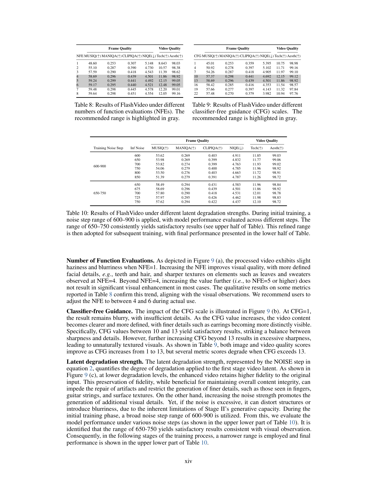
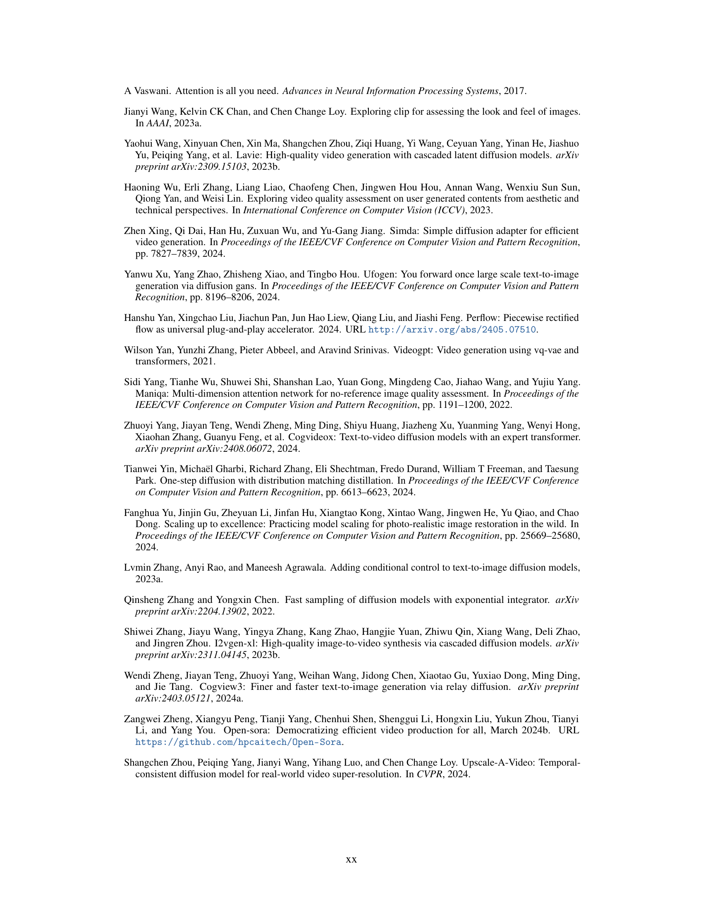

 


 2502.05179 
 Shilong Zhang et el. 
 
 🤗 2025-02-10 
 



↗ arXiv


↗ Hugging Face


↗ Papers with Code


### TL;DR



텍스트를 기반으로 고해상도 비디오를 생성하는 것은 최근 몇 년 동안 괄목할 만한 발전을 이루었지만, 여전히 **계산 비용이 많이 들고 생성 시간이 오래 걸리는 문제점**이 있습니다. 특히, 단일 단계 확산 모델은 고해상도 출력에 필요한 계산 요구 사항을 크게 증가시킵니다. 이러한 문제는 모델 용량과 데이터 규모의 확장성에 기인합니다.

본 논문에서는 이러한 문제를 해결하기 위해 **FlashVideo라는 새로운 두 단계 프레임워크**를 제안합니다. FlashVideo는 모델 용량과 기능 평가 수를 단계별로 전략적으로 할당하여 생성 충실도와 품질의 균형을 맞춥니다. 첫 번째 단계에서는 저해상도에서 대규모 매개변수와 충분한 기능 평가 수를 사용하여 프롬프트 충실도를 우선시하고, 두 번째 단계에서는 저해상도와 고해상도 간의 흐름 일치를 통해 최소한의 기능 평가 수로 미세한 세부 정보를 생성합니다.  실험 결과, FlashVideo는 **최첨단의 고해상도 비디오 생성 성능**을 달성하면서 계산 효율성을 크게 향상시키는 것을 보여줍니다.



#### Key Takeaways


 두 단계 접근 방식을 통해 고해상도 비디오 생성의 계산 비용을 크게 줄임 



 프롬프트 충실도와 시각적 품질을 개별적으로 최적화하여 고품질의 비디오 생성 



 흐름 일치 기법을 사용하여 고해상도에서 미세한 세부 묘사를 효율적으로 생성 


#### Why does it matter?
본 논문은 **고해상도 비디오 생성의 계산 비용 문제를 해결**하기 위해 제안된 FlashVideo 프레임워크의 효율성과 우수한 성능을 보여줍니다.  **두 단계 접근 방식**을 통해 고품질의 결과를 얻으면서도 계산 시간을 크게 단축하여 상용화 가능성을 높였습니다.  이는 **고해상도 비디오 생성 분야의 연구 방향**을 제시하고 향후 연구를 위한 새로운 가능성을 열어줍니다.  특히, **모델 크기와 기능 평가 수를 전략적으로 할당**하는 방법은 다른 영역의 고해상도 생성 모델에도 적용 가능하며, 향후 연구에서 널리 활용될 수 있습니다.

------
#### Visual Insights

> 🔼 본 그림은 FlashVideo와 다른 텍스트-비디오 생성 방법들을 비교 분석한 것입니다. (a) 단일 단계 DiT는 고해상도 비디오 생성 시 계산 비용이 급증하는데, 해상도가 270p에서 1080p로 증가하면 처리 시간이 30초에서 2150초로 증가합니다. (b) 기존 캐스케이드 방식은 고해상도에서 모델 크기를 줄일 수 있지만, 두 번째 단계에서 여전히 가우시안 노이즈에서 샘플링하고 첫 번째 단계 결과를 조건으로만 사용하기 때문에 고해상도에서 함수 평가 횟수를 효과적으로 줄이지 못하고 1080p 비디오 생성에 571.5초가 걸립니다. (c) 반면 FlashVideo는 두 번째 단계에서 모델 크기를 줄이는 동시에 첫 번째 단계 결과를 샘플링하여 고해상도에서 함수 평가 횟수를 4회로 줄이며, 시각적으로 만족스러운 디테일을 통합하여 1080p 비디오를 102.3초 만에 생성합니다. 자세한 통계는 보충 자료에 있습니다.
> 

> 
read the caption

> Figure 1:  Comparison between FlashVideo and other text-to-video generation paradigms. (a) Single Stage DiT suffers from an explosive increase in computation cost when generating at large resolutions, rising from 30s to 2150s (circle in (d)) when increasing the resolution from 270p to 1080p. (b) Though the vanilla cascade can reduce the model size in the high resolution, its second stage still samples from Gaussian noise and only uses the first-stage results as a condition. This approach cannot effectively reduce the number of function evaluations at high resolution and still costs 571.5s (square in (d)) to generate a 1080p video. (c) In contrast, FlashVideo not only decreases the model size in the second stage but also starts sampling from the first-stage results, requiring only 4 function evaluations at high resolution while integrating a wealth of visually pleasant details, which can generate 1080P video with only 102.3s (triangle in (d)). Details on obtaining these statistics are provided in our Supplementary Materials.
> 


| Method | Total Score | Quality Score | Semantic Score | subject consistency | background consistency | temporal flickering | motion smoothness | dynamic degree | aesthetic quality | imaging quality | object class | multiple objects | human action | color | spatial relationship | scene | appearance style | temporal style | overall consistency |
|---|---|---|---|---|---|---|---|---|---|---|---|---|---|---|---|---|---|---|---| 
| Vchitect(VEnhancer) | 82.24 | 83.54 | 77.06 | 96.83 | 96.66 | 98.57 | 98.98 | 63.89 | 60.41 | 65.35 | 86.61 | 68.84 | 97.20 | 87.04 | 57.55 | 56.57 | 23.73 | 25.01 | 27.57 |
| CogVideoX-1.5 | 82.17 | 82.78 | 79.76 | 96.87 | 97.35 | 98.88 | 98.31 | 50.93 | 62.79 | 65.02 | 87.47 | 69.65 | 97.20 | 87.55 | 80.25 | 52.91 | 24.89 | 25.19 | 27.30 |
| CogVideoX-5B | 81.61 | 82.75 | 77.04 | 96.23 | 96.52 | 98.66 | 96.92 | 70.97 | 61.98 | 62.90 | 85.23 | 62.11 | 99.40 | 82.81 | 66.35 | 53.20 | 24.91 | 25.38 | 27.59 |
| CogVideoX-2B | 81.57 | 82.51 | 77.79 | 96.42 | 96.53 | 98.45 | 97.76 | 58.33 | 61.47 | 65.60 | 87.81 | 69.35 | 97.00 | 86.87 | 54.64 | 57.51 | 24.93 | 25.56 | 28.01 |
| Mochi-1 | 80.13 | 82.64 | 70.08 | 96.99 | 97.28 | 99.40 | 99.02 | 61.85 | 56.94 | 60.64 | 86.51 | 50.47 | 94.60 | 79.73 | 69.24 | 36.99 | 20.33 | 23.65 | 25.15 |
| LTX-Video | 80.00 | 82.30 | 70.79 | 96.56 | 97.20 | 99.34 | 98.96 | 54.35 | 59.81 | 60.28 | 83.45 | 45.43 | 92.80 | 81.45 | 65.43 | 51.07 | 21.47 | 22.62 | 25.19 |
| OpenSora-1.2 | 80.00 | 82.30 | 70.79 | 96.56 | 97.20 | 99.34 | 98.96 | 54.35 | 59.81 | 60.28 | 83.45 | 45.43 | 92.80 | 81.45 | 65.43 | 51.07 | 21.47 | 22.62 | 25.19 |
| OpenSoraPlan-V1.1 | 78.00 | 80.91 | 66.38 | 95.73 | 96.73 | 99.03 | 98.28 | 47.72 | 56.85 | 62.28 | 76.30 | 40.35 | 86.80 | 89.19 | 53.11 | 27.17 | 22.90 | 23.87 | 26.52 |
| FlashVideo<math alttext='{}_{
ormalsize 8fps}' display='inline'></math> | 82.49 | 82.58 | 82.10 | 96.96 | 96.82 | 98.43 | 97.01 | 59.58 | 62.29 | 66.21 | 89.87 | 80.67 | 99.20 | 85.81 | 83.02 | 57.17 | 24.39 | 25.46 | 27.81 |
| FlashVideo<math alttext='{}_{
ormalsize 24fps}' display='inline'></math> | 82.99 | 83.35 | 81.56 | 97.19 | 97.09 | 98.52 | 98.89 | 56.88 | 62.11 | 65.40 | 88.38 | 78.93 | 99.40 | 84.84 | 82.16 | 57.43 | 24.36 | 25.26 | 27.59 |

> 🔼 표 1은 논문에서 제시된 FlashVideo 모델의 성능을 기존 최첨단 오픈소스 비디오 생성 모델들과 비교 분석한 결과를 보여줍니다.  비교 대상 모델은 Vchitect-2.0 (VEnhancer와 통합), CogVideoX 여러 버전, Mochi-1, LTX-Video, OpenSora, OpenSoraPlan 등 다양하며, VBench-Long 벤치마크를 사용하여 의미적 정확도와 화질을 평가했습니다.  FlashVideo는 두 단계(Cascade) 방식을 사용하여 최상위 수준의 의미적 정확도와 화질을 달성하였음을 보여줍니다.  표에는 각 모델의 점수와 함께 실행 시간 및 사용된 매개변수의 크기도 포함되어 있어, 효율성 측면에서도 FlashVideo의 우수성을 확인할 수 있습니다.
> 

> 
read the caption

> Table 1: Comparison with state-of-the-art open-source models on VBench-Long benchmark [Huang et al. 2024]. This includes the recent Vchitect-2.0 incorporated with VEnhancer [He et al. 2024], varying versions of CogVideoX [Yang et al. 2024], Mochi-1 [Team 2024a], LTX-Video [HaCohen et al. 2024], OpenSora [Zheng et al. 2024b] and OpenSoraPlan [Lin et al. 2024a]. FlashVideo employs a cascade paradigm to deliver top-tier semantic fidelity and quality.
> 

### In-depth insights

#### Two-Stage DiT
본 논문에서 제안하는 두 단계 DiT(Diffusion-based Image Transformer) 방식은 **고해상도 비디오 생성의 효율성을 높이기 위한 핵심 전략**입니다. 첫 번째 단계는 저해상도에서 대용량 모델과 충분한 NFE(Number of Function Evaluations)를 사용하여 프롬프트 충실도를 우선적으로 확보합니다. 이는 효율적인 연산을 위해 계산 자원을 전략적으로 할당하는 방식입니다. 두 번째 단계에서는 저해상도 결과를 조건으로 하여 소용량 모델과 최소한의 NFE를 사용, 고해상도에서 세부적인 디테일을 효과적으로 생성합니다. **이러한 두 단계 접근 방식은 고품질 비디오 생성에 필요한 계산 비용과 시간을 획기적으로 줄이는 동시에 상업적 실현 가능성을 높입니다.** 사용자는 고해상도 생성에 들어가기 전에 초기 결과를 미리 볼 수 있어, 불필요한 계산 비용과 대기 시간을 크게 줄일 수 있다는 장점이 있습니다.  **저해상도 단계에서 확보된 높은 프롬프트 충실도와 고해상도 단계에서 추가된 세부적인 디테일은 최종적으로 높은 품질의 고해상도 비디오를 생성**하는데 기여합니다.  이는 **계산 효율성과 생성 품질 사이의 균형을 효과적으로 맞춘 혁신적인 접근 방식**이라고 할 수 있습니다.

#### Flow Matching
본 논문에서 제시된 '플로우 매칭(Flow Matching)' 기법은 저해상도 영상에서 고해상도 영상으로의 변환 과정에서 **연산 효율성을 극대화**하는 핵심 전략입니다.  기존의 단순 업샘플링 방식과 달리, 플로우 매칭은 저해상도 영상의 잠재 표현(latent representation)을 고해상도 영상의 잠재 표현으로 매핑하는 과정을 통해 **중간 단계의 노이즈 샘플링을 생략**합니다. 이는 **계산 비용을 상당히 절감**하고, 효율적인 고해상도 영상 생성을 가능하게 합니다. **ODE(Ordinary Differential Equation) 궤적을 직접적으로 추적**하는 방식으로, 가우시안 노이즈로부터 시작하는 기존 방법보다 훨씬 효율적인 샘플링을 제공합니다. 특히, 플로우 매칭 과정에서 **ODE 궤적을 거의 직선에 가깝게 만드는** 전략은 최소한의 함수 평가(NFE, Function Evaluations)만으로도 고해상도 영상에 세부적인 디테일을 효과적으로 생성할 수 있도록 합니다.  이는 **고품질 고해상도 영상 생성을 위한 연산량을 크게 줄이고, 상용화 가능성을 높이는** 데 기여하는 중요한 요소입니다.  **실험 결과는 플로우 매칭 기법이 연산 효율성과 생성 품질을 동시에 향상시킨다는 것을 입증**하며,  **두 단계 생성 과정의 효율성에 크게 기여**함을 보여줍니다.

#### Computational Efficiency
본 논문은 고해상도 비디오 생성에서 계산 효율성을 크게 향상시키는 방법을 제시합니다. **두 단계 접근 방식**을 사용하여, 첫 번째 단계에서는 저해상도로 비디오를 생성하여 계산 비용을 절감하고, 두 번째 단계에서는 흐름 매칭을 통해 고해상도로 세부 정보를 효율적으로 생성합니다. **저해상도 단계에서는 큰 모델 매개변수와 충분한 함수 평가를 사용하여 프롬프트 충실도를 우선시**하고, 고해상도 단계에서는 최소한의 함수 평가로 미세한 디테일을 생성하여 효율성을 높입니다.  실험 결과, 제안된 방법은 기존 방법보다 우수한 계산 효율성을 달성하면서 최첨단 고해상도 비디오 생성 성능을 달성함을 보여줍니다.  **특히, 두 단계 설계는 사용자가 전체 해상도 생성에 착수하기 전에 초기 출력을 미리 볼 수 있도록 하여 계산 비용과 대기 시간을 크게 줄이고 상용화 가능성을 높입니다.**  전반적으로, 이 논문은 고해상도 비디오 생성의 계산적 과제를 해결하는 데 효과적인 전략을 제시하며, 향후 연구에 귀중한 통찰력을 제공합니다.

#### High-Res Video Gen
고해상도 비디오 생성(High-Res Video Gen)은 **계산 비용이 많이 드는 과제**입니다.  본 논문에서는 이 문제를 해결하기 위해 **두 단계 접근 방식**을 제시합니다.  첫 번째 단계에서는 저해상도로 비디오를 생성하여 계산 효율성을 높이고, 두 번째 단계에서는 흐름 일치(flow matching) 기법을 사용하여 고해상도로 세부 묘사를 효율적으로 생성합니다. **이 방법은 계산 효율성을 유지하면서 고품질의 고해상도 비디오를 생성**하는 데 효과적입니다. 또한, 두 단계 접근 방식을 통해 사용자는 전체 해상도 생성에 들어가기 전에 초기 출력을 미리 볼 수 있어 **시간 및 비용 절감**에 큰 도움이 됩니다.  **모델 크기 최적화** 및 **함수 평가 횟수(NFE) 조절**을 통해 계산 효율성을 극대화하고, **프롬프트 충실도와 시각적 품질의 균형**을 맞추는 전략을 사용합니다.  **흐름 일치 기법**을 통해 고해상도 생성에서 필요한 함수 평가 횟수를 최소화하여 효율성을 높입니다.  결과적으로, 고해상도 비디오 생성의 효율성과 품질을 모두 향상시키는 혁신적인 접근 방식을 제시합니다.

#### Future Directions
본 논문에서 제시된 FlashVideo 모델의 미래 방향은 **고해상도 비디오 생성의 효율성을 더욱 높이는 것**에 초점을 맞춰야 합니다.  **고품질 저해상도 비디오 생성을 위한 효율적인 방법**을 더욱 연구하여 계산 비용을 줄이고, **고해상도 단계에서의 계산 복잡도를 낮추는 새로운 알고리즘**을 개발하는 것이 중요합니다. 특히, **긴 비디오 시퀀스나 빠른 움직임이 있는 비디오**에 대한 성능 향상을 위한 연구가 필요하며,  **다양한 해상도 및 프레임 수에 대한 일반화 능력 향상**을 위한 추가적인 연구도 필요합니다. **모델의 일반화 성능을 높이기 위한 데이터 확장** 및 **다양한 비디오 유형에 대한 적응력 강화**에 대한 연구도 중요한 미래 과제입니다. 또한, **사용자의 선호도를 더욱 정확하게 반영**하는 방법과 **사용자 친화적인 인터페이스 설계**를 통한 접근성 향상도 중요한 고려사항입니다. 마지막으로, **모델의 에너지 효율성 개선**과 **환경적인 지속가능성**에 대한 고려도 미래 연구의 중요한 부분입니다.

### More visual insights

More on figures

> 🔼 그림 2는 FlashVideo의 전체 파이프라인을 보여줍니다. FlashVideo는 50억 개의 파라미터를 가진 저해상도(Stage I) DiT와 20억 개의 파라미터를 가진 고해상도(Stage II) DiT로 구성된 캐스케이드 패러다임을 채택합니다. 3D RoPE는 전역 및 상대적 시공간 거리를 효율적으로 모델링하기 위해 두 단계 모두에서 사용됩니다. Stage I의 교육 데이터 쌍은 무작위로 샘플링된 가우시안 노이즈와 저해상도 비디오 잠재값을 사용하여 생성됩니다. Stage II의 경우 고품질 비디오에 픽셀 및 잠재값 저하를 적용하여 저품질 잠재값을 얻습니다. 이것들은 고품질 잠재값과 짝을 이루어 교육 데이터로 사용됩니다. 추론 중에는 Stage I에 대해 270p의 저해상도에서 충분한 NFE=50을 유지합니다. 생성된 비디오는 높은 충실도와 매끄러운 움직임을 유지하지만 세부 정보 손실이 발생할 수 있습니다. 이 비디오는 그런 다음 1080p의 고해상도로 업스케일링되고 잠재값 저하를 통해 처리됩니다. 단 4단계만으로 Stage II는 정확한 구조와 풍부한 고주파수 세부 정보를 재생성합니다.
> 

> 
read the caption

> Figure 2:  The overall pipeline of FlashVideo. FlashVideo adopts a cascade paradigm comprised of a 5-billion-parameter DiT at the low resolution (i.e., Stage \Romannum1) and a 2-billion-parameter DiT at a higher resolution (i.e., Stage \Romannum2). The 3D RoPE is employed at both stages to model the global and relative spatiotemporal distances efficiently. We construct training data pairs for Stage \Romannum1 by randomly sampling Gaussian noise and low-resolution video latent. For Stage \Romannum2, we apply both pixel and latent degradation to high-quality videos to obtain low-quality latent values. These are then paired with high-quality latents to serve as training data. During inference, we retain a sufficient N⁢F⁢E=50𝑁𝐹𝐸50NFE=50italic_N italic_F italic_E = 50 at a low resolution of 270p for Stage \Romannum1. The generated videos retains high fidelity and seamless motion, albeit with detail loss. These videos are then upscaled to a higher resolution of 1080p and processed by latent degradation. With only 4 steps, our Stage \Romannum2 regenerates accurate structures and rich high-frequency details.
> 

> 🔼 이 그림은 FlashVideo의 두 가지 저해상도 생성 방법인 DEGpixel과 DEGlatent의 영향을 시각적으로 보여줍니다. 왼쪽에서 오른쪽으로 첫 번째 이미지는 1단계 모델에 의해 생성된 입력이며, DEGpixel은 픽셀 공간 저하만으로 훈련된 모델에서 생성된 향상된 결과를 나타내며 입력에 고주파수 세부 정보를 추가합니다. DEGpixel과 DEGlatent는 두 가지 저하 방법으로 훈련된 모델에서 생성된 향상된 결과를 보여주며 작은 나무의 가지 생성과 같이 작은 구조를 더욱 향상시킵니다. 픽셀 저하만 사용했을 때보다 개선이 상당히 두드러집니다.
> 

> 
read the caption

> Figure 3: Visual showcase of D⁢E⁢Gp⁢i⁢x⁢e⁢l𝐷𝐸subscript𝐺𝑝𝑖𝑥𝑒𝑙DEG_{pixel}italic_D italic_E italic_G start_POSTSUBSCRIPT italic_p italic_i italic_x italic_e italic_l end_POSTSUBSCRIPT and D⁢E⁢Gl⁢a⁢t⁢e⁢n⁢t𝐷𝐸subscript𝐺𝑙𝑎𝑡𝑒𝑛𝑡DEG_{latent}italic_D italic_E italic_G start_POSTSUBSCRIPT italic_l italic_a italic_t italic_e italic_n italic_t end_POSTSUBSCRIPT impact on quality enhancement. From left to right, the first is the i⁢n⁢p⁢u⁢t𝑖𝑛𝑝𝑢𝑡inputitalic_i italic_n italic_p italic_u italic_t, generated by the first-stage model. The term D⁢E⁢Gp⁢i⁢x⁢e⁢l𝐷𝐸subscript𝐺𝑝𝑖𝑥𝑒𝑙DEG_{pixel}italic_D italic_E italic_G start_POSTSUBSCRIPT italic_p italic_i italic_x italic_e italic_l end_POSTSUBSCRIPT stands for the improved result yielded from the model trained only with pixel-space degradation, which adds high-frequency details to the i⁢n⁢p⁢u⁢t𝑖𝑛𝑝𝑢𝑡inputitalic_i italic_n italic_p italic_u italic_t. Further, D⁢E⁢Gp⁢i⁢x⁢e⁢l𝐷𝐸subscript𝐺𝑝𝑖𝑥𝑒𝑙DEG_{pixel}italic_D italic_E italic_G start_POSTSUBSCRIPT italic_p italic_i italic_x italic_e italic_l end_POSTSUBSCRIPT & D⁢E⁢Gl⁢a⁢t⁢e⁢n⁢t𝐷𝐸subscript𝐺𝑙𝑎𝑡𝑒𝑛𝑡DEG_{latent}italic_D italic_E italic_G start_POSTSUBSCRIPT italic_l italic_a italic_t italic_e italic_n italic_t end_POSTSUBSCRIPT refers to the enhanced result with model trained under both types of degradation, which further improves small structures, such as generating branches for small trees. The improvement is significantly apparent when compared to pixel degradation only.
> 

> 🔼 그림 4는 FlashVideo가 생성한 비디오들을 보여줍니다. 상단의 결과는 1단계, 하단의 결과는 2단계에서 생성된 것입니다. 1단계에서는 프롬프트에 명시된 주요 시각적 요소들(굵은 글씨로 표시)이 자연스러운 움직임과 높은 충실도로 생성됩니다. 하지만 작은 물체들의 세부 구조와 고주파수 텍스처가 부족합니다(빨간색 박스 참조). 반면에 2단계에서는 세부 묘사가 상당히 풍부해지고(녹색 박스 참조), 원본과의 내용 일관성은 유지됩니다. 시각화 결과는 압축된 것이며, 압축되지 않은 더 많은 결과는 프로젝트 페이지에서 확인할 수 있습니다.
> 

> 
read the caption

> Figure 4: Generated videos of FlashVideo. The results in the top and bottom rows are from Stage \Romannum1 and Stage \Romannum2, respectively. Stage \Romannum1 generates videos with natural motion and high prompt fidelity, as evident from the visual elements (bold in prompts). However, they lack detailed structures for small objects and high-frequency textures (see the red box). In Stage \Romannum2, details are significantly enriched (see the green box), while content remains highly consistent with the original. Visualization results are compressed. More uncompressed cases can be found on our project page.
> 

> 🔼 그림 5는 FlashVideo의 두 번째 단계(Stage II)에서의 화질 개선을 보여줍니다. 첫 번째 단계(Stage I)의 영상에서 인공물이나 세부 묘사가 부족한 부분은 빨간색 상자로 표시하고, 두 번째 단계에서 개선된 부분은 녹색 상자로 표시했습니다. 자세히 보시려면 확대하여 보세요. Stage II는 다양한 콘텐츠 전반에서 시각적 품질을 크게 향상시키는데, (a)에서는 유화풍 해바라기를 더욱 선명하게 표현하고, (b)에서는 주름과 머리카락을 다듬고, (c)와 (d)에서는 동물과 식물의 질감을 풍부하게 하고, (e)에서는 얼굴과 사물의 인공물을 완화합니다.
> 

> 
read the caption

> Figure 5: Quality improvements in Stage \Romannum2 . We mark regions with artifacts and lacking detail in the first-stage videos using red boxes, while improvements from the second stage are highlighted in green. Zoom in for a better view. Our Stage \Romannum2 significantly elevates visual quality across diverse content—enhancing oil painting–style sunflowers in (a), refining wrinkles and hair in (b), enriching texture structures of animals and plants in (c) and (d), and mitigating facial and object artifacts in (e).
> 

> 🔼 본 그림은 다양한 비디오 향상 기법들과 FlashVideo의 성능을 시각적으로 비교 분석한 결과를 보여줍니다. FlashVideo의 1단계 출력 결과를 바탕으로, 다른 네 가지 비디오 향상 기법들(VEnhancer, Upscale-A-Video, RealBasicVSR)을 적용한 결과와 FlashVideo의 최종 결과를 나란히 제시하여, 각 기법의 장단점 및 시각적 효과를 명확하게 비교합니다. 이를 통해 FlashVideo가 다른 방법들보다 더욱 우수한 화질 개선 효과를 제공하며, 동시에 세부적인 요소의 정확성과 일관성을 유지함을 보여줍니다.
> 

> 
read the caption

> Figure 6: Visual comparison with various video enhancement methods. We present our results alongside enhanced versions, derived from the first-stage outputs, of four video enhancement methods.
> 

> 🔼 본 그림은 큰 움직임이 있는 비디오에서 장기간에 걸친 세부 사항 일관성을 비교한 것입니다. 시각적 일관성을 유지하는 능력을 보여주기 위해, 상당한 움직임을 포함하는 1단계에서 생성된 비디오에서 세 개의 주요 프레임을 선택했습니다. 비디오 속 소녀는 먼 곳에서 클로즈업으로 크게 크기가 변화합니다. 공간-시간적 모듈과 시간 슬라이싱을 사용하는 VEnhancer (He et al., 2024)는 신원과 세부 사항의 일관성을 유지하지 못하는 반면, FlashVideo는 3D 전체 어텐션을 활용하여 일관된 얼굴 식별 및 질감 세부 사항을 유지합니다. 이 그림은 FlashVideo의 우수성을 보여줍니다.
> 

> 
read the caption

> Figure 7: Comparison of long-range detail consistency in large-motion videos. We select a first-stage generated video with significant motion and sample three key frames. The girl in this video undergoes substantial scale variation from distant to close-up views. VEhancer He et al. [2024], with spatial-temporal module and time slicing, fails to preserve identity and detail consistency. In contrast, FlashVideo leverages 3D full attention to maintain consistent facial identity and texture details.
> 

> 🔼 그림 8은 절대 사인파와 RoPE 위치 임베딩을 사용한 해상도 외삽의 결과를 보여줍니다. 두 설정 모두 학습 해상도에서는 성능이 우수합니다. 그러나 RoPE는 고해상도에서도 세부 정보 향상을 유지하는 반면, 절대 위치 임베딩은 학습 범위를 벗어나면 눈에 띄는 아티팩트를 발생시킵니다. 즉, RoPE 위치 임베딩 방식은 고해상도에서도 이미지의 디테일을 잘 유지하지만, 절대 위치 임베딩 방식은 학습된 해상도보다 높은 해상도에서는 이미지에 인공적인 잡음이 발생한다는 것을 보여줍니다.
> 

> 
read the caption

> Figure 8: Results of resolution extrapolation using absolute sinusoidal and RoPE position embeddings. Both settings perform well at the training resolution. However, while RoPE preserves detail enhancement at higher resolutions, absolute position embedding introduces noticeable artifacts beyond the training range.
> 

> 🔼 이 표는 FlashVideo 모델의 성능에 대한 결과를 보여줍니다. 특히, 함수 평가 횟수(NFEs)를 다르게 하여 비디오 생성 품질에 어떤 영향을 미치는지 보여줍니다.  표에는 MUSIQ, MANIQA, CLIPIQA, NIQE, Technical, Aesthetic 등 다양한 지표가 포함되어 있으며, 각 지표는 비디오의 품질을 다각적으로 평가합니다. 회색으로 강조 표시된 범위는 연구자들이 권장하는 NFEs 범위이며, 이 범위에서 최적의 성능을 얻을 수 있음을 시사합니다. 이는 비디오 생성의 효율성과 품질을 균형 있게 고려하여 사용자 경험을 최적화하기 위한 실험 결과입니다.
> 

> 
read the caption

> Table 8: Results of FlashVideo under different numbers of function evaluations (NFEs). The recommended range is highlighted in gray.
> 

More on tables


|                     | #NFE / Time | MUSIQ(↑) | MANIQA(↑) | CLIPIQA(↑) | NIQE(↓) | Technical(↑) | Aesthetic(↑) |
|-----------------|-------------|----------|-----------|------------|---------|---------------|---------------|
| **Frame Quality** |             |          |           |            |         |               |               |
| Stage I (270p)   | 50 / 30.1s  | 24.69     | 0.232      | 0.336       | 11.81   | 7.693         | 96.81         |
| Stage II (1080p) | 4 / 72.2s   | **54.45** | **0.312**  | **0.438**   | **5.363** | **11.81**     | **98.29**     |
| **Video Quality** |             |          |           |            |         |               |               |
> 🔼 본 표는 논문의 4.4절(정량적 결과)에서 VBench-Long 프롬프트를 사용하여 두 단계(저해상도 및 고해상도) 비디오 생성 결과의 프레임 품질과 비디오 품질을 비교 분석한 표입니다.  각 단계별로 MUSIQ, MANIQA, CLIPIQA, NIQE, Technical, Aesthetic 등의 다양한 지표를 통해 정량적인 성능을 평가하여, 각 지표에서 가장 좋은 성능을 보이는 값을 굵은 글씨체로 강조 표시했습니다.  저해상도 단계에서 고품질의 내용과 움직임을 확보하고, 고해상도 단계에서 세부적인 디테일을 개선하는 두 단계 접근 방식의 효과를 수치적으로 보여줍니다.
> 

> 
read the caption

> Table 2: Comparison of frame quality and video quality between two stages with Vbench-Long prompts.The best results are emphasized in bold.
> 


| Method | #NFE / Time | MUSIQ (↑) | MANIQA (↑) | CLIPIQA (↑) | NIQE (↓) | Technical (↑) | Aesthetic (↑) |
|---|---|---|---|---|---|---|---| 
| RealbasicVSR | 1 / 71.5s | 54.26 | 0.272 | 0.418 | 5.281 | 10.71 | **99.42** |
| Upscale-A-Video | 30 / 376.6s | 23.67 | 0.201 | 0.285 | 12.02 | 7.690 | 97.61 |
| VEnhancer | 30 / 549.2s | 51.69 | **0.280** | 0.385 | 5.330 | **11.63** | 98.39 |
| FlashVideo (Ours) | 4 / 72.2s | **58.69** | 0.296 | **0.439** | **4.501** | 11.86 | **98.92** |
> 🔼 표 3은 다양한 비디오 향상 기법들을 사용했을 때의 프레임 및 비디오 화질을 보여줍니다.  각 기법에 대해 MUSIQ, MANIQA, CLIPIQA, NIQE, Technical, Aesthetic 등 여러 화질 평가 지표의 결과값이 제시되어 있습니다.  가장 좋은 성능을 보인 결과는 굵은 글씨체로, 두 번째로 좋은 성능을 보인 결과는 밑줄 친 글씨체로 표시되어 있습니다. 이 표는 다양한 비디오 향상 기법들의 성능을 정량적으로 비교 분석하는 데 사용됩니다.
> 

> 
read the caption

> Table 3:  Frame and video quality across various video enhancement methods. The best results are highlighted in bold and the second-best in underline.
> 


|                | Frame Quality           |                | Video Quality          |                | Sematics                |                |
|----------------|-------------------------|----------------|-------------------------|----------------|--------------------------|----------------|
|                | MUSIQ(↑)                 | CLIPIQA(↑)      | Technical(↑)            | Aesthetic(↑)    | Object Class(↑)         | Overall Consistency(↑)|
| Full Fine-Tuning | 20.53                    | 0.273           | 8.531                    | 97.64           | 85.6                     | 26.1                 |
| LoRA            | **23.93**                 | **0.286**      | **8.569**                 | **97.87**       | **90.3**                  | **27.9**                |
> 🔼 본 표는 논문의 Stage 1에서 LoRA(Low-Rank Adaptation) 방식과 전체 파라미터 미세 조정 방식을 비교 분석한 결과를 보여줍니다.  두 방식 모두 270p 해상도의 비디오 생성에 사용되었으며, 프레임 품질과 비디오 품질, 그리고 의미 관련 점수를 비교하여 LoRA 방식의 우수성을 보여줍니다.  LoRA 방식은 전체 파라미터 미세 조정 방식보다 효율적이면서도 원본 모델의 성능을 잘 유지한다는 것을 확인할 수 있습니다.  표에서 가장 좋은 결과는 굵게 표시되어 있습니다.
> 

> 
read the caption

> Table 4: Comparison of LoRA and full parameter fine-tuning in Stage \Romannum1. Best results are in bold.
> 


|                     | #NFE / Time | MUSIQ(↑) | MANIQA(↑) | CLIPIQA(↑) | NIQE(↓) | Technical(↑) | Aesthetic(↑) |
| :------------------ | :---------- | :-------- | :-------- | :--------- | :------- | :------------ | :------------ |
| FlashVideo-1080p   | 4 / 72.2s   | 58.69     | 0.296     | 0.439      | 4.501    | 11.86         | 98.92         |
| FlashVideo-2K      | 4 / 209.8s  | 62.40     | 0.354     | 0.497      | 4.463    | 12.25         | 99.20         |
> 🔼 이 표는 RoPE(Rotary Position Embedding)을 사용하여 FlashVideo 모델의 추론 해상도를 조정한 결과를 보여줍니다.  FlashVideo는 두 단계로 구성된 비디오 생성 모델로, 첫 번째 단계에서는 저해상도로 비디오를 생성하고 두 번째 단계에서 고해상도로 비디오를 개선합니다. 이 표는 두 번째 단계에서 RoPE를 사용하여 저해상도에서 고해상도로 비디오를 확장했을 때의 성능을 보여줍니다.  표에는 다양한 평가 지표(MUSIQ, MANIQA, CLIPIQA, NIQE, Technical, Aesthetic)가 포함되어 있으며, 각 지표에 대한 최고 점수는 굵게 표시되어 있습니다. 이를 통해 RoPE를 사용한 고해상도 비디오 생성의 효율성과 성능을 평가할 수 있습니다.
> 

> 
read the caption

> Table 5: Inference resolution scaling results of FlashVideo with RoPE. Best results are in bold.
> 


| Degradatation |  | Frame Quality |  |  |  | Video Quality |  |
|---|---|---|---|---|---|---|---|---|
| $DEG_{pixel}$ | $DEG_{latent}$ | MUSIQ(↑) | MANIQA(↑) | CLIPIQA(↑) | NIQE(↓) | Technical(↑) | Aesthetic(↑) |
|  |  | 23.61 | 0.200 | 0.286 | 12.02 | 6.43 | 97.32 |
| ✓ |  | 49.12 | 0.253 | 0.364 | 4.95 | 7.12 | 99.02 |
| ✓ | ✓ | **55.45** | **0.273** | **0.409** | **4.69** | **9.09** | **98.96** |
> 🔼 본 표는 서로 다른 저하 기법(DEGpixel 및 DEGlatent)을 적용했을 때 프레임 품질과 비디오 품질에 대한 비교 분석 결과를 보여줍니다.  DEGpixel은 픽셀 공간에서의 저하만 적용한 경우이고, DEGlatent는 픽셀 공간과 잠재 공간 모두에서 저하를 적용한 경우입니다.  각 저하 기법에 따른 MUSIQ, MANIQA, CLIPIQA, NIQE, 기술적 품질, 미적 품질 점수를 비교하여 어떤 저하 방법이 비디오 품질 향상에 더 효과적인지 보여줍니다.  가장 좋은 결과는 굵은 글씨체로 표시되어 있습니다.
> 

> 
read the caption

> Table 6: Comparison of frame quality and video quality when applying different degradations. Best results are in bold.
> 


| Frame Quality | MUSIQ(↑) | MANIQA(↑) | CLIPIQA(↑) | NIQE(↓) | Video Quality | Technical(↑) | Aesthetic(↑) |
|---|---|---|---|---|---|---|---| 
| Before | 55.61 | 0.278 | 0.427 | 4.667 | 11.76 | 98.90 |
| After | 58.69 | 0.296 | 0.439 | 4.501 | 11.86 | 98.92 |
> 🔼 표 7은 FlashVideo 모델의 성능을 사람의 선호도를 반영하여 미세 조정하기 전과 후를 비교한 것입니다.  미세 조정 전과 후의 프레임 품질과 비디오 품질 지표를 보여주는 다양한 지표(MUSIQ, MANIQA, CLIPIQA, NIQE, Technical, Aesthetic)의 수치를 제시합니다.  각 지표에서 가장 좋은 결과는 굵은 글씨체로 표시되어 있습니다. 이 표는 사람의 선호도를 반영한 미세 조정이 FlashVideo 모델의 전반적인 품질 향상에 얼마나 효과적인지 보여줍니다.
> 

> 
read the caption

> Table 7: Performance comparison of FlashVideo before and after human preference alignment. Best results are in bold.
> 


| NFE | MUSIQ(↑) | MANIQA(↑) | CLIPIQA(↑) | NIQE(↓) | Tech(↑) | Aesth(↑) |
|---|---|---|---|---|---|---|
| 1 | 48.60 | 0.253 | 0.307 | 5.148 | 8.643 | 98.03 |
| 2 | 55.10 | 0.287 | 0.390 | 4.730 | 10.57 | 98.38 |
| 3 | 57.59 | 0.290 | 0.418 | 4.543 | 11.39 | 98.62 |
| 4 | 58.69 | 0.296 | 0.439 | 4.501 | 11.86 | 98.92 |
| 5 | 59.24 | 0.299 | 0.441 | 4.492 | 12.15 | 99.05 |
| 6 | 59.17 | 0.295 | 0.440 | 4.521 | 12.48 | 99.05 |
| 7 | 59.48 | 0.298 | 0.445 | 4.578 | 12.20 | 99.01 |
| 8 | 59.64 | 0.298 | 0.451 | 4.554 | 12.05 | 99.16 |
> 🔼 표 10은 FlashVideo 모델의 잠재적 저하 강도에 따른 결과를 보여줍니다. 초기 훈련 단계에서 노이즈 단계 범위는 600~900으로 설정되었고, 모델 성능을 다양한 단계에서 평가했습니다. 표의 상단 절반에 제시된 바와 같이 650~750의 범위가 만족스러운 결과를 지속적으로 제공했습니다. 이러한 결과를 바탕으로 이 범위를 후속 훈련에 적용했고, 최종 성능은 표의 하단 절반에 제시되어 있습니다.  표는 다양한 노이즈 강도에 따른 MUSIQ, MANIQA, CLIPIQA, NIQE, Technical, Aesthetic 등의 지표를 보여주어, 어떤 노이즈 강도에서 가장 좋은 성능을 보이는지 확인할 수 있습니다. 
> 

> 
read the caption

> Table 10: Results of FlashVideo under different latent degradation strengths. During initial training, a noise step range of 600–900 is applied, with model performance evaluated across different steps. The range of 650–750 consistently yields satisfactory results (see upper half of Table). This refined range is then adopted for subsequent training, with final performance presented in the lower half of Table.
> 

### Full paper



