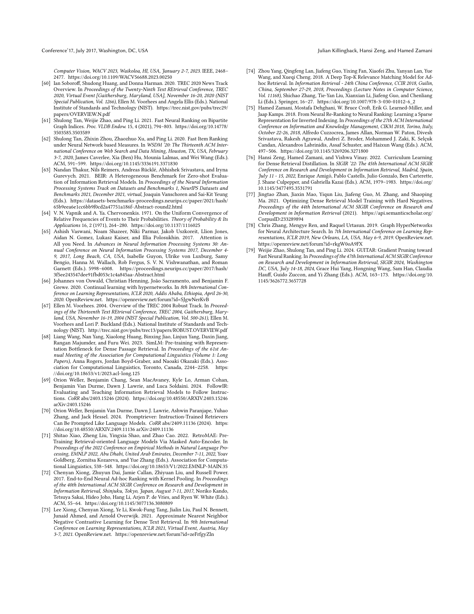

 


 2502.05364 
 Julian Killingback et el. 
 
 🤗 2025-02-12 
 



↗ arXiv


↗ Hugging Face


### TL;DR



기존 정보 검색 모델들은 질의와 문서 간 유사도를 벡터 내적을 통해 측정하는데, 이는 유사도 표현의 제한성을 초래합니다.  이는 특히 복잡한 질의나 모호한 정보를 다루는 경우 검색 성능 저하로 이어집니다.  단순한 유사도 함수 대신, 더욱 복잡한 관계를 포착할 수 있는 모델이 필요합니다.

본 논문에서는 **하이퍼네트워크 기반의 Hypencoder 모델**을 제시합니다.  Hypencoder는 질의를 입력받아 작은 신경망(q-net)을 생성하고, 이를 통해 문서의 관련성 점수를 계산합니다.  실험 결과, Hypencoder는 기존 모델들을 상당히 능가하는 성능을 보였으며, 특히 복잡한 검색 과제에서 그 성능 차이가 더욱 뚜렷했습니다.  또한, **효율적인 근사 검색 알고리즘**을 개발하여 대규모 데이터셋에서도 빠른 검색을 가능하게 했습니다.



#### Key Takeaways


 Hypencoder는 하이퍼네트워크를 이용하여 질의에 따라 다른 심층 신경망을 생성함으로써 기존의 단순한 유사도 측정 방식의 한계를 극복합니다. 



 다양한 데이터셋에서 기존의 강력한 검색 모델들을 능가하는 성능을 보이며, 특히 어려운 검색 과제에서 성능 향상이 두드러집니다. 



 효율적인 근사 검색 알고리즘을 개발하여, 대규모 문서 집합에 대한 빠르고 효과적인 검색을 가능하게 합니다. 


#### Why does it matter?
**본 논문은 기존의 정보 검색 모델의 한계를 극복하고 성능을 크게 향상시킨 새로운 방법론을 제시합니다.**  **하이퍼네트워크 기반의 혁신적인 접근 방식**은 복잡한 질의와 문서 간의 관계를 효과적으로 학습하여, 특히 **어려운 검색 과제에서 뛰어난 성능**을 보여줍니다. 이는 **새로운 연구 방향을 제시**하고,  **대규모 데이터셋에서의 효율적인 검색을 위한 새로운 알고리즘을 개발하는 데 중요한 의미**를 가집니다.  **기존의 단순한 유사도 측정 방식을 넘어서는 새로운 패러다임**을 제시함으로써, 정보 검색 분야의 발전에 크게 기여할 것으로 예상됩니다.

------
#### Visual Insights


| Model | TREC-DL '19 & '20 nDCG@10 | TREC-DL '19 & '20 RR | TREC-DL '19 & '20 R@1000 | MSMARCO Dev RR@10 | MSMARCO Dev R@1000 |
|---|---|---|---|---|---| 
| **Single Vector Dense Retrieval Models & BM25 (Baselines)** |  |  |  |  |  |
| **BM25** † | 0.491 | 0.679 | 0.735 | 0.184 | 0.853 |
| **ANCE** † | 0.646 | 0.811 | 0.767 | 0.330 | 0.958 |
| **TCT-ColBERT** † | 0.669 | 0.820 | 0.806 | 0.335 | 0.964 |
| **Margin MSE** † | 0.669 | 0.845 | 0.782 | 0.325 | 0.955 |
| **TAS-B** ♠ | 0.700 | <s>0.863</s> | 0.861 | 0.344 | 0.978 |
| **CL-DRD** ♢ | 0.701 | 0.844 | 0.838 | 0.382 | **0.981** |
| **BE-Base** ♣ | <s>0.713</s> | 0.855 | <s>0.868</s> | 0.359 | 0.980 |
| **Hypencoder** | **0.736**†♠♢♣ | **0.885**†♢ | **0.871**†♢ | **0.386**†♣♠ | **0.981**†♠ |
| **Other Retrieval Models (Reference Models)** |  |  |  |  |  |
| **ColBERT v2** | 0.749 | - | - | 0.397 | 0.984 |
| **SPLADE++ SD** | 0.723 | - | - | 0.368 | 0.979 |
| **RepLLaMA** | 0.731 | - | - | 0.412 | 0.994 |
| **DRAGON** | 0.734 | - | - | 0.393 | 0.985 |
| **MonoBERT** | 0.722 | - | - | 0.372 | 0.853 |
| **cross-SimLM** | 0.735 | - | - | 0.437 | 0.987 |

> 🔼 표 1은 논문에서 제시된 다양한 정보 검색 모델들의 성능을 보여주는 표입니다.  표에는 여러 기준(평가 지표)에 따른 성능이 제시되어 있으며, 특히 여러 기존 모델들과의 성능 비교를 통해 Hypencoder 모델의 우수성을 보여주고자 합니다.  각 모델의 성능은 다양한 데이터셋(MS MARCO Dev, TREC Deep Learning 2019 및 2020)에서 측정되었으며, 통계적 유의성 검정 결과(p < 0.05)도 함께 표시되어 있습니다.  † 기호는 여러 기존 모델들을 묶어서 나타낸 그룹을 의미합니다.
> 

> 
read the caption

> Table 1. Comparison on in-domain evaluation datasets. The symbols next to each baseline indicate significance values with p<0.05𝑝0.05p<0.05italic_p < 0.05. Note, that ††\dagger† is a group of baselines.
> 

### In-depth insights

#### Hypernetwork Retrieval
본 논문은 **하이퍼네트워크(Hypernetwork)**를 정보 검색(Information Retrieval)에 적용하는 새로운 패러다임을 제시합니다. 기존의 벡터 내적을 기반으로 하는 유사도 측정 방식에서 벗어나, 쿼리에 따라 **학습된 작은 신경망(q-net)**을 생성하여 문서의 관련성 점수를 계산합니다. 이는 쿼리에 의존적인 다층 신경망을 유사도 함수로 사용하여 문서 표현에 적용하는 방식입니다.  **하이퍼네트워크는 쿼리 임베딩을 입력받아 q-net의 가중치와 편향을 생성**하며, 이를 통해 기존의 선형 유사도 함수의 한계를 극복하고 복잡한 관련성을 포착할 수 있습니다.  **실험 결과, 하이퍼네트워크 기반 검색 모델이 기존의 강력한 밀집 검색 모델들을 상당히 능가**하며, 특히 어려운 검색 과제에서 성능 향상이 두드러짐을 보여줍니다. 이는 **일반화 성능 또한 우수**함을 시사합니다.  본 연구는 효율적인 근사 검색 알고리즘도 제시하여 실용성을 높였습니다.

#### Linearity Limitations
본 논문에서 저자는 **선형 유사도 함수(예: 내적)**의 한계를 심층적으로 다룹니다. **선형 유사도는 질의와 문서 간의 복잡한 관계를 포착하는 데 제한적**이라는 점을 강조하며, 이는 검색 모델의 표현력을 제한한다고 주장합니다.  **Radon 정리**를 이용하여 고차원 벡터 공간에서 선형적으로 분리할 수 없는 문서 집합이 항상 존재함을 수학적으로 증명하며, **완벽한 순위 생성이 불가능함**을 보여줍니다.  즉, 내적과 같은 선형 함수는 어떤 질의에 대해서는 완벽한 관련 문서 순위를 생성할 수 없다는 것을 의미합니다. 이러한 한계를 극복하기 위해 **비선형 신경망 기반의 새로운 유사도 함수**를 제안합니다.  이는 **다층 신경망의 유니버설 근사 능력**을 활용하여 선형 함수가 표현할 수 없는 복잡한 관계도 표현 가능하게 합니다.

#### Efficient Search
본 논문에서 제시된 효율적인 검색 알고리즘은 **대규모 문서 집합에서의 빠른 검색을 위해 고안된 근사 검색 기법**입니다.  기존의 완전 검색 방식과는 달리, **그래프 기반의 탐색 전략**을 사용하여 후보 문서 집합을 효율적으로 탐색합니다.  **초기 후보 문서 집합의 크기, 매 단계에서 탐색할 이웃 문서의 수, 그리고 반복 횟수**와 같은 주요 매개변수들을 조정하여 검색의 효율성과 정확성 사이의 균형을 맞춥니다.  실험 결과는 **검색 속도를 크게 향상시키면서 검색 정확도의 손실을 최소화**할 수 있음을 보여줍니다.  **초기 후보 문서의 수는 검색 속도에 큰 영향을 미치지만, 너무 크면 오히려 성능이 저하**될 수 있다는 점이 흥미로운 부분입니다.  이 알고리즘은 **실제 검색 시스템에 적용 가능한 실용적인 방법론**을 제시하며, **대규모 데이터 처리에 대한 효율적인 접근 방식**을 제시한다는 의의를 가집니다.

#### Out-of-Domain Robustness
본 논문에서는 다양한 하위 도메인에서의 성능을 평가하여 **모델의 범용성**을 확인합니다.  특히, 의료, 금융과 같은 전문 분야 질의응답 데이터셋과 엔티티 및 주장 검색 작업에 대한 적용 결과를 제시합니다.  **도메인 간 일반화 능력**은 특정 도메인에 과적합되지 않고 다양한 상황에 적용 가능함을 보여줍니다.  이는 **모델의 핵심 강점** 중 하나로, 다양한 정보 검색 시스템에 적용 가능성을 시사합니다.  **추가적인 실험**을 통해 좀 더 다양한 도메인에 대한 성능 검증이 이루어진다면, 모델의 견고성과 범용성에 대한 신뢰도를 더욱 높일 수 있을 것입니다.  **향후 연구**에서는 다양한 도메인에 대한 사전 학습 및 미세 조정 전략을 통해 더욱 향상된 성능을 기대할 수 있습니다.  또한, **도메인 적응**을 위한 효율적인 전략 개발이 중요한 과제가 될 것입니다.

#### Future Directions
본 논문의 "미래 방향"에 대한 심층적인 고찰은 **Hypencoder의 확장성과 한계점 극복**에 초점을 맞춰야 합니다.  **다양한 문서 표현 방식(멀티 벡터, 그래프 기반 등)과의 통합**을 통해 정보 검색의 정확도 및 효율성을 더욱 향상시키는 방안을 모색해야 합니다. 또한, **대규모 언어 모델(LLM)과의 연동**을 통해 더욱 복잡하고 긴 질의에 대한 처리 능력을 강화하는 연구가 필요합니다. **효율적인 근사 검색 알고리즘 개선**도 중요한 과제입니다.  **다양한 하드웨어 환경에 대한 최적화**를 통해 실제 검색 시스템 적용 가능성을 높이고, 다양한 하드웨어에서의 성능 향상 및 속도 개선이 필요합니다.  나아가 **다른 정보 검색 과제(예: 엔티티 검색, 추론 기반 검색 등)**에 Hypencoder를 적용하고 그 성능을 평가하여 일반적인 정보 검색 모델로서의 활용 가능성을 탐색하는 연구가 필요합니다. 마지막으로, **Hypencoder의 이론적 토대를 더욱 견고히 다지고**  모델의 성능 향상에 대한 이론적인 설명을 제공하는 연구가 중요한 미래 과제로 볼 수 있습니다.

### More visual insights

More on tables


| Rep type | sparse | dense | dense | dense | hypernet |
|---|---|---|---|---|---| 
| **Baselines** |  |  |  |  | **Ours** |
|  | BM25 | TAS-B | CL-DRD | BE-Base | Hypecoder |
| **Q & A** |  |  |  |  |  |
| TREC-Covid | 0.656 | 0.481 | 0.584 | 0.651 | **0.688**♢ |
| FiQA | 0.236 | 0.300 | 0.308 | 0.309 | **0.314** |
| NFCorpus | **0.325** | 0.319 | 0.315 | 0.327 | 0.324 |
| **Misc.** |  |  |  |  |  |
| DBPedia | 0.313 | 0.384 | 0.381 | 0.405 | **0.419**♣ |
| Touché v2 | **0.367** | 0.162 | 0.203 | 0.240 | 0.258♢ |
> 🔼 표 2는 다양한 영역(도메인)의 질의에 대한 Hypencoder 모델의 성능을 보여줍니다.  nDCG@10 지표를 사용하여 모델의 성능을 평가하며, BE-Base 모델과의 유의미한 차이를 p-값을 통해 제시합니다. p<0.05인 경우 ♣, p<0.1인 경우 ♢로 표시하여 통계적 유의성을 강조합니다.  다양한 질의응답(Q&A), 생물의학, 금융, 엔티티 검색, 논증 검색 등 여러 도메인에서 Hypencoder의 일반화 능력을 평가하고 있습니다.  BE-Base는 본 논문에서 제시된 Hypencoder 모델과 비교를 위한 기준 모델입니다.
> 

> 
read the caption

> Table 2. Out-of-domain results in nDCG@10. We only compare significance with BE-Base. Significance results with p<0.05𝑝0.05p<0.05italic_p < 0.05 are shown with the ♣♣\clubsuit♣ and p<0.1𝑝0.1p<0.1italic_p < 0.1 are shown with ♢♢\diamondsuit♢.
> 


| Model | TREC DL-HARD nDCG@10 | TREC DL-HARD RR | TREC DL-HARD R@1000 | TREC TOT DEV nDCG@10 | TREC TOT DEV RR | TREC TOT DEV nDCG@1000 | FollowIR Robust ’04 AP | FollowIR Robust ’04 p-MRR | FollowIR News ’21 nDCG@5 | FollowIR News ’21 p-MRR | FollowIR Core ’17 AP | FollowIR Core ’17 p-MRR |
|---|---|---|---|---|---|---|---|---|---|---|---|---|
| **BM25** † | 0.466 | 0.813 | 0.646 | 0.086 | 0.088 | 0.131 | 0.121 | -3.1 | 0.193 | -2.1 | 0.081 | -1.1 |
| **TAS-B** ♠ | 0.574 | 0.789 | 0.777 | 0.097 | 0.089 | 0.162 | 0.203 | -5.4 | 0.263 | -0.8 | 0.170 | -10.0 |
| **CL-DRD** ♢ | 0.573 | 0.790 | 0.719 | 0.088 | 0.082 | 0.151 | 0.206 | -7.2 | 0.240 | -0.3 | 0.162 | -12.1 |
| **BE-Base** ♣ | 0.607 | 0.864 | 0.805 | 0.121 | 0.110 | 0.179 | 0.207 | -3.7 | 0.239 | -1.1 | 0.178 | -7.7 |
| **Hypencoder** †♠♢ | 0.630†♠♢ | 0.887♠♢ | 0.798†♢ | 0.134†♠♢ | 0.125♠♢ | 0.182♢† | 0.212♠ | -3.5 | 0.272 | 2.0 | 0.193 | -11.8 |
> 🔼 표 3은 TREC DL-HARD, TREC Tip-of-my-tongue TOT 및 FollowIR을 포함한 더 어려운 작업에 대한 평가 지표를 보여줍니다.  각 지표는 해당 과제의 어려움을 반영하여 선택되었으며, 기존의 신경망 검색 모델과 BM25 모델의 성능과 비교하여 Hypencoder 모델의 성능을 보여줍니다.  p<0.1 유의성 검정 결과도 함께 제시되어 있으며, FollowIR의 경우 BM25에 대한 유의성 검정은 수행하지 않았습니다.  각 지표의 값은 해당 모델이 얼마나 효과적으로 어려운 검색 작업을 수행하는지 나타냅니다.  즉, 높은 값은 더 나은 성능을 의미합니다.
> 

> 
read the caption

> Table 3. Evaluation metrics for the harder set of tasks which include TREC DL-HARD, TREC Tip-of-my-tongue TOT, and FollowIR. Significance is shown at p<0.1𝑝0.1p<0.1italic_p < 0.1. For FollowIR we do not perform significance tests on BM25.
> 


| Search Type | Query Lat. (ms) | DL ’19 | DL ’20 |
|---|---|---|---| 
| Exhaustive | 1769.8 | 0.742 | 0.731 |
| Efficient 1 | 59.6 | 0.702 | 0.730 |
| Efficient 2 | 231.1 | 0.722 | 0.731 |
> 🔼 표 4는 효율적인 검색을 사용하여 TREC DL '19 및 '20에서 평균 쿼리 지연 시간과 nDCG@10을 보여줍니다. Efficient 1은 (C~=10000~𝐶10000   ̃C=10000, n⁢C⁢a⁢n⁢d⁢i⁢d⁢a⁢t⁢e⁢s=64𝑛𝐶𝑎𝑛𝑑𝑖𝑑𝑎𝑡𝑒𝑠64nCandidates=64, m⁢a⁢x⁢I⁢t⁢e⁢r=16𝑚𝑎𝑥𝐼𝑡𝑒𝑟16maxIter=16) 매개변수를 사용하고, Efficient 2는 (C~=100000~𝐶100000   ̃C=100000, n⁢C⁢a⁢n⁢d⁢i⁢d⁢a⁢t⁢e⁢s=328𝑛𝐶𝑎𝑛𝑑𝑖𝑑𝑎𝑡𝑒𝑠328nCandidates=328, m⁢a⁢x⁢I⁢t⁢e⁢r=20𝑚𝑎𝑥𝐼𝑡𝑒𝑟20maxIter=20) 매개변수를 사용합니다. 모든 모델 추론은 BF16 정밀도를 사용하여 NVIDIA L40S에서 수행되었습니다.  즉, 이 표는 제안된 효율적인 검색 알고리즘의 성능을 보여주는 표이며, 초기 후보 집합의 크기, 매 iteration마다 탐색할 이웃의 수, 반복 횟수 등 세 가지 주요 매개변수가 검색 효율성과 정확도에 미치는 영향을 보여줍니다.  초기 후보 집합의 크기가 클수록 검색 시간은 길어지지만, 정확도는 높아집니다. 반면에, 매 iteration마다 탐색할 이웃의 수와 반복 횟수는 일정 수준 이상으로 증가하면 검색 정확도 개선 효과가 미미해집니다.
> 

> 
read the caption

> Table 4. Average query latency and nDCG@10 on TREC DL ’19 and ’20 with efficient search. Efficient 1 uses parameters (C~=10000~𝐶10000\tilde{C}=10000over~ start_ARG italic_C end_ARG = 10000, n⁢C⁢a⁢n⁢d⁢i⁢d⁢a⁢t⁢e⁢s=64𝑛𝐶𝑎𝑛𝑑𝑖𝑑𝑎𝑡𝑒𝑠64nCandidates=64italic_n italic_C italic_a italic_n italic_d italic_i italic_d italic_a italic_t italic_e italic_s = 64, m⁢a⁢x⁢I⁢t⁢e⁢r=16𝑚𝑎𝑥𝐼𝑡𝑒𝑟16maxIter=16italic_m italic_a italic_x italic_I italic_t italic_e italic_r = 16), Efficient 2 uses parameters (C~=100000~𝐶100000\tilde{C}=100000over~ start_ARG italic_C end_ARG = 100000, n⁢C⁢a⁢n⁢d⁢i⁢d⁢a⁢t⁢e⁢s=328𝑛𝐶𝑎𝑛𝑑𝑖𝑑𝑎𝑡𝑒𝑠328nCandidates=328italic_n italic_C italic_a italic_n italic_d italic_i italic_d italic_a italic_t italic_e italic_s = 328, m⁢a⁢x⁢I⁢t⁢e⁢r=20𝑚𝑎𝑥𝐼𝑡𝑒𝑟20maxIter=20italic_m italic_a italic_x italic_I italic_t italic_e italic_r = 20). All model inference was performed on an NVIDIA L40S with BF16 precision.
> 

### Full paper



