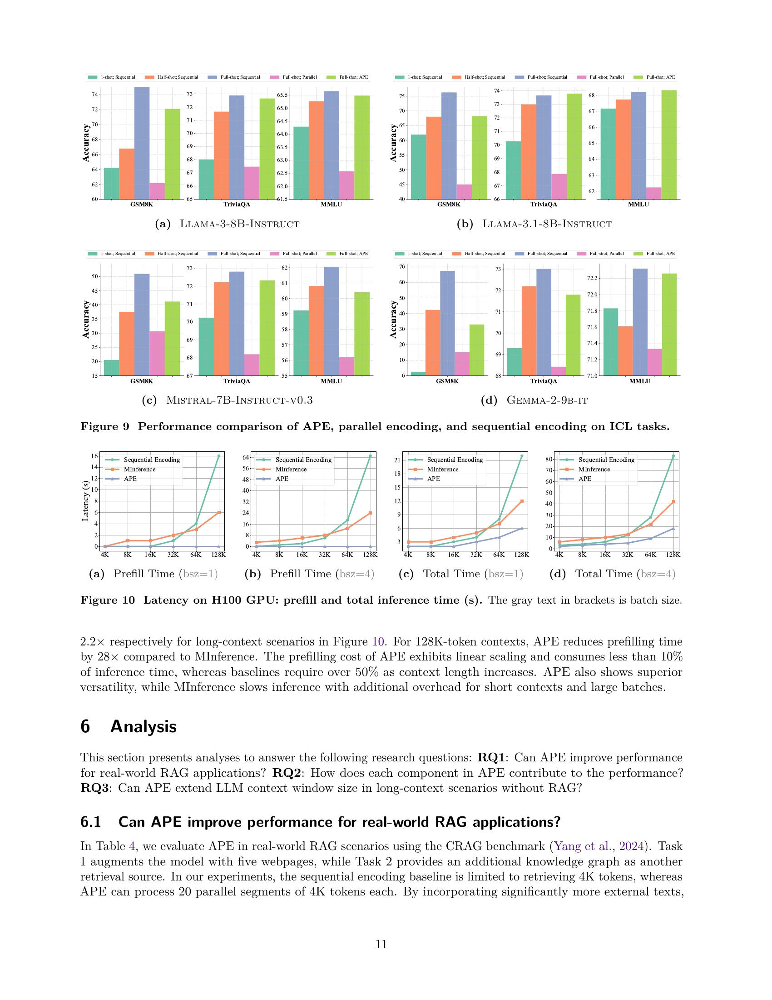

 


 2502.05431 
 Xinyu Yang et el. 
 
 🤗 2025-02-11 
 



↗ arXiv


↗ Hugging Face


### TL;DR



대규모 언어 모델(LLM)을 이용한 컨텍스트 증강 생성(CAG)은 사용자 질의에 대한 응답 생성을 위해 여러 컨텍스트를 효율적으로 결합해야 합니다.  하지만 기존의 순차적 인코딩 방식은 계산 부하가 크고, 병렬 인코딩 방식은 정확도가 떨어지는 문제가 있습니다.

본 연구에서는 이러한 문제를 해결하기 위해 새로운 방법론인 APE(적응형 병렬 인코딩)를 제시합니다. APE는 공유 접두사, 주의 온도, 스케일링 계수를 사용하여 병렬 인코딩과 순차적 인코딩 간의 분포 불일치를 해소하고, 정확도를 유지하면서 속도를 향상시킵니다. 실험 결과, APE는 동일한 입력을 사용하여 순차적 인코딩의 98% 및 93% 성능을 유지하면서, 병렬 인코딩 대비 3.6% 및 7.9%의 성능 향상을 보였습니다. 또한, APE는 128K 길이의 컨텍스트에 대해 최대 4.5배의 속도 향상을 달성했습니다.



#### Key Takeaways


 APE는 장문 컨텍스트 증강 생성(CAG)에서 기존 병렬 인코딩 방식의 정확도 저하 문제를 해결했습니다. 



 APE는 RAG 및 ICL 작업 모두에서 속도 향상과 정확도 향상을 동시에 달성했습니다. 



 APE는 수많은 컨텍스트를 병렬로 처리하여 다양한 응용 분야에 적용 가능성을 높였습니다. 


#### Why does it matter?
본 논문은 **장문 컨텍스트를 효율적으로 처리하는 새로운 방법론인 APE(적응형 병렬 인코딩)**을 제시하여, **장문 컨텍스트 증강 생성 모델의 속도와 정확도를 크게 향상**시켰다는 점에서 중요합니다.  **기존의 병렬 인코딩 방식의 한계를 극복하고, 실제 응용 환경에서의 효율성을 높였다는 점**은 연구자들에게 시사하는 바가 크며, **향후 장문 컨텍스트 처리 기술 발전에 중요한 기여**를 할 것으로 예상됩니다.  특히, **다양한 RAG 및 ICL 작업에서의 성능 개선 및 효율성 향상**은 실제 애플리케이션에 직접적인 영향을 미칠 수 있습니다.

------
#### Visual Insights

> 🔼  그림 1은 본 논문에서 제안하는 적응적 병렬 인코딩(APE) 방법의 개요를 보여줍니다.  맥락 증강 생성(CAG)은 사용자 질의에 대한 응답을 생성할 때 추가적인 맥락 정보를 활용하여 LLM의 응답 품질을 향상시키는 기술입니다. 기존의 순차적 인코딩 방식은 여러 개의 맥락들을 하나의 긴 시퀀스로 연결하여 인코딩하는데, 이는 긴 입력 시퀀스를 처리해야 하므로 추론 시간이 길어지고, 맥락 창의 제한으로 인해 정확도가 떨어지는 단점이 있습니다.  반면, 병렬 인코딩은 각 맥락을 개별적으로 사전에 계산하고 캐시하여 추론 시간을 단축할 수 있지만, 정확도가 저하될 수 있습니다. APE는 공유 접두사, 스케일링 팩터, 적응적 온도라는 세 가지 매개변수를 이용하여 병렬 인코딩의 어텐션 가중치 분포를 순차적 인코딩과 일치시켜, 실제 환경에서 빠르고 정확한 CAG 시스템을 구현합니다.
> 

> 
read the caption

> Figure 1:  Overview of Our Approach. Context-augmented generation leverages additional contexts to improve LLM response quality to user queries. Sequential encoding prefills selected context chunks as a long sequence during inference, leading to high latency from on-the-fly re-encoding and low accuracy due to context window limitations. Parallel encoding offers an alternative method to pre-compute more and longer contexts within the same positional range but results in worse performance. To address these challenges, we propose Adaptive Parallel Encoding (APE) to re-align the attention weight distribution of parallel encoding with sequential encoding via three training-free steps: shared prefix, scaling factor, and adaptive temperature, leading to fast and accurate CAG systems in real-world applications.
> 


| Method | INSCIT | Doc2Dial | TopicCQA | Qrecc | QuAC | Average |
|---|---|---|---|---|---|---|
| Contriever, Sequential | 19.97 | 23.85 | 30.49 | 46.75 | 26.57 | 29.53 |
| Contriever, APE | 19.88 | 23.28 | 28.84 | 46.28 | 26.80 | 29.02 |
| Δ | -0.09 | -0.57 | -1.65 | -0.47 | +0.23 | -0.51 |
| GTE-base, Sequential | 21.58 | 32.35 | 33.41 | 46.54 | 30.69 | 32.91 |
| GTE-base, APE | 20.85 | 30.99 | 31.92 | 45.83 | 30.35 | 31.99 |
| Δ | -0.73 | -1.36 | -1.49 | -0.71 | -0.34 | -0.92 |
| Dragon-multiturn, Sequential | 25.42 | 36.27 | 36.10 | 49.01 | 35.12 | 36.38 |
| Dragon-multiturn, APE | 23.84 | 34.93 | 33.80 | 48.70 | 34.92 | 35.24 |
| Δ | -1.58 | -1.34 | -2.30 | -0.31 | -0.20 | -1.14 |
| All texts, APE | 27.22 | 36.13 | 35.72 | 49.15 | 35.70 | 36.78 |

> 🔼 이 표는 ChatRAG-Bench라는 벤치마크를 사용하여 세 가지 검색 시스템(Contriever, GTE-base, Dragon-multiturn)에서 APE(Adaptive Parallel Encoding)와 순차적 인코딩 방식의 성능을 비교 분석한 결과를 보여줍니다. 각 검색 시스템에 대해 순차적 인코딩과 APE를 사용했을 때의 INSCIT, Doc2Dial, TopicCQA, Qrecc, QuAC 다섯 가지 하위 작업에 대한 성능(평균 F1 점수)을 비교하여 APE의 효율성과 정확성을 평가합니다.  APE는 순차적 인코딩과 유사한 수준의 성능을 유지하면서도 상당한 속도 향상을 제공하는지 여부를 보여주는 것이 목표입니다.
> 

> 
read the caption

> Table 1: Comparison between APE and sequential encoding using three retrievers on ChatRAG-Bench.
> 

### In-depth insights

#### Adaptive Parallel Encoding
본 논문에서 제안하는 적응형 병렬 인코딩(APE)은 **맥락 증강 생성(CAG)**에서 효율성을 높이기 위한 핵심 전략입니다.  기존의 순차적 인코딩 방식은 여러 맥락들을 결합하여 인코딩하는 과정에서 계산 비용이 과다하게 발생하는 문제점을 가지고 있었습니다.  APE는 각 맥락을 독립적으로 사전 계산하고 캐싱함으로써 이러한 문제를 해결합니다.  하지만 단순한 병렬 인코딩은 어텐션 분포의 불일치로 성능 저하를 초래할 수 있습니다.  따라서 APE는 **공유 접두사, 어텐션 온도, 스케일링 팩터**를 사용하여 순차적 인코딩과의 어텐션 분포 일치를 개선합니다.  **실험 결과는 RAG와 ICL 작업에서 APE가 순차적 인코딩 성능의 98%와 93%를 유지하면서 병렬 인코딩보다 성능이 뛰어나다는 것을 보여줍니다.**  더 나아가 APE는 **수백 개의 맥락을 병렬로 효율적으로 인코딩**하여 장문의 맥락 생성 속도를 크게 향상시킵니다.

#### Parallel Encoding Limits
본 논문에서 "병렬 인코딩의 한계"에 대한 심층적인 분석은 **맥락 인식 생성(CAG)에서 병렬 인코딩의 효율성과 정확도 사이의 상충 관계**를 보여줍니다.  단순히 맥락들을 병렬로 인코딩하는 것은 각 맥락의 독립성을 유지하지만, **어텐션 분포의 불일치**로 인해 성능 저하를 초래합니다.  이러한 한계는 긴 입력에 대한 짧은 출력이 요구되는 작업에서 특히 심각하며, **계산 비용 증가**와 **정확도 감소**라는 이중의 어려움을 야기합니다. 따라서 **어텐션 분포 재정렬**을 통해 병렬 인코딩의 정확성을 개선하는 것이 중요하며, 이를 위한 효과적인 방법론으로서 본 논문에서 제시된 **적응형 병렬 인코딩(APE)**이 제안됩니다. APE는 공유 접두사, 어텐션 온도, 스케일링 인자를 통해 병렬 인코딩과 순차 인코딩 간의 불일치를 해소하고, **성능 저하 없이 효율성을 크게 향상**시키는 핵심적인 역할을 합니다.

#### APE Efficiency Gains
논문에서 'APE 효율성 향상'이라는 제목으로 다룬 내용은 **APE(Adaptive Parallel Encoding) 기법이 기존의 순차적 인코딩 방식에 비해 얼마나 효율적인지**를 보여주는 실험 결과와 분석을 담고 있을 것입니다.  **병렬 인코딩을 통해 context들을 미리 계산하고 캐싱하여 추론 시간을 단축**시키는 효과와,  **순차적 인코딩의 성능을 거의 유지하면서 속도를 크게 향상**시킨다는 점이 주요 내용일 것입니다.  구체적으로는,  128K 길이의 context에 대해 **28배의 전처리 시간 감소 및 최대 4.5배의 종단 간 속도 향상**과 같은 정량적인 결과를 제시하며, 이러한 성능 향상의 원인을 **공유 prefix, 어텐션 온도 조절, 스케일링 팩터** 등의 기술적 세부 사항을 통해 설명했을 것입니다.  즉,  본 제목은 논문의 핵심 주장을 효율성 측면에서 압축적으로 드러내는 중요한 부분입니다.

#### Many-shot CAG Scaling
본 논문에서 제시된 적응적 병렬 인코딩(APE) 기법은 다양한 맥락을 효율적으로 처리하여 장문의 컨텍스트 증강 생성(CAG)을 가능하게 합니다. 특히 **다수 샷(many-shot) CAG**는 여러 개의 예제나 맥락을 사용하여 모델의 성능을 향상시키는 기법인데, 이때 APE는 **병렬 처리를 통해 속도를 높이고 효율성을 개선**합니다.  **수백 개의 맥락을 병렬로 인코딩**할 수 있음을 보여주는 실험 결과는,  APE가 대규모 컨텍스트를 처리하는 데 효과적임을 시사합니다. 다만,  **컨텍스트의 길이, 수량, 내용**에 따라 성능 차이가 발생할 수 있으며,  **하이퍼파라미터 최적화**가 성능에 영향을 미치므로,  실제 응용 시스템에서는 이러한 점을 고려해야 합니다.  **실험 결과는 APE의 효율성과 확장성을 보여주지만,  더욱 복잡한 작업에 대한 성능 평가 및 하이퍼파라미터 자동 조정 기법 연구**가 앞으로 필요합니다.

#### APE Future Directions
**APE의 미래 방향**에 대한 심도있는 논의는 **계층적 구조의 확장성**, **다양한 데이터 유형 지원**, **효율적인 캐싱 전략** 등 세 가지 핵심 축으로 요약될 수 있습니다.  먼저, **계층적 구조**는 단순한 평행 구조를 넘어 트리 구조와 같은 복잡한 구조의 외부 데이터를 효과적으로 처리하는 방향으로 확장될 수 있습니다.  이는 **구조화된 데이터**에 대한 APE의 적용성을 넓히고, 더욱 **정교한 정보 추출 및 활용**을 가능하게 할 것입니다.  둘째, **다양한 데이터 유형 지원**은 텍스트뿐 아니라 이미지, 오디오 등 다양한 형태의 데이터를 처리할 수 있도록 APE를 확장하여 적용 범위를 넓히는 것입니다. 이를 위해서는 각 데이터 유형에 맞는 효율적인 인코딩 및 처리 기법 개발이 필수적입니다.  마지막으로, **캐싱 전략**은 메모리 효율성을 높이는 동시에 빠른 응답 속도를 유지하는 방향으로 발전되어야 합니다.  **트리 기반 캐싱**은 대용량 데이터에서 효율적인 캐시 관리를 가능하게 할 것입니다.  **최적화된 캐싱 알고리즘** 개발을 통해 메모리 사용량을 최소화하면서 성능 저하 없이 빠른 응답을 제공하는 것이 중요한 과제입니다.

### More visual insights

More on figures

> 🔼 그림 2(a)는 검색 기반 증강 생성(RAG) 작업에 대한 순차적 인코딩, 병렬 인코딩 및 CEPE의 성능을 보여줍니다. RAG 작업의 경우 순차적 인코딩은 컨텍스트 윈도우의 제한으로 인해 낮은 정확도를 보이는 반면 병렬 인코딩은 더 많은 컨텍스트를 사용하지만 성능이 저하됩니다. CEPE는 간단한 작업에서는 순차적 인코딩을 능가하지만 복잡한 추론 작업에서는 성능이 저하됩니다.
> 

> 
read the caption

> (a) Retrieval-augmented Generation
> 

> 🔼 그림 2(b)는 본 논문의 3장, 관찰(Observations) 섹션에 포함된 그림입니다. 이 그림은 다양한 인컨텍스트 학습(ICL) 작업에서 순차적 인코딩, 병렬 인코딩 및 CEPED(CEPE-Distilled)의 성능을 비교한 것입니다.  각 ICL 태스크(GSM8K, TriviaQA, MMLU)에 대한 F1 점수와 정확도를 보여주는 막대 그래프를 통해 병렬 인코딩과 CEPED가 특히 추론 능력이 필요한 작업(GSM8K)에서 순차적 인코딩보다 성능이 현저히 떨어짐을 시각적으로 보여줍니다. 이는 본 논문의 핵심 주장인 병렬 인코딩의 효율성과 한계를 강조하는 중요한 그림입니다.
> 

> 
read the caption

> (b) In-context Learning
> 

> 🔼 그림 2는 RAG(Retrieval-Augmented Generation)와 ICL(In-Context Learning) 시나리오에서 순차적 인코딩, 병렬 인코딩 및 CEPED(CEPE-Distilled)의 성능을 비교한 것입니다.  병렬 인코딩과 CEPED는 특히 추론 능력이 필요한 GSM8K와 같은 작업에서 성능 저하를 보여줍니다. 순차적 인코딩은 컨텍스트를 순차적으로 처리하여 정확도가 높지만 속도가 느립니다. 반면에 병렬 인코딩은 각 컨텍스트를 독립적으로 인코딩하여 속도는 빠르지만 정확도가 떨어집니다. CEPED는 병렬 인코딩의 정확도를 개선하기 위해 미세 조정된 모델이지만, 복잡한 추론 작업에서는 여전히 순차적 인코딩보다 성능이 떨어집니다. 이 그림은 다양한 RAG 및 ICL 작업에서 세 가지 인코딩 방법의 성능 차이를 명확하게 보여주어 APE(Adaptive Parallel Encoding)의 필요성을 강조합니다.
> 

> 
read the caption

> Figure 2: Comparison of sequential encoding, parallel encoding, and CEPED in RAG and ICL scenarios. Parallel encoding and CEPED degrades performance, especially on tasks such as GSM8K that requires reasoning ability.
> 

> 🔼 그림 3은 다양한 모델에서 초기 토큰의 키 상태 간 유사성을 보여줍니다. 왼쪽 상단 그림 (a)와 (b)는 서로 다른 초기 토큰에서 추출된 키 상태 간 코사인 유사도가 0.9보다 크다는 것을 보여줍니다. 오른쪽 상단 그림 (c)와 (d)는 초기 토큰의 키 상태가 다른 위치의 키 상태와 유사한 음수 값을 갖는다는 것을 보여줍니다. 아래 그림은 값 상태가 키 상태에서 관찰된 패턴과 유사하다는 것을 보여줍니다. X축은 로그 눈금으로 표시된 키 및 값 상태의 위치를 나타냅니다. 부록에는 더 많은 기본 모델에 대한 시각화 및 분석이 제공됩니다.
> 

> 
read the caption

> Figure 3: Top Left: Both LLaMA-3-8B-Instruct (a) and Mistral-7B-Instruct-v0.3 (b) exhibit a cosine similarity larger than 0.9 for the key states from distinct initial tokens. Top Right: Initial token’s key states show similar negative values to those from other positions for LLaMA-3-8B-Instruct (c) and Mistral-7B-Instruct-v0.3 (d) models. Bottom: Value states exhibit patterns similar to those observed in key states. The X-axis shows positions of key and value states on a logarithmic scale. Visualizations and analyses for more base models are provided in Appendix 11.
> 

> 🔼 그림 4(a)는 질의와 키 상태 간의 코사인 유사도를 보여줍니다. 코사인 유사도는 위치 차이가 감소함에 따라 증가합니다. 이는 모델이 위치가 가까운 토큰에 더 많은 주의를 기울임을 시사합니다.  이 그림은 맥락 내에서의 주의 메커니즘에 대한 통찰력을 제공합니다. 특히, 위치가 인접한 토큰 간의 상호작용을 보여주어,  문맥 내 생성 작업에서의 주의 분포를 이해하는 데 도움이 됩니다.
> 

> 
read the caption

> (a) Query-Key Similarity
> 

> 🔼 그림 (b)는 어텐션 메커니즘에서 키(Key) 상태의 크기를 각 위치별로 시각화한 것입니다. 세로축은 키 상태의 크기를 나타내고, 가로축은 토큰의 위치(로그 스케일)를 나타냅니다. 이 그림은 키 상태의 크기가 위치에 따라 어떻게 변하는지 보여줍니다. 특히, 처음 몇몇 토큰에서는 크기가 작고, 위치가 증가함에 따라 크기가 점차적으로 증가하는 경향을 보입니다. 이는 초기 토큰의 중요도가 낮고, 위치가 증가함에 따라 중요도가 증가하는 것을 시사합니다. 또한, 각 레이어별로 키 상태의 크기 분포가 다르다는 것을 보여줍니다.
> 

> 
read the caption

> (b) Key Magnitude
> 

> 🔼 그림 4는 어텐션 메커니즘의 다양한 구성 요소를 시각화한 것으로, (c)는 값(Value)의 크기를 보여줍니다. 각 레이어(Layer 0부터 28까지)에서 토큰의 위치에 따른 값의 크기 변화를 보여주는 그래프입니다.  X축은 로그 스케일로 표현된 토큰의 위치를 나타내고, Y축은 값의 크기를 나타냅니다. 이 그림은 어텐션 메커니즘에서 값의 크기가 위치에 따라 어떻게 변하는지, 그리고 특히 처음과 끝 부분에서 어떤 패턴을 보이는지 보여줍니다. 특히, 초기 토큰의 값 크기가 다른 토큰보다 상대적으로 작거나 큰 특징을 보여주는지 확인할 수 있습니다.  이를 통해 어텐션 메커니즘 내부의 동작 방식을 더 잘 이해하고, 이를 개선할 수 있는 방향을 모색하는 데 도움이 됩니다.
> 

> 
read the caption

> (c) Value Magnitude
> 

> 🔼 그림 4(d)는 쿼리와 키 상태 간의 점곱(dot product)을 보여줍니다. 점곱은 쿼리와 키 벡터의 유사도를 측정하는 지표로, 값이 클수록 두 벡터가 유사함을 의미합니다. 그림에서 보듯이, 쿼리와 키 상태 간의 점곱은 위치가 가까울수록 값이 커지는 경향이 있습니다. 특히 초기 위치와 최근 위치에서 점곱의 값이 크게 나타나는데, 이는 초기 토큰과 최근 토큰이 문맥 내에서 더 중요한 역할을 한다는 것을 시사합니다. 이러한 현상은 문맥 내에서 초기 토큰과 최근 토큰에 대한 어텐션이 집중되는 현상을 반영하며, 이는 어텐션 메커니즘의 특징과 관련이 있습니다.
> 

> 
read the caption

> (d) Query-Key Product
> 

> 🔼 그림 4는 어텐션 메커니즘의 다양한 구성 요소를 시각화한 것입니다. (a) 쿼리와 키 상태 간의 코사인 유사도는 위치 간의 거리가 줄어들수록 증가합니다. (b) 키 상태의 크기는 위치가 증가함에 따라 완만하게 증가하는 경향을 보입니다. (c) 값 상태의 크기는 위치에 관계없이 일정하게 유지됩니다. (d) 쿼리-키 내적은 처음과 마지막 위치를 제외하고 일관되게 낮은 값을 유지합니다. 빨간색 점선은 모든 그림에서 처음 두 토큰의 이상 영역을 표시합니다. X축은 로그 눈금으로 KV 상태의 위치를 보여줍니다. 결과는 LLaMA-3-8B-Instruct 모델을 사용하여 측정되었습니다. 부록 11에는 더 많은 기본 모델에 대한 시각화와 분석이 제공됩니다.
> 

> 
read the caption

> Figure 4: Visualization of Different Components in Attention. (a) The cosine similarity between query and key states increases as the distance between their positions decreases. (b) The magnitudes of key states show a slowly upward trend as position increases. (c) The magnitude of value states remain constant across positions. (d) Query-key dot products keep consistently low values except at initial and recent positions. A red dashed line marks the anomalous region for the first two tokens in all figures. The X-axis shows positions of KV states on a log scale. Results are measured with the LLaMA-3-8B-Instruct model. Visualizations and analyses for more base models are provided in Appendix 11.
> 

> 🔼 그림 5는 다양한 샘플과 위치에 걸쳐 키 상태의 방향과 크기를 중점으로 하여 병렬 인코딩에서 어텐션 가중치 분포의 특성을 체계적으로 분석한 결과를 보여줍니다. 이 분석을 통해 병렬 인코딩과 순차 인코딩 간의 주요 정렬과 사소한 불일치를 파악하여 성능 향상을 위한 추가적인 개선 방향을 제시합니다. 특히, 독립적인 컨텍스트의 KV 상태가 유사성으로 인해 자연스럽게 하나의 시퀀스로 병합될 수 있다는 점을 보여줍니다.  이러한 관찰 결과는 각 컨텍스트 내의 초기 및 최근 위치에 있는 잔여 불일치 문제를 해결하는 데 초점을 맞춰 연구를 더욱 진행할 수 있도록 합니다.
> 

> 
read the caption

> Figure 5: Geometry of Key States.
> 

> 🔼 이 그림은 첫 번째 토큰에 대한 회전 분석 결과를 보여줍니다.  수평축은 회전 각도(0~180도)를 나타내고, 수직축은 F1 점수를 나타냅니다.  세 개의 선은 순차적 인코딩, 동일한 축을 사용한 병렬 인코딩, 그리고 서로 다른 축을 사용한 병렬 인코딩의 성능을 각각 보여줍니다.  그림에서 볼 수 있듯이, 순차적 인코딩은 다양한 회전 각도에서 일관된 성능을 유지하지만, 병렬 인코딩은 회전 각도가 커짐에 따라 성능이 저하됩니다. 특히 각 컨텍스트에 대해 별도의 축을 사용하는 병렬 인코딩은 90도를 넘어서면서 성능 저하가 더욱 두드러집니다. 이는 초기 키 상태의 유사성에 대한 의존도를 보여주는 결과로 해석될 수 있습니다.  초기 키 상태의 방향이 일관되지 않으면 모델의 성능이 떨어짐을 시사합니다.
> 

> 
read the caption

> Figure 6: Rotation Analysis on the First Token
> 

> 🔼 그림 (a)는 순차적 인코딩 방법을 사용하여 문맥 증강 생성(CAG) 작업에서 어텐션 가중치 분포를 보여줍니다. 순차적 인코딩은 모든 문맥을 하나의 시퀀스로 연결하여 인코딩하는 방식입니다. 이 그림은 각 계층(Layer 0부터 28까지)에서 토큰 위치에 따른 어텐션 가중치를 보여주며, 이웃하는 토큰 간의 높은 어텐션 가중치를 확인할 수 있습니다. 이는 순차적으로 인코딩된 시퀀스에서 이웃하는 토큰들이 서로 강하게 연관되어 있다는 것을 시각적으로 나타냅니다.  이러한 시각화는 본 논문의 3장, 특히 3.1절과 3.2절에서 병렬 인코딩과의 비교를 위해 사용됩니다. 병렬 인코딩과 비교하여 순차 인코딩의 특징을 보여주고 APE(적응형 병렬 인코딩) 기법의 필요성을 설명하는 데 도움을 줍니다.
> 

> 
read the caption

> (a) Sequential
> 

> 🔼 그림 7(b)는 문맥 내 어텐션 가중치 분포를 보여줍니다. 특히, T=1.0인 병렬 인코딩의 경우, 이웃 토큰에 걸쳐 어텐션 점수가 균일하게 분포되는 것을 보여줍니다. 이는 병렬 인코딩이 이웃 토큰들 간의 관계를 고르게 고려한다는 것을 시사합니다.  이는 순차적 인코딩과 비교하여 어텐션 가중치 분포가 어떻게 달라지는지 보여주는 그림 7(a)와 대조됩니다. 순차적 인코딩은 이웃 토큰에 더 높은 어텐션 점수를 할당하는 반면, 병렬 인코딩은 균일한 분포를 보입니다.
> 

> 
read the caption

> (b) Parallel (T = 1.0)
> 

> 🔼 그림 7(c)는 주어진 문맥 내에서 어텐션 가중치 분포를 보여줍니다. 이전 그림들과 마찬가지로, 수평축은 토큰 위치를 나타내고, 수직축은 어텐션 점수를 나타냅니다.  이 그림은 온도 매개변수 T를 0.2로 설정했을 때 병렬 인코딩의 어텐션 가중치 분포를 보여줍니다. T 값이 낮을수록 어텐션 가중치 분포가 더욱 희소해지며, 문맥적으로 중요한 토큰에 집중하는 것을 알 수 있습니다. 이는 순차적 인코딩과 병렬 인코딩의 어텐션 분포를 정렬하기 위한 APE의 세 가지 단계 중 두 번째 단계인 '적응형 온도 조정'의 효과를 보여줍니다.
> 

> 
read the caption

> (c) Parallel (T = 0.2)
> 

> 🔼 그림 7(d)는 순차적 인코딩과 병렬 인코딩의 어텐션 가중치 분포를 비교합니다. 순차적 인코딩은 이웃 토큰에 높은 어텐션 점수를 할당하지만, 병렬 인코딩은 모든 컨텍스트의 이웃 토큰에 걸쳐 어텐션 점수를 더 고르게 분산시킵니다. 온도 매개변수 조정 후 병렬 인코딩의 분포는 순차적 인코딩과 유사해집니다.
> 

> 
read the caption

> (d) Parallel vs. Sequential
> 

> 🔼 그림 7은 문맥 내 주의 가중치 분포의 비교를 보여줍니다. (a) 순차적 인코딩은 인접 토큰에 높은 주의 점수를 할당하는 반면, (b) 병렬 인코딩은 모든 문맥의 인접 토큰에 걸쳐 주의 점수를 더 균일하게 분포시킵니다. (c) 온도 매개변수 T를 조정하면 분포가 보다 희소해집니다. (d) 조정 후, 병렬 인코딩의 분포는 순차적 인코딩과 유사해집니다. X축은 토큰 위치를 나타냅니다. 이 그림은 병렬 인코딩 방식이 순차 인코딩과 비슷한 성능을 낼 수 있도록 온도 매개변수를 조정하는 과정을 시각적으로 보여줍니다.
> 

> 
read the caption

> Figure 7: Comparison of Attention Weight Distribution within Contexts. (a) Sequential encoding allocates high attention scores to neighboring tokens. (b) Parallel encoding distributes attention scores more uniform across neighboring tokens from all contexts. (c) Adjusting the temperature T𝑇Titalic_T sparsifies the distribution. (d) After adjustment, the distribution in parallel encoding becomes similar to sequential encoding. The X-axis represents token positions.
> 

> 🔼 그림 8은 다양한 온도(T)를 사용한 병렬 처리 방식의 결과를 보여줍니다. 온도 매개변수 T를 조정하여 어텐션 분포를 제어하는 효과를 시각적으로 보여주는 그림입니다.  낮은 온도(예: T=0.2)는 어텐션 분포를 더욱 예리하게 만들어, 특정 토큰에 대한 어텐션을 집중시키는 반면, 높은 온도(예: T=1.0)는 어텐션을 보다 고르게 분산시키는 것을 확인할 수 있습니다. 이는 온도 매개변수 T가 병렬 처리에서 어텐션 분포를 미세 조정하는 데 중요한 역할을 한다는 것을 보여줍니다.
> 

> 
read the caption

> Figure 8: Parallel w/ Different T𝑇Titalic_T.
> 

> 🔼 그림은 LLAMA-3-8B-Instruct 모델에 대한 다양한 측면을 시각적으로 보여줍니다. 특히, 서로 다른 샘플의 토큰 간 유사성, 초기 토큰과 후속 토큰 간 유사성, 질의 상태와 과거 키 상태 간 상관 관계, 그리고 키 및 값 상태의 크기 변화 등을 보여주는 여러 하위 그림들로 구성되어 있습니다. 이러한 시각화를 통해 논문에서 제시하는 어텐션 메커니즘의 특성과 병렬 인코딩과 순차적 인코딩 간의 관계에 대한 이해를 돕습니다.
> 

> 
read the caption

> (a) Llama-3-8B-Instruct
> 

> 🔼 그림은 본 논문의 3.2절(병렬 인코딩과 순차적 인코딩 비교)에서 나온 것으로, LLAMA-3.1-8B-INSTRUCT 모델을 사용하여 다양한 샘플과 위치에서 키 상태의 코사인 유사도를 보여줍니다. 구체적으로, 각 서로 다른 샘플의 초기 토큰들 간의 키 상태 유사도와 초기 토큰의 키 상태와 다른 위치의 토큰들 간의 키 상태 유사도를 보여줍니다. 이는 병렬 인코딩에서 주의 메커니즘이 어떻게 동작하는지, 그리고 순차적 인코딩과의 유사성과 차이점을 시각적으로 보여주는 데 목적이 있습니다.
> 

> 
read the caption

> (b) Llama-3.1-8B-Instruct
> 

> 🔼 그림은 3.2절 '병렬 인코딩과 순차 인코딩 비교'에서 다루는 내용으로, Mistral-7B-Instruct-v0.3 모델의 키 상태(key states)에 대한 코사인 유사도를 보여줍니다.  각 그래프는 모델의 여러 레이어(Layer 0부터 Layer 28까지)에 대한 키 상태의 코사인 유사도를 보여주며, 서로 다른 샘플의 토큰 간 유사도와 첫 번째 토큰과 다른 위치의 토큰 간 유사도를 비교 분석합니다. 이를 통해 병렬 인코딩에서 주목할 만한 유사성과 불일치를 보여주고, APE(Adaptive Parallel Encoding)의 필요성을 강조합니다.
> 

> 
read the caption

> (c) Mistral-7B-Instruct-v0.3
> 

> 🔼 그림 (d)는 GEMMA-2-9B-IT 모델에 대한 다양한 샘플과 위치에서 키 상태의 코사인 유사도를 보여줍니다.  이 그림은 서로 다른 샘플의 초기 토큰으로부터의 키 상태 간의 코사인 유사도가 0.9보다 크다는 것을 보여줍니다. 또한, 초기 토큰의 키 상태가 다른 위치의 토큰과 유사한 음수 값을 갖는다는 점도 보여줍니다.  결론적으로, 이 그림은 병렬 인코딩에서 키 상태의 분포 특성을 분석하여, 순차 인코딩과의 정렬 및 불일치를 보여주는 시각적 자료입니다.  이는 APE(적응형 병렬 인코딩)의 핵심 개념인 어텐션 가중치 분포의 정렬을 이해하는 데 중요한 역할을 합니다.
> 

> 
read the caption

> (d) Gemma-2-9b-it
> 

> 🔼 그림 9는 본 논문에서 제시된 적응적 병렬 인코딩(APE), 일반적인 병렬 인코딩 및 순차적 인코딩 세 가지 방법을 인 컨텍스트 학습(ICL) 작업에 적용했을 때의 성능 비교 결과를 보여줍니다.  각 ICL 작업(GSM8K, TriviaQA, MMLU)에 대해 세 가지 인코딩 방법의 정확도를 비교하여 APE의 효율성과 정확성을 보여줍니다.  다양한 모델(LLAMA-3-8B-INSTRUCT, LLAMA-3.1-8B-INSTRUCT, MISTRAL-7B-INSTRUCT-v0.3, GEMMA-2-9B-IT)에 대한 결과가 제시되어 다양한 모델에 대한 APE의 일반성을 확인합니다.
> 

> 
read the caption

> Figure 9: Performance comparison of APE, parallel encoding, and sequential encoding on ICL tasks.
> 

> 🔼 그림 10(a)는 배치 크기가 1일 때, 다양한 문맥 길이에 따른 순차적 인코딩, MInference, APE의 전처리 시간을 비교한 그래프입니다. x축은 문맥 길이(4KB, 8KB, 16KB, 32KB, 64KB, 128KB)를 나타내고, y축은 전처리 시간(초)을 나타냅니다.  각 막대는 순차적 인코딩, MInference, APE 세 가지 방법의 전처리 시간을 보여줍니다.  이 그래프는 APE가 특히 긴 문맥에 대해 전처리 시간을 크게 단축시키는 것을 보여줍니다.
> 

> 
read the caption

> (a) Prefill Time (bsz=1)
> 

> 🔼 그림은 배치 크기가 4일 때, 여러 가지 컨텍스트 길이에 따른 전처리 시간을 비교한 그래프입니다.  세로축은 전처리 시간(초)이고, 가로축은 컨텍스트 길이(토큰 수)입니다.  sequential encoding, MInference, APE 세 가지 방법을 비교하여, APE가 다른 두 방법에 비해 얼마나 빠른 전처리 시간을 가지는지 보여줍니다. 특히 긴 컨텍스트일수록 APE의 성능 향상이 두드러짐을 알 수 있습니다.
> 

> 
read the caption

> (b) Prefill Time (bsz=4)
> 

> 🔼 그림 10(c)는 배치 크기가 1일 때, H100 GPU에서 순차적 인코딩, MInference, APE 세 가지 방법을 사용하여 컨텍스트의 길이에 따른 전체 추론 시간(초)을 보여줍니다.  컨텍스트 길이가 증가함에 따라 세 가지 방법 모두 추론 시간이 증가하지만, APE는 순차적 인코딩과 MInference에 비해 상당히 빠른 속도를 보여줍니다.
> 

> 
read the caption

> (c) Total Time (bsz=1)
> 

> 🔼 이 그림은 배치 크기가 4일 때, H100 GPU 상에서 순차적 인코딩, MInference, APE의 총 추론 시간(초)을 보여줍니다.  각 모델의 성능을 비교하여, APE가 순차적 인코딩과 MInference보다 훨씬 빠른 추론 시간을 제공함을 시각적으로 보여줍니다. 특히 긴 컨텍스트 길이(128K 토큰)에서 그 차이가 두드러집니다.  그래프는 컨텍스트 길이에 따른 각 모델의 총 시간을 나타내며, APE의 효율성을 명확히 보여줍니다.
> 

> 
read the caption

> (d) Total Time (bsz=4)
> 

> 🔼 그림 10은 H100 GPU를 사용하여 문맥을 미리 채우는 시간과 추론에 걸리는 총 시간을 측정한 결과를 보여줍니다.  실험은 배치 크기(괄호 안의 회색 텍스트)를 다르게 하여 진행되었습니다.  그림은 문맥의 길이에 따른 문맥 채우기 시간과 전체 추론 시간을 비교 분석하여 APE의 효율성을 보여줍니다.  특히, 긴 문맥의 경우 APE가 문맥 채우기 시간을 크게 단축시켜 전체 추론 시간을 단축시키는 효과를 확인할 수 있습니다.
> 

> 
read the caption

> Figure 10: Latency on H100 GPU: prefill and total inference time (s). The gray text in brackets is batch size.
> 

> 🔼 그림 11은 다양한 기본 모델에서 서로 다른 초기 토큰의 키 상태가 후속 위치보다 큰 코사인 유사성을 보여주는 것을 보여줍니다. 특히 LLaMA 계열 모델은 1에 가까운 값을 보이며, 다른 모델들도 상당히 높은 유사성을 보입니다. 이는 공유된 접두사를 사용하는 APE의 효과를 보여주는 예시입니다. X축은 로그 스케일로 표시된 키 상태의 위치를 나타냅니다.
> 

> 
read the caption

> Figure 11: For all base models, key states from distinct inital tokens exhibit a large cosine similarity than the following positions, where the LLaMA family even approaches 1. The X-axis shows positions of key states on a logarithmic scale.
> 

> 🔼 그림 12는 네 개의 언어 모델(LLaMA-3-8B-Instruct, LLaMA-3.1-8B-Instruct, Mistral-7B-Instruct-v0.3, Gemma-2-9B-IT)에서 서로 다른 초기 토큰의 값 상태(value states) 간 코사인 유사도를 보여줍니다.  대부분의 모델에서 첫 번째 계층을 제외하고, 초기 토큰의 값 상태는 후속 위치의 값 상태보다 높은 코사인 유사도를 보입니다.  Gemma-2-9B-IT 모델은 예외적으로 첫 번째 계층에서도 높은 유사도를 보이지 않습니다.  X축은 로그 스케일로 표현된 값 상태의 위치를 나타냅니다.  이 그림은 초기 토큰의 값 상태가 모델의 다른 부분에 영향을 미치는 방식과, 모델 간의 차이를 보여줍니다. 특히, Gemma-2-9B-IT 모델의 경우 다른 모델과 다른 특징을 보이는데, 이는 모델의 구조적 차이 또는 훈련 데이터의 차이 때문일 수 있습니다.
> 

> 
read the caption

> Figure 12: Among four models, value states from distinct inital tokens exhibit a large cosine similarity than the following positions, except the first layer and Gemma-2-9b-it. The X-axis shows positions of value states on a logarithmic scale.
> 

> 🔼 그림 13은 다양한 기본 모델에서 초기 키 상태와 그 이후의 키 상태 간 유사성이 위치에 따라 안정화됨을 보여줍니다.  X축은 로그 스케일로 표현된 키 상태의 위치를 나타냅니다.  즉, 초기 토큰의 키 상태 벡터와 그 후의 토큰들의 키 상태 벡터 간의 코사인 유사도를 측정하여, 모델이 문장의 맥락을 이해하는 방식을 시각적으로 보여줍니다. 초기 토큰에서 멀어질수록 유사도가 일정하게 수렴하는 것을 확인할 수 있으며, 이는 모델이 위치 정보를 효과적으로 처리하여 문맥을 이해함을 시사합니다.  각 모델별로 초기 토큰에서 10개 토큰 이후 코사인 유사도가 거의 일정한 값으로 수렴하는 것을 알 수 있습니다. 이러한 현상은 모델이 초기 토큰의 정보를 바탕으로 후속 토큰의 의미를 예측하고, 문맥을 유지하는 능력을 보여줍니다.
> 

> 
read the caption

> Figure 13: For all base models, the similarity between the initial key state and subsequent key states stabilizes as the position increases. The X-axis shows positions of key states on a logarithmic scale.
> 

> 🔼 이 그림은 다양한 기본 모델에서 초기 값 상태와 그 이후의 값 상태 간의 유사성이 위치가 증가함에 따라 안정화되는 것을 보여줍니다. X축은 로그 스케일의 값 상태의 위치를 나타냅니다. 즉, 모델이 문장의 처음 부분을 처리할 때는 값 상태의 유사성이 다소 낮지만, 문장의 나중 부분으로 갈수록 유사성이 높아져 안정화됨을 시각적으로 보여줍니다. 이는 모델이 문맥을 처리하는 방식에 대한 통찰력을 제공합니다.
> 

> 
read the caption

> Figure 14: For all base models, the similarity between the initial value state and subsequent value states stabilizes as the position increases. The X-axis shows positions of value states on a logarithmic scale.
> 

> 🔼 이 그림은 다양한 기본 모델들에 대해 질의 상태와 과거 키 상태 간의 코사인 유사도를 보여줍니다. 대부분의 위치에서 코사인 유사도가 안정화되지만, 처음과 마지막 키 상태에서는 그렇지 않습니다. X축은 로그 스케일로 표현된 키 상태의 위치를 나타냅니다.  즉, 모델이 긴 문맥을 처리할 때, 처음과 끝 부분의 중요도가 높다는 것을 시각적으로 보여주는 그림입니다. 초기 단계와 후기 단계의 토큰들은 모델이 맥락을 이해하고 응답을 생성하는데 더 중요한 역할을 하기 때문에 유사도가 다르게 나타나는 것으로 해석됩니다.
> 

> 
read the caption

> Figure 15: For all base models, the cosine similarity between the query state and past key states stabilizes for most positions, except for the initial and recent key states. The X-axis shows positions of key states on a logarithmic scale.
> 

More on tables


| Model | MuSiQue | Qasper | 2WikiMQA | DuRead | HotpotQA | NarratQA | MFQA_zh | MFQA_en | Avg. |
|---|---|---|---|---|---|---|---|---|---| 
| LLaMA-3-8B-Instruct | 20.70 | 41.05 | 30.02 | 9.55 | 45.90 | 20.98 | **58.54** | 45.04 | 33.97 |
| C200×20, Sequential | **27.93** | **42.71** | 38.35 | 12.65 | 49.60 | 22.78 | 57.82 | **48.94** | 37.60 |
| C4000×20, PCW | 18.82 | 42.59 | 40.99 | 21.57 | 47.09 | 23.29 | 54.40 | 45.05 | 36.73 |
| C4000×20, APE | 26.19 | 42.32 | **44.43** | **23.13** | **49.71** | **30.71** | 55.03 | 45.41 | **39.62** |
| Mistral-7B-Instruct-v0.3 | 10.05 | 31.08 | 22.12 | 17.68 | 32.09 | 19.68 | 32.03 | 40.38 | 25.64 |
| C200×20, Sequential | 11.58 | 21.98 | 24.44 | 20.80 | 32.79 | 16.06 | 34.43 | 38.40 | 25.06 |
| C4000×20, PCW | 17.58 | 35.57 | 32.97 | 18.70 | 37.05 | 14.10 | 34.69 | 40.14 | 28.85 |
| C4000×20, APE | **20.30** | **36.81** | **34.37** | **21.89** | **42.33** | **20.49** | **40.20** | **44.03** | **32.55** |
| Gemma-2-9b-it | 22.57 | 39.99 | 48.06 | 27.40 | 47.49 | 23.11 | 50.81 | 45.35 | 38.10 |
| C200×10, Sequential | 30.69 | 42.86 | **53.55** | 28.04 | 52.05 | 24.45 | 50.25 | 48.34 | 41.28 |
| C2000×20, PCW | 26.27 | 46.69 | 47.59 | 23.43 | 48.95 | 27.11 | **56.69** | 49.81 | 40.82 |
| C2000×20, APE | **33.38** | **47.72** | 49.49 | **28.43** | **56.62** | **30.41** | 56.52 | **50.84** | **44.18** |
| LLaMA-3.1-8B-Instruct | 22.18 | **46.81** | 40.58 | **34.61** | 43.97 | 23.08 | 61.60 | 51.89 | 38.98 |
| 128K, Sequential | 28.35 | 47.20 | 40.81 | 33.34 | 53.46 | 30.57 | 61.97 | 53.25 | 42.24 |
| C200×20, Sequential | **30.62** | 42.33 | 44.39 | 33.51 | 49.97 | 23.87 | 56.87 | **55.14** | 40.22 |
| C4000×20, PCW | 21.23 | 41.52 | 44.87 | 31.11 | 49.47 | 19.98 | 60.90 | 51.19 | 38.44 |
| C4000×20, APE | 26.88 | 43.03 | **50.11** | 32.10 | **55.41** | **30.50** | **62.02** | 52.51 | **42.86** |
> 🔼 표 2는 RAG를 사용하여 다양한 모델에서 LongBench에 대한 APE와 기준 모델 간의 비교를 보여줍니다. C는 Contriever를 나타내며, M×N은 각각 M개의 단어를 포함하는 상위 N개의 청크를 검색했음을 의미합니다. 이 표는 다양한 모델(LLAMA-3-8B-INSTRUCT, MISTRAL-7B-INSTRUCT-V0.3, GEMMA-2-9B-IT, LLAMA-3.1-8B-INSTRUCT)에서 다양한 검색 크기(M과 N의 변화)를 사용하여 APE가 기준 모델보다 성능이 얼마나 향상되었는지를 보여주는 실험 결과를 담고 있습니다.  각 모델과 검색 크기에 따른 APE와 기준 모델의 성능 비교를 통해 APE의 효율성과 일반화 성능을 평가할 수 있습니다. 특히,  PCW(Parallel Context Window) 기법과의 비교를 통해 APE의 우수성을 확인할 수 있습니다.
> 

> 
read the caption

> Table 2: Comparison between APE and baselines on LongBench across different models using RAG. C denotes Contriever, and M×N𝑀𝑁M\times Nitalic_M × italic_N indicates retrieval of the top-N𝑁Nitalic_N chunks, each containing M𝑀Mitalic_M words.
> 


| Method | ArguAna | FEVER | NQ | SciFact | Date | Salient | Tracking7 | Web |
|---|---|---|---|---|---|---|---|---|
| Sequential, Zero-shot | 11.15 | 7.78 | 17.78 | 7.74 | 20.00 | 8.89 | 1.12 | 8.89 |
| Sequential, Few-shot | 11.20 | 9.78 | 17.81 | 9.49 | 36.64 | 38.89 | 6.67 | 38.89 |
| Sequential, Half-shot | 15.34 | 13.12 | 19.64 | 16.12 | 45.55 | 42.22 | 8.89 | 55.56 |
| Sequential, Full-shot | 12.84 | 14.19 | **24.54** | **16.88** | **46.67** | **46.67** | **8.89** | **58.89** |
| APE, Full-shot | **16.32** | **14.70** | 21.91 | 15.72 | 43.33 | 45.55 | **8.89** | **58.89** |
> 🔼 본 표는 다양한 다중 시도 RAG 및 ICL 작업에서 APE와 순차적 인코딩 간의 비교 결과를 보여줍니다.  APE의 성능을 다양한 매개변수(예: 컨텍스트 수, 작업의 복잡성)에 따라 평가하고 순차적 인코딩과 비교하여 APE의 효율성 및 정확성을 보여줍니다.
> 

> 
read the caption

> Table 3: Comparison between APE and sequential encoding in various many-shot RAG and ICL tasks.
> 


| Task | Model | Latency (ms) | Accuracy (%) | Hallucination | Missing | Scorea | 
|---|---|---|---|---|---|---| 
| LLM only | Llama-3-8B-Instruct | 682 | 22.14 | 48.97 | 28.90 | -26.83 | 
| Task 1 | Llama-3-8B-Instruct | 1140 | 23.28 | 29.49 | 47.22 | -6.21 | 
|  +APE |  | 1054 | **25.53** | **21.30** | **37.93** | **-0.41** | 
| Task 2 | Llama-3-8B-Instruct | 1830 | 24.46 | 28.38 | 47.15 | -3.92 | 
|  +APE |  | 1672 | **27.04** | **18.74** | **37.32** | **2.16** | 
> 🔼 표 4는 CRAG 벤치마크에서 Llama-3-8B-Instruct 모델을 사용하여 성능과 지연 시간을 비교한 결과를 보여줍니다.  실험은  'LLM only',  'Task 1', 'Task 2' 세 가지 상황에서 수행되었으며 각 상황 별로  Llama-3-8B-Instruct 모델만 사용한 경우와 APE를 적용한 경우의 지연 시간(밀리초), 정확도(%), 환각 비율(%), 누락 점수를 비교하여 APE의 효과를 분석합니다.  Task 1과 Task 2는  추가적인 정보원(웹페이지, 지식 그래프)을 사용하는 복잡한 질의응답 시나리오를 나타내며, APE가 이러한 복잡한 상황에서도 효과적임을 보여줍니다.
> 

> 
read the caption

> Table 4: Performance and latency comparison using the Llama-3-8B-Instruct model on CRAG benchmark.
> 


| P | T | S | GSM8K | TriviaQA | MMLU |
|---|---|---|---|---|---| 
|  |  |  | 38.25% | 67.99% | 63.09% |
| ✓ |  |  | 50.42% | 70.76% | 63.70% |
| ✓ | ✓ |  | 51.15% | 71.03% | 64.49% |
| ✓ | ✓ | ✓ | **53.62%** | **72.64%** | **66.62%** |
> 🔼 표 5는 본 논문에서 제안하는 적응적 병렬 인코딩(APE) 방법의 성능에 각 구성 요소가 미치는 영향을 분석한 결과를 보여줍니다.  APE는 세 가지 주요 구성 요소인 공유 접두사(Shared Prefix, P), 어텐션 온도(Attention Temperature, T), 그리고 스케일링 계수(Scaling Factor, S) 로 구성됩니다. 이 표는 각 구성 요소를 제거하거나 조합하여 실험했을 때의 세 가지 다른 ICL(In-context Learning) 작업(GSM8K, TriviaQA, MMLU)에 대한 성능 변화를 보여줍니다.  각 구성 요소의 중요성과 상호 작용을 파악하는 데 도움이 되는 정보를 제공합니다.
> 

> 
read the caption

> Table 5: Ablation study of APE components on ICL tasks. P𝑃Pitalic_P: shared prefix, T𝑇Titalic_T: attention temperature, S𝑆Sitalic_S: scaling factor.
> 


| Method | NarratQA | Qasper | MultiFQA | GovReport | QMSum | LCC |
|---|---|---|---|---|---|---|
| LLaMA-3-8B-Instruct | 19.32 | 32.83 | 43.38 | 27.89 | 22.40 | 53.22 |
| +APE | **26.87** | **39.14** | **59.12** | **29.10** | **23.08** | **66.09** |
| Method | RepoBench-P | HotpotQA | 2WikiMQA | MuSiQue | MultiNews | Average |
|---|---|---|---|---|---|---|
| LLaMA-3-8B-Instruct | 38.15 | 44.24 | 21.01 | 20.47 | **23.63** | 31.50 |
| +APE | **49.43** | **50.11** | **28.06** | **25.79** | 22.40 | **38.11** |
> 🔼 표 6은 Bai et al.(2023)의 LongBench 데이터셋에서 다양한 장문 컨텍스트 작업에 대한 APE와 기준 모델의 성능 비교 결과를 보여줍니다.  APE는 다양한 모델과 작업에서 일관되게 성능 향상을 보여주는 것을 확인할 수 있습니다. 특히, 장문 컨텍스트가 제한된 기준 모델과 비교했을 때, APE는 검색된 텍스트를 8K 컨텍스트 창 내에 배치하여 '중간에 손실' 현상을 완화함으로써 더욱 뛰어난 성능을 보여줍니다.
> 

> 
read the caption

> Table 6: Performance comparison across different long-context tasks on LongBench (Bai et al., 2023).
> 


| Method | NarratQA | Qasper | MultiFQA | GovReport | QMSum | LCC |
|---|---|---|---|---|---|---|
| LLaMA-3-8B-Instruct | 19.32 | 32.83 | 43.38 | 27.89 | 22.40 | 53.22 |
| LLMLingua2 | 21.00 | 25.78 | 48.92 | 27.09 | 22.34 | 16.41 |
| StreamingLLM | 16.99 | 28.94 | 11.99 | 25.65 | 19.91 | 40.02 |
| Long-context FT | 14.88 | 21.70 | 47.79 | **32.65** | **24.76** | 55.12 |
| Self-Extend | 24.82 | 37.94 | 50.99 | 30.48 | 23.36 | 58.01 |
| +APE | **26.87** | **39.14** | **59.12** | 29.10 | 23.08 | **66.09** |
| Method | RepoBench-P | HotpotQA | 2WikiMQA | MuSiQue | MultiNews | Average |
|---|---|---|---|---|---|---|
| LLaMA-3-8B-Instruct | 38.15 | 44.24 | 21.01 | 20.47 | 23.63 | 31.50 |
| LLMLingua2 | 20.56 | 40.16 | 24.72 | 20.85 | 21.34 | 26.29 |
| StreamingLLM | 26.16 | 32.76 | 20.12 | 17.32 | 21.49 | 23.76 |
| Long-context FT | 43.05 | 15.89 | 10.49 | 8.74 | 24.28 | 27.21 |
| Self-Extend | 41.83 | **51.09** | 24.17 | **28.73** | **24.11** | 35.96 |
| +APE | **49.43** | 50.11 | **28.06** | 25.79 | 22.40 | **38.11** |
> 🔼 표 7은 LongBench 데이터셋(Bai et al., 2023)을 사용하여 APE와 장문맥락 LLM들의 성능을 비교한 결과를 보여줍니다.  APE는 다양한 장문맥락 작업에서 기존의 장문맥락 LLM들을 능가하는 성능을 보여주는 것을 확인할 수 있습니다.  표에는 다양한 모델(LLAMA-3-8B-INSTRUCT, LLMLingua2, StreamingLLM, Long-context FT, Self-Extend)과 여러 가지 평가 지표(NarratQA, Qasper, MultiFQA, GovReport, QMSum, LCC, RepoBench-P, HotpotQA, 2WikiMQA, MuSiQue, MultiNews)에 대한 성능 결과가 포함되어 있습니다.  이를 통해 APE의 강점과 약점을 파악하고, 다양한 장문맥락 작업에서의 적용 가능성을 평가하는 데 도움이 됩니다.
> 

> 
read the caption

> Table 7: Performance comparison between APE and long-context LLMs on LongBench (Bai et al., 2023).
> 

### Full paper



