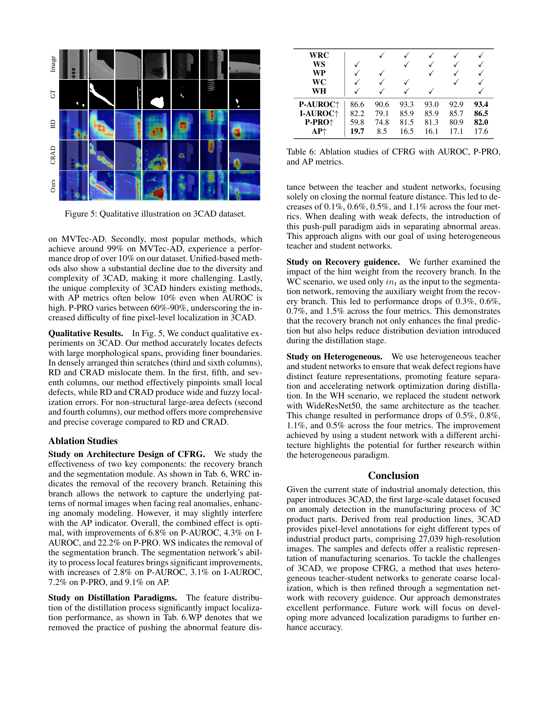

 


 2502.05761 
 Enquan Yang et el. 
 
 🤗 2025-02-14 
 



↗ arXiv


↗ Hugging Face


↗ Papers with Code


### TL;DR



산업 현장의 자동화된 품질 관리에 있어서 이미지 이상 탐지(IAD)의 중요성이 커지고 있습니다. 그러나 기존의 MVTec-AD나 VisA와 같은 데이터셋은 결함 샘플 수, 결함 유형, 실제 환경 반영 등의 측면에서 한계를 가지고 있습니다. 이러한 한계는 연구자들이 더욱 정확한 산업용 이상 탐지 기술을 개발하는 데 어려움을 야기합니다. 

본 논문에서는 **실제 3C 제조 라인에서 수집된 27,039개의 고해상도 이미지를 포함하는 대규모 이상 탐지 데이터셋 3CAD**를 제시합니다. 3CAD는 다양한 크기와 유형의 결함을 포함하고 있으며, 하나의 이미지에 여러 개의 결함 영역이 존재할 수도 있습니다. 또한, **비지도 학습 기반의 이상 탐지를 위한 새로운 프레임워크인 CFRG(Coarse-to-Fine detection paradigm with Recovery Guidance)**를 제시합니다. CFRG는 작은 결함을 탐지하기 위해, **거친 위치 파악(coarse localization)과 미세 위치 파악(fine localization)**의 두 단계를 거칩니다.  **회복(recovery)** 기능을 통해 정상 패턴을 더 잘 파악하고, 이를 탐지에 활용합니다. 실험 결과, CFRG는 3CAD 데이터셋에서 기존의 이상 탐지 방법들보다 우수한 성능을 보였으며, **향후 이상 탐지 분야의 발전에 기여**할 것으로 기대됩니다.



#### Key Takeaways


 실제 3C 제조 환경에서 수집된 대규모 이상 탐지 데이터셋 3CAD를 공개 



 작은 크기의 결함까지도 효과적으로 탐지하는 CFRG 프레임워크 제안 



 3CAD와 CFRG를 통해 기존 이상 탐지 방법의 성능을 능가하는 결과를 도출 


#### Why does it matter?
**본 논문은 3C 제품 제조 공정에서의 이상 탐지 분야에 크게 기여합니다.**  **실제 제조 환경에서 수집한 대규모 데이터셋(3CAD)을 제공하여, 기존의 합성 데이터셋의 한계를 극복하고 보다 현실적인 연구를 가능하게 합니다.** 또한, **제안된 CFRG 프레임워크는 작은 결함까지도 정확하게 찾아내는 성능을 보여주어, 관련 분야의 발전에 중요한 영향을 미칠 것으로 예상됩니다.**  더 나아가, **3CAD 데이터셋은 연구자들에게 공개되어, 지속적인 연구와 발전을 위한 토대를 마련할 것입니다.**

------
#### Visual Insights

> 🔼 그림 1은 기존의 역전 증류 패러다임과 제안된 패러다임을 비교하여 보여줍니다. 기존 방법은 역전 증류를 사용하여 이상 탐지 모델을 학습하지만, 제안된 방법은 정상 영역과 이상 영역을 구분하여 보다 정확하게 이상을 탐지하는 새로운 패러다임을 제시합니다. 그림의 첫 번째 줄 왼쪽은 기존의 역전 증류 방식을, 오른쪽은 본 논문에서 제안하는 새로운 방식을 보여줍니다.  제안된 방법은 정상 패턴을 더 잘 포착하기 위해 복구 기능을 추가하여 작은 결함도 효과적으로 탐지할 수 있도록 설계되었습니다.
> 

> 
read the caption

> Figure 1: Comparison of previous anomaly detection distillation paradigm with our paradigm. First row: Left: reverse distillation; Right: our proposed paradigm.
> 


| Category | Training Images | Test Images(all) | Test Images(good) | Test Images(defect) | Defect types | Image Height | Image Width | NE/TE |
|---|---|---|---|---|---|---|---|---|
| ACC | 784 | 1446 | 369 | 1077 | 10 | 288~1024 | 288~1024 | 1~6/1~1 |
| AI | 2096 | 2047 | 913 | 1134 | 3 | 760~1024 | 600~1024 | 1~10/1~2 |
| AMF | 1548 | 1479 | 731 | 748 | 5 | 540~1024 | 800~950 | 1~9/1~4 |
| ANMF | 1072 | 1406 | 670 | 736 | 6 | 400~1024 | 430~1024 | 1~6/1~2 |
| ANI | 2233 | 4936 | 999 | 3937 | 4 | 420~1024 | 580~1024 | 1~23/1~2 |
| AP | 1698 | 3161 | 911 | 2250 | 14 | 430~1024 | 409~1024 | 1~12/1~3 |
| CS | 409 | 959 | 196 | 763 | 1 | 1024~1024 | 1024~1024 | 1~9/1~1 |
| IS | 653 | 1112 | 295 | 817 | 4 | 1024~1024 | 1024~1024 | 1~12/1~2 |
| All | 10493 | 16546 | 5084 | 11462 | 47 | - | - | - |

> 🔼 3CAD 데이터셋의 통계적 개요를 보여주는 표입니다. 마지막 열의 NE는 각 결함 이미지 내의 이상 영역의 수를 나타내고, TE는 각 결함 이미지 내의 이상 유형의 수를 나타냅니다.  즉, 이 표는 3CAD 데이터셋에 포함된 이미지의 수, 각 카테고리별 이미지 수, 정상/결함 이미지 수, 결함 유형 수, 이미지 해상도, 결함 영역의 크기 및 개수 등의 정보를 제공하여 데이터셋의 특징을 요약합니다.
> 

> 
read the caption

> Table 1:  Statistical overview of the 3CAD dataset. The NE and TE in the last column indicate the number of anomalous regions and the number of anomalous types present in each defective image, respectively.
> 

### In-depth insights

#### 3C Anomaly Dataset
본 논문에서 제시된 3C 이상 탐지 데이터셋은 **실제 3C 제조 라인에서 수집된 27,039개의 고해상도 이미지**로 구성되어 있으며, **다양한 크기와 유형의 이상 영역**을 포함하고 있습니다.  기존 데이터셋의 한계를 극복하기 위해 **여러 종류의 결함(최소 8가지 이상)**과 **결함 이미지당 다수의 이상 영역 또는 유형**이 존재하는 특징을 가지고 있습니다. 이는 **실제 산업 환경의 복잡성을 반영**하며, 기존의 이상 탐지 모델의 성능을 평가하고 개선하는 데 유용한 **대규모 벤치마크 데이터셋**으로 활용될 수 있습니다.  특히 **소규모 결함 탐지의 어려움**을 고려하여 구성되었다는 점과 **다양한 재질의 부품**을 포함한다는 점은 주목할 만합니다.  **비지도 학습 기반 이상 탐지 모델 개발**에 중요한 역할을 할 것으로 예상됩니다.

#### CFRG Framework
3CAD 데이터셋의 독특한 과제를 해결하기 위해 제안된 **CFRG(Coarse-to-Fine detection paradigm with Recovery Guidance)** 프레임워크는 기존의 이상 탐지 방법론의 한계를 극복하고자 **이종(heterogeneous) teacher-student 네트워크 기반의 코스-파인(coarse-to-fine) 탐지** 전략과 **복원(recovery) 기반의 가이드라인**을 결합한 새로운 접근 방식을 제시합니다.  **이종 네트워크를 통해 다양한 특징을 추출**하여 작고 미묘한 결함까지 효과적으로 탐지하고, **복원 네트워크는 정상 패턴을 학습**하여 이상 영역의 정확한 위치 파악을 돕습니다.  **세분화된 위치 파악을 위해 세분화 네트워크를 활용**하여 정밀도를 높입니다.  즉, CFRG는 거친 위치 파악과 미세 위치 파악을 순차적으로 수행하여 효율성과 정확성을 동시에 높이는 전략을 채택합니다.  이러한 **다단계 접근 방식**은 3CAD 데이터셋의 복잡성과 다양한 결함 유형을 효과적으로 처리하는 데 기여하며,  향후 이상 탐지 분야 발전에 중요한 기여를 할 것으로 기대됩니다.

#### Benchmark Results
본 논문의 벤치마크 결과는 제안된 방법의 성능을 기존 방법들과 비교하여 보여줍니다. **3CAD 데이터셋과 MVTec-AD 데이터셋에서 다양한 알고리즘의 성능을 평가**하여, 제안된 방법이 특히 **작고 미묘한 결함 탐지에 강점**을 보임을 확인했습니다.  **기존 방법들은 3CAD 데이터셋에서 어려움**을 겪는 반면, 제안된 방법은 **높은 정확도**를 달성했습니다. 이는 제안된 방법의 **강건성 및 효율성**을 입증하는 결과입니다. 특히, P-AUROC 및 AP 지표에서 **상당한 성능 향상**을 보였으며, 정량적 결과 외에도 **정성적 결과 분석**을 통해 작은 결함의 정확한 위치 파악 능력을 시각적으로 보여주었습니다.  **다양한 지표를 활용한 종합적인 성능 분석**은 제안된 방법의 우수성을 뒷받침하며, 향후 연구 방향을 제시하는 중요한 근거가 됩니다.  **향후 연구에서는 3CAD 데이터셋의 다양성을 고려한 더욱 정교한 알고리즘 개발**이 필요할 것으로 예상됩니다.

#### Ablation Studies
본 논문의 "Ablation Studies" 부분은 제안된 CFRG 프레임워크의 핵심 구성 요소들의 기여도를 면밀히 분석하여 **모델 성능에 대한 통찰력을 제공**합니다. 특히, 복구 네트워크(recovery branch)와 분할 네트워크(segmentation module)의 제거를 통한 실험을 통해 각 구성 요소의 중요성을 정량적으로 평가하고, **복구 네트워크가 이상치 지역의 정확한 위치 파악에 도움**이 되는 반면, **분할 네트워크는 미세한 이상치의 정확도 향상**에 크게 기여함을 보여줍니다. 또한, 증류 과정에서 이상치 특징 벡터의 분포에 대한 연구를 통해 **이상치 특징 벡터의 분포 조절이 성능 향상에 중요**한 역할을 함을 밝히고 있습니다.  **다양한 실험 설계를 통해 각 구성 요소의 상호 작용 및 전체 모델 성능에 미치는 영향을 종합적으로 분석**하여, 제안된 CFRG 프레임워크의 강점과 한계를 명확히 제시하는 것이 특징입니다.  이는 향후 연구 방향 설정에 중요한 근거를 제시할 뿐 아니라, **모델의 신뢰성 및 일반화 성능 향상**을 위한 추가 연구를 촉진하는데 기여할 것입니다.

#### Future Research
본 논문에서 제시된 3CAD 데이터셋은 **실제 3C 제품 제조 라인에서 수집된 고해상도 이미지 27,039장**으로 구성되어 있으며, 다양한 크기와 유형의 이상 영역을 포함하고 있어 기존 데이터셋의 한계를 극복합니다.  향후 연구는 **3CAD 데이터셋의 규모를 더욱 확장**하여 더욱 다양한 제품과 결함 유형을 포함하는 것이 중요하며,  **다양한 딥러닝 모델의 성능을 비교 분석**하고, **약한 이상 탐지 성능 개선**을 위한 연구가 필요합니다.  또한, **CFRG 프레임워크의 한계점을 개선**하고, 보다 효율적이고 정확한 이상 탐지 방법론을 개발하는 연구가 필요합니다.  특히, **소형 및 은폐 결함 탐지 성능 향상**을 위한 새로운 알고리즘 개발은 3C 제조 분야에서 실질적인 도움을 줄 것입니다.  마지막으로, **다양한 센서 데이터와 결합**하여 3차원적인 이상 탐지 및 분석 기술 개발에 대한 연구도 중요한 과제입니다.

### More visual insights

More on figures

> 🔼 그림 2는 3CAD 데이터셋의 샘플 이미지들을 보여줍니다.  첫 번째 줄은 정상적인 제품 이미지이고, 두 번째 줄은 결함이 있는 제품 이미지입니다. 각 열은 3CAD 데이터셋에 포함된 여덟 가지 다른 종류의 3C 제품 부품 중 하나를 나타내며, 각 부품에 대해 정상 이미지와 결함 이미지가 한 쌍씩 제시됩니다. 이 그림을 통해 3CAD 데이터셋의 다양한 제품 종류와 결함 유형을 직관적으로 이해할 수 있습니다. 다양한 크기와 모양의 결함들이 포함되어 있음을 보여줍니다.
> 

> 
read the caption

> Figure 2: 3CAD dataset samples. The first row shows normal images, while the second row displays defective images.
> 

> 🔼 그림 3은 제안된 3CAD 데이터셋의 통계를 보여줍니다. (a)는 결함 영역 비율을, (b)는 결함 영역의 최소 경계 직사각형의 종횡비를 나타냅니다.  (a)는 이미지에서 결함이 차지하는 비율의 분포를 보여주며, 결함의 크기가 다양함을 시각적으로 보여줍니다. (b)는 결함의 형태가 다양함을 보여줍니다. 작은 결함부터 큰 결함까지, 그리고 다양한 형태의 결함이 포함되어 있음을 알 수 있습니다. 이러한 통계는 3CAD 데이터셋의 복잡성과 다양성을 보여주며, 이는 기존의 이상 탐지 방법론의 성능을 평가하는 데 있어 중요한 요소가 됩니다.
> 

> 
read the caption

> Figure 3: Statistics of the proposed 3CAD dataset: a) Defect area ratio. b) Aspect ratio of the minimum bounding rectangle for the defect area.
> 

> 🔼 그림 4는 제안된 CFRG 프레임워크를 보여줍니다. 이 프레임워크는 두 가지 구성 요소로 이루어져 있습니다. 첫째, 증류된 지역화 네트워크이고, 둘째, 복원된 힌트를 사용하는 개선된 분할 네트워크입니다. 훈련 중 첫 번째 단계에서, 정상 이미지(xn)와 이상 이미지(xa)는 교사 네트워크에 입력되고, 이상 이미지(xa)는 학생 네트워크에 입력됩니다. 그리고 교사와 학생 네트워크 간의 증류 손실이 계산됩니다. 두 번째 단계에서는, 첫 번째 단계의 지역화 가중치와 복구 분기의 힌트 가중치를 사용하여 교사 네트워크의 특징이 가중치가 부여되고, 그 후 분할 네트워크에 입력됩니다. 테스트 중에는, 복구 분기가 입력과 {Fir}i=1K를 사용하여 지역화 결과를 생성하고, 이는 분할 네트워크의 출력 Sout에 추가되어 최종 이상 맵을 얻습니다.
> 

> 
read the caption

> Figure 4: The proposed CFRG framework comprises two components: 1) a distilled localization network and 2) a refined segmentation network with restored hints. During training, in the first stage, xasubscript𝑥𝑎x_{a}italic_x start_POSTSUBSCRIPT italic_a end_POSTSUBSCRIPT and xnsubscript𝑥𝑛x_{n}italic_x start_POSTSUBSCRIPT italic_n end_POSTSUBSCRIPT are input into the teacher network, while xasubscript𝑥𝑎x_{a}italic_x start_POSTSUBSCRIPT italic_a end_POSTSUBSCRIPT is input into the student network, and the distillation loss between the teacher and the student is calculated. In the second stage, the teacher’s features are weighted using the first-stage localization weights and the recovery branch’s hint weights, then input into the segmentation network. During testing, the recovery branch generates the localization result from the input and {Fir}i=1Ksuperscriptsubscriptsuperscriptsubscript𝐹𝑖𝑟𝑖1𝐾\{F_{i}^{r}\}_{i=1}^{K}{ italic_F start_POSTSUBSCRIPT italic_i end_POSTSUBSCRIPT start_POSTSUPERSCRIPT italic_r end_POSTSUPERSCRIPT } start_POSTSUBSCRIPT italic_i = 1 end_POSTSUBSCRIPT start_POSTSUPERSCRIPT italic_K end_POSTSUPERSCRIPT, which is then added to the output So⁢u⁢tsubscript𝑆𝑜𝑢𝑡S_{out}italic_S start_POSTSUBSCRIPT italic_o italic_u italic_t end_POSTSUBSCRIPT of the segmentation network to obtain the final anomaly map.
> 

> 🔼 그림 5는 논문에서 제시된 3CAD 데이터셋의 질적 예시를 보여줍니다.  기존의 짧은 캡션을 보완하여, 그림이 3CAD 데이터셋의 다양한 결함 유형과 크기, 그리고 이러한 결함들을 기존의 이상 탐지 방법들이 얼마나 정확하게 탐지하는지에 대한 시각적 이해를 제공함을 설명합니다.  특히, 작고 미묘한 결함의 탐지 어려움과 큰 결함에 대한 탐지 성능 비교를 통해 3CAD 데이터셋의 난이도와 CFRG 기법의 강점을 보여주는 이미지들이 포함되어 있습니다.
> 

> 
read the caption

> Figure 5: Qualitative illustration on 3CAD dataset.
> 

> 🔼 그림 6은 3CAD 데이터셋의 정상 이미지들을 보여줍니다. 각 열은 서로 다른 제품을 나타내며, 각 행은 동일한 제품의 서로 다른 산업용 이미지들을 보여줍니다. 이 그림을 통해 3CAD 데이터셋에 포함된 다양한 제품들의 외관과 품질의 일관성을 확인할 수 있습니다.  각 제품은 제조 과정에서 발생할 수 있는 다양한 변수를 고려하여 촬영되었으며, 이를 통해 실제 산업 환경에서의 데이터를 보다 정확하게 반영하고자 하였습니다.
> 

> 
read the caption

> Figure 6: Normal visualization in 3CAD: Each column represents a product, and each row displays a different industrial image of that same product.
> 

> 🔼 그림 7은 3CAD 데이터셋의 이상 현상 시각화를 보여줍니다. 각 행은 다양한 제품과 위치에 걸쳐 서로 다른 이상 범주를 나타냅니다.  각 범주는 여러 제품의 이미지들을 포함하며, 각 이미지는 해당 범주에 속하는 이상 현상의 다른 예시들을 보여줍니다.  위에서부터 아래로, 범주는 다음과 같습니다: 융기(bump), 긁힘(scratch), 타박상(bruise), 상단 라인(upper line), 긁어낸 자국(scrape), 외층 휨(outer warping), 내층 휨(inner warping), 변색(discoloration). 이 그림은 3CAD 데이터셋의 다양성과 이상 현상의 복잡성을 보여주는 중요한 시각적 자료입니다.
> 

> 
read the caption

> Figure 7: Anomaly visualization in 3CAD: Each row represents a different anomaly category across various products and locations. From top to bottom, the categories are bump, scratch, bruise, upper line, scrape, outer warping, inner warping, and discoloration, respectively.
> 

> 🔼 그림 8은 3CAD 데이터셋의 이상 현상 시각화를 보여줍니다. 각 행은 다양한 제품과 위치에 걸쳐 서로 다른 이상 범주를 나타냅니다. 위에서부터 아래로 이상 범주는 고르지 않음, 변형, 철심 공기 흐름, 백화 현상, 검은 점, 워터마크, 과도한 세척, 오염으로 구성됩니다. 각 이미지는 이상 현상의 다양한 모양, 크기, 위치를 보여주며, 실제 제조 환경에서 발생하는 다양한 결함을 보다 잘 이해하는 데 도움이 됩니다.
> 

> 
read the caption

> Figure 8: Anomaly visualization in 3CAD: Each row represents a different anomaly category across various products and locations. From top to bottom, the categories are uneven, deformation, iron core airflow, whitening, black spots, watermarks, overwashing, dirt, respectively.
> 

More on tables


| Training | Images |
|---|---|
> 🔼 표 2는 기존의 인기있는 이상치 탐지(IAD) 데이터셋들과 제안된 3CAD 데이터셋을 비교 분석한 표입니다.  각 데이터셋의 특징들을 '정상 이미지 수', '이상치 이미지 수', '실제 세계 데이터 여부', '하나의 이미지 내 다중 결함 존재 여부(MDI)', '하나의 이미지 내 다중 결함 유형 존재 여부(MDT)'  다섯 가지 측면에서 비교하여, 3CAD 데이터셋이 실제 제조 환경을 더 잘 반영하고 다양한 유형 및 다수의 결함을 포함한다는 점을 보여줍니다. ✓는 해당 특징을 만족하는 데이터셋을, ✗는 만족하지 않는 데이터셋을 의미합니다.
> 

> 
read the caption

> Table 2:  Comparison with the current popular IAD datasets. ✓: Satisfied. ✗: Not satisfied. MDI: Multiple Defect Instances in One Image; MDT: Multiple Defect Types in One Image.
> 


| Test | Images(all) |
|---|---|
> 🔼 표 3은 제안된 3CAD 데이터셋에서 다양한 비지도 이상 탐지 알고리즘의 성능을 비교 분석한 결과를 보여줍니다. 각 제품군(ACC, AI, AMF, ANMF, ANI, AP, CS, IS)에 대한 P-AUROC(%)와 AP(%) 지표를 계산하여 제시하고, 전체 평균 성능 또한 제시합니다.  P-AUROC는 픽셀 단위의 이상 영역 검출 정확도를, AP는 이상 영역의 정밀도를 나타내는 지표입니다. 수치가 높을수록 알고리즘의 성능이 더 우수함을 의미합니다. 이 표는 제안된 방법의 성능을 기존 방법들과 비교하여, 제안된 방법의 우수성을 보여주는 근거로 사용됩니다.
> 

> 
read the caption

> Table 3:  Performance of popular IAD algorithms and our paradigm on 3CAD. We report the P-AUROC (%) and AP (%) metrics for each class, along with the average across all classes. Higher values indicate better performance.
> 


| Test | Images(good) |
|---|---|
> 🔼 표 4는 3CAD 데이터셋에서 여러 인기 IAD 알고리즘과 제안된 방법의 성능을 보여줍니다. 각 클래스에 대한 I-AUROC(%)와 P-PRO(%) 지표와 모든 클래스에 대한 평균값을 제시합니다.  높은 값은 더 나은 성능을 나타냅니다. 이 표는 제안된 방법이 기존 방법들에 비해 얼마나 효과적인지, 그리고 각 클래스별 성능 차이를 비교 분석하는 데 사용됩니다.  특히,  이미지 단위 이상 탐지(I-AUROC)와 픽셀 단위 지역 중첩(P-PRO) 지표를 통해 전체적인 성능과 국소화 정확도를 모두 평가합니다.
> 

> 
read the caption

> Table 4:  Performance of popular IAD algorithms and our paradigm on 3CAD. We report the I-AUROC (%) and P-PRO (%) metrics for each class, along with the average across all classes. Higher values indicate better performance.
> 


| Test | Images(defect) |
|---|---|
> 🔼 표 5는 다양한 범주에 걸쳐 평균화된 MVTec-AD 데이터셋에서 인기 있는 이상 탐지(IAD) 알고리즘의 성능을 비교한 표입니다.  각 알고리즘의 성능은 여러 지표(AP, P-AUROC, I-AUROC, P-PRO)를 사용하여 평가되었으며, 공식 논문에 해당 지표 값이 없는 경우 '-'로 표시되었습니다. 이 표는 다양한 IAD 알고리즘의 상대적 성능을 비교하고 MVTec-AD 데이터셋에서의 일반적인 성능 수준을 파악하는 데 도움을 줍니다.
> 

> 
read the caption

> Table 5:  Performance comparison of popular IAD algorithms on MVTec-AD, averaged across all categories. (-) indicates unavailable metrics in the official paper.
> 


| Defect | types |
|---|---|
> 🔼 표 6은 CFRG(Coarse-to-Fine detection paradigm with Recovery Guidance)의 성능에 대한 ablation study 결과를 보여줍니다. AUROC(Area Under the Receiver Operating Characteristic Curve), P-PRO(Pixel-wise Per-Region Overlap), AP(Average Precision) 세 가지 지표를 사용하여 CFRG 모델의 각 구성 요소(복구 분기, 분할 모듈, 증류 패러다임 등)를 제거하거나 변경했을 때의 성능 변화를 분석합니다. 이를 통해 각 구성 요소의 중요성과 CFRG 모델의 성능에 대한 기여도를 정량적으로 평가합니다.
> 

> 
read the caption

> Table 6:  Ablation studies of CFRG with AUROC, P-PRO, and AP metrics.
> 


| Image | Height |
|---|---|
> 🔼 표 7은 제안된 CFRG 방법의 성능을 보여주는 표입니다. MVTec AD 데이터셋을 사용하여 벤치마킹을 실시하였으며, P-AUROC, I-AUROC, P-PRO, AP 등 다양한 지표를 통해 정량적인 성능 평가를 수행하였습니다. 표에는 각 물체(Bottle, Cable, Capsule, Hazelnut, Metal nut, Pill, Screw, Toothbrush, Transistor, Zipper)에 대한 성능 지표 값과 평균 값이 제시되어 있습니다. 이 표를 통해 CFRG 방법이 널리 사용되는 데이터셋에서도 우수한 성능을 발휘함을 확인할 수 있습니다.
> 

> 
read the caption

> Table 7:  The detailed metrics of our method on the MVTec AD dataset demonstrate that CFRG also delivers strong performance on widely used datasets.
> 


| Image | Width |
|---|---|
> 🔼 표 8은 제안된 CFRG 방법의 성능을 보여주는 표입니다. MVTec AD 데이터셋에 대한 자세한 지표(P-AUROC, I-AUROC, P-PRO, AP)를 제시하여 CFRG가 널리 사용되는 데이터셋에서도 우수한 성능을 발휘함을 보여줍니다. 각 텍스처 카테고리(Carpet, Grid, Leather, Tile, Wood)별로 성능을 분석하여 일반적인 이상 탐지 방법과 비교했을 때 CFRG의 강점을 강조합니다.
> 

> 
read the caption

> Table 8:  The detailed metrics of our method on the MVTec AD dataset demonstrate that CFRG also delivers strong performance on widely used datasets.
> 


| NE |
|---|---| 
| / TE |
> 🔼 표 9는 손실 가중치에 대한 AUROC, P-PRO 및 AP 지표에 대한 연구 결과를 보여줍니다.  각 손실 가중치(Ldis, Lrec, Lbce)를 변화시켜가며 실험을 수행하여 성능에 미치는 영향을 분석했습니다.  각 손실 항목의 크기가 균형을 이루고 적절한 크기를 유지하는 것이 최적의 성능을 얻는 데 중요함을 보여줍니다.
> 

> 
read the caption

> Table 9:  Studies of Loss weight with AUROC, P-PRO, and AP metrics.
> 

### Full paper



