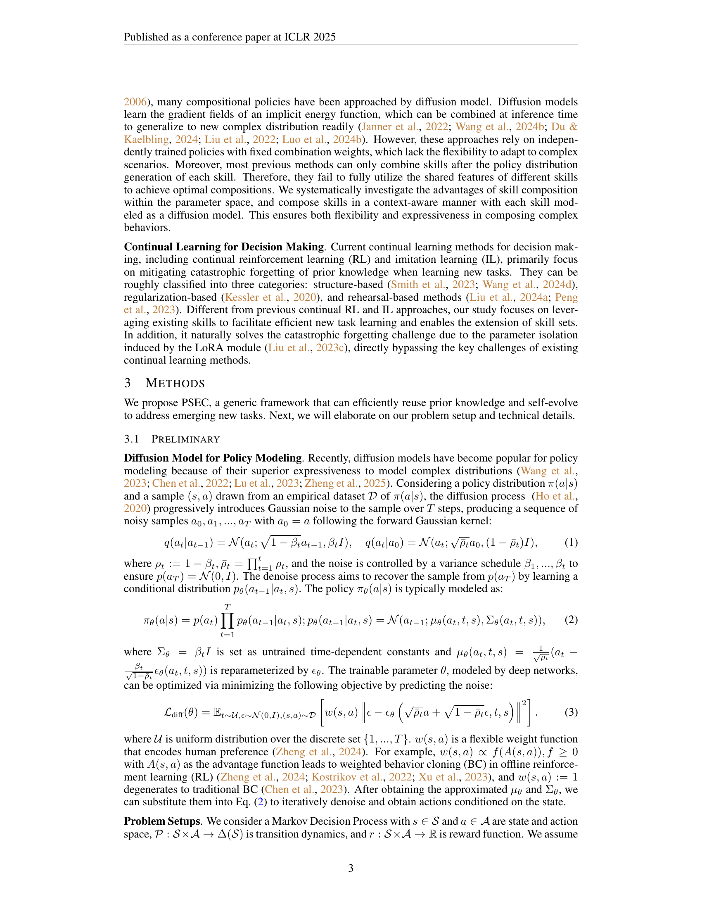
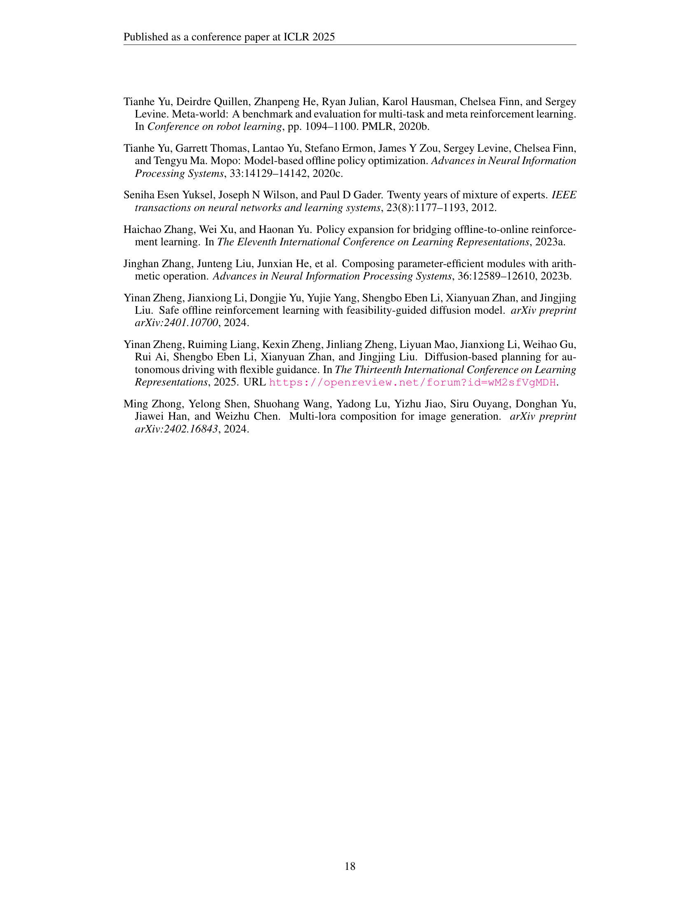

 


 2502.05932 
 Tenglong Liu et el. 
 
 🤗 2025-02-12 
 



↗ arXiv


↗ Hugging Face


↗ Papers with Code


### TL;DR



기존의 인공지능 에이전트는 새로운 기술을 학습할 때 제한적인 학습 효율성과 기존 지식 활용의 어려움에 직면합니다.  특히, 새로운 기술을 추가할 때 기존 기술의 성능 저하(Catastrophic forgetting) 문제가 발생하며, 이는 제한된 데이터로 새로운 기술을 효율적으로 학습하는 데 어려움을 초래합니다. 이러한 문제를 해결하기 위한 효율적인 방법이 부족합니다. 

본 연구에서는 매개변수 공간에서의 기술 확장 및 조합을 통한 새로운 프레임워크(PSEC)를 제안합니다. PSEC는 LoRA(Low-Rank Adaptation) 모듈을 이용하여 새로운 기술을 효율적이고 유연하게 확장하고, 문맥 인식 모듈을 통해 여러 기술을 동적으로 활성화하여 새로운 과제에 효과적으로 대처합니다.  실험 결과, PSEC는 기존 방법보다 우수한 성능을 보이며, 제한된 데이터를 효율적으로 활용하여 새로운 기술을 학습하는 데 효과적임을 보여줍니다.



#### Key Takeaways


 매개변수 공간에서의 기술 확장 및 조합을 통한 효율적인 지속 학습 프레임워크 제시 



 LoRA 모듈을 활용한 매개변수 효율적인 미세 조정 및 유연한 기술 확장 



 문맥 인식 모듈을 통한 다양한 기술의 동적 활성화 및 협업적 과제 해결 


#### Why does it matter?
이 논문은 **인공지능 에이전트의 지속적인 학습 및 적응 능력 향상**에 중요한 의미를 지닙니다. 기존의 제한적인 학습 효율성 및 새로운 기술 확장의 어려움을 극복하는 새로운 프레임워크를 제시함으로써, **자율 에이전트의 발전 및 다양한 응용 분야 확장**에 기여할 수 있습니다. 특히, **매개변수 효율적인 미세 조정 기법과 문맥 인식 모듈을 결합**하여 효율성을 높이고, 기존 지식을 활용하여 새로운 과제에 효과적으로 대처할 수 있는 방법을 제시합니다. 이는 **지속적인 학습 및 적응 능력이 중요한 다양한 분야**에 적용될 수 있는 잠재력을 가지고 있습니다.

------
#### Visual Insights

> 🔼 그림 1은 본 논문에서 제안하는 매개변수 기술 확장 및 구성(Parametric Skill Expansion and Composition, PSEC) 프레임워크와 다양한 시나리오에 대한 적용을 보여줍니다. (a)는 많은 기술 기본 요소들을 포함하고 새로운 LoRA 모듈을 추가하여 점진적으로 확장할 수 있는 기술 라이브러리를 유지 관리하는 방법을 보여줍니다. (b)는 새로운 작업을 해결하기 위해 기술 라이브러리의 여러 요소들을 적응적으로 구성하는 컨텍스트 인식 구성 네트워크를 학습시키는 방법을 보여줍니다. (c)는 이전 지식을 재사용하는 것이 중요한 다양한 애플리케이션에 PSEC 프레임워크가 적용될 수 있음을 보여줍니다.  즉, PSEC는 새로운 기술을 효율적으로 학습하고 기존 기술을 활용하여 새로운 과제에 효율적으로 대처할 수 있도록 설계된 프레임워크입니다.
> 

> 
read the caption

> Figure 1: PSEC framework and its application in diverse scenarios. (a) We maintain a skill library that contains many skills primitives and can progressively expand by adding new LoRA modules. (b) Then we train a context-aware compositional network to adaptively compose different elements in the skill library to solve new tasks. (c) PSEC framework is versatile to diverse applications where reusing prior knowledge is crucial.
> 


Task|BC reward ↑|BC cost ↓|CDT reward ↑|CDT cost ↓|CPQ reward ↑|CPQ cost ↓|COptiDICE reward ↑|COptiDICE cost ↓|FISOR reward ↑|FISOR cost ↓|ASEC reward ↑|ASEC cost ↓|NSEC reward ↑|NSEC cost ↓|PSEC reward ↑|PSEC cost ↓
easysparse|0.32|4.73|**0.05**|**0.10**|**-0.06**|**0.24**|0.94|18.21|**0.38**|**0.53**|0.95|5.8|**0.55**|**0.08**|**0.55**|**0.02**
easymean|0.22|2.68|**0.27**|**0.24**|**-0.06**|**0.24**|0.74|14.81|**0.38**|**0.25**|**0.63**|**0.75**|**0.39**|**0.54**|**0.37**|**0.00**
easydense|0.20|1.70|0.43|2.31|**-0.06**|**0.29**|0.60|11.27|**0.36**|**0.25**|0.85|5.28|0.76|1.45|**0.51**|**0.01**
mediumsparse|0.53|1.74|0.26|2.20|**-0.08**|**0.18**|0.64|7.26|**0.42**|**0.22**|0.93|2.52|**0.60**|**0.08**|**0.76**|**0.03**
mediummean|0.66|2.94|0.28|2.13|**-0.08**|**0.28**|0.73|8.35|**0.39**|**0.08**|0.74|1.00|0.82|2.87|**0.61**|**0.01**
mediumdense|0.65|3.79|**0.29**|**0.77**|**-0.08**|**0.20**|0.91|9.52|**0.49**|**0.44**|**0.81**|**0.52**|**0.76**|**0.27**|**0.66**|**0.02**
hardsparse|0.28|1.98|**0.17**|**0.47**|**-0.04**|**0.28**|0.34|7.34|**0.30**|**0.01**|**0.30**|**0.41**|0.34|1.21|**0.34**|**0.04**
hardmean|0.34|3.76|0.28|3.32|**-0.05**|**0.24**|0.36|7.51|**0.26**|**0.09**|0.46|1.05|**0.38**|**0.32**|**0.39**|**0.07**
harddense|0.40|5.57|0.24|1.49|**-0.04**|**0.24**|0.42|8.11|**0.30**|**0.34**|**0.36**|**0.82**|**0.19**|**0.03**|**0.34**|**0.07**
MetaDrive Average|0.40|3.21|0.25|1.45|**-0.06**|**0.24**|0.63|10.26|**0.36**|**0.25**|0.67|2.02|**0.53**|**0.76**|**0.50**|**0.03**
AntRun|0.73|11.73|0.70|1.88|**0.00**|**0.00**|0.62|3.64|**0.45**|**0.03**|0.74|4.97|0.79|6.81|**0.59**|**0.33**
BallRun|0.67|11.38|**0.32**|**0.45**|0.85|13.67|0.55|11.32|**0.18**|**0.00**|0.35|4.35|0.58|7.46|**0.15**|**0.95**
CarRun|0.96|1.88|0.99|1.10|1.06|10.49|**0.92**|**0.00**|**0.73**|**0.14**|**0.93**|**0.39**|**0.93**|**0.66**|**0.83**|**0.00**
DroneRun|0.55|5.21|**0.58**|**0.30**|0.02|7.95|0.72|13.77|**0.30**|**0.55**|0.57|2.29|0.62|7.3|**0.47**|**0.87**
AntCircle|0.65|19.45|0.48|7.44|**0.00**|**0.00**|0.18|13.41|**0.20**|**0.00**|0.46|5.55|0.36|2.08|**0.20**|**0.00**
BallCircle|0.72|10.02|0.68|2.10|0.40|4.37|0.70|9.06|**0.34**|**0.00**|0.54|1.58|0.58|2.08|**0.34**|**0.22**
CarCircle|0.65|11.16|0.71|2.19|0.49|4.48|0.44|7.73|**0.40**|**0.11**|0.41|2.86|0.40|2.62|**0.36**|**0.20**
DroneCircle|0.82|13.78|0.55|1.29|-0.27|1.29|0.24|2.19|**0.48**|**0.00**|0.65|3.60|0.71|4.93|**0.33**|**0.07**
BulletGym Average|0.72|10.58|0.63|2.09|0.32|5.28|0.55|7.64|**0.39**|**0.10**|0.58|3.20|0.62|4.24|**0.41**|**0.33**

> 🔼 표 1은 Liu et al.(2023a)의 DSRL 벤치마크 결과를 보여줍니다.  각 작업에 대해 다양한 방법의 보상과 비용을 제시합니다. 비용이 1 미만이면 안전함을 의미하며, 보상은 높을수록 좋고, 비용은 낮을수록 좋습니다. 결과는 20개의 평가 에피소드와 4개의 시드에 걸쳐 평균을 낸 것입니다. 비용이 1 미만인 에이전트는 굵게 표시되었고, 가장 높은 보상을 달성한 에이전트는 파란색으로 표시되었습니다. 이 표는 다양한 작업에 대한 여러 강화 학습 알고리즘의 성능을 비교 분석하여 제안된 방법의 효율성과 안전성을 보여줍니다.
> 

> 
read the caption

> Table 1: Normalized DSRL (Liu et al., 2023a) benchmark results. Costs below 1 indicates safety. ↑↑\uparrow↑: the higher the better. ↓↓\downarrow↓: the lower the better. Results are averaged over 20 evaluation episodes and 4 seeds. Bold: Safe agents with costs below 1.  Blue: Safe agents achieving the highest reward.
> 

### In-depth insights

#### Parametric Skill Learning
매개변수 기술 학습은 인공지능 에이전트가 **새로운 기술을 효율적으로 습득하고 기존 지식을 활용하여 빠르게 적응**하는 능력을 향상시키는 데 중점을 둡니다.  이는 기존의 **전체 모델 재학습 방식의 한계를 극복**하고, 새로운 기술을 효율적으로 통합하는 매개변수 효율적인 접근 방식을 제공합니다.  **저차원 매개변수 조정(Low-Rank Adaptation)** 과 같은 기술은 기존 모델에 미세 조정 가능한 모듈을 추가하여 효율성을 높이는 데 기여합니다. 이러한 접근 방식은 **기존 지식의 손실 없이 새로운 기술을 통합**하는 데 도움이 되며, **자원 소모를 최소화**하면서 에이전트의 기능을 확장할 수 있습니다.  **기술 조합(Skill Composition)** 은 여러 기술을 하나로 통합하여 새로운 복합 기술을 만들어내는 과정입니다. 매개변수 공간에서의 기술 조합은 공유된 정보를 활용하여 효율성을 높이고, **기술 간 상호 작용을 모델링**할 수 있습니다.  그러나 매개변수 공간에서의 기술 조합은 과도한 매개변수의 사용이나, 예측 불가능한 결과를 초래할 위험성도 존재한다는 점을 고려해야 합니다.  결론적으로, 매개변수 기술 학습은 인공지능 에이전트의 학습 효율성과 적응력을 향상시킬 수 있는 강력한 접근법이지만, **효율적인 매개변수 관리 및 기술 조합 전략**에 대한 추가적인 연구가 필요합니다.

#### Low-Rank Skill Adapt
**저차원 스킬 적응(Low-Rank Skill Adaptation)**은 기존의 고차원 매개변수 공간 전체를 조정하는 대신, **저차원의 낮은 순위(low-rank) 행렬을 이용하여 모델의 매개변수를 효율적으로 업데이트**하는 기법입니다. 이는 새로운 스킬을 학습할 때 계산 비용과 메모리 소모를 줄이는 데 효과적입니다.  이는 기존의 스킬들을 건드리지 않고 새로운 스킬을 추가하는 방식으로, **파라미터 효율성(parameter efficiency)**을 높이고 **파괴적 망각(catastrophic forgetting)** 문제를 해결하는 데 도움이 됩니다.  **저차원 행렬(low-rank matrix)**을 이용하여 스킬을 표현함으로써,  기존 모델의 주요 특징들을 유지하면서 새로운 스킬에 대한 정보만 효율적으로 추가할 수 있습니다. 특히,  본 논문에서는 이 기법을  **플러그 앤 플레이(plug-and-play)** 방식으로 모듈화하여, 다양한 스킬을 쉽게 조합하고 새로운 작업에 적용할 수 있도록 하는 데 초점을 맞추고 있습니다. 이를 통해, 에이전트가 **점진적으로 새로운 능력을 획득**하고 **기존 지식을 효과적으로 활용**하여 **새로운 과제에 효율적으로 대처**할 수 있도록 하는 것이 핵심입니다.

#### Skill Composition
본 논문에서 제시된 'Skill Composition' 개념은 **기존에 학습된 다양한 기술들을 효율적으로 결합하여 새로운 작업을 수행하는 방법**에 대한 심도있는 논의를 제공합니다. 이는 단순히 기존 기술들을 나열하는 것이 아니라, **파라미터 공간에서 직접적으로 기술들을 결합**함으로써, 기존 기술 간의 공유 정보를 최대한 활용할 수 있도록 설계되었습니다. 특히, **Low-Rank Adaptation (LoRA) 모듈을 활용하여 각 기술을 효율적으로 표현하고, 문맥 인식 모듈을 통해 상황에 맞는 기술들을 동적으로 활성화**함으로써, 유연하고 효율적인 기술 조합을 가능하게 합니다. 이러한 접근 방식은 다양한 응용 분야, 특히 다목적 기술 조합, 역동적인 환경 변화, 지속적인 정책 변화 등에 효과적으로 대처할 수 있습니다.  **기존의 기술 조합 방식과 비교하여 파라미터 공간에서의 조합은 상호 보완적인 구조를 활용하여 최적의 조합을 달성**할 수 있다는 점에서 큰 차별성을 보입니다.  결론적으로, 본 논문의 'Skill Composition' 개념은 **인공지능 에이전트의 자기 진화 능력 향상**에 크게 기여할 수 있는 혁신적인 기술 조합 방식을 제시합니다.

#### Context-Aware Module
논문에서 제시된 '컨텍스트 인식 모듈(Context-Aware Module)'은 **에이전트가 현재 상황을 이해하고 다양한 기술을 동적으로 결합하여 새로운 과제에 대처하는 핵심 구성 요소**입니다.  단순히 고정된 가중치로 기술들을 결합하는 기존 방법들과 달리, **컨텍스트 인식 모듈은 에이전트의 현재 상태(s)를 입력받아 상황에 맞는 최적의 기술 조합을 동적으로 생성**합니다. 이는 **상황에 따라 기술의 중요도를 유연하게 조정**하여, 예측 불가능한 환경이나 변화하는 목표에도 효율적으로 적응할 수 있음을 의미합니다.  **매개변수 공간에서 직접 기술들을 결합**하기 때문에, 기술 간 공유 정보를 효과적으로 활용하여 최적의 조합을 이끌어낼 수 있습니다.  **LoRA 모듈을 이용한 매개변수 효율적인 미세 조정**은 연산 비용을 절감하고, 플러그 앤 플레이 방식으로 새로운 기술을 통합하여 시스템의 확장성을 높입니다.  **다양한 실험 결과를 통해 컨텍스트 인식 모듈의 효과**를 검증하고, **다목적 구성, 지속적인 정책 변화, 역동적인 환경 변화** 등 다양한 상황에서 우수한 성능을 보여줌을 확인했습니다.  **본 모듈은 인간 수준의 자율 에이전트 개발을 위한 중요한 진전**을 제시하며, 향후 연구 방향에 대한 시사점을 제공합니다.

#### PSEC Limitations
PSEC의 한계는 크게 세 가지로 요약할 수 있습니다. 첫째, **기존 정책의 표현력에 대한 가정**입니다. PSEC는 사전 훈련된 정책이 다양한 분포를 잘 커버한다고 가정하지만, 그렇지 않을 경우 새로운 기술을 효율적으로 학습하는 데 어려움이 있을 수 있습니다.  둘째, **중복된 기술 확장** 문제입니다. PSEC는 평생 동안 모든 작업에 대한 정책을 기술 라이브러리에 유지하지만, 라이브러리가 방대해지면 계산 비용이 증가할 수 있습니다. 마지막으로 **하이퍼파라미터 튜닝**입니다. PSEC는 새로운 기술을 학습하기 위해 추가적인 하이퍼파라미터를 도입하며, 이는 튜닝에 대한 부담을 증가시킵니다. 이러한 한계를 극복하기 위한 몇 가지 해결책으로는 사전 훈련된 정책의 분포 범위를 확장하거나, 중복된 기술을 제거하는 평가 지표를 개발하고, 하이퍼파라미터 튜닝 전략을 개선하는 것이 있습니다.  **특히, 효율적인 기술 관리 전략과 하이퍼파라미터 최적화 방안은 향후 연구에서 중요한 과제**가 될 것입니다.

### More visual insights

More on figures

> 🔼 그림은 새로운 기술을 학습하기 위해 LoRA 모듈을 사용하는 방법을 보여줍니다. (a)는 기존의 사전 훈련된 모델에 LoRA 어댑터 가중치를 추가하여 새로운 기술을 효율적으로 학습하는 과정을 나타냅니다.  기존 모델의 가중치는 고정된 상태로 유지되고, LoRA 모듈만 학습되므로, 기존 기술이 손상되지 않고 새로운 기술을 효율적으로 추가할 수 있습니다. 각각의 기술은 별도의 LoRA 모듈에 인코딩되어 관리되며, 필요에 따라 추가하거나 제거할 수 있는 플러그 앤 플레이 방식으로 구성됩니다.
> 

> 
read the caption

> (a) Learning new skills using LoRA modules.
> 

> 🔼 그림 (b)는 서로 다른 LoRA 모듈을 결합하여 새로운 기술을 보간하는 방법을 보여줍니다. 각 LoRA 모듈은 특정 기술을 나타내는 고유한 매개변수 집합을 포함하고 있으며,  α 값을 조정하여 여러 LoRA 모듈의 가중치를 조절하여 새로운 기술을 생성할 수 있습니다. 이를 통해 에이전트는 기존 기술을 기반으로 새로운 기술을 효율적으로 학습하고 적응할 수 있습니다.
> 

> 
read the caption

> (b) Interpolation in LoRA modules.
> 

> 🔼 그림 2는 새로운 기술을 효율적으로 학습하는 방법을 보여줍니다. (a)는 각 기술이 별도의 LoRA 모듈에 인코딩되는 것을 보여주는 반면, (b)는 구성 가중치 αi 를 조정하여 서로 다른 LoRA 모듈을 결합하여 새로운 기술을 보간하는 방법을 보여줍니다.  즉, 기존에 학습된 여러 기술들을 LoRA 모듈 형태로 관리하고, 새로운 작업에 필요한 기술을 만들기 위해 이들 모듈의 가중치를 조정하여 결합하는 과정을 보여줍니다. 이를 통해 기존 지식을 활용하여 새로운 기술을 효율적으로 확장하고 적응하는 방법을 제시합니다.
> 

> 
read the caption

> Figure 2: (a) Each skill is encoded in separate LoRA modules respectively. (b) By adjusting the composing weights αisubscript𝛼𝑖\alpha_{i}italic_α start_POSTSUBSCRIPT italic_i end_POSTSUBSCRIPT, different LoRA modules can merge together to interpolate new skills.
> 

> 🔼 그림 3은 파라미터, 노이즈, 액션 세 가지 수준에서의 스킬 조합 방식을 비교한 것입니다. 파라미터 수준 조합은 스킬 간 공유 또는 상호 보완적인 구조를 활용하여 새로운 스킬을 생성하는 유연성을 제공합니다. 반면 노이즈 및 액션 수준 조합은 이러한 정보를 활용하기에는 시점이 너무 늦습니다.  즉, 파라미터 수준에서 스킬을 조합하면 스킬 간의 정보를 최대한 활용하여 효율적이고 효과적인 새로운 스킬을 생성할 수 있습니다.  반면 노이즈나 액션 수준에서 조합하는 경우 이미 정보가 처리된 후이기 때문에 이러한 정보를 활용하는 데 제한이 있습니다.
> 

> 
read the caption

> Figure 3: Comparison between parameter-, noise-, and action-level composition. Parameter-level composition offers more flexibility to leverage the shared or complementary structure across skills to compose new skills. Noise- and action-level composition, however, is too late to benefit from this information.
> 

> 🔼 그림 4는 매개변수 공간, 잡음 공간 및 행동 공간에서 서로 다른 기술의 샘플에 대한 t-SNE 투영을 보여줍니다. 매개변수 공간은 기술 구성에 적합한 구조를 보여주는 반면, 기술 간 공통 지식을 공유하면서 혼동을 피하기 위해 고유한 특징을 유지합니다. 잡음 공간과 행동 공간은 기술을 명확하게 구분하거나 기술 간 공유 구조를 포착하기에는 너무 잡음이 많거나 구조가 부족합니다. 자세한 내용은 부록 C.4를 참조하세요.
> 

> 
read the caption

> Figure 4: t-SNE projections of samples from different skills in parameter, noise, and action space. The parameter space exhibits a good structure for skill composition, where skills share common knowledge while retaining their unique features to avoid confusion. Noise and action spaces are either too noisy to clearly distinguish between skills or fail to capture the shared structure across them. See Appendix C.4 for details.
> 

> 🔼 그림 5는 MetaDrive-easymean 작업에서 평가된 상황 인식 모듈의 출력 가중치를 보여줍니다. 이 네트워크는 실시간 요구사항을 처리하기 위해 가중치를 동적으로 조정합니다. 차량이 장애물에 접근하거나 경계선을 피하면서 회전할 때는 안전 정책을 우선시합니다. 장애물이 없고 작업이 단순히 직진하는 경우에는 보상을 극대화하고 안전을 유지하는 데 중점을 둡니다.  즉, 상황에 따라 안전과 보상 사이의 균형을 동적으로 조절하는 것을 보여줍니다.
> 

> 
read the caption

> Figure 5: Output weights of context-aware modular evaluated on the MetaDrive-easymean task. The network dynamically adjusts the weights to handle real-time demands: It prioritizes safety policies when the vehicle approaches obstacles or navigates a turn while avoiding boundary lines. When there are no obstacles and the task is simply to drive straight, the focus shifts to maximizing rewards and maintaining some safety insurance.
> 

> 🔼 그림 6(a)는 다양한 양의 학습 데이터를 사용하여 PSEC의 샘플 효율성을 보여줍니다. 특히 데이터가 부족한 경우(예: 10개의 궤적만) PSEC가 우수한 샘플 효율성을 달성함을 보여줍니다. 이는 제한된 양의 데이터로도 PSEC가 우수한 성능을 달성할 수 있음을 시사합니다.
> 

> 
read the caption

> (a) Sample efficiency.
> 

> 🔼 그림 6(b)는 다양한 방법들을 사용하여 스탠드(S)에서 워크(W)로의 정책 전환에 대한 훈련 효율성을 보여줍니다. PSEC은 다른 방법들에 비해 훨씬 적은 훈련 단계만으로도 우수한 성능에 도달하는 것을 보여줍니다. 이는 PSEC의 매개변수 효율적인 구조와 이전 지식을 활용하는 능력이 훈련 효율성을 크게 향상시킨다는 것을 시사합니다.
> 

> 
read the caption

> (b) Training efficiency.
> 

> 🔼 그림 6(c)는 문맥 인식 모듈의 효과를 보여줍니다.  PSEC, NSEC, ASEC 세 가지 방법에 대해 문맥 인식 모듈을 사용한 경우와 사용하지 않은 경우의 성능을 비교합니다.  문맥 인식 모듈을 사용하지 않은 경우(w/o CA)는 고정된 가중치를 사용하여 스킬을 조합하는 반면, 문맥 인식 모듈을 사용한 경우(PSEC)는 실시간 상황에 따라 스킬의 가중치를 동적으로 조정합니다.  그 결과, 문맥 인식 모듈을 사용한 경우(PSEC)가 고정된 가중치를 사용한 경우보다 성능이 훨씬 뛰어남을 보여줍니다.  이것은 다양한 상황에 적응력이 뛰어난 PSEC의 효율성을 강조합니다.
> 

> 
read the caption

> (c) Context-aware efficiency.
> 

> 🔼 그림 6은 제한된 데이터를 사용하여 새로운 기술을 효율적으로 학습하는 PSEC의 능력을 보여줍니다.  (a)는 다양한 크기의 훈련 데이터셋을 사용하여 PSEC의 샘플 효율성을 보여줍니다. 특히 데이터가 부족한 경우(예: 10개의 기록) PSEC는 탁월한 성능을 보여줍니다. (b)는 PSEC가 구성 없이도 우수한 성능을 빠르게 달성할 수 있음을 강조하여, LoRA 모듈의 효과를 보여줍니다. (c)는 상황 인식 모듈의 효과를 보여주는 다양한 방법들을 비교 분석한 결과입니다. S, W, R은 각각 서기, 걷기, 달리기를 나타내며 각 값은 10 에피소드와 5개 시드에 대해 평균을 낸 값입니다.
> 

> 
read the caption

> Figure 6: Comparisons on sample and training efficiency and the effectiveness of context-aware modular. S, W, R denote stand, walk and run, respectively. Each value is averaged over 10 episodes and 5 seeds.
> 

> 🔼 그림 7은 역동적인 환경 변화 설정에서 수행된 실험 결과를 보여줍니다. 10개의 에피소드와 5개의 시드를 사용하여 평균을 냈습니다.  '-m', '-mr', '-me'는 D4RL (Fu et al., 2020) 데이터셋에서 medium, medium-replay, medium-expert-v2 데이터를 각각 사용했음을 나타냅니다. 이 그림은 다양한 알고리즘의 성능을 비교 분석하여 역동적인 환경 변화에 대한 적응력을 평가합니다.  각 알고리즘의 평균 점수와 표준 편차를 보여줍니다.
> 

> 
read the caption

> Figure 7: Results in the dynamics shift setting over 10 episodes and 5 seeds. -m, -mr and -me refer to 𝒟o𝒫1superscriptsubscript𝒟𝑜subscript𝒫1\mathcal{D}_{o}^{\mathcal{P}_{1}}caligraphic_D start_POSTSUBSCRIPT italic_o end_POSTSUBSCRIPT start_POSTSUPERSCRIPT caligraphic_P start_POSTSUBSCRIPT 1 end_POSTSUBSCRIPT end_POSTSUPERSCRIPT sampling from medium, medium-replay and medium-expert-v2 data in D4RL (Fu et al., 2020), respectively.
> 

> 🔼 이 그림은 LoRA의 rank(차원 축소 정도)를 변경했을 때 지속적인 정책 변화 설정에서 PSEC의 성능에 미치는 영향을 보여줍니다. LoRA rank가 커질수록 매개변수가 증가하여 과적합이 발생할 수 있지만, rank가 너무 작으면 모델의 표현력이 제한될 수 있습니다. 이 실험은 다양한 rank 값을 사용하여 최적의 rank를 찾는 과정을 보여줍니다.  결과적으로, rank 8이 가장 좋은 성능을 보이는 것을 확인할 수 있습니다.
> 

> 
read the caption

> Figure 8: Ablations on LoRA ranks.
> 

> 🔼 그림 9는 지속적인 학습 환경에 배포될 때 PSEC과 다른 모듈식 다중 작업 학습 프레임워크 간의 비교를 설명합니다.  PSEC은 기존 기술과 비교하여 지속적인 학습 상황에서 새로운 기술을 효율적으로 확장하고 구성하는 방법을 보여줍니다. 그림은 하드 파라미터 공유, 소프트 파라미터 공유, 그리고 PSEC의 세 가지 접근 방식을 보여줍니다. 각 접근 방식은 지속적인 학습에서 여러 작업에 대한 기술 학습 및 구성에 대한 고유한 접근 방식을 강조합니다. PSEC은 새로운 작업에 적응하기 위해 기존의 기술을 효율적으로 활용하고 새로운 기능을 통합하는 방법을 보여줍니다.
> 

> 
read the caption

> Figure 9: Illustrative comparisons between PSEC and other modularized multitask learning frameworks when deployed to continual learning settings.
> 

> 🔼 그림 10은 지속적인 정책 변화 설정에서의 결과를 보여줍니다. 각 값은 10개의 에피소드와 5개의 시드에 걸쳐 평균을 낸 것입니다. 이 그림은 에이전트가 연속적으로 새로운 작업에 직면할 때 기존 기술을 활용하여 효율적으로 새로운 기술을 학습하고, 이를 통해 지속적으로 진화하는 능력을 보여줍니다. 이 그림은 다양한 지속적인 정책 변화 시나리오에 걸쳐 PSEC 프레임워크의 성능을 보여주는 여러 하위 그림으로 구성되어 있습니다.
> 

> 
read the caption

> Figure 10: Results in the policy shift setting. Each value is averaged over 10 episodes and 5 seeds.
> 

> 🔼 그림 11은 본 논문의 지속적인 정책 변화 설정에서 DeepMind Control Suite에 대한 에이전트의 지속적인 진화 과정을 보여줍니다.  에이전트는 먼저 서기(stand) 기술을 학습하고, 이어서 걷기(walk) 기술을 학습한 다음, 서기 및 걷기 기술을 결합하여 달리기(run) 기술을 학습합니다. 이 그림은 각 단계에서 에이전트의 성능과 기술 습득 과정을 시각적으로 나타내어 지속적인 학습 능력과 기존 지식의 활용을 보여줍니다.  각 기술 학습 단계별 점수 변화를 보여주며, 지속적 학습을 통해 에이전트의 능력이 어떻게 발전하는지 보여줍니다.
> 

> 
read the caption

> Figure 11: Continual evolution on DeepMind Control Suite for Continual policy shift.
> 

> 🔼 그림 6(a)는 다양한 양의 학습 데이터를 사용하여 PSEC의 샘플 효율성을 보여줍니다. 특히 데이터가 부족한 경우(예: 10개의 궤적만 사용) PSEC가 뛰어난 샘플 효율성을 달성함을 보여줍니다. 또한, PSEC는 합성 없이도 우수한 성능에 빠르게 도달할 수 있으며, 이는 LoRA 모듈의 효과를 강조합니다.
> 

> 
read the caption

> (a) Sample efficiency.
> 

> 🔼 그림 6(b)는 다양한 방법들을 사용하여 학습 효율성을 비교한 그래프입니다. 특히, 제한된 데이터(예: 10개의 기록)가 있는 경우 PSEC이 우수한 샘플 효율성을 달성함을 보여줍니다. 또한, PSEC은 합성 없이도 신속하게 우수한 성능에 도달할 수 있음을 보여주는데, 이는 LoRA 모듈의 효율성을 강조합니다. 따라서, 기존의 방법들이 상당한 수의 경사도 단계와 데이터를 필요로 하는 반면, PSEC은 거의 모든 과업에서 5만 회 미만의 경사도 단계를 학습하는 데 충분합니다.
> 

> 
read the caption

> (b) Training efficiency.
> 

> 🔼 그림 6(c)는 문맥 인식 모듈의 효과를 보여줍니다. 문맥 인식 모듈이 없는 PSEC, NSEC, ASEC의 성능과 비교하여 문맥 인식 모듈이 있는 PSEC의 성능을 보여줍니다. 다양한 조합 수준에서 문맥 인식 모듈이 고정된 조합보다 일관되게 우수한 성능을 보여주는 것을 보여줍니다. 이는 실시간 환경 변화에 따라 기술을 역동적으로 조정하는 것이 중요함을 강조합니다.
> 

> 
read the caption

> (c) Context-aware efficiency.
> 

> 🔼 그림 12는 제한된 데이터로 새로운 기술을 효율적으로 학습하고 에이전트의 기능을 점진적으로 발전시키는 데 초점을 맞춘 매개변수 기술 확장 및 구성(PSEC) 프레임워크의 성능을 보여줍니다. 이 그림은 다양한 데이터 양을 사용하여 새로운 기술을 학습하는 데 필요한 샘플 수(샘플 효율성)와 다양한 방법을 사용하여 새로운 기술을 학습하는 데 필요한 훈련 단계 수(훈련 효율성), 그리고 상황 인식 모듈의 효과를 보여주는 비교 실험 결과를 보여줍니다.  'S'는 'Stand(서기)'를, 'R'은 'Run(달리기)'를 의미하며, 각 값은 10 에피소드와 5개의 시드에 걸쳐 평균을 낸 결과입니다.
> 

> 
read the caption

> Figure 12: Comparisons on sample and training efficiency and the effectiveness of context-aware modular. S, R denote stand, run, respectively. Each value is averaged over 10 episodes and 5 seeds.
> 

> 🔼 그림 13은 본 논문의 역동적 변화 설정에 대한 소스 도메인과 타겟 도메인을 보여줍니다.  역동적 변화 설정은 로봇의 동작 역학(dynamics)과 형태(morphology)에 변화를 주어 시뮬레이션 환경의 역동성을 반영합니다. 그림에서 보이는 것처럼, 소스 도메인은 수정된 역학(P0) 하에서 수집된 데이터로 구성되며, 마찰, 중력, 허벅지 크기 등의 요소가 수정될 수 있습니다. 타겟 도메인은 원래의 D4RL 역학(P1) 하에서 수집된 데이터로 구성되며, 다양한 로봇 유형(Cheetah, Walker)과 난이도(medium, medium-replay, medium-expert)가 포함됩니다. 이 그림은 소스 도메인의 데이터를 사용하여 학습된 정책(π0)이 타겟 도메인의 제한된 데이터를 활용하여 타겟 과제에 적응하는 과정을 시각적으로 보여주는 역할을 합니다.
> 

> 
read the caption

> Figure 13: The illustration of the source and target domains for the dynamic shift setting.
> 

> 🔼 그림 14(a)는 지속적인 정책 변화 설정에서 고정된 조성 방법을 사용하여 생성된 궤적을 분석하기 위해 컨텍스트 인식 모듈을 사용한 결과를 보여줍니다. 구체적으로, S→R 작업에 대해 고정된 조성 방법은 π0과 π2를 16의 고정된 α 값을 사용하여 합성하는 Wrun = Wo + AW2를 사용합니다. 고정된 가중치를 사용한 조성 방법은 때때로 정지 또는 추락과 같은 지역적 최적이 아닌 행동에 갇힐 수 있음을 명확히 보여줍니다. 따라서 현재 상태에 맞는 전략의 가중치를 조정하는 것이 필요합니다. 그림 14(b)는 PSEC이 생성한 궤적을 보여줍니다. 컨텍스트 인식 모듈을 사용하여 에이전트는 기술 간에 미세한 조정을 하고 전 에피소드에 걸쳐 안정적으로 실행할 수 있음을 분명히 보여줍니다.
> 

> 
read the caption

> (a) Fixed composition on S→→\rightarrow→R task
> 

> 🔼 그림 (b)는 본 논문에서 제안하는 PSEC 프레임워크를 사용하여 'S→R' 작업(즉, 멈춤 → 달리기 작업)을 수행하는 과정을 보여줍니다. 이 그림은 다양한 단계의 에이전트 행동을 시각적으로 보여주는 시계열 데이터를 나타냅니다.  이를 통해, PSEC 프레임워크가 문맥 인식 조합 네트워크를 통해 여러 기술을 역동적으로 조합하여 새로운 과제를 효율적으로 해결하는 능력을 시각적으로 보여줍니다.  특히, 'S→R' 과제는 에이전트가 단순히 멈춰 있는 것에서부터 점진적으로 걷고, 마지막으로 달리는 행동으로 전환되는 과정을 포함합니다. 이는 에이전트가 이전에 습득한 기술을 효율적으로 활용하여 새로운 기술을 획득하고 적응하는 능력을 잘 보여줍니다.
> 

> 
read the caption

> (b) PSEC on S→→\rightarrow→R task
> 

More on tables


| MetaDrive |
|---|---| 
| Average |

> 🔼 표 2는 지속적인 정책 변화 설정에서의 결과를 보여줍니다.  에이전트가 먼저 '서기' 기술을 학습한 다음, '걷기' 기술을 학습하고, 마지막으로 '달리기' 기술을 학습하는 연속적인 과정을 거칩니다. '걷기'와 '달리기' 작업에는 각각 10개의 궤적만 제공됩니다. 이 표는 각 단계에서의 에이전트 성능을 보여주며, 이전 기술을 활용하여 새로운 기술을 효율적으로 학습하는 PSEC의 능력을 강조합니다.
> 

> 
read the caption

> Table 2: Results in policy shift setting. S, W, R denote stand, walk and run. 10 trajectories are provided for W and R tasks
> 


| BulletGym |
|---|---| 
| Average |
> 🔼 표 5는 논문에서 다루는 18개의 사전 학습된 작업에 대한 성능 비교 결과를 보여줍니다.  각 작업에 대해 Scratch(처음부터 학습), ASEC(액션 레벨 합성), NSEC(잡음 레벨 합성), PSEC(매개변수 공간 합성) 네 가지 방법의 성공률을 비교하여 PSEC 방법의 우수성을 보여줍니다.  이 표는 PSEC의 효율성과 다양한 작업에 대한 적응력을 강조합니다.
> 

> 
read the caption

> Table 5: Performance comparison on 18 pretrained tasks.
> 


|           | S→W | S→R | S+W→R |
| :-------- | :-: | :-: | :-: |
| Scratch   | 58.9 | 25.5 | 25.5 |
| ASEC      | 65.7 | 24.3 | 30.8 |
| NSEC      | 320.9 | 38.5 | 39.4 |
| PSEC (MLP)| 424.1 | 143.3 | 194.5 |
| **PSEC** | **688** | **221** | **247** |
> 🔼 이 표는 논문의 실험 결과 중 하나로,  12개의 미리 본 적 없는 새로운 작업(unseen tasks)에 대해, 제한된 데이터(few-shot learning)를 사용하여 PSEC(Parametric Skill Expansion and Composition) 모델의 성능을 평가한 결과를 보여줍니다.  각 작업에 대한 성공률(success rate)을 비교하여 PSEC 모델의 적응력과 효율성을 다른 방법들과 비교 분석합니다.
> 

> 
read the caption

> Table 6: Few-shot performance comparison on 12 unseen tasks.
> 


| Methods | Success Rate |
|---|---| 
| L2M | 0.65 |
| L2M-oracle | 0.77 |
| L2P-Pv2 | 0.40 |
| L2P-PreT | 0.34 |
| L2P-PT | 0.23 |
| EWC | 0.17 |
| L2 | 0.10 |
| PSEC (Ours) | **0.87** |
> 🔼 표 7은 모델이 사전에 학습된 지식을 활용하여 전혀 접해보지 못한 12가지 새로운 작업에 대해 성능을 평가한 결과를 보여줍니다.  각 작업에 대한 성공률을 보여주는 것으로, 제로샷 학습 환경에서 PSEC 모델의 일반화 능력을 평가하는 데 중점을 두고 있습니다.  ASEC, NSEC 및 Scratch와 비교하여 PSEC의 성능 우수성을 확인할 수 있습니다.
> 

> 
read the caption

> Table 7: Zero-shot performance comparison on 12 unseen tasks.
> 


| Tasks | PSEC |
|---|---| 
| peg-unplug-side-v2 | 0.87 |
| window-close-v2 | 0.88 |
| shelf-place-v2 | 0.85 |
| push-v2 | 0.89 |
| handle-press-side-v2 | 0.95 |
| stick-pull-v2 | 0.74 |
| push-back-v2 | 0.85 |
| faucet-close-v2 | 0.92 |
| push-wall-v2 | 0.86 |
| hammer-v2 | 0.91 |
| **Mean** | **0.87** |
> 🔼 표 8은 D4RL(Fu et al., 2020) 데이터셋의 세 가지 버전(medium, medium-replay, medium-expert V2)에서 각각 10 에피소드와 5개의 시드를 사용하여 역동적인 환경 변화 설정에서의 결과를 보여줍니다.  다양한 알고리즘(BC, MOPO, CQL, IQL, DOGE, TSRL, Joint train(Gravity, Friction, Thigh) 그리고 PSEC)의 성능을 비교하여 역동적인 시스템 변화에 대한 각 알고리즘의 적응력을 평가합니다.  -m, -mr, -me는 각각 medium, medium-replay, medium-expert V2 데이터셋을 나타냅니다.
> 

> 
read the caption

> Table 8: Results in the dynamics shift setting over 10 episodes and 5 seeds. -m, -mr and -me refer to 𝒟o𝒫1superscriptsubscript𝒟𝑜subscript𝒫1\mathcal{D}_{o}^{\mathcal{P}_{1}}caligraphic_D start_POSTSUBSCRIPT italic_o end_POSTSUBSCRIPT start_POSTSUPERSCRIPT caligraphic_P start_POSTSUBSCRIPT 1 end_POSTSUBSCRIPT end_POSTSUPERSCRIPT sampling from medium, medium-replay and medium-expert V2 data in D4RL (Fu et al., 2020), respectively.
> 


| Tasks | Scratch | ASEC | NSEC | PSEC |
|---|---|---|---|---|
| peg-insert-side-v2 | 0.50 | 0.87 | 0.88 | **0.90** |
| peg-unplug-side-v2 | 0.35 | 0.61 | 0.78 | **0.86** |
| button-press-topdown-v2 | 0.71 | 0.88 | 0.88 | **0.89** |
| push-back-v2 | 0.26 | 0.61 | 0.76 | **0.88** |
| window-close-v2 | 0.65 | 0.84 | 0.84 | **0.88** |
| door-open-v2 | 0.74 | 0.85 | **0.86** | **0.86** |
| handle-press-v2 | 0.67 | 0.96 | **0.97** | **0.97** |
| plate-slide-side-v2 | 0.27 | 0.23 | 0.53 | **0.74** |
| handle-pull-side-v2 | 0.76 | 0.94 | 0.94 | **0.95** |
| window-open-v2 | 0.87 | 0.75 | 0.88 | **0.89** |
| door-close-v2 | 0.90 | 0.89 | 0.89 | **0.91** |
| reach-v2 | 0.89 | **0.95** | **0.95** | **0.95** |
| push-v2 | 0.15 | 0.58 | 0.81 | **0.92** |
| stick-push-v2 | 0.44 | 0.54 | 0.17 | **0.79** |
| drawer-close-v2 | **0.97** | **0.97** | **0.97** | **0.97** |
| plate-slide-back-v2 | 0.90 | 0.94 | 0.94 | **0.95** |
| coffee-button-v2 | 0.91 | 0.94 | 0.94 | **0.95** |
| hand-insert-v2 | 0.30 | 0.68 | 0.63 | **0.89** |
| **Mean** | 0.62 | 0.78 | 0.81 | **0.90** |
> 🔼 표 9는 다목적 합성 작업을 위한 하이퍼파라미터들을 보여줍니다.  표에는 다목적 강화학습 에이전트를 훈련시키는 데 사용된 다양한 하이퍼파라미터들의 값이 포함되어 있습니다.  여기에는 공유 하이퍼파라미터(예: 정규화된 상태, 목표 업데이트 비율, 예측값 τ, 할인율 γ)와 각 네트워크 (π₀, π₁, π₂, α(s; θ))에 대한 고유 하이퍼파라미터(예: 활성화 함수, 옵티마이저, 히든 층 크기, 학습률 등)가 포함됩니다.  각 하이퍼파라미터는 네트워크 구조, 학습 과정, 최적화 알고리즘에 대한 자세한 정보를 제공합니다.  이러한 하이퍼파라미터들을 조정하여 다목적 강화학습 에이전트의 성능을 최적화할 수 있습니다.
> 

> 
read the caption

> Table 9: Hyperparameters for multi-objective composition tasks.
> 


| Tasks | ASEC | NSEC | PSEC |
|---|---|---|---|
| plate-slide-v2 | 0.14 | 0.66 | **0.89** |
| handle-press-side-v2 | 0.73 | 0.65 | **0.92** |
| button-press-wall-v2 | 0.09 | 0.03 | **0.72** |
| button-press-topdown-wall-v2 | 0.87 | 0.88 | **0.89** |
| push-wall-v2 | 0.57 | 0.68 | **0.88** |
| reach-wall-v2 | 0.41 | 0.36 | **0.90** |
| faucet-close-v2 | 0.41 | 0.49 | **0.90** |
| button-press-v2 | 0.02 | 0.14 | **0.23** |
| plate-slide-back-side-v2 | 0.17 | 0.19 | **0.92** |
| handle-pull-v2 | 0.15 | 0.21 | **0.93** |
| faucet-open-v2 | 0.14 | 0.16 | **0.89** |
| stick-pull-v2 | 0.00 | 0.00 | **0.32** |
> 🔼 표 10은 지속적인 정책 변화 설정에 사용된 초매개변수들을 보여줍니다.  각 초매개변수는 지속적인 학습 과정에서 에이전트의 성능에 영향을 미치는 요소들(예: 정규화된 상태, 목표 업데이트율, 손실 함수, 최적화 알고리즘, 은닉층 크기 등)을 나타냅니다.  표는 각 하이퍼파라미터의 이름과 값을 명확하게 제시하여 실험 설정의 재현성을 높이고, 독자들이 논문에서 제시된 실험 결과를 이해하는 데 도움을 줍니다.
> 

> 
read the caption

> Table 10: Hyperparameters for continual policy shift.
> 


| Tasks | ASEC | NSEC | PSEC |
|---|---|---|---|
| plate-slide-v2 | 0.03 | 0.00 | **0.15** |
| handle-press-side-v2 | 0.50 | 0.60 | **0.62** |
| button-press-wall-v2 | 0.00 | 0.00 | **0.40** |
| button-press-topdown-wall-v2 | 0.85 | 0.87 | **0.89** |
| push-wall-v2 | 0.53 | 0.53 | **0.71** |
| reach-wall-v2 | 0.34 | 0.05 | **0.90** |
| faucet-close-v2 | 0.00 | 0.00 | **0.16** |
| button-press-v2 | 0.00 | 0.00 | **0.15** |
| plate-slide-back-side-v2 | 0.00 | 0.00 | 0.00 |
| handle-pull-v2 | 0.00 | 0.00 | 0.00 |
| faucet-open-v2 | 0.00 | 0.00 | **0.77** |
| stick-pull-v2 | 0.00 | 0.00 | 0.00 |
> 🔼 표 11은 본 논문의 역동적 변화 설정(dynamic shift setting)에서 사용된 초매개변수(hyperparameter)들을 보여줍니다.  각 초매개변수는 정규화된 상태(Normalized state), 목표 업데이트 비율(Target update rate), 익스펙타일 τ(Expectile τ), 할인율(Discount γ), 행위자 학습률(Actor learning rate), 비평가 학습률(Critic learning rate), 추가된 가우시안 노이즈 수(Number of added Gaussian noise T), 은닉 차원(hidden dim), 은닉층(hidden layers), 활성화 함수(activation function), 미니 배치 크기(Mini-batch size), 최적화 알고리즘(Optimizer), 학습 단계(Training steps), LoRA의 계급(rank n) 등을 포함합니다.  각 모델(π₀, π₁, π₂, α(s;θ))에 대한 초매개변수들이 세부적으로 나열되어 있습니다. 이 표는 실험의 재현성을 높이고, 다른 연구자들이 동일한 설정을 사용하여 결과를 비교할 수 있도록 자세한 정보를 제공합니다.
> 

> 
read the caption

> Table 11: Hyperparameters for dynamic shift.
> 

### Full paper



