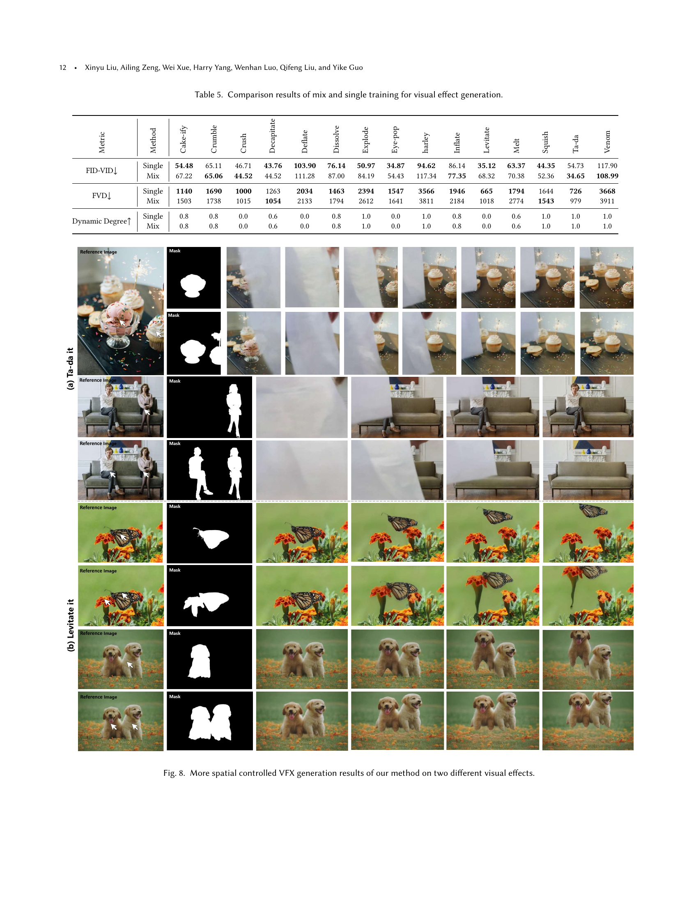

 


 2502.05979 
 Xinyu Liu et el. 
 
 🤗 2025-02-14 
 



↗ arXiv


↗ Hugging Face


↗ Papers with Code


### TL;DR



기존의 시각 효과(VFX) 생성 방법은 복잡하고 비용이 많이 드는 반면, 최근 생성형 AI 기술의 발전에도 불구하고, **세밀한 공간-시간 제어가 가능한 VFX 비디오 생성**은 여전히 미개척 분야로 남아 있습니다. 특히, **데이터 부족**과 **복잡한 동역학**, **공간 조작의 정밀도** 등이 주요 과제입니다.  

본 연구에서는 이러한 문제를 해결하기 위해 **Video Diffusion Transformer 기반의 새로운 VFX 비디오 생성 프레임워크인 VFX Creator**를 제안합니다. VFX Creator는 **플러그 앤 플레이 방식의 마스크 제어 모듈**과 **토큰화된 시작-종료 모션 타임스탬프**를 통합하여 **세밀한 공간-시간 제어**를 제공합니다.  Open-VFX 데이터셋을 사용한 실험 결과, 제안된 시스템은 **사실적이고 역동적인 효과를 생성**하여, 공간 및 시간적 제어 모두에서 최첨단 성능을 달성했습니다. 특히, **새로운 지표를 통해 시간 제어의 정밀도를 평가**하여, 기존의 VFX 기법과 생성 기법 간의 가교 역할을 수행했습니다.



#### Key Takeaways


 제어 가능한 비디오 효과 생성을 위한 새로운 프레임워크인 VFX Creator 제시 



 고품질 VFX 비디오 데이터셋인 Open-VFX 공개 



 공간 및 시간적 제어 기능을 통한 정밀한 시각 효과 생성 및 조작 가능성 입증 


#### Why does it matter?
본 논문은 **제어 가능한 비디오 효과 생성을 위한 새로운 프레임워크인 VFX Creator**를 제시하여, 연구자들이 **실시간 비디오 효과 생성 및 조작** 분야에 대한 새로운 가능성을 열어줍니다. 또한, **Open-VFX 데이터셋**을 통해 **고품질 VFX 비디오 데이터**를 제공하여, 향후 연구에 중요한 기반을 마련합니다.  이를 통해, 영화, 게임, 가상현실 등 다양한 분야에서 **실감나는 시각 효과**를 보다 효율적이고 효과적으로 구현할 수 있게 되어 연구 및 산업적 측면에서 **상당한 영향력**을 가지게 될 것으로 예상됩니다.

------
#### Visual Insights

> 🔼 그림 1은 제어 가능한 비디오 확산 변환기를 기반으로 하는 효율적인 VFX 크리에이터 프레임워크를 보여줍니다. 이 프레임워크는 시각 효과(VFX) 비디오 생성을 위한 공간 및 시간적 제어를 가능하게 합니다. 최소한의 훈련 데이터를 사용하여 플러그 앤 플레이 마스크 제어 모듈은 정밀한 인스턴스 수준 조작을 허용하고, 토큰화된 시작-종료 모션 타임스탬프와 텍스트 공간의 통합은 VFX 리듬에 대한 세분화된 시간적 제어를 제공합니다.  프로젝트 페이지 주소도 포함되어 있습니다.
> 

> 
read the caption

> Figure 1. VFX Creator is an efficient framework based on a Video Diffusion Transformer, enabling spatial and temporal control for visual effect (VFX) video generation. With minimal training data, a plug-and-play mask control module allows precise instance-level manipulation, while the integration of tokenized start-end motion timestamps with text space provides fine-grained temporal control over the VFX rhythm. Project Page: https://vfx-creator0.github.io/
> 


| Method | FID-VID ↓ | FVD ↓ | Dynamic Degree ↑ |
|---|---|---|---|
| DynamiCrafter | 119.78 | 1515.28 | 0.27 |
| LTX-Video | 82.93 | 1563.73 | 0.51 |
| CogVideoX | 90.82 | 1624.91 | 0.14 |
| VFX Creator (Ours) | **29.92** | **752.95** | **0.63** |

> 🔼 본 표는 논문에서 제시된 Open-VFX 데이터셋에 대해 15가지 시각 효과(VFX) 비디오 생성 작업에 대한 정량적 비교 결과를 보여줍니다.  다양한 최첨단 방법(DynamiCrafter, LTX-Video, CogVideoX, 그리고 제안된 VFX Creator)의 성능을 FID-VID, FVD, 그리고 동적 정도(Dynamic Degree) 세 가지 지표를 사용하여 비교 분석합니다.  이를 통해 각 방법의 시각적 품질과 동작 생성 정확도를 평가하고, 제안된 VFX Creator의 우수성을 보여줍니다.
> 

> 
read the caption

> Table 1. Quantitative comparisons of VFX video generation for 15 visual effects in our dataset.
> 

### In-depth insights

#### VFX Diffusion Model
VFX 확산 모델은 비디오의 시각적 효과(VFX) 생성을 위한 강력한 도구로 떠오르고 있습니다. 이 모델은 뛰어난 **시간적 일관성**과 **시각적 매력**을 가진 고품질 비디오를 생성할 수 있는 잠재력을 보여줍니다. 하지만, **세밀한 공간-시간 제어**가 여전히 어려운 과제이며, 데이터 부족과 복잡한 역동성, 공간 조작의 정밀성 등의 문제가 있습니다.  본 논문에서는 이러한 문제를 해결하기 위해 사용자 친화적인 텍스트 설명과 정지 이미지에서 동적인 효과를 생성하는 새로운 패러다임을 제시하고 있습니다. 특히, **제어 가능한 LoRA 어댑터**를 통합하여 최소한의 훈련 데이터로 고품질 비디오 생성을 가능하게 합니다.  **공간 제어**를 위해 마스크 제어 모듈을, **시간적 제어**를 위해 토큰화된 시작-종료 모션 타임스탬프를 활용하여 효과의 타이밍과 속도를 정밀하게 제어할 수 있습니다.  이러한 접근 방식은 기존의 VFX 기술과 생성 기술을 연결하여 새로운 가능성을 열어줍니다.

#### Controllable LoRA
본 논문에서 제안하는 "제어 가능한 LoRA(Controllable LoRA)"는 **비디오 확산 변환기(Video Diffusion Transformer)** 기반의 VFX(Visual Effects) 생성 프레임워크에서 공간 및 시간적 제어를 가능하게 하는 핵심 기술입니다.  **LoRA(Low-Rank Adaptation)**를 사용하여 모델의 파라미터를 효율적으로 조정함으로써, 최소한의 훈련 데이터만으로도 높은 품질의 VFX 비디오 생성을 가능하게 합니다. 특히, **공간적 제어를 위해 마스크 기반 제어 모듈을 통합하여 인스턴스 수준의 정밀한 조작을 가능하게 하고, 시간적 제어를 위해 토큰화된 시작-종료 모션 타임스탬프를 확산 과정에 통합하여 효과의 타이밍과 속도를 정밀하게 제어합니다.** 이러한 접근 방식은 기존의 VFX 제작 방식에 비해 효율성을 크게 향상시키고, 사용자 친화적인 인터페이스를 제공하여 VFX 생성의 문턱을 낮추는 데 기여합니다.  **데이터 효율성이 높고 다양한 VFX 효과에 적용 가능하다는 점이 큰 강점이며, 미래의 VFX 제작 방식에 혁신적인 변화를 가져올 가능성을 지닌 기술**임을 논문은 보여줍니다.

#### Open-VFX Dataset
본 논문에서 제시된 Open-VFX 데이터셋은 **고품질 VFX 비디오 데이터의 부족**이라는 기존 연구의 한계를 극복하기 위해 고안되었습니다.  15가지 다양한 시각 효과(VFX) 유형을 포함하며, 각 VFX는 텍스트 설명, 인스턴스 분할 마스크(spatial conditioning), 시작 및 종료 시간 정보(temporal control)와 함께 주석 처리되어 있습니다.  **다양한 객체(캐릭터, 동물, 제품, 풍경)**를 포함하는 675개의 고해상도 비디오와 245개의 정지 이미지로 구성되어 있어, 모델의 공간적, 시간적 제어 성능을 평가하는 데 유용합니다. 특히, **시간적 제어를 위한 시작 및 종료 시간 정보**는 기존의 정성적 평가를 넘어 정량적 평가를 가능하게 하여, 생성된 영상의 시간적 일관성 및 정확성을 평가할 수 있는 기반을 마련했습니다.  Open-VFX는 기존의 제한된 VFX 데이터셋과 달리, **다양한 VFX 유형과 고품질의 데이터를 제공**함으로써,  더욱 정교하고 제어 가능한 VFX 생성 모델 개발에 기여할 것으로 기대됩니다.  이를 통해 향후 VFX 기술 발전 및 대중화에 크게 기여할 수 있을 것으로 예상됩니다.

#### Temporal Control
본 논문에서 제시된 'Temporal Control'은 **비디오 효과의 시간적 흐름과 지속 시간을 정밀하게 제어하는 기술**을 의미합니다.  단순히 비디오를 생성하는 것을 넘어, 사용자가 원하는 시점에 특정 효과가 시작되고 끝나는 시점을 명확히 지정하고, 그 효과의 속도나 리듬까지 조절할 수 있도록 하는 것이 핵심입니다.  이를 위해, 논문에서는 **토큰화된 시작 및 종료 시간 정보를 확산 과정에 통합**하는 방식을 제안합니다.  이는 단순히 시간 정보를 삽입하는 것이 아니라, **텍스트 기반의 설명과 함께 시간 정보를 처리하여** 효과의 자연스러운 흐름을 보장합니다.  **마스크 기반의 공간적 제어와 결합**하여, 사용자는 공간적 제약 없이 시간적 흐름까지 정교하게 제어할 수 있는 **새로운 VFX 생성 패러다임**을 제시합니다.  이러한 기술은 영화 제작 및 게임 개발 등 다양한 분야에서 **보다 직관적이고 효율적인 시각 효과 제작**을 가능하게 할 것으로 예상됩니다.

#### Ablation Experiments
본 논문의 "절제 실험(Ablation Experiments)" 부분은 모델의 성능에 기여하는 각 구성 요소의 중요성을 밝히는 데 초점을 맞출 것입니다. **공간적 제어 모듈**과 **시간적 제어 모듈**의 기여도를 개별적으로 평가하고, 두 모듈을 결합했을 때의 시너지 효과를 분석할 것입니다.  또한, **다양한 크기의 훈련 데이터셋**을 사용하여 모델 성능 변화를 관찰함으로써 데이터 효율성을 평가할 수 있습니다.  **마스크 생성 방법**이나 **시간 정보 통합 전략** 등의 세부적인 요소들에 대한 비교 실험을 통해 최적의 모델 구성을 도출하고자 할 것입니다. 이러한 실험 결과는 **모델의 견고성 및 일반화 능력**에 대한 귀중한 통찰력을 제공하며, 향후 연구 방향을 제시하는 데 중요한 역할을 할 것입니다. 특히, 시간적 제어의 정확도를 평가하는 새로운 지표를 제시하고, 이를 통해 시간적 제어 성능을 정량적으로 분석하는 것이 중요합니다.  결과적으로, 이 절제 실험은 제안된 VFX 생성 모델의 강점과 한계를 명확히 드러내어, **모델 개선 및 향후 연구의 방향 설정**에 필수적인 정보를 제공할 것입니다.

### More visual insights

More on figures

> 🔼 그림 2는 제안된 Open-VFX 데이터셋의 개요를 보여줍니다. (a)는 데이터셋에 포함된 다양한 입력 추론 이미지들을 보여줍니다. 여기에는 사람, 동물, 사물 및 다양한 장면들이 단일 또는 여러 구성 요소로 포함되어 있습니다. (b)는 제안된 15가지 VFX의 텍스트 설명을 보여줍니다. (c)는 '폭발시키기' VFX의 예시를 보여줍니다.
> 

> 
read the caption

> Figure 2. Overview of our proposed Open-VFX Dataset. (a) demonstrates diverse input inference images in the dataset, including humans, animals, objects, and various scenes across single and multiple components. (b) shows the text descriptions of the proposed 15 VFXs, and (c) presents an example (Explode it) VFX.
> 

> 🔼 그림 3은 Open-VFX 데이터셋의 추가적인 예시들을 보여줍니다. 다양한 시각 효과(VFX) 10가지 유형과 여러 참조 이미지들이 포함되어 있습니다. 각 VFX 유형은 다양한 객체(인물, 동물, 사물, 풍경 등)를 사용하여 시각적 다양성을 보여줍니다. 참조 이미지들은 VFX 효과가 적용될 대상이 되는 이미지들입니다. 이 그림은 Open-VFX 데이터셋의 다양성과 범용성을 강조하여, 제안된 모델이 다양한 상황과 객체에 적용될 수 있음을 시각적으로 보여줍니다.
> 

> 
read the caption

> Figure 3. More examples of our Open-VFX dataset, including 10 VFXs and diverse reference images.
> 

> 🔼 그림 4는 VFX Creator의 파이프라인을 보여줍니다. 이 그림에서는 두 가지 새로운 모듈을 소개합니다. (a) 공간 제어 LoRA 어댑터는 마스크 조건부 ControlNet을 LoRA와 통합하여 마스크 시퀀스를 모델에 주입하고 인스턴스 수준의 공간 조작을 가능하게 합니다. (b) 시간 제어 LoRA 어댑터는 시간 제어를 통합하기 위한 두 가지 전략을 탐구합니다. 모듈 I은 시작 및 종료 동작 타임스탬프를 토큰화하고 텍스트 공간과 함께 확산 프로세스에 포함하는 반면, 모듈 II는 시간 마스크를 타임스텝 임베딩과 통합하여 확산 프로세스를 안내합니다.
> 

> 
read the caption

> Figure 4. Pipeline of VFX Creator. We introduce two novel modules: (a) Spatial Controlled LoRA Adapter. This module integrates a mask-conditioned ControlNet with LoRA, injecting mask sequences into the model to enable instance-level spatial manipulation. (b) Temporal Controlled LoRA Adapter. We explore two strategies for incorporating temporal control: module I involves tokenizing start-end motion timestamps and embedding them into the diffusion process alongside the text space, while module II integrates temporal mask with timestep embeddings to guide the diffusion process.
> 

> 🔼 그림 5는 제안된 방법인 VFX Creator와 기존 방법인 DynamiCrafter, LTX-Video, CogVideoX-5B 및 Pika를 비교하여 두 가지 시각 효과에 대한 VFX 비디오 생성 결과를 보여줍니다.  각 방법의 결과는 시각적으로 비교되어, 다양한 접근법의 강점과 약점을 명확하게 제시합니다.  특히,  VFX Creator의 우수성을 보여주는 데 초점이 맞춰져 있습니다. 그림을 통해 각 모델이 생성한 시각적 효과의 품질, 정확성, 그리고 시간적 일관성을 평가할 수 있습니다.
> 

> 
read the caption

> Figure 5. Qualitative comparisons of VFX video generation on two different visual effects between our method, DynamiCrafter, LTX-Video, CogVideoX-5B, and Pika.
> 

> 🔼 그림 6은 제안된 방법을 사용한 두 가지 시각 효과에 대한 공간 제어 가능한 VFX 비디오 생성의 정성적 결과를 보여줍니다. 사용자는 점을 클릭하거나 상자를 놓아 애니메이션 인스턴스를 정확하게 지정하여 마스크를 얻을 수 있습니다. 이 그림은 사용자 상호 작용을 통해 특정 객체에 시각 효과를 적용하는 모델의 능력을 보여줍니다. 마스크를 사용하여 특정 객체를 선택하고 해당 객체에만 시각 효과를 적용함으로써, 배경이나 다른 객체에는 영향을 미치지 않고 원하는 객체에만 효과를 집중시킬 수 있습니다. 이는 사용자가 생성된 비디오의 시각적 결과를 세밀하게 제어할 수 있음을 시사합니다.
> 

> 
read the caption

> Figure 6. Qualitative results of spatial controllable VFX video generation of our method on two different visual effects. Users can precisely specify the animated instance by clicking points or dropping boxes to obtain the mask.
> 

> 🔼 그림 7은 사용자 연구 결과를 보여줍니다.  다양한 방법들(VFX Creator, Pika & PixVerse, LTX-Video, CogVideoX)로 생성된 비디오에 대한 사용자 선호도를 비교 분석한 결과,  VFX Creator가 다른 방법들에 비해 텍스트 정합도, 피사체 충실도, 동작의 부드러움, 전반적인 품질 면에서 모두 더 높은 선호도를 얻었다는 것을 보여줍니다. 특히 Pika & PixVerse와 비교했을 때, VFX Creator는 약간 더 높은 선호도를 보였습니다.
> 

> 
read the caption

> Figure 7. User Study. Our VF Creator demonstrates superior human preference compared to other methods
> 

> 🔼 그림 8은 제안된 방법을 사용하여 두 가지 다른 시각 효과에 대한 공간 제어 VFX 생성 결과를 보여줍니다.  각각의 시각 효과에 대해 여러 참조 이미지와 해당 마스크가 표시되어 있으며, 모델이 마스크를 사용하여 객체를 정확하게 조작하여 사용자가 원하는 시각적 효과를 생성하는 능력을 보여줍니다.  즉, 사용자가 지정한 마스크 영역 내에서만 시각적 효과가 적용되어 원치 않는 부분에는 영향을 미치지 않는 것을 확인할 수 있습니다.
> 

> 
read the caption

> Figure 8. More spatial controlled VFX generation results of our method on two different visual effects.
> 

> 🔼 그림 9는 제안된 방법인 VFX Creator, DynamiCrafter, LTX-Video, CogVideoX-5B 및 Pika를 비교하여 두 가지 시각 효과에 대한 VFX 비디오 생성의 정성적 비교 결과를 보여줍니다.  각 모델은 'Crumble it'과 'Squish it'이라는 두 가지 서로 다른 시각 효과에 대한 결과를 보여주며, 각 효과에 대한 다양한 비디오 프레임을 보여줍니다. 이 그림을 통해 사용자는 서로 다른 모델이 생성한 VFX 비디오의 시각적 품질과 정확도를 비교하고, VFX Creator의 성능을 다른 최첨단 모델과 비교 평가할 수 있습니다. Pika는 기준 모델로 사용되었습니다.
> 

> 
read the caption

> Figure 9. More qualitative comparison results of VFX video generation on two different visual effects between our method, DynamiCrafter, LTX-Video, CogVideoX-5B, and Pika.
> 

> 🔼 그림 10은 제안된 방법의 시간적 제어가 가능한 VFX 생성 결과를 보여줍니다.  다양한 시각 효과에 대해 시작 프레임과 종료 프레임을 지정하여, 사용자가 원하는 시간 간격으로 효과가 적용되는 것을 확인할 수 있습니다.  이를 통해 사용자는 시각 효과의 지속 시간과 속도를 정밀하게 제어하여, 보다 자연스럽고 실감나는 애니메이션을 생성할 수 있습니다.  특히,  ‘Ta-da it’ 효과에서 시간적 제어를 통해 마술 효과가 더욱 매끄럽게 나타나는 것을 확인할 수 있습니다.
> 

> 
read the caption

> Figure 10. More temporal controlled VFX generation results of our method.
> 

More on tables


| Visual Effect | $T_{IoU} \uparrow$ | $\mathcal{E}_f \downarrow$ | $\mathcal{E}_s \downarrow$ | $T_{IoU} \uparrow$ | $\mathcal{E}_f \downarrow$ | $\mathcal{E}_s \downarrow$ |
|---|---|---|---|---|---|---|
| Ta-da it | 0.69 | 12.52 | 1.56 | 0.85 | 5.04 | 0.63 |
| Explode it | 0.68 | 11.30 | 1.49 | 0.88 | 3.76 | 0.47 |
| Levitate it | 0.69 | 12.88 | 1.61 | 0.80 | 5.36 | 0.67 |
| Average | 0.69 | 12.23 | 1.56 | **0.84** | **4.72** | **0.59** |
> 🔼 표 2는 두 가지 시간적 제어 통합 전략에 대한 실험 결과를 보여줍니다.  시간적 제어를 위해 두 가지 방법(방법 1과 방법 2)을 사용하여 시계열 마스크와 타임스텝 임베딩을 통합하거나, 시간 정보를 텍스트 공간과 통합하는 방식을 비교 분석했습니다.  각 방법에 대한 Ta-da it, Explode it, Levitate it 세 가지 시각 효과에 대한 IoU(교차 합집합 비율), 프레임 수준 오류, 초 수준 오류를 측정하여 정확도를 비교 평가했습니다. 이 표를 통해 어떤 시간적 제어 통합 전략이 더 효과적인지 확인할 수 있습니다.
> 

> 
read the caption

> Table 2. Ablation results of two temporal control integration strategies.
> 


| Effect | Shots | FID-VID ↓ | FVD ↓ | Dynamic Degree ↑ |
|---|---|---|---|---|
| Ta-da it | 1-shot | 52.31 | 1432.40 | 0.6 |
|  | 10-shot | 47.91 | 2861.18 | 1.0 |
|  | 40-shot | 54.73 | 726.83 | 1.0 |
| Explode it | 1-shot | 96.48 | 2667.72 | 1.0 |
|  | 10-shot | 57.71 | 2829.00 | 1.0 |
|  | 40-shot | 50.97 | 2394.20 | 1.0 |
| Squish it | 1-shot | 140.42 | 3297.11 | 1.0 |
|  | 10-shot | 44.62 | 1409.98 | 1.0 |
|  | 40-shot | 44.35 | 1644.69 | 1.0 |
> 🔼 이 표는 다양한 샷 수(1-샷, 10-샷, 40-샷)에 따른 훈련 데이터 크기 변화가 VFX 생성 성능에 미치는 영향을 보여줍니다.  FID-VID, FVD, 동적 정도 세 가지 지표를 사용하여 'Ta-da it', 'Explode it', 'Squish it' 세 가지 시각 효과에 대한 성능을 평가했습니다. 각 시각 효과별로 샷 수에 따른 세 가지 지표의 변화를 비교하여 최적의 훈련 데이터 크기를 파악하고자 합니다. 결과적으로, 더 많은 샷을 사용한 훈련 데이터가 모델 성능 향상에 기여함을 알 수 있습니다.
> 

> 
read the caption

> Table 3. Ablation results of different sample sizes during training across varying shot numbers.
> 


| Types of VFX | Definition |
|---|---| 
| Cake-ify it | Transform the subject into hyper-realistic prop cakes. |
| Crumble it | Break apart the subjects into fragments. |
| Crush it | Apply a hydraulic press to flatten the subject. |
| Decapitate it | Simulate the decapitation of subjects. |
| Deflate it | Similar to a balloon losing air, cause subjects to shrink and flatten. |
| Dissolve it | Cause the object to disintegrate into nothingness. |
| Explode it | Burst the subject into fragments. |
| Eye-pop it | Make the eyes of subjects bulge or pop out. |
| Inflate it | Puff up the still subject like a balloon. |
| Levitate it | Make static objects or subjects appear to float or hover. |
| Melt it | Turn objects into fluid, gooey forms. |
| Squish it | Compress the subject as though under immense pressure. |
| Ta-da it | With a flourish, subjects disappear behind a cloth. |
| Transform into a black Venom | Characterize the static subject, transforming it into a black Venom. |
| Transform into Harley Quinn | Characterize the static subject, transform it into Harley Quinn. |
> 🔼 이 표는 Open VFX 데이터셋에 포함된 15가지 시각 효과의 유형과 각각에 대한 자세한 정의를 보여줍니다. 각 시각 효과의 이름과 해당 효과에 대한 설명을 제공하여 사용자가 시각 효과를 더 잘 이해할 수 있도록 합니다. 예를 들어, 'Cake-ify it'은 대상을 초현실적인 케이크로 변형하는 효과이고, 'Crumble it'은 대상을 조각으로 부수는 효과입니다. 이 표는 논문의 데이터셋 섹션에 포함되어 있으며, Open VFX 데이터셋의 내용을 명확히 보여주는 중요한 참조 자료입니다.
> 

> 
read the caption

> Table 4. Visual Effect Types and Corresponding Definitions in the Open VFX Dataset.
> 


| Metric | Method | Cake-ify | Crumble | Crush | Decapitate | Deflate | Dissolve | Explode | Eye-pop | harley | Inflate | Levitate | Melt | Squish | Ta-da | Venom |
|---|---|---|---|---|---|---|---|---|---|---|---|---|---|---|---|---|
| FID-VID↓ | Single | 54.48 | 65.11 | 46.71 | **43.76** | **103.90** | **76.14** | **50.97** | **34.87** | **94.62** | 86.14 | **35.12** | **63.37** | **44.35** | 54.73 | 117.90 |
|  | Mix | 67.22 | **65.06** | **44.52** | 44.52 | 111.28 | 87.00 | 84.19 | 54.43 | 117.34 | **77.35** | 68.32 | 70.38 | 52.36 | **34.65** | **108.99** |
| FVD↓ | Single | **1140** | **1690** | **1000** | 1263 | **2034** | **1463** | **2394** | **1547** | **3566** | **1946** | **665** | **1794** | 1644 | **726** | **3668** |
|  | Mix | 1503 | 1738 | 1015 | **1054** | 2133 | 1794 | 2612 | 1641 | 3811 | 2184 | 1018 | 2774 | **1543** | 979 | 3911 |
| Dynamic Degree↑ | Single | 0.8 | 0.8 | 0.0 | 0.6 | 0.0 | 0.8 | 1.0 | 0.0 | 1.0 | 0.8 | 0.0 | 0.6 | 1.0 | 1.0 | 1.0 |
|  | Mix | 0.8 | 0.8 | 0.0 | 0.6 | 0.0 | 0.8 | 1.0 | 0.0 | 1.0 | 0.8 | 0.0 | 0.6 | 1.0 | 1.0 | 1.0 |
> 🔼 표 5는 다양한 시각 효과 생성을 위한 혼합 학습과 단일 학습 결과를 비교 분석한 표입니다.  FID-VID, FVD, Dynamic Degree 세 가지 지표를 사용하여 시각적 품질과 동적 특징을 평가했습니다.  단일 효과별 학습 결과와 15가지 효과를 혼합하여 학습한 결과를 비교하여 어떤 학습 방식이 각 효과에 대해 더 나은 성능을 보이는지 분석합니다.  표에서 각 효과에 대한 FID-VID(낮을수록 좋음), FVD(낮을수록 좋음), Dynamic Degree(높을수록 좋음) 값을 확인할 수 있습니다.
> 

> 
read the caption

> Table 5. Comparison results of mix and single training for visual effect generation.
> 

### Full paper



