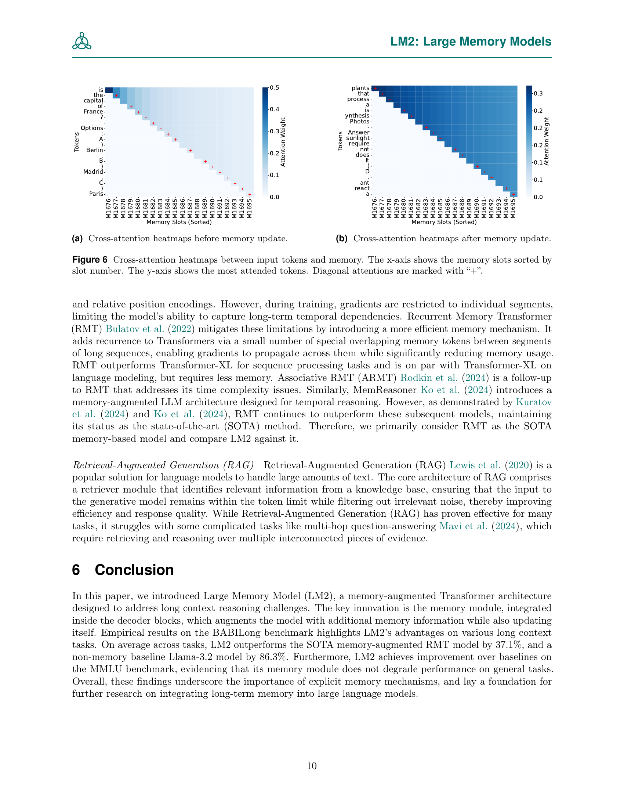

 


 2502.06049 
 Jikun Kang et el. 
 
 🤗 2025-02-11 
 



↗ arXiv


↗ Hugging Face


### TL;DR



기존의 트랜스포머 모델은 장문 맥락을 다루는 데 어려움을 겪습니다. 특히, 다단계 추론이나 장기 의존성이 필요한 작업에서는 성능 저하가 발생합니다. 이러한 문제를 해결하기 위해 많은 연구들이 메모리 증강 기법을 제시했지만, 일반적인 작업에 대한 성능 저하 또는 메모리 과다 사용 문제를 안고 있었습니다.

본 연구에서는 **LM2 (Large Memory Model)** 라는 새로운 아키텍처를 제안합니다. LM2는 **보조 메모리 모듈**을 사용하여 트랜스포머의 장기 기억 능력을 향상시킵니다. 이를 통해 **장문 맥락 이해 및 복잡한 추론 능력**을 높이고, **다양한 작업에서 우수한 성능**을 보입니다. 또한, 메모리 모듈의 효율성 및 해석 가능성을 높이는 설계를 통해 실용적인 응용 가능성을 높였습니다.



#### Key Takeaways


 LM2는 기존 트랜스포머 모델의 장문 맥락 추론 한계를 극복합니다. 



 BABILong 및 MMLU 벤치마크에서 SOTA 성능을 달성합니다. 



 메모리 모듈의 효과적인 설계 및 해석 방법을 제시합니다. 


#### Why does it matter?
**본 논문은 장기 기억 메커니즘을 트랜스포머 아키텍처에 통합하여 장문 맥락 추론 성능을 향상시킨 LM2 모델을 제시합니다.** 이는 기존 트랜스포머 모델의 한계를 극복하고 다양한 응용 분야에서 성능 향상을 가져올 수 있는 중요한 연구입니다. 특히, **장기 기억 문제에 대한 효과적인 해결책을 제시**하고 있으며, **다양한 벤치마크 데이터셋에서 우수한 성능**을 보여줍니다.  **추후 연구를 위한 새로운 방향**을 제시하며, 기존 연구와의 차별성을 명확히 제시합니다.

------
#### Visual Insights

> 🔼 그림 1은 LM2의 전체 아키텍처를 보여줍니다. LM2는 주 정보 흐름을 교차 어텐션을 통해 업데이트하는 별도의 메모리 뱅크로 구성됩니다. 입력(ℐ), 출력(𝒪), 그리고 망각(ℱ) 게이트를 사용하여 메모리가 업데이트됩니다. 블록 간 정보 흐름에서 회색 곡선은 일반적인 어텐션 흐름을, 분홍색 곡선은 추가적인 메모리 흐름을 나타냅니다.  메모리 뱅크는 입력 토큰과 상호 작용하여 추가 정보를 제공하며, 이는 게이트 메커니즘을 통해 동적으로 제어됩니다.  메모리 뱅크의 추가는 기존 트랜스포머 구조의 성능을 저하시키지 않고 장기 의존성 모델링을 향상시키는 데 목적이 있습니다.
> 

> 
read the caption

> Figure 1: Illustration of LM2 overall architecture. It consists of a separate memory bank, which updates the main information flow through cross attention, and is updated using the input (ℐℐ\mathcal{I}caligraphic_I), output (𝒪𝒪\mathcal{O}caligraphic_O), and forget (ℱℱ\mathcal{F}caligraphic_F) gates. For the information flow from one block to another, the gray curve shows the normal attention flow and the pink curve shows the extra memory flow.
> 


| model | qa1 | qa2 | qa3 | qa4 | qa5 | qa6 | qa7 | qa8 | qa9 | qa10 | Avg. |
|---|---|---|---|---|---|---|---|---|---|---|---|---|
| **0K** |  |  |  |  |  |  |  |  |  |  |  |
| Llama-3.2-1.2B | 54.0 | 25.0 | 29.0 | 62.0 | 59.0 | 49.0 | 14.0 | 52.0 | 41.0 | 22.0 | 40.7 |
| vanilla-Llama-1.7B | 86.0 | 57.0 | 46.0 | 59.0 | 85.0 | 83.0 | 95.0 | 79.0 | 83.0 | 77.0 | 75.0 |
| RMT-1.7B | 85.0 | 49.0 | 49.0 | 81.0 | 95.0 | 84.0 | 82.0 | 78.0 | 85.0 | 76.0 | 76.4 |
| LM2-1.7B | **99.0** | **89.0** | **70.0** | **88.0** | **98.0** | **95.0** | **96.0** | **97.0** | **99.0** | **94.0** | **92.5** |
| **1K** |  |  |  |  |  |  |  |  |  |  |  |
| Llama-3.2-1.2B | 48.0 | 22.0 | 24.0 | 55.0 | 69.0 | 49.0 | 9.0 | 31.0 | 55.0 | 33.0 | 39.5 |
| Llama-3.2-1.2B-RAG | 51.0 | 14.0 | 19.0 | 59.0 | 80.0 | 49.0 | 10.0 | 38.0 | 40.0 | 46.0 | 40.6 |
| vanilla-Llama-1.7B | 31.0 | 21.0 | 44.0 | 43.0 | 71.0 | 60.0 | 71.0 | 40.0 | 67.0 | 58.0 | 50.6 |
| RMT-1.7B | 35.0 | 26.0 | 29.0 | 33.0 | 61.0 | 50.0 | 83.0 | 41.0 | 68.0 | 53.0 | 47.9 |
| LM2-1.7B | **85.0** | **59.0** | **72.0** | **68.0** | **91.0** | **84.0** | **96.0** | **69.0** | **82.0** | **77.0** | **78.3** |
| **2K** |  |  |  |  |  |  |  |  |  |  |  |
| Llama-3.2-1.2B | 44.0 | 18.0 | 19.0 | **50.0** | 64.0 | 52.0 | 18.0 | 24.0 | 55.0 | 42.0 | 38.6 |
| Llama-3.2-1.2B-RAG | 52.0 | 11.0 | 12.0 | 49.0 | 75.0 | 48.0 | 5.0 | 33.0 | 50.0 | 43.0 | 37.8 |
| vanilla-Llama-1.7B | 25.0 | 22.0 | 37.0 | 34.0 | 58.0 | 60.0 | 65.0 | 38.0 | 66.0 | 58.0 | 46.3 |
| RMT-1.7B | 44.0 | 21.0 | 43.0 | 41.0 | 79.0 | 47.0 | 78.0 | 41.0 | 69.0 | 51.0 | 51.4 |
| LM2-1.7B | **58.0** | **43.0** | **64.0** | 43.0 | **87.0** | **73.0** | **93.0** | **53.0** | **75.0** | **69.0** | **65.8** |
| **4K** |  |  |  |  |  |  |  |  |  |  |  |
| Llama-3.2-1.2B | 37.0 | 16.0 | 25.0 | 56.0 | 56.0 | 50.0 | 14.0 | 27.0 | 55.0 | 32.0 | 36.8 |
| Llama-3.2-1.2B-RAG | 47.0 | 3.0 | 16.0 | **58.0** | 68.0 | 58.0 | 3.0 | 36.0 | 45.0 | 39.0 | 37.3 |
| vanilla-Llama-1.7B | 21.0 | 18.0 | 38.0 | 28.0 | 55.0 | 61.0 | 64.0 | 35.0 | 49.0 | 53.0 | 42.2 |
| RMT-1.7B | 24.0 | 20.0 | 22.0 | 24.0 | 28.0 | 46.0 | 75.0 | 35.0 | **65.0** | 45.0 | 38.4 |
| LM2-1.7B | **46.0** | **37.0** | **48.0** | 34.0 | **78.0** | **66.0** | **93.0** | **45.0** | 62.0 | **50.0** | **55.9** |
| **AVG. Length ≥8K** |  |  |  |  |  |  |  |  |  |  |  |
| Llama-3.2-1.2B | 19.0 | 8.0 | 17.8 | 27.3 | 36.5 | 49 | 21.3 | 12.8 | 48.0 | 41.8 | 28.2 |
| Llama-3.2-1.2B-RAG | 29.3 | 1.0 | 5.0 | **55.8** | **72.0** | **49.8** | 4.8 | 22.8 | 46.3 | 36.8 | 32.3 |
| vanilla-Llama-1.7B | 11.3 | 15.0 | 21.3 | 14.5 | 31.0 | 44.0 | 63.0 | 33.5 | 42.0 | 36.3 | 31.2 |
| RMT-1.7B | 17.5 | 14.5 | 20.5 | 22.5 | 20.3 | 47.0 | 73.3 | 34.5 | 62.5 | **43.0** | 35.5 |
| LM2-1.7B | **23.8** | **15.0** | **24.5** | 24.0 | 38.8 | 47.3 | **92.8** | **37.0** | **53.8** | 42.0 | **39.9** |

> 🔼 표 1은 BABILong 데이터셋에서 다양한 모델의 성능을 보여줍니다. 0K, 1K, 2K, 4K 길이의 문맥을 사용한 평가 결과와 8K 이상 길이의 문맥에 대한 평균 성능을 보여줍니다.  'qa'는 다양한 하위 작업 집합을 나타냅니다. 페이지 제한으로 인해 8K, 16K, 32K, 64K, 128K 길이의 문맥에 대한 결과는 단일 지표로 집계되었으며, 자세한 결과는 부록 B에 수록되어 있습니다.  본 표는 다양한 길이의 문맥에서 각 모델의 성능을 비교하여 모델의 장단점과 메모리 효율성을 파악하는 데 유용한 정보를 제공합니다.
> 

> 
read the caption

> Table 1: Performance on the BABILong dataset: All models are evaluated on various context lengths ranging from 0K, 1K, 2K, and 4K to an aggregated average length of ≥8⁢Kabsent8𝐾\geq 8K≥ 8 italic_K. Qa stands for various subsets. Due to page limits, we aggregate the results for 8K, 16K, 32K, 64K, and 128K into a single metric, with detailed results provided in Appendix B.
> 

### In-depth insights

#### LM2 Architecture
LM2 아키텍처는 기존 트랜스포머 디코더에 **보조 메모리 모듈**을 추가하여 장기 의존성과 복잡한 추론 문제를 해결하는 데 중점을 둡니다. 이 모듈은 **교차 어텐션**을 통해 입력 임베딩과 상호 작용하며, **게이트 메커니즘**을 사용하여 정보를 동적으로 저장하고 검색합니다. **입력, 망각, 출력 게이트**는 메모리 업데이트를 제어하여 중요한 장기 정보는 유지하면서 무의미하거나 오래된 정보는 제거합니다.  **메모리 정보 흐름**은 기존 어텐션 흐름과 병렬적으로 작동하여 트랜스포머의 기본 기능을 유지하면서 메모리 정보를 통합합니다.  **스킵 연결**은 표준 어텐션 출력과 메모리 증강 기능을 결합하여 장기 의존성 모델링 능력을 향상시킵니다. 이러한 설계는 메모리 집약적인 작업에 대한 성능을 높이는 동시에 일반적인 작업에서의 성능 저하를 방지합니다. 전체적으로 LM2 아키텍처는 **명시적 메모리**의 중요성을 강조하여 트랜스포머 아키텍처를 개선합니다.

#### Memory Dynamics
본 논문에서 제시된 LM2 모델의 핵심은 **동적 메모리 모듈**입니다. 이 모듈은 단순히 정보를 저장하는 것이 아니라, **입력, 망각, 출력 게이트**를 통해 메모리 내용을 동적으로 업데이트하고 관리합니다.  **입력 단계**에서는 새로운 정보의 중요도를 평가하여 메모리에 추가하고, **망각 단계**에서는 더 이상 관련 없는 정보를 제거합니다.  **출력 단계**에서는 현재 작업에 필요한 메모리 정보를 선택적으로 활용합니다.  이러한 메모리 동역학은 단순히 과거 정보를 축적하는 것이 아니라, **문맥에 따라 유연하게 메모리를 활용**하는 방식을 의미합니다.  **긴 문맥 내 추론 및 복잡한 추론 과제**에서 효과적인 메모리 관리가 중요하며,  LM2는 이러한 과제에 효과적으로 대응할 수 있음을 시사합니다.  **장기 기억과 단기 기억의 조화**를 통해  Transformer의 일반적인 기능을 유지하면서 장기 의존성을 효과적으로 모델링할 수 있는 점이 주목할 만합니다.

#### Benchmark Results
본 논문의 벤치마크 결과는 제시된 LM2 모델의 성능을 다양한 측면에서 평가한 결과를 보여줍니다.  **BABILong 데이터셋**을 사용한 실험에서 LM2는 기존의 SOTA 모델인 RMT와 비교하여 **상당한 성능 향상**을 보였으며, 특히 긴 문맥을 다루는 작업에서 그 우수성이 두드러졌습니다.  **다양한 문맥 길이**에 대한 실험 결과는 LM2의 **일관된 성능**을 보여주는 반면, 다른 모델들은 문맥 길이가 길어질수록 성능 저하를 보였습니다.  **MMLU 데이터셋** 결과는 LM2가 일반적인 언어 이해 능력에서도 우수한 성능을 나타냄을 시사하며, 단순히 특정 작업에 특화된 것이 아닌 **범용성 있는 모델**임을 강조합니다.  전반적으로, 벤치마크 결과는 LM2의 **뛰어난 기억력 및 추론 능력**을 입증하고, **긴 문맥과 복잡한 추론**을 요구하는 작업에 대한 효과적인 해결책임을 제시합니다.  **메모리 모듈의 효과**에 대한 추가 분석은 메모리 모듈이 모델 성능에 미치는 영향을 자세히 보여주는 중요한 부분입니다.

#### Memory Analysis
본 논문에서 제시된 메모리 분석은 단순히 메모리 사용량이나 접근 패턴을 파악하는 것을 넘어 **모델의 추론 과정에 대한 심층적인 이해**를 제공하는 데 중점을 둡니다.  **뉴런 설명기법(Neuron Explainer)**을 활용하여 메모리 슬롯 내부의 표현을 자연어로 해석함으로써 모델이 어떤 정보에 집중하고 어떻게 처리하는지에 대한 통찰력을 제공합니다. 특히, **장기 기억과 단기 기억의 상호작용** 및 **문맥 정보의 선택적 활용**에 대한 분석을 통해 메모리 모듈의 효율성과 효과성을 입증하고, 모델의 의사결정 과정을 투명하게 만드는 데 기여합니다. **테스트 단계에서의 메모리 업데이트 분석**은 메모리 모듈이 실시간으로 새로운 정보를 처리하고 이전 정보와 통합하는 동적인 과정을 보여주는 중요한 부분입니다.  **결론적으로, 이러한 메모리 분석은 단순한 성능 평가를 넘어 모델의 내부 동작 원리를 이해하고, 더 나아가 모델 개선을 위한 구체적인 방향을 제시한다는 점에서 큰 의의를 지닙니다.**

#### Future of LM2
LM2의 미래는 **대규모 언어 모델의 메모리 향상**이라는 핵심 목표를 중심으로 전개될 것입니다.  **더욱 크고 정교한 메모리 모듈**을 통해 더욱 긴 맥락을 처리하고 복잡한 추론 작업을 수행하는 능력이 향상될 것입니다.  **메모리 모듈의 해석성 향상**을 위한 연구가 진행되어 모델의 내부 동작에 대한 이해도가 높아질 것입니다.  또한, **다양한 유형의 메모리 모듈**을 통합하거나 **다른 메모리 접근 방식**과의 결합을 통해 LM2의 성능과 적용 범위를 확장하는 연구가 이루어질 것으로 예상됩니다.  **에너지 효율성 개선**을 위한 연구도 중요한 과제가 될 것이며, 이를 통해 LM2는 더욱 실용적이고 광범위하게 활용될 수 있을 것입니다.  **메모리 업데이트 전략의 개선** 또한 중요한 연구 분야가 될 것입니다.  궁극적으로 LM2는 **다양한 응용 분야**에서 더욱 강력하고 효율적인 언어 모델로 자리매김할 것입니다.

### More visual insights

More on figures

> 🔼 그림 2는 LM2 모델의 디코딩 블록 내부에서 메모리 모듈이 동작하는 방식을 보여줍니다. 파란색, 녹색, 빨간색 상자는 각각 망각(forget), 입력(input), 출력(output) 단계를 나타냅니다. 각 단계에서 메모리 모듈은 입력 임베딩과의 상호작용을 통해 메모리 내용을 업데이트하고, 이는 게이트 메커니즘에 의해 제어됩니다. 망각 단계에서는 더 이상 관련 없는 정보를 메모리에서 제거하고, 입력 단계에서는 새로운 정보를 추가하며, 출력 단계에서는 업데이트된 메모리 정보를 다음 디코딩 블록으로 전달합니다. 이러한 메모리 업데이트 과정을 통해 모델은 장기적인 의존성을 효과적으로 모델링하고, 복잡한 추론 작업을 수행할 수 있습니다.
> 

> 
read the caption

> Figure 2: Illustration of how memory module works inside of each decoding block, where blue, green, and red box corresponds to forget, input, and output phase.
> 

> 🔼 그림 3은 BABILong 벤치마크에서 다양한 추론 능력에 따른 성능을 보여줍니다.  각각의 추론 유형(단일 단계 추론, 다단계 추론, 관계 추적, 기본 질문, 부정 및 불확실성)에 대한 LM2, Llama, RMT 모델의 성능을 레이더 차트로 비교하여, 각 모델의 강점과 약점을 시각적으로 보여줍니다.  LM2는 대부분의 추론 유형에서 가장 높은 성능을 보이며, 특히 다단계 추론과 기본 질문에서 뛰어난 성능을 보이는 것을 알 수 있습니다. 반면, 관계 추적에서는 RAG 기반 모델이 우수한 성능을 보입니다.
> 

> 
read the caption

> Figure 3: Performance on BABILong benchmark with different capabilities.
> 

> 🔼 그림 4는 MMLU(Massive Multitask Language Understanding) 벤치마크에서 LM2 모델의 몇-샷 학습 성능을 평가하기 위해 예시 질문을 보여줍니다.  특히, 메모리 모듈이 관련 정보에 어떻게 집중하는지 연구하기 위해, 몇 가지 샷 예시 중 하나에 유용한 정보를 포함시켰습니다.  이 그림은 메모리 모듈이 어떻게 작동하고 중요한 정보를 선택하는지 보여주는 예시를 제공합니다.
> 

> 
read the caption

> Figure 4: We sample a question from MMLU to test the LM2 in a few-shot fashion. To study how the memory module focuses on relevant information, we place useful information inside one of the few-shot examples.
> 

> 🔼 그림 5는 디코더 블록 내에 메모리 모듈을 통합하는 다양한 방법을 평가한 결과를 보여줍니다. 숫자는 메모리 모듈이 포함된 초기 디코더 블록의 수를 나타내며, 메모리 모듈의 구현 순서는 성능에 영향을 미치지 않는다는 것을 발견했습니다. 이 그래프는 메모리 모듈을 초기 디코더 블록에 통합하는 것이 perplexity 감소에 얼마나 효과적인지를 보여줍니다. 메모리 모듈의 개수가 증가함에 따라 perplexity가 감소하는 것을 알 수 있습니다. 이는 제안된 메모리 플로우가 perplexity를 줄이고 모델의 전반적인 성능을 향상시키는 데 매우 효과적임을 시사합니다.
> 

> 
read the caption

> Figure 5: We evaluate variations of integrating memory within the decoder blocks. The number indicates how many of the initial decoder blocks include the memory module, as we found that the order of implementing memory modules does not affect performance.
> 

> 🔼 그림은 메모리 업데이트 전후의 크로스 어텐션 히트맵을 보여줍니다. (a)는 메모리 업데이트 전의 히트맵으로,  'France', 'Paris' 와 같은 토큰들이 메모리와 강하게 상호작용하는 것을 보여줍니다. 이는 초기 단계에서 모델이 질문의 구조와 사실 정보에 집중함을 의미합니다. (b)는 추론 업데이트 단계 이후의 히트맵으로, 메모리에 의해 참조되는 토큰들이 광합성과 관련된 토큰들로 이동한 것을 보여줍니다. 이는 메모리가 테스트 시간 동안 적응적으로 정보를 처리함을 시사합니다.
> 

> 
read the caption

> (a) Cross-attention heatmaps before memory update.
> 

> 🔼 그림 (b)는 메모리 업데이트 후 크로스 어텐션 히트맵을 보여줍니다.  메모리 업데이트 전에는 '프랑스', '파리'와 같은 토큰이 메모리와 강하게 상호 작용하는 반면, 광합성에 대한 질문과는 관련이 없습니다.  하지만 추론 과정 중 메모리 업데이트가 이루어진 후에는 메모리가 질문과 관련된 토큰에 집중하는 것을 볼 수 있습니다. 이는 메모리 슬롯이 질문과 관련된 정보에 더욱 집중하도록 테스트 시간 동안 메모리 업데이트가 적응적으로 작용함을 보여줍니다.
> 

> 
read the caption

> (b) Cross-attention heatmaps after memory update.
> 

More on tables


|                   | vanilla | Llama | RMT | LM2 |
|---|---|---|---|---|
| **Subject**   **Category** |  |  |  |  |
| STEM | 27.2 | 25.7 | **28.1** |  |
| Humanities | 28.7 | 26.7 | **32.2** |  |
| Social Sciences | 29.2 | 27.0 | **31.6** |  |
| Others | 27.7 | 27.1 | **28.0** |  |
| **Difficulty**   **Level** |  |  |  |  |
| High School | 28.8 | 26.5 | **30.4** |  |
| College | 27.7 | 27.1 | **29.0** |  |
| Professional | 27.5 | 26.6 | **27.6** |  |
| General   Knowledge | 27.2 | 25.6 | **28.5** |  |
| Average | 28.0 | 26.5 | **29.4** |  |
> 🔼 표 2는 MMLU 데이터셋에 대한 LM2 모델의 성능을 보여줍니다. 시각화를 위해 데이터셋은 두 가지 기준, 즉 과목(STEM, 인문학, 사회과학, 기타)과 난이도(고등학교, 대학교, 전문가, 일반 상식)로 분류되어 있습니다. 표에는 각 과목과 난이도에 따른 LM2, Vanilla Llama, RMT 모델의 정확도가 제시되어 있습니다. 이를 통해 LM2 모델이 일반적인 언어 모델보다 다양한 과목과 난이도에서 더 나은 성능을 보이는지 확인할 수 있습니다.
> 

> 
read the caption

> Table 2: Performance on MMLU dataset. For better visualization, the dataset is categorized on two criteria - subject and difficulty.
> 


| Model | 
|---|---| 
| vanilla | 
| Llama | 
> 🔼 표 3은 논문에서 제시된 BABILong 벤치마크에 대한 자세한 성능 결과를 보여줍니다.  다양한 문맥 길이(0K, 1K, 2K, 4K, 8K, 16K, 32K, 64K, 128K 토큰)에 걸쳐 Llama-3.2-1.2B, Llama-3.2-1.2B-RAG, vanilla-Llama-1.7B, RMT-1.7B, LM2-1.7B 모델의 성능을 비교 분석합니다. 각 모델의  10가지 하위 작업(qa1~qa10)에 대한 정확도를 수치로 제시하여, 다양한 문맥 길이와 작업 유형에 따른 각 모델의 강점과 약점을 상세하게 보여줍니다.  이를 통해 각 모델의 장단점과 특히 LM2 모델의 우수성을 명확하게 파악할 수 있습니다.
> 

> 
read the caption

> Table 3: Detailed performance of BABILong benchmark
> 

### Full paper



