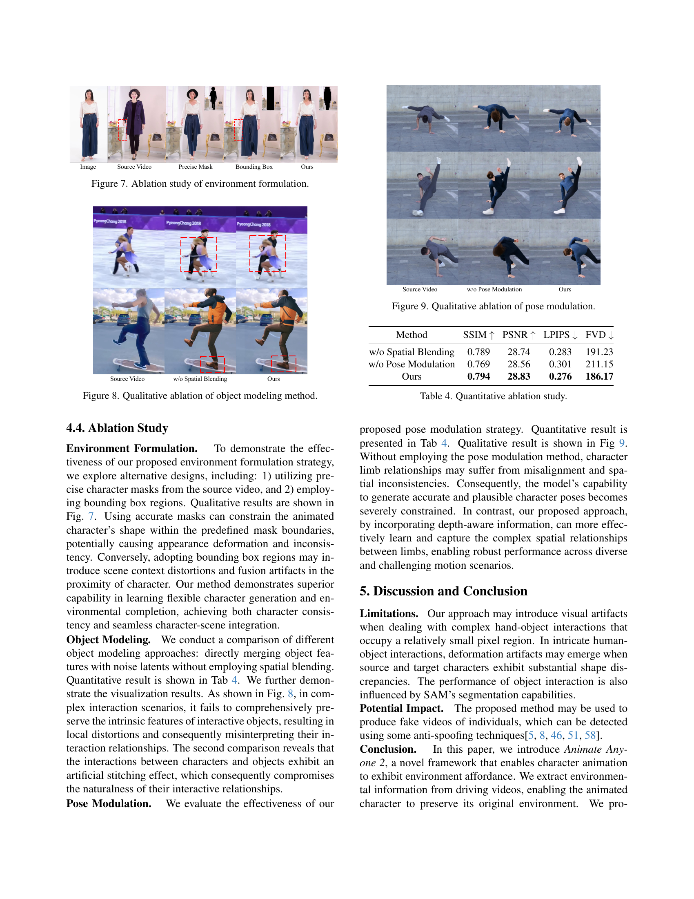

 


 2502.06145 
 Li Hu et el. 
 
 🤗 2025-02-13 
 



↗ arXiv


↗ Hugging Face


### TL;DR



기존의 캐릭터 이미지 애니메이션 연구는 캐릭터와 환경 간의 상호작용을 충분히 고려하지 못하여 현실감 있는 애니메이션 생성에 어려움을 겪었습니다. 특히, 단순한 동작이나 배경과의 조화가 부족한 애니메이션이 생성되는 문제가 있었습니다. 이러한 문제는 애니메이션의 품질과 활용도를 저하시키는 주요 원인이었습니다.

본 연구에서는 이러한 문제를 해결하기 위해 **Animate Anyone 2**라는 새로운 프레임워크를 제시합니다. Animate Anyone 2는 **영상에서 캐릭터와 환경 정보를 분리하여 학습**하고, **shape-agnostic mask 전략**을 통해 캐릭터와 환경 간의 경계를 효과적으로 학습합니다.  또한, **object injection 기법**을 사용하여 캐릭터와 객체 간의 상호작용을 보다 자연스럽게 표현하며, **pose modulation 전략**으로 다양한 동작 패턴을 효과적으로 처리합니다. 이를 통해 기존 방법보다 훨씬 **고품질, 현실감 있는 캐릭터 애니메이션**을 생성할 수 있게 되었습니다.



#### Key Takeaways


 환경적 요소를 고려한 고품질 캐릭터 애니메이션 생성 



 shape-agnostic mask 전략 및 object injection 기법 제시 



 pose modulation 전략을 통한 모델의 강인성 향상 


#### Why does it matter?
이 논문은 **환경과의 상호작용을 고려한 고품질 캐릭터 이미지 애니메이션 생성**이라는 중요한 문제를 다루고 있습니다.  기존 방법의 한계를 극복하고 **실제 환경과의 조화로운 애니메이션 생성**을 가능하게 함으로써, 영화, 광고, 가상 캐릭터 애플리케이션 등 다양한 분야에 혁신적인 발전을 가져올 수 있습니다. 또한 제시된 **shape-agnostic mask 전략 및 object injection 기법**은 다른 영역의 연구에도 적용 가능하며, **새로운 연구 방향**을 제시합니다.  특히, **다양한 동작 패턴에 대한 모델의 강인성을 높이는 pose modulation 전략**은 향후 연구에서 중요한 참고 자료가 될 수 있습니다.

------
#### Visual Insights


| Method | SSIM ↑ | PSNR ↑ | LPIPS ↓ | FVD ↓ |
|---|---|---|---|---|
| MRAA [36] | 0.672 | 29.39 | 0.672 | 284.82 |
| DisCo [42] | 0.668 | 29.03 | 0.292 | 292.80 |
| MagicAnimate [48] | 0.714 | 29.16 | 0.239 | 179.07 |
| Animate Anyone [15] | 0.718 | 29.56 | 0.285 | 171.90 |
| Champ* [60] | 0.802 | 29.91 | 0.234 | 160.82 |
| UniAnimate* [44] | 0.811 | 30.77 | 0.231 | 148.06 |
| Ours | 0.778 | 29.82 | 0.248 | 158.97 |
| Ours* | **0.812** | **30.82** | **0.223** | **144.65** |

> 🔼 표 1은 TikTok 벤치마크 데이터셋을 사용한 정량적 비교 결과를 보여줍니다.  다양한 방법들을 비교하여 SSIM, PSNR, LPIPS, 그리고 FVD 지표를 통해 성능을 평가합니다.  * 표시는 다른 비디오 데이터를 사전 학습에 사용했음을 나타냅니다.  즉,  Animate Anyone 2 모델의 성능을 기존의 다른 이미지 애니메이션 방법들과 비교하여, 각 방법의 이미지 품질과 비디오 일관성을 정량적으로 평가한 결과입니다.
> 

> 
read the caption

> Table 1: Quantitative comparison on Tiktok benchmark. * means utilizing other video data for pretraining.
> 

### In-depth insights

#### Env Affordance Anim
**Env Affordance Anim**은 환경의 특징을 고려하여 애니메이션을 생성하는 새로운 접근 방식을 제시합니다. 기존의 모션 기반 애니메이션은 인물의 움직임에만 집중하지만, **Env Affordance Anim**은 주변 환경과의 상호작용을 고려하여 보다 현실적이고 자연스러운 애니메이션을 생성합니다. 이를 위해 **환경 정보 추출 및 활용**, **인물-환경 상호작용 모델링**, **새로운 애니메이션 생성 기법** 등의 기술이 사용될 것입니다. **Env Affordance Anim**은 게임, 영화, VR/AR 등 다양한 분야에서 활용될 수 있으며, 사용자에게 보다 몰입감 있는 경험을 제공할 수 있을 것으로 기대됩니다. 특히, **실시간 상호작용**이 중요한 분야에서 큰 효과를 발휘할 것으로 예상되며, **실제 환경과의 높은 유사성**을 확보하는 것이 관건입니다.  연구의 성공은 **데이터셋의 크기와 질**, **알고리즘의 효율성**, **실시간 처리 성능** 등에 달려있습니다.  **AI 기반 애니메이션** 기술의 발전 방향을 제시하고 있으며, **새로운 연구 방향 및 가능성**을 열어줄 것으로 예상됩니다.

#### Shape-Agnostic Masks
본 논문에서 제안하는 'Shape-Agnostic Masks'는 기존의 character animation에서 character와 background의 경계를 명확히 구분하는 mask 방식의 한계를 극복하기 위한 중요한 전략입니다. **기존 방식은 character의 형태에 종속적인 mask를 사용하여, 다양한 자세나 의상의 character를 처리하는 데 어려움을 겪고, 때로는 mask 경계가 animation 결과에 부자연스러운 영향을 미치는 문제가 있었습니다.** Shape-Agnostic Masks는 이러한 문제점을 해결하기 위해, character의 형태와 무관하게 mask를 생성하는 기법을 제시합니다. **character 영역을 제외한 나머지 영역을 environment로 정의하고,  character mask의 patch-wise maximum 값을 활용하여 새로운 mask를 생성합니다.** 이를 통해 character의 윤곽선과 mask 경계 사이의 상관관계를 약화시켜, **모델이 character 형태에 과도하게 의존하는 것을 방지하고, 다양한 character와 environment의 조합에 대한 일반화 성능을 향상시키는 효과를 얻을 수 있습니다.**  또한, **random scale augmentation 기법을 추가하여, mask의 크기가 character의 크기에 비해 과도하게 크거나 작은 경우 발생하는 문제를 완화**합니다.  결과적으로, Shape-Agnostic Masks는 character animation의 정확도와 일반화 성능을 높이는 데 크게 기여하며, 보다 자연스럽고 현실감 있는 character animation을 생성하는 데 필수적인 요소로 작용합니다.

#### Object Inject Method
본 논문에서 제시된 '객체 주입 방법(Object Injection Method)'은 **영상 내 객체와 캐릭터 간의 상호작용을 향상시키기 위한 핵심 전략**입니다. 단순히 객체 정보를 추가하는 것이 아니라, **경량화된 객체 안내자(Object Guider)를 통해 객체의 특징을 효율적으로 추출**하고, **공간 혼합(Spatial Blending) 기법을 활용하여 생성 과정에 자연스럽게 통합**하는 방식입니다. 이는 기존 방법들의 단순한 연결 방식과 달리, **객체와 캐릭터 간의 상호작용을 더욱 정교하고 사실적으로 표현**하는 데 초점을 맞추고 있습니다.  **다양한 크기의 객체 특징을 추출**하여 모델에 주입함으로써, 복잡한 상호작용 시나리오에서도 **일관성 있고 고품질의 애니메이션을 생성**할 수 있도록 지원합니다. 특히, **공간적 관계를 유지하는 데 중점**을 둠으로써, 단순히 객체를 배치하는 것을 넘어, **객체와 캐릭터가 자연스럽게 상호작용하는 모습을 실감나게 재현**하는 데 기여합니다. 이러한 **정교한 객체 주입 방법**은 단순한 객체 삽입을 넘어, **실제 환경과 같은 자연스러운 상호작용**을 구현하는 데 크게 기여하며, **고품질의 캐릭터 애니메이션 생성**에 중요한 역할을 합니다.

#### Pose Modulation
본 논문에서 제시된 ‘포즈 모듈레이션’은 기존의 스켈레톤 기반 포즈 표현의 한계를 극복하기 위한 핵심 전략입니다. **기존 방법들이 스켈레톤 정보만을 활용하여 캐릭터의 움직임을 생성함으로써, 신체 부위 간의 상호작용이나 계층적 관계를 제대로 반영하지 못하는 문제점을 해결**하기 위해, **본 연구는 스켈레톤 정보와 심층적인 깊이 정보를 결합한 새로운 포즈 표현 방식을 제안**합니다.  이를 통해 **다양한 동작 패턴을 더욱 효과적으로 처리**할 수 있을 뿐만 아니라, **더욱 정교하고 자연스러운 캐릭터 애니메이션을 생성**할 수 있게 됩니다. 특히, **잡음이 많은 실제 영상에서 추출된 포즈 정보의 오류를 줄이고, 프레임 간 일관성을 유지**하는 데 효과적입니다.  **심층 신경망을 이용하여 스켈레톤과 깊이 정보를 통합**함으로써, **보다 정확하고 안정적인 포즈 추정 및 모션 생성**이 가능해집니다. 이는 **실제 영상과의 높은 일관성**을 유지하면서, **다양하고 복잡한 움직임을 표현하는 데 중요한 역할**을 수행합니다. 결론적으로, ‘포즈 모듈레이션’ 전략은 애니메이션의 정확성과 자연스러움을 향상시키는 핵심 요소이며, **고품질의 캐릭터 애니메이션 생성을 위한 중요한 발전**을 제시합니다.  

#### Future Directions
본 논문의 "미래 방향"에 대한 심도있는 고찰은 **고해상도, 실시간 애니메이션 생성**과 **다양한 환경 및 상호작용** 지원으로 확장될 수 있습니다.  현재 모델은 고품질 애니메이션을 생성하지만, 처리 속도 향상 및 **실시간 애니메이션 지원**은 중요한 과제입니다.  더욱 다양한 환경 요소와 물리적 상호작용을 고려하여 **실제와 더욱 유사한 애니메이션**을 생성할 수 있도록 모델을 발전시켜야 합니다.  **데이터 확장**을 통해 모델의 일반화 능력을 높이고, **다양한 캐릭터 유형과 행동 패턴**에 대한 지원을 강화할 수 있습니다.  또한, **사용자 친화적인 인터페이스** 개발을 통해 전문가뿐 아니라 일반 사용자도 쉽게 사용할 수 있도록 접근성을 높이는 연구도 필요합니다.  마지막으로, **윤리적 문제**에 대한 고려는 필수적입니다.  **가짜 동영상 생성**에 악용될 가능성을 고려하여 안전하고 책임감 있는 기술 개발에 힘써야 하며, 이를 위해 **강력한 검증 및 제어 메커니즘**을 마련해야 합니다.

### More visual insights

More on tables


| Method | SSIM ↑ | PSNR ↑ | LPIPS ↓ | FVD ↓ |
|---|---|---|---|---|
| Animate Anyone[15] | 0.761 | 28.41 | 0.324 | 228.53 |
| Champ[60] | 0.771 | 28.69 | 0.294 | 205.79 |
| MimicMotion[56] | 0.767 | 28.52 | 0.307 | 212.48 |
| Ours | **0.809** | **29.24** | **0.259** | **172.54** |
> 🔼 본 표는 논문에서 제시된 새로운 방법(Ours)과 기존 방법들의 성능을 비교 분석한 결과를 보여줍니다.  다양한 일반적인 시나리오에서 새로운 방법이 우수한 성능을 보임을 보여주는 표입니다.  SSIM, PSNR, LPIPS, FVD 지표를 사용하여 정량적으로 비교 분석하였으며, 새로운 방법이 기존 방법들보다 높은 값을 기록하여 성능이 우수함을 입증합니다.
> 

> 
read the caption

> Table 2: Quantitative comparison on our dataset. Our approach demonstrates superior performance across generalized scenarios.
> 


| Method | SSIM ↑ | PSNR ↑ | LPIPS ↓ | FVD ↓ |
|---|---|---|---|---|
| Baseline | 0.785 | 28.71 | 0.291 | 195.45 |
| Ours | **0.794** | **28.83** | **0.276** | **186.17** |
> 🔼 이 표는 제안된 방법과 가짜 캐릭터-환경 통합(Baseline) 방법의 정량적 비교 결과를 보여줍니다. Baseline은 캐릭터 애니메이션 결과를 원본 비디오 배경에 직접 합성하여 만든 가짜 캐릭터-환경 통합 방식입니다.  표에는 제안된 방법과 Baseline 방법을 비교하여 SSIM, PSNR, LPIPS, FVD 지표의 값을 제시합니다. 이를 통해 제안된 방법이 캐릭터와 환경의 통합 측면에서 Baseline 방법보다 성능이 우수함을 보여줍니다.
> 

> 
read the caption

> Table 3: Quantitative comparison with baseline on our dataset. Baseline refers to the pseudo character-environment integration.
> 


| Method | SSIM ↑ | PSNR ↑ | LPIPS ↓ | FVD ↓ |
|---|---|---|---|---|
| w/o Spatial Blending | 0.789 | 28.74 | 0.283 | 191.23 |
| w/o Pose Modulation | 0.769 | 28.56 | 0.301 | 211.15 |
| Ours | **0.794** | **28.83** | **0.276** | **186.17** |
> 🔼 표 4는 본 논문에서 제안하는 방법의 각 구성 요소(환경 구성, 객체 삽입, 자세 변조)가 성능에 미치는 영향을 정량적으로 분석한 결과를 보여줍니다.  각 요소를 제거했을 때의 SSIM, PSNR, LPIPS, FVD 지표 값을 비교하여, 각 구성 요소의 중요성과 효과를 확인할 수 있습니다.  즉, 각 요소가 전체 성능 향상에 얼마나 기여하는지 정량적으로 보여주는 실험 결과 표입니다.
> 

> 
read the caption

> Table 4: Quantitative ablation study.
> 

### Full paper



