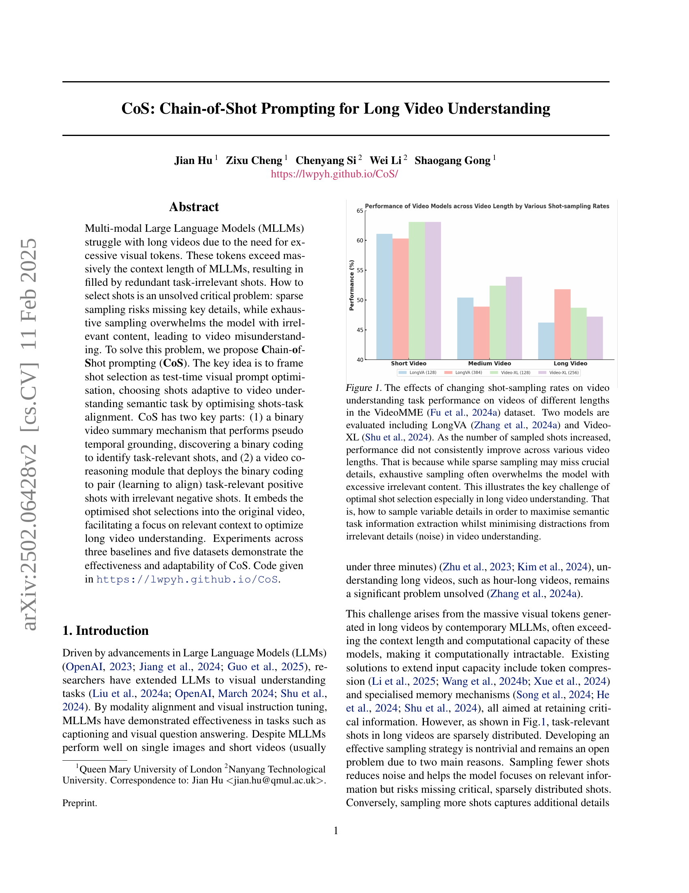
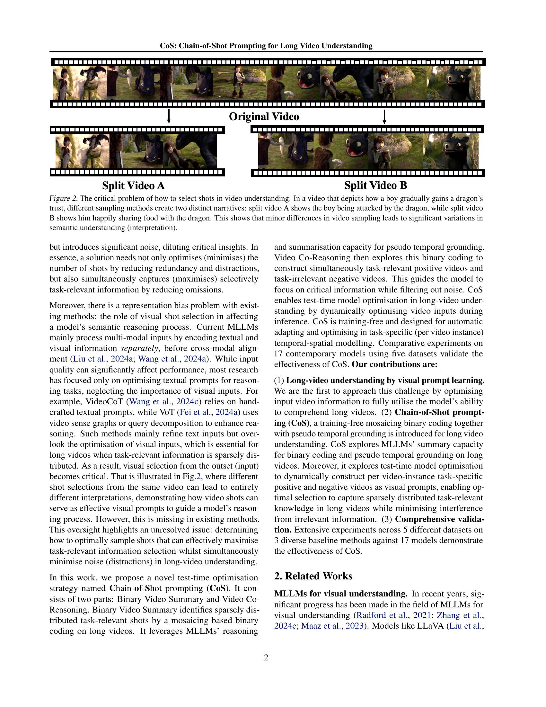
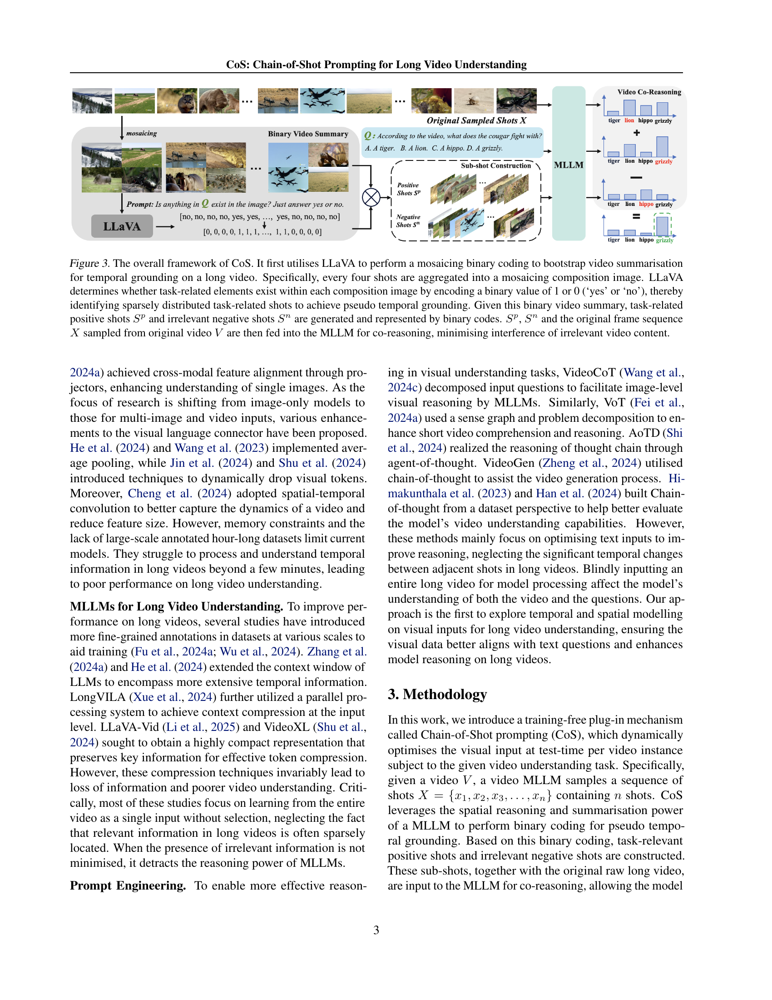
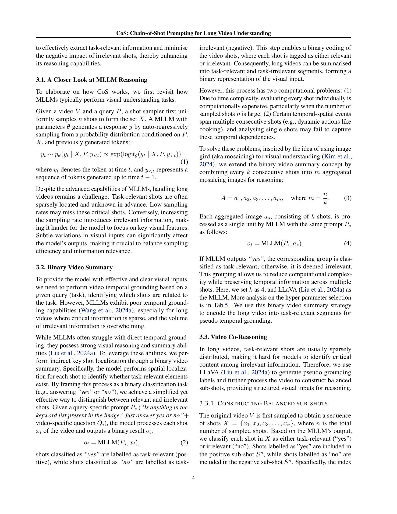
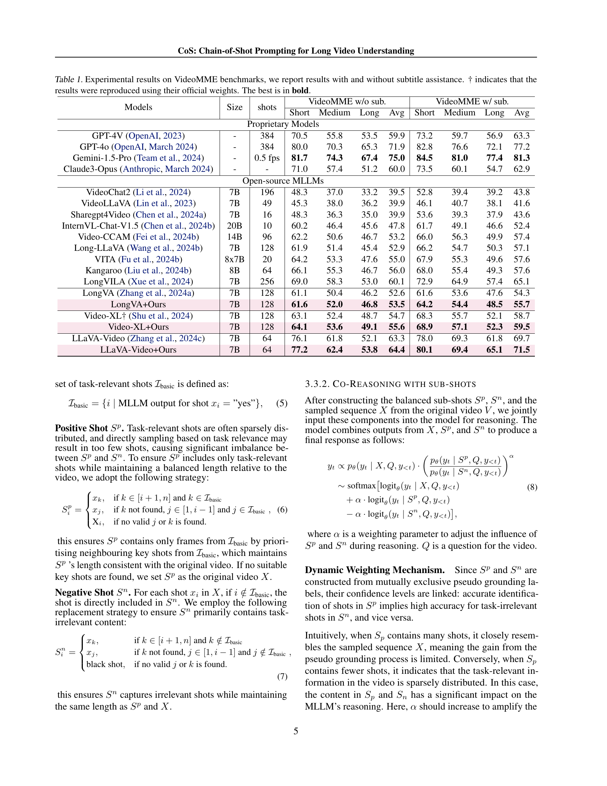
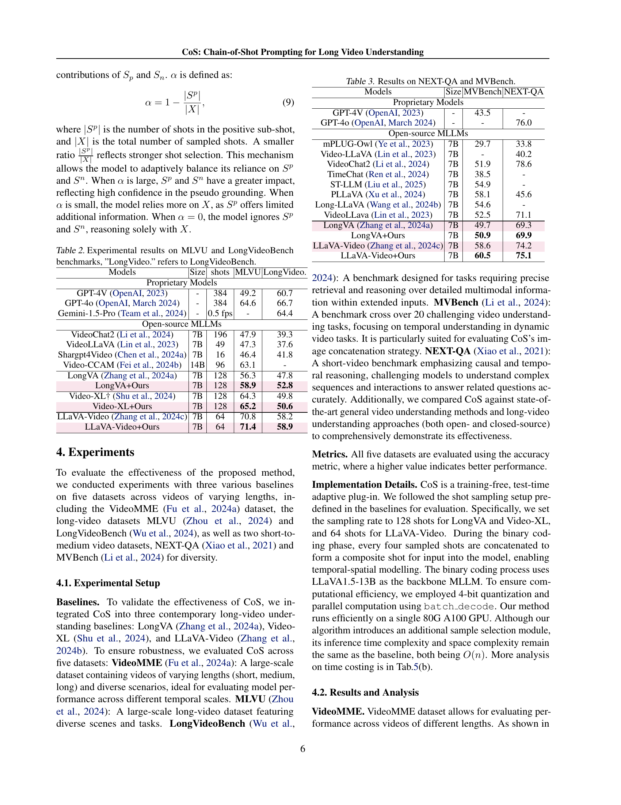
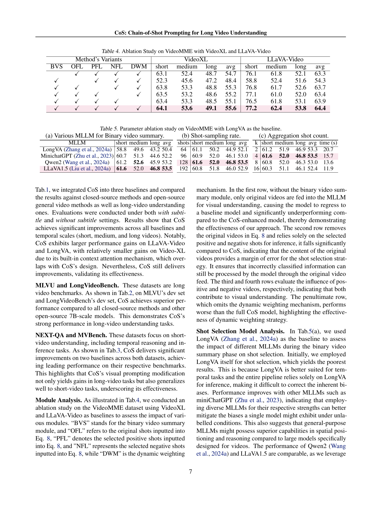
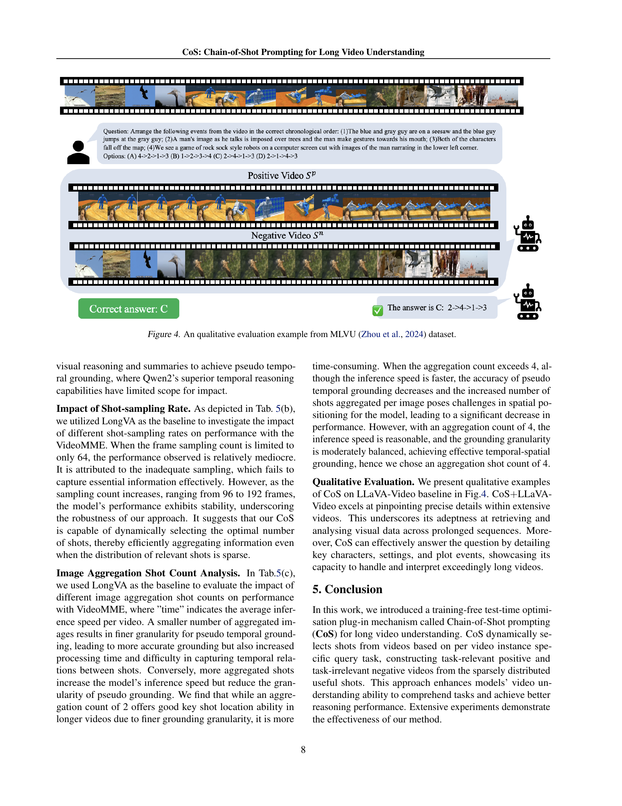
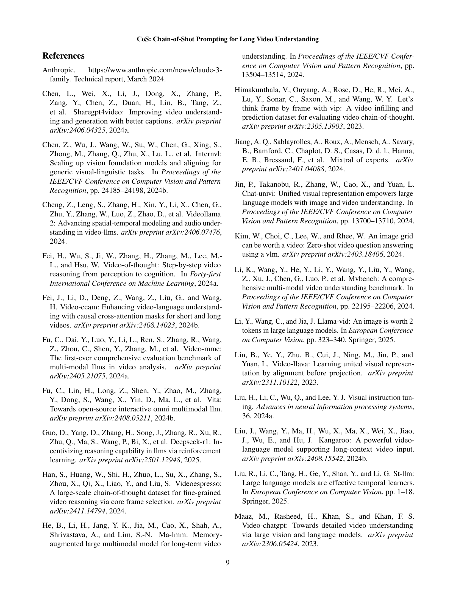
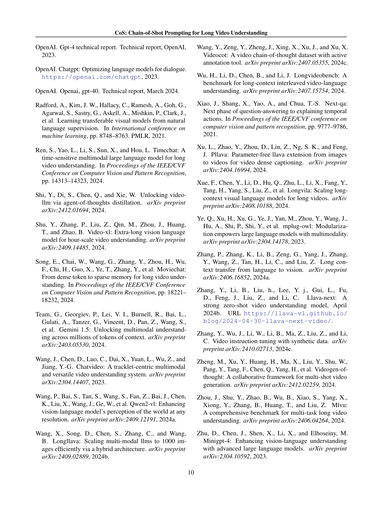

 


 2502.06428 
 Jian Hu et el. 
 
 🤗 2025-02-12 
 



↗ arXiv


↗ Hugging Face


↗ Papers with Code


### TL;DR



장문 비디오 데이터는 엄청난 양의 시각적 토큰을 생성하여 기존의 다중 모드 대규모 언어 모델(MLLM)의 처리 능력을 초과하는 문제가 있습니다. 기존 연구는 희소 샘플링으로 인한 중요 정보 누락 또는 과도한 샘플링으로 인한 모델 과부하 문제를 효과적으로 해결하지 못했습니다. 이러한 문제는 장문 비디오 이해 성능 저하의 주요 원인입니다.

본 논문에서는 이러한 문제를 해결하기 위해 **Chain-of-Shot prompting (CoS)**이라는 새로운 프롬프팅 기법을 제안합니다. CoS는 **이진 비디오 요약 메커니즘**과 **비디오 공동 추론 모듈**을 사용하여 작업 관련 긍정적 샷과 무관한 부정적 샷을 쌍으로 만들어 학습합니다.  이를 통해 **핵심 정보에 집중**하고 **무관한 정보로 인한 방해를 최소화**하여 장문 비디오 이해 성능을 향상시킵니다. 실험 결과, CoS는 다양한 기준 모델과 데이터 집합에서 효과성과 적응력을 입증했습니다.



#### Key Takeaways


 CoS는 장문 비디오 이해를 위한 효과적이고 적응력 있는 새로운 프롬프팅 기법입니다. 



 CoS는 이진 비디오 요약 및 비디오 공동 추론 모듈을 통해 핵심 장면을 효과적으로 선택합니다. 



 실험 결과, CoS는 다양한 기준 모델과 데이터셋에서 우수한 성능을 보이며 장문 비디오 이해 분야에 새로운 가능성을 제시합니다. 


#### Why does it matter?
본 논문은 **장문 비디오 이해의 난제를 해결하기 위한 새로운 접근법인 CoS(Chain-of-Shot prompting)**을 제시하여, 연구자들에게 **장문 비디오 데이터 활용 및 분석에 대한 새로운 가능성**을 제시합니다. 기존의 한계를 극복하고 효율적인 비디오 이해 모델을 개발하는 데 중요한 시사점을 제공하며, **추후 연구를 위한 새로운 방향**을 제시합니다. 특히, 비디오 데이터의 효율적인 처리 및 분석에 대한 요구가 증가하는 추세에 따라, 본 논문의 연구 결과는 다양한 분야의 연구자들에게 큰 영향을 미칠 것으로 예상됩니다.  CoS는 **훈련 없이도 테스트 단계에서 비디오 입력을 동적으로 최적화**하기 때문에, 모델의 적응력과 효율성을 높일 수 있어 활용 가치가 높습니다.

------
#### Visual Insights

> 🔼 그림 1은 VideoMME 데이터셋(Fu et al., 2024a)에서 다양한 길이의 비디오에 대한 비디오 이해 작업 성능에 미치는 샷 샘플링 비율 변화의 영향을 보여줍니다.  LongVA(Zhang et al., 2024a)와 Video-XL(Shu et al., 2024) 두 가지 모델을 평가했습니다. 샘플링된 샷의 수가 증가함에 따라 다양한 비디오 길이에 걸쳐 성능이 일관되게 향상되지 않았습니다. 왜냐하면 드문 샘플링은 중요한 세부 정보를 놓칠 수 있고, 반대로 과도한 샘플링은 모델을 과도한 무관한 콘텐츠로 압도할 수 있기 때문입니다. 이는 특히 긴 비디오 이해에서 최적의 샷 선택이라는 주요 과제를 보여줍니다. 즉, 비디오 이해에서 무관한 세부 정보(잡음)로 인한 방해를 최소화하면서 의미적 작업 정보 추출을 극대화하기 위해 가변적인 세부 정보를 어떻게 샘플링할 것인가 하는 것입니다.
> 

> 
read the caption

> Figure 1: The effects of changing shot-sampling rates on video understanding task performance on videos of different lengths in the VideoMME (Fu et al., 2024a) dataset. Two models are evaluated including LongVA (Zhang et al., 2024a) and Video-XL (Shu et al., 2024). As the number of sampled shots increased, performance did not consistently improve across various video lengths. That is because while sparse sampling may miss crucial details, exhaustive sampling often overwhelms the model with excessive irrelevant content. This illustrates the key challenge of optimal shot selection especially in long video understanding. That is, how to sample variable details in order to maximise semantic task information extraction whilst minimising distractions from irrelevant details (noise) in video understanding.
> 


| Models | Size | shots | VideoMME w/o sub. Short | VideoMME w/o sub. Medium | VideoMME w/o sub. Long | VideoMME w/o sub. Avg | VideoMME w/ sub. Short | VideoMME w/ sub. Medium | VideoMME w/ sub. Long | VideoMME w/ sub. Avg |
|---|---|---|---|---|---|---|---|---|---|---|
| **Proprietary Models** |  |  |  |  |  |  |  |  |  |  |
| GPT-4V [2023] | - | 384 | 70.5 | 55.8 | 53.5 | 59.9 | 73.2 | 59.7 | 56.9 | 63.3 |
| GPT-4o [March 2024] | - | 384 | 80.0 | 70.3 | 65.3 | 71.9 | 82.8 | 76.6 | 72.1 | 77.2 |
| Gemini-1.5-Pro [2024] | - | 0.5 fps | **81.7** | **74.3** | **67.4** | **75.0** | **84.5** | **81.0** | **77.4** | **81.3** |
| Claude3-Opus [March 2024] | - | - | 71.0 | 57.4 | 51.2 | 60.0 | 73.5 | 60.1 | 54.7 | 62.9 |
| **Open-source MLLMs** |  |  |  |  |  |  |  |  |  |  |
| VideoChat2 [2024] | 7B | 196 | 48.3 | 37.0 | 33.2 | 39.5 | 52.8 | 39.4 | 39.2 | 43.8 |
| VideoLLaVA [2023] | 7B | 49 | 45.3 | 38.0 | 36.2 | 39.9 | 46.1 | 40.7 | 38.1 | 41.6 |
| Sharegpt4Video [2024a] | 7B | 16 | 48.3 | 36.3 | 35.0 | 39.9 | 53.6 | 39.3 | 37.9 | 43.6 |
| InternVL-Chat-V1.5 [2024b] | 20B | 10 | 60.2 | 46.4 | 45.6 | 47.8 | 61.7 | 49.1 | 46.6 | 52.4 |
| Video-CCAM [2024b] | 14B | 96 | 62.2 | 50.6 | 46.7 | 53.2 | 66.0 | 56.3 | 49.9 | 57.4 |
| Long-LLaVA [2024b] | 7B | 128 | 61.9 | 51.4 | 45.4 | 52.9 | 66.2 | 54.7 | 50.3 | 57.1 |
| VITA [2024b] | 8x7B | 20 | 64.2 | 53.3 | 47.6 | 55.0 | 67.9 | 55.3 | 49.6 | 57.6 |
| Kangaroo [2024b] | 8B | 64 | 66.1 | 55.3 | 46.7 | 56.0 | 68.0 | 55.4 | 49.3 | 57.6 |
| LongVILA [2024] | 7B | 256 | 69.0 | 58.3 | 53.0 | 60.1 | 72.9 | 64.9 | 57.4 | 65.1 |
| LongVA [2024a] | 7B | 128 | 61.1 | 50.4 | 46.2 | 52.6 | 61.6 | 53.6 | 47.6 | 54.3 |
| LongVA+Ours | 7B | 128 | **61.6** | **52.0** | **46.8** | **53.5** | **64.2** | **54.4** | **48.5** | **55.7** |
| Video-XL† [2024] | 7B | 128 | 63.1 | 52.4 | 48.7 | 54.7 | 68.3 | 55.7 | 52.1 | 58.7 |
| Video-XL+Ours | 7B | 128 | **64.1** | **53.6** | **49.1** | **55.6** | **68.9** | **57.1** | **52.3** | **59.5** |
| LLaVA-Video [2024c] | 7B | 64 | 76.1 | 61.8 | 52.1 | 63.3 | 78.0 | 69.3 | 61.8 | 69.7 |
| LLaVA-Video+Ours | 7B | 64 | **77.2** | **62.4** | **53.8** | **64.4** | **80.1** | **69.4** | **65.1** | **71.5** |

> 🔼 표 1은 VideoMME 벤치마크에 대한 실험 결과를 보여줍니다. 자막 지원 유무에 따른 결과를 모두 제시하며, † 표시는 공식 가중치를 사용하여 재현한 결과임을 나타냅니다.  각 모델의 성능은 짧은, 중간, 긴 비디오 길이에 대해 각각 평가되었으며, 최고 성능은 굵게 표시되어 있습니다.  모델의 크기(Size), 사용된 샷의 수(shots), 그리고 자막 유무에 따른 짧은, 중간, 긴 비디오에 대한 정확도(Performance)가 제시되어 있습니다.  표는 다양한 크기와 유형의 다중 모드 언어 모델(MLLM)을 비교 분석하여, VideoMME 데이터셋에서 모델의 성능을 평가하고 비교하는 것을 목적으로 합니다.
> 

> 
read the caption

> Table 1: Experimental results on VideoMME benchmarks, we report results with and without subtitle assistance. † indicates that the results were reproduced using their official weights. The best is in bold.
> 

### In-depth insights

#### Long Video MLLM
장문 비디오를 위한 다중 모달 대규모 언어 모델(MLLM)은 **매우 많은 시각 토큰**을 처리해야 하므로 기존 MLLM의 문맥 길이를 초과하여 성능 저하를 야기합니다.  **토큰 압축이나 특수 메모리 메커니즘**을 사용하는 기존 연구는 중요 정보 손실 문제를 야기하고, **샷 선택 전략** 또한 중요한 과제입니다.  **과도한 샘플링은 모델을 불필요한 정보로 과부하**시키고, **부족한 샘플링은 중요 정보 누락**을 초래합니다. 따라서, **관련 정보 극대화와 무관한 정보 최소화** 사이의 균형을 맞추는 것이 중요하며, 효과적인 샷 선택은 장문 비디오 이해의 핵심입니다.  본 논문에서는 **샷 선택을 시각적 프롬프트 최적화**로 규정하고, 이를 통해 **과제 관련성이 높은 샷**을 선택하는 방법을 제시합니다.

#### Chain-of-Shot Prompting
본 논문에서 제안하는 "Chain-of-Shot Prompting (CoS)" 기법은 **긴 비디오 이해를 위한 혁신적인 접근법**입니다. 기존의 MLLM(다중 모드 대규모 언어 모델)이 긴 비디오의 과도한 시각 토큰으로 인해 어려움을 겪는 문제를 해결하기 위해, CoS는 **시각 프롬프트 최적화**라는 새로운 관점을 제시합니다.  즉, 비디오 이해 작업에 적합한 샷을 선택하는 것을 테스트 시간에 최적화하는 문제로 바라보는 것입니다.  CoS는 이를 위해 **이진 비디오 요약 메커니즘**과 **비디오 공동 추론 모듈**이라는 두 가지 핵심 구성 요소를 활용합니다. 이진 비디오 요약은  과업과 관련된 샷을 식별하고 이진 코드화를 수행하여 과업 관련 샷과 무관한 샷을 구분합니다. 비디오 공동 추론 모듈은 이러한 이진 코드를 사용하여 과업 관련 긍정적 샷과 부정적 샷을 쌍으로 연결함으로써 모델의 관련 정보에 대한 집중도를 높입니다.  결과적으로 CoS는 **긴 비디오 이해의 효율성과 적응력을 향상**시키는 효과적인 방법을 제공합니다.  이는 다양한 기준 모델과 데이터 집합에 대한 실험을 통해 검증되었습니다.

#### Binary Video Summary
본 논문에서 제시된 'Binary Video Summary'는 **장문 비디오 내 핵심 정보의 효율적 추출**이라는 과제에 대한 창의적인 해결책입니다. 기존의 장문 비디오 이해 모델들이 과도한 시각적 토큰으로 인해 어려움을 겪는 문제를 해결하기 위해, **이진 분류 방식**을 도입하여 각 샷(shot)이 과제와 관련이 있는지 여부를 판단합니다.  **LLaVA와 같은 다중 모드 언어 모델**을 활용하여 이진 코드를 생성하고, 이를 통해 핵심 샷을 효과적으로 식별합니다.  **시간적 맥락 정보 손실을 최소화**하기 위해, 연속적인 샷들을 그룹화하여 처리하는 기법도 활용합니다.  **계산 비용을 절감**하고 **시간적 연관성**을 유지하는 전략으로 볼 수 있으며,  결과적으로 **장문 비디오 분석에 필요한 정보만 효율적으로 추출**하는 데 기여합니다.  다만, **이진 분류의 단순성**으로 인해 세밀한 정보의 손실 가능성과,  **모델의 성능에 대한 의존성**이라는 한계점도 고려해야 합니다.

#### Visual Prompt Optim.
**시각적 프롬프트 최적화**는 장문 비디오 이해를 위한 핵심 전략입니다.  기존의 다양한 샷 샘플링 기법들은 과도한 시각 토큰으로 인해 장문 비디오를 효과적으로 처리하는 데 어려움을 겪습니다. **희소 샘플링**은 중요한 세부 정보를 놓칠 위험이 있고, **포괄적 샘플링**은 모델을 무의미한 내용으로 압도할 수 있습니다.  따라서 **과제 관련 샷을 효과적으로 선택하고 무관한 내용을 최소화하는 방법**이 중요합니다. 이를 위해 **이미지 모자이크 기법**과 같은 시각적 프롬프트 최적화 전략이 제시될 수 있습니다. 이는 샷을 효과적으로 그룹화하고, 과제와의 관련성을 이진 코드로 표현하여 모델의 계산 부하를 줄이고 관련 정보에 집중할 수 있도록 돕습니다.  **이진 비디오 요약 및 비디오 공동 추론 모듈**을 통해 과제 관련 긍정적 샷과 부정적 샷을 구별하여 모델의 효율성을 높입니다.  **결과적으로, 시각적 프롬프트의 최적화는 장문 비디오 이해에서 중요한 정보를 효과적으로 추출하고, 무관한 정보로 인한 방해를 최소화하는 데 기여**합니다.  이는 모델의 정확도와 효율성을 향상시키는 중요한 요소가 됩니다.

#### Future Research
**장기 비디오 이해를 위한 시각적 프롬프트 최적화** 연구는 아직 초기 단계이며, 향후 연구 방향은 다음과 같습니다.  **더욱 정교한 시각적 프롬프트 생성 기법** 개발이 필요하며, 이를 위해 **다양한 시각적 특징을 효과적으로 결합**하는 방법, **비디오의 시공간적 맥락을 고려**하는 방법, 그리고 **사용자의 질의 의도를 정확히 반영**하는 방법 등에 대한 연구가 필요합니다. 또한, **대규모 장기 비디오 데이터셋** 구축 및 **다양한 평가 지표** 개발을 통해 연구 결과의 객관적인 비교 및 검증이 가능하도록 해야 합니다.  **모델의 효율성 및 확장성**을 높이는 연구 또한 중요하며, 이를 위해 경량화된 모델 설계, 분산 학습 기법 활용 등이 고려될 수 있습니다. 마지막으로, **다양한 하드웨어 플랫폼**에서의 성능을 고려한 연구를 통해 실제 응용 분야에 적용 가능성을 높여야 합니다.  **윤리적 고려 사항**을 포함한 연구 또한 중요하며, 편향된 데이터 또는 모델로 인한 문제점을 해결하기 위한 노력이 필요합니다.

### More visual insights

More on figures

> 🔼 그림 2는 비디오 이해에서 어떻게 샷을 선택하는 것이 중요한지를 보여주는 예시입니다. 소년이 점차적으로 용의 신뢰를 얻는 과정을 보여주는 비디오에서, 서로 다른 샘플링 방법에 따라 완전히 다른 스토리가 만들어집니다. A 비디오에서는 소년이 용에게 공격을 받는 반면, B 비디오에서는 소년이 용과 함께 음식을 나누는 모습이 보여집니다. 이는 비디오 샘플링의 작은 차이가 의미 해석에 큰 영향을 미칠 수 있음을 보여줍니다.
> 

> 
read the caption

> Figure 2: The critical problem of how to select shots in video understanding. In a video that depicts how a boy gradually gains a dragon’s trust, different sampling methods create two distinct narratives: split video A shows the boy being attacked by the dragon, while split video B shows him happily sharing food with the dragon. This shows that minor differences in video sampling leads to significant variations in semantic understanding (interpretation).
> 

> 🔼 그림 3은 CoS의 전체 프레임워크를 보여줍니다. 먼저 LLaVA를 사용하여 모자이크 이진 코딩을 수행하여 긴 비디오에 대한 시간적 기반을 마련하기 위한 비디오 요약을 수행합니다. 구체적으로, 매 4개의 샷을 모아 모자이크 합성 이미지를 만듭니다. LLaVA는 각 합성 이미지 내에 작업 관련 요소가 있는지 여부를 판단하여 1 또는 0( '예' 또는 '아니오')의 이진 값으로 인코딩하여, 드물게 분포된 작업 관련 샷을 식별하고 의사 시간적 기반을 마련합니다. 이 이진 비디오 요약을 바탕으로 작업 관련 양성 샷 Sp와 무관한 음성 샷 Sn을 생성하고 이진 코드로 표현합니다. Sp, Sn, 그리고 원본 비디오 V에서 샘플링된 원본 프레임 시퀀스 X를 MLLM에 공동 추론하여 무관한 비디오 콘텐츠의 간섭을 최소화합니다.
> 

> 
read the caption

> Figure 3: The overall framework of CoS. It first utilises LLaVA to perform a mosaicing binary coding to bootstrap video summarisation for temporal grounding on a long video. Specifically, every four shots are aggregated into a mosaicing composition image. LLaVA determines whether task-related elements exist within each composition image by encoding a binary value of 1 or 0 (‘yes’ or ‘no’), thereby identifying sparsely distributed task-related shots to achieve pseudo temporal grounding. Given this binary video summary, task-related positive shots Spsuperscript𝑆𝑝S^{p}italic_S start_POSTSUPERSCRIPT italic_p end_POSTSUPERSCRIPT and irrelevant negative shots Snsuperscript𝑆𝑛S^{n}italic_S start_POSTSUPERSCRIPT italic_n end_POSTSUPERSCRIPT are generated and represented by binary codes. Spsuperscript𝑆𝑝S^{p}italic_S start_POSTSUPERSCRIPT italic_p end_POSTSUPERSCRIPT, Snsuperscript𝑆𝑛S^{n}italic_S start_POSTSUPERSCRIPT italic_n end_POSTSUPERSCRIPT and the original frame sequence X𝑋Xitalic_X sampled from original video V𝑉Vitalic_V are then fed into the MLLM for co-reasoning, minimising interference of irrelevant video content.
> 

> 🔼 그림 4는 MLVU 데이터셋(Zhou et al., 2024)에서 정성적 평가의 한 예시를 보여줍니다. 질문에 대한 답변을 도출하기 위해 모델이 비디오의 관련 부분을 선택하고 해석하는 과정을 보여주는 시각적 설명입니다.  비디오의 다양한 장면들을 보여주는 긍정적(Positive Video SP)과 부정적(Negative Video SN) 시퀀스들이 제시되어 있으며, 모델이 어떻게 이러한 시퀀스들을 사용하여 질문에 대한 정확한 답을 찾아내는지 보여줍니다. 이 그림을 통해, 제안된 방법인 CoS가 시간적으로 멀리 떨어져 있거나 산발적으로 분포된 중요한 정보를 효과적으로 추출하고, 비디오의 무관한 부분으로 인한 방해를 최소화함으로써 장문의 비디오를 이해하는 데 효과적임을 보여줍니다.
> 

> 
read the caption

> Figure 4: An qualitative evaluation example from MLVU (Zhou et al., 2024) dataset.
> 

More on tables


| Models | Size | shots | MLVU | LongVideo. |
|---|---|---|---|---|
| Proprietary Models |  |  |  |  |
| GPT-4V (OpenAI, 2023) | - | 384 | 49.2 | 60.7 |
| GPT-4o (OpenAI, March 2024) | - | 384 | 64.6 | 66.7 |
| Gemini-1.5-Pro (Team et al., 2024) | - | 0.5 fps | - | 64.4 |
| Open-source MLLMs |  |  |  |  |
| VideoChat2 (Li et al., 2024) | 7B | 196 | 47.9 | 39.3 |
| VideoLLaVA (Lin et al., 2023) | 7B | 49 | 47.3 | 37.6 |
| Shargpt4Video (Chen et al., 2024a) | 7B | 16 | 46.4 | 41.8 |
| Video-CCAM (Fei et al., 2024b) | 14B | 96 | 63.1 | - |
| LongVA (Zhang et al., 2024a) | 7B | 128 | 56.3 | 47.8 |
| LongVA+Ours | 7B | 128 | **58.9** | **52.8** |
| Video-XL† (Shu et al., 2024) | 7B | 128 | 64.3 | 49.8 |
| Video-XL+Ours | 7B | 128 | **65.2** | **50.6** |
| LLaVA-Video (Zhang et al., 2024c) | 7B | 64 | 70.8 | 58.2 |
| LLaVA-Video+Ours | 7B | 64 | **71.4** | **58.9** |
> 🔼 표 2는 MLVU와 LongVideoBench 벤치마크에 대한 실험 결과를 보여줍니다.  LongVideo는 LongVideoBench를 의미합니다. 표는 다양한 모델들의 MLVU와 LongVideoBench 성능을 비교 분석하여, 제안된 방법의 효과를 보여줍니다.  각 모델의 성능은 MLVU와 LongVideoBench 점수로 나타내며,  'Long Video' 열은 LongVideoBench 점수를 나타냅니다. 이 표를 통해 다양한 모델들의 긴 비디오 이해 능력을 비교하고, 제안된 방법의 우수성을 확인할 수 있습니다.
> 

> 
read the caption

> Table 2: Experimental results on MLVU and LongVideoBench benchmarks, ”LongVideo.” refers to LongVideoBench.
> 


| Models | Size | MVBench | NEXT-QA |
|---|---|---|---| 
| Proprietary Models |  |  |  |
| GPT-4V (OpenAI, 2023) | - | 43.5 | - |
| GPT-4o (OpenAI, March 2024) | - | - | 76.0 |
| Open-source MLLMs |  |  |  |
| mPLUG-Owl (Ye et al., 2023) | 7B | 29.7 | 33.8 |
| Video-LLaVA (Lin et al., 2023) | 7B | - | 40.2 |
| VideoChat2 (Li et al., 2024) | 7B | 51.9 | 78.6 |
| TimeChat (Ren et al., 2024) | 7B | 38.5 | - |
| ST-LLM (Liu et al., 2025) | 7B | 54.9 | - |
| PLLaVA (Xu et al., 2024) | 7B | 58.1 | 45.6 |
| Long-LLaVA (Wang et al., 2024b) | 7B | 54.6 | - |
| VideoLLava (Lin et al., 2023) | 7B | 52.5 | 71.1 |
| LongVA (Zhang et al., 2024a) | 7B | 49.7 | 69.3 |
| LongVA+Ours | 7B | 50.9 | 69.9 |
| LLaVA-Video (Zhang et al., 2024c) | 7B | 58.6 | 74.2 |
| LLaVA-Video+Ours | 7B | 60.5 | 75.1 |
> 🔼 표 3은 NEXT-QA 및 MVBench 데이터셋에서 다양한 모델의 성능을 비교 분석한 결과를 보여줍니다.  다양한 크기의 모델(7B, 14B, 20B 등)들의  두 데이터셋에 대한 정확도(Accuracy)를 제시하여, 각 모델의 장단점 및 비디오 이해 능력을 평가하는 데 사용됩니다.  특히,  본 논문에서 제안하는 CoS 기법을 적용한 모델과 적용하지 않은 모델의 결과를 비교하여 CoS의 효과를 확인할 수 있습니다.
> 

> 
read the caption

> Table 3: Results on NEXT-QA and MVBench.
> 


| Method's Variants | VideoXL |  |  |  | LLaVA-Video |  |  |  |
|---|---|---|---|---|---|---|---|---|
| BVS | OFL | PFL | NFL | DWM | short | medium | long | avg |
|  | ✓ | ✓ | ✓ | ✓ | 63.1 | 52.4 | 48.7 | 54.7 |
| ✓ |  | ✓ | ✓ | ✓ | 52.3 | 45.6 | 47.2 | 48.4 |
| ✓ | ✓ |  | ✓ | ✓ | 63.8 | 53.3 | 48.8 | 55.3 |
| ✓ | ✓ | ✓ |  | ✓ | 63.5 | 53.2 | 48.6 | 55.2 |
| ✓ | ✓ | ✓ | ✓ |  | 63.4 | 53.3 | 48.5 | 55.1 |
| **✓** | **✓** | **✓** | **✓** | **✓** | **64.1** | **53.6** | **49.1** | **55.6** |
> 🔼 표 4는 VideoMME 데이터셋을 사용하여 VideoXL과 LLaVA-Video 모델에 대해 CoS(Chain-of-Shot Prompting)의 각 모듈(Binary Video Summary, Original Frame, Positive Shots, Negative Shots, Dynamic Weighting Mechanism)의 영향을 분석한 결과를 보여줍니다.  각 모듈의 유무에 따른 짧은, 중간, 긴 영상 길이별 정확도를 비교하여 CoS의 효과를 검증합니다.  결과는 각 모듈이 성능 향상에 미치는 기여도를 정량적으로 제시합니다.
> 

> 
read the caption

> Table 4: Ablation Study on VideoMME with VideoXL and LLaVA-Video
> 


| (a) Various MLLM for Binary video summary | (b) Shot-sampling rate | (c) Aggregation shot count |
|---|---|---|
| LongVA (Zhang et al., 2024a) | 64 | 2 |
|  | 96 | 4 |
|  | 128 | 8 |
|  | 192 | 16 |
| MinichatGPT (Zhu et al., 2023) |  |  |
| Qwen2 (Wang et al., 2024a) |  |  |
| LLaVA1.5 (Liu et al., 2024a) |  |  |
> 🔼 표 5는 LongVA 모델을 기준으로 VideoMME 데이터셋에서 매개변수를 제거했을 때의 영향을 분석한 결과를 보여줍니다.  (a)는 이진 비디오 요약에 사용된 다양한 MLLM 모델들의 성능 비교, (b)는 샷 샘플링 비율에 따른 성능 변화, (c)는 모자이크 이미지 생성 시 결합되는 연속 샷 개수에 따른 성능 및 처리 시간 변화를 보여줍니다. 각 실험은 세 가지 비디오 길이(짧은, 중간, 긴)에 대해 평가되었으며,  성능은 정확도(accuracy)로 측정되었습니다.  이 표는 CoS 방법의 각 구성 요소(이진 비디오 요약, 비디오 공동 추론, 동적 가중치 메커니즘)의 효과와 최적의 하이퍼파라미터 설정을 이해하는 데 도움이 됩니다.
> 

> 
read the caption

> Table 5: Parameter ablation study on VideoMME with LongVA as the baseline.
> 

### Full paper



