 


 2502.06527 
 D. She et el. 
 
 🤗 2025-02-11 
 



↗ arXiv


↗ Hugging Face


### TL;DR



기존의 개인 맞춤형 비디오 생성 모델은 시간적 일관성 및 품질 저하 문제로 어려움을 겪어왔습니다. 특히, 참조 이미지와 비디오 콘텐츠 간의 상호 작용이 부족하고 참조 이미지의 영향력을 효과적으로 조절하는 데 어려움이 있었습니다.

본 논문에서는 이러한 문제를 해결하기 위해 **CustomVideoX**라는 새로운 프레임워크를 제안합니다. **CustomVideoX는 3D 참조 어텐션 메커니즘을 통해 참조 이미지와 비디오 프레임 간의 직접적인 상호 작용을 가능하게 하며, 시간 인식 어텐션 바이어스를 통해 참조 이미지의 영향력을 동적으로 조절합니다.** 또한, **개체 영역 인식 향상(ERAE) 모듈을 통해 주요 개체 영역에 집중하여 영상 생성의 정확도를 높였습니다.** 실험 결과, CustomVideoX는 기존 방법보다 영상 일관성 및 품질 측면에서 우수한 성능을 보였습니다.



#### Key Takeaways


 CustomVideoX는 제로샷 방식으로 개인 맞춤형 비디오를 생성하는 새로운 프레임워크입니다. 



 3D 참조 어텐션 및 시간 인식 어텐션 바이어스는 영상 일관성 및 품질을 향상시키는 데 효과적입니다. 



 VideoBench 벤치마크는 개인 맞춤형 영상 생성 모델의 성능을 객관적으로 평가하는 데 기여합니다. 


#### Why does it matter?
**본 논문은 영상 합성 분야에서 개인 맞춤형 영상 생성의 어려움을 해결하는 혁신적인 프레임워크인 CustomVideoX를 제시하여 연구자들에게 중요한 의미를 가집니다.**  **영상 일관성 및 품질 저하 문제를 해결하기 위한 3D 참조 어텐션 및 시간 인식 어텐션 바이어스와 같은 새로운 방법론을 제시하며, 제로샷 개인 맞춤형 영상 생성에 대한 새로운 가능성을 제시합니다.**  **VideoBench라는 새로운 벤치마크를 통해 객관적인 성능 평가를 제공하며, 향후 연구의 발전 방향을 제시합니다.**

------
#### Visual Insights

> 🔼 그림 1은 CustomVideoX 모델이 세밀한 객체 디테일을 유지하면서 자연스러운 동작을 합성하는 능력을 보여줍니다.  (a)는 자연스러운 동작을, (b)는 높은 수준의 텍스트 정보 보존 능력, (c)는 텍스트 일관성을 시각적으로 보여주는 예시들을 보여줍니다. 각각의 예시는 다양한 환경과 객체를 포함하며, CustomVideoX 가 다양한 시나리오에서도 자연스럽고 일관성 있는 비디오를 생성할 수 있음을 강조합니다.  이는 단순히 텍스트 설명을 따르는 것을 넘어, 입력된 참조 이미지의 객체 특징들을 정확하게 반영하여, 사실적이고 자연스러운 비디오를 생성하는 CustomVideoX 의 강점을 보여줍니다.
> 

> 
read the caption

> Figure 1:  CustomVideoX synthesizes natural motions while preserving the fine-grained object details.
> 


| Methods | DreamBench |  |  |  |  | VideoBench |  |  |  |  |
|---|---|---|---|---|---|---|---|---|---|---|
|  | CLIP-T | CLIP-I | DINO-I | T.Cons | D.D | CLIP-T | CLIP-I | DINO-I | T.Cons | D.D |
| BLIP-Diffusion (Li et al., 2023) | 29.97 | 84.39 | 84.14 | 95.87 | 54.87 | 29.85 | 88.83 | 87.99 | 96.88 | 36.00 |
| IP-Adapter (Ye et al., 2023) | 28.87 | 82.00 | 82.18 | 95.16 | 56.64 | 29.38 | 86.92 | 87.87 | 96.23 | 42.00 |
| λ-Eclipse (Patel et al., 2024) | 34.01 | 82.92 | 84.10 | 95.98 | 59.29 | 32.25 | 89.45 | 89.94 | 97.54 | 38.00 |
| SSR-Encoder (Zhang et al., 2024) | 29.32 | 83.24 | 83.92 | 95.42 | 59.29 | 29.97 | 87.01 | 87.74 | 96.63 | 40.00 |
| MS-Diffusion (Wang et al., 2024) | 33.74 | 85.47 | 87.54 | 96.65 | 53.98 | 32.64 | 90.55 | 91.29 | 97.35 | 54.00 |
| VideoBooth (Jiang et al., 2024) | 28.99 | 76.42 | 77.90 | 96.17 | 45.13 | 28.92 | 82.60 | 84.06 | 96.75 | 46.00 |
| CustomVideoX (Ours) | 34.28 | 85.47 | 88.17 | 96.77 | 50.44 | 33.38 | 90.26 | 91.49 | 97.26 | 46.00 |

> 🔼 표 1은 DreamBench와 VideoBench 벤치마크에서 다양한 방법들을 정량적으로 비교한 결과를 보여줍니다.  각 방법은 CLIP-T, CLIP-I, DINO-I, 시간 일관성(T.Cons), 동적 정도(D.D) 다섯 가지 지표를 통해 평가됩니다.  CLIP-T와 CLIP-I는 각각 텍스트와 이미지 일관성을 측정하고, DINO-I는 시각적 유사성을 측정합니다. 시간 일관성(T.Cons)은 비디오 프레임 간 일관성을, 동적 정도(D.D)는 비디오의 동작 역동성을 측정합니다.  표에서 굵은 숫자는 가장 좋은 결과를, 밑줄 친 숫자는 두 번째로 좋은 결과를 나타냅니다. 이 표는 CustomVideoX 모델의 성능을 기존 방법들과 비교하여 정량적으로 보여주는 역할을 합니다.
> 

> 
read the caption

> Table 1: Quantitative comparison of different methods across DreamBench and VideoBench benchmarks. Bold represents the best result and data underline represents the second-best result.
> 

### In-depth insights

#### 3D Attention's Role
본 논문에서 제안된 3D 어텐션 메커니즘은 **영상 생성의 핵심**입니다.  기존 2D 어텐션과 달리, **시간적 차원까지 고려**하여 참조 이미지와 비디오 프레임 간의 상호작용을 보다 효율적이고 효과적으로 처리합니다. 이를 통해 **일관성 있는 주제 유지 및 시간적 연속성 확보**라는 어려운 과제를 해결하고자 합니다.  3D 어텐션은 참조 이미지 특징을 모든 비디오 프레임에 **동시에 적용**, 공간 및 시간적 차원에서의 상호 작용을 가능하게 합니다.  이는 단순히 참조 이미지 정보를 추가하는 것이 아니라, **프레임 간의 연관성을 강화**, 보다 자연스럽고 현실적인 움직임을 생성하는 데 중요한 역할을 합니다.  **단일 네트워크 내에서 효율적인 처리**를 통해 계산 비용을 절감하고, 모델의 적응력을 높일 수 있다는 점도 핵심적인 장점입니다.

#### Bias Modulation
본 논문에서 제시된 바이어스 조절(Bias Modulation) 기법은 **영상 생성 과정 전반에 걸쳐 참조 이미지의 영향력을 동적으로 조절**하는 핵심 전략입니다.  단순히 참조 이미지 정보를 일괄적으로 적용하는 것이 아니라, **시간에 따라 가중치를 조절**하여 초기 단계에서는 잡음에 대한 영향을 최소화하고, 중간 단계에서는 참조 정보를 효과적으로 활용하여 일관성을 유지하며, 마지막 단계에서는 생성 결과물의 자연스러움을 높이는 방식입니다. 이를 통해 **일관성 있는 영상 생성과 세부적인 시각적 품질 향상**이라는 두 가지 목표를 동시에 달성할 수 있습니다. 특히, **시간에 따른 가중치 변화 패턴**이 역 포물선 형태를 띠는 것이 중요하며, 이는 초기 및 최종 단계에서 참조 이미지의 영향력을 최소화하고, 중간 단계에서 최대화하여 생성 과정의 안정성과 품질을 보장하는 데 기여합니다.  **개체 영역 인식 강화 모듈(ERAE)**과 함께 작용하여, 개체 특징을 보다 효율적으로 반영하면서도 자연스러운 배경 생성을 가능하게 합니다.

#### VideoBench
본 논문에서 제시된 VideoBench는 기존의 영상 생성 평가 벤치마크의 한계를 극복하기 위해 **50개 이상의 개체와 100개 이상의 프롬프트**를 포함하는 포괄적인 벤치마크입니다. 이는 단순히 기존 데이터셋의 확장이 아니라, **다양한 시나리오와 개체를 다루는 영상 생성 모델의 성능을 종합적으로 평가**하기 위한 새로운 기준을 제시합니다.  **영상 일관성 및 품질** 측면에서 기존 방법론들과 비교하여 CustomVideoX의 우수성을 입증하는 데 중요한 역할을 합니다.  VideoBench는 **제로샷(zero-shot)** 학습 환경에서의 성능 평가에 초점을 맞추어, 실제 응용 환경에서의 모델 성능을 보다 정확하게 반영합니다.  **다양한 개체와 프롬프트**를 통해 모델의 일반화 능력(generalization)을 측정함으로써, 특정 데이터셋에 과적합된 모델의 문제점을 해결하고, 더욱 견고하고 실용적인 영상 생성 모델 개발을 위한 중요한 지표를 제공합니다.  **기존 벤치마크와의 비교 분석**을 통해 CustomVideoX의 우수성을 명확히 보여주는 동시에, 향후 영상 생성 모델 연구의 방향을 제시하는 중요한 역할을 수행합니다.

#### LoRA Efficiency
본 논문에서 제시된 CustomVideoX 모델은 **LoRA(Low-Rank Adaptation)** 기법을 활용하여 사전 훈련된 비디오 네트워크의 매개변수를 효율적으로 조정합니다.  이는 기존의 전체 네트워크 재훈련 방식에 비해 **매개변수 튜닝에 드는 비용을 크게 절감**할 수 있음을 의미합니다. 특히, 참조 이미지를 활용한 개인화된 영상 생성 과정에서 효율성이 돋보이는데,  **전체 네트워크가 아닌 LoRA 매개변수만 학습**시킴으로써, 계산 자원 및 시간을 상당히 절약할 수 있습니다. 이러한 효율성은 대규모 데이터셋을 활용한 훈련을 가능하게 하며, 더욱 다양하고 정교한 개인화 영상 생성을 가능하게 합니다. CustomVideoX가 제안하는 LoRA 기반의 효율적인 학습 전략은 **비용 효과적인 개인화 영상 생성 시스템 구축**에 중요한 역할을 합니다.  결과적으로, 제한된 자원으로도 높은 성능의 개인화 영상 생성 모델을 구현할 수 있다는 점에서 CustomVideoX의 LoRA 효율성은 주목할 만합니다.

#### Future Directions
본 논문에서 제시된 CustomVideoX는 영상 생성 분야에 중요한 발전을 가져왔지만, **향후 연구 방향**은 여전히 무궁무진합니다.  **고해상도 영상 생성**의 개선은 필수적이며,  현재 모델의 제한된 해상도는 고품질 영상 생성에 걸림돌이 될 수 있습니다. 또한, **시간적 일관성**을 더욱 향상시켜 자연스러운 움직임과 흐름을 생성하는 연구가 필요합니다.  **다양한 객체 및 배경**에 대한 일반화 능력 또한 개선되어야 하며, 현재 모델은 특정 객체나 배경에 대해서는 성능이 떨어질 수 있습니다.  마지막으로, **효율적인 훈련 및 추론**을 위한 알고리즘 및 모델 구조 개선을 통해 실시간 영상 생성에 도전하는 것도 중요한 과제입니다.  **대규모 데이터셋** 구축을 통한 모델 성능 향상 또한 중요한 연구 방향입니다.

### More visual insights

More on figures

> 🔼 그림 2는 CustomVideoX의 전체 파이프라인을 보여줍니다. CustomVideoX는 제공된 이미지 객체와 텍스트 설명을 사용하여 지정된 지침에 맞는 개인화된 비디오를 생성할 수 있습니다. 3D 참조 어텐션 메커니즘을 통해 참조 이미지를 각 비디오 프레임에 통합하여 참조 이미지와 비디오 프레임 간의 시간적 및 공간적 상호 작용을 가능하게 합니다. 또한 CustomVideoX는 시간에 따른 어텐션 바이어스 전략과 개체 영역 인식 향상 모듈을 사용하여 디노이징 프로세스 전반에 걸쳐 공간적 및 시간적 일관성을 높여 프레임 전체에서 일관된 참조 특징을 유지합니다.
> 

> 
read the caption

> Figure 2: The overall pipeline of CustomVideoX. CustomVideoX is capable of producing personalized videos that conform to specified instructions, utilizing provided image objects and textual descriptions. It enhances each video frame by incorporating reference image through 3D Reference Attention mechanism, allowing for dynamic interactions between the reference images and video frames, both temporally and spatially. Moreover, CustomVideoX employs a Time-Aware Attention Bias strategy and an Entity Region-Aware Enhancement module to boost spatial and temporal coherence throughout the denoising process, enabling the model to maintain consistent reference feature capture across frames.
> 

> 🔼 그림 3은 샘플링 과정에서 시간에 따른 어텐션 편향(TAB)과 고정된 어텐션 편향을 비교한 것입니다.  TAB는 포물선 형태의 시간적 마스크를 사용하여 참조 특징의 영향을 역동적으로 조절함으로써 생성 시퀀스 전체에서 참조 이미지의 일관성을 향상시킵니다. 고정된 어텐션 편향과 달리, 시간에 따른 어텐션 편향은 생성 과정의 초기 단계에서는 참조 특징의 영향을 최소화하고, 중간 단계에서는 영향을 증가시키다가, 최종 단계에서는 영향을 감소시킵니다. 이러한 역동적인 조절을 통해 생성된 비디오의 시간적 일관성과 시각적 품질을 향상시키는 효과를 보입니다.
> 

> 
read the caption

> Figure 3: The time-aware attention bias v.s. fixed attention bias in the sampling process. TAB dynamically regulates the influence of reference features using a parabolic temporal mask, enhancing the consistency of reference images throughout the generation sequence.
> 

> 🔼 그림 4는 제안된 VideoBench 프레임워크의 개요를 보여줍니다. 왼쪽 패널은 단어 개수를 보여주고, 오른쪽 패널은 프레임워크의 적용을 보여주는 시각적 예시를 제공합니다.  VideoBench는 50개 이상의 개체와 100개 이상의 프롬프트를 포함하는 포괄적인 벤치마크로, 기존 방법과 제안된 방법의 성능을 비교 평가하는 데 사용됩니다.  다양한 시각적 예시를 통해, VideoBench가 다양한 개체와 시나리오에 대한 개인화된 비디오 생성의 품질과 일관성을 평가하는 데 얼마나 효과적인지 보여줍니다.
> 

> 
read the caption

> Figure 4: Overview of the Proposed VideoBench Framework. From left to right, panel left illustrates word counting, while panel right provides visual examples demonstrating the application of the framework.
> 

> 🔼 그림 5는 여러 다른 방법들과 비교했을 때 CustomVideoX가 개념 충실도와 캡션 의미 일관성 측면에서 뛰어난 성능을 보여주는 것을 보여주는 정성적 결과를 보여줍니다.  CustomVideoX는 개별화된 모델(+ I2V 모델)과 비교하여, 입력 이미지의 내용을 정확하게 반영하고,  텍스트 설명과 시각적 내용 간의 일치성이 매우 높은 고품질 비디오를 생성하는 것을 확인할 수 있습니다. 그림에는 여러가지 다른 방법들(BLIP-Diffusion, IP-Adapter, A-ECLIPSE, SSR-Encoder, MS-Diffusion)의 결과와 CustomVideoX의 결과를 비교하여 보여주는 여러 비디오 프레임들이 포함되어 있습니다.
> 

> 
read the caption

> Figure 5: The qualitative results compared to the personalized model (+ I2V model). When compared to several different methods, CustomVideoX clearly demonstrates superior capabilities on concept fidelity and caption semantic consistency
> 

> 🔼 그림 6은 CustomVideoX와 VideoBooth의 비디오 생성 결과를 비교하여 보여줍니다.  CustomVideoX는 입력 이미지의 세부 정보를 효과적으로 유지하여 더 나은 화질을 제공하며, VideoBooth보다 개선된 비주얼 품질을 보여줍니다. 특히 참조 이미지의 정확도와 시각적 일관성 측면에서 CustomVideoX가 우수함을 보여주는 예시들이 제시되어 있습니다.
> 

> 
read the caption

> Figure 6: Compared with VideBooth. CustomVideoX adopts the optimal solution to effectively preserve the fidelity of image prompts and achieve better visual quality.
> 

> 🔼 그림 7은 제안된 모델의 세 가지 주요 모듈(3D Reference Attention, Time-Aware Attention Bias(TAB), Entity Region-Aware Enhancement(ERAE))의 효과를 보여주는 비교 실험 결과를 시각적으로 보여줍니다. 각 모듈을 제거했을 때 생성된 비디오의 질적 차이를 보여줌으로써, 각 모듈의 기여도를 명확하게 설명합니다.  3D Reference Attention은 참조 이미지와 비디오 프레임 간의 상호작용을 향상시키고, TAB은 참조 특징의 영향을 시간에 따라 동적으로 조절하여 일관성을 높이며, ERAE는 주요 개체 영역에 집중하여 정확도를 높입니다. 그림을 통해 각 모듈이 최종 결과에 미치는 영향을 직관적으로 이해할 수 있도록 합니다.
> 

> 
read the caption

> Figure 7: Ablation study visualizations comparing module contributions. Demonstration of the effectiveness of the 3D Reference Attention, TAB, and ERAE modules.
> 

> 🔼 이 그림은 고품질 비디오 데이터를 수집하기 위한 파이프라인을 보여줍니다. Qwen2.5와 Grounding SAM 모델을 사용하여 복잡한 장면을 처리하는 경우에도 비디오 해상도, 미적 점수, 동작 점수, 시간적 일관성을 통해 정확한 비디오 품질을 추출할 수 있습니다. 그림은 비디오 데이터 필터링, 주요 개체 추출, 배경 복잡도 평가 및 최종적으로 훈련 데이터 쌍 생성을 위한 단계별 과정을 보여줍니다.
> 

> 
read the caption

> Figure 8: The overview of video customization data collection pipeline. When dealing with complex scenarios that contain concepts with Qwen2.5 and Grounding SAM models. Our data pipeline could still extract precise video quality via video resolution, aesthetic score, motion score, and temporal consistency.
> 

> 🔼 그림 9는 다양한 시나리오에서 비디오 생성에 대한 주제 개인화의 추가 결과를 보여줍니다. 이 그림은 자동차, 범선, 토끼, 말, 사자 등 다양한 주제에 대한 개인화된 비디오 생성의 예시를 보여주는 여러 비디오 클립을 포함하고 있습니다. 각 클립은 특정 주제와 관련된 텍스트 설명과 참조 이미지가 주어지면 생성된 비디오 프레임들을 보여줍니다. 이는 CustomVideoX 모델이 다양한 시각적 내용과 움직임을 생성할 수 있는 능력을 보여줍니다. 그림은 논문의 실험 결과 섹션에 있으며, CustomVideoX 모델의 성능을 보다 자세히 보여주기 위해 추가적인 예시를 제공합니다.
> 

> 
read the caption

> Figure 9: Additional results of subject personalization for video generation on diverse scenarios (1/2).
> 

### Full paper


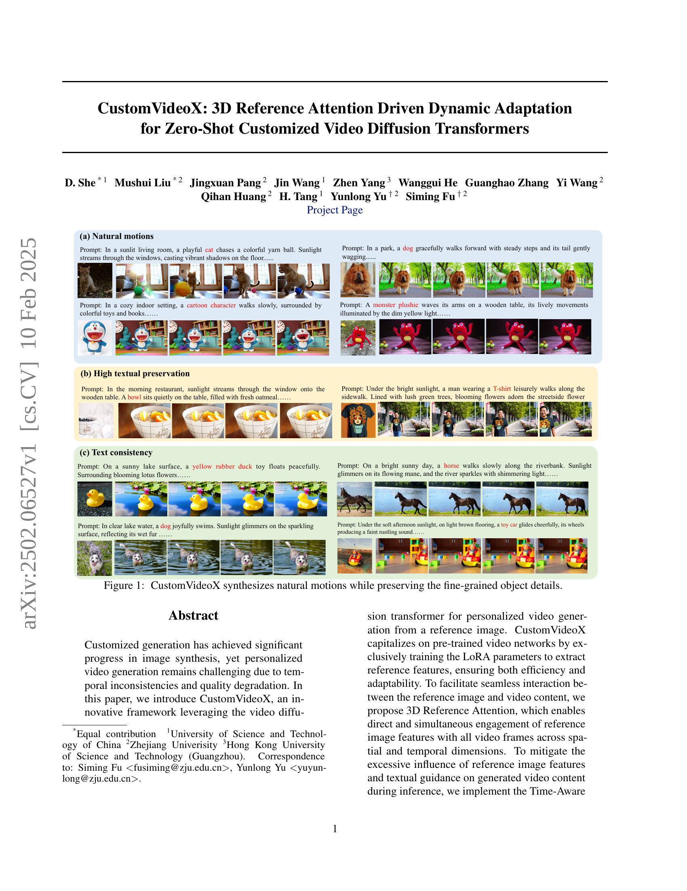
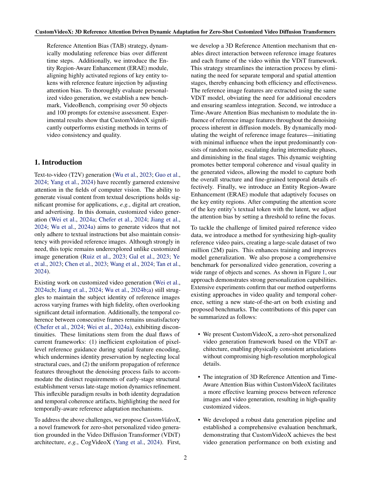
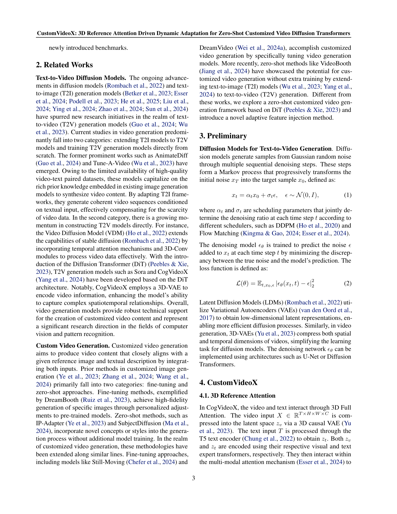
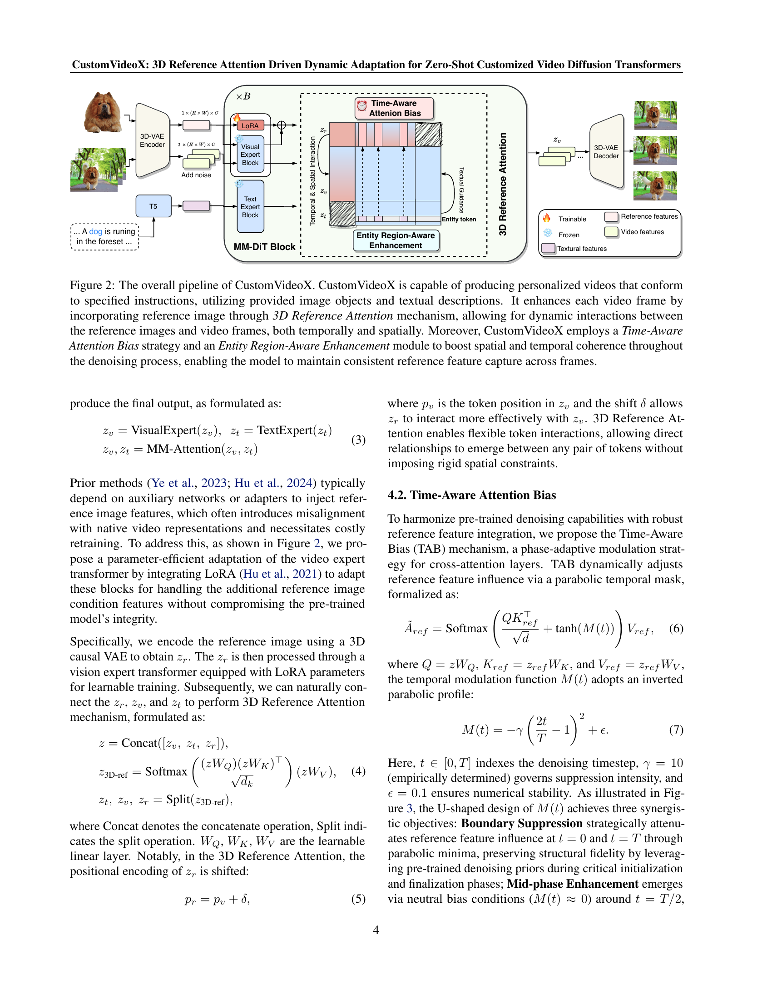
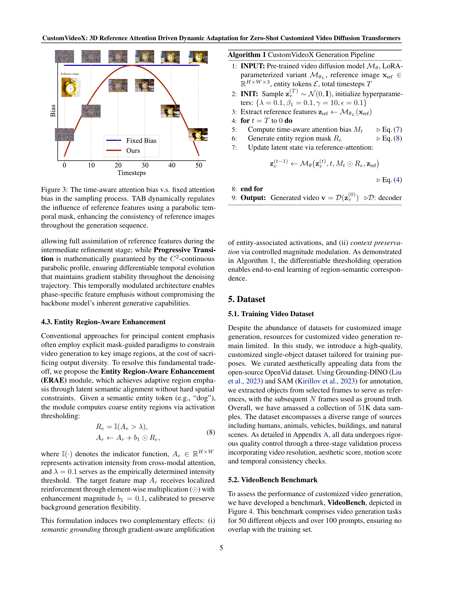
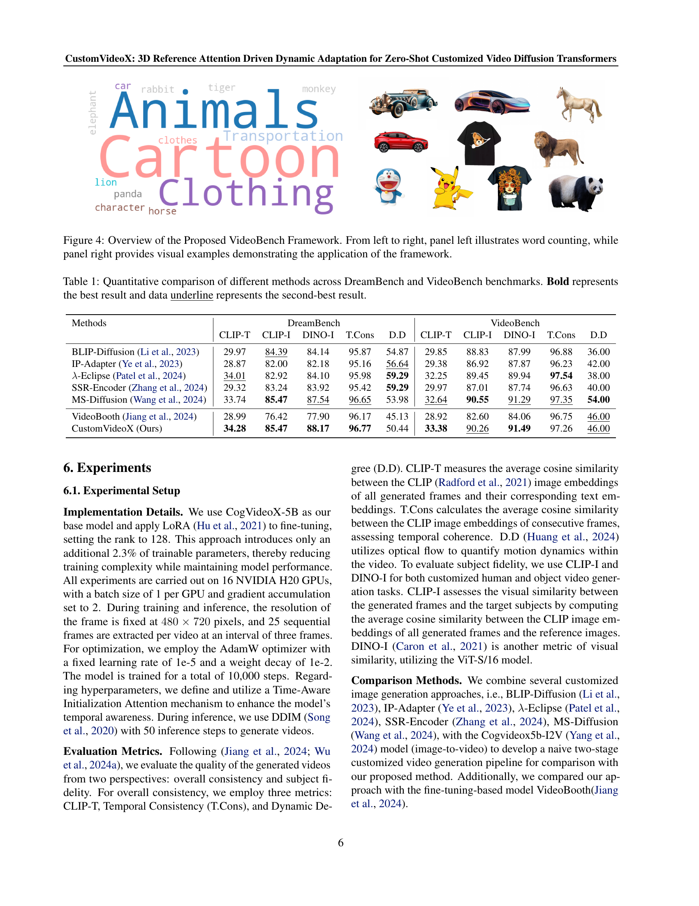
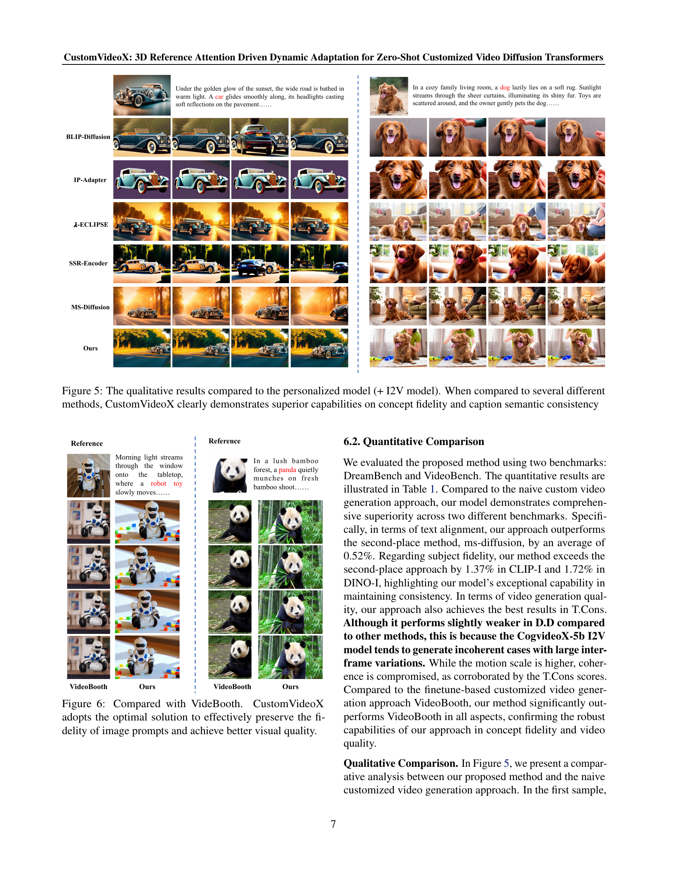
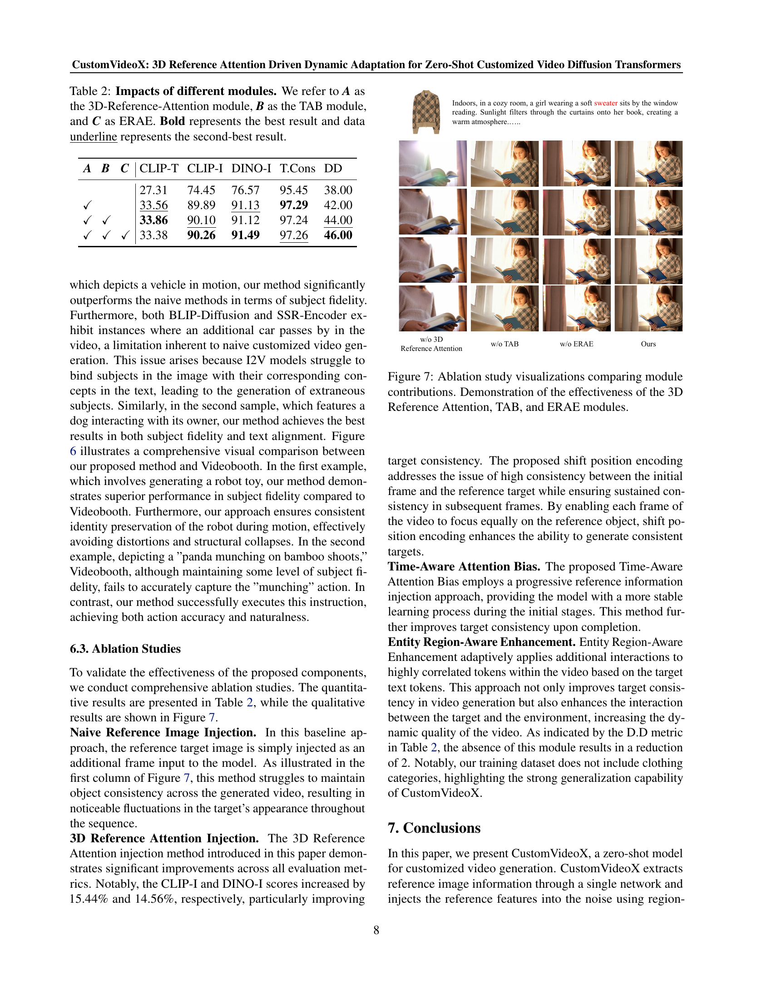
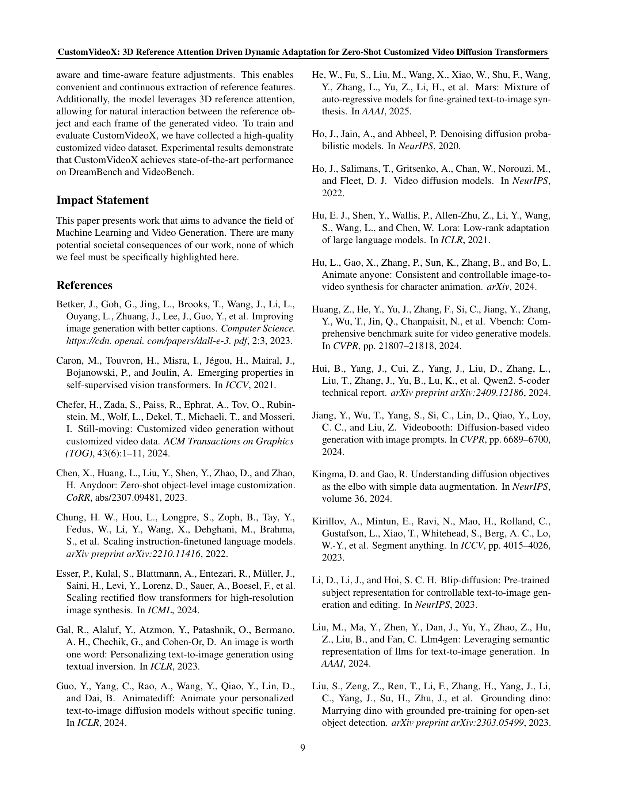
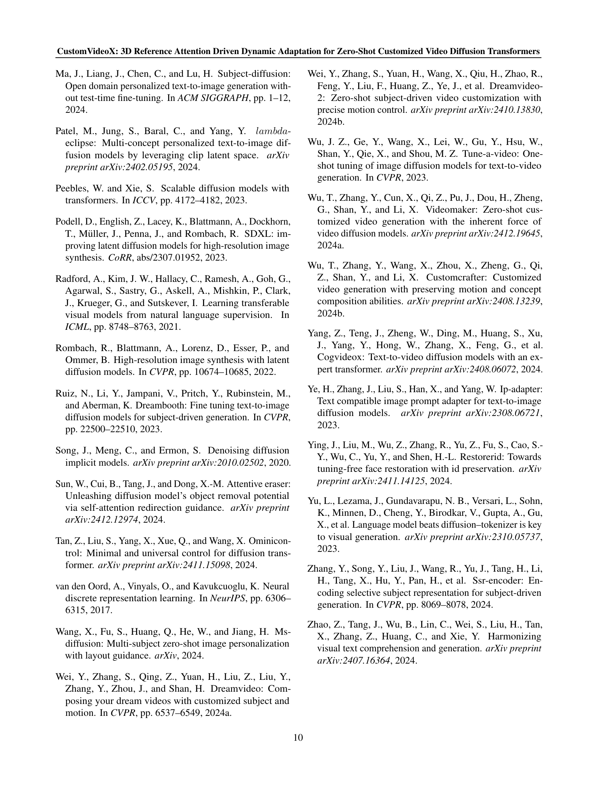
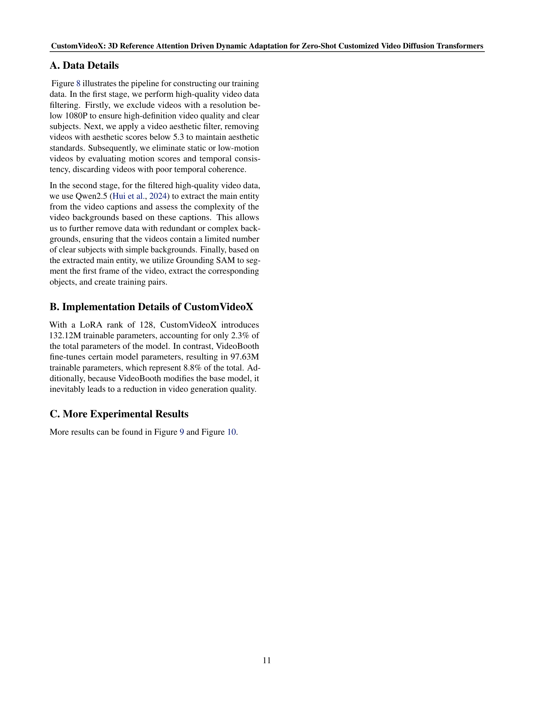
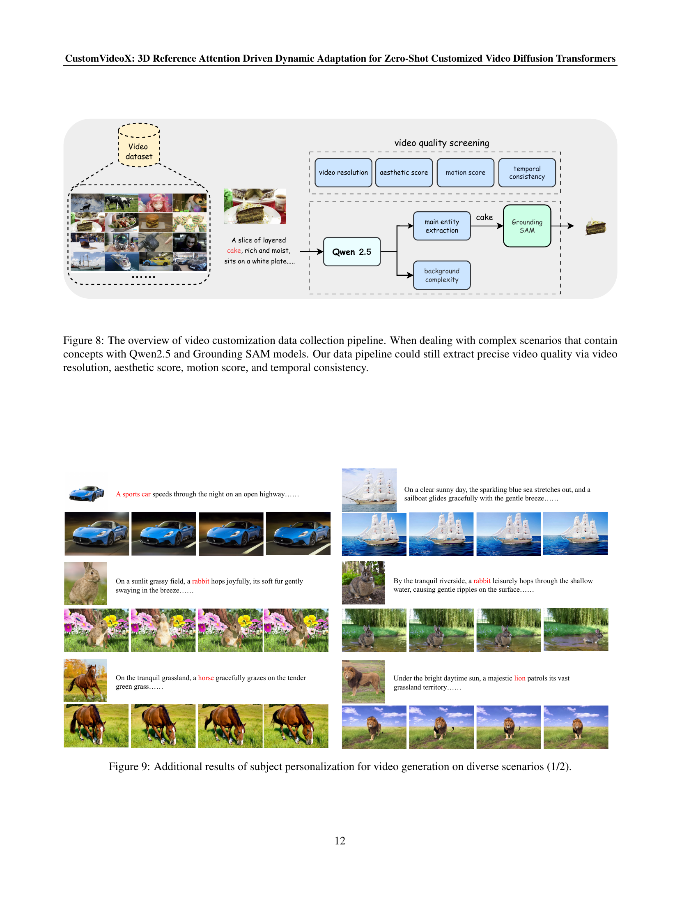
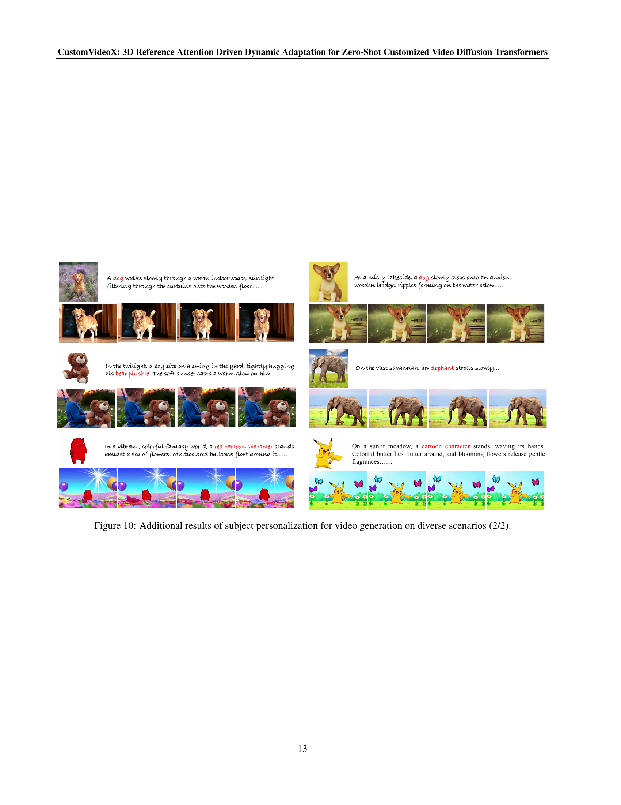
