 


 2502.06533 
 Jean Vassoyan et el. 
 
 🤗 2025-02-13 
 



↗ arXiv


↗ Hugging Face


### TL;DR



대규모 언어 모델(LLM)은 장기 목표 달성에 어려움을 겪습니다. 강화 학습(RL)을 통해 이 문제를 해결하려는 시도가 있지만, 기존의 KL 페널티는 탐색과 기존 성능 유지 간의 균형을 맞추는 데 어려움이 있습니다. 특히, **결과에 큰 영향을 미치는 '중요 토큰'에 대한 탐색이 부족**합니다. 

본 연구는 간단한 산술 문제를 사용하여 LLM의 탐색 역학을 분석하고, **전처리 과정의 영향과 중요 토큰의 역할**을 밝힙니다. 이를 바탕으로, **중요 토큰에 대한 탐색을 우선적으로 고려하는 KL 페널티 수정 방식**을 제시합니다. 실험 결과, 제안된 방법이 RL 미세 조정의 효율성을 크게 향상시키는 것을 확인했습니다. 이는 **LLM의 탐색 능력 향상**에 대한 새로운 가능성을 제시합니다.



#### Key Takeaways


 기존 KL 페널티의 한계를 극복하는 새로운 방법 제시 



 중요 토큰 식별 및 집중 탐색을 통한 효율적 RL 미세 조정 



 단순한 산술 연산에서의 성능 향상을 통한 잠재적 일반화 가능성 확인 


#### Why does it matter?
본 논문은 **강화 학습 기반의 대규모 언어 모델 미세 조정에서 탐색 전략 개선**에 대한 중요한 통찰력을 제공합니다. **기존의 KL 페널티 방식의 한계점을 지적하고, 중요 토큰에 대한 탐색을 강화하는 새로운 방법**을 제시함으로써,  향후 연구에서 **대규모 언어 모델의 장기 목표 달성 능력 향상**에 기여할 수 있습니다. 특히, **수학적 추론과 같은 복잡한 작업에서 모델의 성능 향상**에 대한 새로운 가능성을 제시하며, **다양한 분야의 연구자들에게 중요한 의미**를 지닙니다. 또한, **제한된 실험 환경**에도 불구하고, **명확한 결과와 흥미로운 연구 방향**을 제시하여, **추후 연구를 위한 발판**을 마련합니다.

------
#### Visual Insights

> 🔼 그림 1은 최대 3자리 숫자로 사전 훈련된 모델을 사용한 덧셈 작업의 예시입니다. 강조 표시된 중요 토큰은 모델이 실수하는 결정 지점으로, 주로 숫자를 실제보다 짧게 처리하려는 경향 때문입니다. 이러한 현상은 모델이 사전 훈련 단계에서 경험한 것보다 긴 숫자(예: 4자리 대신 3자리)를 처리할 때 발생합니다.  모델이 덧셈을 수행하기 위해 사용하는 스크래치패드(scratchpad)를 보여주며,  사전훈련 단계에서 학습하지 못한 긴 숫자를 만났을 때 어떻게 잘못된 연산을 하는지 보여줍니다.
> 

> 
read the caption

> Figure 1: Illustration of the addition task with scratchpad, for a model pre-trained on numbers up to 3 digits. The highlighted critical tokens are decision points where the model tends to make mistakes, mainly because it is tempted to process the number as if it were shorter. This occurs when the model is faced with a number that is longer than those encountered during the pre-training stage (here, 4 digits instead of 3).
> 


|   | critical  | non-critical (min.) | 
|---|---|---| 
| N=3 | -0.33 ± 0.01 | 0.0012 ± 0.0001 | 
| N=5 | -0.21 ± 0.18 | 0.0002 ± 0.0001 | 
| N=7 | -0.13 ± 0.04 | 0.0004 ± 0.0001 | 

> 🔼 표 1은 50번의 생성에 걸쳐 평균을 낸, 중요 토큰과 중요하지 않은 토큰에 대한 ΔJθold(s) 값을 비교한 것입니다.  ΔJθold(s)는 모델이 각 토큰에 대해 얼마나 확신하는지를 나타내는 지표입니다.  이 표는 모델이 중요 토큰에 대해 불확실성이 높다는 것을 보여줍니다. 즉, 모델이 수행한 계산에서 결과에 큰 영향을 미치는 토큰일수록 모델의 예측에 대한 확신도가 낮다는 것을 의미합니다.
> 

> 
read the caption

> Table 1: Comparison of the quantity Δ⁢J^θold⁢(s)Δsubscript^𝐽subscript𝜃old𝑠\Delta\widehat{J}_{\theta_{\text{old}}}(s)roman_Δ over^ start_ARG italic_J end_ARG start_POSTSUBSCRIPT italic_θ start_POSTSUBSCRIPT old end_POSTSUBSCRIPT end_POSTSUBSCRIPT ( italic_s ) for critical and non-critical tokens, averaged over 50 generations. This shows the model’s high level of uncertainty on critical tokens.
> 

### In-depth insights

#### RL Exploration Boost
본 논문에서 제시된 '강화학습 탐색 향상 (RL Exploration Boost)' 개념은 **기존 강화학습 기반 언어 모델 미세조정의 탐색 과정에서 발생하는 문제점을 해결하기 위한 핵심 전략**입니다.  기존 방식의 한계점인 KL 페널티의 단점을 지적하고, **중요 토큰 (critical tokens)**에 대한 집중적인 탐색을 통해 RL 미세조정 효율을 높이는 방안을 제시합니다.  **전처리 과정의 영향 분석을 통해 모델의 탐색 역량과의 관계를 규명**하고, 이를 토대로 **KL 페널티에 모델의 신뢰도를 반영하는 새로운 방식**을 제안합니다.  이를 통해 기존의 **과도한 제약으로 인한 탐색 부족** 및 **기존 정책에 대한 과도한 의존** 문제를 효과적으로 해결하여 **장기 목표 달성 능력을 향상**시킬 수 있음을 시사합니다.  **특히, 수치 연산 과제를 통해 제시된 방법의 효과를 실증적으로 검증**하였고, 이는 다양한 응용 분야로 확장 가능성을 보여줍니다.

#### KL Penalty Tweak
본 논문에서 제시된 KL 페널티 조정은 **기존의 RL 파인튜닝 과정에서 발생하는 탐색의 어려움을 해결하기 위한 중요한 시도**입니다. 기존의 KL 페널티는 사전 훈련된 모델과의 차이를 제한하여 기본 성능 저하를 방지하지만, 새로운 해결책을 발견하는 데 제약이 될 수 있습니다.  이러한 문제를 해결하고자, **핵심 토큰(critical tokens)** 이라는 개념을 도입하여, **결과에 큰 영향을 미치는 특정 토큰에 대해서는 KL 페널티를 완화**하는 전략을 제안합니다. 이는 모델이 기존 패턴에서 벗어나 탐색을 증진시키는 데 도움을 주며, **RL 파인튜닝의 효율성을 높이는 데 기여**할 수 있습니다.  **사전 훈련 정도에 따른 탐색 역학** 분석을 통해, **핵심 토큰의 중요성**을 실증적으로 보여줌으로써, 제안된 방법의 타당성을 확보하고 있습니다.  하지만,  **모델의 과신 문제**나 **베이지안 접근법** 등 고려되지 않은 요소들이 추가적인 개선을 위한 과제로 남아있습니다.  향후 연구에서는 이러한 요소들을 고려하여 더욱 강건하고 효율적인 탐색 전략을 개발하는 것이 중요할 것으로 예상됩니다.

#### Critical Token Impact
본 논문에서 제시된 '중요 토큰(Critical Token)' 개념은 **RL 미세조정 과정에서 모델의 성능에 결정적인 영향을 미치는 특정 토큰**을 의미합니다. 이러한 토큰들은 **모델의 사전 학습된 지식과 RL 미세조정 단계에서 요구되는 새로운 패턴 사이의 불일치**로 인해 발생하는 것으로 보이며, **잘못된 예측은 최종 결과에 직접적인 영향**을 줍니다. 따라서, **중요 토큰에 대한 탐색을 강화하는 것이 RL 미세조정 효율을 높이는 핵심**임을 시사합니다.  **KL 페널티 수정을 통해 중요 토큰에 대한 탐색을 우선시**함으로써 모델의 성능 개선을 이끌어낼 수 있다는 실험 결과는 이러한 주장을 뒷받침합니다. **사전 학습의 범위와 중요 토큰의 상호 작용**에 대한 추가 연구를 통해, 더욱 효율적인 RL 미세조정 전략을 개발할 수 있을 것입니다.

#### Pre-training Effects
본 논문에서 다룬 사전 학습 효과는 **모델이 숫자 연산 문제 해결에 있어서 어떤 범위의 숫자 길이를 사전 학습 받았는지에 따라 성능이 크게 달라진다**는 점을 보여줍니다.  **사전 학습 데이터의 숫자 길이 범위가 넓을수록 새로운 길이의 숫자에 대한 일반화 능력이 향상**됩니다. 하지만, **단순히 사전 학습 데이터의 양만 늘린다고 해서 성능이 무한정 향상되는 것은 아닙니다.**  오히려 과도한 사전 학습은 탐색 능력을 저해하여 새로운 문제에 대한 적응력을 떨어뜨릴 수 있다는 점이 흥미롭습니다. 이는 **사전 학습과 강화 학습 간의 균형**이 매우 중요함을 시사합니다.  **핵심 토큰**이라는 개념을 통해, 모델이 어떤 부분에서 예측에 어려움을 겪는지, 그리고 이를 개선하기 위해 어떤 전략이 필요한지를 보여주는 **실험 결과는 사전 학습의 질적 측면**을 고려해야 함을 강조합니다. 따라서 **최적의 성능을 위해서는 사전 학습 데이터의 양과 질 모두를 신중히 고려**해야 합니다.  결론적으로, 사전 학습은 모델의 성능에 결정적인 영향을 미치지만, 단순히 양적인 확장보다는 질적인 측면과 강화 학습과의 조화로운 상호작용을 고려하는 것이 중요합니다.

#### Future Work
본 논문에서 제시된 우선순위 KL 페널티 기법은 아직 초기 단계이며, **더욱 광범위한 LLM 문제 및 다양한 작업에 적용 가능성을 검증**하는 것이 중요합니다.  **다양한 크기와 구조의 LLM에 대한 실험**을 통해 일반화 성능을 평가하고, **다른 탐색 전략과의 비교**를 통해 우위를 확인할 필요가 있습니다. 또한, **임계 토큰 식별 및 우선순위 지정 방식의 개선**을 위한 연구가 필요하며, **모델의 불확실성을 더욱 정확하게 반영**하는 방법론을 모색해야 합니다. **베이지안 접근 방식을 활용**하여 모델 불확실성을 고려하는 KL 페널티를 개발하는 것도 유망한 연구 방향입니다.  마지막으로, **장기적 목표 달성에 대한 효과**를 면밀히 분석하여 실용성을 강화해야 합니다.

### More visual insights

More on figures

> 🔼 그림 2는 자릿수가 7, 9, 11, 13인 숫자들로 학습된 모델의 덧셈 작업에 대한 정확도를 보여줍니다. 가변적인 자릿수 평가에 대한 결과가 표시되어 있으며, 오차 막대는 95% 신뢰 구간을 나타냅니다. 자세한 결과는 부록 D.1에 나와 있습니다. 이 그림은 다양한 길이의 피연산자를 사용한 덧셈 작업에서 모델의 일반화 성능을 보여주는 시각적 자료입니다.
> 

> 
read the caption

> Figure 2: Model accuracy on addition tasks for models trained on numbers up to digit lengths N=7,9,11,13𝑁791113N=7,9,11,13italic_N = 7 , 9 , 11 , 13. Results are shown for varying digit evaluation. Error bars indicate 95% confidence intervals. Full detailed results are provided in Appendix D.1.
> 

> 🔼 이 그림은 서로 다른 길이의 피연산자(N)로 사전 훈련된 여러 언어 모델을 보여줍니다. 이 모델들은 강화 학습(RL)을 사용하여 N+2 길이의 피연산자에 대해 미세 조정됩니다.  그래프는 여러 모델의 학습 곡선을 보여주어, 사전 훈련된 데이터의 범위가 미세 조정 성능에 미치는 영향을 시각적으로 보여줍니다.  즉, 더 긴 피연산자로 사전 훈련된 모델이 새로운, 더 긴 피연산자에 더 잘 적응하는지 확인합니다.
> 

> 
read the caption

> Figure 3: Learning curves of multiple models pre-trained up to N𝑁Nitalic_N, fine-tuned with RL on N+2𝑁2N+2italic_N + 2.
> 

> 🔼 그림 4는 N+1=8 자릿수 덧셈 문제에 대해 강화 학습(RL)으로 미세 조정된 모델의 학습 곡선을 보여줍니다. 상단 그래프는 전체적인 성능을 나타내는 반면, 하단 그래프는 두 개의 중요한 토큰에 대해 정확한 예측을 하는 확률을 보여줍니다. 부록 D.2에는 더 많은 중요 토큰에 대한 결과가 포함되어 있습니다.  중요 토큰은 모델의 최종 결과에 상당한 영향을 미치는 토큰입니다.  이 그래프는 강화 학습 과정에서 중요 토큰에 대한 모델의 정확도가 어떻게 변화하는지, 그리고 이를 통해 모델의 전반적인 성능이 어떻게 향상되는지 보여줍니다.  특히, 우선 순위가 지정된 KL 페널티를 사용했을 때 중요 토큰에 대한 예측 정확도가 어떻게 향상되는지를 보여줍니다.
> 

> 
read the caption

> Figure 4: Top: Learning curves of a model fine-tuned with RL on N+1=8 digits. Bottom: Probability of making the right prediction on two critical tokens. Results on more critical tokens are provided in Appendix D.2.
> 

> 🔼 그림 5(a)는 N+1 자릿수 덧셈 문제에 대한 모델 출력 예시입니다.  모델은 N자릿수까지 학습되었으므로, N+1 자릿수 문제는 모델에게는 '분포 외(out-of-distribution)' 상황입니다. 그림은 모델이 N+1 자릿수 문제를 풀면서 어떻게 중간 과정을 계산하고, 각 토큰(token)의 확신도(certainty)를 어떻게 보이는지 보여줍니다. 빨간색은 확신도가 낮음을, 초록색은 확신도가 높음을 나타냅니다. 이 예시는 모델이 중요한 토큰(critical token)에서 실수하여 답을 틀리게 계산하는 경우를 보여줍니다.  특히, 모델이 자릿수를 잘못 복사하거나 처리하는 부분에서 확신도가 낮아짐을 확인할 수 있습니다.
> 

> 
read the caption

> (a)
> 

> 🔼 그림 (b)는 N+1 자릿수 덧셈 문제에 대한 모델 출력 예시입니다.  전체적으로 모델은 N자릿수까지 학습되었기 때문에, N+1 자릿수 문제를 풀 때 어려움을 겪습니다. 그림은 이러한 어려움이 주로 '중요 토큰(critical tokens)' 에서 발생함을 보여줍니다. 중요 토큰은 모델이 잘못 예측할 경우 최종 결과에 큰 영향을 미치는 토큰입니다. 그림 (b)는  846298 + 901863 의 덧셈 문제를 보여주는데, 모델이 중간 계산 과정에서 중요 토큰을 잘못 처리하여 최종 답을 잘못 구하는 것을 보여줍니다.  각 토큰의 색깔은 모델의 확신도를 나타내며, 빨간색은 확신도가 낮음을, 초록색은 확신도가 높음을 의미합니다.
> 

> 
read the caption

> (b)
> 

> 🔼 그림 (c)는 N+1 자릿수 덧셈 문제에 대한 모델 출력의 예시를 보여줍니다. 모델은 최대 N자릿수 덧셈 문제로 사전 훈련되었으며, N+1 자릿수 문제에 대한 일반화 능력을 평가합니다. 각 토큰은 모델의 확신도에 따라 색상이 표시됩니다. 녹색은 높은 확신도, 빨간색은 낮은 확신도를 나타냅니다. 이 그림은 모델이 N+1 자릿수 문제를 처리하는 과정에서 어려움을 겪는 부분, 즉 '임계 토큰'이라고 불리는 특정 토큰을 식별하는 데 도움이 됩니다. 임계 토큰은 최종 결과에 큰 영향을 미치며, 모델의 확신도가 낮은 경향이 있습니다.
> 

> 
read the caption

> (c)
> 

> 🔼 그림 5는 모델이 사전 훈련에서 접해보지 못한 자릿수보다 한 자릿수 더 긴 숫자의 덧셈 문제에 대한 출력 예시입니다. 각 생성된 토큰은 확실성에 따라 색상이 지정됩니다. 녹색은 최대 확실성, 빨간색은 최소 확실성을 나타냅니다. 그림은 모델이 N+1 자릿수 덧셈 문제를 풀 때 어떤 식으로 계산 과정을 수행하고, 특히 어떤 부분에서 실수를 하는지를 보여주는 대표적인 예시들을 보여줍니다. 예시 (a), (b), (c)는 각각 4자리, 6자리, 11자리의 숫자 덧셈 문제에 대한 출력 예시입니다.  각 예시에서, 모델은 계산 과정 중 특정 단계에서 확실성이 낮은 토큰(빨간색)을 생성하고, 이로 인해 잘못된 답을 도출할 가능성이 높음을 보여줍니다.
> 

> 
read the caption

> Figure 5: Output examples for addition tasks on N+1𝑁1N+1italic_N + 1 digit lengths (the model is faced with numbers one notch longer than those encountered in pre-training). Each generated token is colored according to its certainty. A green color is a maximal certainty, while a red color is a minimal certainty.
> 

> 🔼 그림 6은 다양한 베타(β) 값을 사용하여 RL 미세 조정을 수행했을 때의 결과를 보여줍니다.  총 9개의 랜덤 시드를 사용하여 평균을 냈습니다.  x축은 미세조정 단계(step)를 나타내고, y축은 정확도(Pass@1)를 나타냅니다.  다양한 베타 값에 따른 정확도 변화를 비교하여 최적의 베타 값을 찾는 실험 결과를 보여줍니다. 베타 값에 따라 학습 곡선의 모양이 어떻게 달라지는지 확인할 수 있습니다.  표준 KL 페널티와 비교하여 우수성을 보이는 베타 값의 범위를 파악하는 데 도움이 됩니다.
> 

> 
read the caption

> Figure 6: Fine-tuning results with various values of β𝛽\betaitalic_β (averaged over 9 random seeds)
> 

> 🔼 그림 7은 강화 학습 미세 조정 중에 여러 중요 토큰에 대한 정답 예측 확률의 변화를 보여줍니다. 여기서 모델은 N+1=8인 숫자 길이에서 훈련됩니다. 이 그래프는 강화 학습 과정에서 모델이 특정 중요 토큰(예측 결과에 큰 영향을 미치는 토큰)을 얼마나 잘 예측하는지 보여줍니다. 각 토큰에 대한 정답률이 에피소드(훈련 반복)에 따라 어떻게 변하는지 보여주며, 표준 KL 페널티와 우선순위 KL 페널티를 사용한 경우를 비교하여 우선순위 KL 페널티가 중요 토큰에 대한 예측 정확도를 개선하는 데 더 효과적임을 보여줍니다.  x축은 훈련 단계이고 y축은 정답 예측 확률입니다.
> 

> 
read the caption

> Figure 7: Evolution of the right prediction probability on multiple critical tokens, during the RL fine-tuning on number length N+1=8𝑁18N+1=8italic_N + 1 = 8.
> 

More on tables


| Hyperparameter | Value |
|---|---| 
| Learning rate | 10⁻⁶ |
| Discount factor | 1 |
| Value function coefficient | 0.1 |
| Entropy coefficient | 0.0005 |
| KL penalty coefficient | 10 |
| Repeat per collect | 1 |
| Episodes per collect | 50 |
| Episodes per test | 100 |
> 🔼 본 표는 강화 학습 실험에서 사용된 하이퍼파라미터들을 보여줍니다.  여러 수준의 사전 학습을 비교하는 실험에 사용된 학습률, 할인율, 가치 함수 계수, 엔트로피 계수, KL 페널티 계수, 반복 횟수, 에피소드 수 등의 하이퍼파라미터 값을 명시적으로 제시하여 실험 설정의 재현성을 높이고, 실험 결과 해석에 필요한 정보를 제공합니다.  각 하이퍼파라미터의 값은 실험의 특성과 목표에 따라 신중하게 선택되었음을 나타냅니다.
> 

> 
read the caption

> Table 2: Hyperparameters used in the RL experiment comparing multiple levels of pre-training
> 


| Hyperparameter | Value |
|---|---| 
| Learning rate | 10⁻⁶ |
| Discount factor | 1 |
| Value function coefficient | 0.1 |
| Entropy coefficient | 0.0005 |
| KL penalty coefficient | 5 |
| KL penalty exponent (β) | 150 |
| Repeat per collect | 1 |
| Episodes per collect | 50 |
| Episodes per test | 100 |
> 🔼 이 표는 강화 학습 실험에서 우선 순위가 지정된 KL 페널티의 영향을 평가하기 위해 사용된 하이퍼파라미터들을 보여줍니다. 학습률, 할인율, 가치 함수 계수, 엔트로피 계수, KL 페널티 계수, KL 페널티 지수(β), 수집 반복 횟수, 수집 에피소드 수, 테스트 에피소드 수 등의 하이퍼파라미터 값이 명시되어 있습니다.  이 표의 정보는 우선 순위 KL 페널티를 적용한 강화 학습 모델의 성능에 영향을 미치는 요소들을 이해하는 데 도움을 줍니다.
> 

> 
read the caption

> Table 3: Hyperparameters used in the RL experiment evaluating the impact of the prioritized KL penalty
> 


| Nb. of Digits | N Accuracy | N+1 Accuracy | N+2 Accuracy | N+3 Accuracy |
|---|---|---|---|---|
| 7 | 98.9% ± 0.7% | 48.8% ± 3.0% | 0.0% ± 0.0% | 0.0% ± 0.0% |
| 9 | 96.4% ± 0.6% | 78.9% ± 2.4% | 0.5% ± 0.5% | 0.0% ± 0.0% |
| 11 | 91.2% ± 1.3% | 75.1% ± 2.7% | 30.7% ± 2.4% | 0.2% ± 0.3% |
| 13 | 93.0% ± 1.6% | 88.9% ± 2.1% | 67.7% ± 3.1% | 20.4% ± 2.4% |
> 🔼 표 4는 다양한 자릿수(7, 9, 11, 13)의 숫자를 더하는 덧셈 문제에 대해, 각 자릿수에 대해 학습된 모델의 정확도를 보여줍니다.  'Identical Digit Addition'이라고 불리는 시나리오에서, 두 피연산자 모두 같은 자릿수를 가집니다. 예를 들어, 7자릿수 숫자와 다른 7자릿수 숫자를 더하는 문제입니다. 표는 모델이 N자릿수 덧셈에 대해 얼마나 잘 학습되었는지, 그리고 N+1, N+2, N+3 자릿수 덧셈 문제에 대해 얼마나 잘 일반화하는지를 보여줍니다.  정확도는 백분율로 표시되며, 신뢰구간이 함께 표시되어 있습니다.
> 

> 
read the caption

> Table 4: Model accuracy on addition tasks with identical digit lengths.
> 


| Nb. of Digits | N Accuracy | N+1 Accuracy | N+2 Accuracy | N+3 Accuracy |
|---|---|---|---|---|
| 7 | 100.0% ± 0.0% | 69.0% ± 2.4% | 0.0% ± 0.0% | 0.0% ± 0.0% |
| 9 | 97.0% ± 0.6% | 89.4% ± 1.8% | 6.9% ± 1.3% | 0.0% ± 0.0% |
| 11 | 94.4% ± 1.4% | 87.0% ± 2.1% | 53.7% ± 3.2% | 7.3% ± 1.6% |
| 13 | 95.6% ± 1.4% | 92.5% ± 1.9% | 84.7% ± 2.4% | 51.8% ± 3.2% |
> 🔼 표 5는 다양한 자릿수의 덧셈 문제에 대한 모델의 정확도를 보여줍니다.  모델은 덧셈 문제의 각 항에 있는 자릿수가 다를 때(예: N + M 자릿수 덧셈, 여기서 M < N) 성능을 평가하기 위해 서로 다른 자릿수의 덧셈 문제들(동일한 자릿수 덧셈과 가변 자릿수 덧셈)에 대해 테스트됩니다.  표는 각 시나리오에 대한 정확도와 함께 자릿수의 개수 (N)에 따른 모델의 정확도를 보여줍니다.  이를 통해 다양한 자릿수의 덧셈 문제에 대한 모델의 일반화 능력을 평가할 수 있습니다.
> 

> 
read the caption

> Table 5: Model accuracy on addition tasks with varying digit lengths.
> 

### Full paper


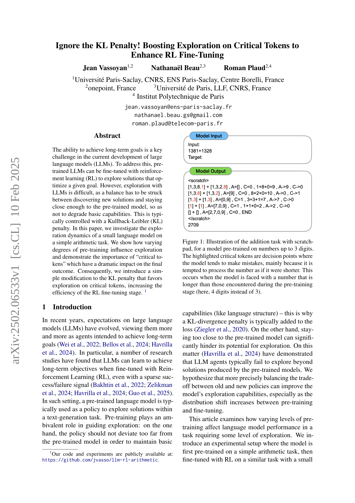
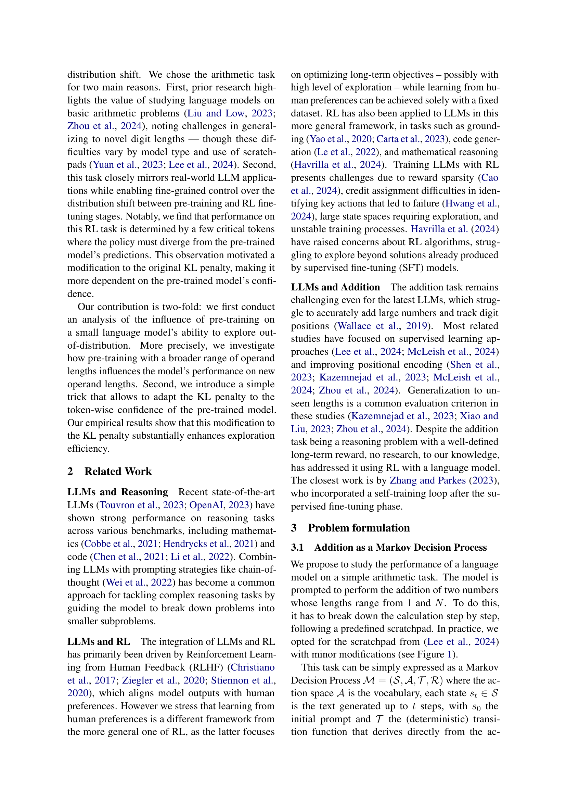
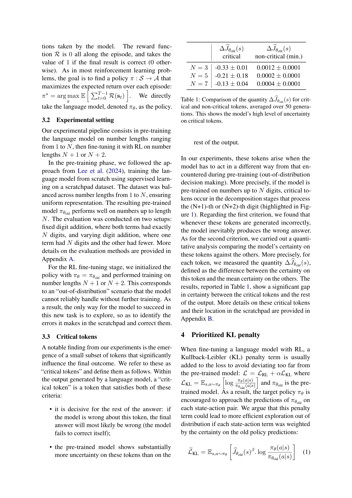
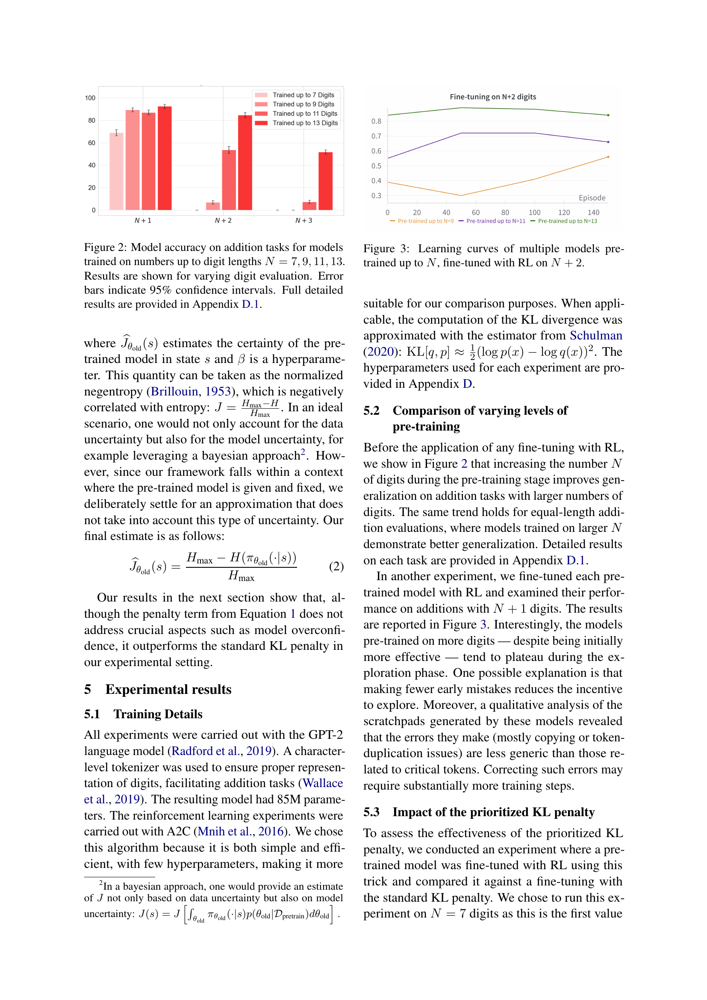
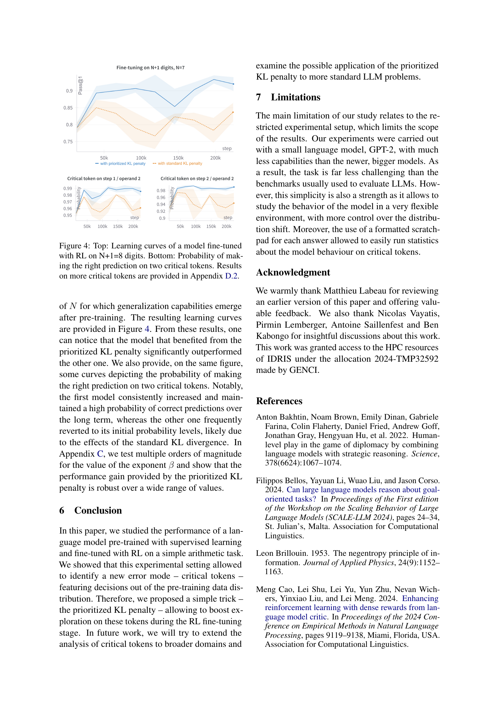
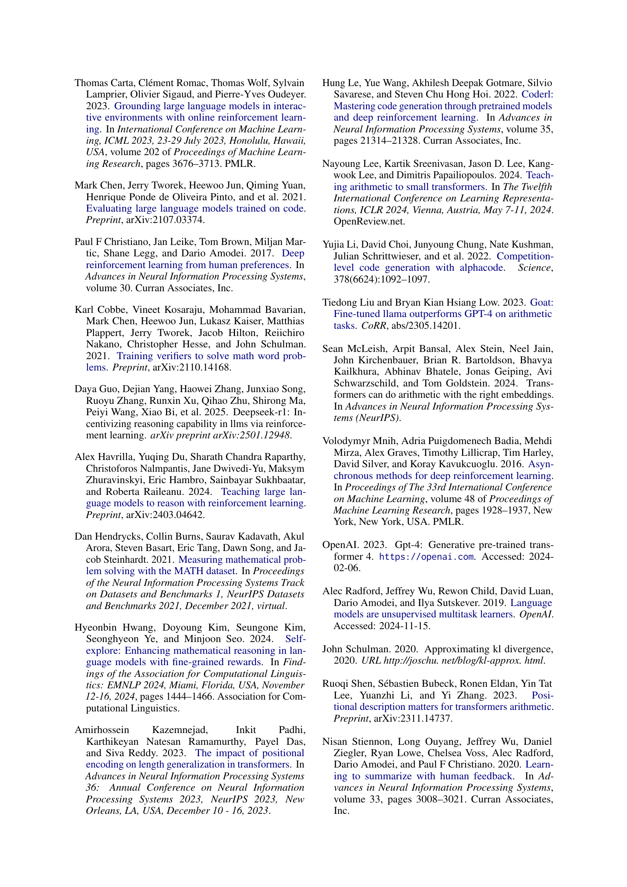
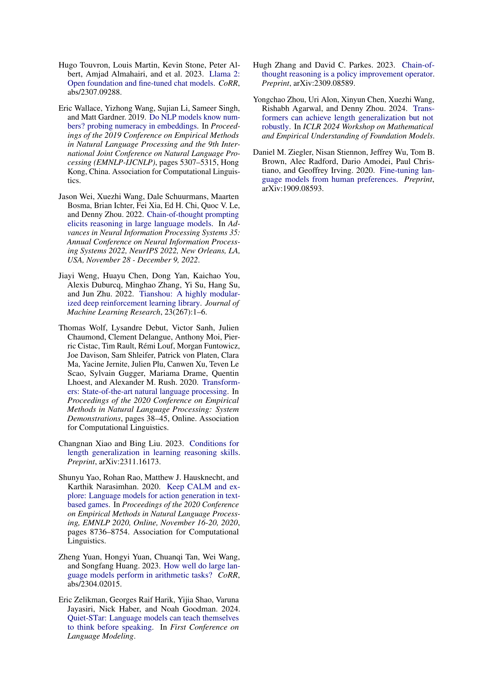
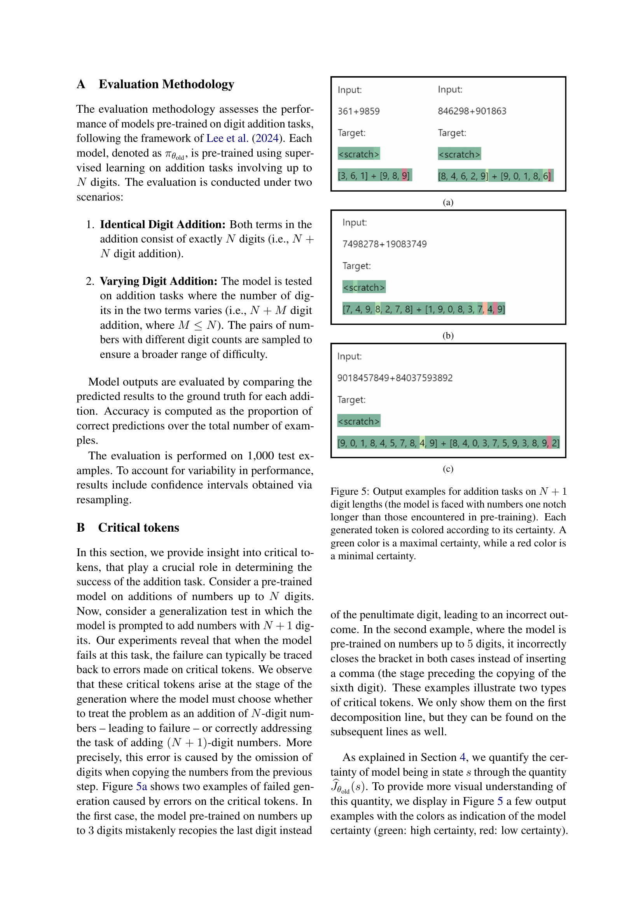
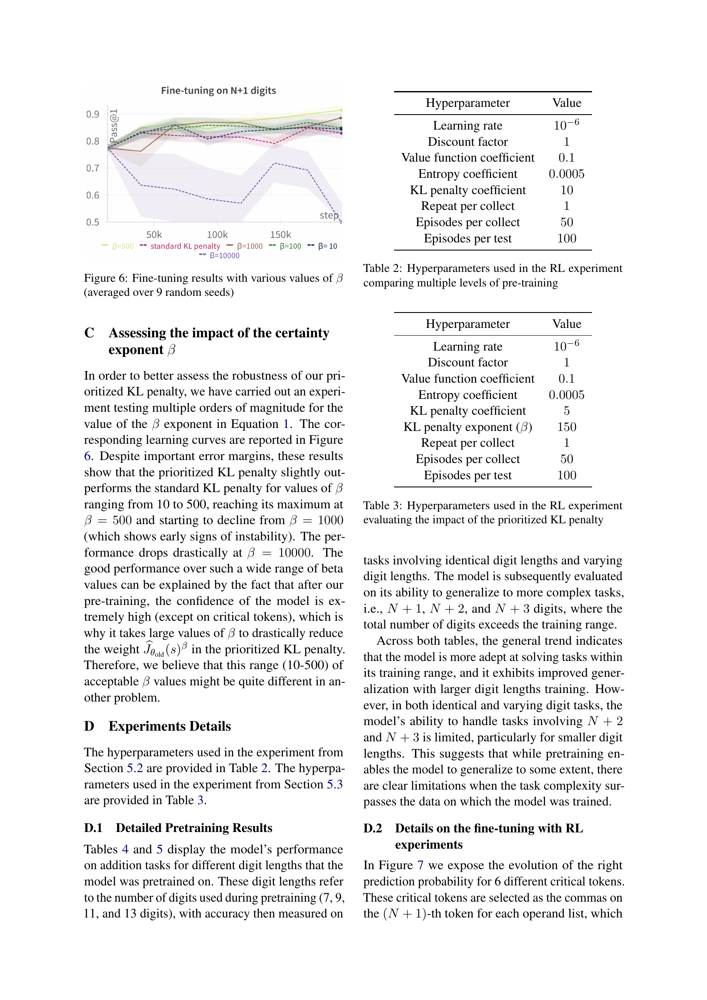
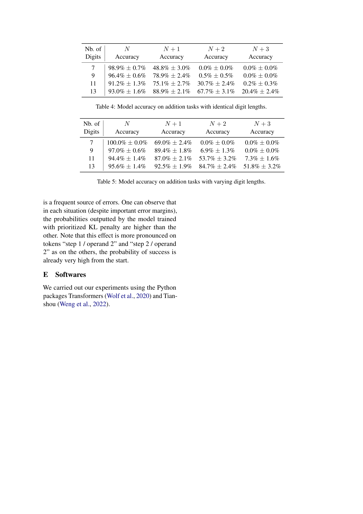
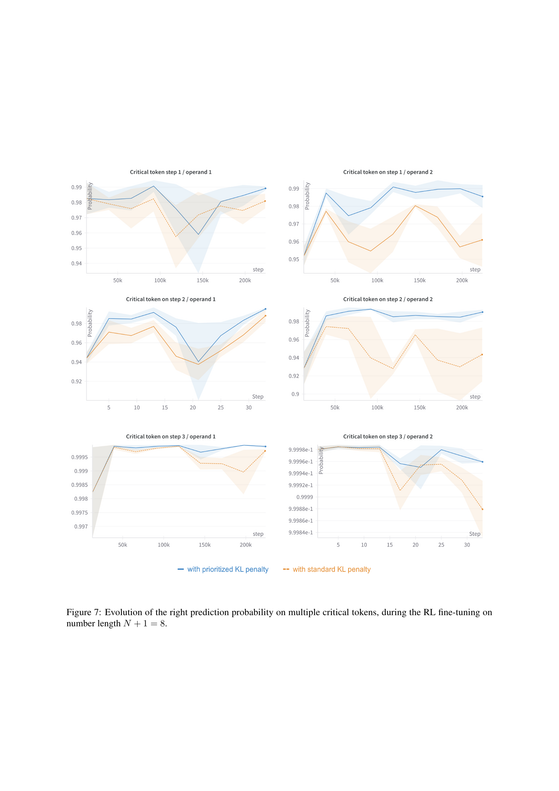
