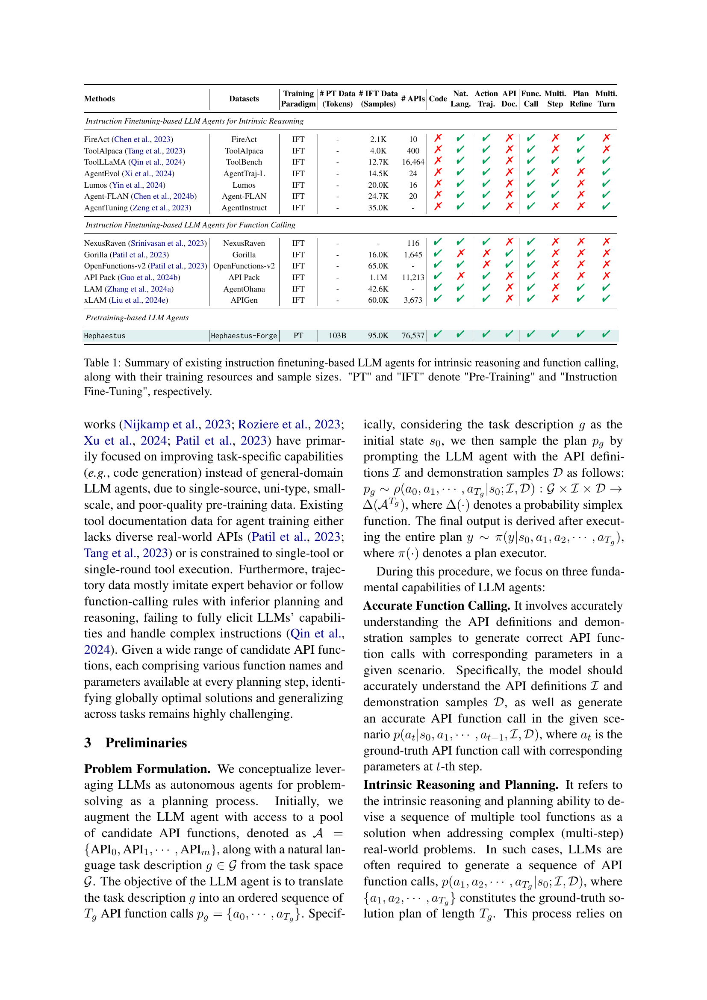
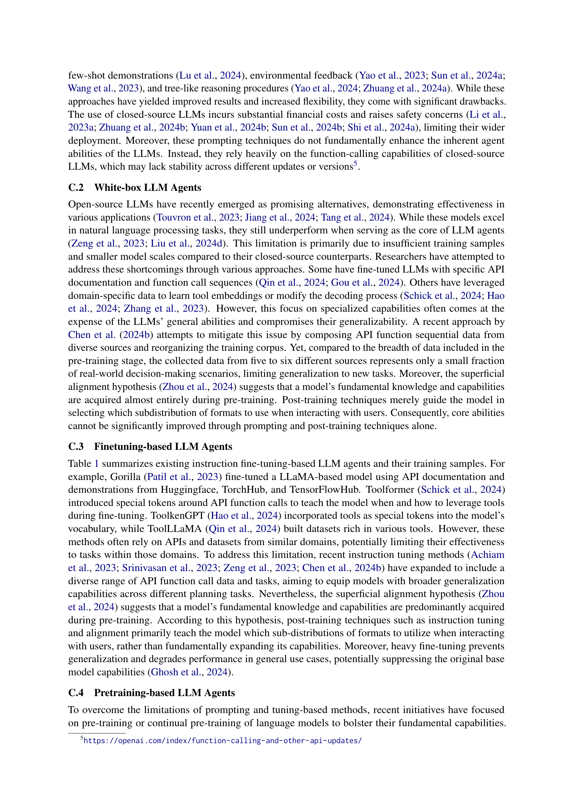

 


 2502.06589 
 Yuchen Zhuang et el. 
 
 🤗 2025-02-12 
 



↗ arXiv


↗ Hugging Face


### TL;DR



LLM 기반 에이전트는 **제한적인 사전 훈련 데이터**로 인해 복잡한 프롬프팅이나 과도한 미세 조정에 의존하는 한계를 지니고 있습니다. 이는 새로운 기능을 추가하면서 일반화 성능을 유지하는 데 어려움을 야기합니다.  기존 연구는 주로 미세 조정에 집중하여 일반화 성능이 저하되는 문제점을 보였습니다.

본 논문에서는 이러한 문제를 해결하기 위해 **Hephaestus-Forge**라는 새로운 대규모 사전 훈련 데이터셋을 제시합니다.  Hephaestus-Forge는 API 함수 호출, 추론 및 계획, 환경 피드백 적응에 중점을 두고 설계되었으며, **최적의 데이터 혼합 비율**을 찾기 위한 확장 법칙을 연구했습니다.  지속적인 사전 훈련 결과, Hephaestus는 오픈소스 LLM과 상용 LLM을 능가하는 성능을 보였으며, 새로운 사전 훈련 방법의 효과를 입증했습니다.



#### Key Takeaways


 Hephaestus-Forge라는 대규모 사전 훈련 데이터셋을 통해 LLM 에이전트의 기본 능력 향상 



 지속적 사전 훈련을 통해 API 함수 호출, 내재적 추론 및 계획, 환경 적응 능력 향상 



 오픈소스 LLM의 성능을 상용 LLM 수준으로 향상시켜 실용적인 파급 효과 창출 


#### Why does it matter?
본 논문은 **대규모 언어 모델(LLM)** 기반 에이전트의 기본 능력을 향상시키는 데 중요한 의미를 지닙니다.  **지속적인 사전 훈련**을 통해 에이전트의 API 함수 호출, 내재적 추론 및 계획, 환경 피드백 적응 능력을 향상시키는 새로운 방법을 제시하며, 이는 현재 연구 동향에 큰 영향을 미칠 뿐만 아니라 **향후 연구**에 새로운 방향을 제시합니다.  특히, 오픈소스 LLM의 성능을 상용 LLM 수준으로 향상시키는 데 기여하여 **실용적인 측면에서의 파급 효과**가 클 것으로 예상됩니다.

------
#### Visual Insights

> 🔼 본 그림은 LLM 기반 에이전트의 훈련 패러다임 네 가지(프롬프팅, 파인튜닝, 지시 파인튜닝, 프리트레이닝)를 보여줍니다.  프롬프팅만으로는 새로운 지식이나 기능을 도입할 수 없고, 과도한 파인튜닝은 일반화를 저해하고 비에이전트 사용 사례에서 성능 저하를 초래하며, 기본 모델의 기능을 억압할 수도 있습니다.  이 그림은 본 논문에서 제시하는 방법이 기존의 단순 프롬프팅이나 파인튜닝 방식보다 우수함을 시각적으로 보여줍니다.
> 

> 
read the caption

> Figure 1: Training paradigms of LLM agents. Prompting alone fails to introduce new knowledge and capabilities, while heavy fine-tuning can hinder generalization and degrade performance in non-agent use cases, potentially suppressing the original base model capabilities.
> 


| Methods | Datasets | Training Paradigm | # PT Data (Tokens) | # IFT Data (Samples) | # APIs | Code | Nat. Lang. | Action Traj. | API Doc. | Func. Call | Multi. Step | Plan Refine | Multi. Turn |
|---|---|---|---|---|---|---|---|---|---|---|---|---|---| 
| *Instruction Finetuning-based LLM Agents for Intrinsic Reasoning* |  |  |  |  |  |  |  |  |  |  |  |  |  |
| FireAct [Chen et al. (2023)] | FireAct | IFT | - | 2.1K | 10 | ✗ | ✔ | ✔ | ✗ | ✔ | ✗ | ✔ | ✗ |
| ToolAlpaca [Tang et al. (2023)] | ToolAlpaca | IFT | - | 4.0K | 400 | ✗ | ✔ | ✔ | ✗ | ✔ | ✗ | ✔ | ✗ |
| ToolLLaMA [Qin et al. (2024)] | ToolBench | IFT | - | 12.7K | 16,464 | ✗ | ✔ | ✔ | ✗ | ✔ | ✔ | ✔ | ✔ |
| AgentEvol [Xi et al. (2024)] | AgentTraj-L | IFT | - | 14.5K | 24 | ✗ | ✔ | ✔ | ✗ | ✔ | ✗ | ✗ | ✔ |
| Lumos [Yin et al. (2024)] | Lumos | IFT | - | 20.0K | 16 | ✗ | ✔ | ✔ | ✗ | ✔ | ✔ | ✗ | ✔ |
| Agent-FLAN [Chen et al. (2024b)] | Agent-FLAN | IFT | - | 24.7K | 20 | ✗ | ✔ | ✔ | ✗ | ✔ | ✔ | ✗ | ✔ |
| AgentTuning [Zeng et al. (2023)] | AgentInstruct | IFT | - | 35.0K | - | ✗ | ✔ | ✔ | ✗ | ✔ | ✗ | ✗ | ✔ |
| *Instruction Finetuning-based LLM Agents for Function Calling* |  |  |  |  |  |  |  |  |  |  |  |  |  |
| NexusRaven [Srinivasan et al. (2023)] | NexusRaven | IFT | - | - | 116 | ✔ | ✔ | ✔ | ✗ | ✔ | ✗ | ✗ | ✗ |
| Gorilla [Patil et al. (2023)] | Gorilla | IFT | - | 16.0K | 1,645 | ✔ | ✗ | ✗ | ✔ | ✔ | ✗ | ✗ | ✗ |
| OpenFunctions-v2 [Patil et al. (2023)] | OpenFunctions-v2 | IFT | - | 65.0K | - | ✔ | ✔ | ✗ | ✔ | ✔ | ✗ | ✗ | ✗ |
| API Pack [Guo et al. (2024b)] | API Pack | IFT | - | 1.1M | 11,213 | ✔ | ✗ | ✔ | ✗ | ✔ | ✗ | ✗ | ✗ |
| LAM [Zhang et al. (2024a)] | AgentOhana | IFT | - | 42.6K | - | ✔ | ✔ | ✔ | ✗ | ✔ | ✗ | ✔ | ✔ |
| xLAM [Liu et al. (2024e)] | APIGen | IFT | - | 60.0K | 3,673 | ✔ | ✔ | ✔ | ✗ | ✔ | ✗ | ✔ | ✔ |
| *Pretraining-based LLM Agents* |  |  |  |  |  |  |  |  |  |  |  |  |  |
| Hephaestus | Hephaestus-Forge | PT | 103B | 95.0K | 76,537 | ✔ | ✔ | ✔ | ✔ | ✔ | ✔ | ✔ | ✔ |

> 🔼 표 1은 기존의 내재적 추론 및 함수 호출을 위한 지시사항 미세 조정 기반 LLM 에이전트를 요약한 표이며, 해당 에이전트의 학습 리소스와 샘플 크기를 함께 제시하고 있습니다.  'PT'는 사전 학습을, 'IFT'는 지시사항 미세 조정을 의미합니다. 표에는 각 에이전트의 사용 데이터셋, 사전 학습 데이터 크기, 지시사항 미세 조정 데이터 크기, API 개수, 코드 유무, 자연어 궤적 유무, API 문서 유무, 다중 단계 참조 유무, 다중 단계 정제 유무, 다중 턴 유무 등의 정보가 포함되어 있습니다. 이를 통해 각 에이전트의 개발에 사용된 데이터의 종류와 양을 비교하고,  추론 및 함수 호출 능력에 대한 차이를 파악할 수 있습니다.
> 

> 
read the caption

> Table 1: Summary of existing instruction finetuning-based LLM agents for intrinsic reasoning and function calling, along with their training resources and sample sizes. 'PT' and 'IFT' denote 'Pre-Training' and 'Instruction Fine-Tuning', respectively.
> 

### In-depth insights

#### Agent-LLM Pre-training
에이전트-LLM 사전 훈련은 **대규모 언어 모델(LLM) 기반 에이전트의 기본 능력을 향상시키기 위한 새로운 패러다임**입니다.  기존의 프롬프트 엔지니어링이나 미세 조정 방식과 달리, 에이전트-LLM 사전 훈련은 API 함수 호출, 내재적 추론 및 계획, 환경 피드백 적응 등의 핵심 기능을 향상시키는 데 중점을 둡니다.  **에이전트 중심의 데이터 부족 문제를 해결하기 위해** 대규모 사전 훈련 데이터셋을 구축하고, API 함수 설명과 호출 경로를 포함하여 LLM 에이전트의 지식을 강화합니다.  **데이터 혼합 비율에 대한 최적의 레시피**를 찾기 위한 확장 법칙 연구를 통해 효과적인 훈련 프로토콜을 탐구합니다.  이를 통해 새로운 작업이나 환경에 대한 LLM 에이전트의 일반화 능력과 기본 에이전트 기능을 향상시킬 수 있습니다.  결국, 에이전트-LLM 사전 훈련은 **LLM 기반 에이전트의 성능과 일반화 능력을 크게 개선**하는 잠재력을 가지고 있습니다.

#### Hephaestus-Forge Corpus
본 논문에서 제시된 Hephaestus-Forge Corpus는 **대규모의 에이전트 중심 사전 훈련 데이터셋**으로,  LLM 기반 에이전트의 API 함수 호출, 고유 추론 및 계획, 환경 피드백 적응 능력 향상에 중점을 두고 있습니다.  **API 함수 설명서와 함수 호출 경로 데이터를 포함**하여 LLM 에이전트의 기본 기능 향상에 기여합니다.  **데이터 균형**을 위해 다양한 출처(웹 크롤링, 공개 API, 코드 등)의 데이터를 혼합하여 구성되었으며, 최적의 데이터 혼합 비율을 찾기 위한 **스케일링 법칙 연구**도 진행되었습니다. 이를 통해 Hephaestus-Forge Corpus는 LLM 에이전트의 **범용성과 일반화 능력 향상**에 기여할 뿐 아니라,  **오픈소스 LLM의 성능 향상**에도 크게 기여할 것으로 기대됩니다.  **데이터 품질 관리**를 위한 정교한 필터링 과정도 거쳤다는 점 또한 주목할 만합니다.

#### Continual Pre-training
본 논문에서 제시된 "지속적 사전 훈련(Continual Pre-training)"은 기존의 대규모 언어 모델(LLM) 기반 에이전트의 한계를 극복하기 위한 핵심 전략입니다.  기존의 단순한 프롬프트 엔지니어링이나 과도한 미세 조정 방식과 달리, **에이전트 지향적 사전 훈련 데이터의 부족 문제를 해결**하기 위해,  API 함수 호출, 내적 추론 및 계획, 환경 피드백 적응 능력 향상에 중점을 둡니다.  **대규모 사전 훈련 데이터셋(Hephaestus-Forge)을 구축**하여 LLM 에이전트의 기본 능력을 향상시키고, 다양한 작업에 대한 일반화 능력을 강화하는 데 주력합니다.  이를 통해,  **소규모 오픈소스 LLM의 성능을 뛰어넘고, 상용 LLM과 경쟁하는 수준의 에이전트 성능**을 달성할 수 있음을 보여줍니다.  **지속적인 사전 훈련 과정을 통해 모델의 안정성을 확보**하고, 새로운 작업이나 환경에 대한 적응력을 높이는 것이 핵심입니다.  결론적으로,  본 논문의 지속적 사전 훈련 방식은 LLM 기반 에이전트의 근본적인 능력 향상에 효과적인 접근법임을 제시합니다.

#### Scaling Laws Analysis
본 논문의 스케일링 법칙 분석 부분은 **모델의 성능과 학습 데이터 크기 및 구성 간의 관계**를 규명하는 데 중점을 둘 것입니다.  이는 단순히 데이터의 양적 증가뿐 아니라, **다양한 유형의 데이터 (예: 에이전트 특화 데이터, 일반 텍스트 데이터, 코드 데이터)의 혼합 비율**이 모델 성능에 미치는 영향을 정량적으로 분석하는 것을 포함합니다.  **최적의 데이터 혼합 비율**을 찾는 과정은 실험적 접근 방식을 통해 이루어지며, 이를 통해 에이전트 기능 향상에 가장 효과적인 데이터 구성을 도출할 수 있습니다.  **스케일링 법칙을 통해 얻은 통찰력**은 대규모 모델 학습에 필요한 자원을 효율적으로 배분하는 데 유용한 지침을 제공하고, 향후 에이전트 모델 개발에 중요한 기준을 제시할 수 있을 것입니다.  **실험 결과는 다양한 벤치마크에서의 성능 변화**를 보여주고, 데이터 구성 최적화의 실효성을 입증할 것으로 예상됩니다.  **데이터 크기와 모델 성능 간의 관계를 정량적으로 분석**하여 모델의 확장성과 일반화 능력을 이해하고, 제한된 자원 내에서 효율적인 모델 개발을 위한 전략을 제시하는 데 기여할 것으로 예상됩니다.

#### Future Research
미래 연구 방향으로는 **대규모 언어 모델(LLM) 에이전트의 기본 능력 향상을 위한 새로운 사전 훈련 기법** 개발에 집중해야 합니다. 특히, **다양한 API 함수 호출 시나리오와 복잡한 멀티턴 작업을 포함한 광범위한 데이터셋** 구축이 중요합니다.  또한, **LLM 에이전트의 일반화 성능 향상을 위한 훈련 프로토콜과 최적의 데이터 혼합 비율**에 대한 연구도 필요합니다.  **환경 피드백에 대한 적응력 강화**를 위한 연구도 중요한데, 이를 위해 다양한 환경에서의 에이전트 성능 평가 및 환경 피드백 기반의 강화 학습 기법 개발이 필요합니다.  나아가, **에이전트의 윤리적 문제와 안전성 확보**에 대한 연구도 병행되어야 합니다.  **에이전트의 설명 가능성을 높이는 기법** 개발을 통해 신뢰도를 높이고,  **다양한 도메인과 작업에 대한 에이전트의 일반화 능력 향상**을 위한 연구가 진행되어야 할 것입니다.  마지막으로, **개방형 소스 모델의 성능을 상용 모델 수준으로 끌어올리기 위한 연구**가 지속되어야 합니다. 이러한 노력을 통해 LLM 기반 에이전트 기술의 발전을 가속화하고, 다양한 분야에서의 실용적인 활용 가능성을 높일 수 있을 것입니다.

### More visual insights

More on figures

> 🔼 그림 2(a)는 본 논문에서 제시하는 Hephaestus-Forge의 데이터 구성을 보여줍니다.  Hephaestus-Forge는 LLM 에이전트의 기본 기능을 향상시키기 위해 설계된 대규모 사전 훈련 말뭉치입니다.  여기에는 API 함수 호출, 내적 추론 및 계획, 환경 피드백 적응에 중점을 둡니다. 그림은 다양한 데이터 소스(API 문서, 함수 호출 경로, 코드, 텍스트 데이터 등)를 보여주고, 이들이 어떻게 결합되어 Hephaestus-Forge를 구성하는지 시각적으로 표현합니다. 이러한 다양한 데이터 소스의 통합은 LLM 에이전트의 범용성과 강건성을 향상시키는 데 중요한 역할을 합니다.
> 

> 
read the caption

> (a) Hephaestus-Forge
> 

> 🔼 그림 (b)는 논문의 4.1절 'Seed Data Collection'에서 설명하는 대로, Hephaestus-Forge의 초기 데이터 구성 요소 중 하나인 도구 데이터를 보여줍니다.  도구 데이터는 다양한 출처(예: 공개 API, 공개 저장소, 코드-텍스트 합성, 시뮬레이션된 에이전트 데이터)에서 수집된 API 문서와 함수 호출 경로를 포함하고 있습니다. 이러한 데이터는 LLM 에이전트의 API 함수 이해 및 효과적인 함수 호출 시퀀스 계획 능력을 향상시키는 데 중점을 두고 있습니다. 그림은 도구 데이터의 구성 요소를 시각적으로 보여주는 다양한 데이터 소스의 구성과 균형을 보여줍니다.
> 

> 
read the caption

> (b) Tool Data
> 

> 🔼 그림 (c)는 본 논문에서 소개하는 Hephaestus-Forge의 데이터 구성 요소 중 하나인 '수집된 데이터'를 보여줍니다.  웹 크롤링을 통해 수집한 데이터로,  API 문서 및 에이전트 동작 경로와 관련된 콘텐츠에 중점을 둡니다.  이 데이터는 시드 데이터를 확장하여 에이전트 기능을 향상시키는 데 사용됩니다. 그림에서는 시드 데이터와 일반 텍스트와 비교하여 수집된 데이터가 시드 데이터와 의미적으로 가까운 위치에 있음을 보여주는 t-SNE 시각화를 포함합니다.  이는 수집된 데이터의 품질과 관련성이 높음을 시사합니다.
> 

> 
read the caption

> (c) Retrieved Data
> 

> 🔼 그림 (d)는 t-SNE 기법을 사용하여, 웹에서 검색한 데이터(검은색 점)가 시드 데이터(각 색상은 데이터 소스를 나타냄)와 일반 텍스트(회색)의 의미 공간에서 어떻게 분포하는지 시각적으로 보여줍니다. 시각화 결과를 통해, 검색된 데이터는 일반 텍스트보다 시드 데이터와 의미적으로 더 가까운 위치에 있음을 확인할 수 있습니다. 이는 검색된 데이터가 시드 데이터의 의미를 잘 반영하고 있음을 의미합니다.
> 

> 
read the caption

> (d) t-SNE: Retrieved Data
> 

> 🔼 그림 2는 Hephaestus-Forge 데이터셋의 구성을 보여줍니다. (a)는 전체 Hephaestus-Forge 데이터셋을, (b)는 4.1절에서 설명하는 시드 데이터 수집 과정을, (c)는 4.2절에서 설명하는 웹에서 수집한 에이전트 데이터를 나타냅니다. (d)는 t-SNE 시각화를 통해 시드 데이터(각 색상은 다른 데이터 소스를 나타냄), 검색된 데이터(검정색), 일반 텍스트(회색)를 의미 공간 상에서 표현합니다. 검색된 데이터는 일반 텍스트보다 선택된 시드 데이터와 더 가깝게 위치합니다. 자세한 데이터 소스는 A.1절에 설명되어 있습니다.
> 

> 
read the caption

> Figure 2: Data composition of (a) the entire Hephaestus-Forge, (b) seed data collection (§ 4.1), and (c) retrieved agent data from the open web (§ 4.2). A t-SNE visualization (d) depicts seed data (colorful points, with each color representing different data sources), retrieved data (black), and general text (gray) within the semantic space, where retrieved data is closer to the selected seed data than to the general text. Detailed data sources are in § A.1.
> 

> 🔼 그림 3은 에이전트 데이터 혼합 비율과 벤치마크 손실 간의 관계를 보여주는 확장 법칙을 나타냅니다.  에이전트 데이터 비율이 증가함에 따라 벤치마크 손실이 감소하는 경향을 보이며, 최적의 에이전트 데이터 혼합 비율을 시각적으로 보여줍니다.  이 그래프는 에이전트 데이터, 텍스트 데이터 및 코드 데이터의 다양한 비율을 사용하여 모델을 사전 훈련한 결과를 보여줍니다.
> 

> 
read the caption

> Figure 3: Scaling law of the relationship between agent data mixing ratio (%percent\%%) and benchmark loss.
> 

> 🔼 그림 4는 Hephaestus의 사전 훈련(단계 I 및 II) 및 지시 미세 조정(III) 프레임워크를 개괄적으로 보여줍니다.  단계 I에서는 일반적인 에이전트 지식을 주입하기 위해 Hephaestus-Forge의 전체 코퍼스를 사용하여 사전 훈련합니다. 이 단계는 일반적인 상식 지식, 코드 스니펫 및 에이전트 관련 웹 데이터를 포함합니다. 단계 II에서는 특정 에이전트 기능을 향상시키기 위해 Hephaestus-Forge의 고품질 시드 세트를 사용하여 지속적인 사전 훈련을 수행합니다. 이 단계는 사용자 상호 작용, 함수 호출, 계획, 계획 개선 및 코딩 기능을 향상시키는 데 중점을 둡니다.  마지막으로 단계 III에서는 강력한 지시 따르기 기능을 위해 다양한 고품질 지시 완료 데이터 세트를 사용하여 지시 미세 조정을 수행합니다. 그림은 각 단계의 주요 구성 요소와 데이터 소스를 시각적으로 나타냅니다.
> 

> 
read the caption

> Figure 4:  Overview of the pre-training (Stages I & II) and instruction fine-tuning (III) framework in Hephaestus.
> 

> 🔼 그림 5는 Hephaestus 모델의 학습 과정과 성능 평가 결과를 보여줍니다. (a)는 지속적 사전 학습과 지시어 미세 조정 중 Hephaestus의 학습 손실 변화를 나타냅니다. (b)는 주기적인 학습 점검 시점에서 벤치마크 손실을 보여주며, (c)는 기준 모델들과의 성능 비교 결과를 나타냅니다. 이 그림은 Hephaestus 모델의 학습 안정성과 다양한 벤치마크에서의 우수한 성능을 보여주는 중요한 시각자료입니다.
> 

> 
read the caption

> Figure 5: Training and benchmark loss. (a) Training loss of Hephaestus during continual pre-training and instruction fine-tuning. (b) Benchmark loss at periodic training checkpoints and (c) a comparison across base models.
> 

> 🔼 그림 6은 Hephaestus-Forge 데이터셋의 다양한 작업 형식 예시를 보여줍니다. 도구 설명, 환경 피드백이 있는 작업 경과, 코드 데이터 등 다양한 형식의 데이터가 포함되어 있습니다.  이 그림은 Hephaestus-Forge 데이터셋의 다양성과 포괄성을 보여주는 대표적인 예시들을 제시합니다. 각 예시는 다양한 작업 유형에 대한 LLM 에이전트의 기본 기능을 향상시키는 데 기여하는  Hephaestus-Forge 데이터셋의 구성 요소를 보여줍니다.
> 

> 
read the caption

> Figure 6:  Examples of different task formats in Hephaestus-Forge, including tool documentation, action trajectory (w/ environmental feedback), and code data.
> 

More on tables


| Training | Paradigm |
|---|---|
> 🔼 표 2는 세 가지 에이전트 벤치마크에 대한 주요 실험 결과를 다양한 모델 규모에 걸쳐 보여줍니다.  굵은 밑줄이 표시된 텍스트는 각각 최고 및 차순위 결과를 나타냅니다. 표기법은 모든 표에서 일관되게 적용됩니다.  'OSS', 'API', 'OA'는 각각 '오픈소스 LLM', 'API 기반 상용 LLM', '전체'를 나타냅니다.
> 

> 
read the caption

> Table 2: Main experiments on three agent benchmarks across various model scales. Bold and underlined texts represent the best and the second-best results, respectively. Notations are consistent throughout all tables. “OSS”, “API”, and “OA” denote “Open-Sourced LLMs”, “API-based Commercial LLMs”, and “Overall”, respectively.
> 


| # PT Data |
|---|---| 
| (Tokens) |
> 🔼 표 3은 본 논문에서 제안하는 Hephaestus 모델의 성능에 미치는 전처리 단계 및 검색 데이터의 영향을 분석한 결과를 보여줍니다.  (1) 전처리 단계의 영향을 확인하기 위해, 두 단계의 전처리 과정 중 하나 또는 둘 다를 제외한 경우의 성능을 측정했습니다. (2) 검색 데이터의 영향을 확인하기 위해, 웹에서 검색한 데이터를 제외한 경우와 데이터 필터링을 하지 않은 경우의 성능을 각각 측정했습니다. 이를 통해 각 구성 요소가 Hephaestus 모델의 최종 성능에 어떤 영향을 주는지 정량적으로 분석하고 있습니다.  표에는 각 실험 설정에 대한 성능 지표(OA, OS, DB, HH, KG, WB, WS, OA, NL-AST, Exec, L-AST, MT)가 제시되어 있습니다.
> 

> 
read the caption

> Table 3: Ablation studies on the effect of (1) different pre-training stages and (2) retrieved data.
> 


| # IFT Data |
|---|---| 
| (Samples) |
> 🔼 표 4는 세 가지 에이전트 벤치마크(AgentBench, BFCL-v3, BFCL-v2)에 걸쳐 다양한 모델들의 성능을 비교하여, 각 모델의 일반화 능력(cross-task generalization)을 평가한 표입니다. 특히, 특정 작업에 미세 조정된 모델(fine-tuned)과 Hephaestus 모델의 성능을 비교하여, Hephaestus 모델의 우수한 일반화 능력을 보여줍니다.  각 벤치마크는 다양한 에이전트 기능(내재적 추론, 계획, 환경 피드백 적응 등)을 평가합니다.
> 

> 
read the caption

> Table 4: Generalization across three agent benchmarks.
> 


| Nat. | Lang. |
|---|---|
> 🔼 표 5는 다양한 벤치마크에서 Hephaestus의 일반적인 모델 성능을 종합적으로 평가한 결과를 보여줍니다.  Hephaestus는 기준 모델 및 특정 모델에 비해 경쟁력 있는 성능을 달성하면서 일반적인 기능을 유지합니다.  즉, 특정 작업에 대한 전문성을 높이는 동시에 다양한 작업에 대한 일반적인 언어 이해 능력도 유지함을 의미합니다.
> 

> 
read the caption

> Table 5: Comprehensive evaluation of general model capabilities across diverse benchmarks. Hephaestus maintains general capabilities while achieving competitive performance against baseline and specialized models.
> 


| Action | Traj. |
|---|---|
> 🔼 본 표는 fastText 필터의 성능을 평가한 결과를 보여줍니다. fastText 필터는 웹에서 수집한 데이터에서 일반 텍스트를 제거하는 데 사용됩니다. 표에는 필터의 정확도, F1 점수, 정밀도 및 재현율이 요약되어 있습니다. 결과는 필터가 웹 검색 데이터에서 관련 정보를 효과적으로 추출하는 데 상당히 효과적임을 나타냅니다.
> 

> 
read the caption

> Table 6: Classification results of the fastText filter.
> 


| API | Doc. |
|---|---|
> 🔼 표 7은 BFCL-v2 벤치마크에 대한 주요 실험 결과를 보여줍니다.  BFCL-v2는 다양한 프로그래밍 패러다임(Python, Java, JavaScript, REST API)과 여러 도메인에 걸쳐 2,000개의 질문-함수-응답 3항 조합으로 구성된 함수 호출 능력을 평가하기 위한 엄격한 프레임워크입니다.  표는 단일 함수 선택 작업부터 여러 함수 호출이 필요한 시나리오까지 다양한 복잡성 수준을 포함하는 BFCL-v2의 평가 프로토콜을 반영합니다.  결과는 다양한 모델의 AST(Abstract Syntax Tree) 생성 및 실행 능력을 보여주며, Hephaestus 모델의 성능을 다른 기준 모델들과 비교 분석합니다.
> 

> 
read the caption

> Table 7: Main experiment results on BFCL-v2.
> 


| Func. |
|---|---| 
| Call |
> 🔼 표 8은 Mistral-7B-v0.3을 백본 LLM으로 사용하여 AgentBench에서 Hephaestus-7B(Mistral)의 실험 결과를 보여줍니다.  AgentBench는 다양한 환경에서 에이전트의 능력을 평가하는 벤치마크로,  본 표는 Hephaestus-7B(Mistral) 모델이 Mistral-7B-v0.3 기반 모델과 비교했을 때 AgentBench의 다양한 과제에서 성능이 얼마나 향상되었는지 보여줍니다.  특히, 기본 모델과 지시어 미세 조정 모델 모두에서 일관된 성능 향상을 보여주어, Hephaestus-Forge 사전 학습의 효과를 확인할 수 있습니다.
> 

> 
read the caption

> Table 8: Experimental results of Hephaestus-7B (Mistral) with Mistral-7B-v0.3 as backbone LLM on AgentBench.
> 


| Multi. | Step |
|---|---|
> 🔼 표 9는 Hephaestus-Forge의 시드 데이터 출처를 보여줍니다.  각 데이터 소스의 유형(예: 트레이닝 데이터, API 설명서), 형식(예: 텍스트, 코드, JSON), 토큰 수, 그리고 URL 링크를 포함하고 있습니다.  이 표는 Hephaestus-Forge를 구성하는 다양한 데이터의 종류와 양을 이해하는 데 도움을 줍니다.  각 데이터 소스는 모델의 다양한 기능(예: API 함수 호출, 내재적 추론, 환경 피드백 적응)을 향상시키는 데 기여합니다.
> 

> 
read the caption

> Table 9: Data sources of the seed data in Hephaestus-Forge.
> 


| Plan | Refine |
|---|---|
> 🔼 표 10은 Hephaestus-Forge의 시드 데이터 출처를 보여줍니다.  표에는 각 데이터 소스의 유형(예: 궤적 데이터, 문서 데이터), 형식(예: API 시퀀스, 평이한 텍스트), 토큰 수(B 단위), URL 링크가 포함되어 있습니다. 이 표는 Hephaestus-Forge 데이터셋 구성에 사용된 다양한 공개 데이터 소스에 대한 자세한 정보를 제공합니다. 각 데이터 소스는 모델의 API 기능 호출, 내적 추론 및 계획, 환경 피드백 적응 능력을 향상시키는 데 기여합니다.
> 

> 
read the caption

> Table 10: Data sources of the seed data in Hephaestus-Forge (Cont’d).
> 

### Full paper



