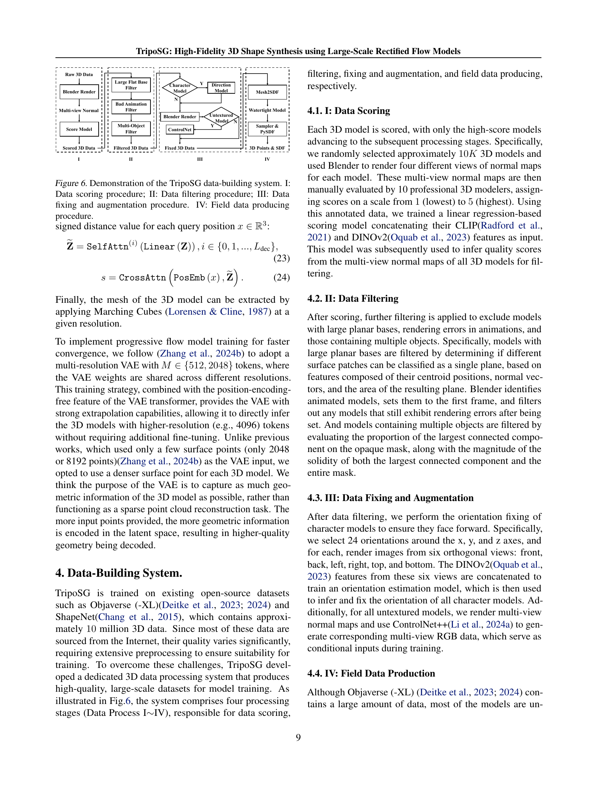
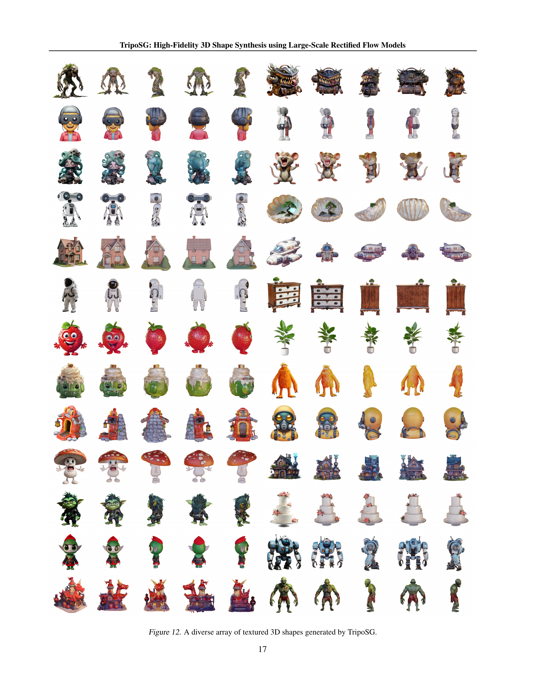

 


 2502.06608 
 Yangguang Li et el. 
 
 🤗 2025-02-14 
 



↗ arXiv


↗ Hugging Face


### TL;DR



3D 형태 생성은 이미지 및 비디오 생성 분야의 눈부신 발전에도 불구하고 여전히 어려운 과제입니다. 기존 방법들은 데이터 규모의 한계, 3D 데이터 처리의 복잡성, 그리고 고급 기술의 부족으로 인해 출력 품질, 일반화 능력, 입력 조건과의 정렬 측면에서 어려움을 겪었습니다.  특히, 기존 방법들은 Objaverse 데이터셋에 크게 의존하며, 엄격한 데이터 필터링으로 인해 사용 가능한 데이터 샘플이 절반 가까이 줄어드는 문제가 있습니다.

본 연구에서는 이러한 문제들을 해결하기 위해 TripoSG라는 새로운 방법을 제시합니다. TripoSG는 대규모 정제된 흐름 변환기를 이용하여 고품질의 3D 메시를 생성하며, 입력 이미지와의 정확한 대응 관계를 갖도록 설계되었습니다.  이는 **대규모 정제된 흐름 변환기**, **3D VAE에 대한 혁신적인 훈련 전략**, 그리고 **데이터 품질 및 양에 대한 중요성을 강조하는 데이터 처리 파이프라인**의 세 가지 핵심 요소를 통해 가능해졌습니다.  실험 결과는 TripoSG가 **최첨단 수준의 3D 형태 생성 성능**을 달성했음을 보여줍니다.



#### Key Takeaways


 TripoSG는 **대규모 정제된 흐름 변환기 아키텍처**를 이용하여 고품질 3D 형태를 생성합니다. 



 본 연구는 **데이터 전처리 파이프라인**을 통해 2백만 개 이상의 고품질 3D 샘플을 생성하여 3D 생성 모델 학습에 중요한 데이터 품질 및 양의 기준을 제시합니다. 



 TripoSG는 **다양한 이미지 스타일 및 콘텐츠**에서 3D 모델을 생성하는 향상된 다양성과 일반화 능력을 보여줍니다. 


#### Why does it matter?
본 논문은 **대규모 정제된 흐름 모델을 사용한 고품질 3D 형태 합성**이라는 중요한 문제를 다룹니다.  **기존 3D 생성 모델의 한계를 극복하고 고품질의 3D 모델을 생성하는 새로운 방법론**을 제시하여 3D 생성 분야의 발전에 크게 기여합니다. 특히, **고해상도, 다양한 스타일 및 복잡한 구조의 3D 모델 생성**이 가능해져 다양한 분야에 활용될 수 있는 잠재력을 가지고 있습니다.  연구의 결과는 **3D 모델 생성의 정확도 및 효율성을 향상**시키고, 향후 연구 방향에 대한 새로운 가능성을 제시하여 관련 연구자들에게 큰 영향을 미칠 것입니다.

------
#### Visual Insights

> 🔼 이 그림은 논문에서 제시된 가장 큰 TripoSG 모델로 생성한 고품질 3D 형태 샘플들을 보여줍니다. 다양하고 복잡한 구조, 여러 가지 스타일, 독창적인 디자인, 여러 개의 물체로 구성된 합성물, 그리고 매우 디테일한 출력물 등을 통해 TripoSG 모델의 강력한 생성 능력을 보여줍니다.  다양한 형태의 물체와 복잡한 구조, 세세한 디테일까지 표현하여 모델의 성능을 시각적으로 보여주는 것이 특징입니다.
> 

> 
read the caption

> Figure 1: High-quality 3D shape samples from our largest TripoSG model. Covering various complex structures, diverse styles, imaginative designs, multi-object compositions, and richly detailed outputs, demonstrates its powerful generation capabilities.
> 


| Condition | Skip-C | Sample-S | Normal-FID ↓ |
|---|---|---|---| 
| Dinov2 | ✗ | R-Flow | 10.69 |
| CLIP-Dinov2 | ✗ | R-Flow | 10.61 |
| CLIP-Dinov2 | ✓ | DDPM | 9.63 |
| CLIP-Dinov2 | ✓ | EDM | 9.50 |
| CLIP-Dinov2 | ✓ | R-Flow | 9.47 |

> 🔼 표 1은 제안된 흐름 모델의 성능 향상을 위한 여러 가지 요소들의 영향을 실험적으로 분석한 결과를 보여줍니다.  'Skip-C'는 skip connection 연산을, 'Sample-S'는 샘플링 스케줄을 의미합니다.  표는 각 요소(Skip-C, Sample-S, 그리고 조건부 정보(Condition) 사용 여부)를 조합하여 실험한 결과 Normal-FID 점수를 나타냅니다.  Normal-FID 점수는 3D 모델 생성 성능의 평가 지표로, 낮을수록 성능이 좋음을 의미합니다. 이 표를 통해 skip connection과 R-Flow 샘플링 기법이 3D 모델 생성 성능 향상에 효과적임을 알 수 있습니다.
> 

> 
read the caption

> Table 1: The ablation for flow model improvements. ‘Skip-C’ is the skip-connection operation and ‘Sample-S’ is the sample schedule.
> 

### In-depth insights

#### Rectified Flow 3D
**정류된 흐름(Rectified Flow)**은 기존 확산 모델의 한계를 극복하고 고품질 3D 형태 합성을 가능하게 하는 혁신적인 기술입니다. 기존의 확산 모델은 샘플링 과정에서 복잡한 비선형 경로를 따라가기 때문에 계산 비용이 많이 들고, 샘플링 속도가 느리다는 단점이 있습니다. 하지만 정류된 흐름은 **선형적인 샘플링 경로**를 사용하여 이러한 문제점을 해결합니다. 이는 훈련 과정을 간소화하고, 샘플링 속도를 향상시키며, **더욱 안정적이고 효율적인 3D 모델 생성**을 가능하게 합니다. 특히, 고해상도 3D 모델 생성에 효과적이며, 복잡한 구조와 다양한 스타일의 3D 형태를 정확하고 세밀하게 생성할 수 있습니다.  **대용량의 고품질 데이터**를 활용하여 훈련함으로써, 정류된 흐름 기반 3D 모델은 **높은 충실도**를 달성하며, 입력 조건과의 정렬 또한 우수합니다.  결과적으로, 정류된 흐름 3D 기술은 3D 형태 생성 분야에서 **획기적인 발전**을 이끌어낼 것으로 기대됩니다.

#### Large-Scale VAE
본 논문에서 제시된 대규모 VAE(Variational Autoencoder)는 **고품질 3D 데이터의 대량 생성 및 효율적인 잠재 공간 압축**에 중점을 둡니다.  기존의 낮은 해상도의 3D 데이터셋의 한계를 극복하고자, **대규모 정제된 플로우 변환기(Rectified Flow Transformer)**를 이용한 학습 전략을 통해 고품질의 3D 모델들을 2백만 개 이상 생성합니다.  **SDF(Signed Distance Function) 기반 표현**을 사용하여 기존의 Occupancy 기반 방법보다 더욱 정확하고 상세한 기하학적 정보를 담아내며, **표면 법선(Surface Normal) 및 Eikonal 손실 함수**를 추가하여 3D 모델 재구성의 정확도를 높입니다.  또한, **40억 개의 파라미터를 가진 대규모 모델**을 설계하여 고해상도의 3D 형상 생성 능력을 향상시키며, **MoE(Mixture of Experts)**를 사용하여 계산 비용을 효율적으로 관리합니다.  이러한 대규모 VAE는 **이미지-3D 모델 생성의 정확도, 일반화 능력, 입력 조건과의 정렬** 등의 성능 향상에 크게 기여하며, **고품질 3D 모델 생성의 새로운 기준**을 제시합니다.

#### Data Quality Focus
본 논문에서 강조하는 '데이터 품질'은 3D 형태 생성 모델의 성능에 **결정적** 영향을 미칩니다. 저품질 데이터는 모델 학습을 방해하고, 결과물의 정확도와 일반화 능력을 저하시키는 주요 원인이 됩니다. 따라서, **대규모 고품질 데이터셋 구축**이 중요하며, 이를 위해 데이터 전처리 과정(정제, 필터링, 보정 등)이 필수적입니다.  **데이터 품질 관리**를 위한 체계적인 시스템 구축과 평가 지표 개발은 3D 형태 생성 기술 발전에 중요한 기여를 할 것입니다.  **양질의 데이터 확보 및 전처리**는 단순히 데이터의 양을 늘리는 것 이상의 의미를 가지며, 모델 성능 향상과 실제 응용 분야 확장에 직결됩니다.  **향후 연구**에서는 더욱 정교한 데이터 품질 평가 방법과 효율적인 데이터 증강 기법 연구가 필요하며, 이는 고품질 3D 형태 생성 기술의 발전에 중요한 역할을 할 것입니다.

#### Hybrid Supervised
본 논문에서 제안하는 "하이브리드 지도 학습(Hybrid Supervised Learning)" 방식은 **3D 형태 생성 모델의 정확도와 일반화 능력을 향상**시키기 위한 핵심 전략입니다. 기존의 단일 지도 학습 방식과 달리, **다양한 손실 함수들을 결합**하여 3D 모델의 다양한 측면을 동시에 최적화합니다.  예를 들어, SDF (Signed Distance Function) 손실은 형태의 기하학적 정확성을, 표면 법선(Normal) 손실은 표면의 세부적인 디테일을, 그리고 아이코날(Eikonal) 손실은 표면의 매끄러움을 각각 개선하는 데 기여합니다. 이러한 다중 손실 함수의 결합은 **상호 보완적인 효과**를 창출하여 최종적으로 **더욱 높은 충실도**를 지닌 3D 모델을 생성하는 데 중요한 역할을 합니다.  또한, **대규모 고품질 데이터셋**과의 결합을 통해 모델의 학습 안정성과 일반화 능력이 크게 향상됩니다.  이처럼 하이브리드 지도 학습은 단순히 여러 손실 함수를 더하는 것 이상으로, 각 손실 함수의 상호작용 및 **시너지 효과를 고려**한 **정교한 설계**가 필요함을 시사합니다. 결론적으로, 하이브리드 지도 학습은 3D 형태 생성 분야에서 **성능 향상의 중요한 원동력**이 될 것으로 예상됩니다.

#### Future 3D Directions
미래의 3D 기술 방향에 대한 심도있는 고찰은 **대용량 고품질 데이터셋 확보**, **더욱 효율적인 모델 아키텍처 개발**, 그리고 **새로운 3D 표현 기법 및 학습 방법론** 모색의 세 가지 핵심축으로 요약될 수 있습니다.  **초고해상도 3D 모델 생성**과 **다양한 스타일 및 복잡한 구조의 3D 콘텐츠 생성**이 중요한 목표가 될 것이며, 이를 위해서는 더욱 발전된 **변환기(transformer) 기반 모델**이나 **확산 모델(diffusion model)**의 활용이 필수적입니다.  또한, **실시간 또는 준실시간 3D 생성 기술** 개발을 통해 몰입형 환경 구축 및 실시간 상호작용 시스템 구현에 중요한 역할을 할 것입니다.  **텍스트, 이미지, 비디오 등 다양한 모달리티 정보를 통합**하는 멀티모달 3D 생성 모델 또한 중요한 연구 분야로 부상할 것으로 예상되며, 이를 통해 사용자의 의도를 더욱 정확하게 반영하는 3D 콘텐츠 생성이 가능해질 것입니다.  **물리적 특성 및 동작을 고려한 3D 모델 생성**은 현실감 있는 시뮬레이션 및 가상 환경 구축에 중요한 역할을 할 것이며, **3D 모델 편집 및 수정 도구의 발전** 또한 3D 기술의 실용성 확대에 기여할 것으로 기대됩니다.  궁극적으로는 **인간-컴퓨터 상호작용(HCI)** 관점에서 **직관적이고 사용자 친화적인 3D 콘텐츠 생성 및 편집 도구** 개발에 대한 연구가 더욱 중요해질 전망입니다.  **윤리적, 사회적 문제에 대한 고려** 또한 미래 3D 기술 개발 및 활용에 있어 필수적인 요소가 될 것입니다.

### More visual insights

More on figures

> 🔼 그림 2는 TripoSG 방법의 개요를 보여줍니다. 두 가지 주요 구성 요소인 (i) 데이터 구축 시스템과 (ii) TripoSG 모델로 구성됩니다. 데이터 구축 시스템은 Objaverse 및 ShapeNet과 같은 다양한 데이터셋에서 3D 모델을 처리하여 일련의 데이터 처리 단계를 거쳐 훈련 데이터를 생성합니다. TripoSG 모델은 이렇게 엄선된 데이터셋을 사용하여 단일 입력 이미지에서 고충실도 3D 형태 생성을 위해 학습됩니다.
> 

> 
read the caption

> Figure 2: The overview of our method consists of two main components: (i) Data-Building System and (ii) TripoSG Model. The data-building system processes the 3D models from various datasets (e.g., Objaverse and ShapeNet) through a series of data processing steps to create the training data. Our TripoSG model is then trained on this curated dataset for high-fidelity shape generation from a single input image.
> 

> 🔼 이 그림은 TripoSG 모델의 아키텍처를 자세하게 보여줍니다. 왼쪽은 전체적인 아키텍처를, 가운데는 각 블록의 내부 모듈을, 오른쪽은 MoE(Mixture of Experts)의 내부 구성요소를 보여줍니다. TripoSG는 rectified flow transformer 기반의 3D shape generation 모델이며, 이미지 조건부 생성을 위해 CLIP과 DINO를 사용합니다. 각 블록은 여러 개의 MoE 모듈로 구성되어 있으며, 이는 모델의 확장성과 효율성을 높여줍니다.
> 

> 
read the caption

> Figure 3: Left: the overall architecture of TripoSG. Middle: the detailed internal module of each block. Right: the detailed internal components of the MoE.
> 

> 🔼 그림 4는 TripoSG 모델의 변압기 기반 VAE 아키텍처를 보여줍니다. 그림에서 위쪽 부분은 인코더를, 아래쪽 부분은 디코더를 나타냅니다. 인코더는 입력으로 3D 메쉬를 받아 잠재 공간으로 표현하는 역할을 하고, 디코더는 잠재 공간의 표현을 사용하여 다시 3D 메쉬를 생성합니다.  인코더와 디코더는 모두 여러 개의 변압기 블록으로 구성되어 있으며, 각 블록은 다양한 처리 과정을 거쳐 입력 데이터를 효율적으로 처리합니다. 이 과정을 통해 고품질의 3D 형태를 생성하고 복원하는 데 필요한 정보를 효과적으로 추출하고 표현할 수 있습니다. 그림은 VAE의 전체적인 구조와 각 구성 요소의 역할을 시각적으로 보여주어, TripoSG 모델의 작동 원리를 이해하는 데 도움을 줍니다.
> 

> 
read the caption

> Figure 4: TripoSG’s transformer-based VAE architecture. The upper is the encoder and the lower is the decoder.
> 

> 🔼 이 그림은 점유율(Occupancy) 기반과 부호화된 거리 함수(SDF, Signed Distance Function) 기반의 3D 모델 재구성 결과를 비교하여 보여줍니다. 상단은 점유율 기반 재구성, 하단은 SDF 기반 재구성 결과입니다. SDF 기반 재구성이 점유율 기반에 비해 더욱 정교하고 세밀한 기하학적 디테일을 보여주는 것을 시각적으로 보여주는 그림입니다.  이는 TripoSG 모델의 VAE(Variational Autoencoder) 훈련 과정에서 SDF 방식이 점유율 방식보다 더 나은 성능을 보임을 강조하기 위해 사용된 그림입니다.
> 

> 
read the caption

> Figure 5: Comparison between model reconstruction based on Occupancy (top) and SDF (bottom).
> 

> 🔼 그림 6은 TripoSG 데이터 구축 시스템의 전체 과정을 보여줍니다.  먼저, 수집된 3D 모델 데이터의 품질을 평가하는 단계(I: 데이터 점수 매기기)를 거쳐, 낮은 품질의 데이터를 제거합니다. 다음으로, 평면 기반, 애니메이션 렌더링 오류, 다중 개체 포함 등의 문제가 있는 데이터를 걸러내는 필터링 단계(II: 데이터 필터링)를 수행합니다.  필터링된 데이터는 방향 수정 및 보강을 통해 표준화되고(III: 데이터 수정 및 보강), 최종적으로 고품질의 훈련 데이터를 생성하는 단계(IV: 현장 데이터 생성)를 거칩니다.
> 

> 
read the caption

> Figure 6: Demonstration of the TripoSG data-building system. I: Data scoring procedure; II: Data filtering procedure; III: Data fixing and augmentation procedure. IV: Field data producing procedure.
> 

> 🔼  그림 7은 동일한 이미지 입력을 사용하여 TripoSG와 다른 최첨단 방법들의 3D 생성 성능을 비교한 것입니다. TripoSG의 결과는 기존 방법들보다 훨씬 더 정교하고 세부적인 3D 모델을 생성하며, 다양한 복잡한 구조, 스타일, 상상력 풍부한 디자인, 다중 객체 구성, 풍부한 세부 묘사가 가능함을 보여줍니다. 이는 TripoSG가 복잡한 3D 장면 생성에서 뛰어난 성능을 보임을 시사합니다. 
> 

> 
read the caption

> Figure 7: Comparison of 3D generation performance of TripoSG and other previous state-of-the-art methods under the same image input.
> 

> 🔼 그림 8은 3D 현실성, 텍스트-자산 정렬, 기하학적 세부 사항, 질감 세부 사항, 질감-기하학적 일관성이라는 다섯 가지 측면에서 여러 3D 생성 방법의 점수를 레이더 차트로 비교한 것입니다. 각 방법의 강점과 약점을 쉽게 파악할 수 있도록 시각적으로 표현하여 TripoSG의 우수성을 보여줍니다.
> 

> 
read the caption

> Figure 8: Radar chart of the score of different methods in 5 aspects, including 3D plausibility, text-asset alignment, geometry details, texture details, texture-geometry coherency.
> 

> 🔼 그림 9는 VAE의 ablation study 결과를 보여줍니다.  다양한 3D 표현 방식(Occupancy, SDF, SDF+Normal, SDF+Normal+Eikonal)과 학습 방식을 비교하여 VAE의 재구성 품질에 미치는 영향을 정성적으로 분석합니다.  각각의 3D 표현 방식과 학습 방식에 따른 재구성 결과를 시각적으로 비교하여, 어떤 조합이 가장 좋은 품질의 3D 모델을 생성하는지 보여줍니다. 특히, SDF 기반의 표현과 표면 법선 지도(surface normal guidance), 그리고 eikonal 정규화를 사용했을 때 품질이 향상되는 것을 확인할 수 있습니다.
> 

> 
read the caption

> Figure 9: Qualitative comparison for the ablation of VAE with different types of 3D representation and training supervision.
> 

> 🔼 그림 10은 흐름 모델 ablation 실험의 시각화 결과를 보여줍니다.  각 열은 데이터 빌딩 시스템(DBS) 사용 여부, 토큰 수, 학습 데이터 크기 등의 다른 변수들을 적용한 결과를 보여줍니다.  각 행은 동일한 입력 이미지에 대해 생성된 3D 모델의 여러 뷰를 보여주어, 각 변수들이 모델의 3D 객체 생성 품질에 미치는 영향을 비교 분석하는 데 도움을 줍니다. DBS의 적용은 결과물의 질 향상에 크게 기여하며, 토큰 수 증가와 더 많은 학습 데이터 사용 또한 품질 개선에 긍정적임을 보여줍니다. 
> 

> 
read the caption

> Figure 10: Visualization results of the flow model ablation experiments. ‘DBS’ is the abbreviation for Data-Building System.
> 

> 🔼 그림 11은 TripoSG 모델이 생성한 다양한 질감 없는 3D 형상들을 보여줍니다.  이 그림은 TripoSG 모델의 다양한 3D 형태 생성 능력을 보여주는 다양한 사물들의 3D 모델들을 포함하고 있습니다.  모델이 복잡한 구조, 다양한 스타일, 상상력 넘치는 디자인, 여러 개체의 구성, 그리고 풍부한 디테일을 가진 출력물들을 생성할 수 있음을 보여줍니다.
> 

> 
read the caption

> Figure 11: A diverse array of texture-free 3D shapes generated by TripoSG.
> 

More on tables


| Dataset | Token number | MoE | Normal-FID ↓ |
|---|---|---|---| 
| Objaverse | 512 | ✗ | 9.47 |
|  | 2048 | ✗ | 8.38 |
|  | 4096 | ✗ | 8.12 |
|  | 4096 | ✓ | 7.94 |
| TripoSG | 4096 | ✓ | 3.36 |
> 🔼 표 2는 흐름 모델 확장에 대한 추가 실험 결과를 보여줍니다.  토큰 수와 Mixture-of-Experts(MoE) 사용 여부에 따른 Normal-FID(낮을수록 좋음) 점수 변화를 Objaverse 데이터셋을 사용하여 측정했습니다.  실험은 4096 토큰 해상도에서 MoE를 사용했을 때 가장 좋은 성능을 보였음을 보여줍니다.
> 

> 
read the caption

> Table 2: The ablation for flow model scaling up.
> 


| Dataset | Repr. | \mathcal{L}_{sn} | \mathcal{L}_{eik} | Chamfer \downarrow | F-score \uparrow | N.C. \uparrow |
|---|---|---|---|---|---|---|
| Objaverse | Occ | ✗ | ✗ | 4.59 | 0.999 | 0.952 |
|  | SDF | ✗ | ✗ | 4.60 | 0.999 | 0.955 |
|  | SDF | ✓ | ✗ | 4.56 | 0.999 | 0.956 |
|  | SDF | ✓ | ✓ | 4.57 | 0.999 | 0.957 |
| TripoSG | SDF | ✓ | ✓ | 4.51 | 0.999 | 0.958 |
> 🔼 표 3은 VAE(Variational Autoencoder)의 구성요소들을 비교 분석한 실험 결과를 보여줍니다.  구체적으로 3D 표현 방식(Repr), 표면 법선 손실(ℒsn), 아이코날 정규화(ℒeik) 그리고 사용된 데이터셋의 크기(Dataset, TripoSG 또는 Objaverse)의 변화에 따른 VAE의 성능 변화를 보여줍니다.  각 실험 조건에서 Chamfer Distance, F-Score, 그리고 Normal Consistency 지표를 사용하여 VAE의 3D 형상 재구성 성능을 정량적으로 평가했습니다.
> 

> 
read the caption

> Table 3: The ablation of different VAE, including 3D representation, training supervision and training dataset. ‘Repr’ refers to the type of 3D representation used, and ‘ℒsnsubscriptℒsn\mathcal{L}_{\text{sn}}caligraphic_L start_POSTSUBSCRIPT sn end_POSTSUBSCRIPT’ and ‘ℒeiksubscriptℒeik\mathcal{L}_{\text{eik}}caligraphic_L start_POSTSUBSCRIPT eik end_POSTSUBSCRIPT’ refer to surface normal loss and eikonal regularization respectively. The ‘Dataset’ indicates whether a large (TripoSG) or a small dataset (Objaverse) is used.
> 


| Dataset | Size | Data-building System | Normal-FID ↓ |
|---|---|---|---| 
| Objaverse | 800K | ✗ | 11.61 |
|  | 180K | ✓ | 9.47 |
| TripoSG | 2M | ✓ | 5.81 |
> 🔼 표 4는 데이터의 질과 양에 따른 실험 결과를 보여줍니다. 데이터 전처리 과정(데이터 품질 향상)을 거친 Objaverse 데이터셋(18만 개)과 TripoSG의 데이터 전처리 과정을 거친 Objaverse 데이터셋(200만 개)을 사용한 실험 결과를 Normal-FID 지표를 통해 비교 분석합니다. 데이터 전처리 과정을 거친 18만 개의 데이터셋과 200만 개의 데이터셋을 각각 사용한 결과를 비교하여 데이터 전처리의 효과와 데이터 양 증가에 따른 성능 향상을 보여줍니다.
> 

> 
read the caption

> Table 4: The ablation for data quality and quantity.
> 

### Full paper



