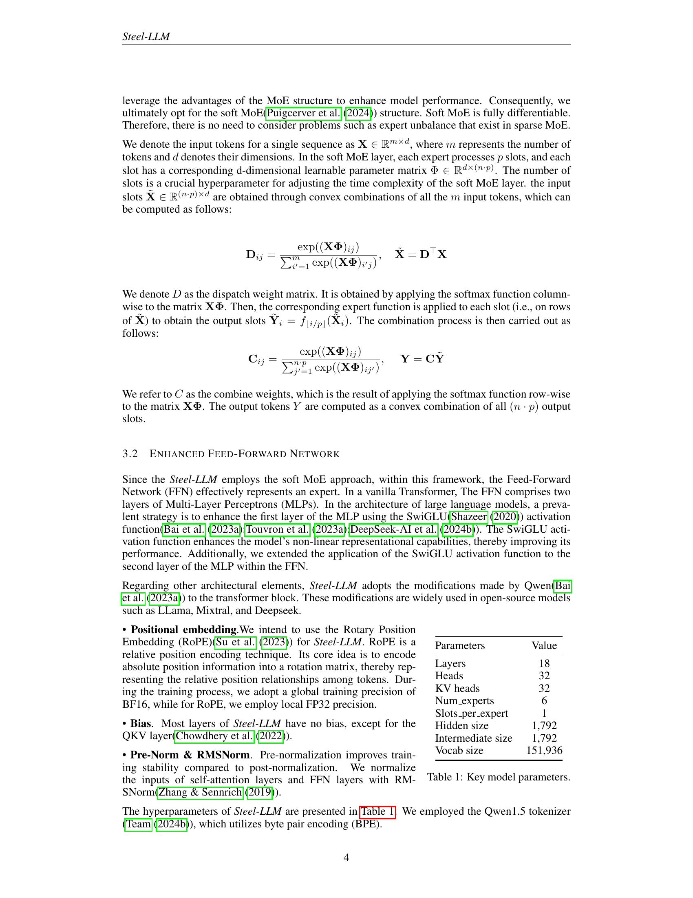
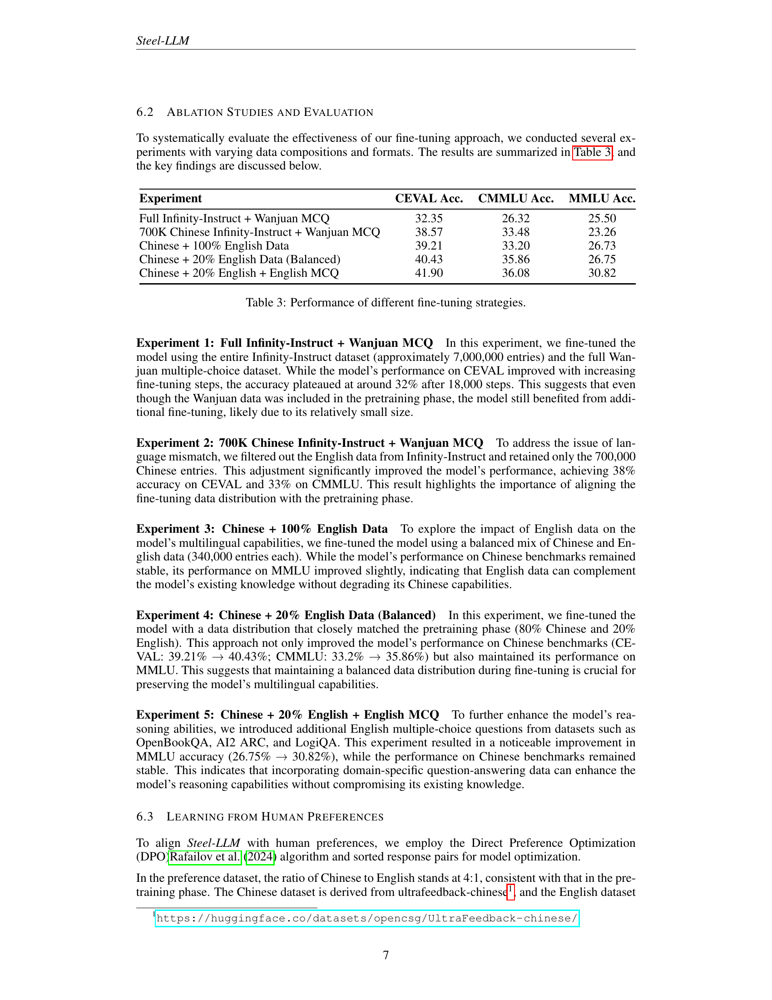
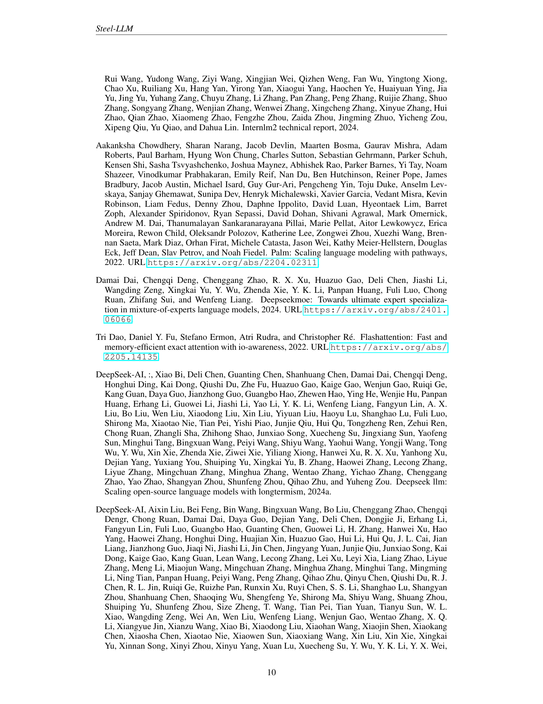

 


 2502.06635 
 Qingshui Gu et el. 
 
 🤗 2025-02-11 
 



↗ arXiv


↗ Hugging Face


### TL;DR



대규모 언어 모델(LLM)의 발전에도 불구하고, **개발의 투명성, 접근성 및 자원 효율성은 여전히 과제**입니다. 많은 기존 LLM들은 훈련 데이터, 코드 및 중간 체크포인트를 공개하지 않아 재현성에 어려움을 겪고 있으며, **대규모 계산 자원이 필요**하여 소규모 연구팀의 접근성이 낮습니다.

본 논문에서는 제한된 계산 자원(8개의 GPU)을 사용하여 개발된 **오픈소스 중국어 중심 LLM인 Steel-LLM을 소개**합니다. Steel-LLM은 **투명성을 중시**하여 훈련 파이프라인, 데이터셋, 모델 아키텍처 및 중간 체크포인트를 공개하고, **소규모 연구를 위한 실용적인 지침**을 제공합니다.  **CEVAL 및 CMMLU 벤치마크에서 우수한 성능**을 보이며, **소규모 연구팀의 LLM 개발을 위한 중요한 자원**이 될 것으로 기대됩니다.



#### Key Takeaways


 제한된 계산 자원을 사용하여 고품질의 오픈소스 중국어 중심 대규모 언어 모델을 개발할 수 있음을 보여줌 



 데이터 수집, 모델 설계, 훈련 방법론 등 모델 구축 과정에 대한 자세하고 실용적인 설명 제공 



 CEVAL ë° CMMLU 벤치마크에서 경쟁력 있는 성능을 달성함 


#### Why does it matter?
**본 논문은 제한된 계산 자원으로 고품질의 오픈소스 중국어 중심 대규모 언어 모델을 개발하는 데 있어 귀중한 통찰력과 실용적인 지침을 제공합니다.**  이는 소규모 연구팀과 개인 연구자들에게 특히 중요하며, **대규모 언어 모델 개발의 접근성을 높이고, 중국어 자연어 처리 분야의 발전에 기여할 것**으로 예상됩니다. 또한, **본 연구는 투명성과 재현성을 강조하여 연구 공동체에 크게 기여**할 것입니다.

------
#### Visual Insights

> 🔼 그림 1은 Steel-LLM Transformer 블록의 아키텍처를 보여줍니다.  Steel-LLM은 Soft Mixture of Experts (Soft MOE)와 향상된 피드포워드 네트워크(FFN)를 사용하여 제한된 리소스 내에서 성능을 최적화합니다.  그림은 토큰이 Self-Attention, Soft MOE, 그리고 향상된 FFN 레이어를 거치는 과정을 자세히 보여주며, 각 레이어의 구성 요소와 데이터 흐름을 시각적으로 나타냅니다.  특히 Soft MOE는 전문가(Expert)들을 효율적으로 활용하여 계산 부하를 줄이는 전략을 보여줍니다.  이 그림을 통해 Steel-LLM의 효율적인 설계와 성능 향상을 위한 핵심 구성 요소들을 이해할 수 있습니다.
> 

> 
read the caption

> Figure 1: The architecture of Steel-LLM Transformer block
> 


| Parameters | Value |
|---|---| 
| Layers | 18 |
| Heads | 32 |
| KV heads | 32 |
| Num_experts | 6 |
| Slots_per_expert | 1 |
| Hidden size | 1,792 |
| Intermediate size | 1,792 |
| Vocab size | 151,936 |

> 🔼 표 1은 Steel-LLM 모델의 주요 하이퍼파라미터들을 보여줍니다.  레이어 수, 헤드 수, 히든 사이즈, 중간 사이즈, 어휘 크기, 전문가 수, 슬롯 수 등의 주요 구조적 매개변수와 학습 전략에 대한 정보를 포함합니다. 이 표는 Steel-LLM의 아키텍처와 성능에 영향을 미치는 중요한 요소들을 한눈에 보여줍니다.
> 

> 
read the caption

> Table 1: Key model parameters.
> 

### In-depth insights

#### Resource-Efficient LLMs
자원 효율적인 LLMs는 **제한된 컴퓨팅 자원**을 사용하여 고품질의 언어 모델을 개발하는 데 중점을 둡니다. 이는 대규모 인프라에 접근할 수 없는 소규모 연구팀이나 개인 연구자들에게 특히 중요합니다.  **투명성**과 **재현성**을 강조하여, 모델 개발 과정의 모든 세부 정보(데이터, 코드, 중간 체크포인트 등)를 공개함으로써 다른 연구자들이 연구를 재현하고 발전시킬 수 있도록 합니다.  **소규모 연구에 대한 실질적인 지침**을 제공하여, 제한된 자원을 가진 연구자들이 자신만의 LLMs를 개발할 수 있도록 돕습니다. 이는 모델 설계, 훈련 방법론, 데이터 준비 과정 등에 대한 상세한 설명을 포함합니다.  **중요한 것은, 고품질의 성능**을 유지하면서 자원 효율성을 달성하여, 대규모 모델과 경쟁력 있는 결과를 보여줍니다. 이러한 접근 방식은 연구의 **민주화**를 증진시키고, 다양한 언어와 특정 도메인에 특화된 LLMs 개발을 가능하게 합니다.

#### Chinese-Centric Approach
본 논문에서 제시된 Steel-LLM의 중국어 중심 접근 방식은 **데이터셋 구성**에서 가장 두드러집니다.  **대규모 중국어 데이터**를 우선적으로 활용하여 모델 학습을 진행했으며, 소량의 영어 데이터를 보조적으로 사용했습니다. 이는 기존의 다국어 LLM들이 영어 중심으로 학습되는 경향을 벗어나, **중국어의 특수성과 풍부함을 제대로 반영**하려는 의도를 보여줍니다.  **자원 제약**에도 불구하고,  **고품질의 오픈소스 중국어 LLM**을 개발하겠다는 목표 아래, 효율적인 모델 개발 및 훈련 방법론을 선택하여 **실용성**을 높였습니다.  **투명성**을 중시하여 데이터셋, 코드, 모델 구조 등을 모두 공개함으로써, 다른 연구자들의 재현 및 추가 연구를 지원하고, **중국어 자연어 처리 분야의 발전**에 기여하고자 하는 의지를 보입니다.  이는 중국어 중심의 접근이 단순한 언어 선택을 넘어, **오픈소스 생태계 구축**과 **학문적 공유**를 위한 전략적인 선택임을 시사합니다.

#### Soft MOE & FFN Enhancements
본 논문에서 제시된 소프트 MOE(Mixture of Experts)와 FFN(Feed-Forward Network) 개선은 **계산 자원이 제한된 환경에서도 고품질의 언어 모델을 구축**하는 데 중점을 둡니다.  **기존의 스파스 MOE의 단점을 극복**하기 위해 **전체적으로 미분 가능한 소프트 MOE**를 채택하여 전문가 불균형 문제를 해결하고자 합니다.  이는 **모든 매개변수를 완벽하게 학습**할 수 있도록 하여 모델 성능을 향상시키는 데 기여합니다.  **FFN 개선**은 SwiGLU 활성화 함수를 두 번째 MLP 계층에도 적용하여 비선형 표현 능력을 강화하고 성능을 향상시키는 데 초점을 맞추고 있습니다.  **계산 효율성을 고려**하여 Rotary Position Embedding(RoPE)을 사용하고, 대부분의 계층에서 바이어스를 제거하는 등의 최적화 기법을 사용합니다. 이러한 접근 방식은 제한된 GPU 메모리 환경에서도 효율적으로 모델을 학습할 수 있도록 합니다.  결론적으로, 이러한 개선들은 **자원 제약 하에서도 경쟁력 있는 성능을 달성**하는 데 크게 기여하며, **소규모 연구팀에도 실질적인 가이드라인**을 제공합니다.

#### Open-Source Transparency
본 논문에서 제시된 Steel-LLM은 오픈소스의 투명성을 중시하여 **모델 개발 과정 전반에 대한 완전한 정보 공개**를 지향합니다.  이는 단순히 최종 모델의 가중치만 공개하는 것이 아니라, **훈련 파이프라인, 데이터셋, 모델 아키텍처, 중간 체크포인트까지 모두 공개**함으로써, 재현성을 높이고 학계의 더 넓은 참여를 유도합니다.  **소규모 연구팀이나 개인 연구자들이 접근하기 어려운 대규모 컴퓨팅 자원에 대한 의존성을 최소화**하면서 고품질의 LLM을 개발하고 배포할 수 있도록 실질적인 지침을 제공하는 점이 중요합니다.  **한정된 자원으로도 투명성과 효율성을 동시에 확보**한 본 연구는 향후 오픈소스 LLM 생태계 발전에 크게 기여할 것으로 예상되며, 특히 영어권이 아닌 언어권에서의 LLM 개발에 큰 영향을 미칠 가능성이 있습니다.  **실제적인 모델 구축 경험 공유**를 통해 다른 연구자들이 유사한 노력을 더욱 효율적으로 수행할 수 있도록 돕는다는 점에서 중요한 의의를 가집니다.

#### Benchmark & Ablation Studies
본 논문의 벤치마크 및 에이블레이션 연구는 **Steel-LLM의 성능을 다양한 측면에서 평가**하고, **모델 설계 선택의 영향을 분석**하는 데 중점을 두었습니다.  다양한 데이터 구성(예: 중국어 데이터 비중, 영어 데이터 추가 여부)과 미세조정 전략을 실험하여 **Steel-LLM의 강점과 약점을 밝히고 성능 향상에 기여하는 요소를 파악**했습니다. 특히, 중국어 중심 데이터셋에 대한 집중적인 학습이 중국어 벤치마크에서 뛰어난 성능을 보였으며, 적절한 양의 영어 데이터 추가는 다국어 능력 향상에 도움이 되었다는 점을 시사합니다.  **에이블레이션 연구는 모델의 각 구성요소(예: Soft MOE, Enhanced FFN)**가 성능에 미치는 영향을 정량적으로 분석하여 모델의 효율성과 성능 간의 균형을 최적화하는 데 중요한 정보를 제공합니다. 이러한 분석 결과는 향후 유사한 모델 개발에 있어 중요한 지침으로 활용될 수 있으며, **제한된 자원을 가진 연구자들에게 실용적인 가이드라인**을 제시합니다.  **모델의 투명성과 재현성**을 확보하기 위한 노력으로, 실험 과정과 결과에 대한 자세한 설명과 데이터 공개가 이루어졌다는 점 또한 주목할 만합니다.

### More visual insights

More on figures

> 🔼 그림 2는 Steel-LLM 사전 훈련에 사용된 데이터의 분포를 보여줍니다.  SkyPile, WanJuan, Wikipedia-cn, Baidu Baike, Baidu QA, Zhihu QA, BELLE, Moss, Firefly, Starcode와 같은 다양한 출처의 데이터가 포함되어 있으며, 특히 중국어 데이터가 압도적으로 많음을 알 수 있습니다. 영어 데이터와 코드 데이터도 일부 포함되어 있지만, 전체 데이터의 상당 부분은 중국어 웹 페이지, 백과사전, 대화 데이터 등으로 구성되어 있습니다. 이는 Steel-LLM이 중국어 중심의 언어 모델임을 강조합니다.
> 

> 
read the caption

> Figure 2: Pretraining Data Distribution
> 

> 🔼 그림 3은 Steel-LLM의 사전 훈련 손실 곡선을 보여줍니다. 처음 200,000 단계는 NVIDIA A100-80G GPU를 사용하여 훈련되었고, 나머지 단계는 8개의 H800-80G GPU를 사용하여 훈련되었습니다. x축은 토큰 수 (단위: 10억)이고 y축은 손실 값입니다. 두 가지 다른 GPU를 사용하여 훈련했음을 보여주는 두 개의 곡선이 표시됩니다. 곡선은 훈련 과정에서 손실이 감소하는 것을 나타내며, Steel-LLM의 훈련 과정이 성공적으로 진행되었음을 시사합니다.
> 

> 
read the caption

> Figure 3: Pre-training loss curve for Steel-LLM
> 

> 🔼 그림 4는 Steel-LLM 모델의 지도 학습 미세 조정 과정에서의 손실 곡선을 보여줍니다.  x축은 미세 조정 단계(step) 수를, y축은 손실 값(loss)을 나타냅니다.  곡선은 미세 조정이 진행됨에 따라 손실 값이 감소하는 것을 보여주며, 모델의 성능이 향상됨을 시사합니다.  이 그래프는 Steel-LLM의 학습 안정성과 효율성을 평가하는 데 유용한 정보를 제공합니다.
> 

> 
read the caption

> Figure 4: Supervised Fine-tuning loss curve for Steel-LLM
> 

> 🔼 그림 5는 Steel-LLM에 대한 직접 선호도 최적화(DPO) 손실 곡선을 보여줍니다. DPO는 사용자 선호도 데이터를 사용하여 언어 모델의 출력을 미세 조정하는 기법입니다. 이 그래프는 훈련 단계에 따른 손실 값의 변화를 나타내며, 손실 값이 감소하는 것은 모델 성능이 향상되는 것을 의미합니다. 곡선의 형태는 DPO 훈련 과정의 수렴 속도와 안정성을 보여줍니다. 이 그림은 Steel-LLM의 훈련 과정에서 DPO 기법이 효과적으로 모델을 개선하는데 기여했음을 시각적으로 보여주는 역할을 합니다.
> 

> 
read the caption

> Figure 5: Direct Preference Optimization loss curve for Steel-LLM
> 

More on tables


| Component | Exp 1 | Exp 2 | Exp 3 | Exp 4 | Exp 5 | Exp 6 | Exp 7 | Exp 8 |
|---|---|---|---|---|---|---|---|---|
| FlashAttention | ✓ | ✓ | × | ✓ | ✓ | ✓ | ✓ | × |
| SelfAttention(PyTorch) | × | × | ✓ | × | × | × | × | ✓ |
| RoPE(CUDA) | ✓ | × | ✓ | ✓ | ✓ | ✓ | ✓ | × |
| RoPE(PyTorch) | × | ✓ | × | × | × | × | × | ✓ |
| RMSNorm(CUDA) | × | × | × | × | ✓ | × | ✓ | × |
| RMSNorm(PyTorch) | ✓ | ✓ | ✓ | ✓ | × | ✓ | × | ✓ |
| Loss Function(Triton) | ✓ | ✓ | ✓ | ✓ | ✓ | × | ✓ | × |
| Loss Function(PyTorch) | × | × | × | × | × | ✓ | × | ✓ |
| FSDP | ✓ | ✓ | ✓ | × | ✓ | ✓ | × | ✓ |
| FSDP(no share param) | × | × | × | ✓ | × | × | ✓ | × |
| Speed(tokens/s/gpu) | 13400 | 12500 | 10600 | 13800 | 14600 | 13000 | 15000 | 10500 |
| GPU Memory(GB) | 65 | 65 | 69 | 69 | 61 | 75 | 66 | 75 |
> 🔼 표 2는 Steel-LLM 모델 학습에 사용된 다양한 설정들의 비교 결과를 보여줍니다.  FlashAttention, ROPE(CUDA/PyTorch), RMSNorm(CUDA/PyTorch), 손실 함수(Triton/PyTorch), FSDP(파라미터 공유 유무) 등의 다양한 학습 최적화 기법을 사용한 실험 결과를 토큰/초/GPU 속도와 GPU 메모리 사용량 측면에서 비교 분석하여, 각 기법들의 효과를 정량적으로 제시합니다.  이를 통해 Steel-LLM 학습 효율을 최대 50%까지 향상시키는 데 기여한 최적의 설정을 확인할 수 있습니다.
> 

> 
read the caption

> Table 2: Comparison of different training configurations.
> 


| Experiment | CEVAL Acc. | CMMLU Acc. | MMLU Acc. |
|---|---|---|---|
| Full Infinity-Instruct + Wanjuan MCQ | 32.35 | 26.32 | 25.50 |
| 700K Chinese Infinity-Instruct + Wanjuan MCQ | 38.57 | 33.48 | 23.26 |
| Chinese + 100% English Data | 39.21 | 33.20 | 26.73 |
| Chinese + 20% English Data (Balanced) | 40.43 | 35.86 | 26.75 |
| Chinese + 20% English + English MCQ | 41.90 | 36.08 | 30.82 |
> 🔼 표 3은 미세 조정 전략에 따른 성능을 보여줍니다.  다양한 데이터 구성(전체 Infinity-Instruct 데이터셋, Infinity-Instruct의 중국어 데이터만 사용, 중국어와 영어 데이터를 균형 있게 사용, 영어 데이터를 20%만 사용하는 경우, 그리고 추가적으로 영어 MCQ 데이터를 포함한 경우)에 따른 CEVAL, CMMLU, MMLU 벤치마크에서의 정확도를 비교 분석한 결과를 나타냅니다.  각 전략의 데이터 분포와 모델 성능 간의 상관관계를 파악하여 최적의 미세 조정 전략을 제시하고자 합니다.
> 

> 
read the caption

> Table 3: Performance of different fine-tuning strategies.
> 


| Model | CEVAL | CMMLU |
|---|---|---|
| Tiny-Llama-1.1B (Zhang et al., 2024c) | 25.02 | 24.03 |
| MiniCPM-1.2B (min, 2024) | 49.14 | 46.81 |
| Qwen1.5-1.8B-Chat (Bai et al., 2023b) | 56.84 | 54.11 |
| Phi2(2B) (Abdin et al., 2023) | 23.37 | 24.18 |
| Gemma-2b-it (Gemma Team et al., 2024) | 32.30 | 33.07 |
| CT-LLM-SFT-2B (Du et al., 2024) | 41.54 | 41.48 |
| ChatGLM-6B (GLM et al., 2024) | 38.90 | 37.48 |
| Llama2-7B (Touvron et al., 2023b) | 32.42 | 31.11 |
| OLMo-7B (Groeneveld et al., 2024b) | 35.18 | 35.55 |
| Gemma-7B (Gemma Team et al., 2024) | 42.57 | 44.20 |
| MAP-Neo-7B (Zhang et al., 2024a) | 56.97 | 55.01 |
| Llama2-13B (Touvron et al., 2023b) | 37.32 | 37.06 |
| *Steel-LLM*-1B-Chat | 41.90 | 36.08 |
| *Steel-LLM*-1B-Chat-DPO | 42.04 | 36.04 |
> 🔼 표 4는 CEVAL 및 CMMLU 벤치마크에서 다양한 언어 모델의 성능을 비교한 표입니다. Steel-LLM 모델의 성능을 다른 오픈소스 및 대규모 언어 모델과 비교하여 Steel-LLM의 경쟁력을 보여줍니다.  모델 이름, CEVAL 정확도, CMMLU 정확도가 제시되어 있으며, Steel-LLM이 유사한 규모의 다른 모델들보다 우수한 성능을 보임을 확인할 수 있습니다.
> 

> 
read the caption

> Table 4: Performance comparison of models on CEVAL and CMMLU benchmarks.
> 


| Dataset | Description |
|---|---| 
| SkyPile-150B (Wei et al., 2023) | Consisting of approximately 150 billion tokens and 620 gigabytes of cleaned text data from 233 million web pages, with rigorous filtering and deduplication to ensure quality and mitigate sensitive and biased information. |
| Wanjuan1.0 (He et al., 2023) | Composed of processed data from various sources, including web pages, encyclopedias, books, patents, textbooks, and exam questions, with a total volume of data exceeding 500 million documents, amounting to over 1TB (roughly split equally between Chinese and English data) and has undergone meticulous cleaning, deduplication, and value alignment. |
| Wikipedia-cn | Based on the July 20th, 2023 Chinese Wikipedia dump, retains 254,574 high-quality entries after filtering out special types, low-quality, sensitive, and controversial content, and includes conversions between simplified and traditional Chinese. |
| Baidu Baike | Consisting of 5,630,000 uncleaned entries from Baidu Baike, with a total size of approximately 17GB. |
| Baidu QA | Including 1.5 million high-quality encyclopedia questions and answers, spanning 492 categories, with 434 categories occurring at least 10 times, suitable for training intelligent Q&A systems |
| Zhihu QA | Including 1 million entries, with 1.5GB in size. |
| BELLE (BELLEGroup, 2023) | Train_2M_CN and train_3.5M_CN, generated by ChatGPT, contain 2 million and 3.5 million dialogue entries respectively, and were both used in this project. Note that these datasets are unverified and may contain errors. |
| Moss (Sun et al., 2024) | Containing 1.1 million Chinese and English multi-turn dialogue entries. |
| Firefly (Yang, 2023) | Comprising 1.15 million entries covering 23 common Chinese NLP tasks and includes culturally relevant data such as couplets, poetry, classical Chinese translations, prose, and Jin Yong novels, resulting in a total of 1.15 million entries. |
| Starcode (Li et al., 2023) | Including 783GB of code across 86 programming languages, with 54GB of GitHub Issues, 13GB of Jupyter notebooks, and 32GB of GitHub commits. Our project used only the C++, Python, and Java data. |
> 🔼 표 5는 Steel-LLM 사전 학습에 사용된 데이터셋에 대한 상세 설명을 제공합니다. 각 데이터셋의 이름, 출처, 크기, 데이터 유형, 그리고 데이터셋에 대한 간략한 설명이 포함되어 있습니다.  SkyPile-150B, Wanjuan1.0, Wikipedia-cn, Baidu Baike, Baidu QA, Zhihu QA, BELLE, Moss, Firefly, Starcode 등 다양한 중국어 및 영어 데이터셋이 사용되었으며, 각 데이터셋의 특징과 전처리 과정에 대한 정보가 요약되어 있습니다.
> 

> 
read the caption

> Table 5: Pretraining Data Detailed Description
> 


| Dataset | Description |
|---|---| 
| Infinity-Instruct-7M (BAAI, 2024) | A large-scale, high-quality instruction dataset with only 0.7M of Chinese data used in this project. |
| Wanjuan1.0 (He et al., 2023) | Consistent with the one used during the pre-training stage, but with the Chinese choice question data repurposed for fine-tuning. |
| Ruozhiba (Ruozhiba, 2024) | Questions from Baidu Tieba “Ruozhiba” were answered by GPT-4, then manually reviewed and edited for formatting errors and improved responses. |
| Self-awareness Dataset (Team, 2024a) | Consisting of various “Who are you?” questions from the EmoLLM project templates. |
| Code-Feedback (Zheng et al., 2025) | A code SFT dataset consists of 66,000 entries from various open-source code datasets and LeetCode, after undergoing a series of filtering and selection processes. |
| WebInstructSub (Yue et al., 2024) | Containing 2.33 million SFT entries across fields such as mathematics, physics, biology, chemistry, and computer science. |
| OpenHermes-2.5 (Teknium, 2023) | Consisting of samples synthesized by large models and chat samples, filtered from open-source data like Airoboros, ChatBot Arena, and Evol Instruct, totaling 1 million entries. |
> 🔼 표 6은 논문의 초거대 언어 모델 미세 조정 단계에서 사용된 데이터셋에 대한 상세 정보를 보여줍니다.  데이터셋 이름, 간략한 설명, 그리고 출처를 포함하여 각 데이터셋의 특징을 자세히 설명합니다.  미세 조정 단계에서 사용된 데이터의 종류와 규모를 파악하는 데 도움이 됩니다.
> 

> 
read the caption

> Table 6: Supervised Finetuning Data Detailed Description
> 


| Operator | Description | Note |
|---|---|---|
| `chinese_convert_mapper` | Converts Chinese between Traditional Chinese, Simplified Chinese and Japanese Kanji | Mode: t2s (tradition to simple) |
| `clean_email_mapper` | Removes email information | - |
| `clean_html_mapper` | Removes HTML tags and returns plain text of all the nodes | - |
| `clean_ip_mapper` | Removes IP addresses | - |
| `clean_links_mapper` | Removes links, such as those starting with http or ftp | - |
| `clean_copyright_mapper` | Removes copyright notice at the beginning of code files (must contain the word copyright) | - |
| `expand_macro_mapper` | Expands macros usually defined at the top of TeX documents | - |
| `fix_unicode_mapper` | Fixes broken Unicodes | - |
| `punctuation_normalization_mapper` | Normalizes various Unicode punctuations to their ASCII equivalents | - |
| `remove_repeat_sentences_mapper` | Remove repeat sentences in text samples | Ignore special character and sentences shorter than 2 will not be deduplicated |
| `remove_specific_chars_mapper` | Removes any user-specified characters or substrings | - |
| `whitespace_normalization_mapper` | Normalizes various Unicode whitespaces to the normal ASCII space (U+0020) | - |
| `alphanumeric_filter` | Keeps samples with alphanumeric ratio within the specified range | [0.0, 0.9] |
| `average_line_length_filter` | Keeps samples with average line length within the specified range | [10, 150] |
| `character_repetition_filter` | Keeps samples with char-level n-gram repetition ratio within the specified range | [0.0, 0.4] |
| `maximum_line_length_filter` | Keeps samples with maximum line length within the specified range | 1000 |
| `perplexity_filter` | Keeps samples with perplexity score below the specified threshold | 1500 |
| `special_characters_filter` | Keeps samples with special-char ratio within the specified range | [0.0, 0.25] |
| `text_length_filter` | Keeps samples with total text length within the specified range | [10, 100000] |
| `word_repetition_filter` | Keeps samples with word-level n-gram repetition ratio within the specified range | [0.0, 0.5] |
| `document_simhash_deduplicator` | Deduplicates samples at document-level using SimHash | Tokenization:space; window_size:6; num_blocks:6; hamming_distance:4; lowercase:true |
> 🔼 표 7은 본 논문의 데이터 전처리 과정에서 사용된 Data Juicer 연산자들을 보여줍니다. 각 연산자는 텍스트 데이터를 정제하고 전처리하는 특정 기능을 수행합니다. 표에는 연산자 이름, 설명, 그리고 추가적인 노트가 포함되어 있습니다.  예를 들어, `chinese_convert_mapper`는 중국어 간체와 번체 간 변환을 수행하고, `clean_email_mapper`는 이메일 주소를 제거하는 등 다양한 전처리 작업이 수행됩니다.  각 연산자의 입력값 범위나 특징 등 추가적인 정보도 함께 제공되어 실제 데이터 전처리 과정을 이해하는 데 도움을 줍니다.
> 

> 
read the caption

> Table 7: Data Juicer Operators Used for Text Processing
> 


| Operator | Description | Note |
|---|---|---|
| clean_copyright_mapper | Removes copyright notice at the beginning of code files (must contain the word copyright) | - |
| clean_email_mapper | Removes email information | - |
| clean_links_mapper | Removes links, such as those starting with http or ftp | - |
| fix_unicode_mapper | Fixes broken Unicodes | - |
| punctuation_normalization_mapper | Normalizes various Unicode punctuations to their ASCII equivalents | - |
| alphanumeric_filter | Keeps samples with alphanumeric ratio within the specified range | [0.546, 3.65] |
| average_line_length_filter | Keeps samples with average line length within the specified range | [10, 150] |
| character_repetition_filter | Keeps samples with char-level n-gram repetition ratio within the specified range | 0.36 |
| maximum_line_length_filter | Keeps samples with maximum line length within the specified range | 1000 |
| text_length_filter | Keeps samples with total text length within the specified range | 96714 |
| words_num_filter | Keeps samples with word count within the specified range | [20,6640] |
| word_repetition_filter | Keeps samples with word-level n-gram repetition ratio within the specified range | [10, 0.357] |
| document_simhash_deduplicator | Deduplicates samples at document-level using SimHash | Tokenization:space; window_size:6; num_blocks:6; hamming_distance:4; lowercase:true |
> 🔼 표 8은 코드 전처리에 사용된 Data Juicer 연산자들을 보여줍니다.  각 연산자의 이름, 설명, 그리고 특이사항(만약 있다면)을 포함하여 코드 데이터를 정제하고 전처리하는 과정에서 사용된 여러 연산자들을 상세히 설명합니다.  표는 코드 전처리 파이프라인에서 각 단계의 기능을 이해하는 데 도움이 됩니다.
> 

> 
read the caption

> Table 8: Data Juicer Operators Used for Code Processing
> 

### Full paper



