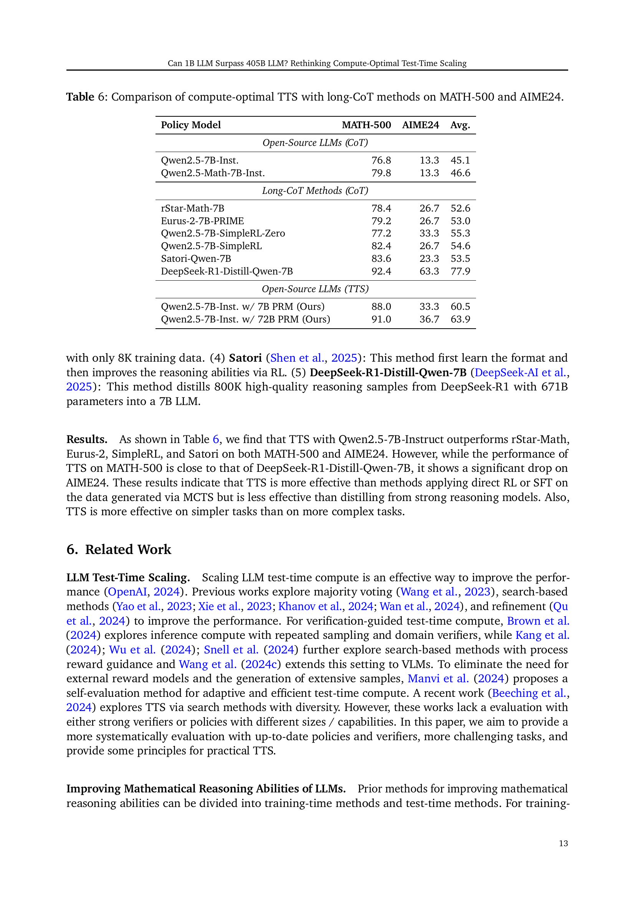

 


 2502.06703 
 Runze Liu et el. 
 
 🤗 2025-02-11 
 



↗ arXiv


↗ Hugging Face


### TL;DR



본 연구는 대규모 언어 모델(LLM)의 성능 향상을 위한 중요한 방법인 테스트 시간 확장(TTS)에 대한 연구입니다. 기존 연구는 TTS 전략에 영향을 미치는 요소들을 체계적으로 분석하지 못했기 때문에, TTS의 실용적인 활용에 제한이 있었습니다. 특히, 정책 모델, 프로세스 보상 모델(PRM), 문제의 난이도가 TTS의 효율성에 미치는 영향에 대한 명확한 이해가 부족했습니다. 

본 논문에서는 MATH-500 및 AIME24와 같은 어려운 수학 문제를 사용하여 광범위한 실험을 수행했습니다. 계산 최적화 TTS 전략을 통해 소규모 LLM이 대규모 LLM을 능가할 수 있음을 발견했습니다. 예를 들어, 1B LLM이 MATH-500에서 405B LLM을 능가하는 성능을 보였습니다. 이러한 결과는 TTS 전략을 각 문제와 모델의 특성에 맞춰 조정하는 것이 중요하며, LLM의 추론 능력 향상에 TTS가 유용한 방법임을 시사합니다.



#### Key Takeaways


 계산 최적화 TTS 전략은 정책 모델, PRM, 문제 난이도에 따라 크게 달라집니다. 



 적절한 TTS 전략을 사용하면 소규모 LLM이 대규모 LLM을 능가하는 성능을 달성할 수 있습니다. 



 보상 인식 계산 최적화 TTS 전략을 통해 더 효율적이고 일반적인 TTS 프레임워크를 구축할 수 있습니다. 


#### Why does it matter?
본 논문은 **테스트 시간 확장(TTS)** 전략을 통해 작은 언어 모델이 더 큰 모델을 능가할 수 있음을 보여줌으로써, LLM 연구에 중요한 시사점을 제공합니다. **계산 최적화 TTS 전략**의 중요성과 다양한 정책 모델, PRM, 문제 난이도에 따른 TTS 전략의 적응성에 대한 통찰력을 제공하여, LLM의 추론 성능 향상을 위한 새로운 가능성을 제시합니다.

------
#### Visual Insights

> 🔼 본 그림은 MATH-500 및 AIME24 데이터셋에서 소규모 언어 모델의 컴퓨팅 최적 TTS와 대규모 언어 모델의 CoT 성능을 비교한 것입니다. (a)와 (d)는 Llama-3.2-3B-Instruct 모델이 Llama-3.1-405B-Instruct 및 GPT-4o 모델을 MATH-500 및 AIME24 데이터셋에서 모두 능가함을 보여줍니다. (b)와 (e)는 DeepSeek-R1-Distill-1.5B 모델이 MATH-500 및 AIME24 데이터셋에서 o1-preview 모델을 능가하고 MATH-500 데이터셋에서 o1-mini 모델을 능가함을 보여줍니다. (c)와 (f)는 DeepSeek-R1-Distill-7B 모델이 MATH-500 및 AIME24 데이터셋에서 o1 모델을 능가하고 AIME24 데이터셋에서 DeepSeek-R1 모델을 능가함을 보여줍니다.  즉, 적절한 TTS 전략을 사용하면 소규모 언어 모델이 대규모 언어 모델보다 더 나은 성능을 낼 수 있음을 시사합니다.
> 

> 
read the caption

> Figure 1: Comparison between the performance of smaller LLMs compute-optimal TTS and that of larger LLMs CoT on MATH-500 and AIME24. (a) & (d) Llama-3.2-3B-Instruct surpasses Llama-3.1-405B-Instruct and GPT-4o on MATH-500 and AIME24; (b) & (e) DeepSeek-R1-Distill-1.5B outperforms o1-preview on MATH-500 and AIME24, and surpasses o1-mini on MATH-500; (c) & (f) DeepSeek-R1-Distill-7B beats o1 on MATH-500 and AIME24, and exceeds DeepSeek-R1 on AIME24.
> 


| Metric | Mistral-PRM-Data | Deepseek-PRM-Data |
|---|---|---|
| Average Token per Response | 236.9 | 333.1 |
| Average Token per Step | 46.6 | 58.4 |

> 🔼 이 표는 논문의 4.4절 'PRMs는 특정 응답 길이 또는 투표 방법에 대한 편향이 있습니까?'에서 RLHFlow PRM의 훈련 데이터 통계를 보여줍니다.  구체적으로 Mistral-PRM과 Deepseek-PRM 데이터셋에 대한 응답당 평균 토큰 수와 단계당 평균 토큰 수를 제시하여 각 PRM의 훈련 데이터 특징을 비교 분석합니다. 이 정보는 PRM이 생성하는 보상(reward)에 어떻게 영향을 미치는지, 그리고 TTS 전략의 성능에 어떻게 영향을 주는지 이해하는 데 도움을 줍니다.
> 

> 
read the caption

> Table 1: Statistics of training data of RLHFlow PRMs.
> 

### In-depth insights

#### Compute-Optimal TTS
본 논문에서 제시하는 '계산량 최적화 TTS(Compute-Optimal TTS)'는 **추론 단계에서의 추가적인 계산을 통해 대규모 언어 모델(LLM)의 성능을 향상시키는 방법**입니다.  기존 연구들은 TTS 전략의 효과에 대한 체계적인 분석이 부족했으나, 본 연구는 정책 모델, 프로세스 보상 모델(PRM), 문제 난이도 등의 요소들이 TTS 전략의 최적화에 미치는 영향을 심층적으로 분석합니다. 특히 **계산량 최적화 전략은 정책 모델, PRM, 문제 난이도에 따라 크게 달라진다**는 점을 강조하며, 이러한 요소들을 종합적으로 고려해야 실제 환경에서 효과적인 TTS 전략을 수립할 수 있다고 주장합니다.  **작은 LLM이 TTS 전략을 통해 큰 LLM을 능가할 수 있다**는 실험 결과는 매우 흥미롭습니다.  이는 단순히 모델 크기만을 고려하는 기존의 패러다임을 넘어, **계산 자원의 효율적인 배분**이 LLM 성능 향상에 중요하다는 것을 시사합니다.  이러한 연구 결과는 앞으로 LLM의 추론 성능을 향상시키는 새로운 방향을 제시할 것으로 기대됩니다.

#### Reward-Aware Scaling
본 논문에서 제안하는 **보상 인식 스케일링**은 기존의 단순 계산량 증가 방식에서 벗어나, **보상 함수(reward function)**를 활용하여 테스트 시간 확장(TTS) 전략의 효율성을 극대화하는 방법입니다.  **정책 모델, 보상 모델, 문제 난이도**에 따라 최적의 계산량 배분 전략이 달라지는 점을 고려하여, **문제별 최적화**를 추구합니다. 이는 단순히 계산량을 늘리는 것보다 **훨씬 효율적**이며, 작은 언어 모델이 큰 모델을 능가하는 결과를 보여줍니다.  기존 연구는 단일 보상 모델에 의존하는 한계가 있었지만, 보상 인식 스케일링은 다양한 보상 모델의 특성을 고려하여, **일반화 성능을 높였습니다**.  **보상 함수의 정확성**이 TTS 성능에 큰 영향을 미치므로, 보상 모델의 선택과 학습 전략에 대한 심층적인 연구가 필요합니다.  결과적으로 보상 인식 스케일링은 TTS의 실용성을 크게 높이고, **소규모 모델의 성능 한계를 극복**할 수 있는 혁신적인 전략으로 평가할 수 있습니다. 

#### Smaller Model Wins
"작은 모델의 승리"라는 제목에 대한 심층적인 분석 결과, **모델 크기가 성능을 결정하는 유일한 요소가 아님**을 알 수 있습니다.  본 연구는 **계산적으로 최적화된 테스트 시간 확장(TTS) 전략**을 통해, 작은 언어 모델이 더 큰 모델을 능가하는 사례를 제시합니다. 이는 **모델 크기보다 TTS 전략의 효율성이 더 중요함**을 시사합니다.  **정책 모델, PRM(Process Reward Model), 문제 난이도**에 따라 최적의 TTS 전략이 달라지므로, 단순히 모델 크기만 고려해서는 안 됩니다. **계산 자원의 효율적인 할당**이 성능 향상에 더 큰 영향을 미치는 핵심 요소이며, 작은 모델이라도 적절한 TTS 전략을 통해 큰 모델 이상의 성능을 발휘할 수 있음을 보여주는 중요한 결과입니다.  따라서, 향후 연구는 모델 크기보다는 **최적의 TTS 전략 개발에 초점**을 맞춰야 할 것입니다.

#### PRM Performance Issues
PRM 성능 문제는 주로 **과적용(Over-criticism)**, **오류 간과(Error Neglect)**, **오류 위치 편향(Error Localization Bias)**, **채점 편향(Scoring Bias)** 등 네 가지 주요 범주로 분류됩니다.  과적용은 수학적으로 정확한 단계에도 낮은 점수를 부여하여 잘못된 음성 결과를 초래합니다. 반면 오류 간과는 명백한 수학적 오류가 있는 단계에도 상대적으로 높은 점수를 부여하여 오류를 탐지하지 못합니다. 오류 위치 편향은 중요한 오류가 실제로 발생한 위치가 아닌 다른 중간 단계에 낮은 점수를 부여합니다.  마지막으로 채점 편향은 토큰 길이와 같은 훈련 편향으로 인해 동일하게 정확한 추론 단계에 점수 차이가 크게 발생하는 현상입니다. 이러한 문제는 OOD(out-of-distribution) 데이터셋과 훈련 데이터셋 모두에서 지속적으로 나타나며, 추론 과정을 왜곡하고 전반적인 성능을 저하시키며 PRM의 신뢰성을 떨어뜨립니다. 따라서 **향상된 모델 아키텍처와 훈련 절차**를 통해 이러한 편향을 해결하는 것이 PRM의 견고성과 해석력을 높이는 데 중요합니다.

#### Future of TTS Research
TTS 연구의 미래는 **모델 효율성과 일반화 능력 향상**에 초점을 맞출 것입니다.  현재의 TTS는 특정 과제와 모델에 대해 최적화되어 있지만, 다양한 과제와 모델에 적용 가능한 범용적인 TTS 전략 개발이 중요합니다.  **보상 모델의 정확성과 일반화 능력을 높이는 연구**가 필수적이며, 이를 위해 더욱 풍부하고 다양한 데이터셋을 활용한 훈련 및 보다 정교한 보상 설계가 필요합니다. 또한, **계산 비용을 최소화하면서 성능을 극대화하는 효율적인 계산 할당 전략**에 대한 연구가 활발해질 것으로 예상됩니다.  **소규모 언어 모델의 성능을 대규모 모델 수준으로 끌어올리는 연구**는 TTS 분야에서 특히 주목받을 것입니다.  이는 컴퓨팅 자원의 효율적인 활용과 더불어, 소규모 모델의 한계를 극복하는 새로운 TTS 기법 개발을 통해 가능해질 것입니다.  **다양한 과제 유형에 대한 적용성 확장** 또한 중요한 연구 방향입니다. 수학 문제 해결을 넘어, 코딩, 화학 등 다양한 영역으로 TTS의 적용 범위를 넓히는 연구가 활발해져야 합니다.  결론적으로, TTS 연구의 미래는 **더욱 효율적이고, 일반적이며, 다양한 영역에 적용 가능한 기술** 개발에 달려 있습니다.

### More visual insights

More on figures

> 🔼 그림 2는 본 논문에서 다루는 외부 TTS(Test-Time Scaling) 방법 세 가지를 비교한 그림입니다.  각 방법은 대규모 언어 모델의 추론 단계에서 추가적인 계산을 사용하여 성능을 향상시키는 방식입니다.  Best-of-N은 여러 응답을 생성하고 가장 좋은 응답을 선택하는 방법이고, Beam Search는 가능성이 높은 응답들을 일정 수만큼 유지하면서 탐색하는 방법이며, Diverse Verifier Tree Search는 다양한 응답들을 생성하고 평가하여 최적의 응답을 찾는 방법입니다. 그림은 각 방법의 작동 방식과 특징들을 시각적으로 보여줍니다.
> 

> 
read the caption

> Figure 2: Comparison of different external TTS methods.
> 

> 🔼 이 그림은 Qwen2.5-72B-Instruct 모델을 사용하여 MATH-500 데이터셋에 대해 Pass@1 정확도를 측정한 결과를 보여줍니다. Pass@1 정확도란, 모델이 문제에 대한 답을 처음 시도했을 때 정답을 맞출 확률을 의미합니다.  그림은 Pass@1 정확도를 다섯 개의 구간(bin)으로 나누어, 각 구간에 속하는 문제의 비율을 나타냅니다. 이를 통해 모델의 성능 분포를 자세히 파악할 수 있습니다. 예를 들어, 76.2%의 문제에 대해 Pass@1 정확도가 0.8 이상인 것으로 나타나 모델의 전반적인 성능이 매우 우수함을 알 수 있습니다.
> 

> 
read the caption

> Figure 3: Distribution of Pass@1 accuracy of Qwen2.5-72B-Instruct on MATH-500, divided into five bins.
> 

> 🔼 그림 4는 MATH-500 데이터셋에서 다양한 PRM(Process Reward Model)과 TTS(Test-Time Scaling) 전략을 사용하여 Llama-3.1-8B-Instruct 및 Qwen2.5-7B-Instruct 모델의 성능을 비교 분석한 결과를 보여줍니다.  각 모델에 대해 Best-of-N, Beam Search, Diverse Verifier Tree Search와 같은 여러 TTS 전략을 적용하여 실험을 진행하였으며,  Math-Shepherd-PRM-7B, RLHFlow-PRM-Mistral-8B, RLHFlow-PRM-Deepseek-8B, Skywork-PRM-1.5B, Skywork-PRM-7B, Qwen2.5-Math-PRM-7B, Qwen2.5-Math-PRM-72B 등 다양한 PRM을 사용하여 실험을 수행했습니다.  그림은 각 PRM과 TTS 전략 조합에 따른 Pass@k 정확도를 나타내는 그래프를 보여주어, 어떤 PRM과 TTS 전략 조합이 각 모델에 가장 효과적인지 비교하고 분석하는 데 도움을 줍니다.
> 

> 
read the caption

> Figure 4: Performance of Llama-3.1-8B-Instruct and Qwen2.5-7B-Instruct on MATH-500 with different PRMs and TTS strategies.
> 

> 🔼 그림 5는 Llama-3.1-8B-Instruct와 Qwen2.5-7B-Instruct 모델을 사용하여 AIME24 데이터셋에서 다양한 PRM(Process Reward Model)과 TTS(Test-Time Scaling) 전략을 적용했을 때의 성능을 보여줍니다.  각 그래프는 특정 PRM과 TTS 전략 조합에 따른 Pass@k 정확도를 보여주며,  다양한 계산량(compute budget)에 따른 성능 변화를 나타냅니다. 이를 통해 어떤 PRM과 TTS 전략 조합이 각 모델에 가장 적합한지, 그리고 계산량 증가에 따른 성능 향상이 어떻게 달라지는지를 비교 분석할 수 있습니다.  즉, AIME24 문제 풀이에 있어 모델, PRM, TTS 전략 선택이 성능에 미치는 영향을 종합적으로 보여주는 그림입니다.
> 

> 
read the caption

> Figure 5: Performance of Llama-3.1-8B-Instruct and Qwen2.5-7B-Instruct on AIME24 with different PRMs and TTS strategies.
> 

> 🔼 이 그림은 MATH 데이터셋에서 다양한 PRM(Process Reward Model)의 매개변수 수와 TTS(Test-Time Scaling) 성능 간의 관계를 보여줍니다.  각 원의 크기는 PRM의 매개변수 수를 나타내고, 곡선은 이 데이터를 기반으로 추정된 함수를 나타냅니다.  이 그림은 PRM의 프로세스 감독 능력이 TTS 성능과 밀접한 관련이 있음을 시각적으로 보여줍니다.  즉, PRM이 문제 해결 과정을 얼마나 잘 감독할 수 있는지에 따라 TTS의 성능이 달라진다는 것을 의미합니다.  PRM의 매개변수가 많을수록 프로세스 감독 능력이 높고 TTS 성능도 향상되는 경향을 보입니다. 
> 

> 
read the caption

> Figure 6: The relationship between TTS performance and process supervision abilities of different PRMs on MATH, where the size of each circle represents the number of parameters of the PRM and the curve represents the fitted function.
> 

> 🔼 그림 7은 MATH-500 데이터셋에서 매개변수 크기가 0.5B에서 72B까지 다양한 정책 모델들에 대한 TTS(Test-Time Scaling) 성능을 보여줍니다.  다양한 스케일링 방법(Best-of-N, Beam Search, DVTS)을 사용하여 얻은 Pass@k 정확도를 비교 분석합니다.  각 모델의 크기에 따른 최적의 TTS 전략과 성능 향상 정도를 시각적으로 나타내어, 작은 모델이 적절한 TTS 전략을 통해 큰 모델과 비교했을 때 성능이 얼마나 향상될 수 있는지 보여줍니다.
> 

> 
read the caption

> Figure 7: TTS performance of policy models with parameters from 0.5B to 72B on MATH-500 with different scaling methods.
> 

> 🔼 그림 8은 세 가지 크기의 Llama 언어 모델을 세 가지 난이도(쉬움, 중간, 어려움)의 MATH-500 수학 문제에 적용했을 때, Test-Time Scaling(TTS) 전략을 사용한 성능을 보여줍니다.  각 난이도별로 세 가지 TTS 전략(Majority Voting, Best-of-N, Beam Search, DVTS)의 성능이 비교됩니다.  이를 통해 문제 난이도에 따른 최적의 TTS 전략과 모델 크기의 영향을 분석할 수 있습니다.  쉬운 문제에서는 Best-of-N이 효과적이고, 어려운 문제에서는 Beam Search가 효과적인 것을 확인할 수 있습니다.
> 

> 
read the caption

> Figure 8: TTS performance of three Llama policy models on MATH-500 with three difficulty levels.
> 

> 🔼 이 그림은 MATH-500 데이터셋의 세 가지 난이도(쉬움, 중간, 어려움)에 대해 세 가지 Llama 정책 모델의 TTS 성능을 보여줍니다. 각 난이도 레벨에서 세 가지 TTS 전략(Best-of-N, Beam Search, DVTS)의 성능을 비교하여 어떤 정책 모델과 TTS 전략 조합이 특정 난이도 레벨에서 가장 효과적인지 보여줍니다.  각 모델의 성능은 Pass@k 지표를 사용하여 평가되며, compute budget의 변화에 따른 성능 변화가 그래프에 나타나 있습니다.
> 

> 
read the caption

> Figure 9: TTS performance of three Llama policy models on MATH-500 with different difficulty levels.
> 

> 🔼 그림 10은 다양한 정책 모델, PRM(Process Reward Model) 및 스케일링 전략을 사용하여 MATH-500 데이터셋에서 테스트 시간 스케일링(TTS)의 성능을 보여줍니다.  x축은 사용된 계산량(compute budget), y축은 Pass@k 정확도를 나타냅니다.  각 선은 다른 정책 모델을 나타내며, 서로 다른 색상은 서로 다른 PRM을 나타냅니다.  점선은 다양한 스케일링 전략(Best-of-N, Beam Search, DVTS)을 나타냅니다. 이 그림을 통해 다양한 정책 모델, PRM, 그리고 스케일링 전략이 MATH-500 문제 해결에 미치는 영향을 비교 분석할 수 있습니다. 특히, 계산량 증가에 따른 성능 향상 정도와 최적의 스케일링 전략을 파악하는 데 도움이 됩니다.
> 

> 
read the caption

> Figure 10: TTS performance of different policy models on MATH-500 with different PRMs and scaling strategies.
> 

> 🔼 그림 11은 다양한 정책 모델, PRM(Process Reward Model), 그리고 확장 전략을 사용하여 AIME24 데이터셋에서 TTS(Test-Time Scaling) 성능을 보여줍니다.  각 그래프는 특정 정책 모델과 PRM 조합에 대한 Pass@k (k는 상위 k개의 정답 비율) 점수를 다양한 확장 전략(Best-of-N, Beam Search, DVTS)에 따른 계산 비용(토큰 수)의 함수로 나타냅니다. 이를 통해 서로 다른 모델과 전략 조합에 따른 성능 변화와 계산 비용 효율성을 비교 분석할 수 있습니다.  각 정책 모델의 크기와 PRM의 종류에 따라 어떤 확장 전략이 가장 효율적인지 확인할 수 있습니다.
> 

> 
read the caption

> Figure 11: TTS performance of different policy models on AIME24 with different PRMs and scaling strategies.
> 

> 🔼 그림 12는 RLHFlow-Mistral-PRM-8B와 RLHFlow-Deepseek-PRM-8B를 사용한 빔 서치의 간단한 예시를 보여줍니다. 두 가지 다른 PRM(Process Reward Model)을 사용하여 동일한 문제에 대한 빔 서치의 결과를 비교하여 각 PRM의 강점과 약점을 보여줍니다.  각 단계의 점수(score)를 보여주어 PRM이 어떻게 각 단계를 평가하는지 보여주고, 최종 답변(answer)에 이르는 과정을 보여줍니다. 이를 통해 PRM이 추론 과정에 어떤 영향을 미치는지, 그리고 어떤 PRM이 주어진 문제에 더 적합한지에 대한 통찰력을 제공합니다.
> 

> 
read the caption

> Figure 12: Toy case of beam search with RLHFlow-Mistral-PRM-8B and RLHFlow-Deepseek-PRM-8B.
> 

> 🔼 그림 13은 과도한 비판(Over-Criticism) 현상을 보여주는 TTS 사례를 보여줍니다.  수학적으로 정확한 단계에도 불구하고 PRM(Process Reward Model)이 낮은 점수를 부여하여 잘못된 음성 신호를 생성하는 현상을 보여줍니다.  이는 PRM이 수학적 정확성보다는 다른 요소에 과도하게 집중하여 발생하는 문제를 시각적으로 보여줍니다. 이러한 과도한 비판은 모델의 추론 과정에 부정적인 영향을 미치고, 최적의 답을 찾는 것을 방해할 수 있습니다.
> 

> 
read the caption

> Figure 13: TTS case of Over-Criticism.
> 

> 🔼 그림 14는 TTS(Test-Time Scaling) 전략을 사용했을 때 발생하는 '오류 간과(Error Neglect)' 현상을 보여주는 사례입니다.  문제는 삼각형의 각도와 변의 길이가 주어진 상황에서 특정 변의 길이를 구하는 것입니다. 모델은 삼각함수를 사용하여 문제를 풀지만, 중간 과정에서 명백한 수학적 오류를 저지릅니다. 하지만 PRM(Process Reward Model)은 이러한 오류를 제대로 감지하지 못하고 높은 점수를 부여합니다. 이는 PRM이 수학적 정확성보다는 다른 요소(예: 응답 길이, 특정 단어 사용)에 치우쳐져 있음을 시사합니다. 따라서, 모델은 잘못된 답을 도출하지만, PRM은 이를 정확한 것으로 평가합니다.  이는 Compute-Optimal TTS 전략을 사용할 때, PRM의 신뢰성이 떨어져 잘못된 결과를 초래할 수 있음을 보여주는 중요한 사례입니다.
> 

> 
read the caption

> Figure 14: TTS case of Error Neglect.
> 

> 🔼 그림 15는 TTS(Test-Time Scaling) 전략을 사용했을 때 발생하는 '오류 무시(Error Neglect)' 현상의 한 사례를 보여줍니다.  문제는 그림에 주어진 삼각형에서 sin D = 0.7일 때 DE의 길이를 구하는 것입니다. 모델은 삼각함수의 정의를 올바르게 이해하고 방정식을 설정하지만,  DE의 길이를 계산하는 과정에서 오류를 범합니다.  하지만, PRM(Process Reward Model)은 이러한 오류를 제대로 감지하지 못하고 높은 점수를 부여합니다. 이는 PRM이 수학적 오류를 식별하는 데 어려움을 겪거나, 중간 과정에서의 작은 실수에도 불구하고 최종 답변이 맞는 경우 점수를 높게 매기는 편향을 보여주는 사례입니다.  즉, 모델이 중간 단계에서 오류를 범했음에도 불구하고 PRM이 이를 무시하고 높은 점수를 주어, 최종적인 TTS 성능에 영향을 미치는 현상을 보여주는 것입니다.
> 

> 
read the caption

> Figure 15: TTS case of Error Neglect.
> 

> 🔼 그림 16은 TTS(Test-Time Scaling) 과정에서 PRM(Process Reward Model)이 오류를 정확하게 찾지 못하는 오류 국재화 편향 현상을 보여주는 사례입니다.  문제 풀이 과정의 중간 단계에서 실제 오류가 발생한 위치가 아닌 다른 단계에 낮은 점수를 부여하는 현상을 보여줍니다.  이는 PRM이 오류를 정확하게 식별하고 점수를 매기는 능력에 한계가 있음을 시사합니다. 이는  모델의 성능을 저하시키고 신뢰성을 떨어뜨릴 수 있습니다. 따라서  PRM의 강건성과 해석력을 향상시키기 위해 모델 아키텍처와 학습 과정을 개선하는 것이 필요합니다.
> 

> 
read the caption

> Figure 16: TTS case of Error Localization Bias.
> 

> 🔼 그림 17은 점수 매기기 편향 현상을 보여주는 TTS 사례를 보여줍니다.  이 그림에서는 PRM(Process Reward Model)이 추론 과정의 중간 단계에 대해 일관성 없는 점수를 부여하는 현상이 나타납니다.  특히, 답변의 토큰 길이에 따라 점수가 과도하게 영향을 받는 경향이 있습니다.  이러한 점수 매기기 편향은 추론 과정의 정확성에 영향을 미치며, PRM의 신뢰성을 떨어뜨립니다. 따라서, PRM의 강건성과 해석력을 높이기 위해 모델 아키텍처와 학습 절차를 개선하는 것이 필요합니다.
> 

> 
read the caption

> Figure 17: TTS case of Scoring Bias.
> 

> 🔼 그림 18은 점수 매기기 편향의 TTS 사례를 보여줍니다. 이 그림은 동일한 수의 금화를 가진 일곱 개의 금화 주머니와 53개의 금화가 있는 추가 주머니에 대한 문제를 보여줍니다. 모든 여덟 개의 주머니가 동일한 수의 금화를 가지도록 금화를 재분배하는 문제입니다.  문제 풀이의 각 단계에 대한 점수 매기기가 편향되어 있어 정확한 추론 단계에도 낮은 점수를 부여하거나, 반대로 오류가 있는 단계에도 높은 점수를 부여하는 현상을 보여줍니다. 이는 PRM(Process Reward Model)의 신뢰성과 해석 가능성을 저하시킬 수 있는 문제점을 보여주는 예시입니다.
> 

> 
read the caption

> Figure 18: TTS case of Scoring Bias.
> 

More on tables


| Method | Skywork-PRM-7B | Qwen2.5-Math-PRM-7B |
|---|---|---|
| *Majority Vote* | 86.8 | 87.6 |
| *PRM-Min-Max* | 83.0 | 87.4 |
| *PRM-Min-Vote* | 86.6 | 87.6 |
| *PRM-Last-Max* | 84.4 | 87.6 |
| *PRM-Last-Vote* | 87.0 | 87.6 |
| *PRM-Avg-Max* | 85.8 | 87.8 |
| *PRM-Avg-Vote* | 86.8 | 87.6 |
> 🔼 표 2는 MATH-500 데이터셋에서 다양한 투표 방법을 사용한 TTS(Test-Time Scaling)의 성능을 보여줍니다.  다양한 정책 모델과 PRM(Process Reward Model)을 사용한 TTS 전략의 성능을 Pass@k 지표를 통해 비교 분석합니다.  각 투표 방법(Majority Vote, PRM-Min-Max, PRM-Min-Vote, PRM-Last-Max, PRM-Last-Vote, PRM-Avg-Max, PRM-Avg-Vote)에 따른 정확도를 비교하여 최적의 투표 전략을 제시하는 데 도움이 되는 정보를 제공합니다.
> 

> 
read the caption

> Table 2: Performance of TTS with different voting methods on MATH-500.
> 


| Policy Model | MATH-500 | AIME24 | Avg. |
|---|---|---|---| 
| *Proprietary LLMs (CoT)* |  |  |  |
| GPT-4o | 74.6 | 9.3 | 42.0 |
| o1-preview | 85.5 | 44.6 | 65.1 |
| o1-mini | 90.0 | 63.6 | 76.8 |
| o1 | 94.8 | 79.2 | 87.0 |
| *Open-Source LLMs (CoT)* |  |  |  |
| Llama-3.1-70B-Inst. | 65.2 | 16.7 | 41.0 |
| Llama-3.1-405B-Inst. | 71.4 | 23.3 | 47.4 |
| QwQ-32B-Preview | 90.6 | 50.0 | 70.3 |
| DeepSeek-R1 | 97.3 | 79.8 | 88.6 |
| *Open-Source LLMs (TTS)* |  |  |  |
| Llama-3.2-1B-Inst. | 66.2 | 16.7 | 41.5 |
| Llama-3.2-1B-Inst. ($N=512$) | 72.2 | 10.0 | 41.1 |
| Llama-3.2-3B-Inst. | 75.6 | 30.0 | 52.8 |
| Qwen2.5-0.5B-Inst. | 76.4 | 10.0 | 43.2 |
| Qwen2.5-1.5B-Inst. | 81.8 | 20.0 | 50.9 |
| DeepSeek-R1-Distill-Qwen-1.5B | 91.6 | 63.3 | 77.5 |
| DeepSeek-R1-Distill-Qwen-7B | 95.2 | 83.3 | 89.3 |
> 🔼 본 표는 MATH-500 및 AIME24 데이터셋에서 소규모 정책 모델에 대해 계산 최적화 TTS 전략을 사용한 결과와 최첨단 추론 LLM의 CoT(사고 과정) 결과를 비교 분석한 것입니다.  계산 최적화 TTS 전략을 통해 소규모 언어 모델이 대규모 언어 모델보다 우수한 성능을 보이는지, 그리고 이러한 전략을 통해 기존의 CoT 기반 방법보다 성능이 얼마나 향상되는지 보여줍니다.  구체적으로는 MATH-500 및 AIME24 데이터셋에서 다양한 크기의 소규모 모델과 대규모 모델(GPT-4, o1, DeepSeek-R1 등)의 성능을 비교하고, 평균 정확도를 통해 소규모 모델의 효율성을 보여줍니다.
> 

> 
read the caption

> Table 3: Comparison of small policy models (compute-optimal TTS) with frontier reasoning LLMs (CoT) on MATH-500 and AIME24.
> 


| Policy Model | Pre-training FLOPS | Inference FLOPS | Total FLOPS. |
|---|---|---|---|
| Llama-3.2-3B-Inst. | 1.62 × 1023 | 3.07 × 1017 | 1.62 × 1023 |
| Llama-3.1-405B-Inst. | 3.65 × 1025 | 4.25 × 1017 | 3.65 × 1025 |
| DeepSeek-R1-Distill-7B | 7.56 × 1023 | 8.15 × 1017 | 7.56 × 1023 |
| DeepSeek-R1 | 5.96 × 1025 | 4.03 × 1018 | 5.96 × 1025 |
> 🔼 표 4는 계산 최적화 테스트 시간 조정(TTS)을 사용하는 소규모 정책 모델과 대조적으로, 기존의 사고 과정(CoT)을 사용하는 대규모 언어 모델의 FLOPS(초당 부동 소수점 연산 수)를 비교합니다.  전체 FLOPS는 사전 훈련 및 추론 FLOPS의 합계입니다.  이 표는 소규모 모델이 계산 최적화 TTS 전략을 통해 대규모 모델보다 훨씬 적은 계산으로도 유사하거나 더 나은 성능을 달성할 수 있음을 보여줍니다.
> 

> 
read the caption

> Table 4: FLOPS comparison between smaller policy models (compute-optimal TTS) and larger ones (CoT).
> 


| Policy Model | CoT | Major. | Compute-Optimal TTS | Performance Gain | Efficiency Gain |
|---|---|---|---|---|---| 
| Llama-3.2-1B-Inst. | 26.0 | 39.0 | 66.2 | 154.6% | >256.0x |
| Llama-3.2-3B-Inst. | 41.4 | 58.4 | 78.2 | 88.9% | 14.1x |
| Llama-3.1-8B-Inst. | 49.8 | 66.4 | 80.6 | 61.8% | 43.9x |
| Qwen2.5-0.5B-Inst. | 31.6 | 47.2 | 76.4 | 141.8% | >64.0x |
| Qwen2.5-1.5B-Inst. | 54.4 | 68.4 | 85.6 | 57.4% | >256.0x |
| Qwen2.5-3B-Inst. | 64.0 | 77.0 | 87.6 | 36.9% | 58.4x |
| Qwen2.5-7B-Inst. | 76.8 | 83.6 | 91.0 | 18.5% | 35.9x |
| Qwen2.5-14B-Inst. | 80.2 | 85.6 | 91.0 | 13.5% | 51.4x |
| Qwen2.5-32B-Inst. | 82.4 | 87.0 | 90.6 | 10.0% | 0.8x |
| Qwen2.5-72B-Inst. | 83.8 | 87.2 | 91.8 | 9.5% | 12.9x |
> 🔼 표 5는 MATH-500 데이터셋에서 다양한 정책 모델에 대해 계산 최적화 TTS, CoT(Chain-of-Thought), 그리고 다수결 투표 방식의 성능을 비교 분석한 표입니다.  계산 최적화 TTS는 추론 단계에서 추가적인 계산을 할당하여 성능을 향상시키는 기법이고, CoT는 모델이 문제 해결 과정을 단계별로 설명하도록 유도하는 기법이며, 다수결 투표는 여러 모델의 예측 결과 중 가장 많은 득표를 얻은 결과를 선택하는 기법입니다. 표에는 각 기법의 정확도(Pass@k)와  CoT 및 다수결 투표 대비 성능 향상률, 효율성 향상률이 제시되어 있어, 계산 최적화 TTS 전략의 효과를 다양한 정책 모델 크기에 따라 정량적으로 비교할 수 있도록 합니다.
> 

> 
read the caption

> Table 5: Comparison of compute-optimal TTS, CoT, and majority voting with different policy models on MATH-500.
> 


| Policy Model | MATH-500 | AIME24 | Avg. |
|---|---|---|---| 
| *Open-Source LLMs (CoT)* |  |  |  |
| Qwen2.5-7B-Inst. | 76.8 | 13.3 | 45.1 |
| Qwen2.5-Math-7B-Inst. | 79.8 | 13.3 | 46.6 |
| *Long-CoT Methods (CoT)* |  |  |  |
| rStar-Math-7B | 78.4 | 26.7 | 52.6 |
| Eurus-2-7B-PRIME | 79.2 | 26.7 | 53.0 |
| Qwen2.5-7B-SimpleRL-Zero | 77.2 | 33.3 | 55.3 |
| Qwen2.5-7B-SimpleRL | 82.4 | 26.7 | 54.6 |
| Satori-Qwen-7B | 83.6 | 23.3 | 53.5 |
| DeepSeek-R1-Distill-Qwen-7B | 92.4 | 63.3 | 77.9 |
| *Open-Source LLMs (TTS)* |  |  |  |
| Qwen2.5-7B-Inst. w/ 7B PRM (Ours) | 88.0 | 33.3 | 60.5 |
| Qwen2.5-7B-Inst. w/ 72B PRM (Ours) | 91.0 | 36.7 | 63.9 |
> 🔼 표 6은 MATH-500 및 AIME24 데이터셋에서 계산 최적화 TTS 전략과 장기적인 사고 연쇄(long-CoT) 방법의 성능을 비교한 표입니다.  계산 최적화 TTS 전략은 추론 단계에서 추가적인 계산을 사용하여 언어 모델의 성능을 향상시키는 방법이며, 장기적인 사고 연쇄 방법은 추론 과정에서 더 많은 단계를 거쳐 문제 해결 능력을 높이는 방법입니다. 표에는 다양한 정책 모델에 대한 두 방법의 정확도(Pass@k)가 제시되어 있으며, 각 데이터셋에 대한 평균 성능도 비교하고 있습니다.
> 

> 
read the caption

> Table 6: Comparison of compute-optimal TTS with long-CoT methods on MATH-500 and AIME24.
> 

### Full paper



